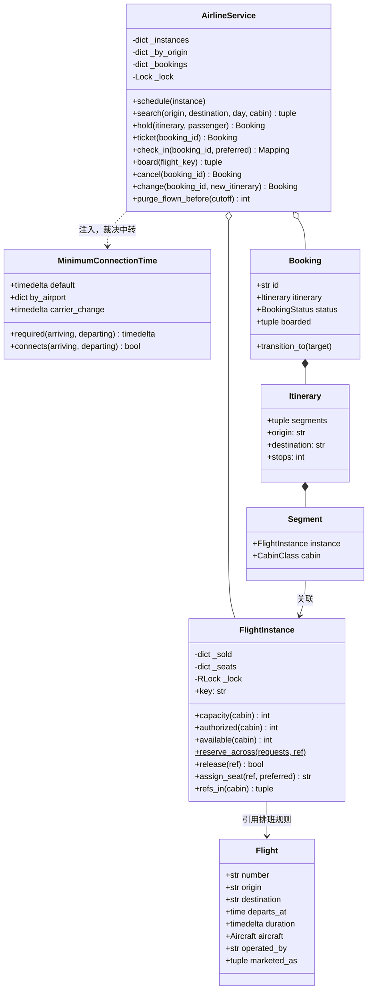

# 设计题解：航班管理（Airline Management）

## 题目与澄清

面试官的开场："设计一个航班管理系统。用户搜某天从 A 到 B 的机票，可能要中转，选舱位下单，之后
能值机、能登机，也能取消或改签。"

这道题和[[solution-hotel-booking|设计题解：酒店预订（Hotel Booking）]]一样是"一份有限资源不能卖两次"，
但比酒店多出一层酒店没有的复杂度：一次购买可能横跨**两个独立的库存对象**（两段航班），而且这两个
对象必须同生共死——中转行程订到一半、另一段没票，这张票就是废纸。这道题也是
[[structure.state-machines|状态机（State Machines）]]的经典场景：一张票从占座到登机要走过好几个
状态，合法的路径并不是一条直线。

值得当场问出来的澄清：

- **"航班"指的是排班表上的一行，还是某一天飞的那一班？** 这是全题第一个、也是决定后面一切的问题。
  答案是**两者都要建**，而且必须是两个类。下面"三层模型"一节专门论证它。
- **一次购买能不能跨两段飞机？** 能，这是这道题区别于电影票、酒店的地方：中转行程要求"要么两段都
  订上，要么一段都不订"，这不是一个库存对象内部的事，而是**跨对象的原子性**。
- **中转要不要判定衔接时间？** 要。多短算太短，这条规则挂在哪个对象上，是本题一个容易被问到但
  容易答错的细节。
- **超售（overbooking）要不要做？** 航空业几乎全行业都超售，这不是 bug 而是对冲"爽约"（no-show）
  的常规政策。问清楚之后它就该是一个可插拔的规则，而不是散在库存代码里的魔法数字，并且要能回答
  "卖超了，登机口谁被拒载"。
- **值机和选座是不是同一件事？** 不是。选座是值机的一部分动作，值机本身是把订单从"已出票"推进到
  "可以登机"的状态迁移，选不到座位不等于值机失败——超售卖出去的那张票本来就可能没有物理座位。
- **改签算不算取消再重订？** 从旅客视角说"对"，从实现视角说**不完全对**：如果真的先取消再重订，
  两步之间旅客会有一瞬间"什么票都没有"，而且共用的那一段（比如中转的第一段没变）会被无意义地
  放掉又占上，白白丢掉已经选好的座位。
- **代码共享（codeshare）算不算另一趟航班？** 不算。同一架飞机、同一份库存，只是在另一家航司的
  目录里叫另一个号——这是本题的一个加分项：能不能不为它专门建一张"库存表"。

**范围之外**：不接真实支付与行李、不做机组排班与飞机维护窗口、不做多币种与税费、不做真实持久化，
候补名单（standby list）只在"扩展与追问"里讨论怎么加，不写进核心实现。

## 需求与分级

- **第 1 关（核心流程，约 20 分钟）**：机型与座位表、航班（排班规则）与航班实例（某天那一班）的
  区分、按舱位查库存、订一张单段行程的票。对应 `Aircraft`、`Flight`、`FlightInstance`、`Booking`、
  `AirlineService.schedule/search/hold`。
- **第 2 关（跨航段与中转，约 15 分钟）**：`Segment` 拼成 `Itinerary`，中转行程要判定
  `MinimumConnectionTime`（最短衔接时间），订座对整条行程原子——这一关要当场讲清楚"两把锁怎么
  一起拿、还不死锁"。对应 `Itinerary`、`MinimumConnectionTime`、`FlightInstance.reserve_across`。
- **第 3 关（生命周期与并发，约 15 分钟）**：HELD → TICKETED → CHECKED_IN → BOARDED 的显式状态机，
  值机选座、登机口结算超售的拒载规则、取消与退款政策、改签。用真线程测同一班飞机被抢购的最后
  几个座位。对应 `BookingStatus`、`AirlineService.ticket/check_in/board/cancel/change`。
- **第 4 关（不碰订座代码的新需求，选做）**：代码共享航班（同一份库存挂两个航班号）、候补名单。
  验收标准是这两样加进来**不改 `hold`/`reserve_across` 一行**。对应 `Flight.marketed_as`、
  `AirlineService.schedule` 里的别名登记。

## 核心对象与职责

### 为什么"航班"必须拆成两个类

面试者最常见的第一反应是造一个 `Flight` 类，属性里塞一个 `available_seats` 或 `Seat.status`，
然后就去写订票逻辑。这样写在单段、单日期的场景下能跑通，但一旦有人问"MU5100 周一满员、周二还有
票，你怎么表示"，这套模型立刻答不上来——座位状态挂在航班对象上，而航班对象本身**不知道今天是
哪天**。

正确的做法是拆成两层：

- `Flight`：排班表上的一行——航班号、起降机场、起飞钟点、飞行时长、机型、承运人。它描述的是
  "MU5100 每天 08:00 从上海飞北京"这条**规则**，不涉及任何一天的库存，因此可以被安全地共享、
  复用，一次建模服务全年每一天的这一班。
- `FlightInstance`：把这条规则钉到某一个具体日期上，"7 月 1 日那一班 MU5100"。库存、座位图、
  一把私有锁全部长在它身上，因为**"这一天这一班还剩几个座"才是真正会变化、需要被保护的状态**。

`FlightInstance.key` 是 `航班号@日期`，这个组合键本身就说明了这层拆分的意义：同一个航班号在
不同的 key 下是完全独立的库存对象，互不影响。

### 为什么"库存"记的是名单，不是座位表

`FlightInstance` 用两张表分别回答两个不同的问题：`_sold`（订单号 → 舱位）回答"这一舱卖给了
谁"，`_seats`（座位号 → 订单号）回答"哪把椅子归谁"。这两件事**不是一件事**：超售卖出去的票在
`_sold` 里有记录，在 `_seats` 里可能完全没有——它还没有一把物理椅子，要等到值机才知道有没有。
如果只用一张"座位号 → 状态"的表（常见的 Java 式写法），超售这条业务事实根本无法表达：座位数是
物理上限，而"卖出去几张"必须能够**超过**这个上限。

### 职责表

| 类 | 单一职责 | 它守的不变量 |
|---|---|---|
| `Aircraft` | 一种客舱座位布局 | 座位表在构造后不变；被排班表上所有用它的航班共用 |
| `Flight` | 排班表上不带日期的一行 | 无可变状态；纯数据 |
| `FlightInstance` | 某一天那一班的库存、座位图、锁 | 任一舱名单人数 ≤ 座位数 + 超售额度 |
| `Segment` | 旅客在某一班上占的一个舱位 | 不持有座位号——座位号会随改签作废 |
| `Itinerary` | 若干航段的有序组合，订座的原子单位 | 不判定中转是否合法——那是 `MinimumConnectionTime` 的职责 |
| `MinimumConnectionTime` | 中转是否成立的裁决规则 | 挂在机场，不挂在航班 |
| `Booking` | 一张订单 + 它的生命周期 | 状态只能按转移表迁移 |
| `AirlineService` | 门面：目录、订座、值机、登机、取消、改签、清理 | 自己不持有任何座位状态 |

`AirlineService` 持有 `FlightInstance` 目录和订单表，`FlightInstance` 持有自己的库存——这是
**组合**：`FlightInstance` 的生命周期由目录管理（`purge_flown_before` 能把它整个摘掉）。
`Booking` 持有一份 `Itinerary`，`Itinerary` 引用具体的 `FlightInstance`，这是**关联**：一个
`FlightInstance` 会被很多订单同时引用，删除一张订单不影响航班实例本身。



## 关键设计决策

### 决策一：航班要不要按日期拆成两个对象？

**问题**：库存状态（还剩几个座、谁占着）应该挂在哪个对象上？

**选项 A：只建一个 `Flight` 类，座位状态挂在座位或航班本身。** 这是流传最广的参照实现
（见「来源与延伸」）的做法：`Flight.available_seats` 是一张座位列表，`Seat.status` 直接记
`AVAILABLE`/`RESERVED`/`OCCUPIED`。写起来最省事，但它悄悄假设了"一趟航班只飞一次"——一旦要
表示"MU5100 周一满、周二还有票"，就要么给航班加一个日期字段然后每天新建一个 `Flight` 对象
（那"排班规则"这份不变的信息就被复制了 365 份，改一次机型要改 365 处），要么在座位状态里再加一维
日期（那 `Seat` 就不再是"一把物理椅子"，而变成了"这把椅子在某一天的某种状态"，类的语义直接混乱）。

**选项 B：拆成 `Flight`（规则）+ `FlightInstance`（某天的实例）。** 本设计的选择。`Flight`
永远只有一份，被排班表上"每天飞一次"的所有实例共享；`FlightInstance` 才持有会变的状态。新增
一天的航班就是 `FlightInstance(flight, 明天)`，不涉及排班信息的任何复制。

**选择 B**，理由不是"更面向对象"这种空话，而是**可变状态和不变数据的生命周期完全不同**：航班号、
机型、起降机场几乎不会变，而"今天卖出去几张票"每分钟都在变。把两种生命周期的数据放进一个对象，
要么让不变的数据跟着变化的数据一起被复制，要么让可变状态失去清晰的归属。这也是本文和
[[solution-hotel-booking|酒店预订]]那篇"房间 vs 库存"的拆分同一条纪律，只是这里的时间维度是
"日期"而不是"晚"。

### 决策二：跨航段的原子订座怎么保证，还不死锁？

**问题**：一条两段行程要在两个 `FlightInstance` 上同时占位，一段失败另一段也不能生效。

**错的写法**：逐段调用 `reserve`，第二段失败就手动 `release` 第一段。

```python
# 错的：两次独立的临界区之间，别人能插进来把第一段也订走
instance1.reserve(cabin, ref)
try:
    instance2.reserve(cabin, ref)
except NoSeatsAvailableError:
    instance1.release(ref)   # 回滚路径，容易漏写、容易漏测
    raise
```

这段代码的问题不只是啰嗦：`instance1.reserve` 成功之后、`instance2.reserve` 抛异常之前，这条
临界区**已经关闭过一次**，另一个线程完全可能在这个窗口里也订到 `instance1` 的最后一个座位，
然后你的回滚代码在毫无察觉的情况下把它的座位也放跑了。

**本设计的写法**：`FlightInstance.reserve_across` 是一个类方法，按 `key`（`航班号@日期`）把
所有涉及的实例**排序**，用 `ExitStack` 依次进入每一把锁，在锁**全部持有**之后再做"先全查、
再全写"的两段式检查：

```python
ordered = sorted(requests, key=lambda request: request[0].key)
with ExitStack() as stack:
    for instance, _ in ordered:
        stack.enter_context(instance._lock)
    short = [instance.key for instance, cabin in ordered
             if instance._sold.get(ref) is not cabin and instance._free(cabin) <= 0]
    if short:
        raise NoSeatsAvailableError(f"no {ref} seat left on {short}")
    for instance, cabin in ordered:
        ...
```

固定的加锁顺序是这里唯一重要的纪律：两个线程分别订"SHA→PEK→HRB"和"HRB→PEK→SHA"这样共用中转
枢纽航班的行程时，如果各自按"先订第一段再订第二段"的自然顺序加锁，就可能一个拿到 A 等 B、另一个
拿到 B 等 A，经典的锁顺序死锁。按 `key` 排序之后，两个线程无论怎么构造行程，最终都会以**同一个
全局顺序**申请锁，环形等待从条件上就不存在。

**没有选**两阶段提交或者补偿事务（Saga）——那是分布式系统里"库存分散在不同进程/机器"时才需要
的重量级方案。这里所有 `FlightInstance` 都活在同一个进程里，Python 的 `threading.Lock` 加固定
顺序就能给出严格的原子性，上分布式协议只会多一层没有必要的复杂度。

### 决策三：超售是政策，拒载代价该在哪一步兑现？

**问题**：卖出的票数可以超过实际座位数，那"超出去的那部分"最终由谁承担代价？

超售不是本设计里的 bug，是注入的 `OverbookingPolicy`：

```python
def percent_overbooking(by_cabin: Mapping[CabinClass, int]) -> OverbookingPolicy:
    def extra(cabin: CabinClass, instance: "FlightInstance") -> int:
        return instance.capacity(cabin) * by_cabin.get(cabin, 0) // 100
    return extra
```

真正值得设计的是**代价落在哪一步**。三个候选时机：订座时、值机时、登机口。

- **订座时就拒绝"多余"的订单**：等于没有超售，`authorized` 恒等于 `capacity`，业务需求直接没了。
- **值机时拒绝**：`assign_seat` 在本舱没有空位时**返回 `None`，而不是抛异常**——这不是妥协，
  是本题一个容易被忽略的正确设计：旅客点名要某个座位号拿不到才是真失败（`SeatUnavailableError`），
  没点名、只是赶上超售那一批的旅客值机应该正常完成，只是暂时没有座位号，这才是航空公司真实的
  做法（"座位待定，请到登机口等候"）。
- **登机口结算**：`board()` **逐舱**结算，超出实际座位数的部分按规则拒载——本设计的规则是"没
  拿到座位号的先拒，如果没拿到座位号的人数还不够，再按值机时间从晚到早拒"。这条规则被显式写在
  `board` 的文档字符串里，也写进了这篇文章，因为它是这道题**唯一一处业务规则必须对旅客可解释**
  的地方：被拒载的人有权知道"为什么是我"。

选择让代价落在登机口，而不是提前在值机或订座时就悲观地拒绝，是因为超售的整个意义就是**赌一部分
人不会来**——爽约率通常在 3%–8%，多数超售的座位最后根本不需要真的拒载任何人。提前拒绝等于
放弃了这部分利润，这正是航空公司愿意接受"小概率登机口纠纷"的经济学原因。

### 决策四：改签为什么不是字面意义上的"取消 + 重订"？

**问题**：旅客要换一条行程，怎么保证换的过程中不会有"手里什么票都没有"的一瞬间，也不会白白
丢掉已经选好的座位？

如果真的按字面"取消旧的，再订新的"两步走：

```python
# 错的：两步之间旅客没有任何有效订单；如果第二步失败，旅客连老票都没了
service.cancel(booking_id)
service.hold(new_itinerary, passenger)
```

`change` 的做法反过来：**先占新段，成功之后再放掉旧段里不再需要的部分**。

```python
FlightInstance.reserve_across([(s.instance, s.cabin) for s in new.values()], booking.id)
for key, segment in old.items():
    if key not in new:
        segment.instance.release(booking.id)
```

这个顺序的好处有两层。第一层是显而易见的：新行程订不上就直接抛异常，`booking.itinerary` 没有
被改写，旅客手里的老票原封不动。第二层更微妙：`reserve_across` 内部按 `key` 判断"这个订单是否
已经在这一舱"——**共用的那一段**（比如中转的第一段航班没有变化）会命中"已经卖给这个 `ref`"的
分支，直接跳过占座、也就不会触发座位重置，旅客已经选好的座位号原样保留。只有真正不再需要的那
一段才会走到 `release`。如果按字面"先取消再重订"，这一段会被放掉又立刻重新抢占，座位选择这一
步的用户体验凭空丢失，高峰期甚至可能抢不回原来那个座位。

### 决策五：最短衔接时间该挂在航班上，还是挂在机场上？

**问题**：中转行程判定"接得上"需要一个"至少要留多久"的阈值，这个阈值算谁的属性？

**常见的错误写法**是把它塞进 `Flight` 或者航班对的某个配置表：每一对可能的中转组合都存一份最短
衔接时间。这样写在小规模下能用，但它假设了一个不成立的前提——**衔接时间是机场的物理属性**（航站
楼之间的距离、要不要重新过安检、行李转运的效率），和具体飞哪一班、飞去哪里毫无关系。同一个浦东
机场，落地哪一班都要留 90 分钟；把这条规则按"航班对"存一份，一个机场新开一条跑道、调整航站楼
布局，就要去改几千条航线配置。

`MinimumConnectionTime` 因此**不属于 `Flight`，属于机场**：一张 `default` 兜底 + 按机场覆盖的
`by_airport`，再加一档"换了承运人（比如从国航中转到东航）多留 30 分钟安检和行李转运"的
`carrier_change`。它是一个独立于 `Flight` 和 `FlightInstance` 的小对象，由 `AirlineService`
持有并注入给 `search` 和 `_validate` 使用：

```python
def connects(self, arriving: Segment, departing: Segment) -> bool:
    if arriving.instance.flight.destination != departing.instance.flight.origin:
        return False
    return departing.departure - arriving.arrival >= self.required(arriving, departing)
```

`Itinerary` 本身**不做**这个判断——它只是"若干段按时间排好"这一事实的载体，判不判定衔接时间够不够
是一条会变的业务规则（不同机场、不同季节、甚至恶劣天气都可能临时调整），和"这条行程长什么样"这
件纯粹的数据事实分开，才不会让 `Itinerary` 在每次规则调整时都要跟着改。

### 决策六：代码共享航班该不该是另一份库存？

**问题**：同一架飞机、同一班航班，在另一家航司的系统里挂着不同的航班号（比如东航 MU5100 在南航
系统里叫 CZ9001），要不要为它单独建一个 `FlightInstance`？

**不该**。代码共享的本质是"同一份库存被两个市场标签指向"，如果建两个 `FlightInstance` 对象，
一份真实座位就会出现在两张账本上，两边各卖各的，加起来轻松卖穿实际座位数——这不是超售的政策性
决定，是账目对不上的 bug。

本设计的做法是在 `AirlineService.schedule` 里把市场航班号注册成**别名**，指向同一个对象：

```python
def schedule(self, instance: FlightInstance) -> None:
    with self._lock:
        self._instances[instance.key] = instance
        for number in instance.flight.marketed_as:
            self._instances[f"{number}@{instance.service_date.isoformat()}"] = instance
```

这正是"扩展不改动已有代码"的一次真实验证：`Flight` 只多了一个 `marketed_as: tuple[str, ...]`
字段，`schedule` 只多了一个循环登记别名，`hold`/`reserve_across`/`board` 一行都没有碰——无论
旅客是从 MU 的目录还是 CZ 的目录订到这张票，最终都是同一个 `FlightInstance` 对象在管库存和座位。

## 代码走读

下面是经过测试的完整实现。读的时候盯住四处：`FlightInstance.reserve_across` 的固定加锁顺序、
`assign_seat` 对"没座位"和"点名座位被占"两种失败的区分、`board` 的逐舱拒载规则、`change` 里
"先占新段再放旧段"的顺序。

%% code:begin solution.py %%
```python
"""航班管理（Airline Management）——航班/航班实例/航段三层模型、跨航段原子订座与值机的参考实现。

核心思路：`Flight` 是排班表上那条**每天重复**的航线（航班号、起降机场、起飞钟点、机型），
`FlightInstance` 才是"某一天的那一班"，库存、座位图和锁都只长在它身上；旅客买到的是
`Segment`（他在某一班上占的一个舱位），若干段拼成 `Itinerary`，**整条行程要么全订上要么一段都不订**——
跨航段的原子性靠 `FlightInstance.reserve_across` 按 key 排序后一次性持有多把锁实现，固定顺序即无死锁。
中转是否成立由注入的 `MinimumConnectionTime`（最短衔接时间）裁决，它属于机场而不属于航班；
超售是按舱位注入的政策，它的代价在值机拿不到座位、在登机口被拒载时才兑现，改签则是"先占新段再放旧段"。
"""

from __future__ import annotations

import itertools
import threading
from collections.abc import Callable, Mapping, Sequence
from contextlib import ExitStack
from dataclasses import dataclass, field
from datetime import date, datetime, time, timedelta
from enum import Enum, IntEnum


# --------------------------------------------------------------------------
# 失败路径：一个小的异常家族。调用方可以只 catch 基类，也可以分别处理。

class AirlineError(Exception):
    """本设计里所有失败路径的公共基类。"""

class UnknownFlightError(AirlineError):
    """目录里没有这个航班实例（航班号写错，或者这一班已经被清理掉了）。"""

class NoSeatsAvailableError(AirlineError):
    """行程里至少有一段的这个舱位已经售罄（含超售额度）——整条行程都不成立。"""

class InvalidItineraryError(AirlineError):
    """行程本身不合法：空行程、前后段机场接不上，或者中转时间短于最短衔接时间。"""

class SeatUnavailableError(AirlineError):
    """指定的座位号不存在、不属于这个舱位，或者已经被别人选走了。"""

class BookingNotFoundError(AirlineError):
    """订单号不存在。"""

class InvalidTransitionError(AirlineError):
    """订单当前状态不允许这次状态转移。"""

class HoldExpiredError(AirlineError):
    """占座已经超时释放，不能再拿它出票。"""


# --------------------------------------------------------------------------
# 静态的物理层：舱位、座位、机型、航班（排班表上的一行）。全部不可变。

class CabinClass(IntEnum):
    """舱位等级。数值越大越贵：超售额度、票价、拒载顺序都按这把标尺来，不靠一串 `if`。"""

    ECONOMY = 1
    PREMIUM = 2
    BUSINESS = 3
    FIRST = 4


@dataclass(frozen=True, slots=True)
class Seat:
    """机舱里的一把物理座椅：舱位、排号、座位字母。不带"这一班被谁占了"的状态——
    同一架飞机今天飞上海、明天飞成都，占用属于某一天的那一班，不属于这把椅子。
    """

    cabin: CabinClass
    row: int
    letter: str

    @property
    def label(self) -> str:
        """座位号，比如 `"12C"`。"""
        return f"{self.row}{self.letter}"


@dataclass(frozen=True, slots=True)
class Aircraft:
    """一架飞机（更准确地说是一种客舱布局）：座位表固定，被排班表上所有用它的航班共用。"""

    id: str
    model: str
    seats: tuple[Seat, ...]

    @classmethod
    def layout(cls, aircraft_id: str, model: str,
               cabins: Mapping[CabinClass, tuple[int, str]]) -> "Aircraft":
        """按"每个舱位几排、每排哪些字母"生成座位表；排号从高舱位往低舱位连续编下去。"""
        seats: list[Seat] = []
        row = 1
        for cabin in sorted(cabins, reverse=True):
            rows, letters = cabins[cabin]
            for _ in range(rows):
                seats.extend(Seat(cabin, row, letter) for letter in letters)
                row += 1
        return cls(id=aircraft_id, model=model, seats=tuple(seats))

    def seats_in(self, cabin: CabinClass) -> tuple[Seat, ...]:
        """某个舱位的座位快照，按排号顺序。"""
        return tuple(seat for seat in self.seats if seat.cabin is cabin)


@dataclass(frozen=True, slots=True)
class Flight:
    """排班表上的一行：航班号、起降机场、起飞钟点、飞行时长、机型、实际承运人。

    它**没有日期**——"MU5100 每天 08:00 从 SHA 飞 PEK"是一条排班规则，不是一件可以被卖掉的
    东西。`marketed_as` 是代码共享（codeshare）用的市场航班号：同一班飞机在别家航司的目录里
    叫另一个号，但它仍然只有一份库存，所以代码共享在本设计里只是目录上的一个别名。
    """

    number: str
    origin: str
    destination: str
    departs_at: time
    duration: timedelta
    aircraft: Aircraft
    operated_by: str
    marketed_as: tuple[str, ...] = ()


# --------------------------------------------------------------------------
# 可注入的政策：超售、票价、退票。都是无状态的普通函数，不需要抽象基类。

OverbookingPolicy = Callable[[CabinClass, "FlightInstance"], int]
FarePolicy = Callable[["Itinerary"], int]
RefundPolicy = Callable[["Booking", datetime], int]
Clock = Callable[[], datetime]


def no_overbooking(cabin: CabinClass, instance: "FlightInstance") -> int:
    """不超售：可售数就是实际座位数。"""
    return 0


def percent_overbooking(by_cabin: Mapping[CabinClass, int]) -> OverbookingPolicy:
    """按舱位给一个超售百分比（经济舱常见 5%–15%，头等舱通常是 0）。"""

    def extra(cabin: CabinClass, instance: "FlightInstance") -> int:
        return instance.capacity(cabin) * by_cabin.get(cabin, 0) // 100

    return extra


def cabin_fare(prices: Mapping[CabinClass, int]) -> FarePolicy:
    """按舱位逐段累加票价，单位是"分"；整数运算避免浮点分币误差。"""

    def fare(itinerary: "Itinerary") -> int:
        return sum(prices[segment.cabin] for segment in itinerary.segments)

    return fare


def no_refund(booking: "Booking", now: datetime) -> int:
    """一律不退——最便宜的特价票政策，也是退票规则的下界。"""
    return 0


def tiered_refund(tiers: Sequence[tuple[timedelta, int]]) -> RefundPolicy:
    """按"离首段起飞还有多久"分档退款：`tiers` 是 (提前量, 退款百分比)，提前量从大到小生效。"""

    ordered = tuple(sorted(tiers, key=lambda tier: tier[0], reverse=True))

    def refund(booking: "Booking", now: datetime) -> int:
        ahead = booking.itinerary.departure - now
        for threshold, percent in ordered:
            if ahead >= threshold:
                return booking.fare * percent // 100
        return 0

    return refund


# --------------------------------------------------------------------------
# FlightInstance：某一天的那一班。本设计里唯一持有库存状态的对象。

class FlightInstance:
    """把一条排班规则钉到某个日期上：这一班的舱位库存、座位图和一把私有锁都在这里。

    两份状态、一个不变量：`_sold` 是 `订单号 → 舱位` 的旅客名单（所以退订天然幂等，也天然
    能回答"这一班这个舱有谁"），`_seats` 是 `座位号 → 订单号` 的座位图。不变量是
    **任一舱位的名单人数 ≤ 座位数 + 超售额度**，检查与写入永远在同一把锁里完成。
    锁放在"实例"而不是"航班"上：同一天同一班的旅客才真正抢同一批座位。
    """

    def __init__(self, flight: Flight, service_date: date,
                 overbooking: OverbookingPolicy = no_overbooking) -> None:
        self.flight = flight
        self.service_date = service_date
        self._overbooking = overbooking
        self._sold: dict[str, CabinClass] = {}
        self._seats: dict[str, str] = {}
        # 可重入锁：一条行程里同一班出现两次（极少见，但合法）时不会自锁。
        self._lock = threading.RLock()

    @property
    def key(self) -> str:
        """这一班的唯一标识：航班号 + 执飞日期，比如 `"MU5100@2026-07-01"`。"""
        return f"{self.flight.number}@{self.service_date.isoformat()}"

    @property
    def departure(self) -> datetime:
        """实际起飞时刻（本设计统一用 UTC，时区换算留给展示层）。"""
        return datetime.combine(self.service_date, self.flight.departs_at)

    @property
    def arrival(self) -> datetime:
        """落地时刻，由排班表上的飞行时长算出。"""
        return self.departure + self.flight.duration

    def capacity(self, cabin: CabinClass) -> int:
        """这个舱位真实有几把椅子。"""
        return len(self.flight.aircraft.seats_in(cabin))

    def authorized(self, cabin: CabinClass) -> int:
        """这个舱位允许卖出几张票 = 座位数 + 超售额度。"""
        return self.capacity(cabin) + self._overbooking(cabin, self)

    def _free(self, cabin: CabinClass) -> int:
        """还能卖几张。调用方须已持有锁。"""
        sold = sum(1 for booked in self._sold.values() if booked is cabin)
        return self.authorized(cabin) - sold

    def available(self, cabin: CabinClass) -> int:
        """这个舱位还能卖几张票。"""
        with self._lock:
            return self._free(cabin)

    def refs_in(self, cabin: CabinClass) -> tuple[str, ...]:
        """这个舱位的旅客订单号快照，按订单号排序，供登机结算使用。"""
        with self._lock:
            return tuple(sorted(ref for ref, booked in self._sold.items() if booked is cabin))

    @classmethod
    def reserve_across(cls, requests: Sequence[tuple["FlightInstance", CabinClass]],
                       ref: str) -> None:
        """跨若干航班实例一次性占位：全部占上，或者一个都不占。

        这是本题与单场次订票最大的不同：一条中转行程横跨两班飞机，两把锁必须**同时**握住，
        否则"第一段订上、第二段满员"会给旅客一张飞到中转站就断掉的机票。按 `key` 排序后
        依次进入临界区，全局固定的加锁顺序就是不死锁的全部理由。
        """
        ordered = sorted(requests, key=lambda request: request[0].key)
        with ExitStack() as stack:
            for instance, _ in ordered:
                stack.enter_context(instance._lock)
            short = [instance.key for instance, cabin in ordered
                     if instance._sold.get(ref) is not cabin and instance._free(cabin) <= 0]
            if short:
                raise NoSeatsAvailableError(f"no {ref} seat left on {short}")
            for instance, cabin in ordered:
                if instance._sold.get(ref) is not cabin:
                    instance._drop_seat(ref)  # 换舱意味着原来那个座位号作废
                instance._sold[ref] = cabin

    def release(self, ref: str) -> bool:
        """把一个订单从这一班上摘掉，连同它的座位。幂等：它总跑在失败路径和取消路径上。"""
        with self._lock:
            self._drop_seat(ref)
            return self._sold.pop(ref, None) is not None

    def _drop_seat(self, ref: str) -> None:
        """释放这个订单占的座位号。调用方须已持有锁。"""
        for label, holder in list(self._seats.items()):
            if holder == ref:
                del self._seats[label]

    def assign_seat(self, ref: str, preferred: str | None = None) -> str | None:
        """给旅客选座：指定座位号就按指定的来，没指定就挑本舱第一个空位。

        返回座位号；**本舱已经没有空位时返回 `None` 而不是抛异常**——超售卖出去的那张票
        本来就没有椅子，值机时它是"座位待定"，代价要留到登机口兑现。只有旅客点名的座位拿不到
        才算真失败。
        """
        with self._lock:
            cabin = self._sold.get(ref)
            if cabin is None:
                raise BookingNotFoundError(f"{ref} is not booked on {self.key}")
            free = [s.label for s in self.flight.aircraft.seats_in(cabin)
                    if self._seats.get(s.label, ref) == ref]
            if preferred is not None and preferred not in free:
                raise SeatUnavailableError(f"seat {preferred!r} is not free in {cabin.name}")
            chosen = preferred or (free[0] if free else None)
            if chosen is not None:
                self._drop_seat(ref)  # 重复值机时先收回旧座位，座位图里不会留下两把椅子
                self._seats[chosen] = ref
            return chosen

    def seat_of(self, ref: str) -> str | None:
        """这个订单在这一班上的座位号，没选到就是 `None`。"""
        with self._lock:
            return next((label for label, holder in self._seats.items() if holder == ref), None)

    def free_seats(self, cabin: CabinClass) -> tuple[str, ...]:
        """本舱还没被选走的座位号快照。"""
        with self._lock:
            return tuple(s.label for s in self.flight.aircraft.seats_in(cabin)
                         if s.label not in self._seats)


# --------------------------------------------------------------------------
# 旅客侧：航段、行程、最短衔接时间。

@dataclass(frozen=True, slots=True)
class Segment:
    """旅客行程里的一段：他在**某一班**上占的一个舱位。座位号不在这里——座位属于那一班的
    座位图，一个旅客改签换班之后座位号必须跟着作废，放在这里就会留下一份过期副本。
    """

    instance: FlightInstance
    cabin: CabinClass

    @property
    def departure(self) -> datetime:
        """这一段的起飞时刻。"""
        return self.instance.departure

    @property
    def arrival(self) -> datetime:
        """这一段的落地时刻。"""
        return self.instance.arrival


@dataclass(frozen=True, slots=True)
class Itinerary:
    """一条行程：按时间排好的若干航段，**订座的原子单位**。

    它比裸 `tuple[Segment, ...]` 多出来的正是"整条行程才有意义"的那些事实：全程起降机场、
    全程时刻、中转几次。它**不**负责判断中转时间够不够——那条规则属于机场，见
    `MinimumConnectionTime`。
    """

    segments: tuple[Segment, ...]

    @property
    def origin(self) -> str:
        """全程出发机场。"""
        return self.segments[0].instance.flight.origin

    @property
    def destination(self) -> str:
        """全程到达机场。"""
        return self.segments[-1].instance.flight.destination

    @property
    def departure(self) -> datetime:
        """首段起飞时刻。"""
        return self.segments[0].departure

    @property
    def arrival(self) -> datetime:
        """末段落地时刻。"""
        return self.segments[-1].arrival

    @property
    def stops(self) -> int:
        """中转次数。"""
        return len(self.segments) - 1


@dataclass(frozen=True, slots=True)
class MinimumConnectionTime:
    """最短衔接时间（MCT，Minimum Connection Time）表：按机场给基准，换承运人再加一档。

    这条规则**不能**挂在 `Flight` 上：它描述的是"在这个机场，下了这班再赶下一班要走多久"，
    取决于航站楼距离、是否重新过安检、行李转运效率——同一班飞机落在浦东和落在虹桥，需要的
    衔接时间完全不同。挂在航班上就得给每条航线抄一份，改一次航站楼要改几千行。
    """

    default: timedelta
    by_airport: Mapping[str, timedelta] = field(default_factory=dict)
    carrier_change: timedelta = timedelta(0)

    def required(self, arriving: Segment, departing: Segment) -> timedelta:
        """这次中转至少需要多少时间。"""
        airport = arriving.instance.flight.destination
        base = self.by_airport.get(airport, self.default)
        if arriving.instance.flight.operated_by != departing.instance.flight.operated_by:
            base += self.carrier_change
        return base

    def connects(self, arriving: Segment, departing: Segment) -> bool:
        """前一段能不能接上后一段：机场要对得上，留出的时间要够。"""
        if arriving.instance.flight.destination != departing.instance.flight.origin:
            return False
        return departing.departure - arriving.arrival >= self.required(arriving, departing)


# --------------------------------------------------------------------------
# 订单与生命周期。

class BookingStatus(Enum):
    """订单生命周期。这里没有"已支付"——出票（TICKETED）就是钱已经落袋的那一刻。"""

    HELD = "held"
    TICKETED = "ticketed"
    CHECKED_IN = "checked_in"
    BOARDED = "boarded"
    CANCELLED = "cancelled"


ALLOWED_TRANSITIONS: Mapping[BookingStatus, frozenset[BookingStatus]] = {
    BookingStatus.HELD: frozenset({BookingStatus.TICKETED, BookingStatus.CANCELLED}),
    BookingStatus.TICKETED: frozenset({BookingStatus.CHECKED_IN, BookingStatus.CANCELLED}),
    # CHECKED_IN → TICKETED 是登机口拒载（denied boarding）：值机撤销，票还在，等改签。
    BookingStatus.CHECKED_IN: frozenset({BookingStatus.BOARDED, BookingStatus.TICKETED,
                                         BookingStatus.CANCELLED}),
    BookingStatus.BOARDED: frozenset(),
    BookingStatus.CANCELLED: frozenset(),
}


@dataclass(slots=True)
class Booking:
    """一张订单：行程、旅客、票价（整数"分"）、状态。生命周期只能沿转移表走。"""

    id: str
    itinerary: Itinerary
    passenger: str
    fare: int
    created_at: datetime
    held_until: datetime
    status: BookingStatus = BookingStatus.HELD
    checked_in_at: datetime | None = None
    # 已经登机的航段 key。多段行程要登机两次，只有一个 `status` 字段记不住"登了第一段"，
    # 再次结算同一班时旅客会被重复计入人数——这里显式记下来，登机结算就天然只算一次。
    boarded: tuple[str, ...] = ()
    refunded: int = 0

    def transition_to(self, target: BookingStatus) -> None:
        """按转移表改状态；非法迁移抛 `InvalidTransitionError`。"""
        if target not in ALLOWED_TRANSITIONS[self.status]:
            raise InvalidTransitionError(f"booking {self.id}: {self.status.name} -> {target.name}")
        self.status = target


# --------------------------------------------------------------------------
# AirlineService：门面。管目录、算钱、走生命周期；库存一个字节都不存。

class AirlineService:
    """订座服务：查行程、占座、出票、值机、登机、取消、改签，外加过期占座清扫与历史清理。

    锁纪律：它自己的锁只保护目录和订单表，**绝不**在持有它时去拿某个 `FlightInstance` 的锁。
    库存那一侧的多锁顺序由 `FlightInstance.reserve_across` 统一按 key 排序，两层永不交叉。
    """

    def __init__(self, clock: Clock, connection: MinimumConnectionTime, fare: FarePolicy,
                 refund: RefundPolicy = no_refund,
                 hold_ttl: timedelta = timedelta(minutes=20),
                 check_in_opens: timedelta = timedelta(hours=24),
                 check_in_closes: timedelta = timedelta(minutes=45)) -> None:
        self._clock = clock
        self._connection = connection
        self._fare = fare
        self._refund = refund
        self._hold_ttl = hold_ttl
        self._check_in_opens = check_in_opens
        self._check_in_closes = check_in_closes
        self._instances: dict[str, FlightInstance] = {}
        self._by_origin: dict[tuple[str, date], list[FlightInstance]] = {}
        self._bookings: dict[str, Booking] = {}
        self._lock = threading.Lock()
        self._ids = (f"PNR{n:04d}" for n in itertools.count(1))

    # ---- 目录 ------------------------------------------------------------

    def schedule(self, instance: FlightInstance) -> None:
        """把某一天的某一班上架。代码共享的市场航班号在这里登记成别名，指向同一个对象——
        共享航班只有一份库存，所以它不该产生第二个 `FlightInstance`。
        """
        with self._lock:
            self._instances[instance.key] = instance
            for number in instance.flight.marketed_as:
                self._instances[f"{number}@{instance.service_date.isoformat()}"] = instance
            self._by_origin.setdefault((instance.flight.origin, instance.service_date),
                                       []).append(instance)

    def instance(self, key: str) -> FlightInstance:
        """按 `航班号@日期` 取一班；市场航班号也能取到同一班。"""
        with self._lock:
            found = self._instances.get(key)
        if found is None:
            raise UnknownFlightError(f"unknown flight instance {key!r}")
        return found

    @property
    def instance_count(self) -> int:
        """目录里还有几班（按对象去重，别名不重复计数）。清理历史时用它验证目录真的缩了。"""
        with self._lock:
            return len({id(instance) for instance in self._instances.values()})

    @property
    def booking_count(self) -> int:
        """订单表里还有几张单。"""
        with self._lock:
            return len(self._bookings)

    @property
    def route_index_size(self) -> int:
        """`(出发机场, 日期) → 航班` 这张二级索引里还有多少个非空桶。清理历史后它必须跟着缩。"""
        with self._lock:
            return len(self._by_origin)

    def _departing(self, airport: str, day: date) -> list[FlightInstance]:
        """某机场某天出发的航班快照。"""
        with self._lock:
            return list(self._by_origin.get((airport, day), ()))

    def search(self, origin: str, destination: str, day: date, cabin: CabinClass,
               max_stops: int = 1) -> tuple[Itinerary, ...]:
        """查这一天从 `origin` 到 `destination`、这个舱位还有票的行程，按落地时间排序。

        直飞先出，再枚举一次中转：中转段可以落在当天或次日（跨零点的红眼航班），
        能不能接上一律交给 `MinimumConnectionTime`。
        """
        found: list[Itinerary] = []
        for first in self._departing(origin, day):
            if first.available(cabin) <= 0:
                continue
            head, hub = Segment(first, cabin), first.flight.destination
            if hub == destination:
                found.append(Itinerary((head,)))
                continue
            landed = first.arrival.date()
            for onward_day in ((landed, landed + timedelta(days=1)) if max_stops >= 1 else ()):
                for second in self._departing(hub, onward_day):
                    tail = Segment(second, cabin)
                    if (second.flight.destination == destination
                            and second.available(cabin) > 0
                            and self._connection.connects(head, tail)):
                        found.append(Itinerary((head, tail)))
        return tuple(sorted(found, key=lambda plan: (plan.arrival, plan.departure)))

    def purge_flown_before(self, cutoff: datetime) -> int:
        """把已经落地的航班实例从目录里摘掉，返回摘掉的班数。

        这是目录唯一会缩小的地方——没有它，每天的排班会让 `_instances` 无限增长。三个容器要一起
        缩：订单表握着 `Itinerary` 引用，不归档全程已飞完的订单，航班对象根本回收不了（真实系统
        里"归档"是写进历史库，这里就是删）；`_by_origin` 里空掉的桶也要删，留着就是另一种泄漏。
        """
        with self._lock:
            gone = {key for key, instance in self._instances.items() if instance.arrival <= cutoff}
            removed = len({id(self._instances[key]) for key in gone})
            for key in gone:
                del self._instances[key]
            for index_key, instances in list(self._by_origin.items()):
                kept = [i for i in instances if i.arrival > cutoff]
                self._by_origin[index_key] = kept
                if not kept:  # 空桶要删掉，留着就是另一种泄漏
                    del self._by_origin[index_key]
            for booking_id, booking in list(self._bookings.items()):
                if booking.itinerary.arrival <= cutoff:
                    del self._bookings[booking_id]
        return removed

    # ---- 下单 ------------------------------------------------------------

    def _validate(self, itinerary: Itinerary) -> None:
        """行程合法性：非空、前后段接得上、中转时间够。不合法就不要去碰库存。"""
        if not itinerary.segments:
            raise InvalidItineraryError("an itinerary needs at least one segment")
        for arriving, departing in itertools.pairwise(itinerary.segments):
            if not self._connection.connects(arriving, departing):
                raise InvalidItineraryError(
                    f"{arriving.instance.key} does not connect to {departing.instance.key}")

    def hold(self, itinerary: Itinerary, passenger: str) -> Booking:
        """占座：整条行程一次性占上，拿到一张有过期时间的订单（PNR）。"""
        self._validate(itinerary)
        with self._lock:
            booking_id = next(self._ids)
        FlightInstance.reserve_across([(s.instance, s.cabin) for s in itinerary.segments],
                                      booking_id)
        now = self._clock()
        booking = Booking(id=booking_id, itinerary=itinerary, passenger=passenger,
                          fare=self._fare(itinerary), created_at=now,
                          held_until=now + self._hold_ttl)
        with self._lock:
            self._bookings[booking_id] = booking
        return booking

    def booking(self, booking_id: str) -> Booking:
        """按订单号取订单。"""
        with self._lock:
            found = self._bookings.get(booking_id)
        if found is None:
            raise BookingNotFoundError(f"unknown booking {booking_id!r}")
        return found

    def ticket(self, booking_id: str) -> Booking:
        """出票：占座还没过期就把 HELD 翻成 TICKETED；过期了就当场释放并报错。"""
        booking = self.booking(booking_id)
        if self._clock() > booking.held_until:
            self._release_all(booking)
            booking.transition_to(BookingStatus.CANCELLED)
            raise HoldExpiredError(f"hold on booking {booking_id} expired")
        booking.transition_to(BookingStatus.TICKETED)
        return booking

    def release_expired_holds(self) -> int:
        """清扫所有超时未出票的占座，返回释放的订单数。先在服务锁内取快照，出锁再动库存。"""
        now = self._clock()
        with self._lock:
            stale = [b for b in self._bookings.values()
                     if b.status is BookingStatus.HELD and b.held_until <= now]
        for booking in stale:
            self._release_all(booking)
            booking.transition_to(BookingStatus.CANCELLED)
        return len(stale)

    def _release_all(self, booking: Booking) -> None:
        """把这张订单从它每一段所在的航班上摘掉。"""
        for segment in booking.itinerary.segments:
            segment.instance.release(booking.id)

    # ---- 值机与登机 ------------------------------------------------------

    def check_in(self, booking_id: str,
                 preferred: Mapping[str, str] | None = None) -> Mapping[str, str]:
        """值机：在窗口期内给每一段选座，返回 `航班key → 座位号` 的只读快照。

        超售卖出去的那张票可能一段都选不到座——那不是错误，返回的快照里就没有这一段，
        它会在登机口按公开规则被处理。旅客**点名**的座位拿不到才抛 `SeatUnavailableError`；
        那时前面几段已经选好的座位仍然记在这张订单名下（它本来就占着那几班的库存），
        选座对同一张订单是幂等的，重试一次即可，不会留下"占着座位却没值机"的孤儿。
        """
        booking = self.booking(booking_id)
        now = self._clock()
        departure = booking.itinerary.departure
        if not departure - self._check_in_opens <= now <= departure - self._check_in_closes:
            raise InvalidTransitionError(f"check-in for {booking_id} is not open at {now}")
        if BookingStatus.CHECKED_IN not in ALLOWED_TRANSITIONS[booking.status]:
            raise InvalidTransitionError(f"booking {booking_id} is {booking.status.name}")
        preferred = preferred or {}
        assigned: dict[str, str] = {}
        for segment in booking.itinerary.segments:
            label = segment.instance.assign_seat(booking.id, preferred.get(segment.instance.key))
            if label is not None:
                assigned[segment.instance.key] = label
        booking.transition_to(BookingStatus.CHECKED_IN)
        booking.checked_in_at = now
        return assigned

    def board(self, flight_key: str) -> tuple[str, ...]:
        """关舱门结算：把已值机的旅客送上飞机，卖超的按公开规则拒载，返回被拒载的订单号。

        规则（写在这里，也写给旅客看）：**逐舱**结算，舱与舱之间不互相挤占；超出实际座位数时，
        先拒载"没拿到座位号"的，同样没座位就拒载"值机时间最晚"的。被拒载的订单退回 TICKETED，
        票还在手上，由客服改签——这正是超售这条政策真正的代价落地的地方。

        多段行程要登机两次，所以登机过的航段记在 `Booking.boarded` 里，整条行程走完才是 BOARDED；
        对同一班重复调用这个方法不会把旅客算第二遍。
        """
        instance = self.instance(flight_key)
        denied: list[str] = []
        for cabin in CabinClass:
            present = [self.booking(ref) for ref in instance.refs_in(cabin)]
            present = [b for b in present if b.status is BookingStatus.CHECKED_IN
                       and instance.key not in b.boarded]
            overflow = max(len(present) - instance.capacity(cabin), 0)
            present.sort(key=lambda b: (instance.seat_of(b.id) is not None,
                                        -(b.checked_in_at or b.created_at).timestamp()))
            for booking in present[:overflow]:
                booking.transition_to(BookingStatus.TICKETED)
                instance.release(booking.id)
                denied.append(booking.id)
            for booking in present[overflow:]:
                booking.boarded += (instance.key,)
                if len(booking.boarded) == len(booking.itinerary.segments):
                    booking.transition_to(BookingStatus.BOARDED)
        return tuple(denied)

    # ---- 取消与改签 ------------------------------------------------------

    def cancel(self, booking_id: str) -> Booking:
        """取消：先在锁内把状态翻成 CANCELLED（这一步就是"认领"，两个线程只有一个能翻成功，
        所以不会退两次款），再算退款、再把库存还回去。
        """
        now = self._clock()
        with self._lock:
            booking = self._bookings.get(booking_id)
            if booking is None:
                raise BookingNotFoundError(f"unknown booking {booking_id!r}")
            booking.transition_to(BookingStatus.CANCELLED)
        booking.refunded = self._refund(booking, now)
        self._release_all(booking)
        return booking

    def change(self, booking_id: str, new_itinerary: Itinerary) -> Booking:
        """改签：换一条行程，**先占新段再放旧段**，中途一刻也不松手。

        顺序是全部：先放后占，一旦新行程占不上，旅客连原来那张票都没有了。两条行程共用的航段
        原样保留（`reserve_across` 看到舱位没变就什么也不做），所以旅客已经选好的座位不会被
        改签动作白白抹掉——这是"改签 = 取消 + 重订"这个说法在实现上唯一站不住的地方。
        """
        booking = self.booking(booking_id)
        if booking.status not in (BookingStatus.HELD, BookingStatus.TICKETED):
            raise InvalidTransitionError(f"booking {booking_id} is {booking.status.name}")
        self._validate(new_itinerary)
        old = {s.instance.key: s for s in booking.itinerary.segments}
        new = {s.instance.key: s for s in new_itinerary.segments}
        FlightInstance.reserve_across([(s.instance, s.cabin) for s in new.values()], booking.id)
        for key, segment in old.items():
            if key not in new:
                segment.instance.release(booking.id)
        booking.itinerary = new_itinerary
        booking.fare = self._fare(new_itinerary)
        return booking


if __name__ == "__main__":
    day, narrow = date(2026, 7, 1), Aircraft.layout(
        "A320", "Airbus A320", {CabinClass.BUSINESS: (2, "AF"), CabinClass.ECONOMY: (3, "ABCDEF")})
    legs = [FlightInstance(Flight("MU5100", "SHA", "PEK", time(8, 0), timedelta(hours=2),
                                  narrow, "MU", marketed_as=("CZ9001",)), day),
            FlightInstance(Flight("MU2610", "PEK", "HRB", time(12, 0), timedelta(hours=2),
                                  narrow, "MU"), day)]
    now = datetime(2026, 6, 30, 9, 0)
    service = AirlineService(
        clock=lambda: now,
        connection=MinimumConnectionTime(timedelta(minutes=60), {"PEK": timedelta(minutes=90)},
                                         carrier_change=timedelta(minutes=30)),
        fare=cabin_fare({CabinClass.ECONOMY: 89000, CabinClass.BUSINESS: 268000}),
        refund=tiered_refund([(timedelta(days=7), 100), (timedelta(hours=24), 50)]))
    for leg in legs:
        service.schedule(leg)

    plan = service.search("SHA", "HRB", day, CabinClass.ECONOMY)[0]
    pnr = service.hold(plan, passenger="chi")
    print(f"{pnr.id}: {plan.stops} stop, {pnr.fare} fen, "
          f"economy left on leg 1 = {legs[0].available(CabinClass.ECONOMY)}")
    service.ticket(pnr.id)
    print(f"codeshare CZ9001 resolves to {service.instance('CZ9001@2026-07-01').key}")
    now = datetime(2026, 7, 1, 6, 0)
    print(f"checked in: {dict(service.check_in(pnr.id, {legs[0].key: '3A'}))}")
    print(f"denied boarding: {service.board(legs[0].key) + service.board(legs[1].key)}, "
          f"status now {service.booking(pnr.id).status.name}")
    now = datetime(2026, 7, 2, 0, 0)
    print(f"purged {service.purge_flown_before(now)} flown leg(s), "
          f"catalogue now {service.instance_count}, bookings {service.booking_count}")
```
%% code:end %%

**第一处：`Flight` 是 `frozen` dataclass，`FlightInstance` 是普通类。** 前者是不可变数据，后者
带锁、带会变的字典——`@dataclass(frozen=True)` 用不了可变字段和锁对象，这条语法约束本身就在
提醒设计者"这两者的可变性完全不同，不该是同一个类"。

**第二处：`reserve_across` 用 `ExitStack` 而不是手写嵌套 `with`。** 涉及几段航班是运行时才知道
的（单段、两段、未来可能三段中转），`ExitStack` 能在循环里动态进入任意数量的上下文管理器，写死
两层 `with instance1._lock: with instance2._lock:` 只能处理两段。

**第三处：`assign_seat` 返回 `None` 而不是抛异常。** 这是"超售的代价该在哪一步兑现"这条决策在
代码里的落点——调用方（`check_in`）从返回值就能分辨"这段没选到座位"和"这段值机彻底失败"是两件
不同的事，不需要 `try/except` 才能分支。

**第四处：`board` 按舱结算，且排序键是 `(是否有座位, -值机时间)`。** 把"没座位的排最前面"和
"同样没座位时晚值机的排最前面"压进一个元组排序键，比写嵌套 `if` 更不容易在扩展第三条规则时漏掉
边界。

## 测试与自检

套件（`test_airline.py`，19 个用例）按四关组织：

- **第 1 关**钉住座位表按舱位分区连续编号、超售额度计入 `authorized`、单段和两段行程都能被
  `search` 正确找到。
- **第 2 关**专门证明最短衔接时间挂在机场：`test_minimum_connection_time_lives_on_the_airport_not_the_flight`
  验证同机场基准、跨承运人再加一档；`test_search_excludes_itinerary_when_connection_too_short`
  证明衔接不够时 `search` 直接排除这条行程，手工构造同一条行程去调 `hold` 也会被 `_validate`
  拦下。`test_hold_is_all_or_nothing_when_second_leg_is_sold_out` 是这道题最重要的一条：让第二
  段满员，断言 `hold` 失败后第一段的可售数和名单**完全没被碰过**——这正是跨航段原子性的验收标准。
- **第 3 关**覆盖完整生命周期（HELD→TICKETED→CHECKED_IN→BOARDED）、非法迁移（重复取消）、
  取消的默认不退款与分档退款、占座超时未出票的自动释放与批量清扫、改签保留共用航段的座位、改签
  目标不可用时老票原样保留、登机口按"先无座后晚值机"拒载。最后一条用线程加 `Barrier` 让 12 个
  线程同时抢一舱只有 3 个授权名额的座位，断言成功数恰好等于 `authorized`，不多不少。
- **第 4 关**钉住代码共享：市场航班号能解析到同一个 `FlightInstance` 对象，从这个别名订出去的
  票直接体现在真实航班的名单里；以及历史清理会让目录、二级索引和已完全飞完的订单一起缩小。

**两分钟怎么给面试官演示**：跑 `python solution.py`——搜一条中转行程、占座出票、通过代码共享号
反查同一班飞机、值机拿到指定座位、登机口结算，最后清理已经落地的航班并看到目录缩小。这条演示
把"三层模型 → 原子订座 → 生命周期 → 清理"这条主线完整走了一遍。

值得自己拷问的不变量：（1）任一舱位名单人数 ≤ 座位数 + 超售额度；（2）跨航段的订座，要么每一段
都成功记账，要么一段都没有变化；（3）改签失败时旧行程原封不动；（4）代码共享号和真实航班号解析
到的是同一个 Python 对象，而不是两份互相不知道对方的库存。

## 扩展与追问

**新需求**

- *候补名单（standby list）*：不碰订座代码——在 `FlightInstance` 上加一个按到达时间排序的候补
  队列，`release` 在把订单摘掉之后检查队首能不能顶上，能顶上就走一遍和 `hold` 相同的
  `reserve_across`。它是一个独立的"谁来消费释放事件"问题，接口和现有的占座逻辑没有交集。
- *同一订单多名旅客*：`Booking` 加一个 `passengers: tuple[str, ...]`，`reserve_across` 的请求
  按"每位旅客一条记录"展开，`ref` 从"订单号"细化成"订单号 + 旅客序号"——库存结构不用变，因为
  它本来记的就是"一个 ref 占了哪个舱"。
- *多币种票价*：`FarePolicy` 已经是注入的普通函数，接一个汇率转换只是包一层，`AirlineService`
  和 `FlightInstance` 都不需要改。

**并发与线程安全**

- *为什么 `FlightInstance` 用 `RLock` 而不是 `Lock`？* `reserve_across` 里同一条行程可能重复
  引用同一个实例（罕见但合法，比如经停同一个机场两次），可重入锁避免这种情况下自己把自己锁死。
- *`AirlineService` 的锁和 `FlightInstance` 的锁会不会嵌套死锁？* 不会——服务锁只保护目录和
  订单表，在调用 `reserve_across` **之前**就已经释放；`reserve_across` 内部多把库存锁的顺序
  由 `key` 排序统一保证。两层锁永远"先放后拿"，不存在跨层嵌套。
- *`search` 读到的是不是强一致的快照？* 不是，它逐个实例查询 `available`，不同实例的查询结果
  可能来自不同瞬间。这在搜索场景里可以接受：真正的裁决永远发生在 `hold` 里那一次原子的
  `reserve_across`，搜索结果只是"建议"。

**持久化与规模**

- *`_by_origin` 落库*：按 `(机场, 日期)` 分片是天然的水平切分维度，一天的航班量对单个数据库
  分片来说很小；`reserve_across` 换成跨行的条件更新加固定顺序的行锁，接口不变。
- *排班规模*：一家大型航司一天几千个 `FlightInstance`，`purge_flown_before` 是这张目录随时间
  收缩的唯一途径，和[[solution-hotel-booking|酒店预订]]里"归零即删、历史即清"是同一条纪律。

## 常见错误

1. **不拆 `Flight`/`FlightInstance`，把座位状态直接挂在航班或座位对象上**——见「关键设计决策」
   决策一。这是本题被问到时最常见、也最容易被面试官当场戳穿的建模失误：追问一句"周一满、周二还
   有票怎么表示"就会露馅。
2. **跨航段订座逐段 try/except 手写回滚**，而不是把所有涉及的锁一次性、按固定顺序拿到手再做
   检查加写入——回滚路径极易遗漏，而且回滚本身不是原子的，中间窗口里别人能插进来。
3. **把最短衔接时间挂在航班或某条具体航线上**，而不是挂在机场——一个机场调整航站楼布局，就要
   去改成百上千条航线的配置。
4. **改签写成字面意义的"先取消再重订"**，共用的航段被无意义地放掉又重抢，旅客的座位选择凭空丢失，
   而且如果重订失败，旅客连老票都没了。
5. **把超售的代价提前到订座时兑现**（订单直接拒绝），等于取消了超售这个业务需求；或者反过来
   **完全不承认超售会失败**，让登机口的拒载逻辑假装不存在。
6. **忘记代码共享只是一个别名**，给共享航班单独建一份库存，导致两边加起来卖穿实际座位数。
7. **用 `assert` 守"名单人数不超过授权数"这类安全不变量**——`python -O` 会把它整个跳过，这必须
   是一个具名异常。
8. **Java 习惯搬家**：把 `AirlineManagementSystem` 做成 Singleton（`__new__` 里的双重检查锁），
   测试再也造不出两条互不干扰的航线；给 `Booking` 写满 `get_status()`/`set_status()`；给"选座"
   和"值机"各建一个只转发一次调用的 Manager 类。

## 45 分钟怎么分配

- **0–5 分钟：澄清。** 问清五件事：航班是不是要按日期拆开、能不能跨段购票、要不要判中转时间、
  要不要超售、代码共享算不算另一趟航班。开口第一句说："我打算把'航班'拆成排班规则和某天的实例
  两个类，因为……"——这句话就是这道题的分水岭。
- **5–12 分钟：实体与关系。** 画 `Flight` → `FlightInstance` → `Segment`/`Itinerary`，讲清楚
  库存状态为什么只长在 `FlightInstance` 上；顺手把生命周期的五个状态和转移表画成状态图。
- **12–20 分钟：API 与跨对象原子性。** 定 `FlightInstance.reserve_across`、`AirlineService.hold`
  的签名，当场讲清楚按 key 排序、固定加锁顺序为什么就避免了死锁——这是这道题和电影票、酒店最大
  的差异点，值得多花两分钟。
- **20–32 分钟：写核心。** 只写 `reserve_across`（两段式 + 固定顺序）、`MinimumConnectionTime.connects`、
  `hold`、`cancel`。把"先查全部再写全部、同一批锁里做完"念出来。
- **32–38 分钟：测试。** 至少三条：直飞订座正常；中转行程一段满员时整条失败且另一段完全没被
  扣减；改签失败时老票原样保留。时间允许再加并发抢购最后几个座位。
- **38–45 分钟：扩展。** 现场加代码共享别名，强调"`hold` 一行没改"；口头说明值机与登机口的拒载
  规则、候补名单怎么挂在 `release` 上；最后说清落库后跨航段占座怎么写（固定顺序的行锁）。

**时间不够时砍什么**：砍代码共享和候补名单（口头说明思路即可）、砍改签（只留取消）、砍值机选座
细节（留"值机就是状态迁移"）。**绝对不能砍**的是：`Flight`/`FlightInstance` 的拆分、跨航段原子
订座、最短衔接时间挂在机场、状态转移表。这四条是这道题的得分点。

## 来源与延伸

- <https://github.com/ashishps1/awesome-low-level-design/blob/main/problems/airline-management-system.md>
  （GPL-3.0）——流传最广的参照系，五语言并排。它的 Python 实现里 `Flight.available_seats` 是一张
  座位列表，`Seat.status` 直接记 `AVAILABLE`/`RESERVED`/`OCCUPIED`，**没有日期维度**，也就没有
  "同一趟航线不同日期库存不同"这件事；`BookingManager`/`PaymentProcessor` 都是 `__new__` 双重
  检查锁实现的 Singleton；没有 `Itinerary`/中转/最短衔接时间的建模，也没有超售。本文在四点上
  明确反着做：拆出 `FlightInstance` 表达日期维度、跨航段原子订座、最短衔接时间独立建模、超售
  作为可插拔政策而不是缺失的需求；拒绝 Singleton，`AirlineService` 可以按测试用例任意构造多份
  互不干扰的实例。
- <https://algomaster.io/learn/lld>（no-archive）——付费专栏的 LLD 问题索引页，"Design Airline
  Management System" 一条链接指向的正是上面这份 GitHub 仓库；没有独立于该仓库的模型讲解，适合
  用来确认这道题在准备清单里的常见位置，而不是作为设计上的第二个数据点。
- <https://docs.python.org/3/library/contextlib.html#contextlib.ExitStack>——`reserve_across`
  动态持有若干把锁靠的正是它：涉及几段航班运行时才知道，写死几层嵌套 `with` 处理不了任意长度的
  行程。
- <https://docs.python.org/3/library/threading.html#rlock-objects>——`FlightInstance` 选用
  `RLock` 而不是 `Lock` 的出处：同一条行程理论上可以重复引用同一个实例，可重入锁避免自锁。

相关题解：[[solution-hotel-booking]]——同一条"有限资源不能卖两次"的主线，那篇的库存单位是
"房型 × 一晚"的计数，锁的粒度和"归零即删、历史即清"的清理纪律可以直接搬到这里；
[[solution-movie-booking]]——锁座与支付分离、惰性过期的讨论在那篇讲透，本文的占座超时清扫
（`release_expired_holds`）用的是同一套思路。
