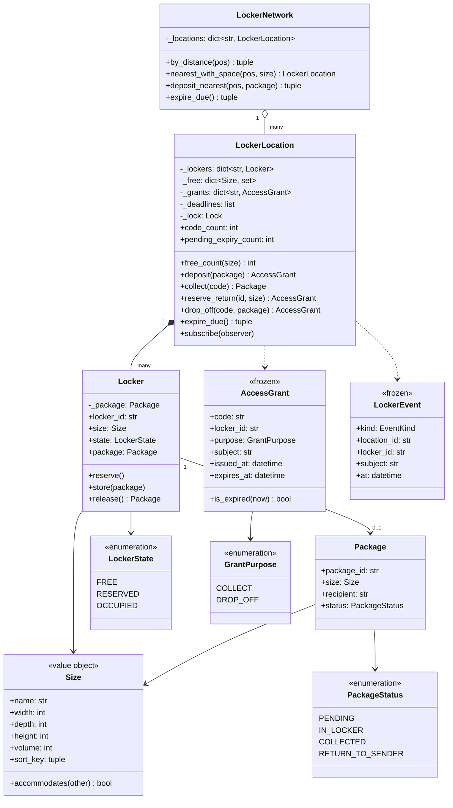

# 设计题解：快递柜（Amazon Locker）

## 题目与澄清

面试官的开场通常很短："设计一套快递柜。快递员把包裹放进柜子，系统给顾客一个取件码，顾客
凭码来取。"这道题看上去是"分配 + 查表"，真正拉开差距的只有两处：**分配规则怎么写才经得起
第 4 关加一种新尺寸**，以及**那个取件码到底是什么东西**——它不是密码，而这句话会一路决定错误
尝试怎么计数、码存不存、日志里能不能出现它。值得当场问清楚的是：

- **包裹和柜格的尺寸是几个固定档位，还是真实的三维？** 这个答案决定 `Size` 是 `Enum` 还是值
  对象。如果面试官说"就 S/M/L 三档"，枚举足够；但只要他补一句"以后可能加超大格"，枚举就
  错了——枚举的成员集合在导入时封死，加一档意味着改枚举、改所有 `if size == ...`。问出来，
  然后用带三维的值对象，让"装得下"变成一次比较而不是一张查找表。
- **小包裹能不能放大柜子？** 必须问，因为它决定分配是"精确匹配"还是"最小可容纳"。现实里
  当然能放（柜子空着也是浪费），于是规则变成"在装得下的柜格里挑最小的那个"——这是一句
  贪心，它的代价是可能把中号柜浪费给小包裹，导致后面来的中号包裹无处可放。这件事要说出口：
  我们接受这个代价，因为拒收一次投递的成本远高于柜位利用率低一点。
- **取件码是什么？给谁？能不能重复使用？** 我坚持把它说成**持有即凭证**（bearer token）：
  谁拿到这串字符谁就能开那一个柜门，它不绑定手机号、不绑定账号、也不做二次认证。这条性质
  是后面一切安全策略的前提，见"关键设计决策"第二节。
- **没人来取怎么办？** 这是本题唯一的"时间"需求。要问清楚三件事：期限多长（一般 3 天）、
  过期之后柜格是不是立刻可以再用、包裹的去向。我们的答案是：过期由一次显式的 `expire_due()`
  扫描驱动（时间从注入的时钟进来，绝不 `time.time()`），柜格回到可用池，包裹被标成
  `RETURN_TO_SENDER`。
- **一个网点还是很多网点？"就近"要做到什么程度？** 要在开口时就把地理部分按住：本题的
  "最近"是一次朴素的欧氏距离排序，**这是刻意的**。真正的邻近搜索（geohash、R 树、PostGIS）
  是另一道系统设计题；在机器编码轮里花二十分钟写四叉树，等于把分配、过期、并发三块分都丢了。
- **同一时刻有几个快递员在同一台柜机前操作？** 只要面试官点头，就要有一把锁，而且要说清楚
  临界区是"选柜 + 占柜 + 发码"这三步的整体，不是其中任何一步。

**范围之外**：不做柜门电机和硬件握手、不做短信／推送网关（只到事件这一层）、不做跨进程
持久化（落库放在"扩展与追问"里说）、不做真正的地理索引、不做包裹计费。

## 需求与分级

- **第 1 关（核心流程，约 15 分钟）**：一个网点，若干不同尺寸的柜格。`deposit(package)` 把
  包裹放进**装得下它的最小空柜**，签发一个一次性取件码；`collect(code)` 凭码取走包裹并释放
  柜格。没有合适的空柜就明确拒绝，而且拒绝之后柜位一个都不能少。对应 `Size`、`Locker`、
  `AccessGrant`、`LockerLocation.deposit` / `collect`。
- **第 2 关（取件流程的失败路径，约 15 分钟）**：码不存在、码过期、码用错了门，这三种失败
  必须是三件不同的事，而且**只有第一种算可疑**。连续输错达到阈值，这台柜机进入冷却期。
  没人来取的包裹在注入时钟走过期限之后被 `expire_due()` 回收：码从码表里消失、柜格回池、
  包裹标记退回寄件人。对应 `_validate` 的三条分支、`TerminalLockedError`、`expire_due`、
  `_deadlines` 到期堆。
- **第 3 关（多网点与并发，约 10 分钟）**：`LockerNetwork` 找到"装得下且还有空位"的最近网点。
  地理部分朴素、并且说清楚为什么朴素。同一网点上多个快递员同时投件时，不能有两个包裹拿到
  同一个柜格、也不能签出重复的码。对应 `LockerNetwork.deposit_nearest`、`threading.Lock`。
- **第 4 关（新需求，选做）**：退货／退款的**逆向投件**（顾客把退货放进柜子，快递员来收），
  以及系统此前没见过的一种尺寸。判分点只有一个：这两件事都**不许动分配逻辑**。对应
  `GrantPurpose.DROP_OFF`、`reserve_return` / `drop_off`、`add_locker` 接受任意 `Size`。

## 核心对象与职责

| 类 | 职责 | 它守住的不变式 |
|---|---|---|
| `Size` | 一个尺寸类：名字加三维内空 | 值对象，不可变可哈希；"装得下"是三维都不小于 |
| `Package` | 一件包裹及其状态 | **实体**，有身份有生命周期，所以刻意不是 frozen |
| `Locker` | 一个柜格：尺寸固定，状态三选一 | `OCCUPIED` 当且仅当里面真有一件包裹；非法迁移抛异常，绝不静默覆盖 |
| `AccessGrant` | 一次开门授权：码、柜格、用途、到期时间 | 不可变；签出去之后任何字段都不会变，"续期"只能换一张 |
| `LockerEvent` | 柜机上发生的一件事的自描述记录 | 只带发生了什么，**永不带取件码** |
| `LockerLocation` | 一个网点的全部对外动作 | 码表只随未完成的授权增长；可用索引的空桶立刻删键；到期堆的陈旧条目弹出即丢 |
| `LockerNetwork` | 把一次投件送到最近的、真的收得下的网点 | 不先查后投——"有空位"和"投进去"之间隔着别的快递员 |

关系上，`LockerLocation` **组合**（composition）着它的 `Locker`：柜格是网点的一部分，网点
没了柜格也就没了意义。`Package` 和柜格之间是**关联**（association）：包裹只是暂时待在柜格
里，它的生命周期比这一次寄存长得多。`AccessGrant` 是网点签发的**凭证**，它只引用柜格的 id
而不持有 `Locker` 对象——这让它可以被序列化、被发短信、被存进 Redis，而不会把一个活对象
拖出进程。`LockerNetwork` 只**关联**网点，它不创建也不销毁任何网点。

这份设计里**没有** `LockerManager` 或 `LockerService` 这样的类。它在很多参考实现里存在，
干的事是把 `deposit` 原样转发给 `LockerLocation`——一个只转发一次调用的类是 Java 习惯，它
守不住任何一条网点没守住的不变式，反而多一层让"分配 + 占柜 + 发码在同一把锁里"更难看清。
也没有 `CodeGenerator` 抽象基类：它只有一个方法、没有状态，在 Python 里就是一个
`Callable[[], str]`，测试注入 `lambda: "CODE-0001"` 比写一个 `FakeCodeGenerator(ABC)` 子类
短十倍。反过来，`Locker` **是**一个挣来的类：它有一条只有它能守住的不变式（占用与占用者
必须同时成立或同时不成立），有一组必须原子发生的状态迁移，这和"只有转发方法的壳"是两回事。



## 关键设计决策

### 一、尺寸是枚举还是值对象——第 4 关在这里提前埋好

问题很尖锐：`deposit` 要"挑装得下的最小空柜"，而第 4 关会让面试官说"现在加一种超大格"。
写法决定了那一刻你要改几个地方。

**选项 A：`IntEnum` 加档位序号。** 这是绝大多数参考实现的写法：

```python
class LockerSize(IntEnum):
    SMALL, MEDIUM, LARGE = 1, 2, 3

def allocate(self, size: LockerSize) -> Locker:
    for candidate in LockerSize:
        if candidate >= size and self._free[candidate]:
            return self._free[candidate].pop()
```

它短、直观，而且"最小可容纳"天然就是 `>=` 加一次正序遍历。代价是：档位集合在导入时封死。
加一档要改枚举定义，而枚举是被序列化进数据库和消息的——改它意味着一次数据迁移。更糟的是
它假设尺寸是**全序**的，而真实的柜格不是：一个又高又窄的格子和一个又矮又宽的格子谁"大"？

**选项 B：带三维的值对象。**

```python
@dataclass(frozen=True, slots=True)
class Size:
    name: str
    width: int
    depth: int
    height: int

    def accommodates(self, other: "Size") -> bool:
        return (self.width >= other.width and self.depth >= other.depth
                and self.height >= other.height)
```

"装得下"成了一次三维比较，它是一个**偏序**（partial order）——这正是现实的样子。而"最小"
需要一个全序来打破并列，于是补一个 `sort_key = (volume, name)`：先比体积，再比名字保证
确定性（确定性在测试里是刚需，否则同体积的两个尺寸谁先被选中依赖字典迭代顺序）。

**选择 B。** 决定性的理由不是"更灵活"这种空话，而是一条可验证的性质：分配逻辑里**没有任何
一处提到具体的尺寸名**，循环跑的是当前可用索引里的尺寸类集合。所以 `add_locker(Locker("X1",
Size("xl", 100, 120, 80)))` 之后，超大包裹立刻能被分配，小包裹仍然优先拿小柜——测试
`test_a_brand_new_size_needs_no_change_to_the_allocator` 就是把这句话钉死。代价也要说清楚：
值对象比枚举多几行、`accommodates` 比 `>=` 慢一点，而且丢掉了"枚举成员有限"带来的穷举
校验能力。在这道题里这点代价换第 4 关的零改动，非常划算。

这里**没有用任何模式**。有人会想把分配做成策略模式（Strategy），留一个 `AllocationPolicy`
接口以便以后换成"最大可用优先"或"按柜门高度照顾轮椅用户"。我拒绝：现在只有一个实现，
`_allocate` 是十行的私有方法，真到了要换算法的那天把它提成一个注入的可调用对象是五分钟的
重构。为不存在的第二个实现先写一个接口，是这道题最常见的过度设计。

### 二、取件码不是密码——因此错误尝试不能按包裹计数

这是本题唯一真正的安全问题，也是最容易答错的一问。

密码有三个性质：它绑定一个身份、由用户自己选择（所以熵低）、可以反复使用。取件码一个都
没有：它**不绑定任何身份**（谁拿到谁能开门，所以叫 bearer token）、由系统生成（所以熵可以
很高）、**只能用一次**、而且只能开**一个**柜门、只在**几天内**有效。这四条性质合起来，把防护
的重心从"认证"挪到了"限制爆破窗口"。

于是最关键的推论是：**错误尝试不能按包裹或按账号计数**。一个错误的码不属于任何人——它是一串
系统里根本不存在的字符，你无法知道输它的人想开哪个柜门。想"三次输错就锁定这个包裹"在物理
上就做不到。更糟的是，如果真的按包裹锁定（比如让用户输入手机号后四位再输码），任何人都能
站在柜机前对着别人的包裹连按三次，把机主锁在自己的包裹外面——这是把认证机制变成了拒绝服务
武器。

所以策略是三条，缺一不可：

1. **熵靠码本身。** 代码里用 `secrets.choice` 从 31 个不易混淆的字符里取 8 位，约 8.5×10¹¹
   种；配合分钟级的冷却期，在线爆破的期望次数远超柜机的物理寿命。用 `random` 而不是
   `secrets` 是这类题里最常见的隐蔽错误：`random` 的状态可以被若干次输出反推出来。
2. **限流按终端，不按包裹。** `LockerLocation` 里的 `_failures` 计的是"这台柜机连续被输错
   几次"，达到阈值就把**整台柜机**冷却几分钟。这仍然是一种拒绝服务（有人可以故意锁掉一台
   柜机），但它的影响是暂时的、可观测的（`CODE_REJECTED` 事件直接进监控），而且远好于把
   某个具体用户锁在外面。真实系统还会叠加摄像头和人工介入，那是产品层面的答案。
3. **区分三种失败，只有一种算可疑。**

```python
grant = self._grants.get(code)
if grant is None:                 # 码表里根本没有：唯一可能是"有人在猜"
    self._failures += 1
    ...
if grant.is_expired(now):         # 码是真的，只是来晚了——是本人，不计失败
    ...
if grant.purpose is not purpose:  # 码是真的，用错了门——不计失败，也不作废
    ...
```

这段分支是整道题的题眼。把过期或用错门也算进失败计数，等于惩罚老老实实来取件的人；而把
"码不存在"算成普通错误不计数，等于放任爆破。另外注意用错门时**不能作废这个码**——顾客拿着
投件码去按了取件口，码必须还能用。

一个附带的推论：`LockerEvent` 里**没有** `code` 字段。事件会流进日志、监控和消息队列，凭证
跟着走一路，就等于把取件码印在了日志里。事件只带"发生了什么"（哪个柜格、哪个包裹号、
什么时候），订阅者据此更新自己，不需要也不应该拿到码。

### 三、过期回收：扫描驱动 + 到期堆，而不是定时器，也不是全表扫

"三天没人取就回收"看着像一个定时任务，于是很多实现给每个包裹起一个 `threading.Timer`，
或者在 `LockerLocation` 里开一个后台线程 `while True: sleep(60); scan()`。两条路都不该走。

**选项 A：每个授权一个定时器。** 一个网点上千个码就是上千个定时器线程／句柄；取件之后还
要记得取消定时器，忘了就是泄漏；最要命的是测试——要么真的等三天，要么把 TTL 调成 0.1 秒再
`sleep`，两者都让测试变慢且不稳定。

**选项 B：后台线程定期全表扫描。** 线程数降到一个，但每次扫描是 O(码表大小)。更根本的问题
是：**逻辑里出现了真实时间**，于是这段代码只能靠 `sleep` 来测。

**选择 C：显式的 `expire_due()` + 注入时钟 + 到期小顶堆。** 时间只从 `self._clock()` 进来，
测试里那是一个可以手动推进的假时钟；谁来驱动扫描（一个后台线程、一个 cron、柜机上每次
按键之前）是**部署问题**，不是设计问题，把它留在边界之外。堆让扫描只看堆顶：

```python
while self._deadlines and self._deadlines[0][0] <= now:
    _, code = heapq.heappop(self._deadlines)
    grant = self._grants.get(code)
    if grant is None or not grant.is_expired(now):
        continue                      # 陈旧条目：码已被取走，丢掉即可
    events.append(self._expire(grant, now))
```

代价是**惰性删除**：包裹被提前取走时，`collect` 只删码表，堆里那条记录还在。这正是"每一个
容器都必须缩"这条纪律要落到实处的地方——如果弹出时不把陈旧条目丢掉，堆就成了一个只增不减
的内存泄漏，而且它伪装得很好（功能全对，跑一个月才爆）。所以 `pending_expiry_count` 被做成
一个只读属性，测试 `test_sweep_discards_stale_heap_entries_of_collected_codes` 专门断言：
取走包裹后堆里还有一条，扫过到期时间之后必须归零。

同一条纪律还落在另外两个容器上。码表 `_grants` 在取走、过期、拒收之后立刻删键；可用索引
`_free` 是按尺寸类分桶的 `dict[Size, set[str]]`，桶空了就 `del self._free[size]`，不留一个
计数为 0 的幽灵尺寸——否则 `_allocate` 里那句 `[s for s in self._free if s.accommodates(size)]`
会越扫越长，而且 `free_count` 的实现会变得需要额外判空。

还有一处容易漏：`collect` 遇到**已经过期但还没被扫到**的码时怎么办？不能只抛异常了事，那样
柜格会一直挂在"已占用"上直到下一次扫描。正确做法是在键盘上这一次就把状态收干净——调用同一个
`_expire`，然后抛 `ExpiredCodeError`。测试
`test_an_expired_code_presented_at_the_keypad_expires_it_on_the_spot` 钉的就是这条。

### 四、逆向投件：不是新流程，是同一套机器换一个方向

第 4 关的"退货／退款投柜"看起来是一条全新的流程：顾客投件、快递员取件，方向和正向完全相反。
很多人会开一个 `ReturnLockerService`，复制一份分配、一份码表、一份过期扫描。

真正的答案是：**方向不同的只有"码允许做什么"**。于是只需要一个两成员的枚举：

```python
class GrantPurpose(Enum):
    COLLECT = "collect"    # 开门，把东西拿走
    DROP_OFF = "drop_off"  # 开门，把东西放进去
```

正向：`deposit` 分配柜格、放包裹、签发 `COLLECT` 码给顾客。
逆向：`reserve_return` 分配柜格、**预留**（`LockerState.RESERVED`，柜格离开可用池但里面是
空的）、签发 `DROP_OFF` 码给顾客；顾客 `drop_off` 用掉这个码把退货放进去，系统随即签发一个
`COLLECT` 码给快递员。

同一个 `_allocate`、同一张 `_grants`、同一个到期堆、同一套限流。过期扫描甚至不需要知道两种
流程的区别：`_expire` 里 `locker.release()` 返回 `None` 就说明这是一个没人来投的预留，没有
包裹要标记退回。新增的代码是一个枚举成员、一个 `LockerState` 成员、两个方法，**分配逻辑、
码表、过期逻辑一行没改**——这就是"可扩展"该有的证据形态：不是嘴上说"我留了接口"，而是能
指着 diff 说哪几块没动。

### 五、并发：锁的粒度是"选柜 + 占柜 + 发码"，网络层不需要锁

同一台柜机前两个快递员同时投件，危险不在任何单独一步，而在三步之间：A 选中了 L1，还没标记
占用，B 也选中了 L1。所以临界区必须整体覆盖"挑柜 → 从可用索引摘除 → 放包裹 → 生成唯一码 →
写码表 → 压到期堆"。`deposit`、`collect`、`reserve_return`、`drop_off`、`expire_due` 全部
在同一把 `threading.Lock` 下完成这段。

**GIL 帮不上忙**，这一句必须说出口。GIL 保证的是字节码级别的原子性，而"读 `_free` 再改
`_free`"是好几条字节码，中间完全可能被切换。事实上 `heapq.heappush` 本身也不是原子的。
GIL 让你免于数据结构内部被写坏（一个 `dict` 不会因为并发写而变成半截），但它对**复合操作**
一点保护都没有。

粒度要不要更细？比如按尺寸类分锁？不要：一次分配可能跨尺寸类（小包裹拿中号柜），跨锁就要
考虑锁顺序和死锁，而收益是零——柜机的操作频率是每秒个位数，一把粗锁的争用可以忽略。**这是
本题里"更简单的答案才是对的"的第二处**：把锁做细是典型的、代价高而收益为零的复杂度。

唯一需要提的细节有两个。其一，订阅者通知必须在**锁外**：一个慢订阅者（发短信、写审计日志）
不该把整排柜子堵住。代码里每个方法把事件收集到一个局部 `events` 列表，`finally` 里再
`_publish`——用 `finally` 是因为抛异常的路径（比如 `CODE_REJECTED`）也要通知出去。其二，
`LockerNetwork.deposit_nearest` **不先查后投**：

```python
for location in self.by_distance(position):
    try:
        return location.location_id, location.deposit(package)
    except NoLockerAvailableError:
        continue
```

先 `free_count` 判断再 `deposit`，是典型的检查与使用竞态（TOCTOU）——中间别的快递员可能刚
把最后一个柜子占了。把"这家满了"当成一个可恢复的异常往下一家走，原子性就完全留在网点内部
那把锁里，网络层不需要任何跨网点的协调。

## 代码走读

先看三处设计决策在代码里的落点，再看全文。

**第一处，`_allocate` 的循环跑的是尺寸类而不是柜格。** `_free` 是 `dict[Size, set[str]]`，
`fitting = [s for s in self._free if s.accommodates(size)]` 只在一个网点的五六种尺寸上迭代，
和柜格总数无关；`min(fitting, key=lambda s: s.sort_key)` 把偏序补成全序，`min(self._free[best])`
在同尺寸的柜格里取 id 最小的，纯粹为了测试的确定性。整段代码里没有任何一处出现 `SMALL`
或 `"medium"`——这就是新尺寸零改动的原因。

**第二处，`_validate` 的三条失败分支和它们对失败计数的不同态度。** 更要注意的是校验和作废
被**拆成了两步**：`_validate` 只校验、只重置失败计数，作废由调用方在动作真的成功之后调
`_burn` 完成。这不是洁癖——退货塞不进预留的柜格时 `Locker.store` 会抛异常，如果码在校验那一刻
就烧掉了，顾客手里的投件码会白白作废，只能打客服。用错门的码要活下来是同一条道理的轻量版。
还要注意 `_validate` 的签名里带着一个
`events: list[LockerEvent]` 参数——它在锁内运行，不能自己去通知订阅者，只能把事件交给调用方，
由调用方在 `finally` 里在锁外发出去。

**第三处，`expire_due` 与 `_expire` 的分工。** `expire_due` 负责"从堆里挑出该处理的"，`_expire`
负责"处理一个已经确定过期的授权"。分开的理由不是美学：`collect` 撞上过期码时要复用
`_expire`，两条入口必须走同一段回收逻辑，否则迟早有一条忘了 `_mark_free`。

%% code:begin solution.py %%
```python
"""快递柜（Amazon Locker）——按尺寸分配柜格、一次性取件码、过期回收、多网点就近投递。

核心思路：尺寸不是枚举而是带三维的值对象 `Size`，"装得下"是偏序比较，"最小的空柜"= 在
装得下的尺寸类里按体积取最小——所以第 4 关新增一种尺寸只是多造一个 `Size`，分配逻辑一行不改。
取件码是**持有即凭证**（bearer token）而不是密码：它不绑定任何身份，所以错误尝试只能按
**终端**限流，不能按包裹或账号锁定。`code -> AccessGrant` 这张码表是全系统唯一的索引，取走、
过期、改派三条路径都必须让它变小；到期时间另存一个小顶堆，扫描只看堆顶，弹出时丢弃陈旧条目，
堆同样缩得回去。时间只从注入的 `clock` 进来；`LockerNetwork` 的"就近"是刻意的线性扫描。
"""

from __future__ import annotations

import heapq
import math
import secrets
import threading
from collections.abc import Callable, Iterable
from dataclasses import dataclass
from datetime import datetime, timedelta
from enum import Enum

Clock = Callable[[], datetime]
CodeFactory = Callable[[], str]

# 去掉了 0/O/1/I/L 等易混字符：取件码要在柜机小键盘上被人手输入，可读性是安全性的一部分。
_ALPHABET = "23456789ABCDEFGHJKMNPQRSTUVWXYZ"
_CODE_LENGTH = 8          # 31**8 ≈ 8.5e11，配合分钟级封锁足以让在线穷举失去意义
_UNIQUE_TRIES = 16        # 生成器重复时的重试次数；撞满说明码空间或生成器有问题


def default_code_factory() -> str:
    """默认取件码生成器：`secrets` 的密码学随机源，不是 `random`。

    做成一个普通可调用对象而不是抽象基类：它只有一个方法、没有状态，测试里换成
    `iter(["AAA", "BBB"]).__next__` 这样的桩即可，"为了扩展"先写一个接口是 Java 习惯。
    """
    return "".join(secrets.choice(_ALPHABET) for _ in range(_CODE_LENGTH))


class LockerError(Exception):
    """本设计全部失败路径的公共基类，调用方可以一次性捕获。"""


class NoLockerAvailableError(LockerError):
    """这个网点没有装得下该包裹的空柜格。"""


class UnknownCodeError(LockerError):
    """码表里没有这个码：输错了、已经用过了，或者有人在猜。"""


class ExpiredCodeError(LockerError):
    """码确实签发过，但已经过了有效期；柜格此刻已经被回收。"""


class WrongPurposeError(LockerError):
    """码是真的，但用错了门：投件码不能用来取件，反之亦然。"""


class TerminalLockedError(LockerError):
    """这台柜机连续被输错太多次，进入冷却期。"""


class LockerStateError(LockerError):
    """柜格状态不允许这个动作（例如往已占用的柜格里再放一件）。"""


@dataclass(frozen=True, slots=True)
class Size:
    """一个尺寸类：名字加三维内空。不可变、可哈希，是值对象（value object）不是实体。

    做成值对象而不是 `Enum`，是因为第 4 关要求"系统没见过的尺寸"能加进来而不动分配逻辑；
    枚举的成员集合在导入时就封死了。
    """

    name: str
    width: int
    depth: int
    height: int

    @property
    def volume(self) -> int:
        return self.width * self.depth * self.height

    @property
    def sort_key(self) -> tuple[int, str]:
        """把"装得下"这个偏序补成全序：先比体积，再比名字保证确定性。"""
        return (self.volume, self.name)

    def accommodates(self, other: Size) -> bool:
        """本尺寸的柜格能不能装下 `other` 尺寸的包裹——三维都不小于才算数。"""
        return (self.width >= other.width and self.depth >= other.depth
                and self.height >= other.height)


SMALL = Size("small", 30, 40, 15)
MEDIUM = Size("medium", 45, 60, 30)
LARGE = Size("large", 60, 80, 45)


class PackageStatus(Enum):
    """包裹在这套系统里的生命周期。`RETURN_TO_SENDER` 是超时回收打的标。"""

    PENDING = "pending"
    IN_LOCKER = "in_locker"
    COLLECTED = "collected"
    RETURN_TO_SENDER = "return_to_sender"


@dataclass(slots=True)
class Package:
    """一件包裹。**故意不是 frozen**：它有身份、有状态迁移，是实体（entity）而不是值对象。

    `Size` 与之相反——两个三维相同的尺寸就是同一个尺寸，所以它 frozen 且可哈希。
    """

    package_id: str
    size: Size
    recipient: str = ""
    status: PackageStatus = PackageStatus.PENDING


class LockerState(Enum):
    """柜格的三种状态。`RESERVED` 是"已留给某次投件、但里面还是空的"——退货流程要用它。"""

    FREE = "free"
    RESERVED = "reserved"
    OCCUPIED = "occupied"


class GrantPurpose(Enum):
    """一个码开门之后允许做什么：取走里面的东西，还是放一件进去。"""

    COLLECT = "collect"
    DROP_OFF = "drop_off"


class EventKind(Enum):
    DEPOSITED = "deposited"
    RESERVED = "reserved"
    COLLECTED = "collected"
    DROPPED_OFF = "dropped_off"
    EXPIRED = "expired"
    CODE_REJECTED = "code_rejected"


@dataclass(frozen=True, slots=True)
class AccessGrant:
    """一次性开门授权：某个码，在到期之前，能把某个柜格打开做某件事。

    `subject` 是包裹号或退货单号——事件与日志用它定位业务对象，不必回头查码表。
    """

    code: str
    locker_id: str
    purpose: GrantPurpose
    subject: str
    issued_at: datetime
    expires_at: datetime

    def is_expired(self, now: datetime) -> bool:
        return now >= self.expires_at


@dataclass(frozen=True, slots=True)
class LockerEvent:
    """柜机上发生的一件事，自带全部上下文，订阅者据此更新自己，不回头读网点的内部字典。

    **不带取件码**：事件会流进日志、监控和推送，凭证跟着走一路就等于把码印在日志里。
    """

    kind: EventKind
    location_id: str
    locker_id: str
    subject: str
    at: datetime


Observer = Callable[[LockerEvent], None]


class Locker:
    """一个柜格：尺寸固定，状态三选一，里面最多一件包裹。

    不变式：`state is OCCUPIED` 当且仅当 `package is not None`；非法迁移一律抛异常而不是
    静默覆盖——"往已占用的柜格再塞一件"在现实里意味着上一件被压在下面永远取不出来。
    """

    def __init__(self, locker_id: str, size: Size) -> None:
        self._locker_id = locker_id
        self._size = size
        self._state = LockerState.FREE
        self._package: Package | None = None

    @property
    def locker_id(self) -> str:
        return self._locker_id

    @property
    def size(self) -> Size:
        return self._size

    @property
    def state(self) -> LockerState:
        return self._state

    @property
    def package(self) -> Package | None:
        """当前占用者；空柜或仅被预留时是 `None`。"""
        return self._package

    def reserve(self) -> None:
        """留给一次还没发生的投件（退货流程）：柜格离开可用池，但里面仍是空的。"""
        if self._state is not LockerState.FREE:
            raise LockerStateError(f"locker {self._locker_id!r} is {self._state.value}")
        self._state = LockerState.RESERVED

    def store(self, package: Package) -> None:
        if self._state is LockerState.OCCUPIED:
            raise LockerStateError(f"locker {self._locker_id!r} already holds a package")
        if not self._size.accommodates(package.size):
            raise LockerStateError(f"package {package.package_id!r} does not fit locker {self._locker_id!r}")
        self._package = package
        self._state = LockerState.OCCUPIED

    def release(self) -> Package | None:
        """清空柜格并交还占用者（预留态的柜格交还 `None`）。"""
        package, self._package = self._package, None
        self._state = LockerState.FREE
        return package


class LockerLocation:
    """一个网点：一组柜格、一张码表、一台键盘的失败计数。所有对外动作都在这里发生。

    不变式：
    1. 码表 `_grants` 只随未完成的授权增长——取走、过期、拒收之后立刻删除，永不积压。
    2. `_free` 是按尺寸类分桶的可用索引，桶空了就把键删掉，不留计数为 0 的幽灵尺寸；
       柜格的真源永远是 `_lockers`，`_free` 只是它的派生视图。
    3. 到期堆 `_deadlines` 只在堆顶到期时被弹；弹出时若码表里已经没有这个码，说明包裹
       已被取走，条目直接丢弃——惰性删除必须有人真的删，否则"到期堆"就成了内存泄漏。
    """

    def __init__(self, location_id: str, lockers: Iterable[Locker], clock: Clock, *,
                 position: tuple[float, float] = (0.0, 0.0),
                 ttl: timedelta = timedelta(days=3),
                 code_factory: CodeFactory = default_code_factory,
                 max_failed_attempts: int = 5,
                 lockout: timedelta = timedelta(minutes=10)) -> None:
        self._location_id = location_id
        self._clock = clock
        self._position = position
        self._ttl = ttl
        self._code_factory = code_factory
        self._max_failed_attempts = max_failed_attempts
        self._lockout = lockout
        self._lock = threading.Lock()
        self._lockers: dict[str, Locker] = {}
        self._free: dict[Size, set[str]] = {}
        self._grants: dict[str, AccessGrant] = {}
        self._deadlines: list[tuple[datetime, str]] = []
        self._failures = 0
        self._locked_until: datetime | None = None
        self._observers: list[Observer] = []
        for locker in lockers:
            self.add_locker(locker)

    # ---- 只读视图：外界看到的一切都是快照或计数，内部集合从不交出去 ----------------

    @property
    def location_id(self) -> str:
        return self._location_id

    @property
    def position(self) -> tuple[float, float]:
        return self._position

    @property
    def locker_count(self) -> int:
        return len(self._lockers)

    @property
    def code_count(self) -> int:
        """码表里还有多少个有效码。测试靠它断言"码用完就消失"，不必去读私有字典。"""
        with self._lock:
            return len(self._grants)

    @property
    def pending_expiry_count(self) -> int:
        """到期堆里还剩多少条目；扫过最后一个到期时间之后必须归零。"""
        with self._lock:
            return len(self._deadlines)

    def free_count(self, size: Size | None = None) -> int:
        """空柜数；给了尺寸就只数装得下它的那些。"""
        with self._lock:
            return sum(len(ids) for s, ids in self._free.items()
                       if size is None or s.accommodates(size))

    def state_of(self, locker_id: str) -> LockerState:
        with self._lock:
            return self._require(locker_id).state

    def subscribe(self, observer: Observer) -> None:
        self._observers.append(observer)

    # ---- 投件与取件 -------------------------------------------------------------

    def add_locker(self, locker: Locker) -> None:
        """装一个新柜格。第 4 关的新尺寸就是从这里进来的：分配逻辑不认识具体尺寸名。"""
        with self._lock:
            if locker.locker_id in self._lockers:
                raise LockerStateError(f"duplicate locker id {locker.locker_id!r}")
            self._lockers[locker.locker_id] = locker
            if locker.state is LockerState.FREE:
                self._mark_free(locker)

    def deposit(self, package: Package) -> AccessGrant:
        """快递员投件：分配最小的能装下的空柜，签发给收件人的一次性取件码。"""
        now = self._clock()
        events: list[LockerEvent] = []
        try:
            with self._lock:
                locker = self._allocate(package.size)
                # 先发码再放件：发码失败时柜格必须回到可用池，否则它会永远占着且没有码能开。
                grant = self._issue_or_release(locker, GrantPurpose.COLLECT, package.package_id, now)
                locker.store(package)
                package.status = PackageStatus.IN_LOCKER
                events.append(self._event(EventKind.DEPOSITED, locker.locker_id, package.package_id, now))
        finally:
            self._publish(events)
        return grant

    def reserve_return(self, return_id: str, size: Size) -> AccessGrant:
        """逆向流程：为一次退货留一个空柜，签发给顾客的一次性**投件**码。

        和 `deposit` 共用同一套分配、同一张码表、同一个到期堆——这正是第 4 关"加退货不动
        原有代码"的兑现方式：只多了一个 `GrantPurpose` 成员和这一个方法。
        """
        now = self._clock()
        events: list[LockerEvent] = []
        try:
            with self._lock:
                locker = self._allocate(size)
                grant = self._issue_or_release(locker, GrantPurpose.DROP_OFF, return_id, now)
                locker.reserve()
                events.append(self._event(EventKind.RESERVED, locker.locker_id, return_id, now))
        finally:
            self._publish(events)
        return grant

    def collect(self, code: str) -> Package:
        """用取件码开门取走包裹。码在这一刻从码表里消失，柜格回到可用池。"""
        now = self._clock()
        events: list[LockerEvent] = []
        try:
            with self._lock:
                grant = self._validate(code, GrantPurpose.COLLECT, now, events)
                locker = self._lockers[grant.locker_id]
                if locker.package is None:  # 不变式被破坏才会走到这里，宁可炸也不要静默返回 None
                    raise LockerStateError(f"locker {locker.locker_id!r} was empty under a COLLECT grant")
                package = locker.release()
                self._burn(grant)
                self._mark_free(locker)
                package.status = PackageStatus.COLLECTED
                events.append(self._event(EventKind.COLLECTED, locker.locker_id, grant.subject, now))
        finally:
            self._publish(events)
        return package

    def drop_off(self, code: str, package: Package) -> AccessGrant:
        """顾客用投件码把退货放进预留的柜格，系统随即签发给快递员的取件码。"""
        now = self._clock()
        events: list[LockerEvent] = []
        try:
            with self._lock:
                grant = self._validate(code, GrantPurpose.DROP_OFF, now, events)
                locker = self._lockers[grant.locker_id]
                # 放不进去（退货比预留的柜格大）时先抛：投件码还没作废，顾客可以换个柜子再来。
                locker.store(package)
                self._burn(grant)
                package.status = PackageStatus.IN_LOCKER
                pickup = self._issue(locker, GrantPurpose.COLLECT, package.package_id, now)
                events.append(self._event(EventKind.DROPPED_OFF, locker.locker_id, package.package_id, now))
        finally:
            self._publish(events)
        return pickup

    def expire_due(self) -> tuple[LockerEvent, ...]:
        """按注入的时钟回收所有已过期的授权：码作废、柜格回池、包裹标为退回寄件人。

        只看堆顶，所以代价是 O(k log n) 而不是 O(码表大小)——一个大网点几千个码，
        每分钟全表扫一遍是典型的"能跑但不该写"的答案。
        """
        now = self._clock()
        events: list[LockerEvent] = []
        try:
            with self._lock:
                while self._deadlines and self._deadlines[0][0] <= now:
                    _, code = heapq.heappop(self._deadlines)
                    grant = self._grants.get(code)
                    if grant is None or not grant.is_expired(now):
                        continue  # 陈旧条目：码已经被取走或被拒收，丢掉即可
                    events.append(self._expire(grant, now))
        finally:
            self._publish(events)
        return tuple(events)

    # ---- 内部：以下方法都假定调用方已持有 `self._lock` ---------------------------

    def _require(self, locker_id: str) -> Locker:
        locker = self._lockers.get(locker_id)
        if locker is None:
            raise LockerStateError(f"unknown locker {locker_id!r}")
        return locker

    def _mark_free(self, locker: Locker) -> None:
        self._free.setdefault(locker.size, set()).add(locker.locker_id)

    def _take_free(self, locker: Locker) -> None:
        bucket = self._free[locker.size]
        bucket.discard(locker.locker_id)
        if not bucket:
            del self._free[locker.size]  # 桶空了就删键，不留计数为 0 的幽灵尺寸

    def _allocate(self, size: Size) -> Locker:
        """最小可容纳优先：在装得下的尺寸类里按 `sort_key` 取最小，再取该类中 id 最小的柜格。

        循环跑的是**尺寸类**（一个网点撑死五六种），不是柜格，所以和柜格总数无关；
        也因此新增一种尺寸不需要改这里的任何一行。
        """
        fitting = [s for s in self._free if s.accommodates(size)]
        if not fitting:
            raise NoLockerAvailableError(
                f"location {self._location_id!r} has no free locker for size {size.name!r}")
        best = min(fitting, key=lambda s: s.sort_key)
        locker = self._lockers[min(self._free[best])]
        self._take_free(locker)
        return locker

    def _issue_or_release(self, locker: Locker, purpose: GrantPurpose, subject: str,
                          now: datetime) -> AccessGrant:
        """发码；发不出来就把柜格还回可用池，绝不留下一个没有码能打开的占用柜格。"""
        try:
            return self._issue(locker, purpose, subject, now)
        except LockerError:
            self._mark_free(locker)
            raise

    def _issue(self, locker: Locker, purpose: GrantPurpose, subject: str,
               now: datetime) -> AccessGrant:
        for _ in range(_UNIQUE_TRIES):
            code = self._code_factory()
            if code not in self._grants:
                break
        else:
            raise LockerError("could not generate a unique code")
        grant = AccessGrant(code=code, locker_id=locker.locker_id, purpose=purpose,
                            subject=subject, issued_at=now, expires_at=now + self._ttl)
        self._grants[code] = grant
        heapq.heappush(self._deadlines, (grant.expires_at, code))
        return grant

    def _validate(self, code: str, purpose: GrantPurpose, now: datetime,
                  events: list[LockerEvent]) -> AccessGrant:
        """校验一个码，但**不**作废它。三种失败只有一种算"可疑"，这是本题最容易写错的地方。

        作废推迟到 `_burn`，由调用方在动作真的成功之后执行：否则一次"退货塞不进柜格"
        就会白白烧掉顾客手里的投件码。
        """
        if self._locked_until is not None:
            if now < self._locked_until:
                raise TerminalLockedError(
                    f"terminal at {self._location_id!r} is locked until {self._locked_until.isoformat()}")
            self._locked_until = None
            self._failures = 0
        grant = self._grants.get(code)
        if grant is None:
            # 唯一可能是"有人在猜"的情况：码表里根本没有它。
            self._failures += 1
            if self._failures >= self._max_failed_attempts:
                self._locked_until = now + self._lockout
            events.append(self._event(EventKind.CODE_REJECTED, "", "", now))
            raise UnknownCodeError("no such pickup code")
        if grant.is_expired(now):
            # 码是真的，只是来晚了——是本人，不是攻击者，不计入失败计数。
            events.append(self._expire(grant, now))
            raise ExpiredCodeError(f"code for {grant.subject!r} expired at {grant.expires_at.isoformat()}")
        if grant.purpose is not purpose:
            raise WrongPurposeError(f"code for {grant.subject!r} is a {grant.purpose.value} code")
        self._failures = 0  # 出示了一个真码就不算可疑，哪怕接下来的动作会失败
        return grant

    def _burn(self, grant: AccessGrant) -> None:
        """动作成功，码就地作废。码表必须在这一刻变小。"""
        del self._grants[grant.code]

    def _expire(self, grant: AccessGrant, now: datetime) -> LockerEvent:
        del self._grants[grant.code]
        locker = self._lockers[grant.locker_id]
        package = locker.release()
        if package is not None:
            package.status = PackageStatus.RETURN_TO_SENDER
        self._mark_free(locker)
        return self._event(EventKind.EXPIRED, locker.locker_id, grant.subject, now)

    def _event(self, kind: EventKind, locker_id: str, subject: str, at: datetime) -> LockerEvent:
        return LockerEvent(kind=kind, location_id=self._location_id, locker_id=locker_id,
                           subject=subject, at=at)

    def _publish(self, events: list[LockerEvent]) -> None:
        """在**锁外**通知订阅者：一个慢订阅者（推送短信、写审计日志）不该把整排柜子堵住。"""
        for event in events:
            for observer in self._observers:
                observer(event)


class LockerNetwork:
    """一批网点。它的职责只有一个：把一次投件送到**装得下且还有空位**的最近网点。

    这里的"最近"是刻意做成朴素的欧氏距离线性扫描：网点数量是几百到几千，一次投件排一次序
    完全够用，而真正的邻近搜索（geohash、R 树、PostGIS）是另一道系统设计题，不是本题的题眼。
    """

    def __init__(self, locations: Iterable[LockerLocation]) -> None:
        self._locations: dict[str, LockerLocation] = {l.location_id: l for l in locations}

    @property
    def location_ids(self) -> tuple[str, ...]:
        return tuple(self._locations)

    def add_location(self, location: LockerLocation) -> None:
        self._locations[location.location_id] = location

    def location(self, location_id: str) -> LockerLocation:
        location = self._locations.get(location_id)
        if location is None:
            raise LockerStateError(f"unknown location {location_id!r}")
        return location

    def by_distance(self, position: tuple[float, float]) -> tuple[LockerLocation, ...]:
        """全部网点，按离 `position` 由近及远；同距离时按 id 保证确定性。"""
        return tuple(sorted(self._locations.values(),
                            key=lambda loc: (math.dist(position, loc.position), loc.location_id)))

    def nearest_with_space(self, position: tuple[float, float], size: Size) -> LockerLocation | None:
        for location in self.by_distance(position):
            if location.free_count(size) > 0:
                return location
        return None

    def deposit_nearest(self, position: tuple[float, float], package: Package) -> tuple[str, AccessGrant]:
        """就近投件。逐个网点真的去 `deposit`，**不**先查后投。

        "有空位"和"投进去"之间隔着别的快递员：先 `free_count` 再 `deposit` 是典型的
        检查与使用竞态（TOCTOU）。这里把 `NoLockerAvailableError` 当成"这家满了，换下一家"，
        原子性留在网点内部的那把锁里，网络层不需要任何跨网点的锁。
        """
        for location in self.by_distance(position):
            try:
                return location.location_id, location.deposit(package)
            except NoLockerAvailableError:
                continue
        raise NoLockerAvailableError(f"no location can take a {package.size.name!r} package")

    def expire_due(self) -> tuple[LockerEvent, ...]:
        events: list[LockerEvent] = []
        for location in self._locations.values():
            events.extend(location.expire_due())
        return tuple(events)


if __name__ == "__main__":
    now = datetime(2026, 3, 1, 9, 0)

    def clock() -> datetime:
        return now

    site = LockerLocation("beijing-01", [Locker("A1", SMALL), Locker("B1", MEDIUM)],
                          clock, position=(0.0, 0.0), ttl=timedelta(days=1))
    site.subscribe(lambda e: print(f"  [{e.kind.value}] {e.locker_id or '-'} {e.subject}"))

    parcel = Package("PKG-1", SMALL, recipient="chi")
    grant = site.deposit(parcel)
    print("deposited into", grant.locker_id, "code length", len(grant.code))
    print("free small lockers:", site.free_count(SMALL), "codes:", site.code_count)

    now = now + timedelta(days=2)
    print("expired:", [e.subject for e in site.expire_due()], "->", parcel.status.value)
    print("codes after sweep:", site.code_count, "heap:", site.pending_expiry_count)
```
%% code:end %%

## 测试与自检

测试里没有一次 `sleep`、没有一次真实随机：时钟是可手动推进的 `FakeClock`，取件码是
`CODE-0001`、`CODE-0002` 的计数器。这两处注入让"过期"和"码撞了"这类只在真实世界偶发的事
变成可以精确复现的断言。

断言全部落在公开行为和只读计数上——`code_count`、`pending_expiry_count`、`free_count`、
`state_of`——一个私有属性都不碰。这不是洁癖：`starter.py` 是给学习者填的，他完全可能用别的
内部表示（比如用一个排序列表代替堆、用 `dict[str, str]` 代替码表），断言 `_grants` 的测试
会判一份正确的答案不及格。当一条不变式只在对象内部可见时，正确的做法是把它做成一个小小的
只读属性，而不是让测试去翻私有字段。

值得钉死的不变式有五条：

1. **分配是"最小可容纳"**，而且失败不吃柜位——`test_large_package_never_fits_a_small_locker`
   在拒绝之后断言 `free_count() == 2`。
2. **码只能用一次**，用过立刻从码表消失（`code_count == 0`）。
3. **每一个容器都会缩**：码表在取走／过期后缩，到期堆在扫描时把陈旧条目丢掉，可用索引的
   空桶删键。第二条是最容易漏的，单独一个测试盯它。
4. **三种失败区别对待**：只有"码不存在"累计失败并可能锁机；过期和用错门都不累计，用错门
   的码还要活着。
5. **并发下不超卖**：5 个柜格、12 个快递员、一个 `threading.Barrier` 同时起跑，断言恰好 5 个
   成功、7 个被拒，5 个 `locker_id` 互不相同、5 个码互不相同、最后 `free_count() == 0`。
   注意断言的是**不变式**而不是时序——不写"谁先谁后"，只写"总数对得上、没有重叠"。

两分钟怎么演示给面试官看：跑 `python solution.py` 的 `__main__`，它投一件小包裹、打印分配到
的柜格和剩余空柜，然后把时钟往前拨两天，打印过期事件、包裹变成 `return_to_sender`、
`code_count` 和 `pending_expiry_count` 双双归零。三行输出把"分配 → 过期 → 容器缩回去"这条
主线讲完了。接着补一句 `test_concurrent_couriers_never_share_a_locker` 的断言，并发那一分也
拿到了。

## 扩展与追问

### 新需求

- **过期后先等快递员清柜，再回池。** 现实里过期的包裹还**物理地**躺在柜子里，必须有人来取
  走柜格才真的可用。本设计按题目要求让 `expire_due()` 直接回池；要做成两步，只需给
  `LockerState` 加一个 `AWAITING_SWEEP` 成员，让 `_expire` 不调用 `_mark_free` 而是签发一张
  给快递员的 `COLLECT` 授权（复用 `_issue`），柜格在快递员用掉那张码时才回池。**`_allocate`、
  码表、到期堆、限流一行不动**——因为回收和"发一张码"本来就是同一套机器。
- **柜格故障／维修。** 加一个 `LockerState.OUT_OF_SERVICE` 和一对 `take_out_of_service` /
  `return_to_service`，把柜格从 `_free` 摘除即可。注意故障和占用是**正交**的：里面有包裹的
  柜格也可能故障，所以不要把它做成第四个互斥状态，而应该是一个独立的布尔标志——这是状态
  爆炸的标准起点，见 [[structure.state-machines|状态机（State Machines）]]。
- **续期与改派。** "再存一天"不是修改 `AccessGrant`（它是 frozen 的），而是作废旧码、签发
  新码：`del self._grants[old]` 加一次 `_issue`。旧码的堆条目成为陈旧条目，下次扫描时被丢掉，
  这正是惰性删除已经处理好的情况。
- **多包裹同码／代取。** 一个码开一个柜门是本设计的核心假设；"一个码取两件"要么签两张码，
  要么引入"订单"这一层，让 `subject` 指向订单号——后者改的是语义，不是结构。

### 并发与线程安全

- **锁的粒度**已经在决策五里说清：粗锁覆盖复合操作，不按尺寸分锁。如果真的到了单机争用
  成为瓶颈的规模（不会），正确的下一步是按**柜机**分片而不是按尺寸分锁。
- **多进程／多实例**时这把进程内的锁就没用了。分配必须靠数据库的条件更新做原子占位：
  `UPDATE lockers SET state='OCCUPIED', package_id=? WHERE id=? AND state='FREE'`，看影响行数
  是不是 1；影响 0 行就换一个柜格重试。这和单机版的结构完全一致——`_allocate` 里"挑一个再
  摘除"变成"挑一个再条件更新"，见 [[structure.storage|内存持久化（In-Memory Persistence）]]。
- **码的唯一性**在分布式下不能靠"生成后查内存里有没有"，要靠数据库对 `code` 列的唯一索引，
  插入冲突就重试。8 位 31 进制的码在一个网点内冲突概率极低，但全网共享码空间时必须有这道
  兜底。
- **过期扫描**在多实例下会被重复执行。要么选主，要么让 `_expire` 变成幂等的条件更新（
  `WHERE state='OCCUPIED' AND expires_at <= now`），后者更省事。

### 持久化与规模

- **该落库的是什么。** 柜格状态、授权（码的哈希、柜格、用途、到期时间）、包裹。事件流单独
  进消息队列：短信推送、监控告警、退货工单都是它的订阅者。
- **码要不要存明文？** 在单机内存版里无所谓；一旦落库，正确做法是只存 `sha256(code)`，校验
  时哈希后比对。取件码熵足够高，不需要 bcrypt 这类慢哈希（慢哈希是为了对抗低熵密码的离线
  爆破），一次快哈希就够。这样数据库泄漏不等于所有柜门被打开。
- **到期扫描的规模。** 单机堆在几十万条以内毫无压力；再大就把到期时间做成数据库索引列，
  按 `expires_at <= now` 分批拉取。结构不变，只是堆换成索引。
- **就近查询。** 全国几万个网点时，`by_distance` 的全量排序要换成地理索引（geohash 前缀
  或 PostGIS 的 `ST_DWithin`），并且"有没有空位"应该做成一个按 `(location_id, size)` 维护的
  计数缓存，而不是每次去问每个网点。再往上就是一道独立的系统设计题了。

## 常见错误

- **用 `Enum` 表达尺寸，然后在第 4 关当场改枚举。** 面试官加一种尺寸时，如果你需要改枚举
  定义、改 `if/elif`、改数据库里的序列化值，这一问就丢了。
- **精确匹配尺寸。** 小包裹只能放小柜，小柜满了就拒收——柜子空着还拒单，产品上说不通。
- **用 `random` 生成取件码。** `random.choice` 背后是 Mersenne Twister，观察到足够多输出就
  能反推状态。凡是"猜中了就有后果"的随机，都必须用 `secrets`。
- **把错误尝试按包裹计数。** 前面说过：物理上做不到，而且一旦实现就是给攻击者送上一把
  锁掉别人包裹的钥匙。
- **过期和输错码混为一谈。** 本人迟到三天被当成攻击者，柜机对他锁定十分钟——这是真实产品
  里会上投诉的体验 bug。
- **用错门的码被作废。** 顾客拿投件码按了取件口，码就废了，退货只能打客服。
- **`expire_due` 全表扫描 `_grants`。** 能跑，但在"如何避免 O(n)"这个显而易见的追问上直接
  交白卷。反过来，上了堆却忘了丢弃陈旧条目，是一个功能全对、只泄漏内存的答案——同样扣分。
- **忘了 `collect` 撞上过期码的情况。** 只抛异常不回收，柜格会一直挂着。
- **从属性里返回内部集合。** `return self._grants` 或 `return self._free[size]` 之后，调用方
  可以在网点的锁之外改它的状态。对外只给计数和快照，见 [[structure.storage|内存持久化（In-Memory Persistence）]]。
- **事件里带取件码。** 等价于把凭证写进日志。事件只说发生了什么。
- **Java 味的壳类。** `LockerManager` 只转发给 `LockerLocation`、`CodeGenerator` 抽象基类
  只有一个实现、给每个字段写 `get_locker_id()` / `set_state()`——这三样在 Python 里都是减分项。
- **用 `threading.Timer` 或后台 `sleep` 线程做过期。** 逻辑里出现真实时间，测试立刻变慢变脆。
- **先 `free_count` 再 `deposit`。** 多网点场景下的经典 TOCTOU。

## 45 分钟怎么分配

- **0–5 分钟，澄清。** 问四件事：尺寸是档位还是三维、小包裹能不能放大柜、取件码的性质和
  有效期、几个网点。**把"取件码是 bearer token"这句话说出口**，它会成为你后面所有安全决策的
  依据，面试官一般会立刻点头并顺着追问。同时把地理部分按住："最近网点我用朴素距离，真正的
  邻近搜索是另一道题，如果您想听我最后补三句。"
- **5–12 分钟，实体与不变式。** 在白板上写 `Size` / `Package` / `Locker` / `AccessGrant` /
  `LockerLocation` / `LockerNetwork` 六个框，每个框下写一句它守的不变式。重点讲两句：`Size`
  为什么是值对象不是枚举；`Locker` 的 `OCCUPIED` 和占用者必须同生共死。
- **12–18 分钟，公开 API。** 先把签名写全再写实现：`deposit` / `collect` / `expire_due` /
  `free_count` / `code_count`。把 `code_count` 和 `pending_expiry_count` 这两个只读计数写出来
  时说一句"这是给测试看容器有没有缩回去的"——面试官会记住这句话。
- **18–30 分钟，写核心。** `_allocate`、`_issue`、`_validate` 三个私有方法加 `deposit` /
  `collect`。写 `_validate` 时**一边写一边说**三种失败为什么区别对待，这是本题最高价值的十句话；
  再补一句"作废推迟到动作成功之后"，把"失败不能烧掉别人的码"这条一起说了。
- **30–36 分钟，过期。** 到期堆 + `expire_due` + `collect` 撞上过期码的补救。明确说出
  "惰性删除必须有人真的删，否则堆就是内存泄漏"。
- **36–42 分钟，扩展。** 面试官通常会点一个：并发就说锁的粒度和 GIL 帮不上忙；退货就说
  `GrantPurpose` 加一个成员、分配和码表一行不改；新尺寸就直接 `add_locker` 给他看。
- **42–45 分钟，收尾。** 说测试怎么写（假时钟、假码生成器、barrier 并发），以及你知道但
  没写的部分（真正的地理索引、码的哈希存储、过期后先清柜再回池）。

**时间不够时砍什么**：砍 `LockerNetwork`（说清楚它只是一层路由加 TOCTOU 处理即可）、砍
逆向投件（用一句"加一个 `GrantPurpose` 成员"带过）、砍限流（说清楚"按终端不按包裹"这条
结论比写出来更重要）。**绝不砍**的是：最小可容纳分配、码用一次就消失、过期回收的三个后果
（码没了、柜格回池、包裹标退回）。这三样是这道题的骨架。

## 来源与延伸

- [Hello Interview — Amazon Locker](https://www.hellointerview.com/learn/low-level-design/problem-breakdowns/amazon-locker)：
  商业课程的题目拆解，强项是把面试官的追问顺序理得很清楚。它的 `Locker` 是"大管家"式的单个
  协调者，尺寸做严格匹配（"没有对应尺寸就拒绝投递"），并且把 7 天有效期写死在 `AccessToken`
  里。本题解在三处不同意：尺寸做成值对象而不是固定三档、分配做"最小可容纳"而不是严格匹配、
  有效期是网点的构造参数而不是常量——因为写字楼和小区的合理期限本来就不一样。付费站点，
  只链接不摘录。见 [[src-hellointerview-amazon-locker]]。
- [jkaus324/machine-coding-interview-questions — 016 Amazon Locker](https://github.com/jkaus324/machine-coding-interview-questions/tree/main/problems/tier2-intermediate/016-amazon-locker)：
  按"基础要求 / 扩展 1 / 扩展 2"分关列出，节奏和真实机考一致，可以拿来对照自己分关拆得全不全。
  它明确写了"小包裹可以用大柜"和"过期由显式的 `checkExpired(currentTime)` 触发"，这两条和本
  题解一致。分歧在于它把通知做成一组必须注册的 `NotificationChannel`，而本设计用的是一条
  不带凭证的事件流——通知只是众多订阅者之一。见 [[src-jkaus324-amazon-locker]]。
- [prasadgujar/low-level-design-primer — solutions.md](https://github.com/prasadgujar/low-level-design-primer/blob/master/solutions.md)：
  一份题目清单加外链，用来确认这道题在面试里的标准问法和常见变体（多网点、退货、超时）。
  它本身不给实现，适合当索引而不是范本。
- [`secrets` — 生成管理密码的安全随机数](https://docs.python.org/3/library/secrets.html)：
  标准库文档里直接写明"`secrets` 应当优先于 `random` 模块用于安全或密码学用途"。取件码正是
  这样的用途。见 [[src-pydocs-amazon-locker]]。
- [`heapq` — 堆队列算法](https://docs.python.org/3/library/heapq.html)：到期堆的实现依据；
  文档末尾关于"优先队列中的任务删除"那一节，讲的正是本设计采用的惰性删除套路。
