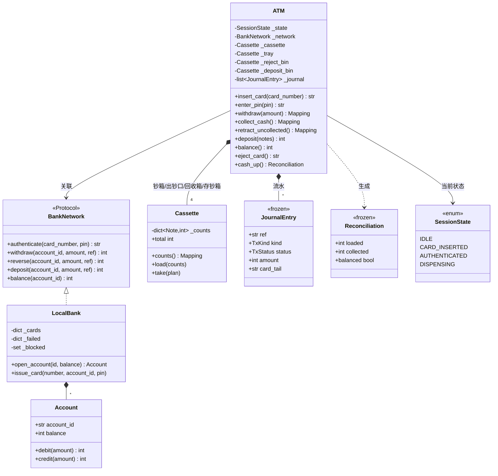

# 设计题解：ATM 取款机（ATM）

## 题目与澄清

面试官通常这样开场："设计一台 ATM。客户插卡、输密码，然后取款、存款或者查余额，最后退卡。"

这道题看上去和[[solution-vending-machine|自动售货机]]是一家：都是一台机器、一个状态机、一个要
往外吐东西的口子。状态机那一半确实是同一套手艺——把"什么动作在什么状态下合法"做成一张表，
把"数据够不够"做成守卫，失败时原地不动——那部分的论证在售货机那篇里已经完整给过，这里不再重复。
ATM 真正不一样的地方只有一句话：**钱不在这台机器里**。

售货机里的币箱就是账本，加一枚硬币和记一笔账是同一个动作。ATM 不是：余额在银行的账户上，
钞票在机器的钞箱里，它们是两个各自有锁、各自有不变式、而且**中间隔着一条会超时的网络**的权威。
一次取款要同时改动它们两个，而世界上并不存在一条能同时提交这两边的事务。这道题的全部难度就
压在这句话上。所以值得当场问清楚的是：

- **谁是余额的权威？** 唯一正确的答案是银行，不是 ATM。ATM 永远不该持有一个可写的账户对象；
  它能做的只是"请银行扣一笔"和"请银行冲正一笔"，扣不扣得动由银行说了算。把这句话说出口，
  后面"要不要在 ATM 里缓存余额""断网了能不能先给钱"这些追问就都有了统一答案。
- **钞票和余额不一致时，谁吃亏？** 这才是题眼。既然做不到原子，就必须选一个顺序，并说清楚
  每个顺序在机器卡钞（jam）、断电、网络超时时各自丢什么。含糊其辞地说"用事务保证一致"是这
  道题最常见的送分失败。
- **金额怎么表示？** 整数的最小货币单位（分）。ATM 还多一条：金额不但是整数，还必须是
  **面额能表达的**整数。机器里只有 10／20／50／100 元的钞票时，123 元这个数字无论钞箱装多满
  都吐不出来——这和"钞箱不够"是两种完全不同的失败，屏幕上要说的下一步也不同。
- **一次会话能做几笔交易？** 约定成"认证一次、可以连着做多笔、最后退卡"。这决定了
  `AUTHENTICATED` 是一个**可以自环**的状态，而不是做完一笔就回到待机。
- **密码验在哪？** 真实系统里密码块在加密硬件（HSM）里比对，ATM 从头到尾看不见明文 PIN。
  本文把它简化成向银行发一次 `authenticate`，但"ATM 不存密码、也不判断对错"这个边界要保住。

**不在范围内**：转账与跨账户交易（只是多一次 `network` 调用，不产生新结构）、打印凭条的
排版、屏幕与键盘的 UI 事件循环、真实报文（ISO 8583）的字段编码、防撬防尾随这些物理安全。

## 需求与分级

机器编码轮是一关一关加需求的，每一关都在考"上一关写下的东西要不要推翻"。

**第 1 关——会话状态机。** 插卡 → 输密码 → 办业务 → 退卡。每一个不该发生的顺序都要**按名字**
被拒绝："没插卡就取款""没输密码就查余额""出钞过程中退卡"。密码连错三次，卡被机器留下。
这一关的产物是 `SessionState`、`Action` 和那张授权表 `TRANSITIONS`。

**第 2 关——取款。** 出钞不是 `balance -= amount` 这么一行，而是要从**钞箱里实际装着的面额**
中凑出这个金额。凑不出来是一个一等公民的业务结果，不是 `assert`。同时，账户余额和钞箱存量
不许出现分歧：必须定下操作顺序，并说得出机器卡钞时这个顺序丢的是什么。产物是 `Cassette`、
`fewest_notes`、`AmountNotDispensableError` 和 `ATM.withdraw` 里那段留钞—扣账—交钞。

**第 3 关——存款、查询与流水。** 存款要回答"钞票进哪个箱"，查询要回答"余额从哪来"，而两者
都要回答"事后怎么证明"。产物是 `JournalEntry` 那条只增不改的流水、`retract_uncollected`
这条冲正路径，以及 `cash_up()` 这个把钞票守恒变成一行断言的对账口。

**第 4 关——第二家银行。** 换一张别的银行的卡，要能通过跨行转接网络办业务并收一笔手续费，
而会话状态机、钞箱、选钞、流水**一行都不许改**。这一关在这份代码里的产物只有一样：
`BankNetwork` 协议——机器唯一的对外接缝。转接网络本身**不在 `solution.py` 里**，它写在测试
里（连同一个"扣账永远失败"的网络），因为"扩展不需要动机器"这件事，只有当新实现写在机器
外面、而机器一行未改时才算真的被证明。第 4 关是前三关设计质量的验收：如果这时候你发现自己
要往 `SessionState` 里加成员，说明第 1 关把"银行是谁"混进了会话状态。

## 核心对象与职责

这份设计里有两个权威，其余的类都在为"它们俩怎么对上账"服务。

| 类 | 单一职责 | 它拥有的不变式 |
|---|---|---|
| `Account` | 一个账户的余额 | 余额不为负；检查与扣减在同一把锁里做完 |
| `LocalBank` | 发卡行：账户、卡、密码错误计数 | 一张卡的错误次数全行唯一；连错三次即冻结 |
| `Cassette` | 数钞票：每种面额各几张 | 张数归零的面额从表里消失 |
| `fewest_notes` | 选钞策略（纯函数） | 只要存在凑法就一定找得到，且张数最少 |
| `JournalEntry` | 一次动作发生过什么 | 不可变；流水只增不改，冲正是新增一条 |
| `Reconciliation` | 一次对账的结果 | `balanced` 就是钞票守恒这条式子本身 |
| `ATM` | 会话状态机 + 钞箱调度 + 流水 | 同时最多一个会话；钞票守恒；失败只回滚本地 |

**归属关系**：`ATM` **组合**（composition）它的四个 `Cassette`——钞箱、出钞口、回收箱、存钞箱
的生命周期和机器一样长，机器没了它们也没了。`ATM` 与 `BankNetwork` 是**关联**（association）：
网络是构造时传进来的，一台机器换一个网络不影响网络自己的存亡，反过来一个网络接着几百台机器。
`LocalBank` 组合它的 `Account`。特别要注意 `ATM` 和 `Account` 之间**什么关系都没有**——
`BankNetwork` 协议里根本没有 `get_account()`，于是"ATM 偷偷改别人余额"在类型层面就不可能发生。

出钞口、回收箱、存钞箱用的都是 `Cassette` 这一个类，只是角色不同。这不是偷懒：它们的共同职责
就是"数钞票"，而正因为四个箱子说同一种语言，钞票守恒才能写成一个加法。



## 关键设计决策

### 决策一：密码错误次数归谁，吞卡归谁

"连错三次吞卡"听起来是一件事，其实是两件，而它们属于两个不同的对象。

先看把计数放在机器里会发生什么：

```python
class ATM:
    def enter_pin(self, pin: str) -> str:
        if not self._bank.check(self._card, pin):
            self._attempts += 1          # 机器自己数
            if self._attempts >= 3:
                self._retain_card()
```

这段代码在单机演示里毫无破绽，放进真实的街区就立刻漏成筛子：小偷捡到一张卡，在这台机器上试
两次，走到隔壁那台再试两次，再下一台再试两次——每台机器的 `_attempts` 都只有 2，永远触发不了
冻结。**错误次数是卡的属性，不是机器的属性**，所以它必须住在发卡行：

```python
class LocalBank:
    def authenticate(self, card_number: str, pin: str) -> str:
        with self._lock:
            record = self._cards.get(card_number)
            if card_number in self._blocked or record is None or record[1] != pin:
                if card_number in self._blocked:
                    raise WrongPinError(0)        # 作废的卡：同一个异常，不多给一个字
                failed = self._failed.get(card_number, 0) + 1
                remaining = max(0, self._max_attempts - failed)
                if remaining == 0:
                    self._blocked.add(card_number)
                    self._failed.pop(card_number, None)   # 作废之后计数没有意义了
                else:
                    self._failed[card_number] = failed
                raise WrongPinError(remaining)
            self._failed.pop(card_number, None)   # 输对一次，前面的错清零
            return record[0]
```

那机器还剩什么责任？**塑料在机器手里**。冻结账户是银行的事，把卡片物理留下只能是机器的事。
于是同一次"第三次输错"产生两个效果，各归其主：银行把卡号加进 `_blocked`，机器执行
`RETAIN_CARD` 转移、清空会话、写一条 `CARD_RETAINED` 流水。测试也就顺理成章地分成两条：
一条断言三台不同的 ATM 上各错一次照样吞卡，一条断言吞卡之后重新插卡、输**正确**密码也进不去。

顺带一个安全细节，它值钱但几乎没人主动提：**卡不存在和密码错误必须抛同一个异常**。上面那段
代码里，`record is None` 和 `record[1] != pin` 故意走同一条分支、产生同一条消息、消耗同一个
计数。分开报错的机器就是一台账号枚举器——插一张卡、随便输一次，就能问出"这张卡存不存在"。
连"这张卡已经被作废了"也走同一条出口：作废的卡抛的仍然是 `WrongPinError`，`remaining` 为 0，
于是机器照常吞卡，而外面的人分不出"密码错了三次"和"这张卡早就报废了"。同理，`insert_card`
里什么都不验证：认不认识这张卡，要等密码来了才知道。

### 决策二：先扣账还是先吐钞——两个权威之间没有事务

这是整道题最该花时间的地方。一次取款要改两处状态：银行的余额、机器的钞箱。它们分属两个
进程（现实中是两个机房），**不存在一次提交能同时管住两边**。所以不要试图论证"怎样才能原子"，
要论证的是"不原子的时候，谁多吃一点亏，以及事后怎么发现"。

三种顺序，各自的代价：

```python
# 甲：先吐钞，再扣账
dispenser.dispense(plan); network.withdraw(account, amount, ref)
# 乙：先扣账，再吐钞
network.withdraw(account, amount, ref); dispenser.dispense(plan)
# 丙：先从钞箱里把钞票"留"出来，再扣账，扣成了才交到出钞口
cassette.take(plan); network.withdraw(account, amount, ref); tray.load(plan)
```

**甲是不能选的。** 钞票离开机器的那一刻就再也收不回来了。如果扣账那一步网络超时、账户冻结、
余额不足，钱已经在客户手上，银行只能事后追讨一个已经走掉的人。它把不可逆的一步放在了可逆的
一步前面，方向就错了。

**乙比甲好，但有一个真实的坑。** 扣账成功、吐钞之前，另一笔交易可能把钞箱掏空——于是账扣了、
钞没有。有人会在这里包一个 `try/except` 去"回滚"，但那不是回滚，那是补偿：钱已经在银行那边
少了，你只能再发一笔冲正。更糟的是，如果这台机器同时被面板和远程接口驱动，"检查钞箱够不够"
和"真的拿走"之间的窗口是一个实打实的竞态，`try` 关不住它。

**丙是本文的选择。** 关键动作是把"检查钞箱"和"占用钞箱"合成一步：

```python
plan = self._plan(amount)      # 三种"取不出"都在这里报错，此刻钞箱一张没动
self._cassette.take(plan)      # 留钞：抽出来之后，没有任何人能再把它取走
ref = self._new_ref()
try:
    self._network.withdraw(self._account_id, amount, ref)
except ATMError:
    self._cassette.load(plan)  # 远端一分没动，本地原样放回
    self._log(TxKind.WITHDRAWAL, amount, TxStatus.DECLINED, ref)
    raise
self._tray.load(plan)          # 扣账成功了才交到出钞口
```

这个顺序遵守一条可以背下来的纪律：**回滚永远只发生在本地那一半**。钞箱在本进程里、在同一把
锁下，放回去是确定成功的；账户在网络对面，一旦动了就再也"放不回去"，只能补一笔冲正。

那机器卡钞怎么办？诚实的答案是：**做不到零损失，只能做到可发现、可追回**。钞票已经从钞箱里
抽走、账也扣了，但钱并没有到客户手上。本文把这种情形具体化成"客户没把钱拿走"这条真实路径：

```python
def retract_uncollected(self) -> Mapping[Note, int]:
    ref, amount = self._pending
    taken = dict(self._tray.counts())
    self._tray.take(taken)
    self._reject_bin.load(taken)                       # 收进回收箱，永不再出
    self._network.reverse(self._account_id, amount, ref)   # 请银行冲正
    self._log(TxKind.REVERSAL, amount, TxStatus.REVERSED, ref, ...)
```

三个细节都不是装饰：钞票进**回收箱**而不是放回钞箱，因为被退回的钞票来路已经不确定，再吐给
下一位客户就把一次纠纷变成两次；冲正走 `network.reverse` 而不是 `account.balance += amount`，
因为 ATM 不是余额的权威——在账户那一层冲正确实只是一次普通的贷记，让它成为"冲正"的是流水里
那条引用原 `ref` 的记录，以及它必须经由银行的入口；冲正是**新增**一条带着原 `ref` 的流水，原来那条 `OK` 记录**永远不改**
——事后要能同时看到"发生过"和"被抵消了"，把原记录改掉等于销毁证据。

最后，把"没吞钱"变成一条随时可验的式子，而不是一句承诺：

```python
loaded == in_cassette + on_tray + in_reject_bin + collected
```

这就是 `cash_up().balanced`。任何一条路径漏了一步，这个等式就会在测试里当场崩掉——它是这个
设计里最有价值的一条不变式，也是面试时最值得主动说出口的一句话。

### 决策三：选钞——拒绝责任链，并把"取不出"分成三种

流行的做法是责任链（Chain of Responsibility）：一个 handler 管一种面额，能拿几张拿几张，
余额往下传。

```python
class HundredHandler(Handler):
    def handle(self, amount, inventory):
        take = min(amount // 100_00, inventory[Note.HUNDRED])
        ...
        return self.next.handle(amount - take * 100_00, inventory)
```

它有两个问题，第二个是致命的。第一，四种面额写四个类、外加一个基类和一个装配函数，换来的
只是一个 `for note in sorted(available, reverse=True)` 循环——在 Python 里这是纯粹的仪式。
第二，**链的形状把贪心焊死在了结构里**。链是"从大到小依次决定"，而这正是贪心；你想换一个更
聪明的算法，得把整条链拆掉。贪心在钞箱缺货时会把本来有解的金额报成取不出——这个论证
[[solution-vending-machine|自动售货机那篇]]已经完整给过，ATM 这边的实例是：钞箱里有
1 张 100、1 张 50、4 张 20，客户要取 80 元。贪心先拿走那张 50，剩下 30 元再也凑不出，于是
拒单；而四张 20 就是一个完美的解。

所以选钞在本文里是一个**可替换的纯函数**（`NoteSelector = Callable[...]`），默认实现是有界
背包 DP，目标函数是**张数最少**：

```python
best: list[list[int | None]] = [[None] * (cells + 1) for _ in range(len(notes) + 1)]
best[0][0] = 0
for i, note in enumerate(notes, start=1):
    unit, row, prev = int(note) // step, best[i], best[i - 1]
    for v in range(cells + 1):
        row[v] = prev[v]
        for used in range(1, available[note] + 1):
            ...
```

张数最少不是审美：送钞机构一次能送的张数有物理上限（真机在 30～60 张之间），张数越多卡钞
概率越高。注意 DP 的格子数先除以了 `step`（所有面额的最大公约数），于是"取 2000 元"的表也
只有两百格，代价完全付得起。

真正把这道题和售货机拉开的是另一件事：**"取不出来"不是一种失败，是三种**，而它们对客户的
建议完全不同。

```python
class DispenseFailure(Enum):
    NOT_REPRESENTABLE = "..."   # 金额不是最小面额的整数倍 → 请改成 10 的倍数
    NOT_IN_STOCK = "..."        # 钞箱凑不出这个组合   → 换个金额，或换台机器
    TOO_MANY_NOTES = "..."      # 张数超过送钞上限     → 分两次取
```

第一种和库存**完全无关**：只要机器最小面额是 10 元，123 元这个数字哪怕钞箱堆到天花板也吐
不出来。它是用 `amount % NOTE_STEP` 判的，`NOTE_STEP = math.gcd(*面额)`。把这三种混成一句
"余额不足或机器故障"，是真实 ATM 上最招人骂的设计，也是面试里最容易被追问倒的地方。

### 决策四：三种交易，不要三个类——拒绝一个模式

几乎所有流行答案都会画出这个继承体系：抽象 `Transaction`，派生 `WithdrawalTransaction`、
`DepositTransaction`、`BalanceInquiryTransaction`，各自实现 `execute()`。它看上去很"面向对象"，
但请先问一句：**这个体系为谁而设？**

命令模式（Command）真正的收益是把"一次操作"变成可以**存起来、排队、重放、撤销**的对象。
如果没有人排队，没有人撤销，没有人重放，那么三个只有 `execute()` 的子类提供的唯一功能，就是
把三个本来五行的方法各自搬进一个文件，再用一个工厂把它们装配回来。这是把方法调用写成了类。

本文的答案是：三个方法（`withdraw` / `deposit` / `balance`）+ **一条不可变的流水**。

```python
@dataclass(frozen=True, slots=True)
class JournalEntry:
    ref: str
    at: datetime
    kind: TxKind
    status: TxStatus
    amount: int
    card_tail: str
    detail: str = ""
```

"交易"这个概念在设计里确实存在，但它的正确形态是**一条记录**，不是一个可执行对象——因为它
真正的需求是事后查、对账、打凭条、被冲正引用，全部是数据需求。顺带解决了两个问题：这条记录
同时就是发给订阅者的事件（监控端拿到它就能更新自己，不必回头去读机器的钞箱字典），而且卡号
在这里只留后四位，因为流水会被导出、被打印。

什么时候该翻回 Command？当出现"离线交易队列"——网络断了先把取款请求排进队列、恢复后重放——
那一刻交易必须能被序列化、被重试、被幂等地执行，Command 就挣到了它的位置。判据是需求，不是
"交易有三种"。

### 决策五：第二家银行——协议挣来的位置

第 4 关要加一张别的银行的卡。如果前面四关做对了，这一关几乎不用动脑：

```python
class BankNetwork(Protocol):
    def authenticate(self, card_number: str, pin: str) -> str: ...
    def withdraw(self, account_id: str, amount: int, ref: str) -> int: ...
    def reverse(self, account_id: str, amount: int, ref: str) -> int: ...
    ...
```

`solution.py` 里只有这个协议和一个实现 `LocalBank`（本行直连）。另外两个实现**写在测试
文件里**：`Interchange`（跨行转接）和 `UnreachableBank`（扣账永远失败的网络）。这个安排是
故意的，而且比把它们塞进 `solution.py` 更能说明问题——"加第二家银行不需要动机器"这句话，
只有当新实现完全写在机器外面、而 `SessionState`、`TRANSITIONS`、`Cassette`、`fewest_notes`、
`JournalEntry`、`cash_up` 一个字符都没改时，才算被证明了。测试跑通，就是证明本身。

转接网络需要的全部东西只有三行签名加一个路由函数：

```python
class Interchange:                                    # 满足 BankNetwork，不继承任何基类
    def authenticate(self, card_number, pin) -> str:  # 按卡号前缀找到成员行
        ...  # 返回 f"{bank_id}:{成员行给的账户号}"
    def withdraw(self, account_id, amount, ref) -> int:
        bank, local = self._route(account_id)         # 从账户标识里劈出路由键
        return bank.withdraw(local, amount + self.fee, ref)   # 跨行费一起扣
    def reverse(self, account_id, amount, ref) -> int:
        bank, local = self._route(account_id)
        return bank.reverse(local, amount + self.fee, ref)    # 冲正连费一起退
```

一个小而关键的技巧就在第一行：**路由键藏在 `authenticate` 的返回值里**（`"CMB:77"`）。于是
ATM 拿到的"账户标识"是一个不透明的字符串，后续每次调用原样递回去就能路由，机器完全不需要
知道世界上有几家银行。最后一行也是一条要说出口的策略：这笔取款没有发生，跨行手续费自然也
不该收，所以冲正退的是 `amount + fee`——这种"顺手就写反了"的地方必须有测试钉住。

`typing.Protocol` 提供的是结构化子类型，三个实现都不需要继承任何基类；协议之所以挣得到
位置，也正是因为真的有不止一个实现，哪怕其中两个的家在测试里。

反过来说，什么**没有**被抽象也值得一提：读卡器和送钞机构。教科书会建议为它们各定义一个
`CardReader` / `CashDispenser` 接口"以便替换硬件"，但在这份设计里它们各自只会有一个实现，
那就是一个只有一个实现的接口——和[[patterns.state|状态模式（State）]]里那种"每个状态都得
是一个类"的教条一样，是没被需求逼出来的结构。送钞机构可变的部分是**策略**（选哪些钞票），
而那已经由一个 `Callable` 表达了。

## 代码走读

下面是全部实现。读的时候盯住三处：授权表 `TRANSITIONS` 如何把非法顺序一次性挡住；
`ATM.withdraw` 那十几行如何把"留钞—扣账—交钞"的顺序固定下来；`cash_up()` 如何把钞票守恒
变成一个可断言的等式。

`Cassette.take` 值得单独看一眼：它**先整体校验再整体扣减**，所以中途失败不会留下扣了一半的
钞箱；而且张数归零的面额会从字典里删掉——选钞算法遍历的就是这张表，留一条"20 元：0 张"会让
它把一种其实没有的钞票算进可用集合，给出一个兑不出来的方案。

`_log()` 是唯一写流水的入口，所以"成功、被拒、吞卡、冲正"四条路径记下来的字段必然是同一套，
卡号也必然在同一个地方被截成后四位。注意失败路径也调用它：一条 `DECLINED` 的流水和一条 `OK`
的流水同样重要——对账时要能回答"这台机器今天拒了多少笔、为什么"。

%% code:begin solution.py %%
```python
"""ATM 取款机——会话状态机、钞票选取，以及"账户余额"和"钞箱存量"两个权威之间的对账。

核心思路：会话合法性是一张 `dict[(状态, 动作), 新状态]` 的授权表，非法动作按名字拒绝；
PIN 失败计数归发卡行（换一台机器接着错，还是同一个计数），吞卡归机器（塑料在机器手里）。
取款跨两个权威，没有原子性可言，于是顺序定死为"先从钞箱抽出钞票 → 再请银行扣账 → 最后
交到出钞口"：失败时回滚的永远是**本地**那一半，远端那一半只能用一笔冲正（reversal）抵消，
并落在只增不改的流水里。钞票守恒（钞箱＋出钞口＋回收箱＋已取走＝装钞总额）由 `cash_up()`
随时可验——这条不变式才是这台机器"没吞钱"的证据。
"""

from __future__ import annotations

import math
import threading
from collections.abc import Callable, Mapping
from dataclasses import dataclass, field
from datetime import datetime
from enum import Enum, IntEnum
from types import MappingProxyType
from typing import Protocol

YUAN = 100  # 金额一律用整数分；面额、余额都是分


class Note(IntEnum):
    """机器支持的钞票面额（单位：分）。枚举值就是面值，可以直接参与算术。"""

    TEN = 10 * YUAN
    TWENTY = 20 * YUAN
    FIFTY = 50 * YUAN
    HUNDRED = 100 * YUAN


# 面额的最大公约数：不是它整数倍的金额，**无论钞箱装多满**都吐不出来。
NOTE_STEP = math.gcd(*(int(n) for n in Note))
# 送钞机构一次能送出的张数上限，真实机器在 30～60 张之间。
MAX_NOTES_PER_DISPENSE = 40


class SessionState(Enum):
    """一次会话所处的阶段。只有四个，但它是这台机器的安全边界。"""

    IDLE = "idle"
    CARD_INSERTED = "card_inserted"
    AUTHENTICATED = "authenticated"
    DISPENSING = "dispensing"


class Action(Enum):
    """会话里可能发生的动作。带 `_` 前缀的是机器自己触发的，不对外暴露成方法。"""

    INSERT_CARD = "insert_card"
    ENTER_PIN = "enter_pin"
    PIN_REJECTED = "_pin_rejected"
    RETAIN_CARD = "_retain_card"
    BALANCE = "balance"
    DEPOSIT = "deposit"
    WITHDRAW = "withdraw"
    COLLECT_CASH = "collect_cash"
    EJECT = "eject_card"


# 授权表：会话状态机的全部合法转移。表里没有的组合一律非法，于是"没插卡就取款""没输密码
# 就查余额""出钞过程中退卡"由同一份数据统一拒绝，而且能被一个穷举测试盖满。
TRANSITIONS: dict[tuple[SessionState, Action], SessionState] = {
    (SessionState.IDLE, Action.INSERT_CARD): SessionState.CARD_INSERTED,
    (SessionState.CARD_INSERTED, Action.ENTER_PIN): SessionState.AUTHENTICATED,
    (SessionState.CARD_INSERTED, Action.PIN_REJECTED): SessionState.CARD_INSERTED,
    (SessionState.CARD_INSERTED, Action.RETAIN_CARD): SessionState.IDLE,
    (SessionState.CARD_INSERTED, Action.EJECT): SessionState.IDLE,
    (SessionState.AUTHENTICATED, Action.BALANCE): SessionState.AUTHENTICATED,
    (SessionState.AUTHENTICATED, Action.DEPOSIT): SessionState.AUTHENTICATED,
    (SessionState.AUTHENTICATED, Action.WITHDRAW): SessionState.DISPENSING,
    (SessionState.AUTHENTICATED, Action.EJECT): SessionState.IDLE,
    (SessionState.DISPENSING, Action.COLLECT_CASH): SessionState.AUTHENTICATED,
}


class ATMError(Exception):
    """本设计全部失败路径的公共基类。"""


class IllegalActionError(ATMError):
    """这个动作在当前会话状态下不合法（授权表里没有这一项）。"""


class WrongPinError(ATMError):
    """密码错误。

    卡不存在、卡已被冻结，报的也是它，连消息都一样——否则这台机器就成了账号枚举器。
    `remaining` 是这张卡还剩几次机会；为 0 表示卡已经作废，机器应当把它留下。
    """

    def __init__(self, remaining: int) -> None:
        super().__init__(f"wrong PIN, {remaining} attempt(s) left")
        self.remaining = remaining


class CardRetainedError(ATMError):
    """卡被机器吞掉了（连续三次密码错误，或插入了一张已作废的卡）。"""


class InvalidAmountError(ATMError):
    """金额不是正数，或者钞票张数为负。"""


class InsufficientFundsError(ATMError):
    """账户余额不足。这条不变式归账户所有，ATM 只能听银行的回答。"""


class DispenseFailure(Enum):
    """"取不出来"的三种理由。分清楚它们，屏幕才说得出下一步该怎么办。"""

    NOT_REPRESENTABLE = "amount is not a multiple of the smallest note"
    NOT_IN_STOCK = "the cassettes cannot make this amount"
    TOO_MANY_NOTES = "the amount needs more notes than the feeder can move"


class AmountNotDispensableError(ATMError):
    """这笔金额吐不出来。`reason` 说明是哪一种，账户和钞箱都没有被动过。"""

    def __init__(self, amount: int, reason: DispenseFailure) -> None:
        super().__init__(f"cannot dispense {amount}: {reason.value}")
        self.amount = amount
        self.reason = reason


class TxKind(Enum):
    """流水的种类。"""

    WITHDRAWAL = "withdrawal"
    DEPOSIT = "deposit"
    BALANCE = "balance"
    REVERSAL = "reversal"
    PIN_FAILURE = "pin_failure"
    CARD_RETAINED = "card_retained"


class TxStatus(Enum):
    """流水的结局。`REVERSED` 是一条**新增**的冲正记录，原记录永远不改。"""

    OK = "ok"
    DECLINED = "declined"
    REVERSED = "reversed"


@dataclass(frozen=True, slots=True)
class JournalEntry:
    """一条流水：一次动作发生过什么。不可变、只增不改。

    它自带读它的人需要的全部字段，因此对账、打凭条、集中监控都不必回头去读机器的内部
    容器。卡号只留后四位：流水会被导出、被打印，不该带着完整卡号到处跑。
    """

    ref: str
    at: datetime
    kind: TxKind
    status: TxStatus
    amount: int
    card_tail: str
    detail: str = ""


@dataclass(frozen=True, slots=True)
class Reconciliation:
    """一次对账（cash-up）的结果：机器该有多少钞票、实际有多少。"""

    loaded: int
    in_cassette: int
    on_tray: int
    in_reject_bin: int
    collected: int
    deposited: int

    @property
    def balanced(self) -> bool:
        """钞票守恒：装进来的钱要么还在机器里，要么被客户拿走了，不会凭空消失。"""
        return self.loaded == self.in_cassette + self.on_tray + self.in_reject_bin + self.collected


class Cassette:
    """一组钞箱：每种面额各有多少张。出钞口、回收箱、存钞箱都是它的不同角色。

    不变式：张数降到 0 的面额会被从字典里删掉。这不是洁癖——选钞算法遍历的就是这张表，
    留一条"20 元：0 张"会让它把一种其实没有的钞票算进可用集合，于是给出一个兑不出来的
    方案，而这种错往往要等到送钞那一刻才暴露。
    """

    def __init__(self, counts: Mapping[Note, int] | None = None) -> None:
        self._counts: dict[Note, int] = {n: c for n, c in (counts or {}).items() if c > 0}

    def counts(self) -> Mapping[Note, int]:
        """一份只读快照；钞箱从不把自己的字典交出去。"""
        return MappingProxyType(dict(self._counts))

    @property
    def total(self) -> int:
        """箱内金额合计（分）。"""
        return sum(int(note) * c for note, c in self._counts.items())

    @property
    def note_count(self) -> int:
        """箱内张数。

        它是一个只读的计数，所以测试可以断言"钞箱少了正好这么多张"，而不必去读内部字典。
        对账时"金额对得上、张数对不上"意味着某处把面额记错了。
        """
        return sum(self._counts.values())

    def load(self, counts: Mapping[Note, int]) -> None:
        """装钞，也用于把留好的钞票原样放回。"""
        for note, c in counts.items():
            if c < 0:
                raise InvalidAmountError(f"cannot load {c} × {note.name}")
            if c:
                self._counts[note] = self._counts.get(note, 0) + c

    def take(self, plan: Mapping[Note, int]) -> None:
        """按方案取走钞票：先整体校验再整体扣减，取空的面额立刻从字典里消失。"""
        for note, c in plan.items():
            if self._counts.get(note, 0) < c:
                raise AmountNotDispensableError(
                    sum(int(n) * k for n, k in plan.items()), DispenseFailure.NOT_IN_STOCK)
        for note, c in plan.items():
            if not c:
                continue
            self._counts[note] -= c
            if self._counts[note] == 0:
                del self._counts[note]


# 选钞策略：给金额和一份"可用钞票"计数，给出一种凑法或者 `None`。纯函数，构造时注入。
NoteSelector = Callable[[int, Mapping[Note, int]], "dict[Note, int] | None"]


def fewest_notes(amount: int, available: Mapping[Note, int]) -> dict[Note, int] | None:
    """有界背包 DP：在库存允许的所有凑法里选张数最少的一种，没有凑法就返回 `None`。

    张数最少不是审美：送钞机构一次能送的张数有硬上限，张数少还意味着卡钞概率低、清点快。
    规模是"几种面额 × 几百个格子"，这点代价完全付得起，换来的是绝不误报"取不出"——
    那等于把一次本可以成交的取款拒掉。
    """
    if amount == 0:
        return {}
    step = math.gcd(*(int(n) for n in available)) if available else 0
    if step == 0 or amount % step:
        return None
    notes = sorted(available, reverse=True)
    cells = amount // step
    # best[i][v]：只用前 i 种面额凑出 v*step 所需的最少张数，`None` 表示凑不出。
    best: list[list[int | None]] = [[None] * (cells + 1) for _ in range(len(notes) + 1)]
    best[0][0] = 0
    for i, note in enumerate(notes, start=1):
        unit, row, prev = int(note) // step, best[i], best[i - 1]
        for v in range(cells + 1):
            row[v] = prev[v]
            for used in range(1, available[note] + 1):
                if used * unit > v:
                    break
                head = prev[v - used * unit]
                if head is not None and (row[v] is None or head + used < row[v]):
                    row[v] = head + used
    if best[len(notes)][cells] is None:
        return None
    plan: dict[Note, int] = {}
    v = cells
    for i in range(len(notes), 0, -1):  # 回溯：逐层问"这一种面额到底用了几张"
        note, unit = notes[i - 1], int(notes[i - 1]) // step
        for used in range(available[note] + 1):
            head = best[i - 1][v - used * unit] if used * unit <= v else None
            if head is not None and head + used == best[i][v]:
                if used:
                    plan[note] = used
                v -= used * unit
                break
    return plan


@dataclass(slots=True)
class Account:
    """一个账户：余额，以及守着余额的那把锁。这条不变式归它所有，谁也替不了它。

    不变式：余额不为负。检查和扣减必须在同一把锁里做完——"先查后扣"分成两步就会被两个
    线程同时通过，这正是 GIL 保护不了的那类竞态。
    """

    account_id: str
    balance: int = 0
    lock: threading.Lock = field(default_factory=threading.Lock, repr=False, compare=False)

    def debit(self, amount: int) -> int:
        """扣款。不变式过了才动余额，否则一分不动。返回扣后余额。"""
        with self.lock:
            if amount > self.balance:
                raise InsufficientFundsError(f"balance {self.balance} < {amount}")
            self.balance -= amount
            return self.balance

    def credit(self, amount: int) -> int:
        """贷记：存款走它，冲正也走它。

        在账户这一层，冲正就是一次普通的贷记；让它成为"冲正"的是流水里那条引用原 `ref`
        的记录，以及它必须经由银行的 `reverse` 入口——ATM 没有别的路可以把钱加回去。
        """
        with self.lock:
            self.balance += amount
            return self.balance


class BankNetwork(Protocol):
    """ATM 能向"网络另一端"提出的全部问题，也是这台机器唯一的对外接缝。

    它把"余额归银行"从一句口号变成结构：这里**没有** `get_account()`，所以 ATM 永远拿不到
    账户对象，也就永远改不了任何人的余额，连写错的机会都没有。换一家银行、换一张跨行转接
    网络、换一个会超时的桩，都只是换一个满足这个协议的对象，机器本身一行不改。
    """

    def authenticate(self, card_number: str, pin: str) -> str:
        """验密码，通过则返回一个带路由信息的账户标识。"""

    def balance(self, account_id: str) -> int: ...

    def withdraw(self, account_id: str, amount: int, ref: str) -> int:
        """扣账成功返回扣后余额；失败抛异常，且保证远端一分未动。"""

    def deposit(self, account_id: str, amount: int, ref: str) -> int: ...

    def reverse(self, account_id: str, amount: int, ref: str) -> int:
        """冲正 `ref` 那笔取款。这是银行的补偿动作，不是 ATM 自己把钱加回去。"""


class LocalBank:
    """发卡行：管账户、管卡、管密码错误次数。

    密码错误计数放在银行而不是机器里，理由很直白：在三台不同的 ATM 上各错一次，仍然是
    三次错。机器能做的只是把塑料留下，让卡作废是银行的事。
    """

    def __init__(self, bank_id: str = "BANK", max_pin_attempts: int = 3) -> None:
        self.bank_id = bank_id
        self._max_attempts = max_pin_attempts
        self._accounts: dict[str, Account] = {}
        self._cards: dict[str, tuple[str, str]] = {}  # 卡号 -> (账户号, 密码)
        self._failed: dict[str, int] = {}
        self._blocked: set[str] = set()
        self._lock = threading.Lock()

    def open_account(self, account_id: str, balance: int = 0) -> Account:
        account = Account(account_id, balance=balance)
        self._accounts[account_id] = account
        return account

    def issue_card(self, card_number: str, account_id: str, pin: str) -> None:
        self._cards[card_number] = (account_id, pin)

    def account(self, account_id: str) -> Account:
        """给测试和柜面用的直查；ATM 走不到这里，`BankNetwork` 协议里没有它。"""
        return self._accounts[account_id]

    def authenticate(self, card_number: str, pin: str) -> str:
        """卡不存在、密码错、卡已作废，三种情形走同一条分支、抛同一个异常。"""
        with self._lock:
            record = self._cards.get(card_number)
            if card_number in self._blocked or record is None or record[1] != pin:
                if card_number in self._blocked:
                    raise WrongPinError(0)
                failed = self._failed.get(card_number, 0) + 1
                remaining = max(0, self._max_attempts - failed)
                if remaining == 0:
                    # 作废之后计数就没有意义了：再来的请求在上面那一行就被挡住。
                    self._blocked.add(card_number)
                    self._failed.pop(card_number, None)
                else:
                    self._failed[card_number] = failed
                raise WrongPinError(remaining)
            self._failed.pop(card_number, None)
            return record[0]

    def balance(self, account_id: str) -> int:
        return self._accounts[account_id].balance

    def withdraw(self, account_id: str, amount: int, ref: str) -> int:
        return self._accounts[account_id].debit(amount)

    def deposit(self, account_id: str, amount: int, ref: str) -> int:
        return self._accounts[account_id].credit(amount)

    def reverse(self, account_id: str, amount: int, ref: str) -> int:
        return self._accounts[account_id].credit(amount)


class ATM:
    """一台取款机：会话状态机、钞箱、流水，以及一条通往银行的网络。

    不变式：
    1. 任意时刻最多一个会话；退卡或吞卡后卡号、账户标识立刻清空。
    2. 钞票守恒：装钞总额 = 钞箱 + 出钞口 + 回收箱 + 客户已取走，`cash_up()` 随时可验。
    3. 取款失败时回滚本地那一半（留好的钞票原样放回钞箱），远端那一半发一笔冲正；
       两者都在流水里留痕，流水只增不改。
    4. 一把粗锁保护"查状态 → 查守卫 → 改状态"；一台机器只有一个出钞口，本就没有并行度
       可榨，细化锁只换来死锁风险。
    """

    def __init__(self, network: BankNetwork, cassette: Cassette, *,
                 selector: NoteSelector = fewest_notes,
                 clock: Callable[[], datetime] = datetime.now,
                 machine_id: str = "ATM-01") -> None:
        self._network = network
        self._cassette = cassette
        self._selector = selector
        self._clock = clock
        self._machine_id = machine_id
        self._tray = Cassette()          # 出钞口：已交付、客户还没拿走
        self._reject_bin = Cassette()    # 回收箱：客户没拿走被收回的钞票，永不再出
        self._deposit_bin = Cassette()   # 存钞箱：客户存进来的钞票，也永不再出
        self._loaded = cassette.total
        self._collected = 0
        self._deposited = 0
        self._state = SessionState.IDLE
        self._card: str | None = None
        self._account_id: str | None = None
        self._pending: tuple[str, int] | None = None  # 出钞口上那笔钱的 (流水号, 金额)
        self._seq = 0
        self._journal: list[JournalEntry] = []
        self._lock = threading.RLock()

    # ---- 只读视图：一律交出快照或计数，从不把内部容器交出去 ----

    @property
    def state(self) -> SessionState:
        return self._state

    def cassette_counts(self) -> Mapping[Note, int]:
        with self._lock:
            return self._cassette.counts()

    def tray_counts(self) -> Mapping[Note, int]:
        """出钞口上正等着客户拿走的钞票。取款和收回都靠它才能被独立地断言。"""
        with self._lock:
            return self._tray.counts()

    def journal(self) -> tuple[JournalEntry, ...]:
        with self._lock:
            return tuple(self._journal)

    def cash_up(self) -> Reconciliation:
        """对账：把机器里现在的钱和装钞总额摆在一起。`balanced` 为假就该停机查。"""
        with self._lock:
            return Reconciliation(loaded=self._loaded, in_cassette=self._cassette.total,
                                  on_tray=self._tray.total, in_reject_bin=self._reject_bin.total,
                                  collected=self._collected, deposited=self._deposited)

    # ---- 第 1 关：会话状态机 ----

    def insert_card(self, card_number: str) -> SessionState:
        """插卡。

        **这里什么都不验证**：卡认不认识要等密码来了才知道，否则插一张卡就能试出它存不存在，
        机器成了账号枚举器。
        """
        with self._lock:
            nxt = self._next(Action.INSERT_CARD)
            self._card = card_number
            self._state = nxt
            return self._state

    def enter_pin(self, pin: str) -> SessionState:
        """输密码。错了留在原状态（还有机会），最后一次错由银行作废、由机器吞卡。"""
        with self._lock:
            self._next(Action.ENTER_PIN)
            assert self._card is not None
            try:
                self._account_id = self._network.authenticate(self._card, pin)
            except WrongPinError as exc:
                self._log(TxKind.PIN_FAILURE, 0, TxStatus.DECLINED,
                          detail=f"remaining={exc.remaining}")
                if exc.remaining > 0:
                    self._state = self._next(Action.PIN_REJECTED)
                    raise
                self._retain_card("no attempts left")
                raise CardRetainedError("card retained: no attempts left") from exc
            self._state = SessionState.AUTHENTICATED
            return self._state

    def eject_card(self) -> SessionState:
        """退卡，会话结束。出钞过程中不允许——钱还在口上，卡不能先走。"""
        with self._lock:
            nxt = self._next(Action.EJECT)
            self._card = self._account_id = None
            self._state = nxt
            return self._state

    # ---- 第 2 关：取款 ----

    def withdraw(self, amount: int) -> Mapping[Note, int]:
        """取款：先留钞、再扣账、最后把钞票放到出钞口，返回这次送出的面额组合。

        顺序是这道题的题眼。留钞（把钞票从钞箱里抽出来）放在扣账之前，是因为钞箱是本地的、
        回滚干净；扣账放在交钞之前，是因为钞票一旦离开机器就再也收不回来。中间任何一步
        失败，回滚的都是本地那一半。
        """
        with self._lock:
            nxt = self._next(Action.WITHDRAW)
            assert self._account_id is not None
            if amount <= 0:
                raise InvalidAmountError(f"amount must be positive, got {amount}")
            plan = self._plan(amount)      # 三种"取不出"都在这里报错，此刻钞箱没动
            self._cassette.take(plan)      # 留钞：抽出来之后没人能再把它取走
            ref = self._new_ref()
            try:
                self._network.withdraw(self._account_id, amount, ref)
            except ATMError:
                self._cassette.load(plan)  # 远端一分没动，本地原样放回
                self._log(TxKind.WITHDRAWAL, amount, TxStatus.DECLINED, ref)
                raise
            self._tray.load(plan)
            self._pending = (ref, amount)
            self._log(TxKind.WITHDRAWAL, amount, TxStatus.OK, ref)
            self._state = nxt
            return MappingProxyType(dict(plan))

    def collect_cash(self) -> Mapping[Note, int]:
        """客户取走现金，会话回到菜单。"""
        with self._lock:
            nxt = self._next(Action.COLLECT_CASH)
            taken = dict(self._tray.counts())
            self._tray.take(taken)
            self._collected += sum(int(n) * c for n, c in taken.items())
            self._pending = None
            self._state = nxt
            return MappingProxyType(taken)

    def retract_uncollected(self) -> Mapping[Note, int]:
        """超时无人取走：钞票收进回收箱，并向银行发一笔冲正把钱退回账户。

        收进回收箱而不是放回钞箱，是真实机器的做法——被退回的钞票来路已经不确定，再吐给
        下一位客户就把一次纠纷变成两次。这也是"冲正"这条路径唯一的实现出口。
        """
        with self._lock:
            if self._state is not SessionState.DISPENSING or self._pending is None:
                raise IllegalActionError("nothing to retract")
            ref, amount = self._pending
            taken = dict(self._tray.counts())
            self._tray.take(taken)
            self._reject_bin.load(taken)
            assert self._account_id is not None
            self._network.reverse(self._account_id, amount, ref)
            self._log(TxKind.REVERSAL, amount, TxStatus.REVERSED, ref,
                      detail="uncollected cash retracted")
            self._pending = None
            self._state = self._next(Action.COLLECT_CASH)
            return MappingProxyType(taken)

    # ---- 第 3 关：查询与存款 ----

    def balance(self) -> int:
        """查余额。余额永远从网络问来，机器自己不缓存——它不是余额的权威。"""
        with self._lock:
            nxt = self._next(Action.BALANCE)
            assert self._account_id is not None
            current = self._network.balance(self._account_id)
            self._log(TxKind.BALANCE, 0, TxStatus.OK)
            self._state = nxt
            return current

    def deposit(self, notes: Mapping[Note, int]) -> int:
        """存款：钞票进存钞箱（未验真的钞票不能再吐给下一个人），账户入账，返回新余额。"""
        with self._lock:
            nxt = self._next(Action.DEPOSIT)
            assert self._account_id is not None
            amount = sum(int(n) * c for n, c in notes.items())
            if amount <= 0:
                raise InvalidAmountError("deposit must contain at least one note")
            ref = self._new_ref()
            self._deposit_bin.load(notes)
            self._deposited += amount
            new_balance = self._network.deposit(self._account_id, amount, ref)
            self._log(TxKind.DEPOSIT, amount, TxStatus.OK, ref)
            self._state = nxt
            return new_balance

    # ---- 内部 ----

    def _plan(self, amount: int) -> dict[Note, int]:
        """选钞，并把"取不出"分成三种可执行的理由。此刻钞箱一张钞票都没动。"""
        if amount % NOTE_STEP:
            raise AmountNotDispensableError(amount, DispenseFailure.NOT_REPRESENTABLE)
        plan = self._selector(amount, self._cassette.counts())
        if plan is None:
            raise AmountNotDispensableError(amount, DispenseFailure.NOT_IN_STOCK)
        if sum(plan.values()) > MAX_NOTES_PER_DISPENSE:
            raise AmountNotDispensableError(amount, DispenseFailure.TOO_MANY_NOTES)
        return plan

    def _retain_card(self, why: str) -> None:
        """吞卡：先写流水（那时卡号还在），再清空会话。"""
        self._log(TxKind.CARD_RETAINED, 0, TxStatus.DECLINED, detail=why)
        self._card = self._account_id = None
        self._state = self._next(Action.RETAIN_CARD)

    def _next(self, action: Action) -> SessionState:
        """查授权表。表里没有就是非法动作，报错里带上当前状态——客户屏幕和运维日志都靠它。"""
        nxt = TRANSITIONS.get((self._state, action))
        if nxt is None:
            raise IllegalActionError(f"cannot {action.value} while {self._state.value}")
        return nxt

    def _new_ref(self) -> str:
        self._seq += 1
        return f"{self._machine_id}-{self._seq:04d}"

    def _log(self, kind: TxKind, amount: int, status: TxStatus,
             ref: str | None = None, detail: str = "") -> JournalEntry:
        entry = JournalEntry(ref=ref or self._new_ref(), at=self._clock(), kind=kind,
                             status=status, amount=amount,
                             card_tail=(self._card or "****")[-4:], detail=detail)
        self._journal.append(entry)
        return entry


if __name__ == "__main__":
    bank = LocalBank("ICBC")
    bank.open_account("1001", balance=3000 * YUAN)
    bank.issue_card("ICBC-6222-0001", "1001", "1234")
    atm = ATM(bank, Cassette({Note.HUNDRED: 10, Note.FIFTY: 4, Note.TWENTY: 5, Note.TEN: 5}))
    atm.insert_card("ICBC-6222-0001")
    print("认证后:", atm.enter_pin("1234").value)
    print("余额:", atm.balance() / YUAN, "元")
    print("取 780 元:", {n.name: c for n, c in atm.withdraw(780 * YUAN).items()})
    atm.collect_cash()
    print("退卡后:", atm.eject_card().value, "; 对账:", atm.cash_up().balanced)
    for entry in atm.journal():
        print(f"  [journal] {entry.ref} {entry.kind.value} {entry.amount} {entry.status.value}")
```
%% code:end %%

## 测试与自检

二十五个测试按四关排列，每一关的断言都指向那一关的不变式，而不是"方法被调用过"。

**第 1 关**最值钱的是那个穷举测试：4 个状态 × 7 个用户动作 = 28 个组合，减去授权表里合法的 8 个，
剩下 20 个逐一断言抛 `IllegalActionError`，并且断言**被拒绝之后状态没变**。把合法性做成数据的
直接收益就是这个测试写得出来。另外三条是安全断言：三台不同机器上各错一次照样吞卡；吞卡后
输正确密码也进不去；不存在的卡和错误的密码抛出的异常连消息都一模一样。

**第 2 关**围绕"失败路径不留痕"展开。三种 `DispenseFailure` 各一条，每条都额外断言钞箱快照
和账户余额**逐项相等**——"它抛了异常"和"它什么都没弄坏"是两个不同的主张。余额不足那条最关键：
它证明留出来的钞票原样回到了钞箱，否则机器每被拒一次就少一沓钱；紧挨着还有一条把同一件事
换成"远端根本没回话"（注入 `UnreachableBank`），因为这两种失败在代码里走的是同一段回滚，
在现实里却是完全不同的事故。还有一条专门对比贪心与 DP：同一个钞箱，注入贪心的机器拒单，
默认的机器取出四张 20。成功路径则用 `tray_counts()` 断言钞票确实停在出钞口上，用
`Cassette.note_count` 断言钞箱正好少了那么多**张**——两个只读视图都存在，就是为了让测试
不必去碰任何以下划线开头的东西。

**第 3 关**的主角是 `cash_up().balanced`。一条长会话（取款、取走、存款、再取款、超时收回）
跑完之后断言等式仍然成立，同时断言存进来的钞票在存钞箱、被收回的钞票在回收箱，钞箱的组成
没有被它们污染——还有一条直接断言被收回的钞票**再也出不去**：收回之后钞箱空了，下一笔取款
只能被拒。冲正那条要断言原始流水的状态仍然是 `OK`：账是新增一条冲正记录抹平的。

**并发**只测一件事：两台机器同时对同一个账户取 400 元，账上只有 500 元。用 `threading.Barrier`
让两个线程同时起跑，然后断言"恰好一个人成功、一个人拿到 `ATMError`"，并且
`余额 == 500 - 已出钞总额`。断言的是不变式，不是时序——任何依赖 `sleep` 的并发测试都是在赌运气。
顺便说清 GIL 的位置：`if amount > self.balance: self.balance -= amount` 是好几条字节码，
两个线程可以同时通过那个 `if`，所以 `Account` 必须自己有一把锁，GIL 替代不了它。

**两分钟怎么演示**：`python solution.py`。把一次完整会话跑出来（插卡、输密码、查余额、
取 780 元、取走、退卡），让屏幕上先打出 `{'TEN': 1, 'TWENTY': 1, 'FIFTY': 1, 'HUNDRED': 7}`
这个真实的面额组合，再打一行 `cash_up().balanced == True`，最后把流水一条条打出来。然后
说一句："再给我十秒，我写一个跨行转接网络传进去——它在机器外面，机器一行不改，就能收别的
银行的卡。"

## 扩展与追问

**新需求**

- *转账*：`BankNetwork` 加一个 `transfer(from_id, to_id, amount, ref)`，`ATM` 加一个方法、
  授权表加一行 `(AUTHENTICATED, TRANSFER) → AUTHENTICATED`。`Cassette`、选钞、对账完全不动——
  因为转账根本不碰钞票。
- *当日取现限额*：这是账户的第二条不变式，落点只有一处——`Account`，在 `debit` 已经持着的
  那把锁里多查一个累计值，日期由调用方传进来（账户不看钟，测试才能把"明天"直接递给它）。
  `ATM` 不参与：限额是谁的钱的规则，不是哪台机器的规则。
- *打印凭条与集中监控*：给 `ATM` 加一个 `subscribe(observer)`，把每条写好的 `JournalEntry`
  发出去即可——事件已经自带 `kind`、`amount`、`status`、`ref` 和卡号后四位，订阅者不需要
  回头读机器的任何容器。只有一条纪律要记住：**通知必须发生在锁外**，否则一个慢打印机会把
  下一位客户挡在机器前面。
- *多币种*：`Note` 变成 `(Currency, value)`，`Cassette` 按币种分箱，`NOTE_STEP` 变成按币种算。
  `withdraw` 的顺序、流水、对账等式的形状都不变——这正是把"面额"抽成枚举而不是裸整数的回报。
- *新面额（比如 5 元）*：往 `Note` 里加一个成员。`NOTE_STEP` 自动变成 5 元，于是原本报
  `NOT_REPRESENTABLE` 的 125 元自动变得可取，DP 自动多考虑一种面额，没有任何一处 `if` 要改。

**并发与线程安全**

- *一台机器多入口*（面板 + 远程运维接口）：现在这样一把粗锁就够。一台机器只有一个出钞口，
  本来就没有并行度可榨，按面额细化锁只会换来死锁风险。
- *几百台机器打同一个账户*：热点在 `Account` 那把锁上。答案是把账户分片（每个账户自己的锁，
  已经是现状）而不是给银行加一把全局锁；再往上就是数据库的行锁与乐观并发。
- *网络超时*：这是最该主动讲的一条。超时和失败**不一样**——超时意味着"不知道对面扣没扣"。
  正确做法是每笔交易带一个唯一 `ref`（本文的 `ATM-01-0007`），重试时携带同一个 `ref` 让银行
  做幂等处理；如果最终仍然不确定，发一笔冲正，让对账去收尾。流水里那个 `ref` 就是为这件事
  准备的。

**故障与人工介入**

- *送钞机构卡钞*：诚实的答案是"做不到零损失，只能做到可发现、可追回"。钞票已经离开钞箱、
  账也扣了，钱却没到客户手上，而机器**无法判断**卡在机构里的是几张。这时流水要落一条第四种
  状态——`SUSPECT`（疑账），带着原 `ref` 和计划的面额组合，既不能当成功也不能自动冲正；
  清机时数出实物张数，和这条记录对上了才补一笔冲正或者确认扣款。`cash_up()` 的等式此刻
  会不平，而这正是它的用处：**它让一次物理故障立刻变成一个可见的数字**。
- *客户没取走*：这条路径本文已经实现（`retract_uncollected`），因为它的结果是确定的——
  钞票整份还在机器里，所以可以直接冲正。这也是"可自动处理"和"必须人工介入"的分界线。

**持久化与规模**

- *断电*：`_journal` 必须先落盘再动钞箱，也就是预写日志（WAL）。重启后扫描流水里状态仍是
  `OK` 但没有对应 `COLLECT` 的条目，进入"疑账"处理。
- *对账*：`cash_up()` 现在是内存里的加法，真机上是"清机时数出来的实物张数"和流水的比对，
  差额要能定位到具体一笔 `ref`。
- *流水增长*：`list` 是给一天用的；真机按日切片归档，机器本地只留当班。任何一个只增不减的
  容器都要说得出它什么时候被清空——这是本设计里唯一需要外部约束的地方。

## 常见错误

- **把余额搬进 ATM**。让 `ATM` 持有 `Account` 对象、直接 `account.balance -= amount`，
  设计就塌了：一台机器成了余额的权威，断网时它会"自作主张"，两台机器同时操作同一账户时
  谁也拦不住谁。协议里不给 `get_account()` 是一道结构性的防线。
- **先吐钞后扣账**。把不可逆的一步排在可逆的一步前面，任何异常都直接变成损失。
- **"回滚"远端**。在 `except` 里写 `account.balance += amount` 不是回滚，是伪造账目：那笔扣款
  真的发生过，正确的做法是新增一笔冲正并保留原记录。
- **把三种"取不出"合成一句话**。客户得不到可执行的下一步，你也拿不到那道追问的分。
- **贪心选钞不加说明**。不是不能用贪心，是要说得出它什么时候错、以及你为什么接受那个风险。
- **三个 `Transaction` 子类**（Java 习惯）。没有排队、没有撤销、没有重放就没有 Command；
  三个方法加一条不可变流水更短也更好测。
- **`ATM` 用 `__new__` 写单例**（Java 习惯）。测试需要同时造出两台互不干扰的机器来验证
  "密码错误计数归银行"；单例直接把这条测试堵死了。Python 里需要"全局唯一"时用模块级对象。
- **把内部字典直接返回**。`return self._counts` 让调用方能改钞箱。一律交出
  `MappingProxyType` 快照——测试里那条"改快照要抛 `TypeError`"就是盯着这件事的。
- **用 `float` 记钱**。ATM 的金额还要参与取模（`amount % NOTE_STEP`），浮点在这里连"是不是
  10 的倍数"都判不对。
- **把"卡已作废"报成一种独立的错误**。它和密码错、卡不存在必须长得一模一样，否则枚举器
  照样成立——区别只能体现在机器的动作上（吞卡），不能体现在给外面的信息里。
- **为了"可扩展"先摆一排空接口**。真正的证据是第 4 关的新实现写在机器外面、机器一行未改，
  而不是接口的数量。

## 45 分钟怎么分配

- **0–4 分：澄清**。抛出那三个问题：谁是余额的权威、金额单位、一次会话几笔交易。然后主动说
  一句定调的话："这台机器和账户是两个权威，我们做不到原子，所以我会把重点放在操作顺序和对账上。"
  面试官从这一句就知道你做过真系统。
- **4–10 分：实体与不变式**。在白板上写下 `ATM` / `Cassette` / `Account` / `LocalBank` /
  `JournalEntry`，每个后面写一行它拥有的不变式。别画完整 UML，画职责。
- **10–14 分：API**。把公开方法签名列出来，特别点明 `BankNetwork` 协议里**没有** `get_account()`。
- **14–28 分：写核心**。先敲授权表和 `_next()`（五分钟就能让非法顺序全部被拒），再敲
  `withdraw` 的留钞—扣账—交钞。这两段写完，这道题的分已经拿到大半。
- **28–34 分：选钞**。先写贪心并当场举出反例（1×100、1×50、4×20 取 80 元），再换成 DP，
  同时把三种 `DispenseFailure` 说清楚。
- **34–40 分：测试**。当场写两个：穷举非法转移，以及"余额不足后钞箱逐项不变"。跑给面试官看。
- **40–45 分：扩展**。当场写出跨行转接网络那三行签名，说明机器一行都不用改；补一句超时用
  `ref` 做幂等重试。
- **时间不够时砍什么**：先砍跨行网络（说清思路即可），再砍存款，再把 DP 降级成贪心
  **但必须说出反例**。绝不能砍的是：授权表、`withdraw` 的顺序、以及钞票守恒那句话。

## 来源与延伸

- [abhaypaswan/lld-python — atm](https://github.com/abhaypaswan/lld-python/tree/main/problems/atm)：
  Python 实现，把状态机当作**安全边界**来讲（只有 `AuthenticatedState` 实现 `withdraw`），
  并且明确提出"先规划再提交"来避免出钞一半。本文同意它的方向，分歧有三处：它用责任链做选钞，
  因而把贪心焊死在结构里；它在扣账之后靠 `try` 兜底而不是把"检查钞箱"和"占用钞箱"合成一步；
  它没有回收箱和冲正这条路径，因此"钞票守恒"无法写成一个等式。
- [ashishps1/awesome-low-level-design — ATM](https://github.com/ashishps1/awesome-low-level-design/blob/main/problems/atm.md)：
  六种语言并排，给出 `Card` / `Account` / `Transaction`（抽象基类加两个子类）/ `BankingService`
  / `CashDispenser` / `ATM` 的经典切法，适合用来核对实体有没有漏。本文在两点上明确不同：
  它的 `Transaction` 继承体系在没有排队和撤销需求时是把方法写成了类（见"决策四"）；它的
  `CashDispenser` 只关心"够不够"，没有区分金额不可表示、库存凑不出、张数超限这三种失败。
- [ashishps1/awesome-low-level-design — Vending Machine](https://github.com/ashishps1/awesome-low-level-design/blob/main/problems/vending-machine.md)：
  同一家的售货机版本，用来对照"钱在机器里"和"钱在别处"这两类题的差别——前者的币箱就是账本，
  后者必须为跨权威的不一致准备冲正和对账。
- [docs.python.org — `typing.Protocol`](https://docs.python.org/3/library/typing.html#typing.Protocol)
  与 [`math.gcd`](https://docs.python.org/3/library/math.html#math.gcd)：`Protocol` 让
  `LocalBank` 和测试里那两个网络都不继承任何基类就满足 `BankNetwork`；`math.gcd` 把"这个金额
  是否可能被面额表达"从一段 if 变成一个常量 `NOTE_STEP`，新增面额时自动跟着变。
- [docs.python.org — `threading`](https://docs.python.org/3/library/threading.html)：
  `Lock`、`RLock` 与 `Barrier`。本文用 `RLock` 是因为 `cash_up()` 会在已持锁的路径里被读到，
  用 `Barrier` 是因为并发测试必须让线程同时起跑，而不是靠 `sleep` 赌时序。
