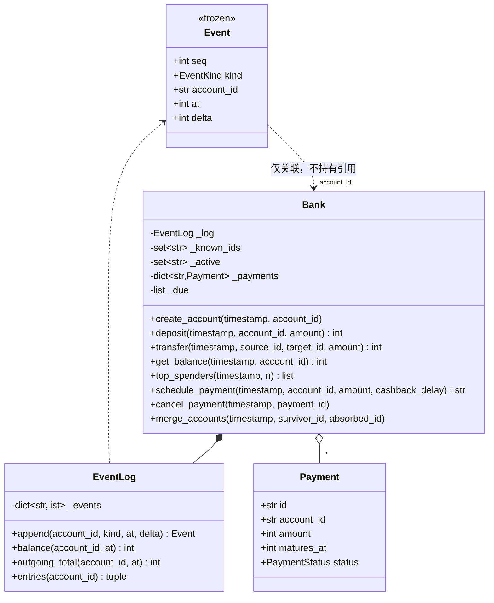

# 设计题解：银行账户系统（Bank Account System）

## 题目与澄清

这道题和大部分手撕设计题长得不一样：不是面试官坐在对面一句一句加需求，而是一份**机考
（industry coding，比如 CodeSignal 那种工业级编码评测）**——题面一次性给你四个"关卡"的
文档，你打开一个空的类骨架，每写完一关就提交一次，评测系统跑一批**你看不到代码、只看
得到通过与否**的隐藏测试，时钟在走，改上一关的设计经常来不及。这份题解要教的，一半是
这道题本身的设计，另一半是**这种题型怎么打**——两者其实是一回事：机考的分数几乎全部来自
"第 1 关的骨架撑不撑得住后面三关"，而不是第 1 关本身写得多快。

题面通常这样给：
> 实现一个银行账户系统。第 1 关：开户、存款、转账、查余额。后面几关在题面里会陆续解锁，
> 每一关只在你提交上一关之后才可见。

几个问题决定了整个骨架的形状，必须在看到后面几关之前就想清楚（或者干脆假设"后面一定会
加时间相关的需求"，这是这类题材几乎恒定的套路）：

- **时间从哪来？** 机考的评测代码不会真的等 24 小时看你的返现到不到账，它会在调用之间
  传一个**显式的时间戳参数**，让"过了多久"完全由测试用例决定。这是"driven by a
  timestamp passed into each call rather than a real clock"这句话的字面意思——如果第
  1 关的方法签名里没有为时间戳留位置，后面加定时支付时要么返工改签名（破坏了已经提交
  并通过的关卡），要么被迫塞进一个真实的 `time.sleep`（评测机不可能陪你等）。本文的
  每一个公开方法都以 `timestamp: int` 开头。
- **"支出"算不算定时支付？** 第 2 关的排行只说"总支出"，没说是不是只算转账。本文的默认
  假设是**只算转账**：定时支付在产品语义上更接近"消费"，转账才是"账户之间流动"；这个
  假设写在 `EventKind` 的过滤条件里，改成把定时支付也计入排行是一行代码的事，见"关键
  设计决策"。
- **调用的时间戳会不会倒退？** 这类评测通常保证"调用按时间顺序发生"，但**保证**不等于
  "不用管"——本文选择显式校验并拒绝倒退的写操作，而不是默认信任调用方，理由和它带来的
  一个重要例外（只读查询）在"关键设计决策"里展开。
- **账户 id 会不会被复用？** 面试官不会说，但真实系统的答案几乎总是"不会"——账号是身份，
  不是可以回收的车位编号。这道题第 4 关的合并需求逼着你早做决定：如果 id 可以复用，"合并
  掉的账户还能查历史余额"这句话就没法安放。

**范围之外**：不做真实的鉴权、不做多币种、不做并发（这道题的评测模型是单线程顺序调用，
不像[[solution-digital-wallet|数字钱包]]那样需要处理真实并发下的两把锁）。

## 需求与分级

机考的"分级"和真人面试的"加需求"是同一件事的两种呈现方式，区别只在于：机考的每一关都有
**隐藏测试**在验证你有没有"顺便"破坏前面几关，而不是面试官口头确认。

- **第 1 关（核心流程）**：`create_account`、`deposit`、`transfer`、`get_balance`。余额
  不能为负，转账双方不能是同一个账户。对应 `EventLog`、`Bank.create_account/deposit/
  transfer/get_balance`。
- **第 2 关（排行查询）**：`top_spenders`——按截至某个时间戳的转账支出总额从高到低取前
  N 个账户，支出相同按账户 id 升序。对应 `EventLog.outgoing_total`、
  `Bank.top_spenders`。
- **第 3 关（定时支付）**：`schedule_payment` 立即扣款，一段延迟之后返现；
  `cancel_payment` 在返现落地之前撤销、本金退回；一切由传入的时间戳驱动，没有真实的
  后台线程或定时器。对应 `Payment`、`PaymentStatus`、`Bank.schedule_payment/
  cancel_payment/payment_status`、`Bank._settle_due`。
- **第 4 关（账户合并）**：`merge_accounts` 把一个账户的余额、历史、还没返现的定时支付
  全部并入另一个账户；被合并掉的账户 id 仍然可以查询合并之前任意时刻的余额。对应
  `Bank.merge_accounts`，以及[[structure.storage|内存持久化（In-Memory Persistence）]]
  里讨论的"用一份不可变历史当真源、而不是直接改一个可变字段"这条一般性原则在这里的落点。

**这道题真正考的设计能力**：第 1 关写完之后，第 2、3、4 关分别新增了"排行"、"时间"、
"合并"三种完全不同的新能力，但没有一关要求回头改 `deposit` 或 `transfer` 的实现。能不能
在第 1 关就选中一个经得起这三次考验的核心表示——本文的答案是**事件日志**（append-only
的历史记录，一切查询都是对它的归约），是这道题唯一真正的分数所在。

## 核心对象与职责

- **`Event`** — 一条不可变的历史记录：某个账户在某个时间点变化了多少（带符号）。它不
  知道"这是转账还是返现"以外的任何业务规则，纯粹是数据。
- **`EventLog`** — 账户历史的唯一真源：一张按账户 id 分组、只增不减的事件表。`balance`
  和 `outgoing_total` 都只是对某个账户的历史做一次"带时间上限的归约"，不缓存任何"当前值"。
- **`Payment`** — 一笔定时支付的状态机：`IN_PROGRESS → CASHBACK_RECEIVED` 或
  `IN_PROGRESS → CANCELLED`，没有第三条路。它的 `account_id` 字段是**可变**的——账户
  合并时被改指到存活账户，这是"定时支付随账户一起合并"的全部代价。
- **`Bank`** — 门面（Facade）：开户、存款、转账、排行、定时支付、合并账户的唯一入口。
  它自己不持有任何"当前余额"，只持有 `EventLog`、账户 id 的两个集合（"曾经存在过"和
  "现在还活跃"）、以及定时支付的状态表和到期堆。

生命周期上：`Bank` **组合**（composition）`EventLog`——日志不会脱离 `Bank` 单独存在。
`Event` 和 `Payment` 只通过 `account_id: str` 这一个字符串**关联**账户，不持有任何账户
对象的引用——这正是"合并账户"能够做得这么轻的原因：合并不需要遍历、改写任何一条历史
事件，只需要改变"哪个 id 现在算活跃"和"这笔还没结算的支付现在该记到谁头上"这两处状态。



## 关键设计决策

### 核心表示：事件日志，还是每个账户一个可变余额字段？

这是这道题最重要的一个选择，也是"第 1 关怎么写才不会被后面三关逼着重写"这句话的具体
答案。两个真实存在的选项：

```python
# 选项 A：账户直接持有一个可变余额字段
class Account:
    balance: int
def deposit(self, account_id, amount):
    self._accounts[account_id].balance += amount   # 排行？历史时点余额？都答不出来
```

```python
# 选项 B：只保留一份只增不减的事件日志，余额是对它的归约（本文的选择）
def balance(self, account_id: str, at: int) -> int:
    return sum(e.delta for e in self._events.get(account_id, ()) if e.at <= at)
```

选项 A 对第 1 关最省事——一个整数字段，存取都是 O(1)。但它在第 2、3、4 关会依次付出
代价：第 2 关要"总支出"，选项 A 没有留下"这笔钱是怎么变化的"这段历史，只能另开一个字段
专门累计支出，两个字段（余额、支出总额）从此必须在每一处改动余额的代码里同步维护，多一
处同步就多一处会漏改的地方；第 3 关要"到期返现"，一个裸的整数字段答不出"这笔钱是什么时候、
因为什么原因变化的"；第 4 关要"合并后仍能查历史某一刻的余额"，一个只记录"现在是多少"的
字段从合并那一刻起就永久丢失了"以前是多少"这条信息，除非另外再拷贝一份快照——而"什么时候
该拷贝快照"本身就是一个新的、容易出错的设计问题。

选项 B 把这三个后续需求全部变成**对同一份数据的不同归约方式**：排行是"只统计转账支出的
归约"，到期返现是"未来某个时间点会追加一条新事件"，合并后的历史查询是"这个账户的事件表
不再增长，但归约函数不需要知道这一点"——`get_balance` 的实现从第 1 关到第 4 关一个字都
没有改过。代价是每次查询都要遍历这个账户的历史（O(账户历史长度)），但这正是"驱动一切的
是时间戳"这类机考题的题眼：评测用例数量有限（通常几百次调用），历史遍历的成本远低于"选错
表示导致后面三关全部推倒重来"的成本。这和[[solution-digital-wallet|数字钱包]]选择"缓存
并核对"是同一个问题的两种不同正确答案——钱包的余额查询是高频到近乎每次操作都要触发的路径，
值得为 O(1) 花一份缓存和一次核对的代价；这道题的每一次调用都自带一个可以直接拿来归约的
参数（`timestamp`），归约本身又天然覆盖了"历史时点查询"和"合并后 id 存续"这两个后面才
出现的需求，缓存反而会为了它这里用不上的性能去提前支付复杂度。

### 时间戳：写操作必须不倒退，只读查询却可以问任意历史时刻

问题：`get_balance` 需要支持"查询合并之前某一刻的余额"（第 4 关的硬需求），但
`schedule_payment`、`merge_accounts` 这些写操作又需要一个"现在几点"的概念来判断"定时
支付到期了没有"。如果给所有方法用同一条"时间戳不能比上一次调用还早"的规则，这两个需求
会直接冲突：

```python
# 如果 get_balance 也必须遵守"不能倒退"
bank.merge_accounts(150, "alice", "bob")
bank.get_balance(45, "bob")   # 45 < 150，被拒绝——但这恰恰是第 4 关要求能查的场景！
```

本文的答案是**把"写"和"读"的时间戳规则分开**：`create_account`/`deposit`/`transfer`/
`schedule_payment`/`cancel_payment`/`merge_accounts` 这些会新增事件、会推进"当前时间"
的方法统一走 `_advance`，它校验时间戳不小于上一次写操作的时间戳，校验通过后把这个值记成
新的"当前时间"；`get_balance` 是唯一的例外——它只读，可以传任意历史时刻，既不校验也不
更新"当前时间"。两者共用的是同一个 `_settle_due`：不管是写操作触发的，还是一次查历史
的读触发的，只要传入的时间戳跨过了某笔定时支付的到期点，那笔返现就会被结算——这保证了
"到期"这件事不依赖于"恰好是哪一次调用第一个跨过了那个时间点"，读和写看到的是同一个事实。

### 到期返现记在哪个时间点：触发结算的那次调用，还是真正到期的那一刻？

这是本文在实现时踩到、随后修正的一个真实的坑，值得原样写出来。第一版的写法是：

```python
# 有缺陷的版本：返现记在"触发结算"这次调用的时间戳上
while self._due and self._due[0][0] <= timestamp:
    matures_at, _, payment_id = heapq.heappop(self._due)
    ...
    self._log.append(payment.account_id, EventKind.CASHBACK_IN, timestamp, cashback)  # 错
```

这段代码在"当场查询"时看起来完全正确——因为触发结算的调用查的也是同一个 `timestamp`，
`timestamp <= timestamp` 恒真，这笔返现总会被算进去。缺陷只在一种场景下现形：**如果这
笔支付在 t=103 到期，但直到 t=500 才有下一次调用触发结算，而调用方随后查询"t=150 时的
余额"**——用触发时间戳 500 记账的话，`500 <= 150` 为假，这笔早在 103 就该到账的钱会在
t=150 的查询里凭空消失，尽管它按任何合理的产品语义都应该已经到账了。

修复是把追加事件的时间戳换成 `matures_at`（真正到期的那一刻），而不是触发结算的那次
调用的 `timestamp`——谁先发现"到期了"、什么时候发现，不应该改变钱真正落账的时间点。
`test_cashback_is_recorded_at_maturity_time_not_at_the_triggering_call` 是这个修复的
回归测试：先用一次很晚的调用触发结算，再回头查一个"到期之后、触发之前"的历史时刻，
断言返现已经在账。这类"懒惰求值"的系统（结算不是主动发生，而是被下一次访问顺带触发）
几乎总会在"事件应该归属哪个时间点"上留一个类似的坑，值得当成一类问题记住，而不只是这
一道题的偶然细节。

### 合并账户：改写余额字段，还是把 id 标记为"不再活跃"？

问题：`merge_accounts` 需要让一个账户的钱、历史、待结算的支付都归并到另一个账户，同时
被合并掉的账户还要能回答历史查询。两种做法：

```python
# 选项 A：物理删除被合并的账户，把它的事件重新打上存活账户的标签搬过去
del self._accounts[absorbed_id]
for event in self._log.entries(absorbed_id):
    self._log.append(survivor_id, event.kind, event.at, event.delta)  # 历史被"过继"了
```

```python
# 选项 B：只把 id 从"活跃"集合里移除，历史原样留在原地（本文的选择）
self._active.discard(absorbed_id)
if absorbed_balance:
    self._log.append(survivor_id, EventKind.MERGE_IN, timestamp, absorbed_balance)
```

选项 A 表面上更"干净"——一个人只有一份历史。但它意味着 `absorbed_id` 的历史此后要么
消失、要么被搬到另一个 id 名下，"查询被合并账户在合并之前某一刻的余额"这个第 4 关的
硬需求需要专门的代码去处理"这段历史现在其实存在别处"这件事，`EventLog` 因此不能再是
一个纯粹按 id 分组的表。选项 B 完全不移动任何一条已有的事件：`absorbed_id` 从 `_active`
集合里消失只意味着"以后不会再有新事件写到这个 id 下"，它已经写下的历史原封不动——查询
它在任意历史时刻的余额，用的还是从第 1 关起就没改过的那一行 `EventLog.balance`。真正
需要写代码处理的只有一件事：`absorbed_id` 名下**还没有结算**的定时支付，它们的归属如果
不挪走，返现到账时会写进一个"没人再查"的死账户——这是 `Payment.account_id` 被设计成可变
字段、而不是 `Event` 那样不可变的唯一原因：待结算的支付代表的是"还没发生的未来"，未来
理应跟着账户的现状走；已经发生的历史不应该。

## 代码走读

整份参考实现如下（测试通过的那一份，逐字嵌入）。

%% code:begin solution.py %%
```python
"""银行账户系统（Bank Account System）——分关递进机考题的参考实现。

五行设计：没有任何"当前余额"字段，`EventLog` 是只增不减的事件表，余额、排行都是对它的
一次归约（reduce）；没有 `self._clock`——这个系统没有后台线程，每次调用显式传入时间戳，
"到期的定时支付"只在下一次任意调用发生时才被结算，这正是"一切由传入的时间戳驱动"的字面
实现；账户 id 一旦创建永不复用，合并只是把一个 id 从"活跃"挪到"不再接受新操作"，它自己
的历史原样留在日志里，历史时点查询因此不需要任何特殊代码；账户 id 之间没有互相持有的
引用，合并、排行、结算都通过 `account_id: str` 这一个共同的键联系在一起。
"""

from __future__ import annotations

import heapq
import itertools
from dataclasses import dataclass
from enum import Enum


class BankError(Exception):
    """本设计里所有失败路径的公共基类。"""


class UnknownAccountError(BankError):
    """账户不存在，或者曾经存在但已经被合并掉、不再接受新操作。"""


class DuplicateAccountError(BankError):
    """这个账户 id 曾经被用过（哪怕现在已经合并掉了），不能再开一个同名账户。"""


class InvalidAmountError(BankError):
    """金额不是正数。"""


class SameAccountError(BankError):
    """转账或合并的两个账户 id 其实是同一个。"""


class InsufficientFundsError(BankError):
    """余额不足以覆盖这笔转出或定时支付。"""

    def __init__(self, account_id: str, available: int, requested: int) -> None:
        super().__init__(f"账户 {account_id} 余额 {available} 不足以支付 {requested}")
        self.account_id = account_id
        self.shortfall = requested - available


class UnknownPaymentError(BankError):
    """定时支付 id 不存在。"""


class InvalidPaymentStateError(BankError):
    """这笔定时支付已经结算或已经取消，不能再取消一次。"""


class NonMonotonicTimestampError(BankError):
    """这次调用的时间戳比上一次调用还早——这套系统假设调用方按时间顺序发起请求。"""


class EventKind(Enum):
    """一条事件描述的是哪一类资金变化；`top_spenders` 只统计 `TRANSFER_OUT`，其余
    种类只参与余额归约——这是"排行只算转账支出"这条产品假设在代码里的落点，改成也算
    定时支付的支出时，只需要在 `top_spenders` 的过滤条件里加一个种类。
    """

    OPENED = "opened"
    DEPOSIT = "deposit"
    TRANSFER_OUT = "transfer_out"
    TRANSFER_IN = "transfer_in"
    PAYMENT_OUT = "payment_out"
    PAYMENT_REFUND = "payment_refund"
    CASHBACK_IN = "cashback_in"
    MERGE_IN = "merge_in"


class PaymentStatus(Enum):
    IN_PROGRESS = "in_progress"
    CASHBACK_RECEIVED = "cashback_received"
    CANCELLED = "cancelled"


@dataclass(frozen=True, slots=True)
class Event:
    """一条不可变的账户历史记录：`account_id` 在时间戳 `at` 变化了 `delta`（带符号，
    正数入账、负数出账）。它是这个设计里唯一的真源，`Bank` 自己不缓存任何余额。
    """

    seq: int
    kind: EventKind
    account_id: str
    at: int
    delta: int


@dataclass(slots=True)
class Payment:
    """一笔定时支付：立即扣款，`matures_at` 时刻返现。`account_id` 是**可变**的——
    如果这笔支付所属的账户在返现到账之前被合并掉，它会被改指到合并后存活的账户，
    这就是"定时支付随账户一起合并"的全部实现。
    """

    id: str
    account_id: str
    amount: int
    scheduled_at: int
    matures_at: int
    status: PaymentStatus = PaymentStatus.IN_PROGRESS


class EventLog:
    """账户历史的唯一真源：一张按账户 id 分组、只增不减的事件表。它不知道"合并"、
    "定时支付"这些业务概念，只知道"某个 id 在某个时间点变化了多少"——`balance` 和
    `outgoing_total` 都只是对这份历史做一次带时间上限的归约。一个账户被合并掉之后，
    只是不再有新事件写进它自己的这一份历史，历史本身永远留着，这正是"合并后的 id
    依然能回答历史时点的余额查询"不需要任何专门代码的原因。
    """

    def __init__(self) -> None:
        self._events: dict[str, list[Event]] = {}
        self._seq = itertools.count(1)

    def append(self, account_id: str, kind: EventKind, at: int, delta: int) -> Event:
        event = Event(next(self._seq), kind, account_id, at, delta)
        self._events.setdefault(account_id, []).append(event)
        return event

    def balance(self, account_id: str, at: int) -> int:
        """`account_id` 在时间戳 `at` 那一刻的余额：账户从未开户、或者查询的时刻
        早于开户时刻，历史里没有任何一条落在范围内的事件，归约的结果自然是 0——
        不需要单独判断"这个时刻账户还不存在"。
        """
        return sum(e.delta for e in self._events.get(account_id, ()) if e.at <= at)

    def outgoing_total(self, account_id: str, at: int) -> int:
        """`account_id` 在时间戳 `at` 之前转出去过多少钱——`top_spenders` 排行用的
        正是这个数。
        """
        return sum(-e.delta for e in self._events.get(account_id, ())
                    if e.at <= at and e.kind is EventKind.TRANSFER_OUT)

    def entries(self, account_id: str) -> tuple[Event, ...]:
        """`account_id` 的完整历史快照——按追加顺序，不把内部列表本身交出去。"""
        return tuple(self._events.get(account_id, ()))


class Bank:
    """开户、存款、转账、按支出排行、定时支付带返现、合并账户的唯一入口。

    没有任何"当前余额"字段——每一次余额、排行查询都是对 `EventLog` 的一次归约；也没有
    `self._clock`：这个系统完全没有后台线程或墙上时钟，"现在几点"由调用方在每一次调用
    里显式传入，"到期"只在下一次任意调用发生时才会被观察到并处理——这是"驱动一切的是
    传进来的时间戳"这条要求最直接的样子，测试也因此从不需要 `sleep`。
    """

    def __init__(self, cashback_rate: float = 0.02) -> None:
        self._log = EventLog()
        self._known_ids: set[str] = set()
        self._active: set[str] = set()
        self._payments: dict[str, Payment] = {}
        self._due: list[tuple[int, int, str]] = []
        self._payment_ids = (f"PAY{n}" for n in itertools.count(1))
        self._cashback_rate = cashback_rate
        self._last_timestamp = 0

    def _settle_due(self, timestamp: int) -> None:
        """结算所有在 `timestamp` 之前到期的定时支付。返现事件记在**真正到期的那一刻**
        `matures_at`，不是这次触发结算的调用的时间戳——不然一次晚到的调用会让返现在
        账本里显得比实际发生得更晚，任何查询"到期和触发之间某一刻"余额的调用都会得到
        错误答案（少算一笔早就该到账的返现）。谁先调用、什么时候调用，不该改变钱真正
        落账的时间点。
        """
        while self._due and self._due[0][0] <= timestamp:
            matures_at, _, payment_id = heapq.heappop(self._due)
            payment = self._payments[payment_id]
            if payment.status is not PaymentStatus.IN_PROGRESS:
                continue  # 已经被取消——堆里这条过期条目直接丢弃，不需要额外清理它
            cashback = round(payment.amount * self._cashback_rate)
            self._log.append(payment.account_id, EventKind.CASHBACK_IN, matures_at, cashback)
            payment.status = PaymentStatus.CASHBACK_RECEIVED

    def _advance(self, timestamp: int) -> None:
        """写操作的第一步：校验这次调用的时间戳没有比上一次写操作倒退，把它记成新的
        "当前时间"，再结算所有到期的定时支付。只读的 `get_balance` 不走这个方法——
        它可以查询任意历史时刻，见该方法的说明。
        """
        if timestamp < self._last_timestamp:
            raise NonMonotonicTimestampError(
                f"时间戳必须不小于上一次调用的时间戳（{self._last_timestamp}），收到 {timestamp}")
        self._last_timestamp = timestamp
        self._settle_due(timestamp)

    def _require_active(self, account_id: str) -> None:
        if account_id not in self._active:
            raise UnknownAccountError(f"账户不存在或已经合并：{account_id}")

    @property
    def payment_count(self) -> int:
        """一共开过多少笔定时支付——包括已经返现、已经取消的，这张表和 `EventLog`
        一样是审计记录，故意不清理。"""
        return len(self._payments)

    @property
    def pending_payment_count(self) -> int:
        """还没有返现也没有被取消的定时支付有多少笔；结算/取消都会让这个数变小，
        是"`_due` 这个堆确实会缩小"这条不变式可以直接断言的证据。"""
        return sum(1 for p in self._payments.values() if p.status is PaymentStatus.IN_PROGRESS)

    def history(self, account_id: str) -> tuple[Event, ...]:
        """这个账户的完整历史，用于查证"每一步都被正确地记进了日志"——测试和面试演示
        都靠这个方法看账本，而不是伸手进 `Bank` 内部拿私有字段。
        """
        if account_id not in self._known_ids:
            raise UnknownAccountError(f"未知账户：{account_id}")
        return self._log.entries(account_id)

    def create_account(self, timestamp: int, account_id: str) -> None:
        """第 1 关：开户。id 一旦用过永不复用，即使对应账户后来被合并掉了。"""
        self._advance(timestamp)
        if account_id in self._known_ids:
            raise DuplicateAccountError(f"账户 id 已经被使用过：{account_id}")
        self._known_ids.add(account_id)
        self._active.add(account_id)
        self._log.append(account_id, EventKind.OPENED, timestamp, 0)

    def deposit(self, timestamp: int, account_id: str, amount: int) -> int:
        """第 1 关：存款，返回存款后的余额。"""
        self._advance(timestamp)
        self._require_active(account_id)
        if amount <= 0:
            raise InvalidAmountError(f"金额必须为正：{amount}")
        self._log.append(account_id, EventKind.DEPOSIT, timestamp, amount)
        return self._log.balance(account_id, timestamp)

    def transfer(self, timestamp: int, source_id: str, target_id: str, amount: int) -> int:
        """第 1 关：转账，返回转出方转账后的余额。"""
        self._advance(timestamp)
        if source_id == target_id:
            raise SameAccountError("转账双方不能是同一个账户")
        self._require_active(source_id)
        self._require_active(target_id)
        if amount <= 0:
            raise InvalidAmountError(f"金额必须为正：{amount}")
        available = self._log.balance(source_id, timestamp)
        if available < amount:
            raise InsufficientFundsError(source_id, available, amount)
        self._log.append(source_id, EventKind.TRANSFER_OUT, timestamp, -amount)
        self._log.append(target_id, EventKind.TRANSFER_IN, timestamp, amount)
        return self._log.balance(source_id, timestamp)

    def get_balance(self, timestamp: int, account_id: str) -> int:
        """查询某个账户在 `timestamp` 那一刻的余额；被合并掉的 id 同样可以查——它的
        历史没有被删除，只是不会再增长。这是一次纯读取，`timestamp` 可以是**任意**
        历史时刻，不要求不小于上一次调用的时间戳，也不会把它记成新的"当前时间"——这
        正是"合并掉的账户依然能按过去某个时间点回答余额查询"必须成立的地方：如果查
        历史也要满足"只能越查越晚"，就没法在合并之后再回头问合并之前的余额了。它仍然
        会结算截至 `timestamp` 为止到期的定时支付，理由见 `_settle_due`。
        """
        if account_id not in self._known_ids:
            raise UnknownAccountError(f"未知账户：{account_id}")
        self._settle_due(timestamp)
        return self._log.balance(account_id, timestamp)

    def top_spenders(self, timestamp: int, n: int) -> list[tuple[str, int]]:
        """第 2 关：按截至 `timestamp` 的转账支出总额从高到低取前 `n` 个活跃账户，
        支出相同则按账户 id 升序；支出为 0 的账户不上榜。
        """
        self._advance(timestamp)
        totals = ((account_id, self._log.outgoing_total(account_id, timestamp))
                   for account_id in self._active)
        ranked = sorted((t for t in totals if t[1] > 0), key=lambda t: (-t[1], t[0]))
        return ranked[:n]

    def schedule_payment(self, timestamp: int, account_id: str, amount: int,
                          cashback_delay: int) -> str:
        """第 3 关：立即扣款，`cashback_delay` 之后返还 `amount * cashback_rate`
        （四舍五入到整数最小货币单位）。返现不是"到点自动发生"，是**下一次任意调用**
        经过 `_advance` 时被结算——这套系统里唯一会推进"时间"的地方。
        """
        self._advance(timestamp)
        self._require_active(account_id)
        if amount <= 0:
            raise InvalidAmountError(f"金额必须为正：{amount}")
        available = self._log.balance(account_id, timestamp)
        if available < amount:
            raise InsufficientFundsError(account_id, available, amount)
        payment_id = next(self._payment_ids)
        matures_at = timestamp + cashback_delay
        self._payments[payment_id] = Payment(payment_id, account_id, amount, timestamp, matures_at)
        heapq.heappush(self._due, (matures_at, len(self._payments), payment_id))
        self._log.append(account_id, EventKind.PAYMENT_OUT, timestamp, -amount)
        return payment_id

    def cancel_payment(self, timestamp: int, payment_id: str) -> None:
        """第 3 关：取消一笔还没有返现的定时支付，扣掉的本金退回去。"""
        self._advance(timestamp)
        payment = self._payments.get(payment_id)
        if payment is None:
            raise UnknownPaymentError(f"未知的定时支付：{payment_id}")
        if payment.status is not PaymentStatus.IN_PROGRESS:
            raise InvalidPaymentStateError(
                f"支付 {payment_id} 已经是 {payment.status.value}，不能再取消")
        payment.status = PaymentStatus.CANCELLED
        self._log.append(payment.account_id, EventKind.PAYMENT_REFUND, timestamp, payment.amount)

    def payment_status(self, timestamp: int, payment_id: str) -> PaymentStatus:
        self._advance(timestamp)
        payment = self._payments.get(payment_id)
        if payment is None:
            raise UnknownPaymentError(f"未知的定时支付：{payment_id}")
        return payment.status

    def merge_accounts(self, timestamp: int, survivor_id: str, absorbed_id: str) -> None:
        """第 4 关：把 `absorbed_id` 合并进 `survivor_id`。`absorbed_id` 当前的余额
        整笔计入 `survivor_id`，它名下还没有返现的定时支付改由 `survivor_id` 持有；
        `absorbed_id` 从"活跃账户"里移除，但它的历史留在日志里，`get_balance` 依然
        能查——见 `EventLog` 的说明。
        """
        self._advance(timestamp)
        if survivor_id == absorbed_id:
            raise SameAccountError("不能把一个账户合并进它自己")
        self._require_active(survivor_id)
        self._require_active(absorbed_id)
        absorbed_balance = self._log.balance(absorbed_id, timestamp)
        for payment in self._payments.values():
            if payment.account_id == absorbed_id and payment.status is PaymentStatus.IN_PROGRESS:
                payment.account_id = survivor_id
        if absorbed_balance:
            self._log.append(survivor_id, EventKind.MERGE_IN, timestamp, absorbed_balance)
        self._active.discard(absorbed_id)


if __name__ == "__main__":
    bank = Bank(cashback_rate=0.02)
    bank.create_account(0, "alice")
    bank.create_account(0, "bob")
    bank.deposit(10, "alice", 10_000)
    bank.transfer(20, "alice", "bob", 3_000)
    payment_id = bank.schedule_payment(30, "bob", 1_000, cashback_delay=100)

    print("alice:", bank.get_balance(40, "alice"), "bob:", bank.get_balance(40, "bob"))
    print("排行:", bank.top_spenders(40, 5))
    print("返现前状态:", bank.payment_status(40, payment_id))
    bank.merge_accounts(50, "alice", "bob")
    print("合并后 alice:", bank.get_balance(150, "alice"))
    print("合并后返现落到 alice 而不是 bob，状态:", bank.payment_status(150, payment_id))
    print("bob 合并前的历史仍然可查:", bank.get_balance(45, "bob"))
```
%% code:end %%

读的时候留意这四处，它们是上面四个决策在代码里的落点：

1. **`EventLog.balance` 和 `outgoing_total`**：两个方法都只是对 `_events` 做一次
   `sum(... if e.at <= at)`——这就是"核心表示是事件日志、其余一切都是归约"这条决策
   的全部代码。
2. **`Bank.get_balance` 调用的是 `_settle_due`，不是 `_advance`**：一个方法名的选择，
   划出了"写"和"读"两套时间戳规则的边界。
3. **`_settle_due` 里 `self._log.append(payment.account_id, EventKind.CASHBACK_IN,
   matures_at, cashback)`**：用 `matures_at` 而不是 `timestamp`，是那个被找到并修复的
   坑的修复处。
4. **`merge_accounts` 里的 `for payment in self._payments.values(): if payment.
   account_id == absorbed_id ...`**：合并唯一需要触碰的可变状态，只有这一处。

## 测试与自检

`test_bank_account.py` 用 `IMPL` 环境变量在参考解和练习骨架之间切换，22 条用例分四组
对应四关。它钉住的不变式是：

- **失败是原子的**：转账余额不足时双方余额都不变；开户重名、转账自转、未知账户全部在
  真正落账之前被拒绝。
- **排行的两条规则**：`test_top_spenders_ranks_by_outgoing_descending_ties_broken_by_id`
  同时验证降序和"打平按 id 升序"这两条规则；
  `test_top_spenders_excludes_accounts_with_zero_outgoing` 验证只收不发的账户不上榜。
- **懒惰结算的时间点**：`test_cashback_is_recorded_at_maturity_time_not_at_the_
  triggering_call` 是"关键设计决策"里那个坑的回归测试。
- **读写两套时间戳规则**：`test_get_balance_accepts_a_past_timestamp_even_after_later_
  writes` 同时验证写操作拒绝倒退、只读查询接受任意历史时刻。
- **合并的完整性**：`test_merge_combines_balance_and_reassigns_a_pending_payment` 验证
  余额、待结算支付都正确过渡；`test_merged_away_account_still_answers_historical_
  balance_queries` 验证被合并的 id 在合并前后都能正确回答历史查询。
- **容器会缩小**：`test_pending_payment_count_shrinks_as_payments_settle_or_cancel`
  断言 `pending_payment_count` 随结算和取消变小，同时 `payment_count`（历史记录）不变。
- **规模下的守恒**：`test_total_balance_is_conserved_after_a_randomised_deposit_and_
  transfer_session` 固定种子跑 200 次随机的存款/转账，断言全部账户余额之和恰好等于
  总存款——转账只搬运不创造。

**两分钟怎么演示给面试官（或者评测系统看不到的口头讲解）**：跑 `python solution.py` 的
demo——开两个账户、转账、开一笔定时支付、合并账户、最后证明合并前的历史仍然可查、返现
落到了存活账户而不是被合并掉的那个。六行输出覆盖全部四关。

自检清单：第 1 关的方法签名有没有为时间戳留位置？排行的打平规则对不对？懒惰结算记的
时间点是到期时刻还是触发时刻？只读查询会不会被写操作的时间戳规则误伤？合并有没有漏挪
待结算的支付？

## 扩展与追问

**新需求**

- **按时间范围查询排行 / 余额变化曲线**：`EventLog.entries` 已经暴露了完整历史，加一个
  按 `(start, end)` 过滤的版本不需要改任何写入路径——这是"查询都是对日志的归约"这条
  设计换来的又一处免费扩展。
- **冻结/解冻账户**：给 `Bank` 加一个 `_frozen: set[str]`，`_require_active` 顺带检查
  不在这张表里，不需要改动 `EventLog` 或任何一个写操作的核心逻辑。
- **多笔定时支付批量取消**：`cancel_payment` 已经是单笔操作的完整实现，批量版本只是
  一个循环，不需要重新设计。

**并发与线程安全**

- 这道题的评测模型是单线程顺序调用，本文因此没有引入任何锁。如果要把它搬到一个真实的
  多线程服务里，`Bank` 需要为 `_known_ids`/`_active`/`_payments`/`_due` 这几个共享容器
  加锁，而且和[[solution-digital-wallet|数字钱包]]一样要面对"转账要同时锁两个账户，
  加锁顺序必须按稳定键排序"这条规则——两道题在这一点上答案完全相同，因为死锁的成因和
  这道题具体的业务逻辑无关，只和"一次操作要同时持有两把锁"这个结构有关。
- 定时支付的懒惰结算在单线程模型下很干净（下一次调用顺便处理），但在真实系统里通常会
  换成一个独立的定时任务扫描到期队列——`_due` 这个最小堆的结构不需要变，只是从"被下一次
  业务调用顺带触发"变成"被一个专门的调度器主动触发"。

**持久化与规模**

- 换成数据库时，`Event` 是一张 append-only 的流水表，账户是否"活跃"、待结算的支付是
  另外两张小表——[[structure.storage|内存持久化（In-Memory Persistence）]]里"仓储
  （Repository）边界该划在哪"的讨论在这里的答案是：`EventLog` 对应一个只插入的表，
  `Bank` 里另外两个集合和一个字典对应索引，合并操作是一个跨三张表的事务。
- 规模上会痛的是单个账户历史很长时 `balance`/`outgoing_total` 的线性扫描；真实系统的
  做法是定期做"快照"：把某个时间点之前的历史归约成一条 `SNAPSHOT` 事件，之后的查询只
  需要重放快照之后的增量——这和"缓存并核对"的思路殊途同归，只是快照本身也进日志，不是
  另开一个可变字段。

## 常见错误

- **第 1 关的方法签名里没有时间戳参数**。加定时支付时被迫要么改签名（可能破坏已经通过
  的隐藏测试对签名的假设）、要么塞一个真实的 `time.sleep`，两条路评测系统都不会陪你走。
- **给账户设一个可变的 `balance` 字段**。第 1 关跑得最快，但"排行"、"到期结算"、"合并
  后查历史"这三关会依次要求这个字段做它结构上做不到的事，详见"关键设计决策"。
- **懒惰结算把返现记在触发它的那次调用的时间戳上**。这是本文自己踩过、也在测试里专门
  钉住的一个坑：结算发生得多晚，不该改变钱名义上到账的时刻。
- **合并账户时物理删除或搬迁历史事件**。既复杂又不必要——被合并的账户只需要"不再接受
  新操作"，它已有的历史不需要移动到任何地方。
- **让只读的余额查询也遵守"时间戳不能倒退"**。这会让"合并后查历史"这个第 4 关的硬需求
  在结构上无法实现。
- **账户 id 被允许复用**。这是真实系统几乎从不允许的一件事，一旦允许，"这个 id 曾经代表
  过谁"就变成一个模糊的问题，历史查询和排行都会失去意义。
- **Java 味的写法**：给 `Bank` 做成 Singleton；给账户写一整套 `getBalance()`/
  `setBalance()`；用一个状态类继承树表示定时支付的三种状态，而不是一个 `Enum` 加一个
  可写字段——这三种状态之间没有任何独立的行为差异，`Enum` 已经完整表达了它们。

## 45 分钟怎么分配

机考的节奏和真人面试不同：没有人陪你讨论，只有一份可以反复读的题面和一段能反复运行的
本地测试，时间通常也不是紧凑的 45 分钟而是横跨几关的更长窗口（90–120 分钟很常见）。
下面按同样的紧迫感给一版时间分配，把"45 分钟"当成每一关自己的预算：

- **第 1 关前 10 分钟，不写代码，先选表示**。把"后面几关大概率会要什么"想一遍——排行、
  时间、合并三个方向都要能被同一份核心数据回答。**这是本题真正的分数所在**，选错表示，
  后面每一关都在加速下坠。
- **第 1 关 10–30 分钟，写 `EventLog` 和三个基础方法**。先让 `deposit`/`transfer`/
  `get_balance` 在本地测试里全绿，再提交。
- **第 2 关，约 15 分钟**。`top_spenders` 是一次排序，题面通常会明确打平规则——读两遍
  题面里那一句话，比多写代码更重要，这是机考丢分最常见的地方之一。
- **第 3 关，约 20 分钟**。把"到期"想清楚：谁来触发结算、结算记在哪个时间点，参照
  "关键设计决策"里那个真实踩过的坑。
- **第 4 关，约 15 分钟**。合并只需要动"活跃集合"和"待结算支付"两处状态，不动
  `EventLog` 的任何一行——如果发现自己在改 `EventLog`，说明前面的表示选错了。

**时间不够时砍什么**：如果只能做完三关，优先保证第 1、2 关满分，第 3 关做到"能扣款、
能返现"但不做取消；**绝不砍**的是第 1 关的时间戳参数和"核心表示是日志而不是可变字段"
这两条——这是唯一决定后面还能不能接着往上加的两个选择。**评测系统实际奖励的**不是代码
风格或者变量命名，是"提交一次，几关都过"——这意味着宁可第 1 关多花十分钟把表示选对，
也不要为了快五分钟先跑通再说，后者几乎总是要在第 3、4 关连本带利还回去。

## 来源与延伸

- <https://github.com/kumaransg/LLD/tree/main/ledger_company_navi> — kumaransg/LLD
  仓库对 Navi（印度金融科技公司）一道分级机考题的公开复现。**分歧**：它的账本是每个
  账户一个可变余额字段加一份单独的交易列表，排行和历史查询要另写遍历逻辑；本文把余额、
  排行、历史查询统一成对同一份事件日志的不同归约，没有可变的余额字段。
- <https://www.geektrust.in/coding-problem/backend/ledger-co> — Geektrust 对同一类
  分级机考题型的公开题面纲要，把"每一关只在提交上一关后解锁"这个机考特有的节奏讲得很
  清楚，本文"需求与分级"一节的框架参考了它。**分歧**：题面本身不涉及具体实现，本文的
  事件日志表示、懒惰结算的时间点选择都是独立设计的。
- <https://docs.python.org/3/library/heapq.html> — `heapq` 只有小顶堆，`_due` 用
  `(matures_at, seq, payment_id)` 的三元组既维持了"最早到期的排最前"，又用第二个字段
  的递增序号避免了极少数到期时间相同时比较字符串 id 的开销。
- <https://docs.python.org/3/library/dataclasses.html> — `Event` 用
  `frozen=True, slots=True` 保证历史不可篡改，`Payment` 保留可变（不加 `frozen`）是
  因为它代表的是"还没发生的未来"，账户合并时需要能被改写，两者的取舍在"关键设计决策"
  的最后一节有完整对比。
- [[solution-digital-wallet|设计题解：数字钱包（Digital Wallet）]] — 同样是"钱的系统"，
  但选择了相反的核心表示：钱包为高频的余额读取选了"缓存并核对"，这道题为"历史时点查询"
  和"账户合并"这两个后面才出现的需求选了"纯粹从日志归约"——两篇文章放在一起读，能看清
  "核心表示该不该缓存"这一类判断真正依赖的是什么（查询频率、后续需求的形状），而不是
  某一种写法天生更"对"。
