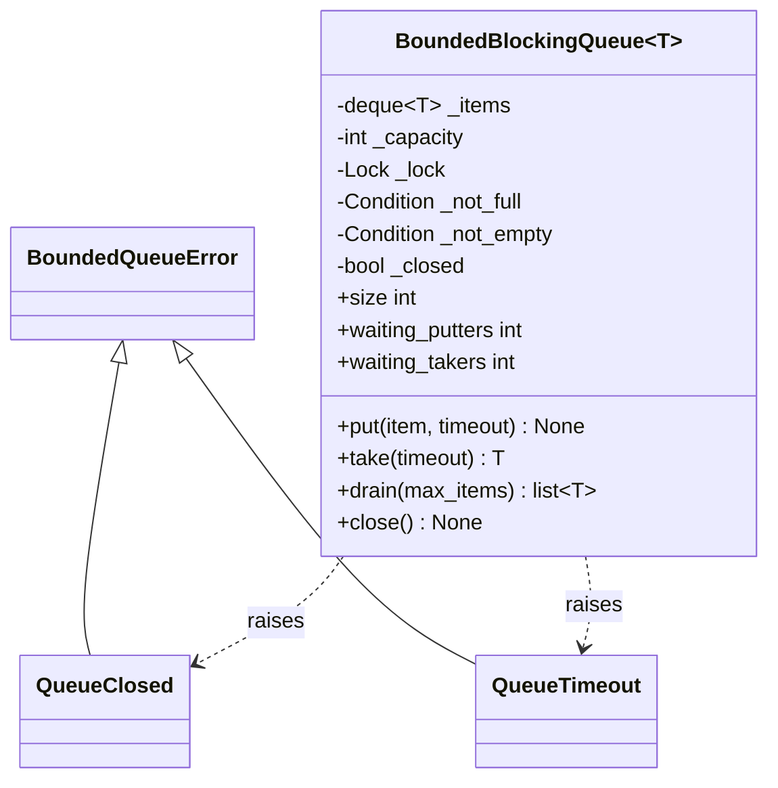

# 设计题解：有界阻塞队列（Bounded Blocking Queue）

## 题目与澄清

面试官通常这样开场："实现一个有界的阻塞队列：`put` 在队列满时阻塞，`take` 在队列空时
阻塞，多个生产者和多个消费者可以同时使用它。"这是并发主题里最经典的一道**条件变量
（Condition Variable）** 练习题——不考察业务建模，只考察你对"锁 + 等待谓词"这套机制
的掌握程度是不是准确到每一行代码。Python 标准库里 `queue.Queue` 已经把它实现好了，
所以这道题的真正问题从来不是"能不能写出一个能跑的版本"，而是"你写的这个版本，在
两个线程同时争抢同一个资源时，是不是**在任何调度顺序下**都正确"。

值得当场问清楚的是：

- **是多生产者多消费者，还是单生产者单消费者？** 答"多对多"，`notify()` 只唤醒一个
  等待者这件事才会真正成为一个要仔细论证的设计点；单对单场景里锁的正确性反而是送分题。
  默认按多对多设计。
- **满/空时是永久阻塞、支持超时，还是干脆报错？** 这决定了 API 要不要带
  `timeout` 参数。多数面试期望你先给出无超时版本，再加超时作为后续需求——这正是
  第 3 关要做的事。
- **需要支持优雅关闭吗？** 如果队列是某个后台系统的一部分（生产者是网络连接、消费者
  是工作线程），进程退出时"停止接收新任务、但把队列里已有的任务处理完"是几乎必然会
  被追问的场景，也就是这里的第 3 关。
- **消费者要一次取一批吗？** 消费者如果是批处理系统（比如攒够一批再写数据库），会需要
  `drain`／`take_batch`。这是第 4 关，考察你能不能在不碰前面已经调好的等待逻辑的前提下
  加新方法。

**不在范围内**：跨进程的队列（`multiprocessing.Queue`）、持久化到磁盘、优先级排序
（那是任务调度器的地盘）、按 key 分区。这道题从头到尾只有一段内存里的数据结构和一把锁。

## 需求与分级

**第 1 关——满则 `put` 阻塞，空则 `take` 阻塞。** 一个先进先出的容器，容量固定。核心的
两条正确性规则，也是这道题唯一真正的难点：等待必须写成 `while 谓词: cond.wait()`，
绝不能写成 `if`；`notify()` 必须精确唤醒"正在等这件事发生"的那一类线程，不能唤醒错
对象。产物是 `BoundedBlockingQueue.put/take` 和它们共用的私有等待循环。

**第 2 关——设计问题：一个条件变量还是两个？** 面试官会追问："如果两个方向的等待共用
同一个 `Condition`，用 `notify()` 会发生什么？"这一关不引入新需求，而是要你在两种实现
之间做出选择并说清代价——这正是 `关键设计决策` 第一条要回答的问题。产物是两个
`Condition`（`_not_full`、`_not_empty`）共享同一把锁。

**第 3 关——超时与 `close()`。** `put(timeout=)`／`take(timeout=)` 在截止时间内完不成就
失败；`close()` 是一次广播式关闭：唤醒每一个等待者，此后 `put` 一律立即失败，但 `take`
要把关闭前已经放进去的元素放完，取空了才失败——"停止接收新工作"和"处理完积压"是两件
不同的事，常见错误就是把它们混成一件。产物是 `QueueTimeout`、`QueueClosed`、`close()`
和 `_wait_for` 里的截止时间计算。

**第 4 关（选做）——`drain`。** 批量消费者不想每次只拿一个。产物是 `drain(max_items=)`，
且不引入第二套等待逻辑：它复用 `take` 已经写好的"空且未关闭就等"这一段，等到之后能拿
多少算多少，不为凑够 `max_items` 再等一轮。

## 核心对象与职责

| 类 | 单一职责 | 它拥有的不变式 |
|---|---|---|
| `BoundedBlockingQueue` | 容量固定的线程安全 FIFO 容器 | `0 <= size <= capacity`；元素不丢不重；等待用 `while`；`close()` 后 `put` 立即失败、`take`/`drain` 排空才失败 |
| `BoundedQueueError` | 本题全部失败路径的公共基类 | 无状态，纯粹的分类锚点 |
| `QueueClosed` | "这次操作因为队列已关闭而没有发生" | 不携带可变状态 |
| `QueueTimeout` | "这次操作在截止时间内没有发生" | 不携带可变状态 |

**归属关系**：这道题只有一个真正的实体——队列本身。没有把"等待者"或"通知"抽出来做成
一个类：`threading.Condition` 已经是那个抽象，再包一层只会挡住标准库本来就很精确的
语义。两个异常类型是设计选择的产物（见决策二），不是为了"看起来完整"而加的空壳。



## 关键设计决策

### 决策一：一个条件变量配 `notify_all`，还是两个条件变量配精确 `notify`？

**问题**：`put` 要等"不满"，`take` 要等"不空"，这是两类完全不同的等待者。如果只用一个
共享的 `Condition`，`notify()` 唤醒的是"任意一个在这个条件变量上等待的线程"——它不知道
被唤醒的那个线程在等哪一类事情。

方案一（单条件变量 + `notify()`）：

```python
class NaiveQueue:
    def __init__(self, capacity):
        self._items, self._cap = [], capacity
        self._cond = threading.Condition()

    def put(self, item):
        with self._cond:
            while len(self._items) >= self._cap:
                self._cond.wait()
            self._items.append(item)
            self._cond.notify()          # 唤醒"任意一个"等待者
```

这段代码在压测下会**丢信号**：一个消费者刚取走元素、队列从满变成不满，调用
`notify()`——但被唤醒的可能是另一个还在等"非空"的消费者，它重新检查发现队列仍是空的，
于是又睡回去；本该被唤醒的生产者那次信号就这样白白丢失。多生产者多消费者跑得越久，
攒住的线程越多，最终整个系统看起来像"卡死了"，其实只是所有人都在等一个再也不会来的
`notify()`。

方案二（单条件变量 + `notify_all()`）：把 `notify()` 换成 `notify_all()`，不丢信号，但
每次状态变化都要**惊动全部等待者**——十个消费者里九个在等"非空"、一个在等"非满"，
生产者放进一个元素后十个线程一起被唤醒，九个重新检查发现轮不到自己，白白抢了一次锁、
又睡回去。等待者越多，这种"惊群"（thundering herd）的浪费越大，而且是每一次状态变化
都要付一次的常规开销，不是偶发的。

方案三（两个条件变量，本题的选择）：`_not_full` 和 `_not_empty` 共享同一把 `_lock`
构造（`threading.Condition(lock)`），`put` 结束后精确 `notify(self._not_empty)`，`take`
结束后精确 `notify(self._not_full)`。`notify()` 唤醒的目标集合天然就是"正在等这件事"的
那些线程，既不丢信号（每个条件变量各自维护自己的等待队列，不会被无关的等待者截胡），
也不惊群（一次状态变化只唤醒真正可能被满足的那一类）。代价是要多维护一个 `Condition`
对象，但因为两者共享同一把锁，判断谓词、修改队列、精确唤醒这三步依然发生在同一次加锁
里，没有引入任何新的死锁面。这是教科书写法（`concurrency.primitives`
里[[concurrency.primitives|同步原语（threading）]]讨论的标准生产者-消费者结构），没有
理由在这道题上用更弱的版本。

### 决策二：满/空时该阻塞、返回哨兵值，还是抛异常？

**问题**：`put(timeout=0.1)` 或 `take(timeout=0.1)` 在截止时间内没能完成，调用方需要知道
"没发生"，用什么信号传达？

方案一（返回哨兵值，比如 `take` 超时返回 `None`）：调用方不用写 `try/except`，但队列本身
如果就是用来传递 `None`（一个合法的"空消息"）的，调用方没法分辨"超时了"还是"真的取到了
一个 `None`"。这个坑在动态类型语言里格外容易踩，而且悄无声息——调用方多半直接把 `None`
当正常值往下传，出问题时线索已经很远了。

方案二（返回布尔值 + 输出参数）：Python 没有真正的输出参数，只能返回一个元组
`(ok, item)`，调用方每次都要解包再判断，等价于把"失败路径"从类型系统里搬回了纪律
约束——写漏一次判断，程序照样带着垃圾数据往下跑。

方案三（抛出 `QueueTimeout`，本题的选择）：失败路径和成功路径在类型上彻底分开，调用方
要么显式捕获、要么让异常往上冒泡终止当前操作，没有"忘记检查"这条隐藏分支。这也是标准
库 `queue.Queue` 自己的选择（超时的 `put`/`get` 分别抛 `queue.Full`／`queue.Empty`），
本题延续这个先例，用统一的 `QueueTimeout` 覆盖 `put`／`take`／`drain` 三个操作——三者的
失败语义完全一致（"截止时间到了，谓词仍不成立"），没有理由给它们三个不同的异常类型。

### 决策三：`close()` 要不要单独一个 `threading.Event`？

**问题**：`close()` 需要做两件事——把"已关闭"这个标志置位，并唤醒所有等待者。标准库里
`threading.Event` 恰好就是"置位 + 唤醒等待者"的封装，看起来是现成的工具。

**更简单的答案是正确答案**：不需要 `Event`。`_closed` 就是一个受 `_lock` 保护的
`bool`，`close()` 里已经持有这把锁，把标志位置 `True`、依次对两个 `Condition` 调用
`notify_all()` 就是完整的实现——三行代码，且这三行本来就要在同一次加锁里做完（不然
"置位"和"唤醒"之间可能被另一个线程插队，产生新的竞态）。引入 `Event` 反而要多解决一个
问题：`Event.wait()` 和 `Condition.wait()` 是两套不同的等待原语，`put`/`take` 已经在
`Condition` 上等待谓词了，没有办法"同时"也在 `Event` 上等——要么额外起一个线程去桥接
两者（复杂度陡增，还多了一条新的竞态路径），要么在等待谓词的 `while` 循环里加一条
"或者 `Event` 被置位了"的检查，那就退化成了直接查 `self._closed`，`Event` 反而成了
没有必要的一层包装。这里"拒绝一个看似现成的模式"就是正确答案：`_closed` 已经活在被
`_lock` 保护的临界区里，`notify_all()` 已经是"唤醒所有等待者"，两者组合起来天然就是
`close()` 的全部语义，不需要再引入一个平行的同步原语。

### 决策四：`drain` 该不该等到凑够 `max_items` 才返回？

**问题**：批量消费者调用 `drain(max_items=100)`，如果当前队列只有 3 个元素，该马上返回
这 3 个，还是继续等到凑够 100 个（或超时）？

等到凑够看起来更"批"、吞吐更高，但代价是**新的等待逻辑**：需要在拿到第一批之后判断
"够不够、要不要继续等"，还要决定这第二段等待要不要支持超时、要不要在等待期间被
`close()` 打断——这些问题在 `take` 的等待循环里已经回答过一次，`drain` 如果重新回答
一次，等于把同一套正确性论证（`while` 循环、精确 `notify`、`close()` 语义）复制一份，
出 bug 的机会也复制了一份。本题选择"叫醒之后有多少拿多少"：`drain` 只在"完全没有元素
且未关闭"时等待，这正是 `take` 已经验证过的那段代码；一旦有至少一个元素，就不再等待，
把现有的（至多 `max_items` 个）一次性取走。这符合第 4 关"不碰等待逻辑"的要求，也符合
批量消费者的真实需求——大多数场景里，消费者想要的是"别空手而归，也别无谓等待"，而不是
"凑够一个固定的批次大小"。真正需要"攒满一批"语义的场景，应该在 `drain` 外面自己加一层
循环调用，而不是把这个决定做进队列内部。

## 代码走读

%% code:begin solution.py %%
```python
"""有界阻塞队列（Bounded Blocking Queue）——一把锁、两个条件变量的经典生产者-消费者结构。

核心思路：容量是这个队列唯一的不变式，`0 <= size <= capacity` 任何时刻都成立。满则 `put`
等，空则 `take` 等，两类等待各配一个 `Condition`（共用同一把锁），才能在腾出一个位置或
放进一个元素时精确 `notify()` 该醒来的那一类线程，而不必每次都 `notify_all()` 惊动所有人。
`close()` 是一次广播式关闭：唤醒每一个正在等待的线程；此后的 `put` 一律立即失败，`take`
则继续把关闭前留下的元素放行，直到取空才失败。超时统一以异常收场，交给调用方决定重试、
丢弃还是升级，而不是悄悄吞掉一次失败的操作。`drain` 只是把 `take` 已经写好的等待谓词多
榨一次，不引入第二套等待逻辑。
"""

from __future__ import annotations

import threading
import time
from collections import deque
from typing import Generic, TypeVar

T = TypeVar("T")


class BoundedQueueError(Exception):
    """本设计全部失败路径的公共基类。"""


class QueueClosed(BoundedQueueError):
    """队列已经关闭：`put` 一律拒绝；`take`／`drain` 只在关闭且确认排空之后才抛出这个。"""


class QueueTimeout(BoundedQueueError):
    """`put`／`take`／`drain` 在调用方给定的截止时间内没能完成。"""


class BoundedBlockingQueue(Generic[T]):
    """容量固定、线程安全的队列：满则 `put` 阻塞，空则 `take` 阻塞。

    不变式：
    1. `0 <= size <= capacity`，任何时刻都成立——扩容和缩容都在同一把锁内完成。
    2. 元素不丢不重：一次成功的 `put` 恰好对应未来某一次 `take`／`drain` 取出的同一个对象。
    3. 等待永远写成 `while 谓词: cond.wait()`，绝不是 `if`——见 `_wait_for`。
    4. `close()` 之后：`put` 立刻失败；`take`／`drain` 把队列里剩下的取完，取空后也失败。
    5. 任何时刻最多持有这把锁一次；两个 `Condition` 共享同一把锁，所以判定谓词、
       修改队列、`notify` 目标类型的等待者，这三步天然发生在同一次加锁里。
    """

    def __init__(self, capacity: int) -> None:
        if capacity <= 0:
            raise ValueError(f"capacity must be positive, got {capacity}")
        self._capacity = capacity
        self._items: deque[T] = deque()
        self._lock = threading.Lock()
        self._not_full = threading.Condition(self._lock)
        self._not_empty = threading.Condition(self._lock)
        self._closed = False
        self._waiting_putters = 0
        self._waiting_takers = 0

    @property
    def capacity(self) -> int:
        return self._capacity

    @property
    def size(self) -> int:
        """当前元素数量。永远在 `[0, capacity]` 之内。"""
        with self._lock:
            return len(self._items)

    @property
    def full(self) -> bool:
        with self._lock:
            return len(self._items) >= self._capacity

    @property
    def empty(self) -> bool:
        with self._lock:
            return not self._items

    @property
    def closed(self) -> bool:
        with self._lock:
            return self._closed

    @property
    def waiting_putters(self) -> int:
        """当前卡在 `not_full` 上的线程数——测试用它确认一个线程真的已经阻塞，而不是
        靠猜一个 `sleep` 的时长。生产环境里它也是判断要不要扩容的信号。"""
        with self._lock:
            return self._waiting_putters

    @property
    def waiting_takers(self) -> int:
        """当前卡在 `not_empty` 上的线程数，用途和 `waiting_putters` 对称。"""
        with self._lock:
            return self._waiting_takers

    def __len__(self) -> int:
        return self.size

    def put(self, item: T, timeout: float | None = None) -> None:
        """放入一个元素；满则阻塞，直到有空位、超时，或队列被关闭。

        队列已经关闭时立即失败——哪怕此刻明明有空位。关闭意味着"不再接受新工作"，
        不是"容量恢复之前继续收"，这条规则不该因为队里恰好还有空位而破例。
        """
        deadline = None if timeout is None else time.monotonic() + timeout
        with self._not_full:
            while len(self._items) >= self._capacity and not self._closed:
                self._waiting_putters += 1
                try:
                    self._wait_for(self._not_full, deadline, "put")
                finally:
                    self._waiting_putters -= 1
            if self._closed:
                raise QueueClosed("cannot put into a closed queue")
            self._items.append(item)
            self._not_empty.notify()

    def put_nowait(self, item: T) -> None:
        """`put(item, timeout=0)` 的简写：立刻成功或立刻失败，从不阻塞。"""
        self.put(item, timeout=0)

    def take(self, timeout: float | None = None) -> T:
        """取出队首元素；空则阻塞，直到有元素、超时，或队列关闭且确认排空。"""
        deadline = None if timeout is None else time.monotonic() + timeout
        with self._not_empty:
            while not self._items and not self._closed:
                self._waiting_takers += 1
                try:
                    self._wait_for(self._not_empty, deadline, "take")
                finally:
                    self._waiting_takers -= 1
            if not self._items:
                raise QueueClosed("queue is closed and drained")
            item = self._items.popleft()
            self._not_full.notify()
            return item

    def take_nowait(self) -> T:
        """`take(timeout=0)` 的简写。"""
        return self.take(timeout=0)

    def drain(self, max_items: int | None = None) -> list[T]:
        """等到至少有一个元素，再一次性取出最多 `max_items` 个（默认取走当前全部）。

        复用 `take` 已经写好的等待谓词——"空且未关闭就等"——不为了凑够 `max_items`
        而再等第二轮：叫醒之后能拿多少算多少，这正是"不碰等待逻辑"这条约束的意思。
        """
        with self._not_empty:
            while not self._items and not self._closed:
                self._waiting_takers += 1
                try:
                    self._wait_for(self._not_empty, None, "drain")
                finally:
                    self._waiting_takers -= 1
            if not self._items:
                raise QueueClosed("queue is closed and drained")
            n = len(self._items) if max_items is None else min(max_items, len(self._items))
            batch = [self._items.popleft() for _ in range(n)]
            self._not_full.notify(n)
            return batch

    def close(self) -> None:
        """关闭队列：唤醒每一个等待者。之后 `put` 立即失败；`take`／`drain` 继续放行到排空。"""
        with self._lock:
            self._closed = True
            self._not_full.notify_all()
            self._not_empty.notify_all()

    def _wait_for(self, cond: threading.Condition, deadline: float | None, op: str) -> None:
        """在给定的条件变量上等一轮；超过截止时间仍没等到就抛 `QueueTimeout`。

        `deadline` 是绝对时刻（`time.monotonic()` 的坐标系），而不是"再等多久"——
        因为一次 `wait()` 返回不代表谓词已经成立（虚假唤醒，或者被叫醒的那一刻已经被
        别的线程抢先改了状态），外层的 `while` 还会再检查一次、可能再等一轮，用剩余
        时间而不是完整的 `timeout` 重新调用，总等待时长才不会因为多次唤醒被悄悄拉长。
        """
        if deadline is None:
            cond.wait()
            return
        remaining = deadline - time.monotonic()
        if remaining <= 0 or not cond.wait(timeout=remaining):
            raise QueueTimeout(f"{op} timed out")

    def __repr__(self) -> str:
        return f"BoundedBlockingQueue(size={self.size}, capacity={self._capacity}, closed={self.closed})"


if __name__ == "__main__":
    q: BoundedBlockingQueue[int] = BoundedBlockingQueue(capacity=2)

    def producer() -> None:
        for i in range(5):
            q.put(i)
            print("put", i)
        q.close()

    def consumer() -> None:
        while True:
            try:
                print("take", q.take(timeout=1))
            except QueueClosed:
                print("consumer sees the queue closed and drained")
                return

    t1, t2 = threading.Thread(target=producer), threading.Thread(target=consumer)
    t1.start()
    t2.start()
    t1.join()
    t2.join()
```
%% code:end %%

`put`/`take` 的结构完全对称：算截止时间 → 拿对应的条件变量 → `while` 循环等待谓词 →
处理关闭 → 修改队列 → 精确 `notify` 对方那一类等待者。`_wait_for` 是这两个方法共用的
"等一轮，超时就抛异常"的小函数——它按**绝对**截止时间而不是"再等多久"来算剩余时间，
因为一次 `wait()` 返回不代表谓词已经成立，外层的 `while` 可能还要再等一轮，如果每次都
重新传入完整的 `timeout`，总等待时长会被多次唤醒悄悄拉长。`waiting_putters`／
`waiting_takers` 这两个计数器不是为了凑代码量，而是把"有 N 个线程正阻塞在这里"变成一个
可以在测试里直接断言的读数，不必靠猜一个 `sleep` 的时长来证明一个线程真的被挡住了。
`drain` 里 `self._not_full.notify(n)` 一次唤醒最多 `n` 个等待的生产者——这是
`Condition.notify(n)` 而不是循环调用 `notify()` `n` 次，语义完全一样但意图更直接。

## 测试与自检

测试文件的核心断言全部是**不变式**，没有一处依赖"睡够多久就一定轮到谁"：`waiting_putters
== 2` 这种断言是用一个有界轮询（`wait_until`）等到状态变化为止，超时只是防止真正的死锁
把测试挂死，从来不是通过条件本身。第 1 关验证阻塞会发生、会在条件满足后解除；第 2 关
`test_only_one_racing_putter_gets_the_freed_slot_when_capacity_is_one` 是全套测试里
分量最重的一个——两个线程同时等唯一的空位，断言最终恰好各进一次、队列从未超员，这正是
`while` 循环（而不是 `if`）在真实竞争下发挥作用的地方；另一个并发测试用 5 个生产者、
2 个消费者跑 200 个元素，断言收集到的多重集合和发出的完全一致，验证"不丢不重"。第 3 关
验证超时精确抛出且不留副作用、`close()` 唤醒所有等待者且区分"立即失败"与"排空才失败"。
第 4 关验证 `drain` 不会为了凑批次而多等一轮。

两分钟演示给面试官看：起两个生产者线程、一个消费者线程，容量设成 2，打印每次 `put`／
`take` 观察阻塞和唤醒交替发生；再调用一次 `close()`，展示消费者继续排空、之后收到
`QueueClosed` 退出。

## 扩展与追问

**新需求**
- **按优先级出队**：把内部的 `deque` 换成 `heapq` 维护的堆，`put`/`take` 的锁和条件变量
  完全不用动——它们只关心"有没有位置"“有没有元素”，不关心元素的取出顺序。
- **多个队列间的公平调度（work stealing）**：不在这道题的范围内，落在任务调度器或线程池
  的地盘——本题的产物正是[[problems.components.thread-pool|线程池（Thread Pool）]]的
  任务队列这一层。

**并发与线程安全**
- **单个生产者、单个消费者的特化版本**：可以把两个 `Condition` 简化成一个信号量对
  （两个 `Semaphore`），因为只有一个等待者需要被唤醒，不存在"唤醒错对象"的问题；但这是
  更窄场景下的优化，不该作为默认实现。
- **`notify` 该不该在锁外调用**：本题的 `notify`／`notify_all` 全部在持有 `_lock` 时调用
  （这是 `Condition` 的要求，锁外调用会抛 `RuntimeError`），和咖啡机那道题"事件要在锁外
  投递"不冲突——那里锁外投递的是应用层的观察者回调，可能耗时、可能重入；这里
  `notify` 是条件变量自身机制的一部分，本来就是微秒级操作，没有理由、也没有办法搬到
  锁外。

**持久化与规模**
- **跨进程共享**：这个实现只能在同一进程的多个线程间使用，`threading.Lock` 在进程边界
  处没有意义；跨进程要么用 `multiprocessing.Queue`（基于管道和序列化），要么用外部消息
  队列（Redis、RabbitMQ）。
- **磁盘持久化，防止进程崩溃丢消息**：需要把 `put` 变成先写日志再入内存队列，`take`
  在确认下游处理完成后才从日志里删除——这是消息队列系统的核心难题，规模远超这道机考题。

## 常见错误

- **把 `while` 写成 `if`。** 单个生产者单个消费者时这样也能跑，因为不存在"被唤醒后条件
  又被别人抢先改回去"的竞争；一旦有第二个同类等待者，就会出现明明队列已经满了却还是
  把元素塞进去的 bug，而且只在压测下才会偶发出现，几乎是这道题的标准陷阱。
- **两类等待共用一个 `Condition` 却只用 `notify()`。** 见决策一：这不是"性能差一点"，
  是会真正丢信号、把线程永久挂起的正确性 bug。
- **把 `close()` 做成"清空队列"。** `close()` 关的是"以后还能不能 `put`"，不是"现在队列
  里还有没有东西"；把两者混为一谈会让消费者错过关闭前已经积压的工作。
- **在没拿锁的情况下调用 `Condition.notify()`。** Python 会直接抛
  `RuntimeError: cannot notify on un-acquired lock`——这是一处 Java（`wait`/`notify`
  同样要求持锁，但很多人写 Python 时会忘记这一条是共通的）和 Python 都会踩、但 Python
  至少会立刻报错而不是静默出错的地方。
- **给 `timeout` 传入完整值而不是剩余时间重新调用 `wait`。** 如果 `while` 循环因为虚假
  唤醒或者被抢先又要等第二轮，每次都传完整的 `timeout` 会让总等待时间远超调用方要求的
  上限；必须按绝对截止时间算剩余量。

## 45 分钟怎么分配

- **0–5 分钟，澄清**：多生产者多消费者吗？要不要超时？要不要优雅关闭？先把这几句问出来，
  面试官答完你就知道要不要做第 3 关。
- **5–10 分钟，定 API**：`put`/`take`，先不带 `timeout`；说出"用一把锁两个条件变量"这个
  选择，并且顺嘴说一句"如果只用一个条件变量必须配 `notify_all`，否则会丢信号"——这句话
  本身就是加分项，不用等面试官追问。
- **10–25 分钟，写第 1、2 关**：先写不带超时的版本，反复确认 `while` 而不是 `if`；写完
  立刻讲一遍"为什么两个 `Condition` 用同一把锁构造"。
- **25–35 分钟，写第 3 关**：加 `timeout` 和 `close()`；`close()` 写完后马上口头过一遍
  "put 立即失败、take 排空才失败"这条边界，面试官大概率会追问这一点。
- **35–42 分钟，测试**：至少现场跑一个"两个线程抢一个空位"的场景，证明 `while` 循环真的
  在起作用。
- **42–45 分钟，如果还有时间**：口头给出 `drain` 的设计（不必写代码），说清楚它为什么
  不引入新的等待逻辑。时间不够就只讲思路，`drain` 本身是选做项。

## 来源与延伸

- [`threading` — Thread-based parallelism](https://docs.python.org/3/library/threading.html) ——
  `Condition`、`Lock`、`Event` 的官方文档，`Condition.wait_for(predicate)` 正是本题
  `while` 循环的标准库等价物；本题选择手写 `while` 循环而不是 `wait_for`，是为了把
  "等待"和"精确唤醒哪一类等待者"这两件事都摆在明处，供面试时讲解。
  官方文档没有覆盖的是本题的 `close()` 语义和超时后的状态保证，这部分是本题解自己设计的。
- [`queue` — A synchronized queue class](https://docs.python.org/3/library/queue.html) ——
  标准库现成的有界阻塞队列，`Full`/`Empty` 正是本题决策二里"抛异常而不是返回哨兵值"的
  先例；生产代码里遇到"要一个有界阻塞队列"的需求，答案几乎总是直接用 `queue.Queue`，
  自己写一遍的价值仅限于像这样的面试场景。
- [`collections.deque`](https://docs.python.org/3/library/collections.html#collections.deque) ——
  `deque` 的单次 `append`/`popleft` 因为是单条字节码而天然原子，但**不**构成一个线程安全
  队列——它没有阻塞语义、也没有容量上限背压，这正是本题要在它外面包一层锁和条件变量的
  原因；不要把"单次操作原子"误当成"整个使用模式都安全"。
