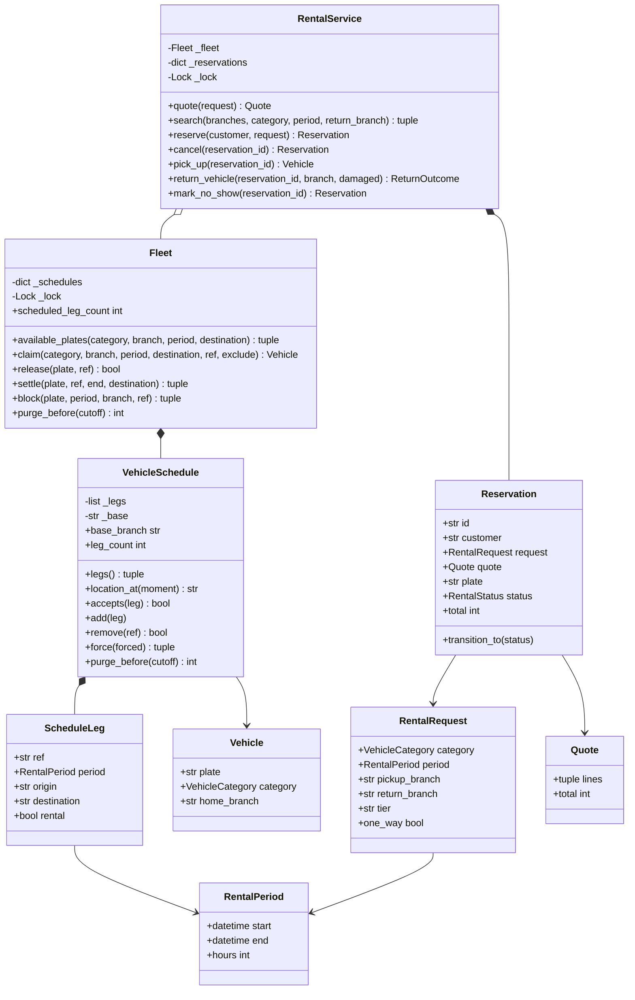

# 设计题解：租车系统（Car Rental）

## 题目与澄清

面试官的开场："设计一个租车系统。用户按城市、车型和时间段搜索可租的车，下单，到门店取车，用完
还车，系统算钱。"

这道题的表面和[[solution-hotel-booking]]几乎一样——一份有限的资源、一段时间区间、不能卖两次——
所以很容易顺手把酒店那套「(房型, 一晚) → 已订数」的计数表搬过来。**搬过来就错了，而且错得很隐蔽。**
酒店的计数表之所以成立，靠的是一条从来没人说出口的前提：**房间不会离开酒店**。一间房今晚被住了，
明晚它还在这家店。车会走。一辆早上从浦东机场开走、晚上还到虹桥的车，从此就是虹桥的车了；浦东的
计数表如果不知道这件事，明天就会把一辆并不在浦东的车卖出去。

所以第一个必须问清的澄清，也是全题的胜负手：

- **支不支持异地还车（one-way）？** 如果答"不支持"，这道题确实退化成酒店，按门店按时段计数就够了。
  但现实中的赫兹、Enterprise、神州租车全都支持，面试官十有八九会说支持，或者在第三关才加上——
  而那时你已经写完的计数表要整个推翻。**主动在第一分钟问掉它**，比第三十分钟重写便宜得多。
- **时间粒度是什么？** 酒店是"晚"，租车是"小时"。这一条同时决定了计费口径（不足一小时按一小时）
  和数据结构的可行性：排期要看未来三到六个月，按小时切格子就是 `24 × 180 ≈ 4320` 个格子每车每门店，
  而一辆车在这段时间里真正的预约往往只有几十条。粒度越细，"按格子计数"越不划算。
- **客人订的是车型还是某一辆车？** 订的是车型（经济型、SUV、豪华）。这一条和酒店订房型一样，
  把"哪辆车"的决定推迟到取车那一刻——但租车这里有个酒店没有的反转：车牌必须在**预约时**就定下来，
  下面"为什么车牌要早绑定"一节会说清楚原因，它正是异地还车带来的。
- **还车时间会不会晚？会不会还错门店？会不会刮蹭？客人会不会不来？** 全部会。这四件事是这道题
  第三关的全部内容，也是区分"能跑的 demo"和"能上线的设计"的地方。
- **计费包含哪些项？** 车型基础价 × 时长、异地还车附加费、保险等加购项、会员折扣。要问清折扣是
  按基础价打还是按小计打（按小计），以及长租有没有封顶（有，每 24 小时最多按 20 小时收）。
- **要不要考虑并发？** 要。两个人同时抢同一门店最后一辆 SUV，是这道题唯一但必考的并发点。

**范围之外**：不接真实支付、不做驾照与信用卡的真实校验、不做跨车型升舱、不做调度算法（车堆在
虹桥、浦东没车了怎么调回来是运筹问题，不是这道 45 分钟的题）、不做真实持久化。

## 需求与分级

- **第 1 关（核心流程，约 20 分钟）**：车辆、车型、门店的建模；小时粒度的半开租期 `RentalPeriod`；
  按门店 + 车型 + 时段查还有哪些车能租；下一笔预约。对应 `Vehicle`、`RentalPeriod`、`ScheduleLeg`、
  `VehicleSchedule.accepts`、`Fleet.available_plates`、`RentalService.reserve`。
- **第 2 关（异地还车，约 15 分钟）**：支持在 A 取、在 B 还。可用性从此必须回答"这辆车那时候**会**
  在哪"，而不是"这辆车现在在哪"。对应 `ScheduleLeg` 的 `origin`/`destination`、
  `VehicleSchedule._consistent`、`VehicleSchedule.location_at`。这一关是全题的设计核心。
- **第 3 关（取还车状态机与现实失败，约 15 分钟）**：取车、还车的显式状态机；迟还挤占下一单；
  还错门店；还车时发现刮蹭，车要进厂；客人爽约。对应 `RentalStatus` 与转移表、`Fleet.settle`、
  `Fleet.block`、`RentalService._rehome`、`mark_no_show`。
- **第 4 关（计费与并发，选做）**：车型、时长、异地、加购、会员折扣的分项报价；两人抢最后一辆车。
  验收标准是：**加一项收费不碰时间轴一行代码**。对应 `category_rate` 等四个定价组件与 `Fleet` 的锁。

## 核心对象与职责

### 为什么库存的单位是"一辆车的一段行程"

酒店把库存记成 `(房型, 某一晚) → 已订数`，因为一间房从不离开酒店，所以"这家店这一晚还剩几间"
是一个自足的数字。租车不成立，原因只有一句：**一次租约不只占用时间，它还搬动了车。**

考虑一辆基地在浦东机场的 SUV，7 月 1 日 9 点从浦东取、19 点还到虹桥。现在有人问："7 月 3 日在
**浦东**能租到这辆 SUV 吗？"

- 纯时间重叠判据（`start < r.end and end > r.start`）说：7 月 3 日和 7 月 1 日那段毫无交叠，**可以租**。
- 现实说：车在虹桥。浦东的柜台那天根本没有这辆车可交。

这就是几乎所有公开题解——包括 GitHub 上最流行的那份——的错误所在。它们的可用性判据只有时间，
没有位置；而只要支持异地还车，位置就是一个**随时间变化的函数**，不是一个字段。

于是库存的单位定成 `ScheduleLeg`：一段 `[start, end)` 的时间，加上 `origin`（取车门店）和
`destination`（还车门店）。每辆车挂一条按开始时间排好的 `ScheduleLeg` 链，全题只有一条不变量：

> 按时间排好之后，每一段的 `origin` 必须等于上一段的 `destination`（第一段等于基地门店），
> 且租约段与上一段之间留够周转时间（清洁、加油、检查）。

这一条不变量同时把三件事说完了：**不重叠**（两段交叠时后一段的开始时刻落在前一段结束之前，
被周转条件挡住）、**接得上**（门店链首尾相接）、**周转**（缓冲写在同一个判断里）。于是"这辆车能不能
接这一单"就是一句话：把候选段插进链里排好序，再检查整条链是否仍然自洽。代码里就是
`accepts(leg)` 调 `_consistent(_ordered(legs + [leg]))`，两行。

### 位置是算出来的，不是存下来的

很自然的第一反应是给 `Vehicle` 加一个 `current_branch` 字段，取车时改成 `None`（在路上），还车时
改成还车门店。**这个字段会毁掉整个设计**，原因不是它错，而是它**只能表达现在**：

- 可用性问的是未来。"8 月 12 日这辆车在哪"用一个 `current_branch` 根本无法回答。
- 它给同一件事留了两个真相。链上明明写着 7 月 1 日还到虹桥，字段却可能因为某个分支忘了更新
  而停在浦东，两边不一致时谁对？
- 取消一笔未来的异地租约时，`current_branch` 该不该变？答案取决于这笔租约之后还有没有别的租约——
  也就是说，你终究要沿着链算一遍。

所以 `location_at(moment)` 是一个纯函数：沿着链往前走，取最后一段在 `moment` 之前结束的行程的
`destination`，没有就是起点门店。它天然支持任意未来时刻，也天然不会和链不一致——因为它就是链。

### 为什么车牌要"早绑定"到预约时刻

这是和酒店最刺眼的一处分歧。酒店坚持**晚绑定**：下单只认房型，房号到店才给，因为提前指定房间会
造成日历碎片化。租车反过来，下单那一刻就必须定下车牌，理由也是异地还车：

一辆车未来的取车门店由它之前的行程决定。如果预约只记"SUV 一辆，7 月 5 日浦东取、7 月 6 日虹桥还"
而不绑定车牌，那么系统无法回答"7 月 7 日虹桥还剩几辆 SUV"——因为不知道 7 月 5 日那单派的是哪辆车，
也就不知道 7 月 6 日到底是哪辆车出现在虹桥。**位置是沿着单辆车的链传播的，不绑定车牌，链就断了。**
换句话说：酒店的房间没有"轨迹"，所以可以晚绑定；租车的车有轨迹，所以必须早绑定。

代价也要说清楚：早绑定意味着排期会碎片化，也意味着现实（迟还、事故）会打翻已经排好的计划。
设计对这个代价的回答是 `Fleet.settle` 与 `_rehome`——被打翻的预约**改派**到另一辆同型车，
而不是让客人吃瘪。这正是真实租车行的做法：柜台永远在换车牌，从不轻易取消订单。

### 职责表

| 类 | 单一职责 | 它守的不变量 |
|---|---|---|
| `RentalPeriod` | 小时粒度的半开租期 | `end > start`；计费小时向上取整 |
| `Vehicle` | 一辆实体车（车牌、车型、基地） | 不可变；不带任何时间或位置状态 |
| `ScheduleLeg` | 时间轴上的一段：租约或维修封锁 | 不可变；同时带走 `origin` 与 `destination` |
| `VehicleSchedule` | **一辆车的行程链** | 门店首尾相接 + 周转缓冲（全题唯一的那条） |
| `Fleet` | 车队；"找车 + 占车"的原子性 | 每辆车的链自洽；释放即整段删除 |
| `Charge` / `Quote` | 账单的一行 / 一次分项报价 | 不可变；合计 = 明细之和 |
| `RentalRequest` | 报价与排期需要的全部事实 | 不可变；定价函数只看它 |
| `Reservation` | 一笔预约 + 它的生命周期 | 状态只能按转移表迁移 |
| `RentalService` | 门面：报价、搜索、预约、取消、取还车、爽约 | 自己不持有任何排期数据 |

`Fleet` **组合**了 `VehicleSchedule`（链的生命周期属于车队），`VehicleSchedule` 组合了它的
`ScheduleLeg` 列表；`Reservation` 只记 `plate` 这个字符串，对 `Vehicle` 是**关联**，不是组合。
门店在这份设计里是一个字符串 id，理由见下面第四个决策。



## 关键设计决策

### 一、可用性判据：门店计数表，还是每车时间轴？

问题说清楚：给定车型 C、门店 B、时段 `[s, e)`、还车门店 D，判断能不能接单，并且要能在异地还车
之下给出正确答案。

**选项 A：按 (门店, 车型, 小时) 的计数表**，酒店那套的直接搬运。

```python
booked: dict[tuple[str, VehicleCategory, datetime], int]   # 门店 × 车型 × 某一小时 → 已租数
```

代价有两笔，一笔是量的，一笔是质的。量的那笔：粒度是小时、排期看半年，一个门店一个车型就是
约 4320 个键，一次三天的租约要动 72 个键；而这门店这半年真实发生的租约可能只有两百条。**格子数
和业务量脱钩，是"按格子计数"在细粒度下必然的失败。**质的那笔更致命：计数表只记"这个门店少了
一辆"，记不了"这辆车去了哪个门店"。异地还车时你要在 B 的表上把某一小时之后**全部**加一，在 A 的表上
某一小时之后**全部**减一——于是每张表都变成了前缀和，而且再也回答不了"这辆车现在归谁"。

**选项 B：按 (门店, 车型) 的净流量事件表**，把每次取车记成 `-1`、每次还车记成 `+1`，可用量是按
时间排序后的前缀和。这个其实是对的，而且比 A 省得多：代价是 `O(事件数)`，和业务量挂钩。它真正的
问题是**丢了车的身份**——还车时要记录刮蹭、里程、油量，迟还时要知道是哪辆车迟了、它挡了谁，
改派时要知道换成哪一辆。一个只有数字的库存对这些问题一律失语。另外它还要求"从某时刻起的
前缀最小值 ≥ 1"这样一个区间最小值查询，才能保证不会在未来某一刻透支，实现复杂度并不比 C 低。

**选项 C（本文的选择）：每辆车一条 `ScheduleLeg` 链，可用性 = 插入后整条链仍自洽。**代价是判定
要遍历该车型的车，每辆车遍历它的链：`O(该车型车数 × 每车段数)`。在一家门店、一个车型只有几十辆车、
每辆车半年几十段的规模下，这是几百次比较，`available_plates` 一次调用不到一毫秒；而它换来的是
**位置、身份、维修、改派全部免费**——维修就是一段 `rental=False` 的行程，迟还就是把那一段改写成
实际发生的样子，都用同一条不变量复核。

判据：**当"资源会移动"时，库存必须按资源实例建模，不能按地点计数。**不移动（酒店房间、影院座位）
才轮得到计数表。这也是这道题和[[solution-hotel-booking]]最根本的分野。

### 二、迟还、还错门店、事故进厂——三件事其实是一件事

问题：客人比约定晚了五小时还车，而这辆车十二点还有下一单；客人把车还到了南京而不是约定的虹桥；
还车时发现刮蹭，车要进厂 48 小时。三条都会打翻已经排好的未来。

朴素写法是三个分支：迟还去改下一单、还错门店去改位置字段、事故去把车标成 `under_repair = True`。
三个分支各写各的，彼此之间的交互（又迟还又刮蹭，下一单怎么办）根本没人想过。

本文的写法是：**把这三件事都还原成"往时间轴上强行写一段，然后修复时间轴"。**

```python
def settle(self, plate: str, ref: str, end: datetime, destination: str) -> tuple[str, ...]:
    """把一段租约改写成实际发生的样子，再修复时间轴，返回被挤掉的预约号。"""
    with self._lock:
        schedule = self._schedule(plate)
        leg = next((l for l in schedule.legs() if l.ref == ref), None)
        if leg is None:
            raise UnknownEntityError(f"{plate} has no leg {ref!r}")
        floor = leg.period.start + timedelta(hours=1)   # 至少还是一段有长度的区间
        actual = replace(leg, period=RentalPeriod(leg.period.start, max(end, floor)),
                         destination=destination)
        return schedule.force(actual)
```

迟还 = `end` 变大；还错门店 = `destination` 变了；事故 = 再 `force` 一段 `rental=False` 的维修段。
`force` 的规则只有一条：已经开始的行程、维修段、以及这一段本身不动，尚未开始的租约从早到晚
逐段复核，复核不过的整段丢掉并把预约号交出去。**准点、还对门店、没刮蹭时，这次调用什么也挤不掉**，
所以还车路径只有一条，不需要为"正常还车"单写分支——这是三合一带来的真正好处。

一个只有在异地还车之下才存在、也是这个设计最漂亮的推论：**挤占会连锁**。假设一辆车排了
A→B、B→C、C→A 三段，第一段迟还挤掉了第二段；第三段的取车门店是 C，可现在车停在 B，于是第三段
**也**留不住。`force` 里那个"逐段复核"的循环天生处理了这一点，不需要任何额外代码——因为它复核的
是同一条不变量。用三个分支写的版本几乎必然漏掉它。

被挤掉之后怎么办？`_rehome` 先试着换一辆同型车；换不到就把 `Reservation.plate` 置空，**但不取消
订单**。理由是业务性的：没车是运营要解决的问题（调度、升舱、外租），不是客人的错；订单留在
`RESERVED`，运营在取车时刻之前还有时间补救，`pick_up` 那一刻才抛 `NoVehicleAvailableError`。
偷偷替客人取消是最糟的选择——客人到了柜台才知道自己没单了。

### 三、计费：策略模式、模板方法，还是一串函数？

问题：报价要包含车型基础价 × 时长（带长租封顶）、异地还车附加费、保险等加购项、会员折扣；
第四关随时会加"周末加价""机场取车费""第二驾驶员"。要求是加一项不碰可用性。

**选项 A：一个 `PricingStrategy` 抽象基类，每种定价一个子类。**这是 Java 题解的标准答案，也是这道题
最常见的过度设计：定价不是"几选一"，而是"**几项相加**"。用策略你会立刻发现需要一个
`CompositePricingStrategy` 去组合它们，然后为了让折扣看到小计，又要给接口加一个 `subtotal` 参数——
最后你得到的就是一串函数，只不过外面套了四层类。

**选项 B：模板方法**，一个基类写死"基础价 → 附加费 → 折扣"的顺序，子类填空。它把顺序钉死在继承
结构里，加一项要么改基类（所有子类跟着动），要么在某个钩子里塞两件事。

**选项 C（本文的选择）：一串 `Callable[[RentalRequest, int], Charge | None]`，按顺序跑。**
这就是[[patterns.strategy|策略模式与可替换算法（Strategy）]]在 Python 里的自然形态——策略只有一个
方法且不需要共享状态时，它**就是**一个函数；需要参数就用闭包（`one_way_fee(30000)` 返回一个
组件）。组件之间只通过"此前小计"这一个整数耦合，所以 `loyalty_discount` 能对小计打折，而它不需要
知道小计是怎么来的。

两个细节值得说给面试官听。第一，签名里没有 `Fleet`：定价函数**拿不到车队**，也就不可能绕过车队的
锁去读内部状态，"剩余几辆"这类事实只能被喂进来。第二，返回 `Charge | None` 而不是 `int`：
报价必须是分项的，客人要看到"异地费 300 元"这一行；返回一个总数的设计在第一次客诉时就会崩。
金额用整数分，不用 `float`——`0.1 + 0.2` 那件事在钱上不能重演。

### 四、拒绝一个类：为什么没有 `Branch`

问题：系统里有门店，门店有 id、有城市、有地址、有营业时间。是不是该有一个 `Branch` 类？

答案是**这一版不要**，而且理由要说得出来：**这道题里门店没有任何行为，也不持有任何不变量。**
"浦东机场店此刻有几辆 SUV"不是门店的属性——它是沿着每辆车的时间轴算出来的结果，门店拦不住也
守不住。一个只有 `id` 和 `city` 两个字段、没有一个方法的类，在 Python 里和一个字符串 id 加一张
外部的 `dict[str, str]` 完全等价，却要求每一处传参都多一层拆包。

什么时候它该出现？当门店开始持有它自己的不变量时：营业时间（非营业时段不能取还车）、车位上限
（一个门店最多停 40 辆，超了不许还到这里）、跨城单程的黑白名单。那时 `Branch` 有了要守的东西，
类才有了内容——而**加它不会碰 `VehicleSchedule` 一行**，因为门店在链上只是一个 id，换成一个对象
或者加一层查表都只影响 `Fleet.claim` 的参数校验。

同理被拒的还有：`Customer` 类（这一版只有一个 id 和一个会员等级，等到要存驾照有效期、信用记录、
违章历史时再加）、`RentalService.purge_before` 这样只转发一次调用的方法（调用方直接用
`fleet.purge_before`，多包一层只让调用栈更长）、以及单例的 `RentalSystem`——流行题解几乎都写了
`get_instance()`，而它的唯一效果是让测试无法并行、无法构造两个互不干扰的车队。这份实现里
`Fleet` 和 `RentalService` 都是普通对象，测试里想要几个就有几个。

## 代码走读

四处值得停下来看。

**第一处，`VehicleSchedule._consistent`——全题的心脏。**三件事（门店接续、不重叠、周转缓冲）写在
同一个循环里，`where` 沿着链往前传，`previous_end` 守时间。注意租约段和维修段的缓冲不同：
维修紧接还车那一刻开始，不需要清洁时间。整个可用性判定、`force` 的复核、插入的合法性检查，
全部复用这一个函数——这是"一条不变量"真正的含金量。

**第二处，`VehicleSchedule.force`——修复时间轴。**`pinned` 里是既成事实（已经开始的、维修的、
被强行写入的这一段），其余的按时间从早到晚逐段试着塞回去，塞不进的整段丢掉。异地还车下的连锁
挤占就发生在这个循环里：中间一段被丢掉，后一段的 `origin` 在复核时对不上，于是也被丢掉。

**第三处，`VehicleSchedule.purge_before`——会缩的容器，以及它的陷阱。**时间轴必须会缩，否则一家
开十年的租车行，每辆车的链会无限长大。但这里有一个坑：位置是沿着链算出来的，**删掉最后一段历史
却不前移起点，这辆车就会凭空瞬移回基地**。所以第一句永远是先把被丢掉的最后一段的 `destination`
吸收进 `_base`，然后才删。容器可以缩，但不能连它承载的状态一起丢。

**第四处，`Fleet.claim`——查与占在同一把锁里。**流行题解写的是"先 `is_car_available` 再
`make_reservation`"两次调用，中间隔着一个没有锁的缝，两个线程同时进来就双开。这里 `claim` 在一把
锁里遍历、判定、写入，返回的是已经占好的那辆车。要对面试官坦白的是：**GIL 不保证这件事**——GIL
只保证单条字节码不被切开，而"遍历一遍字典再写一个 key"是几百条字节码，中间随时可能切换线程。
锁保护的是这一段复合操作，不是某一次赋值。

`RentalService` 与 `Fleet` 各有一把锁，纪律是永远"先放后拿"、绝不嵌套：服务的锁只保护预约表，
拿车队的锁之前一定先放掉自己的。`_rehome` 里那两段短锁就是这条纪律的实例。

%% code:begin solution.py %%
```python
"""租车系统（Car Rental）——按门店与时段的车辆可用性、异地还车、取还车状态机与计费的参考实现。

核心思路：库存的单位不是"门店里停着的一辆车"，而是**一辆具体的车在时间轴上的一段行程**。
异地还车（one-way）把"这个门店有没有车"变成一个与时间有关的问题：车此刻在 A，不代表下周还在 A。
所以每辆车挂一条 `VehicleSchedule`，全题只有一条不变量——行程按开始时间排好后，每一段的取车门店
必须等于上一段的还车门店，且租约之间留够周转时间。可用性查询、异地还车、迟还挤占、事故封车，
都是这条不变量的不同用法。计费是一串注入的纯函数，加保险或会员折扣不碰可用性一行。
"""

from __future__ import annotations

import itertools
import math
import threading
from collections.abc import Callable, Iterable, Mapping, Sequence
from dataclasses import dataclass, replace
from datetime import datetime, timedelta
from enum import Enum

# --------------------------------------------------------------------------
# 失败路径。

class RentalError(Exception):
    """本设计里所有失败路径的公共基类。"""


class UnknownEntityError(RentalError):
    """预约号、车牌或门店不存在。"""


class InvalidPeriodError(RentalError):
    """租期不合法：结束时刻不晚于开始时刻。"""


class NoVehicleAvailableError(RentalError):
    """这个门店、这个时段、这个车型，没有一辆车排得下。"""


class InvalidTransitionError(RentalError):
    """预约当前状态不允许这次状态转移。"""


# --------------------------------------------------------------------------
# 租期：小时粒度的半开区间。

@dataclass(frozen=True, slots=True)
class RentalPeriod:
    """一段租期，**半开**：`[start, end)`。粒度是小时，跨度可以是几小时到几个月。"""

    start: datetime
    end: datetime

    def __post_init__(self) -> None:
        if self.end <= self.start:
            raise InvalidPeriodError(f"end {self.end} must be after start {self.start}")

    @property
    def hours(self) -> int:
        """计费小时数：不足一小时按一小时算。租车行业按"开始计费的那一小时"收钱。"""
        return max(1, math.ceil((self.end - self.start).total_seconds() / 3600))


# --------------------------------------------------------------------------
# 门店、车型、车辆。

class VehicleCategory(Enum):
    """车型档次。客人订的是车型，不是某一辆车——和酒店订房型是同一条业务事实。"""

    ECONOMY = "economy"
    COMPACT = "compact"
    SUV = "suv"
    LUXURY = "luxury"


@dataclass(frozen=True, slots=True)
class Vehicle:
    """一辆实体车：车牌、车型、基地门店。不带"现在被谁租着"的状态。"""

    plate: str
    category: VehicleCategory
    home_branch: str
    model: str = ""


@dataclass(frozen=True, slots=True)
class ScheduleLeg:
    """车辆时间轴上的一段：`rental=True` 是一次租约，`rental=False` 是一次维修封锁。

    它同时记了 `origin` 和 `destination`：异地还车之下，一段行程不只占用时间，还**搬动了车**。
    """

    ref: str
    period: RentalPeriod
    origin: str
    destination: str
    rental: bool = True


# --------------------------------------------------------------------------
# VehicleSchedule：这道题的核心——一辆车的时间轴与它唯一的一条不变量。

class VehicleSchedule:
    """一辆车按开始时间排好的行程链。

    不变量（全题唯一的那条）：每一段的取车门店等于上一段的还车门店（第一段等于基地门店），
    且租约段与上一段之间留够周转时间（清洁、加油）。维修段紧接还车那一刻开始，不需要周转。

    可用性因此不是"这辆车这段时间空不空"，而是"把这一段插进去之后整条链还自洽不自洽"——
    一辆 7 号从 A 开到 B 的车，10 号在 A 明明没有任何重叠，却根本不在 A。
    """

    def __init__(self, vehicle: Vehicle, turnaround: timedelta = timedelta(hours=1)) -> None:
        self.vehicle = vehicle
        self._base = vehicle.home_branch
        self._turnaround = turnaround
        self._legs: list[ScheduleLeg] = []

    @property
    def base_branch(self) -> str:
        """时间轴起点上车停在哪。它会随着历史行程被清理而前移。"""
        return self._base

    @property
    def leg_count(self) -> int:
        """时间轴上当前有几段——用来验证"取消即删、过期即清"真的生效。"""
        return len(self._legs)

    def legs(self) -> tuple[ScheduleLeg, ...]:
        """时间轴的一份不可变快照，绝不交出内部列表。"""
        return tuple(self._legs)

    @staticmethod
    def _ordered(legs: Iterable[ScheduleLeg]) -> list[ScheduleLeg]:
        return sorted(legs, key=lambda leg: (leg.period.start, leg.period.end))

    def _consistent(self, legs: Sequence[ScheduleLeg]) -> bool:
        """一条按时间排好的行程链是否自洽——重叠、周转缓冲、门店接续三件事写在一个循环里。"""
        where: str = self._base
        previous_end: datetime | None = None
        for leg in legs:
            if leg.origin != where:
                return False
            if previous_end is not None:
                gap = self._turnaround if leg.rental else timedelta(0)
                if leg.period.start < previous_end + gap:
                    return False
            where, previous_end = leg.destination, leg.period.end
        return True

    def location_at(self, moment: datetime) -> str:
        """某一时刻车停在哪：最后一段在此之前结束的行程的还车门店，没有就是基地门店。

        位置是**算出来的**，不是存下来的。存一个 `current_branch` 字段就等于给同一件事留了
        两个真相，而未来的预约根本无法在"当前位置"上表达。
        """
        where = self._base
        for leg in self._legs:
            if leg.period.end <= moment:
                where = leg.destination
            else:
                break
        return where

    def accepts(self, leg: ScheduleLeg) -> bool:
        """把这一段插进来之后整条链是否仍然自洽。"""
        return self._consistent(self._ordered([*self._legs, leg]))

    def add(self, leg: ScheduleLeg) -> None:
        """排进一段行程；排不下就抛 `NoVehicleAvailableError`。"""
        if not self.accepts(leg):
            raise NoVehicleAvailableError(f"{self.vehicle.plate} cannot serve {leg.ref}")
        self._legs = self._ordered([*self._legs, leg])

    def remove(self, ref: str) -> bool:
        """取消一段行程，返回是否真的删掉了。删的是整段，不留空壳。"""
        kept = [leg for leg in self._legs if leg.ref != ref]
        changed = len(kept) != len(self._legs)
        self._legs = kept
        return changed

    def force(self, forced: ScheduleLeg) -> tuple[str, ...]:
        """强行写入一段（迟还的延长、乱还的改点、事故封车），再把时间轴修回自洽。

        固定不动的是：已经开始的行程、维修段、以及这一段本身——既成事实不能被"排不下"推翻。
        可以被挤掉的只有尚未开始的租约。异地还车之下挤占会**连锁**：丢掉中间一段，后面一段的
        取车门店就对不上，于是也留不住。返回被挤掉的预约号，由上层去改派。
        """
        rest = [leg for leg in self._legs if leg.ref != forced.ref]
        pinned = {leg.ref for leg in rest
                  if not leg.rental or leg.period.start < forced.period.start}
        self._legs = self._ordered([leg for leg in rest if leg.ref in pinned] + [forced])
        displaced: list[str] = []
        for leg in self._ordered(leg for leg in rest if leg.ref not in pinned):
            if self.accepts(leg):
                self._legs = self._ordered([*self._legs, leg])
            else:
                displaced.append(leg.ref)
        return tuple(displaced)

    def purge_before(self, cutoff: datetime) -> int:
        """丢掉 `cutoff` 之前已经结束的行程，返回丢掉的段数。

        关键在第一行：丢之前先把"车最后停在哪"吸收进 `_base`。位置是沿着链算出来的，删掉
        最后一段历史却不前移起点，这辆车就会凭空瞬移回基地——**容器可以缩，但不能连它承载的
        状态一起丢**。
        """
        stale = self._ordered(leg for leg in self._legs if leg.period.end <= cutoff)
        if not stale:
            return 0
        self._base = stale[-1].destination
        self._legs = [leg for leg in self._legs if leg.period.end > cutoff]
        return len(stale)


# --------------------------------------------------------------------------
# Fleet：车队。"挑一辆能接这单的车 + 占上"这一步必须是一次原子操作。

class Fleet:
    """全部车辆与它们的时间轴。锁守的是"找车 + 占车"不可分割这一条。

    不变量：任一时刻每辆车的时间轴自洽；释放一段就整段删掉，不留空壳。
    """

    def __init__(self, vehicles: Iterable[Vehicle], turnaround: timedelta = timedelta(hours=1)) -> None:
        self._schedules = {v.plate: VehicleSchedule(v, turnaround) for v in vehicles}
        self._lock = threading.Lock()

    @property
    def scheduled_leg_count(self) -> int:
        """全车队时间轴上的总段数——只读计数，不把内部结构交出去。"""
        with self._lock:
            return sum(schedule.leg_count for schedule in self._schedules.values())

    def _schedule(self, plate: str) -> VehicleSchedule:
        schedule = self._schedules.get(plate)
        if schedule is None:
            raise UnknownEntityError(f"unknown plate {plate!r}")
        return schedule

    def vehicle(self, plate: str) -> Vehicle:
        """按车牌取车辆。"""
        return self._schedule(plate).vehicle

    def location_of(self, plate: str, moment: datetime) -> str:
        """某一时刻这辆车停在哪个门店。"""
        with self._lock:
            return self._schedule(plate).location_at(moment)

    def available_plates(self, category: VehicleCategory, branch: str,
                         period: RentalPeriod, destination: str) -> tuple[str, ...]:
        """这个车型、这个门店、这个时段能接单的全部车牌，按车牌排序。"""
        with self._lock:
            return tuple(sorted(
                plate for plate, schedule in self._schedules.items()
                if schedule.vehicle.category is category
                and schedule.accepts(ScheduleLeg("?", period, branch, destination))))

    def claim(self, category: VehicleCategory, branch: str, period: RentalPeriod,
              destination: str, ref: str, exclude: str = "") -> Vehicle:
        """原子地挑一辆能接这单的车并占上。查与占分成两次调用就是这道题的经典超卖 bug。"""
        leg = ScheduleLeg(ref, period, branch, destination)
        with self._lock:
            for plate in sorted(self._schedules):
                schedule = self._schedules[plate]
                if plate == exclude or schedule.vehicle.category is not category:
                    continue
                if schedule.accepts(leg):
                    schedule.add(leg)
                    return schedule.vehicle
        raise NoVehicleAvailableError(
            f"no {category.value} at {branch} for {period.start}–{period.end}")

    def release(self, plate: str, ref: str) -> bool:
        """放掉一段行程（取消、爽约、改派走）。"""
        with self._lock:
            return self._schedule(plate).remove(ref)

    def settle(self, plate: str, ref: str, end: datetime, destination: str) -> tuple[str, ...]:
        """把一段租约改写成**实际发生**的样子，再修复时间轴，返回被挤掉的预约号。

        迟还和"还到了别的门店"其实是同一件事：计划被现实推翻，时间轴按现实重排。准点还车时
        这次调用什么也挤不掉，所以还车路径只有这一条，不需要为"正常还车"单写一个分支。
        """
        with self._lock:
            schedule = self._schedule(plate)
            leg = next((l for l in schedule.legs() if l.ref == ref), None)
            if leg is None:
                raise UnknownEntityError(f"{plate} has no leg {ref!r}")
            floor = leg.period.start + timedelta(hours=1)
            actual = replace(leg, period=RentalPeriod(leg.period.start, max(end, floor)),
                             destination=destination)
            return schedule.force(actual)

    def block(self, plate: str, period: RentalPeriod, branch: str, ref: str) -> tuple[str, ...]:
        """事故或保养：把车从时间轴上整段封掉，返回被挤掉的预约号。

        维修复用同一条时间轴而不是一个 `under_repair` 布尔值，于是"修到几号"天然可查，
        维修期之后的预约也天然还在——布尔值只能表达"现在坏了"，表达不了"到 15 号才能用"。
        """
        with self._lock:
            return self._schedule(plate).force(
                ScheduleLeg(ref, period, branch, branch, rental=False))

    def purge_before(self, cutoff: datetime) -> int:
        """清掉全车队的历史行程，返回清掉的段数。"""
        with self._lock:
            return sum(s.purge_before(cutoff) for s in self._schedules.values())


# --------------------------------------------------------------------------
# 计费：一串注入的纯函数。加一项等于加一个函数，不碰时间轴一行。

@dataclass(frozen=True, slots=True)
class Charge:
    """账单上的一行：科目 + 金额（分，可以为负表示折扣）。"""

    code: str
    amount: int


@dataclass(frozen=True, slots=True)
class Quote:
    """一次报价：逐行明细 + 合计。给客人看明细，而不是一个说不清的总数。"""

    lines: tuple[Charge, ...]

    @property
    def total(self) -> int:
        """合计（分）。"""
        return sum(line.amount for line in self.lines)


@dataclass(frozen=True, slots=True)
class RentalRequest:
    """报价与排期需要的全部事实。定价函数只看它，拿不到车队，也就绕不过车队的锁。"""

    category: VehicleCategory
    period: RentalPeriod
    pickup_branch: str
    return_branch: str
    tier: str = "none"
    extras: tuple[str, ...] = ()

    @property
    def one_way(self) -> bool:
        """是不是异地还车。"""
        return self.pickup_branch != self.return_branch


PriceComponent = Callable[["RentalRequest", int], Charge | None]
Clock = Callable[[], datetime]


def category_rate(rates: Mapping[VehicleCategory, int], daily_cap_hours: int = 20) -> PriceComponent:
    """按小时计价，但每满 24 小时最多收 `daily_cap_hours` 小时——长租不该比短租的整数倍还贵。"""

    def component(request: RentalRequest, subtotal: int) -> Charge | None:
        days, spare = divmod(request.period.hours, 24)
        billed = days * daily_cap_hours + min(spare, daily_cap_hours)
        return Charge("base", rates[request.category] * billed)

    return component


def one_way_fee(amount: int) -> PriceComponent:
    """异地还车附加费：车被留在了别处，回程调度要花钱。"""

    def component(request: RentalRequest, subtotal: int) -> Charge | None:
        return Charge("one_way", amount) if request.one_way else None

    return component


def extras_fee(per_hour: Mapping[str, int]) -> PriceComponent:
    """保险、儿童座椅一类加购项，按小时计。"""

    def component(request: RentalRequest, subtotal: int) -> Charge | None:
        rate = sum(per_hour.get(extra, 0) for extra in request.extras)
        return Charge("extras", rate * request.period.hours) if rate else None

    return component


def loyalty_discount(percent: Mapping[str, int]) -> PriceComponent:
    """会员折扣：按**此前的小计**打折，所以它必须排在组件序列的最后一项。"""

    def component(request: RentalRequest, subtotal: int) -> Charge | None:
        off = percent.get(request.tier, 0)
        return Charge("loyalty", -(subtotal * off // 100)) if off else None

    return component


def price(components: Sequence[PriceComponent], request: RentalRequest) -> Quote:
    """按顺序跑一遍组件，把非零的行拼成报价。组件之间只通过"此前小计"这一个数字耦合。"""
    lines: list[Charge] = []
    for component in components:
        charge = component(request, sum(line.amount for line in lines))
        if charge is not None and charge.amount:
            lines.append(charge)
    return Quote(tuple(lines))


# --------------------------------------------------------------------------
# 预约与它的生命周期。

class RentalStatus(Enum):
    """预约生命周期的五个状态。"""

    RESERVED = "reserved"
    PICKED_UP = "picked_up"
    RETURNED = "returned"
    CANCELLED = "cancelled"
    NO_SHOW = "no_show"


ALLOWED_TRANSITIONS: Mapping[RentalStatus, frozenset[RentalStatus]] = {
    RentalStatus.RESERVED: frozenset({RentalStatus.PICKED_UP, RentalStatus.CANCELLED,
                                      RentalStatus.NO_SHOW}),
    RentalStatus.PICKED_UP: frozenset({RentalStatus.RETURNED}),
    RentalStatus.RETURNED: frozenset(),
    RentalStatus.CANCELLED: frozenset(),
    RentalStatus.NO_SHOW: frozenset(),
}
"""合法转移写成一张数据表，而不是散落在各方法里的 `if`：加一个 EXTENDED 只要加一行。"""


@dataclass(slots=True)
class Reservation:
    """一笔预约：谁、什么诉求、报价多少、派了哪辆车、现在走到生命周期的哪一步。

    `plate` 可以是 `None`——被迟还挤掉又改派不到车时就是这个状态。它**不**等于取消：
    单子还在，运营还有时间调车或升舱，取车那一刻才失败。
    """

    id: str
    customer: str
    request: RentalRequest
    quote: Quote
    plate: str | None = None
    status: RentalStatus = RentalStatus.RESERVED
    picked_up_at: datetime | None = None
    returned_at: datetime | None = None
    returned_branch: str | None = None
    extra_charges: tuple[Charge, ...] = ()

    @property
    def total(self) -> int:
        """含还车后追加科目的最终金额（分）。"""
        return self.quote.total + sum(charge.amount for charge in self.extra_charges)

    def transition_to(self, new_status: RentalStatus) -> None:
        """按转移表改状态；不合法就抛 `InvalidTransitionError`。"""
        if new_status not in ALLOWED_TRANSITIONS[self.status]:
            raise InvalidTransitionError(
                f"reservation {self.id}: cannot go from {self.status.value} to {new_status.value}")
        self.status = new_status


@dataclass(frozen=True, slots=True)
class ReturnOutcome:
    """一次还车发生了什么：迟了几小时、追加了哪些钱、连累了谁、谁没救回来。"""

    reservation_id: str
    late_hours: int
    charges: tuple[Charge, ...]
    reassigned: tuple[str, ...]
    unassigned: tuple[str, ...]


# --------------------------------------------------------------------------
# RentalService：门面。报价、搜索、预约、取消、取车、还车、爽约、清理。

class RentalService:
    """租车服务。

    锁纪律：它自己的锁只保护门店表和预约表，**绝不**在持有它时去拿 `Fleet` 的锁。
    两把锁永远"先放后拿"，不存在嵌套，因此也不可能死锁。
    """

    def __init__(self, fleet: Fleet, clock: Clock, components: Sequence[PriceComponent], *,
                 late_fee_per_hour: int = 8000, wrong_branch_fee: int = 30000,
                 no_show_fee: int = 12000, grace: timedelta = timedelta(hours=2),
                 repair: timedelta = timedelta(hours=48)) -> None:
        self._fleet = fleet
        self._clock = clock
        self._components = tuple(components)
        self._late_fee_per_hour = late_fee_per_hour
        self._wrong_branch_fee = wrong_branch_fee
        self._no_show_fee = no_show_fee
        self._grace = grace
        self._repair = repair
        self._reservations: dict[str, Reservation] = {}
        self._lock = threading.Lock()
        self._ids = (f"R{n}" for n in itertools.count(1))

    # ---- 报价与搜索 ------------------------------------------------------

    def quote(self, request: RentalRequest) -> Quote:
        """报价。纯计算，不碰车队，所以可以随便调，也可以单独测。"""
        return price(self._components, request)

    def search(self, branches: Iterable[str], category: VehicleCategory, period: RentalPeriod,
               return_branch: str | None = None) -> tuple[str, ...]:
        """这些门店里，哪些能提供这个车型、这个时段（可指定异地还到哪）的车。"""
        return tuple(branch for branch in branches
                     if self._fleet.available_plates(category, branch, period,
                                                     return_branch or branch))

    # ---- 预约与取消 ------------------------------------------------------

    def reserve(self, customer: str, request: RentalRequest) -> Reservation:
        """下单：先报价，再原子地占一辆车，最后落单。占车失败就整笔失败。"""
        quote = self.quote(request)
        with self._lock:
            reservation = Reservation(id=next(self._ids), customer=customer,
                                      request=request, quote=quote)
        vehicle = self._fleet.claim(request.category, request.pickup_branch, request.period,
                                    request.return_branch, reservation.id)
        reservation.plate = vehicle.plate
        with self._lock:
            self._reservations[reservation.id] = reservation
        return reservation

    def _require(self, reservation_id: str) -> Reservation:
        """取预约；调用方必须已经持有 `self._lock`。"""
        found = self._reservations.get(reservation_id)
        if found is None:
            raise UnknownEntityError(f"unknown reservation {reservation_id!r}")
        return found

    def reservation(self, reservation_id: str) -> Reservation:
        """按预约号取预约。"""
        with self._lock:
            return self._require(reservation_id)

    def cancel(self, reservation_id: str) -> Reservation:
        """取消：状态位先在锁内翻，再放车。并发重复取消只有一个能成功，车只会被放一次。"""
        with self._lock:
            found = self._require(reservation_id)
            found.transition_to(RentalStatus.CANCELLED)
            plate = found.plate
        if plate is not None:
            self._fleet.release(plate, reservation_id)
        return found

    def mark_no_show(self, reservation_id: str) -> Reservation:
        """爽约：过了取车宽限期人还没来，收爽约费并把车放回去给别人。"""
        now = self._clock()
        with self._lock:
            found = self._require(reservation_id)
            if now < found.request.period.start + self._grace:
                raise InvalidTransitionError(f"reservation {reservation_id}: still within grace")
            found.transition_to(RentalStatus.NO_SHOW)
            found.extra_charges = (Charge("no_show", self._no_show_fee),)
            plate = found.plate
        if plate is not None:
            self._fleet.release(plate, reservation_id)
        return found

    # ---- 取车与还车 ------------------------------------------------------

    def pick_up(self, reservation_id: str) -> Vehicle:
        """取车：核对时间窗与车真的在这个门店，再把状态推进 PICKED_UP。

        "车真的在这个门店"这一条必须在取车时复核，而不是信预约时的结论：预约之后可能发生过
        迟还挤占、事故封车、改派。复核用的就是时间轴算出来的位置，不需要任何额外字段。
        """
        now = self._clock()
        found = self.reservation(reservation_id)
        if RentalStatus.PICKED_UP not in ALLOWED_TRANSITIONS[found.status]:
            raise InvalidTransitionError(
                f"reservation {reservation_id}: cannot pick up from {found.status.value}")
        if not found.request.period.start - self._grace <= now < found.request.period.end:
            raise InvalidTransitionError(f"reservation {reservation_id}: {now} is outside the window")
        if found.plate is None:
            raise NoVehicleAvailableError(f"reservation {reservation_id} has no vehicle assigned")
        if self._fleet.location_of(found.plate, now) != found.request.pickup_branch:
            raise NoVehicleAvailableError(
                f"{found.plate} is not at {found.request.pickup_branch}")
        with self._lock:
            found.transition_to(RentalStatus.PICKED_UP)
            found.picked_up_at = now
        return self._fleet.vehicle(found.plate)

    def return_vehicle(self, reservation_id: str, *, branch: str | None = None,
                       damaged: bool = False) -> ReturnOutcome:
        """还车：按实际时刻和实际门店重排时间轴，结算追加费用，再替被挤掉的预约改派。"""
        now = self._clock()
        with self._lock:
            found = self._require(reservation_id)
            found.transition_to(RentalStatus.RETURNED)
            plate = found.plate
        if plate is None:  # PICKED_UP 必有车；裸 assert 会被 -O 去掉，不变量要用真异常
            raise RentalError(f"reservation {reservation_id} was picked up without a vehicle")
        request = found.request
        where = branch or request.return_branch
        charges: list[Charge] = []
        late = max(0, math.ceil((now - request.period.end).total_seconds() / 3600))
        if late:
            charges.append(Charge("late", late * self._late_fee_per_hour))
        if where != request.return_branch:
            charges.append(Charge("wrong_branch", self._wrong_branch_fee))
        displaced = list(self._fleet.settle(plate, reservation_id, now, where))
        if damaged:
            displaced += self._fleet.block(plate, RentalPeriod(now, now + self._repair),
                                           where, f"MAINT-{reservation_id}")
        reassigned, unassigned = self._rehome(displaced)
        with self._lock:
            found.returned_at, found.returned_branch = now, where
            found.extra_charges = tuple(charges)
        return ReturnOutcome(reservation_id, late, tuple(charges), reassigned, unassigned)

    def _rehome(self, displaced: Iterable[str]) -> tuple[tuple[str, ...], tuple[str, ...]]:
        """被挤掉的预约先试着换一辆同型车，换不到就把车牌置空——绝不替客人偷偷取消订单。"""
        reassigned: list[str] = []
        unassigned: list[str] = []
        for reservation_id in dict.fromkeys(displaced):
            with self._lock:
                found = self._reservations.get(reservation_id)
                pending = found is not None and found.status is RentalStatus.RESERVED
            if found is None or not pending:
                continue
            request = found.request
            try:  # 车队的锁只在这一句里拿，此时本服务的锁已经放掉了
                plate = self._fleet.claim(request.category, request.pickup_branch, request.period,
                                          request.return_branch, reservation_id,
                                          exclude=found.plate or "").plate
            except NoVehicleAvailableError:
                plate, target = None, unassigned
            else:
                target = reassigned
            with self._lock:
                found.plate = plate
                target.append(reservation_id)
        return tuple(reassigned), tuple(unassigned)


if __name__ == "__main__":
    from datetime import UTC

    base = datetime(2026, 7, 1, 9, 0, tzinfo=UTC)
    now = base
    fleet = Fleet([Vehicle("京A001", VehicleCategory.SUV, "SH-PVG", "Model Y"),
                   Vehicle("京A002", VehicleCategory.SUV, "SH-PVG", "CR-V")])
    service = RentalService(
        fleet, clock=lambda: now,
        components=[category_rate({VehicleCategory.SUV: 4500}), one_way_fee(30000),
                    extras_fee({"insurance": 800}), loyalty_discount({"gold": 10})])
    shanghai = ("SH-PVG", "SH-HQ")

    first = service.reserve("chi", RentalRequest(
        VehicleCategory.SUV, RentalPeriod(base, base + timedelta(hours=30)),
        "SH-PVG", "SH-HQ", tier="gold", extras=("insurance",)))
    print(f"{first.id} → {first.plate}, {first.quote.total} 分, "
          f"{[(c.code, c.amount) for c in first.quote.lines]}")

    later = RentalPeriod(base + timedelta(hours=40), base + timedelta(hours=44))
    print("40 小时后京A001 停在", fleet.location_of("京A001", later.start),
          "；此时还能出 SUV 的门店：", service.search(shanghai, VehicleCategory.SUV, later))

    second = service.reserve("lee", RentalRequest(VehicleCategory.SUV, later, "SH-PVG", "SH-PVG"))
    service.pick_up(first.id)
    now = base + timedelta(hours=41)
    outcome = service.return_vehicle(first.id, damaged=True)
    print(f"迟还 {outcome.late_hours} 小时 {[(c.code, c.amount) for c in outcome.charges]}，"
          f"改派 {outcome.reassigned}，没救回来 {outcome.unassigned}；"
          f"{second.id} 的车是 {service.reservation(second.id).plate}")
```
%% code:end %%

## 测试与自检

测试钉住的是**行为**，不是内部形状。最值得写、面试官也最爱追的几条：

1. **异地还车让原门店失去这辆车**（`test_a_one_way_rental_moves_the_car_so_the_origin_branch_loses_it`）。
   这是全题最重要的一条断言：租约在 0–10 点，查询在 20–24 点，**毫无时间重叠**，可是车已经在虹桥，
   所以浦东查不到、虹桥查得到。纯重叠判据在这条上必挂——把它当成第一条写出来的测试，就不可能
   走错路。
2. **异地还车只从它结束之后生效**。未来第 100 小时的单程租约，不影响第 50 小时在浦东租车。
   这条挡住了"一有异地租约就把车标成不在本店"的过度反应。
3. **新插入的一段不能打翻后面一段的取车门店**。这是 `_consistent` 里 `origin != where` 那一行的
   唯一验证方式，也是"插入式判定"相对"只看重叠"的价值所在。
4. **迟还挤占与改派**：一辆车时，下一单被挤掉且 `plate is None`、状态仍是 `RESERVED`、`pick_up`
   抛异常；两辆车时，下一单被改派到另一辆，`scheduled_leg_count == 2`。
5. **事故封车**：还车时报损，维修期内该门店查不到车，维修期后又查得到。用 `available_plates` 的
   返回值断言，不碰任何私有字段。
6. **时间轴会缩，而且缩之前吸收了位置**：`purge_before` 之后 `scheduled_leg_count` 归零，
   但 `location_of` 仍然是南京，浦东仍然租不到。这一条同时验证了"会缩"和"缩得对"。
7. **并发不超卖**：8 个线程在 `threading.Barrier` 上对齐后同时抢同一门店最后一辆车，断言恰好
   1 个成功、7 个拿到 `NoVehicleAvailableError`、时间轴上恰好一段。断言的是不变量，不是时序，
   所以不会 flaky。并发取消同理：6 个线程抢着取消同一单，恰好一个成功，车恰好被放一次。

时钟一律注入（`clock=lambda: now`，测试里改 `now` 就推进时间），所以迟还、宽限期、爽约全都可以
精确构造，没有一个 `sleep`。

**两分钟怎么演示给面试官**：跑 `python solution.py`。三行输出依次是——分项报价（基础价 + 异地费 +
保险 − 会员折扣）、40 小时后那辆车已经在虹桥于是浦东只剩另一辆、迟还 11 小时加上报损之后下一单
被改派到了哪辆车。三行覆盖了四关的每一关。

## 扩展与追问

**新需求**

- **升舱（upgrade）**：`_rehome` 换不到同型车时，允许换一辆更高一档的车而不加价。改动只在
  `_rehome` 里多一层"按档次从低到高试"的循环，`VehicleSchedule` 完全不动。
- **跨城市搜索**：本文的 `search` 接受一串门店 id。要按城市搜，外面包一张 `city → 门店 id` 的表
  即可；真要成为一等公民时，才把 `Branch` 建成类（见第四个决策）。
- **营业时间**：门店非营业时段不能取还车。这是 `Branch` 出现的第一个正当理由，校验点在
  `Fleet.claim` 的入口，`_consistent` 不变。
- **一单多车**（公司客户一次租五辆）：`reserve` 里连续 `claim` 五次并在任一失败时把已占的放回去，
  或者把 `claim` 扩成 `claim_many` 在一把锁里全有或全无。后者更对，理由和酒店的"多晚预订必须整段
  原子"完全一样。
- **周末加价、机场取车费、第二驾驶员**：各加一个定价组件函数，排进 `components` 序列，折扣组件
  保持在最后。可用性、时间轴、状态机一行不动——这就是第四关的验收证据。

**并发与线程安全**

- **锁粒度**：现在 `Fleet` 一把大锁。车队上万辆时，可以按车型或按门店分段加锁
  （`dict[VehicleCategory, Lock]`），因为一次 `claim` 只碰一个车型。要小心的是跨段操作：
  `_rehome` 里的改派可能跨车型（升舱），那时必须按固定顺序取锁，否则死锁。
- **GIL 给了什么**：只给"单条字节码不被切开"。`dict` 的单次 `get`/`set` 是原子的，"遍历 + 判断 +
  写入"不是。所有复合操作都必须自己加锁。
- **锁纪律**：`RentalService` 的锁和 `Fleet` 的锁永远先放后拿、不嵌套。`_rehome` 是唯一同时涉及两者
  的路径，写法是"短锁读状态 → 放锁调车队 → 短锁写回"。
- **真实多进程/多机**：内存锁失效。`claim` 要变成数据库里的一条 `SELECT ... FOR UPDATE`
  锁住那辆车的排期行，或者一条带唯一约束的插入（`(plate, 时间段)` 用排他区间约束），让数据库来
  拒绝重叠。

**持久化与规模**

- **表怎么设计**：`legs(plate, ref, start, end, origin, destination, rental)`，主键 `(plate, start)`，
  按 `plate` 分区。可用性查询变成"取这辆车 `start >= now` 的全部段"，天然只读少量行。
- **历史归档**：`purge_before` 在真实系统里是"把结束时间早于 T 的段搬去归档表"，但**搬之前必须把
  最后一段的 `destination` 落进车辆的起点字段**——内存版那个陷阱在数据库版里一模一样，而且更难查。
- **预计算**：如果"某门店未来 7 天的可用车数"是首页查询，可以物化一张按天的汇总表，由排期变更
  事件增量更新。要说清楚这是缓存，真相仍然在 `legs` 表上，下单时必须回源复核。

## 常见错误

1. **只用时间重叠判可用**。流行题解的 `is_car_available` 就是一句
   `start < r.end and end > r.start`，在支持异地还车的题面下直接错。这是本题最大的一个坑。
2. **在 `Car` 上放一个 `available` 布尔值，同时又做区间判断**。GitHub 上那份 Python 实现两样都做了：
   `make_reservation` 里 `car.set_available(False)`，于是一笔**未来**的预约会让这辆车**立刻**从所有
   搜索结果里消失；更糟的是 `cancel_reservation` 无条件 `set_available(True)`，哪怕这辆车还有另外
   三笔预约。一个字段、两个真相，必然对不上。
3. **计费口径和重叠口径不一致**。同一份实现里，重叠判断用半开区间，计价却用 `(end - start).days + 1`
   的闭区间。同一段时间在两处被解释成不同长度，账一定会错一天。
4. **"查可用"和"下单"分成两次调用**，中间不加锁。这是超卖的标准写法。正确的形状是一个
   `claim(...)`，查和占在同一把锁里。
5. **迟还只改状态不改排期**。把订单标成"已逾期"很容易，难的是意识到**下一单的车没了**。不处理挤占的
   设计，在现实中的表现就是第二位客人到了柜台没车。
6. **用 `under_repair` 布尔值表示车在修**。布尔值能表达"现在坏了"，表达不了"修到 15 号"，于是
   维修期之后的预约要么被一刀切地拒绝，要么在车还没修好时就放行。把维修做成时间轴上的一段，
   这个问题自动消失。
7. **`time.time()` 写在业务逻辑里**。迟还、宽限期、爽约全都依赖"现在几点"，不注入时钟就只能靠
   `sleep` 去测，测试立刻变成薛定谔的。
8. **Java 惯性**：`get_instance()` 单例（让测试无法并行）、每个字段一对 `get_x`/`set_x`
   （Python 用属性）、`PricingStrategy` 抽象基类只有一个实现、为"可扩展"预留的空接口、
   把内部的 `list` 直接 `return` 出去（外面一改，不变量就破了——这里 `legs()` 返回 `tuple` 快照）。
9. **金额用 `float`**。折扣一算就是 `0.30000000000000004`。整数分，或者 `Decimal`。

## 45 分钟怎么分配

- **0–5 分钟：澄清。**开口第一句就问异地还车。其次问粒度（小时）、订车型还是订车、迟还与事故
  要不要处理、并发要不要。把"支持异地还车"写在白板最上面——它是后面每一个决定的理由。
- **5–12 分钟：实体与那条不变量。**画 `Vehicle`、`RentalPeriod`、`ScheduleLeg`、`VehicleSchedule`。
  **这七分钟里最值钱的一句话**是把反例说出来："一辆 7 号从浦东开到虹桥的车，10 号在浦东没有任何
  时间冲突，可它根本不在浦东。"然后写下那条不变量。面试官听懂这句话，这道题基本就过了。
- **12–18 分钟：API。**`available_plates`、`claim`、`reserve`、`pick_up`、`return_vehicle`。
  边写边说每个方法的失败路径抛什么异常。
- **18–32 分钟：写核心。**先 `_consistent`，再 `accepts` / `add`，再 `Fleet.claim`（强调查与占同锁），
  最后 `location_at`。这一段是唯一必须写完的代码。
- **32–38 分钟：现实失败。**写 `settle`，并当场指出迟还、还错门店、事故是同一件事；说出连锁挤占。
  时间紧就只写 `settle` 和 `force`，`block` 和 `_rehome` 口头描述。
- **38–43 分钟：计费与并发。**计费用一串函数，当场加一个"周末加价"证明扩展点；并发讲清 GIL
  给了什么、没给什么。
- **43–45 分钟：自检。**说出你会写的三条测试（异地移车、迟还挤占、并发不超卖），以及你知道但
  没写的取舍（分段锁、持久化、调度）。

**时间不够先砍什么**：按顺序砍 `block`（事故）、`mark_no_show`（爽约）、定价组件（留一个基础价
即可）、`purge_before`。**绝不能砍**的是 `_consistent` 里的 `origin` 检查和 `Fleet.claim` 的锁——
前者是这道题的全部，后者是并发关的全部。

## 来源与延伸

- **ashishps1/awesome-low-level-design — Car Rental System**
  （<https://github.com/ashishps1/awesome-low-level-design/blob/main/problems/car-rental-system.md>，
  GPL-3.0，六种语言各一份）。需求清单写得全，适合核对自己有没有漏点。本文与它分歧极大：它的
  `Car` 带一个 `available` 布尔值，`RentalSystem` 是 `get_instance()` 单例，可用性只用时间重叠判，
  计价用 `(end - start).days + 1` 的闭区间而重叠用半开区间，`make_reservation` 里查与占分两步且
  没有锁——上面「常见错误」的第 2、3、4、8 条都能在这份代码里逐行指出来。它完全没有异地还车、
  没有取还车状态机、没有迟还与事故。当反面教材读收益最大。
- **prasadgujar/low-level-design-primer**
  （<https://github.com/prasadgujar/low-level-design-primer/blob/master/solutions.md>）。一份面向
  对象设计题的索引，把租车系统和图书馆、停车场归在同一类"预订与库存"下，可以用来确认这道题在
  面试里的标准问法和常见追问。它只给题目与思路方向，不给实现，所以和本文不构成冲突；本文多出来
  的部分正是它没有展开的那一半——异地还车带来的位置传播。
- **AlgoMaster — LLD**（<https://algomaster.io/learn/lld>）。商业站点，只链接不摘录。价值在**定位**：
  它把租车系统归在"预订类"中等难度，同类还有酒店、电影票、航班，确认了复习时该把这几道题放在
  一起对比。本文的主张恰恰是这几道题**不该**用同一套库存结构——房间和座位不会移动，车会。
- **`dataclasses` 文档**（<https://docs.python.org/3/library/dataclasses.html>）。`frozen=True` +
  `slots=True` 是 `ScheduleLeg`、`RentalPeriod`、`Charge` 这些值对象的标准写法；`dataclasses.replace`
  是 `settle` 里"改写成实际发生的样子"那一句的关键——不可变对象的"修改"就是复制一个新的。
- **`threading` 文档**（<https://docs.python.org/3/library/threading.html>）。`Lock` 与 `Barrier` 的
  语义；并发测试里用 `Barrier` 让所有线程在同一时刻起跑，是把竞态放大到可复现的标准手法。
