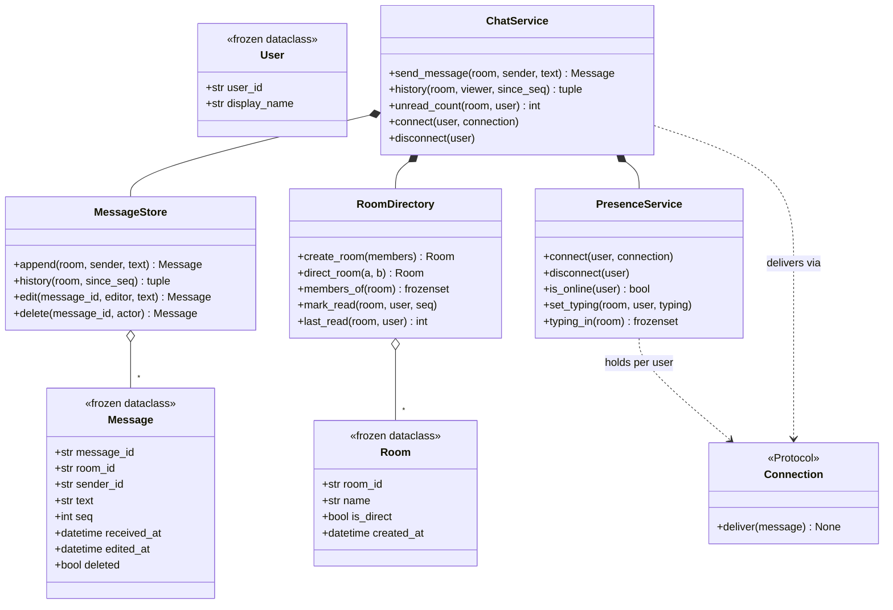

# 设计题解：聊天室（Chat Room）

## 题目与澄清

面试官通常这样开场："设计一个聊天室系统。支持一对一私聊和群聊，用户能看到历史消息，也能看到
谁在线。"

这道题看起来是"一个 `dict[room_id, list[message]]`"，实际上考的是三件事：**消息的顺序凭什么
成立**、**单聊和群聊要不要是两套代码**、以及**离线的人怎么补上错过的消息**。这三件事想清楚了，
在线状态和"正在输入"这类锦上添花的功能反而是最容易实现的部分。

动笔之前值得问清楚的几件事，每一件都会改变设计：

- **消息按什么顺序排列？** 客户端各自的系统时钟不可信——时钟漂移、时区、网络延迟都会让"客户端
  发送时间"乱序，两台手机相差几毫秒发出的消息完全可能因为网络原因反着到达服务器。答案必须是
  **服务端收到的顺序**，这句澄清直接排除了"用 `datetime.now()` 在客户端打时间戳再排序"这条路。
- **私聊和群聊是一回事吗？** 除了成员数量（恰好两人 vs 任意人数），两者在消息、历史、已读这些
  机制上没有任何区别——这句澄清决定了要不要为私聊单独建一套模型。
- **消息要不要支持编辑、删除、撤回？** 这是第 4 关最常见的追加需求，答案通常是"要，且已经
  发出去的历史要能反映最新状态"。
- **离线的人重新上线后，服务端要不要主动把错过的消息推给他？** 还是由客户端自己去问"我上次
  读到哪了，给我之后的"？这决定了要不要在服务端维护一份"待补发"队列。
- **在线状态和"正在输入"要不要持久化？** 不要——它们描述的是"此刻"，进程重启或者用户断线，
  这些状态天然作废，强行持久化反而制造了一堆需要清理的僵尸数据。

**范围之外**：跨进程的持久化与分布式一致性（本文是进程内版本，重启即丢）、真正的网络传输层
（WebSocket、心跳、重连协议本身）、消息加密、图片/文件消息、@提及与推送通知（[[patterns.observer
|观察者与事件（Observer）]]描述的推送式设计，以及[[solution-notification-service|通知服务]]
"给离线用户怎么触达"那道题，覆盖的是这一块）、群聊的管理员/权限体系。

## 需求与分级

机器编码轮不会一次把需求摊开，它一关一关加，考的是"新需求来了旧代码动不动"。

**第 1 关（约 15 分钟，核心流程）**：用户、房间、加入与离开、发消息；消息历史要有一个**稳定的
顺序**，并且要能说清楚这个顺序具体是什么、为什么不是客户端时间戳。

**第 2 关（约 12 分钟，私聊与已读）**：私聊建成恰好两个成员的房间，用同一套消息与历史机制服务
私聊和群聊；每个用户在每个房间里有一个已读游标，未读数从游标派生，不单独存一个计数字段。

**第 3 关（约 15 分钟，投递与在线状态）**：消息投递给当前在线的成员，用一个连接抽象表示"在线"
——这个抽象要能在测试里换成假实现；离线成员重新连接后要能补上错过的消息，说清楚这一步靠的是
什么机制（提示：已读游标已经在那里了）；"正在输入"和在线状态是**从不持久化**的临时状态。

**第 4 关（选做，扩展）**：消息编辑或删除，历史必须反映最新状态；判分点是这件事要不要碰第 3 关
写的投递逻辑——一个好答案是完全不用碰。收尾要求：一个用户断开连接时，"正在输入"这个容器必须
真的缩小，不能留下断线用户永远"正在输入"的幽灵状态。

## 核心对象与职责

| 类 | 单一职责 | 它拥有的不变量 |
|---|---|---|
| `User`（冻结） | 系统认识的最小用户信息 | 只读 |
| `Room`（冻结） | 一个房间的元数据；私聊只是 `is_direct=True` 的房间 | 不持有成员——成员会变，元数据不该跟着变 |
| `Message`（冻结） | 一条消息的快照，`seq` 是服务端到达顺序 | 编辑/删除只替换内容，`seq` 与 `message_id` 永不改变 |
| `Connection`（`Protocol`） | "在线"的投递端点，一个方法 | 不知道房间、不知道游标，只知道怎么把一条消息交给对方 |
| `MessageStore` | 消息的存储、顺序、编辑、删除 | 历史里消息的相对位置永不因编辑改变 |
| `RoomDirectory` | 房间与成员关系、私聊去重、已读游标 | 离开房间清空对应的游标——不再有人关心的状态 |
| `PresenceService` | 连接与"正在输入"，纯内存临时状态 | 断开连接后，这个用户在所有房间的"正在输入"标记必须清零 |
| `ChatService` | 编排入口：发消息时落库、标记已读、投递 | 不重复实现任何一个子对象已有的逻辑 |

关系上，`ChatService` **组合**（composition）了 `RoomDirectory`、`MessageStore`、`PresenceService`
三者，生命周期完全绑定。`Room` 与 `Message` 是一对多，`Message` 引用 `room_id` 而不是被 `Room`
持有——房间的元数据（名字、创建时间）和它里面的消息是两件独立管理的事，成员变化（进群、退群）
不会影响任何一条历史消息。三个子对象**互不持有对方的引用**：`ChatService.send_message` 需要
"这个房间有谁"（`RoomDirectory`）、"谁在线"（`PresenceService`）、"存一条消息"（`MessageStore`）
时，都是在编排方法里把结果传下去，而不是让某个子对象在构造时就攥住另外两个——这样每个子对象
都可以脱离另外两个单独测试。

`Connection` 是[[patterns.strategy|策略模式与可替换算法（Strategy）]]的标准形态：同一个动作
（"把这条消息交给这个在线的人"）有多种可替换的实现（真实的 WebSocket 适配器、测试里的假连接），
调用方不关心具体是哪一种。



## 关键设计决策

### 决策一：顺序是服务端到达顺序，不是客户端时间戳

这是本题最容易被随手实现错的一处——很多参考实现（包括 `system-design-primer` 的 Python 骨架）
直接给 `Message` 一个 `timestamp` 字段，隐含"按这个字段排序"。

问题很具体：两台设备的系统时钟不保证同步，网络延迟也不保证有序——用户 A 在 10:00:00.000 发出
一条消息，用户 B 的设备时钟比 A 快 5 秒、在 10:00:00.100 发出另一条，如果按客户端时间戳排，
B 的消息会显示在 A 之前，尽管服务器明明是先收到 A 的。更极端的场景：客户端离线时写的草稿在
恢复网络后才真正发送，它的"创建时间"和"到达服务器的时间"可以相差很远。

**选服务端到达顺序**：`Message` 上的排序字段是 `seq`，一个每个房间独立、在消息真正抵达服务端
那一刻由 `MessageStore.append` 单调递增分配的整数——**接口里根本没有一个"客户端时间戳"参数
可传**，这不是一条口头约定，是签名上的强制：

```python
def append(self, room_id: str, sender_id: str, text: str) -> Message:
    seq = next(self._seq_counters.setdefault(room_id, itertools.count(1)))
    message = Message(f"msg-{next(self._next_message_id)}", room_id, sender_id, text,
                     seq, self._clock())
    ...
```

代价被诚实地保留：如果两个人几乎同时发消息，`seq` 反映的是"服务器实际处理的先后"，这个顺序
可能和某个人主观感受到的"我先按的发送"不完全一致——但这正是唯一一种所有参与者都能达成一致的
顺序，主观感受本来就没有一个权威答案。`received_at` 仍然保留（供展示"几分钟前"用），但它从不
参与排序。

### 决策二：单聊是一个字段，不是一个子类，也不需要一个"聊天室系统"包装单聊和群聊

`system-design-primer` 的参考实现用继承表达这件事：`PrivateChat(Chat)` 和 `GroupChat(Chat)`
各自是独立的类。这个冲动可以理解——两者确实有一处不同（成员数量固定为二，还是可以动态增减），
但值得反问一句：**除了成员数量，这两者在消息、历史、已读、投递上有任何一行不同的逻辑吗？**
没有。继承在这里买不到任何多态好处——没有任何一处代码需要"如果是私聊就……否则……"，两者共享
的是全部行为，不同的只是一个布尔值。

**选一个 `Room`，加一个 `is_direct: bool` 字段**，用一个基于无序用户对的索引做私聊去重，
反复调用 `direct_room(a, b)` 返回同一个房间而不是不断创建新房间：

```python
def direct_room(self, a: str, b: str) -> Room:
    key = frozenset((a, b))
    room_id = self._dm_index.get(key)
    if room_id is not None:
        return self._rooms[room_id]
    ...
```

`send_message`、`history`、`mark_read` 对一个私聊房间和一个群聊房间调用的是完全相同的代码路径
——这是"一个模型服务两种场景"最直接的证明：如果需要专门为私聊写一条分支，那就说明模型没选对。

同一条判断也适用于"要不要引入一个显式的 Mediator 类"：[[abhaypaswan 的实现|lld-python]]把
"房间路由消息、成员互不持有引用"这件事包成一个具名的中介者对象。这个原则本身是对的——本设计
同样让 `RoomDirectory`、`MessageStore`、`PresenceService` 互不持有引用——但当参与协调的类只有
三个、边界已经清清楚楚时，再包一层"中介者"对象只是给 `ChatService.send_message` 这个编排方法
换了个名字，没有增加任何信息。协调逻辑写在编排方法里，比包一层只转发一次调用的中介者类更直接，
这是本题解主动拒绝模式的一处。

### 决策三：断线重连靠已读游标补发，不建一条单独的"待补发"队列

一个自然但错误的冲动：给每个离线用户维护一条"待推送"队列，上线时把队列里的消息挨个推给他，
下线时开始往队列里攒。

这个方案有两个真实的问题：队列本身是一个需要维护上限、需要清理的新容器（用户永久离线，队列
永久占着内存），而且它和历史消息是**同一份数据的两份拷贝**——推送失败或者客户端在两次上线之间
换了设备，队列和真实历史就可能对不上。

**不建这条队列**：`RoomDirectory` 已经在维护"这个用户在这个房间读到哪了"的游标（决策四），
`MessageStore.history(room_id, since_seq)` 已经能返回某个位点之后的全部消息。离线期间的消息
仍然正常追加进 `MessageStore`（只是没有一个在线连接可以推送）；用户重新上线时，客户端只需要
调用一次 `history(room_id, viewer, since_seq=上次的游标)`，欠账天然补齐——**这不是一个新写的
功能，是已经存在的两个机制的组合**。`connect()` 本身因此可以很薄，只登记一个连接，不做任何
"扫描历史、批量补发"的特殊逻辑：

```python
def connect(self, user_id: str, connection: Connection) -> None:
    self._require_user(user_id)
    self._presence.connect(user_id, connection)
```

这正是"至少一处决策，正确答案是更简单的那个、模式被拒绝"——本题拒绝的不是一个设计模式，是
一整套本可以存在、但没必要存在的补发子系统。

### 决策四：未读数是从已读游标派生的查询，不是一个单独维护的计数器

未读数最省事的实现是一个 `dict[(room, user), int]` 计数器，每来一条消息就给房间里除发送者
之外的每个成员 `+1`，标记已读时清零。它有一个真实的一致性问题：计数器和历史消息是两份独立的
状态，一旦某一次更新漏掉（比如成员在计数器更新的同时恰好离开又重新加入），两者就会永久对不上，
而且没有任何机制能自动发现这种漂移。

**选择只存一个游标**（每个用户在每个房间"读到了第几条"），未读数在被问到的时候现算：

```python
def unread_count(self, room_id: str, user_id: str) -> int:
    cursor = self._rooms.last_read(room_id, user_id)
    return sum(1 for m in self._messages.history(room_id, cursor) if m.sender_id != user_id)
```

游标是唯一的存储，未读数永远和历史消息一致，因为它就是从历史消息现算出来的，不存在"和历史对
不上"这种状态。代价是每次查询未读数要扫描游标之后的消息——在聊天室的规模下（一个房间的未读量
通常是几十到几百条）完全不是问题；真到了需要优化的规模，缓存这个数字本身仍然可以做，只是缓存
失效的判据依然是"游标变了"，游标才是唯一的真源。

顺带解决的一个边界：**自己发的消息不计入自己的未读数**。`send_message` 在落库之后立刻把发送者
自己的游标推进到这条消息的 `seq`（"我显然已经读过我自己刚发的这条"），这一步和游标机制共用同一
个 `mark_read`，不需要在未读计算里额外写一条"排除自己刚发的这条"的特判。

### 决策五：在线状态与"正在输入"是纯内存的临时状态，断开时容器必须缩回去

`PresenceService` 管理两类状态：谁在线（`_connections`）、谁在哪个房间"正在输入"（`_typing`）。
两者都**从不落盘、从不进 `MessageStore`**——它们描述的是"此刻"，不是历史的一部分，进程重启
或者用户断线，这些状态理应立刻作废，硬要持久化反而是在维护一堆随时可能过期的僵尸数据。

真正需要小心的是**收缩**：一个用户断开连接时，如果只摘掉他的 `Connection`、忘了清理他在其他
房间里留下的"正在输入"标记，这个人会在所有人眼里永远显示"正在输入"，直到进程重启——一个真实
的、经常被面试参考答案漏掉的 bug。要在断开的一瞬间知道"这个人正在哪些房间输入"，需要一个反向
索引，而不是遍历所有房间去找：

```python
def disconnect(self, user_id: str) -> None:
    self._connections.pop(user_id, None)
    for room_id in self._typing_rooms.pop(user_id, ()):
        self._typing.get(room_id, set()).discard(user_id)
```

`_typing_rooms: dict[user_id, set[room_id]]` 和 `_typing: dict[room_id, set[user_id]]` 是
同一份关系的两个方向的索引，写入时两边都要更新（`set_typing` 里两行对称的 `add`/`discard`），
换来的是断开连接这个高频路径始终是 `O(这个人正在输入的房间数)`，而不是 `O(全部房间数)`。这
道题里"必须缩回去的容器"就是它——不是消息历史（历史故意保留全部，是这个组件存在的意义），
而是这份纯粹描述"此刻"的状态。

## 代码走读

下面是经过测试的完整实现。读的时候盯住四个地方：`MessageStore.append`（`seq` 怎么在服务端
分配，决策一）、`RoomDirectory.direct_room`（私聊如何复用同一套模型，决策二）、`ChatService.
connect`（为什么这么薄，决策三）、`PresenceService.disconnect`（"正在输入"如何借助反向索引
收缩，决策五）。

`ChatService.send_message` 是整个系统里编排最密集的一个方法：落库、清除发送者自己的"正在
输入"、把发送者的游标推到这条新消息、最后才遍历在线成员做投递——四步顺序是刻意的，前三步不
依赖任何网络状态，最后一步失败（比如某个 `Connection.deliver` 抛异常）不应该影响消息已经
成功落库这个事实；当前实现假设 `Connection.deliver` 不抛异常，真实系统里这里需要一个和
[[solution-pub-sub|Pub-Sub]]投递线程同样的隔离——单个连接的异常不能拖垮其他成员的投递，
"扩展与追问"里详细说明。

%% code:begin solution.py %%
```python
"""聊天室（Chat Room）：单聊与群聊、消息投递与已读、在线状态。
设计：`MessageStore` 只管消息本身（顺序、编辑、删除），`RoomDirectory` 只管房间与成员关系
（含单聊的去重、每人每房间的已读游标），`PresenceService` 只管连接与"正在输入"这类临时状态，
`ChatService` 把三者串起来、做投递编排。单聊不是另一套模型——它是恰好两个成员的房间，用同一套
消息与历史机制。顺序以**服务端到达顺序**为准，不信任客户端时间戳。这是进程内的对象设计，不是
分布式系统——没有多机复制、没有持久化队列，全部状态留在内存里，重启即丢。
"""

from __future__ import annotations

import itertools
from collections.abc import Callable
from dataclasses import dataclass, replace
from datetime import datetime, timezone
from typing import Protocol

Clock = Callable[[], datetime]


def utc_now() -> datetime:
    """默认时钟。带时区，跨来源的消息也能比较先后。"""
    return datetime.now(timezone.utc)


class ChatError(Exception):
    """本组件所有失败的共同基类，调用方可以只捕获这一个。"""


class UnknownUserError(ChatError, KeyError):
    """引用了一个没有注册过的用户 id。"""


class UnknownRoomError(ChatError, KeyError):
    """房间 id 不存在。"""


class NotAMemberError(ChatError):
    """对一个自己不在其中的房间发消息、读历史或标记已读。"""


class NotSenderError(ChatError):
    """编辑或删除一条不是自己发的消息。"""


class MessageDeletedError(ChatError):
    """编辑一条已经被删除的消息。"""


class MessageNotFoundError(ChatError, KeyError):
    """消息 id 不存在。"""


@dataclass(frozen=True, slots=True)
class User:
    """一个用户：只有系统需要知道的最小信息。"""

    user_id: str
    display_name: str


@dataclass(frozen=True, slots=True)
class Room:
    """一个房间：单聊只是恰好两个成员、`is_direct=True` 的房间，不是另一种类型。"""

    room_id: str
    name: str | None
    is_direct: bool
    created_at: datetime


@dataclass(frozen=True, slots=True)
class Message:
    """一条消息的快照。`seq` 是它在所属房间里的**服务端到达顺序**，不是客户端时间戳——
    客户端时钟可能不准、可能跨时区、消息也可能因网络重排乱序抵达，只有服务端收到的先后
    才是所有人都能达成一致的顺序。编辑/删除通过 `dataclasses.replace` 产生新版本覆盖
    存储里的旧版本，`seq` 和 `message_id` 永远不变，因此历史里的位置不会因为编辑而挪动。
    """

    message_id: str
    room_id: str
    sender_id: str
    text: str
    seq: int
    received_at: datetime
    edited_at: datetime | None = None
    deleted: bool = False


class Connection(Protocol):
    """一个已连接成员的投递端点。真实实现是一个 WebSocket 适配器；测试用一个把消息收进
    列表的假实现——协议只有一个方法，调用方不需要知道背后是不是网络连接。"""

    def deliver(self, message: Message) -> None: ...


class MessageStore:
    """消息本身：顺序、编辑、删除。它拥有的不变量是**顺序稳定**——`seq` 一旦分配，同一条
    消息永远排在同一个位置，编辑或删除只替换内容，不重排、不删除历史条目（软删除留下墓碑）。
    """

    def __init__(self, clock: Clock = utc_now) -> None:
        self._clock = clock
        self._messages: dict[str, Message] = {}
        self._order: dict[str, list[str]] = {}
        self._seq_counters: dict[str, itertools.count] = {}
        self._next_message_id = itertools.count(1)

    def append(self, room_id: str, sender_id: str, text: str) -> Message:
        seq = next(self._seq_counters.setdefault(room_id, itertools.count(1)))
        message = Message(f"msg-{next(self._next_message_id)}", room_id, sender_id, text,
                         seq, self._clock())
        self._messages[message.message_id] = message
        self._order.setdefault(room_id, []).append(message.message_id)
        return message

    def get(self, message_id: str) -> Message:
        try:
            return self._messages[message_id]
        except KeyError:
            raise MessageNotFoundError(message_id) from None

    def history(self, room_id: str, since_seq: int = 0, limit: int | None = None) -> tuple[Message, ...]:
        """`since_seq` 之后的消息，按到达顺序。断线重连时传上次的已读游标，天然就是补发。"""
        ids = self._order.get(room_id, ())
        messages = [self._messages[mid] for mid in ids if self._messages[mid].seq > since_seq]
        return tuple(messages[:limit] if limit is not None else messages)

    def latest_seq(self, room_id: str) -> int:
        ids = self._order.get(room_id, ())
        return self._messages[ids[-1]].seq if ids else 0

    def edit(self, message_id: str, editor_id: str, new_text: str) -> Message:
        message = self.get(message_id)
        if message.sender_id != editor_id:
            raise NotSenderError(f"{editor_id} did not send {message_id}")
        if message.deleted:
            raise MessageDeletedError(f"{message_id} was deleted")
        edited = replace(message, text=new_text, edited_at=self._clock())
        self._messages[message_id] = edited
        return edited

    def delete(self, message_id: str, actor_id: str) -> Message:
        message = self.get(message_id)
        if message.sender_id != actor_id:
            raise NotSenderError(f"{actor_id} did not send {message_id}")
        deleted = replace(message, text="", deleted=True, edited_at=self._clock())
        self._messages[message_id] = deleted
        return deleted


class RoomDirectory:
    """房间与成员关系：谁在哪个房间里、单聊的去重、每人每房间的已读游标。

    未读数**不存**在这里——它是"房间里 seq 大于游标、且不是自己发的消息数"，每次问的时候
    现算，游标是唯一的存储，不会和一个单独维护的计数字段互相漂移。
    """

    def __init__(self, clock: Clock = utc_now) -> None:
        self._clock = clock
        self._rooms: dict[str, Room] = {}
        self._members: dict[str, set[str]] = {}
        self._dm_index: dict[frozenset[str], str] = {}
        self._cursors: dict[tuple[str, str], int] = {}
        self._next_room_id = itertools.count(1)

    def create_room(self, member_ids: set[str], name: str | None = None) -> Room:
        room = Room(f"room-{next(self._next_room_id)}", name, False, self._clock())
        self._rooms[room.room_id] = room
        self._members[room.room_id] = set(member_ids)
        return room

    def direct_room(self, a: str, b: str) -> Room:
        """单聊就是恰好两个成员的房间；用一对用户的无序 key 做去重，反复调用返回同一个房间。"""
        if a == b:
            raise ValueError("cannot direct-message yourself")
        key = frozenset((a, b))
        room_id = self._dm_index.get(key)
        if room_id is not None:
            return self._rooms[room_id]
        room = Room(f"room-{next(self._next_room_id)}", None, True, self._clock())
        self._rooms[room.room_id] = room
        self._members[room.room_id] = {a, b}
        self._dm_index[key] = room.room_id
        return room

    def get(self, room_id: str) -> Room:
        try:
            return self._rooms[room_id]
        except KeyError:
            raise UnknownRoomError(room_id) from None

    def add_member(self, room_id: str, user_id: str) -> None:
        self.get(room_id)
        self._members.setdefault(room_id, set()).add(user_id)

    def remove_member(self, room_id: str, user_id: str) -> None:
        """离开房间也清掉这个人在这个房间的已读游标——不是任何人还在关心的状态。"""
        self._members.get(room_id, set()).discard(user_id)
        self._cursors.pop((room_id, user_id), None)

    def members_of(self, room_id: str) -> frozenset[str]:
        """快照，不是内部集合本身——调用方不该能改写房间的成员表。"""
        return frozenset(self._members.get(room_id, ()))

    def is_member(self, room_id: str, user_id: str) -> bool:
        return user_id in self._members.get(room_id, ())

    def mark_read(self, room_id: str, user_id: str, seq: int) -> None:
        self._cursors[(room_id, user_id)] = seq

    def last_read(self, room_id: str, user_id: str) -> int:
        return self._cursors.get((room_id, user_id), 0)


class PresenceService:
    """连接与"正在输入"：进程内的临时状态，**从不落盘、从不进历史**。

    它拥有的不变量是**断开必须缩回去**：一个用户断开连接时，不仅要摘掉他的连接，还要把他
    "正在输入"的每一个房间都清干净——反向索引 `_typing_rooms` 让这一步不必扫描所有房间，
    直接查"这个人正在哪些房间输入"。忘了这一步，断线用户会在所有人眼里永远"正在输入"。
    """

    def __init__(self) -> None:
        self._connections: dict[str, Connection] = {}
        self._typing: dict[str, set[str]] = {}
        self._typing_rooms: dict[str, set[str]] = {}

    def connect(self, user_id: str, connection: Connection) -> None:
        self._connections[user_id] = connection

    def disconnect(self, user_id: str) -> None:
        self._connections.pop(user_id, None)
        for room_id in self._typing_rooms.pop(user_id, ()):
            self._typing.get(room_id, set()).discard(user_id)

    def is_online(self, user_id: str) -> bool:
        return user_id in self._connections

    def connection_of(self, user_id: str) -> Connection | None:
        return self._connections.get(user_id)

    def connected_count(self) -> int:
        return len(self._connections)

    def set_typing(self, room_id: str, user_id: str, typing: bool) -> None:
        if typing:
            self._typing.setdefault(room_id, set()).add(user_id)
            self._typing_rooms.setdefault(user_id, set()).add(room_id)
        else:
            self._typing.get(room_id, set()).discard(user_id)
            self._typing_rooms.get(user_id, set()).discard(room_id)

    def typing_in(self, room_id: str) -> frozenset[str]:
        return frozenset(self._typing.get(room_id, ()))

    def typing_room_count(self, user_id: str) -> int:
        return len(self._typing_rooms.get(user_id, ()))


class ChatService:
    """整个系统的入口：持有房间目录、消息仓库、在线状态，并编排"发消息时投递给谁"。

    `send_message` 要先落库、再顺带清掉自己的"正在输入"、标记自己已读、最后才投递给在线
    成员——这四步需要看到三个子对象才能做完，facade 因此不是纯转发：它是编排点。
    """

    def __init__(self, clock: Clock = utc_now) -> None:
        self._users: dict[str, User] = {}
        self._rooms = RoomDirectory(clock)
        self._messages = MessageStore(clock)
        self._presence = PresenceService()

    def register_user(self, user_id: str, display_name: str) -> User:
        user = User(user_id, display_name)
        self._users[user_id] = user
        return user

    def _require_user(self, user_id: str) -> None:
        if user_id not in self._users:
            raise UnknownUserError(user_id)

    def _require_member(self, room_id: str, user_id: str) -> None:
        self._rooms.get(room_id)
        if not self._rooms.is_member(room_id, user_id):
            raise NotAMemberError(f"{user_id} is not a member of {room_id}")

    def create_room(self, creator_id: str, member_ids: tuple[str, ...] = (), name: str | None = None) -> Room:
        for user_id in (creator_id, *member_ids):
            self._require_user(user_id)
        return self._rooms.create_room({creator_id, *member_ids}, name)

    def direct_room(self, a: str, b: str) -> Room:
        self._require_user(a)
        self._require_user(b)
        return self._rooms.direct_room(a, b)

    def join(self, room_id: str, user_id: str) -> None:
        self._require_user(user_id)
        self._rooms.add_member(room_id, user_id)

    def leave(self, room_id: str, user_id: str) -> None:
        self._rooms.remove_member(room_id, user_id)

    def members_of(self, room_id: str) -> frozenset[str]:
        return self._rooms.members_of(room_id)

    def send_message(self, room_id: str, sender_id: str, text: str) -> Message:
        self._require_member(room_id, sender_id)
        message = self._messages.append(room_id, sender_id, text)
        self._presence.set_typing(room_id, sender_id, False)
        self._rooms.mark_read(room_id, sender_id, message.seq)
        for member_id in self._rooms.members_of(room_id):
            if member_id == sender_id:
                continue
            connection = self._presence.connection_of(member_id)
            if connection is not None:
                connection.deliver(message)
        return message

    def edit_message(self, message_id: str, editor_id: str, new_text: str) -> Message:
        return self._messages.edit(message_id, editor_id, new_text)

    def delete_message(self, message_id: str, actor_id: str) -> Message:
        return self._messages.delete(message_id, actor_id)

    def history(self, room_id: str, viewer_id: str, since_seq: int = 0,
               limit: int | None = None) -> tuple[Message, ...]:
        self._require_member(room_id, viewer_id)
        return self._messages.history(room_id, since_seq, limit)

    def mark_read(self, room_id: str, user_id: str, seq: int | None = None) -> None:
        self._require_member(room_id, user_id)
        target = seq if seq is not None else self._messages.latest_seq(room_id)
        self._rooms.mark_read(room_id, user_id, target)

    def unread_count(self, room_id: str, user_id: str) -> int:
        cursor = self._rooms.last_read(room_id, user_id)
        return sum(1 for m in self._messages.history(room_id, cursor) if m.sender_id != user_id)

    def connect(self, user_id: str, connection: Connection) -> None:
        self._require_user(user_id)
        self._presence.connect(user_id, connection)

    def disconnect(self, user_id: str) -> None:
        self._presence.disconnect(user_id)

    def is_online(self, user_id: str) -> bool:
        return self._presence.is_online(user_id)

    def connected_count(self) -> int:
        return self._presence.connected_count()

    def set_typing(self, room_id: str, user_id: str, typing: bool) -> None:
        self._require_member(room_id, user_id)
        self._presence.set_typing(room_id, user_id, typing)

    def typing_in(self, room_id: str) -> frozenset[str]:
        return self._presence.typing_in(room_id)

    def typing_room_count(self, user_id: str) -> int:
        return self._presence.typing_room_count(user_id)


def _demo() -> None:
    class Printer:
        def deliver(self, message: Message) -> None:
            print(f"  -> delivered to a connected member: {message.text!r}")

    chat = ChatService()
    for uid in ("ada", "grace"):
        chat.register_user(uid, uid.title())
    room = chat.direct_room("ada", "grace")
    chat.connect("grace", Printer())
    chat.send_message(room.room_id, "ada", "hi grace")
    print("grace's unread:", chat.unread_count(room.room_id, "grace"))
    chat.mark_read(room.room_id, "grace")
    print("grace's unread after reading:", chat.unread_count(room.room_id, "grace"))


if __name__ == "__main__":
    _demo()
```
%% code:end %%

## 测试与自检

测试固定了四类不变量：**顺序**（历史按服务端到达顺序排列、`seq` 与客户端时钟无关，即使模拟
一个时钟严重滞后的客户端也不影响顺序）；**私聊/群聊统一**（反复调用 `direct_room` 返回同一个
房间、私聊用的是和群聊完全相同的 `send_message`/`history` 接口）；**已读与投递**（未读数从
游标派生、自己发的消息不计入未读、在线成员会被投递、离线成员通过 `history(since_seq=游标)`
补齐错过的消息、断开连接后在线人数与"正在输入"计数都会收缩）；**编辑删除**（历史反映最新内容、
只有发送者能编辑或删除、删除后的消息不能再编辑、编辑删除不产生新的投递——这条直接验证了第 4
关"不碰投递逻辑"的要求）。

两分钟内给面试官演示：三个用户建一个群，A 发一条消息，展示在线的 B 立刻收到推送而没连接的 C
什么都没收到；C 上线后调用历史接口，用自己的游标拿到那条消息；A 再发一条，编辑它，展示 B 的
投递次数没有因为编辑而增加，历史里那条消息的内容却变了；最后断开 A 的连接，展示"正在输入"
状态从所有房间里消失——这一步最容易让人追问"如果我在十个房间都设了正在输入呢"，答案就是决策
五那条反向索引。

## 扩展与追问

**新需求**：

- **消息反应（reaction）**——`MessageStore` 加一个 `dict[message_id, dict[emoji, frozenset[user_id]]]`
  的映射，`add_reaction`/`remove_reaction` 和点赞同样的幂等集合语义（参见[[solution-social-network
  |社交网络]]"决策五"），`ChatService.send_message` 的投递逻辑一行不改。
- **@提及**——在 `send_message` 里解析文本、对提及到的成员额外调一次通知触达，这一步和聊天室
  本身的投递路径分离，正是[[solution-notification-service|通知服务]]要解决的问题：一次提及
  是一次跨越多个渠道（应用内、推送、邮件）的通知请求，不是本组件的 `Connection.deliver`。
- **消息置顶/公告**——`RoomDirectory` 给每个房间加一个可选的 `pinned_message_id`，与消息历史
  和投递完全独立。

**并发与线程安全**：本题解是单线程、无锁的——两道任务简报都没有要求并发访问。如果要支持多
线程并发调用，`MessageStore` 每个房间的 `seq` 计数器和消息列表需要一把锁；细粒度的做法是
按房间分锁而不是一把全局锁，这正是[[solution-pub-sub|Pub-Sub]]"每个主题一把锁、位点归主题管"
的同一条原则——这里"位点"换成了 `seq`，"主题"换成了"房间"，锁的粒度仍然跟着"谁的不变量"走。
`ChatService.send_message` 里"落库 + 投递"这两步如果要在并发下保持"投递到的一定是落库那一刻
真实在线的成员集合"，需要把"读在线成员列表"也纳入同一段临界区，否则一个成员可能在落库和投递
之间的空档期上线又下线，造成"投递给了一个当时已经不在线的人"或者反过来的竞态——真实场景里这类
竞态通常被容忍（客户端总能靠游标补），值得诚实地说这一点而不是假装消灭了它。

**持久化与规模**：真实系统里，`MessageStore` 会是一张按房间分片的消息表，`seq` 的分配用数据库
自增列或者一个分布式序列生成器；`PresenceService` 的连接状态会挪到一个网关层（用户可能同时
在多台设备上在线，连接是一对多而不是一对一），在线状态通过心跳和一个短 TTL 维护而不是显式的
`connect`/`disconnect` 调用；投递从同步的 `for` 循环换成一条真正的消息队列，接近
[[solution-pub-sub|Pub-Sub]]描述的推模型——这道题的 `ChatService.send_message` 本质上就是一个
简化到极致、省略了持久化和网络的 Pub-Sub 发布路径。

## 常见错误

- **用客户端时间戳排序**：面试官几乎一定会追问"两台设备时钟不一致怎么办"，答不出"服务端到达
  顺序"这个词就已经暴露了没想过这个问题。
- **给私聊单独建一个类或者一套接口**：私聊和群聊除了成员数没有任何行为差异，分成两套代码只会
  制造"改了群聊的已读逻辑忘了同步私聊"这类 bug。
- **断开连接只摘连接，不清"正在输入"**：这是本题最容易被面试官当场抓到的一个遗漏——断线用户
  在所有人眼里永远"正在输入"，是一个用户能立刻感知到的产品级 bug，不是一个抽象的代码洁癖问题。
- **未读数单独维护一个计数器**：一旦计数器更新和消息追加不在同一个原子操作里，两者迟早会对不上，
  而且这类漂移几乎不会在功能测试里被发现，只会在生产环境里被用户报告"未读数不对"。
- **给离线用户维护一条单独的补发队列**：这是决策三里明确拒绝的方案，重复了已读游标已经拥有
  的能力，还多背了一个需要自己清理的容器。
- **消息删除直接从存储里 `del`**：历史里的位置就此出现一个洞，"这条消息说了什么被删了"这个
  产品语义（"此消息已删除"提示）也没法展示——应该软删除，保留位置，只清空内容。

## 45 分钟怎么分配

- **0–5 分钟，澄清**：消息顺序按什么排？私聊和群聊要不要分开建模？离线补发靠什么机制？在线
  状态要不要持久化？
- **5–10 分钟，画核心对象**：`User`/`Room`/`Message`，`MessageStore`/`RoomDirectory`/
  `PresenceService` 三个职责分开的类，口头过一遍谁拥有什么不变量，尤其是"顺序不是时间戳"这句话。
- **10–25 分钟，写第 1、2 关**：房间、加入离开、发消息、`seq` 分配、私聊复用同一套模型、
  已读游标。边写边说"未读数是查询不是存储"，为决策四埋下伏笔。
- **25–35 分钟，写第 3 关**：`Connection` 协议、投递给在线成员、断线重连的补发逻辑（主动说出
  "这靠的是已读游标，不需要新写代码"）、"正在输入"与断开时的收缩。
- **35–42 分钟，测试与第 4 关**：跑一遍关键测试，口头说明编辑删除怎么加而不碰投递路径，展示
  一条"投递次数不因编辑而增加"的用例。
- **42–45 分钟，追问**：抛出"如果一个用户同时在手机和电脑上在线呢"，主动讲连接从一对一变成
  一对多需要改哪里（`PresenceService._connections` 从 `dict[user, Connection]` 变成
  `dict[user, set[Connection]]`，其余代码不变）。**时间不够时先砍**：消息编辑删除和消息反应，
  保留"顺序""单聊建模""已读游标""在线状态收缩"这四条核心决策，那是这道题的骨架。

## 来源与延伸

- [system-design-primer — Object-Oriented Design: Online Chat](https://github.com/donnemartin/system-design-primer/tree/master/solutions/object_oriented_design/online_chat)
  ——用继承区分私聊和群聊、按时间戳排序的 Python 骨架，方法体大多是 `pass`；本题解用一个字段
  取代继承、用服务端到达顺序取代时间戳，两处都在"关键设计决策"里给出了理由。
- [lld-python — Chat Room](https://github.com/abhaypaswan/lld-python/tree/main/problems/chat-room)
  ——显式的中介者模式实现，"成员互不持有引用"的原则被本题解采纳，但没有采纳"包一个具名中介者
  类"这一步，理由见"决策二"。
- [Python `typing.Protocol`](https://docs.python.org/3/library/typing.html#typing.Protocol)
  ——`Connection` 为什么是一个 `Protocol` 而不是 `abc.ABC`：调用方只关心"有没有 `deliver`
  这个方法"，被投递的一方不需要显式继承任何基类，测试里的假连接因此可以是一个无关的普通类。
- [Python `dataclasses.replace`](https://docs.python.org/3/library/dataclasses.html#dataclasses.replace)
  ——`MessageStore.edit`/`delete` 用它从旧快照产生新快照并整体替换存储里的条目，而不是让
  `Message` 变成可变对象，权威语义在这里。
