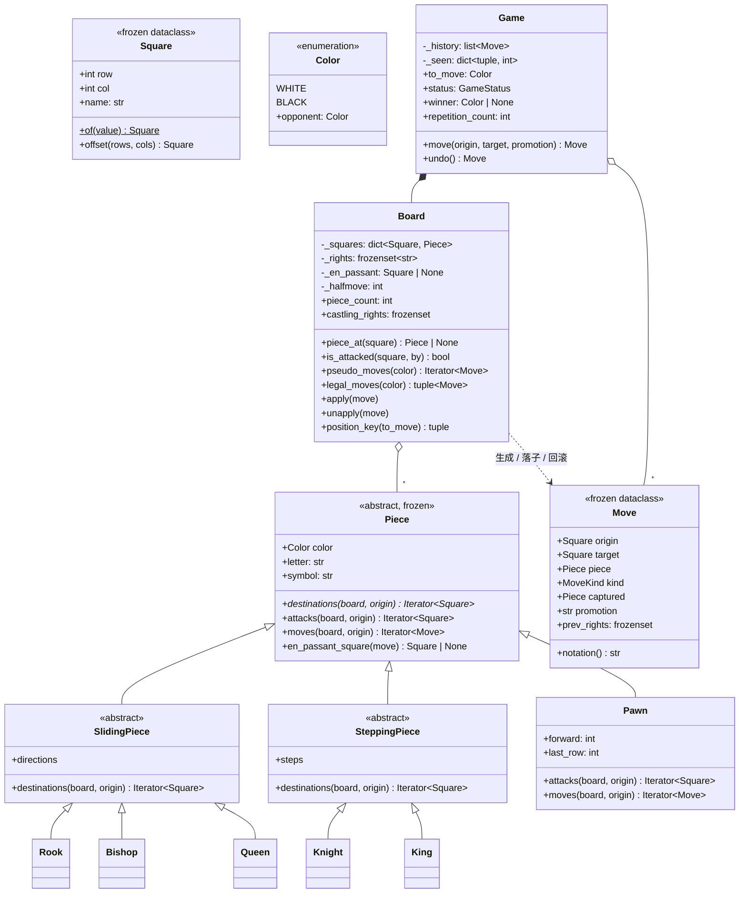

# 设计题解：国际象棋（Chess）

## 题目与澄清

面试官说："实现一个国际象棋。"——然后就不说话了。

这是低层设计题库里最狠的一道，狠不在算法，而在**它根本做不完**。一份完整的国际象棋规则
实现（六种棋子、将军、将死、逼和、王车易位、吃过路兵、升变、五十步、三次重复、子力不足），
写熟了也要两三个小时。面试给你 45 分钟。所以这道题真正考的第一件事，是**你会不会在开始
写之前先把范围谈妥**；第二件事，才是你划下的那条线里面，代码有没有被特殊规则冲垮。

值得当场问出来的澄清问题，每一个都在改变设计：

- **要做到什么程度？** 这是最重要的一问。"六个棋子走对 + 判将军"是一个规模，"再加将死、
  逼和"是另一个规模，"再加易位、吃过路兵、升变"又是一个。把这三档摆出来让面试官选，
  比自己闷头从兵开始写强得多——而且这个问句本身就在展示你知道这道题的全貌。
- **要不要下棋的 AI？** 答案几乎总是"不要"。**走法生成（move generation）和局面评估
  （evaluation）是两件事**，前者是规则，后者是引擎。说清楚这条界线，面试官通常会点头，
  这一句就替你省下一半工作量。
- **输入是"起点+终点"还是代数记号（algebraic notation）？** 如果是后者，你还得写一个
  SAN 解析器和消歧逻辑，那是额外的二十分钟。本文选前者，并把记谱做成**输出**方向的功能。
- **要不要悔棋？** 要的话，"怎么撤销一手"必须从第 1 关就想好；很多人写到第 3 关才发现
  易位权和吃过路兵目标格已经被覆盖掉、退不回来了。
- **要不要和棋规则？** 五十步、三次重复、子力不足是三件独立的事，难度递增。本文实现前两件，
  子力不足留作扩展并说明为什么它最简单也最容易写错。
- **并发吗？** 一局棋天然串行，问一句就好；真正的答案在"扩展与追问"里：锁的粒度是一局一把。

**范围之外**（并且要主动说出口）：不做搜索、不做局面评估、不做开局库和残局库——这些是
**引擎**的内容，和"把规则建模对"是正交的两件事；不做棋盘界面；不做 PGN/FEN 的解析（本文
的记谱只往外写）；子力不足和棋、五十步的"必须由一方提出"这类细则只在扩展里交代。

**怎么把这条线说给面试官听**——这是本题最该练的一段话，照着说：

> "国际象棋的完整规则写完要两三个小时，所以我想先和你约定一个顺序：我会先把棋盘、六种
> 棋子的走法、以及'走完之后自己的王不能被将'这条合法性规则做完，因为将军、将死、逼和
> 全都从它推出来；然后加易位、吃过路兵、升变这三条会冲垮简单模型的特殊规则；最后如果
> 还有时间，加悔棋和和棋计数。搜索和评估我不做——那是引擎，不是规则。如果你更想先看
> 某一段，我们现在换顺序也可以。"

这段话做了三件事：承认了规模、给出了**有依据的**优先级（"将死从合法着法为空推出来"是
真正的技术判断，不是随口排序）、把选择权交还给面试官。机考轮里，会划范围和会写代码是
分开计分的两项。

## 需求与分级

- **第 1 关（棋盘与走法，约 15 分钟）**：8×8 棋盘、六种棋子、每种棋子按自己的规则生成
  **伪合法着法**（pseudo-legal move：只管走法，不管走完自己的王会不会挨将）。这一关的评分点
  只有一个：车、象、后共用一段"沿方向一直滑"的代码，而不是三份复制，也不是一串
  `isinstance` 的类型阶梯。对应 `Piece`、`SlidingPiece`、`SteppingPiece` 和六个子类。
- **第 2 关（合法性与终局，约 10 分钟）**：一手棋合法，当且仅当走完之后**自己的王不被
  攻击**。做法是生成伪合法着法，逐个在棋盘上走一遍（make）、问一句、再精确退回来
  （unmake）。有了它，将军、将死、逼和全都是推论：将军 = 王所在格被攻击；没有合法着法时，
  在将中是将死，不在将中是逼和。对应 `Board.is_attacked`、`Board.legal_moves` 和
  `GameStatus`。
- **第 3 关（三条会冲垮模型的特殊规则，约 12 分钟）**：王车易位（castling，权利在王或车
  一动就永久失去，不能从被将中易位、不能经过被攻击的格）、吃过路兵（en passant，只在对方
  双步的**紧接着一手**有效）、升变（promotion，一个落点对应四手不同的棋）。对应
  `CASTLE_PLANS`、`RIGHT_SQUARES`、`Board.en_passant_target`、`Pawn.moves`。
- **第 4 关（历史、和棋与记谱，约 8 分钟）**：悔棋、五十步计数、三次重复，以及一个能序列化
  的 `Move`。验收标准：加记谱**不改走法生成的任何一行**。对应 `Move` 里的三个 `prev_*`
  字段、`Game._seen` 和 `Move.notation`。

## 核心对象与职责

| 类 | 职责 | 它守住的不变式 |
|---|---|---|
| `Square` | 一个格子的坐标 | 不可变；`row` 0 是第 1 横线，`col` 0 是 a 列 |
| `Color` | 黑白两方 | `opponent` 是全局唯一的"对方"定义 |
| `Piece` | 一枚棋子的**值** | 不可变，只有颜色；**不知道自己在哪一格** |
| `SlidingPiece` | 车/象/后共用的"沿方向一直滑" | 撞到自己人停，撞到对方吃掉再停 |
| `SteppingPiece` | 马/王共用的"跳固定一步" | 落点在盘内且不是自己人 |
| `Pawn` | 唯一走法与吃法不同的子 | `attacks` 只有斜前方，`destinations` 才含正前方 |
| `Move` | 一手棋的记录 + 被它覆盖的旧状态 | 不可变、纯数据；不引用棋盘，可存盘可重放 |
| `Board` | "哪一格站着谁"的唯一真源，外加三项局面状态 | `apply` 与 `unapply` 严格互逆 |
| `GameStatus` | 终局的四种收场 | 将死/逼和优先于和棋规则 |
| `Game` | 回合、历史、局面重复计数、悔棋 | 终局是**算出来**的，不是存出来的 |

关系上，`Board` **聚合**（aggregation）`Piece`：棋子是共享的不可变值，理论上全局只需要
12 个实例（黑白各六种），棋盘只是把它们摆在格子上；这和"棋盘拥有棋子的生命周期"是两回事。
`Game` **组合**（composition）`Board` 和它的走子历史——一局结束，两者都没有意义了。
`Move` 不引用 `Board`、也不引用 `Game`，只引用 `Square` 和 `Piece` 这些值，所以一段历史
可以整段序列化、发给另一个进程、在一块新棋盘上逐手重放（测试里就是这么验的）。

这里也说清楚**没有**建的类。没有 `Player`：这道题里"玩家"不持有任何状态也不做任何决策
（决策是引擎的事，已经划出范围），一个只有 `color` 字段、把 `make_move` 原样转发给
`Game.move` 的 `Player` 类是纯粹的转发层，加了它棋局并不多知道一件事。没有 `ChessGame`
入口类；没有把 `has_moved` 放在棋子上（理由见决策一）；也没有给"将军/将死"做一个状态机
（理由见决策五）。



## 关键设计决策

### 一、棋子知不知道自己在哪一格？

**问题**：`Rook` 要生成走法，就得知道从哪里出发。最自然的写法是给它一个 `(row, col)`。

**选项 A：棋子自带坐标**（几乎所有流行题解的写法）。

```python
class Piece:
    def __init__(self, color: Color, row: int, col: int) -> None:
        self.color, self.row, self.col = color, row, col
```

代价是**两份真源**：棋盘的 `squares[row][col]` 说这一格站着谁，棋子的 `self.row` 说自己
在哪，走一步要同时改两处。漏改一处，后果不是报错而是"棋盘上有一个幽灵"。更麻烦的是悔棋和
合法性过滤：每判一手合法不合法都要 make/unmake 一次，也就是每秒钟要让这两份状态同步上千次，
错一次全盘皆错。另外，坐标写进棋子还意味着每个格子上的棋子必须是**独立实例**，32 个对象，
复制棋盘就得深拷贝 32 次。

**选项 B：棋子只知道自己什么颜色，位置全由棋盘的字典说了算**。

```python
@dataclass(frozen=True)
class Piece(ABC):
    color: Color

    @abstractmethod
    def destinations(self, board: Board, origin: Square) -> Iterator[Square]: ...
```

`origin` 作为参数传进来，棋子成了**值对象**（value object）而不是实体（entity）。

**选择 B**。收益是连锁的：棋子不可变 → 全局只需要 12 个实例（`Rook(WHITE)` 每次都相等）
→ 比较局面、做局面指纹都变成廉价操作 → `apply`/`unapply` 只动一张字典，回滚天然精确。
而且它自然回答了[[oop.pillars|OOP 四大特性的实际用法]]里那条判据：**封装的目的是让不变式
只有一个守护者**。"谁在哪一格"这个事实只该有一个持有者，那就是棋盘。

顺带解决一个经典 bug：主流写法把"这个子动过没有"（易位要用）做成棋子上的 `has_moved`
布尔字段。它至少有两个坑——车被吃掉又在同一格升变出一个新车时标志会乱；悔棋时要把布尔值也
退回去，而它藏在棋子里，很容易漏。本文把易位权做成棋盘上的一个 `frozenset[str]`
（`"KQkq"` 四个字母），并且用一张"哪个格子被**离开**或**被吃**就丢哪个权利"的小表来维护：

```python
RIGHT_SQUARES = {Square(0, 4): "KQ", Square(0, 0): "Q", Square(0, 7): "K",
                 Square(7, 4): "kq", Square(7, 0): "q", Square(7, 7): "k"}
```

王从 e1 走掉丢两个，车从 h1 走掉丢 `K`，对方把车吃在 h1 上——`target` 也查这张表，同样丢
`K`。一行代码同时覆盖三种情况，而 `has_moved` 方案里"车在原地被吃"是最常被忘掉的那一种。

### 二、合法性属于棋子还是属于局面？

**问题**：马跳到 f3 合法吗？这个问题**棋子答不出来**——如果这匹马正被对方的车牵制
（pin），它一动，王就暴露了。合法性是**整个局面**的性质。

**选项 A：把它塞进每个棋子的 `can_move`**。这是流行题解的写法，每个子类的
`can_move(board, dest)` 里既判走法又判"会不会自杀"。后果是每个棋子类都要能递归地问
"如果我走了，王会不会被将"，而那又要生成对方所有棋子的走法——六个类里各复制一遍这段
逻辑，还极易写成无限递归。

**选项 B：两段式——先生成伪合法着法，再统一过滤**。

```python
def legal_moves(self, color: Color) -> tuple[Move, ...]:
    legal = []
    for move in list(self.pseudo_moves(color)):
        self.apply(move)
        if not self.is_attacked(self.king_square(color), color.opponent):
            legal.append(move)
        self.unapply(move)
    return tuple(legal)
```

**选择 B**，而且它的回报远超预期。棋子只回答"按我的走法能到哪些格"，这是纯粹的局部知识；
"走完会不会自杀"由棋盘统一处理一次。**牵制、闪将、王不能走到对方王旁边、被将时只能应将，
这四件看起来要单独写规则的事，全部自动正确了**——没有一行代码专门处理它们。测试里
`test_the_two_kings_can_never_stand_next_to_each_other` 断言的就是这一点：代码里根本
没有"两王不能相邻"这条规则，它是过滤的副产品。

将军、将死、逼和也随之坍缩成三句话：

```python
if not self.legal_moves():
    return GameStatus.CHECKMATE if self.in_check else GameStatus.STALEMATE
```

这就是这道题里最值钱的一句设计：**把一个看起来要枚举无数特例的规则系统，收敛成"生成 +
过滤"两步**。面试里能把这一步说清楚，比把六种棋子都写对更重要。

代价是性能：每一手都要 make/unmake 一次并扫一遍对方棋子。真正的引擎会做增量的攻击表、
预先算好牵制线。设计轮不需要，但要说得出"我知道慢在哪、引擎会怎么优化"。

### 三、过滤时是深拷贝一份棋盘，还是在原盘上 make/unmake？

**问题**：过滤合法着法要"试走一手"。怎么试？

**选项 A：深拷贝**。

```python
trial = copy.deepcopy(self)
trial.apply(move)
if not trial.in_check(color): ...
```

优点是绝对安全，不可能污染原盘。代价是每一手复制一次棋盘；一个局面平均 30 手，评估一次
终局就是 30 次深拷贝。而且深拷贝在 Python 里很慢。

**选项 B：make/unmake——在同一块棋盘上落子、问一句、再精确退回来**。

代价是 `unapply` 必须和 `apply` **严格互逆**，一处不对就会悄悄改坏局面，而且这种 bug
非常难查（表现是几十手之后某个子凭空出现或消失）。

**选择 B，并且用"把旧状态塞进 `Move`"来买断这个风险**：

```python
prev_en_passant: Square | None = None
prev_rights: frozenset[str] = frozenset()
prev_halfmove: int = 0
```

一手棋会覆盖掉三项棋盘状态——吃过路兵目标格、易位权、五十步计数。它们都是**推不回去**的：
从"现在没有易位权"倒推不出"走这一手之前有没有"。所以落子时就把旧值随 `Move` 一起存下来，
`unapply` 直接赋回去。这就是备忘录（Memento）：记录里既有"发生了什么"，也有"被压掉的是
什么"。

这也是[[patterns.command|命令与撤销重做（Command）]]在这道题上的正确剂量。完整的命令模式
会做一个 `MoveCommand` 对象，持有棋盘引用、带 `execute()` 和 `undo()`。本文**不**这么做，
理由和它在别处成立的理由是同一条：这里只有"走一手"这一种操作，把它做成一个带行为的对象，
换来的只是一层间接；更要命的是命令对象持有棋盘引用之后，走子历史就不再是纯数据了——存不进
JSON、发不出进程、也没法在另一块棋盘上重放。本文保留了命令模式的**数据形状**（一条自带
逆操作所需信息的记录），把"执行"和"撤销"两个动词留在 `Board.apply` / `Board.unapply` 上。
测试 `test_a_move_is_pure_data_and_can_be_replayed_on_another_board` 就是这个选择的凭证。

### 四、三条特殊规则往哪儿放，才不会把模型冲垮？

这道题真正难的不是六种棋子，是易位、吃过路兵、升变——它们每一条都打破了"一手棋 = 把一个
子从 A 挪到 B"这个朴素模型。逐条看：

**吃过路兵**打破的是"被吃的子在目标格上"。白兵走到 d6，被吃的黑兵站在 d5。所以 `Move`
必须把"被吃的子"和"被吃的格"**分开**成两个字段，绝不能用 `target` 顶替。它还是唯一带
时效的规则：只在对方双步的紧接着一手有效。这个时效用一个棋盘级的 `en_passant_target`
表达，每走一手都被覆盖成新值（通常是 `None`）——注意这正是上一条决策里"推不回去、必须
存旧值"的那一项。

**升变**打破的是"一个落点 = 一手棋"。兵到底线时，`(e7, e8)` 对应四手**不同**的棋。所以
走法生成对这一个落点要吐出四个 `Move`，而对外的 `move()` 必须**强制调用方声明**升变成
什么，声明不了就抛 `PromotionRequiredError`——默认成后是一个真实的 bug，实战里低段位选手
也会为了避免逼和而升变成马。

**易位**打破的是"一手棋只动一个子"。所以 `Move` 带一个可选的 `rook_move`。

关键判断是**这三条规则的知识该挂在谁身上**。吃过路兵和升变是**兵自己的**特性，所以它们在
`Pawn` 里：

```python
def moves(self, board: Board, origin: Square) -> Iterator[Move]:
    for target in self.destinations(board, origin):
        if target == board.en_passant_target:
            yield board.plain_move(self, origin, target, kind=MoveKind.EN_PASSANT,
                                   captured_square=Square(origin.row, target.col))
        elif target.row == self.last_row:
            for letter in PROMOTION_CLASSES:
                yield board.plain_move(self, origin, target, promotion=letter)
        else:
            yield board.plain_move(self, origin, target)
```

`Piece.moves` 的默认实现是"每个落点就是一手普通着法"，只有兵覆写它。于是 `Board` 里**一处
`isinstance` 都没有**——很多题解在这里会写
`if isinstance(piece, Pawn) and target.row in (0, 7): ...`，那正是把棋子的知识漏到棋盘里的
类型阶梯。同理，"走完这一手之后对方能不能吃过路兵"也是兵的知识，所以是
`Piece.en_passant_square(move)` 这个默认返回 `None`、只有兵覆写的钩子。

**易位反过来**：它要用易位权、还要问"王的起点、经过点、终点有没有被对方攻击"，这些都是
整个局面的知识，王自己答不了。所以易位由 `Board._castling_moves` 生成，`King` 类里一个字
都没有。判断依据很干净：**一条规则需要的信息只在棋子内部，就放棋子；需要看整个局面，就
放棋盘。**

### 五、"将军/将死"要不要做成状态机？——一个被拒绝的模式

**问题**：棋局有"进行中 / 被将 / 将死 / 逼和 / 和棋"这些状态，看起来正是状态模式
（State）或者一个 `status` 字段的用武之地。

**选项 A：显式状态字段 + 每走一手更新**。

```python
self._status = GameStatus.CHECK if board.in_check(self._to_move) else GameStatus.IN_PROGRESS
```

**选项 B：`status` 是一个只读属性，每次现算**。

**选择 B，拒绝把它做成状态**。三个理由。第一，它是**派生量**：终局完全由"当前局面 +
该谁走 + 两个计数"决定，存一份就多一条必须手工维持的不变式，而悔棋恰恰会让这条不变式
失守——存字段的写法必须在 `undo` 里把状态也退回去，可它退回的依据又只能是重新计算，等于
白存。第二，"被将"根本**不是终局状态**：它不影响能不能继续走棋，只是"王所在格被攻击"这个
布尔查询，做成状态会让 `GameStatus` 混进一个语义不同的成员。第三，状态模式的价值在于
"不同状态下同一个方法有不同行为"；这里只有"结束了就不能再走"这一条，一个 `if` 就够了。

顺序也是设计的一部分：将死和逼和**优先于**五十步与三次重复。这不是随手排的——FIDE 规则里，
被将死的一方即使同时满足五十步，结果也是输。把这个顺序写在一处（`status` 属性里）、并在
注释里点明它是规则要求，比散落在四个地方靠谱。

### 六、记谱：SAN 还是长代数？

**问题**：第 4 关要求 `Move` 能被序列化。棋界的标准是 SAN（`Nf3`、`exd5`、`O-O`）。

**选择长代数记号（long algebraic，`Ng1-f3`、`e5xd6 e.p.`）**，理由只有一条，但足够硬：
**SAN 需要局面，长代数不需要**。`Nf3` 之所以能省掉起点，是因为记谱时默认"只有一匹马能到
f3"；如果有两匹，就得写成 `Nbd2` 或 `N1d2`——要判断该不该消歧、怎么消歧，必须重新生成一遍
当前局面的全部合法着法。那样一来，第 4 关的"加记谱"就会反过来依赖第 1、2 关的走法生成，
`notation()` 也不能再是 `Move` 上的一个纯方法。

```python
def notation(self) -> str:
    if self.kind is MoveKind.CASTLE:
        return "O-O" if self.target.col == 6 else "O-O-O"
    head = "" if self.piece.letter == "P" else self.piece.letter
    text = f"{head}{self.origin.name}{'x' if self.captured else '-'}{self.target.name}"
```

`Move` 里的字段已经够拼出完整记号了，所以这个方法只读自己。**这就是"第 4 关不碰前面任何
一行"的真正含义**：不是靠运气，是靠在两种记号之间选了不需要回头看局面的那一种。真要 SAN，
把它写成一个 `san(move, board)` 的自由函数——依赖方向仍然是单向的，走法生成不知道记谱
的存在。

## 代码走读

完整的参考实现如下（`vault/domains/low-level-design/problems/chess/solution.py`，
和被测代码逐字同步）：

%% code:begin solution.py %%
```python
"""国际象棋（Chess）——走法生成、合法性过滤、特殊着法与悔棋的参考实现。

核心思路：棋子是**值**不是实体——不可变、只有颜色、不知道自己在哪，"谁在哪一格"只由 `Board`
的一张稀疏字典说了算，从根上杜绝两份真源。走法生成是多态的：车象后共用"沿方向一直走"，马王
共用"跳一步"，兵覆写 `moves()` 自己长出吃过路兵与升变，`Board` 里没有一处 `isinstance` 阶梯。
合法性不属于棋子而属于局面：先生成伪合法着法，再逐个 make/unmake，走完自己王还挨将的丢掉；
将死与逼和于是退化成同一句"没有合法着法，看王在不在将中"。易位权、吃过路兵目标格、五十步计数
放在 `Board` 上，被这一手覆盖掉的旧值随 `Move` 一起存下来，所以悔棋是精确回滚而非重新推演。
不做搜索、不做局面评估，那是引擎的事。
"""

from __future__ import annotations

from abc import ABC, abstractmethod
from collections.abc import Iterator, Mapping
from dataclasses import dataclass
from enum import Enum
from typing import ClassVar

FILES = "abcdefgh"

class ChessError(Exception):
    """本设计里所有失败路径的公共基类。"""

class IllegalMoveError(ChessError):
    """这一手不在当前局面的合法着法里。"""

class PromotionRequiredError(ChessError):
    """兵走到底线必须声明升变成什么子。"""

class GameOverError(ChessError):
    """棋局已经结束，不能再走子。"""

class NothingToUndoError(ChessError):
    """没有可悔的棋。"""

class Color(Enum):
    WHITE = "w"
    BLACK = "b"
    @property
    def opponent(self) -> Color:
        return Color.BLACK if self is Color.WHITE else Color.WHITE

@dataclass(frozen=True, slots=True, order=True)
class Square:
    """一个格子。`row` 0 是第 1 横线（白方底线），`col` 0 是 a 列。"""
    row: int
    col: int

    @property
    def name(self) -> str:
        return f"{FILES[self.col]}{self.row + 1}"

    @classmethod
    def of(cls, value: Square | str) -> Square:
        """接受 `Square` 或 `"e4"` 这样的代数记号，统一成 `Square`。"""
        return value if isinstance(value, Square) else cls(int(value[1]) - 1, FILES.index(value[0]))

    def offset(self, rows: int, cols: int) -> Square:
        return Square(self.row + rows, self.col + cols)

def on_board(square: Square) -> bool:
    return 0 <= square.row < 8 and 0 <= square.col < 8

class MoveKind(Enum):
    """普通着法之外只有两种特例，它们在落子时要做额外的动作。"""
    NORMAL = "normal"
    CASTLE = "castle"
    EN_PASSANT = "en_passant"

@dataclass(frozen=True)
class Piece(ABC):
    """一枚棋子。**不知道自己在哪一格**——位置只由棋盘的字典持有，不存第二份；不可变且只有
    颜色，所以全局其实只需要 12 个实例。"""
    color: Color
    letter: ClassVar[str] = "?"
    resets_clock: ClassVar[bool] = False    # 走这种子会不会让五十步计数归零（只有兵会）

    @property
    def symbol(self) -> str:
        """白子大写、黑子小写，用于记谱和局面指纹。"""
        return self.letter if self.color is Color.WHITE else self.letter.lower()

    @abstractmethod
    def destinations(self, board: Board, origin: Square) -> Iterator[Square]:
        """从 `origin` 出发、只按本棋子走法能到的格子（不考虑走完之后自己会不会被将）。"""

    def attacks(self, board: Board, origin: Square) -> Iterator[Square]:
        """本棋子**攻击**的格子。默认与落点相同；只有兵不一样，所以只有兵覆写它。"""
        return self.destinations(board, origin)

    def moves(self, board: Board, origin: Square) -> Iterator[Move]:
        """把落点包装成着法。默认每个落点就是一手普通着法；兵覆写它，长出吃过路兵与升变。"""
        for target in self.destinations(board, origin):
            yield board.plain_move(self, origin, target)

    def en_passant_square(self, move: Move) -> Square | None:
        """走完之后对方可以吃过路兵的目标格；只有兵的双步会给出它。"""
        return None

class SlidingPiece(Piece):
    """车、象、后：沿方向一直滑，撞到自己人停、撞到对方吃掉再停。三者唯一的差别是方向表，
    所以这段走法只写一次——这就是"多态代替类型阶梯"的本体。"""
    directions: ClassVar[tuple[tuple[int, int], ...]] = ()

    def destinations(self, board: Board, origin: Square) -> Iterator[Square]:
        for rows, cols in self.directions:
            square = origin.offset(rows, cols)
            while on_board(square):
                other = board.piece_at(square)
                if other is None:
                    yield square
                else:
                    if other.color is not self.color:
                        yield square
                    break
                square = square.offset(rows, cols)

class SteppingPiece(Piece):
    """马和王：只跳固定的一步，落点空着或站着对方的子都行。"""
    steps: ClassVar[tuple[tuple[int, int], ...]] = ()

    def destinations(self, board: Board, origin: Square) -> Iterator[Square]:
        for rows, cols in self.steps:
            square = origin.offset(rows, cols)
            if on_board(square):
                other = board.piece_at(square)
                if other is None or other.color is not self.color:
                    yield square

ORTHOGONAL = ((1, 0), (-1, 0), (0, 1), (0, -1))
DIAGONAL = ((1, 1), (1, -1), (-1, 1), (-1, -1))

@dataclass(frozen=True)
class Rook(SlidingPiece):
    letter: ClassVar[str] = "R"
    directions: ClassVar[tuple[tuple[int, int], ...]] = ORTHOGONAL

@dataclass(frozen=True)
class Bishop(SlidingPiece):
    letter: ClassVar[str] = "B"
    directions: ClassVar[tuple[tuple[int, int], ...]] = DIAGONAL

@dataclass(frozen=True)
class Queen(SlidingPiece):
    letter: ClassVar[str] = "Q"
    directions: ClassVar[tuple[tuple[int, int], ...]] = ORTHOGONAL + DIAGONAL

@dataclass(frozen=True)
class Knight(SteppingPiece):
    letter: ClassVar[str] = "N"
    steps: ClassVar[tuple[tuple[int, int], ...]] = (
        (2, 1), (2, -1), (-2, 1), (-2, -1), (1, 2), (1, -2), (-1, 2), (-1, -2))

@dataclass(frozen=True)
class King(SteppingPiece):
    """王只负责"走一步"。易位不在这里——它要用易位权和"不能经过被攻击的格"，那是局面的知识。"""
    letter: ClassVar[str] = "K"
    steps: ClassVar[tuple[tuple[int, int], ...]] = ORTHOGONAL + DIAGONAL

@dataclass(frozen=True)
class Pawn(Piece):
    """兵是唯一"走法和吃法不同"的子，所以它同时覆写 `attacks` 和 `moves`。"""
    letter: ClassVar[str] = "P"
    resets_clock: ClassVar[bool] = True

    @property
    def forward(self) -> int:
        return 1 if self.color is Color.WHITE else -1

    @property
    def last_row(self) -> int:
        return 7 if self.color is Color.WHITE else 0

    def destinations(self, board: Board, origin: Square) -> Iterator[Square]:
        one = origin.offset(self.forward, 0)
        if on_board(one) and board.piece_at(one) is None:
            yield one
            two = origin.offset(2 * self.forward, 0)
            if origin.row == (1 if self.color is Color.WHITE else 6) and board.piece_at(two) is None:
                yield two
        for square in self.attacks(board, origin):
            # 吃过路兵要吃的子不在目标格上，而在自己同一横线的那一格；把它一并当成"这手吃的子"
            # 参与下面的敌我判断，顺带挡掉"过路格是自己人双步留下的"这种假过路兵。
            other = board.piece_at(square) or (
                board.piece_at(Square(origin.row, square.col))
                if square == board.en_passant_target else None)
            if other is not None and other.color is not self.color:
                yield square

    def attacks(self, board: Board, origin: Square) -> Iterator[Square]:
        """斜前方两格——**不管有没有子**。正前方虽然能走，却从不攻击，判"王是否被将"靠的是这个。"""
        for cols in (-1, 1):
            square = origin.offset(self.forward, cols)
            if on_board(square):
                yield square

    def moves(self, board: Board, origin: Square) -> Iterator[Move]:
        for target in self.destinations(board, origin):
            if target == board.en_passant_target:
                yield board.plain_move(self, origin, target, kind=MoveKind.EN_PASSANT,
                                       captured_square=Square(origin.row, target.col))
            elif target.row == self.last_row:
                for letter in PROMOTION_CLASSES:
                    yield board.plain_move(self, origin, target, promotion=letter)
            else:
                yield board.plain_move(self, origin, target)

    def en_passant_square(self, move: Move) -> Square | None:
        if abs(move.target.row - move.origin.row) == 2:
            return Square((move.origin.row + move.target.row) // 2, move.origin.col)
        return None

PROMOTION_CLASSES: Mapping[str, type[Piece]] = {"Q": Queen, "R": Rook, "B": Bishop, "N": Knight}
@dataclass(frozen=True, slots=True)
class Move:
    """一手棋的完整记录：纯数据，不引用棋盘，可以存盘、传给别的进程、在别的盘上重放。后三个
    字段是被这一手**覆盖掉的旧棋盘状态**（备忘录 Memento），有了它们悔棋才是精确回滚。"""
    origin: Square
    target: Square
    piece: Piece
    kind: MoveKind = MoveKind.NORMAL
    captured: Piece | None = None
    captured_square: Square | None = None
    promotion: str | None = None
    rook_move: tuple[Square, Square] | None = None
    prev_en_passant: Square | None = None
    prev_rights: frozenset[str] = frozenset()
    prev_halfmove: int = 0

    def notation(self) -> str:
        """长代数记谱：`Ng1-f3`、`e5xd6 e.p.`、`e7-e8=Q`、`O-O`。不用 SAN（`Nf3`）是因为它要靠
        "还有没有别的马也能到 f3"消歧，那要回头重新生成一遍合法着法，记谱就依赖了走法生成。"""
        if self.kind is MoveKind.CASTLE:
            return "O-O" if self.target.col == 6 else "O-O-O"
        head = "" if self.piece.letter == "P" else self.piece.letter
        text = f"{head}{self.origin.name}{'x' if self.captured else '-'}{self.target.name}"
        if self.promotion:
            text += f"={self.promotion}"
        return text + (" e.p." if self.kind is MoveKind.EN_PASSANT else "")

def _castle_plan(row: int, king_side: bool) -> tuple[Square, Square, Square, Square,
                                                     tuple[Square, ...], tuple[Square, ...]]:
    """(王起点, 王终点, 车起点, 车终点, 必须空着的格, 不能被攻击的格)。"""
    king = Square(row, 4)
    if king_side:
        return (king, Square(row, 6), Square(row, 7), Square(row, 5),
                (Square(row, 5), Square(row, 6)), (king, Square(row, 5), Square(row, 6)))
    return (king, Square(row, 2), Square(row, 0), Square(row, 3),
            (Square(row, 1), Square(row, 2), Square(row, 3)), (king, Square(row, 3), Square(row, 2)))

CASTLE_PLANS = {"K": _castle_plan(0, True), "Q": _castle_plan(0, False),
                "k": _castle_plan(7, True), "q": _castle_plan(7, False)}
# 一旦这些格子被"离开"或"被吃"，对应的易位权就没了：王动丢两个，车动或车被吃丢一个。
RIGHT_SQUARES = {Square(0, 4): "KQ", Square(0, 0): "Q", Square(0, 7): "K",
                 Square(7, 4): "kq", Square(7, 0): "q", Square(7, 7): "k"}
BACK_RANK: tuple[type[Piece], ...] = (Rook, Knight, Bishop, Queen, King, Bishop, Knight, Rook)

class Board:
    """棋盘：唯一知道"哪一格站着谁"的地方，外加易位权、吃过路兵目标格、五十步计数。它守的
    不变式是 `apply` 与 `unapply` 严格互逆；它不知道轮到谁走、也不保存历史，那是 `Game` 的事。"""

    def __init__(self, squares: Mapping[Square | str, Piece], rights: str = "",
                 en_passant: Square | str | None = None, halfmove: int = 0) -> None:
        self._squares: dict[Square, Piece] = {Square.of(k): v for k, v in squares.items()}
        self._rights = frozenset(rights)
        self._en_passant = None if en_passant is None else Square.of(en_passant)
        self._halfmove = halfmove

    @classmethod
    def initial(cls) -> Board:
        """标准开局摆法。"""
        squares: dict[Square | str, Piece] = {}
        for col, kind in enumerate(BACK_RANK):
            squares[Square(0, col)] = kind(Color.WHITE)
            squares[Square(7, col)] = kind(Color.BLACK)
            squares[Square(1, col)] = Pawn(Color.WHITE)
            squares[Square(6, col)] = Pawn(Color.BLACK)
        return cls(squares, rights="KQkq")

    @property
    def castling_rights(self) -> frozenset[str]:
        """还剩哪些易位权；`frozenset` 本身不可变，交出去也改不动棋盘。"""
        return self._rights

    @property
    def en_passant_target(self) -> Square | None:
        return self._en_passant

    @property
    def halfmove_clock(self) -> int:
        """距离上一次吃子或动兵过了多少个半回合；到 100 就够五十步和棋了。"""
        return self._halfmove

    @property
    def piece_count(self) -> int:
        """盘上还有多少子——被吃的子必须真的从字典里消失，悔棋时必须一个不少地回来。"""
        return len(self._squares)

    def piece_at(self, square: Square) -> Piece | None:
        return self._squares.get(square)

    def occupied(self) -> tuple[tuple[Square, Piece], ...]:
        """盘面快照，按格子排序；返回元组，外部改不动棋盘。"""
        return tuple(sorted(self._squares.items()))

    def king_square(self, color: Color) -> Square:
        for square, piece in self._squares.items():
            if piece.color is color and piece.letter == "K":
                return square
        raise LookupError(f"{color.value} 方没有王")

    def is_attacked(self, square: Square, by: Color) -> bool:
        """`by` 方有没有任何一个子攻击到这一格。判将、判易位能不能走，都只用这一个问句。"""
        return any(square in piece.attacks(self, origin)
                   for origin, piece in self._squares.items() if piece.color is by)

    def in_check(self, color: Color) -> bool:
        return self.is_attacked(self.king_square(color), color.opponent)

    def plain_move(self, piece: Piece, origin: Square, target: Square, *,
                   kind: MoveKind = MoveKind.NORMAL, captured_square: Square | None = None,
                   promotion: str | None = None, rook_move: "tuple[Square, Square] | None" = None) -> Move:
        """把一个落点补全成 `Move`：查出被吃的子，并把当前会被覆盖的棋盘状态一并存进去。"""
        victim_square = target if captured_square is None else captured_square
        captured = self._squares.get(victim_square)
        return Move(origin, target, piece, kind, captured,
                    victim_square if captured is not None else None, promotion, rook_move,
                    self._en_passant, self._rights, self._halfmove)

    def _castling_moves(self, color: Color) -> Iterator[Move]:
        """易位：权利还在、中间空着、且王的起点/经过点/终点都不被攻击。"""
        for letter in ("KQ" if color is Color.WHITE else "kq"):
            if letter not in self._rights:
                continue
            king_from, king_to, rook_from, rook_to, empty, safe = CASTLE_PLANS[letter]
            king = self._squares.get(king_from)
            if king is None or any(self._squares.get(s) is not None for s in empty):
                continue
            if any(self.is_attacked(s, color.opponent) for s in safe):
                continue
            yield self.plain_move(king, king_from, king_to, kind=MoveKind.CASTLE,
                                  rook_move=(rook_from, rook_to))

    def pseudo_moves(self, color: Color) -> Iterator[Move]:
        """伪合法着法：按棋子走法能走的一切，**不管走完自己的王会不会挨将**。"""
        for origin, piece in list(self._squares.items()):
            if piece.color is color:
                yield from piece.moves(self, origin)
        yield from self._castling_moves(color)

    def legal_moves(self, color: Color) -> tuple[Move, ...]:
        """合法着法 = 伪合法着法里走完之后自己的王没有挨将的那些。做法是 make/unmake：在同一块
        棋盘上落子、问一句、再精确回滚，比每次深拷贝棋盘便宜，代价是回滚必须和落子严格互逆。"""
        legal = []
        for move in list(self.pseudo_moves(color)):
            self.apply(move)
            if not self.is_attacked(self.king_square(color), color.opponent):
                legal.append(move)
            self.unapply(move)
        return tuple(legal)

    def apply(self, move: Move) -> None:
        if move.captured_square is not None:
            del self._squares[move.captured_square]
        del self._squares[move.origin]
        self._squares[move.target] = (PROMOTION_CLASSES[move.promotion](move.piece.color)
                                      if move.promotion else move.piece)
        if move.rook_move is not None:
            rook_from, rook_to = move.rook_move
            self._squares[rook_to] = self._squares.pop(rook_from)
        self._en_passant = move.piece.en_passant_square(move)
        self._rights = self._rights - set(RIGHT_SQUARES.get(move.origin, "")) \
            - set(RIGHT_SQUARES.get(move.target, ""))
        self._halfmove = 0 if (move.captured is not None or move.piece.resets_clock) else self._halfmove + 1

    def unapply(self, move: Move) -> None:
        """`apply` 的精确逆操作，包括被吃的子、车的位置和三项棋盘状态。"""
        if move.rook_move is not None:
            rook_from, rook_to = move.rook_move
            self._squares[rook_from] = self._squares.pop(rook_to)
        del self._squares[move.target]
        self._squares[move.origin] = move.piece
        if move.captured is not None and move.captured_square is not None:
            self._squares[move.captured_square] = move.captured
        self._en_passant, self._rights, self._halfmove = (
            move.prev_en_passant, move.prev_rights, move.prev_halfmove)

    def position_key(self, to_move: Color) -> tuple[object, ...]:
        """局面指纹：子力摆放 + 该谁走 + 易位权 + 吃过路兵目标格。三次重复就是靠它数出来的。"""
        return (tuple((s.row, s.col, p.symbol) for s, p in self.occupied()),
                to_move, tuple(sorted(self._rights)), self._en_passant)

    def rows(self) -> tuple[str, ...]:
        """从第 8 横线到第 1 横线的字符画，空格用 `.`；给人看，不参与任何判断。"""
        return tuple("".join(p.symbol if (p := self.piece_at(Square(r, c))) else "."
                             for c in range(8)) for r in range(7, -1, -1))

class GameStatus(Enum):
    """终局的四种收场；将死与逼和的区别只有一句"没有合法着法时王在不在将中"。"""
    IN_PROGRESS = "in_progress"
    CHECKMATE = "checkmate"
    STALEMATE = "stalemate"
    DRAW_FIFTY_MOVE = "draw_fifty_move"
    DRAW_REPETITION = "draw_repetition"

class Game:
    """一局棋：谁该走、走过哪些手、局面重复了几次，以及悔棋。它不复制任何棋盘知识：
    合法着法问 `Board`，终局只是对"合法着法为空"和两个计数的解释。"""

    def __init__(self, board: Board | None = None, to_move: Color = Color.WHITE) -> None:
        self._board = board if board is not None else Board.initial()
        self._to_move = to_move
        self._history: list[Move] = []
        self._seen: dict[tuple[object, ...], int] = {self._board.position_key(to_move): 1}

    @property
    def board(self) -> Board:
        return self._board

    @property
    def to_move(self) -> Color:
        return self._to_move

    @property
    def history(self) -> tuple[Move, ...]:
        return tuple(self._history)

    @property
    def in_check(self) -> bool:
        return self._board.in_check(self._to_move)

    @property
    def repetition_count(self) -> int:
        """当前局面在本局里出现过几次。"""
        return self._seen.get(self._board.position_key(self._to_move), 0)

    @property
    def distinct_positions(self) -> int:
        """局面计数表里有多少条目——悔棋必须让它缩回去，否则一局长棋会无限吃内存。"""
        return len(self._seen)

    def legal_moves(self) -> tuple[Move, ...]:
        return self._board.legal_moves(self._to_move)

    @property
    def status(self) -> GameStatus:
        """终局判定的全部逻辑。将死/逼和优先于和棋规则，和 FIDE 规则一致。"""
        if not self.legal_moves():
            return GameStatus.CHECKMATE if self.in_check else GameStatus.STALEMATE
        if self._board.halfmove_clock >= 100:
            return GameStatus.DRAW_FIFTY_MOVE
        if self.repetition_count >= 3:
            return GameStatus.DRAW_REPETITION
        return GameStatus.IN_PROGRESS

    @property
    def winner(self) -> Color | None:
        return self._to_move.opponent if self.status is GameStatus.CHECKMATE else None

    def move(self, origin: Square | str, target: Square | str, promotion: str | None = None) -> Move:
        """走一手。升变必须显式声明成什么子，否则抛 `PromotionRequiredError`。"""
        if self.status is not GameStatus.IN_PROGRESS:
            raise GameOverError(f"棋局已经结束（{self.status.value}）")
        start, end = Square.of(origin), Square.of(target)
        matches = [m for m in self.legal_moves() if m.origin == start and m.target == end]
        if not matches:
            raise IllegalMoveError(f"{start.name}{end.name} 不是当前局面的合法着法")
        if promotion is None and matches[0].promotion is not None:
            raise PromotionRequiredError(f"{start.name}{end.name} 是升变，请指定 Q/R/B/N")
        chosen = next((m for m in matches if m.promotion == promotion), None)
        if chosen is None:
            raise IllegalMoveError(f"{start.name}{end.name} 不能升变成 {promotion}")
        self._board.apply(chosen)
        self._history.append(chosen)
        self._to_move = self._to_move.opponent
        key = self._board.position_key(self._to_move)
        self._seen[key] = self._seen.get(key, 0) + 1
        return chosen

    def undo(self) -> Move:
        """悔一手：局面计数先减（减到 0 就删键），再让棋盘精确回滚。"""
        if not self._history:
            raise NothingToUndoError("还没有走过任何一手")
        key = self._board.position_key(self._to_move)
        if remaining := self._seen[key] - 1:
            self._seen[key] = remaining
        else:
            del self._seen[key]
        move = self._history.pop()
        self._board.unapply(move)
        self._to_move = self._to_move.opponent
        return move

if __name__ == "__main__":
    game = Game()
    for origin, target in (("f2", "f3"), ("e7", "e5"), ("g2", "g4"), ("d8", "h4")):
        game.move(origin, target)
    print(*game.board.rows(), sep="\n")
    print(game.status.value, game.winner, " ".join(m.notation() for m in game.history))
```
%% code:end %%

五处值得对着代码再看一眼：

**一、`SlidingPiece.destinations` 是整份代码里复用率最高的十行。** 车、象、后的差别被压缩
成一个 `directions` 类变量，`Queen` 甚至就是 `ORTHOGONAL + DIAGONAL`——测试
`test_queen_is_exactly_rook_plus_bishop` 直接把这件事断言成了"后的落点集合 = 车的 ∪ 象的"。
那个 `while` 循环里的三岔（空格继续、敌子吃掉后停、己子直接停）就是滑行棋子的全部规则。

**二、`Pawn.destinations` 里那个 `or` 是一句话的防线。** 斜前方那一格上如果没有子，它仍然
可能是吃过路兵的目标格；这时"这一手吃的子"要到**自己同一横线**的那一格去取。把两种情况取到
同一个 `other` 上，再统一做一次敌我判断，顺带挡掉一个很隐蔽的假着法：如果轮错了边
（比如白方刚双步留下一个过路格，却又去问白方的合法着法），一个白兵会"吃"到那个空的过路格上，
凭空多出一手斜走的幽灵棋。统一判敌我之后，那一格的"受害者"是自己人，着法自然不会被生成。

**三、`Piece.attacks` 存在的唯一理由是兵。** 对其它所有棋子，"能走到的格"和"攻击的格"是
同一个集合，所以默认实现直接转发给 `destinations`。兵不是：它**正前方能走却不攻击**、
**斜前方空着也攻击**。判"王有没有被将"用的是 `attacks` 而不是 `destinations`，否则一个
兵正前方的王会被误判成被将，而斜前方空格的控制又会被漏掉。一个方法的存在能被一句话解释
清楚（"只有兵不一样"），它就配留下。

**四、`Board.is_attacked` 是整个设计的枢纽。** 判将、判将死、判易位能不能走——三件事都
只调用这一个问句：

```python
return any(square in piece.attacks(self, origin)
           for origin, piece in self._squares.items() if piece.color is by)
```

易位那段代码因此短得出奇：权利还在、中间几格空着、王的起点/经过点/终点都不被攻击，三条
判断就是全部。"不能从被将中易位"和"不能易位到被将"根本不需要单独写——`safe` 元组里包含了
王的起点，而终点的安全性由同一段检查覆盖。

**五、`Game.undo` 里先减计数再回滚棋盘。** 顺序不能反：局面计数的键是"回滚**之前**的
局面"，棋盘一旦退回去就算不出那个键了。减到 0 时 `del self._seen[key]`——这张表随棋局长度
增长，不删键的话一局两百手就是两百个死条目，`distinct_positions` 这个只读属性就是为了让
"悔到开局，表必须缩回原样"能在测试里被断言。

## 测试与自检

套件有 33 个用例。这道题的测试有一个别的题没有的奢侈品：**棋界有公认的标准答案**。

- **perft（performance test）是走法生成的金标准**。从开局数"深度 N 的叶子局面个数"，
  正确答案是全世界都认同的：1 层 20、2 层 400、3 层 8902。套件里还跑了棋界常用的
  "Kiwipete" 局面（两边都能双向易位、满盘牵制与吃子），1 层 48、2 层 2039。这两条测试
  一旦通过，走法生成、合法性过滤、易位、吃过路兵、`apply`/`unapply` 是否严格互逆——全部
  一次性被验到。**没有比这更划算的测试了**，面试里提一句"我会用 perft 自检"也是加分项。
- **特殊规则各有一条针对性的测试**，因为 perft 只告诉你"数目对不对"，不告诉你哪里错。
  易位有四条（动了王车两边的权利、车被吃在原地也丢权利、从被将中/经过被攻击格/易位到被将
  三种拒绝、中间有子的拒绝）；吃过路兵有两条（只在紧接着的一手有效、被吃的子在另一个格子上）；
  升变有一条（必须声明、能升变成马、不能升变成王）。
- **悔棋验的是"全部状态"而不是"棋盘"**。`test_undo_restores_the_board_and_every_piece_of_position_state`
  把盘面、易位权、吃过路兵目标格、五十步计数、该谁走五样一起快照，走四手再全部悔掉，断言
  五样都一模一样。分开断言棋盘和"某一个字段"是抓不住这类 bug 的。
- **一条反向测试**：`test_a_position_repeated_with_different_castling_rights_is_not_a_repetition`
  ——子力摆放一样但易位权变了，就不是同一个局面。三次重复的判定里，这是最常被写错的一点
  （只比对子力摆放）。
- **测试只碰公开 API**。局面用 `Board({"e1": King(WHITE), ...})` 这样的字面量摆出来，
  读盘面用 `rows()`，读状态用 `piece_count` / `castling_rights` / `distinct_positions`
  这些只读属性——没有一条断言伸进 `_squares`。填空的人完全可以用 `list[list]` 或者位棋盘
  （bitboard）来实现，测试照样成立。

**两分钟怎么给面试官演示**：跑 `python solution.py`，它下出愚人杀（fool's mate）并打印
盘面、`checkmate`、以及 `f2-f3 e7-e5 g2-g4 Qd8-h4` 的记谱；然后当场跑一条 perft 断言，
说"走法生成我是用这个自检的"。这两下比逐个讲类更有说服力。

## 扩展与追问

**新需求**

- **子力不足判和**（王对王、王象对王、王马对王、同色格异色象）：只读一遍
  `board.occupied()` 就能判断，是 `Game.status` 里新增的一个分支，不碰任何走法生成。
  它简单但易错——"双马对王"在规则上不是自动和棋（理论上可以将死），写成和棋是常见 bug。
- **认输与协议和棋**：这两件事和局面无关，是**外部事件**。加法是给 `Game` 一个
  `resign(color)`，并把 `GameStatus` 扩两个成员。注意这会让"终局是纯派生量"这条性质出现
  第一个例外——此时该老实地存一个"已经被外部终止"的字段，并在 `status` 里最先检查它。
- **Chess960（费舍尔随机制）**：王和车的起始位置随机。走法生成完全不变；要改的只有
  `Board.initial` 和 `CASTLE_PLANS` / `RIGHT_SQUARES` 这两张表——易位的终点在 960 里仍然是
  c/g 列，但起点不同。**易位被做成一张表而不是一串写死的判断，回报就在这里。**
- **仙灵棋子**（比如"将军"这种走日不能过河的子）：新写一个 `Piece` 子类，其它地方一行不改。
  这是第 1 关那个多态设计唯一的验收标准。
- **SAN 解析与 PGN 导出**：写成 `Game` 之外的自由函数（`san(move, board)` /
  `parse_san(text, game)`），依赖方向单向，走法生成不知道它们存在。

**并发与线程安全**

一局棋是严格串行的，所以锁的粒度是**一局一把**：`Game` 持有一个 `threading.Lock`，
`move`/`undo` 各自在锁里完成。这里的 check-then-act 序列很长（算合法着法 → 匹配 → 落子 →
更新历史和计数），中间被打断会让两手棋都认为自己合法。GIL 帮不上忙：它保证的是单条字节码
的原子性，而这里要保护的是跨越几十次属性读写的复合操作。要特别警惕的是
`Board.legal_moves` **会临时修改棋盘**（make/unmake），所以它绝不是一个可以并发调用的
只读方法——多线程同时问同一局的合法着法就会互相踩。真要做"多个客户端同时看棋盘"，正确
做法是让读路径走一份不可变快照（`occupied()` 返回的就是），而不是给 `Board` 加读写锁。

**持久化与规模**

- **存档**：存 `(起始局面, 走子历史)` 两样即可，`Move` 是纯数据；复盘就是在新棋盘上逐手
  `apply`。不要存棋盘的派生状态（易位权、吃过路兵格），重放会把它们算出来。
- **一台服务器几万局**：每局的状态只有几 KB，瓶颈在连接数不在模型。真正要小心的是
  `Game._seen` 这张局面计数表——它随棋局长度增长，本文靠"计数减到 0 就删键"把它控制在
  "不同局面数"这个量级，而不是"走过的手数"。
- **性能**：`legal_moves` 每次重算、`king_square` 每次扫一遍字典、`status` 会连算两遍
  合法着法。对一个设计轮完全够用（perft 3 层 8902 个局面跑完不到一秒）。引擎的做法是
  增量维护攻击表、用位棋盘（bitboard）把"某个子攻击哪些格"变成几条位运算、并缓存王的位置。
  **知道该怎么优化、并且知道现在不该优化**，是这道题想听到的回答。

## 常见错误

1. **把坐标存进棋子**。两份真源，每一次 make/unmake 都要同步，是这道题最深的一个坑。
2. **在棋子的 `can_move` 里判"会不会自杀"**。合法性是局面的性质，棋子答不了；硬塞进去
   要么写成六份重复，要么无限递归。正确做法是伪合法生成 + 统一过滤。
3. **忘了"牵制"是自动的**。很多人专门写一段找牵制线的代码——有了统一过滤，牵制、闪将、
   两王不能相邻、被将时只能应将，全都不需要任何专门代码。写了反而是重复。
4. **把将死判成"王被将且王无路可走"**。漏掉了"别的子可以挡、可以吃掉将军的子"。正确
   定义只有一句：**没有任何合法着法**，在将中是将死，不在是逼和。
5. **用棋子上的 `has_moved` 管易位权**。"车在原地被对方吃掉"这一种最常被忘；悔棋时这个
   布尔值也要退回去。改用棋盘上的权利集合加一张"离开/被吃就丢权"的格子表。
6. **吃过路兵用 `target` 当被吃的格**。被吃的兵不在目标格上，这会让一个兵凭空留在盘上。
7. **吃过路兵忘了时效**。只有在对方双步的**紧接着一手**有效；目标格必须每走一手就被覆盖
   成新值（通常是 `None`）。
8. **升变默认升后**。一个落点对应四手棋，调用方必须声明；默认升后在规则上是错的。
9. **`unapply` 没退回易位权、吃过路兵格、五十步计数**。这三项都推不回去，必须在落子时
   随 `Move` 存旧值。这类 bug 的表现是"几十手之后棋盘忽然不对了"，极难定位。
10. **三次重复只比对子力摆放**。同一个摆法，如果该走的一方不同、或易位权不同、或吃过路兵
    目标格不同，就不是同一个局面。
11. **局面计数表不删空条目**、**认为 `legal_moves` 是只读的**（它会临时改棋盘）、
    **给每种棋子写一个 `Player` 或者一个只有 `main` 的 `ChessGame` 类**——三种不同层面的
    "多余"，但都会被看见。
12. **用一串 `if isinstance(piece, Rook): ... elif isinstance(piece, Bishop): ...`**。
    这是这道题最典型的 Java 味（原版常写成 `switch (piece.getType())`）。棋子的走法属于
    棋子自己；棋盘只该问"你能去哪"。

## 45 分钟怎么分配

这道题 45 分钟**做不完**，所以时间表的第一条就是把这件事谈开。

- **0–5 分钟，划范围**。把"题目与澄清"里那段话说出来：三档规模、不做引擎、请面试官选
  顺序。在白板上写下四关的标题，并当场说明"将死是从合法着法为空推出来的"——这一句是你
  之后所有取舍的依据。
- **5–10 分钟，实体与职责**。写出 `Square`、`Color`、`Piece`、`Board`、`Move`、`Game`
  的签名。**说出口的一句**："棋子不知道自己在哪一格，位置只有棋盘的字典知道——否则每次
  试走都要同步两份状态。"
- **10–22 分钟，第 1 关：走法生成**。先写 `SlidingPiece`，再用它派生车象后（三行一个），
  然后 `SteppingPiece` 派生马王，最后写兵。**说出口的一句**："车象后只有方向表不同，
  所以走法只写一次。"
- **22–32 分钟，第 2 关：合法性与终局**。`is_attacked` → `legal_moves` 的 make/unmake →
  `status` 的三句话。**说出口的一句**："牵制和闪将我没有单独写规则，它们是过滤的副产品。"
  写完这一关，就已经是一个能判将死的完整棋了。
- **32–42 分钟，第 3 关：三条特殊规则**。优先级我建议按"会不会冲垮模型"排：**吃过路兵
  第一**（它逼你把"被吃的子"和"被吃的格"分开，这个字段一开始不分开，后面改起来很疼），
  **升变第二**（一个落点四手棋），**易位第三**（最费代码，但改动最局部）。时间不够就明确
  说"易位我用一张表描述，实现就是照表检查三件事"，把表写出来也算数。
- **42–45 分钟，收尾**。说出第 4 关（悔棋、和棋计数、记谱）的做法而不必写完：
  "`Move` 里存被覆盖的旧状态，悔棋就是精确回滚；记谱我用长代数，因为 SAN 消歧要回头看
  局面。"再加一句"我会用 perft 自检"。

**时间不够时砍什么**：砍三次重复和五十步（口头说清楚）、砍记谱、砍悔棋的实现（但要说出
`Move` 里为什么有那三个 `prev_*` 字段）、砍升变的四种选择（先只做升后，但要说明这是
简化）。**绝对不能砍**的是：棋子多态的那一层、`is_attacked` 这个枢纽、以及"伪合法 +
过滤"两段式——它们是这道题的骨架，砍掉之后写得再多也只是一堆走法表。

## 来源与延伸

- <https://github.com/abhaypaswan/lld-python/tree/main/problems/chess> —— 少见的纯 Python
  版本，而且开篇就点破了这道题的要害："易位、吃过路兵、升变和牵制看起来像是后补的特例，
  其实是设计必须绕着它们成形的东西"。它的结构与本文最接近（`_SlidingPiece` / `_SteppingPiece`
  的分层、`Move` 里带撤销所需的旧状态）。两点不同：它把 `has_moved` 留在棋子上，本文改成
  棋盘上的易位权集合加一张"离开或被吃就丢权"的格子表（这样"车在原地被吃"不会漏）；它不跟踪
  三次重复，本文用局面指纹实现了，并且保证那张计数表会随悔棋收缩。
- <https://github.com/ashishps1/awesome-low-level-design/blob/main/problems/chess-game.md>
  —— 流传最广的版本，六种语言并排，知道它长什么样才知道面试官心里的参照系。它的
  `Piece` 抽象类自带 `color, row, col`，`can_move(board, destRow, destCol)` 只返回布尔值，
  棋盘用 `isCheckmate()` 单独判定。本文在三处反着做：棋子不存坐标（两份真源）、棋子只
  **生成**落点而不判合法（合法性是局面的性质）、将死不是一个单独的算法而是"没有合法着法 +
  在将中"的推论。
- <https://github.com/prsnt558908/CodeZymSolutions/tree/main/1-100/q08_chess_game> ——
  机考平台题目的解法仓库，价值在于它展示了**评测机会考什么**：给定一串着法，要求逐手回答
  合法/非法与终局状态。看一眼它的输入输出格式，就知道"走法生成必须可被逐手询问"这个接口
  形状是从哪来的。它的实现按平台约束写得很紧凑，不适合当设计范本。
- <https://www.chessprogramming.org/Perft_Results> —— 棋类程序社区维护的 perft 标准答案，
  本文测试里的 20 / 400 / 8902 和 Kiwipete 的 48 / 2039 都出自这里。设计轮不需要写引擎，
  但用它自检走法生成，是一条极其便宜的正确性保险。
- <https://handbook.fide.com/chapter/E012023> —— FIDE official Laws of Chess，规则的
  权威出处。三处细节值得对着它核对：三次重复要求"该走棋的一方相同、所有棋子的走法可能性
  相同（含易位权与吃过路兵权）"，而不只是摆法相同；五十步计数是**半回合**（本文的
  `halfmove_clock >= 100`）；将死优先于任何和棋条件。
- <https://docs.python.org/3/library/dataclasses.html> —— `Square`、`Move`、`Piece` 都是
  `frozen=True` 的 dataclass。不可变让棋子可以被共享、让 `Move` 可以进集合与字典、也让
  "一段历史是纯数据"这件事在类型层面成立。
