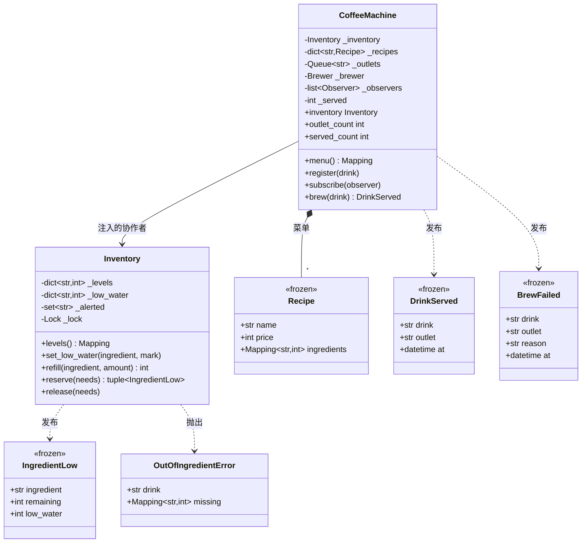

# 设计题解：咖啡机（Coffee Machine）

## 题目与澄清

面试官通常这样开场："设计一台咖啡机。它有几款饮品，每款有自己的配方；机器有多个出水口，
可以同时做好几杯；原料快用完的时候要通知运维。"

这道题在题库里体量不大，但它是**整套题里最干净的一道并发题**：没有调度算法要设计，没有复杂
的状态机，结构上只有一个共享库存和几个抢它的线程。正因为别的东西都被拿掉了，考官能非常清楚地
看出你的锁纪律——**临界区到底是哪几行，以及你有没有把慢操作圈进去**。这道题答得好不好，
基本就看这一件事。

值得当场问清楚的是：

- **多个出口共用一份原料吗？** 答"是"，题就成立了；答"每个出口有自己的豆仓和奶罐"，这道题
  就退化成几台互不相干的单出口机器，没有任何并发可谈。所以先把这句话确认下来：
  **出口是并行的，原料是共享的**。
- **一杯咖啡的制作要多久？** 这是本题最关键的一问。答案是几十秒——它比"扣一次库存"慢上六七个
  数量级。一旦说出这个数量级，"锁能不能跨越冲煮"就不再是风格问题，而是一道算术题。
- **原料不够时会发生什么？** 这一杯直接被拒绝，而且**一滴原料都不许被扣掉**。半杯咖啡没有
  意义：扣了牛奶没扣咖啡，既做不出饮品，运维也对不上账。
- **原料种类是固定的吗？** 不是。糖浆、燕麦奶、抹茶粉随时可能加进来，所以原料名是**数据**
  （运维配置的字符串），不是代码里的枚举。这一点和钞票面额恰好相反——面额是封闭的有限集合，
  所以那里用 `IntEnum`；把原料写成 `Enum` 意味着每上一款新糖浆都要改一次代码、重新发一次版。
- **收钱和找零要做吗？** 不做。投币、找零、余额不足的退款，是
  [[solution-vending-machine|自动售货机那道题]]完整覆盖的地盘，形态和这里没有区别。配方里
  保留一个 `price` 字段（菜单要显示），但支付流程明确不在本题范围。

**不在范围内**：支付与找零、杯子和杯盖的库存、清洗与除垢周期、温度控制、触摸屏 UI、
把订单排成一条队列再由工作线程消费（那是生产者-消费者的题目，这里出口就是工作者）。

## 需求与分级

**第 1 关——配方与原子扣减。** 几款饮品，每款是一张"原料 → 用量"的表；做一杯就是按表扣料。
唯一的硬要求是**全有或全无**：先算出全部缺口，一个都不缺才动手扣；冲煮中途失败则原样退回。
产物是 `Recipe`、`recipe()` 这个构造辅助、`Inventory.reserve/release` 和
`OutOfIngredientError`（它带着每种原料还差多少）。

**第 2 关——多出口并发。** 几个出口同时从同一份库存做饮品。这一关的验收标准是两条可断言的
不变式：**任何原料的余量都不为负**，以及**成功的杯数恰好等于库存能支撑的杯数**，一杯不多
一杯不少。产物是 `Inventory` 那把锁，以及用 `queue.Queue` 表示的出口池。

**第 3 关——缺料告警与补货。** 原料跌破警戒线时通知订阅者，事件要自带"发生了什么"；补货后
告警要能重新武装；某种原料在一串排队订单中间耗尽时，后续每一次拒绝都要点名是谁不够了。
产物是 `IngredientLow` / `DrinkServed` / `BrewFailed` 三个不可变事件、`Inventory.refill`
和那个防止告警风暴的闩。

**第 4 关——新配方与新原料。** 加一款用到全新原料的饮品，冲煮那条路径**一行都不许改**。
产物是 `CoffeeMachine.register`，以及"原料名是字符串而不是枚举"这个第 1 关就定下来的选择。

## 核心对象与职责

| 类 | 单一职责 | 它拥有的不变式 |
|---|---|---|
| `Recipe` | 一款饮品要用哪些原料、各多少 | 不可变；每种用量都是正数 |
| `Inventory` | 共享原料的余量与警戒线 | 余量不为负；扣减全有或全无；0 留在表里；告警不重复 |
| `CoffeeMachine` | 菜单、出口调度、事件发布 | 并发冲煮数 ≤ 出口数；一杯要么成要么完全没做；锁不跨越冲煮 |
| `IngredientLow` / `DrinkServed` / `BrewFailed` | 发生了什么 | 不可变；自带订阅者所需的全部字段 |

**归属关系**：`Inventory` 是**构造时注入**的协作者，不是机器的私有容器——一台机器背后是一个
料仓，而运维要直接对着料仓补货。所以 `CoffeeMachine` 把它作为只读属性交出去，而**没有**一个
`machine.refill()`：那样的方法只会把一次调用原样转发给 `inventory.refill()`，它不承担任何
额外职责，是从 Java 带过来的"门面层"习惯。同理，这份设计里**没有** `Menu` 类：菜单除了"一个
加了锁的字典"之外没有别的不变式要守，于是它就是 `CoffeeMachine` 里的一个字段。凡是"加一个类
只是为了让另一个类少两个字段"的，都该先问一句它守着什么。

`Outlet` 也没有成类。出口需要的全部性质是"有编号、数量有限、用完归还"，而
`queue.Queue` 恰好就是这个：`get()` 阻塞到有空闲出口，`put()` 归还。比起自己写一个
`Semaphore` 加一个 id 列表，它还白送了编号——事件里那句"从 outlet-2 出的"就来自这里。



## 关键设计决策

### 决策一：临界区到底是哪几行

这是整道题。先把错误答案写出来，它看上去非常无辜：

```python
class CoffeeMachine:
    def brew(self, drink: str) -> DrinkServed:
        with self._lock:                       # 一把大锁罩住整个方法
            recipe = self._recipes[drink]
            if not self._enough(recipe):
                raise OutOfIngredientError(...)
            self._deduct(recipe)
            self._brewer(recipe)               # ← 几十秒
            return DrinkServed(...)
```

它**是**线程安全的，而且所有测试都能过——只要测试不看时间。它错在别处：

1. **四个出口退化成一个。** 冲煮要 30 秒，扣库存要几微秒。把冲煮圈进锁里，意味着 99.999%
   的持锁时间在等一件和共享数据毫无关系的事。一台四出口机器的吞吐量瞬间变回单出口。这不是
   "性能优化问题"，这是**功能被实现掉了**——多出口是需求，不是优化。
2. **补货被一起卡住。** 运维打开机器加奶，`refill` 要拿同一把锁，于是他得站在那儿等一杯
   咖啡做完。更糟的情形是冲煮卡死（机器故障、外部调用超时），锁永远不释放，整台机器连"查
   一下还剩多少奶"都做不到——一次局部故障升级成完全不可用。

正确的临界区短得只有三件事：**算缺口、扣、看谁跌破了警戒线**。

```python
def reserve(self, needs: Mapping[str, int], label: str = "order") -> tuple[IngredientLow, ...]:
    with self._lock:
        missing = {name: need - self._levels.get(name, 0)
                   for name, need in needs.items() if self._levels.get(name, 0) < need}
        if missing:
            raise OutOfIngredientError(label, missing)
        events: list[IngredientLow] = []
        for name, need in needs.items():
            self._levels[name] -= need
            ...
        return tuple(events)
```

于是 `brew` 里有三段完全不重叠的等待，各自只用自己需要的那一样东西：

```python
outlet = self._outlets.get()                      # 等出口：不持任何锁
events.extend(self._inventory.reserve(recipe.ingredients, label=drink))   # 临界区：微秒级
self._brewer(recipe, outlet)                      # 冲煮：几十秒，不持任何锁
```

**怎么判断一段代码该不该进临界区？** 问它是不是在读或写共享数据。等出口不是（`Queue` 自己
线程安全），冲煮不是（它只碰这一杯的水和粉），查配方也不是（另一把锁，而且只持一瞬）。
只有"库存"这一份数据是真正被争用的，所以锁就该只盖住它，而且只盖住碰它的那几行。

配套的纪律还有一条：**任何时刻最多持一把锁**。这份设计里有三把锁（库存、菜单、计数），
但 `brew` 从头到尾没有一处同时持有两把——取配方时持菜单锁并立刻释放，扣库存时持库存锁并
立刻释放。做到这一点，死锁的"持有并等待"条件就被结构性地破掉了，不需要再去约定加锁顺序。
这几把锁分别该用 `Lock` 还是 `RLock`、什么时候该换成 `Condition` 或 `Semaphore`，见
[[concurrency.primitives|同步原语（threading）]]；本题的答案是三把都用最朴素的 `Lock`，
而且下一节会说明为什么"换成 `RLock`"是一个陷阱。

### 决策二：全有或全无——先算缺口，再动手

一杯拿铁要 30 毫升浓缩加 180 毫升牛奶。天真的写法是边查边扣：

```python
for name, need in needs.items():
    if self._levels[name] < need:
        raise OutOfIngredientError(...)   # 前面几种已经扣掉了！
    self._levels[name] -= need
```

牛奶不够时，浓缩已经被扣走了 30 毫升。客人什么也没拿到，料却少了——这是最典型的"半杯"
bug，而且它**在单线程下就会发生**，跟并发没关系。正确写法是把校验全部排在第一次赋值之前：
先用一个字典推导算出所有缺口，字典为空才进入扣减循环。

这条纪律有一个可执行的表述：**所有校验都排在第一次赋值之前**。它顺便带来两个好处。第一，
报错可以一次说清**全部**缺口（`{"espresso": 20, "milk": 170}`），而不是让客人补一样试一次、
再被告知还缺另一样。第二，它和第 2 关的并发要求天然契合——查和扣都在同一把锁里，不存在
"查的时候够、扣的时候不够"的窗口。

第二层是**冲煮失败的回滚**。原料已经扣了，水泵坏了，这一杯做不出来：

```python
try:
    self._brewer(target, outlet)
except Exception as exc:
    self._inventory.release(target.ingredients)     # 原样退回
    events.append(BrewFailed(drink, outlet, str(exc), self._clock()))
    raise BrewingFailedError(...) from exc
```

注意这里**没有**继续持着库存锁"以保证原子"。退回是一次独立的、幂等意义上安全的库存操作：
中间这段时间别人可能成功做了一杯，那完全正确——库存的不变式是"不为负"，不是"任何时刻都等于
某个预期值"。想用一把长锁把"扣—做—退"包成一个事务，就又回到了决策一的错误。

### 决策三：事件在锁内算出来，在锁外投递

缺料告警是观察者模式（Observer）的标准场景，但这道题把它放在并发环境里，于是多出一个
真正的坑。

告警的内容**必须在锁内算**：跌破警戒线这件事只有在"刚刚扣完"的那一刻才看得准，出了锁再回头
读一次库存，读到的可能是另外两杯之后的数字。所以 `reserve` 在锁内生成 `IngredientLow` 事件
并把它们**返回**给调用方。

投递则**必须在锁外**：

```python
def _publish(self, events: list[MachineEvent]) -> None:
    for event in events:
        for observer in self._observers:
            observer(event)
```

原因很实际：最自然的订阅者就是"缺料自动下单补货"，而它会回头调用
`machine.inventory.refill(...)`。如果在库存锁里投递，这个订阅者立刻死锁。

这里有一个诱人的错误修法：把 `Lock` 换成 `RLock`，同一个线程就能重入了，死锁消失。**这是
把一个会当场崩掉的 bug 换成一个更坏的、安静的 bug**——订阅者从此在持锁状态下运行，它有多慢，
所有出口就陪它等多久；它要是发一个 HTTP 请求，整台机器就挂在那个请求上。所以本设计里
`Inventory._lock` 故意是不可重入的 `threading.Lock`：**它会把这类错误变成一次立刻可见的
死锁，而不是一次悄悄的吞吐塌方**。

事件本身是三个 frozen dataclass，而且自带订阅者需要的全部字段：

```python
@dataclass(frozen=True, slots=True)
class IngredientLow:
    ingredient: str
    remaining: int
    low_water: int
```

这不是形式主义。如果事件只说一句"牛奶低了"，订阅者就必须回头调用 `inventory.levels()` 才知道
还剩多少——而那是一次**没有持锁保护的、事后的**读取，读到的数字和触发告警的那一刻可能已经
不是一回事。**事件携带发生了什么，订阅者就永远不需要反向查询主体。**

最后是告警**不许风暴**。牛奶跌破 150 毫升之后，接下来每一杯都会让它更低，如果每次都发一条，
运维一小时能收到几十条同样的消息，于是他会关掉告警——这是告警系统失效的标准路径。做法是一个
闩：`_alerted` 集合记住"这种原料已经告过警了"，补货到警戒线以上时解除。`_alerted` 的大小
永远不超过原料种类数，不会无限增长，而且解除的时机是明确的——每一个只增的容器都要说得出
什么时候有东西被拿走。

### 决策四：原料名用字符串，不用 `Enum`——一次故意的"不封装"

第 4 关要加一款用到抹茶粉的新饮品。如果原料是枚举：

```python
class Ingredient(Enum):
    ESPRESSO = "espresso"
    MILK = "milk"
    WATER = "water"
```

那么加一种糖浆就要改这个枚举、改类型标注、重新发一次版。可现实是：糖浆是**运维在后台配的**，
和换一款季节限定饮品一样频繁。**原料集合是开放的，它是数据不是代码**，所以键就该是字符串，
库存是一个 `dict[str, int]`，配方是一个 `Mapping[str, int]`。

这和[[solution-vending-machine|售货机]]里的硬币、以及 ATM 里的钞票面额恰好相反：面额是国家
定死的封闭有限集合，枚举成员就是面值，还能直接参与算术，那里用 `IntEnum` 是对的。同一个
"要不要枚举"的问题，答案取决于**这个集合会不会被业务方在运行时扩展**，而不是取决于"看起来
是不是一类东西"。

放弃枚举要付出的代价是丢掉拼写检查：`milk` 写成 `mlik` 编译期无人发觉。所以这个选择必须配一条
补偿——机器**不认识的原料就是缺口为全量的缺料**，而不是一个 `KeyError`：

```python
missing = {name: need - self._levels.get(name, 0)
           for name, need in needs.items() if self._levels.get(name, 0) < need}
```

于是那杯抹茶拿铁在原料到货前被拒绝，报错清清楚楚地说"matcha 差 8"，运维看一眼就知道是拼错了
还是没进货。这正是 `register()` 故意**不**校验原料是否存在的原因：新品常常先上菜单、后补原料，
把校验放在唯一真正知情的地方（真要用的时候），比放在注册时更贴近现实。

### 决策五：为什么不需要生产者-消费者，也不需要线程池

看到"多个出口并发"，很多人会立刻画出一条订单队列加一组工作线程。这道题**不需要**，说清楚
为什么不需要，比画出来更值钱。

生产者-消费者解决的是**削峰**：请求到达的速率和处理速率不匹配，需要一个缓冲区把它们解耦，
并在缓冲区满时施加背压。而这台咖啡机的调用方就是按下按钮的人——他站在机器前面，他**就是**
那个线程，他要的是"做好了给我"，不是"已收到请求"。把它改成异步下单，你得额外发明取单号、
通知机制和超时策略，凭空长出一堆概念。

`queue.Queue` 在这份设计里出现了，但它扮演的是**资源池**而不是任务队列：里面装的是出口编号
（资源），不是订单（任务）。方向是反的——线程从池里取一个资源、用完归还，而不是工作线程从
队列里取任务。这个区分值得当场说出来。

什么时候该翻到真正的队列？当出现"手机远程下单、到店取杯"时：下单方不再等待，需要单号和状态
查询，削峰和背压也真的成了问题。判据依然是需求，不是"并发听起来就该有队列"。

## 代码走读

下面是全部实现。读的时候盯住三处：`Inventory.reserve` 里那个"先算缺口再扣"的两段式；
`CoffeeMachine.brew` 里等出口、扣库存、冲煮这三段各自持什么锁（答案是：不持、持一瞬、不持）；
以及 `_publish` 为什么必须在 `finally` 里、在所有锁之外。

`recipe()` 这个模块级函数值得一提：它让配方写成
`recipe("拿铁", 22 * YUAN, espresso=30, milk=180)`，原料名是关键字参数，用量当场校验为正数，
返回的 `ingredients` 是一份 `MappingProxyType`——配方从此改不动，正在冲煮的那一杯拿着的就是
取菜单那一瞬间的那个对象，运维同时改配方也不会让它变成一杯四不像。

`brew` 的 `finally` 同时做两件事：归还出口、投递事件。归还必须在 `finally` 里，否则一次
冲煮异常就永久泄漏一个出口，跑上几次机器就彻底停摆（测试里那条"故障三次之后第四杯照样能做"
盯的就是这件事）。

%% code:begin solution.py %%
```python
"""咖啡机（Coffee Machine）——配方、原料的原子扣减、多出口并发制作与缺料告警。

核心思路：全部难点是一句话——**临界区只有"查库存 + 扣库存"这两步**。冲煮要几十秒，那段
时间一把锁都不持；出口的数量用一个装着出口编号的 `queue.Queue` 表示，等出口和等库存是两件
互不相干的事。库存的扣减是全有或全无：先算出所有缺口，一个都不缺才动手扣，冲煮中途失败则
原样退回，绝不出现"扣了牛奶没扣咖啡"的半杯。缺料告警在锁内**计算**（它要读刚刚变化的库存）、
在锁外**投递**（订阅者可能很慢，甚至会回头调用这台机器）。配方与原料都是数据不是代码：
加一款新饮品、加一种新原料都不需要碰冲煮那条路径。
"""

from __future__ import annotations

import queue
import threading
from collections.abc import Callable, Mapping
from dataclasses import dataclass
from datetime import datetime
from types import MappingProxyType

YUAN = 100  # 价格一律用整数分


class CoffeeMachineError(Exception):
    """本设计全部失败路径的公共基类。"""


class UnknownDrinkError(CoffeeMachineError):
    """菜单上没有这款饮品。"""


class OutOfIngredientError(CoffeeMachineError):
    """原料不够。`missing` 是每种原料还差多少，机器一滴都没有扣。"""

    def __init__(self, drink: str, missing: Mapping[str, int]) -> None:
        detail = "、".join(f"{name} 差 {short}" for name, short in sorted(missing.items()))
        super().__init__(f"cannot brew {drink}: {detail}")
        self.drink = drink
        self.missing = MappingProxyType(dict(missing))


class BrewingFailedError(CoffeeMachineError):
    """冲煮过程中机器出了故障。原料已经原样退回，这一杯不算数。"""


class InvalidQuantityError(CoffeeMachineError):
    """用量或补货量不是正数。"""


@dataclass(frozen=True, slots=True)
class Recipe:
    """一款饮品的配方：名字、价格（分）、每种原料各用多少（毫升或克）。

    不可变。改配方就是注册一个同名的新 `Recipe`，正在冲煮的那一杯不受影响——它手里拿的是
    取菜单那一瞬间的那个对象。
    """

    name: str
    price: int
    ingredients: Mapping[str, int]


def recipe(name: str, price: int, **ingredients: int) -> Recipe:
    """造一份配方：`recipe("拿铁", 22 * YUAN, espresso=30, milk=180)`。

    原料名用关键字参数写出来，配方就是一份数据；用量必须是正整数，0 用量的原料是笔误。
    """
    for material, amount in ingredients.items():
        if amount <= 0:
            raise InvalidQuantityError(f"{name}: {material} must use a positive amount")
    return Recipe(name=name, price=price, ingredients=MappingProxyType(dict(ingredients)))


@dataclass(frozen=True, slots=True)
class IngredientLow:
    """某种原料刚刚跌到警戒线以下。事件自带余量和警戒线，订阅者不必回头读库存。"""

    ingredient: str
    remaining: int
    low_water: int


@dataclass(frozen=True, slots=True)
class DrinkServed:
    """一杯饮品做好了，从哪个出口出的。"""

    drink: str
    outlet: str
    at: datetime


@dataclass(frozen=True, slots=True)
class BrewFailed:
    """冲煮中途失败，原料已退回。"""

    drink: str
    outlet: str
    reason: str
    at: datetime


MachineEvent = IngredientLow | DrinkServed | BrewFailed
Observer = Callable[[MachineEvent], None]


class Inventory:
    """所有出口共用的一份原料库存。它是这道题里唯一真正被并发争用的东西。

    不变式：
    1. 任何原料的余量都不为负——`reserve` 把"查"和"扣"放在同一把锁里做完，中间不给任何
       线程插队的机会。
    2. 扣减是全有或全无：先算出全部缺口，一个都不缺才开始扣。
    3. 余量归零的原料**留在表里**（值为 0），不像钞箱那样删掉——0 和"这台机器根本没有这种
       原料"是两件事，运维要看到前者。
    4. 告警对每种原料只发一次，直到它被补到警戒线以上；`_alerted` 只随原料种类增长。
    """

    def __init__(self, levels: Mapping[str, int] | None = None,
                 low_water: Mapping[str, int] | None = None) -> None:
        self._levels: dict[str, int] = dict(levels or {})
        self._low_water: dict[str, int] = dict(low_water or {})
        self._alerted: set[str] = set()
        self._lock = threading.Lock()  # 故意不是 RLock，见 `CoffeeMachine._publish`

    def levels(self) -> Mapping[str, int]:
        """一份只读快照；库存从不把自己的字典交出去。"""
        with self._lock:
            return MappingProxyType(dict(self._levels))

    def low_water_of(self, ingredient: str) -> int:
        return self._low_water.get(ingredient, 0)

    def set_low_water(self, ingredient: str, mark: int) -> None:
        """设置或修改某种原料的警戒线。"""
        with self._lock:
            self._low_water[ingredient] = mark
            self._relatch(ingredient)

    def refill(self, ingredient: str, amount: int) -> int:
        """补货，返回补后余量。补到警戒线以上会解除告警闩，下次再跌破才会重新告警。"""
        if amount <= 0:
            raise InvalidQuantityError(f"refill amount must be positive, got {amount}")
        with self._lock:
            self._levels[ingredient] = self._levels.get(ingredient, 0) + amount
            self._relatch(ingredient)
            return self._levels[ingredient]

    def reserve(self, needs: Mapping[str, int], label: str = "order") -> tuple[IngredientLow, ...]:
        """原子地扣掉一份配方的原料，返回**这次**新跌破警戒线的原料告警。`label` 只进错误信息。

        这就是整台机器唯一的临界区，而且短得只有三件事：算缺口、扣、看谁跌破了线。冲煮
        不在这里面——把几十秒的冲煮圈进来，N 个出口就退化成 1 个，补货也会被一起卡住。
        告警只在这里**算出来**，投递由调用方在锁外完成。
        """
        with self._lock:
            missing = {name: need - self._levels.get(name, 0)
                       for name, need in needs.items() if self._levels.get(name, 0) < need}
            if missing:
                raise OutOfIngredientError(label, missing)
            events: list[IngredientLow] = []
            for name, need in needs.items():
                self._levels[name] -= need
                mark = self._low_water.get(name, 0)
                if self._levels[name] <= mark and name not in self._alerted:
                    self._alerted.add(name)
                    events.append(IngredientLow(name, self._levels[name], mark))
            return tuple(events)

    def release(self, needs: Mapping[str, int]) -> None:
        """把已经扣掉的原料原样退回——冲煮失败时走这条路，半杯不算数。"""
        with self._lock:
            for name, amount in needs.items():
                self._levels[name] = self._levels.get(name, 0) + amount
                self._relatch(name)

    def _relatch(self, ingredient: str) -> None:
        """余量回到警戒线以上就解除告警闩。必须在锁内调用。"""
        if self._levels.get(ingredient, 0) > self._low_water.get(ingredient, 0):
            self._alerted.discard(ingredient)


# 真实机器里这一步是电机、水泵和加热器；这里注入一个可调用对象，测试可以让它变慢或者失败。
Brewer = Callable[[Recipe, str], None]


def instant_brew(drink: Recipe, outlet: str) -> None:
    """默认的"冲煮"：立刻完成。测试要模拟耗时或故障时换掉它。"""
    return None


class CoffeeMachine:
    """一台多出口咖啡机：菜单、共享库存、若干出口，以及告警的发布。

    不变式：
    1. 同时冲煮的杯数不超过出口数——出口是一个装着出口编号的 `queue.Queue`，取到编号才能
       开始做，做完（无论成败）一定归还。
    2. 一杯要么做出来、要么完全没做：冲煮失败时原料原样退回，`served_count` 不增加。
    3. 任何时刻最多持有一把锁，而且**没有任何一把锁跨越冲煮**。
    4. 事件一律在锁外投递：订阅者可能很慢，甚至会回头调用这台机器。
    """

    def __init__(self, inventory: Inventory, recipes: tuple[Recipe, ...] = (), *,
                 outlets: int = 2, brewer: Brewer = instant_brew,
                 clock: Callable[[], datetime] = datetime.now) -> None:
        if outlets <= 0:
            raise InvalidQuantityError("a machine needs at least one outlet")
        self._inventory = inventory
        self._brewer = brewer
        self._clock = clock
        self._recipes: dict[str, Recipe] = {r.name: r for r in recipes}
        self._menu_lock = threading.Lock()
        self._outlets: queue.Queue[str] = queue.Queue()
        for i in range(outlets):
            self._outlets.put(f"outlet-{i + 1}")
        self._outlet_count = outlets
        self._served = 0
        self._stats_lock = threading.Lock()
        self._observers: list[Observer] = []

    @property
    def inventory(self) -> Inventory:
        """共享库存。它是构造时传进来的协作者，不是这台机器的私有容器——运维直接对它补货，
        机器不需要一个只会转发一行的 `refill()`。"""
        return self._inventory

    @property
    def outlet_count(self) -> int:
        return self._outlet_count

    @property
    def served_count(self) -> int:
        """做成功的杯数。并发测试断言的就是它——`+= 1` 不是原子操作，所以它有自己的锁。"""
        with self._stats_lock:
            return self._served

    def menu(self) -> Mapping[str, Recipe]:
        """一份只读快照。"""
        with self._menu_lock:
            return MappingProxyType(dict(self._recipes))

    def register(self, drink: Recipe) -> None:
        """加一款新饮品，或用同名配方替换旧的（改价、改用量）。

        它不检查原料是否已经存在：新品往往先上菜单、后补原料。真缺料时 `reserve` 会带着
        缺口把它拒掉，而不是抛一个 `KeyError`。
        """
        with self._menu_lock:
            self._recipes[drink.name] = drink

    def subscribe(self, observer: Observer) -> None:
        self._observers.append(observer)

    def brew(self, drink: str) -> DrinkServed:
        """做一杯。等出口、扣原料、冲煮是三段互不重叠的等待，各自只用自己需要的那把锁。"""
        target = self._recipe(drink)
        outlet = self._outlets.get()          # 等一个空闲出口，此时一把锁都没持
        events: list[MachineEvent] = []
        try:
            events.extend(self._inventory.reserve(target.ingredients, label=drink))
            try:
                self._brewer(target, outlet)  # 几十秒的真正工作，不持任何锁
            except Exception as exc:
                self._inventory.release(target.ingredients)
                events.append(BrewFailed(drink, outlet, str(exc), self._clock()))
                raise BrewingFailedError(f"{drink} failed at {outlet}: {exc}") from exc
            with self._stats_lock:
                self._served += 1
            served = DrinkServed(drink, outlet, self._clock())
            events.append(served)
            return served
        finally:
            self._outlets.put(outlet)         # 无论成败，出口一定归还
            self._publish(events)

    def _recipe(self, drink: str) -> Recipe:
        with self._menu_lock:
            target = self._recipes.get(drink)
        if target is None:
            raise UnknownDrinkError(f"no such drink: {drink!r}")
        return target

    def _publish(self, events: list[MachineEvent]) -> None:
        """在**所有**锁之外投递事件。

        这不是讲究：订阅者可能是一个网络调用，也可能回头调用 `machine.inventory.refill(...)`
        （"缺料就自动补货"正是最自然的订阅者）。在库存锁内投递会当场死锁，而把库存锁换成
        `RLock` 只是把死锁换成一个更坏的结果——订阅者在持锁状态下运行，所有出口陪着它等。
        """
        for event in events:
            for observer in self._observers:
                observer(event)


if __name__ == "__main__":
    stock = Inventory({"espresso": 120, "milk": 400, "water": 1000, "cocoa": 40},
                      low_water={"milk": 100, "espresso": 40})
    machine = CoffeeMachine(
        stock,
        (recipe("美式", 18 * YUAN, espresso=30, water=150),
         recipe("拿铁", 22 * YUAN, espresso=30, milk=180)),
        outlets=2)
    machine.subscribe(lambda e: print(f"  [event] {e}"))
    for order in ("拿铁", "拿铁", "美式"):
        print("做好:", machine.brew(order).drink)
    print("库存:", dict(stock.levels()), "共", machine.served_count, "杯")
    try:
        machine.brew("拿铁")
    except OutOfIngredientError as exc:
        print("拒单:", exc)
```
%% code:end %%

## 测试与自检

二十一个测试按四关排列，并发部分一句 `sleep` 都没有。

**第 1 关**验的是"全有或全无"。最值钱的一条是：牛奶不够时，断言**浓缩的余量一滴未变**——
"它抛了异常"和"它什么都没弄坏"是两个不同的主张。另一条让冲煮中途抛异常，断言每种原料都精确
回到了原值，并且 `served_count` 没有增加。还有一条断言机器从没听说过的原料会变成一个带缺口的
缺料错误，而不是 `KeyError`。

**第 2 关**是这道题的核心，两个测试各守一条不变式：

- *不超卖*：库存刚好够做四杯，十个线程在 `threading.Barrier` 上同时起跑，断言**恰好四杯成功、
  六次被拒**，所有余量 `>= 0`，且最终余量精确为零。断言的是账目，不是时序。
- *真的并行*：三个出口发六杯，冲煮函数里放一个 `threading.Barrier(3)`——必须**恰好三个线程
  同时到齐**才能继续。并发度不足（比如有人把库存锁跨到了冲煮上）会让屏障超时而失败，并发度
  超标会把记录到的峰值推高。这个测试不靠 `sleep` 也不靠时间，它直接把"并发度"这条不变式
  变成了可断言的东西。

再加一条直击决策一的测试：让冲煮阻塞住，然后在主线程里补货并读库存，断言两者**立刻返回**。
如果临界区把冲煮圈了进去，这条会当场挂住。

**第 3 关**验事件：告警事件带着余量和警戒线；同一种原料不会每杯都告警一次；补货到警戒线以上
之后再跌破会重新告警（断言的是两次告警的余量序列 `[20, 40]`）。还有一条专门验"订阅者可以回头
调用机器"——观察者在回调里 `refill`，断言线程没有卡死。这条就是决策三那个坑的回归测试。

**第 4 关**注册一款用到全新原料的饮品：先断言它因为缺 `cocoa` 被拒（菜单先上、原料后到），
补货后能做出来，并且老饮品一切照旧。

**并发测试的通用纪律**：用屏障让线程同时起跑，断言不变式（不超卖、账目守恒、并发度上限），
永远不要断言"A 比 B 先完成"。还要说清 GIL 的位置：`self._served += 1` 是"读—加—写"三步，
两个线程可以读到同一个值然后各写一次，于是丢掉一次计数——所以计数器有自己的锁。GIL 只保证
单条字节码不被打断，从来不保证一个表达式是原子的。

**两分钟怎么演示**：`python solution.py`。订阅事件，连做三杯，让屏幕上先打出一条
`IngredientLow(ingredient='milk', remaining=40, low_water=100)`，再打出剩余库存，最后故意做
第四杯，让它打出 `cannot brew 拿铁: milk 差 140`。然后指着 `brew` 说一句："这里只有一行在锁
里面，冲煮那一行在外面——这台机器有几个出口就真的能同时做几杯。"

## 扩展与追问

**新需求**

- *杯子和杯盖也要计数*：它们就是另外两种"原料"，写进配方即可（`cup=1`）。`Inventory` 一行
  不用改——这正是把原料键做成开放字符串换来的回报。
- *每个出口只能做某几种饮品*（比如只有一个口接了奶管）：出口从 `str` 变成一个带能力集合的
  小值对象，`_outlets` 从一个队列变成按能力分组的几个队列。`Inventory` 和事件完全不动。
- *配方按季节切换*：`register()` 已经支持同名替换。正在冲煮的那一杯拿着的是旧 `Recipe` 对象，
  因为它不可变，所以切换是安全的——这就是 frozen dataclass 在并发里最实在的好处。
- *统计每款饮品卖了多少*：订阅 `DrinkServed` 即可，机器一行不改。事件自带 `drink` 和 `at`。

**并发与线程安全**

- *为什么不给每种原料一把锁？* 因为一份配方要同时动好几种原料，多把锁就要约定加锁顺序，
  否则"拿铁线程先锁奶、摩卡线程先锁可可"就是一个教科书式的死锁。库存这把锁只持微秒，
  按原料细化换不来任何吞吐，只换来死锁风险。
- *能不能换成 `asyncio`？* 冲煮是等待硬件，天然适合 `await`。换过去之后，`Inventory._lock`
  换成 `asyncio.Lock`，`queue.Queue` 换成 `asyncio.Queue`，而**整段推理一字不变**——临界区
  仍然只有查和扣，投递仍然在锁外。这说明这道题考的根本不是 `threading` 这个模块。
- *多进程／多机器共用一份库存？* 锁要搬到进程外（Redis、数据库行锁），`reserve` 变成一次
  条件更新（`UPDATE ... WHERE level >= need`），拿返回的影响行数判断成败。形状完全一样，
  只是锁的实现换了地方。

**持久化与规模**

- *断电后库存要记得*：`Inventory` 背后换成一张表，`reserve` 变成一次事务里的条件扣减。
  接口不变，所以 `CoffeeMachine` 不用改。
- *几百台机器的集中监控*：`_observers` 换成一个把事件发往消息队列的订阅者。因为事件是
  自包含的不可变对象，序列化它不需要回头查任何东西——这是"事件携带发生了什么"的又一个回报。
- *告警去重与恢复通知*：现在的闩只发"跌破"，真实运维还要"已恢复"。在 `_relatch` 解除闩的
  那一刻多发一个事件即可，仍然是锁内算、锁外发。

## 常见错误

- **一把大锁罩住 `brew` 全程**。最常见、也最致命的答案：所有测试都过，但多出口这条需求被
  悄悄实现掉了。面试官通常不会提示你，他在等你自己说出"冲煮不在临界区里"。
- **边查边扣**。第一种原料够就扣掉，扣到第三种才发现不够——单线程下就是 bug，还和并发无关。
- **用 `RLock` 去"修"订阅者回调里的死锁**。把一个当场可见的错误换成一个安静的吞吐塌方。
  正确做法是把投递挪到锁外。
- **事件只带一个名字**，逼订阅者回头调用 `inventory.levels()`。那是一次无保护的事后读取，
  拿到的数字和触发告警的那一刻已经不是一回事。
- **每杯都告警**。告警风暴等于没有告警，因为运维会把它关掉。
- **把原料写成 `Enum`**（Java 习惯）。上一款新糖浆就要改代码、重新发版；而配方和原料本来
  就是运维配置的数据。
- **`CoffeeMachine` 用 `__new__` 写单例**（Java 习惯）。测试必须能同时造出两台互不干扰的
  机器（本文的测试每条都造一台新的），单例直接把这件事堵死。
- **给机器加一个只转发一行的 `refill()`**。它不守任何不变式，删掉它，让运维直接对库存补货。
- **`self._served += 1` 不加锁**。它是读—加—写三步，两个线程会丢计数。GIL 保护不了它。
- **并发测试靠 `sleep` 和"A 应该比 B 快"**。这种测试要么偶发失败，要么在坏实现上也能通过。
  用屏障和不变式。
- **忘了在 `finally` 里归还出口**。一次冲煮异常就永久少一个出口，几次之后机器彻底停摆——
  凡是"取出来用、用完归还"的资源，归还都必须在 `finally` 里。

## 45 分钟怎么分配

- **0–4 分：澄清**。问那三个问题：出口共用原料吗、一杯要多久、原料种类固定吗。第二问的答案
  （几十秒）要当场用出来："那么锁绝对不能跨越冲煮"——这一句话定下了整道题的调子。
- **4–9 分：实体与不变式**。白板上写 `Recipe` / `Inventory` / `CoffeeMachine`，每个后面写一行
  它守的不变式。明确说出"菜单和出口都不单独成类，理由是……"，主动放弃两个类比被动被问更有分。
- **9–13 分：API**。列出 `reserve(needs) -> tuple[IngredientLow, ...]` 这个签名，并解释它
  为什么**返回**事件而不是自己发出去——这一个签名就把决策三讲完了。
- **13–26 分：写核心**。先写 `Inventory.reserve`（先算缺口再扣，锁内算告警），再写 `brew`
  的三段式。写的时候把"这一行在锁里、这一行在锁外"念出来。
- **26–33 分：并发测试**。当场写不超卖那条：屏障 + 断言恰好 N 杯成功 + 余量非负。跑给面试官看。
- **33–39 分：告警与补货**。事件三件套、闩、锁外投递，顺带说清"订阅者回头调用机器"那个坑。
- **39–45 分：扩展**。注册一款新原料的饮品，说明冲煮路径一行没动；再补一句 `asyncio` 版本
  整段推理不变。
- **时间不够时砍什么**：先砍事件的三种类型（只留缺料告警），再砍 `register` 的运行时替换，
  再砍 `BrewFailed`。绝不能砍的是：`reserve` 的两段式、锁的边界、以及那条不超卖的并发测试。

## 来源与延伸

- [ashishps1/awesome-low-level-design — Coffee Vending Machine](https://github.com/ashishps1/awesome-low-level-design/blob/main/problems/coffee-vending-machine.md)：
  六种语言并排，给出 `Coffee` / `Ingredient` / `Payment` / `CoffeeMachine`（Singleton）的切法，
  并用线程池模拟并发请求，适合用来核对需求项有没有漏。本文在三处明确不同：它把 `Ingredient`
  做成一个带 `synchronized` 更新方法的对象，于是原子性落在**单个原料**上，而一份配方要同时
  动好几种原料，真正需要原子的是整份扣减；它的 `CoffeeMachine` 是 Singleton，而测试必须能
  同时造两台互不干扰的机器；它没有讨论临界区的边界，而那是这道题唯一真正的考点。
- [ashishps1/awesome-low-level-design — Vending Machine](https://github.com/ashishps1/awesome-low-level-design/blob/main/problems/vending-machine.md)：
  同一家的售货机版本。拿它和本题对照最能看清分工：那道题的难点在支付与找零的状态机，这道题
  的难点在锁的边界，两者几乎没有重叠的知识点。本文因此明确把支付排除在范围之外。
- [docs.python.org — `threading`](https://docs.python.org/3/library/threading.html)：
  `Lock` 与 `RLock` 的区别正是本文决策三的技术依据——`RLock` 允许同一线程重入，看似修好了
  订阅者回调的死锁，实际是让订阅者在持锁状态下运行；`Barrier` 则是写并发测试的正确工具，
  它让"恰好 N 个线程同时到齐"成为一个可断言的事实，而不是靠 `sleep` 赌时序。
- [docs.python.org — `queue`](https://docs.python.org/3/library/queue.html)：
  本文用它做**资源池**而不是任务队列——里面装的是出口编号，`get()` 阻塞到有空闲出口，
  `put()` 归还。文档里它主要作为生产者-消费者的缓冲区出现，值得对照着想清楚两种用法方向
  正好相反。
- [docs.python.org — `dataclasses`](https://docs.python.org/3/library/dataclasses.html)：
  `frozen=True` 加 `slots=True` 是本文所有事件和配方的形态。不可变在并发里不是洁癖：正在
  冲煮的那一杯拿着的 `Recipe` 就算运维同时改了菜单也不会变，而事件可以安全地跨线程传递。
