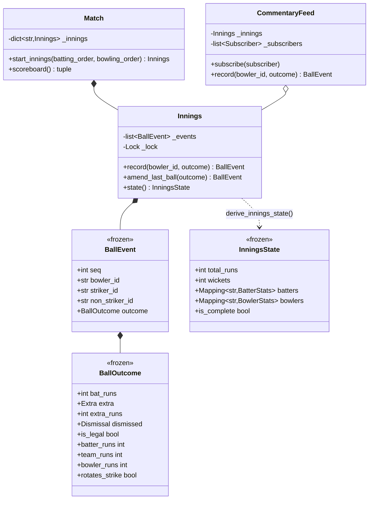

# 设计题解：体育比分系统（Cricinfo）

## 题目与澄清

面试官的开场白："设计一个像 Cricinfo 那样的板球实时比分系统：一球一球地记录比赛，随时能查
总分、每位击球手的个人成绩、每位投手的经济率。"这道题面上是"设计一个比分板"，但它真正考的
是**事件溯源（event sourcing）**——只是题目从不用这个词。值得当场说清楚、并写进设计里的一
句话是：**球（ball）是唯一的事件，总分、个人得分、经济率、谁在击球、谁在投球，没有一个是被
存下来的字段，全部是对"从第一球到现在"这条日志的一次重放（replay）。**

先澄清板球本身的规则，再澄清系统边界：

- **一局怎么结束？** 全部出局（打满全部批次），或者（限定球数的赛制下）用完规定的 over 数，
  两者中先发生的那个。测试板球（Test）不限 over 数，只靠出局或宣布（declare）结束——本文
  不实现宣布，理由见范围之外。
- **额外球（extras）要不要精确区分？** 要，而且这是本题真正的难点：wide、no ball**不算合法
  球**，要重投；bye、leg bye**算合法球**。四种额外球是否算到击球手个人头上、是否面对了这一
  球、是否算投手失分，**四条规则两两不同**，混在一起写会出一堆隐藏 bug。
- **轮转（strike rotation）怎么算？** 单数跑动换端，外加每个 over 结束额外换一次——这两条
  规则是各自独立生效的，同一球如果两条都触发，效果相互抵消。
- **改判要不要支持？** 要，这是本题分数最高的一段：第三裁判推翻一个判罚，只需要改最近一球
  的结果，重新算一遍，所有派生的数字自动跟上——这正是"不存总分、只存事件"这个设计换来的
  好处，必须在设计决策里正面讲清楚。
- **我对板球规则有多确定？** 老实说：并不是每一条都确定，但**记分规则本身要尽量对**——
  no ball 打出去的分记在击球手个人头上、判罚分和击球手打的分都算投手失分，这些是真实规则，
  本文按真实规则实现，不是简化。真正被简化、**没有**按真实规则实现的，是三条更边缘的规则：
  不是所有出局方式都能发生在所有额外球上（比如真实规则里 no ball 上不能"投中三柱门"出局），
  本文不做这个限制；run out（跑动出局）真实规则里不计入投手的个人 wicket 数，本文没有区分
  出局方式，一律记在当值投手头上；no ball 叠加 bye/leg bye（击球手没碰到、但裁判喊了 no
  ball 之后还跑了额外的分）这种双重额外球的组合没有建模，一颗球只携带一种额外球类型。这
  三条在下面的决策和常见错误里会再次点出。这道题的重点是"派生 vs 存储"这个架构判断，不是
  把《板球规则》第 40 条一字不差地翻译成代码，但记分公式本身错了，这道题就没有讲清楚。

**范围之外**：真实的球场直播画面、赔率、球员转会；测试板球的"follow-on"（跟投）、宣布局
（declare）、平局（draw）与打成局（tie）的判定；投手轮换限制之外的战术（谁先发球、场地
布置）；DRS 审核流程本身（本文只处理审核**结束之后**"改一球"这个结果）；no ball 叠加
bye/leg bye 的双重额外球组合。

## 需求与分级

- **第 1 关（事件日志与派生统计，约 20 分钟）**：一场比赛由若干局（innings）组成，一局是一条
  按顺序追加的球事件（`BallEvent`）日志；总分、个人得分、投手经济率、击球手/投手的名次都是
  对这条日志的一次重放，不是被增量更新的字段。对应 `BallEvent`、`BallOutcome`、
  `derive_innings_state`、`InningsState`、`BatterStats`、`BowlerStats`。**说清楚为什么这样
  做很重要**——见下面第一条决策。
- **第 2 关（额外球、出局、轮转，约 20 分钟）**：wide、no ball 不算合法球，但只有 wide
  完全不记到击球手头上——no ball 上打出去的分照样算击球手个人得分，额外再罚球队 1 分；
  bye、leg bye 算合法球，跑动记为球队的额外得分，不进击球手个人得分。出局结束当前击球手
  的这一局，换下一位；单数跑动和 over 结束各自独立触发一次轮转。对应 `Extra`、
  `Dismissal`、`BallOutcome` 的几个 `@property`、`derive_innings_state` 里的轮转与换人
  逻辑。
- **第 3 关（改判，约 15 分钟）**：第三裁判推翻一个判罚，只能改**最近的一球**，改完之后
  重放，wickets、击球手是谁、有没有多出一位从没真正上场的击球手——全部自动跟着对。对应
  `Innings.amend_last_ball`。
- **第 4 关（赛制与直播订阅，选做）**：T20/ODI 只是"每局限定几个 over"这一个数字的差异，
  Test（两局制、不限 over）不需要改动任何记分代码；直播订阅用观察者模式（Observer）包一层
  在 `Innings` 外面，一行不改内部逻辑。对应 `MatchFormat`、`Match`、`CommentaryFeed`、
  `BallRecorded`。

## 核心对象与职责

- **`BallOutcome`** — 一次投球的结果：`bat_runs`（打到球棒上的跑动）和 `extra_runs`（跟
  球棒无关的额外跑动）分开存，是不是额外球、有没有人出局。它是**唯一会被"改判"的部分**，
  也是四条额外球规则（合不合法、算不算击球手/投手头上、会不会触发轮转）的唯一落点，
  用几个 `@property` 表达、用 `__post_init__` 校验合法组合，不散落在别处。
- **`BallEvent`** — 一条事件：谁投的、当时谁在两端击球、结果是什么。它是全设计**唯一的事实
  来源**——除了它，没有任何地方存着"现在总分是多少"这类数字。
- **`InningsState`** — 一局此刻的局面：一份不可变快照，由 `derive_innings_state` 重放
  `Innings` 的事件日志算出来，从不被写入，只被"重新算出来"。
- **`BatterStats`/`BowlerStats`** — 击球手、投手的统计，同样只在重放里被算出来，不独立存在
  于 `Innings` 之外。
- **`Innings`** — 一局：出场顺序、（可选的）投球方名单、限定球数，加一条只增（`record`）、
  仅可改最后一条（`amend_last_ball`）的事件日志。它是这道题唯一持有可变状态的类。
- **`Match`** — 一场比赛：按顺序进行的若干局。它唯一的职责是把"这一局限定几个 over"这件事
  从赛制（`MatchFormat`）里查出来，交给新开的 `Innings`。
- **`CommentaryFeed`** — 直播订阅层：包住一个 `Innings`，记球、改判都先转给它，成功后把
  一份不可变的通知（`BallRecorded`）发给所有订阅者。这是[[patterns.observer|观察者与事件
  （Observer）]]在这道题里的落点。

生命周期上，`Match` **组合** `Innings`（随比赛而生，本文不做真实删除）；`CommentaryFeed`
**关联**它包住的 `Innings`——由调用方构造并注入，`CommentaryFeed` 不拥有它的生命周期，
`Innings` 完全不知道自己被包住了。



## 关键设计决策

### 为什么统计是"重放"出来的，不是"维护"出来的

朴素的做法是给 `Innings` 挂一堆计数器，每记一球就更新：

```python
# 选项 1：增量维护
def record(self, bowler_id, outcome):
    self.total_runs += outcome.team_runs
    if outcome.dismissed:
        self.wickets += 1
    self.batters[self.striker].runs += outcome.batter_runs
    ...
```

```python
# 选项 2：只追加事件，统计现算（本文的选择）
def record(self, bowler_id, outcome) -> BallEvent:
    event = BallEvent(next(self._ids), bowler_id, ..., outcome)
    self._events.append(event)
    return event

def state(self) -> InningsState:
    return derive_innings_state(self._events, self.batting_order, self.overs_limit)
```

选项 1 在"正常记分"这条路径上更快（O(1) 而不是 O(球数)），但这道题的分数不在正常路径上，
在**改判**这条路径上：第三裁判把一个"出局"改成"没出局"，选项 1 要反着把 `wickets -= 1`、
把换上场的那位击球手的统计**撤销**、把当时被替换掉的击球手**请回来**、还要判断这中间
有没有发生过依赖"他已经出局"这个事实的后续计算——每一条修正都要手写一条反向操作，而且
漏一条就是一个只有翻查录像才能发现的 bug。选项 2 里，"改判"就是把 `_events[-1]` 换成
新的结果，再调用一次已经写好的 `derive_innings_state`——**修正的代码量是零**，因为正向
重放和"修正后重新算"用的是同一份逻辑。一局板球顶多几百球，重放的 O(n) 代价可以忽略；
换来的是"任何一次修正都不需要专门写代码"，这笔交易在这道题里稳赚。

### 额外球的规则：为什么一次投球要携带两个跑动数字，而不是一个"跑了几分"共用不同含义

一个容易想到、也容易出错的写法是给 `BallOutcome` 只留一个 `runs` 字段，靠 `extra` 的取值
决定这个数字到底是"击球手个人跑的"还是"跟球棒无关的额外跑动"。这看起来省了一个字段，代价是
把 no ball 和 wide 的记分规则悄悄混同了——两者都不算合法球，很容易顺手把 `runs` 在两种场景
下都当成"额外跑动"处理，而真实规则里 no ball 上打出去的分要照算击球手的个人得分，只是额外
再罚一分给球队；只有 wide 才是"击球手个人得分永远不可能非零"的那一种。一个字段两种含义，
恰恰是这类记分错误最容易发生的地方——`runs` 到底该不该记给击球手，取决于调用方有没有记住
"这是哪种额外球"这条隐藏规则，编译器和类型检查都帮不上忙：

```python
# 选项 1：一个 runs 字段，含义靠 extra 的取值决定
runs: int
extra: Extra | None = None
# 调用方必须自己记住：extra 是 WIDE 时 runs 是"额外跑动"，
# extra 是 None 或 NO_BALL 时 runs 是"击球手跑动"——没有任何代码强制这条规则，
# 两种含义共用一个字段，写反了也不会报错。
```

```python
# 选项 2：两个字段各管一件事，非法组合在构造时就报错（本文的选择）
bat_runs: int = 0       # 打到球棒上的跑动：只有正常球和 no ball 可能非零
extra: Extra | None = None
extra_runs: int = 0     # 跟球棒无关的额外跑动：只有 wide／bye／leg bye 可能非零

def __post_init__(self) -> None:
    if self.bat_runs and self.extra not in BAT_RUN_EXTRAS:
        raise InvalidDeliveryError(f"{self.extra} deliveries cannot credit the batter")
    if self.extra_runs and self.extra not in EXTRA_RUN_EXTRAS:
        raise InvalidDeliveryError(f"{self.extra} deliveries cannot carry extra team runs")
```

选项 2 把"哪种额外球允许哪种跑动"从一条需要记住的隐藏约定，变成了一条构造时就会报错的显式
校验——给一次 bye 塞一个击球手跑动，或者给 no ball 塞一个额外跑动（本文没有建模 no ball
叠加 bye 的组合，见题目与澄清），在 `BallOutcome(...)` 这一行就会抛 `InvalidDeliveryError`，
而不是悄悄算出一个错误的总分、等到某次审计才被发现。这也是"一个字段共用两种含义"在数据
建模里的通病：字段的名字暗示它只有一种解释，读代码的人和写测试的人都会先入为主，两个含义
不同的数字理应分开存，让类型本身说出它们的区别。

四条额外球规则本身，仍然整理成 `BallOutcome` 上的只读属性，而不是散落在 `derive_innings_state`
的重放循环里：

```python
@property
def batter_runs(self) -> int:
    return self.bat_runs   # __post_init__ 已经保证了它只在合法场景下非零

@property
def bowler_runs(self) -> int:
    # bye／leg bye 不是投手的责任；no ball 的判罚分和击球手打出的分，
    # 都是他投出这颗坏球才产生的，两者都要算进他的经济率。
    return 0 if self.extra in NO_BAT_EXTRAS else self.team_runs
```

好处不是省了几行代码，是把"额外球规则是什么"和"重放算法怎么走"彻底分开——规则变了（比如
某个联赛把 no ball 的判罚改成 2 分）只改 `BallOutcome`，重放循环一行不动；任何调用方（记分、
测试、以后可能出现的"预测下一球"功能）都从同一个地方读到同一套规则，不会有两处判断不一致
的风险。这条决策也回答了击球手轮转的一个细节：`rotates_strike` 同样是 `BallOutcome` 的
属性，正常球和 no ball 按 `bat_runs` 的奇偶判断，bye/leg bye 按 `extra_runs` 的奇偶判断，
wide 维持不触发——三条判断分别对应三种"实际跑动"的来源，而不是从一个含义模糊的 `runs`
字段里猜。

### 改判为什么只能动最近一球，而不是任意一条历史事件

```python
# 选项 1：按 seq 改任意一球
def amend(self, seq, outcome):
    self._events[index_of(seq)] = replace(...)
```

```python
# 选项 2：只能改最后一球（本文的选择）
def amend_last_ball(self, outcome: BallOutcome) -> BallEvent:
    last = self._events[-1]
    self._events[-1] = BallEvent(last.seq, last.bowler_id, last.striker_id,
                                 last.non_striker_id, outcome)
```

选项 1 看起来更"通用"，但会引入一个选项 2 完全不存在的问题：如果被改的那一球在历史上
**促成了之后的球才会发生的事实**——比如第 10 球的出局换上了第 15 号击球手，现在把第 10 球
改成没出局，那么第 15 号击球手在第 11～30 球之间打出的所有成绩，此刻应该属于谁？这是一个
真正难回答的问题（现实里第三裁判的裁决恰恰是**在下一球投出之前**做出的，所以这种情况在真实
比赛里根本不会发生）。选项 2 把这条约束直接写进接口：只有最后一球可改，一旦下一球被记录，
再往前的历史就冻结了。这不是偷懒，是把"现实规则本来就禁止的操作"也在接口层面禁止掉，让
"重放后自动一致"这条承诺永远成立，不用为一个现实里不存在的场景操心。

### 击球手轮转：单数跑动和 over 结束是两条独立规则，不是一条

容易写错的地方是把"跑了单数"和"这个 over 投完了"合并成一条判断，比如"如果这是本 over 最后
一球且跑动为单数，就**不**轮转（两次生效互相抵消，所以判断一次）"。本文选择让两条规则完全
独立生效——重放循环里各自一个 `if`：

```python
elif outcome.rotates_strike:
    striker, non_striker = non_striker, striker
if outcome.is_legal and balls_this_over == 6:
    ...
    striker, non_striker = non_striker, striker
```

两次独立的交换在"末球单数跑动"这个具体场景下确实会相互抵消，这是物理事实的正确推论——
批次交换了端，又因为换 over 再交换一次端，两次抵消——但把它写成"因此只需要判断一次"的合并
逻辑，是在给一个巧合场景硬编码一条特例，下一个真的独立生效的场景（比如这道题没有实现的
"跑动导致触及边界之外的额外跑动"）就会被这条特例悄悄影响。两条独立的 `if`，各自表达各自的
物理规则，抵消是重放的自然结果，不是代码里写的结果——这是"不要为观察到的巧合编码，编码
产生巧合的规则"的一个具体例子。

## 代码走读

整份实现如下。读的时候盯住四处：`BallOutcome` 上那几个把额外球规则封装成只读属性的
`@property`、`derive_innings_state` 里那两条独立生效的轮转判断、`Innings.amend_last_ball`
只碰 `_events[-1]` 这一行、以及 `CommentaryFeed` 怎么在完全不碰 `Innings` 的前提下加上
订阅通知。

%% code:begin solution.py %%
```python
"""体育比分系统（Cricinfo）——把一场板球比赛建模成一条球事件日志，统计全部现算的参考实现。

核心思路：这道题是事件溯源（event sourcing）的教科书场景，只是没人在题面里这么叫它。**一个球
（ball）就是一条不可再分的事件**——谁投的、谁打的、跑了几分、算不算合法球、有没有人出局；
局面（总分、击球手个人得分、投手的经济率、轮到谁击球、轮到谁投球）**没有一个是被存下来再累加
更新的字段，全部是对事件日志的一次重放（replay）**。`derive_innings_state` 是全文唯一改数字
的地方，`Innings.record` 只管往日志末尾追加一条事件。这样一来，"第三裁判改判"这个全题最有
意思的需求几乎不需要专门的代码：只要把最近一条事件换成修正后的版本，重新跑一遍
`derive_innings_state`，所有派生出来的数字——总分、少了几个 wicket、轮到谁击球——自动跟着对。
直播订阅（Observer）被做成一层薄薄的外壳 `CommentaryFeed`，包住 `Innings` 而不改它一行代码。
"""

from __future__ import annotations

import itertools
import threading
from collections.abc import Callable, Mapping, Sequence
from dataclasses import dataclass, replace
from enum import Enum


# --------------------------------------------------------------------------
# 失败路径。


class CricketError(Exception):
    """本设计里所有失败路径的公共基类。"""

class UnknownInningsError(CricketError):
    """局号不存在。"""

class UnknownBowlerError(CricketError):
    """这名投手不在这一局登记的投球方名单里。"""

class NoDeliveryToAmendError(CricketError):
    """这一局还没有任何一球，没有可改判的对象。"""

class InningsCompleteError(CricketError):
    """这一局已经结束（全部出局或用完球数），不能再记球。"""

class ConsecutiveOverError(CricketError):
    """同一名投手不能连续投两个 over。"""

class MidOverBowlerChangeError(CricketError):
    """一个 over 还没投完，中途换了投手。"""

class InvalidDeliveryError(CricketError):
    """一次投球的结果自相矛盾——比如给一次 bye 记上了击球手跑动。"""


# --------------------------------------------------------------------------
# 一个球：额外球的种类、出局的方式，以及一次投球的结果。


class Extra(Enum):
    """额外球的四种：wide、no ball 不算合法球；bye、leg bye 算合法球。"""

    WIDE = "wide"
    NO_BALL = "no_ball"
    BYE = "bye"
    LEG_BYE = "leg_bye"


class Dismissal(Enum):
    """出局方式；本设计不限制哪种出局能发生在哪种额外球上，见题解的取舍说明。"""

    BOWLED = "bowled"
    CAUGHT = "caught"
    LBW = "lbw"
    RUN_OUT = "run_out"
    STUMPED = "stumped"


ILLEGAL_EXTRAS = frozenset({Extra.WIDE, Extra.NO_BALL})
NO_BAT_EXTRAS = frozenset({Extra.BYE, Extra.LEG_BYE})
BAT_RUN_EXTRAS = frozenset({None, Extra.NO_BALL})       # 允许击球手个人得分非零的两种场景
EXTRA_RUN_EXTRAS = frozenset({Extra.WIDE, Extra.BYE, Extra.LEG_BYE})  # 允许"额外跑动"非零的场景


@dataclass(frozen=True, slots=True)
class BallOutcome:
    """一次投球的结果。这是唯一会被"改判"的部分，也是四条额外球规则唯一的落点。

    `bat_runs` 和 `extra_runs`是两个含义完全不同的数字，分开存而不是共用一个字段：前者是
    "打到球棒上跑了几分"（只有正常球和 no ball 才可能非零——no ball 上打出去的分照样记
    在击球手头上，这是本设计和一份更早、错误的版本之间唯一的差别）；后者是"跟球棒无关、
    但要记进队伍总分的额外跑动"（bye／leg bye 的跑动、wide 上的超跑）。两者的合法组合由
    `__post_init__` 校验，写错场景（比如给一次 bye 塞了击球手跑动）会立刻报错，而不是
    悄悄算出一个错误的总分。
    """

    bat_runs: int = 0
    extra: Extra | None = None
    extra_runs: int = 0
    dismissed: Dismissal | None = None

    def __post_init__(self) -> None:
        if self.bat_runs and self.extra not in BAT_RUN_EXTRAS:
            raise InvalidDeliveryError(f"{self.extra} deliveries cannot credit the batter")
        if self.extra_runs and self.extra not in EXTRA_RUN_EXTRAS:
            raise InvalidDeliveryError(f"{self.extra} deliveries cannot carry extra team runs")

    @property
    def is_legal(self) -> bool:
        """算不算一颗合法球——wide 和 no ball 都要重投，不计入这个 over 的球数。"""
        return self.extra not in ILLEGAL_EXTRAS

    @property
    def counts_as_ball_faced(self) -> bool:
        """简化模型：除了 wide，击球手都算"面对了"这一球——包括 no ball，因为他确实有机会
        把它打出去，这正是 no ball 和 wide 唯一不该被同等对待的地方。
        """
        return self.extra is not Extra.WIDE

    @property
    def batter_runs(self) -> int:
        """记到击球手个人得分上的跑动。`__post_init__` 已经保证了它只在合法的场景下非零。"""
        return self.bat_runs

    @property
    def team_runs(self) -> int:
        """记到球队总分上的跑动：击球手跑的 + 额外跑的 + 非法球那一分自动判罚。"""
        return self.bat_runs + self.extra_runs + (1 if not self.is_legal else 0)

    @property
    def bowler_runs(self) -> int:
        """记到投手失分上的跑动：bye／leg bye 不是投手的责任；no ball 的判罚分和击球手
        打出去的分都要算进投手的经济率——那两分本来就是他投出这颗坏球才产生的。
        """
        return 0 if self.extra in NO_BAT_EXTRAS else self.team_runs

    @property
    def rotates_strike(self) -> bool:
        """这一球单独触发一次击球手轮转吗：正常球和 no ball 看击球手跑动的奇偶，bye／leg
        bye 看额外跑动的奇偶，wide 维持不触发——wide 上会不会有人跑动本题不建模，保留
        原有行为，不在这次修正的范围内。
        """
        if self.extra is Extra.WIDE:
            return False
        if self.extra in NO_BAT_EXTRAS:
            return self.extra_runs % 2 == 1
        return self.bat_runs % 2 == 1


@dataclass(frozen=True, slots=True)
class BallEvent:
    """一条球事件：谁投的、谁在击球（两端都记，换人时才用得上）、结果是什么。"""

    seq: int
    bowler_id: str
    striker_id: str | None
    non_striker_id: str | None
    outcome: BallOutcome


# --------------------------------------------------------------------------
# 派生状态：现算的击球手/投手统计与整局局面。


@dataclass(frozen=True, slots=True)
class BatterStats:
    """一名击球手此刻的统计，全部由 `derive_innings_state` 重放算出。"""

    runs: int
    balls_faced: int
    fours: int
    sixes: int
    out: bool

    @property
    def strike_rate(self) -> float:
        return (self.runs * 100 / self.balls_faced) if self.balls_faced else 0.0


@dataclass(frozen=True, slots=True)
class BowlerStats:
    """一名投手此刻的统计。"""

    legal_balls: int
    runs_conceded: int
    wickets: int

    @property
    def overs(self) -> str:
        return f"{self.legal_balls // 6}.{self.legal_balls % 6}"

    @property
    def economy(self) -> float:
        bowled = self.legal_balls / 6
        return (self.runs_conceded / bowled) if bowled else 0.0


@dataclass(frozen=True, slots=True)
class InningsState:
    """一局此刻的全部局面：从球事件日志重放出来的一份不可变快照，从不被写入。"""

    total_runs: int
    wickets: int
    legal_balls: int
    striker_id: str | None
    non_striker_id: str | None
    over_bowler_id: str | None
    last_over_bowler_id: str | None
    batters: Mapping[str, BatterStats]
    bowlers: Mapping[str, BowlerStats]
    is_all_out: bool
    overs_limit: int | None

    @property
    def overs_completed(self) -> int:
        return self.legal_balls // 6

    @property
    def balls_in_current_over(self) -> int:
        return self.legal_balls % 6

    @property
    def is_overs_complete(self) -> bool:
        return self.overs_limit is not None and self.legal_balls >= self.overs_limit * 6

    @property
    def is_complete(self) -> bool:
        """这一局结束了吗：全部出局，或者（限定球数赛制下）球数用完。"""
        return self.is_all_out or self.is_overs_complete

    @property
    def run_rate(self) -> float:
        bowled = self.legal_balls / 6
        return (self.total_runs / bowled) if bowled else 0.0


def _add_batter(existing: BatterStats | None, outcome: BallOutcome) -> BatterStats:
    base = existing or BatterStats(0, 0, 0, 0, False)
    runs = outcome.batter_runs
    return replace(base, runs=base.runs + runs,
                   balls_faced=base.balls_faced + (1 if outcome.counts_as_ball_faced else 0),
                   fours=base.fours + (1 if runs == 4 else 0),
                   sixes=base.sixes + (1 if runs == 6 else 0))


def _add_bowler(existing: BowlerStats | None, outcome: BallOutcome) -> BowlerStats:
    base = existing or BowlerStats(0, 0, 0)
    return replace(base, legal_balls=base.legal_balls + (1 if outcome.is_legal else 0),
                   runs_conceded=base.runs_conceded + outcome.bowler_runs,
                   wickets=base.wickets + (1 if outcome.dismissed is not None else 0))


def derive_innings_state(events: Sequence[BallEvent], batting_order: Sequence[str],
                         overs_limit: int | None) -> InningsState:
    """把整条球事件日志重放一遍，算出这一局此刻的全部状态——本设计唯一"计算"发生的地方。"""
    batters: dict[str, BatterStats] = {}
    bowlers: dict[str, BowlerStats] = {}
    striker = batting_order[0] if batting_order else None
    non_striker = batting_order[1] if len(batting_order) > 1 else None
    next_index = 2
    total_runs = wickets = legal_balls = balls_this_over = 0
    over_bowler: str | None = None
    last_over_bowler: str | None = None

    for event in events:
        outcome = event.outcome
        total_runs += outcome.team_runs
        if over_bowler is None:
            over_bowler = event.bowler_id
        bowlers[event.bowler_id] = _add_bowler(bowlers.get(event.bowler_id), outcome)
        if striker is not None:
            batters[striker] = _add_batter(batters.get(striker), outcome)
        if outcome.is_legal:
            legal_balls += 1
            balls_this_over += 1
        if outcome.dismissed is not None and striker is not None:
            wickets += 1
            batters[striker] = replace(batters[striker], out=True)
            striker = batting_order[next_index] if next_index < len(batting_order) else None
            next_index += 1
        elif outcome.rotates_strike:
            striker, non_striker = non_striker, striker
        if outcome.is_legal and balls_this_over == 6:
            last_over_bowler, over_bowler = over_bowler, None
            balls_this_over = 0
            if striker is not None and non_striker is not None:
                striker, non_striker = non_striker, striker

    is_all_out = wickets >= max(len(batting_order) - 1, 0)
    return InningsState(total_runs=total_runs, wickets=wickets, legal_balls=legal_balls,
                        striker_id=striker, non_striker_id=non_striker,
                        over_bowler_id=over_bowler, last_over_bowler_id=last_over_bowler,
                        batters=batters, bowlers=bowlers, is_all_out=is_all_out,
                        overs_limit=overs_limit)


# --------------------------------------------------------------------------
# Innings：只持有一条按顺序追加的球事件日志。


class Innings:
    """一局：击球方的出场顺序、（可选的）投球方名单、限定球数，以及一条只增不改的事件日志。

    唯一的例外是 `amend_last_ball`——现实里第三裁判的裁决发生在下一球开始之前，所以能改的
    永远只有最后一条记录；改掉更早的一球会让它之后已经发生的一切都变得不自洽。
    """

    def __init__(self, innings_id: str, batting_order: Sequence[str],
                bowling_order: Sequence[str] = (), overs_limit: int | None = None) -> None:
        self.id = innings_id
        self.batting_order = tuple(batting_order)
        self.bowling_order = tuple(bowling_order)
        self.overs_limit = overs_limit
        self._events: list[BallEvent] = []
        self._lock = threading.Lock()
        self._ids = itertools.count(1)

    @property
    def events(self) -> tuple[BallEvent, ...]:
        """事件日志的不可变快照。"""
        with self._lock:
            return tuple(self._events)

    def state(self) -> InningsState:
        """此刻的局面——对日志的一次重放，读多少次都不会改变日志本身。"""
        with self._lock:
            return derive_innings_state(self._events, self.batting_order, self.overs_limit)

    def record(self, bowler_id: str, outcome: BallOutcome) -> BallEvent:
        """记一球：谁在击球由当前状态决定，调用方只需要给出谁在投、投出了什么结果。"""
        with self._lock:
            state = derive_innings_state(self._events, self.batting_order, self.overs_limit)
            if state.is_complete:
                raise InningsCompleteError(f"innings {self.id} is already complete")
            self._validate_bowler(state, bowler_id)
            event = BallEvent(next(self._ids), bowler_id, state.striker_id,
                              state.non_striker_id, outcome)
            self._events.append(event)
            return event

    def amend_last_ball(self, outcome: BallOutcome) -> BallEvent:
        """第三裁判改判：只能改最近记的那一球，结果换掉，谁投谁打的事实不变。"""
        with self._lock:
            if not self._events:
                raise NoDeliveryToAmendError(f"innings {self.id} has no delivery to amend")
            last = self._events[-1]
            amended = BallEvent(last.seq, last.bowler_id, last.striker_id,
                                last.non_striker_id, outcome)
            self._events[-1] = amended
            return amended

    def _validate_bowler(self, state: InningsState, bowler_id: str) -> None:
        if self.bowling_order and bowler_id not in self.bowling_order:
            raise UnknownBowlerError(f"{bowler_id!r} is not in this innings' bowling side")
        if state.over_bowler_id is not None and bowler_id != state.over_bowler_id:
            raise MidOverBowlerChangeError(
                f"the over in progress is being bowled by {state.over_bowler_id!r}")
        if state.over_bowler_id is None and bowler_id == state.last_over_bowler_id:
            raise ConsecutiveOverError(f"{bowler_id!r} cannot bowl two overs back to back")


# --------------------------------------------------------------------------
# Match：若干局按顺序进行。赛制只决定"每局限定几球"，不改局内任何规则。


class MatchFormat(Enum):
    """三种常见赛制；一局限定几个 over 由赛制决定，TEST 不限（本文不实现follow-on等规则）。"""

    T20 = "t20"
    ODI = "odi"
    TEST = "test"


OVERS_PER_INNINGS: Mapping[MatchFormat, int | None] = {
    MatchFormat.T20: 20,
    MatchFormat.ODI: 50,
    MatchFormat.TEST: None,
}


class Match:
    """一场比赛：按顺序进行的若干局，`format` 唯一决定每一局限定几个 over。"""

    def __init__(self, match_id: str, fmt: MatchFormat) -> None:
        self.id = match_id
        self.format = fmt
        self._innings: dict[str, Innings] = {}
        self._order: list[str] = []
        self._lock = threading.Lock()
        self._ids = itertools.count(1)

    def start_innings(self, batting_order: Sequence[str],
                      bowling_order: Sequence[str] = ()) -> Innings:
        """开一局：不管这是第几局，限定球数只看 `self.format`——两局制的赛制不用改这一行。"""
        with self._lock:
            innings = Innings(f"{self.id}-I{next(self._ids)}", batting_order, bowling_order,
                              OVERS_PER_INNINGS[self.format])
            self._innings[innings.id] = innings
            self._order.append(innings.id)
            return innings

    def innings(self, innings_id: str) -> Innings:
        with self._lock:
            found = self._innings.get(innings_id)
        if found is None:
            raise UnknownInningsError(f"unknown innings {innings_id!r}")
        return found

    @property
    def innings_ids(self) -> tuple[str, ...]:
        with self._lock:
            return tuple(self._order)

    def scoreboard(self) -> tuple[InningsState, ...]:
        """全场比分：按开局顺序列出每一局此刻的状态，全部现算。"""
        return tuple(self.innings(i).state() for i in self.innings_ids)


# --------------------------------------------------------------------------
# CommentaryFeed：给一局比赛加直播订阅，一行都不碰 Innings。


@dataclass(frozen=True, slots=True)
class BallRecorded:
    """发给订阅者的通知：发生了什么，而不是让订阅者反过来翻 `Innings` 的内部状态。"""

    innings_id: str
    event: BallEvent
    state: InningsState
    corrected: bool = False


Subscriber = Callable[[BallRecorded], None]


class CommentaryFeed:
    """包在一局外面的直播层：记球、改判都先转给被包的 `Innings`，成功后再通知订阅者。"""

    def __init__(self, innings: Innings) -> None:
        self._innings = innings
        self._subscribers: list[Subscriber] = []
        self._lock = threading.Lock()

    def subscribe(self, subscriber: Subscriber) -> None:
        with self._lock:
            self._subscribers.append(subscriber)

    def unsubscribe(self, subscriber: Subscriber) -> None:
        with self._lock:
            if subscriber in self._subscribers:
                self._subscribers.remove(subscriber)

    def record(self, bowler_id: str, outcome: BallOutcome) -> BallEvent:
        event = self._innings.record(bowler_id, outcome)
        self._notify(event, corrected=False)
        return event

    def amend_last_ball(self, outcome: BallOutcome) -> BallEvent:
        event = self._innings.amend_last_ball(outcome)
        self._notify(event, corrected=True)
        return event

    def _notify(self, event: BallEvent, corrected: bool) -> None:
        update = BallRecorded(self._innings.id, event, self._innings.state(), corrected)
        with self._lock:
            subscribers = tuple(self._subscribers)
        for subscriber in subscribers:
            subscriber(update)


if __name__ == "__main__":
    match = Match("M1", MatchFormat.T20)
    innings = match.start_innings(["opener1", "opener2", "no3"], bowling_order=["bowlerA", "bowlerB"])
    feed = CommentaryFeed(innings)
    feed.subscribe(lambda u: print(f"ball {u.event.seq}: {u.state.total_runs}/{u.state.wickets}"))
    feed.record("bowlerA", BallOutcome(bat_runs=4))
    feed.record("bowlerA", BallOutcome(bat_runs=1))
    feed.record("bowlerA", BallOutcome(extra=Extra.WIDE))
    feed.record("bowlerA", BallOutcome(bat_runs=4, extra=Extra.NO_BALL))
    feed.record("bowlerA", BallOutcome(dismissed=Dismissal.BOWLED))
    print(f"striker now: {innings.state().striker_id}")
```
%% code:end %%

**`derive_innings_state` 是全文唯一的"计算"，其余所有属性都只是读它的结果。** 循环体每一次
迭代只做四件事：累加总分、更新投手统计、（如果有人在击球）更新击球手统计、判断轮转与换人——
顺序很重要：先处理"是不是合法球"（决定要不要推进 over 计数），再处理"有没有出局"（决定
`elif` 分支还生不生效），最后处理"这个 over 满没满"（决定要不要再触发一次轮转）。三段判断
互相独立、顺序固定，是这个函数能保持在几十行以内还覆盖全部规则的原因。

**`Innings.record` 在追加事件之前先重放一次 `derive_innings_state`，只是为了读出"现在该谁
击球、该谁投球"——它不会因为这次重放就把结果存下来。** 这是"派生优先"这条设计在最容易忍不住
"顺手存一下"的地方的体现：明明刚刚算出了 `state`，多存一份看起来毫无成本，但只要有第二个
地方能写这份状态，"状态到底该信哪一份"这个问题就会在某次改判之后出现。

**`CommentaryFeed._notify` 在调用订阅者之前把订阅者列表复制了一份，并且释放了锁。** 这是
和[[solution-food-delivery|外卖配送]]里"批次分配是锁内的一次比较并交换"同一条纪律的反面：
那里"必须在锁内做"，这里"必须在锁外做"——原因是订阅者是外部代码，如果在持锁时调用它，
一个订阅者在回调里再调用 `subscribe`/`unsubscribe`（很常见：一个仪表盘订阅者在收到第一条
更新后决定取消订阅）就会自己把自己锁死。

## 测试与自检

三十个测试，按四关分组，每一组盯住一条设计承诺：

- **事件与派生**：一次普通投球正确更新总分、击球手个人分、面对球数；连续记几球之后，
  两次快照的总分正确递增——`state()` 每次都是重新算的，不是读一个被维护的字段。
- **额外球**：wide 不算合法球、判罚 1 分、不进击球手的个人得分和面对球数；wide 额外
  跑动的分要加上判罚；bye 算合法球、面对了但个人得分不动；投手的失分统计排除 bye/leg
  bye、包含 wide 的判罚分；**no ball 上打出去的分照记击球手个人得分**（打一个四分球，
  击球手得 4、球队得 5：4 分击球手跑动加 1 分判罚）、投手的失分统计里判罚分和击球手打的
  分都要算上；no ball 不推进 over 的球数；no ball 上打出的跑动是单数时同样会触发轮转。
  非法的字段组合（给一次 bye 塞击球手跑动、给 no ball 塞额外跑动）在构造 `BallOutcome`
  时就报 `InvalidDeliveryError`。
- **轮转与出局**：单数跑动轮转、偶数不轮转；一个 over 投完单独触发一次轮转；出局换上
  下一位击球手，非击球方的那一端不受影响。
- **赛制**：限定 over 数的赛制在球数用完后 `is_overs_complete` 为真，且拒绝再记球；
  测试赛制（`overs_limit=None`）永远不会因为球数而自动结束；全部出局会让局结束，
  当前击球手变成 `None`。
- **投手轮换**：同一名投手不能连续投两个 over；一个 over 投到一半不能换投手；不在登记
  名单里的投手直接被拒绝。
- **改判**：推翻一次出局判罚后，`wickets` 归零，因为这次出局才上场的那位击球手从
  `batters` 里彻底消失（他的这次上场"从没真正发生过"），当时的击球手因为改判后的单数
  跑动重新轮转——这一个断言同时验证了"改判"和"轮转规则"两条设计都在正确的重放路径上；
  改判只影响最后一球，更早的球不受影响；没有任何一球时改判会报错。
- **公式**：击球手的打击率、投手的经济率按标准公式算出。
- **直播订阅**：订阅者在记球和改判后都会收到通知，且能区分哪次是改判；取消订阅后不再
  收到通知；**直接在 `Innings` 上记球（绕开 `CommentaryFeed`）**，订阅者完全收不到通知——
  这个断言证明了 `CommentaryFeed` 真的只是外面的一层壳，不是 `Innings` 内部机制的一部分。
- **`Match`**：多局的比分板按开局顺序汇总；T20 和 ODI 只是限定 over 数不同，不需要
  两套代码；查一个不存在的局号会报错。
- **并发**：一个线程按顺序记分（真实比赛里记分本来就是严格顺序发生的事），四个线程并发
  只读 `state()`，断言的是不变量——没有任何一次快照看到 wickets 或球数超过赛制允许的
  上限。没有一句依赖线程调度顺序或计时。

**两分钟怎么给面试官演示**：跑 `python solution.py`。它开一局、订阅直播、记四球（一个
边界、一次单跑、一个 wide、一次出局），每球打印一次总分/wickets；最后一行打印出局之后
轮到谁击球——从 `opener1` 变成 `no3`，证明换人逻辑和事件重放是同一套代码在起作用。

## 扩展与追问

**新需求**

- *不同赛制（T20 变 ODI、变两局制的 Test）*：`MatchFormat` 加一个枚举成员、
  `OVERS_PER_INNINGS` 加一行映射，`Match.start_innings` 不用改一个字符；两局制只是
  多调用几次 `start_innings`，`Innings`、`derive_innings_state`、改判逻辑全部不知道自己
  是第几局。这是"加需求不碰老代码"最直接的证据。
- *宣布局（declare）*：给 `Innings` 加一个 `declared: bool` 标记，`InningsState.is_complete`
  再加一个 `or self.declared` 分支；不影响重放逻辑的其余部分。本文没有实现，因为
  declare 涉及"谁有权宣布"这类权限问题，值得单独展开成一道追问，而不是塞进已经很满的
  第 4 关。
- *球员生涯统计*：把多局、多场比赛的 `BatterStats` 累加起来，是 `derive_innings_state`
  之外的一个新的聚合函数，读多个 `Innings` 的事件日志，不修改任何一个 `Innings`。

**并发与线程安全**

- *为什么 `Innings.record` 不允许并发写入？* 板球本身是严格顺序发生的——不可能有两颗球
  同时被投出。`_lock` 保护的不是"多个记分员同时记分"（现实里也不允许），而是"一个人在写、
  很多个仪表盘在读"这种典型的读多写少场景：`record`/`amend_last_ball`/`state` 共用一把
  锁，保证读者永远看到某一次重放的完整结果，不会看到"写了一半"的事件日志。
- *GIL 给了我什么？* 几乎什么都没给。`list.append` 在 CPython 里确实是原子的，但
  "先重放算出谁该击球、再追加事件"是两步，中间必须靠 `Lock` 串起来，否则两个线程可能会
  给同一个 `seq` 各自追加一条事件、互相覆盖。
- *`CommentaryFeed` 的订阅者列表会不会成为瓶颈？* 通知是在锁外做的（见代码走读），
  订阅者数量再多也不会拖慢 `Innings` 自己的写入；真正的风险是某个订阅者的回调很慢，
  这时候值得把通知改成扔进一个队列、由专门的线程消费，而不是同步调用。

**持久化与规模**

- *事件日志落库*：`_events` 换成一张按 `seq` 排序的表，`record` 变成一次 `INSERT`，
  `amend_last_ball` 变成对最后一行的一次 `UPDATE`——`derive_innings_state` 完全不用改，
  只是数据源从内存列表换成了一次按 `seq` 排序的查询。
- *重放的代价*：一局顶多几百球，全量重放毫无压力；如果要支持"任意历史时刻的比分"（比如
  "第 10 over 结束时的比分"），也不需要新架构，只是把 `derive_innings_state` 的输入换成
  `events[:某个下标]`——这正是事件溯源比"维护一堆计数器"多出来的免费能力。
- *多场比赛、多个 `CommentaryFeed`*：`Match` 目前是单场比赛的门面，多场比赛只需要在外面
  再加一层按 `match_id` 分片的字典，`Innings`/`CommentaryFeed` 的 id 本身已经是全局唯一
  字符串，不需要改。

## 常见错误

- **把总分、wickets 写成会被增量更新的字段**，一旦要支持改判，就要为每一种可能被撤销的
  副作用手写一条反向操作，漏一条就是一个只有对着录像回放才能发现的 bug。
- **把 wide 和 no ball 当成同一件事，或者把 bye/leg bye 当成不合法球**——四种额外球对
  "合法球""击球手个人分""投手失分"三件事的回答两两不同，混着处理是这道题最容易丢分
  的地方。最常见的具体表现是 no ball 上打出去的分没有记给击球手：wide 上击球手个人得分
  永远是零，但 no ball 上他确实有机会击球，打出去的分要正常算他的，这一条如果记错，
  击球手的统计（这道题名义上的主角）就是全程错的。
- **一个字段承担两种含义**，靠额外球的种类决定它到底代表什么——`bat_runs` 和 `extra_runs`
  分开存并在构造时校验合法组合，就是为了不落进这个坑。
- **允许改判任意一条历史事件**，而不只是最后一球——这会引入"被改的那一球促成的后续事实
  现在该算给谁"这个真实比赛里根本不会出现的伪问题。
- **把单数跑动轮转和 over 结束轮转合并成一条判断**，为"末球单数跑动时两次抵消"这个巧合
  场景写特例，反而让两条本该独立生效的规则耦合在一起。
- **持锁调用订阅者的回调**，订阅者在回调里反过来调用 `subscribe`/`unsubscribe` 就会自己
  把自己锁死。
- **Java 习惯**：`Match`/`Innings` 用 `__new__` 做单例（ashishps1 的参考实现就是这样写
  的）；`Scorecard` 是一个被 `updateScore()`/`updateWicket()` 之类方法从外部修改的可变
  对象，而不是重放算出来的只读快照；给只有一种实现的"记分算法"建抽象基类。
- **金额或跑动用浮点数**——本题跑动全是整数，唯一用到浮点的地方（打击率、经济率）是
  只读的派生 `@property`，从不参与后续计算，不会累积误差。

## 45 分钟怎么分配

- **0–5 分钟｜澄清与取舍声明。** 点出"球是事件，统计全部现算"这句话，主动说明哪几条
  真实板球规则被简化了（出局方式不区分能发生在哪种额外球上、run out 没有从投手的 wicket
  数里排除、no ball 叠加 bye/leg bye 的组合没有建模）——面试官通常会追问这几条里的一条，
  提前说出来比被问到时才承认分数更高。
- **5–15 分钟｜事件与派生的骨架。** 写 `BallOutcome`、`BallEvent`、
  `derive_innings_state` 的框架（先只处理普通球，总分和击球手个人分）。**强调"这是唯一
  会做计算的函数"**。
- **15–25 分钟｜额外球与出局。** 把 `BallOutcome` 的四个 `@property` 写完，在重放循环里
  接入出局换人的逻辑。
- **25–33 分钟｜轮转。** 写两条独立的轮转判断，口头验证"末球单数跑动"这个场景下两次
  抵消是巧合而不是编码进去的规则。
- **33–40 分钟｜改判。** 写 `amend_last_ball`，强调"只改最后一球"这条接口约束背后的
  理由，跑一遍"推翻一次出局，wickets 归零、换上场的那位球员消失"这个演示。
- **40–45 分钟｜扩展口头化。** T20/ODI/Test 只是一个数字的差异、`CommentaryFeed` 怎么
  在不碰 `Innings` 的前提下加订阅——各说一句"会改哪个类、不会碰哪个类"。

**时间不够时砍什么**：先砍 `CommentaryFeed`（口头描述观察者模式怎么包在外面），再砍投手
轮换的两条校验（口头说"这里要检查同一名投手不能连续投两个 over"），最后砍额外球里
bye/leg bye 和 wide/no ball 的区分（口头说明四条规则表格，只实现 wide 一种）。**永远
不要砍掉的是"派生而不是存储"这条主线**：一个额外球规则写得很全、但总分是被增量维护的
字段的答案，分数低于一个只处理了普通球、但正确用重放算出一切的半成品。

## 来源与延伸

- [ashishps1/awesome-low-level-design — Cricinfo](https://github.com/ashishps1/awesome-low-level-design/blob/main/problems/cricinfo.md)：
  最流行的免费题面。本文与它有三处根本分歧：它的 `MatchService`、`ScorecardService` 都用
  单例（Singleton）；`Scorecard` 是一个被 `updateScore()` 之类方法从外部**修改**的对象，
  没有"球是唯一事件、其余全部派生"这层架构；它完全没有处理改判——这正是本文认为这道题
  真正值得讲的地方，因此把预算优先花在了事件重放和改判上。
- [kumaransg/LLD — Cricket Match Dashboard（原题：Udaan 机考真题）](https://github.com/kumaransg/LLD/tree/main/Cricket%20Match%20Dashboard)：
  一份真实的机考题面（原始出处 [LeetCode 讨论区的 Udaan 题面](https://leetcode.com/discuss/interview-question/990227/udaan-assignment-cricket-match-dashboard)），
  逐字写出了本文实现的核心规则——"wide/no ball 算额外分"、"记录每位击球手的个人得分、
  面对球数、四个数、六个数"、"打印投手的失分与经济率"，可以当作核对本文规则覆盖面的
  一份第一手清单。它的题面把"改判"排除在了"基础要求"之外（归到"加分项"），侧面印证了
  改判确实是这道题里公认较难的一段。
- [Python 文档：`dataclasses`](https://docs.python.org/3/library/dataclasses.html) 与
  [`enum`](https://docs.python.org/3/library/enum.html)：`replace()` 是
  `_add_batter`/`_add_bowler` 在"不可变统计对象上产生下一个版本"这个模式的直接依据——
  它比"先复制一份再逐个字段赋值"更短，也更不容易漏改一个字段；`Extra`、`Dismissal`、
  `MatchFormat` 用 `Enum` 表达有限的、不会在运行时新增成员的取值集合。
