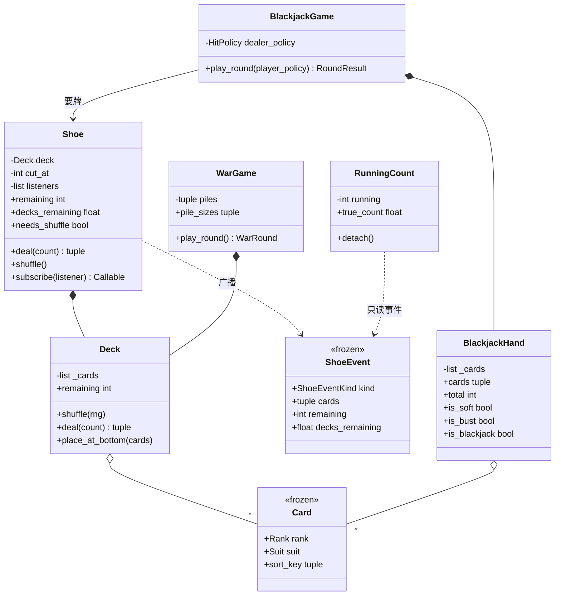

# 设计题解：扑克牌与二十一点（Deck of Cards / Blackjack）

## 题目与澄清

面试官的开场一般是两句话："设计一副扑克牌。然后在上面实现二十一点（Blackjack）。"

这两句话之间的那个"然后"，就是整道题的考点。它不是一道游戏题，是一道**抽象题**：考的是你
能不能画出一条正确的分界线——线的这一侧是"扑克牌这个东西本身"（52 张牌、花色、点数、一摞
牌、洗、发），线的那一侧是"某个游戏怎么用它"（A 算几分、什么叫爆牌、庄家什么时候停牌）。
线画错了，第二个游戏就再也接不上去；而面试官几乎一定会加第二个游戏。

这道题最典型的失分不是写不出来，而是**把游戏规则写到了 `Card` 上**——给 `Card` 加一个
`value` 属性，或者干脆写一个 `BlackJackCard(Card)` 子类。它看起来很"面向对象"，实际上把
一副通用的扑克牌变成了一副只能打 21 点的牌。下面第一条设计决策整条都在讲这件事，因为它
是这道题的全部。

值得当场问出来的澄清问题：

- **只要一副 52 张，还是要小丑牌（Joker）？要几副？** 答案不同，`Deck` 的构造方式就不同：
  一副固定的 52 张可以写死，"几副牌摞在一起、可能带小丑"必须把"这副牌由哪些牌组成"做成
  参数。赌场的 21 点用 6 到 8 副，这个追问几乎必来。
- **除了 21 点，还会有别的游戏吗？** 如果回答"以后可能加"，那就别等以后——当场就写第二个
  （战争、拱猪、斗地主都行）。**一个抽象只有在被用过两次之后才算被验证过**，只有一个用户
  的抽象和没有抽象没区别。
- **牌要能排序吗？按什么排？** 这个问题会直接暴露上面那条分界线：牌面的自然顺序是
  A、2、…、K，但在战争里 A 最大，在斗地主里 2 比 A 大。**同一张牌，不同游戏有不同的序**，
  所以"序"不可能是 `Card` 的属性。
- **发牌发完了怎么办？** 空牌堆继续发牌是必须被命名的失败路径：抛一个有名字的异常，不是
  返回 `None` 让调用方去猜。顺带问一句"要不要一次发多张"——那会牵出"发不够时是少发还是
  全不发"的原子性问题。
- **洗牌要可复现吗？** 要。随机源必须是**注入**的 `random.Random`，否则上面所有游戏的
  测试都只能写成"跑起来不报错"。
- **21 点要做到哪一步？** 分牌（split）、加倍（double down）、保险（insurance）、多个座位、
  下注与赔付？先确认核心（要牌、停牌、爆牌、黑杰克、庄家固定策略），再问哪些是加分项。
- **要不要算牌？** 如果要，它是一个**观察者**而不是牌鞋的一个字段——牌鞋不该知道有人在算它。

**范围之外**：不做界面与网络、不做下注与筹码结算（但会说清楚结果对象里该有什么，让下注
模块能接上）、不做洗牌算法本身的研究（`random.shuffle` 是 Fisher–Yates，够用；真要做赌场
级的洗牌，那是密码学随机数的问题，不是设计问题）。

## 需求与分级

- **第 1 关（通用牌组，约 15 分钟）**：`Rank`、`Suit`、`Card` 三个不可变值——可哈希（能进
  集合和字典）、可排序、`__repr__` 打出来是 `A♠` 这种人能一眼读懂的东西；`Deck` 能洗（随机源
  注入）、能发、能报还剩几张，**而且永远不把内部那份牌列表交出去**；空牌堆发牌有名字。
  对应 `Card`、`Deck`、`build_deck` 和 `OutOfCardsError`。
- **第 2 关（在牌组之上做游戏，约 15 分钟）**：21 点——A 算 11 或 1、爆牌、黑杰克、庄家固定
  策略；关键约束是 **`Deck` 一个字都不许知道 21 点**。然后再做第二个游戏（战争）共用同一副
  牌，证明抽象真的成立。对应 `BLACKJACK_VALUES`、`BlackjackHand`、`BlackjackGame`、
  `HitPolicy`、`war_order`、`WarGame`。
- **第 3 关（牌鞋、切牌与算牌，约 10 分钟）**：几副牌摞进一只牌鞋，插一张切牌（cut card），
  切到就该重洗；算牌是一个**观察者**，只订阅"发了哪几张"。对应 `Shoe`、`ShoeEvent`、
  `RunningCount`。
- **第 4 关（换牌堆的组成，约 5 分钟）**：加小丑牌，或者加第五门花色。验收标准：**游戏代码
  一行都不改**。对应 `build_deck` 的 `ranks` / `suits` / `jokers` 参数——扩展点在"这副牌由
  哪些牌组成"，不在枚举，更不在游戏。

## 核心对象与职责

- **`Suit` / `Rank`**（枚举）：花色与点数，封闭集合。`Rank.order` 是**印在牌上的自然顺序**
  （A 排第一），不是任何一个游戏里的大小或分值——这个字段的命名本身就是在划那条线。
- **`Card`**（不可变值对象）：`rank` + `suit`，此外什么都没有。这是
  [[python.dataclasses-enums|dataclass 与 Enum]] 最标准的一次落地：有限状态用 `Enum`，
  纯数据用 `frozen=True, slots=True` 的 dataclass。`frozen=True` 让它可哈希、
  能安全地做字典键；`__lt__` 给的是牌面的自然序；`__repr__` 是 `A♠`。它**不知道**自己在
  21 点里值几分。
- **`Deck`**（实体）：一摞牌。它拥有的不变量只有一条：**牌只能通过 `deal` 离开、通过
  `place_at_bottom` 回来**。所以它没有 `cards` 属性，只有 `remaining`。
- **`Shoe`**（实体）：把若干副牌摞在一起，管切牌标记，并向订阅者广播事件。它不知道 21 点，
  也不知道有人在算牌。
- **`ShoeEvent`**（不可变值）：发生了什么——发了哪几张、还剩多少张、还剩几副。订阅者从事件
  本身更新自己，**不回头去读牌鞋的内部状态**。
- **`RunningCount`**（观察者）：算牌器。去掉它，牌鞋的行为一模一样。
- **`BLACKJACK_VALUES` / `BlackjackHand` / `BlackjackGame`**：21 点的全部知识都在这里。
  `BlackjackHand` 拥有"这手牌值几点"这条规则；`BlackjackGame` 拥有一局的流程与结算顺序。
- **`HitPolicy`**（`Callable[[BlackjackHand], bool]`）：要不要再来一张。庄家和玩家共用这个
  类型，换策略就是换一个函数。
- **`war_order` / `WarGame`**：第二个游戏。它用的 `Card` 和 `Deck` 与 21 点完全相同，一行
  都没有为它改过；它对 A 的排序和 21 点、和 `Card.__lt__` 都不一样——这正是要证明的事。

关系上：`Shoe` **组合**了一个 `Deck`（洗牌时整个换掉）；`BlackjackGame` **关联**一只
`Shoe`（牌鞋比一局牌活得久，可以喂给好几局）；`BlackjackHand` 组合了它的牌。`Card` 是值
对象，被到处共享、不需要身份——两张同样的 `A♠` 就是同一张牌，这也是为什么六副牌的牌鞋里
有六个相等的 `A♠` 毫无问题。



## 关键设计决策

### 一、游戏规则放在哪？——`Card` 上一条都不许有

这是这道题的全部。先看最流行的写法（它真的出现在被引用最多的那份 Python 题解里）：

```python
class Card(metaclass=ABCMeta):
    def __init__(self, value, suit): ...
    @property
    @abstractmethod
    def value(self): ...

class BlackJackCard(Card):
    @property
    def value(self):
        return 1 if self.is_ace() else (10 if self.is_face_card() else self._value)
```

看上去很"面向对象"：抽象基类 + 具体子类。问题是它把一副通用的扑克牌变成了一副只能打
21 点的牌，而且是不可逆的：

- **第二个游戏来了怎么办？** 战争里 A 最大，21 点里 A 是 1 或 11。是再写一个
  `WarCard(Card)` 吗？那么牌鞋里到底装的是哪一种卡？同一张实体的牌在两个游戏里要变成两个
  对象，`Deck` 就得知道自己是为哪个游戏服务的——抽象当场死亡。
- **`value` 这个名字本身就是错的。** 21 点里 A 的"值"根本不是一个数，是 1 或 11 两个候选；
  一个返回 `int` 的属性无论返回哪个都是错的，所以上面那份代码不得不再写一个
  `possible_scores()` 去枚举所有组合。**当一个属性必须被另一个方法纠正时，这个属性就不该
  存在。**
- **它还泄漏了可变性。** 那份代码给 `value` 配了 setter，于是一张牌的点数可以被改——扑克牌
  是世界上最典型的不可变值对象，给它开 setter 是设计事故。

正确的分界线是：**`Card` 是一个值，值不带规则；规则是游戏的一张表。**

```python
@dataclass(frozen=True, slots=True)
class Card:
    rank: Rank
    suit: Suit

BLACKJACK_VALUES: Mapping[Rank, int] = MappingProxyType({Rank.ACE: 1, ..., Rank.KING: 10})

def war_order(card: Card) -> int:
    return 14 if card.rank is Rank.ACE else card.rank.order
```

一句话的检验标准：**如果一个属性的正确值取决于"现在在玩哪个游戏"，它就不属于 `Card`。**
花色、点数、"印在牌面上的顺序"通过这个检验；"值几分""大不大""是不是王牌"全部不通过。

这条线还顺手决定了别的：`Card` 可以 `frozen=True`，于是可哈希、能进 `set`、能当字典键
（算牌表就是 `Mapping[Rank, int]`）；六副牌的牌鞋里有六个相等的 `A♠` 完全没问题，因为值
对象不需要身份。把 `is_available` 这种状态挂到 `Card` 上（那份流行题解也这么做了）会立刻
毁掉这一切——一张牌"有没有被发出去"是**牌堆**的状态，不是牌的状态。

### 二、`Deck` 要不要交出它的牌？

第二个最常见的失分点，写出来只有一行：

```python
class Deck:
    @property
    def cards(self):
        return self._cards          # 或者 get_cards()，一样
```

交出这份列表，等于同时交出了三样权力：调用方可以自己 `shuffle`（绕过你的随机源，测试全废）、
可以偷看下一张（21 点的牌鞋被偷看就不是牌鞋了）、可以 `append` 或 `remove`（凭空造牌）。
`Deck` 于是退化成"一个带几个方法的 list"，它承诺的任何不变量都不再成立。

本设计里 `Deck` 对外只说三件事：还剩几张（`remaining`）、发给你这几张（`deal`）、这些牌放回
底部（`place_at_bottom`）。想知道牌堆里有什么？**把它发出来**——这正是真实牌堆的语义。

```python
def deal(self, count: int = 1) -> tuple[Card, ...]:
    if count > len(self._cards):
        raise OutOfCardsError(f"牌堆只剩 {len(self._cards)} 张，发不出 {count} 张")
    dealt = tuple(reversed(self._cards[-count:]))
    del self._cards[-count:]
    return dealt
```

两个细节值得说出口。**其一，发牌是原子的**：要 5 张只剩 3 张时，抛异常并且**一张都不发**，
而不是发 3 张让调用方去发现少了。半成功是最难排查的一类 bug。**其二，牌堆顶在列表末尾**：
`list.pop()` 从末尾是 O(1)，`pop(0)` 从头是 O(n)（要把后面所有元素挪一格）。一副 52 张牌
上这点差别看不出来，但这是面试官问"复杂度呢"时你该给出的答案；真要两头都频繁操作，
`collections.deque` 才是正确的数据结构。至于手牌（`BlackjackHand.cards`）为什么可以交出去
——因为手牌对它的持有者本来就是公开信息；但交出去的**仍然是元组快照**，不是内部那份列表。

顺带：`shuffle(rng)` 的随机源是**必填参数**，没有默认值。一个默认用全局 `random` 的
`shuffle()` 会让所有下游测试悄悄失去可复现性，而这种"默认值带来的不确定性"几乎不会有人在
代码审查里发现。把它做成必填，调用方就不得不在构造现场想一想随机从哪来。

### 三、A 算 11 还是 1：枚举所有可能，还是一次加法？

被引用最多的那份题解是这么算的：把每张 A 当作 1 或 11，枚举出所有组合的分数，再从里面挑
"不超过 21 的最大值"。写成代码就是一个递归或者笛卡尔积，`n` 张 A 就是 2ⁿ 个分数。

```python
# 选项 A：枚举所有可能的分数（流行写法）
def possible_scores(cards):
    totals = [0]
    for c in cards:
        vals = (1, 11) if c.rank is Rank.ACE else (BLACKJACK_VALUES[c.rank],)
        totals = [t + v for t in totals for v in vals]
    return totals
```

```python
# 选项 B：一次加法（本设计）
hard = sum(BLACKJACK_VALUES[c.rank] for c in self._cards)   # A 一律按 1
if self._has_ace and hard + 10 <= 21:
    return hard + 10                                        # 让其中一张 A 当 11
return hard
```

**选 B**，理由不是"更快"，而是**它对应一条能说清楚的事实**：两张 A 当 11 就是 22，已经爆了
——所以**最多只有一张 A 能算 11**。既然如此，"要不要加 10"就是一个布尔判断，不需要搜索。
选项 A 用一个 2ⁿ 的枚举去求解一个其实只有两种情况的问题，是典型的"没想清楚就先上算法"。

这也是这道题里**该拒绝复杂解**的地方。面试里主动说出"两张 A 当 11 必爆，所以最多一张 A
算 11，加不加 10 判一次就够了"，比写对一个回溯值钱得多。顺带一提，选项 B 还白送了
`is_soft`（那个 10 有没有被加上）——而软 17 要不要继续要牌，恰好是庄家策略的分水岭；选项 A
要多写一遍逻辑才能知道这件事。

还有两个细节容易写错：**黑杰克必须恰好两张牌**（三张 7 是 21，但不是黑杰克，赔率不同），
所以判断里有 `len(self._cards) == 2`；**结算顺序**是先判黑杰克、再判爆牌、最后才比点数，
顺序错了会把"双方都黑杰克"算成普通的平局甚至玩家胜。

庄家策略是一个函数而不是一个类：`HitPolicy = Callable[[BlackjackHand], bool]`。
`stand_on_17` 和 `hit_soft_17` 两行一个，玩家策略共用同一个类型。一个只有一个方法、没有
共享实现的接口，在 Python 里的载体就是函数类型——为它写抽象基类只是把 Java 的写法搬过来。

### 四、算牌是一个观察者，不是牌鞋的一个字段

第 3 关要算牌。最省事的写法是在 `Shoe` 里加一个 `self._running_count`，`deal` 的时候顺手
加减。别这么做，理由有三条：牌鞋在赌场里**不知道**有人在算它（模型该反映这一点）；算牌
体系不止一种（Hi-Lo、KO、Omega II），把其中一种焊进牌鞋等于宣布只支持这一种；不算牌的场合
（斗地主用不到牌鞋，但可能用到多副牌）要为这个字段付代价。

本设计里 `Shoe` 只做一件额外的事：把发生的事**广播出去**。

```python
@dataclass(frozen=True, slots=True)
class ShoeEvent:
    kind: ShoeEventKind
    cards: tuple[Card, ...]
    remaining: int
    decks_remaining: float
```

注意事件里带着 `cards`、`remaining`、`decks_remaining` **三样数据**，而不是只有一个"发牌了"
的通知。这很关键：如果事件只说"有事发生了"，订阅者就必须回头去读 `shoe.remaining`——那是
一次对主体内部状态的反向依赖，并发时还会读到不一致的中间状态。**事件应该自带发生了什么，
订阅者从事件本身更新自己。**

`RunningCount` 于是完全是被动的：`SHUFFLED` 事件让它把计数归零（这条最容易忘——洗牌之后
还在用旧计数，是算牌代码最经典的 bug），`DEALT` 事件让它按 Hi-Lo 表加减。它算真数时用的
`decks_remaining` 也来自事件。`subscribe` 返回一个取消订阅的闭包，所以监听器表不会只进
不出——**任何一个会增长的容器，都要答得出"什么条件下条目被移除"**。

最后一个细节：切牌标记到了，`needs_shuffle` 变成 `True`，但牌鞋**不会自动洗**。因为一局
牌必须打完才能洗，中途换牌是荒谬的。"什么时候洗"是调用方的决定，牌鞋只负责说"该洗了"。

### 五、枚举是封闭的，所以扩展点不在枚举上

第 4 关要加小丑牌或者第五门花色。这里有一个 Python 特有的坑：**`Enum` 一旦定义就不能扩展**，
`class MoreSuits(Suit)` 在有成员的枚举上会直接报错。所以如果你的造牌代码是这样：

```python
cards = [Card(r, s) for s in Suit for r in Rank]     # 遍历整个枚举
```

那么"这副牌由哪些牌组成"就被钉死在类型定义上了，加一门花色只能改枚举、改完全部下游都跟着
变（`for s in Suit` 的地方全部多出一门）。

本设计把造牌写成遍历**显式传进来的清单**：

```python
STANDARD_SUITS = (Suit.CLUBS, Suit.DIAMONDS, Suit.HEARTS, Suit.SPADES)

def build_deck(copies=1, *, ranks=STANDARD_RANKS, suits=STANDARD_SUITS, jokers=0) -> tuple[Card, ...]:
    ...
```

枚举里可以预留 `Suit.STARS` 和 `Rank.JOKER`，但标准牌堆不包含它们。加第五门花色是
`build_deck(suits=(*Suit,))`，加小丑是 `build_deck(jokers=2)`——**游戏代码一行不改**。
五门花色的牌鞋直接能打 21 点，因为 21 点只读点数、根本不看花色。

这里有一个刻意的折中，说在明处比让人自己发现好：**两张小丑牌被写成
`Card(Rank.JOKER, Suit.SPADES)` 和 `Card(Rank.JOKER, Suit.HEARTS)`**。小丑本来是没有花色的，
借用黑桃和红桃纯粹是为了给"黑小丑"和"红小丑"两张牌各自一个能区分、能相等、能哈希的身份
——否则两张小丑会是同一个值，一副牌里放两张就只剩一张。代价是"小丑的花色"这个字段在语义上
是假的；如果一个游戏真的要区分红黑小丑之外的东西，正确的做法是给 `Suit` 补一个
`Suit.NONE` 再配一个区分红黑的字段，而不是继续借花色。在这道题的尺度上，借用是够用的，
而**知道自己借了什么、代价是什么**，比假装它没有问题更重要。

那小丑牌呢？`BLACKJACK_VALUES` 里没有 `Rank.JOKER`，于是 `BlackjackHand.add` 抛
`UnsupportedCardError`。**这是对的**，而且是这条决策里最值得说出口的一句：一个游戏遇到它
不认识的牌，应该**大声报错**，而不是 `values.get(rank, 0)` 悄悄按 0 分算——后者会让一整局
牌以一个谁都没注意到的错误分数结束。要支持小丑，就往这个游戏自己的取值表里加一条，那是
一行数据，不是一次改动。

## 代码走读

下面是完整的、被测试覆盖的参考实现。读的时候盯住四处：`Card` 上什么都没有（第一条决策）、
`Deck` 上没有 `cards` 属性（第二条决策）、`BlackjackHand.total` 只有四行（第三条决策）、
`RunningCount._on_event` 只读事件（第四条决策）。

%% code:begin solution.py %%
```python
"""扑克牌与二十一点（Deck of Cards / Blackjack）——通用牌组抽象，游戏规则长在游戏那一侧。

核心思路：`Card` 是不可变值对象（可哈希、可排序、`__repr__` 人能读），身上**没有任何游戏
规则**——同一张 A 在 21 点里算 11 或 1、在战争（War）里最大、在别的玩法里又是别的，一个属性
不可能同时正确，所以取值是游戏自己的一张表。`Deck` 只暴露"还剩几张"和"发牌"，内部那份牌列表
永远不交出去；洗牌的随机源必须注入。`Shoe` 把若干副牌摞在一起并管切牌标记，它只向订阅者
**推事件**、不知道有人在算牌；`RunningCount` 完全靠事件更新自己。加小丑牌或者第五门花色改的
是牌堆的**组成**（显式的花色／点数清单），不是枚举也不是游戏。
"""

from __future__ import annotations

import random
from collections.abc import Callable, Iterable, Mapping, Sequence
from dataclasses import dataclass
from enum import Enum
from types import MappingProxyType

# --------------------------------------------------------------------------
# 失败路径


class CardGameError(Exception):
    """本设计里所有失败路径的公共基类。"""


class OutOfCardsError(CardGameError):
    """牌不够发了——空牌堆继续发牌是这道题必须点名的失败路径。"""


class UnsupportedCardError(CardGameError):
    """这个游戏不认识这张牌（比如 21 点遇到小丑牌）：大声报错，而不是悄悄按 0 分算。"""


class GameStateError(CardGameError):
    """在不该调用的时候调用了（比如一局还没发牌就结算）。"""


# --------------------------------------------------------------------------
# 牌：不可变值对象，身上不带任何游戏规则


class Suit(Enum):
    """花色。`STARS` 是第 4 关的第五门花色，标准 52 张牌里不含它。"""

    CLUBS = ("♣", 0)
    DIAMONDS = ("♦", 1)
    HEARTS = ("♥", 2)
    SPADES = ("♠", 3)
    STARS = ("★", 4)

    def __init__(self, symbol: str, order: int) -> None:
        self.symbol = symbol
        self.order = order


class Rank(Enum):
    """点数。`order` 是**印在牌上的自然顺序**（A 排第一），不是任何一个游戏里的大小或分值。"""

    ACE = ("A", 1)
    TWO = ("2", 2)
    THREE = ("3", 3)
    FOUR = ("4", 4)
    FIVE = ("5", 5)
    SIX = ("6", 6)
    SEVEN = ("7", 7)
    EIGHT = ("8", 8)
    NINE = ("9", 9)
    TEN = ("10", 10)
    JACK = ("J", 11)
    QUEEN = ("Q", 12)
    KING = ("K", 13)
    JOKER = ("Jk", 0)

    def __init__(self, label: str, order: int) -> None:
        self.label = label
        self.order = order


@dataclass(frozen=True, slots=True)
class Card:
    """一张牌：不可变、可哈希（能进 `set` 和字典）、可排序、`__repr__` 一眼能读懂。

    它**不知道**自己在 21 点里值几分、在战争里大不大——那些是游戏的知识。
    """

    rank: Rank
    suit: Suit

    @property
    def sort_key(self) -> tuple[int, int]:
        """默认的排序依据：按牌面的自然顺序，同点数再按花色。"""
        return (self.rank.order, self.suit.order)

    def __lt__(self, other: Card) -> bool:
        if not isinstance(other, Card):
            return NotImplemented
        return self.sort_key < other.sort_key

    def __repr__(self) -> str:
        return f"{self.rank.label}{self.suit.symbol}"


STANDARD_RANKS: tuple[Rank, ...] = tuple(r for r in Rank if r is not Rank.JOKER)
STANDARD_SUITS: tuple[Suit, ...] = (Suit.CLUBS, Suit.DIAMONDS, Suit.HEARTS, Suit.SPADES)


def build_deck(
    copies: int = 1,
    *,
    ranks: Sequence[Rank] = STANDARD_RANKS,
    suits: Sequence[Suit] = STANDARD_SUITS,
    jokers: int = 0,
) -> tuple[Card, ...]:
    """按给定的点数／花色清单造牌。

    注意它遍历的是**显式传进来的清单**而不是 `for s in Suit`：枚举是封闭集合，而"这副牌由
    哪些牌组成"是开放的。第 4 关加小丑牌或第五门花色，改的正是这两个参数。
    """
    if copies < 1:
        raise CardGameError(f"至少要一副牌，给的是 {copies}")
    if not 0 <= jokers <= 2:
        raise CardGameError(f"每副牌最多两张小丑牌，给的是 {jokers}")
    cards: list[Card] = []
    for _ in range(copies):
        cards.extend(Card(rank, suit) for suit in suits for rank in ranks)
        cards.extend(Card(Rank.JOKER, s) for s in (Suit.SPADES, Suit.HEARTS)[:jokers])
    return tuple(cards)


# --------------------------------------------------------------------------
# 牌堆：只说"还剩几张"，永远不把牌列表交出去


class Deck:
    """一摞牌，顶在列表末尾。

    它拥有的不变量只有一条：**牌只能通过 `deal` 离开、通过 `place_at_bottom` 回来**。
    所以这里没有 `cards` 属性，也没有 `get_cards()`——交出内部列表等于交出洗牌、偷看、
    删牌的权力，`Deck` 就不再是牌堆，只是一个带方法的 list。
    """

    def __init__(self, cards: Iterable[Card] = ()) -> None:
        self._cards: list[Card] = list(cards)

    @property
    def remaining(self) -> int:
        """还剩几张。这是外界能知道的关于牌堆内容的**全部**。"""
        return len(self._cards)

    def __len__(self) -> int:
        return len(self._cards)

    def shuffle(self, rng: random.Random) -> None:
        """洗牌。随机源是**必填参数**：一个默认用全局 `random` 的洗牌方法，会让所有下游测试失去可复现性。"""
        rng.shuffle(self._cards)

    def deal(self, count: int = 1) -> tuple[Card, ...]:
        """从顶上发 `count` 张，按发牌顺序返回。牌不够就抛 `OutOfCardsError`，绝不少发。"""
        if count < 1:
            raise CardGameError(f"一次至少发一张，给的是 {count}")
        if count > len(self._cards):
            raise OutOfCardsError(f"牌堆只剩 {len(self._cards)} 张，发不出 {count} 张")
        dealt = tuple(reversed(self._cards[-count:]))
        del self._cards[-count:]
        return dealt

    def deal_one(self) -> Card:
        """发一张。"""
        return self.deal(1)[0]

    def place_at_bottom(self, cards: Iterable[Card]) -> None:
        """把牌放回底部——战争、斗地主这类"赢来的牌压到底下"的玩法需要它。"""
        self._cards[:0] = list(cards)


# --------------------------------------------------------------------------
# 牌鞋：若干副牌 + 切牌标记 + 事件


class ShoeEventKind(Enum):
    """牌鞋发生的两件事。"""

    DEALT = "dealt"
    SHUFFLED = "shuffled"


@dataclass(frozen=True, slots=True)
class ShoeEvent:
    """牌鞋推给订阅者的事件：**事件自带发生了什么**，订阅者不需要回头去问牌鞋。"""

    kind: ShoeEventKind
    cards: tuple[Card, ...]
    remaining: int
    decks_remaining: float


class Shoe:
    """赌场里的牌鞋：几副牌摞在一起，插一张切牌（cut card），切到就该重洗。

    它不知道 21 点，也不知道有人在算牌；它只管发牌和在恰当的时候说"该洗了"。
    """

    def __init__(
        self,
        decks: int = 6,
        *,
        rng: random.Random,
        penetration: float = 0.75,
        builder: Callable[[], tuple[Card, ...]] = build_deck,
    ) -> None:
        if decks < 1:
            raise CardGameError(f"牌鞋里至少要一副牌，给的是 {decks}")
        if not 0 < penetration < 1:
            raise CardGameError(f"穿透率要在 0 和 1 之间，给的是 {penetration}")
        self._decks = decks
        self._rng = rng
        self._builder = builder
        self._cards_per_deck = len(builder())
        self._cut_at = round(self._cards_per_deck * decks * (1 - penetration))
        self._listeners: list[Callable[[ShoeEvent], None]] = []
        self._deck = Deck()
        self.shuffle()

    @property
    def remaining(self) -> int:
        """还剩几张。"""
        return self._deck.remaining

    @property
    def decks_remaining(self) -> float:
        """还剩几副——算牌把跑动计数换算成真数（true count）时要用它。"""
        return self._deck.remaining / self._cards_per_deck

    @property
    def needs_shuffle(self) -> bool:
        """切牌标记到了没有。到了也**不会自动洗**：一局牌要打完再洗，洗牌是调用方的决定。"""
        return self._deck.remaining <= self._cut_at

    def shuffle(self) -> None:
        """重新装满并洗牌，然后广播一个 SHUFFLED 事件——算牌器靠它把计数归零。"""
        self._deck = Deck(card for _ in range(self._decks) for card in self._builder())
        self._deck.shuffle(self._rng)
        self._emit(ShoeEventKind.SHUFFLED, ())

    def deal(self, count: int = 1) -> tuple[Card, ...]:
        """发牌并广播 DEALT 事件。"""
        cards = self._deck.deal(count)
        self._emit(ShoeEventKind.DEALT, cards)
        return cards

    def subscribe(self, listener: Callable[[ShoeEvent], None]) -> Callable[[], None]:
        """订阅事件，返回取消订阅的函数——监听器表因此不会只进不出。"""
        self._listeners.append(listener)

        def unsubscribe() -> None:
            if listener in self._listeners:
                self._listeners.remove(listener)

        return unsubscribe

    def _emit(self, kind: ShoeEventKind, cards: tuple[Card, ...]) -> None:
        event = ShoeEvent(kind, cards, self._deck.remaining, self.decks_remaining)
        for listener in tuple(self._listeners):
            listener(event)


HI_LO: Mapping[Rank, int] = MappingProxyType(
    {
        Rank.TWO: 1, Rank.THREE: 1, Rank.FOUR: 1, Rank.FIVE: 1, Rank.SIX: 1,
        Rank.SEVEN: 0, Rank.EIGHT: 0, Rank.NINE: 0,
        Rank.TEN: -1, Rank.JACK: -1, Rank.QUEEN: -1, Rank.KING: -1, Rank.ACE: -1,
    }
)


class RunningCount:
    """算牌器：一个纯粹的观察者。牌鞋完全不知道它存在，去掉它牌鞋的行为一模一样。

    它只从事件里取数据——发了哪几张、还剩几副——从不反过来读牌鞋的内部状态。
    """

    def __init__(self, shoe: Shoe, counts: Mapping[Rank, int] = HI_LO) -> None:
        self._counts = counts
        self._running = 0
        self._decks_remaining = shoe.decks_remaining
        self._detach = shoe.subscribe(self._on_event)

    @property
    def running(self) -> int:
        """跑动计数（running count）：小牌 +1、大牌 -1 的累计。"""
        return self._running

    @property
    def true_count(self) -> float:
        """真数（true count）＝跑动计数 ÷ 剩余副数。剩不到四分之一副时不再有意义，返回跑动计数本身。"""
        return self._running / self._decks_remaining if self._decks_remaining >= 0.25 else float(self._running)

    def detach(self) -> None:
        """不再算了。"""
        self._detach()

    def _on_event(self, event: ShoeEvent) -> None:
        if event.kind is ShoeEventKind.SHUFFLED:
            self._running = 0
        else:
            self._running += sum(self._counts.get(c.rank, 0) for c in event.cards)
        self._decks_remaining = event.decks_remaining


# --------------------------------------------------------------------------
# 游戏一：二十一点。规则全在这一段，上面那些类一个字都不知道 21 点

BLACKJACK_VALUES: Mapping[Rank, int] = MappingProxyType(
    {
        Rank.ACE: 1, Rank.TWO: 2, Rank.THREE: 3, Rank.FOUR: 4, Rank.FIVE: 5,
        Rank.SIX: 6, Rank.SEVEN: 7, Rank.EIGHT: 8, Rank.NINE: 9, Rank.TEN: 10,
        Rank.JACK: 10, Rank.QUEEN: 10, Rank.KING: 10,
    }
)


class Outcome(Enum):
    """一局 21 点的四种结局。"""

    PLAYER_BLACKJACK = "player_blackjack"
    PLAYER_WIN = "player_win"
    DEALER_WIN = "dealer_win"
    PUSH = "push"


class BlackjackHand:
    """一手 21 点的牌。它拥有"这手牌值几点"这条规则，而 `Card` 不拥有。"""

    def __init__(self, cards: Iterable[Card] = ()) -> None:
        self._cards: list[Card] = []
        self.add(*cards)

    @property
    def cards(self) -> tuple[Card, ...]:
        """手牌快照。手牌对持有者是公开信息，和牌堆不同——但交出去的仍然是快照。"""
        return tuple(self._cards)

    def __len__(self) -> int:
        return len(self._cards)

    def add(self, *cards: Card) -> None:
        """要牌。遇到取值表里没有的牌（小丑牌）当场抛错，而不是按 0 分算。"""
        for card in cards:
            if card.rank not in BLACKJACK_VALUES:
                raise UnsupportedCardError(f"21 点不认识 {card!r}；要支持它，往取值表里加一条")
            self._cards.append(card)

    @property
    def total(self) -> int:
        """点数。A 先按 1 算，若有 A 且再加 10 不爆，就让**其中一张** A 当 11。"""
        hard = sum(BLACKJACK_VALUES[c.rank] for c in self._cards)
        if self._has_ace and hard + 10 <= 21:
            return hard + 10
        return hard

    @property
    def is_soft(self) -> bool:
        """软牌：有一张 A 正被当成 11。软 17 该不该继续要牌，是庄家策略的分水岭。"""
        hard = sum(BLACKJACK_VALUES[c.rank] for c in self._cards)
        return self._has_ace and hard + 10 <= 21

    @property
    def is_bust(self) -> bool:
        """爆牌。"""
        return self.total > 21

    @property
    def is_blackjack(self) -> bool:
        """黑杰克：**恰好两张**牌凑成 21；三张 7 是 21 但不是黑杰克。"""
        return len(self._cards) == 2 and self.total == 21

    @property
    def _has_ace(self) -> bool:
        return any(c.rank is Rank.ACE for c in self._cards)

    def __repr__(self) -> str:
        return f"BlackjackHand({' '.join(repr(c) for c in self._cards)}={self.total})"


HitPolicy = Callable[[BlackjackHand], bool]


def stand_on_17(hand: BlackjackHand) -> bool:
    """庄家标准策略：17 点及以上停牌。"""
    return hand.total < 17


def hit_soft_17(hand: BlackjackHand) -> bool:
    """庄家另一种常见策略：软 17 还要一张。换策略只是换一个函数。"""
    return hand.total < 17 or (hand.total == 17 and hand.is_soft)


def stand_on(threshold: int) -> HitPolicy:
    """玩家策略工厂：到 `threshold` 点就停。"""
    return lambda hand: hand.total < threshold


@dataclass(frozen=True, slots=True)
class RoundResult:
    """一局 21 点的结果，纯数据——渲染、统计、下注模块都从它取数。"""

    player: tuple[Card, ...]
    dealer: tuple[Card, ...]
    player_total: int
    dealer_total: int
    outcome: Outcome


class BlackjackGame:
    """21 点。它从牌鞋里要牌，但对牌鞋里是几副、有没有小丑牌、花色有几门一无所知。"""

    def __init__(self, shoe: Shoe, *, dealer_policy: HitPolicy = stand_on_17) -> None:
        self._shoe = shoe
        self._dealer_policy = dealer_policy

    def play_round(self, player_policy: HitPolicy = stand_on_17) -> RoundResult:
        """打一局：发两张、玩家按策略要牌、庄家按策略要牌、比点数。"""
        if self._shoe.remaining < 4:
            raise GameStateError("牌鞋里的牌不够开一局了，先洗牌")
        player = BlackjackHand(self._shoe.deal(2))
        dealer = BlackjackHand(self._shoe.deal(2))
        if player.is_blackjack or dealer.is_blackjack:
            return self._settle(player, dealer)
        while player_policy(player) and not player.is_bust:
            player.add(*self._shoe.deal(1))
        if not player.is_bust:
            while self._dealer_policy(dealer) and not dealer.is_bust:
                dealer.add(*self._shoe.deal(1))
        return self._settle(player, dealer)

    def _settle(self, player: BlackjackHand, dealer: BlackjackHand) -> RoundResult:
        """结算顺序是有讲究的：先判黑杰克，再判爆牌，最后才比点数。"""
        if player.is_blackjack or dealer.is_blackjack:
            if player.is_blackjack and dealer.is_blackjack:
                outcome = Outcome.PUSH
            else:
                outcome = Outcome.PLAYER_BLACKJACK if player.is_blackjack else Outcome.DEALER_WIN
        elif player.is_bust:
            outcome = Outcome.DEALER_WIN
        elif dealer.is_bust or player.total > dealer.total:
            outcome = Outcome.PLAYER_WIN
        elif player.total < dealer.total:
            outcome = Outcome.DEALER_WIN
        else:
            outcome = Outcome.PUSH
        return RoundResult(player.cards, dealer.cards, player.total, dealer.total, outcome)


# --------------------------------------------------------------------------
# 游戏二：战争（War）。同一副 Deck，另一套规则——这才是抽象成立的证据


def war_order(card: Card) -> int:
    """战争里 A 最大。**同一张牌在两个游戏里有不同的序**，所以序不能长在 `Card` 上。"""
    return 14 if card.rank is Rank.ACE else card.rank.order


@dataclass(frozen=True, slots=True)
class WarRound:
    """一个回合：双方亮的牌、谁赢、这回合押上了多少张。"""

    revealed: tuple[Card, ...]
    winner: int | None
    pot_size: int


class WarGame:
    """战争：两人各一摞牌，同时翻开一张，大的收走；打平就各押三张暗牌再翻一张。

    它用的是和 21 点完全相同的 `Card` 和 `Deck`，一行都没有为它改过。
    """

    def __init__(self, deck: Deck) -> None:
        half = deck.remaining // 2
        if half < 1:
            raise CardGameError("牌太少，开不了局")
        self._piles = (Deck(deck.deal(half)), Deck(deck.deal(half)))

    @property
    def pile_sizes(self) -> tuple[int, int]:
        """两摞牌各剩几张。"""
        return (self._piles[0].remaining, self._piles[1].remaining)

    def play_round(self) -> WarRound:
        """打一个回合。某一方牌不够时，这回合直接判给另一方。

        每一条出口都走 `_award`：押上去的牌一定会回到某个人手里，牌不会在半路消失。
        """
        pot: list[Card] = []
        while True:
            for index, pile in enumerate(self._piles):
                if pile.remaining == 0:
                    return self._award(pot, 1 - index)
            left, right = self._piles[0].deal_one(), self._piles[1].deal_one()
            pot += [left, right]
            if war_order(left) != war_order(right):
                return self._award(pot, 0 if war_order(left) > war_order(right) else 1)
            for index, pile in enumerate(self._piles):
                if pile.remaining < 4:
                    return self._award(pot, 1 - index)
            pot += [*self._piles[0].deal(3), *self._piles[1].deal(3)]

    def _award(self, pot: list[Card], winner: int) -> WarRound:
        """把这一回合押上的牌全部压到赢家的牌堆底下——牌的总数是守恒的。"""
        self._piles[winner].place_at_bottom(sorted(pot))
        return WarRound(tuple(pot), winner, len(pot))

    def play(self, max_rounds: int = 2000) -> int | None:
        """一直打到一方收光，或者回合数耗尽（战争是会打不完的）。返回赢家下标或 `None`。"""
        for _ in range(max_rounds):
            result = self.play_round()
            if 0 in self.pile_sizes:
                return result.winner
        return None


if __name__ == "__main__":  # pragma: no cover - 演示用
    rng = random.Random(42)
    shoe = Shoe(decks=6, rng=rng)
    counter = RunningCount(shoe)
    game = BlackjackGame(shoe, dealer_policy=hit_soft_17)
    for _ in range(5):
        result = game.play_round(stand_on(17))
        print(f"玩家 {result.player}={result.player_total}  庄家 {result.dealer}={result.dealer_total}"
              f"  → {result.outcome.value}  跑动计数 {counter.running:+d}（真数 {counter.true_count:+.2f}）")
    print(f"牌鞋剩 {shoe.remaining} 张，该洗牌了吗：{shoe.needs_shuffle}")

    war_deck = Deck(build_deck())
    war_deck.shuffle(rng)
    war = WarGame(war_deck)
    print(f"战争：同一副牌、同一个 Deck，开局两摞 {war.pile_sizes}，赢家是 {war.play()}")
```
%% code:end %%

**`Rank.order` 这个名字是刻意的。** 它叫"顺序"而不是"值"，就是为了挡住"顺手用它当分数"的
冲动：`Rank.KING.order` 是 13，但 K 在 21 点里值 10、在战争里排第 13、在桥牌里做庄计点值
3 分。把它命名成 `value` 的那一刻，三个游戏就开始抢这个字段了。

**`build_deck` 遍历的是参数不是枚举。** 这一行是第 4 关的全部：`for suit in suits for rank
in ranks`。小丑牌用 `(Suit.SPADES, Suit.HEARTS)[:jokers]` 切出黑、红两张——它们是"没有花色"
的牌，借用黑桃和红桃只是为了给两张小丑一个能区分、能哈希的身份。

**`Deck.deal` 的三行里有两个设计决定。** `count > len` 先判后删，保证原子；
`self._cards[-count:]` 再 `reversed`，保证"顶上那张先发出去"。`del self._cards[-count:]`
是 O(count) 而不是 O(n)，因为切的是尾巴。

**`Shoe.shuffle` 整个换掉内部的 `Deck`，而不是把用过的牌捡回来。** 这既简单又正确：洗牌
的语义就是"全部收拢重来"。它顺手广播 `SHUFFLED`，算牌器听到就归零——注意这个顺序，先装
好牌再广播，订阅者拿到的 `remaining` 才是洗完之后的。

**`BlackjackGame.play_round` 的流程顺序是有讲究的。** 先各发两张，**立刻检查黑杰克**（黑
杰克一出现这局就定了，玩家不该再要牌）；玩家爆了之后庄家**根本不用补牌**（庄家已经赢了，
补牌只会浪费牌、并且影响算牌的人）。这两条是真实规则，也是最容易被写漏的两条。

**`WarGame` 是这份设计的验收测试。** 它用的 `Card`、`Deck`、`place_at_bottom` 没有一行是
为它写的；它对 A 的排序用自己的 `war_order`；它甚至把 `Deck` 当作玩家的牌堆用了两次。
如果第一条分界线画错了，这个类根本写不出来。

它内部那个 `_award` 值得单独说一句：`play_round` 有三条出口（分出大小、一方没牌了、一方
牌不够押），**每一条都必须把押上去的牌交给某个人**。最容易漏的是中间那两条——写成"直接
返回赢家"，押在桌上的牌就从游戏里凭空消失了，牌越打越少而且没有任何报错。所以测试里有一条
断言是"无论打多少局，两摞牌加起来永远是 52"。**任何一个把东西从容器里取出来的流程，都要
问一句：所有分支都把它放回去了吗。**

## 测试与自检

套件有 35 个用例。值得单独指出的几条：

- **"同一张牌在两个游戏里序不同"是一条测试**。`test_the_same_card_is_ordered_differently_by_a_game`
  断言 `ace < king` 同时 `war_order(ace) > war_order(king)`。这条测试的存在本身就是在钉住
  第一条设计决策——有人哪天把 `war_order` 搬到 `Card` 上，它会立刻红。
- **封装是按"公开面"整体断言的，不是按某个名字**。
  `test_the_decks_public_surface_is_exactly_its_contract` 断言牌堆的公开名字集合**恰好**是
  `{remaining, shuffle, deal, deal_one, place_at_bottom}`。注意这里断言的是一份**刻意设计的
  契约**——多出任何一个公开名字都是一条绕过封装的路；而去写 `not hasattr(deck, "cards")`
  就退化成了在挑名字，和断言私有字段是同一类毛病：换一个同样正确的内部写法就会误判。
- **"牌只能从 `deal` 出去"是按行为钉住的**。
  `test_every_card_leaves_the_deck_through_deal_exactly_once` 把一副牌一路发空，断言拿到的
  52 张不重不漏、发完就抛 `OutOfCardsError`。
- **发牌的原子性被单独钉住**。只剩 3 张时要 5 张，断言抛异常、`remaining` 仍是 3，**而且
  紧接着发这 3 张拿到的顺序完全没变**——失败的那次调用一点副作用都没有留下。
- **随机性分两种处理**。断言具体结局的用例（六个结算分支、庄家策略对比、算牌计数）一律用
  `NoShuffle` 这个什么都不洗的随机源加定死的牌序——一副牌就是一个脚本；只有统计性的用例才
  用带种子的 `random.Random`，而且断言的仍然是与种子无关的不变量：发出去的加剩下的等于
  总数、每手至少两张、黑杰克必然是两张 21 点。**没有一条断言依赖"大概会怎样"。**
- **结算顺序有参数化的六个分支**：玩家黑杰克、双方黑杰克（平）、庄家黑杰克、玩家爆、庄家
  爆、点数相同。六个分支各一行脚本，读起来就是一张真值表。
- **第 4 关有两条验收**：五门花色的 65 张牌能直接打 21 点（游戏零改动），带小丑的牌堆让
  21 点抛 `UnsupportedCardError`（大声失败）。

**两分钟怎么给面试官演示**：`python solution.py` 跑 demo，打出五局 21 点、每局的跑动计数
和真数，最后用同一份 `Deck` 开一局战争。然后当场改一行——把 `Shoe(decks=6, rng=rng)` 换成
`Shoe(decks=6, rng=rng, builder=lambda: build_deck(suits=(*Suit,)))`，五门花色的牌鞋照常
打 21 点。这一改一跑，就是"分界线画对了"最直观的证据。

## 扩展与追问

**新需求**

- **分牌（split）与加倍（double down）**：这是 21 点最常见的追问。变的是 `BlackjackGame`：
  一个玩家从"一手牌"变成"一列手牌"，每手各自结算。`Card`、`Deck`、`Shoe`、`BlackjackHand`
  都不动——`BlackjackHand` 本来就只管一手牌值几点，拆成两手只是多造一个它。
- **下注与赔付**：`RoundResult` 已经是纯数据，加一个 `bet` 字段和一张"结局 → 赔率"的表就够
  （黑杰克 3:2、普通 1:1、平局退还）。金额用 `decimal.Decimal` 或整数分，不要用 `float`。
- **多个座位**：`play_round` 收一列玩家策略，庄家仍然只有一手。发牌顺序变成"每人一张、
  庄家一张、再来一轮"——注意这会改变算牌者看到的牌序，如果有人在测这个，顺序就是可观测行为。
- **第三个游戏（斗地主、桥牌）**：斗地主要 54 张（`build_deck(jokers=2)` 已经有了）、要
  "2 比 A 大"的序（又一个 `xxx_order` 函数）、要按牌型分组（`Counter(c.rank for c in hand)`
  ——`Card` 可哈希在这里第二次派上用场）。整个 `Deck` / `Shoe` 层不动。
- **牌背与牌面朝向（庄家的暗牌）**：不要给 `Card` 加 `face_up`！那又是"游戏状态长在值上"。
  朝向是**手牌**的知识：`BlackjackHand` 记住哪几张是暗的，或者更简单，庄家的暗牌由
  `BlackjackGame` 单独持有直到揭牌。

**并发与线程安全**

单机单局不需要锁，模型里一把锁都没有，这是有意的。一只牌鞋被多张桌子共用时（赌场里不会，
但一个服务里可能），`Shoe.deal` 的"检查够不够 → 取出来"是典型的 check-then-act，必须加锁，
否则两张桌子会拿到重叠的牌。锁的粒度是**一只牌鞋一把**。GIL 帮不上忙：它只保证单条字节码
不被切开，而 `deal` 是"读长度 → 切片 → 删除"三步。`Card` 不可变，天生线程安全，可以随便
跨线程共享；`BLACKJACK_VALUES` 和 `HI_LO` 用 `MappingProxyType` 包成只读，避免有人在运行时
往里塞东西。订阅者回调是在 `deal` 的调用线程里同步跑的，所以回调里不许做慢事情——真要做，
把事件丢进队列。

**持久化与规模**

- **存一局到一半**：需要落盘的是牌鞋里剩下的牌序、各手牌、以及 `rng.getstate()`。最后一项
  同样关键——不存随机源状态，恢复出来就是另一副牌。
- **规模**：52 张牌的 `Card` 对象可以**全局共享**（值对象，不可变），六副牌的牌鞋里放的
  是同一批对象的引用，内存上只有 52 个实体。`slots=True` 让每个 `Card` 省掉一个 `__dict__`。
  真要极致，可以用 `functools.lru_cache` 或一张预建表把 `Card` 做成享元（Flyweight）——但在
  52 个对象的规模上这是过度设计，说得出这个可能性就够了。
- **审计**：`ShoeEvent` 流就是天然的审计日志，订阅一个写文件的监听器即可，牌鞋不用改。

## 常见错误

1. **把游戏规则写到 `Card` 上**——`card.value`、`BlackJackCard(Card)`、`is_face_card()`。
   这是这道题的头号失分点：它让第二个游戏无处安放。
2. **给 `Card` 开 setter 或者加可变状态**（`is_available`、`face_up`）。扑克牌是最典型的
   不可变值对象；"这张牌被发出去了"是牌堆的状态，"这张牌是暗的"是手牌的状态。
3. **`Deck.get_cards()` 把内部列表交出去**。调用方能洗、能看、能改，`Deck` 的所有承诺当场
   作废。想知道有什么牌就发出来。
4. **洗牌用全局 `random`**。下游所有游戏的测试一起失去可复现性，而且没人会在审查里发现。
5. **发牌不够时少发几张**。要 5 张给 3 张，是比抛异常糟糕得多的行为：半成功的调用最难排查。
6. **A 的点数用 2ⁿ 枚举**。两张 A 当 11 必爆，最多一张 A 能算 11——判一次加不加 10 就够了。
7. **黑杰克没判"恰好两张"**。三张 7 是 21 但不是黑杰克，赔率不一样。
8. **结算顺序错**：先比点数再判黑杰克，会把"双方黑杰克"算错；玩家爆牌之后还让庄家补牌，
   既不符合规则也污染了后面的牌序。
9. **算牌写进 `Shoe`**。牌鞋不该知道有人在算它；而且算牌体系不止一种。
10. **洗牌之后忘记把计数归零**。算牌代码最经典的 bug，所以洗牌必须是一个**事件**而不是一个
    静默动作。
11. **造牌时遍历整个枚举**（`for s in Suit`）。枚举是封闭集合，这样写就把"牌堆的组成"钉死
    在类型上了；遍历显式的清单，第 4 关才是免费的。
12. **用 `values.get(rank, 0)` 兜住不认识的牌**。小丑牌被悄悄算成 0 分，一整局的结果是错的
    而且没有任何人知道。不认识就抛异常。
13. **用字符串表示牌**（`"AS"`、`"10H"`）。省下了两个枚举，换来的是每个用到它的地方都要
    解析字符串、而且拼错了在运行时才发现。

## 45 分钟怎么分配

- **0–5 分钟，澄清**。问清楚：几副牌、要不要小丑、除了 21 点还有没有别的游戏、牌要不要排序、
  发完了怎么办、洗牌要不要可复现。**说出口的一句**："我会把'扑克牌这个东西'和'某个游戏怎么
  用它'分成两层，因为您很可能会让我再加一个游戏。"
- **5–12 分钟，第 1 关**。`Suit`、`Rank`、`Card`、`Deck`、`build_deck`。**说出口的一句**：
  "`Card` 上我不放任何游戏规则，连 `value` 都不放——A 在 21 点里是 1 或 11、在战争里最大，
  一个属性不可能同时正确。`Rank` 上这个字段我叫 `order`，是牌面顺序，不是分值。"
- **12–20 分钟，第 2 关的 21 点**。`BLACKJACK_VALUES`、`BlackjackHand.total`、结算。
  **说出口的一句**："两张 A 当 11 必爆，所以最多一张 A 能算 11，我只要判一次加不加 10，
  不需要枚举所有组合。"
- **20–26 分钟，第二个游戏**。战争，十几行。**说出口的一句**："我写它不是为了好玩，是为了
  证明 `Deck` 真的没有为 21 点定制——注意它对 A 的排序和 21 点完全不同。"
- **26–34 分钟，第 3 关**。`Shoe`、切牌、事件、`RunningCount`。**说出口的一句**："算牌是
  观察者，牌鞋不知道它存在；事件里带着发了哪几张和还剩几副，订阅者不用回头读牌鞋。"
- **34–40 分钟，第 4 关**。`build_deck(jokers=2)` 和第五门花色，当场演示游戏零改动，并说明
  小丑牌为什么该让 21 点抛异常。
- **40–45 分钟，测试与收尾**。当场补三条：空牌堆发牌抛异常、A 从 11 退回 1、结算的六个分支
  里的两个。口头列出还想补的：发牌原子性、洗牌后计数归零。

**时间不够时砍什么**：砍算牌器（但要说出它是观察者）、砍切牌标记、砍战争里的"打平再押三张"
分支（只留比大小）、砍庄家的第二种策略。**绝对不能砍**的是：`Card` 不带规则、`Deck` 不交出
牌、以及**第二个游戏**——前两个是这道题的考点，第三个是唯一能证明前两个做对了的东西。

## 来源与延伸

- <https://github.com/donnemartin/system-design-primer/tree/master/solutions/object_oriented_design/deck_of_cards>
  —— 被引用最多的那份 Python 实现，也是本文最主要的反面参照。它的 `Card` 是抽象基类、
  `BlackJackCard` 是子类并且带一个可写的 `value`，`Hand.cards` 是公开的可变列表，21 点的
  点数用 `possible_scores()` 枚举所有组合再挑最优。本文在四处反过来做：规则从 `Card` 移到
  游戏自己的取值表（否则第二个游戏无处安放）、`Deck` 不交出内部列表、A 的点数用"最多一张 A
  能算 11"的一次加法代替 2ⁿ 枚举、牌是 `frozen` 的值对象（没有 setter，也没有
  `is_available` 这种属于牌堆的状态）。仓库的 `LICENSE.txt` 是 CC BY 4.0。
- <https://docs.python.org/3/library/dataclasses.html> —— `Card`、`ShoeEvent`、`RoundResult`
  都是 `frozen=True, slots=True` 的 dataclass。`frozen` 自动生成 `__hash__`（前提是没有
  自定义 `__eq__`），这正是"值对象能进 `set`、能当字典键"的来源；`slots` 省掉每个实例的
  `__dict__`——六副牌 312 个引用时这不是关键，但它同时也挡住了"运行时往牌上挂一个属性"。
- <https://docs.python.org/3/library/enum.html> —— 为什么 `Suit` 和 `Rank` 是枚举而不是
  字符串，以及这个选择的代价：**有成员的枚举不能被继承**。所以扩展点必须放在"牌堆由哪些牌
  组成"（一个参数）上，而不是放在枚举上。文档里给成员带多个属性的写法（成员值是元组、
  在 `__init__` 里拆开）正是本文给 `Rank` 同时带 `label` 和 `order` 的做法。
- <https://www.educative.io/courses/grokking-the-low-level-design-interview-using-ood-principles>
  —— 付费课程里对这道题的标准处理，值得看的是它列出的需求清单（几副牌、庄家规则、多玩家、
  下注），可以用来对照自己的澄清问题问全了没有。它的类划分仍然把点数规则放在牌一侧，本文
  不同意这一点，理由见"关键设计决策"第一条。
- <https://codemia.io/object-oriented-design> —— 面向对象设计题的题库索引，用来确认这道题
  在真实面试里的出现频率与常见加码方向（多副牌、算牌、第二个游戏）。题目本身的解法很薄，
  价值在于分级与追问清单。
