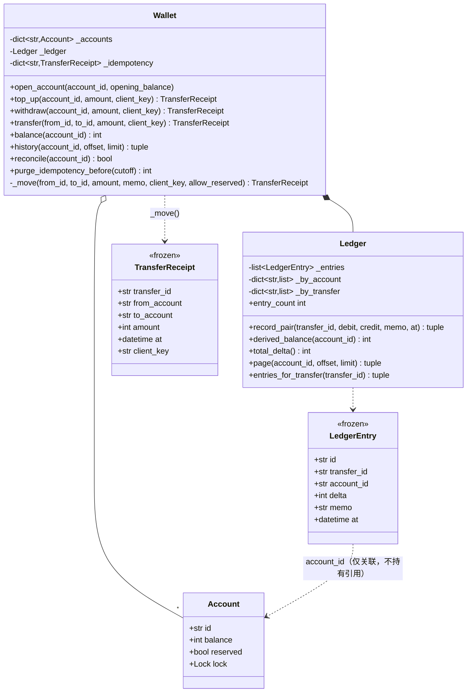

# 设计题解：数字钱包（Digital Wallet）

## 题目与澄清

面试官通常这样开场："设计一个数字钱包：用户可以充值、提现、互相转账，余额永远不能变成
负数，转账的两边必须一致——多出来一分钱或者少了一分钱都不行。" 这道题名字听起来像
支付网关，但它真正考的不是支付协议，而是**钱在系统内部怎么被记录、怎么被并发地改动**。
下面这几个问题值得当场问出来：

- **钱用什么类型表示？** 和[[solution-splitwise|分账（Splitwise）]]一样，这是必须第一个
  问、也最容易被跳过的问题。正确答案只有两种——整数最小货币单位（分、cent）或
  `decimal.Decimal`。本文选整数分：账本里每一条分录都是整数，"两条分录相加为零"是一个
  可以精确断言的等式，不是一句"误差在容忍范围内"。
- **"转账两边一致"具体是什么承诺？** 表面上听起来只是"A 减多少 B 就加多少"，但更严格的
  版本是"这笔钱在系统里的任何时刻都不会凭空出现或消失"——这正是会计里**复式记账（双
  分录，double-entry bookkeeping）**要解决的问题：每一次资金移动都拆成两条方向相反、
  金额相等的分录，账本整体永远守恒。本文从第 2 关起就按这个标准来做，充值和提现也不
  例外。
- **余额怎么查？** 这是这道题真正的设计岔路：每次查询都从账本现算，还是维护一份缓存？
  两种答案都能通过第 1 关，但对"高频查询余额"这个钱包的核心使用场景，代价完全不同，
  见"关键设计决策"。
- **会不会并发？** 两个人同时互相转账、同一个人在两台设备上同时发起转账，是钱包的日常。
  本文从一开始就把并发当成第 3 关的正式需求，尤其是**两个账户之间转账要拿两把锁，加锁
  顺序错了就是死锁**——这正是[[concurrency.hazards|死锁及其亲戚]]里讲的环形等待条件在
  一个具体系统里的样子。
- **网络重试怎么办？** 客户端超时重发同一笔转账请求，是分布式系统里最常见的故障模式。
  如果服务端把两次请求当成两笔账，用户的钱就会被转走两次。这道题因此几乎必然会追问
  "幂等（idempotency）"：同一个 `client_key` 重试多少次，钱只能动一次。

**范围之外**：不做用户注册与鉴权、不做真实的支付收单（充值只是记一笔"外部资金进入"，
不对接银行或卡组织）、不做数据库持久化（在内存里建模，换存储时哪些边界不变见"扩展与
追问"）。多币种在本文里只给落点和方案，不实现汇率换算——理由见下面"需求与分级"第 4 关
的说明。

## 需求与分级

机考不会一次把需求说完，而是分关加码，每一关都在检验上一关的设计有没有把自己将死：

- **第 1 关（核心流程，约 20 分钟）**：开户、充值、提现、转账，以及查余额。余额永远不能
  为负——不管是提现太多还是转账太多。对应 `Wallet.open_account`、`top_up`、`withdraw`、
  `transfer`、`balance`。
- **第 2 关（双分录账本，约 15 分钟）**：每一次资金移动在账本里落成两条相加为零的分录；
  账户余额是缓存还是每次现算，选一种并论证；写一个随机会话测试，断言账本全局守恒。
  对应 `LedgerEntry`、`Ledger`、`Wallet.reconcile`、`Wallet.derived_balance`。
- **第 3 关（并发，约 15 分钟）**：两个账户之间转账要同时锁住两个账户，说清楚加锁顺序
  的规则——按账户 id 这样的稳定键排序，不能按参数 `(from, to)` 的顺序，否则两个方向的
  并发转账会互相等出一个死锁。写一个测试，让两组线程同时按相反方向转账，断言不卡死、
  金额守恒。对应 `Account.lock` 和 `Wallet._move` 里那两行 `lo, hi = ...`。
- **第 4 关（选做，新需求）**：本文选的是**带分页的交易记录**——不改账本的任何一行，只是
  给已经记好的分录换一种读法；另一个常见的第 4 关是多币种，本文放在"扩展与追问"里讨论
  为什么它做不到"不碰账本"。**幂等**不算在"选做"里，是第 4 关必须有的硬需求：同一个
  `client_key` 的重试绝不能把钱移动两次，且必须有测试证明。对应 `Wallet.history`、
  `Wallet.history_count`、`Wallet._idempotency`、`IdempotencyConflictError`。

## 核心对象与职责

- **`Account`** — 一个账户：**缓存**余额，加一把保护它自己的独立锁。它的不变式是"余额
  只在持有这把锁期间改动"；它不知道账本的存在，也不知道自己的余额是不是"标准答案"——
  那是 `Wallet.reconcile` 的职责。
- **`LedgerEntry`** — 一条记账分录：某个账户在某次移动里变化了多少，用**带符号的整数**
  `delta` 表达方向。不可变（`frozen=True`），因为已经落账的历史不该被后来的操作改写。
- **`Ledger`** — "钱从哪笔移动来"的唯一真源：一张只增不减的分录表，每次移动追加恰好两条
  `delta` 相加为零的分录。它的不变式是**每次追加都成对**——这条不变式由 `record_pair`
  一处代码守住，其余所有代码都不能绕过它直接写分录。
- **`TransferReceipt`** — 一次移动（充值/提现/转账）的不可变回执，幂等重试返回的就是
  这同一个对象，调用方可以用 `==` 直接判断"这是不是同一笔"。
- **`Wallet`** — 门面（Facade）：开户、查余额、查流水、核对缓存、清理过期幂等记录的唯一
  入口。它拥有账户表、账本和幂等缓存，负责把"一次资金移动"这件事原子地落到两个账户和
  账本上。充值、提现、转账在它内部收敛成同一个私有原语 `_move`——差别只是移动的一端是
  不是保留的 `EXTERNAL` 系统账户，这一点在"关键设计决策"里详细展开。

生命周期上：`Wallet` **组合**（composition）`Ledger`——账本不会脱离 `Wallet` 单独存在，
也不对外暴露；`Wallet` 同样组合它名下的所有 `Account`（包括那个特殊的 `EXTERNAL`）。
`LedgerEntry` 只**关联**（association）账户 id（一个字符串），不持有 `Account` 对象的
引用——账本因此可以在完全不知道 `Account`/`threading.Lock` 存在的情况下被单独构造、
单独测试。



## 关键设计决策

### 余额存哪：缓存并核对，还是每次从账本现算？

问题：`balance()` 要回答"这个账户现在有多少钱"，答案存在哪里，是这道题最大的一个岔路。
两种真实存在的选项：

```python
# 选项 A：每次从账本现算（[[solution-splitwise|分账]]"选项 3"的思路搬到这里）
def balance(self, account_id: str) -> int:
    return sum(e.delta for e in self._ledger.entries_for(account_id))
```

```python
# 选项 B：账户自己缓存一份余额，账本负责核对（本文的选择）
class Account:
    balance: int   # 每次 _move 里同步更新
def reconcile(self, account_id: str) -> bool:
    derived = self._ledger.derived_balance(account_id)
    ...  # 不一致就用账本的值纠正缓存
```

选项 A **最诚实**——余额永远是账本的直接投影，不可能不一致，天然支持"账本之外什么都不用
维护"。代价是每次查询都要扫一遍这个账户的全部历史分录：一个用了三年、充值转账几千次的
钱包，每一次"打开 App 看余额"都要付出和历史长度成正比的代价。而"查余额"恰恰是钱包被调用
最频繁的操作——每一次转账前都要查、每一次打开界面都要查。

**本文选选项 B**，理由正是这个频率差：`balance()` 变成一次字典查找加锁，O(1)；`_move`
里的 `a.balance -= amount` 也是 O(1)。代价是缓存可能漂移——理论上不应该漂移（因为余额
只在 `_move` 持有账户锁的临界区里改动，和账本的写入在同一段临界区里发生），但"理论上
不会"不等于"永远不需要核对"：进程重启后从账本重放、一次未来的手工修数据、一次尚未发现
的并发 bug，都可能让缓存和账本对不上。`Wallet.reconcile` 因此存在——它不是防御性编程的
装饰，是"缓存并核对"这条设计承诺里"核对"两个字的字面实现：从账本重新推导出真值，和缓存
比较，不一致就用账本覆盖缓存，返回值告诉调用方这次核对有没有发现问题。测试里
`test_ledger_sums_to_zero_after_a_randomised_session` 在几百次随机操作之后对每个账户都
跑一次 `reconcile`，断言返回 `False`——缓存全程没有漂移过，这是对"改动余额只能通过
`_move`"这条纪律的验证，而不是一句自然成立、不必测的话。

### 钱从哪来：一个保留的 `EXTERNAL` 系统账户，还是给充值/提现开小灶？

问题："每一次资金移动都是两条分录"这句话，对转账很好理解（A 的账户减、B 的账户加），
但充值和提现只涉及**一个**用户账户——钱从哪来、到哪去，需要给它另一端找一个说法。两种
选项：

```python
# 选项 A：充值/提现是单条分录，只改一个账户
def top_up(self, account_id, amount):
    self._ledger.record_single(account_id, +amount)   # 只有一条
    self._accounts[account_id].balance += amount
```

```python
# 选项 B：EXTERNAL 是一个保留的系统账户，代表"系统外部"（本文的选择）
EXTERNAL_ACCOUNT_ID = "EXTERNAL"
def top_up(self, account_id, amount):
    return self._move(EXTERNAL_ACCOUNT_ID, account_id, amount, "充值", None)
```

选项 A 更省事，但它让"每一次移动都是两条分录"这句承诺出现了例外——账本对充值和转账用
两套不同的写入路径，`Ledger.record_pair` 的"必须成对"这条不变式就保护不了充值这一半的
数据。更实际的代价是**代码本身**：充值、提现、转账会变成三段互相独立、各自处理加锁、
各自处理余额更新的代码，任何一处加锁顺序或余额更新的 bug 修复都要在三个地方分别验证。

**本文选选项 B**：`EXTERNAL` 是一个和其他账户完全同构的 `Account`——有自己的余额字段、
有自己的锁——唯一的特殊之处是一个布尔字段 `reserved`，只有 `EXTERNAL` 这一个账户上是
`True`。`_move` 只读这一个字段，不再拿账户 id 去和字符串常量 `EXTERNAL_ACCOUNT_ID` 比较：
`if not a.reserved and a.balance < amount` 决定要不要做"够不够"的校验，
`if not allow_reserved and (a.reserved or b.reserved)` 决定这次调用能不能碰保留账户。
充值是 `EXTERNAL → 账户`，提现是 `账户 → EXTERNAL`，转账是两个真实账户之间——三者全部
走同一个私有原语 `_move`，因此也全部自动获得同一套加锁顺序、同一套双分录写入、同一套
幂等检查，不需要三份重复的正确性证明。

必须堵上的后门是：如果 `EXTERNAL` 是一个和普通账户一样能被调用方指定的 id，任何人都可以
把它当成转账的来源、凭空转出资金。这道检查**不放在 `transfer()` 里**，而放在 `_move`
自己身上，用一个关键字参数 `allow_reserved`（默认 `False`）控制：`top_up`/`withdraw`/
`open_account` 的开户入金这三处内部调用显式传 `allow_reserved=True`，因为它们的保留
账户那一端是方法内部写死的常量；`transfer()` 什么都不用做，用默认值调用 `_move` 就自动
获得这条保护。这样做的理由是"谁会忘记加检查"这件事本身不该决定系统是否安全：如果检查
写在 `transfer()` 里，以后任何一个新增的、同样接收调用方指定的两个账户 id 的公开方法，
只要忘记复制这段检查，就会重新打开这个后门；检查写在 `_move` 里、并且默认值是"拒绝"，
新方法只要复用 `_move` 而不特地传 `allow_reserved=True`，得到的默认行为就是安全的——
安全不依赖记性，依赖默认值本身站在安全的一边。

### 分录的方向：带符号的 `delta`，还是 `kind`（DEBIT/CREDIT）+ 金额？

这是这道题"该用 `Enum`、还是这里根本不需要"的判据示范。会计教科书里，一条分录确实是
"借（debit）"或"贷（credit）"加一个非负金额——这也是很多参照实现的写法：

```python
# 选项 A：教科书式的 kind + amount
class EntryKind(Enum):
    DEBIT = "debit"
    CREDIT = "credit"

@dataclass(frozen=True)
class LedgerEntry:
    kind: EntryKind
    amount: int          # 恒为正
```

```python
# 选项 B：只用带符号的整数（本文的选择）
@dataclass(frozen=True, slots=True)
class LedgerEntry:
    delta: int            # 正数入账，负数出账
```

选项 A 看起来更"正规"，但代价是**同一个方向被两个字段各表达了一遍**：`kind=DEBIT` 和
`amount=100` 合在一起才等于"这条分录让余额减少 100"，`kind` 和 `amount` 的符号必须永远
保持一致，而"永远保持一致"恰恰是两份冗余状态最容易失守的地方——一处赋值忘了同步改
`kind`，编译器和类型检查器都发现不了，只有在跑到"求和应该是负的却是正的"那一刻才会
现形，而且现形的方式是**金额算错、不抛异常**，是这类 bug 里最难排查的一种。选项 B 把
方向和大小压缩进同一个数字，"两条分录相加为零"因此是一行 `debit_delta + credit_delta
!= 0` 就能守住的不变式，不需要额外去核对 `kind` 和符号有没有对齐。这是"这道题拒绝一个
看起来更规范的模式"的地方——`Enum` 该在"确实有一组互斥的具名状态、状态之间不能简单地用
大小比较区分"时使用（比如[[concurrency.hazards|死锁及其亲戚]]里讨论的几种终止条件），
这里方向已经完全由符号表达，多一个 `Enum` 字段不是更清晰，是多一处会互相矛盾的冗余。

### 加锁顺序：按账户 id 的稳定键排序，绝不按参数 `(from, to)` 的顺序

问题：一笔转账要同时锁住两个账户（防止在改一半的时候被另一笔转账读到或改到）。给两把
锁排一个先后顺序，两种做法：

```python
# 选项 A：按参数顺序加锁——A 转 B 的调用先锁 from(A) 再锁 to(B)
def transfer(self, from_id, to_id, amount):
    with self._accounts[from_id].lock, self._accounts[to_id].lock:
        ...
```

```python
# 选项 B：按账户 id 的稳定顺序加锁，与参数顺序无关（本文的选择）
a, b = self._account(from_id), self._account(to_id)
lo, hi = (a, b) if a.id < b.id else (b, a)
with lo.lock, hi.lock:
    ...
```

选项 A 是这类题目里**最经典的一处死锁**：线程 1 执行 `transfer("A", "B", ...)`，先锁
A 再锁 B；线程 2 同时执行 `transfer("B", "A", ...)`，先锁 B 再锁 A。如果线程 1 刚拿到
A 的锁、线程 2 刚拿到 B 的锁，两个线程接下来都在等对方already持有的那把锁——环形等待
成立，[[concurrency.hazards|死锁及其亲戚]]里四个死锁条件（互斥、持有并等待、不可抢占、
环形等待）在这一行代码里全部满足，程序永远卡死，且不会有任何异常提示你发生了什么。

选项 B 打破的是"环形等待"这一个条件：不管调用方传的是 `(A, B)` 还是 `(B, A)`，代码
内部永远按同一个与参数无关的规则（这里是账户 id 的字典序）决定先锁哪一个。两个方向的
并发转账因此永远以**相同的顺序**竞争同一把锁——谁先到谁先拿到全部两把锁、跑完、释放，
后到的那个只是排队等待，不会出现"你等我、我等你"的环。测试
`test_concurrent_transfers_in_both_directions_do_not_deadlock_and_conserve_money`
让两组线程用 `threading.Barrier` 同时起跑、各自做几百次相反方向的转账，用
`join(timeout=...)` 断言两个线程确实在有限时间内跑完——这是"没有死锁"能被直接测出来的
证据，而不是一句"我认为它不会死锁"。

顺带说一句诚实的话：GIL 在这里帮不上任何忙。`a.balance -= amount` 是"读—减—写"三步，
中间可以被切换到另一个线程；`next(self._ids)` 在两个线程同时调用时会直接抛
`ValueError: generator already executing`。GIL 只保证单条字节码不被打断，保护不了任何
复合操作，锁不能省。

### 幂等：要不要给每个 `client_key` 单独开一把锁？

问题：同一个 `client_key` 被重试多次，必须只生效一次。最直接的想法是维护一张
"`client_key` → 锁"的表，重试同一个 key 时排队等这把专属锁：

```python
# 选项 A：为每个 client_key 单独维护一把锁
def _lock_for_key(self, key: str) -> Lock:
    with self._meta_lock:
        return self._key_locks.setdefault(key, Lock())   # 这张表永远不会缩小
```

```python
# 选项 B：复用账户锁本身的互斥性，不建额外的锁表（本文的选择）
with lo.lock, hi.lock:
    if client_key is not None:
        cached = self._idempotency.get(client_key)
        if cached is not None:
            return cached
        ...
```

选项 A 能工作，但引入了一个新容器——`_key_locks`——而且它是这道题里少数几个**没有天然
出口**的容器：一个 `client_key` 用过一次之后，它对应的那把锁再也不需要了，但代码没有
任何时机知道"以后不会再来一次同样的重试"，所以只能让它永远留在表里，随着历史请求数量
无限增长。

**本文选选项 B**，观察是：同一个 `client_key` 的重试，`from_id`/`to_id` 必然相同（重试
定义上就是"同一笔转账的第二次尝试"），因此它们必然要竞争**同一对账户的锁**。这对锁本身
已经提供了幂等检查所需要的全部互斥性——第一个到达的请求持锁执行、写入 `_idempotency`
缓存、释放锁；第二个请求这时候才能拿到锁，一查缓存就发现命中，直接返回同一个回执，不会
重新执行一次转账。不需要为幂等再造一张锁表，`_idempotency` 这唯一的容器也因此有了清晰
的出口——`purge_idempotency_before` 按时间清掉过期的回执，这是"每个容器都要有人负责让
它变小"这条纪律在幂等缓存上的落点（账本本身的 `_entries`/`_by_account`/`_by_transfer`
故意不清，它们是审计流水，不是缓存，理由见"核心对象与职责"）。

代价是必须多想一步：如果同一个 `client_key` 被复用在**参数不同**的第二笔转账上（客户端
的 bug，或者恶意重放），选项 B 的朴素版本会把它误判成"重试"、悄悄丢弃那笔新的转账——
这比"转账被执行了两次"更隐蔽，因为调用方以为请求成功了，钱却根本没动。本文因此在命中
缓存时额外比较 `(from_account, to_account, amount)`：参数一致才是真正的重试，返回缓存
的回执；参数不一致就抛 `IdempotencyConflictError`，逼着调用方发现自己的 `client_key`
生成逻辑有问题，而不是把一个正确的假设（"幂等键唯一标识一次业务意图"）静默地破坏掉。

**一次重试如果在第一次尝试还没做完时就到达，调用方会看到什么？** 它会**阻塞**，不会
报错，也不会绕过去并发地重新执行一遍。原因就是上一段说的那对锁——第二个线程在
`with lo.lock, hi.lock:` 这一行就被卡住，直到第一个线程整段临界区（幂等检查、记账、
写入 `_idempotency`）全部跑完、释放锁为止；第二个线程醒来之后走的和"晚一点才重试"完全
相同的路径：查一遍缓存，发现已经命中，直接返回和第一个线程完全相同的那个 `TransferReceipt`
对象（用 `==` 比较为真）。调用方因此永远只会观察到两种结果：拿到一个回执（无论自己是
不是第一个到达的线程），或者在参数确实对不上时拿到 `IdempotencyConflictError`——不存在
"看到一半状态"或者"两个线程都以为自己转成功了、钱却动了两次"这种中间态，因为整段
"检查缓存 → 记账 → 写缓存"从来没有在锁外发生过一步。这条论证是可以被直接测出来的：
`test_concurrent_retries_of_the_same_client_key_move_money_exactly_once` 让 16 个线程
用同一个 `client_key`、完全相同的参数在一个 `Barrier` 上同时起跑，断言钱只搬动了一次、
账本只多了一对分录、所有线程要么拿到同一个回执、要么拿到 `IdempotencyConflictError`；
`test_concurrent_retries_of_the_same_client_key_with_different_params_conflict` 用两个
线程和不同的金额重复这个实验，断言恰好一个线程成功、另一个线程拿到冲突异常，而不是
后到的线程悄悄覆盖先到的那笔。

## 代码走读

整份参考实现如下（测试通过的那一份，逐字嵌入）。

%% code:begin solution.py %%
```python
"""数字钱包（Digital Wallet）——双分录账本、余额缓存核对与幂等转账的参考实现。

五行设计：钱是整数最小货币单位；充值、提现、转账全部收敛成同一个私有原语 `_move`，
差别只是端点之一是不是保留的 `EXTERNAL` 系统账户；每次移动在账本里追加恰好两条相加为零
的分录，账户余额只是这份账本的缓存投影，`reconcile` 用账本重新推导出真值去核对缓存；
两个账户各自一把锁，`_move` 永远按账户 id 的稳定顺序取锁而不是按参数（from, to）的顺序，
这是防止两个方向的并发转账互相等死的唯一原因；幂等靠同一把锁的互斥性天然获得——同一个
`client_key` 的重试必然锁住同一对账户，不需要另一层去重机制。
"""

from __future__ import annotations

import itertools
import threading
from collections.abc import Callable
from dataclasses import dataclass, field
from datetime import datetime


class WalletError(Exception):
    """本设计里所有失败路径的公共基类。"""


class UnknownAccountError(WalletError):
    """引用了一个不存在的账户，或者试图直接操作保留的系统账户。"""


class InvalidAmountError(WalletError):
    """金额不是正数。"""


class InsufficientFundsError(WalletError):
    """账户余额不足以覆盖这笔转出，操作被整体拒绝，两边余额都不变。

    带着 `shortfall`（还差多少）而不是只带一句话：调用方经常需要在界面上直接提示
    "还差 12.30 元"，不该为了这一个数字去重新解析异常消息。
    """

    def __init__(self, account_id: str, available: int, requested: int) -> None:
        super().__init__(f"账户 {account_id} 余额 {available} 不足以转出 {requested}")
        self.account_id = account_id
        self.shortfall = requested - available


class SameAccountTransferError(WalletError):
    """转账的转入转出是同一个账户。"""


class IdempotencyConflictError(WalletError):
    """同一个 `client_key` 被用在了两笔参数不同的移动上——这是调用方的 bug：幂等键
    应该唯一标识"这一次业务意图"，被挪去标识另一笔转账时，绝不能被静默地当成重试放过。
    """


class LedgerIntegrityError(WalletError):
    """一次记账的两条分录没有相加为零——账本自己的不变式被破坏，属于内部缺陷。"""


EXTERNAL_ACCOUNT_ID = "EXTERNAL"


@dataclass(slots=True)
class Account:
    """一个账户：缓存余额，加一把保护它的独立锁。

    余额是**缓存值**（第 2 关的设计决策），每次改动都在持有这把锁的临界区里同步更新；
    唯一真源是 `Ledger`，`Wallet.reconcile` 负责用账本重新推导出的值去核对这份缓存。
    锁挂在账户自己身上，因为一次转账要按账户 id 的稳定顺序同时拿两个账户的锁。

    `reserved` 只在 `EXTERNAL` 这一个账户上是 `True`：它允许余额为负（钱从系统外部
    进入的方式），并且默认不能被公开方法的调用方直接指定为转账的任意一端。这是整个
    钱包里唯一一处需要知道"谁是保留账户"的地方——`_move` 只读这一个字段，不再单独
    判断账户 id 是不是等于 `EXTERNAL_ACCOUNT_ID` 这个字符串。
    """

    id: str
    balance: int = 0
    reserved: bool = False
    lock: threading.Lock = field(default_factory=threading.Lock, repr=False, compare=False)


@dataclass(frozen=True, slots=True)
class LedgerEntry:
    """一条记账分录：某个账户在某次移动里变化了多少。

    一次移动恒定追加两条分录，`delta` 相加为零——这就是"每一笔移动都是两条分录"在代码里
    的样子。正数是入账、负数是出账，不再另设一个 DEBIT/CREDIT 的 `kind` 字段：符号已经
    完整表达了方向，多一个字段只会多出"符号和字段互相矛盾"这一种新的 bug（见题解"常见错误"）。
    """

    id: str
    transfer_id: str
    account_id: str
    delta: int
    memo: str
    at: datetime


class Ledger:
    """“钱从哪笔移动来”的唯一真源：一张只增不减的分录表，每次移动追加恰好两条、`delta`
    相加为零的分录。它不认识锁、不认识账户对象，只认识账户 id 和数字——这是它能被单独
    测试、也能被单独断言"全局相加为零"的原因。
    """

    def __init__(self) -> None:
        self._entries: list[LedgerEntry] = []
        self._by_account: dict[str, list[LedgerEntry]] = {}
        self._by_transfer: dict[str, list[LedgerEntry]] = {}
        self._ids = (f"L{n}" for n in itertools.count(1))

    @property
    def entry_count(self) -> int:
        """账本里一共有多少条分录；只增不减，是审计追溯要求的（不像幂等缓存那样需要收口）。
        `_by_account`、`_by_transfer` 两份索引和它一起增长，理由相同：它们是账本的一部分，
        不是可以随时丢弃重建的缓存。
        """
        return len(self._entries)

    def record_pair(self, transfer_id: str, debit: tuple[str, int], credit: tuple[str, int],
                     memo: str, at: datetime) -> tuple[LedgerEntry, LedgerEntry]:
        """追加一次移动的两条分录；两者的 `delta` 之和必须为零，否则是内部缺陷。"""
        (debit_account, debit_delta), (credit_account, credit_delta) = debit, credit
        if debit_delta + credit_delta != 0:
            raise LedgerIntegrityError(
                f"分录不平：{debit_delta} + {credit_delta} != 0")
        entries = (
            LedgerEntry(next(self._ids), transfer_id, debit_account, debit_delta, memo, at),
            LedgerEntry(next(self._ids), transfer_id, credit_account, credit_delta, memo, at),
        )
        for entry in entries:
            self._entries.append(entry)
            self._by_account.setdefault(entry.account_id, []).append(entry)
        self._by_transfer[transfer_id] = list(entries)
        return entries

    def derived_balance(self, account_id: str) -> int:
        """从分录重新推导出这个账户的余额——账本作为真源，独立于任何缓存。"""
        return sum(e.delta for e in self._by_account.get(account_id, ()))

    def total_delta(self) -> int:
        """全账本所有分录相加。每一笔移动都成对写入、两条相加为零，所以这个数恒为零；
        它是"移动是否真的都成对落账"的回归检验，而不是一句自然成立就不必测的话。
        """
        return sum(e.delta for e in self._entries)

    def count_for(self, account_id: str) -> int:
        """这个账户一共有多少条分录——分页 UI 用它算总页数。"""
        return len(self._by_account.get(account_id, ()))

    def page(self, account_id: str, offset: int, limit: int) -> tuple[LedgerEntry, ...]:
        """这个账户的一页交易记录，最新的排最前。加分页不需要改这个类之外的任何一行——
        `_by_account` 这份索引从第 2 关起就存在，分页只是对已有数据换一种读法。
        """
        entries = self._by_account.get(account_id, [])
        ordered = tuple(reversed(entries))
        return ordered[offset:offset + limit]

    def entries_for_transfer(self, transfer_id: str) -> tuple[LedgerEntry, LedgerEntry]:
        """一次移动落账的那两条分录——查证"每笔移动确实是两条分录"时，这是可以直接
        拿出来看的证据，而不是一句停留在文档里的承诺。
        """
        entries = self._by_transfer.get(transfer_id, [])
        if len(entries) != 2:
            raise LedgerIntegrityError(f"未知的移动：{transfer_id}")
        return entries[0], entries[1]


@dataclass(frozen=True, slots=True)
class TransferReceipt:
    """一次移动（充值/提现/转账）的回执；幂等重试返回的就是这同一个对象。"""

    transfer_id: str
    from_account: str
    to_account: str
    amount: int
    at: datetime
    client_key: str | None


class Wallet:
    """充值、提现、转账、查余额、查流水的唯一入口。

    三个看起来不同的操作在底层收敛成同一个私有原语 `_move`：充值是 `EXTERNAL → 账户`，
    提现是 `账户 → EXTERNAL`，转账是两个真实账户之间；`EXTERNAL` 是一个保留账户
    （`Account.reserved`），代表"系统外部"，允许余额为负——这正是钱从外部进入这个封闭
    系统的方式。`_move` 默认拒绝把保留账户当成调用方传入的任意一端，`top_up`/
    `withdraw`/开户入金三处内部调用显式选择放开这条限制，见 `_move` 的说明。
    """

    def __init__(self, clock: Callable[[], datetime]) -> None:
        self._clock = clock
        self._accounts: dict[str, Account] = {
            EXTERNAL_ACCOUNT_ID: Account(EXTERNAL_ACCOUNT_ID, reserved=True)}
        self._registry_lock = threading.Lock()
        self._ledger = Ledger()
        self._idempotency: dict[str, TransferReceipt] = {}
        self._idempotency_lock = threading.Lock()
        self._ids = (f"T{n}" for n in itertools.count(1))

    def open_account(self, account_id: str, opening_balance: int = 0) -> None:
        """开一个新账户，可带一笔起始余额——起始余额同样是一笔"外部注入"，走的是
        `_move`，纳入同一本账，不给自己开特权后门。
        """
        if opening_balance < 0:
            raise InvalidAmountError("开户余额不能为负")
        with self._registry_lock:
            if account_id in self._accounts:
                raise WalletError(f"账户已存在：{account_id}")
            self._accounts[account_id] = Account(account_id)
        if opening_balance:
            self._move(EXTERNAL_ACCOUNT_ID, account_id, opening_balance, "开户入金", None,
                       allow_reserved=True)

    def _account(self, account_id: str) -> Account:
        account = self._accounts.get(account_id)
        if account is None:
            raise UnknownAccountError(f"未知账户：{account_id}")
        return account

    def _move(self, from_id: str, to_id: str, amount: int, memo: str,
              client_key: str | None, *, allow_reserved: bool = False) -> TransferReceipt:
        """所有资金移动的唯一入口：校验 → 按稳定顺序加锁 → 幂等检查 → 记账 → 改缓存。

        锁按账户 id 的字典序取，不按参数 `(from_id, to_id)` 的顺序取：否则 A 转 B 的线程
        先锁 A 再锁 B，B 转 A 的线程先锁 B 再锁 A，两个方向同时发生就是经典的环形等待
        死锁。稳定顺序下，两个方向的转账永远以同一个次序竞争同一把锁，只会互相排队，
        不会互相等待。

        `allow_reserved` 默认 `False`：只要有一端是保留账户（`Account.reserved`），
        直接拒绝。只有 `top_up`/`withdraw`/开户入金这三处内部调用传 `allow_reserved=
        True`——它们的保留账户那一端是方法内部写死的常量，不是调用方传进来的字符串。
        这样任何以后新增的公开方法，只要复用 `_move` 而不主动传这个参数，默认就是安全
        的：不会因为"忘了另外挡一下 `EXTERNAL`"而意外放开一个可以凭空转账的后门——
        安全的做法是默认值本身就安全，而不是要求每个调用方都记得加一次检查。
        """
        if amount <= 0:
            raise InvalidAmountError(f"金额必须为正：{amount}")
        if from_id == to_id:
            raise SameAccountTransferError("转账双方不能是同一个账户")
        a, b = self._account(from_id), self._account(to_id)
        if not allow_reserved and (a.reserved or b.reserved):
            raise UnknownAccountError(f"{EXTERNAL_ACCOUNT_ID}：保留账户，不能作为转账的任意一端")
        lo, hi = (a, b) if a.id < b.id else (b, a)
        with lo.lock, hi.lock:
            if client_key is not None:
                with self._idempotency_lock:
                    cached = self._idempotency.get(client_key)
                if cached is not None:
                    if (cached.from_account, cached.to_account, cached.amount) != (from_id, to_id, amount):
                        raise IdempotencyConflictError(
                            f"client_key {client_key!r} 已经用于另一笔不同的移动")
                    return cached
            if not a.reserved and a.balance < amount:
                raise InsufficientFundsError(from_id, a.balance, amount)
            transfer_id = next(self._ids)
            at = self._clock()
            self._ledger.record_pair(transfer_id, (from_id, -amount), (to_id, amount), memo, at)
            a.balance -= amount
            b.balance += amount
            receipt = TransferReceipt(transfer_id, from_id, to_id, amount, at, client_key)
            if client_key is not None:
                with self._idempotency_lock:
                    self._idempotency[client_key] = receipt
            return receipt

    def top_up(self, account_id: str, amount: int, client_key: str | None = None) -> TransferReceipt:
        """充值：`EXTERNAL → account_id`。"""
        return self._move(EXTERNAL_ACCOUNT_ID, account_id, amount, "充值", client_key,
                          allow_reserved=True)

    def withdraw(self, account_id: str, amount: int, client_key: str | None = None) -> TransferReceipt:
        """提现：`account_id → EXTERNAL`。"""
        return self._move(account_id, EXTERNAL_ACCOUNT_ID, amount, "提现", client_key,
                          allow_reserved=True)

    def transfer(self, from_id: str, to_id: str, amount: int,
                 client_key: str | None = None) -> TransferReceipt:
        """两个真实账户之间转账；任何一端是保留的 `EXTERNAL` 账户都拒绝——那是内部
        用来给充值/提现建模的记账对手方，不是一个用户可以转钱进出的普通账户。这里不用
        再自己判断 `from_id`/`to_id` 是不是 `EXTERNAL_ACCOUNT_ID`：`_move` 在
        `allow_reserved` 取默认值 `False` 时已经统一挡住了，见该方法的说明。
        """
        return self._move(from_id, to_id, amount, "转账", client_key)

    def balance(self, account_id: str) -> int:
        """当前缓存余额；持锁读，避免读到改到一半的账户。"""
        account = self._account(account_id)
        with account.lock:
            return account.balance

    def history(self, account_id: str, offset: int = 0, limit: int = 20) -> tuple[LedgerEntry, ...]:
        """这个账户的一页交易记录，最新的排最前。"""
        self._account(account_id)
        return self._ledger.page(account_id, offset, limit)

    def history_count(self, account_id: str) -> int:
        """这个账户一共有多少条流水——分页 UI 用它算总页数。"""
        self._account(account_id)
        return self._ledger.count_for(account_id)

    def transfer_entries(self, transfer_id: str) -> tuple[LedgerEntry, LedgerEntry]:
        """一次移动（充值/提现/转账）落账的那两条分录。"""
        return self._ledger.entries_for_transfer(transfer_id)

    def derived_balance(self, account_id: str) -> int:
        """从账本重新推导出的余额，不经过缓存——核对缓存是否漂移时用它做基准。"""
        self._account(account_id)
        return self._ledger.derived_balance(account_id)

    @property
    def ledger_size(self) -> int:
        """账本里一共有多少条分录；只增不减。"""
        return self._ledger.entry_count

    def ledger_total(self) -> int:
        """全账本所有分录相加，恒为零——每一笔移动都成对落账这条不变式的直接证据。"""
        return self._ledger.total_delta()

    def reconcile(self, account_id: str) -> bool:
        """核对缓存余额与账本推导值：一致则什么都不做，不一致就用账本的值纠正缓存，
        返回这次核对是否真的发生了纠正。这是"缓存并定期核对"这条设计承诺的落点——
        账本永远是被信任的一方，缓存只是它的一个投影，漂移了就被它覆盖。
        """
        account = self._account(account_id)
        derived = self._ledger.derived_balance(account_id)
        with account.lock:
            if account.balance == derived:
                return False
            account.balance = derived
            return True

    def purge_idempotency_before(self, cutoff: datetime) -> int:
        """清掉发生在 `cutoff` 之前的幂等回执，返回清掉的条数。没有这一步，`_idempotency`
        会随着客户端重试的笔数无限增长——这是这个设计里必须有出口的那个容器（账本本身
        是审计流水，故意不清，见 `Ledger.entry_count` 的说明）。
        """
        with self._idempotency_lock:
            gone = [k for k, r in self._idempotency.items() if r.at < cutoff]
            for key in gone:
                del self._idempotency[key]
        return len(gone)


if __name__ == "__main__":
    from datetime import UTC

    now = datetime(2026, 1, 1, 9, 0, tzinfo=UTC)
    wallet = Wallet(clock=lambda: now)
    wallet.open_account("alice", opening_balance=5000)
    wallet.open_account("bob")

    wallet.top_up("bob", 2000)
    receipt = wallet.transfer("alice", "bob", 1500, client_key="req-1")
    again = wallet.transfer("alice", "bob", 1500, client_key="req-1")
    assert receipt == again, "同一个 client_key 的重试不应该再转一次"

    print("alice:", wallet.balance("alice"), "bob:", wallet.balance("bob"))
    print("alice reconcile:", wallet.reconcile("alice"))
    print("bob 最近流水:", wallet.history("bob", limit=5))
    print("这笔转账的两条分录:", wallet.transfer_entries(receipt.transfer_id))
    print("账本总和:", wallet.ledger_total(), "分录条数:", wallet.ledger_size)
```
%% code:end %%

读的时候留意这四处，它们是上面四个决策在代码里的落点：

1. **`Wallet._move`**：三个公开方法（`top_up`、`withdraw`、`transfer`）全部只是用不同的
   端点调用它——这是"`EXTERNAL` 系统账户"这条决策换来的最直接的好处：一处加锁、一处记账、
   一处幂等检查，三个操作全部继承；`allow_reserved` 默认 `False`，只有内部那两处显式传
   `True`，新方法忘记传就是安全的默认行为。
2. **`lo, hi = (a, b) if a.id < b.id else (b, a)`**：整个死锁规避规则就是这一行——按账户
   id 的字典序决定先锁哪个，和调用方传参的顺序完全无关。
3. **`LedgerEntry.delta`**：全篇没有一个 `kind` 字段，`record_pair` 里的
   `if debit_delta + credit_delta != 0` 就是"两条分录相加为零"这条不变式的全部实现。
4. **命中缓存时的那次元组比较**：`(cached.from_account, cached.to_account, cached.amount)
   != (from_id, to_id, amount)`——幂等检查不是"看到这个 key 就直接放行"，是"确认这确实
   是同一笔业务"之后才放行。

## 测试与自检

`test_digital_wallet.py` 用 `IMPL` 环境变量在参考解和练习骨架之间切换，19 条用例分四组
对应四关。它钉住的不变式是：

- **余额不为负**：`test_balance_never_negative_holds_across_a_chain_of_transfers` 把一个
  账户转到刚好为零，再转 1 分钱必须失败，且失败之后余额纹丝不动。
- **失败是原子的**：`test_transfer_more_than_available_raises_and_changes_neither_side`
  断言转出方和转入方在失败后都没有被改动——校验发生在真正写账本之前，不存在"改了一半
  发现钱不够"再回滚的路径。
- **账本全局守恒**：`test_ledger_sums_to_zero_after_a_randomised_session` 固定种子跑
  300 次随机的充值/提现/转账，之后断言 `ledger_total() == 0`，且每个账户的缓存余额都
  和账本重新推导出的值完全相等、`reconcile()` 返回 `False`——缓存全程没有漂移过。
- **死锁不发生**：`test_concurrent_transfers_in_both_directions_do_not_deadlock_and_conserve_money`
  两组线程用 `threading.Barrier` 同时起跑、各自做几百次相反方向的转账，`join(timeout=...)`
  断言两个线程确实在有限时间内跑完；金额守恒 `balance(a) + balance(b)` 全程不变。
- **幂等**：`test_retrying_a_transfer_with_the_same_client_key_moves_money_only_once`
  同一个 `client_key` 重试五次，断言余额只变了一次、账本只多了一对分录；
  `test_reusing_a_client_key_for_a_different_transfer_is_a_conflict` 断言参数不同的
  重放被拒绝，而不是被静默吞掉。
- **幂等在并发下依然只生效一次**：`test_concurrent_retries_of_the_same_client_key_move_
  money_exactly_once` 让 16 个线程用同一个 `client_key`、同样的参数在一个 `Barrier` 上
  同时起跑，断言钱只搬动一次、双方的流水条数都没有被重复记账、所有线程要么拿到同一个
  回执、要么拿到 `IdempotencyConflictError`，不存在"两边都成功、钱却动了两次"的中间态；
  `test_concurrent_retries_of_the_same_client_key_with_different_params_conflict` 用两个
  线程、不同的金额重复这个实验，断言恰好一个线程成功，另一个线程拿到冲突异常。
- **幂等缓存会缩小**：`test_purge_idempotency_before_cutoff_removes_only_old_receipts`
  断言清理只删掉过期的那一条，且被清掉之后同一个 key 会被当成一笔全新的移动重新执行。

**两分钟怎么演示给面试官**：直接跑 `python solution.py` 的那段 demo——开两个账户、充值、
转账、用同一个 `client_key` 重试一次转账并断言两次结果相等，打印余额、这笔转账落账的
两条分录、以及账本总和。账本总和恒为零，是最快能让面试官"哦"一声的输出。

自检清单：转账两边真的一致吗？缓存漂移了吗？两把锁的顺序和调用方传参有关吗？同一个
`client_key` 重试会不会把钱转两次？幂等缓存会不会无限增长？

## 扩展与追问

**新需求**

- **多币种**：这是本题第 4 关的另一个常见选项，本文没有选它，理由值得说清楚——它其实
  做不到"不碰账本"。`Ledger.record_pair` 现在校验的是 `debit_delta + credit_delta == 0`，
  这个等式只有在两条分录是**同一种货币**时才有意义；一笔跨币种转账（比如账户 A 转出
  100 美元、账户 B 收到 720 人民币）的两条分录金额本来就不相等，需要把校验换成
  "按当时汇率折算后相等"，并且给 `LedgerEntry` 加一个 `currency` 字段——这就是在修改
  `Ledger` 的不变式本身，不是纯粹的新增。更稳妥的做法是账户本身按币种分开建（`alice-USD`
  和 `alice-CNY` 是两个 `Account`），转账拆成"同币种转账"加"一次按汇率记录时点汇率的
  换汇分录"，`EXTERNAL` 账户的思路可以延用（换汇也可以建模成两次对 `EXTERNAL` 的移动）。
- **交易记录分页**（本文已实现）：`Ledger._by_account` 这份索引从第 2 关起就存在，
  `page()` 只是换一种读法，`_move`、`record_pair` 一行都没有改——这正是"第 4 关的加分项
  不是做没做，而是加它有没有牵动前面几关"的直接证据。
- **对账单导出 / 按时间范围查询**：`LedgerEntry.at` 已经记录了每条分录的时间，`page()`
  的实现可以直接扩展成先按时间过滤、再分页，`Ledger` 不需要新的写入路径。

**并发与线程安全**

- 现在是"每个账户一把锁"的细粒度方案。追问"账户数量涨到几百万，锁开销会不会成为瓶颈"
  时，正确的方向不是回退成一把全局大锁（那会让互不相关的转账也互相等待），而是
  **分片**：账户按 id 哈希到固定数量的锁桶，一次转账取两个账户各自所在桶的锁——桶的
  数量固定，内存可控，仍然可以用"按桶编号的稳定顺序取锁"复用同一条防死锁规则。
- 追问"多进程/多实例"时，进程内的 `threading.Lock` 全部失效，这时候答案是把互斥下沉到
  存储层：账户行上的乐观并发控制（版本号 + `UPDATE ... WHERE version = ?`），或者数据库
  事务本身的行锁，加锁顺序的规则（按账户 id 排序）原样保留，只是锁的实现换了地方。
- 如果要支持"一次转账涉及三个以上账户"（比如拆分支付），"按稳定键排序全部要用到的锁、
  依次持有"这条规则天然可以扩展到任意数量的锁，不需要重新设计。

**持久化与规模**

- 换成数据库时，`LedgerEntry` 是一张 append-only 的流水表（[[structure.storage|内存
  持久化（In-Memory Persistence）]]讨论的"内存结构对应哪种表"在这里几乎一一对应），
  `Account.balance` 是这张流水表的一个物化视图，两者必须在同一个数据库事务里更新，
  否则"缓存并核对"就不再只是性能优化，而是会真的对不上。
- 规模上真正会痛的是 `Ledger.derived_balance` 和 `page()` 对单个账户历史分录的遍历——
  一个用了很多年的账户可能积累几十万条分录。生产系统通常按时间做**分区**（比如按月），
  `reconcile` 只需要重放最近一个未结账周期的分录，更早的周期定期"结账"、把余额快照
  写死，历史分录归档但不再参与重放。

## 常见错误

- **用 `float` 表示钱**。和[[solution-splitwise|分账]]一样是这类题目的头号失分点：
  `0.1 + 0.2 != 0.3` 会让"两条分录相加为零"这条不变式在某一笔金额上突然崩掉。
- **充值/提现只写一条分录**。少了另一端的账本记录，"每一笔移动都是两条分录"的承诺出现
  例外，`Ledger.record_pair` 的成对校验也保护不到这条路径。
- **按参数顺序 `(from, to)` 加锁**。这是本题最经典的失分点，两个方向的并发转账会互相
  等出一个死锁，且现场演示时很难复现（取决于线程调度的时机），容易被误判成"偶发抖动"
  而不是设计缺陷。
- **幂等检查和转账逻辑不在同一个临界区**。如果先在锁外查一遍 `client_key` 是否存在、
  没查到再进锁执行，两个并发的重试请求都可能在"没查到"之后同时进入执行路径，等于没有
  幂等——检查和执行必须是同一段原子操作。
- **`kind` + `amount` 各存一份方向信息**。两者一旦不同步，账目会**悄悄算错而不抛异常**，
  是这类 bug 里最难排查的一种（详见"关键设计决策"）。
- **把"不能引用保留账户"这条校验只写在 `transfer()` 里，而不是 `_move` 本身**。校验能
  工作，但只保护了写它的那一个方法——以后任何新增的、同样接收调用方指定的两个账户 id 的
  公开方法，一旦忘了照抄这段检查，就重新打开了凭空转账的后门。检查要放进大家都会走的
  那一个私有原语，并且默认值本身就是"拒绝"，新方法什么都不用做就是安全的。
- **幂等缓存永不清理**。这题的容器是 `Wallet._idempotency`，它必须有出口，账本本身的
  流水表则相反——故意不清，因为它是审计记录，不是缓存。
- **Java 味的写法**：给 `Account` 写 `getBalance()`/`setBalance()`（Python 用属性直接
  访问字段）；把货币金额包成一个 `Money` 类却只有一种货币、一个字段，等于用一层类去装
  一个 `int` 该做的事。

## 45 分钟怎么分配

- **0–5 分钟，澄清**。把钱用整数分、双分录、幂等这三点问出来并说出默认假设：钱用整数
  最小货币单位；每一次移动落两条分录；转账接口带一个可选的 `client_key`，客户端负责
  生成、服务端负责去重。
- **5–12 分钟，实体与关系**。在白板上写 `Account`、`Ledger`、`LedgerEntry`、`Wallet`
  四个框。**重点说 `EXTERNAL` 系统账户**——这是唯一一个面试官会追问"为什么"的设计点，
  别把时间花在 `Account` 有几个字段上。
- **12–18 分钟，API**。先把 `open_account`/`top_up`/`withdraw`/`transfer`/`balance`
  五个签名写死，包括 `client_key` 这个可选参数，让面试官确认幂等是不是必须现在就做。
- **18–32 分钟，写核心**。顺序是：`Account`/`LedgerEntry` → `Ledger.record_pair` →
  `Wallet._move`（先不管锁）→ 补上按稳定键排序的加锁 → 补上幂等检查。**先把单线程路径
  跑通**，加锁是在核心逻辑确定之后叠加的一层，不要一开始就把两件事混在一起写。
- **32–38 分钟，测一测**。当场敲两笔转账，打印余额和 `ledger_total()`，让面试官看见它
  恒为零；再用同一个 `client_key` 重试一次，展示回执相等。
- **38–45 分钟，扩展**。讲并发测试怎么证明没有死锁、讲多币种为什么会碰账本、讲幂等缓存
  为什么需要一个清理出口。

**时间不够时砍什么**：砍分页（口头说"`_by_account` 索引已经在，分页只是换个读法"）、
砍幂等清理（口头说"生产环境需要一个 TTL"）。**绝不砍**的是：整数金额、双分录、按稳定键
排序加锁、以及幂等检查和转账逻辑在同一个临界区——这四样是这道题的全部分数所在。

## 来源与延伸

- <https://github.com/ashishps1/awesome-low-level-design/blob/main/problems/digital-wallet-service.md>
  — ashishps1/awesome-low-level-design 的钱包题解。**分歧**：它的余额直接是账户对象上
  的一个可变字段，没有账本这一层，充值/提现/转账各自独立更新余额，没有"每笔移动都是两条
  分录"的统一表示；并发控制用的是给整个服务加一把锁，而不是按账户分别加锁。本文把余额
  收成账本的缓存投影，把加锁细化到账户级别并给出稳定的加锁顺序。
- <https://algomaster.io/learn/lld> — AlgoMaster 的 LLD 系列，钱包相关的章节把"防止
  重复扣款"作为并发小节的一个例子提到，但没有展开成可运行的幂等实现。**分歧**：本文把
  幂等实现为"复用账户锁的互斥性"，并且专门测试了"同一个 key 用在不同参数上必须报错"
  这个更容易被忽略的分支。
- <https://docs.python.org/3/library/dataclasses.html> — `frozen=True`、`slots=True`
  的组合是本文 `LedgerEntry`、`TransferReceipt` 不可变、不可添加多余属性的基础。
- <https://docs.python.org/3/library/threading.html> — `threading.Lock` 的可重入性
  文档：`Lock` 不可重入，这也是为什么 `_move` 里必须先算好 `lo`/`hi` 再用同一个
  `with lo.lock, hi.lock:` 一次性获取，而不能在方法内部再次调用会重新加锁的另一个方法。
- [[solution-splitwise|设计题解：分账（Splitwise）]] — 同样是"钱必须精确、必须可加总"
  的题目，那篇文章里"用整数分、拒绝 float"和"每种校验规则归属到该归属的地方"两条纪律，
  本文原样沿用；不同的是分账要回答"谁欠谁"，本文要回答"账本是否守恒"，因此账本的形状
  完全不同——一个是按用户对存净额，一个是只增不减的双分录流水。
