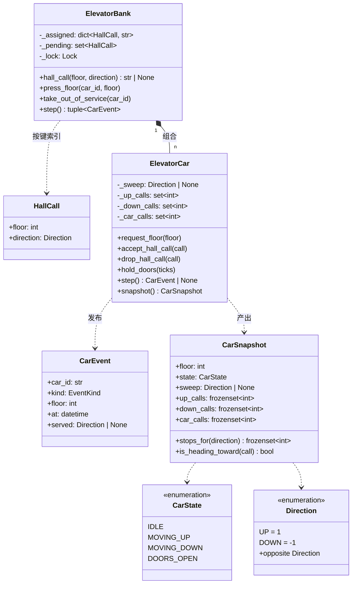

# 设计题解：电梯系统（Elevator System）

## 题目与澄清

面试官通常这样开场："设计一栋楼的电梯系统。楼里有好几部电梯，人在楼层外按上／下按钮，
也在轿厢里按目标楼层，你来决定电梯怎么跑。"这句话里藏着好几个必须问清楚的口子，问清楚
之前动手写代码，基本一定会返工：

- **时间怎么建模？** 这是本题最重要的一个澄清，而且绝大多数候选人不问。电梯"走一层要几秒"
  "开门停几秒"是物理量，但面试要考的是调度逻辑，不是定时器。把时间说成"一个 tick 走一层、
  一个 tick 开一次门"，整套逻辑就变成一个可以逐步推进、逐步断言的纯函数式推进过程；说成
  "开一个线程，`time.sleep(3)` 模拟运行"，测试就只能靠睡眠和运气。问一句"我可以把时间抽象
  成离散的 tick 吗"，得到的几乎总是"可以"，而这一句直接决定了后面能不能写出确定性测试。
- **外呼和内选是不是一回事？** 楼层外的按钮带方向（在 5 楼按"上"），轿厢里的按钮不带方向
  （按 7 楼）。如果面试官确认两者都要支持，那么"停靠请求"就不是一个同质的集合：外呼只有在
  电梯的运行方向和它一致时才应该停，内选无论上行下行到了那一层都必须停。这一条决定了停靠
  请求的数据结构，也是"乘客坐过站"这个经典 bug 的来源。
- **公平性要求到什么程度？** "最近的请求先服务"写起来最短，但没有任何等待上界。问一句
  "有没有人可以一直等不到电梯"，如果答案是"不行"，那就必须上 SCAN 一类有方向扫描的算法，
  而不是贪心地追最近的那个请求。
- **一个外呼由几部梯响应？** 现实里 5 楼按了"上"，只应该有一部梯过来；两部梯同时开过去
  是纯浪费（空跑一趟、白开一次门）。这条约束听上去显然，但它决定了"谁记住这个外呼派给了
  谁"这个状态该放在哪个对象身上。
- **楼层是不是都停？** 如果有直达梯、分区梯（低区／高区）、消防梯，那么"这部梯能不能接
  这一层的外呼"就是派梯前的一道过滤，而不能等派过去了才发现停不了。

**范围之外**：不做真实的电机控制和门的机械安全（只把"挡门"抽象成延长开门倒计时）；不做
载重传感（容量以人数为模型放在追问里讨论）；不做跨进程的持久化——本文在内存里建模，整套
状态可以随时被一个快照完整描述，换成落库时要改的边界在"扩展与追问"里点明。

## 需求与分级

一轮机器编码不会一次把需求说完，而是分关加码。每一关都在检验上一关有没有把自己写死：

- **第 1 关（核心流程，约 20 分钟）**：一部梯。显式的状态机 IDLE / MOVING_UP /
  MOVING_DOWN / DOORS_OPEN，不允许用 `is_moving` + `going_up` + `door_open` 这种布尔汤；
  支持带方向的外呼和不带方向的内选；一个 `step()` 推进一个 tick，让整台机器可以被确定性地
  测试，不需要 `sleep`。对应 `CarState`、`Direction`、`ElevatorCar`、`CarEvent`。
- **第 2 关（策略可换，约 15 分钟）**：选下一站的算法要能整体替换——经典电梯算法
  （SCAN／LOOK：朝一个方向一路服务到底再掉头）对上朴素的"最近请求优先"，并且要讲得出后者
  为什么会饿死远处的楼层。对应 `ServicePolicy`、`scan`、`nearest_request`、`CarSnapshot`。
- **第 3 关（一组梯与派梯，约 15 分钟）**：多部梯加一个派梯器，把一个外呼指派给其中一部。
  要说清楚它优化什么（这位乘客的等待时间）、以及它绝不能做什么（同一个外呼被两部梯接走）。
  外呼从各个楼层并发进来，指派必须是原子的。对应 `ElevatorBank`、`DispatchPolicy`、
  `nearest_car`、`directional_dispatch`。
- **第 4 关（新需求，选做）**：挡门、停用一部梯去检修、直达梯只停部分楼层。这一关的全部
  意义在于：它们不应该逼你回头改状态机。挡门复用已有的开门倒计时；停用是一维和状态机正交
  的标志；直达梯是派梯前的一道过滤加一个内选的守卫。对应 `hold_doors`、`in_service`、
  `served_floors`。

## 核心对象与职责

| 类 | 职责 | 它守住的不变式 |
|---|---|---|
| `Direction` | 外呼的方向，同时是楼层增量（UP=1／DOWN=-1） | 只有两个成员；"没有方向"是 `None`，不是第三个成员 |
| `CarState` | 一部梯此刻在做的机械动作 | 只描述动作，不描述可用性——"停用"不在这里 |
| `HallCall` | 一次外呼：楼层 + 方向 | 不可变、可哈希，因为它要当"派给了哪部梯"这张表的键 |
| `CarEvent` | 轿厢身上发生的一件事（走了一层／开门／关门） | 不可变、自描述；订阅者看它就够，不必回头读轿厢内部 |
| `CarSnapshot` | 轿厢某一刻的只读快照，策略函数的全部输入 | 三个停靠集合都是 `frozenset`，拿到也改不了真实状态 |
| `ServicePolicy`（函数） | 给一份快照，回答"下一站去哪" | 纯计算，不读不改任何外部状态 |
| `DispatchPolicy`（函数） | 给一个外呼和全部快照，回答"派哪一部" | 只挑 id；"不重派"由梯群保证，不靠它自觉 |
| `ElevatorCar` | 一部梯的状态机、停靠集合与 `step()` | 扫描方向跨越开关门不丢；每次开门都让对应集合缩小 |
| `ElevatorBank` | 持有全部梯，在锁下把一个外呼原子地派给恰好一部 | 一个未完成的外呼最多对应一部梯；服务完立刻销账 |

关系上，`ElevatorBank` **组合**（composition）着它的 `ElevatorCar`：梯的生命周期跟着这组
电梯走。`HallCall` 与 `ElevatorCar` 只是**关联**（association）——梯接下了这个外呼，但外呼
不属于任何一部梯，随时可能被收回重派（一部梯被停用时就是这样）。`CarSnapshot` 和 `CarEvent`
都是纯值对象，谁也不拥有谁。

值得特别说明的是这份设计里**没有**的那些类。没有 `Building`、`Floor`、`Button`、`Panel`：
楼层在这道题里就是一个 `int`，按钮按下去产生的效果就是 `hall_call(floor, direction)` 这次
调用本身，为它们各建一个只有一个字段、只会把调用原样转发下去的类，除了多几层调用栈不提供
任何东西。也没有 `Request` 抽象基类加 `ExternalRequest` / `InternalRequest` 两个子类——这是
Java 题解里最常见的写法，但两者的差别不是"行为不同"，而是"要不要看方向"，而这个差别在本文
里由"它被放进哪个集合"表达得更直接：外呼进 `up_calls`／`down_calls`，内选进 `car_calls`。
一个只有数据、没有多态行为的继承树，在 Python 里就是两个字段加一个判断。

`ElevatorCar` 与 `ElevatorBank` 的分工是这份设计的主干：**轿厢只知道自己**（我在哪层、我
朝哪走、我还欠哪些停靠），**梯群只知道分配**（这个外呼归谁、谁暂时接不了）。轿厢完全不知道
世界上还有别的梯，所以第 1、2 关写完的 `ElevatorCar` 在第 3 关一行都不用改；梯群完全不知道
SCAN 是什么，所以换停靠策略也碰不到它。



## 关键设计决策

### 决策一：时间用 tick 推进，而不是线程加 `time.sleep`

**问题**：电梯天然是"随时间自己动"的东西。怎么让它动起来，同时又能被测试？

**选项 A：每部梯一个线程，循环里 `time.sleep(travel_seconds)`。** 这是大多数 Java 题解的
做法，看上去很"真实"：

```python
# 反面教材：不要这样写
def run(self) -> None:
    while self._running:
        target = self._next_stop()
        if target is None:
            time.sleep(0.1)
            continue
        self._floor += 1 if target > self._floor else -1
        time.sleep(1.0)  # 走一层
```

代价：测试要断言"电梯到了 7 楼"就只能 `sleep` 之后去看，用例慢、在 CI 上飘；要断言"下一站
是 3 不是 5"根本没有插手的地方；调度逻辑和线程生命周期纠缠在一起，一个 bug 分不清是算法错
了还是竞态。更要命的是，面试的 45 分钟里你会花十几分钟去调这个线程，而它不是考点。

**选项 B：`step()` 推进一个离散 tick，时间戳来自注入的时钟。** 一个 tick 只做一件事：关门、
走一层、或者开门。调用方（测试、演示、真实的定时器）决定 tick 多快来一次：

```python
for _ in range(10):
    event = car.step()
```

代价是"多久走一层"这件事被丢给了调用方——但这本来就是部署参数，不是设计问题。收益是全部
调度逻辑变成可枚举、可断言的状态转移：本文的 27 个测试里没有一句 `sleep`。真实时间仍然有
用（事件要有时间戳，用于统计等待时长），所以时钟是构造时注入的 `Callable[[], datetime]`，
而不是在逻辑里直接调 `datetime.now()`——这样"过了三秒"在测试里就是把假时钟往前拨。

**选择 B。这里的正确答案是拒绝机器，而不是引入机器**：没有线程池、没有调度器、没有事件
循环，只有一个方法和一个注入的函数。说出这一条，比写出线程版本更能证明你知道考点在哪。

### 决策二：状态机用 `Enum`，而"停用"根本不进状态机

**问题**：四个状态怎么表达？"这部梯在检修"算第五个状态吗？

**选项 A：一状态一类（`IdleState`、`MovingUpState`……），每个类实现 `step()`。** 这是
[[structure.state-machines|状态机（State Machines）]]里 State 模式的经典形态。它在"每个状态
的行为差异很大、而且经常新增状态"时是对的。但电梯的四个状态里，行为差异小得可怜：开着门
就是把倒计时减一，其余三个状态走的是同一段"问策略要目标、要么停要么走一层"的逻辑。拆成四
个类之后，这段共同逻辑要么被复制四份，要么被提到基类里——于是四个子类里有三个是空壳。

**选项 B：`CarState` 枚举 + `step()` 里的一次分支。** 转移规则一共只有几条，写在一个方法里
一眼能看全；新增"停用"这类需求（见下）根本不需要动它。

**选择 B**，并在题解里点明判据：状态数少、每个状态的行为主要是"同一段逻辑的不同分支"时，
枚举足够；一旦每个状态都有自己成套的进入／退出副作用（自动售货机就是这样），才值得升级成
一状态一类。同一个概念在两道题里给出不同答案，才说明你在做取舍而不是在套模板。

**更重要的一半**：不要把"停用／检修"做成 `CarState` 的第五个成员。停用和"此刻在做什么"是
**正交**的两维——一部梯可以"停用中并且门正开着"（师傅在里面），也可以"停用中并且正在下行"
（把最后一车人送到）。塞进同一个枚举，就要造出 `IDLE_OUT_OF_SERVICE`、
`DOORS_OPEN_OUT_OF_SERVICE`……状态数变成 4 × 2，这就是状态爆炸的标准起点。本文的做法是一个
布尔字段 `in_service`：它只影响"能不能接新的外呼"，所以只有派梯策略的过滤和
`ElevatorBank.take_out_of_service` 读它，`step()` 从头到尾根本不看它——车里的人必须被送到，
这在代码里是"停用不进状态机"这个决定的直接推论，不需要一行特判。

### 决策三：停靠请求是三个集合，不是一个优先队列

**问题**：一部梯要记住"还要在哪些楼层停"。用什么装？

**选项 A：一个 `heapq` 小顶堆。** 直觉上很像："下一站就是堆顶"。但电梯不是最短寻道：上行
时下一站是"我上方最近的那个"，掉头后又变成"我下方最近的那个"，同一个堆在两个方向下的
比较函数完全相反。真要用堆，每次掉头都得整个重建，还要额外记住哪些请求属于反方向——最后
得到的是一个比集合更复杂、还更容易写错的结构。

**选项 B：一个 `set[int]`，"停靠楼层"一视同仁。** 短，但直接丢掉了外呼的方向信息：5 楼
按"上"和 5 楼按"下"变成同一件事，电梯下行经过 5 楼会给想上行的人开门，然后这个人要么被
带到楼下、要么白等一次。

**选项 C（本文）：`up_calls` / `down_calls` / `car_calls` 三个 `set[int]`。** 外呼按方向分成
两份，内选单独一份。`stops_for(direction)` 把"这一趟会停哪些楼层"算成"该方向的外呼 ∪ 全部
内选"——内选出现在两个方向里，因为车里的人按了 7 楼，上行下行到 7 楼都必须停；外呼只在方向
一致时停。

代价是三个容器要各自维护。收益有两处是前两个选项给不出来的：

1. **同一层的双向外呼互不吞并**。上行到 4 楼开门，只销掉 4 楼的"上"这一条，"下"那一条原样
   留着等这趟扫描回来——`test_serving_a_floor_upward_leaves_the_down_call_on_that_floor`
   盯的就是这个。
2. **外呼可以被单独撤回**。一部梯被停用时，梯群要把它手上没做完的外呼收回去重派，但**不能**
   动它的内选（车里的人还要下车）。只有把两者分开存，`drop_hall_call` 才写得出来；合并成
   一个集合时，"撤掉 7 楼的外呼"会顺手把"车里有人要去 7 楼"一起撤掉，乘客被关在电梯里反复
   路过自己那一层——这是一个看起来很小、实际很难查的 bug。

集合的选择还有第三层意义：**每一个容器都必须有收缩的理由**。三个集合都只在"某层被服务"
时移除对应条目，`_serve()` 是唯一的移除点，所以请求数永远等于"尚未完成的请求数"，不会
随运行时间单调增长。

### 决策四：两个可替换点都是普通函数，而不是抽象基类

**问题**：SCAN 对最近请求，是一个可替换点；派哪部梯，是另一个可替换点。怎么表达？

Java 题解的标准答案是两棵继承树：`SchedulingStrategy` 抽象类 + 两个实现，
`DispatchStrategy` 抽象类 + 两个实现。在 Python 里，这两组算法在调用之间**不需要记住任何
东西**——该记的方向已经在 `CarSnapshot.sweep` 里了——所以它们就是纯函数：

```python
ServicePolicy = Callable[[CarSnapshot], int | None]
DispatchPolicy = Callable[[HallCall, Sequence[CarSnapshot]], str | None]

car = ElevatorCar("A", policy=scan, clock=clock)
bank = ElevatorBank(cars, dispatch=directional_dispatch, clock=clock)
```

签名本身就是接口，`typing.Protocol` 或 `abc.ABC` 在这里只会多一层从不被复用的壳。这就是
[[patterns.strategy|策略模式与可替换算法（Strategy）]]在 Python 里最轻的形态：**策略只有一个
方法时写成函数**。判据在本域是一致的——只有当策略需要在调用之间保存状态（比如"轮流派给各
部梯"要记住上次派给了谁），或者需要对外暴露第二个方法（比如"这次为什么派给它"的解释接口），
才值得升级成类；那时把它写成一个带 `__call__` 的 `@dataclass` 就行，调用方的代码一个字都
不用改。

同样重要的是**认出这是两个可替换点而不是一个**。很多答案把"下一站去哪"和"派哪部梯"揉进一个
巨大的 `ElevatorController.schedule()`，于是想换派梯规则就不得不碰 SCAN 的代码。分开之后，
第 2 关和第 3 关各自独立：`ElevatorCar` 不知道自己身边还有别的梯，`ElevatorBank` 不知道
SCAN 是什么。

顺带说清 SCAN 为什么值得：`nearest_request` 永远追最近的那个请求，只要低楼层有稳定的客流，
20 楼可以永远等下去——测试
`test_nearest_request_starves_a_far_floor_and_scan_does_not` 就是把这件事钉死的。SCAN 的
公平性来自"一趟扫描最多一个来回"：任何请求最迟在电梯扫到它那一段时被服务，等待时间有上界。
这条论证要在面试里说出口，因为"我用了电梯算法"只是名字，"它保证了什么"才是答案。

### 决策五：外呼派给了谁，这张表归梯群所有

**问题**：谁记住"5 楼的上行呼叫由 A 号梯负责"？

**选项 A：不记。** 每次外呼都直接按策略挑一部梯，让它把楼层加进自己的集合。后果是同一个
按钮按两次（现实里几乎必然发生）会叫来两部梯：两趟空跑、两次白开门。

**选项 B：让轿厢自己记。** 那么"判断这个外呼是不是已经有人接了"就要遍历所有轿厢去问，而且
两个线程可能同时问到"都没人接"，于是都接了——这个判断必须是原子的，放在多个对象身上就没法
用一把锁保护。

**选项 C（本文）：`ElevatorBank._assigned: dict[HallCall, str]`，一把锁保护。** `hall_call`
先查表：已经有主的直接返回同一个 id（幂等），没有主的才在锁内选一部并登记。挑不到梯时（全
停用了、或者没有梯停这一层）进 `_pending`，每个 tick 重试一次。

这个决定带出本题最容易漏的一条**收缩规则**：`_assigned` 必须在外呼被真正服务时销账。销账的
触发点是轿厢发出的 `CarEvent`——`DOORS_OPENED` 事件带着 `served: Direction | None`，说明这一
停服务的是哪个方向的扫描，梯群拿这个事件拼出 `HallCall(floor, served)` 并删掉对应记录。
注意事件里**带着**这条信息，而不是让梯群回头去读轿厢的集合：订阅者只看事件就能更新自己，
既不绕过轿厢的不变式，并发下也不需要借轿厢的锁。

不销账的后果不是"内存慢慢涨"这么温和：5 楼的人下次再按"上"，`hall_call` 会在表里查到一条
陈旧记录，直接返回那部早就走了的梯的 id，**没有任何梯会来**。这是一个静默的功能性故障，
`test_the_assignment_is_cleared_once_the_call_is_served` 的最后一行断言专门守它。`_pending`
同理：它是 `set` 而不是 `list`，所以重试不会把同一个外呼排进去两次。

锁的范围也要说清楚：锁只包住"查表、挑梯、登记"这几行。`ElevatorBank.step()` 在**出锁之后**
才调各部梯的 `step()`，因为轿厢的 `step()` 会同步回调 `_on_car_event`，而那个回调自己要取
锁——在锁内调就是一次自己等自己的死锁。通知外部订阅者同样在锁外：一个慢订阅者（哪怕只是
写一行日志）不该把所有楼层的外呼堵在门口。至于 GIL：它只保证单条字节码不被切走，"查表 →
判断 → 写表"是好几条字节码，中间随时可能换线程，所以这把锁省不掉。

## 代码走读

整份参考实现如下，随后走读四处设计决策在代码里的落点。

%% code:begin solution.py %%
```python
"""电梯系统（Elevator System）——一部梯的状态机、可换的调度策略、一组梯的派梯。

核心思路：时间用 tick 推进，`step()` 走一格，全程没有 `time.sleep`，所以整套逻辑可以被
确定性地测试；真实时间只通过注入的 `clock` 进入事件的时间戳。一部梯把"此刻在做什么"
（`CarState`：IDLE / MOVING_UP / MOVING_DOWN / DOORS_OPEN）和"这一趟扫描朝哪走"（`_sweep`）
分开存——后者必须跨越开关门存活，否则 SCAN 每停一次就忘记方向。停靠请求按来源分三个集合：
外呼向上、外呼向下、内选；内选两个方向都停，外呼只在方向一致时停。选下一站（`scan` /
`nearest_request`）和派梯（`nearest_car` / `directional_dispatch`）都是普通函数，轿厢和梯群
都不知道它们的内容。
"""

from __future__ import annotations

import threading
from collections.abc import Callable, Iterable, Sequence
from dataclasses import dataclass
from datetime import datetime
from enum import Enum, IntEnum

Clock = Callable[[], datetime]


class Direction(IntEnum):
    """外呼要走的方向，同时也是楼层增量：`floor + direction` 就是相邻的下一层。

    没有 `IDLE` 成员——"没有方向"是 `None`，不是第三种方向。
    """

    UP = 1
    DOWN = -1

    @property
    def opposite(self) -> Direction:
        return Direction.DOWN if self is Direction.UP else Direction.UP


class CarState(Enum):
    """一部梯此刻在做什么——只描述机械动作，不描述"是否可用"。

    "停用/检修"不做成这里的成员：它和四个动作状态正交，做成状态就要再多出
    IDLE_OUT_OF_SERVICE、DOORS_OPEN_OUT_OF_SERVICE……这是状态爆炸的标准起点。
    """

    IDLE = "idle"
    MOVING_UP = "moving_up"
    MOVING_DOWN = "moving_down"
    DOORS_OPEN = "doors_open"


class EventKind(Enum):
    MOVED = "moved"
    DOORS_OPENED = "doors_opened"
    DOORS_CLOSED = "doors_closed"


class ElevatorError(Exception):
    """本设计全部失败路径的公共基类，调用方可以一次性捕获。"""


class UnknownCarError(ElevatorError):
    """给出的轿厢 id 在这组电梯里不存在。"""


class FloorNotServedError(ElevatorError):
    """这部梯不停这一层（直达梯／分区梯）。"""


class DoorsNotOpenError(ElevatorError):
    """门没开的时候不能"挡门"。"""


@dataclass(frozen=True, slots=True)
class HallCall:
    """一次外呼：站在 `floor` 的人想往 `direction` 走。

    不可变、可哈希，因为它要当字典的键——"一个按钮只叫来一部梯"正是靠
    `HallCall -> car_id` 这张表保证的。
    """

    floor: int
    direction: Direction


@dataclass(frozen=True, slots=True)
class CarEvent:
    """轿厢身上发生的一件事，自带全部上下文：订阅者（显示牌、派梯器）只看这份不可变
    记录就能更新自己，不必回头去读轿厢的内部集合——那样既绕过不变式，并发下也无保护。
    """

    car_id: str
    kind: EventKind
    floor: int
    at: datetime
    served: Direction | None = None  # 仅 DOORS_OPENED：这一停服务的是哪个方向的扫描


CarObserver = Callable[[CarEvent], None]


@dataclass(frozen=True, slots=True)
class CarSnapshot:
    """轿厢在某一刻的只读快照：策略函数看到的全部信息。三个停靠集合都是 `frozenset`，
    策略拿到手也改不了轿厢的真实状态；轿厢从不把自己的 `set` 交出去。
    """

    car_id: str
    floor: int
    state: CarState
    sweep: Direction | None
    up_calls: frozenset[int]
    down_calls: frozenset[int]
    car_calls: frozenset[int]
    in_service: bool
    served_floors: frozenset[int] | None

    @property
    def is_busy(self) -> bool:
        return bool(self.up_calls or self.down_calls or self.car_calls)

    def serves(self, floor: int) -> bool:
        """这部梯停不停这一层；`served_floors` 为 `None` 表示层层都停。"""
        return self.served_floors is None or floor in self.served_floors

    def stops_for(self, direction: Direction) -> frozenset[int]:
        """朝 `direction` 扫描时会停的楼层：该方向的外呼，加上全部内选。

        内选出现在两个方向里——车里的人按了 7 层，上行下行到 7 层都必须停；只有外呼挑方向。
        """
        hall = self.up_calls if direction is Direction.UP else self.down_calls
        return hall | self.car_calls

    def distance_to(self, floor: int) -> int:
        return abs(floor - self.floor)

    def is_heading_toward(self, call: HallCall) -> bool:
        """这部梯正在做的扫描方向和外呼一致，而且外呼那一层还在它前方（顺路）。"""
        if self.sweep is not call.direction:
            return False
        return (call.floor - self.floor) * int(self.sweep) >= 0


# --------------------------------------------------------------------------
# 停靠策略：给一份快照，回答"下一站去哪"。两种规则在调用之间都不需要记住任何东西（该记
# 的方向已在快照的 `sweep` 里），所以是普通函数，不是抽象基类加两个实现类。

ServicePolicy = Callable[[CarSnapshot], int | None]


def _nearest(car: CarSnapshot) -> int | None:
    stops = car.up_calls | car.down_calls | car.car_calls
    if not stops:
        return None
    return min(stops, key=lambda floor: (abs(floor - car.floor), floor))


def nearest_request(car: CarSnapshot) -> int | None:
    """最近请求优先：永远去当前最近的一站，不看方向。

    实现最短，但没有任何公平性保证：只要近处一直有人按，远处那一层可以永远等下去。
    """
    return _nearest(car)


def scan(car: CarSnapshot) -> int | None:
    """电梯算法（SCAN / LOOK）：朝一个方向一路服务到底，没有顺路的了才掉头。

    公平性来自"一趟扫描最多走一个来回"：任何一个请求最迟在电梯扫到它所在的那一段时
    被服务，等待时间有上界，不会被后来的近处请求无限插队。
    """
    if car.sweep is None:
        return _nearest(car)
    ahead = [f for f in car.stops_for(car.sweep) if (f - car.floor) * int(car.sweep) >= 0]
    if ahead:
        return min(ahead) if car.sweep is Direction.UP else max(ahead)
    back = car.stops_for(car.sweep.opposite)
    if back:
        # 掉头：先开到反向扫描的起点（本方向上最远的那一站），再一路扫回来。
        return max(back) if car.sweep is Direction.UP else min(back)
    # 只剩同向、却落在身后的外呼：开回去重新起一趟扫描。
    rest = car.up_calls if car.sweep is Direction.UP else car.down_calls
    if not rest:
        return None
    return min(rest) if car.sweep is Direction.UP else max(rest)


# --------------------------------------------------------------------------
# 派梯策略：给一个外呼和全部轿厢的快照，回答"派哪一部"。它优化这位乘客的等待时间；
# "同一个外呼绝不派给两部梯"则由 `ElevatorBank` 的分派表保证，不靠策略自觉。

DispatchPolicy = Callable[[HallCall, Sequence[CarSnapshot]], str | None]


def _eligible(call: HallCall, cars: Sequence[CarSnapshot]) -> list[CarSnapshot]:
    return [c for c in cars if c.in_service and c.serves(call.floor)]


def nearest_car(call: HallCall, cars: Sequence[CarSnapshot]) -> str | None:
    """最近的梯优先：只看楼层差。简单，但会把外呼派给一部正在反方向跑的梯。"""
    candidates = _eligible(call, cars)
    if not candidates:
        return None
    return min(candidates, key=lambda c: (c.distance_to(call.floor), c.car_id)).car_id


def directional_dispatch(call: HallCall, cars: Sequence[CarSnapshot]) -> str | None:
    """顺路优先：正朝这一层开且方向一致的排第一，空闲的排第二，要掉头的排最后。"""
    candidates = _eligible(call, cars)
    if not candidates:
        return None

    def cost(c: CarSnapshot) -> tuple[int, int, str]:
        if c.is_heading_toward(call):
            rank = 0
        elif not c.is_busy:
            rank = 1
        else:
            rank = 2
        return (rank, c.distance_to(call.floor), c.car_id)

    return min(candidates, key=cost).car_id


class ElevatorCar:
    """一部轿厢：自己的状态机、自己的停靠集合，按注入的策略决定下一站。

    不变式：
    1. `state is MOVING_UP` 蕴含 `sweep is Direction.UP`（MOVING_DOWN 同理）；`sweep` 跨越
       开关门保持不变——这正是 SCAN 停一次后还知道往哪走的原因；停靠集合全空才清成 `None`。
    2. 每次开门都把这一层从"被服务的那个集合"里移除；三个集合只随未完成的请求增长，
       服务完就缩小，不会无限膨胀。
    3. 停用（`in_service`）与状态机正交：只意味着不再接外呼，车里的人照样送到，
       所以 `step()` 根本不看这个标志。
    """

    def __init__(self, car_id: str, policy: ServicePolicy, clock: Clock, *,
                 floor: int = 1, door_ticks: int = 1,
                 served_floors: Iterable[int] | None = None) -> None:
        self._car_id = car_id
        self._policy = policy
        self._clock = clock
        self._floor = floor
        self._state = CarState.IDLE
        self._sweep: Direction | None = None
        self._up_calls: set[int] = set()
        self._down_calls: set[int] = set()
        self._car_calls: set[int] = set()
        self._door_dwell = door_ticks
        self._door_ticks = 0
        self._in_service = True
        self._served_floors = None if served_floors is None else frozenset(served_floors)
        self._observers: list[CarObserver] = []

    @property
    def car_id(self) -> str:
        return self._car_id

    @property
    def current_floor(self) -> int:
        return self._floor

    @property
    def state(self) -> CarState:
        return self._state

    @property
    def in_service(self) -> bool:
        return self._in_service

    def serves(self, floor: int) -> bool:
        return self._served_floors is None or floor in self._served_floors

    def snapshot(self) -> CarSnapshot:
        """一份不可变快照；这是外界能看到轿厢内部的唯一形式。"""
        return CarSnapshot(car_id=self._car_id, floor=self._floor, state=self._state,
                           sweep=self._sweep, up_calls=frozenset(self._up_calls),
                           down_calls=frozenset(self._down_calls),
                           car_calls=frozenset(self._car_calls), in_service=self._in_service,
                           served_floors=self._served_floors)

    def subscribe(self, observer: CarObserver) -> None:
        """订阅这部梯的事件；派梯器和显示牌都是这样接进来的。"""
        self._observers.append(observer)

    def request_floor(self, floor: int) -> None:
        """内选：车里的人按下目标楼层。没有方向，两个方向的扫描都会在这一层停。"""
        if not self.serves(floor):
            raise FloorNotServedError(f"car {self._car_id!r} does not serve floor {floor}")
        if floor == self._floor and self._state is CarState.DOORS_OPEN:
            return
        self._car_calls.add(floor)

    def accept_hall_call(self, call: HallCall) -> None:
        """接下一个外呼：只在扫描方向和它一致时才会为它停。由梯群调用。"""
        if not self.serves(call.floor):
            raise FloorNotServedError(f"car {self._car_id!r} does not serve floor {call.floor}")
        target = self._up_calls if call.direction is Direction.UP else self._down_calls
        target.add(call.floor)

    def drop_hall_call(self, call: HallCall) -> None:
        """撤掉一个还没服务的外呼（这部梯被停用时由梯群收回重派）。内选不受影响——这
        正是外呼和内选分开存的实际收益：撤掉"7 层有人要上行"，不会连"车里有人要去 7 层"一起撤。
        """
        target = self._up_calls if call.direction is Direction.UP else self._down_calls
        target.discard(call.floor)

    def take_out_of_service(self) -> None:
        """停用：不再接新的外呼；已经在车里的人照常送到。"""
        self._in_service = False

    def return_to_service(self) -> None:
        self._in_service = True

    def hold_doors(self, extra_ticks: int = 1) -> None:
        """挡门：把关门倒计时往后推。复用已有的门计时，不需要新增任何状态。"""
        if self._state is not CarState.DOORS_OPEN:
            raise DoorsNotOpenError(f"car {self._car_id!r} doors are not open")
        self._door_ticks += extra_ticks

    def step(self) -> CarEvent | None:
        """推进一个 tick：开着门就数门的计时，否则按策略走一格或者开门。

        一个 tick 只做一件事，因此每一步都能在测试里被单独断言，也不需要任何真实等待。
        """
        if self._state is CarState.DOORS_OPEN:
            self._door_ticks -= 1
            if self._door_ticks > 0:
                return None
            self._state = CarState.IDLE
            return self._emit(EventKind.DOORS_CLOSED)
        target = self._policy(self.snapshot())
        if target is None:
            self._state = CarState.IDLE
            self._sweep = None
            return None
        if target == self._floor:
            return self._serve()
        step_dir = Direction.UP if target > self._floor else Direction.DOWN
        self._sweep = step_dir
        self._floor += int(step_dir)
        self._state = (CarState.MOVING_UP if step_dir is Direction.UP else CarState.MOVING_DOWN)
        return self._emit(EventKind.MOVED)

    def _serve(self) -> CarEvent:
        """到站开门：判断这一停服务的是哪个方向的扫描，并把对应请求移除。"""
        floor = self._floor
        served: Direction | None = None
        sweep_hall = (self._up_calls if self._sweep is Direction.UP else self._down_calls)
        if self._sweep is not None and (floor in sweep_hall or floor in self._car_calls):
            served = self._sweep
        elif floor in self._up_calls:
            served = Direction.UP
        elif floor in self._down_calls:
            served = Direction.DOWN
        if served is not None:
            self._sweep = served  # 掉头点：服务哪个方向，扫描方向就跟着翻过来
            hall = self._up_calls if served is Direction.UP else self._down_calls
            hall.discard(floor)
        self._car_calls.discard(floor)
        self._state = CarState.DOORS_OPEN
        self._door_ticks = self._door_dwell
        return self._emit(EventKind.DOORS_OPENED, served=served)

    def _emit(self, kind: EventKind, served: Direction | None = None) -> CarEvent:
        event = CarEvent(car_id=self._car_id, kind=kind, floor=self._floor,
                         at=self._clock(), served=served)
        for observer in self._observers:
            observer(event)
        return event


class ElevatorBank:
    """一组电梯加一个派梯器：外呼进来，恰好一部梯去接。

    不变式：一个还没被服务的外呼在 `_assigned` 里最多对应一部梯——同一个按钮按两次不会叫来
    两部梯；某部梯真的到了那层、开门、且开门服务的正是这个方向时，这条记录立刻删除。
    `_assigned` 和 `_pending` 都必须缩：不缩的话，同一层同一方向的第二次呼叫会被静默吞掉。
    """

    def __init__(self, cars: Iterable[ElevatorCar], dispatch: DispatchPolicy, clock: Clock) -> None:
        self._cars: dict[str, ElevatorCar] = {car.car_id: car for car in cars}
        self._dispatch = dispatch
        self._clock = clock
        self._lock = threading.Lock()
        self._assigned: dict[HallCall, str] = {}
        self._pending: set[HallCall] = set()
        self._observers: list[CarObserver] = []
        for car in self._cars.values():
            car.subscribe(self._on_car_event)

    def snapshots(self) -> tuple[CarSnapshot, ...]:
        """全部轿厢的只读快照；梯群从不把 `ElevatorCar` 的集合或字典交出去。"""
        return tuple(car.snapshot() for car in self._cars.values())

    def pending_calls(self) -> frozenset[HallCall]:
        """当前没有任何梯能接、正在等重试的外呼。"""
        with self._lock:
            return frozenset(self._pending)

    def assignment_of(self, call: HallCall) -> str | None:
        """这个外呼当前派给了哪部梯；没派出去就是 `None`。"""
        with self._lock:
            return self._assigned.get(call)

    def subscribe(self, observer: CarObserver) -> None:
        self._observers.append(observer)

    def hall_call(self, floor: int, direction: Direction) -> str | None:
        """外呼：某一层有人要往某个方向走。返回接单的轿厢 id，暂时没人能接则返回 `None`。"""
        call = HallCall(floor, direction)
        with self._lock:
            if call in self._assigned:
                return self._assigned[call]  # 幂等：按两次按钮不会叫来第二部梯
            self._pending.discard(call)
            return self._assign(call)

    def press_floor(self, car_id: str, floor: int) -> None:
        """内选：车里的人按目标楼层。梯群校验 id，不把轿厢对象交出去。"""
        self._require(car_id).request_floor(floor)

    def take_out_of_service(self, car_id: str) -> tuple[HallCall, ...]:
        """停用一部梯：手上还没完成的外呼立刻收回重派，内选（车里的人）照常送到。"""
        with self._lock:
            car = self._require(car_id)
            car.take_out_of_service()
            stranded = tuple(c for c, owner in self._assigned.items() if owner == car_id)
            for call in stranded:
                del self._assigned[call]
                car.drop_hall_call(call)
            for call in stranded:
                self._assign(call)
        return stranded

    def return_to_service(self, car_id: str) -> None:
        self._require(car_id).return_to_service()

    def step(self) -> tuple[CarEvent, ...]:
        """推进一个 tick：先重试挂起的外呼，再让每一部梯各走一格。"""
        with self._lock:
            for call in tuple(self._pending):
                self._pending.discard(call)
                self._assign(call)
        # 轿厢的 step() 会同步回调 `_on_car_event`，因此这里必须已经出了锁。
        return tuple(e for car in self._cars.values() if (e := car.step()) is not None)

    def run_until_idle(self, max_ticks: int = 500) -> int:
        """一直推进到所有梯都没活干；返回用掉的 tick 数。超过上限说明设计出了环。"""
        for tick in range(1, max_ticks + 1):
            self.step()
            if not any(s.is_busy for s in self.snapshots()) and not self.pending_calls():
                return tick
        raise ElevatorError(f"still busy after {max_ticks} ticks")

    def _require(self, car_id: str) -> ElevatorCar:
        car = self._cars.get(car_id)
        if car is None:
            raise UnknownCarError(f"unknown car {car_id!r}")
        return car

    def _assign(self, call: HallCall) -> str | None:
        """在锁内把一个外呼派给恰好一部梯；没梯能接就挂起，下一个 tick 再试。"""
        car_id = self._dispatch(call, self.snapshots())
        if car_id is None:
            self._pending.add(call)
            return None
        car = self._require(car_id)
        self._assigned[call] = car_id
        car.accept_hall_call(call)
        return car_id

    def _on_car_event(self, event: CarEvent) -> None:
        """轿厢的每一件事都经过这里：开门就销掉已完成的外呼，再转发给外部订阅者。
        订阅者在锁外通知——一个慢订阅者（哪怕只是写一行日志）不该把所有外呼堵在门口。
        """
        if event.kind is EventKind.DOORS_OPENED and event.served is not None:
            call = HallCall(event.floor, event.served)
            with self._lock:
                self._assigned.pop(call, None)
                self._pending.discard(call)
        for observer in self._observers:
            observer(event)


if __name__ == "__main__":
    from datetime import UTC, timedelta

    now = datetime(2026, 1, 1, 9, 0, tzinfo=UTC)

    def tick_clock() -> datetime:
        return now

    cars = [ElevatorCar("A", policy=scan, clock=tick_clock, floor=1),
            ElevatorCar("B", policy=scan, clock=tick_clock, floor=8)]
    bank = ElevatorBank(cars, dispatch=directional_dispatch, clock=tick_clock)
    bank.subscribe(lambda e: print(f"  {e.car_id} {e.kind.value} @ {e.floor}"))
    print("hall call 7↓ ->", bank.hall_call(7, Direction.DOWN))
    print("hall call 2↑ ->", bank.hall_call(2, Direction.UP))
    for _ in range(6):
        now = now + timedelta(seconds=3)
        bank.step()
    print("pending:", bank.pending_calls())
```
%% code:end %%

**一、`scan` 的四个分支，就是电梯算法的全部。** 有扫描方向时，先看"本方向前方还有没有停靠"
（`stops_for(sweep)` 里筛出 `(f - floor) * sweep >= 0` 的），有就取最近的那个——注意是 `>=`
不是 `>`，因为"目标就是当前层"正是到站该开门的那一拍。前方没有了才掉头，掉头的目标是**反
方向最远的那一站**：上行扫完之后去 `max(down_calls | car_calls)`，从那里开始一路扫回来。
第三个分支处理一种少见但真实的情况：本方向前方没有、反方向也没有，只剩下落在身后的同向
外呼，这时要开回去重新起一趟扫描。整个函数没有一行副作用，输入只有一份 `frozenset` 组成的
快照。

**二、`_serve()` 里"这一停服务了哪个方向"的判断，是掉头的真正发生地。** 如果当前扫描方向
的集合（该方向外呼 + 内选）里有这一层，那就是顺路的一停，扫描方向不变；否则说明这里是掉头
点——这一层只在反方向的外呼里，于是 `served` 取反方向，`self._sweep` 跟着翻过来。被服务的
那一条从对应集合里移除，内选无条件移除，同一层另一个方向的外呼原样留着。`served` 随后被
塞进 `CarEvent`，梯群靠它销账。

**三、`step()` 每拍只做一件事。** 门开着就把倒计时减一，减到零才发 `DOORS_CLOSED` 并回到
`IDLE`——注意这里**不清**扫描方向，这正是 SCAN 停一次之后还知道自己在往哪走的原因；只有当
策略返回 `None`（真的没活了）才把 `_sweep` 清成 `None`。`hold_doors` 就是往这个倒计时上加
数，所以"挡门"这个第 4 关的需求一个新状态都没引入。

**四、`ElevatorBank.step()` 的两段式。** 第一段在锁内重试挂起的外呼，第二段在锁外让每部梯
各走一拍。这个顺序不是随手写的：轿厢 `step()` 里的事件回调要取同一把锁，两段必须分开，
注释就写在那一行上。`take_out_of_service` 则把"收回外呼"和"重新派发"放在同一个临界区里，
保证中间不会有第三个线程看到"这个外呼没人接"的空窗。

## 测试与自检

27 个测试按关分组，每一组盯住一类不变式：

- **状态机**：四个状态各自出现在该出现的时候（`IDLE → MOVING_UP → DOORS_OPEN → IDLE`）；
  没活干的梯发不出任何事件；`hold_doors` 延长停留而不新增状态；门没开时挡门抛
  `DoorsNotOpenError`。
- **确定性**：事件的时间戳完全来自注入的假时钟，把时钟往前拨三秒，事件就晚三秒——全套用例
  里没有一句 `sleep`。
- **封装**：`snapshot()` 给出的是 `frozenset`，对它调 `add` 抛 `AttributeError`，而且轿厢
  自己的集合不受影响。这条断言是"永远不要把内部可变容器交出去"的可执行版本。
- **策略**：SCAN 按楼层顺序服务上行途中的全部请求；跨越一次开关门仍然记得方向；前方没有了
  才掉头；下行途中不给想上行的人开门。公平性那条测试把两种策略放在同一个"近处不断有人按"
  的压力下跑 80 拍，断言 `nearest_request` 永远到不了 20 楼而 SCAN 到得了。
- **派梯**：一个外呼恰好一部梯接；同一个按钮按两次不会叫来第二部；顺路的梯优先于要掉头的
  梯；外呼被服务后分派表销账，因而同一层同一方向可以再次呼叫；没有梯能接时进挂起队列且
  只排一份，梯恢复后下一拍自动派出。
- **并发**：8 个线程在同一个屏障（`threading.Barrier`）后同时下外呼，断言三部梯手上的外呼
  总数恰好等于 8、且并集正好是那 8 层——既没有重派也没有丢失。断言的是不变式，不是时序。

**两分钟怎么演示**：`python solution.py` 跑底部的 demo，它订阅事件后打印每一拍发生了什么。
口播三句话：第一句"时间是 tick，所以你看到的每一行都是确定的"；第二句"7 楼按下行派给了 B，
2 楼按上行派给了 A，同一个外呼不会有第二部梯"；第三句"把 `dispatch=` 换成 `nearest_car`
重跑，分配会变，两部梯的代码一行都不用动"。

## 扩展与追问

**新需求**

- **容量与超载**：给 `ElevatorCar` 加一个 `capacity` 和一个"当前人数"，在 `DOORS_OPEN` 期间
  由 `board()` / `alight()` 维护。满员时派梯策略把它排除（`CarSnapshot` 多一个字段即可），
  已经接下但接不了的外呼由梯群退回 `_pending` 重派。状态机、`scan`、`ElevatorBank` 的分派表
  都不动。
- **高峰模式**：早高峰时空闲的梯应该回到一楼待命。这是一条"没有请求时去哪"的规则，落在
  `ServicePolicy` 返回 `None` 的那个分支上——写一个 `scan_with_parking(home=1)` 包住 `scan`
  即可，轿厢不动。
- **优先／消防呼叫**：需要"清空当前全部停靠、直奔某层"。这是轿厢的一个新方法
  （清空三个集合并写入一个目标），不是新状态，也不是新策略。
- **VIP 梯、分区梯**：已经有了——`served_floors` 加派梯过滤。

**并发与线程安全**

本文把一把 `threading.Lock` 放在梯群，保护"查表、挑梯、登记"这一小段；轿厢本身是单线程
推进的（`step()` 由一个时钟驱动）。如果要让每部梯真的跑在自己的线程里，边界仍然是同一条：
外呼的指派必须原子，轿厢的内部集合必须由轿厢自己的锁保护，事件通知必须在锁外。要提醒面试官
的是 GIL 给的保证有多窄——它只让单条字节码不被打断，读-改-写的组合一律需要锁。更实际的做法
是把每部梯做成一个消费自己命令队列（`queue.Queue`）的单线程角色，这样轿厢内部彻底不需要
锁，梯群只负责往队列里投递，竞态面积缩到最小。

**持久化与规模**

整部梯的状态已经能被 `CarSnapshot` 完整描述，落库时存的就是它加上一个 tick 序号；崩溃重启
后按快照重建，正在服务的外呼从梯群的分派表恢复。真正会变的是规模：一栋楼十几部梯、几十层，
派梯每次遍历全部快照完全够用；到了"一个园区几百部梯"的量级，才需要把 `_assigned` 换成外部
存储、把派梯做成按楼群分片的服务——那时改的是 `ElevatorBank` 一个类，`ElevatorCar` 和两组
策略函数原样保留。

## 常见错误

- **用 `time.sleep` 模拟运行**。最常见，也最致命：它让整道题不可测，还吃掉本该用来写调度的
  时间。tick 加注入时钟是这道题的题眼。
- **布尔汤代替状态机**：`is_moving`、`going_up`、`door_open` 三个布尔量有八种组合，其中四种
  在物理上不可能（门开着同时在移动），代码里却没有任何地方拦得住。
- **把"停用"做成第五个状态**，然后被迫为每个动作状态再加一个"停用版"。正交的维度用正交的
  字段。
- **扫描方向存在 `CarState` 里，于是每次开关门都丢**。门关上以后状态回到 `IDLE`，如果方向
  只由状态表达，SCAN 就退化成"随便挑一个最近的"，公平性保证直接消失。本文用独立的 `_sweep`
  字段并在测试里钉死。
- **内选按"按下时的方向"归入上行或下行队列**，于是电梯反方向经过那一层时不开门，乘客被带着
  坐过站。内选没有方向，两个方向都要停。
- **同一个外呼派给两部梯**，或者反过来——派了之后不销账，导致同一层同一方向再也叫不来梯。
  这两个错误是同一张表的一体两面。
- **把内部集合直接返回出去**（`def get_stops(self): return self._up_calls`），调用方一个
  `.clear()` 就能让电梯忘掉所有人。对外只给 `frozenset` 快照和自描述的事件。
- **Java 味的类**：`Building`、`Floor`、`Button`、`Panel`、`Request` 继承树、
  `ElevatorController` 单例。在 Python 里它们要么是一个 `int`，要么是一次函数调用；一个只
  转发调用的类必须能说出它多守住了什么不变式，否则就删掉。
- **在锁内调用订阅者或调用轿厢的 `step()`**，把自己锁死或者让一个慢订阅者拖垮全楼。

## 45 分钟怎么分配

- **0–4 分钟｜澄清**。四个问题依次问出口：时间能不能抽象成 tick、外呼和内选是不是要分开、
  有没有公平性要求、一个外呼是不是只由一部梯响应。边问边在白板上记下答案——面试官打分表上
  通常有"是否澄清需求"这一栏。
- **4–9 分钟｜实体与关系**。把 `Direction`、`CarState`、`HallCall`、`ElevatorCar`、
  `ElevatorBank` 写出来，同时**说出你不建哪些类以及为什么**（`Building`／`Floor`／`Button`／
  `Request` 继承树）。这一段的加分点不在于列得多，而在于砍得准。
- **9–14 分钟｜API**。`step()`、`request_floor()`、`accept_hall_call()`、`hall_call()` 的
  签名先定下来，并当场说明"三个停靠集合"的理由——外呼挑方向、内选不挑。
- **14–30 分钟｜写第 1、2 关**。先把 `ElevatorCar.step()` 和 `scan` 写完跑通，这是全题的
  心脏。写的时候把"扫描方向要跨越开关门存活"说出口，面试官会知道你踩过这个坑。
- **30–38 分钟｜第 3 关**。`ElevatorBank` 加分派表加锁。重点讲"一个外呼恰好一部梯"和"服务
  完要销账"，后者是多数人漏掉的。
- **38–43 分钟｜测试**。当场写三个：SCAN 的服务顺序、幂等的重复按键、饿死对比。测试写出来
  比多写一个类值钱得多。
- **43–45 分钟｜扩展**。口头说容量、挡门、停用、直达梯各自落在哪个位置，强调状态机不动。

**时间不够时砍什么**：砍多梯（只留一部，口头说派梯怎么加）、砍直达梯与挡门、砍并发（说清楚
锁该加在哪一段即可）。**绝不能砍**的是：显式状态机、tick 推进、外呼与内选的区分、SCAN 及其
公平性论证——这四件是这道题的全部考点。

## 来源与延伸

- [abhaypaswan/lld-python — elevator-system](https://github.com/abhaypaswan/lld-python/tree/main/problems/elevator-system)：
  少见的 Python 实现，同样把时间建模成 tick，并且明确把"派哪部梯"和"这部梯下一站去哪"拆成
  两个决定。本文与它最大的分歧在停靠请求的组织：它用 `up_stops` / `down_stops` 两个集合，
  内选按按下时的方向并入其一；本文额外分出 `car_calls`，这样反方向经过时内选也会停，被停用
  的梯的外呼也能被单独撤回。
- [ashishps1/awesome-low-level-design — elevator-system](https://github.com/ashishps1/awesome-low-level-design/blob/main/problems/elevator-system.md)：
  六种语言并排，类是 `Elevator` / `ElevatorController` / `ElevatorSystem`，方向枚举只有
  UP / DOWN，调度是"离得最近的梯"。它是很好的参照系：本文正是要指出"最近"作为派梯规则会把
  外呼交给一部正在反方向跑的梯，而作为单梯停靠规则会饿死远处楼层。
- [jkaus324/machine-coding-interview-questions — elevator-system](https://github.com/jkaus324/machine-coding-interview-questions/tree/main/problems/tier2-intermediate/012-elevator-system)：
  把这道题按"基础要求 / 进阶要求"分关列出，和机器编码轮的真实节奏一致，值得拿来对照自己的
  分关是否漏项。它的实现偏 Java 风格（`Request` 继承树、控制器单例），本文在"核心对象与职责"
  里说明了为什么在 Python 里两者都不建。
- [Hello Interview — Low-Level Design: Elevator](https://www.hellointerview.com/learn/low-level-design/problem-breakdowns/elevator)：
  商业课程的题目拆解，强项是把面试官的追问顺序整理得很清楚；它的代码走的是"一状态一类"的
  State 形态，和本文的取舍相反，可以拿来对照"什么时候枚举够用、什么时候该升级成类"。
- [docs.python.org — `enum`](https://docs.python.org/3/library/enum.html) 与
  [`threading`](https://docs.python.org/3/library/threading.html)：`IntEnum` 让 `Direction`
  既是方向又是楼层增量（`floor + direction`），`Lock` 的文档里关于"锁不可重入"的说明，正是
  本文必须把事件回调放在锁外的原因。
