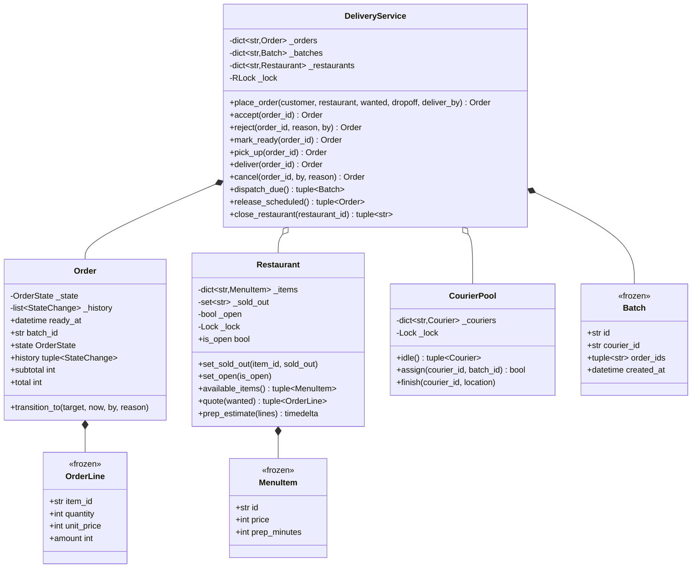

# 设计题解：外卖配送（Food Delivery）

## 题目与澄清

面试官的开场白："设计一个外卖平台：顾客点餐，餐厅做菜，骑手送达。"它听上去像[[solution-ride-sharing]]
那道题的变体，但**多出来的那一方改变了全部结构**。值得当场问出来的：

- **参与方到底是几个？** 三个：顾客、餐厅、骑手，再加上平台自己。这不是凑数——网约车里一次
  状态转移只需要问"能不能走"，外卖里必须同时回答"**谁**有资格走"。顾客不能把订单标成"已送达"，
  骑手不能替餐厅接单，餐厅接单后顾客不能单方面取消。这句话就是这道题的题眼。
- **骑手什么时候派？** 下单就派、餐厅接单就派、还是等菜快好了再派？这是第 2 关，也是整道题里
  唯一一个"没有正确答案、只有说得出代价的选择"。**追问一句"派早了谁买单、派晚了谁买单"**，
  面试官立刻知道你想过真实系统。
- **一位骑手能不能一次带两单？** 一定要问。答案是"能"的话，"骑手 ↔ 订单"就不是一对一，
  中间必须有一个批次（batch）的概念，而且要有一条硬规则防止拼单把第一位顾客坑了。
- **菜单会不会在顾客下单的过程中变？** 会，而且很频繁——后厨随时把一道菜标成售罄。所以
  "校验有没有货"和"生成订单"必须是同一个原子动作，否则就有一条缝。
- **缺货怎么办：少送一道，还是整单失败？** 本文选整单失败，理由在下面的决策里。
- **餐厅中途打烊呢？** 已经接下的单算不算数？这是第 4 关最爱问的一个，答案不是技术问题
  而是业务约定。
- **钱怎么表示？** 整数最小货币单位（分），订单行**抄下下单那一刻的价格**。

**范围之外**：地图与邻近搜索（坐标是平面点，距离是直线距离，和网约车同构）；支付与退款；
骑手侧完整的"发要约—可拒绝—超时顺延"机制——那一整套在[[solution-ride-sharing]]里写全了，
本文只保留它的最小形态（一次 IDLE→ASSIGNED 的比较并交换），把篇幅留给真正不同的三件事。

## 需求与分级

- **第 1 关（三方状态机，约 20 分钟）**：餐厅、菜单、顾客下单，以及订单跨三方的生命周期：
  PLACED → ACCEPTED / REJECTED（餐厅说了算）→ READY（餐厅）→ PICKED_UP（骑手）→ DELIVERED
  （骑手）。**每一条边都要写明允许的角色**。对应 `Restaurant`、`MenuItem`、`OrderLine`、
  `Order`、`OrderState`、`Actor`、`TRANSITIONS`。
- **第 2 关（派单时机，约 15 分钟）**：**餐厅接单之后**才派骑手，接单那一刻算出预计出餐时间
  `ready_at`，派单由时钟驱动地拉取。说清楚你的策略在优化什么：派早了骑手在店里空等，派晚了
  菜在出餐口变凉。对应 `CourierPool`、`DeliveryService.accept/dispatch_due`。
- **第 3 关（批次合并，约 15 分钟）**：两三单拼给同一位骑手，规则是"拼进来给**第一单**增加的
  送达时延不超过上限"。对应 `Batch`、`_batch_mates`、`_added_delay`。
- **第 4 关（选做，新需求）**：定时单（预约几点送到）与餐厅中途打烊。评分点是**加它们要不要动
  派单**——本文的答案是不用：定时单只多一个 SCHEDULED 状态和一条出边，打烊只是批量走一条
  已经存在的边。

## 核心对象与职责

- **`MenuItem`** — 一道菜：单价与单独制作所需的分钟数。**不带"还有没有货"**：可售状态是餐厅
  此刻的库存，不是这道菜的属性，放进来就会出现"同一道菜在两家店有两个 `available` 值"。
- **`Restaurant`** — 菜单、逐菜的售罄集合、开关店，以及出餐时长估计。它持有自己的锁，
  唯一的不变量是：`quote` 把"营业中吗 → 每道菜都还有吗 → 抄下价格"在一次加锁里做完。
- **`OrderLine`** — 订单上的一行，价格是下单那一刻的快照。
- **`OrderState` / `Actor` / `TRANSITIONS`** — 状态、角色，以及把两者钉在一起的那张嵌套表。
  这三样加起来就是这道题的设计。
- **`Order`** — 一张订单。它拥有一条不变量：状态只能沿 `TRANSITIONS` 走，且必须由有权的角色
  来走。`ready_at` 是它除状态外最重要的字段——**派单的全部时机判断都挂在它上面**。
  它不带锁，永远在服务的锁里被改。
- **`Courier` / `CourierPool`** — 骑手与独占。`assign` 是锁内的一次比较并交换，所以一位骑手
  不会同时拿到两个批次。
- **`Batch`** — 一位骑手一次带走的若干单，第一个 id 是**锚单**（先送到的那一单）。
  它是不可变的，而且**自己没有状态**——理由见下面的决策。
- **`DeliveryService`** — 门面：目录、下单、三方推进、派单时机、批次合并、定时单与打烊。

生命周期上，`DeliveryService` **组合** `Order` 和 `Batch`（它们随服务而生、随服务而灭），
**关联** `Restaurant` 与 `CourierPool`——两者由调用方构造并注入，各自持有自己的锁。



## 关键设计决策

### 状态机的每一条边都要写明"谁有权走"

这是三方系统和两方系统最根本的差别。三种写法：

```python
# 选项 1：只有转移表，权限散在各个方法里
def mark_ready(self, order_id, actor):
    if actor != "restaurant":            # 散落在十个方法里的十个 if
        raise PermissionError
    ...
```

```python
# 选项 2：一张转移表 + 一张单独的权限表（网约车那道题的做法）
ALLOWED_TRANSITIONS = {...}
CANCELLABLE_BY = {...}                   # 只有"取消"需要分方
```

```python
# 选项 3：把角色直接挂在边上（本文的选择）
TRANSITIONS: Mapping[OrderState, Mapping[OrderState, frozenset[Actor]]] = {
    OrderState.PLACED: {
        OrderState.ACCEPTED: frozenset({Actor.RESTAURANT}),
        OrderState.REJECTED: frozenset({Actor.RESTAURANT, Actor.PLATFORM}),
        OrderState.CANCELLED: frozenset({Actor.CUSTOMER, Actor.PLATFORM}),
    },
    OrderState.ACCEPTED: {
        OrderState.READY: frozenset({Actor.RESTAURANT}),
        OrderState.CANCELLED: frozenset({Actor.PLATFORM}),   # 顾客不能反悔了
    },
    ...
}
```

**为什么不是选项 2？** 在[[solution-ride-sharing]]里两张表是对的：那道题只有"取消"这一个动作
需要分方，其余的边天然属于司机，所以把权限单独列成一张小表最清楚。外卖不一样——**每一条边都
属于某一方**，接单属于餐厅、取餐属于骑手、下单前的取消属于顾客。权限一旦是全集上的属性而不是
少数边的例外，它就该和边住在一起，否则两张表的键必须一一对应，漏掉一行没人发现。判据可以记成
一句话：**例外用第二张表，通例进第一张表。**（[[structure.state-machines|状态机（State Machines）]]
给的是"状态机该不该显式"的判据，这里给的是它的下一层：许可信息该放在哪。）

**为什么不是选项 1？** 因为"谁能做什么"会被拆散到十个方法里，没有任何一个地方能一眼看全。
而这恰恰是三方系统最需要被审计的东西：新人加一个 `mark_ready` 的后门接口，表不会变，
但 `if` 会漏。

落到代码上还有一条纪律：**两种失败必须分开**。

```python
allowed = TRANSITIONS[self._state].get(target)
if allowed is None:
    raise IllegalTransitionError(...)     # 这条边根本不存在，谁来都不行
if by not in allowed:
    raise NotPermittedError(...)          # 边存在，但你没资格走
```

前者是流程错（"菜还没好就想取餐"），后者是权限错（"顾客想把订单标成已送达"）。给 App 的提示、
给客服的解释、给监控的告警完全不同；合并成一个 `ValueError`，线上排障时你会恨自己。

### 骑手什么时候派：下单就派、接单就派、还是掐着出餐时间派？

```python
# 选项 1：下单就派
def place_order(...):
    order = ...
    self._dispatch(order)        # 餐厅还没看这一单呢
```

```python
# 选项 2：接单就派
def accept(self, order_id):
    order.transition_to(ACCEPTED, ...)
    self._dispatch(order)        # 骑手立刻出发，到店干等二十分钟
```

```python
# 选项 3：接单算出 ready_at，由时钟驱动地掐着点派（本文的选择）
def dispatch_due(self) -> tuple[Batch, ...]:
    arrival = now + self._travel(courier.location, pickup)
    if arrival < order.ready_at - self._max_wait:
        continue                 # 还早，下一轮再说
```

**选项 1 直接出局**：餐厅可能拒单（食材用完、太忙、地址太远），派出去的骑手白跑一趟，这笔成本
平台要自己吃掉。"接单之前一个骑手都不派"是一条硬规则，不是优化。

**选项 2 和 3 的差别，是这道题最值得讲的三十秒。** 派早了，骑手在店门口空等——他的有效工时
被占用，平台要么多付钱，要么少接单；派晚了，菜做好了在出餐口凉着——顾客的投诉里"凉了"
永远排第一。两边都有成本，所以必须说清楚**你在优化哪一个**。

本文优化的是**食物温度**：以"骑手到店时最多空等 `max_courier_wait`（默认两分钟）"为约束，
尽量晚发车，但绝不让做好的菜等骑手。算式只有一行——骑手**现在出发**会在 `now + 路程` 到店，
只要这个时刻还早于 `ready_at - max_courier_wait`，就再等一轮。于是发车时刻自动落在
`ready_at - 路程 - max_courier_wait`。

它的失败模式要主动交代：如果那一刻**没有空闲骑手**，这一单就只能等，菜真的会凉。真实平台
在这里会做两件本文没做的事——提前扩大搜索半径，以及给这一单加钱提高骑手接单意愿。把这两句
说出来，比多写五十行代码有用。

顺带一提，`ready_at` 必须在**接单那一刻**算，不能在下单时算：下单时餐厅还没看这一单，
不知道后厨排了多少单；而出餐时长估计本身也值得说一句——它是"基础准备时间 + **最慢的那道菜**"，
不是所有菜相加，因为后厨是并行的。

### 批次合并：三个旋钮，还是一条不等式？

拼单的直觉规则有三条：两家店要近、两单要差不多时候出餐、不能太耽误第一单。很多实现会配三个
参数（`max_pickup_distance`、`max_ready_gap`、`max_added_delay`）。本文只留**最后一条**：

```python
def _added_delay(self, anchor: Order, other: Order) -> timedelta:
    a, b, drop = self._pickup(anchor), self._pickup(other), anchor.dropoff
    gap = (other.ready_at or other.placed_at) - (anchor.ready_at or anchor.placed_at)
    return max(self._travel(a, b), gap) + self._travel(b, drop) - self._travel(a, drop)
```

路线固定为"锚店 → 第二家店 → 锚单地址 → 第二单地址"。骑手在锚单出餐时刻拿到第一份，骑到第二家
店要 `travel(a, b)`；若第二单还没出餐，他还得等，所以这一段的耗时是
`max(travel(a, b), 出餐时间差)`；再加上从第二家店去锚单地址比直接去多走的那一段。

**两家店远，`travel(a, b)` 就大；出餐时间差大，`gap` 就大——两个约束都已经在这条不等式里了。**
多配一个旋钮，就多一处要向产品经理解释的取舍，而且三个阈值之间还会互相打架（店很近但出餐差
二十分钟，该不该拼？）。一个参数、一条语义清晰的业务承诺（"拼单最多让你晚五分钟收到"）
胜过三个需要调参的魔数。

锚单**必须先送**，而且锚单是按 `ready_at` 排序后最早的那一单：先出餐的先送，符合"谁等得久谁
优先"的直觉，也让"拼单只会推迟锚单 `max_added_delay`"这句承诺可以被直接断言。

### 批次不需要自己的状态机（这里拒绝一个模式）

写完 `Batch` 之后，最容易冒出来的念头是给它也配一个状态机：CREATED → PICKING_UP → DELIVERING
→ DONE。**不要。** 批次的状态就是其中每一单状态之和，另起一套只会多一份要对齐的真相：
骑手取了两单里的一单，批次算 PICKING_UP 还是 DELIVERING？两份状态一旦不一致，你既不知道该
信哪个，也没有办法判断是谁写错了。

所以 `Batch` 是一个 `frozen dataclass`：id、骑手、订单 id 的元组、创建时间，**没有任何方法**。
"整个批次送完了吗"是一次对订单状态的查询：

```python
if all(self._orders[i].state is OrderState.DELIVERED for i in batch.order_ids):
    self._couriers.finish(batch.courier_id, order.dropoff)
    del self._batches[batch.id]          # 批次表唯一会缩小的地方
```

判据：**一个对象只有在它拥有别人不能回答的问题时，才需要自己的状态。** 批次回答不了任何这样的
问题，所以它是一条记录，不是一台状态机。顺带，上面那两行也是批次表唯一会缩小的地方——
没有它，`_batches` 会随每一单永久增长。

### 菜单可售状态随时会变：在哪一刻校验，缺货怎么办

后厨把一道菜标成售罄这件事，可以发生在顾客点开菜单和点下"提交"之间的任何一毫秒。三种处理：

```python
# 选项 1：加购时校验一次，下单时相信它
# → 顾客下单成功，餐厅做不出来，只能事后道歉
```

```python
# 选项 2：下单时在餐厅自己的锁里一次性校验并抄价（本文的选择）
def quote(self, wanted: Mapping[str, int]) -> tuple[OrderLine, ...]:
    with self._lock:
        if not self._open:
            raise RestaurantClosedError(...)
        missing = [i for i in wanted if i not in self._items or i in self._sold_out]
        if missing:
            raise ItemUnavailableError(...)
        return tuple(OrderLine(...) for i, n in wanted.items() if n > 0)
```

```python
# 选项 3：不校验，交给餐厅在接单时拒掉
# → 简单，但顾客白等两分钟才收到"无法接单"
```

选项 2 是对的，但它**并不消灭**选项 3：真正的最终裁决权永远在餐厅手上，所以 REJECTED 这条边
必须存在。校验只是把绝大多数缺货挡在前面，让用户在两百毫秒内知道结果，而不是两分钟。
这是一个典型的"乐观校验 + 权威兜底"结构，和库存预留是同一个形状。

**缺货了少送一道行不行？** 不行。少送一道菜，配送成本一分不少，顾客满意度却是断崖式的；
而且"哪几道可以不送"根本不是系统能判断的。所以 `quote` 全成立或全失败。真要支持部分履约，
那是一个需要顾客当场确认的新流程（"米饭没了，是否继续？"），不是这里加一个 `if`。

同一条思路解释了打烊：**关店不是撤单。** 餐厅接单那一刻就已经承诺了，菜也已经在做，所以
`close_restaurant` 只把还没被接的单（PLACED 与 SCHEDULED）由平台代为拒绝，已接的单照常走完。

## 代码走读

整份实现如下。读的时候盯住四处：`TRANSITIONS` 那张嵌套表、`Restaurant.quote` 的一次加锁、
`dispatch_due` 里那个"再等一轮"的判断、以及 `_added_delay` 那一行不等式。

%% code:begin solution.py %%
```python
"""外卖配送（Food Delivery）——三方订单状态机、派单时机与批次合并的参考实现。

核心思路：这道题和网约车的差别只有一句话——**参与方是三个，不是两个**。所以状态机的每一条边
都必须说清楚"谁有权走"：`TRANSITIONS` 是一张 `{当前态: {目标态: 允许的角色}}` 的嵌套表，
非法的目标抛 `IllegalTransitionError`，合法但越权抛 `NotPermittedError`——两个错误分开，才
说得清"这单为什么没送出去"。餐厅**接单之前谁都不派骑手**：接单那一刻才算出预计出餐时间
`ready_at`，派单是一个由时钟驱动的拉取动作，掐着"骑手到店时最多空等 `max_courier_wait`"
发出去，把菜凉的风险压到零、把成本压在骑手的空等上。批次合并只有一条规则：把第二单拼进来，
给**第一单**增加的送达时延不超过上限——这一条同时管住了"两家店要近"和"两单要差不多时候出餐"。
菜品可售状态随时会变，所以校验与抄价在餐厅自己的锁里一次做完：下单那一刻的价格就是最终价格。

坐标与直线距离和网约车同构，此处不再展开；骑手侧只保留最小的独占（IDLE→ASSIGNED 的一次
比较并交换），完整的"要约—拒单—超时顺延"机制见网约车那一题。
"""

from __future__ import annotations

import itertools
import math
import threading
from collections.abc import Callable, Mapping, Sequence
from dataclasses import dataclass, replace
from datetime import datetime, timedelta
from enum import Enum


# --------------------------------------------------------------------------
# 失败路径：把"做不到"和"没资格"分开，是这道题最值钱的一条纪律。


class DeliveryError(Exception):
    """本设计里所有失败路径的公共基类。"""

class UnknownRestaurantError(DeliveryError):
    """餐厅 id 不存在。"""

class UnknownOrderError(DeliveryError):
    """订单号不存在。"""

class RestaurantClosedError(DeliveryError):
    """餐厅此刻不接单。"""

class ItemUnavailableError(DeliveryError):
    """菜单上没有这道菜，或它此刻已售罄。"""

class IllegalTransitionError(DeliveryError):
    """订单状态机里根本没有这条边——无论谁来做都不行。"""

class NotPermittedError(DeliveryError):
    """这条边存在，但发起者没有资格走它（比如顾客想把订单标成"已送达"）。"""


# --------------------------------------------------------------------------
# 地理与菜单。


@dataclass(frozen=True, slots=True)
class Location:
    """平面上的一个点，单位当作公里；距离是直线距离。真实系统这里是路网与空间索引。"""

    x: float
    y: float

    def distance_to(self, other: "Location") -> float:
        """到另一点的直线距离。"""
        return math.hypot(self.x - other.x, self.y - other.y)


@dataclass(frozen=True, slots=True)
class MenuItem:
    """菜单上的一道菜：单价（分）与单独制作所需的分钟数。不可变——"这道菜现在还有没有"
    是餐厅的库存状态，不是菜本身的属性，所以它不在这里。
    """

    id: str
    name: str
    price: int
    prep_minutes: int = 10


@dataclass(frozen=True, slots=True)
class OrderLine:
    """订单上的一行：**抄下下单那一刻的单价**，此后餐厅改价不追溯已下的单。"""

    item_id: str
    name: str
    quantity: int
    unit_price: int

    @property
    def amount(self) -> int:
        """这一行的小计，单位是分。"""
        return self.quantity * self.unit_price


class Restaurant:
    """一家餐厅：菜单、逐菜的可售状态、开关店，以及出餐时长的估计。

    不变量：`quote` 把"营业中吗 → 每道菜都还有吗 → 抄下价格"在自己的锁里**一次做完**。
    菜品可售状态随时可能被后厨改掉，拆成两步就会出现"校验通过、下单时已售罄"的缝。
    """

    def __init__(self, restaurant_id: str, name: str, location: Location,
                 base_prep: timedelta = timedelta(minutes=5)) -> None:
        self.id = restaurant_id
        self.name = name
        self.location = location
        self.base_prep = base_prep
        self._items: dict[str, MenuItem] = {}
        self._sold_out: set[str] = set()
        self._open = True
        self._lock = threading.Lock()

    @property
    def is_open(self) -> bool:
        """此刻是否接单。"""
        with self._lock:
            return self._open

    def add_item(self, item: MenuItem) -> None:
        """上架一道菜。"""
        with self._lock:
            self._items[item.id] = item

    def set_sold_out(self, item_id: str, sold_out: bool = True) -> None:
        """后厨把某道菜标成售罄／恢复。它可以发生在任何时刻，包括顾客正在下单时。"""
        with self._lock:
            self._sold_out.add(item_id) if sold_out else self._sold_out.discard(item_id)

    def set_open(self, is_open: bool) -> None:
        """开店／关店。关店只影响**还没被接的**单，已接的单必须做完。"""
        with self._lock:
            self._open = is_open

    def available_items(self) -> tuple[MenuItem, ...]:
        """此刻可下单的菜的不可变快照——绝不把内部的菜单字典交出去。"""
        with self._lock:
            return tuple(item for item_id, item in self._items.items() if item_id not in self._sold_out)

    def quote(self, wanted: Mapping[str, int]) -> tuple[OrderLine, ...]:
        """把"要哪些菜、各几份"变成订单行，全成立或全失败。

        **不做部分履约**：三道菜缺一道就整单失败。少送一道菜的配送成本一分不少，顾客的
        满意度却断崖式下跌；真要支持，那是一个需要顾客确认的新流程，不是这里的一个 `if`。
        """
        with self._lock:
            if not self._open:
                raise RestaurantClosedError(f"restaurant {self.id} is closed")
            missing = [i for i in wanted if i not in self._items or i in self._sold_out]
            if missing:
                raise ItemUnavailableError(f"restaurant {self.id} cannot serve {missing}")
            return tuple(OrderLine(item_id=i, name=self._items[i].name, quantity=n,
                                   unit_price=self._items[i].price)
                         for i, n in wanted.items() if n > 0)

    def prep_estimate(self, lines: Sequence[OrderLine]) -> timedelta:
        """预计出餐时长：基础准备时间 + **最慢的那道菜**，不是所有菜相加——后厨是并行的。"""
        with self._lock:
            slowest = max((self._items[l.item_id].prep_minutes for l in lines), default=0)
        return self.base_prep + timedelta(minutes=slowest)


# --------------------------------------------------------------------------
# 订单状态机：一张"边 → 有权走它的角色"的嵌套表。这是本题的设计核心。


class OrderState(Enum):
    """订单的八个状态。SCHEDULED 是第 4 关加进来的，只多一条出边。"""

    SCHEDULED = "scheduled"
    PLACED = "placed"
    ACCEPTED = "accepted"
    READY = "ready"
    PICKED_UP = "picked_up"
    DELIVERED = "delivered"
    REJECTED = "rejected"
    CANCELLED = "cancelled"


class Actor(Enum):
    """三个真实参与方，加上平台自己。每一条边都必须指明它属于谁。"""

    CUSTOMER = "customer"
    RESTAURANT = "restaurant"
    COURIER = "courier"
    PLATFORM = "platform"


TRANSITIONS: Mapping[OrderState, Mapping[OrderState, frozenset[Actor]]] = {
    OrderState.SCHEDULED: {
        OrderState.PLACED: frozenset({Actor.PLATFORM}),
        OrderState.REJECTED: frozenset({Actor.RESTAURANT, Actor.PLATFORM}),
        OrderState.CANCELLED: frozenset({Actor.CUSTOMER, Actor.PLATFORM}),
    },
    OrderState.PLACED: {
        OrderState.ACCEPTED: frozenset({Actor.RESTAURANT}),
        OrderState.REJECTED: frozenset({Actor.RESTAURANT, Actor.PLATFORM}),
        OrderState.CANCELLED: frozenset({Actor.CUSTOMER, Actor.PLATFORM}),
    },
    OrderState.ACCEPTED: {
        OrderState.READY: frozenset({Actor.RESTAURANT}),
        OrderState.CANCELLED: frozenset({Actor.PLATFORM}),
    },
    OrderState.READY: {OrderState.PICKED_UP: frozenset({Actor.COURIER})},
    OrderState.PICKED_UP: {OrderState.DELIVERED: frozenset({Actor.COURIER})},
    OrderState.DELIVERED: {},
    OrderState.REJECTED: {},
    OrderState.CANCELLED: {},
}


@dataclass(frozen=True, slots=True)
class StateChange:
    """一次转移的留痕：什么时候、从哪到哪、**谁**干的、为什么。三方系统里"谁"是必填项。"""

    at: datetime
    previous: OrderState
    current: OrderState
    by: Actor
    reason: str | None = None


class Order:
    """一张订单。它只拥有一条不变量：状态只能沿 `TRANSITIONS` 走，且必须由有权的角色来走。

    `ready_at` 是餐厅接单那一刻算出的**预计出餐时间**——派单时机完全由它决定，所以它是
    订单上除状态之外最重要的一个字段。它不带锁：订单永远在 `DeliveryService` 的锁里被改。
    """

    def __init__(self, order_id: str, customer_id: str, restaurant_id: str,
                 lines: Sequence[OrderLine], dropoff: Location, placed_at: datetime,
                 delivery_fee: int, state: OrderState = OrderState.PLACED,
                 deliver_by: datetime | None = None) -> None:
        self.id = order_id
        self.customer_id = customer_id
        self.restaurant_id = restaurant_id
        self.lines = tuple(lines)
        self.dropoff = dropoff
        self.placed_at = placed_at
        self.delivery_fee = delivery_fee
        self.deliver_by = deliver_by
        self.ready_at: datetime | None = None
        self.batch_id: str | None = None
        self._state = state
        self._history: list[StateChange] = []

    @property
    def state(self) -> OrderState:
        """当前状态。只读——唯一的改法是一次受检、受权的转移。"""
        return self._state

    @property
    def history(self) -> tuple[StateChange, ...]:
        """状态轨迹的不可变快照。"""
        return tuple(self._history)

    @property
    def subtotal(self) -> int:
        """菜品小计，单位是分。"""
        return sum(line.amount for line in self.lines)

    @property
    def total(self) -> int:
        """顾客实付：小计加配送费。"""
        return self.subtotal + self.delivery_fee

    def transition_to(self, target: OrderState, now: datetime, by: Actor,
                      reason: str | None = None) -> None:
        """走一步。两种失败**必须分开**：这条边不存在（`IllegalTransitionError`），
        和这条边存在但你没资格走（`NotPermittedError`）。前者是流程错，后者是权限错，
        给调用方的提示、给客服的解释、给监控的告警都不一样。
        """
        allowed = TRANSITIONS[self._state].get(target)
        if allowed is None:
            raise IllegalTransitionError(
                f"order {self.id}: {self._state.value} -> {target.value} is not a transition")
        if by not in allowed:
            raise NotPermittedError(
                f"{by.value} may not move order {self.id} to {target.value}")
        self._history.append(StateChange(now, self._state, target, by, reason))
        self._state = target


# --------------------------------------------------------------------------
# 骑手与批次。


class CourierStatus(Enum):
    """骑手只有派单关心的两个状态。上下线、接单意愿、要约超时这些和网约车完全同构，
    本题不重复——多一个用不上的 OFFLINE 成员，就是一处永远不会被测到的死代码。
    """

    IDLE = "idle"
    ASSIGNED = "assigned"


@dataclass(frozen=True, slots=True)
class Courier:
    """一位骑手此刻的全部状态。不可变，改状态靠整条替换。"""

    id: str
    location: Location | None = None
    status: CourierStatus = CourierStatus.IDLE
    batch_id: str | None = None


@dataclass(frozen=True, slots=True)
class Batch:
    """一位骑手一次带走的若干单，**第一个 id 是锚单**：它先被送到。

    批次自己没有状态——它的状态就是其中每一单的状态之和，另起一套只会多一份要对齐的真相。
    """

    id: str
    courier_id: str
    order_ids: tuple[str, ...]
    created_at: datetime


class CourierPool:
    """骑手名册与独占。`assign` 是锁内的一次比较并交换，所以一位骑手不会拿到两个批次。

    完整的"发要约—可拒绝—超时顺延"机制在网约车那一题里，本类只保留它的最小形态：
    外卖的难点不在骑手要不要接，而在什么时候派、以及能不能拼单。
    """

    def __init__(self) -> None:
        self._couriers: dict[str, Courier] = {}
        self._lock = threading.Lock()

    def go_online(self, courier_id: str, location: Location) -> None:
        """骑手上线并报位置。"""
        with self._lock:
            self._couriers[courier_id] = Courier(courier_id, location, CourierStatus.IDLE)

    def idle(self) -> tuple[Courier, ...]:
        """此刻空闲的骑手快照。"""
        with self._lock:
            return tuple(c for c in self._couriers.values() if c.status is CourierStatus.IDLE)

    @property
    def idle_count(self) -> int:
        """空闲骑手数——只给计数，不把名册交出去。"""
        with self._lock:
            return sum(1 for c in self._couriers.values() if c.status is CourierStatus.IDLE)

    def assign(self, courier_id: str, batch_id: str) -> bool:
        """IDLE → ASSIGNED，成功返回 `True`；抢不到是正常路径，不是异常。"""
        with self._lock:
            courier = self._couriers.get(courier_id)
            if courier is None or courier.status is not CourierStatus.IDLE:
                return False
            self._couriers[courier_id] = replace(courier, status=CourierStatus.ASSIGNED,
                                                 batch_id=batch_id)
            return True

    def finish(self, courier_id: str, location: Location) -> None:
        """整个批次送完：骑手回到 IDLE，位置更新为最后一个送达点。"""
        with self._lock:
            courier = self._couriers.get(courier_id)
            if courier is not None:
                self._couriers[courier_id] = replace(courier, status=CourierStatus.IDLE,
                                                     location=location, batch_id=None)


# --------------------------------------------------------------------------
# DeliveryService：门面。目录、下单、三方推进、派单时机、批次合并。


Clock = Callable[[], datetime]


class DeliveryService:
    """外卖平台：接单、派单、送达，以及定时单与关店这两个第 4 关的追加需求。

    锁纪律：服务锁保护订单表与批次表；它可以在持有自己的锁时去调 `Restaurant` 和
    `CourierPool`（服务锁 → 资源锁，方向唯一），反向调用不存在，所以没有锁序死锁。

    派单策略优化的是**食物温度**：骑手到店时最多空等 `max_courier_wait`，绝不让做好的菜
    在出餐口等骑手。代价落在骑手的有效工时上——这是平台每天都在调的那个旋钮，不是一个
    有唯一正确答案的算法。
    """

    def __init__(self, clock: Clock, couriers: CourierPool,
                 speed_km_per_minute: float = 0.4,
                 max_courier_wait: timedelta = timedelta(minutes=2),
                 max_added_delay: timedelta = timedelta(minutes=5),
                 max_batch_size: int = 3,
                 delivery_fee: int = 500) -> None:
        self._clock, self._couriers = clock, couriers
        self._speed, self._max_wait = speed_km_per_minute, max_courier_wait
        self._max_added_delay, self._max_batch = max_added_delay, max_batch_size
        self._delivery_fee = delivery_fee
        self._restaurants: dict[str, Restaurant] = {}
        self._orders: dict[str, Order] = {}
        self._batches: dict[str, Batch] = {}
        self._lock = threading.RLock()
        self._ids = itertools.count(1)

    # ---- 目录与读 ---------------------------------------------------------

    def register(self, restaurant: Restaurant) -> None:
        """把一家餐厅挂上平台。"""
        with self._lock:
            self._restaurants[restaurant.id] = restaurant

    def restaurant(self, restaurant_id: str) -> Restaurant:
        """按 id 取餐厅。"""
        with self._lock:
            found = self._restaurants.get(restaurant_id)
        if found is None:
            raise UnknownRestaurantError(f"unknown restaurant {restaurant_id!r}")
        return found

    def order(self, order_id: str) -> Order:
        """按订单号取订单。"""
        with self._lock:
            found = self._orders.get(order_id)
        if found is None:
            raise UnknownOrderError(f"unknown order {order_id!r}")
        return found

    def batch(self, batch_id: str) -> Batch:
        """按批次号取批次。"""
        with self._lock:
            return self._batches[batch_id]

    @property
    def open_batch_count(self) -> int:
        """尚未送完的批次数——用计数暴露内部表的大小，测试据此断言它确实会缩小。"""
        with self._lock:
            return len(self._batches)

    # ---- 第 1 关：下单与三方推进 -------------------------------------------

    def place_order(self, customer_id: str, restaurant_id: str, wanted: Mapping[str, int],
                    dropoff: Location, deliver_by: datetime | None = None) -> Order:
        """顾客下单：在餐厅的锁里一次性校验营业与可售、并抄下价格，然后落一张订单。

        `deliver_by` 非空就是定时单，落在 SCHEDULED，由 `release_scheduled` 到点放出来。
        """
        now = self._clock()
        restaurant = self.restaurant(restaurant_id)
        lines = restaurant.quote(wanted)
        state = OrderState.SCHEDULED if deliver_by else OrderState.PLACED
        with self._lock:
            order = Order(f"F{next(self._ids)}", customer_id, restaurant_id, lines, dropoff,
                          now, self._delivery_fee, state=state, deliver_by=deliver_by)
            self._orders[order.id] = order
            return order

    def accept(self, order_id: str) -> Order:
        """餐厅接单：PLACED → ACCEPTED，并在**这一刻**算出预计出餐时间。

        `ready_at` 必须此时才算：下单时餐厅还没看单，不知道后厨排了多少单；而派单的全部
        时机判断都挂在它上面。接单之前**一个骑手都不派**——派了之后餐厅拒单，骑手白跑。
        """
        now = self._clock()
        with self._lock:
            order = self.order(order_id)
            order.transition_to(OrderState.ACCEPTED, now, Actor.RESTAURANT)
            order.ready_at = now + self.restaurant(order.restaurant_id).prep_estimate(order.lines)
            return order

    def reject(self, order_id: str, reason: str, by: Actor = Actor.RESTAURANT) -> Order:
        """餐厅（或平台代为）拒单：PLACED → REJECTED，终态。"""
        return self._move(order_id, OrderState.REJECTED, by, reason)

    def mark_ready(self, order_id: str) -> Order:
        """餐厅出餐：ACCEPTED → READY。只有餐厅能做这一步。"""
        return self._move(order_id, OrderState.READY, Actor.RESTAURANT)

    def pick_up(self, order_id: str) -> Order:
        """骑手取餐：READY → PICKED_UP。菜没出好就取不走，这条边天然挡住了抢跑。"""
        return self._move(order_id, OrderState.PICKED_UP, Actor.COURIER)

    def deliver(self, order_id: str) -> Order:
        """骑手送达：PICKED_UP → DELIVERED；批次里最后一单送完，骑手才回到空闲。"""
        now = self._clock()
        with self._lock:
            order = self._move(order_id, OrderState.DELIVERED, Actor.COURIER)
            batch = self._batches.get(order.batch_id or "")
            if batch is not None and all(self._orders[i].state is OrderState.DELIVERED
                                         for i in batch.order_ids):
                self._couriers.finish(batch.courier_id, order.dropoff)
                del self._batches[batch.id]
            return order

    def cancel(self, order_id: str, by: Actor, reason: str | None = None) -> Order:
        """取消。餐厅一旦接单，顾客就不能再取消——菜已经在做了，成本已经发生。"""
        return self._move(order_id, OrderState.CANCELLED, by, reason)

    # ---- 第 2、3 关：派单时机与批次合并 ------------------------------------

    def dispatch_due(self) -> tuple[Batch, ...]:
        """把此刻"该派了"的订单派出去，返回新建的批次。由时钟驱动，测试里显式调用。

        对每一张已接单、还没进批次的订单：找到到店最快的空闲骑手，算出他**现在出发**会
        几点到店；只要到店时刻还早于"出餐时间减去可接受的空等"，就再等一轮。这样骑手最多
        空等 `max_courier_wait`，而做好的菜一秒都不用等——这就是本策略优化的目标。
        """
        now = self._clock()
        created: list[Batch] = []
        with self._lock:
            pending = sorted((o for o in self._orders.values()
                              if o.state is OrderState.ACCEPTED and o.batch_id is None),
                             key=lambda o: (o.ready_at or now, o.id))
            for anchor in pending:
                if anchor.batch_id is not None:
                    continue
                courier = self._closest_idle(anchor)
                if courier is None:
                    continue
                arrival = now + self._travel(courier.location, self._pickup(anchor))
                if arrival < (anchor.ready_at or now) - self._max_wait:
                    continue
                members = (anchor, *self._batch_mates(anchor, pending))
                batch_id = f"B{next(self._ids)}"
                if not self._couriers.assign(courier.id, batch_id):
                    continue
                batch = Batch(batch_id, courier.id, tuple(o.id for o in members), now)
                for member in members:
                    member.batch_id = batch_id
                self._batches[batch_id] = batch
                created.append(batch)
        return tuple(created)

    def _batch_mates(self, anchor: Order, pending: Sequence[Order]) -> tuple[Order, ...]:
        """给锚单挑拼车伙伴：**唯一的规则**是"拼进来给锚单增加的送达时延不超过上限"。

        这一条同时管住了两件事——两家店必须近（`travel(R锚, R拼)` 进了公式），两单必须
        差不多时候出餐（`ready_at` 之差也进了公式）。不需要再单独配一个"距离上限"参数：
        多一个旋钮就多一处要解释的取舍。
        """
        mates: list[Order] = []
        for other in pending:
            if len(mates) >= self._max_batch - 1:
                break
            if other is anchor or other.batch_id is not None:
                continue
            if self._added_delay(anchor, other) <= self._max_added_delay:
                mates.append(other)
        return tuple(mates)

    def _added_delay(self, anchor: Order, other: Order) -> timedelta:
        """把 `other` 拼进来之后，锚单的送达晚了多久。

        路线固定为"锚店 → 第二家店 → 锚单地址 → 第二单地址"。骑手在锚单出餐时刻拿到第一份，
        骑到第二家店要 `travel(a, b)`，若第二单还没出餐还得等，所以这一段的耗时是
        `max(travel(a, b), 第二单出餐 - 锚单出餐)`；再加上从第二家店去锚单地址比直接去多
        走的那一段。两个上限（店要近、出餐要同时）就这样被压进了同一条不等式。
        """
        a, b, drop = self._pickup(anchor), self._pickup(other), anchor.dropoff
        gap = (other.ready_at or other.placed_at) - (anchor.ready_at or anchor.placed_at)
        return max(self._travel(a, b), gap) + self._travel(b, drop) - self._travel(a, drop)

    def _closest_idle(self, order: Order) -> Courier | None:
        """离取餐点最近的空闲骑手；并列按 id 打破，否则测试会飘。"""
        pickup = self._pickup(order)
        idle = [c for c in self._couriers.idle() if c.location is not None]
        return min(idle, key=lambda c: (c.location.distance_to(pickup), c.id), default=None)

    # ---- 第 4 关：定时单与关店 ---------------------------------------------

    def release_scheduled(self) -> tuple[Order, ...]:
        """把到点的定时单放成普通的 PLACED 单，交给餐厅去接。

        放行时刻 = 期望送达 -（预计出餐 + 从餐厅到顾客的路程）。**派单一行没改**：它只认
        `ready_at`，而 `ready_at` 依旧在餐厅接单那一刻产生。SCHEDULED 只多了一条出边。
        """
        now = self._clock()
        released: list[Order] = []
        with self._lock:
            for order in list(self._orders.values()):
                if order.state is not OrderState.SCHEDULED or order.deliver_by is None:
                    continue
                restaurant = self.restaurant(order.restaurant_id)
                lead = restaurant.prep_estimate(order.lines) + self._travel(
                    restaurant.location, order.dropoff)
                if now >= order.deliver_by - lead:
                    order.transition_to(OrderState.PLACED, now, Actor.PLATFORM, "scheduled order due")
                    released.append(order)
        return tuple(released)

    def close_restaurant(self, restaurant_id: str) -> tuple[str, ...]:
        """餐厅打烊：不再接新单，**还没被接的单由平台代为拒绝**，已接的单必须做完。

        关店不是撤单——餐厅接单那一刻就已经承诺了，菜也已经在做。这条规则让"关店"这个
        第 4 关需求完全不碰派单：已接的单照常走 `ready_at`，派单逻辑毫不知情。

        并发上有一条**刻意留着**的缝：另一个线程可能刚通过 `quote` 的校验、正要落单，于是
        关店之后仍然多出一张 PLACED。兜底是现成的——PLACED → REJECTED 这条边一直可用，
        餐厅（或下一次关店调用）随时能拒掉它。为这条缝去跨两把锁做一次全局互斥，代价远大于
        收益，这正是"乐观校验 + 权威兜底"那个结构的意义。
        """
        now = self._clock()
        self.restaurant(restaurant_id).set_open(False)
        with self._lock:
            doomed = [o for o in self._orders.values() if o.restaurant_id == restaurant_id
                      and o.state in (OrderState.PLACED, OrderState.SCHEDULED)]
            for order in doomed:
                order.transition_to(OrderState.REJECTED, now, Actor.PLATFORM, "restaurant closed")
            return tuple(o.id for o in doomed)

    # ---- 内部 -------------------------------------------------------------

    def _move(self, order_id: str, target: OrderState, by: Actor,
              reason: str | None = None) -> Order:
        """一次受检、受权的状态推进。"""
        now = self._clock()
        with self._lock:
            order = self.order(order_id)
            order.transition_to(target, now, by, reason)
            return order

    def _pickup(self, order: Order) -> Location:
        """这张订单的取餐点。"""
        return self.restaurant(order.restaurant_id).location

    def _travel(self, a: Location | None, b: Location) -> timedelta:
        """按固定骑行速度把距离折算成时间。"""
        km = 0.0 if a is None else a.distance_to(b)
        return timedelta(minutes=km / self._speed)


if __name__ == "__main__":
    from datetime import UTC

    now = datetime(2026, 9, 20, 11, 30, tzinfo=UTC)
    kitchen = Restaurant("R1", "川办", Location(0, 0), base_prep=timedelta(minutes=5))
    kitchen.add_item(MenuItem("m1", "回锅肉", 3800, prep_minutes=12))
    kitchen.add_item(MenuItem("m2", "米饭", 300, prep_minutes=2))

    couriers = CourierPool()
    couriers.go_online("c1", Location(2.0, 0.0))
    service = DeliveryService(clock=lambda: now, couriers=couriers)
    service.register(kitchen)

    order = service.place_order("u1", "R1", {"m1": 1, "m2": 2}, Location(4.0, 0.0))
    print(f"{order.id}: {order.total} fen, state {order.state.value}")
    service.accept(order.id)
    print(f"accepted, ready at {order.ready_at:%H:%M}; dispatch now? {bool(service.dispatch_due())}")
    now = now + timedelta(minutes=10)
    print(f"ten minutes later, dispatched: {[b.id for b in service.dispatch_due()]}")
    service.mark_ready(order.id)
    service.pick_up(order.id)
    service.deliver(order.id)
    print(f"{order.id} {order.state.value}; courier idle again: {couriers.idle_count == 1}")
```
%% code:end %%

**`Order.transition_to` 是全文最短、也最该被背下来的一段。** 两次查询、两种异常：目标不在表里
就是流程错，角色不在集合里就是权限错。除此之外它只做一件事——往 `history` 里追加一条带
`by` 的留痕。三方系统里"谁在什么时候把这单改成了什么"是客服每天要回答的问题，它只能来自
事中记录。

**`dispatch_due` 是一个"拉"而不是"推"的方法。** 它不注册定时器、不起后台线程，而是由调用方
（生产上是一个每几秒跑一次的循环）驱动，时间从注入的时钟来。好处是测试可以把时钟拨到任意
一刻、断言"这时候该派了吗"，一行 `sleep` 都不用；坏处是必须有人真的去调它，所以生产上这个
循环挂了就是全站不派单——这类"拉"的设计必须配一个心跳告警。

**批次的组装顺序值得注意。** `pending` 先按 `ready_at` 排序，所以锚单永远是最早出餐的那一单；
挑完伙伴之后才去 `assign` 骑手，`assign` 落不下就整批放弃、下一轮重来——**先算好，再用一次
原子操作去落地**，而不是先把骑手锁住再慢慢算。这里要诚实一点：服务锁已经把 `dispatch_due`
整个串行化了，所以在**本进程里** `assign` 永远不会失败，它的返回值是给"骑手池被多个派单器
共享"那一天准备的。骑手池不依赖服务锁来保证自己的不变量，这是两层各自完整的纪律，
而不是一层多余的防御。

**`release_scheduled` 是第 4 关"加需求不改老代码"的证据。** 定时单在 SCHEDULED 里待着，
到点了由平台走一条 SCHEDULED → PLACED 的边，之后的一切和普通订单完全一样。**派单一行没改**：
它只认 `ready_at`，而 `ready_at` 依旧在餐厅接单那一刻产生。老实说，这里确实**加了**一个状态
和一条边——说"完全没动"是不诚实的，说"只加不改"才是对的。

## 测试与自检

二十二个测试，每一组盯住一条设计承诺：

- **三方权限**：同一个对象上，`PLACED → PICKED_UP` 抛 `IllegalTransitionError`（边不存在），
  `PLACED → ACCEPTED` 由顾客发起抛 `NotPermittedError`（越权）。两个断言写在同一个测试里，
  因为它们的区别本身就是被测的设计。
- **菜单原子性**：售罄一道菜，整单失败；恢复后又能下；下单后餐厅改价不追溯已下的单。
- **出餐估计**：基础五分钟 + 最慢的十二分钟 = 十七分钟，**不是**十二加二加五。
- **派单时机**：餐厅没接单，拨快一小时也不派；骑手离店五分钟、可接受空等两分钟，那么发车时刻
  必须让"出餐时刻 - 到店时刻"落在 0 到 2 分钟之间——这个断言直接量化了策略在优化什么。
  骑手太远（五十分钟路程）时立刻发车。
- **批次**：同店同时出餐的两单进同一个批次且锚单在前；出餐差十分钟的不拼；第二家店远六公里的
  不拼；批次大小不超过配置；**第一单送到之后骑手仍然不空闲**，最后一单送到才空闲，
  且 `open_batch_count` 归零。
- **并发**：四个线程同时 `dispatch_due`，断言的是不变量——每位骑手至多一个批次、每张订单至多
  进一个批次、九张单一张不多一张不少。没有一句依赖线程调度顺序。
- **第 4 关**：定时单在到点前餐厅根本接不了（抛 `IllegalTransitionError`）；打烊时未接的单被
  平台拒掉、已接的单不受影响、新单被拒绝。

**两分钟怎么给面试官演示**：跑 `python solution.py`。它打印四行，关键是第二行和第三行——
接单时系统说"现在还不派"，把时钟拨快十分钟再问，批次就出来了。这一对输出，就是第 2 关的全部。

## 扩展与追问

**新需求**

- *配送费按距离分档*：一个注入的普通函数 `(Order, Restaurant) -> int`，在 `place_order` 里调用。
  和[[patterns.strategy|策略模式与可替换算法（Strategy）]]的其他落点一样，不需要抽象基类。
- *骑手可以拒单*：把 `CourierPool.assign` 换成[[solution-ride-sharing]]里那套要约机制——
  发一张带超时的要约、可拒、顺位再发。改动完全被关在 `CourierPool` 和 `dispatch_due` 里，
  订单状态机一行不动。这是本文把骑手侧做薄的回报。
- *顾客改地址*：只在 PICKED_UP 之前允许，且要重算批次里的绕路——所以它必须是一个受检的动作，
  不是一次属性赋值。
- *餐厅评分*：DELIVERED 之后的一条独立记录，不该长在 `Order` 上；终态对象不再变，是"终态"
  这个词的全部意义。

**并发与线程安全**

- *三把锁会不会死锁？* 不会：锁序只有一个方向（服务锁 → 餐厅锁／骑手池锁），下层从不回调
  上层。这条纪律靠约定维持，所以必须写进类的文档字符串。
- *GIL 给了我什么？* 几乎什么都没给。`assign` 里的"查状态 + 写状态"是多条字节码，
  靠的是 `threading.Lock`。
- *派单循环要不要多线程？* 本文允许多线程同时 `dispatch_due`，靠 `assign` 的比较并交换兜底。
  真实系统更常见的是按城市分片、每片单线程决策——那时 `CourierPool` 恰好就是分片边界。
- *餐厅的锁会不会成为热点？* 一家爆单的店确实会；但 `quote` 只做几次字典查找，持锁时间是
  微秒级。真出问题时，把可售状态换成带版本号的读多写少结构比加大锁粒度更对症。

**持久化与规模**

- *订单落库*：`transition_to` 是唯一的写入点，所以事件流落库只需要在这一个方法里挂钩子；
  `history` 本身就是事件序列。
- *`dispatch_due` 的全表扫描*：它每轮遍历所有 ACCEPTED 订单，单城单机没问题。规模上来后，
  把"待派订单"换成按 `ready_at` 排的小顶堆，只看堆顶那些到点的——**只影响这一个方法**。
- *定时单*：同理，`release_scheduled` 现在也是全表扫描，换成按 `deliver_by` 排的堆即可。
- *跨机器*：批次分配是一次比较并交换，天然对应数据库的条件更新（`UPDATE ... WHERE status='idle'`）
  或 Redis 的 `SET NX`；`batch_id` 就是那个 fencing token。

## 常见错误

- **忘了"谁"这一维**，把外卖当成单方的订单状态机。结果是顾客能把订单标成已送达、骑手能替餐厅
  接单，而代码里看不出任何问题。三方系统里，**角色是转移的一部分**。
- **餐厅接单前就派骑手**。骑手白跑的成本平台自己吃。
- **接单就立刻派**，然后在扩展环节说不出自己在优化什么。派早派晚都有成本，讲不出取舍就是没想过。
- **拼单没有硬约束**，或者约束是"两家店五公里内"这种和顾客体验无关的量。顾客关心的是
  "我会不会因此晚收到"，规则就该直接写成这句话。
- **给批次也配一套状态机**，于是有两份会不一致的真相。
- **菜单可售状态和价格校验分两步做**，中间留一条缝；或者缺货时少送一道菜。
- **非法转移和越权合并成一个异常**，线上排障时分不清是流程错还是权限错。
- **批次表只增不减**。批次在最后一单送达时被删，这是它唯一会缩小的地方——每一个容器都要
  能回答"谁在什么时候删我"。（订单表不缩小是刻意的：订单是业务档案，客服明天还要查它；
  批次是工作单据，送完就没用了。这两者的区别要说得出来。）
- **Java 习惯**：`FoodDeliveryService` 用 `__new__` 做单例；`getStatus()` / `setStatus()`
  一堆；给只有一个实现的 `DispatchStrategy` 建抽象基类；`MenuItem` 写成带 getter/setter 的
  可变类。Python 里分别对应：直接注入、`@property`、普通函数、`frozen=True` 的 dataclass。
- **金额用 `float`**，或者订单行不抄价格，于是餐厅晚上改一次价，白天的历史订单金额全变了。

## 45 分钟怎么分配

- **0–5 分钟｜澄清。** 把三个参与方点出来，问清楚"骑手什么时候派""能不能拼单""菜单会不会
  中途变"。主动把地图排除掉。
- **5–13 分钟｜状态机。** 在白板上画出 PLACED → ACCEPTED → READY → PICKED_UP → DELIVERED，
  **每条边上写一个角色**，再补上 REJECTED 和 CANCELLED 两条支线。边画边说"顾客不能标已送达，
  餐厅接单后顾客不能取消"。这一段不写代码就能拿分。
- **13–24 分钟｜第 1 关的代码。** `MenuItem`、`Restaurant.quote`（强调那一次加锁）、
  `OrderLine`、`Order.transition_to`（强调两种异常）、`DeliveryService` 上的几个推进方法。
- **24–33 分钟｜派单时机。** 写 `accept` 里那一行 `ready_at`，再写 `dispatch_due` 里那个
  "再等一轮"的判断。**一边写一边把"派早了谁买单、派晚了谁买单"讲出来**——这十分钟是本轮
  最高分段。
- **33–40 分钟｜拼单。** 写 `_added_delay` 那一行，讲清楚它为什么一条顶三条。
- **40–45 分钟｜扩展口头化。** 定时单加一个状态和一条边、打烊只走已有的边，强调派单一行没改。

**时间不够时砍什么**：先砍拼单（口头描述那条不等式），再砍定时单，最后砍菜单的售罄机制
（口头说"这里要在一次加锁里校验并抄价"）。**永远不要砍掉的是边上的角色和派单时机**：
一个做完了全部功能但状态机不分角色的答案，分数低于一个只写完了三方状态机的半成品。

## 来源与延伸

- [ashishps1/awesome-low-level-design — Food Delivery Service](https://github.com/ashishps1/awesome-low-level-design/blob/main/problems/food-delivery-service.md)：
  最流行的免费题面与多语言实现，八条需求写得全，拿来核对自己的分关有没有漏项很好用。
  本文与它有三处根本分歧：它的 `FoodDeliveryService` 用单例；它的 `OrderStatus` 只是订单上的
  一个枚举字段、`updateOrderStatus` 谁都能调，**没有任何"谁有权"的概念**——而这正是三方系统的
  核心；它的 `assignDeliveryAgent` 是下单后立刻指派，既没有"等餐厅接单"这道闸，也没有出餐
  时间的概念，于是派单时机这整个第 2 关不存在。
- [kumaransg/LLD — FoodKart](https://github.com/kumaransg/LLD/tree/main/FoodKart)：
  一份真实的 Flipkart 机考题面（90 分钟、In-memory、要求可演示），值得读的是它的**约束风格**：
  "餐厅只卖一道菜""按 pincode 判断是否可送""按评分或价格排序展示"。它其实是一道**目录与排序**
  题，完全没有骑手这一方，也没有订单生命周期——把它和本文并排看，能清楚看到"加一个参与方"
  让题目难度跳了一级。
- [lldcoding — Online Food Ordering and Delivery (Zomato)](https://lldcoding.com/design-lld-a-system-for-online-food-ordering-and-delivery-like-zomato-machine-coding)：
  另一份免费的分关题面，它额外列了优惠券、评分、多地址等加码方向，可以当作第 4 关的追问清单。
  它的实现仍然是"订单上一个状态枚举 + 一串 if"，没有显式的转移表。
- [Python 文档：`enum`](https://docs.python.org/3/library/enum.html) 与
  [`threading`](https://docs.python.org/3/library/threading.html)：前者是 `OrderState`／`Actor`
  的依据（有限状态用 `Enum`，不要用字符串常量），后者的 `Lock` 撑起了 `Restaurant.quote` 的
  原子校验和 `CourierPool.assign` 的比较并交换。
