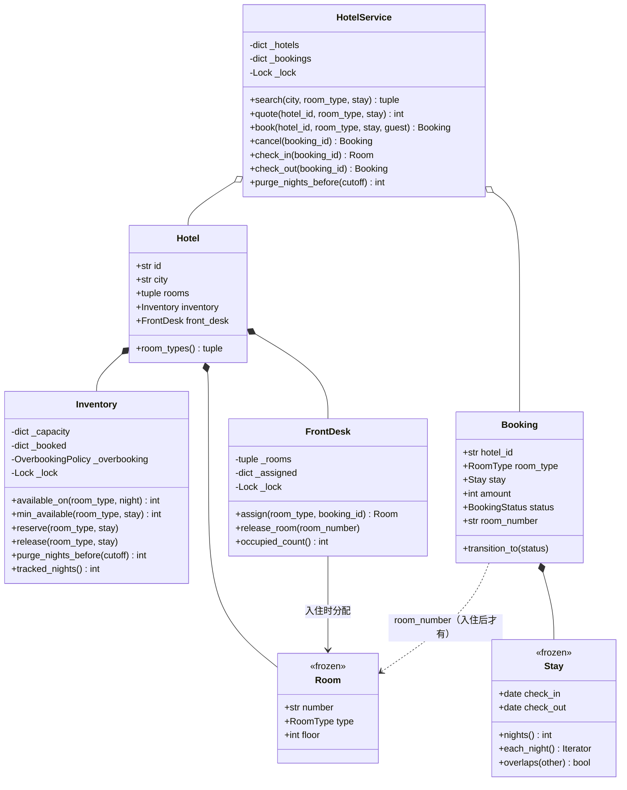

# 设计题解：酒店预订（Hotel Booking）

## 题目与澄清

面试官的开场："设计一个酒店预订系统。用户搜城市和日期，看到有房的酒店，选一个房型下单，之后
可以取消，到店入住、离店退房。"

这道题和[[solution-movie-booking]]是同一条主线——**一份有限的资源不能卖两次**——但库存的形状
完全不同，难点也因此换了位置。电影票的库存是"座位 × 场次"，一次下单就是几个**离散的格子**；
酒店的库存是"房型 × 每一晚"的**计数**，一次下单天然跨越一段连续区间。选座和锁座的深入讨论
在那篇里；这里要正面回答的是：区间可订量怎么算、多晚预订怎么做到整段原子、房间什么时候才落到
具体一间。

值得当场问出来的澄清：

- **库存的单位是什么？** 这是全题第一个、也是最重要的问题。答案是**一个房型的一晚**，不是一间房。
  下面"为什么一晚是单位"一节专门论证它。
- **客人订的是房型还是房号？** 答案是房型。现实中你在任何一个订房平台上都选不到 1207 房——房号
  是前台在你到店那一刻才给的。这条业务事实直接决定了库存可以是计数而不是每间房的日历。
- **日期区间怎么界定？** 6 月 1 日入住、6 月 3 日退房，是住 **2 晚**（1 号晚、2 号晚），3 号那晚
  不占。也就是半开区间 `[check_in, check_out)`。这个约定不说清，后面所有的边界都会错一位。
- **排期看多远？** 酒店一般开放未来 365 天的预订。这个数字是后面选数据结构时要真的拿来算账的。
- **取消怎么办？** 取消要把整段区间的库存一次性还回去，并且只能还一次。
- **超卖（overbooking）要不要做？** 酒店业普遍故意超卖来对冲爽约（no-show），这不是 bug 而是政策。
  问清楚之后，它就该是一个可注入的规则，而不是散在库存代码里的魔法数字。
- **入住、退房算不算状态？** 算。订单的生命周期是 RESERVED → CHECKED_IN → CHECKED_OUT，另有
  RESERVED → CANCELLED 一条分支，这是[[structure.state-machines|状态机（State Machines）]]的
  典型场景——用一张显式的转移表，而不是一锅布尔值。

**范围之外**：不接真实支付与发票、不做多间同订（一单订三间房，本文只处理一单一间，扩展里说改法）、
不做房型升级与换房、不做清洁/维修排班、不做真实持久化。

## 需求与分级

- **第 1 关（核心流程，约 20 分钟）**：酒店、房型、房间的建模；`Stay` 这个半开日期区间；按城市 +
  房型 + 日期区间搜索有房的酒店；下一笔预订。对应 `Room`、`Stay`、`Hotel`、`Booking`、
  `HotelService.search/book`。
- **第 2 关（区间可订量，约 15 分钟）**：给一段日期算出"还能订几间"，并让多晚预订的"查 + 订"
  **整段原子**——部分订上是这道题的经典 bug。这一关要当场比较朴素计数表与区间树/线段树，
  并把账算给面试官看。对应 `Inventory`。
- **第 3 关（并发与生命周期，约 15 分钟）**：多人并发抢最后一间；取消把库存还回去且只还一次；
  入住、退房做成显式状态机。对应 `Inventory` 的锁、`ALLOWED_TRANSITIONS`、`FrontDesk`。
- **第 4 关（政策，选做）**：故意超卖，或按夜动态定价。验收标准是这两样加进来**不改库存结构
  一行**。对应 `OverbookingPolicy`、`NightlyRate` 这两组注入的普通函数。

## 核心对象与职责

### 为什么"一晚"是库存的单位

一次入住消耗的资源，既不是"一间房"（同一间房可以在这段日期之前和之后卖给别人），也不是"一天"
（6 月 3 日上午退房的人和当天下午入住的人不冲突），而是**一个房型在某一晚被占用**。把单位定成
"晚"之后三件事同时变简单：

1. 区间变成半开的 `[check_in, check_out)`，退房当天自然不占用，不需要任何 `-1` 的补丁；
2. "两段入住有没有冲突"退化成"有没有共用至少一晚"，判重叠只剩一行
   `a.check_in < b.check_out and b.check_in < a.check_out`；
3. 可订量变成对每一晚的一个整数计数，而计数的加减是可以在一把锁里原子完成的。

如果把单位定成"一间房的一段连续区间"，你立刻要面对区间合并、区间切分、区间冲突检测——而这些
复杂度全部来自一个本来可以不做的决定：提前指定房间。

### 为什么房间要"晚绑定"到入住时刻

假设下单时就把 1207 房分给客人。一家 100 间房的酒店，一年 365 天，库存就从"每晚一个计数"变成
"每间房一条时间线"，于是：

- **碎片化**：客人 A 订了 1207 房的 1–2 号，客人 B 订了 1207 房的 4–5 号，3 号那一晚单独空着。
  这时来一位想住 1–5 号的客人，明明全店有连续可用的房，系统却找不到——因为它被迫做的是一道
  区间装箱题，而这道题根本不需要解。
- **重排**：取消、延住、提前退房都会让分配结果失效，系统得不断把客人在房间之间搬来搬去。
- **和现实不符**：酒店前台真的是到店当天才排房的，因为要考虑楼层偏好、连住升级、清洁进度。

所以：下单只认房型，`Booking.room_number` 在下单时是 `None`；到店时由 `FrontDesk` 从该房型当前
没人住的房间里挑一间，把房号写回订单。**这也把"超卖的代价"放到了它真正发生的地方**——库存层允许
卖超，前台在分不出房时抛 `NoRoomToAssignError`，这正是现实中"给你升级房型或安排到隔壁酒店"那一刻。

### 职责表

| 类 | 单一职责 | 它守的不变量 |
|---|---|---|
| `Room` | 一间物理客房（房号、房型、楼层） | 不可变；不带任何日期状态 |
| `Stay` | 一段半开的入住区间 | `check_out > check_in`；逐晚可迭代 |
| `Inventory` | **按 (房型, 一晚) 计的可订量** | 任一晚已订数 ≤ 房量 + 超卖额度；归零的格子立刻删掉 |
| `FrontDesk` | 入住时分房、退房时收房 | 一间房同时最多分给一个订单 |
| `Hotel` | 聚合根：房间 + 它自己的库存 + 它自己的前台 | 库存的房量由实体房间数推出 |
| `Booking` | 一笔预订 + 它的生命周期 | 状态只能按转移表迁移 |
| `HotelService` | 门面：搜索、报价、下单、取消、入住、退房 | 自己不持有任何库存数字 |

`Hotel` 是聚合根，`Inventory` 和 `FrontDesk` 的生命周期属于它（**组合**）；`Room` 也是组合。
`Booking` 只记 `hotel_id` 和 `room_type` 这两个值，对 `Hotel` 是弱引用式的**关联**。注意 `Hotel`
**没有** `hotel.reserve(...)` 这类方法——调用方直接用 `hotel.inventory.reserve(...)`。多包一层
只转发一次调用的方法，除了让调用栈变长、让人多猜一次"这层到底做了什么"之外没有任何作用。



## 关键设计决策

### 决策一：区间可订量用什么结构？朴素计数表 vs 线段树

要回答的查询是："房型 T 在 `[d1, d2)` 这段里，最紧的一晚还剩几间？"以及写入："这段里每一晚各占
一间。"候选：

**选项 A：朴素的按晚计数表。** 一个 `dict[(RoomType, date), int]`，记每一晚已订几间。查询是对区间
里每一晚各查一次取最小；写入是对每一晚各加一。

```python
def min_available(self, room_type: RoomType, stay: Stay) -> int:
    with self._lock:
        return min(self._available_locked(room_type, night) for night in stay.each_night())
```

**选项 B：保存预订区间的列表，查询时扫。** 每笔预订记 `(check_in, check_out)`，查某段可订量就扫
所有与之重叠的预订。写入 O(1)，查询 O(预订数)——随着订单积累线性变慢，而且"这一晚剩几间"这个
最常用的数字每次都要重算。

**选项 C：线段树 / 树状数组（区间加 + 区间最值）。** 把 365 天映射成数组下标，区间加一、区间求
最小值都是 O(log n)。

**把账算出来。** 排期 365 晚，一家店 4 个房型，一次入住典型 1–5 晚：

| | 一次查询 | 一次写入 | 内存 | 代码量 |
|---|---|---|---|---|
| A 计数表 | 1–5 次字典查找 | 1–5 次字典写 | 只存被订过的晚次，最多 4 × 365 = 1460 个 int | 约 15 行 |
| B 区间列表 | O(预订数)，会持续变大 | O(1) | 每笔预订一条 | 约 20 行 |
| C 线段树 | ≈ 2 × log₂365 ≈ 18 个结点 | 同上再来一遍 | 固定 4 × 4 × 365 ≈ 6000 个结点 | 约 60 行，且带惰性下传 |

也就是说：在这道题的真实量级上，**线段树比朴素计数表更慢**——一次 3 晚的预订，计数表动 3 个键，
线段树要走 36 个结点，外加一个把日期映射成下标的固定窗口（排期要往后滚动时还得处理平移）。

**选择 A**，并把"C 什么时候才对"说清楚：当**单次操作跨越的单位数很大**时。比如月租公寓（一次
租约跨 30–365 晚）、或者会议室按分钟预订（一年 525 600 个格子，一次两小时的会就是 120 个格子），
这时 O(区间长度) 才真的输给 O(log n)。这是本题里刻意**拒绝一个漂亮数据结构**的地方：判据是
"区间长度相对于总格子数大不大"，不是"哪个听起来更高级"。

顺带一提，B 那条路还有一个更根本的问题：它把"这一晚还剩几间"变成一个要扫描全局才能得出的结论，
没有任何对象在守它，也就没法在一把锁里一步验证——和电影票那题拒绝"用订单反推座位状态"是同一个
理由。

### 决策二：多晚预订的"查 + 订"怎么做到整段原子

这是本题最容易写错的一段代码，错法长这样：

```python
# 错的：边查边写，失败时前面几晚已经被扣掉了
for night in stay.each_night():
    if self.available_on(room_type, night) <= 0:
        raise NoAvailabilityError(night)       # 前 3 晚已经 +1，没人还回去
    self._booked[(room_type, night)] += 1
```

五晚的预订，前三晚扣成功、第四晚发现满了，于是客人没拿到订单，酒店却凭空少了三晚的库存。更糟的
是这种 bug 在单线程下也照样发生，不需要并发就能复现——而它往往要到月底对账才被发现。

正确的形状是**两段式：先全量检查，再全量写入，两件事在同一把锁里**：

```python
with self._lock:
    short = [n for n in stay.each_night() if self._available_locked(room_type, n) <= 0]
    if short:
        raise NoAvailabilityError(...)
    for night in stay.each_night():
        key = (room_type, night)
        self._booked[key] = self._booked.get(key, 0) + 1
```

两件事必须在同一把锁里，是因为"检查后写入"（check-then-act）中间只要放掉锁，两个线程就会各自
看到最后一间是空的，然后都订上去。注意这里**不能**用"先乐观写入、失败再回滚"的写法：回滚路径
要在另一把锁里把已经加过的晚次减回去，中间的窗口里别人可能看到一个从来不存在的库存状态。

锁的粒度放在**一家酒店的库存**上：竞争边界和数据边界重合在酒店这一层，不同酒店之间零共享。
可以再细到"酒店 × 房型"，但一家店只有三五个房型、临界区只有几次字典操作，而且
`search` 想要一份跨房型的一致快照时，一把店级锁更省事。一笔预订只涉及一家店的一个房型，所以
**永远不需要同时持两把库存锁**，锁顺序死锁从问题定义上就不存在。GIL 在这里帮不上忙：
"读计数 → 比较 → 写计数"是几十条字节码，中间随时会切线程。

### 决策三：取消把库存还回去时，归零的格子留不留？

`release` 要把整段区间每一晚的计数减一。减到 0 的那些格子怎么办？

```python
left = self._booked.get(key, 0) - 1
if left > 0:
    self._booked[key] = left
else:
    self._booked.pop(key, None)       # 归零即删，不留空壳
```

写成 `self._booked[key] = 0` 看起来一样对，而且少一行分支——但那是一个**只涨不跌的容器**。一家
开了十年的酒店，这张表会按"房型 × 曾经被订过的每一天"无限长大，里面绝大多数格子的值是 0。
这类泄漏在测试里几乎不会暴露（功能全对），只在长跑的进程里慢慢吃内存，所以值得写一条专门的
回归断言：取消之后 `inventory.tracked_nights == 0`。

同一个问题还有第二面：**已经过去的晚次谁来删？** 就算每个格子都非零，去年 3 月 5 日的已订数也
永远不会再被查询或修改了。`purge_nights_before(cutoff)` 是这张表随时间收缩的唯一途径，
对应的断言是"清理到今天之后，`tracked_nights` 只剩未来的格子"。设计题里每一个会增长的字典都
必须能回答"什么条件下条目被移除"；答不上来的那个，就是内存泄漏点。

### 决策四：订单生命周期——一张转移表，而不是散落的 `if`

订单有四个状态：RESERVED、CHECKED_IN、CHECKED_OUT、CANCELLED。合法的迁移只有四条：预订可以入住
或取消，入住只能退房，退房和取消是终点。把它写成数据：

```python
ALLOWED_TRANSITIONS: Mapping[BookingStatus, frozenset[BookingStatus]] = {
    BookingStatus.RESERVED: frozenset({BookingStatus.CHECKED_IN, BookingStatus.CANCELLED}),
    BookingStatus.CHECKED_IN: frozenset({BookingStatus.CHECKED_OUT}),
    BookingStatus.CHECKED_OUT: frozenset(),
    BookingStatus.CANCELLED: frozenset(),
}
```

比起在 `cancel` 里写 `if booking.status is CHECKED_IN: raise`、在 `check_out` 里写
`if booking.status is not CHECKED_IN: raise`，表的好处是：新增一个状态（比如 NO_SHOW，代表到点
没来）只要在表里加一行和一条边，不用去翻每一处状态判断；而且这张表本身就是可以贴给面试官看的
状态图。

**没有**为每个状态建一个 `BookingState` 子类。状态模式（State）在每个状态都有一大段**各不相同的
行为**时才划算（比如电梯在"上行/下行/停靠"里对同一个请求的响应完全不同）；这里每条边的动作都只有
一两行，拆成四个类只会把一张一眼能看全的表摊成四个文件。这是本题第二次选了更简单的答案。

转移表还顺手解决了一个并发问题：`cancel` 在服务锁里先调 `transition_to(CANCELLED)`，这一步就是
"认领"这张订单——两个线程同时点取消，只有一个能把 RESERVED 翻成 CANCELLED，另一个拿到
`InvalidTransitionError`，于是库存**只会被还一次**。把幂等性建在状态机上，比在库存层做去重干净得多。

### 决策五：超卖和动态定价怎么加，才不碰库存结构

第 4 关的两个追加需求都是"会变的政策"，都写成注入的普通函数：

```python
OverbookingPolicy = Callable[[RoomType, date, int], int]   # (房型, 那一晚, 房量) -> 允许超卖几间
NightlyRate = Callable[[RoomType, date, int], int]         # (房型, 那一晚, 当晚剩余) -> 这一晚多少分
```

超卖只影响 `_available_locked` 那一行 `capacity + allowance - booked`，`reserve` / `release` /
`purge` 一个字都不用改。定价函数的签名值得多说一句：那一晚"还剩几间"是**传进去的**，定价函数
拿不到 `Inventory` 的引用——策略只依赖被喂给它的事实，就不可能绕过库存的锁去读内部状态。这和
"事件要自带发生了什么"是同一条纪律。

它们都是无状态的纯函数，所以不需要抽象基类、不需要每条规则配一个实现类；"叠一层规则"就是包一个
函数：`scarcity_uplift(weekend_uplift(flat_nightly(prices), 13, 10), threshold=1, ...)`。只有当一条
政策真的要记状态（比如一张优惠券要记"用过了"）或要多暴露一个查询方法时，才升级成类。

最后一个容易被忽略的顺序问题：**先报价，后扣库存**。反过来写，客人自己订的这一间会把当晚剩余量
压低，可能正好跨过稀缺加价的阈值，于是客人被自己的下单动作涨了价。

## 代码走读

下面是经过测试的完整实现。读的时候盯住四处：`Stay` 的半开区间、`Inventory.reserve` 的两段式、
`release` 的归零即删、`HotelService.check_in` 的"预检 + 锁内认领"。

%% code:begin solution.py %%
```python
"""酒店预订（Hotel Booking）——按房型与日期区间的可订量、预订生命周期与取消的参考实现。

核心思路：库存的单位是**一个房型的一晚**，不是一间房。一次入住是半开区间
`[check_in, check_out)`，占用的是其中每一晚，所以退房当天不算占用，上午退房的人和下午入住的人
不冲突。`Inventory` 用一张 `(房型, 日期) → 已订数` 的计数表表达可订量，多晚预订的"查 + 订"在同
一把锁里做成全有或全无——只订到五晚里的三晚是这道题的经典 bug。物理房间在**入住时**才由
`FrontDesk` 分配，订的时候只认房型，这样库存不会被碎片化。订单生命周期是一张显式的转移表
（RESERVED → CHECKED_IN → CHECKED_OUT，或 RESERVED → CANCELLED）。超卖政策和按夜动态定价都是
注入的普通函数，加它们不碰库存结构一行。
"""

from __future__ import annotations

import itertools
import threading
from collections import Counter
from collections.abc import Callable, Iterable, Iterator, Mapping
from dataclasses import dataclass
from datetime import date, datetime, timedelta
from enum import Enum


# --------------------------------------------------------------------------
# 失败路径。

class HotelError(Exception):
    """本设计里所有失败路径的公共基类。"""


class InvalidStayError(HotelError):
    """日期区间不合法：退房日期不晚于入住日期。"""


class NoAvailabilityError(HotelError):
    """这段日期里至少有一晚订不到这个房型——整笔预订都不成立。"""


class HotelNotFoundError(HotelError):
    """目录里没有这家酒店。"""


class BookingNotFoundError(HotelError):
    """订单号不存在。"""


class InvalidTransitionError(HotelError):
    """订单当前状态不允许这次状态转移。"""


class NoRoomToAssignError(HotelError):
    """前台没有这个房型的空房可分配——超卖兑现失败，要升级房型或安排外调。"""


# --------------------------------------------------------------------------
# 房型、房间、入住区间。

class RoomType(Enum):
    """房型。库存、定价、超卖全部按房型统计——客人订的是房型，不是某一间房。"""

    SINGLE = "single"
    DOUBLE = "double"
    DELUXE = "deluxe"
    SUITE = "suite"


@dataclass(frozen=True, slots=True)
class Room:
    """一间物理客房：门牌号、房型、楼层。不带"这几天被谁订了"的状态。

    原因和电影票里的座位一样：日期区间上的占用属于库存，不属于这间房本身。区别在于
    这道题更进一步——客人订的时候根本不指定房间号，所以连"这间房这几晚归谁"都不需要提前决定。
    """

    number: str
    type: RoomType
    floor: int = 1


@dataclass(frozen=True, slots=True)
class Stay:
    """一次入住的日期区间，**半开**：`[check_in, check_out)`，占用其中每一晚。

    半开区间是这道题最省事的建模选择：退房当天不算占用，所以 3 号退房的人和 3 号入住的人
    可以共用同一间房，判重叠也只剩一条 `a.check_in < b.check_out and b.check_in < a.check_out`。
    """

    check_in: date
    check_out: date

    def __post_init__(self) -> None:
        if self.check_out <= self.check_in:
            raise InvalidStayError(f"check_out {self.check_out} must be after check_in {self.check_in}")

    @property
    def nights(self) -> int:
        """住几晚——注意是天数差，不是含头含尾的天数。"""
        return (self.check_out - self.check_in).days

    def each_night(self) -> Iterator[date]:
        """逐晚迭代：第一晚是入住日，最后一晚是退房日的前一天。"""
        night = self.check_in
        while night < self.check_out:
            yield night
            night += timedelta(days=1)

    def overlaps(self, other: "Stay") -> bool:
        """两段入住是否共用至少一晚。"""
        return self.check_in < other.check_out and other.check_in < self.check_out


# --------------------------------------------------------------------------
# 可换的政策：超卖与按夜定价。两者都是无状态的纯函数，注入即可，不需要抽象基类。

OverbookingPolicy = Callable[[RoomType, date, int], int]
NightlyRate = Callable[[RoomType, date, int], int]
Clock = Callable[[], datetime]


def no_overbooking(room_type: RoomType, night: date, capacity: int) -> int:
    """不超卖：可订量就是实际房量。"""
    return 0


def percent_overbooking(percent: int) -> OverbookingPolicy:
    """按房量的百分比超卖，对冲爽约（no-show）——酒店业的常规做法，不是 bug。"""

    def allowance(room_type: RoomType, night: date, capacity: int) -> int:
        return capacity * percent // 100

    return allowance


def weekday_overbooking(percent: int) -> OverbookingPolicy:
    """只在周一到周四超卖：商务客爽约率高，周末的休闲客几乎都会来。"""

    def allowance(room_type: RoomType, night: date, capacity: int) -> int:
        return capacity * percent // 100 if night.weekday() < 4 else 0

    return allowance


def flat_nightly(prices: Mapping[RoomType, int]) -> NightlyRate:
    """按房型给一张每晚房价表，单位是分。"""

    def rate(room_type: RoomType, night: date, remaining: int) -> int:
        return prices[room_type]

    return rate


def weekend_uplift(base: NightlyRate, numerator: int, denominator: int) -> NightlyRate:
    """周五、周六两晚按整数分数加价——"叠一层规则"在这里就是包一个函数。"""

    def rate(room_type: RoomType, night: date, remaining: int) -> int:
        price = base(room_type, night, remaining)
        return price * numerator // denominator if night.weekday() in (4, 5) else price

    return rate


def scarcity_uplift(base: NightlyRate, threshold: int, numerator: int, denominator: int) -> NightlyRate:
    """剩余可订量低于阈值时加价——最朴素的动态定价。

    注意签名：那一晚"还剩几间"是**传进来**的，定价函数不需要、也拿不到 `Inventory` 的引用。
    策略只依赖被喂给它的事实，就不会绕过库存的锁去读内部状态。
    """

    def rate(room_type: RoomType, night: date, remaining: int) -> int:
        price = base(room_type, night, remaining)
        return price * numerator // denominator if remaining <= threshold else price

    return rate


# --------------------------------------------------------------------------
# Inventory：这道题的核心——一家酒店按 (房型, 一晚) 计的可订量。

class Inventory:
    """一家酒店的按夜库存：房量固定，已订数按 (房型, 日期) 逐晚记。

    不变量：任一晚的已订数不超过"房量 + 超卖额度"；计数归零的格子立刻从表里删掉，
    不留空壳；整段预订要么每一晚都订上，要么一晚都不动。

    只用一张普通字典而不是线段树：见题解「关键设计决策」——365 天的排期表上，一次
    住 1–5 晚的预订只要动 1–5 个键，而线段树的区间查询加区间更新要走约 2×log2(365)≈18
    个结点，代码量还多出一个数量级。
    """

    def __init__(self, capacity: Mapping[RoomType, int],
                 overbooking: OverbookingPolicy = no_overbooking) -> None:
        self._capacity = dict(capacity)
        self._overbooking = overbooking
        self._booked: dict[tuple[RoomType, date], int] = {}
        self._lock = threading.Lock()

    @property
    def tracked_nights(self) -> int:
        """计数表里当前有多少个非零格子——用来验证"归零即删"和"过期即清"真的生效。"""
        with self._lock:
            return len(self._booked)

    def capacity_of(self, room_type: RoomType) -> int:
        """这个房型一共有几间实体房。"""
        return self._capacity.get(room_type, 0)

    def _available_locked(self, room_type: RoomType, night: date) -> int:
        """某一晚还能订几间；调用方必须已经持有 `self._lock`。"""
        capacity = self._capacity.get(room_type, 0)
        allowance = self._overbooking(room_type, night, capacity)
        return capacity + allowance - self._booked.get((room_type, night), 0)

    def available_on(self, room_type: RoomType, night: date) -> int:
        """某一晚这个房型还能订几间（已计入超卖额度）。"""
        with self._lock:
            return self._available_locked(room_type, night)

    def min_available(self, room_type: RoomType, stay: Stay) -> int:
        """整段入住期间最紧的那一晚还剩几间——这才是"这段日期能订几间"的答案。

        取最小值而不是平均或首晚：一段五晚的预订，只要有一晚满了，整段就订不了。
        """
        with self._lock:
            return min(self._available_locked(room_type, night) for night in stay.each_night())

    def reserve(self, room_type: RoomType, stay: Stay) -> None:
        """为整段入住各占一间，全有或全无；任一晚不足就抛 `NoAvailabilityError`。

        先把每一晚检查完再开始写，两件事在同一把锁里。分成"边检查边写"的循环是这道题的
        经典 bug：五晚里前三晚写成功、第四晚发现满了，客人被扣掉三晚库存却没有订单，而
        回滚代码往往根本没写。
        """
        with self._lock:
            short = [night for night in stay.each_night()
                     if self._available_locked(room_type, night) <= 0]
            if short:
                raise NoAvailabilityError(
                    f"{room_type.value} is sold out on {short[0]} ({len(short)} night(s) short)")
            for night in stay.each_night():
                key = (room_type, night)
                self._booked[key] = self._booked.get(key, 0) + 1

    def release(self, room_type: RoomType, stay: Stay) -> None:
        """退掉整段入住占的库存。计数减到 0 的格子直接删键，不留空壳。

        留空壳是最容易被忽略的泄漏：一家开了十年的酒店，退掉的日期如果只把计数写成 0，
        这张表就会按"房型 × 曾经被订过的每一天"无限长大。
        """
        with self._lock:
            for night in stay.each_night():
                key = (room_type, night)
                left = self._booked.get(key, 0) - 1
                if left > 0:
                    self._booked[key] = left
                else:
                    self._booked.pop(key, None)

    def purge_nights_before(self, cutoff: date) -> int:
        """清掉 `cutoff` 之前的历史晚次，返回清掉的格子数。

        这是计数表随时间收缩的唯一途径：已经过去的日子再也不会被查询或预订，留着只占内存。
        """
        with self._lock:
            stale = [key for key in self._booked if key[1] < cutoff]
            for key in stale:
                del self._booked[key]
        return len(stale)


# --------------------------------------------------------------------------
# FrontDesk：前台。物理房间只在这里出现——入住时分配，退房时收回。

class FrontDesk:
    """一家酒店的前台：把实体房间在入住时分配给订单，退房时收回。

    不变量：一间房同一时刻最多分配给一个订单；`_assigned` 只在退房时缩小。
    它和 `Inventory` 的分工是这道题的第二条主线：库存管的是"未来每一晚还能卖几间"，
    前台管的是"此刻哪间房里住着谁"，两者的锁互不嵌套。
    """

    def __init__(self, rooms: Iterable[Room]) -> None:
        self._rooms = tuple(rooms)
        self._assigned: dict[str, str] = {}  # 房号 → 订单号
        self._lock = threading.Lock()

    @property
    def occupied_count(self) -> int:
        """当前有人住的房间数——只读计数，不交出内部的分配表。"""
        with self._lock:
            return len(self._assigned)

    def occupancy(self) -> Mapping[str, str]:
        """当前"房号 → 订单号"的一份快照副本。"""
        with self._lock:
            return dict(self._assigned)

    def assign(self, room_type: RoomType, booking_id: str) -> Room:
        """给订单挑一间该房型的空房；没有空房时抛 `NoRoomToAssignError`。

        超卖政策允许库存卖超，兑现失败就发生在这里——这正是超卖的真实代价，要么升级房型
        （walk-up），要么替客人安排到别家。让它成为一个显式的异常，比在库存层假装不会发生好。
        """
        with self._lock:
            for room in self._rooms:
                if room.type is room_type and room.number not in self._assigned:
                    self._assigned[room.number] = booking_id
                    return room
        raise NoRoomToAssignError(f"no free {room_type.value} room to assign to {booking_id}")

    def release_room(self, room_number: str) -> None:
        """退房：把房间收回。按房号而不是按订单号收回，回滚路径才能只还刚分出去的那一间。"""
        with self._lock:
            self._assigned.pop(room_number, None)


# --------------------------------------------------------------------------
# Hotel：聚合根。把物理房间、按夜库存、前台绑在一起，自己不转发它们的方法。

class Hotel:
    """一家酒店：所在城市、实体房间，以及属于它自己的 `Inventory` 和 `FrontDesk`。

    它**不**提供 `hotel.reserve(...)` 这样的转发方法——调用方直接用 `hotel.inventory`
    和 `hotel.front_desk`。多包一层只转发一次调用的方法，除了让调用栈变长没有任何作用。
    """

    def __init__(self, hotel_id: str, name: str, city: str, rooms: Iterable[Room],
                 overbooking: OverbookingPolicy = no_overbooking) -> None:
        self.id = hotel_id
        self.name = name
        self.city = city
        self.rooms = tuple(rooms)
        self.inventory = Inventory(Counter(room.type for room in self.rooms), overbooking)
        self.front_desk = FrontDesk(self.rooms)

    def room_types(self) -> tuple[RoomType, ...]:
        """这家店有哪些房型，按枚举顺序给出。"""
        present = {room.type for room in self.rooms}
        return tuple(t for t in RoomType if t in present)


# --------------------------------------------------------------------------
# 订单与它的生命周期：一张显式的状态转移表。

class BookingStatus(Enum):
    """订单生命周期的四个状态。"""

    RESERVED = "reserved"
    CHECKED_IN = "checked_in"
    CHECKED_OUT = "checked_out"
    CANCELLED = "cancelled"


ALLOWED_TRANSITIONS: Mapping[BookingStatus, frozenset[BookingStatus]] = {
    BookingStatus.RESERVED: frozenset({BookingStatus.CHECKED_IN, BookingStatus.CANCELLED}),
    BookingStatus.CHECKED_IN: frozenset({BookingStatus.CHECKED_OUT}),
    BookingStatus.CHECKED_OUT: frozenset(),
    BookingStatus.CANCELLED: frozenset(),
}
"""合法转移写成一张数据表，而不是散落在各个方法里的 `if`：新增一个状态（比如 NO_SHOW）
只要在表里加一行，不用去翻每一处状态判断。"""


@dataclass(slots=True)
class Booking:
    """一笔预订：哪家店、谁、什么房型、住哪几晚、多少钱、现在处在生命周期的哪一步。

    它只认 `room_type`，不认房号——房号是入住后才填上的 `room_number`。
    """

    id: str
    hotel_id: str
    guest: str
    room_type: RoomType
    stay: Stay
    amount: int
    status: BookingStatus = BookingStatus.RESERVED
    room_number: str | None = None

    def transition_to(self, new_status: BookingStatus) -> None:
        """按转移表改状态；不合法的转移抛 `InvalidTransitionError`。"""
        if new_status not in ALLOWED_TRANSITIONS[self.status]:
            raise InvalidTransitionError(
                f"booking {self.id}: cannot go from {self.status.value} to {new_status.value}")
        self.status = new_status


# --------------------------------------------------------------------------
# HotelService：面向调用方的门面。管目录、报价、下单、取消、入住、退房。

class HotelService:
    """酒店预订服务：跨店搜索、下单、取消、入住、退房，以及清理历史晚次。

    锁纪律：它自己的锁只保护酒店目录和订单表，**绝不**在持有它时去拿某家店的
    `Inventory` 或 `FrontDesk` 的锁。三把锁永远"先放后拿"，不存在嵌套。
    """

    def __init__(self, clock: Clock, rate: NightlyRate) -> None:
        self._clock = clock
        self._rate = rate
        self._hotels: dict[str, Hotel] = {}
        self._bookings: dict[str, Booking] = {}
        self._lock = threading.Lock()
        self._ids = (f"R{n}" for n in itertools.count(1))

    # ---- 目录与报价 ------------------------------------------------------

    def register(self, hotel: Hotel) -> None:
        """把一家酒店加进目录。"""
        with self._lock:
            self._hotels[hotel.id] = hotel

    def hotel(self, hotel_id: str) -> Hotel:
        """按 id 取酒店；不存在就抛 `HotelNotFoundError`。"""
        with self._lock:
            hotel = self._hotels.get(hotel_id)
        if hotel is None:
            raise HotelNotFoundError(f"unknown hotel {hotel_id!r}")
        return hotel

    def search(self, city: str, room_type: RoomType, stay: Stay) -> tuple[Hotel, ...]:
        """某城市里，整段日期每一晚都还有这个房型的酒店，按 id 排序。"""
        with self._lock:
            hotels = list(self._hotels.values())
        found = [h for h in hotels
                 if h.city == city and h.inventory.min_available(room_type, stay) > 0]
        return tuple(sorted(found, key=lambda h: h.id))

    def quote(self, hotel_id: str, room_type: RoomType, stay: Stay) -> int:
        """整段入住的总价（分）：逐晚算，把那一晚的剩余可订量喂给定价函数。"""
        inventory = self.hotel(hotel_id).inventory
        return sum(self._rate(room_type, night, inventory.available_on(room_type, night))
                   for night in stay.each_night())

    def purge_nights_before(self, cutoff: date) -> int:
        """跨所有酒店清掉历史晚次，返回清掉的格子数。"""
        with self._lock:
            hotels = list(self._hotels.values())
        return sum(hotel.inventory.purge_nights_before(cutoff) for hotel in hotels)

    # ---- 下单与取消 ------------------------------------------------------

    def book(self, hotel_id: str, room_type: RoomType, stay: Stay, guest: str) -> Booking:
        """下单：先报价，再原子地占掉整段库存，最后落订单。

        报价用的是占库存**之前**的剩余量——先报价后扣减，客人看到的价格和付的价格一致；
        反过来先扣再算，自己的这一间会把自己推进"剩余紧张"的档位，凭空涨价。
        """
        hotel = self.hotel(hotel_id)
        amount = self.quote(hotel_id, room_type, stay)
        hotel.inventory.reserve(room_type, stay)
        try:
            with self._lock:
                booking = Booking(id=next(self._ids), hotel_id=hotel_id, guest=guest,
                                  room_type=room_type, stay=stay, amount=amount)
                self._bookings[booking.id] = booking
        except Exception:
            hotel.inventory.release(room_type, stay)  # 落单失败也不能把库存吞掉
            raise
        return booking

    def booking(self, booking_id: str) -> Booking:
        """按订单号取订单。"""
        with self._lock:
            booking = self._bookings.get(booking_id)
        if booking is None:
            raise BookingNotFoundError(f"unknown booking {booking_id!r}")
        return booking

    def cancel(self, booking_id: str) -> Booking:
        """取消预订：把整段库存还回去。已入住或已取消的订单不能再取消。

        状态位在锁内先翻，这一步就是"认领"这张订单：两个线程同时点取消，只有一个能把
        RESERVED 翻成 CANCELLED，另一个拿到 `InvalidTransitionError`，库存只会被还一次。
        """
        with self._lock:
            booking = self._bookings.get(booking_id)
            if booking is None:
                raise BookingNotFoundError(f"unknown booking {booking_id!r}")
            hotel = self._hotels.get(booking.hotel_id)
            if hotel is None:
                raise HotelNotFoundError(f"hotel {booking.hotel_id!r} is no longer registered")
            booking.transition_to(BookingStatus.CANCELLED)
        hotel.inventory.release(booking.room_type, booking.stay)
        return booking

    # ---- 入住与退房 ------------------------------------------------------

    def check_in(self, booking_id: str) -> Room:
        """办理入住：分配一间实体房，并把订单推进 CHECKED_IN，返回分到的房间。

        先做两道预检——转移是否合法、今天是否落在这段入住区间里（不合法就直接失败，不白占
        房间；"提前三天来办入住"必须被挡住，否则房间会被占着却不计入任何一晚的库存）——再去前台拿房，
        最后回到锁内正式认领状态。两个线程同时办同一张订单的入住时，晚到的那个会在第二步
        失败，并把自己刚分到的房间立刻还回去——所以按**房号**还房，而不是按订单号。
        """
        booking = self.booking(booking_id)
        hotel = self.hotel(booking.hotel_id)
        if BookingStatus.CHECKED_IN not in ALLOWED_TRANSITIONS[booking.status]:
            raise InvalidTransitionError(
                f"booking {booking_id}: cannot check in from {booking.status.value}")
        today = self._clock().date()
        if not booking.stay.check_in <= today < booking.stay.check_out:
            raise InvalidTransitionError(
                f"booking {booking_id}: today {today} is outside the stay {booking.stay.check_in}"
                f"–{booking.stay.check_out}")
        room = hotel.front_desk.assign(booking.room_type, booking.id)
        with self._lock:
            try:
                booking.transition_to(BookingStatus.CHECKED_IN)
            except InvalidTransitionError:
                hotel.front_desk.release_room(room.number)
                raise
            booking.room_number = room.number
        return room

    def check_out(self, booking_id: str) -> Booking:
        """办理退房：收回房间，订单推进 CHECKED_OUT。

        注意**不**归还库存：那几晚是实实在在被住掉的，历史晚次由 `purge_nights_before`
        按日期清理，而不是在退房时"还回去"。
        """
        with self._lock:
            booking = self._bookings.get(booking_id)
            if booking is None:
                raise BookingNotFoundError(f"unknown booking {booking_id!r}")
            hotel = self._hotels.get(booking.hotel_id)
            if hotel is None:
                raise HotelNotFoundError(f"hotel {booking.hotel_id!r} is no longer registered")
            booking.transition_to(BookingStatus.CHECKED_OUT)
            room_number = booking.room_number
        if room_number is not None:
            hotel.front_desk.release_room(room_number)
        return booking


if __name__ == "__main__":
    from datetime import UTC

    today = date(2026, 6, 1)
    now = datetime(2026, 6, 1, 14, 0, tzinfo=UTC)
    rooms = ([Room(number=f"1{i:02d}", type=RoomType.DOUBLE, floor=1) for i in range(1, 3)]
             + [Room(number=f"2{i:02d}", type=RoomType.SUITE, floor=2) for i in range(1, 2)])
    hotel = Hotel("H1", "Seaside", "Sanya", rooms, overbooking=no_overbooking)

    service = HotelService(clock=lambda: now,
                           rate=weekend_uplift(flat_nightly({RoomType.DOUBLE: 48000,
                                                             RoomType.SUITE: 120000}), 13, 10))
    service.register(hotel)

    stay = Stay(check_in=today, check_out=today + timedelta(days=3))
    print(f"available doubles for {stay.nights} nights: "
          f"{hotel.inventory.min_available(RoomType.DOUBLE, stay)}")
    first = service.book("H1", RoomType.DOUBLE, stay, guest="chi")
    second = service.book("H1", RoomType.DOUBLE, stay, guest="lee")
    print(f"{first.id} {first.amount} fen, {second.id} {second.amount} fen, "
          f"left: {hotel.inventory.min_available(RoomType.DOUBLE, stay)}")
    print(f"check-in {first.id} → room {service.check_in(first.id).number}, "
          f"occupied: {hotel.front_desk.occupied_count}")
    service.cancel(second.id)
    print(f"after cancelling {second.id}: left {hotel.inventory.min_available(RoomType.DOUBLE, stay)}, "
          f"tracked nights {hotel.inventory.tracked_nights}")
    service.check_out(first.id)
    print(f"after check-out: occupied {hotel.front_desk.occupied_count}, "
          f"purged {service.purge_nights_before(today + timedelta(days=30))} night(s)")
```
%% code:end %%

**第一处：`Stay.__post_init__` 把非法区间挡在构造时。** 一个 `frozen` 的 dataclass 仍然可以在
`__post_init__` 里做校验；把"退房必须晚于入住"钉在类型的入口，后面所有方法都不用再判一次。

**第二处：`Inventory` 的读方法一律只交出整数——它从不把 `_booked` 这张表本身交出去。**
`tracked_nights` 是一个在锁内算好的计数，`available_on` / `min_available` 也是。如果这里
`return self._booked`，调用方就能绕过锁改写库存。

**第三处：`FrontDesk.release_room(room_number)` 按房号收房，不是按订单号。** 这个选择是为
`check_in` 的回滚路径服务的：两个线程同时办同一张订单的入住，晚到的那个要把**自己刚分到的
那一间**还回去，而不是把订单当前占的房间（可能是另一间，属于赢家）收掉。

**第四处：`check_in` 的两道预检加锁内认领。** 先看转移合法吗、今天是否落在入住区间里——不合法
就直接失败，不白占一间房；然后去前台拿房；最后回到服务锁里正式 `transition_to`，失败就把刚拿到
的房间还回去。预检是乐观的、可能过期，锁内那一次才是权威的，这是并发代码里很常用的一个形状。

## 测试与自检

套件（`test_hotel_booking.py`，24 个用例）按四关组织：

- **第 1 关**钉半开区间的语义：3 晚的 `each_night()` 恰好是 3 天、退房当天那一晚的可订量**没有**
  被扣、`Stay(d, d)` 直接构造失败。还有一条钉"订的是房型"：新下的订单 `room_number is None`。
- **第 2 关**钉区间与原子性。`test_min_available_is_the_tightest_night_not_the_first` 制造"首晚
  宽松、中间一晚紧"的局面，逼出"取最小"而不是"看第一晚"；
  `test_a_multi_night_booking_is_all_or_nothing` 让第四晚满员，断言失败后 `tracked_nights`
  一个格子都没增加——这条用例直接钉死那个经典 bug。
  `test_cancelling_returns_every_night_and_leaves_no_zero_buckets` 断言取消后 `tracked_nights`
  归 0，钉的是"归零即删"。
- **第 3 关**用真线程加 `threading.Barrier`，断言不变量：16 个线程抢唯一一间房，成功的恰好 1 个；
  24 个线程订**互相重叠但不相同**的区间，事后把成功订单逐晚累加，和库存表逐晚核对，任何一晚都
  不超过房量；8 个线程同时取消同一张订单，只有 1 次成功、库存只被还了一次。生命周期用例把四条
  非法迁移逐一打回（没入住就退房、重复入住、已入住还取消、重复退房）。
- **第 4 关**钉政策的独立性：25% 超卖让 4 间房能卖出 5 张单，而第 5 位客人在**前台**被
  `NoRoomToAssignError` 拦住（超卖的代价落在它真正发生的地方）；周末加价只影响周五周六两晚；
  稀缺加价读的是传进去的剩余量；还有一条钉"先报价后扣减"，断言客人不会被自己的下单动作涨价。

**两分钟怎么给面试官演示**：跑 `python solution.py`——查 3 晚的可订量、连下两单把房订满、办一次
入住看到具体房号、取消一单看可订量和 `tracked_nights` 一起回落、退房后清理历史晚次。整个演示
把"计数表怎么涨、怎么跌、怎么被清空"这条线完整走了一遍。

值得自己拷问的不变量：（1）任一晚的已订数 ≤ 房量 + 超卖额度；（2）任何一笔预订，要么它的每一晚
都被记了一间，要么一晚都没记；（3）取消之后，这笔预订在计数表里不留任何痕迹；（4）`_assigned`
里的房号数恒等于当前已入住未退房的订单数。

## 扩展与追问

**新需求**

- *一单订多间同房型*：`Inventory.reserve(room_type, stay, quantity)` 加一个数量参数，检查条件从
  `<= 0` 变成 `< quantity`。`FrontDesk` 要按订单分配多间房，`Booking.room_number` 变成一个元组。
  库存结构本身不变。
- *一单订多个房型（一间大床房 + 一间双床房）*：这时一笔预订跨两个"资源格"，必须一起成或一起败。
  因为两个房型在**同一家酒店的同一把锁**下，仍然可以在一次临界区里全查全写——这正是把锁放在
  酒店而不是房型上的额外回报。
- *提前退房退钱*：`check_out` 目前不归还库存（那几晚确实被住了）。要支持提前退房，就在退房时把
  `[今天, 原退房日)` 这一段还回去——注意这是一个**新的区间**，`Stay` 的半开语义让它一行算得出来。
- *房间停用维修*：`FrontDesk` 加一个 `out_of_service` 集合，同时要把 `Inventory` 的房量按停用
  区间调低——这是本设计里唯一一处"物理层变化要反映到库存层"的地方，值得单独设计一个
  `close_room(room_number, stay)` 接口，而不是让两边各改各的。
- *NO_SHOW 状态*：在转移表里加一行 `RESERVED -> NO_SHOW`，再加一条从 NO_SHOW 回收库存的规则。
  除了这张表，没有任何方法需要改。

**并发与线程安全**

- *为什么三把锁不会死锁？* `HotelService` 的锁只保护目录和订单表，`Inventory` 和 `FrontDesk` 各
  一把。纪律是永远"先放后拿"：服务锁在调用 `inventory.reserve` 或 `front_desk.assign` **之前**
  就已经释放。只要没有嵌套，就没有锁顺序问题。
- *`search` 是不是会读到撕裂的快照？* 会：它逐店去拿各自的锁，返回的是一组在不同瞬间成立的结论。
  这在搜索场景里是可接受的——搜索结果本来就只是"建议"，真正的裁决发生在 `book` 里那一次原子的
  检查加写入。把这一点说出来，比假装搜索是强一致的更专业。
- *换成多进程/多机呢？* 计数表换成数据库里一张 `(hotel_id, room_type, night, booked)` 的表，
  `reserve` 变成一条带条件的批量 `UPDATE ... WHERE booked < capacity`，用受影响行数判断是否全成；
  或者把整段区间的行按主键顺序 `SELECT ... FOR UPDATE`（**必须固定加锁顺序**，否则两笔区间交错的
  预订会互相等待）。接口 `reserve` / `release` 完全不用变。

**持久化与规模**

- *计数表落库*：主键 `(hotel_id, room_type, night)`，值是已订数。热点是"今晚"这一行——一家爆满的
  酒店所有请求都压在同几行上，工程上的答法是把计数拆成多个子计数行（分片计数器）再求和。
- *排期窗口滚动*：只开放未来 365 天，就意味着每天要向后延一天、向前清一天。`purge_nights_before`
  就是后者；前者在本设计里不需要做任何事，因为计数表是稀疏的——没被订过的晚次根本不存在。这正是
  选朴素字典而不是定长数组的一个额外好处。
- *什么时候真的该上线段树*：把这套代码原样搬去做会议室预订（按 15 分钟一格，一年 35 040 格，一次
  会议跨 4–8 格）仍然是字典赢；搬去做长租公寓（一次租约 365 格）就该换了。判据始终是
  "单次操作跨越的格子数 / 总格子数"。

## 常见错误

1. **把库存做成"每间房一条时间线"**。下单就定房号，于是要解区间装箱、要处理碎片、取消后还要重排。
   现实中前台就是到店才排房的，跟着现实走能省掉一整类复杂度。
2. **区间用闭区间**。`[check_in, check_out]` 会让退房当天那一晚被白白占掉一间房，也让重叠判断多
   一个 `-1`。半开区间是唯一不出错的约定。
3. **多晚预订边查边写**。最经典的 bug：部分晚次被扣、客人却没拿到订单，而且不需要并发就能复现。
4. **"还剩几间"取首晚或平均**。一段五晚的预订，只要有一晚满了整段就不成立，正确的数字是**最小值**。
5. **取消时把计数写成 0 而不是删键**。功能测试全绿，内存按"房型 × 历史日期"线性上涨。
6. **没人回答"历史晚次谁来删"**。长跑进程里最隐蔽的一类问题：每个会增长的容器都必须有收缩路径。
7. **状态判断散落在各个方法里**。`cancel`、`check_in`、`check_out` 各写一串 `if status is ...`，
   加一个 NO_SHOW 状态就要翻遍全文件；一张转移表把它压成一行数据。
8. **取消不幂等**。两次取消把库存还两次，最后卖出比实际房量还多的房；把幂等性建在状态机的
   "认领"上，比在库存层做去重干净。
9. **先扣库存再报价**，客人被自己的下单动作推过稀缺加价的阈值。
10. **把超卖当 bug 或当硬编码**。它是酒店业的正常政策，应该是一个可注入的函数；同样重要的是承认
    它的代价——前台分不出房时必须有一条显式的失败路径，而不是让库存层假装它不会发生。
11. **浮点房价**。`48000` 分比 `480.00` 元安全；一定要小数就用 `Decimal`。
12. **Java 习惯搬家**：把 `HotelManagementSystem` 做成 Singleton（测试再也造不出两家互不干扰的
    酒店）；为四个房型各建一个 `Room` 子类而它们除了价格没有行为差异；给每个状态建一个
    `BookingState` 子类而每条边只有一行代码；给 `Booking` 写满 `get_status()`/`set_status()`
    （Python 里就是属性和一个受转移表约束的方法）。

## 45 分钟怎么分配

- **0–5 分钟：澄清。** 问清四件事：库存单位是不是"房型 × 一晚"、客人订的是房型还是房号、日期区间
  是不是半开、要不要超卖。把"任一晚不能卖超"写到白板最上面。开口第一句就说："我打算把库存建成
  每晚一个计数，而不是每间房一条时间线，理由是……"——这句话本身就是这道题的分水岭。
- **5–12 分钟：实体与关系。** 画 `Hotel` → `Room` / `Inventory` / `FrontDesk`，以及 `Booking` +
  `Stay`。重点讲清楚两件事：为什么一晚是单位、为什么房号晚绑定。顺手把生命周期的四个状态和四条
  边画成状态图。
- **12–18 分钟：API 与数据结构。** 定 `Inventory.available_on / min_available / reserve / release`
  四个签名，当场把朴素计数表和线段树的账算给面试官看（365 晚、一次住 3 晚、18 个结点 vs 3 个键），
  并说明结论会在什么条件下反转。时钟和政策函数在这一步作为参数注入。
- **18–30 分钟：写核心。** 只写 `Stay`、`Inventory.reserve`（两段式）、`release`（归零即删）、
  `HotelService.book` / `cancel`。写 `reserve` 时把"先全查再全写、同一把锁"念出来。
- **30–36 分钟：测试。** 至少三条：正常下单后逐晚可订量正确且退房当晚未占；中间一晚满员时整段
  失败且一晚都没被扣；取消后可订量恢复且 `tracked_nights` 归零。时间允许再加多线程抢最后一间。
- **36–45 分钟：扩展。** 现场加超卖政策和按夜定价，强调"库存结构一行没改"；补上入住/退房的状态机
  和前台分房；最后口头说清落库后怎么写（带条件的批量 `UPDATE`，或固定顺序的行锁）。

**时间不够时砍什么**：砍跨店搜索（只留单店可订量）、砍动态定价（留一张固定价表）、砍前台分房
（口头说明房号晚绑定即可）。**绝对不能砍**的是：半开区间、整段原子的 `reserve`、取消归还且只还
一次、归零即删。这四条是这道题的得分点。

## 来源与延伸

- <https://github.com/ashishps1/awesome-low-level-design/blob/main/problems/hotel-management-system.md>
  （GPL-3.0）——流传最广的参照系，六语言并排。它把库存建成 `Room.status`（AVAILABLE / BOOKED /
  OCCUPIED）加一张 `Reservation` 列表，也就是"每间房一条时间线"那条路；总控类是 Singleton，
  并发靠 `synchronized`。本文在三点上明确反着做：库存单位是"房型 × 一晚"的计数而不是房间状态
  （房间状态无法表达"下周二这间房被订了"）、房号到入住才绑定、拒绝 Singleton。它的付款方式抽象
  （`Payment` 接口 + 多个实现）在本文里被省掉了，因为那是另一道题的内容。
- <https://github.com/prasadgujar/low-level-design-primer/blob/master/solutions.md>——LLD 题目与
  解法的索引，"Design an online hotel booking system" 一行下面汇总了几份外部解法与讲解视频，适合
  用来看这道题在不同来源里被问成什么样（有的只问房型与可用性，有的会追加多城市搜索和支付）。
  它本身不给实现，所以和本文没有设计上的分歧；把它当作确认题面覆盖面的清单来用。
- <https://docs.python.org/3/library/datetime.html#datetime.date> 与
  <https://docs.python.org/3/library/collections.html#collections.Counter>——本文两处写法的出处：
  `date` 的减法直接给出 `timedelta`，`(check_out - check_in).days` 就是住几晚；`Counter` 从房间
  列表一步得到每个房型的房量，省掉一个手写的累加循环。
- <https://docs.python.org/3/library/threading.html#lock-objects>——`Lock` 作为上下文管理器把
  临界区限制在 `with` 块内。本文三把锁（服务、库存、前台）各自独立、永不嵌套，这一点比选哪种锁
  重要得多。

相关题解：[[solution-movie-booking]]——同一条"不要把有限资源卖两次"的主线，库存是离散的
"座位 × 场次"，锁座的 TTL、惰性过期和"支付调用必须在锁外"的两段式确认都在那篇里讲透。
