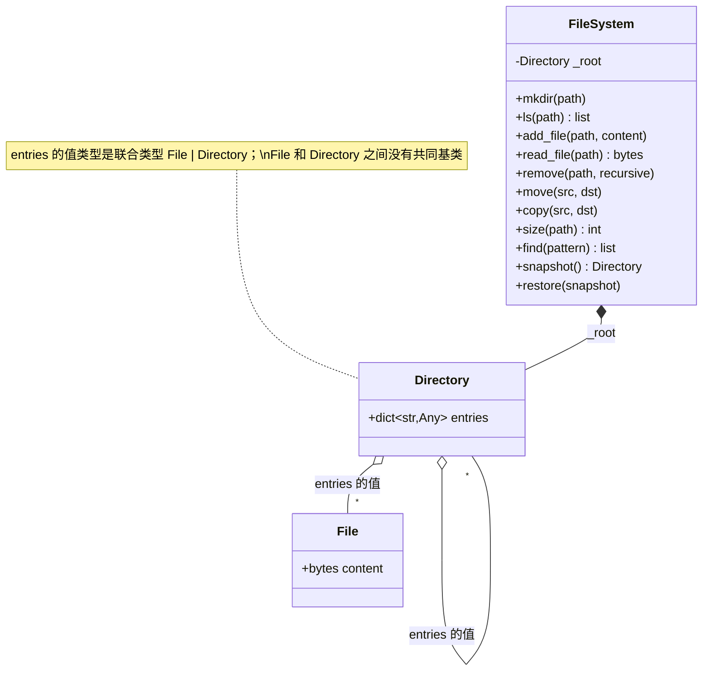

# 设计题解：内存文件系统（In-Memory File System）

## 题目与澄清

题面通常长这样：

> 实现一个内存文件系统：`mkdir`、`ls`、写文件、读文件。后面几关会陆续加删除、移动、
> 复制、搜索这些操作。

这是这个题库里"组合模式（Composite）"的教科书候选——目录里可以放文件，也可以放目录，
一眼看上去就是"统一处理单个对象和对象组合"的经典场景。但**这道题真正值得讲的，是组合
模式在哪里停止显而易见**：教材版本的组合模式通常让 `File` 和 `Directory` 共享一个基类
`Node`，两者都实现同一套接口（`size()`、`list_children()` 之类），文件对"列出子节点"
返回空列表、目录对"读取内容"抛异常——这种写法在 Python 里看起来完全合法，但它是在为两个
根本不同的东西**伪造**一个共同的行为面。本文的答案更激进：`File` 和 `Directory` 之间
**没有共同基类**，甚至没有共同字段——连"名字"都不属于节点自己（见"核心对象与职责"）。
这个决定，以及它带来的几处连锁反应（路径解析该放在哪、递归删除要不要手写、复制一个大
文件的代价是什么），是这份题解真正想教的东西。

几个问题决定了整个骨架的形状：

- **路径必须是绝对路径吗？** 本文要求所有公开方法的路径参数都以 `/` 开头，不支持相对
  路径（没有"当前目录"这个概念——这本身就少了一整类状态要维护）。
- **`..` 试图越过根目录时怎么办？** 大多数 shell 的 `cd ..` 在根目录上悄悄停住，不报
  错。本文选择**直接拒绝**（`PathEscapesRootError`）：这套文件系统是被程序调用的，不是
  被人在终端里敲的，一次意外越界的路径拼接（常见于字符串拼接生成的路径）如果被悄悄纠正
  成根目录，调用方很可能在错误的位置读写数据却毫无察觉；显式报错把这一类 bug 消灭在
  第一次调用里。如果要移植成真正给人用的 shell，把这一处改成"钳制在根目录"是一行代码的
  事，其余设计不用动。
- **`mkdir` 和 `add_file` 对"缺失的父目录"态度一样吗？** 不一样：`mkdir` 自动创建中间
  目录（`mkdir -p` 语义），`add_file` 不会——写文件之前父目录必须已经存在。这是刻意的
  不对称：`mkdir` 的中间目录创建是题面明确要求的能力，`add_file` 如果也顺手建目录，会
  让"父目录不存在"和"文件本身不存在"这两种完全不同的错误情况在行为上分不清楚。
- **`move`/`copy` 对目录里的"移进另一个目录"怎么处理？** 本文的 `move(src, dst)` 里
  `dst` 是**完整的目标路径**，不是"某个目录，移进去之后保留原名"那种真实 `mv` 的双重
  语义——这条更简单的约定覆盖了机考通常要考的核心能力，双重语义留在"扩展与追问"里讨论。

**范围之外**：不做符号链接、不做文件打开句柄（每次读写都是一次性的整体操作，没有
"打开-定位-写入-关闭"这一套游标状态）、不做真实的磁盘 I/O 或跨进程并发。

## 需求与分级

- **第 1 关（目录树与基本读写）**：`mkdir`（自动建中间目录）、`ls`（排序后的列表）、
  `add_file`/`read_file`。路径解析要处理根目录本身、结尾的 `/`、`.` 和 `..`。对应
  `File`、`Directory`、`FileSystem._normalize/_resolve_dir/_get`、
  `FileSystem.mkdir/ls/add_file/read_file`。
- **第 2 关（让它变得有意思的操作）**：`remove`（非空目录默认拒绝，`recursive=True`
  才连同子树删除）、`move`、`copy`（对大文件而言，复制的是内容的引用还是新的字节，见
  "关键设计决策"）、`size`（对整棵子树求和）。对应 `FileSystem.remove/move/copy/size`。
- **第 3 关（搜索）**：`find(pattern)` 按通配符匹配文件名，返回匹配的绝对路径列表。
  对应 `FileSystem.find/_walk`。
- **第 4 关（不改动节点模型的扩展）**：`snapshot`/`restore`——把整棵树的某个时刻保存
  下来，之后可以恢复。选它而不是权限系统，是因为它可以完全复用第 2 关已经写好的深拷贝
  逻辑，`File`/`Directory` 两个类不需要为它新增任何字段（见"关键设计决策"最后一节）。
  对应 `FileSystem.snapshot/restore`，复用 `FileSystem._duplicate`。

**这道题真正考的设计能力**：`File` 和 `Directory` 要不要共享一个基类，看起来只是"要不要
少打几行字"的风格问题，实际决定了第 2 关能不能干净地回答"复制一个目录，为什么改动复制
出来的那份不会影响原来的"，第 4 关能不能在不碰 `File`/`Directory` 的前提下加上快照——
一个被伪造出来的公共接口，反而会成为后面几关不断要绕开的障碍。

## 核心对象与职责

- **`File`** —— 只有一个字段：`content: bytes`。它不知道自己叫什么名字，也不知道自己
  在树的哪个位置。
- **`Directory`** —— 只有一个字段：`entries: dict[str, File | Directory]`。同样不知道
  自己的名字，也不持有指向父目录的引用。
- **两者没有共同基类**：`File` 和 `Directory` 唯一共享的性质是"可以被放进某个目录的
  `entries` 字典里"，而这条性质根本不需要一个共同的类型来表达——Python 的 `dict[str,
  File | Directory]` 用一个联合类型（union）就说清楚了，不需要为了让类型系统满意而发明
  一个空洞的 `Node` 基类。一个节点"叫什么名字"甚至也不是它自己的属性——名字只存在于父
  目录 `entries` 字典的键里，这和真实文件系统的 inode 设计是同一个道理：inode 记录内容
  和元数据，**名字属于目录项，不属于 inode 本身**——同一个 inode 可以有多个名字（硬
  链接），这道题虽然不实现硬链接，但节点不知道自己名字这个选择，正是为它留了口子。
- **`FileSystem`** —— 门面（Facade），也是路径解析逻辑**唯一**的家。`mkdir`/`ls`/
  `remove`/`move`/`copy`/`size`/`find`/`snapshot`/`restore` 全部从 `self._root` 重新
  往下走一遍来定位节点，节点自己不参与、也不知道这件事在发生。

生命周期上：`FileSystem` **组合**（composition）唯一的根 `Directory`，其余节点全部是这
棵树的一部分，不会被外部引用持有——所有公开方法要么返回新建的 `list`/`bytes`，要么（
`snapshot`）返回一份独立的深拷贝，调用方拿到手的东西改动了也不会影响树本身。这也是"三个
必须改掉的坏习惯"里"不要把内部可变容器原样交出去"这条规则在这道题上的落点：`ls` 返回的
是一份新 `list`，不是 `entries.keys()` 的视图。



## 关键设计决策

### `File` 和 `Directory` 真的该共享一个基类吗？

教材版本的组合模式几乎总是这样写：

```python
# 教材写法：一个共同基类，两种子类分别"假装"支持对方的操作
class Node(ABC):
    @abstractmethod
    def size(self) -> int: ...
    @abstractmethod
    def list_children(self) -> list[str]: ...   # 文件对这个方法完全没有意义

class FileNode(Node):
    def list_children(self) -> list[str]:
        raise NotImplementedError("文件没有子节点")   # 违反里氏替换原则的信号
```

```python
# 本文的写法：两个互不相干的类，共享的部分交给一个联合类型表达
@dataclass
class File:
    content: bytes = b""

@dataclass
class Directory:
    entries: dict[str, "File | Directory"] = field(default_factory=dict)
```

教材写法的代价在 `list_children`/`read`/`write` 这类"只对一种子类有意义"的方法上现出
原形——文件被迫实现一个自己用不上、调用了就报错的方法，这正是里氏替换原则
（Liskov Substitution Principle）教科书式的反例：把 `FileNode` 传给任何期待 `Node` 能
`list_children()` 的代码，程序会在运行时炸掉，而不是在类型层面就被挡住。本文选择不共享
基类，把"这是文件还是目录"的判断交给 `isinstance`——在 `FileSystem` 内部，每个需要区分
的地方（`ls`、`_resolve_dir`、`_duplicate`、`_size_of`）本来就必须知道"接下来该怎么处理
这个节点"，`isinstance` 检查不是在绕开多态，是在诚实地承认"文件和目录的操作集合压根不
相交"。唯一的例外是它们都能被放进 `entries` 字典——而这条共性用 Python 的联合类型
`File | Directory` 表达就足够了，不需要付出一个类的代价。

### 路径解析该放在节点里，还是放在一个单独的地方？

问题：`mkdir("/a/b/c")` 需要从根节点走三步，每一步都要判断"这一段是不是目录"；如果这段
逻辑分散写在每个操作方法里，九个公开方法会重复九遍几乎相同的循环。两个方案：

```python
# 方案 A：给节点加一个 parent 指针，自己知道怎么找到根、怎么拼出完整路径
class Directory:
    parent: Directory | None
    entries: dict[str, "File | Directory"]

    def resolve(self, segments: list[str]) -> "File | Directory":
        ...  # 从 self 往下走
```

```python
# 方案 B（本文的选择）：节点不知道自己在哪，FileSystem 每次都从根重新往下走
class FileSystem:
    def _resolve_dir(self, segments: list[str], *, create_missing: bool) -> Directory:
        node = self._root
        for name in segments:
            ...
        return node
```

方案 A 看起来能让 `move`/`copy` 少传一个"从哪开始找"的参数，但它必须在每一次挂载、拆卸
节点时**同步维护** `parent` 指针——`move` 要更新被移动节点的 `parent`，`copy` 复制出来
的新节点的 `parent` 又该指向哪里？如果指向复制之前的位置就是错的，如果不设置又会让"这个
节点的父节点是谁"这个不变量出现真假两种状态。方案 B 从根开始重新解析，`O(路径深度)`的
每次开销在真实文件系统里也是标准做法（`open("/a/b/c")` 同样要从根挂载点开始逐段查找），
换来的是节点永远不需要知道"我在哪"，`move`/`copy` 因此不需要更新任何反向引用——这正是
"关键设计决策"下一节"移动能不能天然防环"这条好处的前提。

### 递归删除、复制目录：要不要自己手写递归？

`remove(path, recursive=True)` 删除一整棵子树时，本文的实现只有一行：

```python
del parent.entries[name]
```

这行代码没有遍历子树、没有手写递归去逐个释放子节点——一旦这棵子树不再被 `entries` 字典
引用，Python 的引用计数会在这一行执行完的瞬间就把它整个链路释放掉，不需要开发者手写
"先删子节点、再删自己"这套清理逻辑。这是内存受垃圾回收管理的语言（Python、Java、Go）
和 C++ 这类需要手动管理内存的语言在这道题上一个真实的差别：C++ 版本的组合模式几乎总要
在析构函数里手写"依次删除每个子节点"，Python 版本这一步是免费的。`copy` 反过来必须手写
递归（`_duplicate`），因为复制不是"释放"，是"重新构造一份独立的数据"——这一步没有语言
特性能帮你省掉，递归遍历子树、为每一层重新分配一个新的 `Directory` 是唯一正确的做法。

### 复制一个大文件：复制内容的引用，还是复制一份新的字节？

```python
def _duplicate(self, node: File | Directory) -> File | Directory:
    if isinstance(node, File):
        return File(node.content)   # 新 File，但 content 是同一个 bytes 对象
    return Directory({name: self._duplicate(child) for name, child in node.entries.items()})
```

`bytes` 在 Python 里是不可变对象——两个 `File` 实例的 `content` 字段指向同一个 `bytes`
对象，不会因为"共享"而产生数据竞争或者意外修改：唯一能"改变"一个文件内容的公开操作是
`add_file`（整体替换），它创建一个全新的 `File` 对象放进 `entries`，原来那个 `File`
对象（以及它指向的 `bytes`）完全不受影响。这意味着复制一个文件——不管这个文件是 10 字节
还是 10GB——`_duplicate` 对它这一步的代价都是 `O(1)`：只多分配了一个 `File` 包装对象，
没有拷贝一个字节的内容。真正随子树大小线性增长的，是复制一个**目录**时要为每一层重新
构造 `entries` 字典这件事本身（`O(子树里的条目数)`），和每个文件具体有多大无关。如果这
道题把"文件内容"换成一个可变的类型（比如一个可以原地追加的 `bytearray`），这条零拷贝的
安全性就不成立了——共享同一个 `bytearray` 的两个"独立"文件会在其中一个被追加时一起变。

### 第 4 关二选一：权限系统，还是快照/恢复？

题面给了两个可能的第 4 关方向，本文选了快照/恢复，理由是任务书要求的"在不碰节点模型的
前提下加上"这条约束——两个方向对这条约束的满足程度完全不同。权限系统天然需要往
`File`/`Directory` 里加字段（比如 `owner`、`mode`），并且要在**每一个**读写操作里插入
一次鉴权检查，`File`/`Directory` 的定义和 `FileSystem` 的每个方法都要改。快照/恢复不
需要新增任何字段——它做的事情和 `copy` 完全一样（深拷贝一棵子树），差别只是拷贝的对象是
整棵树的根，而不是某个子路径：

```python
def snapshot(self) -> Directory:
    return self._duplicate(self._root)   # 复用 copy 用的同一个方法

def restore(self, snapshot: Directory) -> None:
    self._root = self._duplicate(snapshot)   # 再复制一次，防止外部持有的引用污染当前树
```

`restore` 里"再复制一次"而不是直接 `self._root = snapshot` 是刻意的：如果调用方保留着
`snapshot()` 返回的那个对象，后续又调用了一次 `restore`，两次 `restore` 之间如果树被
直接指向同一份数据，第一次 `restore` 之后对当前树的任何修改都会污染这份本该固定不变的
快照——`test_restoring_does_not_let_later_mutation_leak_back_into_the_snapshot` 是这
条规则的回归测试。

## 代码走读

整份参考实现如下（测试通过的那一份，逐字嵌入）。

%% code:begin solution.py %%
```python
"""内存文件系统（In-Memory File System）——目录树的组合模式与路径解析参考实现。

五行设计：`File` 和 `Directory` 没有共同的基类——两者共享的部分比看起来还要少，连"名字"
都不存在节点自己身上，名字只活在父目录 `entries` 字典的键里；节点也不持有指向父目录的
反向引用，一切路径解析都由 `FileSystem` 从根节点重新往下走一遍完成，`move` 因此天然拒绝
"把一个目录移进它自己的子孙目录"这种会产生环的操作，不需要专门检查；递归删除不需要手写
递归——把子树从父目录的字典里摘掉之后，Python 的垃圾回收会顺着这棵子树自己清理干净；
复制一个大文件是 `O(1)` 的——`bytes` 不可变，新文件直接共享同一份内容，真正递归、按条目
数计费的只有复制目录这一步；第 4 关的快照/恢复复用复制目录用的同一个 `_duplicate`，
`File`/`Directory` 两个类因此一行都不用改。
"""

from __future__ import annotations

import fnmatch
from dataclasses import dataclass, field


class FSError(Exception):
    """本设计所有失败路径的公共基类。"""


class InvalidPathError(FSError):
    """路径本身不成立：不是绝对路径，或者这个操作不允许作用在根目录上。"""


class PathEscapesRootError(FSError):
    """路径里的 `..` 试图越过根目录——这套文件系统选择直接拒绝，而不是像大多数 shell
    的 `cd ..` 那样悄悄停在根目录，理由见题解"关键设计决策"。
    """


class PathNotFoundError(FSError):
    """路径途中某一段目录、或者路径本身指向的条目不存在。"""


class PathAlreadyExistsError(FSError):
    """`move`/`copy`/`add_file` 的目标位置已经被占用。"""


class ExpectedDirectoryError(FSError):
    """路径途中某一段本该是目录，实际却是文件——没法继续往下走。"""


class ExpectedFileError(FSError):
    """这个位置本该是文件，实际却是目录（或者是根目录本身）。"""


class DirectoryNotEmptyError(FSError):
    """目录非空，删除它需要显式传 `recursive=True`。"""


@dataclass
class File:
    """一个文件：只有内容，没有名字——它的名字是父目录 `entries` 字典里那个键，不是它
    自己的属性，见 `FileSystem` 的说明。
    """

    content: bytes = b""


@dataclass
class Directory:
    """一个目录：只有子条目表，同样没有名字。`entries` 的值可以是 `File`，也可以是另一个
    `Directory`——这就是组合模式的全部结构，但这里到此为止，不再往上抽一个共同基类。
    """

    entries: dict[str, "File | Directory"] = field(default_factory=dict)


class FileSystem:
    """整棵目录树的唯一入口，也是路径解析逻辑唯一的家：`File`/`Directory` 不知道自己在
    树里的哪个位置，每一次操作都由这个类从根节点重新往下走一遍。`mkdir`/`ls`/`add_file`/
    `read_file` 是第 1 关，`remove`/`move`/`copy`/`size` 是第 2 关，`find` 是第 3 关，
    `snapshot`/`restore` 是第 4 关。
    """

    def __init__(self) -> None:
        self._root = Directory({})

    # ---------- 路径解析 ----------

    def _normalize(self, path: str) -> list[str]:
        """把一个路径字符串变成一串规范化的目录段：必须以 `/` 开头；空段（连续的 `/`
        或结尾的 `/`）和 `.` 直接跳过；`..` 弹出上一段，如果已经在根目录上还遇到 `..`，
        判定为越过根目录，直接拒绝而不是悄悄停在原地——见"关键设计决策"。
        """
        if not path.startswith("/"):
            raise InvalidPathError(f"路径必须是绝对路径，以 / 开头：{path!r}")
        segments: list[str] = []
        for part in path.split("/"):
            if part in ("", "."):
                continue
            if part == "..":
                if not segments:
                    raise PathEscapesRootError(f"路径试图越过根目录：{path!r}")
                segments.pop()
            else:
                segments.append(part)
        return segments

    def _resolve_dir(self, segments: list[str], *, create_missing: bool) -> Directory:
        """沿着 `segments` 从根目录往下走，返回终点目录；`create_missing` 为真时，缺失的
        中间目录会被顺手创建——这是 `mkdir` 的"创建中间目录"和 `mkdir -p` 语义的全部实现。
        """
        node = self._root
        for name in segments:
            entry = node.entries.get(name)
            if entry is None:
                if not create_missing:
                    raise PathNotFoundError(f"目录不存在：{name}")
                entry = Directory({})
                node.entries[name] = entry
            elif not isinstance(entry, Directory):
                raise ExpectedDirectoryError(f"{name} 不是一个目录")
            node = entry
        return node

    def _get(self, path: str) -> File | Directory:
        """解析并返回 `path` 指向的节点（文件或目录），不关心它是哪一种。"""
        segments = self._normalize(path)
        if not segments:
            return self._root
        parent = self._resolve_dir(segments[:-1], create_missing=False)
        node = parent.entries.get(segments[-1])
        if node is None:
            raise PathNotFoundError(f"路径不存在：{path}")
        return node

    # ---------- 第 1 关：目录树与基本读写 ----------

    def mkdir(self, path: str) -> None:
        """创建目录，自动创建缺失的中间目录；路径已经是一个目录时安静地成功（`mkdir -p`
        语义），路径已经是一个文件时抛 `ExpectedDirectoryError`。
        """
        self._resolve_dir(self._normalize(path), create_missing=True)

    def ls(self, path: str) -> list[str]:
        """`path` 是目录时，返回它直接子条目的名字，按字典序排序；`path` 是文件时，
        返回只包含这一个文件名的列表——和真实的 `ls` 行为一致。
        """
        node = self._get(path)
        if isinstance(node, File):
            return [self._normalize(path)[-1]]
        return sorted(node.entries)

    def add_file(self, path: str, content: bytes) -> None:
        """在一个已经存在的目录下写入文件，路径已经有同名文件则整体覆盖。和 `mkdir` 不
        同，这里不会自动创建缺失的父目录——先 `mkdir` 再写文件，两个操作各自的失败原因
        因此不会被混在一起。
        """
        segments = self._normalize(path)
        if not segments:
            raise ExpectedFileError("根目录不能被当作文件写入")
        parent = self._resolve_dir(segments[:-1], create_missing=False)
        name = segments[-1]
        if isinstance(parent.entries.get(name), Directory):
            raise ExpectedFileError(f"{path} 已经是一个目录")
        parent.entries[name] = File(content)

    def read_file(self, path: str) -> bytes:
        """读取一个文件的全部内容；`path` 指向目录（包括根目录）时抛 `ExpectedFileError`。"""
        node = self._get(path)
        if not isinstance(node, File):
            raise ExpectedFileError(f"{path} 是一个目录，不是文件")
        return node.content

    # ---------- 第 2 关：删除、移动、复制、体积 ----------

    def remove(self, path: str, *, recursive: bool = False) -> None:
        """删除一个文件或目录。目录非空时必须传 `recursive=True` 才会连同子树一起删除——
        子树的清理不需要手写递归：从父目录的字典里摘掉之后，不再被任何引用持有的整棵
        子树会被 Python 自己的垃圾回收顺手清理。
        """
        segments = self._normalize(path)
        if not segments:
            raise InvalidPathError("不能删除根目录")
        parent = self._resolve_dir(segments[:-1], create_missing=False)
        name = segments[-1]
        node = parent.entries.get(name)
        if node is None:
            raise PathNotFoundError(f"路径不存在：{path}")
        if isinstance(node, Directory) and node.entries and not recursive:
            raise DirectoryNotEmptyError(f"{path} 不是空目录，删除需要 recursive=True")
        del parent.entries[name]

    def move(self, src: str, dst: str) -> None:
        """把 `src` 移动到 `dst`（`dst` 是完整的目标路径，不是"移进某个目录"）。目标
        位置必须在**摘下节点之前**就验证合法——先摘后验的顺序一旦目标非法就会把节点
        直接丢掉（数据丢失），如果目标恰好是它自己的子孙路径，先摘后验甚至会把这个
        目录接到它自己的子树下面，造出一个真实的环，`size`/`find`/`copy` 这些递归操作
        会因此永远走不到头。所以这里先算好目标父目录、确认目标名字没被占用、并且显式
        排除"目标是自己或者自己的子孙路径"，全部通过之后才真正做摘下和放入这两步。
        """
        src_segments = self._normalize(src)
        if not src_segments:
            raise InvalidPathError("不能移动根目录")
        dst_segments = self._normalize(dst)
        if dst_segments[:len(src_segments)] == src_segments:
            raise InvalidPathError(f"不能把 {src} 移动到它自己（或自己的子路径）{dst} 下")
        if not dst_segments:
            raise PathAlreadyExistsError("根目录已经存在")
        src_parent = self._resolve_dir(src_segments[:-1], create_missing=False)
        src_name = src_segments[-1]
        node = src_parent.entries.get(src_name)
        if node is None:
            raise PathNotFoundError(f"路径不存在：{src}")
        dst_parent = self._resolve_dir(dst_segments[:-1], create_missing=False)
        dst_name = dst_segments[-1]
        if dst_name in dst_parent.entries:
            raise PathAlreadyExistsError(f"{dst} 已经存在")
        del src_parent.entries[src_name]
        dst_parent.entries[dst_name] = node

    def _place(self, dst: str, node: File | Directory) -> None:
        segments = self._normalize(dst)
        if not segments:
            raise PathAlreadyExistsError("根目录已经存在")
        parent = self._resolve_dir(segments[:-1], create_missing=False)
        name = segments[-1]
        if name in parent.entries:
            raise PathAlreadyExistsError(f"{dst} 已经存在")
        parent.entries[name] = node

    def copy(self, src: str, dst: str) -> None:
        """复制 `src` 到 `dst`。文件的复制是 `O(1)`——`content` 是不可变的 `bytes`，新
        `File` 直接引用同一个对象，不管文件多大都不产生新的字节拷贝；目录的复制必须
        递归重建每一层 `entries` 字典（否则两份目录会共享同一个可变字典，改一份另一份
        也会跟着变），代价是 `O(子树里的条目数)`，但落到每个文件节点时依然是零拷贝。
        """
        self._place(dst, self._duplicate(self._get(src)))

    def _duplicate(self, node: File | Directory) -> File | Directory:
        if isinstance(node, File):
            return File(node.content)
        return Directory({name: self._duplicate(child) for name, child in node.entries.items()})

    def size(self, path: str) -> int:
        """`path` 指向的子树一共占多少字节：文件是自己内容的长度，目录是所有子条目的和。"""
        return self._size_of(self._get(path))

    def _size_of(self, node: File | Directory) -> int:
        if isinstance(node, File):
            return len(node.content)
        return sum(self._size_of(child) for child in node.entries.values())

    # ---------- 第 3 关：按通配符搜索 ----------

    def find(self, pattern: str) -> list[str]:
        """从根目录开始，找出所有**文件名**（不含路径）匹配通配符 `pattern` 的文件或
        目录，返回它们的绝对路径，按字典序排序。整棵树现场走一遍，`O(树的节点数)`——
        维护一份按名字分桶的索引能把它降到 `O(匹配数)`，值得不值得换成索引见"扩展与
        追问"。
        """
        matches: list[str] = []
        self._walk(self._root, "", pattern, matches)
        return sorted(matches)

    def _walk(self, node: Directory, path: str, pattern: str, matches: list[str]) -> None:
        for name, child in node.entries.items():
            child_path = f"{path}/{name}"
            if fnmatch.fnmatchcase(name, pattern):
                matches.append(child_path)
            if isinstance(child, Directory):
                self._walk(child, child_path, pattern, matches)

    # ---------- 第 4 关：快照与恢复 ----------

    def snapshot(self) -> Directory:
        """把当前整棵树复制一份，作为一个不透明的句柄交给调用方保存；复用 `copy` 用的
        同一个 `_duplicate`，`File`/`Directory` 的定义因此完全不需要为这个功能改动。
        """
        return self._duplicate(self._root)

    def restore(self, snapshot: Directory) -> None:
        """把树恢复成某个快照当时的样子。恢复时再复制一次快照，而不是直接把它当成新的
        根——否则调用方以后如果不小心改了保留着的快照对象，会反过来污染当前的树。
        """
        self._root = self._duplicate(snapshot)


def _demo() -> None:
    fs = FileSystem()
    fs.mkdir("/docs/reports")
    fs.add_file("/docs/reports/q1.txt", b"Q1 numbers")
    fs.add_file("/docs/readme.md", b"# hello")
    print("根目录:", fs.ls("/"))
    print("docs 目录:", fs.ls("/docs"))

    snap = fs.snapshot()
    fs.remove("/docs/reports", recursive=True)
    print("删除后 docs 目录:", fs.ls("/docs"))
    fs.restore(snap)
    print("恢复后 docs 目录:", fs.ls("/docs"))

    fs.copy("/docs/readme.md", "/docs/readme.bak.md")
    print("docs 目录体积:", fs.size("/docs"), "字节")
    print("匹配 *.md 的路径:", fs.find("*.md"))


if __name__ == "__main__":
    _demo()
```
%% code:end %%

读的时候留意这四处，它们是上面几个决策在代码里的落点：

1. **`File` 和 `Directory` 都没有 `name` 字段**：这是"名字属于目录项、不属于节点本身"
   这条决策最直接的证据，`ls`/`_walk` 里用到的名字全部来自某个 `entries` 字典的键，不
   是节点自己的属性。
2. **`_resolve_dir`/`_get` 都从 `self._root` 开始走**：`File`/`Directory` 没有 `parent`
   字段，路径解析逻辑完整地收在 `FileSystem` 一个类里。
3. **`move` 里 `dst_parent = self._resolve_dir(...)` 发生在 `del src_parent.entries
   [src_name]` 之前**：这是"目标位置必须在摘下节点之前验证"那条决策的全部代码——顺序
   颠倒会在目标非法时把节点直接丢掉。
4. **`_duplicate` 对 `File` 分支只 `File(node.content)`，不做任何字节层面的拷贝**：
   "复制文件是 O(1)"这条结论的全部代码。

## 测试与自检

`test_in_memory_file_system.py` 用 `IMPL` 环境变量在参考解和练习骨架之间切换，21 条
用例覆盖四关。它钉住的不变式是：

- **路径解析的四种边界**：`test_trailing_slash_and_dot_segments_are_ignored` 一次性
  验证结尾斜杠、`.` 和 `..` 三种写法都能正确落到同一个位置；
  `test_dotdot_escaping_root_raises` 验证越过根目录被拒绝，不是悄悄停在根上。
- **`mkdir` 和 `add_file` 对缺失父目录的不同态度**：`test_mkdir_creates_intermediate_
  directories` 和 `test_add_file_requires_existing_parent_directory` 分别验证。
- **失败路径不丢数据**：`test_move_into_own_subtree_raises_without_losing_data` 和
  `test_move_to_an_already_occupied_destination_raises_and_keeps_source` 都在断言异常
  抛出之后，紧接着验证原来的树还在——这是"目标验证必须在摘下节点之前完成"这条决策的
  回归测试，不是随手加的正向用例。
- **复制的独立性**：`test_copy_file_is_independent_of_the_original` 和
  `test_copy_directory_deep_duplicates_so_mutation_is_isolated` 分别验证文件和目录的
  复制都不会和原件共享可变状态。
- **快照不会被之后的修改污染**：`test_restoring_does_not_let_later_mutation_leak_back_
  into_the_snapshot` 是"关键设计决策"最后一节那条"再复制一次"规则的回归测试。

**两分钟怎么演示给面试官**：跑 `python solution.py` 的 demo——建目录、写两个文件、列出
根目录和子目录、拍一个快照、递归删除、演示恢复、复制一个文件、算目录体积、按 `*.md`
搜索。八行输出覆盖全部四关。

自检清单：`mkdir` 和 `add_file` 对缺失父目录的态度是不是一致得"太随意"（应该不一致）？
`move` 有没有在真正摘下节点之前验证过目标？复制目录之后改动复制出来的那份，原目录会不会
被牵连？`snapshot` 之后又调用了一次 `restore`，两次快照之间会不会互相污染？

## 扩展与追问

**新需求**

- **真实的 `mv` 双重语义**（`dst` 是已存在的目录时移进去、保留原名）：只需要在 `move`
  开头多判断一次"`dst` 解析出来的节点是不是 `Directory`"，命中就把 `dst_name` 换成
  `src_name`——不需要改 `File`/`Directory`，也不需要改摘下/放入这两步本身。
- **硬链接**：`File` 不知道自己叫什么名字这个选择，为它留了口子——同一个 `File` 对象
  被两个不同的 `entries` 键同时引用，就是一个硬链接；真正要做对，还需要一个引用计数字段
  决定"最后一个名字被删除时才真正释放内容"，这是唯一需要碰 `File` 定义的地方。
- **按内容大小或修改时间排序的 `ls`**：`ls` 目前只按名字排序，加一个 `key` 参数是一行
  改动，不涉及树结构。

**并发与线程安全**

- 这道题的评测模型是单线程顺序调用，本文因此没有引入任何锁。如果要支持多线程，最朴素的
  做法和[[solution-kv-store|内存键值存储]]一样——给 `FileSystem` 的所有公开方法套上
  同一把锁；更精细的做法（每个目录一把锁）要面对"`move` 同时跨两个目录"这种需要按稳定
  顺序加锁避免死锁的场景，[[solution-bank-account|银行账户系统]]和数字钱包在"转账要
  同时锁两个账户"上已经讨论过同一类问题，答案是相同的。

**持久化与规模**

- 换成真实文件系统或对象存储时，`Directory.entries` 对应的是一张"目录项"表（真实文件
  系统里就是这么存的：一个目录本质上是一张 `名字 -> inode 编号` 的表），`File.content`
  对应一个 inode 指向的数据块——本文"名字不属于节点、属于目录项"这条设计选择本身就是照
  着真实文件系统的结构做的，不是为了这道题临时发明的简化。
- 规模变大后，`find` 目前是 `O(树的节点数)` 的现场遍历；如果搜索是高频路径，值得维护一
  份按文件名分桶的倒排索引（`name -> set[路径]`），代价是每一次 `mkdir`/`add_file`/
  `move`/`remove` 都要顺带维护这份索引——而且索引本身只能加速精确匹配或者前缀匹配，
  对通配符模式（`*.txt` 这类）要么退化成对候选集合再跑一次 `fnmatch`，要么需要专门的
  后缀结构（比如按扩展名分桶），复杂度的增加不一定配得上收益，这也是本文选择"现场遍历"
  作为默认答案、把索引留给追问的原因。

## 常见错误

- **给 `File` 和 `Directory` 硬造一个共同基类，强迫文件实现"列出子节点"、目录实现"读取
  内容"**。这是里氏替换原则的教科书反例，"关键设计决策"第一节完整讨论了代价。
- **`move` 先摘下节点、再验证目标路径是否合法**。一旦目标非法，节点会被直接丢弃——这是
  本文在实现时特别处理过的一类真实缺陷，回归测试见"测试与自检"。
- **给节点存 `parent` 指针，却在 `move`/`copy` 时忘记同步更新**。这类 bug 只有在"移动
  之后再读一次原路径"这类场景才会暴露，很容易在小规模的手动测试里被漏掉。
- **`remove(recursive=True)` 手写递归去逐个删除子节点**。Python 不需要这样做——把子树
  从父目录的字典里摘掉，剩下的清理是垃圾回收的工作，手写递归只是徒增代码和出错的地方。
- **复制文件时对 `content` 做一次 `bytes(node.content)` 之类的"保险起见"拷贝**。`bytes`
  本身不可变，这个"保险"没有必要，反而让"复制大文件是 O(1)"这条设计承诺不成立。
- **Java 味的写法**：给 `FileSystem` 做成 Singleton；给 `Directory` 写一整套
  `getEntries()`/`setEntries()`；为"是文件还是目录"专门定义一个 `NodeType` 枚举字段，
  而不是直接用 `isinstance` 判断——`isinstance` 已经完整表达了这个区分，多一个可能和
  实际类型不同步的枚举字段只是多一处可能出错的地方。

## 45 分钟怎么分配

- **前 10 分钟，不写代码，先决定 `File`/`Directory` 要不要共享基类**。这决定了后面
  "复制目录后原目录会不会被牵连"这类问题的实现难度，也是这道题真正的分数所在。
- **第 1 关，10–25 分钟**。先写好 `_normalize` 的路径解析（根目录、结尾斜杠、`.`、
  `..`、越界），这个函数之后被剩下所有方法复用，值得多花几分钟一次性想清楚。
- **第 2 关，约 20 分钟**。先写 `remove`（最简单），再写 `copy`（明确文件和目录代价不
  同），最后写 `move`——提醒自己"目标验证必须在摘下节点之前"，这是这一关最容易留 bug
  的地方。
- **第 3 关，约 10 分钟**。`find` 是对已有遍历逻辑的复用，`fnmatch.fnmatchcase` 一行
  解决匹配，不需要自己实现通配符解析。
- **第 4 关，约 10 分钟**。如果 `copy` 已经写对，`snapshot`/`restore` 只是在它基础上
  多复制一次整棵树、外加把 `_root` 指过去，不需要新代码。

**时间不够时砍什么**：优先保证第 1、2 关满分（尤其是 `move` 的原子性），第 3 关的 `find`
如果来不及也可以只做"按精确文件名查找"这个退化版本。**绝不砍**的是"目标验证在摘下节点
之前完成"这条——省略它在小规模测试里几乎不会暴露，但会在任何"移动到一个已存在的目标"
的用例里真实丢数据。

## 来源与延伸

- <https://github.com/PaulLockett/CodeSignal_Practice_Industry_Coding_Framework/tree/main/practice_assessments/file_storage>
  — CodeSignal "Industry Coding Assessment" 的公开练习框架，四个等级逐步给
  `simulation.py` 加需求，和本文"分关递进"的节奏一致。**分歧**：它用一个扁平的
  `path -> content` 字典模拟文件系统，没有真正的树结构，`ls` 类操作靠字符串前缀匹配
  实现；本文用真实的组合结构（`Directory.entries` 嵌套），`size`/`copy`/`remove` 这类
  子树操作因此是对树的递归，而不是对所有路径的一次扫描。
- <https://github.com/abhaypaswan/lld-python/tree/main/problems/file-system> —
  abhaypaswan/lld-python 的纯 Python 实现。**分歧**：它让 `File` 和 `Directory` 共享
  一个 `FileSystemEntity` 基类（两者都有 `name`、`parent`），本文"关键设计决策"第一、
  二节完整讨论了为什么这道题选择不共享基类、不存 `parent`。
- <https://codezym.com/question/14-design-unix-find-command-file-search> —
  CodeZymSolutions 对"实现 Unix `find` 命令"这道相关机考题的公开复现，专门讨论了按
  文件名搜索的场景。**分歧**：它的搜索只支持精确名字匹配，本文用 `fnmatch` 支持通配符，
  "扩展与追问"里讨论了索引化在通配符场景下不如精确匹配划算的原因。
- <https://docs.python.org/3/library/fnmatch.html> — `find` 用的
  `fnmatch.fnmatchcase`：大小写敏感的通配符匹配，避免在不同操作系统上因为大小写规则
  不同而得到不一致的搜索结果。
- [[solution-kv-store|设计题解：内存键值存储（In-Memory Key-Value Store）]] ——
  同样是"进程内存储加一套面向路径/键的操作"，但这道题选择"节点不知道自己的名字和位置，
  一切靠 `FileSystem` 从根重新解析"，键值存储选择"每个 key 直接是自己的身份"；两篇放在
  一起读，能看清"要不要让容器里的元素知道自己在容器里的位置"这类选择，取决于容器本身
  是不是会频繁地重新组织（这道题的 `move`/`copy` 会，键值存储不会）。
