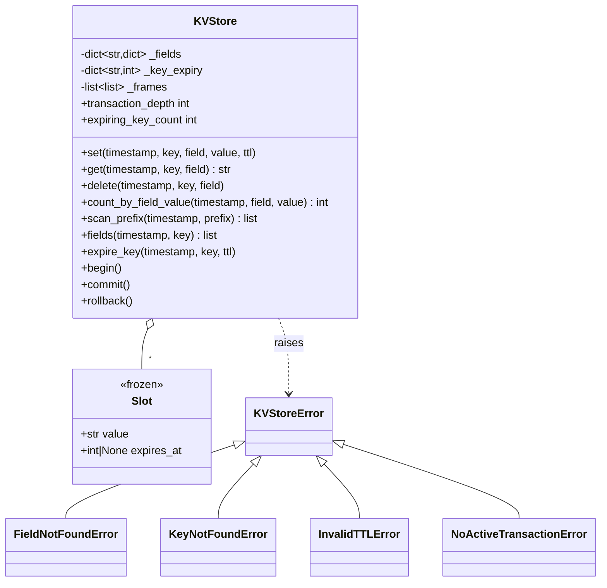

# 设计题解：内存键值存储（In-Memory Key-Value Store）

## 题目与澄清

题面通常长这样：

> 实现一个内存键值存储。每个 key 下面挂着若干"字段"（field），而不是一个裸值——把它
> 想成"每个 key 是一张小表"。第 1 关先支持基本的读写；后面几关会陆续解锁扫描、过期时间
> 和事务。

和[[solution-bank-account|银行账户系统]]一样，这是一道**分关递进的机考题**——同一份骨架
类、每关都有隐藏测试验证有没有破坏前面几关、时间由调用方显式传入而不是墙上时钟。那篇
题解已经把"机考怎么打"这件事讲透了，这里不重复：**第 1 关怎么选表示决定后面几关是加分
还是重写**这句话原样成立，唯一的区别是——这道题第 4 关加的不是"新的一种查询"，而是
**事务**：一组读写要么整体生效，要么整体不生效，而且可以任意嵌套。这是一种和"排行"
"合并账户"完全不同性质的需求：前者是"对已有数据换一种归约方式"，后者是"给已有的每一次
写操作都套上一层可以反悔的能力"，逼着你在写第 1 关的 `set`/`delete` 时就想清楚"这个操作
怎么才能被撤销"，而不是事后再补。

几个问题决定了整个骨架的形状：

- **"字段"和"值"的关系是什么？** 题面通常不会说"value 就是一个字符串"，而是"每个 key
  对应一组 field-value 对"——更像 Redis 的 hash 而不是普通的 `dict[str, str]`。这个假设
  决定了 `set`/`get`/`delete` 都必须带 `field` 参数，`count_by_field_value` 这种"按字段
  取值统计"的查询也只有在这个假设下才有意义。
- **过期是"字段级"还是"key 级"？** 两种真实需求都存在：一个字段（比如一次性验证码）该
  自己过期，一整个 key（比如一次会话）也该有一个总的存活期。本文的默认假设是**两者都要
  支持、各自独立**——这个决定的后果在"关键设计决策"第二节展开。
- **删除一个不存在的字段该不该报错？** 本文选择报错（见"关键设计决策"最后一节），如果
  面试官明确要求幂等（"删除不存在的东西也算成功"），这是一行代码的事：把 `if field not
  in ...: raise` 换成 `if field not in ...: return`。
- **事务嵌套的语义是什么？** 题面通常只说"支持 `begin`/`commit`/`rollback`，可以嵌套"，
  没有说"嵌套"具体是什么意思。本文的解释——也是这类题目几乎唯一合理的解释——是：
  `rollback` 只撤销**最内层**从 `begin` 到现在的改动，`commit` 把最内层的改动**折叠进
  上一层**（数据已经生效，但如果外层之后被撤销，这些改动一样会被撤销），只有最外层的
  `commit` 才是真正不可撤销的。这条语义直接决定了核心数据结构该长什么样，见下面。

**范围之外**：不做持久化到磁盘、不做多个客户端之间的隔离级别（这里只有一个调用方，
没有"事务之间互相看不看得见对方未提交的改动"这个问题）、不做真实的并发访问——和
[[solution-bank-account|银行账户系统]]一样，这道题的评测模型是单线程顺序调用。

## 需求与分级

- **第 1 关（基本读写）**：`set(timestamp, key, field, value)`、`get(timestamp, key,
  field)`、`delete(timestamp, key, field)`，以及一个"有多少个 key 的某个字段等于某个值"
  的统计查询 `count_by_field_value`。对应 `Slot`、`KVStore._fields`、
  `KVStore.set/get/delete/count_by_field_value`。
- **第 2 关（扫描）**：`scan_prefix(timestamp, prefix)` 返回所有以 `prefix` 开头的 key，
  `fields(timestamp, key)` 返回一个 key 当前的所有字段名——两者都**按字典序排序**，题面
  不一定明说，但机考的隐藏测试一定会按固定顺序比较返回值，不排序等于随机挂掉一半用例。
  对应 `KVStore.scan_prefix/fields`。
- **第 3 关（TTL）**：`set` 增加可选的 `ttl` 参数（字段级过期），新增
  `expire_key(timestamp, key, ttl)`（key 级过期，覆盖它名下所有字段）。一切由传入的
  `timestamp` 驱动，过期的数据在下一次任何访问它的调用里被发现并清除，没有后台线程。
  对应 `KVStore._touch`、`KVStore.expire_key`。
- **第 4 关（嵌套事务）**：`begin()`、`commit()`、`rollback()`，可以任意深度嵌套；
  `rollback` 只撤销最内层，`commit` 把最内层折叠进上一层；事务内部发生的 TTL 设置在
  提交之后必须按正常规则过期，在回滚之后必须像从未发生过。对应 `KVStore._frames` 和
  `KVStore._log/_write_field/_write_key_expiry`。

**这道题真正考的设计能力**：第 1 关的两个内部写方法（`_write_field`、
`_write_key_expiry`）如果一开始就不经过"先记一条撤销动作，再真正改"这一步，第 4 关几乎
必然要把整个存储层重写一遍——事务不是"在外面包一层"就能加上去的能力，它要求**每一次
底层改动**从第一行代码起就知道"怎么把自己变回去"。这和[[solution-bank-account|银行账户
系统]]选择"核心表示是事件日志而不是可变字段"是同一类判断：早一步的表示选择，决定了
后面的需求是免费的还是要推倒重来的。

## 核心对象与职责

- **`Slot`** —— 一个字段的当前取值：值本身，加上它自己的绝对过期时刻。不可变
  （`frozen=True`），一次 `set` 总是整体替换一个新的 `Slot`，不存在"只改值不改过期时间"
  这种半更新，避免了两者不同步的可能。
- **`KVStore`** —— 唯一的门面：`_fields: dict[str, dict[str, Slot]]` 是数据本身，
  `_key_expiry: dict[str, int]` 是 key 级过期时间表，`_frames: list[list[Callable[[],
  None]]]` 是撤销日志——一个栈，每一层是一份"把这一层做过的改动撤销掉"的闭包列表。三者
  之间没有第四个类去协调，因为协调逻辑（"先记撤销、再真正改"）足够薄，薄到不值得为它
  单独开一个类——这是"关键设计决策"最后要点破的一件事：模式不是默认选项，先问值不值。
- **异常层次** —— `KVStoreError` 一个根，`FieldNotFoundError`/`KeyNotFoundError`/
  `InvalidTTLError`/`NoActiveTransactionError` 四个具体的失败路径，互不代表对方，调用方
  想只抓某一类失败时不需要用字符串匹配错误信息。

生命周期上：`KVStore` **组合**（composition）`_fields`/`_key_expiry`/`_frames` 三个字典
和列表——它们不会脱离 `KVStore` 单独存在，也不会被外部引用持有（所有公开方法返回的都是
新建的 `list`/`str`/`int`，不是内部容器本身）。`Slot` 和 `key`/`field` 之间只通过字符串
键关联，不持有任何"这个字段属于哪个事务"之类的反向引用——事务只是"最近一段时间做了哪些
改动"的记录，改动完成之后，撤销日志里的闭包不知道也不关心自己曾经处于哪一层。



## 关键设计决策

### 核心表示：撤销日志，还是写时复制的覆盖栈？

这是这道题第 4 关唯一真正的分数所在。两个真实存在、都能正确实现嵌套事务的方案：

```python
# 方案 A（写时复制覆盖栈）：每层事务持有自己的一份存储快照，读的时候从最内层往外找
class Overlay:
    def __init__(self, parent=None):
        self.parent = parent
        self.data: dict[str, dict[str, Slot]] = {}

    def get(self, key, field):
        node = self
        while node is not None:
            if key in node.data:
                return node.data[key].get(field)  # 命中就停，不再往外层找
            node = node.parent
        return None
```

```python
# 方案 B（撤销日志，本文的选择）：只有一份真实存储，每次改动前记一条"怎么变回去"
def _write_field(self, key, field, slot):
    prior = self._fields.get(key, {}).get(field)
    self._log(lambda prior=prior: self._apply_field(key, field, prior))
    self._apply_field(key, field, slot)
```

方案 A 的直觉很有吸引力："每层事务一个快照"听起来就是"嵌套"的字面意思，`rollback` 只需
要把当前层的 `Overlay` 扔掉，`commit` 只需要把当前层的 `data` 合并进 `parent.data`。但
它有两个代价，都随"嵌套深、存储大"变得致命：**内存**——如果 `Overlay` 是对父层做一次
`dict` 浅拷贝（哪怕只拷贝顶层的 key，不拷贝每个 key 内部的字段表），一次 `begin()` 就是
`O(当前 key 数)`，嵌套 `d` 层、存储里有 `n` 个 key，总内存是 `O(d × n)`——十层嵌套、
百万级 key 的存储，`begin()` 会分配千万级的字典条目，而这十层事务可能只碰了几十个 key。
**读延迟**——就算不整份拷贝，只用"链表式"的 `Overlay`（上面 `get` 的写法），最坏情况下
一次 `get` 要沿着 `d` 层父链找到底，读延迟随嵌套深度线性增长，而这道题的语义里嵌套深度
是调用方决定的、没有上限的东西。

方案 B 的 `begin()` 是 `O(1)`——只 `append` 一个空列表；一次改动的记录代价是 `O(1)`——
一个闭包、一次 `append`；`commit()` 折叠进上一层是 `O(这一层改动的条数)`，与"存储有多
大"、"嵌套多深"都无关，只与"这次事务实际改了多少东西"成正比；`get`/`scan_prefix` 永远
只读**唯一的那份**真实存储，不随嵌套深度变慢。代价是每一条撤销记录本身占内存——但这是
`O(总共发生过多少次改动)`，而不是`O(嵌套深度 × 存储大小)`，且提交或撤销之后这些记录会
被丢弃，不会无限累积。这道题选方案 B，不是因为方案 A"不对"，是因为方案 A 的两项代价
恰好踩中题面强调的"大存储、任意深嵌套"这个组合——`test_random_nested_transactions_match
_a_reference_snapshot_model` 反而是拿方案 A（简化版：完整深拷贝，牺牲性能换实现的显然
正确）当参照模型，证明方案 B 在语义上和它完全等价，只是不必支付方案 A 的代价。

### 两条独立的过期时间线：key 级和字段级为什么不能合并成一条

如果只允许"字段级 TTL"，`expire_key` 这种"让一整个 key 连同它未来可能新增的字段一起
过期"的需求答不出来——字段是一个一个过期的，没有一个"字段的字段"能代表整个 key。如果
反过来只允许"key 级 TTL"，"一次性验证码 5 秒后失效，但 key 本身（这个用户）不该过期"这
种需求也答不出来。本文因此让 `_key_expiry: dict[str, int]` 和每个 `Slot.expires_at`
完全独立地判断：`_touch` 先检查 key 级过期时间，命中就清空整个 key；再检查每个字段自己
的过期时间，命中就只清那一个字段。两条时间线谁先到谁先生效，互不干扰，调用方可以只用
其中一条，也可以同时用（一个 key 设置了 30 分钟的会话过期，其中某个字段——比如一次性
验证码——设置了更短的 5 秒过期，5 秒后先消失的是验证码这一个字段，其余字段和 key 本身
仍然活着）。唯一需要额外处理的边界是：一个 key 的所有字段被逐个 `delete` 删空之后，它
挂着的 `_key_expiry` 条目会变成孤儿——`_write_field` 的最后两行专门处理这种情况，
`test_expiring_key_count_does_not_leak_when_fields_deleted_individually` 是它的回归
测试。

### 惰性清理为什么在事务内部同样安全，不需要特殊处理

`_touch` 发现字段过期时，调用的是普通的 `_write_field(key, field, None)`——和用户主动
`delete` 走的是**同一条代码路径**，包括"记一条撤销动作"这一步。乍一看这像是一个隐患：
如果这次惰性清理发生在一个之后会被 `rollback` 的事务里，撤销会不会把一条"本该已经过期"
的数据复活？答案是不会，原因是撤销恢复的是**同一个** `Slot`——它的 `expires_at` 字段
原样带回去，而"是否过期"从来不是存进去的一个布尔值，是每次访问时用调用方传入的 `now`
重新和 `expires_at` 比较得到的结论。所以撤销一次惰性清理，最多是让一条数据"看起来又能
被摸到"，但只要下一次访问传入的 `now` 仍然不小于它的 `expires_at`，它照样会被立刻重新
判定为过期、重新清理一次——过期状态永远是**推导**出来的，从不缓存，这也是它能安全地被
撤销日志这套通用机制接管、不需要为"过期"这件事单独写一套事务逻辑的原因。

### 事务控制方法为什么不接收时间戳，尽管其余每个方法都要

`set`/`get`/`delete`/`scan_prefix`/`fields`/`expire_key`/`count_by_field_value` 无一
例外，第一个参数都是 `timestamp: int`——这是"过期判断完全由调用方传入的时间驱动"这条
硬性要求的直接体现。但 `begin`/`commit`/`rollback` 三个方法故意**不带**这个参数。原因
很简单：这三个方法不读取、也不需要知道"现在几点"——它们只操作撤销日志这个栈本身
（入栈、合并、出栈重放），不碰任何一条数据的过期时间。给它们加一个用不上的 `timestamp`
参数，是"为了看起来统一"而制造的假一致性——真正的一致性是"每个需要时间才能做出正确判断
的方法都带时间戳"，不是"每个方法都带时间戳"。这也是"三个必须改掉的坏习惯"里"只为了转发
一次调用而存在的类要么给它职责要么删掉"的同一个原则在参数签名这个更小的尺度上的样子：
一个不被使用的参数和一个只会转发的类是同一种"看起来规范、实际不增加信息"的多余。

### 删除一个不存在的字段：报错，还是静默成功？

真实系统里两种设计都存在——`dict.pop(key)` 报错，`dict.pop(key, None)` 静默；HTTP
`DELETE` 语义上通常是幂等的（删除一个不存在的资源也算成功）。本文选择报错：`delete` 是
一个断言"这个字段存在"的操作，静默成功会让一个típo（打错的字段名、错误地认为某个字段
已经写过）在测试和演示时被悄悄吞掉，而不是在第一时间暴露出来——这和"删除、取消、拒绝
这类失败路径应该是显式异常"贯穿全文的取舍一致。如果面试官明确要求幂等语义，`delete` 的
`if field not in ...: raise FieldNotFoundError(...)` 这一行改成 `if field not in ...:
return` 即可，其余代码不用动——这正是"核心设计不因这条边界规则的取舍而改变"的证据。

## 代码走读

整份参考实现如下（测试通过的那一份，逐字嵌入）。

%% code:begin solution.py %%
```python
"""内存键值存储（In-Memory Key-Value Store）——分关递进机考题的参考实现。

五行设计：每个 key 下面是一张字段表（field -> Slot），`Slot` 带着自己的绝对过期时刻，key
自己另外可以有一份整体过期时间，两者都是惰性检查、只在被访问到时才物理清除；一切事务能力
建在同一根"撤销日志"上——每一次真正改动物理存储之前，先把"怎么把它变回去"记成一个闭包，
`begin` 开一层新的日志，`commit` 把这一层日志整体并进上一层（数据已经生效，只是还能被
外层撤销），`rollback` 把这一层日志按逆序重放；不在任何事务里时日志根本不会被记录，读写
路径因此和没有事务功能时完全等价，没有为"可能用得上"的分支付出任何代价。
"""

from __future__ import annotations

from collections.abc import Callable
from dataclasses import dataclass


class KVStoreError(Exception):
    """本设计所有失败路径的公共基类。"""


class KeyNotFoundError(KVStoreError):
    """key 不存在，或者它的字段已经全部过期/被删空了。"""


class FieldNotFoundError(KVStoreError):
    """字段不存在，或者已经过期——对调用方来说这两者没有区别。"""


class InvalidTTLError(KVStoreError):
    """存活时间不是正数。"""


class NoActiveTransactionError(KVStoreError):
    """在没有对应 `begin` 的情况下调用了 `commit` 或 `rollback`。"""


@dataclass(frozen=True, slots=True)
class Slot:
    """一个字段的当前取值：值本身，加上它自己的绝对过期时刻（`None` 表示不会单独过期，
    但仍然可能随所属的 key 一起过期）。
    """

    value: str
    expires_at: int | None


class KVStore:
    """字段表加撤销日志：`set`/`get`/`delete`/`count_by_field_value` 是第 1 关，
    `scan_prefix`/`fields` 是第 2 关，`expire_key` 和 `set` 的 `ttl` 参数是第 3 关，
    `begin`/`commit`/`rollback` 是第 4 关。除了两个只读的 `*_count` 之外，每个改动或
    读取数据的方法第一个参数都是 `timestamp: int`——这个类内部没有任何地方读墙上时钟；
    事务控制三个方法反而**不带** `timestamp`，理由见题解"关键设计决策"。
    """

    def __init__(self) -> None:
        self._fields: dict[str, dict[str, Slot]] = {}
        self._key_expiry: dict[str, int] = {}
        self._frames: list[list[Callable[[], None]]] = []

    # ---------- 只读视图 ----------

    @property
    def transaction_depth(self) -> int:
        """当前嵌套了多少层未提交的事务；0 表示不在任何事务里。"""
        return len(self._frames)

    @property
    def expiring_key_count(self) -> int:
        """挂着"整体过期时间"的 key 有多少个。一个 key 的所有字段被逐个 `delete` 删空后，
        这个数必须跟着降下来——否则这张表会随着"先设 key 级 TTL、再手动删光字段"这种用法
        无限增长，是一个真实存在过的缺陷，见 `_write_field` 的最后两行。
        """
        return len(self._key_expiry)

    def key_count(self, timestamp: int) -> int:
        """还至少有一个存活字段的 key 有多少个；顺带清掉所有到期的 key 和字段，因此也是
        证明"过期的数据真的从存储里消失了、不是只是查不到"最直接的方式。
        """
        return sum(1 for key in list(self._fields) if self._touch(key, timestamp))

    # ---------- 撤销日志 ----------

    def _log(self, undo: Callable[[], None]) -> None:
        """不在任何事务里时没有人会调用 `rollback`，记录撤销动作没有意义，也没有代价。"""
        if self._frames:
            self._frames[-1].append(undo)

    def _apply_field(self, key: str, field: str, slot: Slot | None) -> None:
        """把 `key.field` 直接改写成 `slot`（`None` 表示删除）。这个方法既是"正向写入"的
        实现，也是"撤销时变回去"的实现——两者是同一个操作，撤销不需要另一套代码，只需要
        知道"变回去的目标状态是什么"。
        """
        if slot is None:
            bucket = self._fields.get(key)
            if bucket is not None:
                bucket.pop(field, None)
                if not bucket:
                    del self._fields[key]
        else:
            self._fields.setdefault(key, {})[field] = slot

    def _write_field(self, key: str, field: str, slot: Slot | None) -> None:
        prior = self._fields.get(key, {}).get(field)
        self._log(lambda prior=prior: self._apply_field(key, field, prior))
        self._apply_field(key, field, slot)
        if key not in self._fields and key in self._key_expiry:
            self._write_key_expiry(key, None)  # 字段删空了，孤立的整体过期时间没有意义

    def _apply_key_expiry(self, key: str, expires_at: int | None) -> None:
        if expires_at is None:
            self._key_expiry.pop(key, None)
        else:
            self._key_expiry[key] = expires_at

    def _write_key_expiry(self, key: str, expires_at: int | None) -> None:
        prior = self._key_expiry.get(key)
        self._log(lambda prior=prior: self._apply_key_expiry(key, prior))
        self._apply_key_expiry(key, expires_at)

    # ---------- 惰性过期 ----------

    def _touch(self, key: str, now: int) -> bool:
        """访问 `key` 之前先把到期的东西清掉，返回清理之后这个 key 是否还有存活字段。
        整个 key 到期时它名下所有字段一起消失；否则只清理单独到期的字段。清理动作本身
        照样走 `_write_field`/`_write_key_expiry`，所以即使发生在事务内部也一样可撤销——
        但撤销回去的是同一份 `(value, expires_at)`，过没过期永远由调用时的 `now` 重新
        判断，所以撤销一次惰性清理绝不会让一条本该过期的数据复活。
        """
        deadline = self._key_expiry.get(key)
        if deadline is not None and now >= deadline:
            for field in list(self._fields.get(key, {})):
                self._write_field(key, field, None)
            self._write_key_expiry(key, None)
            return False
        bucket = self._fields.get(key)
        if bucket:
            for field, slot in list(bucket.items()):
                if slot.expires_at is not None and now >= slot.expires_at:
                    self._write_field(key, field, None)
        return key in self._fields

    # ---------- 第 1 关：基本读写 ----------

    def set(self, timestamp: int, key: str, field: str, value: str, ttl: int | None = None) -> None:
        """写入一个字段，覆盖已有的值（包括它的过期时间）。`ttl` 省略表示这个字段不会
        单独过期——但 key 级的整体过期时间仍然可能连它一起杀死。
        """
        if ttl is not None and ttl <= 0:
            raise InvalidTTLError(f"ttl 必须为正数，收到 {ttl}")
        self._touch(key, timestamp)
        expires_at = None if ttl is None else timestamp + ttl
        self._write_field(key, field, Slot(value, expires_at))

    def get(self, timestamp: int, key: str, field: str) -> str:
        """读取一个字段的值；字段不存在或已经过期都抛 `FieldNotFoundError`。"""
        self._touch(key, timestamp)
        slot = self._fields.get(key, {}).get(field)
        if slot is None:
            raise FieldNotFoundError(f"{key}.{field} 不存在")
        return slot.value

    def delete(self, timestamp: int, key: str, field: str) -> None:
        """删除一个字段；字段不存在（或已经过期）同样抛 `FieldNotFoundError`——删除一样
        东西之前必须先证明它还在，而不是悄悄地什么都不做。
        """
        self._touch(key, timestamp)
        if field not in self._fields.get(key, {}):
            raise FieldNotFoundError(f"{key}.{field} 不存在")
        self._write_field(key, field, None)

    def count_by_field_value(self, timestamp: int, field: str, value: str) -> int:
        """有多少个 key 的这个字段当前恰好等于 `value`。每次调用都会先清一遍所有 key
        到期的字段——这道题的规模决定了线性扫描足够，索引化的取舍见"扩展与追问"。
        """
        count = 0
        for key in list(self._fields):
            self._touch(key, timestamp)
            slot = self._fields.get(key, {}).get(field)
            if slot is not None and slot.value == value:
                count += 1
        return count

    # ---------- 第 2 关：扫描 ----------

    def scan_prefix(self, timestamp: int, prefix: str) -> list[str]:
        """所有以 `prefix` 开头、至少还有一个存活字段的 key，按字典序升序排列。"""
        return sorted(key for key in list(self._fields)
                       if self._touch(key, timestamp) and key.startswith(prefix))

    def fields(self, timestamp: int, key: str) -> list[str]:
        """`key` 当前存活的字段名，按字典序升序排列；key 不存在时返回空列表而不是报错——
        "问一个不存在的东西有哪些字段"和"读一个不存在的字段"是两件不同的事。
        """
        self._touch(key, timestamp)
        return sorted(self._fields.get(key, {}))

    # ---------- 第 3 关：key 级 TTL ----------

    def expire_key(self, timestamp: int, key: str, ttl: int) -> None:
        """给整个 key 设置一个从 `timestamp` 起 `ttl` 之后到期的存活期，到期时它名下所有
        字段一起消失；覆盖它之前的 key 级过期时间，不影响单个字段各自的过期时间——两条
        时间线各自独立，谁先到谁先让相关的数据消失。
        """
        if ttl <= 0:
            raise InvalidTTLError(f"ttl 必须为正数，收到 {ttl}")
        if not self._touch(key, timestamp):
            raise KeyNotFoundError(f"key 不存在：{key}")
        self._write_key_expiry(key, timestamp + ttl)

    # ---------- 第 4 关：嵌套事务 ----------

    def begin(self) -> None:
        """开启一层新的事务，可以在已经开着的事务里再嵌套，深度没有上限。"""
        self._frames.append([])

    def commit(self) -> None:
        """结束当前这一层事务，把它的改动**保留**下来。如果外面还套着一层事务，这些
        改动只是折叠进外层的撤销日志——对存储本身来说它们已经生效，但外层的 `rollback`
        依然能把它们连同外层自己的改动一起撤销；只有最外层的 `commit` 才真正意味着
        "这些改动再也不会被撤销"。
        """
        if not self._frames:
            raise NoActiveTransactionError("没有正在进行的事务")
        finished = self._frames.pop()
        if self._frames:
            self._frames[-1].extend(finished)

    def rollback(self) -> None:
        """撤销当前这一层事务里发生的所有改动，恢复到进入这一层之前的状态；只影响这一层，
        外层（如果有）在这一层开始之前的改动不受影响，因为它们记在另一份日志里。
        """
        if not self._frames:
            raise NoActiveTransactionError("没有正在进行的事务")
        undo_ops = self._frames.pop()
        for undo in reversed(undo_ops):
            undo()


def _demo() -> None:
    store = KVStore()
    store.set(0, "user:1", "name", "Ada")
    store.set(0, "user:1", "session", "abc123", ttl=10)
    store.set(0, "user:2", "name", "Ada")
    print("同名用户数:", store.count_by_field_value(0, "name", "Ada"))

    store.begin()
    store.set(0, "user:1", "name", "Ada Lovelace")
    store.begin()
    store.delete(0, "user:1", "session")
    store.rollback()  # 只撤销内层：session 恢复，改名保留
    store.commit()    # 外层提交：改名落地
    print("回滚内层、提交外层之后:", store.get(0, "user:1", "name"))

    try:
        store.get(15, "user:1", "session")
    except FieldNotFoundError:
        print("session 在 t=15 已过期")


if __name__ == "__main__":
    _demo()
```
%% code:end %%

读的时候留意这四处，它们是上面几个决策在代码里的落点：

1. **`_apply_field` 既是正向写入、也是撤销时的还原**：`slot=None` 表示删除，两种调用
   方式（真正写入、撤销回放）走的是同一份逻辑，不需要为"撤销"单独维护一套镜像代码。
2. **`_write_field` 先 `self._log(...)` 再 `self._apply_field(...)`**：先记录"如何变
   回去"，再真正改——这个顺序颠倒过来（先改再记）在异常从 `_apply_field` 抛出时会让
   撤销日志和真实状态不一致，虽然本题的 `_apply_field` 不会抛异常，但这个顺序本身是
   撤销日志类设计的通用纪律。
3. **`commit` 里的 `self._frames[-1].extend(finished)`**：折叠进上一层的全部实现，一行
   代码，`finished` 列表的顺序被原样保留，保证外层 `rollback` 时的撤销顺序仍然正确
   （细节见下方"测试与自检"）。
4. **`_touch` 内部对过期字段的清理调用的是 `_write_field`，不是直接操作 `self.
   _fields`**：这保证了"过期清理"和"用户主动改写"共享同一条撤销路径，是"惰性清理为什么
   在事务内部同样安全"这条决策的全部代码。

## 测试与自检

`test_kv_store.py` 用 `IMPL` 环境变量在参考解和练习骨架之间切换，20 条用例覆盖四关。
它钉住的不变式是：

- **基本读写的失败路径**：读、删一个不存在的字段都抛 `FieldNotFoundError`；`set` 覆盖
  时连同旧的过期时间一起替换，不会遗留"新值配旧过期时间"这种半状态。
- **两种扫描各自的排序规则**：`scan_prefix` 和 `fields` 都按字典序，
  `test_scan_prefix_returns_sorted_live_keys_only` 同时验证前缀过滤和排序。
- **两条独立的过期时间线**：`test_field_ttl_...` 和 `test_key_ttl_expires_all_fields_
  together` 分别钉住字段级和 key 级；`test_expiring_key_count_does_not_leak_...` 是
  "关键设计决策"里那个孤儿条目 bug 的回归测试。
- **容器真的会缩小**：`test_expired_data_is_physically_purged_key_count_shrinks` 让
  50 个 key 一起过期，断言 `key_count` 真的从 50 掉到 0，而不只是查不到。
- **嵌套事务的两条核心规则**：`test_rollback_undoes_only_its_own_nesting_level` 和
  `test_commit_folds_into_parent_and_outer_rollback_still_undoes_it` 分别对应"回滚只
  撤销自己这层"和"提交折叠进上一层、外层回滚依然能连带撤销"；
  `test_arbitrarily_deep_nesting_each_level_only_undoes_itself` 把嵌套深度推到 30 层，
  证明这条能力和深度无关。
- **事务和 TTL 的交叉**：`test_ttl_set_inside_a_transaction_expires_correctly_after_
  commit` 和 `..._is_undone_by_rollback` 分别验证提交后正常过期、回滚后如同未发生过。
- **随机对拍**：`test_random_nested_transactions_match_a_reference_snapshot_model`
  用固定种子跑 400 步随机的读写与事务操作，和一个"每层事务整份深拷贝"的朴素参照模型
  比较最终可见状态，是"关键设计决策"第一节里"方案 A、方案 B 语义等价"这句话的证据，
  不是一句空话。

**两分钟怎么演示给面试官**：跑 `python solution.py` 的 demo——两个用户同名，统计出 2；
开一层事务改名，再嵌套一层删除会话字段又反悔，回滚内层保留外层的改名，提交外层；最后
证明会话字段的 TTL 依然正常生效。三行输出覆盖第 1、3、4 关。

自检清单：`set` 覆盖时有没有连过期时间一起替换？扫描类方法排序了吗？两条过期时间线有
没有互相干扰？`commit` 折叠进上一层之后，外层 `rollback` 还能不能连带撤销？有没有一个
容器只增不减？

## 扩展与追问

**新需求**

- **按字段值统计的索引化**：`count_by_field_value` 目前是线性扫描所有 key，`O(key
  总数)`。真实系统会维护一张 `(field, value) -> set[key]` 的倒排索引，写路径每次
  `set`/`delete` 顺带更新它——但这张索引本身也必须纳入撤销日志：一次被撤销的 `set` 不
  仅要把字段值变回去，还要把它在倒排索引里的登记一并撤销，这是索引化在事务系统里唯一
  麻烦的地方，值得在追问环节主动提出来。
- **`copy_key`/`rename_key`**：只是 `_fields[new] = _fields.pop(old)` 的变体，走同样的
  "先记撤销、再真正改"路径就能获得事务能力，不需要新的机制。

**并发与线程安全**

- 这道题的评测模型是单线程顺序调用，本文因此没有引入任何锁。如果要支持多线程，最简单
  也最保守的做法是把整个 `KVStore` 的公开方法都套上同一把 `threading.Lock`——事务本身
  隐含"这段时间不希望被别的调用打断"的语义，比[[solution-bank-account|银行账户系统]]
  或数字钱包那种"只在临界区里加锁、临界区外尽量并行"的做法更接近"要正确、不要求快"这条
  题面通常隐含的优先级；真正想要多事务并发，需要在这套单版本存储之上引入多版本并发控制
  （MVCC）或者每个事务的写集合冲突检测，那已经是数据库教材的话题，不是一道机考题的分数
  所在。
- 撤销日志本身（`_frames`）在单线程模型下是一个简单的栈；如果允许多个线程各自开事务，
  日志需要按线程（或按显式的事务 id）隔离，而不能继续假设"当前活跃的事务只有一个"。

**持久化与规模**

- 换成数据库时，撤销日志的角色正好对应**预写日志（WAL）**——`commit` 折叠进上一层，在
  真实数据库里对应"事务提交时把日志刷盘"；本文的"折叠进上一层再由更外层决定去留"，对应
  的是数据库教材里"嵌套事务"或者"保存点（savepoint）"这两个概念，`begin`/`commit`/
  `rollback` 分别对应 `SAVEPOINT`/`RELEASE SAVEPOINT`/`ROLLBACK TO SAVEPOINT`。
- 存储规模变大后，`_fields` 这个双层字典本身没有变慢的理由（哈希表的均摊 `O(1)`），
  真正的规模瓶颈是 `scan_prefix`——目前是"列出所有 key 再过滤"，`O(总 key 数)`；如果
  前缀查询是高频路径，值得换成 trie（字典树）或者对 key 排序后做二分，把代价降到
  `O(匹配的 key 数 + log(总 key 数))`。这个替换只发生在 `scan_prefix` 内部，不影响
  `_fields` 的存储结构，也不影响事务机制——撤销日志记录的是"哪个 key 的哪个字段变成了
  什么"，不关心外面有没有一棵 trie 在做索引。

## 常见错误

- **把"key 级过期"和"字段级过期"合并成一条时间线**。要么答不出"整个 key 过期"，要么
  答不出"某个字段单独过期"，二选一都会漏掉题面的一半需求。
- **`begin()` 时真的深拷贝一份存储**。第 1、2 关的正确性测试不会发现这个问题（存储很
  小），但一旦评测用例把存储量和嵌套深度都推大，这个实现会在内存或时间上第一个倒下——
  这正是"关键设计决策"第一节要教的判断力。
- **`commit` 直接把改动写"透"到最外层，跳过中间层**。如果一个更外层的事务之后被
  `rollback`，中间被跳过的那层改动就没有回滚入口了——折叠必须是逐层的：`commit` 只
  把这一层并进**直接上一层**，不能一步到位并到最外层。
- **过期状态被缓存成一个布尔字段**（比如给 `Slot` 加一个 `is_expired: bool`，在清理时
  置位）。这样的字段一旦写下就不会自己变回 `False`，"撤销一次清理"会让它永远显示为已
  过期——过期必须是每次访问时用 `now` 重新推导的结论，不能是存下来的状态。
- **事务控制方法里悄悄读墙上时钟**（比如 `commit` 内部调用 `time.time()` 记录"提交
  时间"）。这道题的评测系统不会陪你等，任何读墙上时钟的地方都是没法用固定用例复现的
  不确定性来源。
- **Java 味的写法**：给 `KVStore` 的每个字段配一对 `getField()`/`setField()`；用一个
  继承体系表示"事务状态"（进行中/已提交/已回滚），而不是一个栈的深度——事务在这道题里
  没有需要跨状态保留的行为差异，栈本身就是完整的状态。

## 45 分钟怎么分配

- **前 10 分钟，不写代码，先想清楚"改动怎么被撤销"**。这是本题真正的分数所在：如果
  `set`/`delete` 的实现从第一行起就没有为"记录如何变回去"留位置，第 4 关几乎必然要把
  底层存储重写一遍。
- **第 1 关，10–25 分钟**。先写 `Slot`、`_fields`、`set`/`get`/`delete`，让
  `count_by_field_value` 最后写——它是对已有存储的一次遍历，不影响写路径的形状。
- **第 2 关，约 10 分钟**。`scan_prefix`/`fields` 只是过滤加排序，重点是别忘了排序——
  这是机考里最容易在"看起来对、其实和隐藏测试的期望顺序不一致"上丢分的地方。
- **第 3 关，约 15 分钟**。想清楚字段级和 key 级两条过期时间线怎么共存，再决定清理动作
  是不是要走和"用户主动删除"相同的代码路径（本文的答案是要）。
- **第 4 关，约 20 分钟**。先确认自己对"嵌套"的理解和面试官一致（回滚只撤销最内层，
  提交折叠进上一层），再决定用撤销日志还是覆盖栈——如果第 1 关的写方法已经按"先记
  撤销、再真正改"的模式写好，这一关只需要加 `begin`/`commit`/`rollback` 三个方法，
  不需要动任何已有的读写逻辑。

**时间不够时砍什么**：优先保证第 1、2 关满分，第 3 关做到"字段级 TTL 能读会过期"、
key 级 TTL 可以放到追问里口头说明思路。**绝不砍**的是第 1 关里"改动前先记录撤销动作"
这一步——这是唯一决定第 4 关还能不能顺利加上去的选择，砍了它，第 4 关只能重写整个
存储层。

## 来源与延伸

- <https://codezym.com/lld/amazon> — CodeZymSolutions 对亚马逊一类分级机考题的公开
  复现，2026 年 9 月的报告样本里包含一道键值存储题。**分歧**：它的分级顺序把 TTL 放在
  事务之后；本文遵照本题任务书给定的顺序（TTL 在第 3 关、事务在第 4 关），因为"事务里
  的 TTL 要不要正确处理"本身就是检验事务实现是否正确的最好测试，放在 TTL 之后更合理。
- <https://workat.tech/machine-coding/practice/design-key-value-store-6gz6cq124k65/index.html>
  — workat.tech 的机考练习题面，把"每个 key 是一张字段表"这条设定讲得很清楚。
  **分歧**：题面本身只给到基本读写和过期，没有涉及嵌套事务，本文的撤销日志设计和事务
  折叠语义是独立设计的。
- <https://docs.python.org/3/library/dataclasses.html> — `Slot` 用
  `frozen=True, slots=True`：不可变保证一次 `set` 总是整体替换、不会出现"只改了值忘了
  改过期时间"的半更新；`slots=True` 在存储量大时省下每个实例的 `__dict__` 开销。
- [[solution-bank-account|设计题解：银行账户系统（Bank Account System）]] ——
  同样是"分关递进的机考题"，同样在第 1 关就要为后面几关的需求预留表示；两篇题解在这一点
  上互为参照：银行账户选的是"一份只增不减的事件日志，一切查询是归约"，这道题选的是"一份
  可变的真实存储，加一根记录如何撤销的日志"——放在一起读，能看清"要不要允许原地修改"这个
  选择实际取决于"后面的需求是要历史，还是要可撤销性"，而不是哪一种写法天生更高级。
- [[structure.storage|内存持久化（In-Memory Persistence）]] —— "扩展与追问"里"撤销
  日志对应预写日志（WAL）、嵌套事务对应保存点（savepoint）"这组类比，用的正是这个概念
  在真实存储引擎里的名字。
