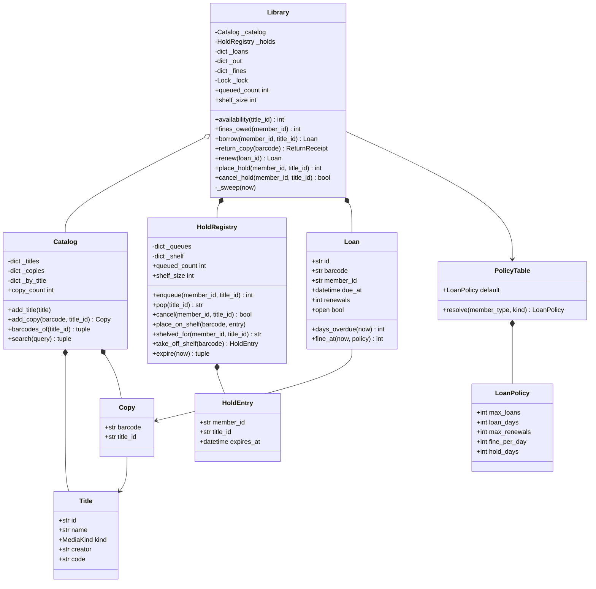

# 设计题解：图书馆管理（Library Management）

## 题目与澄清

面试官的开场："设计一个图书馆管理系统。读者可以搜书、借书、还书、续借；书被借走时可以预约，
还回来通知预约的人；逾期要罚款。"

这是面向对象设计里被讲烂了的一道题——正因为烂熟，它的考法已经变了。面试官不是想看你能不能写出
`Book`、`Member`、`Library` 三个类，而是想看**你在一道熟题上能不能比模板答案多说出点什么**。
公开题解里能拿到的那些答案，几乎都在同一个地方失手：把「一本书」当成了一样东西。

所以第一个澄清问题就是胜负手：

- **"一本书"指的是什么？**《深入理解计算机系统》是一本书，架上那三册贴着条码 B001、B002、B003
  的也是"书"。前者是**书目**（bibliographic record），后者是**馆藏副本**（copy / item）。**搜索
  命中的是书目，借走的是副本，预约排的是书目的队。**这三件事各挂在不同的东西上，不把它们分开，
  后面每一个功能都会拧巴。
- **一个读者能借几本、借多久？** 有上限，且按读者类型不同（学生 / 教师 / 公众）。要追一句：
  这些数字是硬编码、还是配置？答案必须是配置，否则第四关加"教师"就要改流程代码。
- **续借的边界在哪？** 有人在排队时还能不能续？答案是**不能**——排队是对还没拿到书的人的承诺，
  续借只是对已经拿到书的人的方便，后者让位。这一条是这道题唯一真正的业务规则冲突，值得主动说。
- **预约怎么排？书还回来给谁？留多久？不来取怎么办？**先来先到（FIFO）；给队首；留几天（策略）；
  **到期下架，而且这个人退出队列**。最后这半句最容易漏，下面专门有一节。
- **罚金怎么算？** 按逾期天数 × 费率，不足一天按一天。要追一句：读者还没还书的时候，柜台能不能
  答出"现在欠多少"？能，所以罚金必须是**算出来的**，不是还书那一刻写进某个字段的。
- **搜索要做到什么程度？** 按书名、作者做子串匹配就行。这道题不考检索，主动说清楚它是送分项，
  比花十分钟写一套检索类更能加分。
- **并发？** 要。两个读者同时借最后一本，以及多人同时预约同一本书的排队次序。

**范围之外**：不做真实通知投递（邮件/短信）、不做跨馆互借、不做书架物理位置与上架路径、不做
罚金的收款与减免流程、不做真实持久化。

## 需求与分级

- **第 1 关（核心建模，约 20 分钟）**：书目与副本分开；目录的登记与检索；按书目借一本副本、还回来。
  对应 `Title`、`Copy`、`Catalog`、`Library.borrow` / `return_copy`。
- **第 2 关（借阅规则，约 15 分钟）**：按读者类型的借阅上限与借期；续借（有上限）；逾期罚金按
  注入的时钟累积。对应 `LoanPolicy`、`PolicyTable`、`Loan.days_overdue` / `fine_at`、`renew`。
- **第 3 关（预约队列，约 15 分钟）**：预约、排队次序、还书时交给队首、取书架与到期不取。
  对应 `HoldRegistry`、`Library._sweep`、`place_hold` / `cancel_hold`。**这一关是这道题的分水岭。**
- **第 4 关（扩展与并发，选做）**：加一种介质（DVD、期刊）或一种读者类型；并发借同一本、
  并发预约同一本。验收标准是：加介质、加读者类型**只加一行政策**，借还流程一行不动。

## 核心对象与职责

### 书目不是副本：三件事各挂在哪

这是全题的第一条、也是最重要的一条分界线。

| 操作 | 挂在哪 | 为什么 |
|---|---|---|
| 搜索 | **书目** `Title` | 读者找的是"《沙丘》"，不是"条码 D001 那张碟" |
| 借、还、罚金、丢失 | **副本** `Copy` | 被搬走、被弄脏、被算逾期的是那一本实体 |
| 预约排队 | **书目** `Title` | 排队的人要的是"任何一本《沙丘》"，不会指定条码 |
| 留在取书架上等人来取 | **副本** `Copy` | 一旦为某人留出来，就是**那一本**，不能再给别人 |

把它们合成一个 `Book` 类会立刻撞墙：给 `Book` 加一个 `available: bool` 就只能表达"有没有"，
表达不了"还剩几本"；改成 `count: int` 就丢了副本的身份，而身份是罚金、丢失注销、"这本给你留着"
这些功能的前提。流行题解里写 `Book.available = False` 的那一行，本质上是把一个多副本系统压成了
单副本系统。

顺带说清一个容易混的地方：`Copy` 只有 `barcode` 和 `title_id` 两个字段、一个方法都没有，它凭什么
不该被删掉？凭**身份**。一个只有字段没有行为的类，如果它的实例之间可以互换（比如一个只有 id 和
城市的"门店"），那确实不如一个字符串；但两本副本一旦有一本被留给了别人、有一本丢了，它们就**不再
可互换**，这时"有几本"这个数字不够用，必须有东西能被指名道姓。

### 为什么没有 `LibraryItem` 抽象基类

第四关常见的加法是"再支持 DVD 和期刊"。模板答案的反应是建一棵继承树：`LibraryItem` 抽象基类，
`Book` / `DVD` / `Magazine` 三个子类，基类上开一个 `get_author_or_publisher()` 抽象方法让子类各自
实现。

停下来看看那个抽象方法是干什么的：图书返回作者，DVD 返回导演，期刊返回出版者。**这是一个命名
问题，不是多态问题。**三个子类的行为完全相同，差别只在同一个字段叫什么名字。于是：

```python
@dataclass(frozen=True, slots=True)
class Title:
    id: str
    name: str
    kind: MediaKind = MediaKind.BOOK
    creator: str = ""      # 图书的作者、DVD 的导演、期刊的出版者
    code: str = ""         # ISBN / 碟片编号 / 刊期号
```

一个字段按介质换角色，一个枚举记介质。期刊的"每一期"就是名字相同、`code` 不同的独立书目——
这也正确地反映了现实：你借的是《经济学人》某一期，不是《经济学人》这个刊名。

那么"DVD 只能借两天、罚金翻四倍、取书架只留一天"这些真实差异去哪了？去了**政策表**，
下面第三个决策专门讲。判据是这样的：**子类的正当理由是行为不同，不是字段不同、也不是参数不同。**

### 职责表

| 类 | 单一职责 | 它守的不变量 |
|---|---|---|
| `Title` | 一个书目（著录记录） | 不可变；不知道自己有几本副本 |
| `Copy` | 一个馆藏副本（条码） | 不可变；`title_id` 指向存在的书目 |
| `Catalog` | 书目与副本的登记簿 + 朴素检索 | 条码全局唯一；副本必属于已登记的书目 |
| `LoanPolicy` / `PolicyTable` | 一行政策 / 按 (读者类型，介质) 查 | 不可变；查不到就退回更粗的一档 |
| `Loan` | 一次外借及其罚金计算 | 罚金按时刻算，不存字段 |
| `HoldRegistry` | **预约队列 + 取书架** | 一人对一书目最多排一次；队空即删键；过期条目必被清 |
| `Library` | 流通台：借、还、续借、预约 | **"谁拿到哪一本"只在 `_sweep` 里决定** |

`Catalog` 组合 `Title` 与 `Copy`；`Library` 组合 `HoldRegistry` 与 `Loan`，但只**关联**
`Catalog`（目录可以独立存在、独立被检索，流通台关掉了目录还在）。`Loan` 只记 `barcode` 和
`member_id` 两个字符串，对 `Copy` 和 `Member` 都是关联——这正是
[[oop.relationships|类之间的关系（Class Relationships）]]里"谁拥有谁的生命周期"那条判据的用法。



## 关键设计决策

### 一、预约队列：谁拿到哪一本，由谁决定？

问题说清楚：一本书还回来了，队列里排着三个人。这本副本接下来归谁？留多久？他不来取怎么办？
中途有人取消预约、有人新捐了一本书，又怎么办？

**选项 A：在还书那一步就地决定。**`return_copy` 里判断队列非空就把书留给队首。这是最直觉的写法，
也是大多数题解的写法。它的问题是**分配规则被写在了一个事件里**：新进一本书时、取消预约时、
保留到期时，同样需要"重新决定谁拿到哪一本"，于是这段逻辑被复制三遍（更常见的是漏写两遍）。

**选项 B：给每条保留挂一个定时器。**到期了回调一下。代价很具体：一万条活跃预约就是一万个定时任务，
而它们绝大多数会在到期前被取消；更致命的是**测试无法控制时间**，整套逻辑只能靠 `sleep` 去验，
一轮机器编码就这么废了。

**选项 C（本文的选择）：把分配规则收敛成一个 `_sweep(now)`，在每一次读写的入口惰性调用。**

```python
def _sweep(self, now: datetime) -> None:
    self._holds.expire(now)                       # 过期的先下架
    for title_id in self._holds.queued_titles():  # 再按队列依次上架
        while self._holds.queue_length(title_id):
            free = self._free_barcodes(title_id)
            if not free:
                break
            member_id = self._holds.pop(title_id)
            ...
            self._holds.place_on_shelf(free[0], HoldEntry(member_id, title_id, expires))
```

归还、过期、新进书、取消预约都只是**改事实**，改完调它。好处有三：分配规则只有一份；
没有定时器也没有后台线程，因此完全可测（时钟注入，测试里把 `now` 一推就能验到期）；
"没有人查询时过期与否无人关心"——惰性求值在这里既省资源又刚好符合语义。

代价也要说：**只读属性也得先跑一次 `_sweep`**，否则 `shelf_size` 会把一条早该下架的条目报出去。
这是惰性过期的固有代价，值得为它写一行注释；换来的是整个系统没有一个后台线程。

### 二、不来取的那个人——必须会缩的两个容器

这是这道题最容易被忽略、也最能分出高下的一处。预约涉及**两个**容器：

1. **队列** `_queues[title_id]`：还在等的人；
2. **取书架** `_shelf[barcode]`：已经为某人留出来、等他来取的副本。

问："一位读者预约了书，通知也收到了，可他再也没来。会发生什么？"

在把预约做成"观察者列表"的常见写法里，答案是：**这本副本永远停在"给他留着"的状态，馆里有书，
谁也借不到。**这不是性能问题，是功能被彻底锁死。同类的泄漏还有：队列键在队空之后留下一个空
`deque`，开十年的图书馆会攒下几十万个空壳。

所以对每个容器都要逐条回答"什么时候删"：

- 取书架：**到期即删**（`HoldRegistry.expire`），这是它唯一的收缩途径；以及被取走时删、
  被取消时删。
- 队列：被排上取书架时删（`pop`）、主动取消时删（`cancel`）、**通过别的途径借到这个书目时也要删**
  ——不然一个人既借着书又排着队，下一本还回来还会再留给他一次。而且这四条路径每一条都要在队列
  变空时**把键删掉**。

还有一个必须当场回答的策略问题：**保留过期之后，这个人回队尾还是彻底出局？**本文选**出局**。
理由：预约是一次意愿表达，两天没来说明意愿已经不成立；自动回队尾等于让一个不来的人无限期地
挡在后面的人前面，而后面的人还在按 FIFO 等一个永远轮不到的号。要他再要，就重新排——这件事在
真实图书馆里也是这么办的。把这个选择**说出来**比选哪一边更重要。

### 三、政策：继承、`if` 分支，还是一张表？

问题：借几本、借多久、能续几次、罚多少、留架几天，这五个数字要按读者类型（学生 / 教师 / 公众）
和介质（图书 / DVD / 期刊）变，而且面试官随时会加第三个维度。

**选项 A：给 `Member` 建继承树**，`StudentMember.max_loans() -> 2`。代价：读者类型是**会变的**
（学生毕业成了校友），而 Python 对象换类是件脏事；更本质的是，一个人的类型只是一个属性，不是
他的种类——用继承表达属性是最典型的误用。

**选项 B：`if member.type is STAFF and kind is DVD: ...` 的分支。**维度一多就是笛卡尔积的分支，
而且分支散落在 `borrow`、`renew`、`return_copy`、`_sweep` 四个地方，改一处漏三处。

**选项 C（本文的选择）：一张按 `(读者类型, 介质)` 查、允许退化的政策表。**

```python
def resolve(self, member_type: MemberType, kind: MediaKind) -> LoanPolicy:
    for key in ((member_type, kind), (member_type, None), (None, kind)):
        found = self.overrides.get(key)
        if found is not None:
            return found
    return self.default
```

从最具体到最粗，第一个命中的就是答案。加"教师借 DVD 可以借 7 天"＝往字典里加一个键；
加一种介质＝枚举加一个成员再加一行；加第三个维度（比如"新书"标记）＝键从二元组变三元组，
`resolve` 多循环一档。**流程代码一行不动，这就是第四关要的证据。**

这不需要任何模式的名字。真要对号入座，它是[[patterns.strategy|策略模式与可替换算法（Strategy）]]
退化到极致的样子：策略里没有任何算法，只有一组数字，那就让它只是数据。为这种东西建一个
`PolicyStrategy` 接口，是把一次字典查找包装成了三个类。

### 四、拒绝一个模式：搜索不需要策略类

问题：读者要能按书名搜、按作者搜、按 ISBN 搜。

流行答案是 `SearchStrategy` 接口加 `SearchByTitleStrategy`、`SearchByAuthorStrategy`、
`SearchByIsbnStrategy` 三个实现。**这是这道题里最典型的过度设计。**三个"策略"的区别只是拿哪个
字段去比子串——每个的实现体都是同一行代码换一个属性名。把它们写成三个类，换回来的是零。

本文的选择是一个方法、三行：

```python
def search(self, query: str) -> tuple[Title, ...]:
    needle = query.lower()
    found = [t for t in self._titles.values()
             if needle in t.name.lower() or needle in t.creator.lower()]
    return tuple(sorted(found, key=lambda t: t.id))
```

并且**主动告诉面试官它为什么可以这么朴素**：这道题考的是借还与预约的建模，检索是送分项；
真要上规模，正确答案是倒排索引或者外挂一个搜索引擎，那是另一个系统，不是在这里摆三个类。
在机器编码轮里，能说清"哪里不该花时间"和能说清"哪里必须花时间"一样加分。

同样被拒掉的还有两个：**给副本状态建"状态类"**（`AvailableState` / `CheckedOutState` /
`OnHoldState` 各一个类，三个类的行为差异只有两行）——本文根本不存副本状态，"能不能借"由
"没被借走且没在取书架上"当场算出来；以及 **`get_instance()` 单例的 `LibraryManager`**——它唯一的
效果是让测试无法构造两座互不干扰的图书馆，而这道题的测试恰恰需要很多座。

## 代码走读

四处值得停下来看。

**第一处，`Title` 与 `Copy` 那十几行。**全题的地基就在这里：`Title` 有 `kind` / `creator` / `code`
但没有"有几本"，`Copy` 有 `barcode` 和 `title_id` 但没有"借给谁了"。两个都是不可变的值对象，
**没有任何一个字段是状态**——状态全部在 `Library` 的映射里，这样就不可能出现"两个地方各存一份
同一件事"。

**第二处，`Library._sweep`——唯一的分配裁决者。**先让过期条目下架，再把空闲副本按队列依次上架。
注意 `queued_titles()` 返回的是一份**快照元组**：循环里 `pop` 会删键，直接迭代内部字典会炸。
这是"绝不把内部容器交出去"这条纪律的一个具体收益——快照不只是给外部看的，自己用也更安全。

**第三处，`HoldRegistry` 里那四个删除点。**`pop`、`cancel` 里都有一对
`if not queue: del self._queues[title_id]`，`expire` 里有 `del self._shelf[barcode]`。
把它们挨个数一遍，就是在回答"每个容器由谁负责让它缩小"。`Library.borrow` 里那句
`self._holds.cancel(member_id, title_id)` 是第四个删除点，也是最容易漏的一个：借到了书就该离队。

**第四处，`Loan.days_overdue` 与 `Library.fines_owed`。**罚金是**算出来的**：`days_overdue` 用
`returned_at or now`，所以书还着的时候按当前时刻算、还了之后按归还时刻冻结，一个方法两种语义都对。
`fines_owed` 把"已结清的历史罚金"和"手上逾期书正在产生的罚金"加在一起——柜台要的就是这个数。
时钟是注入的，所以测试里把 `now` 往后推三天就能精确断言 150 分。

`Library` 只有一把锁，保护全部可变状态。这道题**不需要**第二把锁，因为借一本书要同时改借阅表、
取书架和队列，拆开只会带来锁序问题而换不到并发度（临界区本来就只有几十次字典操作）。
要对面试官说清的是 GIL：它只保证单条字节码不被切开，"查空闲副本 + 写借阅记录"是几百条字节码，
不加锁两个线程会把同一本副本借出去两次。

%% code:begin solution.py %%
```python
"""图书馆管理（Library Management）——书目与副本的区分、借还与续借、预约队列、逾期罚金的参考实现。

核心思路：**书目（Title）不是副本（Copy）**——搜索挂在书目上，借还挂在副本上，预约挂在书目上，
这三句话决定了全部数据结构。预约是一条按书目排的先来先到队列；一本书还回来时，队首的人被摘下来，
副本进"取书架"（hold shelf）并带一个到期时刻，逾期不取就下架、这个人**退出队列**。谁能拿到哪一本，
只由 `_sweep` 一个方法决定——归还、过期、新进书、取消预约都只改事实再调它，没有定时器也没有后台
线程。借阅限额、借期、续借次数、罚金费率、留架天数全部来自一张按 (读者类型, 介质) 查的政策表，
加一种读者或一种介质只是加一行。
"""

from __future__ import annotations

import itertools
import math
import threading
from collections import deque
from collections.abc import Callable, Mapping
from dataclasses import dataclass, field
from datetime import datetime, timedelta
from enum import Enum

# --------------------------------------------------------------------------
# 失败路径。

class LibraryError(Exception):
    """本设计里所有失败路径的公共基类。"""


class UnknownEntityError(LibraryError):
    """书目、副本、读者或借阅记录不存在。"""


class NoCopyAvailableError(LibraryError):
    """这个书目此刻没有可外借的副本。"""


class LoanLimitReachedError(LibraryError):
    """这位读者名下的在借数已达上限。"""


class RenewalRefusedError(LibraryError):
    """这次续借不被允许：有人在排队，或续借次数用尽。"""


class HoldRefusedError(LibraryError):
    """这次预约不被允许：有书可借、或者已经预约过、或者自己正借着。"""


# --------------------------------------------------------------------------
# 书目与副本——这道题的第一条分界线。

class MediaKind(Enum):
    """介质类型。它只影响政策（借期、罚金、留架天数），不影响任何流程。"""

    BOOK = "book"
    DVD = "dvd"
    MAGAZINE = "magazine"


class MemberType(Enum):
    """读者类型。同样只影响政策。"""

    STUDENT = "student"
    STAFF = "staff"
    PUBLIC = "public"


@dataclass(frozen=True, slots=True)
class Title:
    """一个**书目**：一部作品的著录记录，不是架上任何一本实体书。

    `creator` 按介质换角色（图书的作者、DVD 的导演、期刊的出版者），`code` 同理
    （ISBN / 碟片编号 / 刊期号）。这就是为什么不需要 `Book`、`DVD`、`Magazine` 三个子类：
    它们的差别是**字段叫什么**和**按什么政策借**，不是行为不同。一本期刊的每一期是一个独立书目，
    名字相同、`code` 不同。
    """

    id: str
    name: str
    kind: MediaKind = MediaKind.BOOK
    creator: str = ""
    code: str = ""


@dataclass(frozen=True, slots=True)
class Copy:
    """一个**馆藏副本**：贴着条码的那一本实体书。真正被借走、被还回、被放上取书架的是它。

    它凭什么值得是一个独立的类（而不是给书目加一个 `count`）？凭**身份**：同一个书目的两本
    副本一旦有一本丢了、有一本被留给了别人，它们就不再可互换，而罚金、丢失、注销都记在条码上。
    """

    barcode: str
    title_id: str


@dataclass(frozen=True, slots=True)
class Member:
    """一位读者。借阅权限来自 `type`，不来自这个对象上的任何字段。"""

    id: str
    name: str
    type: MemberType = MemberType.PUBLIC


# --------------------------------------------------------------------------
# 政策表：借期、限额、罚金、留架天数。加一种读者或一种介质＝加一行。

@dataclass(frozen=True, slots=True)
class LoanPolicy:
    """一行政策：借几本、借多少天、能续几次、逾期每天罚多少分、预约留架几天。"""

    max_loans: int = 5
    loan_days: int = 14
    max_renewals: int = 2
    fine_per_day: int = 50
    hold_days: int = 3


@dataclass(frozen=True, slots=True)
class PolicyTable:
    """按 (读者类型, 介质) 查政策，查不到就退回更粗的一档，最后退回默认。

    政策是**数据**而不是代码：加一条"教师借 DVD 可以借 7 天"只是往 `overrides` 里加一个键，
    借还流程一行不动。写成 `if member.type is STAFF` 的分支才是真正贵的那种写法。
    """

    default: LoanPolicy = LoanPolicy()
    overrides: Mapping[tuple[MemberType | None, MediaKind | None], LoanPolicy] = field(
        default_factory=dict)

    def resolve(self, member_type: MemberType, kind: MediaKind) -> LoanPolicy:
        """从最具体到最粗，第一个命中的就是答案。"""
        for key in ((member_type, kind), (member_type, None), (None, kind)):
            found = self.overrides.get(key)
            if found is not None:
                return found
        return self.default


# --------------------------------------------------------------------------
# 借阅记录与罚金。

Clock = Callable[[], datetime]


@dataclass(slots=True)
class Loan:
    """一次外借：哪本副本、借给谁、什么时候到期、续过几次、还了没有。

    罚金不是一个存下来的数字，而是**按当前时刻算出来的**：读者还没还书的时候，柜台也要答得出
    "现在欠多少"。存一个 `fine` 字段就只能在还书那一刻更新，之后就过期了。
    """

    id: str
    barcode: str
    title_id: str
    member_id: str
    out_at: datetime
    due_at: datetime
    renewals: int = 0
    returned_at: datetime | None = None

    @property
    def open(self) -> bool:
        """这笔借阅还没还。"""
        return self.returned_at is None

    def days_overdue(self, now: datetime) -> int:
        """逾期几天——不足一天按一天算，没逾期就是 0。"""
        moment = self.returned_at or now
        if moment <= self.due_at:
            return 0
        return max(1, math.ceil((moment - self.due_at).total_seconds() / 86400))

    def fine_at(self, now: datetime, policy: LoanPolicy) -> int:
        """到此刻为止的罚金（分）。"""
        return self.days_overdue(now) * policy.fine_per_day


# --------------------------------------------------------------------------
# HoldRegistry：预约队列 + 取书架。两个都必须会缩。

@dataclass(frozen=True, slots=True)
class HoldEntry:
    """取书架上的一条：这本副本给谁留着、留到什么时候。"""

    member_id: str
    title_id: str
    expires_at: datetime


class HoldRegistry:
    """按书目排的先来先到预约队列，以及"已经留出来等人来取"的取书架。

    不变量：一位读者对同一个书目最多排一次队；队列空了立刻删键，不留空壳；取书架上的条目
    一旦过期就必须被清掉——**过期的预约要离开队列**，否则一本书会被一个再也不来的人永远占着。
    """

    def __init__(self) -> None:
        self._queues: dict[str, deque[str]] = {}
        self._shelf: dict[str, HoldEntry] = {}

    @property
    def queued_count(self) -> int:
        """当前还有多少条排队中的预约——只读计数，验证"队空即删"真的生效。"""
        return sum(len(queue) for queue in self._queues.values())

    @property
    def shelf_size(self) -> int:
        """取书架上当前留着几本。"""
        return len(self._shelf)

    def queue_length(self, title_id: str) -> int:
        """这个书目排着几个人。"""
        return len(self._queues.get(title_id, ()))

    def position(self, member_id: str, title_id: str) -> int:
        """这位读者排在第几位（从 1 起），没排就是 0。"""
        queue = self._queues.get(title_id, deque())
        return queue.index(member_id) + 1 if member_id in queue else 0

    def queued_titles(self) -> tuple[str, ...]:
        """还有人排队的书目，一份快照——遍历时要删键，不能直接迭代内部字典。"""
        return tuple(self._queues)

    def enqueue(self, member_id: str, title_id: str) -> int:
        """排到队尾，返回位次。已经在队里就抛 `HoldRefusedError`。"""
        queue = self._queues.setdefault(title_id, deque())
        if member_id in queue:
            raise HoldRefusedError(f"{member_id} already holds {title_id}")
        queue.append(member_id)
        return len(queue)

    def pop(self, title_id: str) -> str | None:
        """取出队首；队列空了就把键删掉。"""
        queue = self._queues.get(title_id)
        if not queue:
            return None
        member_id = queue.popleft()
        if not queue:
            del self._queues[title_id]
        return member_id

    def cancel(self, member_id: str, title_id: str) -> bool:
        """读者主动取消排队，或者他已经用别的途径借到了。队列空了同样删键。"""
        queue = self._queues.get(title_id)
        if not queue or member_id not in queue:
            return False
        queue.remove(member_id)
        if not queue:
            del self._queues[title_id]
        return True

    def place_on_shelf(self, barcode: str, entry: HoldEntry) -> None:
        """把一本副本留到取书架上。"""
        self._shelf[barcode] = entry

    def shelved_for(self, member_id: str, title_id: str) -> str | None:
        """取书架上有没有给这位读者留的这个书目的副本，有就给条码。"""
        return next((barcode for barcode, entry in self._shelf.items()
                     if entry.member_id == member_id and entry.title_id == title_id), None)

    def take_off_shelf(self, barcode: str) -> HoldEntry | None:
        """把一本副本从取书架上摘下来（被取走，或者被注销）。"""
        return self._shelf.pop(barcode, None)

    def shelved_barcodes(self) -> frozenset[str]:
        """取书架上所有条码的快照。"""
        return frozenset(self._shelf)

    def entry_for(self, barcode: str) -> HoldEntry | None:
        """这本副本此刻被留给了谁。"""
        return self._shelf.get(barcode)

    def expire(self, now: datetime) -> tuple[str, ...]:
        """清掉过期的取书架条目，返回被释放的条码。

        这是取书架唯一的收缩途径。不清的后果很具体：一位读者预约了书、通知也收到了，却再也没来，
        这本副本就永远停在"给他留着"的状态——馆里有书，谁也借不到。**过期即离队**：他不会被放回
        队尾，要书就重新排（要的是"再表达一次意愿"，而不是无限顺延）。
        """
        stale = [barcode for barcode, entry in self._shelf.items() if entry.expires_at <= now]
        for barcode in stale:
            del self._shelf[barcode]
        return tuple(stale)


# --------------------------------------------------------------------------
# Catalog：书目与副本的登记簿，以及一个刻意保持朴素的检索。

class Catalog:
    """馆藏目录：书目、副本，以及"这个书目有哪些副本"。

    不变量：每个副本的 `title_id` 都指向一个存在的书目；副本条码全局唯一。
    """

    def __init__(self) -> None:
        self._titles: dict[str, Title] = {}
        self._copies: dict[str, Copy] = {}
        self._by_title: dict[str, list[str]] = {}

    @property
    def copy_count(self) -> int:
        """全馆副本数。"""
        return len(self._copies)

    def add_title(self, title: Title) -> None:
        """登记一个书目。"""
        self._titles[title.id] = title

    def add_copy(self, barcode: str, title_id: str) -> Copy:
        """给一个书目添一本实体副本。"""
        if title_id not in self._titles:
            raise UnknownEntityError(f"unknown title {title_id!r}")
        copy = Copy(barcode, title_id)
        self._copies[barcode] = copy
        self._by_title.setdefault(title_id, []).append(barcode)
        return copy

    def title(self, title_id: str) -> Title:
        """按 id 取书目。"""
        found = self._titles.get(title_id)
        if found is None:
            raise UnknownEntityError(f"unknown title {title_id!r}")
        return found

    def copy(self, barcode: str) -> Copy:
        """按条码取副本。"""
        found = self._copies.get(barcode)
        if found is None:
            raise UnknownEntityError(f"unknown copy {barcode!r}")
        return found

    def barcodes_of(self, title_id: str) -> tuple[str, ...]:
        """这个书目的全部副本条码，一份快照。"""
        return tuple(self._by_title.get(title_id, ()))

    def search(self, query: str) -> tuple[Title, ...]:
        """按书名或作者做**子串匹配**，按 id 排序。

        刻意保持朴素：这道题考的是借还与预约的建模，检索是送分项。真要上规模，答案是倒排索引
        或者外挂一个搜索引擎，而不是在这里摆一组 `SearchByAuthorStrategy` 子类——那是给一个
        `if` 套四层类。
        """
        needle = query.lower()
        found = [t for t in self._titles.values()
                 if needle in t.name.lower() or needle in t.creator.lower()]
        return tuple(sorted(found, key=lambda t: t.id))


# --------------------------------------------------------------------------
# 还书回执。

@dataclass(frozen=True, slots=True)
class ReturnReceipt:
    """一次还书发生了什么：逾期几天、罚了多少、这本书接着留给了谁。"""

    barcode: str
    days_overdue: int
    fine: int
    held_for: str | None


# --------------------------------------------------------------------------
# Library：流通台。借、还、续借、预约，以及"谁拿到哪一本"的唯一裁决者。

class Library:
    """流通台：把目录、预约队列、借阅记录和政策表绑在一起。

    锁纪律：一把锁保护全部可变状态（借阅表、队列、取书架），所有公开方法都在锁内完成一次
    完整的复合操作。这道题没有第二把锁，所以不存在锁序问题——**该说清楚的是为什么不需要**，
    而不是为了显得高级去拆锁。
    """

    def __init__(self, catalog: Catalog, clock: Clock,
                 policies: PolicyTable = PolicyTable()) -> None:
        self._catalog = catalog
        self._clock = clock
        self._policies = policies
        self._holds = HoldRegistry()
        self._members: dict[str, Member] = {}
        self._loans: dict[str, Loan] = {}
        self._out: dict[str, str] = {}  # 条码 → 未归还的借阅 id
        self._fines: dict[str, int] = {}  # 读者 → 已结清前的累计罚金（分）
        self._lock = threading.Lock()
        self._ids = (f"L{n}" for n in itertools.count(1))

    # ---- 读者与只读视图 --------------------------------------------------

    def add_member(self, member: Member) -> None:
        """登记一位读者。"""
        with self._lock:
            self._members[member.id] = member

    def _member(self, member_id: str) -> Member:
        found = self._members.get(member_id)
        if found is None:
            raise UnknownEntityError(f"unknown member {member_id!r}")
        return found

    @property
    def queued_count(self) -> int:
        """全馆排队中的预约条数（按当前时刻结算过过期条目）。"""
        with self._lock:
            self._sweep(self._clock())
            return self._holds.queued_count

    @property
    def shelf_size(self) -> int:
        """取书架上留着的副本数。

        它也会先跑一次 `_sweep`：惰性过期的代价就是"读"也要把世界推到当前时刻，否则这个数字
        会把一条早该下架的条目报给调用方。宁可让只读属性做这一点工作，也不要引入定时器。
        """
        with self._lock:
            self._sweep(self._clock())
            return self._holds.shelf_size

    def queue_position(self, member_id: str, title_id: str) -> int:
        """这位读者在这个书目的队列里排第几（从 1 起，0 表示没排）。"""
        with self._lock:
            self._sweep(self._clock())
            return self._holds.position(member_id, title_id)

    def loans_of(self, member_id: str) -> tuple[Loan, ...]:
        """这位读者名下未归还的借阅，一份快照。"""
        with self._lock:
            return tuple(l for l in self._loans.values()
                         if l.member_id == member_id and l.open)

    def availability(self, title_id: str) -> int:
        """这个书目此刻有几本可以直接借走（既没外借，也没被留在取书架上）。"""
        with self._lock:
            self._sweep(self._clock())
            return len(self._free_barcodes(title_id))

    def fines_owed(self, member_id: str) -> int:
        """这位读者此刻欠的罚金（分）：已结算的 + 手上逾期书**正在**产生的。"""
        now = self._clock()
        with self._lock:
            accruing = sum(loan.fine_at(now, self._policy_for(loan))
                           for loan in self._loans.values()
                           if loan.member_id == member_id and loan.open)
            return self._fines.get(member_id, 0) + accruing

    # ---- 内部：政策、空闲副本、以及唯一的分配规则 ------------------------

    def _policy_for(self, loan: Loan) -> LoanPolicy:
        return self._policies.resolve(self._member(loan.member_id).type,
                                      self._catalog.title(loan.title_id).kind)

    def _free_barcodes(self, title_id: str) -> tuple[str, ...]:
        """既没被借走、也没被留在取书架上的副本。调用方必须已经持有锁。"""
        shelved = self._holds.shelved_barcodes()
        return tuple(b for b in self._catalog.barcodes_of(title_id)
                     if b not in self._out and b not in shelved)

    def _sweep(self, now: datetime) -> None:
        """惰性清理 + 分配：先让过期的取书架条目下架，再把空闲副本按队列依次留给下一个人。

        **全馆"谁拿到哪一本"只在这里决定。**还书、过期、新进书、取消预约都只是改事实，改完调它。
        这样做的直接好处是不需要定时器、不需要后台线程：没有人查询时，过期与否无人关心；
        任何一次查询或操作都会先把世界推到当前时刻的正确状态。
        """
        self._holds.expire(now)
        for title_id in self._holds.queued_titles():
            while self._holds.queue_length(title_id):
                free = self._free_barcodes(title_id)
                if not free:
                    break
                member_id = self._holds.pop(title_id)
                if member_id is None:
                    break
                policy = self._policies.resolve(self._member(member_id).type,
                                                self._catalog.title(title_id).kind)
                self._holds.place_on_shelf(free[0], HoldEntry(
                    member_id, title_id, now + timedelta(days=policy.hold_days)))

    # ---- 借、还、续借 ----------------------------------------------------

    def borrow(self, member_id: str, title_id: str) -> Loan:
        """借书：优先拿取书架上为你留的那一本，否则拿一本空闲副本。

        借到之后要把自己从这个书目的队列里删掉——不然一个人既借着书又排着队，下一本还回来
        还会再留给他一次。**队列必须在每一条离队的路径上都缩。**
        """
        now = self._clock()
        with self._lock:
            self._sweep(now)
            member = self._member(member_id)
            title = self._catalog.title(title_id)
            policy = self._policies.resolve(member.type, title.kind)
            open_loans = sum(1 for l in self._loans.values()
                             if l.member_id == member_id and l.open)
            if open_loans >= policy.max_loans:
                raise LoanLimitReachedError(
                    f"{member_id} already has {open_loans} item(s), limit {policy.max_loans}")
            barcode = self._holds.shelved_for(member_id, title_id)
            if barcode is not None:
                self._holds.take_off_shelf(barcode)
            else:
                free = self._free_barcodes(title_id)
                if not free:
                    raise NoCopyAvailableError(f"no copy of {title_id!r} is on the shelf")
                barcode = free[0]
            self._holds.cancel(member_id, title_id)
            loan = Loan(id=next(self._ids), barcode=barcode, title_id=title_id,
                        member_id=member_id, out_at=now,
                        due_at=now + timedelta(days=policy.loan_days))
            self._loans[loan.id] = loan
            self._out[barcode] = loan.id
            return loan

    def return_copy(self, barcode: str) -> ReturnReceipt:
        """还书：结算罚金，副本回到馆里，再由 `_sweep` 决定它接着归谁。"""
        now = self._clock()
        with self._lock:
            loan_id = self._out.get(barcode)
            if loan_id is None:
                raise UnknownEntityError(f"copy {barcode!r} is not on loan")
            loan = self._loans[loan_id]
            loan.returned_at = now
            fine = loan.fine_at(now, self._policy_for(loan))
            days = loan.days_overdue(now)
            self._fines[loan.member_id] = self._fines.get(loan.member_id, 0) + fine
            del self._out[barcode]
            self._sweep(now)
            entry = self._holds.entry_for(barcode)
            return ReturnReceipt(barcode, days, fine, entry.member_id if entry else None)

    def renew(self, loan_id: str) -> Loan:
        """续借：有人在排队就拒绝，续借次数用尽也拒绝。新的到期日从今天起算。

        "有人排队就不给续"是这道题里唯一一条真正的业务规则冲突，也是面试官最爱追的点：
        续借是对**已经在手上**的读者的方便，排队是对**还没拿到**的读者的承诺，后者优先。
        """
        now = self._clock()
        with self._lock:
            self._sweep(now)
            loan = self._loans.get(loan_id)
            if loan is None or not loan.open:
                raise UnknownEntityError(f"unknown open loan {loan_id!r}")
            policy = self._policy_for(loan)
            if self._holds.queue_length(loan.title_id):
                raise RenewalRefusedError(
                    f"{loan.title_id} has {self._holds.queue_length(loan.title_id)} hold(s)")
            if loan.renewals >= policy.max_renewals:
                raise RenewalRefusedError(
                    f"loan {loan_id} already renewed {loan.renewals} time(s)")
            loan.renewals += 1
            loan.due_at = max(loan.due_at, now + timedelta(days=policy.loan_days))
            return loan

    # ---- 预约 ------------------------------------------------------------

    def place_hold(self, member_id: str, title_id: str) -> int:
        """预约：有书可借时拒绝（直接去借就是了），否则排到队尾并返回位次。"""
        now = self._clock()
        with self._lock:
            self._sweep(now)
            self._member(member_id)
            self._catalog.title(title_id)
            if self._free_barcodes(title_id):
                raise HoldRefusedError(f"{title_id} has copies on the shelf; just borrow one")
            if self._holds.shelved_for(member_id, title_id) is not None:
                raise HoldRefusedError(f"a copy of {title_id} is already waiting for {member_id}")
            if any(l.member_id == member_id and l.title_id == title_id and l.open
                   for l in self._loans.values()):
                raise HoldRefusedError(f"{member_id} already has a copy of {title_id}")
            return self._holds.enqueue(member_id, title_id)

    def cancel_hold(self, member_id: str, title_id: str) -> bool:
        """取消预约。已经被留到取书架上的那一本也一并释放，交给下一个人。"""
        now = self._clock()
        with self._lock:
            barcode = self._holds.shelved_for(member_id, title_id)
            if barcode is not None:
                self._holds.take_off_shelf(barcode)
            cancelled = self._holds.cancel(member_id, title_id)
            self._sweep(now)
            return cancelled or barcode is not None


if __name__ == "__main__":
    from datetime import UTC

    now = datetime(2026, 9, 1, 10, 0, tzinfo=UTC)
    catalog = Catalog()
    catalog.add_title(Title("T1", "深入理解计算机系统", creator="Bryant", code="9787111544937"))
    catalog.add_copy("B001", "T1")
    catalog.add_title(Title("T2", "沙丘", MediaKind.DVD, creator="Villeneuve"))
    catalog.add_copy("D001", "T2")

    policies = PolicyTable(LoanPolicy(),
                           {(MemberType.STUDENT, None): LoanPolicy(max_loans=2, loan_days=7),
                            (None, MediaKind.DVD): LoanPolicy(loan_days=2, fine_per_day=200,
                                                              hold_days=1)})
    library = Library(catalog, clock=lambda: now, policies=policies)
    library.add_member(Member("M1", "chi", MemberType.STUDENT))
    library.add_member(Member("M2", "lee", MemberType.STAFF))

    loan = library.borrow("M1", "T1")
    print(f"{loan.id} {loan.barcode} 到期 {loan.due_at:%m-%d}，T1 可借 {library.availability('T1')}")
    print("M2 预约 T1，位次", library.place_hold("M2", "T1"), "；续借被拒：", end=" ")
    try:
        library.renew(loan.id)
    except RenewalRefusedError as error:
        print(error)

    now = datetime(2026, 9, 12, 10, 0, tzinfo=UTC)
    receipt = library.return_copy("B001")
    print(f"还书：逾期 {receipt.days_overdue} 天、罚 {receipt.fine} 分、留给 {receipt.held_for}，"
          f"取书架 {library.shelf_size} 本，队列 {library.queued_count} 条")

    now = datetime(2026, 9, 20, 10, 0, tzinfo=UTC)
    print(f"M2 迟迟不来，过期之后：取书架 {library.shelf_size} 本，"
          f"T1 可借 {library.availability('T1')}，M2 欠款 {library.fines_owed('M2')} 分")
```
%% code:end %%

## 测试与自检

测试钉住的是**行为**，不是内部形状。最值得写的几条：

1. **书目不是副本**：一个书目三本副本，`barcodes_of` 给出三个不同的条码，检索命中的是书目，
   借出的 `Loan` 记的是条码，可借数从 3 降到 2。一条测试把第一关的建模全钉住了。
2. **罚金在还书之前就在涨**：借出后推进时钟到逾期第 3 天，`fines_owed` 已经是 150 分；还书后
   再推 30 天，仍然是 150。这一条同时验证了"罚金是算的"和"还了就冻结"。不足一天按一天另写一条。
3. **有人排队就不给续借**，排队的人撤了之后续借立刻恢复。这是那条业务规则冲突的直接证据。
4. **还回来的书给队首，不给路过的人**：M2、M3 排队，书还回来留给 M2，此时 `availability` 是 0，
   第四个人借会被拒；M2 来取之后取书架清空、M3 前进到第 1 位。
5. **保留过期**：推进时钟越过留架天数，书转给 M3，而 M2 **不在队列里了**（`queue_position` 为 0，
   再来借会被拒）。队列空时的过期另写一条：书回到可借状态，取书架和队列都归零。
6. **每一条离队路径都让队列变短**：取消、上架、借到、过期四条路径各断言一次
   `queued_count`——这是那两个容器"真的会缩"的唯一可信证据。
7. **加一种介质只加一行政策**：同一份代码，图书借 14 天、DVD 借 2 天罚 200 分/天，借还流程
   完全没有分支。再加一条验证"最具体的政策行胜出"。
8. **并发**：十个读者同时借一个有三本副本的书目，断言恰好三笔借阅且**三个条码互不相同**
   （只断言"三笔"是不够的——同一本被借两次也是三笔）；八个人同时预约，断言位次恰好是 1..8，
   没有重复也没有空洞。两条断言的都是不变量，不是时序。

**两分钟怎么演示给面试官**：跑 `python solution.py`。四行输出依次是——借出与到期日、
有人排队于是续借被拒、逾期还书的罚金与"这本接着留给了谁"、以及预约人迟迟不来之后取书架自动
清空、书重新可借。四行正好覆盖四关。

## 扩展与追问

**新需求**

- **通知**：预约的书上架时要通知读者。做法是让 `_sweep` 产出一串**事件**（一个小的不可变
  `HoldReady(member_id, title_id, barcode, expires_at)`），由 `Library` 交给注入的投递函数。
  关键是事件**自带全部事实**，订阅者不需要回头去读 `HoldRegistry` 的内部结构——那样既绕过了锁，
  也把内部表示泄漏给了订阅者。
- **一个人最多排几个队、罚金超过多少就停借**：两条都是 `LoanPolicy` 加一个字段 + `place_hold` /
  `borrow` 里加一句校验，队列与取书架不动。
- **分类限额**（"DVD 最多借 2 张，图书另算 5 本"）：现在 `max_loans` 算的是名下全部在借数；
  改成按介质计数只需要在那一行加一个过滤条件，政策表结构不变。
- **丢失与注销**：`Copy` 从 `Catalog` 的索引里摘掉，同时把它从取书架上取下并触发一次 `_sweep`。
  因为"可借"是算出来的而不是存在副本上的，注销不需要遍历任何状态去修。
- **跨馆互借**：`Copy` 加一个 `branch_id`，`_free_barcodes` 里加一层过滤。注意这时才会出现
  "书会移动"的问题，那是另一道题的核心（参见租车系统里"位置随时间变化"的那套判据）。

**并发与线程安全**

- **锁粒度**：现在一把大锁。真要拆，自然的边界是"按书目分锁"，因为借、还、预约都只碰一个书目；
  但 `_sweep` 会跨书目，那时必须固定取锁顺序（例如按 `title_id` 排序）才不会死锁。这道题的规模
  下拆锁是负收益，**说得出为什么不拆**比拆了更好。
- **GIL 给了什么**：只给"单条字节码不被切开"。`dict` 的一次读或写是原子的，"算出空闲副本再写入
  借阅记录"不是。所有复合操作都要自己加锁。
- **多进程 / 多机**：内存锁失效。借书要变成数据库里对该副本行的 `SELECT ... FOR UPDATE`，
  或者用 `loans(barcode)` 上的唯一部分索引（只对未归还的行生效）让数据库拒绝第二次借出。
  预约队列要落成一张带序号的表，`_sweep` 变成一个幂等的后台作业 + 每次读前的惰性校正。

**持久化与规模**

- **表怎么设计**：`titles`、`copies(barcode, title_id)`、`loans(id, barcode, member_id, due_at,
  returned_at)`、`holds(title_id, member_id, queued_at)`、`hold_shelf(barcode, member_id,
  expires_at)`。可借数是 `copies − 未归还 loans − hold_shelf`，用部分索引就能算得很快。
- **历史不能无限长**：`loans` 表按归还时间分区归档，`holds` 与 `hold_shelf` 靠 `_sweep` 的
  数据库版定期清理。内存版里"每个容器由谁负责让它缩小"那个问题，在数据库版里一模一样，
  只是漏了更难发现。
- **通知的可靠性**：上架事件要和 `_sweep` 的状态变更落在同一个事务里（outbox 模式），
  否则会出现"书留给了你但你没收到通知"或者反过来。

## 常见错误

1. **不分书目与副本**。给 `Book` 一个 `available: bool`，于是一个书目有五本也只能表达"有/没有"；
   改成 `count: int` 又丢了身份，"这本给你留着""这本丢了"就都写不出来。这是本题第一大坑。
2. **为三种介质建继承树**，基类上放一个 `get_author_or_publisher()`。那是命名问题，不是多态问题：
   三个子类的行为完全相同。子类的正当理由是**行为**不同。
3. **预约用"观察者列表"，而且永不过期**。书还回来时通知**所有**排队的人，谁先到算谁的——队列
   就不是队列了，先来先到的承诺作废。更糟的是保留没有到期时间：一个不来取的人把这本副本永远
   锁死，馆里有书谁也借不到。
4. **队列只加不减**。取消、借到、上架、过期四条离队路径，漏任何一条都会让一个人既拿着书又排着队，
   或者留下一堆空 `deque` 键。
5. **在状态处理里写 `print` 当作错误处理**。"不能续借""没有可借副本"是调用方必须能捕获并做出
   反应的结果，写成 `print` 之后既测不了也接不住。用一个小的异常层级。
6. **`date.today()` 写在 `Loan.__init__` 里**。借期、逾期、保留到期全都依赖"现在几点"，不注入
   时钟就只能靠 `sleep` 去测。
7. **罚金存成字段**。存字段就只能在还书那一刻更新，而柜台要回答的是"这位读者**现在**欠多少"。
   按时刻算出来，并且注意"书还着按现在算、还了按归还时刻冻结"是同一个方法的两种语义。
8. **为搜索建一组策略类**。三个实现体是同一行代码换个属性名，换回来的是零。
9. **Java 惯性**：`get_instance()` 单例（测试无法构造两座图书馆）、每个字段一对
   `get_x`/`set_x`（Python 用属性）、一个颜色/状态一个状态类、把内部 `list` 直接
   `return` 出去（外面一改不变量就破了——这里一律返回 `tuple` 或 `frozenset` 快照）。
10. **罚金用 `float`**。整数分，或者 `Decimal`。

## 45 分钟怎么分配

- **0–5 分钟：澄清。**开口第一句就问"'一本书'指的是书目还是副本"，并自己给出答案与理由。
  接着问限额与借期是不是配置、有人排队能不能续借、不来取怎么办。这五分钟就能把你和模板答案
  分开。
- **5–12 分钟：实体。**画 `Title` / `Copy` / `Member` / `Loan`，把"搜索挂书目、借还挂副本、
  预约挂书目"那张表说出来。强调 `Copy` 凭身份而不是凭字段值得存在。
- **12–18 分钟：API 与政策表。**`borrow` / `return_copy` / `renew` / `place_hold` /
  `cancel_hold`，各自的失败路径抛什么异常。顺手把 `PolicyTable` 画出来——它是第四关的伏笔，
  早画早省事。
- **18–30 分钟：写核心。**先 `borrow` / `return_copy`，再 `HoldRegistry`，最后 `_sweep`。
  写 `_sweep` 的时候把"分配规则只有一份"说出来。
- **30–37 分钟：预约的边界。**保留到期、过期即出局、四条离队路径。这一段是拿分的重点，
  宁可少写代码也要把这几句说完整。
- **37–42 分钟：扩展与并发。**当场加一行 DVD 政策证明扩展点；讲清 GIL 给了什么、没给什么，
  以及为什么这道题不拆锁。
- **42–45 分钟：自检。**说出你会写的三条测试（队首优先、过期出局、并发不重复借出），
  以及你知道但没写的取舍（通知的事务性、跨馆、检索上规模）。

**时间不够先砍什么**：按顺序砍检索（一句话说清它是送分项即可）、`cancel_hold`、罚金的
"未还也在涨"那一半（只在还书时结算）、政策表的退化查找（先写一层）。**绝不能砍**的是
书目与副本的分离、以及取书架的到期——前者是这道题的地基，后者是它唯一的泄漏点。

## 来源与延伸

- **ashishps1/awesome-low-level-design — Library Management System**
  （<https://github.com/ashishps1/awesome-low-level-design/blob/main/problems/library-management-system.md>，
  GPL-3.0，六种语言各一份）。它的题面把 `Book` 写成带 `availability status` 的扁平对象，但
  `solutions/python/librarymanagementsystem/` 里的实现其实已经分了 `LibraryItem` 和 `BookCopy`，
  值得对照着读。本文与它的分歧有四处：它给三种介质建了继承树并在基类上开
  `get_author_or_publisher()` 抽象方法（命名问题被当成了多态）；预约用的是挂在书目上的
  "观察者列表"，还书时通知**所有**人、而且 `OnHoldState` 允许**任何**一个曾经预约过的人取走——
  先来先到的承诺作废；**保留没有到期时间**，一个不来取的人把这本副本永久锁死；错误一律用
  `print`，调用方接不住也测不了。另外它没有借期、到期日、罚金和续借，`LibraryManagementSystem`
  是 `get_instance()` 单例，还为检索建了一组策略类。
- **workat.tech — Design Library Management System**
  （<https://workat.tech/machine-coding/practice/design-library-management-system-jgjrv8q8b136/index.html>）。
  商业站点，只链接不摘录。价值在于它给的是一份**机器编码轮的真实题面**：多个书架、每个书架
  每本书最多一册、按 book id 或 copy id 借、每人最多借 5 本、按作者/出版者检索，并明确把
  "可扩展性"和"可测试的 main"写进评分项。它的副本／书架模型比本文更物理（本文不做上架位置，
  理由在「范围之外」）；而它没有要求预约队列、罚金与续借，那三样正是本文着墨最多的地方。
- **prasadgujar/low-level-design-primer**
  （<https://github.com/prasadgujar/low-level-design-primer/blob/master/solutions.md>）。
  面向对象设计题的索引式清单（仓库无 LICENSE，只链接不摘录）。把图书馆和租车、酒店归在同一类
  "预订与库存"下，可以用来确认这道题的标准问法与常见追问。它只给实体清单和方向，不给实现；
  本文多出来的一半正是它没展开的：预约队列的分配规则与两个必须会缩的容器。
- **`collections.deque` 文档**（<https://docs.python.org/3/library/collections.html#collections.deque>）。
  预约队列选 `deque` 而不是 `list` 的依据：两端的追加与弹出都是 O(1)，而 `list.pop(0)` 是 O(n)。
  同一页也解释了 `deque.remove` 是 O(n)——取消预约用得上，队列长度在这道题里是几十，可以接受。
- **`dataclasses` 文档**（<https://docs.python.org/3/library/dataclasses.html>）。
  `frozen=True` + `slots=True` 是 `Title`、`Copy`、`LoanPolicy`、`HoldEntry` 这些值对象的标准写法；
  `field(default_factory=dict)` 是 `PolicyTable.overrides` 那一行的由来——可变默认值必须用工厂。
