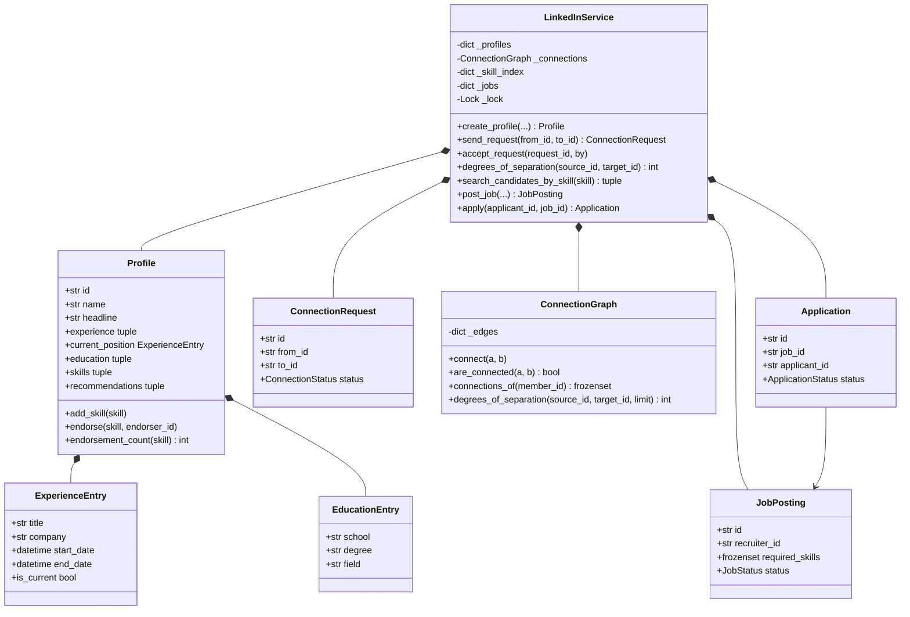

# 设计题解：职业社交（LinkedIn）

## 题目与澄清

面试官的开场："设计 LinkedIn 的核心部分。用户有职业档案，能给别人发连接请求；能查两个人
之间隔了几度；有职位发布和申请；招聘方能按技能搜候选人。"

这道题的实体不难画，真正的陷阱是**把"连接"（connection）和"关注"（follow）当成同一种
关系去建模**——公开题解里最常见的失分点正在这里。开口先澄清清楚：

- **"连接"和"关注"是不是一回事？** 不是。关注允许 A 关注 B 而 B 不关注 A（本题解的邻居
  `[[solution-social-network|社交网络（Social Network）]]`里的好友/关注图就是这种有向
  关系）；LinkedIn 的连接必须**双向同时成立**——一旦接受，两个人互为对方的一度人脉，
  不存在"我把你当一度人脉，你不知道"这种状态。这条区别决定了整个图结构要用哪一种。
- **档案的"工作经历""教育经历""技能"要不要允许任意字段？** 不要。往下第一条决策专门讲
  为什么结构化的值对象比 `dict[str, Any]` 划算。
- **度数查询要精确到多远？** 只要 1/2/3 度，超过就说"3 度以上"或不显示，不需要精确的
  第 7 度是多少——这条直接决定了搜索可以设上限，不必算出真实的最短路径到底有多长。
- **技能搜索要支持到什么程度？** 精确技能名匹配，不做同义词或模糊匹配；但必须是能扛住
  候选人规模增长的索引，不能是每次搜索都扫一遍全部档案。
- **申请状态能不能随便跳转？** 不能，"待审核"不能直接跳到"已录用"，必须经过"审核中"——
  这条规则本身不复杂，但值得说清楚它是显式的一张表，还是散落的 `if`。
- **信息流（feed）呢？** 不在这道题里。信息流、帖子、点赞评论是
  `[[solution-social-network|社交网络（Social Network）]]`的范围，那道题专门处理"发帖 +
  关注 + 信息流"这一组需求。

**范围之外**：信息流与帖子（见上）、消息私信、账号注册与鉴权、真实的模糊/语义搜索、
公司页面（见"扩展与追问"）。

## 需求与分级

- **第 1 关（约 20 分钟）**：个人档案——工作经历、教育经历、技能，结构化而不是自由格式。
  对应 `Profile`、`ExperienceEntry`、`EducationEntry`、`LinkedInService.create_profile` /
  `add_experience` / `add_education` / `add_skill`。
- **第 2 关（约 20 分钟）**：连接请求的接受/忽略/撤回；接受后双方互为一度人脉；度数查询
  （1/2/3 度）。对应 `ConnectionRequest`、`ConnectionGraph`、
  `LinkedInService.send_request` / `accept_request` / `ignore_request` /
  `withdraw_request` / `degrees_of_separation`。**这一关是这道题的分水岭**——"连接不是
  关注"这条决定错了，后面的度数查询无从谈起。
- **第 3 关（约 15 分钟）**：职位发布与申请的独立生命周期；招聘方按技能搜候选人。对应
  `JobPosting`、`Application`、`APPLICATION_TRANSITIONS`、
  `LinkedInService.post_job` / `apply` / `advance_application` /
  `search_candidates_by_skill`。
- **第 4 关（选做）**：背书（endorsement）与推荐信（recommendation），要求都建立在"双方
  已经是一度人脉"之上；验收标准是这条加法**不改动 `ConnectionGraph` 的任何一行**——它只
  调用图已经公开的只读查询。（另一种常见的第 4 关加法是公司页面，本题解在「扩展与追问」
  里说明它怎么加。）

## 核心对象与职责

| 类 | 单一职责 | 它守的不变量 |
|---|---|---|
| `Profile` | 一份档案：经历、教育、技能、背书、推荐信 | 技能名唯一；背书只能落在已有的技能上 |
| `ExperienceEntry` / `EducationEntry` | 一段经历（值对象） | 不可变；`end_date=None` 表示"至今" |
| `ConnectionRequest` | 一次连接请求及其状态 | 状态单向：PENDING → 其余三态之一，且只能转一次 |
| `ConnectionGraph` | 一度人脉的无向图 + 度数查询 | 一条边必须同时出现在两个人的邻接集合里 |
| `JobPosting` | 一个职位 | `status` 单向 OPEN → CLOSED |
| `Application` | 一次申请及其状态 | 状态转移只能沿 `APPLICATION_TRANSITIONS` 走 |
| `LinkedInService` | 总控：档案、连接、职位、技能反向索引、背书与推荐 | 唯一持锁者；"谁能做什么"的权限判断只在这里发生 |

`Profile` 与经历条目、`ConnectionRequest`/`JobPosting`/`Application` 都是
**组合**（`LinkedInService` 创建并独占它们的生命周期）；`ConnectionGraph` 与
`LinkedInService` 也是组合，但它自己对"谁连着谁"一无所知具体是哪个 `Profile`
对象——它只存 id，这是有意的解耦：图结构不需要知道档案长什么样，这正是
[[oop.relationships|类之间的关系（Class Relationships）]]里"关联 vs 组合"那条判据在
"要不要把整个对象存进去，还是存一个 id 引用"这个具体问题上的应用。



## 关键设计决策

### 一、档案的每一栏为什么不是 `dict[str, Any]`

问题原话就是陷阱："档案里有工作经历、教育经历、技能，字段还可能继续加。"很容易顺着
"字段可能继续加"这句话滑向"那就用字典，什么字段都能塞"。

**选项 A：`profile.sections: dict[str, list[dict]]`**，比如
`{"experience": [{"title": ..., "company": ...}], "skills": [{"name": "python"}]}`。
这确实"灵活"，但灵活的代价立刻显现：招聘方要按技能搜候选人，得先假设每个技能字典里一定
有 `"name"` 这个键，任何一次拼写不一致（`"name"` 写成 `"skill_name"`）都不会在写入时报错，
只会在读取时悄悄搜不到人；工作经历要按开始时间排序，得先假设 `"start_date"` 的值一定是
可比较的日期类型而不是字符串；这些假设没有任何地方写下来、也没有任何东西强制它们成立。

**选项 B（本文的选择）：`ExperienceEntry`、`EducationEntry` 是 `frozen=True` 的
`dataclass`，技能是 `Profile._skills` 上一个类型明确的 `list[str]`。**
```python
@dataclass(frozen=True, slots=True)
class ExperienceEntry:
    title: str
    company: str
    start_date: datetime
    end_date: datetime | None = None
```
换来三样东西：第一，**字段是什么类型由类型系统保证**，`start_date` 必须是 `datetime`，
排序和"是否在职"（`end_date is None`）这类查询直接可用，不需要先做一遍防御性解析；第二，
**技能作为一等公民**才能被技能反向索引安全地引用——索引的键如果是从一个任意结构的字典里
"约定俗成"抠出来的字符串，索引本身的正确性就系在一个没有强制力的约定上；第三，加一个新
字段（比如给 `ExperienceEntry` 加 `location`）是给 `dataclass` 加一行，`mypy`/`pyright`
会在所有构造点提示你哪里漏填，字典版本不会有任何提示，运行到那一行才知道少了一个键。

代价要说清楚：字典确实能不改代码就塞进一个 `dataclass` 没有定义的字段（比如
"专业证书"）。本文的回应是——这道题的字段是产品需求给出的固定集合，不是用户自由输入的
任意结构；真要支持用户自定义栏位，正确的加法是显式加一个 `custom_fields:
Mapping[str, str]` 字段，把"结构化的部分"和"确实需要自由格式的部分"分开放，而不是把
整份档案都退化成字典。

### 二、连接不是关注：无向图，而不是"关注列表"

这是本题最重的一条，也是任务书点名的陷阱。

**选项 A：把连接实现成两份独立的"关注列表"**（`Member.following: set[str]`，接受请求时
双方各自往对方的列表里加一个 id）。这是公开题解（包括下面引用的 GitHub 仓库）实际采用的
写法，功能上确实达到了"双方都能看到对方"——**但它能达到这个效果全靠"两次写入都发生"这个
调用约定**，没有任何东西强制这一点。如果未来有一条代码路径只执行了其中一次写入（比如
一次写入失败、重试逻辑写错、或者有人直接调用了底层方法而不是走接受请求这条路径），
就会出现 A 认为自己和 B 连接、B 不这么认为的不一致状态，而"关注"允许的正是这种不一致——
两种关系被同一种数据结构表达，区分它们的责任被丢给了调用者的自觉。

**选项 B（本文的选择）：`ConnectionGraph` 是一个专门的无向图，一条边的写入**只有一个
入口**。**
```python
def connect(self, a: str, b: str) -> None:
    self._edges.setdefault(a, set()).add(b)
    self._edges.setdefault(b, set()).add(a)
```
`connect` 自己保证两个方向同时更新，调用方（`LinkedInService.accept_request`）只调用
一次，不可能只执行一半。更重要的是类型层面的区分：这道题如果要同时支持"关注"（比如
LinkedIn 真实也有"关注某个人但不是一度人脉"这种轻量关系），应该是另一个独立的有向结构，
而不是往 `ConnectionGraph` 里加一个 `directed: bool` 参数——那样一个类要同时守住两种不
相容的不变量（无向图的"边必须双向"和有向图的"边可以单向"），谁调用都要先想清楚这次调的
是哪一种，等于把选项 A 的问题换了个地方重新发明一遍。`ConnectionRequest` 的生命周期本身
是**有向的**（谁发给谁很重要，接受权只在接收方手上）——这条设计没有否认这一点，有向的
是"请求"这个过程性对象，无向的是"连接"这个结果状态，两者是两个类，分工不同。

### 三、度数查询：有界双向 BFS，而不是单向展开到底

**选项 A：从起点单向 BFS，一直展开到找到终点或者队列空了。**深度为 `d`、平均连接数为
`b` 时，最坏要探索 O(b**d) 个节点——真实社交图里 `b` 常常是几百，`d` 到 4、5 就已经是
天文数字。而这道题只关心 1/2/3 度，单向展开完全是在为"永远不会被使用的精确远距离结果"
付出指数级的代价。

**选项 B（本文的选择）：从两端同时展开，交替扩大较小的一侧，命中即停，且封顶在
`limit` 度。**
```python
while depth < limit and frontier_a and frontier_b:
    if len(frontier_a) > len(frontier_b):
        frontier_a, frontier_b = frontier_b, frontier_a
        dist_a, dist_b = dist_b, dist_a
    depth += 1
    for member_id in frontier_a:
        for neighbor in self._edges.get(member_id, ()):
            ...
            if neighbor in dist_b:
                return dist_a[neighbor] + dist_b[neighbor]
```
两端各自只需要展开到 `d/2` 层就能在中间相遇，代价是 O(b**(d/2))——底数不变，**指数
减半**，这是指数级的节省，不是常数级的优化。"交替扩大较小的一侧"再省一层：每一轮都优先
展开当前更小的那个前沿，保证总的工作量始终贴着较小的那一侧增长。`limit` 把这条搜索钉死
在三层，超过就直接返回 `None`——这不是偷懒，是把"这道题只需要 1/2/3 度"这条澄清直接
翻译成了代码里的一个循环条件。

代价：这只回答"隔了几度"，回答不了"具体经过了哪些人"（真实 LinkedIn 的"共同好友"要另外
在相遇点回溯路径，这道题没有要求，本文没有实现）。

### 四、候选人按技能搜索：维护一张反向索引，而不是扫描

**选项 A：`search_candidates_by_skill` 遍历全部 `Profile`，检查每个人的 `skills` 里有没有
目标技能。**代码最少，但这是一条随候选人总数线性增长的查询，而"招聘方搜技能"恰恰是这道题
里被反复触发的高频操作——下面引用的 GitHub 题解里 `SearchService.search_by_name` 正是这么
写的（虽然它连技能搜索都没实现）。

**选项 B（本文的选择）：`LinkedInService._skill_index: dict[str, set[str]]`，技能名到
成员 id 集合，在 `add_skill` 这个低频操作里维护。**
```python
def add_skill(self, member_id: str, skill: str) -> None:
    self._profile_locked(member_id).add_skill(skill)
    self._skill_index.setdefault(skill, set()).add(member_id)

def search_candidates_by_skill(self, skill: str) -> tuple[Profile, ...]:
    ids = self._skill_index.get(skill, set())
    return tuple(sorted((self._profiles[i] for i in ids), key=lambda p: p.id))
```
一个人一生加技能的次数是个位数，搜索却可能每天发生成千上万次——把维护成本摊在写的一侧、
把命中做成查表，是这道题里"数据结构选择直接决定复杂度"的典型例子。付出的代价是要多守
一条不变量："`_skill_index` 必须和每个 `Profile._skills` 保持一致"，本文把这条不变量的
维护收在唯一一个写入点（`add_skill`）里，不允许绕过它直接改 `Profile._skills`。

### 五、申请的状态机：一张转移表，不是散落的 `if`

问题要求"待审核不能直接跳到已录用"。最直接的写法是在 `advance_application` 里堆一串
`if application.status == SUBMITTED and new_status == OFFERED: raise ...`，每加一条规则
就多一个分支，而且规则分散在方法体内部，读代码的人要把整个方法读完才能拼出完整的状态图。

本文用 `APPLICATION_TRANSITIONS: dict[ApplicationStatus, frozenset[ApplicationStatus]]`
把整张状态图写成一张表，`_transition` 只做一次查表：
```python
allowed = APPLICATION_TRANSITIONS[application.status]
if new_status not in allowed:
    raise InvalidTransitionError(...)
```
这不是什么高深的模式，只是把"规则是什么"和"怎么检查规则"分开：前者是数据，后者是一行
代码，加一条新规则（比如允许 OFFERED 被撤回）只改表，不改检查逻辑。

## 代码走读

三处值得停下来看。

**第一处，`ConnectionGraph.connect`。**两行代码，但它是"连接不是关注"这条决策唯一的
落地点——两个方向的写入被钉死在同一个方法里，外部不可能只执行一半。

**第二处，`ConnectionGraph.degrees_of_separation`。**双向 BFS 的核心在于每一轮开始时
判断哪一侧前沿更小、交换到 `frontier_a` 的位置去展开；判断新展开的邻居是否已经出现在
对侧的 `dist_b` 里，这是"相遇"的判定，也是提前终止的地方。`limit` 只出现在循环条件里，
一处改动就能调整"精确到几度"这个产品参数。

**第三处，`LinkedInService.add_skill` 与 `search_candidates_by_skill` 的配对。**这两个
方法是"维护索引"和"使用索引"这条决策的一体两面：任何一个技能被加进档案，都必须经过
前者；索引本身没有独立于 `Profile._skills` 存在的"真相"，它只是加速查询的第二份视图。

%% code:begin solution.py %%
```python
"""职业社交（LinkedIn）——结构化档案、无向人脉图与有界双向 BFS 度数查询的参考实现。

五行设计：档案的每一栏（工作经历、教育经历、技能）都是**结构化的值对象**，不是
`dict[str, Any]`，因为招聘方要按开始时间排序、按技能反查候选人，自由格式的字典没有
任何一方能校验或查询。人脉连接是**无向图**——`ConnectionGraph` 里一条边同时出现在
两个人的邻接集合里，这和"关注"那种允许单向存在的有向关系是两种不同的东西，绝不共用
一套模型。度数查询是一次**有界双向 BFS**：从两端同时展开、交替扩大较小的一侧，命中
即停，且封顶在三度——超过三度在这道题里不需要精确数字。候选人按技能搜索靠一张**反向
索引**（技能到成员 id 的集合），维护成本摊在"加技能"这个低频操作上，换来搜索的 O(1)
直接命中。背书（endorsement）作为可选的第四关加在最后，一行都没有碰连接图或投票——
它只是调用了连接图已经公开的只读查询。
"""

from __future__ import annotations

import itertools
import threading
from dataclasses import dataclass
from datetime import datetime
from enum import Enum


# --------------------------------------------------------------------------
# 失败路径。

class LinkedInError(Exception):
    """本设计里所有失败路径的公共基类。"""


class UnknownMemberError(LinkedInError):
    """这个成员 id 没有档案。"""


class UnknownRequestError(LinkedInError):
    """这个连接请求 id 不存在。"""


class UnknownJobError(LinkedInError):
    """这个职位 id 不存在。"""


class UnknownApplicationError(LinkedInError):
    """这个申请 id 不存在。"""


class SelfConnectionError(LinkedInError):
    """不能给自己发连接请求。"""


class AlreadyConnectedError(LinkedInError):
    """两人已经是一度人脉，不需要再发请求。"""


class DuplicateRequestError(LinkedInError):
    """两人之间已经有一条待处理的请求（不分方向）。"""


class RequestNotPendingError(LinkedInError):
    """这条请求已经被处理过，不能再次接受/忽略/撤回。"""


class NotRecipientError(LinkedInError):
    """只有请求的接收方能接受或忽略它。"""


class NotSenderError(LinkedInError):
    """只有请求的发起方能撤回它。"""


class DuplicateSkillError(LinkedInError):
    """这项技能已经在档案里了。"""


class UnknownSkillError(LinkedInError):
    """档案上没有这项技能，不能背书。"""


class DuplicateEndorsementError(LinkedInError):
    """这个人已经为这项技能背书过一次。"""


class NotConnectedError(LinkedInError):
    """背书和推荐都要求双方已经是一度人脉。"""


class JobClosedError(LinkedInError):
    """职位已关闭，不再接受新申请。"""


class DuplicateApplicationError(LinkedInError):
    """这位候选人已经申请过这个职位。"""


class InvalidTransitionError(LinkedInError):
    """申请状态不允许这样转移。"""


class NotRecruiterError(LinkedInError):
    """只有发布职位的招聘方能操作它的申请或关闭它。"""


# --------------------------------------------------------------------------
# 枚举。

class ConnectionStatus(Enum):
    PENDING = "pending"
    ACCEPTED = "accepted"
    IGNORED = "ignored"
    WITHDRAWN = "withdrawn"


class JobStatus(Enum):
    OPEN = "open"
    CLOSED = "closed"


class ApplicationStatus(Enum):
    SUBMITTED = "submitted"
    UNDER_REVIEW = "under_review"
    OFFERED = "offered"
    REJECTED = "rejected"
    WITHDRAWN = "withdrawn"


# 申请状态机：一张转移表，而不是散落在各处的 `if 当前状态 == X`。
APPLICATION_TRANSITIONS: dict[ApplicationStatus, frozenset[ApplicationStatus]] = {
    ApplicationStatus.SUBMITTED: frozenset(
        {ApplicationStatus.UNDER_REVIEW, ApplicationStatus.REJECTED, ApplicationStatus.WITHDRAWN}),
    ApplicationStatus.UNDER_REVIEW: frozenset(
        {ApplicationStatus.OFFERED, ApplicationStatus.REJECTED, ApplicationStatus.WITHDRAWN}),
    ApplicationStatus.OFFERED: frozenset(),
    ApplicationStatus.REJECTED: frozenset(),
    ApplicationStatus.WITHDRAWN: frozenset(),
}


# --------------------------------------------------------------------------
# 档案的三栏：结构化的值对象，不是自由格式的字典。

@dataclass(frozen=True, slots=True)
class ExperienceEntry:
    """一段工作经历。`end_date` 为 `None` 表示"至今在职"，不是另外一个布尔字段。"""

    title: str
    company: str
    start_date: datetime
    end_date: datetime | None = None
    description: str = ""

    @property
    def is_current(self) -> bool:
        """这段经历还在继续。"""
        return self.end_date is None


@dataclass(frozen=True, slots=True)
class EducationEntry:
    """一段教育经历。"""

    school: str
    degree: str
    field: str
    start_date: datetime
    end_date: datetime | None = None


@dataclass(frozen=True, slots=True)
class Recommendation:
    """一份来自一度人脉的推荐信。"""

    id: str
    author_id: str
    subject_id: str
    body: str
    at: datetime


class Profile:
    """一份职业档案：结构化的工作经历、教育经历、技能，以及技能收到的背书。

    不变量：`_skills` 里的技能名唯一；`_endorsements` 的键必须是 `_skills` 的子集；
    经历按开始时间排序是查询时算出来的，不是插入顺序碰巧对。
    """

    def __init__(self, member_id: str, name: str, headline: str, created_at: datetime) -> None:
        self.id = member_id
        self.name = name
        self.headline = headline
        self.created_at = created_at
        self._experience: list[ExperienceEntry] = []
        self._education: list[EducationEntry] = []
        self._skills: list[str] = []
        self._endorsements: dict[str, set[str]] = {}
        self._recommendations: list[Recommendation] = []

    def add_experience(self, entry: ExperienceEntry) -> None:
        """加一段工作经历。"""
        self._experience.append(entry)

    @property
    def experience(self) -> tuple[ExperienceEntry, ...]:
        """按开始时间倒序排列——档案的"结构化"直接换来这条查询，`dict` 换不来。"""
        return tuple(sorted(self._experience, key=lambda e: e.start_date, reverse=True))

    @property
    def current_position(self) -> ExperienceEntry | None:
        """还在做的那一份工作（如果有）。"""
        return next((e for e in self._experience if e.is_current), None)

    def add_education(self, entry: EducationEntry) -> None:
        """加一段教育经历。"""
        self._education.append(entry)

    @property
    def education(self) -> tuple[EducationEntry, ...]:
        """按开始时间倒序排列。"""
        return tuple(sorted(self._education, key=lambda e: e.start_date, reverse=True))

    def add_skill(self, skill: str) -> None:
        """加一项技能，不能重复。"""
        if skill in self._skills:
            raise DuplicateSkillError(f"{self.id} already lists {skill!r}")
        self._skills.append(skill)

    @property
    def skills(self) -> tuple[str, ...]:
        """技能列表，按添加顺序。"""
        return tuple(self._skills)

    def endorse(self, skill: str, endorser_id: str) -> None:
        """给这项技能加一次背书；同一个人对同一项技能只能背书一次。"""
        if skill not in self._skills:
            raise UnknownSkillError(f"{self.id} does not list {skill!r}")
        endorsers = self._endorsements.setdefault(skill, set())
        if endorser_id in endorsers:
            raise DuplicateEndorsementError(f"{endorser_id} already endorsed {skill!r}")
        endorsers.add(endorser_id)

    def endorsement_count(self, skill: str) -> int:
        """这项技能收到过多少次背书。"""
        return len(self._endorsements.get(skill, ()))

    def add_recommendation(self, recommendation: Recommendation) -> None:
        """加一封推荐信。"""
        self._recommendations.append(recommendation)

    @property
    def recommendations(self) -> tuple[Recommendation, ...]:
        """收到过的推荐信快照。"""
        return tuple(self._recommendations)


# --------------------------------------------------------------------------
# 人脉：连接请求（有向的生命周期）收敛成一条无向边。

@dataclass(slots=True)
class ConnectionRequest:
    """一次连接请求：谁发给谁、什么状态。状态机单向：PENDING 只能转到其余三态之一。"""

    id: str
    from_id: str
    to_id: str
    status: ConnectionStatus
    sent_at: datetime
    responded_at: datetime | None = None


class ConnectionGraph:
    """一度人脉的无向图：一条边同时出现在两个人的邻接集合里。

    这**不是**关注（follow）图——关注允许 A 关注 B 而 B 不关注 A，这里不允许：接受
    请求的那一刻，两人互为对方的一度人脉，不存在只有一边看得到的连接。
    """

    def __init__(self) -> None:
        self._edges: dict[str, set[str]] = {}

    def connect(self, a: str, b: str) -> None:
        """建一条无向边——两个方向的邻接集合同时更新，缺一不可。"""
        self._edges.setdefault(a, set()).add(b)
        self._edges.setdefault(b, set()).add(a)

    def are_connected(self, a: str, b: str) -> bool:
        """两人是否互为一度人脉。"""
        return b in self._edges.get(a, ())

    def connections_of(self, member_id: str) -> frozenset[str]:
        """这个人的全部一度人脉，一份快照。"""
        return frozenset(self._edges.get(member_id, ()))

    @property
    def edge_count(self) -> int:
        """图里有多少条边（每条边只算一次）。"""
        return sum(len(neighbors) for neighbors in self._edges.values()) // 2

    def degrees_of_separation(self, source_id: str, target_id: str, limit: int = 3) -> int | None:
        """有界双向 BFS：从两端同时展开，交替扩大较小的一侧，命中即停。

        单向 BFS 到深度 `d` 要探索 O(b**d) 个节点（`b` 是平均连接数）；从两端各探索到
        `d/2` 再在中间相遇，是 O(b**(d/2))——底数不变、指数减半，是指数级的节省。
        超过 `limit` 度一律返回 `None`，因为这道题只需要精确的 1/2/3 度，"更远"这个
        事实比"远多少"更重要，继续展开到相遇是纯粹的浪费。
        """
        if source_id == target_id:
            raise LinkedInError("degrees of separation is undefined for the same member")
        if target_id in self._edges.get(source_id, ()):
            return 1
        dist_a: dict[str, int] = {source_id: 0}
        dist_b: dict[str, int] = {target_id: 0}
        frontier_a, frontier_b = {source_id}, {target_id}
        depth = 0
        while depth < limit and frontier_a and frontier_b:
            if len(frontier_a) > len(frontier_b):
                frontier_a, frontier_b = frontier_b, frontier_a
                dist_a, dist_b = dist_b, dist_a
            depth += 1
            grown: set[str] = set()
            for member_id in frontier_a:
                for neighbor in self._edges.get(member_id, ()):
                    if neighbor in dist_a:
                        continue
                    dist_a[neighbor] = dist_a[member_id] + 1
                    if neighbor in dist_b:
                        total = dist_a[neighbor] + dist_b[neighbor]
                        if total <= limit:
                            return total
                    grown.add(neighbor)
            frontier_a = grown
        return None


# --------------------------------------------------------------------------
# 职位与申请：各自的生命周期。

@dataclass(slots=True)
class JobPosting:
    """一个职位：公司、标题、要求的技能集合、状态。"""

    id: str
    recruiter_id: str
    company: str
    title: str
    required_skills: frozenset[str]
    posted_at: datetime
    status: JobStatus = JobStatus.OPEN


@dataclass(slots=True)
class Application:
    """一次申请：候选人、职位、状态，按 `APPLICATION_TRANSITIONS` 单向推进。"""

    id: str
    job_id: str
    applicant_id: str
    status: ApplicationStatus
    submitted_at: datetime
    decided_at: datetime | None = None


# --------------------------------------------------------------------------
# LinkedInService：总控。

class LinkedInService:
    """职业社交总控：档案、连接请求、职位与申请、按技能反查候选人、背书与推荐。

    锁纪律：一把锁保护档案索引、连接图、请求台账、技能反向索引与申请表。这道题的复合
    操作（比如接受请求要同时改请求状态、连接图和"是否还有待处理请求"的索引）本身很短，
    拆锁换不到并发度。
    """

    def __init__(self, clock) -> None:
        self._clock = clock
        self._profiles: dict[str, Profile] = {}
        self._connections = ConnectionGraph()
        self._requests: dict[str, ConnectionRequest] = {}
        self._pending_key: dict[frozenset[str], str] = {}
        self._skill_index: dict[str, set[str]] = {}
        self._jobs: dict[str, JobPosting] = {}
        self._applications: dict[str, Application] = {}
        self._applications_of: dict[str, list[str]] = {}
        self._lock = threading.Lock()
        self._req_ids = (f"R{n}" for n in itertools.count(1))
        self._job_ids = (f"J{n}" for n in itertools.count(1))
        self._app_ids = (f"P{n}" for n in itertools.count(1))
        self._rec_ids = (f"C{n}" for n in itertools.count(1))

    # ---- 档案 --------------------------------------------------------------

    def create_profile(self, member_id: str, name: str, headline: str) -> Profile:
        """开一份档案。"""
        now = self._clock()
        with self._lock:
            profile = Profile(member_id, name, headline, now)
            self._profiles[member_id] = profile
            return profile

    def add_experience(self, member_id: str, entry: ExperienceEntry) -> None:
        """加一段工作经历。"""
        with self._lock:
            self._profile_locked(member_id).add_experience(entry)

    def add_education(self, member_id: str, entry: EducationEntry) -> None:
        """加一段教育经历。"""
        with self._lock:
            self._profile_locked(member_id).add_education(entry)

    def add_skill(self, member_id: str, skill: str) -> None:
        """加一项技能，并同步维护"技能 → 候选人"反向索引。"""
        with self._lock:
            self._profile_locked(member_id).add_skill(skill)
            self._skill_index.setdefault(skill, set()).add(member_id)

    def search_candidates_by_skill(self, skill: str) -> tuple[Profile, ...]:
        """按技能查候选人：直接查反向索引，不扫描全部档案。"""
        with self._lock:
            ids = self._skill_index.get(skill, set())
            return tuple(sorted((self._profiles[i] for i in ids), key=lambda p: p.id))

    # ---- 连接请求 ----------------------------------------------------------

    def send_request(self, from_id: str, to_id: str) -> ConnectionRequest:
        """发一条连接请求；已经是一度人脉、或者已有一条待处理请求都会被拒绝。"""
        now = self._clock()
        with self._lock:
            self._profile_locked(from_id)
            self._profile_locked(to_id)
            if from_id == to_id:
                raise SelfConnectionError("cannot connect to yourself")
            if self._connections.are_connected(from_id, to_id):
                raise AlreadyConnectedError(f"{from_id} and {to_id} are already connected")
            key = frozenset((from_id, to_id))
            if key in self._pending_key:
                raise DuplicateRequestError(f"a pending request already exists between {key}")
            request = ConnectionRequest(next(self._req_ids), from_id, to_id,
                                        ConnectionStatus.PENDING, now)
            self._requests[request.id] = request
            self._pending_key[key] = request.id
            return request

    def accept_request(self, request_id: str, by: str) -> None:
        """接受请求：只有接收方能做，接受之后双方互为一度人脉。"""
        now = self._clock()
        with self._lock:
            request = self._resolve_pending(request_id, expected=by, field="to_id",
                                             error=NotRecipientError)
            self._connections.connect(request.from_id, request.to_id)
            request.status, request.responded_at = ConnectionStatus.ACCEPTED, now

    def ignore_request(self, request_id: str, by: str) -> None:
        """忽略请求：只有接收方能做。"""
        now = self._clock()
        with self._lock:
            request = self._resolve_pending(request_id, expected=by, field="to_id",
                                             error=NotRecipientError)
            request.status, request.responded_at = ConnectionStatus.IGNORED, now

    def withdraw_request(self, request_id: str, by: str) -> None:
        """撤回请求：只有发起方能做。"""
        now = self._clock()
        with self._lock:
            request = self._resolve_pending(request_id, expected=by, field="from_id",
                                             error=NotSenderError)
            request.status, request.responded_at = ConnectionStatus.WITHDRAWN, now

    def degrees_of_separation(self, source_id: str, target_id: str) -> int | None:
        """两人之间的度数：1/2/3，或者 `None`（超过三度或不连通）。"""
        with self._lock:
            self._profile_locked(source_id)
            self._profile_locked(target_id)
            return self._connections.degrees_of_separation(source_id, target_id)

    # ---- 职位与申请 --------------------------------------------------------

    def post_job(self, recruiter_id: str, company: str, title: str,
                required_skills: tuple[str, ...]) -> JobPosting:
        """发一个职位。"""
        now = self._clock()
        with self._lock:
            job = JobPosting(next(self._job_ids), recruiter_id, company, title,
                             frozenset(required_skills), now)
            self._jobs[job.id] = job
            self._applications_of[job.id] = []
            return job

    def close_job(self, recruiter_id: str, job_id: str) -> None:
        """关闭职位：不再接受新申请，已有申请不受影响。"""
        with self._lock:
            job = self._job_locked(job_id, recruiter_id)
            job.status = JobStatus.CLOSED

    def apply(self, applicant_id: str, job_id: str) -> Application:
        """申请一个职位；职位已关闭、或者已经申请过都会被拒绝。"""
        now = self._clock()
        with self._lock:
            self._profile_locked(applicant_id)
            job = self._job_locked_readonly(job_id)
            if job.status is not JobStatus.OPEN:
                raise JobClosedError(f"{job_id} is closed")
            existing = [a for a in self._applications_of[job_id]
                       if self._applications[a].applicant_id == applicant_id]
            if existing:
                raise DuplicateApplicationError(f"{applicant_id} already applied to {job_id}")
            application = Application(next(self._app_ids), job_id, applicant_id,
                                      ApplicationStatus.SUBMITTED, now)
            self._applications[application.id] = application
            self._applications_of[job_id].append(application.id)
            return application

    def advance_application(self, recruiter_id: str, application_id: str,
                            new_status: ApplicationStatus) -> Application:
        """把申请推进到一个新状态，必须是 `APPLICATION_TRANSITIONS` 里允许的那几个之一。"""
        now = self._clock()
        with self._lock:
            application = self._application_locked(application_id)
            self._job_locked(application.job_id, recruiter_id)
            self._transition(application, new_status, now)
            return application

    def withdraw_application(self, applicant_id: str, application_id: str) -> Application:
        """候选人主动撤回申请。"""
        now = self._clock()
        with self._lock:
            application = self._application_locked(application_id)
            if application.applicant_id != applicant_id:
                raise NotRecruiterError(f"{applicant_id} did not submit {application_id}")
            self._transition(application, ApplicationStatus.WITHDRAWN, now)
            return application

    def applications_of(self, job_id: str) -> tuple[Application, ...]:
        """一个职位收到的全部申请，一份快照。"""
        with self._lock:
            self._job_locked_readonly(job_id)
            return tuple(self._applications[a] for a in self._applications_of[job_id])

    # ---- 背书与推荐：第 4 关，不碰连接图的任何一行 ---------------------------

    def endorse_skill(self, endorser_id: str, subject_id: str, skill: str) -> None:
        """给一度人脉的某项技能背书。只读地调用 `ConnectionGraph.are_connected`。"""
        with self._lock:
            if not self._connections.are_connected(endorser_id, subject_id):
                raise NotConnectedError(f"{endorser_id} and {subject_id} are not connected")
            self._profile_locked(subject_id).endorse(skill, endorser_id)

    def recommend(self, author_id: str, subject_id: str, body: str) -> Recommendation:
        """给一度人脉写一封推荐信。"""
        now = self._clock()
        with self._lock:
            if not self._connections.are_connected(author_id, subject_id):
                raise NotConnectedError(f"{author_id} and {subject_id} are not connected")
            recommendation = Recommendation(next(self._rec_ids), author_id, subject_id, body, now)
            self._profile_locked(subject_id).add_recommendation(recommendation)
            return recommendation

    # ---- 查询与内部辅助 ------------------------------------------------------

    def profile(self, member_id: str) -> Profile:
        """按 id 取档案。"""
        with self._lock:
            return self._profile_locked(member_id)

    def request(self, request_id: str) -> ConnectionRequest:
        """按 id 取连接请求。"""
        with self._lock:
            return self._request_locked(request_id)

    def _profile_locked(self, member_id: str) -> Profile:
        found = self._profiles.get(member_id)
        if found is None:
            raise UnknownMemberError(f"unknown member {member_id!r}")
        return found

    def _request_locked(self, request_id: str) -> ConnectionRequest:
        found = self._requests.get(request_id)
        if found is None:
            raise UnknownRequestError(f"unknown request {request_id!r}")
        return found

    def _resolve_pending(self, request_id: str, *, expected: str, field: str,
                         error: type[LinkedInError]) -> ConnectionRequest:
        request = self._request_locked(request_id)
        if request.status is not ConnectionStatus.PENDING:
            raise RequestNotPendingError(f"{request_id} is already {request.status.value}")
        if getattr(request, field) != expected:
            raise error(f"{expected} is not the {field} of {request_id}")
        self._pending_key.pop(frozenset((request.from_id, request.to_id)), None)
        return request

    def _job_locked_readonly(self, job_id: str) -> JobPosting:
        found = self._jobs.get(job_id)
        if found is None:
            raise UnknownJobError(f"unknown job {job_id!r}")
        return found

    def _job_locked(self, job_id: str, recruiter_id: str) -> JobPosting:
        job = self._job_locked_readonly(job_id)
        if job.recruiter_id != recruiter_id:
            raise NotRecruiterError(f"{recruiter_id} did not post {job_id}")
        return job

    def _application_locked(self, application_id: str) -> Application:
        found = self._applications.get(application_id)
        if found is None:
            raise UnknownApplicationError(f"unknown application {application_id!r}")
        return found

    def _transition(self, application: Application, new_status: ApplicationStatus,
                    now: datetime) -> None:
        allowed = APPLICATION_TRANSITIONS[application.status]
        if new_status not in allowed:
            raise InvalidTransitionError(
                f"cannot move {application.id} from {application.status.value} to {new_status.value}")
        application.status, application.decided_at = new_status, now


if __name__ == "__main__":
    from datetime import UTC

    now = datetime(2026, 9, 1, 10, 0, tzinfo=UTC)
    service = LinkedInService(clock=lambda: now)
    for member_id, name in [("alice", "Alice"), ("bob", "Bob"), ("carol", "Carol"),
                            ("dave", "Dave")]:
        service.create_profile(member_id, name, headline=f"{name} @ somewhere")
    service.add_experience("alice", ExperienceEntry("工程师", "Acme", datetime(2020, 1, 1, tzinfo=UTC)))
    service.add_skill("alice", "python")
    service.add_skill("bob", "python")

    for a, b in [("alice", "bob"), ("bob", "carol"), ("carol", "dave")]:
        req = service.send_request(a, b)
        service.accept_request(req.id, by=b)
    print("alice-dave 度数:", service.degrees_of_separation("alice", "dave"))
    print("按 python 搜索候选人:", [p.id for p in service.search_candidates_by_skill("python")])

    service.endorse_skill("bob", "alice", "python")
    print("alice 的 python 背书数:", service.profile("alice").endorsement_count("python"))

    job = service.post_job("carol", "Acme", "Python 工程师", required_skills=("python",))
    application = service.apply("alice", job.id)
    service.advance_application("carol", application.id, ApplicationStatus.UNDER_REVIEW)
    service.advance_application("carol", application.id, ApplicationStatus.OFFERED)
    print("申请状态:", service.applications_of(job.id)[0].status.value)
```
%% code:end %%

## 测试与自检

测试钉住的是**行为**，不是内部形状。最值得写的几条：

1. **无向：反过来查同样成立**——`degrees_of_separation("alice", "bob")` 和
   `degrees_of_separation("bob", "alice")` 结果一致，这是"连接不是关注"最直接的证据。
2. **度数查询找到的是最短路径**，不是随便一条能走通的路径——构造一张有两条不同长度路径
   的图，断言返回的是短的那条。
3. **超过 `limit` 度一律 `None`**，且 `limit` 之内精确到 1/2/3。
4. **只有接收方能接受/忽略，只有发起方能撤回**，处理过的请求不能被再处理一次。
5. **按技能搜索命中的候选人集合**，且技能不存在时返回空结果，不抛异常。
6. **申请状态机**：非法跳转被拒绝，合法路径（提交 → 审核中 → 录用/拒绝）能走通，终态
   之后任何转移都被拒绝。
7. **背书与推荐都要求先连接**，且背书要求技能确实存在、同一个人不能对同一项技能背书
   两次。
8. **并发**：十个候选人同时申请同一个职位，断言最终恰好十份申请、每人一份，不重不漏。

**两分钟怎么演示给面试官**：跑 `python solution.py`。依次能看到——创建档案、互相连接后
的度数、按技能搜到的候选人、一次背书、以及一次职位申请从提交到录用的完整状态转移。

## 扩展与追问

**新需求**

- **公司页面**：第 4 关的另一种常见加法，本题解没有实现。做法是加一个独立的
  `CompanyPage`（名称、简介、关注者集合），职位发布时把 `recruiter_id` 换成
  `company_id`——这条加法同样不需要碰 `ConnectionGraph`，因为"关注一家公司"是一种新的、
  单独的有向关系（谁关注了这家公司），不应该和"连接"共用同一张无向图，这正是决策二的
  判据在新需求上的复用。
- **共同好友（mutual connections）**：`ConnectionGraph` 已经有 `connections_of`，
  `mutual = connections_of(a) & connections_of(b)` 一行集合运算就能得到，不需要新的
  数据结构。
- **推荐的双向确认**：真实 LinkedIn 的推荐信要对方同意展示才公开。加一个
  `Recommendation.visible: bool` 字段和一个 `approve` 方法即可，不影响本文其余部分。

**并发与线程安全**

- **为什么一把大锁**：接受连接请求要同时改请求状态、连接图和"待处理请求"索引；申请一个
  职位要同时查重复申请和写申请表——这些复合操作本身很短，拆锁不会带来可观的并发度，反而
  会在"判断"和"落地"之间开竞态窗口。
- **GIL 给了什么**：只保证单条字节码不被切开。`self._skill_index.setdefault(skill,
  set()).add(member_id)` 是好几条字节码，两个线程同时给同一个新技能名第一次建索引，
  不加锁可能各自创建一个新的 `set` 互相覆盖——这正是并发测试要覆盖的场景。

**持久化与规模**

- **连接图上规模**：`_edges` 现在是内存里的 `dict[str, set[str]]`，数据库版是一张
  `connections(member_a, member_b)` 的边表，`degrees_of_separation` 在真实规模下通常
  不会现算——LinkedIn 真实做法是离线批处理把常见的"你们有 N 个共同好友"预先算好、缓存
  失效再重算，在线只做小范围的双向 BFS 兜底。
- **技能索引上规模**：`_skill_index` 对应数据库里 `profile_skills(member_id, skill)`
  表上按 `skill` 建的索引，`search_candidates_by_skill` 变成一条索引查询，数据结构不变，
  只是换了存储介质。

## 常见错误

1. **把连接实现成两份独立的关注列表**，靠"两次写入都执行"这个调用约定维持对称性，而不是
   靠一个无向图结构本身保证它。
2. **档案栏位用自由格式的字典**，技能搜索、经历排序都建立在没有强制力的键名约定上。
3. **度数查询单向展开到底**，或者干脆不设上限地找最短路径——这道题从不需要"隔了 15 度"
   这种精确数字。
4. **候选人搜索扫描全部档案**。这是被反复触发的高频查询，理应用反向索引。
5. **申请状态转移写成散落的 `if`**，规则藏在方法体内部，改一条规则要通读整个方法。
6. **背书和推荐不检查双方是否已连接**，任何人都能给任何人背书，失去了"背书来自认识你的
   人"这条信任的基础。
7. **Java 惯性**：把总控类做成 `get_instance()` 单例（见来源里 GitHub 题解的具体例子），
   让测试没法构造两个互不干扰的网络实例；给三个值对象写一堆 `get_x()`/`set_x()`，而
   Python 用 `@property` 和不可变 `dataclass` 就能表达同样的意思。

## 45 分钟怎么分配

- **0–5 分钟：澄清。**开口先问"连接和关注是不是一回事"——这一句就能表明你想清楚了这道题
  最大的陷阱。接着问档案栏位要不要自由格式、度数要精确到多远、技能搜索的规模预期。
- **5–12 分钟：实体。**画 `Profile`/`ExperienceEntry`/`EducationEntry`，讲清楚为什么
  不用字典。
- **12–20 分钟：连接与度数。**画 `ConnectionGraph`，讲清楚为什么是无向图而不是两份关注
  列表；讲双向 BFS 的复杂度和为什么要封顶——这一段是加分重点。
- **20–33 分钟：写核心。**`ConnectionGraph.connect` / `degrees_of_separation`，再到
  `LinkedInService` 的连接请求方法。
- **33–40 分钟：职位与技能索引。**`APPLICATION_TRANSITIONS` 表、`_skill_index` 的维护
  与查询。
- **40–45 分钟：扩展与自检。**当场加背书，证明它不碰 `ConnectionGraph`；说出你会写的
  三条测试（无向对称、最短路径、并发申请不重不漏），以及你知道但没写的取舍（公司页面、
  推荐的可见性）。

**时间不够先砍什么**：按顺序砍推荐信（先做背书）、申请状态机的完整转移表（先允许所有
转移，口头说明真实规则）、`endorsement_count` 之外的背书细节。**绝不能砍**的是"连接是
无向图"和"度数查询有界"——这两条丢了，整道题就退化成了模板答案里的关注列表。

## 来源与延伸

- **ashishps1/awesome-low-level-design — Designing a Professional Networking Platform
  like LinkedIn**（<https://github.com/ashishps1/awesome-low-level-design/blob/main/problems/linkedin.md>，
  GPL-3.0）。它的 `ConnectionService.accept_request` 也做到了双方互相看见对方，但靠的是
  两次独立的 `add_connection` 调用而不是一个无向图结构本身保证对称；完全没有实现度数或
  共同好友查询；题面写了 `Skill` 类，仓库里却没有 `skill.py`，`Profile` 只有摘要、经历、
  教育三样，技能和按技能搜索在代码里整体缺失；`SearchService.search_by_name` 是对全体
  成员的线性扫描；`LinkedInService` 被做成单例。这五处正是本题解着墨最多的地方。
- **AlgoMaster — Design LinkedIn**（<https://algomaster.io/learn/lld/design-linkedin>）。
  商业站点，标记为付费内容，公开页面只有目录条目，没有可读正文，只链接不摘录。
- **Grokking the Low Level Design Interview Using OOD Principles**
  （<https://www.educative.io/courses/grokking-the-low-level-design-interview-using-ood-principles>，
  付费）。LinkedIn 单独占第 27 章、9 节课；具体讲义在付费墙后，本题解没有引用其内容。
- **`enum` 文档**（<https://docs.python.org/3/library/enum.html>）。
  `ConnectionStatus`、`ApplicationStatus` 选 `Enum` 而不是字符串，以及
  `APPLICATION_TRANSITIONS` 能把整张状态图收进一张字典，依据都在这一节。
