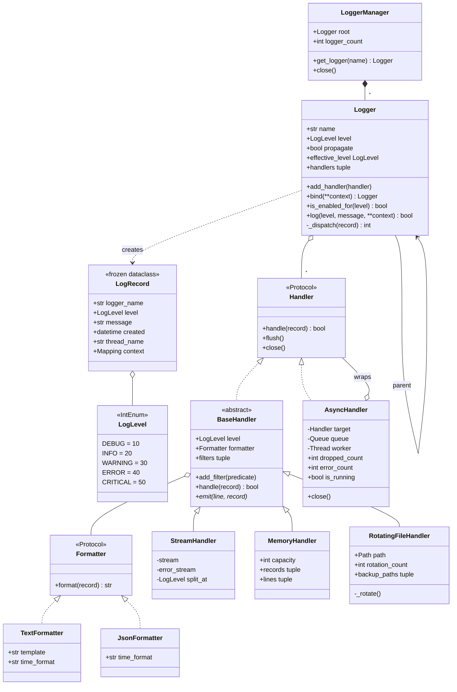

# 设计题解：日志框架（Logging Framework）

## 题目与澄清

面试官通常这样开场："设计一个日志框架。业务代码调用 `log.info("下单成功")`，框架决定这条记录
要不要写、写到哪几个地方、写成什么样子。"这道题看起来是"多写几个类"的送分题，实际上它在四十五
分钟里能把候选人问穿：级别过滤很容易，**层级与传播**几乎人人记错，**异步写入的关闭语义**几乎人人
说不完整。

动笔之前值得问清楚的几件事，每一件都会改变设计：

- **一条记录能同时去几个地方？** 如果答案是"只去一个"，那么整个设计退化成一个函数。真实答案
  是"同时去若干个，而且每个地方的门槛不一样"——控制台要看全部，文件只留 ERROR，告警通道只留
  CRITICAL。这句澄清决定了"目的地"必须是一个**列表**而不是一个字段，也决定了阈值必须有两层。
- **格式和目的地是不是同一件事？** 如果面试官说"文件要 JSON，控制台要人读的文本，而且以后可能
  反过来"，那么格式化器必须从目的地里拆出来，否则组合数会爆炸成 `JsonFileHandler`、
  `TextFileHandler`、`JsonConsoleHandler`……
- **logger 是全局一个，还是按模块各有一个？** 这是本题真正的设计点。答案通常是"按模块，名字
  形如 `app.db.pool`"，于是立刻带出第二个问题：`app.db.pool` 没配置过的时候，它该听谁的？
- **要不要异步？** 这决定了第三关的形态。如果业务线程不能被磁盘 IO 拖住，就要一条队列加一个
  工作线程；而只要有了队列，就必须当场回答"进程退出时队列里的记录怎么办"和"队列满了怎么办"。
- **允许直接用标准库 `logging` 吗？** 面试场合的答案是"不允许，我想看你自己写一个"。真实工程里
  的答案见本文最后一节——那也是一个值得说出口的判断。

**范围之外**：跨进程/跨机器的日志收集（那是 syslog、fluentbit、Kafka 的事）、日志采样与限流、
结构化日志的下游查询、按时间滚动（本文只做按大小滚动，两者机制相同）、`logging` 的 `%`-style
与 `str.format`-style 兼容层。

## 需求与分级

机器编码轮不会一次把需求摊开，它一关一关加，考的是"新需求来了旧代码动不动"。

**第 1 关（约 20 分钟，核心流程）**：五个级别（DEBUG/INFO/WARNING/ERROR/CRITICAL）；一条记录
携带时间戳、级别、正文、产生它的 logger 名字和一组结构化上下文；时间来自**注入的时钟**；可以挂
多个目的地（handler），每个 handler 有**自己的**阈值和**自己的**格式化器。低于阈值的调用必须
便宜——连记录对象都不该造出来。

**第 2 关（约 12 分钟，层级与传播）**：logger 按点分名字组织成树，`app.db.pool` 的父亲是
`app.db`，祖父是 `app`，根是 `""`。没有显式设置级别的 logger 向上继承（"有效级别"）；一条记录
产生后，沿祖先链向上交给**沿途每一个 handler**。这一关是这道题存在的理由，也是下一节里花最多
篇幅讨论的地方。

**第 3 关（约 10 分钟，线程安全与异步）**：多个线程同时写日志，不能出现半行插进另外半行；把
任意 handler 包成异步的——一条有界队列加一个工作线程；关闭时排空队列、汇合线程、再关内层
handler；队列满时要么阻塞要么丢弃，丢弃必须**可观测**。

**第 4 关（选做，新策略）**：按大小滚动的文件 handler；以及在**不碰 logger 一行代码**的前提下
给某个 handler 加一个过滤器（比如把 `/healthz` 的访问日志扔掉）。这一关唯一的判分点是：加这两
样东西，`Logger`、`LogRecord`、`Formatter` 和 `LoggerManager` 是不是一行都不用改——handler 那边
只该多出一个新的子类和一个「收下一个谓词」的钩子，不该动 `handle` 的四步骨架。

## 核心对象与职责

| 类 | 单一职责 | 它拥有的不变量 |
|---|---|---|
| `LogLevel`（`IntEnum`） | 把严重程度变成可比较的值 | 数值单调递增且留有间隔 |
| `LogRecord`（冻结 dataclass） | 一次日志事件的完整快照 | 造出来之后谁都改不了，因此可以跨线程、跨 handler 共享 |
| `Formatter`（`Protocol`） | 把记录变成一行字符串 | 无副作用的纯函数式映射 |
| `TextFormatter` / `JsonFormatter` | 两种表现形式 | 各自的固定字段永远不会被用户上下文顶掉 |
| `Handler`（`Protocol`） | `Logger` 眼里"一个目的地"需要的三个方法 | 不持有数据，纯角色 |
| `BaseHandler`（`ABC`） | 同步目的地的公共骨架：阈值、过滤器、格式化、加锁 | 同一时刻只有一个线程在 `emit` |
| `StreamHandler` / `MemoryHandler` / `RotatingFileHandler` | 三种具体目的地 | `MemoryHandler` 条目数有上限；`RotatingFileHandler` 备份文件数有上限 |
| `AsyncHandler` | 把任意 handler 变成异步：队列 + 工作线程 + 丢弃计数 | `close()` 之前入队的记录一条不少；之后来的一律拒收并计数 |
| `Logger` | 决定"要不要记"，并把记录沿祖先链分发 | `handlers` 只以元组整体替换，读者永远看到一个完整的快照 |
| `LoggerManager` | 按名字登记 logger，把点分名字接成树 | 同名永远同一个对象；`a.b.c` 存在则 `a.b` 与 `a` 必然存在 |

关系上，`LoggerManager` **拥有**整棵 logger 树（组合：manager 消失，树也就没人引用了）；`Logger`
只是**关联**若干 handler（同一个 handler 可以同时挂在多个 logger 上，它的生命周期不归 logger 管，
所以框架提供 `LoggerManager.close()` 统一收尾）；`AsyncHandler` **包住**另一个 handler，是
[[patterns.structural|结构型模式（Structural）]]里装饰器（Decorator）的标准形态——它实现
`Handler` 协议、接受一个 `Handler`，因此可以套在任何目的地外面，包括另一个 `AsyncHandler`。

`Logger` 与 handler 之间是 [[patterns.observer|观察者与事件（Observer）]]：`Logger` 是主题，
handler 是订阅者，`LogRecord` 是那个**冻结的事件对象**。这个"事件带着发生了什么一起走"的形态
很关键——handler 拿到记录后不需要回头问 `Logger` 任何事，于是它也永远不需要去抢 `Logger` 的锁，
观察者模式里最常见的"在持锁状态下回调外部代码导致死锁"在这个设计里根本不可能发生。



## 关键设计决策

### 决策一：多个目的地该用责任链，还是让 logger 持有一个 handler 列表？

这是本题第一个岔路，而且流传最广的那个答案是错的。

责任链（Chain of Responsibility）的写法是让每个 handler 持有 `next`，记录从链头往下传：

```python
class Handler:
    def handle(self, record):
        if record.level >= self.level:
            self.emit(...)
        if self._next:
            self._next.handle(record)   # 注意：无条件往下传
```

教科书里的责任链在**某一个处理者接下请求之后就停止**——审批流里恰好应该只有一个人负责。日志不是
这样：一条 ERROR 必须同时到控制台、到文件、到告警。所以套用责任链就必须把它最核心的那条规则
（"接住了就停"）删掉，剩下的只是"一个用指针串起来的列表"。既然如此，为什么不直接用列表？

本文的选择是：`Logger` 持有一个 `tuple[Handler, ...]`，`_dispatch` 里就是一层循环。代价是失去了
"handler 之间互相决定要不要继续"的能力——而这个能力在日志里根本不需要，每个目的地各自独立判断，
正是我们要的语义。收益是：加一个目的地不用维护链表指针，handler 之间零耦合，一个 handler 可以
同时挂在两棵树的多个 logger 上而不会被"上一个是谁"绑住。

**这一段就是"拒绝一个模式"的例子**：面试里主动说出"我考虑过责任链，但责任链的终止语义和日志的
广播语义相反，用它就得把模式的核心删掉，那说明它不是这个问题的模式"，比背出模式名字值钱得多。

### 决策二：层级与传播——把标准库 `logging` 的语义说准，再决定跟不跟

`logging` 是这道题的参考实现，面试官大概率知道它。所以要么说准，要么别提。三条最容易记错的事实：

1. **传播的对象是祖先 logger，不是 handler 链。** `logger.error(...)` 先在**起点**判一次级别，
   随后 `callHandlers` 从当前 logger 沿 `parent` 一路向上，把记录交给沿途每个 logger 的 handler。
2. **向上走的时候不再看祖先 logger 的级别。** 这是最反直觉的一条：父 logger 设成 `CRITICAL`
   **不会**拦住子 logger 的 DEBUG 记录到达父 logger 的 handler。级别只在起点判一次，之后只有各
   handler 自己的阈值起作用。想在中途截断，用的是 `propagate = False`，不是级别。
3. **`NOTSET`（值为 0）的含义是"向上继承"。** `getEffectiveLevel()` 沿 `parent` 往上找第一个非
   `NOTSET` 的级别；一路都没有就用根的级别，而根默认是 `WARNING`——这就是"为什么我的 `info()`
   什么都没打印"这个经典困惑的答案。

本文的设计**跟随**第 1、2 条：`_dispatch` 的循环和 `callHandlers` 是同一个语义，并且有一个测试
（`test_ancestor_logger_level_is_not_consulted_during_propagation`）专门把它钉死。

本文**故意不跟**第 3 条的表示法。`logging` 用 `NOTSET = 0` 同时表达"一个级别"和"我没设过"，
于是 `logger.setLevel(0)` 到底是"打开所有日志"还是"继承父亲"就成了要查文档的事。这里换成
`level: LogLevel | None`，`None` 明确表示"问我的祖先"，`LogLevel` 里干脆没有 `NOTSET` 这个成员：

```python
@property
def effective_level(self) -> LogLevel:
    node = self
    while node is not None:
        if node.level is not None:
            return node.level
        node = node._parent
    return LogLevel.WARNING
```

递归有底的前提是**根 logger 永远有一个具体级别**（`LoggerManager.__init__` 里给的），最后那行
`return LogLevel.WARNING` 只是给"手工脱离树构造的 logger"兜底。根默认 `WARNING` 是跟随
`logging` 的——这个默认值会坑住每一个新手，但和整个生态保持一致比"我觉得 INFO 更合理"重要。

### 决策三：格式化器必须从 handler 里拆出去——这是桥接（Bridge），不是继承

"写到哪"和"写成什么样"是两个**独立变化的维度**。文件可能要 JSON，也可能要文本；控制台反过来。
如果把格式化揉进 handler，类的数量是两个维度的乘积：`JsonFileHandler`、`TextFileHandler`、
`JsonConsoleHandler`、`TextConsoleHandler`……加一种格式就得再加一排类。

拆开之后是加法：`BaseHandler` 持有一个 `Formatter`，两个维度各自扩展，组合在构造时发生。这正是
[[patterns.structural|结构型模式（Structural）]]里桥接模式的定义——把抽象（目的地）和实现
（表现形式）分离，让它们能独立变化。`Formatter` 用 `Protocol` 而不是 `ABC`：它没有任何值得共享的
默认实现，测试里写一个只有 `format` 方法的假格式化器也不必去继承谁，[[python.protocols-abc|Protocol、ABC 与鸭子类型]]
里的结构化子类型在这里刚好够用。

拆开之后有一个细节值得当场讲：`emit` 的签名是 `emit(self, line: str, record: LogRecord)`，同时收
格式化好的行**和**原始记录。为什么不只给行？因为 `StreamHandler` 要按级别把 ERROR 分流到
stderr——如果只有字符串，它就只能去行里搜 `[ERROR]` 这样的子串，而这种写法在换成 JSON 格式化器
的当天就会无声失效。**任何"把自己刚生成的字符串再解析回来"的代码都是设计出了问题的信号。**

### 决策四：过滤器就用一个普通函数——这里拒绝写 `Filter` 抽象类

第 4 关要求"不碰 logger 就能加一个过滤规则"。Java 味的答案是定义

```python
class Filter(ABC):
    @abstractmethod
    def should_log(self, record: LogRecord) -> bool: ...
```

然后为每条规则写一个类。但一个只有一个方法、不需要共享实现、多数情况下连状态都没有的接口，
在 Python 里就是一个函数类型：

```python
Filter = Callable[[LogRecord], bool]

handler.add_filter(lambda record: record.context.get("path") != "/healthz")
```

需要状态的时候（比如"同一条消息一分钟内只放行一次"），闭包或者一个带 `__call__` 的类照样满足这个
类型，调用方一行都不用改——这正是 [[python.first-class-functions|一等函数、闭包与装饰器]]里
"函数即对象"替代单方法接口的典型场景。标准库 `logging` 里 `Filter` 是一个类，但它也接受任何带
`filter` 方法的对象，并且从 3.2 起显式支持可调用对象，方向是一致的。

顺便还有一处同类的拒绝：`LoggerManager` **不是**用 `__new__` 写的单例。"全局只要一个"是使用方式
的约束，不是类本身的性质；把它焊进 `__new__` 的代价是测试再也拿不到干净的实例，两个用例之间会
互相污染。这里的写法是模块级的一个惰性实例加一个 `get_logger()` 函数——
[[python.modules|模块、包与依赖方向]]里"模块即单例"的标准做法。想要隔离，`LoggerManager()` 再造
一个就是，本文的每一个测试都是这么做的。

### 决策五：异步 handler 的关闭契约——flush、drain、join，以及丢弃必须可观测

把日志写盘从业务线程挪走，本质是一个有界队列上的生产者-消费者。难点全在边界：

**队列满了怎么办？** 两个都合理但代价完全不同的选项。阻塞（`queue.put`）保证一条不丢，代价是
业务线程被日志拖慢——日志系统反过来成了系统的瓶颈，这在事故现场（日志量暴涨的那一刻）尤其糟糕。
丢弃（`put_nowait` + `except queue.Full`）保护业务线程，代价是日志出现空洞。本文默认阻塞、
可配置丢弃，并且**丢弃必须计数**：`dropped_count` 是一个公开属性。没有计数器的丢弃是最坏的选项
——排查问题的人会以为那段时间什么都没发生，而事实是日志被悄悄扔了。

**关闭时怎么办？** 正确的顺序是三步：停止收新记录 → 排空队列（把哨兵 `None` 放进队尾，工作线程
读到就退出）→ `join` 工作线程 → 关闭内层 handler。少任何一步都会丢日志，而丢的恰好是崩溃前最后
那几条——最值钱的那几条。

这里还有一个**竞态**值得讲出来：如果"检查是否已关闭"和"入队"不是一个原子步骤，那么一个线程可能
在哨兵入队之后才把记录放进队列，这条记录就永远没人消费了。本文的做法是把这两步放进同一把
`_state_lock`：

```python
def handle(self, record):
    with self._state_lock:
        if self._closed:
            self._dropped += 1
            return False
        self._queue.put(record)
        return True
```

于是每条记录要么明确排在哨兵之前，要么被明确拒收并计数，不存在第三种结局。代价是生产者之间多了
一次串行化，但队列本身就是瓶颈，这点开销可以忽略。

**GIL 帮了什么忙？** 帮的忙比多数人以为的少。GIL 保证单条字节码不会被切开，但 `self._dropped += 1`
是"读—加—写"三条字节码，中间随时可能切换线程；`list.append` 恰好是原子的（它是一次 C 调用），
但"append 之后检查长度再 del 最旧的"这个组合不是。所以：**凡是"读出来—改—写回去"的复合操作，
GIL 都不保护**，该加锁还得加锁，这也是 [[concurrency.model|线程、GIL 与内存模型]]的核心结论。
反过来，`self._handlers` 整体替换成一个新元组是单次属性赋值，读者不需要加锁就能看到一个完整的
旧快照或完整的新快照——这就是分发热路径上一把锁都不用加的原因。

## 代码走读

完整的参考实现（Python 3.12，仅标准库）如下，`test_logger.py` 的 29 个测试对其中每一条行为都有
对应的断言。读的时候重点看四处：`Logger._dispatch` 的向上循环（第 2 关的全部）、`BaseHandler.handle`
的"阈值—过滤—格式化—加锁写出"四步（第 1 关与第 4 关）、`AsyncHandler` 的 `handle`/`_run`/`close`
三件套（第 3 关），以及 `RotatingFileHandler._rotate` 里"最旧的那个备份必须删掉"的那两行。

%% code:begin solution.py %%
```python
"""日志框架：分级过滤、多目的地、层级传播与异步写入。
设计：`Logger` 只决定"这条要不要记、交给谁"，`BaseHandler` 决定"写到哪"，`Formatter` 决定
"长什么样"，三者各自独立变化；`LogRecord`（冻结 dataclass）是它们之间唯一的事件对象。
`Logger` 按点分名字组成一棵树，记录沿祖先链向上交给沿途每一个 handler，级别可向上继承。
`AsyncHandler` 是包在任意 handler 外面的一层队列加工作线程，关闭时排空、汇合、再关内层。
"""

from __future__ import annotations

import json
import queue
import threading
from abc import ABC, abstractmethod
from collections.abc import Callable, Mapping
from dataclasses import dataclass, field
from datetime import datetime, timezone
from enum import IntEnum
from pathlib import Path
from types import MappingProxyType
from typing import Protocol, TextIO

# 时钟从外部注入（测试里换成固定时钟）；过滤器就是一个"看一眼记录、回答要不要"的函数——
# 只有一个方法的策略不值得一个类。
Clock = Callable[[], datetime]
Filter = Callable[["LogRecord"], bool]
EMPTY_CONTEXT: Mapping[str, object] = MappingProxyType({})


def utc_now() -> datetime:
    """默认时钟。带时区，避免日志时间在跨时区机器上无法比较。"""
    return datetime.now(timezone.utc)


class LoggingError(Exception):
    """本框架所有失败的共同基类，调用方可以只捕获这一个。"""


class InvalidLoggerNameError(LoggingError, ValueError):
    """点分名字不合法（空段、首尾有点）时抛出。"""


class LogLevel(IntEnum):
    """级别之间要能比大小，所以是 `IntEnum` 而不是 `Enum`；数值留出间隔以便日后插入新级别。

    这里**故意没有** `NOTSET = 0`：标准库用 0 同时表示"没设过"和一个级别值，本框架用
    `level=None` 表示"向上继承"，见题解"关键设计决策"。
    """

    DEBUG = 10
    INFO = 20
    WARNING = 30
    ERROR = 40
    CRITICAL = 50


@dataclass(frozen=True, slots=True)
class LogRecord:
    """一次日志事件的完整快照：冻结，因此可以安全地交给任意多个 handler、跨线程传递。

    观察者模式里"事件对象携带发生了什么"的直接体现——handler 永远不需要回头去问 `Logger`
    任何事，也就不需要和 `Logger` 争同一把锁。
    """

    logger_name: str
    level: LogLevel
    message: str
    created: datetime
    thread_name: str
    context: Mapping[str, object] = field(default_factory=lambda: EMPTY_CONTEXT)


class Formatter(Protocol):
    """格式化器只有一个职责：把记录变成一行字符串。它带配置（模板、时间格式），所以是类。"""

    def format(self, record: LogRecord) -> str: ...


@dataclass(frozen=True, slots=True)
class TextFormatter:
    """人读的一行文本。模板用 `str.format` 的占位符，可用字段见 `format` 的实现。"""

    template: str = "{time} [{level}] {name}: {message}{context}"
    time_format: str = "%Y-%m-%d %H:%M:%S"

    def format(self, record: LogRecord) -> str:
        context = ""
        if record.context:
            context = " " + " ".join(f"{k}={v!r}" for k, v in sorted(record.context.items()))
        return self.template.format(
            time=record.created.strftime(self.time_format),
            level=record.level.name,
            name=record.logger_name or "root",
            message=record.message,
            context=context,
            thread=record.thread_name,
        )


@dataclass(frozen=True, slots=True)
class JsonFormatter:
    """机器读的一行 JSON。上下文被摊平到顶层，但固定字段后写，保证不会被上下文顶掉。"""

    time_format: str = "%Y-%m-%dT%H:%M:%S%z"

    def format(self, record: LogRecord) -> str:
        payload: dict[str, object] = {
            **record.context,
            "time": record.created.strftime(self.time_format),
            "level": record.level.name,
            "logger": record.logger_name,
            "message": record.message,
        }
        return json.dumps(payload, ensure_ascii=False, sort_keys=True, default=str)


class Handler(Protocol):
    """`Logger` 眼里的 handler 只有这三个方法——`AsyncHandler` 正是靠只实现这个协议、
    而不继承 `BaseHandler`，才能把任意 handler 包起来。"""

    def handle(self, record: LogRecord) -> bool: ...

    def flush(self) -> None: ...

    def close(self) -> None: ...


class BaseHandler(ABC):
    """同步 handler 的公共骨架：自己的阈值、自己的格式化器、自己的过滤器、自己的一把锁。

    `handle` 是模板方法，子类只实现 `emit`。格式化放在锁**外面**（记录是冻结的，纯计算），
    只有真正写出去的那一步在锁内——锁保护的是"一行不被另一行插进来"，不是 CPU 时间。
    """

    def __init__(self, level: LogLevel = LogLevel.DEBUG, formatter: Formatter | None = None) -> None:
        self.level = level
        self.formatter: Formatter = formatter if formatter is not None else TextFormatter()
        self._filters: tuple[Filter, ...] = ()
        self._lock = threading.RLock()

    @property
    def filters(self) -> tuple[Filter, ...]:
        """快照。内部用元组存，读的时候不用加锁，也不可能被调用方改坏。"""
        return self._filters

    def add_filter(self, predicate: Filter) -> None:
        """加一个过滤器：整体换掉元组，读者要么看到旧的、要么看到新的，不会看到半个。"""
        with self._lock:
            self._filters = (*self._filters, predicate)

    def handle(self, record: LogRecord) -> bool:
        """返回这条记录是否真的被写出去了——测试据此断言阈值和过滤器生效。"""
        if record.level < self.level:
            return False
        if not all(predicate(record) for predicate in self._filters):
            return False
        line = self.formatter.format(record)
        with self._lock:
            self.emit(line, record)
        return True

    @abstractmethod
    def emit(self, line: str, record: LogRecord) -> None:
        """把格式化好的一行写出去。调用时已持有本 handler 的锁。

        同时收下 `record`，是为了让子类能按级别分流（比如 ERROR 走 stderr）而不必把自己
        刚生成的那行字符串再解析回来——那种写法一换成 JSON 格式化器就悄悄失效了。
        """

    def flush(self) -> None:
        """默认无事可做；有缓冲的子类覆盖它。"""

    def close(self) -> None:
        self.flush()


class StreamHandler(BaseHandler):
    """写到任意文本流。`error_stream` 非空时，达到 `split_at` 的记录改走它（典型是 stderr）。"""

    def __init__(self, stream: TextIO, level: LogLevel = LogLevel.DEBUG, formatter: Formatter | None = None,
                 error_stream: TextIO | None = None, split_at: LogLevel = LogLevel.ERROR) -> None:
        super().__init__(level, formatter)
        self._stream = stream
        self._error_stream = error_stream
        self._split_at = split_at

    def emit(self, line: str, record: LogRecord) -> None:
        target = self._error_stream if (self._error_stream is not None and record.level >= self._split_at) else self._stream
        target.write(line + "\n")

    def flush(self) -> None:
        with self._lock:
            self._stream.flush()
            if self._error_stream is not None:
                self._error_stream.flush()


class MemoryHandler(BaseHandler):
    """把记录留在内存里，给测试和"最近 N 条"面板用。**有上限**：这是一个日志组件，
    任何一个会随运行时间无界增长的容器都是事故。超出容量时丢最旧的。"""

    def __init__(self, capacity: int = 256, level: LogLevel = LogLevel.DEBUG, formatter: Formatter | None = None) -> None:
        if capacity <= 0:
            raise ValueError(f"capacity must be positive, got {capacity}")
        super().__init__(level, formatter)
        self._capacity = capacity
        self._records: list[LogRecord] = []
        self._lines: list[str] = []

    @property
    def capacity(self) -> int:
        return self._capacity

    @property
    def records(self) -> tuple[LogRecord, ...]:
        """快照，不是内部列表本身——调用方拿到手的东西不该能改写 handler 的状态。"""
        with self._lock:
            return tuple(self._records)

    @property
    def lines(self) -> tuple[str, ...]:
        with self._lock:
            return tuple(self._lines)

    def emit(self, line: str, record: LogRecord) -> None:
        self._records.append(record)
        self._lines.append(line)
        if len(self._records) > self._capacity:
            del self._records[0]
            del self._lines[0]


class RotatingFileHandler(BaseHandler):
    """按字节数滚动的文件 handler：写满 `max_bytes` 就把 `app.log` 改名成 `app.log.1`，
    旧的依次后移，超过 `backup_count` 的直接删掉——否则"滚动"只是把磁盘填满得慢一点。"""

    def __init__(self, path: Path | str, max_bytes: int = 1024, backup_count: int = 3,
                 level: LogLevel = LogLevel.DEBUG, formatter: Formatter | None = None,
                 encoding: str = "utf-8") -> None:
        if max_bytes <= 0:
            raise ValueError(f"max_bytes must be positive, got {max_bytes}")
        if backup_count < 0:
            raise ValueError(f"backup_count must not be negative, got {backup_count}")
        super().__init__(level, formatter)
        self._path = Path(path)
        self._max_bytes = max_bytes
        self._backup_count = backup_count
        self._encoding = encoding
        self._size = self._path.stat().st_size if self._path.exists() else 0
        self._stream: TextIO | None = self._path.open("a", encoding=encoding)
        self._rotations = 0

    @property
    def path(self) -> Path:
        return self._path

    @property
    def rotation_count(self) -> int:
        """已经滚动过多少次——把"到底有没有滚"变成一个可以断言的公开状态。"""
        return self._rotations

    @property
    def backup_paths(self) -> tuple[Path, ...]:
        """当前磁盘上真实存在的备份文件，从最新到最旧。"""
        candidates = (Path(f"{self._path}.{i}") for i in range(1, self._backup_count + 1))
        return tuple(p for p in candidates if p.exists())

    def emit(self, line: str, record: LogRecord) -> None:
        data = line + "\n"
        size = len(data.encode(self._encoding))
        if self._size > 0 and self._size + size > self._max_bytes:
            self._rotate()
        assert self._stream is not None
        self._stream.write(data)
        self._stream.flush()
        self._size += size

    def _rotate(self) -> None:
        """把 .{n} 依次改名成 .{n+1}，最旧的一个删掉，再把当前文件变成 .1 并重开。"""
        if self._stream is not None:
            self._stream.close()
            self._stream = None
        if self._backup_count == 0:
            self._path.unlink(missing_ok=True)
        else:
            for i in range(self._backup_count - 1, 0, -1):
                src, dst = Path(f"{self._path}.{i}"), Path(f"{self._path}.{i + 1}")
                if src.exists():
                    dst.unlink(missing_ok=True)
                    src.rename(dst)
            first = Path(f"{self._path}.1")
            first.unlink(missing_ok=True)
            self._path.rename(first)
        self._stream = self._path.open("a", encoding=self._encoding)
        self._size = 0
        self._rotations += 1

    def flush(self) -> None:
        with self._lock:
            if self._stream is not None:
                self._stream.flush()

    def close(self) -> None:
        with self._lock:
            if self._stream is not None:
                self._stream.close()
                self._stream = None


class AsyncHandler:
    """把任意 handler 变成异步的一层装饰：一条有界队列 + 一个工作线程。

    它只实现 `Handler` 协议、不继承 `BaseHandler`——因为它没有自己的格式化器和阈值，
    这两件事属于被包住的那个 handler。队列满时的行为是一个必须当场讲清楚的取舍：
    默认阻塞（业务线程变慢，但一条不丢），`drop_when_full=True` 则丢弃并计数
    （业务线程不受影响，代价是日志出现无声的空洞——所以必须有 `dropped_count` 可观测）。

    关闭契约：`close()` 保证在它之前**已经入队**的记录全部写出（排空、汇合、再关内层），
    之后再来的记录一律拒收并计入 `dropped_count`；它不承诺和仍在运行的生产者线程赛跑。
    """

    def __init__(self, target: Handler, max_queue: int = 1024, drop_when_full: bool = False, name: str = "log-worker") -> None:
        if max_queue <= 0:
            raise ValueError(f"max_queue must be positive, got {max_queue}")
        self._target = target
        self._queue: queue.Queue[LogRecord | None] = queue.Queue(maxsize=max_queue)
        self._drop_when_full = drop_when_full
        self._dropped = 0
        self._errors = 0
        self._closed = False
        self._state_lock = threading.RLock()
        self._worker = threading.Thread(target=self._run, name=name, daemon=True)
        self._worker.start()

    @property
    def dropped_count(self) -> int:
        with self._state_lock:
            return self._dropped

    @property
    def error_count(self) -> int:
        """内层 handler 抛出异常的次数。写日志失败绝不能杀掉业务线程，但也不能静悄悄。"""
        with self._state_lock:
            return self._errors

    @property
    def pending(self) -> int:
        return self._queue.qsize()

    @property
    def is_running(self) -> bool:
        return self._worker.is_alive()

    def handle(self, record: LogRecord) -> bool:
        """入队即返回。整段放在 `_state_lock` 里，是为了让"关闭"和"入队"不会交错：
        要么这条记录已经排在哨兵之前，要么它被明确拒收，不存在"入了队却没人消费"。"""
        with self._state_lock:
            if self._closed:
                self._dropped += 1
                return False
            if self._drop_when_full:
                try:
                    self._queue.put_nowait(record)
                except queue.Full:
                    self._dropped += 1
                    return False
            else:
                self._queue.put(record)
            return True

    def _run(self) -> None:
        while True:
            record = self._queue.get()
            try:
                if record is None:
                    return
                self._target.handle(record)
            except Exception:
                with self._state_lock:
                    self._errors += 1
            finally:
                self._queue.task_done()

    def flush(self) -> None:
        """等队列里已有的记录全部被消费，再让内层把缓冲刷出去。"""
        self._queue.join()
        self._target.flush()

    def close(self) -> None:
        with self._state_lock:
            if self._closed:
                return
            self._closed = True
            self._queue.put(None)
        self._worker.join()
        self._target.close()


class Logger:
    """一个命名的日志入口。职责只有两件：按有效级别决定要不要造记录；把记录沿祖先链分发。

    `level=None` 表示"我没有意见，问我的祖先"；根 logger 必须有具体级别，递归才有底。
    `handlers` 用元组存，`add_handler` 整体替换——于是分发路径上一把锁都不用加。
    """

    def __init__(self, name: str, parent: Logger | None = None, level: LogLevel | None = None,
                 clock: Clock = utc_now, context: Mapping[str, object] | None = None) -> None:
        self._name = name
        self._parent = parent
        self.level = level
        self.propagate = True
        self._clock = clock
        self._context: Mapping[str, object] = MappingProxyType(dict(context or {}))
        self._handlers: tuple[Handler, ...] = ()
        self._lock = threading.RLock()

    @property
    def name(self) -> str:
        return self._name

    @property
    def parent(self) -> Logger | None:
        return self._parent

    @property
    def context(self) -> Mapping[str, object]:
        """只读视图：绑定上的上下文谁都能看，但谁都改不了。"""
        return self._context

    @property
    def handlers(self) -> tuple[Handler, ...]:
        return self._handlers

    @property
    def effective_level(self) -> LogLevel:
        """自己没设级别就一路问祖先。这是整棵树里唯一一处"继承"，也是配置只需写在根上的原因。"""
        node: Logger | None = self
        while node is not None:
            if node.level is not None:
                return node.level
            node = node._parent
        return LogLevel.WARNING

    def add_handler(self, handler: Handler) -> None:
        with self._lock:
            if handler not in self._handlers:
                self._handlers = (*self._handlers, handler)

    def remove_handler(self, handler: Handler) -> None:
        with self._lock:
            self._handlers = tuple(h for h in self._handlers if h is not handler)

    def bind(self, /, **context: object) -> Logger:
        """返回一个带额外上下文的视图：它以本 logger 为父、自己不挂 handler，
        于是记录照样流经本 logger 和所有祖先的 handler，级别也照样继承。
        不需要为"绑定"再发明一个类——树和传播机制已经把这件事做完了。"""
        merged = {**self._context, **context}
        view = Logger(self._name, parent=self, clock=self._clock, context=merged)
        return view

    def is_enabled_for(self, level: LogLevel) -> bool:
        """廉价闸门：一次整数比较。被关掉的 DEBUG 调用不该产生任何对象。"""
        return level >= self.effective_level

    def log(self, level: LogLevel, message: str, /, **context: object) -> bool:
        """返回这条记录是否至少被一个 handler 写出去了，方便测试和自检。

        `/` 把 `level` 和 `message` 声明为仅位置参数：否则调用方想记一个名叫 `message`
        或 `level` 的业务字段（`log.info("冲突", level="P1")`）就会和形参撞名报 TypeError。
        凡是尾随 `**kwargs` 收用户数据的 API，前面的形参都应该是仅位置的。
        """
        if not self.is_enabled_for(level):
            return False
        record = LogRecord(
            logger_name=self._name,
            level=level,
            message=message,
            created=self._clock(),
            thread_name=threading.current_thread().name,
            context=MappingProxyType({**self._context, **context}),
        )
        return self._dispatch(record) > 0

    def _dispatch(self, record: LogRecord) -> int:
        """沿祖先链向上，把记录交给沿途每一个 handler。

        关键且常被记错的一点：**向上走时不再看祖先 logger 的级别**，只看各个 handler
        自己的阈值。级别只在起点那一次 `is_enabled_for` 里起作用。标准库 `logging`
        的 `callHandlers` 就是这个语义，本框架与它一致。
        """
        delivered = 0
        node: Logger | None = self
        while node is not None:
            for handler in node.handlers:
                if handler.handle(record):
                    delivered += 1
            if not node.propagate:
                break
            node = node._parent
        return delivered

    def debug(self, message: str, /, **context: object) -> bool:
        return self.log(LogLevel.DEBUG, message, **context)

    def info(self, message: str, /, **context: object) -> bool:
        return self.log(LogLevel.INFO, message, **context)

    def warning(self, message: str, /, **context: object) -> bool:
        return self.log(LogLevel.WARNING, message, **context)

    def error(self, message: str, /, **context: object) -> bool:
        return self.log(LogLevel.ERROR, message, **context)

    def critical(self, message: str, /, **context: object) -> bool:
        return self.log(LogLevel.CRITICAL, message, **context)

    def __repr__(self) -> str:
        return f"Logger({self._name!r}, level={self.level}, effective={self.effective_level.name})"


class LoggerManager:
    """按名字登记 logger，并把点分名字接成一棵树。

    不是用 `__new__` 做的单例——那种写法把"全局只要一个"和"这个类本身"焊死，测试再也
    拿不到干净的实例。这里 `LoggerManager` 是一个普通类，模块底部放一个默认实例，
    需要隔离的场合（测试、插件）各自 `LoggerManager()` 一个就是了。
    """

    def __init__(self, root_level: LogLevel = LogLevel.WARNING, clock: Clock = utc_now) -> None:
        self._clock = clock
        self._root = Logger("", parent=None, level=root_level, clock=clock)
        self._loggers: dict[str, Logger] = {}
        self._lock = threading.RLock()

    @property
    def root(self) -> Logger:
        return self._root

    @property
    def logger_count(self) -> int:
        """已登记的具名 logger 个数（不含根）——用来断言中间祖先确实被补齐了。"""
        with self._lock:
            return len(self._loggers)

    def get_logger(self, name: str = "") -> Logger:
        """同名永远返回同一个对象；缺失的中间祖先按需补齐，这样 `a.b.c` 一定挂在 `a.b` 下面。"""
        if name == "":
            return self._root
        if name.startswith(".") or name.endswith(".") or ".." in name:
            raise InvalidLoggerNameError(f"invalid logger name: {name!r}")
        with self._lock:
            existing = self._loggers.get(name)
            if existing is not None:
                return existing
            parent = self._root
            path: list[str] = []
            for part in name.split("."):
                path.append(part)
                key = ".".join(path)
                node = self._loggers.get(key)
                if node is None:
                    node = Logger(key, parent=parent, clock=self._clock)
                    self._loggers[key] = node
                parent = node
            return parent

    def close(self) -> None:
        """进程退出前调用：关掉每一个 handler（异步的那些会在这里排空并汇合）。"""
        with self._lock:
            nodes = [self._root, *self._loggers.values()]
        for node in nodes:
            for handler in node.handlers:
                handler.close()


_DEFAULT_MANAGER: LoggerManager | None = None
_DEFAULT_LOCK = threading.Lock()


def default_manager() -> LoggerManager:
    """进程级默认实例，第一次用到时才建。模块级的一个对象就是 Python 的单例写法——
    比 `__new__` 单例简单，也不在 import 阶段做事。"""
    global _DEFAULT_MANAGER
    with _DEFAULT_LOCK:
        if _DEFAULT_MANAGER is None:
            _DEFAULT_MANAGER = LoggerManager()
        return _DEFAULT_MANAGER


def get_logger(name: str = "") -> Logger:
    """默认入口。需要隔离（测试、插件）就自己造一个 `LoggerManager`，不要来动这个。"""
    return default_manager().get_logger(name)


def _demo() -> None:
    import sys

    manager = LoggerManager(root_level=LogLevel.INFO)
    audit = MemoryHandler(capacity=64, level=LogLevel.ERROR, formatter=JsonFormatter())
    manager.root.add_handler(StreamHandler(sys.stdout, level=LogLevel.INFO))
    app, db = manager.get_logger("app"), manager.get_logger("app.db")
    db.add_handler(audit)
    db.level = LogLevel.DEBUG
    app.info("服务启动", version="1.4.2")
    db.debug("连接池预热", size=8)          # app.db 自己放行 DEBUG，级别不看祖先
    db.error("查询超时", query_ms=1200)     # 同时进 console（继承自根）和 audit
    app.bind(request_id="req-8814").error("上游 504")   # 上下文自动带上，不必逐层传参
    print("audit:", audit.lines[-1])


if __name__ == "__main__":
    _demo()
```
%% code:end %%

几个读代码时容易滑过去的点：

- `BaseHandler.handle` 里格式化发生在**锁外**。记录是冻结的，格式化是纯计算，没有理由占着锁做；
  锁只保护真正写出去的那一瞬间，保护的是"一行不被另一行插进来"，不是 CPU 时间。
- `Logger.log` 的签名是 `log(self, level, message, /, **context)`。那个 `/` 不是装饰：没有它，
  调用方想记一个名叫 `message` 或 `level` 的业务字段就会撞上形参名并抛 `TypeError`。**凡是用
  尾随 `**kwargs` 收用户数据的 API，前面的形参都应该声明成仅位置参数。**
- `Logger.bind` 没有引入任何新类。它返回的是一个"以自己为父、自己不挂 handler"的 `Logger` 视图，
  于是记录照样流经本 logger 和所有祖先的 handler，有效级别也照样继承——树和传播机制已经把这件事
  做完了，再发明一个 `BoundLogger` 就是纯粹的转发类。
- `MemoryHandler` 有容量上限，`RotatingFileHandler` 有备份数上限。一个日志组件里任何会随运行
  时间无界增长的容器都是事故：前者用来兜"最近 N 条"，后者要是不删最旧的备份，"滚动"就只是把磁盘
  填满得慢一点而已。

## 测试与自检

29 个测试按四关分组，每一组钉死的不变量是：

- **第 1 关**：低于阈值时 `log()` 返回 `False` 且 handler 里一条记录都没有（证明廉价闸门真的生效）；
  时间戳来自注入的时钟，推进 60 秒后两条记录的时间差正好是 60 秒；两个 handler 各自的阈值互不
  影响；同一条记录在一个 handler 里是文本、在另一个里是可以 `json.loads` 的 JSON；上下文里的
  `level=` 不会把 JSON 里的级别字段顶掉。
- **第 2 关**：`get_logger("a.b.c")` 之后 `logger_count == 3`（中间祖先被补齐了）；同名两次返回
  同一个对象；有效级别随祖先的设置而改变；记录到达每一个祖先的 handler；`propagate = False`
  之后到此为止；**父 logger 设成 CRITICAL 不影响子 logger 的 DEBUG 到达父 logger 的 handler**。
- **第 3 关**：8 个线程各写 100 条，用 `threading.Barrier` 让它们同时开跑，最后断言 800 条一条
  不少、正文互不重复——断言的是**不变量**（总数守恒）而不是时序。异步那一组更狠：队列只有 16 个
  位置，负载是 800 条，`close()` 之后 `dropped_count == 0` 且内层收到整整 800 条。
- **第 4 关**：写满 40 行之后 `rotation_count > 0` 且 `len(backup_paths) == 2`（不是 3、不是 40）；
  过滤器加上之后 `/healthz` 的记录消失，而加之前那条还在——证明这是"加规则"，不是"改 logger"。

**怎么在两分钟内给面试官演示**：`python solution.py`。输出里有三件事值得指出来：`app.db` 自己
放行了 DEBUG（级别继承被子节点覆盖）；那条 `ERROR` 同时出现在控制台（handler 挂在根上，继承而来）
和 JSON 审计流水里（handler 挂在 `app.db` 上）；最后一行的 `request_id` 是 `bind` 带上去的，业务
函数一个参数都没多传。

**自检清单**：造不出记录的路径上真的没有构造对象吗？`handlers` 交出去的是元组还是内部列表？
异步 handler 关闭之后再来一条会怎样？滚动之后第 4 个备份文件真的被删了吗？

## 扩展与追问

**新需求**

- *"要按时间滚动，每天一个文件。"* 新写一个 `TimedRotatingFileHandler`，和
  `RotatingFileHandler` 并列；触发条件从"字节数"换成"注入的时钟跨过了午夜"。`Logger`、
  `Formatter`、`LoggerManager` 一行不动。
- *"要从 YAML/字典加载配置。"* 新增一个只读配置的函数：按名字 `get_logger`，设级别，按类型造
  handler 和 formatter 挂上去。它是框架**外面**的一层，不属于任何现有类——配置解析和日志分发是
  两件事，揉在一起就没法单独测试其中一件。
- *"某些字段要脱敏（手机号、身份证）。"* 有两个落点，选哪个要说清理由：放在 `Formatter` 里，
  脱敏只影响这一种输出；放在 handler 的过滤器里，过滤器只能"要或不要"、不能改写记录。真要改写，
  正确的做法是让 `LogRecord` 派生出一条新的冻结记录（`dataclasses.replace`），并明确这是一次
  **转换**而不是过滤——这时候把它做成 handler 上的 `processors` 链才是对的抽象。

**并发与线程安全**

- *"一个 handler 同时挂在两个 logger 上安全吗？"* 安全。锁在 handler 自己身上，和挂了几次无关；
  而且它拿到的是冻结记录，不会回头去读任何 logger 的状态。
- *"`AsyncHandler` 能套在 `AsyncHandler` 外面吗？"* 语法上可以（它接受任何 `Handler`），但没有
  意义：两层队列只是把延迟叠加。装饰器能无限嵌套不代表应该嵌套。
- *"进程 fork 之后怎么办？"* 这是真实世界里最经典的日志事故：`fork` 只复制调用线程，工作线程在
  子进程里不存在，但队列和锁的状态被原样复制——子进程一写日志就可能永久阻塞在一把没人会释放的锁
  上。正确做法是注册 `os.register_at_fork`，在子进程侧重建队列和工作线程。
- *"asyncio 里怎么办？"* 事件循环里不能做阻塞 IO，所以 handler 要么非阻塞，要么就走本文的
  `AsyncHandler`——把记录扔进线程安全的队列，让工作线程去阻塞，这恰好是最合适的形态。

**持久化与规模**

- *"每秒百万条怎么办？"* 单条一次 `write` 是撑不住的，要在 handler 里做批量：攒够 N 条或者过了
  T 毫秒再一次性写，`flush()` 强制吐出。这只改 handler 内部，`Logger` 不知情。
- *"多个进程写同一个文件？"* 追加写小于 `PIPE_BUF` 的行在 Linux 上通常是原子的，但滚动时的改名
  会让别的进程写进一个已经改名的 fd。正经做法是让每个进程写自己的文件，或者统一发给一个
  收集进程（`logging.handlers.QueueHandler` + 一个监听进程就是这个形态）。
- *"日志要能被查询。"* 那就全部用 `JsonFormatter`，字段固定，交给下游的日志系统建索引——这时
  `bind()` 带来的结构化上下文才真正显出价值：`request_id` 是一个可检索的字段，而不是正文里的
  一段文字。

## 常见错误

- **把责任链原样搬过来**，结果一条 ERROR 只到达了第一个 handler。或者虽然改成了无条件往下传，
  却说不出"我删掉了这个模式的核心规则"。
- **只有一层阈值**：要么只有 logger 有级别（于是没法做到"控制台全收、文件只收 ERROR"），要么
  只有 handler 有级别（于是被关掉的 DEBUG 调用仍然要构造记录、跑完整条分发路径）。两层缺一不可，
  职责也不同：logger 的阈值是**省开销**，handler 的阈值是**分流**。
- **把祖先的级别也拿来判一次**。凭直觉写出来的传播循环几乎总是多一句
  `if record.level >= node.effective_level`，这和 `logging` 的语义相反，会让"父 logger 调成
  WARNING"意外地把子 logger 已经放行的 DEBUG 拦在父 handler 之外。
- **用 `__new__` 写单例**。Python 里模块级的一个实例就够了；用 `__new__` 之后测试无法隔离，而
  日志框架恰好是最需要在测试里替换掉的东西。
- **`getLevel()` / `setLevel()` 这样的取值器**。Python 里就是一个属性；需要校验时再改成
  `@property` + setter，调用方代码不用动——这正是属性相对于 getter/setter 的价值。
- **异步 handler 不提供 `close()`**，或者 `close()` 只设了一个标志就返回。进程退出时队列里的
  记录全部丢失，而那通常正是崩溃现场的记录。
- **丢弃不计数**。队列满了就 `pass`，日志里出现一段无声的空洞，事后没有任何线索。
- **在持锁状态下调用格式化器或写磁盘的全过程**，把一次磁盘抖动放大成所有业务线程的停顿。
- **返回内部可变列表**：`logger.handlers` 直接交出内部的 `list`，调用方一个 `.clear()` 就能在
  另一个线程正在遍历它的时候把它清空。
- **`MemoryHandler` 无界**，压测半小时把内存吃光——一个"记录问题"的组件自己成了问题。
- **拿动态的东西当 logger 名字**，比如 `get_logger(f"request-{request_id}")`。注册表是一个按名字
  索引的字典，名字的基数无界，它就无界增长——而且每个名字还在树上留下一串祖先节点。logger 的名字
  应该是**模块名**这种有限集合；随请求变化的东西属于上下文，用 `bind(request_id=...)` 带进记录里。
- **时间用 `time.time()` 直接取**，于是时间相关的行为没法测试，日志时间也没有时区。

## 45 分钟怎么分配

- **0–4 分钟｜澄清**。问那五个问题，重点问出两件事：一条记录要去几个地方（决定 handler 是列表）、
  logger 是不是按模块命名（决定要不要做树）。把结论写在白板上："多目的地、各自阈值、各自格式、
  按点分名字成树、传播到祖先"。
- **4–8 分钟｜实体与关系**。在白板上画出 `LogLevel`、`LogRecord`、`Formatter`、`Handler`、
  `Logger`、`LoggerManager` 六个框和它们的箭头。边画边说一句关键的话："`LogRecord` 是冻结的，
  所以它可以安全地同时给多个 handler、甚至跨线程。"
- **8–12 分钟｜API 先于实现**。把 `Logger.log`、`Handler.handle`、`Formatter.format` 三个签名
  写出来，说明返回值的含义。这时候就把 `/` 那件事说掉，面试官通常会点头。
- **12–25 分钟｜写第 1、2 关**。先写 `LogLevel`、`LogRecord`、`TextFormatter`、`BaseHandler` +
  `MemoryHandler`，再写 `Logger` 的 `is_enabled_for` / `log` / `_dispatch` 和 `effective_level`，
  最后写 `LoggerManager.get_logger` 的补齐祖先。边写边说："向上传播时不看祖先的级别——标准库
  `logging` 就是这个语义，这一点很多人记反。"
- **25–32 分钟｜测试**。当场写三个：低于阈值不产生记录、记录到达祖先的 handler、父 logger 设成
  CRITICAL 拦不住子 logger 的 DEBUG。第三个最值钱，它证明你对语义的理解不是凭感觉。
- **32–42 分钟｜第 3、4 关**。`AsyncHandler` 的三件套（入队、工作循环、关闭排空）是重点，
  `RotatingFileHandler` 讲思路即可。把"队列满了阻塞还是丢弃"和"丢弃必须计数"说出来。
- **42–45 分钟｜收尾**。主动说两件事：这个设计和标准库 `logging` 哪里一致、哪里故意不同；以及
  真实工程里我会直接用 `logging`——理由见下一段。

**时间不够时砍什么**：先砍 `RotatingFileHandler`（说清思路，不写代码）；再砍 `JsonFormatter`
（有一个格式化器就足以证明拆分是对的）；再砍 `bind`。**绝不能砍**的是层级传播和异步关闭语义——
那是这道题的全部考点。

**最后，什么时候应该直接说"用 `logging`"？** 只要这不是一道面试题，答案就是"永远"。标准库的
`logging` 已经解决了本文没做的那些脏活：`fork` 之后的重建、多进程共享文件、`QueueHandler` /
`QueueListener`、`dictConfig` 配置、第三方库统一接入（别人的库也在用 `logging`，自己造一套就意味着
它们的日志你收不到）。自己写一个日志框架在生产里的唯一正当理由，是你要做的事 `logging` 的扩展点
真的覆盖不了——而 `Handler`、`Formatter`、`Filter` 三个扩展点覆盖面极广。把这句话说出来，比多写
两个类更能证明工程判断力：**这道题考的是你能不能设计出 `logging`，不是你该不该重写它。**

## 来源与延伸

- [[src-ashishps1-logger|ashishps1/awesome-low-level-design — logging-framework]]（
  https://github.com/ashishps1/awesome-low-level-design/blob/main/problems/logging-framework.md ）
  ——六条需求的标准表述，多语言实现。它的 `Logger` 是 `__new__` 单例、`LoggerConfig` 里只放
  **一个** appender，因此"控制台全收、文件只收 ERROR"这个最常见的需求它答不了；本文用 handler
  列表加两层阈值取代之，并明确拒绝 `__new__` 单例。
- [[src-abhaypaswan-logger|abhaypaswan/lld-python — logging-framework]]（
  https://github.com/abhaypaswan/lld-python/tree/main/problems/logging-framework ）——原生 Python、
  带 pytest 套件，把"责任链在日志里必须去掉终止规则"讲得很清楚，也做了 `bind`。它的多目的地用
  handler 的 `next` 指针串成链、没有 logger 层级；本文改用列表加祖先树，并补上它列为后续的异步
  与滚动。
- [[src-pydocs-logger|logging — Python 标准库文档 / HOWTO]]（
  https://docs.python.org/3/library/logging.html ）——`getEffectiveLevel`、`callHandlers`、
  `propagate`、`NOTSET` 的权威定义，本文第 2 关的语义全部对照它核对过；唯一故意的偏离是用
  `level=None` 取代 `NOTSET = 0`，理由见"关键设计决策"。
- [[src-jkaus324-logger|jkaus324/machine-coding-interview-questions — 020-logger-system]]（
  https://github.com/jkaus324/machine-coding-interview-questions/tree/main/problems/tier2-intermediate/020-logger-system ）
  ——五种语言的同题实现，适合看同一个设计在有接口关键字的语言里长什么样；它的异步部分只有队列没有
  关闭排空，本文把 flush/drain/join 和丢弃计数补成了硬性要求。
- Hello Interview 的 Logging Service 分解（ https://www.hellointerview.com/learn/low-level-design/problem-breakdowns/logging-service ）
  ——付费，偏向面试话术与评分维度；本文不引用其内容，只作为"这道题在面试里怎么被打分"的旁证。
