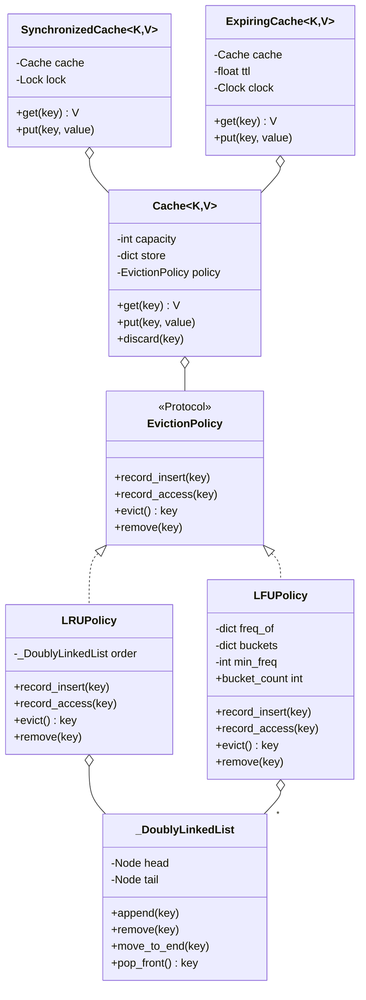

# 设计题解：LRU / LFU 缓存（LRU / LFU Cache）

## 题目与澄清

面试官通常这样开场："设计一个固定容量的缓存，支持 `get(key)` 和 `put(key, value)`，两者都要
O(1)。容量满了之后，按最近最少使用（Least Recently Used，LRU）淘汰。" 这句话看起来简单，但
O(1) 三个字母已经把可选的数据结构锁死了——值得在动笔之前问清楚以下几件事，每一件都会改变设计：

- **key 和 value 的类型是什么？** 如果 key 不保证可哈希（hashable），整个"哈希表 + 链表"的方案
  就无从谈起。答案通常是"key 是可哈希的任意类型"，但说出这句澄清能让面试官相信你知道
  为什么——这正是 [[python.data-model|数据模型与特殊方法（Data Model）]] 里相等与哈希的契约在起作用：
  只有遵守"相等的对象哈希值必须相等"这条契约的 key，才能被安全地放进哈希表当键。
- **`get` 未命中怎么办？** LeetCode 原题的答案是返回 `-1`，这是 Java/C++ 时代"没有异常也能表示
  失败"的遗留写法。Python 里 `dict[missing_key]` 会抛 `KeyError`，是否要跟 `dict` 的语义保持一致，
  是本题第一个值得明确澄清、也决定后续所有测试写法的问题。
- **淘汰规则只有 LRU 一种，还是要支持切换？** 如果面试官说"我们可能之后要求 LFU"，那么"淘汰规则"
  就不能写死在缓存类内部，必须一开始就设计成可替换的一等公民，而不是等第二关来了再回头重构。
- **是否要求线程安全？** 这决定了要不要在第一关就为"每个复合操作都要整体加锁"留出扩展点——
  好消息是，只要缓存的核心逻辑不直接依赖全局状态，线程安全可以整个作为一层包装后加，不需要提前
  为它牺牲第一关的简洁。
- **是否需要过期时间（TTL）？** 这决定了缓存要不要在容量淘汰之外，再维护一份"什么时候该消失"
  的账本。

**范围之外**：按字节数（而不是条目数）计算容量、分布式/多进程共享缓存、持久化到磁盘、
写穿透（write-through）到后端存储——这些都是四关之外常见的追问，第七节会讨论怎么答，
但不会出现在核心实现里。

## 需求与分级

一场机器编码轮不会一次性把需求摊开，而是分阶段揭示，考察的正是"新需求来了，旧代码要不要动"。

**第 1 关（核心流程）**：固定容量的缓存，`get`/`put` 均为 O(1)，容量满时按 LRU 淘汰最久未使用的
key；覆盖写入已有 key 不算淘汰；容量必须是正整数。这一关要看到候选人**亲手**写出哈希表配双向
链表的结构，而不是一句 `collections.OrderedDict` 带过——面试官想确认你知道链表内部在做什么。

**第 2 关（策略可插拔）**："现在要支持 LFU（最不经常使用）呢？" 这一关考察的不是"会不会写 LFU"，
而是"改 LFU 要不要动 `Cache` 类"。如果答案是"要"，说明第一关的设计把"存储"和"淘汰顺序"耦合在了
一起，是要扣分的。

**第 3 关（线程安全）**："多个线程同时调用 `get`/`put` 会怎样？" 这一关考察对复合操作、GIL 的边界、
以及"读写锁在这里有没有用"这三件事有没有讲清楚。

**第 4 关（选做，通常是 TTL 或命中率统计）**："能不能给每个 key 单独设置存活时间？" 或者
"能不能报告命中率？" 这一关考察新需求能不能作为**外层一层**加上去，而不用回头修改前三关已经
写好、已经测试过的类。

## 核心对象与职责

| 类 | 单一职责 | 它拥有的不变量 |
|---|---|---|
| `_Node` | 双向链表里的一个位置，只存 key | 只在 `_DoublyLinkedList` 内部被创建和访问 |
| `_DoublyLinkedList` | 维护一组 key 的先后顺序，O(1) 的插入/删除/移动/弹出 | 头尾哨兵节点永远存在，非空链表的每个真实节点两侧都有邻居 |
| `EvictionPolicy`（`Protocol`） | 定义"淘汰规则"这一角色需要哪几个方法 | 不持有任何数据，纯接口 |
| `LRUPolicy` | 按最近使用顺序选出淘汰者 | 一条 `_DoublyLinkedList`，尾部最新、头部最旧 |
| `LFUPolicy` | 按访问频率选出淘汰者，频率相同再按最近使用 | `_min_freq` 始终等于当前非空桶里最小的频率 |
| `Cache` | key→value 的存储与容量上限，把"淘汰谁"完全委托给策略 | `len(self._store) <= self._capacity` 恒成立 |
| `SynchronizedCache` | 给任意 `Cache` 包一层锁 | 同一时刻只有一个线程在改写内部结构 |
| `ExpiringCache` | 给任意 `Cache` 包一层按 key 的存活时间 | 已过期的 key 一旦被 `get`/`in` 探测到就会被清除 |

`Cache` 和 `EvictionPolicy` 是组合（composition）关系：`Cache` 拥有一个策略实例，策略的生命周期
完全跟随 `Cache`，外部拿不到、也不需要拿到策略对象单独使用。`SynchronizedCache` 和
`ExpiringCache` 则是对 `Cache` 的**包装**而不是继承——它们各自持有一个 `Cache` 实例并转发调用，
这是 [[structure.api|进程内 API 设计]] 里"组合优于继承"的直接应用：线程安全和 TTL 都不是
"缓存的一种"，而是"缓存的一层能力"，包装比继承更诚实地表达了这层关系。



## 关键设计决策

### 决策一：`EvictionPolicy` 该是 `Protocol` 还是 `ABC`？——这里选了更轻的那个

两个真实选项：`abc.ABC` 定义一个抽象基类，`LRUPolicy`/`LFUPolicy` 显式 `class LRUPolicy(EvictionPolicy)`
继承它；或者用 `typing.Protocol` 只声明"需要这几个方法"，`LRUPolicy`/`LFUPolicy` 不用声明继承关系，
只要方法签名对得上就自动满足接口（结构化子类型，structural subtyping）。

选择了 `Protocol`。理由很直接：`EvictionPolicy` 不需要提供任何共享的默认实现——它纯粹是一份
"契约清单"。`ABC` 的价值在于能放共享逻辑、或者要用 `isinstance()` 在运行时严格校验类型；这里都
用不上，`LRUPolicy` 和 `LFUPolicy` 之间没有任何值得共享的代码，用 `ABC` 反而多一层"必须显式继承"
的耦合——测试代码想写一个假策略（比如永远淘汰某个固定 key）时，`Protocol` 允许它完全不知道
`EvictionPolicy` 这个类的存在，只要方法签名对上就能直接传给 `Cache`。这是一个"鸭子类型"
胜过"名义子类型"的例子：调用方（`Cache`）只关心"能不能调用这四个方法"，不关心"是不是这个类的
后代"。

### 决策二：`Cache` 只做存储和容量，淘汰规则整体委托——这是全篇唯一的策略模式（Strategy）

第一关如果把 LRU 的链表操作直接写进 `Cache.get`/`Cache.put`，第二关来了 LFU 需求就得把这两个方法
整个重写一遍，还要小心不要改坏 LRU（因为很多机考现场没有版本控制，改坏了就是改坏了）。真正的
问题是"淘汰谁"这个决策点，和"key 对应的 value 是什么"这个存储职责，其实是两件完全独立的事——
`Cache` 只需要知道"我需要腾出一个位置时该问谁"，不需要知道"谁"具体怎么想。

于是 `EvictionPolicy` 承担了策略模式（Strategy）里"可替换算法"的角色：`Cache.__init__` 接受一个
`policy` 参数，默认是 `LRUPolicy()`；`Cache.get`/`Cache.put` 只调用 `policy.record_access`/
`record_insert`/`evict`，从不关心背后是链表还是频率桶。加 LFU 时，新写一个 `LFUPolicy`
类，`Cache` 的代码一行都不改——这正是第二关要验证的东西，也是测试
`test_policy_is_pluggable_without_changing_cache_class` 直接断言的事实。

### 决策三：`__contains__` 是纯粹的探测，不算一次"使用"——这里拒绝了一个诱人但错误的设计

自然的写法是"只要用户以任何方式接触过这个 key，就算一次使用，值得保留"，包括 `key in cache`。
但仔细想会发现这站不住脚：`in` 表达的是"我想知道它在不在"，是一次**只读的探测**，不是"我要用它"。
如果连 `in` 都推迟淘汰，会带来一个隐蔽的 bug——只是为了打日志、写监控而做一次
`if key in cache: log(...)` 的调用方，会在不知情的情况下悄悄改变缓存的淘汰顺序，这种"观测改变了
被观测对象状态"的副作用在真实系统里排查起来非常痛苦。所以这里的选择是：`__contains__` 只查
`self._store`，不调用 `policy.record_access`；只有真正取值的 `get`（以及触发覆盖写的 `put`）才算
一次使用。测试 `test_contains_does_not_affect_recency` 把这条决策钉死成了一个可执行的断言，而不是
一句注释里的承诺。

### 决策四：线程安全不是给 `Cache` 加锁，而是包一层 `SynchronizedCache`——组合优于继承，也优于"到处加锁"

第三关来了之后，最常见的错误答案是直接在 `Cache.get`/`Cache.put` 里塞 `with self._lock:`。这样做
的问题是：`Cache` 从此永远带着锁的开销，哪怕调用方从来不是多线程场景（比如单线程的批处理脚本），
也要付出加锁/解锁的成本；而且要不要线程安全,变成了一个只能在写 `Cache` 的时候一次性决定、之后
改不了的选择。

更干净的做法是把锁做成一层独立的包装：`SynchronizedCache` 持有一个 `Cache` 实例，`get`/`put`/
`discard`/`__len__`/`__contains__` 全部转发，只是在转发前后加一把 `threading.Lock`。单线程场景
直接用 `Cache`，零锁开销；多线程场景用 `SynchronizedCache(Cache(...))` 包一层，`Cache` 内部的
代码不知道、也不需要知道自己被包了一层锁。

这里还有一个容易被忽视的点，值得单独说清楚：**`get` 在这个设计里也是一次"写"**。原因是
`get` 内部调用了 `policy.record_access`，这会改写 `_DoublyLinkedList` 的指针（LRU）或者频率桶
（LFU）——对底层数据结构而言，"读一个值"和"把它挪到链表尾部"是同一次操作里绑在一起的两件事，
分不开。这意味着**读写锁（reader-writer lock）在这里完全帮不上忙**：读写锁的价值在于"多个读者
可以同时进行，只有写者需要互斥"，但这里根本没有"纯读者"——每一次 `get` 都要独占地改写内部结构，
跟 `put` 没有本质区别，硬要引入读写锁只会多一层管理读写锁本身的开销，换不来任何并发度的提升。
这也是本文唯一一处"更复杂的方案被认真考虑过，然后被有理由地拒绝"的决策，呼应
[[structure.api|进程内 API 设计]] 里"方法契约要对调用方诚实"的要求——`SynchronizedCache.get`
必须让调用方知道它不是一个无副作用的读操作。

真正能提升并发度的手段是**锁分片（lock striping / sharding）**：把 key 按哈希分到 N 个独立的
`Cache` + 独立的锁里，`get`/`put` 先用 `hash(key) % N` 选中对应的分片，只锁那一个分片。代价是
"总容量"变成了"N 个分片容量之和"，某个分片可能因为 key 分布不均而先满，淘汰的是**分片内**最久
未用的 key，而不是全局意义上最久未用的 key——这是拿"全局精确的 LRU 顺序"换"并发吞吐"，第七节
会再展开这笔交易。

### 决策五：`LFUPolicy` 的频率桶按需创建、按需销毁——`_min_freq` 是"当前非空桶里最小的那个"，不是"曾经见过的最小值"

一个天真的实现会让 `_buckets` 只增不减：每碰到一个新频率就 `setdefault` 一个新桶，之后从不删除
已经搬空的桶。对一个缓存组件而言这是致命的——如果某个 key 被反复读取一百万次，它的频率会一路
爬到一百万，沿途留下的不是一个桶，而是近一百万个已经空了、却仍然占着内存的 `_DoublyLinkedList`
对象（每个还带着两个哨兵节点和一个 `dict`）。缓存存在的意义就是"有界内存"，一个会随访问次数无界
增长内存占用的缓存实现，比没有缓存更糟。

修法是让"桶"和"这个频率下确实还有 key"这两件事保持同步：任何一次从桶里摘除 key 之后（`record_access`
挪走旧频率的 key、`remove` 主动删除、`evict` 弹出受害者），一旦发现桶被搬空，立刻把它从 `_buckets`
里删掉。真正的难点在于删掉的如果恰好是 `_min_freq` 指向的桶，`_min_freq` 就不能停留在一个已经不
存在的频率上——这里选择直接 `min(self._buckets, default=0)` 重新算一次。这一步不是 O(1)，是
O(现存不同频率的个数)，但只在"某个桶恰好被搬空"这个相对少见的时刻才触发，日常的 `record_access`/
`evict` 仍然是摊销 O(1)；而且这正是修好了本文最初版本遗留的一个问题——旧版本把"`_min_freq` 只在
`record_insert` 时重置为 1"当成唯一的修复手段，代价是 `evict()` 不能连续调用两次而不插入新 key，
否则会在空桶上 `pop_front()` 抛 `IndexError`。现在 `evict()`、`remove()`、`record_access()` 三处
都会在桶变空时自己修好 `_min_freq`，`bucket_count` 属性（等于 `len(self._buckets)`）把"只保留非空
桶"这条不变量暴露成一个可以直接在测试里断言的公开状态，而不是只存在于注释里的承诺。

## 代码走读

下面是完整的参考实现（Python 3.12，仅标准库），与本文其余部分描述的类和方法一一对应；
`test_lru_cache.py` 对每一处行为都有对应的断言。

%% code:begin solution.py %%
```python
"""LRU / LFU 缓存：固定容量、O(1) 的 get/put。
设计：`Cache` 只管"key -> value"的存储与容量上限，把"淘汰哪个 key"整体委托给一个
可替换的 `EvictionPolicy`（LRU 与 LFU 各是一种实现，内部都基于手写的双向链表）。
线程安全与过期时间（TTL）各自是一层包装（装饰器），不改动 `Cache` 或策略的代码。
"""

from __future__ import annotations

import threading
import time
from collections.abc import Hashable
from typing import Callable, Generic, Protocol, TypeVar

K = TypeVar("K", bound=Hashable)
V = TypeVar("V")

Clock = Callable[[], float]


class _Node(Generic[K]):
    """双向链表节点，只存 key——值另外存在 `Cache._store` 里，链表只负责顺序。"""

    __slots__ = ("key", "prev", "next")

    def __init__(self, key: K | None = None) -> None:
        self.key = key
        self.prev: _Node[K] | None = None
        self.next: _Node[K] | None = None


class _DoublyLinkedList(Generic[K]):
    """带头尾哨兵节点的双向链表：append/remove/move_to_end/pop_front 都是 O(1)。

    这是 LRU 与 LFU 共用的底层积木——LRU 只用一条这样的链表；LFU 给每个频率各配一条。
    """

    def __init__(self) -> None:
        self._head: _Node[K] = _Node()
        self._tail: _Node[K] = _Node()
        self._head.next = self._tail
        self._tail.prev = self._head
        self._nodes: dict[K, _Node[K]] = {}

    def __len__(self) -> int:
        return len(self._nodes)

    def __contains__(self, key: K) -> bool:
        return key in self._nodes

    def append(self, key: K) -> None:
        """把 key 插到尾部（最近使用的一端）。key 必须尚不在链表里。"""
        node = _Node(key)
        last = self._tail.prev
        assert last is not None
        last.next = node
        node.prev = last
        node.next = self._tail
        self._tail.prev = node
        self._nodes[key] = node

    def remove(self, key: K) -> None:
        node = self._nodes.pop(key)
        prev, nxt = node.prev, node.next
        assert prev is not None and nxt is not None
        prev.next = nxt
        nxt.prev = prev

    def move_to_end(self, key: K) -> None:
        """把已经在链表里的 key 挪到尾部——用于"标记为最近使用"。"""
        self.remove(key)
        self.append(key)

    def pop_front(self) -> K:
        """弹出并返回头部（最久未使用的一端）的 key。链表为空时抛 IndexError。"""
        node = self._head.next
        assert node is not None
        if node is self._tail:
            raise IndexError("pop_front from an empty list")
        self.remove(node.key)  # type: ignore[arg-type]
        return node.key  # type: ignore[return-value]


class EvictionPolicy(Protocol[K]):
    """淘汰策略的接口：`Cache` 只依赖这四个方法，不关心策略内部怎么记账。"""

    def record_insert(self, key: K) -> None:
        """记录一个新 key 被插入。"""
        ...

    def record_access(self, key: K) -> None:
        """记录一个已存在的 key 被访问（get 命中，或 put 更新了已有的 key）。"""
        ...

    def evict(self) -> K:
        """选出并移除一个受害者 key，返回它。调用前必须保证策略非空。"""
        ...

    def remove(self, key: K) -> None:
        """显式移除一个 key（不是通过淘汰——比如 TTL 层主动删除过期项）。"""
        ...

    def __len__(self) -> int:
        ...


class LRUPolicy(Generic[K]):
    """最近最少使用：一条双向链表，头部最旧、尾部最新，get/put 都把 key 挪到尾部。"""

    def __init__(self) -> None:
        self._order: _DoublyLinkedList[K] = _DoublyLinkedList()

    def record_insert(self, key: K) -> None:
        self._order.append(key)

    def record_access(self, key: K) -> None:
        self._order.move_to_end(key)

    def evict(self) -> K:
        return self._order.pop_front()

    def remove(self, key: K) -> None:
        self._order.remove(key)

    def __len__(self) -> int:
        return len(self._order)


class LFUPolicy(Generic[K]):
    """最不经常使用：频率 -> 该频率下的双向链表（桶内部按 LRU 排序，同频率淘汰最久未用的）。

    不变量：`_min_freq` 是当前非空桶中最小的那个频率，策略为空时为 0；`_buckets` 中只保留
    非空的桶——一个桶被搬空的瞬间就从字典里删除，绝不会常驻内存（否则一个被反复读的热 key
    会在自己身后留下成千上万个空链表对象）。`bucket_count` 把这条不变量暴露成一个可以在
    测试里断言的公开属性。
    """

    def __init__(self) -> None:
        self._freq_of: dict[K, int] = {}
        self._buckets: dict[int, _DoublyLinkedList[K]] = {}
        self._min_freq = 0

    @property
    def bucket_count(self) -> int:
        """当前存活（非空）的频率桶数量——只应等于当前有 key 存在的不同频率的个数。"""
        return len(self._buckets)

    def _detach(self, freq: int, key: K) -> None:
        """把 key 从它当前所在的桶里摘掉；桶因此变空时立刻删除该桶，并在它正是
        `_min_freq` 所在的桶时，把 `_min_freq` 重新算成"现存桶里最小的那个频率"。
        这里故意用 `self._buckets[freq]` 而不是 `setdefault`——摘除路径上桶必须已经
        存在，用 `setdefault` 只会把一个本不该有的空桶悄悄创建出来。
        """
        bucket = self._buckets[freq]
        bucket.remove(key)
        if len(bucket) == 0:
            del self._buckets[freq]
            if freq == self._min_freq:
                self._min_freq = min(self._buckets, default=0)

    def record_insert(self, key: K) -> None:
        self._freq_of[key] = 1
        self._buckets.setdefault(1, _DoublyLinkedList()).append(key)
        self._min_freq = 1

    def record_access(self, key: K) -> None:
        freq = self._freq_of[key]
        self._detach(freq, key)
        self._freq_of[key] = freq + 1
        self._buckets.setdefault(freq + 1, _DoublyLinkedList()).append(key)

    def evict(self) -> K:
        bucket = self._buckets[self._min_freq]
        key = bucket.pop_front()
        del self._freq_of[key]
        if len(bucket) == 0:
            del self._buckets[self._min_freq]
            self._min_freq = min(self._buckets, default=0)
        return key

    def remove(self, key: K) -> None:
        freq = self._freq_of.pop(key)
        self._detach(freq, key)

    def __len__(self) -> int:
        return len(self._freq_of)


class Cache(Generic[K, V]):
    """固定容量的缓存：值存在 `dict` 里，淘汰顺序完全交给 `policy`。

    默认策略是 LRU——这是绝大多数场景的合理默认；传入 `LFUPolicy()` 就得到 LFU 缓存，
    `Cache` 本身一行都不用改，这正是"策略可插拔"要验证的地方。
    """

    def __init__(self, capacity: int, policy: EvictionPolicy[K] | None = None) -> None:
        if capacity <= 0:
            raise ValueError(f"capacity must be positive, got {capacity}")
        self._capacity = capacity
        self._policy: EvictionPolicy[K] = policy if policy is not None else LRUPolicy()
        self._store: dict[K, V] = {}

    @property
    def capacity(self) -> int:
        return self._capacity

    def __len__(self) -> int:
        return len(self._store)

    def __contains__(self, key: K) -> bool:
        """只探测是否存在，不算一次"使用"——否则连 `in` 都会改变淘汰顺序，太反直觉。"""
        return key in self._store

    def get(self, key: K) -> V:
        if key not in self._store:
            raise KeyError(key)
        self._policy.record_access(key)
        return self._store[key]

    def put(self, key: K, value: V) -> None:
        if key in self._store:
            self._store[key] = value
            self._policy.record_access(key)
            return
        if len(self._store) >= self._capacity:
            victim = self._policy.evict()
            del self._store[victim]
        self._store[key] = value
        self._policy.record_insert(key)

    def discard(self, key: K) -> None:
        """主动移除一个 key（不算淘汰）。key 不存在时抛 KeyError，语义对齐 dict 的 `del`。"""
        if key not in self._store:
            raise KeyError(key)
        del self._store[key]
        self._policy.remove(key)

    def __getitem__(self, key: K) -> V:
        return self.get(key)

    def __setitem__(self, key: K, value: V) -> None:
        self.put(key, value)

    def __delitem__(self, key: K) -> None:
        self.discard(key)

    def __repr__(self) -> str:
        return f"{type(self).__name__}(capacity={self._capacity}, size={len(self._store)})"


class SynchronizedCache(Generic[K, V]):
    """给任意 `Cache` 包一层锁，不改动 `Cache` 或策略的任何代码。

    注意 `get` 在这里也要拿写锁：它会调用 `policy.record_access`，改写内部的链表/频率桶，
    所以对这个缓存而言 get 是一次"写"。读写锁在这里帮不上忙——几乎所有操作都要写内部结构，
    区分"读者"和"写者"没有意义，只会多一层管理读写锁本身的开销。
    """

    def __init__(self, cache: Cache[K, V]) -> None:
        self._cache = cache
        self._lock = threading.Lock()

    @property
    def capacity(self) -> int:
        return self._cache.capacity

    def get(self, key: K) -> V:
        with self._lock:
            return self._cache.get(key)

    def put(self, key: K, value: V) -> None:
        with self._lock:
            self._cache.put(key, value)

    def discard(self, key: K) -> None:
        with self._lock:
            self._cache.discard(key)

    def __len__(self) -> int:
        with self._lock:
            return len(self._cache)

    def __contains__(self, key: K) -> bool:
        with self._lock:
            return key in self._cache


class ExpiringCache(Generic[K, V]):
    """给任意 `Cache` 包一层按 key 的存活时间（TTL），时钟从外部注入以便测试可控可重放。

    每个 key 的过期时间单独存放在这一层（`_expires_at`），`Cache` 和 `EvictionPolicy`
    对 TTL 一无所知——过期只是"读到时发现太旧就当作不存在，并顺手删掉"。
    """

    def __init__(self, cache: Cache[K, V], ttl_seconds: float, clock: Clock = time.monotonic) -> None:
        if ttl_seconds <= 0:
            raise ValueError(f"ttl_seconds must be positive, got {ttl_seconds}")
        self._cache = cache
        self._ttl = ttl_seconds
        self._clock = clock
        self._expires_at: dict[K, float] = {}

    def _is_expired(self, key: K) -> bool:
        deadline = self._expires_at.get(key)
        return deadline is not None and self._clock() >= deadline

    def _expire_now(self, key: K) -> None:
        self._cache.discard(key)
        del self._expires_at[key]

    def get(self, key: K) -> V:
        if key in self._cache and self._is_expired(key):
            self._expire_now(key)
        return self._cache.get(key)

    def put(self, key: K, value: V) -> None:
        self._cache.put(key, value)
        self._expires_at[key] = self._clock() + self._ttl

    def __len__(self) -> int:
        return len(self._cache)

    def __contains__(self, key: K) -> bool:
        return key in self._cache and not self._is_expired(key)


def _demo() -> None:
    cache: Cache[str, int] = Cache(capacity=2)
    cache.put("a", 1)
    cache.put("b", 2)
    cache.get("a")          # a 变为最近使用
    cache.put("c", 3)       # 容量已满，淘汰最久未用的 b
    print("lru 剩余:", dict(sorted(((k, cache[k]) for k in ("a", "c")))))

    lfu: Cache[str, int] = Cache(capacity=2, policy=LFUPolicy())
    lfu.put("x", 1)
    lfu.put("y", 2)
    lfu.get("x")
    lfu.get("x")
    lfu.put("z", 3)         # y 的频率最低，被淘汰
    print("lfu 剩余:", "y" in lfu, "x" in lfu, "z" in lfu)


if __name__ == "__main__":
    _demo()
```
%% code:end %%

几处代码和前面决策的对应关系：

- `_DoublyLinkedList` 的构造函数里，`_head`/`_tail` 两个哨兵节点从一开始就互相连接，
  之后 `append`/`remove`/`move_to_end` 里再也没有出现过"如果这是第一个节点"或者
  "如果这是最后一个节点"这类特判——这就是决策讨论之外、哨兵节点带来的直接收益：**每一次**
  链表操作都可以假设"当前节点的前后一定各有一个节点"，把原本要写的边界分支全部消掉了。
- `LFUPolicy._detach` 是 `record_access`、`remove`、`evict` 三处共用的"从桶里摘除一个 key"逻辑：
  摘除之后如果桶变空就立刻从 `_buckets` 里删掉，且只有在被删的桶恰好是 `_min_freq` 所在的桶时才
  重新计算 `_min_freq`——这是决策五里"桶按需创建、按需销毁"的落地代码，三处调用点因此不需要各自
  重复一遍"要不要推进 `min_freq`"的判断。
- `Cache.put` 里"key 已存在"和"key 不存在"两条分支分别对应决策三里"覆盖写入不算淘汰"：
  前者只调用 `policy.record_access`，不会让 `len(self._store)` 超过 `self._capacity`
  的判断被触发,后者才会检查容量并可能调用 `policy.evict()`。
- `SynchronizedCache` 里除了 `__init__`，每个方法体都只有一行 `with self._lock:` 加一次
  对 `self._cache` 对应方法的转发——这是决策四"包一层而不是改 `Cache`"的直接体现,
  `SynchronizedCache` 本身不包含任何缓存逻辑。

## 测试与自检

`test_lru_cache.py` 的 24 个测试分四组，对应四关：

- **第 1 关**：容量非正抛 `ValueError`；`get`/`put` 基本往返；未命中抛 `KeyError`；
  覆盖写入不淘汰；淘汰顺序正确；`get` 会更新最近使用；`__contains__` 不更新最近使用；
  `__len__`、`__getitem__`/`__setitem__`/`__delitem__`、`discard` 各自独立断言；
  任意可哈希 key（这里特意用了元组当 key）验证泛型不是摆设。
- **第 2 关**：LFU 按频率淘汰；同频率按最近使用打破平局；同一个 `Cache` 类换一个 `policy`
  参数就能在 LRU/LFU 之间切换,不需要两个不同的缓存类。另外五个测试直接对着 `LFUPolicy`
  断言决策五里的不变量：`bucket_count` 等于当前不同活跃频率的个数；一个 key 被反复访问一千次
  不会留下一千个空桶；连续 `evict()` 到策略清空为止,顺序符合"先按频率、再按最近使用"；两次
  `evict()` 中间不插入新 key、且第一次恰好掏空 `_min_freq` 所在的桶时不会抛异常；`remove()`
  删掉最小频率桶里唯一的 key 之后,`_min_freq` 会被正确重算,后续 `evict()` 不会指向一个已经
  不存在的频率。
- **第 3 关**：真实线程 + `threading.Barrier` 让所有线程同时起跑,断言两条不变量——
  并发写入下 `len(cache)` 永远不超过 `capacity`；当容量足够容纳所有线程各自的 key 时,
  没有任何一条写入丢失（16 个线程各写一个不同的 key,之后全部能读回原值）。这两条都是
  对状态的断言,不依赖 `sleep` 或者时间窗口,所以在任何机器上都是确定性的。
- **第 4 关**：注入的假时钟（`ManualClock`）代替真实的 `time.sleep`——`advance(dt)` 直接
  把时钟拨快,过期前能读到值,过期后 `get` 抛 `KeyError` 且 `__contains__` 为假,重新 `put`
  会把 TTL 从当次写入重新计时。

给面试官的两分钟演示：跑一遍 `solution.py` 底部的 `_demo()`,展示同一段访问模式在 LRU 和 LFU
下的不同结果——`a` 被多次 `get` 之后,LRU 因为它"最近被用过"而保留它,LFU 因为它的频率最高
也保留它,但保留的理由不一样。这个对比本身就说明了"淘汰策略是可替换的一等公民"这条设计主张。

## 扩展与追问

**新需求**

- **容量按字节而不是条目数计算**：`Cache` 现在的 `len(self._store) >= self._capacity` 判断要
  改成"当前占用字节数 >= 容量字节数",`EvictionPolicy.evict()` 也可能要连续调用多次才能腾出
  足够空间——这是唯一一处会真正触碰 `Cache.put` 内部逻辑的常见追问,值得提前说清楚代价。这个
  追问也是决策五里"`_min_freq` 自己维护、不依赖 `record_insert` 兜底"的价值所在：`LFUPolicy`
  的 `evict()` 在任何调用顺序下都会在桶变空时自己重算 `_min_freq`,连续 `evict()` 多次腾出多个
  位置、最后才调用一次 `record_insert` 插入新 key,不需要额外改动策略类的任何一行。
- **命中率统计**：加一个 `InstrumentedCache`,和 `SynchronizedCache`/`ExpiringCache` 同一种
  包装模式,内部维护 `hits`/`misses` 计数器,`get` 命中或未命中各自加一。不需要碰
  `Cache`、`LRUPolicy`、`LFUPolicy` 里的任何一行代码——这正是本题设计要证明的可扩展性。

**并发与线程安全**

- **锁分片（lock striping）**：如决策四所述,把 key 按哈希路由到 N 个独立加锁的 `Cache`
  分片,提升并发吞吐,代价是淘汰顺序从"全局 LRU"退化成"分片内 LRU"。追问"多大的 N 合适"时,
  诚实的答案是"看 key 的分布和锁竞争的实测数据,不是猜出来的"。
- **无锁（lock-free）实现**：用原子操作和 CAS（compare-and-swap）重写双向链表的指针操作,
  理论上可行,工程上极少有人在生产环境这么做——这是一个"说明白代价、然后主动拒绝"的
  好答案,强行现场设计一个无锁链表反而会暴露没有想清楚正确性的漏洞。
- **GIL 帮了什么忙、没帮什么忙**：CPython 的 GIL 保证了单条字节码级别的操作(比如
  `dict.__getitem__`)是原子的,但保证不了"读取旧频率、判断是否要推进 min_freq、写回新频率"
  这样一串由多条语句组成的复合操作的原子性——这正是 `LFUPolicy.record_access`
  里那三行必须整体加锁的原因,和 [[structure.api|进程内 API 设计]] 的姊妹卡片
  `structure-storage-chm-compound-ops` 讲的"`dict` 加锁也可能丢更新"是同一类问题的两个实例。

**持久化与规模**

- **写穿透到后端存储**：`put` 是否要等后端写入成功才返回？如果后端写入失败,内存里的
  这一份要不要回滚？这会把 `Cache` 从一个纯内存结构变成分布式系统里的一个组件,超出了本题
  "进程内组件"的范围,值得说清楚边界,而不是现场展开设计。
- **多进程/多机共享**：单进程内的 `threading.Lock` 完全无法跨进程生效,真正的分布式缓存
  (比如 Redis)需要网络往返和不同的一致性模型,这也是应该明确说"这是另一道题"的地方。

## 常见错误

- **`get` 未命中返回 `None`/`-1` 而不是抛异常**：这是 LeetCode 原题"返回 -1"的直接搬运,
  在 Python 里是反模式——`-1` 有可能恰好是一个合法的 value,调用方没有办法区分"存的就是 -1"
  和"根本没有这个 key"。`dict` 的做法(`__getitem__` 抛 `KeyError`,`.get()` 才允许给默认值)
  才是本题该学的先例。
- **把"覆盖写入已有 key"当成插入处理**:如果 `put` 不区分"key 已存在"和"key 不存在"两条分支,
  统一按"可能需要淘汰"处理,会在写密集的场景下把缓存悄悄"吃空"——每次更新一个已有 key
  都误判成插入,触发不必要的淘汰,过一段时间后缓存里全是最近几次更新的 key,更早、原本还该
  留着的条目全被冤枉地淘汰了。
- **用 `synchronized`/"整个类加一把锁然后到处 `synchronized` 方法"的 Java 思维**:Python
  没有方法级别的内置锁修饰符,`threading.Lock` 要显式声明、显式在每个复合操作里
  `with self._lock:` 包起来；更容易犯的错是"只给 `put` 加锁,`get` 以为只是读所以不用加"——
  正是决策四强调的"`get` 在这里也是写"。
- **链表操作里遗漏"更新 `min_freq`"或者顺序搞反**:LFU 最容易出 bug 的地方不是"淘汰哪个 key",
  而是"什么时候该把 `min_freq` 加一"——只有在被移出的桶恰好是当前 `min_freq` 指向的桶、
  且移出后这个桶变空了,才需要推进指针；随手在每次 `record_access` 里都 `min_freq += 1`
  是最常见的手滑。
- **LFU 的空桶不回收**:用 `dict.setdefault(freq, ...)` 建桶很自然,但如果桶变空之后不主动
  从 `_buckets` 里删掉,一个被反复读取的热 key 会在自己身后留下随频率增长、数量无上限的空
  `_DoublyLinkedList` 对象——对一个"有界内存"是存在意义的组件来说,这是比逻辑错误更容易被
  忽视、却更致命的问题,因为它不会让任何一个测试断言失败,只会让进程的内存占用在长期运行后
  悄悄涨上去。见决策五。
- **用 `time.time()` 而不是注入的时钟**:直接在 `ExpiringCache` 内部调 `time.time()`,
  会导致 TTL 相关的测试要么靠 `sleep()` 拖慢整个测试套件,要么因为机器负载偶尔抖动而
  变成不确定的“时灵时不灵”的测试——这也是 `Cache`/`ExpiringCache` 全篇没有出现一次
  裸的 `time.time()` 调用的原因。

## 45 分钟怎么分配

- **0–5 分钟,澄清**:把"题目与澄清"一节里的几条问清楚,尤其是"`get` 未命中怎么办""是否要支持
  切换淘汰策略""是否要线程安全"——这几句话决定了接下来 40 分钟往哪个方向写。开口说
  "我会先写单线程版本,淘汰策略做成可替换的,线程安全和 TTL 作为后续的包装类加"，
  提前把整体骨架告诉面试官。
- **5–10 分钟,画核心对象和类图**：口头或者在白板上画出 `Cache`/`EvictionPolicy`/
  `LRUPolicy`/`_DoublyLinkedList` 这四个类的关系,说清楚"存储"和"淘汰顺序"是两个职责。
- **10–25 分钟,写第一关**:先写 `_DoublyLinkedList`(带哨兵节点),再写 `LRUPolicy`,
  最后写 `Cache.get`/`put`。边写边说"这里为什么要哨兵节点""为什么覆盖写入不能走淘汰分支"。
- **25–30 分钟,补测试**:至少手写 3–4 个断言(基本往返、淘汰顺序、覆盖不淘汰),
  跑一遍确认通过,现场测试比事后口头保证更有说服力。
- **30–40 分钟,做第二关或第三关**(面试官会指定):如果是 LFU,新写一个 `LFUPolicy`,
  强调"`Cache` 一行没改";如果是线程安全,写 `SynchronizedCache`,强调"`get` 也要加锁"
  以及为什么读写锁没用。
- **40–45 分钟,收尾**:如果时间不够,口头说明 TTL/统计怎么做而不必现场写完整实现——
  说清楚"这会是又一层包装,` Cache` 和策略类都不用动"比强行在剩下 5 分钟里写出 bug
  更能说明设计是对的。时间紧张时,第一个可以牺牲的是 `__getitem__`/`__setitem__`
  这类语法糖,`get`/`put` 才是硬指标。

## 来源与延伸

- [lld-python — lru-cache](https://github.com/abhaypaswan/lld-python/tree/main/problems/lru-cache)：
  唯一原生 Python、带 pytest 套件的自由实现,策略接口、依赖注入的时钟、FIFO/LRU/LFU
  三种可插拔策略都和本文同方向;它用 `abc.ABC` 定义策略基类、把命中率统计直接放进
  `Cache`,本文选了更轻的 `Protocol` 并把统计留给读者练习,理由见"关键设计决策"。
- [system-design-primer — object_oriented_design/lru_cache](https://github.com/donnemartin/system-design-primer/tree/master/solutions/object_oriented_design/lru_cache)：
  Python 骨架,链表方法都是待实现的 `pass`,没有哨兵节点,`remove_from_tail`
  需要单独判断空链表——本文用头尾哨兵消掉了这类边界判断。
- [awesome-low-level-design — lru-cache](https://github.com/ashishps1/awesome-low-level-design/blob/main/problems/lru-cache.md)：
  五语言实现索引,Java 版本用 `synchronized` 关键字直接修饰 `get`/`put`,是"扩展与追问"
  部分要对照也要拒绝的 Java 式并发答案;`get` 未命中返回 `null`/`-1`,也是本文
  选择 `KeyError` 语义时要论证的对比对象。
