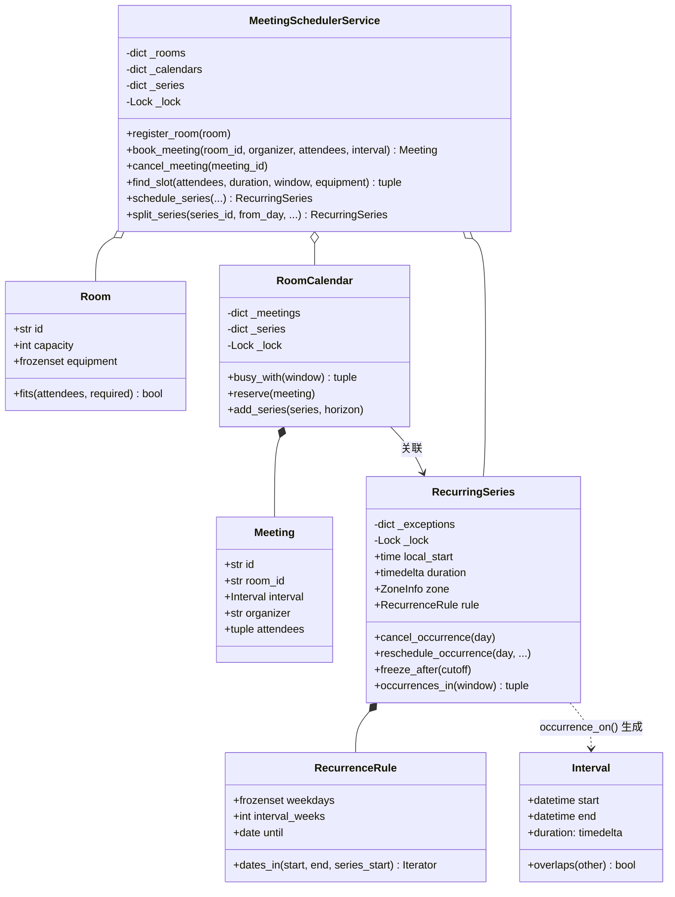

# 设计题解：会议室预订（Meeting Scheduler）

## 题目与澄清

面试官的开场："设计一个公司内部的会议室预订系统。房间有容量和设备，员工订一段时间，冲突要被
拒绝；能不能帮一组人自动找一个大家都有空的时间；会议可以是每周重复的；员工分布在不同时区。"

这道题和[[solution-hotel-booking|设计题解：酒店预订（Hotel Booking）]]、
[[solution-airline|设计题解：航班管理（Airline Management）]]是同一条"有限资源不能卖两次"的
主线，但资源的粒度更细（按分钟而不是按晚）、查询的方向也翻了过来——酒店和航班都是"给定资源问
还有没有"，这道题第 2 关要反过来"给定一组人，问什么时候大家都有空"。存储这部分要用到
[[structure.storage|内存持久化（In-Memory Persistence）]]的取舍：查询窗口是有限的，规则不能
提前物化成一张无限长的表。

值得当场问出来的澄清：

- **一段占用怎么界定边界？** `10:00–11:00` 和 `11:00–12:00` 算不算冲突？这是全题第一个问题，
  答案是**半开区间** `[start, end)`——下面"关键设计决策"第一节专门论证它。
- **"找空档"是给定房间问还是给定人问？** 两者都要支持：给定房间是"这间房这段时间空不空"，
  给定一组人是"这些人什么时候都有空、还要配得到房"，后者是这道题真正的难点。
- **周期会议的每一次是不是完全一样？** 不是。真实场景里，某一次要临时取消、某一次要临时改时间，
  但规则本身（每周几、几点）不变——这要求把"规则"和"例外"分开存。
- **修改一条周期会议，改的是这一次，还是从此以后都变？** 两种编辑粒度都要支持，这是像 Google
  Calendar/Outlook 那样的真实产品都会问的一条追问，也是本题第 3 关的核心。
- **时区怎么处理？** 参会人分布在不同城市，一条"每周一 9 点"的站会存的到底是哪个 9 点？
  存一个固定的 UTC 时刻，还是存"当地 9 点 + 时区"？这条直接决定跨夏令时（DST）切换时会不会
  错位，第 4 关正面回答它。
- **取消要不要通知？** 通知机制（邮件、推送）本题不做，只保证取消之后房间立刻可以被别人订走。

**范围之外**：不接真实的邮件/推送通知、不做房间的实时占用传感器、不做多组织的权限隔离、不做
真实持久化。参会人的"忙闲"只来自这个系统里登记过的会议，不接外部日历同步。

## 需求与分级

- **第 1 关（核心流程，约 20 分钟）**：房间的容量与设备、半开区间表示的一次性会议、订会议时
  冲突检测并拒绝。对应 `Room`、`Interval`、`Meeting`、`RoomCalendar.reserve`。
- **第 2 关（找空档 + 配房，约 15 分钟）**：给一组与会人找一个都有空的时间段——把每个人的忙碌
  区间合并（区间合并算法），在查询窗口里找出足够长的空档；再从满足人数和设备的房间里选**最小**
  的那间。对应 `merge_intervals`、`free_gaps`、`MeetingSchedulerService.find_slot`。
- **第 3 关（周期会议，约 15 分钟）**：一条重复规则加一张按天记的例外表，只在被查询的窗口里
  展开成具体场次；"这一场"和"这一场及以后"是两种不同粒度的编辑。对应 `RecurrenceRule`、
  `RecurringSeries`、`MeetingSchedulerService.split_series`。
- **第 4 关（时区与并发，选做）**：周期会议存本地时间 + 时区，说清为什么固定 UTC 时刻跨夏令时
  会错位；取消会议或例外立刻释放房间；两个组织者并发抢同一间房的重叠时段只能有一个成功。对应
  `zoneinfo.ZoneInfo`、`RoomCalendar` 的锁、并发测试。

## 核心对象与职责

### 为什么"忙闲"状态只长在 `RoomCalendar` 上

`Room` 是一份不变的物理事实（容量、设备），`RoomCalendar` 才是"这间房现在被谁占着"的权威来源，
这和[[solution-airline|航班管理]]里"`Flight` 不变、`FlightInstance` 持有库存"是同一条拆分纪律：
不变的数据和随时间变化的状态生命周期不同，不该塞进同一个类。`RoomCalendar` 同时管两种忙碌来源
——一次性 `Meeting` 和挂在这间房上的 `RecurringSeries`——查询时把两者合并成同一份"忙碌区间"
视图，调用方不需要关心一段占用到底来自哪一种。

### 为什么"忙"要连着"谁在忙"一起交出去

`RoomCalendar.busy_with` 返回的不是一串裸的 `Interval`，而是 `(参与者集合, 区间)` 的元组。
这是为"给一组人找空档"这个需求专门设计的：找空档需要的是"这些人里任意一个忙的所有时间段"，
如果 `RoomCalendar` 只交出区间、不交出参与者，`MeetingSchedulerService` 就必须反过来去问"这段
占用是谁定的"，多一轮查询还容易和原始数据不同步。让忙碌区间自带"谁在忙"，是"一个事件带着它自己
的事实"这条纪律在只读查询上的体现。

### 职责表

| 类 | 单一职责 | 它守的不变量 |
|---|---|---|
| `Room` | 一间物理会议室的容量与设备 | 不可变 |
| `Interval` | 半开区间 `[start, end)` | `end > start` |
| `Meeting` | 一次性会议 | 存在即已确认 |
| `RecurrenceRule` | 按周几、隔几周重复，直到哪天 | 不持有任何具体日期的状态 |
| `RecurringSeries` | 一条周期规则 + 它自己的例外表 | 例外只影响它标注的那一天 |
| `RoomCalendar` | 一间房的全部占用（一次性 + 周期） | 任一时刻的占用互不重叠 |
| `MeetingSchedulerService` | 门面：房间目录、订会议、找空档配房、周期会议编辑 | 自己不持有任何占用状态 |

`MeetingSchedulerService` 持有房间目录和 `RoomCalendar` 的映射，这是**组合**：`RoomCalendar`
的生命周期完全由服务管理。`RecurringSeries` 记着自己的 `room_id`，这是**关联**：一条系列被哪间
房的日历引用是查询时才需要知道的事实，系列对象本身不持有对 `RoomCalendar` 的直接引用。



## 关键设计决策

### 决策一：为什么用半开区间，`10:00–11:00` 和 `11:00–12:00` 天生不冲突

**问题**：怎么界定"两段占用冲突"，才能让"前一场刚结束、后一场紧接着开始"这种最常见的情况不
被误判成冲突？

半开区间 `[start, end)` 把结束时刻排除在占用之外：`end` 只是"这段占用到此为止"的标记，那一刻
本身不属于这段占用。重叠判断因此只有一行：

```python
def overlaps(self, other: "Interval") -> bool:
    return self.start < other.end and other.start < self.end
```

代入 `10:00–11:00` 和 `11:00–12:00`：`10:00 < 12:00` 为真，但 `11:00 < 11:00` 为假——整个表达式
为假，两段不重叠，不需要任何 `-1` 分钟或者"如果两端相等就放行"的特判。如果用**闭区间**
`[start, end]`，11:00 这一刻会被两段会议同时声明占有，重叠判断就要么在这一刻上产生假阳性（后一场
订不进去），要么在代码里补一条"端点相等不算冲突"的特殊分支——这条分支只要漏掉一次，`10:00–11:00`
和 `11:00–12:00` 就会被错误地判成冲突，这是这道题最容易在边界测试里翻车的地方。半开区间不是
一个记号上的偏好，是**让最常见的场景（会议一场接一场）不需要特判就正确**的选择。

`merge_intervals` 里"端点相等也要合并"用的是同一条纪律，只是方向相反：两个人的忙碌区间正好首尾
相接（`10:00–11:00` 和 `11:00–12:00`）时，虽然它们本身不算重叠，但站在"这段时间被占用"的角度，
中间没有缝——必须合并成一段 `10:00–12:00`，否则找空档时会在两者之间凭空捏出一个宽度为零、
毫无意义的"空档"。

### 决策二：找空档为什么是"先合并、再扫描"，而不是两两比较

**问题**：给 k 个与会人找一个时长为 d 的公共空档，朴素的"每个人的每段忙碌时间两两比较"有多贵？

设这组人总共有 n 段忙碌区间。两两比较任意一对是否冲突是 `O(n²)`；本设计用的是标准的
**区间合并（merge intervals）**算法：

```python
ordered = sorted(intervals, key=lambda iv: iv.start)     # O(n log n)
merged = [ordered[0]]
for iv in ordered[1:]:                                    # O(n) 线性扫描
    last = merged[-1]
    if iv.start <= last.end:
        merged[-1] = Interval(last.start, max(last.end, iv.end))
    else:
        merged.append(iv)
```

排序 `O(n log n)` 之后只需要一次线性扫描 `O(n)`，总复杂度 `O(n log n)`，由排序主导。合并完成后，
`free_gaps` 再用一次线性扫描（`O(m)`，m 是合并后的区间数，`m ≤ n`）把 `window` 里比 `busy` 区间
宽的所有空当找出来。整个"找空档"是 `O(n log n)`，不随参会人数的平方增长——这在一个有几十号人的
大会议邀请里是实打实的差异。

配房的策略是"把候选房间按容量升序排序，找到第一间人数和设备都满足、并且此刻这段时间空着的"：

```python
candidates = sorted(self._rooms.values(), key=lambda r: r.capacity)
for room in candidates:
    if room.fits(attendee_count, equipment) and self._calendar(room.id).is_free(interval):
        return room
```

**没有**为"挑房策略"建一个 `RoomSelectionStrategy` 接口再配 `SmallestFit`/`FirstAvailable` 等
实现类——这是本题一处刻意拒绝模式的地方，见「常见错误」与「来源与延伸」里对参照实现的分析。
排序加一次线性扫描就是"挑满足条件里最小的那个"的全部内容，可插拔的只有"满足条件"这个谓词
（`fits`），而它已经是 `Room` 自己的方法，不需要外部再包一层策略对象。

### 决策三：周期会议为什么只在查询窗口里展开，从不提前物化

**问题**：一条"每周一 9 点，不设结束日期"的规则，怎么回答"3 年后的某个月这间房占用吗"这种查询，
又不至于要为它生成无穷多条记录？

`RecurringSeries` 只存规则本身（`RecurrenceRule`）和一张按天记的例外表，**不**预先把未来的每一次
occurrence 都算成一条 `Meeting` 存进 `RoomCalendar`。展开只发生在查询的那一刻，而且只展开查询
窗口覆盖的那几天：

```python
def occurrences_in(self, window: Interval) -> tuple[Interval, ...]:
    start_date = window.start.astimezone(self.zone).date()
    end_date = window.end.astimezone(self.zone).date() + timedelta(days=1)
    days = self.rule.dates_in(start_date, end_date, self.series_start)
    occurrences = (self.occurrence_on(day) for day in days)
    return tuple(iv for iv in occurrences if iv is not None and iv.overlaps(window))
```

**选项 A（本设计）：规则 + 例外，按需展开。** 存储量和"这条规则跑了多久"无关，只和"记了多少条
例外"有关；查询一段窗口的代价是窗口跨越的天数，而不是"从系列开始到现在一共开了多少次会"。

**选项 B：每次都物化成具体的 `Meeting`。** 系列一创建就为未来某个固定长度（比如一年）生成 365
（除以重复周期）条 `Meeting` 记录。这样查询变得和一次性会议完全一样简单，但代价是：改一次"周几
开会"要批量重写所有未来记录；物化的范围选短了，查询会漏掉更远的场次，选长了纯粹浪费空间；而且
"不设结束日期"的规则在这个模型下根本无法表示——总要在某个地方截断。

选 A 是因为**这道题真正会被查询的窗口永远是有限的**（这个月、这一周、`find_slot` 的搜索窗口），
没有任何调用方需要"这条规则未来所有场次的完整列表"，物化的价值几乎为零，代价却是实打实的。这和
`RecurringSeries` 加冲突核验时**必须**给一个有限的 `horizon`（见 `add_series`）是同一个道理：
"这条规则和现有安排冲不冲突"这个问题在"不设上限"的规则上是无法穷举回答的，只能选一个足够长的
窗口做核验，把这条边界写清楚，而不是假装能给出关于"永远"的结论。

### 决策四："这一场"和"这一场及以后"是两种不同粒度的编辑

**问题**：把周三 10 点的站会改到 11 点，是只改这一次，还是从这一次开始，以后每周都变成 11 点？

这是所有日历产品都要回答的编辑粒度问题，两种编辑分别落在不同的对象上：

- **"这一场"**：只在 `RecurringSeries._exceptions` 里记一条 `OccurrenceException`，规则本身、
  以及其它日期完全不受影响。取消是把 `kind` 记成 `CANCELLED`，改时间是记成 `RESCHEDULED` 并
  附上新的 `local_start`/`duration`；`occurrence_on` 读到这一天有例外，就用例外覆盖规则算出的
  默认值。
- **"这一场及以后"**：这不是"改一个字段"就能表达的编辑，因为规则是**一份对未来所有日期都生效
  的声明**，"从某天起换一种声明"只能靠"老规则在这天前封顶，新规则接上"来实现：

```python
def freeze_after(self, cutoff: date) -> None:
    with self._lock:
        self.rule = replace(self.rule, until=cutoff - timedelta(days=1))
        stale = [day for day in self._exceptions if day >= cutoff]
        for day in stale:
            del self._exceptions[day]
```

`freeze_after` 顺手清掉了 `cutoff` 之后再也查不到的例外——`occurrences_in` 只通过
`rule.dates_in` 产生日期，规则封顶之后这些日期根本不会被再枚举到，留着它们就是一张只涨不跌的表。
`MeetingSchedulerService.split_series` 在老规则封顶之后，用新的时间/时长/房间开一条**全新的**
`RecurringSeries`，`series_start` 就是编辑生效的那一天，参与者原样带过去。两条系列共享同一段
历史（老系列封顶前的所有场次），但从编辑点起各自独立——旧系列不知道新系列的存在，新系列也不
回头看旧系列的例外，这正是"这一场及以后"在语义上想要的效果：编辑点是一道硬边界，不是软合并。

### 决策五：周期会议为什么存"本地时间 + 时区"，而不是一个固定的 UTC 时刻

**问题**：一条"每周一上午 9 点"的规则，存进系统的到底是哪个 9 点，跨越夏令时（DST）切换时会
不会错位？

`RecurringSeries` 存的是 `local_start: time`（纯粹的钟点，没有日期）和 `zone: ZoneInfo`，具体
某一天的时刻要到查询那一刻才现算：

```python
start = datetime.combine(day, local_start, tzinfo=self.zone)
```

**如果反过来，先把第一次occurrence 算好、冻结成一个固定的 UTC 时刻，再靠"每次加 7 天"往后推**，
跨过一次夏令时切换后，本地钟点会整体漂移一个小时：

```python
first_utc = datetime(2026, 3, 2, 9, 0, tzinfo=ZoneInfo("America/New_York")).astimezone(UTC)  # 14:00 UTC
next_utc = first_utc + timedelta(days=7)     # 仍然是 14:00 UTC
next_utc.astimezone(ZoneInfo("America/New_York"))   # 10:00 本地时间——从 9 点漂移到了 10 点
```

3 月 2 日是标准时间（EST，UTC−5），换算成 UTC 是 14:00；3 月 9 日已经越过了美国 2026 年 3 月 8 日
的夏令时切换点，纽约进入夏令时（EDT，UTC−4），同一个 14:00 UTC 换回本地时间就变成了 10:00——
员工日历上"每周一 9 点站会"的日历事件，实际发生时间悄悄晚了一小时。**本地时间才是员工真正约定的
事实**（"周一 9 点见"，不是"周一 UTC 14:00 见"），只有把本地时间和时区一起存下来、每次都用
当天的规则重新换算 UTC 偏移，才能让"9 点"在夏令时切换前后都还是 9 点——这正是 `zoneinfo` 模块
存在的意义：它内置了每个时区历史上和未来预定的所有夏令时转换规则，`astimezone`/`datetime.combine`
在换算时会自动查这张表，调用方不需要手写任何"3 月第二个周日+1 小时"这样的特判。

### 决策六：房间与规则该不该用策略模式类？——一次刻意拒绝模式的地方

**问题**："选房策略可插拔"、"重复规则可扩展"听起来都像该上策略模式（Strategy）的地方，要不要
为它们各建一个接口和几个实现类？

参照的 Python 实现（见「来源与延伸」）把"选房"做成三个类——`FirstAvailable`、`BestFit`、
`PriorityBased`——每个类只有一个 `selectRoom` 方法，靠 `scheduler.setStrategy(obj)` 切换。这是
Java 里策略模式的标准写法搬进 Python：每个"类"只是一层容器，包着一个函数。本设计里"挑最小满足
房间"就是一次排序加一次线性扫描（见决策二），如果确实需要多种可插拔的配房逻辑，Python 的做法
是像 `OverbookingPolicy`/`FarePolicy`（见[[solution-airline|航班管理]]）那样注入一个**普通函数**
`Callable[[Sequence[Room], int, frozenset[Equipment]], Room | None]`，而不是为每种策略新建一个
只有一个方法的类。本题目前只有一种配房逻辑，连注入点都不需要开——加一个新策略的成本，无论是
"再建一个类"还是"再传一个函数"，都不该在只有一种实现时就预先买单。这是"没有必要就不要模式"这条
纪律在本题的落点。

## 代码走读

下面是经过测试的完整实现。读的时候盯住四处：`Interval.overlaps` 的半开语义、`merge_intervals`
里"端点相等也合并"、`RecurringSeries.occurrence_on` 每天单独换算时区、`RoomCalendar._collect_locked`
如何把一次性会议和周期系列的忙碌区间统一成一份视图。

%% code:begin solution.py %%
```python
"""会议室预订（Meeting Scheduler）——半开区间冲突检测、多人找空档、周期会议与时区的参考实现。

核心思路：一次占用是半开区间 `[start, end)`，`10:00–11:00` 和 `11:00–12:00` 因此天然相邻而不
重叠，判重叠只剩一行比较。房间的忙闲状态只长在 `RoomCalendar` 身上，一间房一把锁；"给几个人找
空档"是把这组人各自的忙碌区间合并（区间合并算法），再在查询窗口里找出比会议时长还宽的空档，最后
挑能坐下这组人的最小房间。周期会议存的是一条重复规则加一张按天记的例外表，只在被查询的窗口里
展开成具体场次，从不把整条规则物化成日历；"这一场"和"这一场及以后"是两种不同粒度的编辑，后者
把老规则在某天前封顶、开一条新规则接上。规则本身存的是本地墙钟时间加时区，而不是一个固定的 UTC
偏移量——同一个偏移量跨夏令时（DST）切换会让本地钟点整体错位，这正是本设计要避开的坑。
"""

from __future__ import annotations

import itertools
import threading
from collections.abc import Iterator, Sequence
from dataclasses import dataclass, replace
from datetime import date, datetime, time, timedelta
from enum import Enum
from zoneinfo import ZoneInfo


# --------------------------------------------------------------------------
# 失败路径：一个小的异常家族。

class SchedulerError(Exception):
    """本设计里所有失败路径的公共基类。"""

class InvalidIntervalError(SchedulerError):
    """区间本身不合法：结束时刻不晚于开始时刻。"""

class RoomNotFoundError(SchedulerError):
    """目录里没有这间会议室。"""

class RoomUnavailableError(SchedulerError):
    """这间房在请求的时间段（或周期系列覆盖的核验窗口）里已经被占用。"""

class MeetingNotFoundError(SchedulerError):
    """会议号或周期系列号不存在。"""


# --------------------------------------------------------------------------
# 房间与区间：全部不可变的数据。

class Equipment(Enum):
    """会议室的设备。字符串枚举，便于按名字匹配需求。"""

    PROJECTOR = "projector"
    VIDEO_CONF = "video_conf"
    WHITEBOARD = "whiteboard"
    PHONE = "phone"


@dataclass(frozen=True, slots=True)
class Room:
    """一间物理会议室：容量与设备固定，不带任何"这段时间被谁占着"的状态——
    占用是每个时刻都在变的库存事实，属于 `RoomCalendar`，不属于房间本身。
    """

    id: str
    name: str
    capacity: int
    equipment: frozenset[Equipment] = frozenset()

    def fits(self, attendees: int, required: frozenset[Equipment]) -> bool:
        """这间房坐得下这么多人、配得齐这些设备。"""
        return self.capacity >= attendees and required <= self.equipment


@dataclass(frozen=True, slots=True)
class Interval:
    """半开区间 `[start, end)`：两端都是带时区的具体时刻。

    半开是这道题最省事的约定：`10:00–11:00` 的会散场、`11:00–12:00` 的会开始，判重叠不需要
    任何 `-1` 或特判就能得出"不冲突"，见题解「关键设计决策」。
    """

    start: datetime
    end: datetime

    def __post_init__(self) -> None:
        if self.end <= self.start:
            raise InvalidIntervalError(f"end {self.end} must be after start {self.start}")

    def overlaps(self, other: "Interval") -> bool:
        """两个区间是否有公共时刻。"""
        return self.start < other.end and other.start < self.end

    @property
    def duration(self) -> timedelta:
        """这段区间有多长。"""
        return self.end - self.start


def merge_intervals(intervals: Sequence[Interval]) -> tuple[Interval, ...]:
    """把一组可能重叠、可能相邻的区间合并成互不重叠的最少区间数。

    按起点排序（O(n log n)）后做一次线性扫描（O(n)）：当前区间和结果里最后一个区间"挨得上或
    重叠"就合并，否则单独成一段。这是找空档之前必须做的预处理——不先合并，同一段忙碌时间被
    两个人各占一部分时会被误判成中间有一道缝。
    """
    if not intervals:
        return ()
    ordered = sorted(intervals, key=lambda iv: iv.start)
    merged = [ordered[0]]
    for iv in ordered[1:]:
        last = merged[-1]
        if iv.start <= last.end:  # 半开区间：端点相等也算挨上，必须合并，否则会留一条零宽假缝
            merged[-1] = Interval(last.start, max(last.end, iv.end))
        else:
            merged.append(iv)
    return tuple(merged)


def free_gaps(busy: Sequence[Interval], window: Interval, min_duration: timedelta) -> tuple[Interval, ...]:
    """在 `window` 内、`busy`（会先合并）之外，找出所有不短于 `min_duration` 的空档，按时间顺序。"""
    gaps: list[Interval] = []
    cursor = window.start
    for iv in merge_intervals(busy):
        start, end = max(iv.start, window.start), min(iv.end, window.end)
        if start >= end:
            continue
        if start - cursor >= min_duration:
            gaps.append(Interval(cursor, start))
        cursor = max(cursor, end)
    if window.end - cursor >= min_duration:
        gaps.append(Interval(cursor, window.end))
    return tuple(gaps)


# --------------------------------------------------------------------------
# 一次性会议。

@dataclass(slots=True)
class Meeting:
    """一次性会议：房间、时间、发起人与与会者。没有生命周期状态——存在即已确认，取消即删除。"""

    id: str
    room_id: str
    interval: Interval
    organizer: str
    attendees: tuple[str, ...]


# --------------------------------------------------------------------------
# 周期会议：重复规则 + 按天记的例外。

class ExceptionKind(Enum):
    """一次例外是整场取消，还是只改了这一天的时间或时长。"""

    CANCELLED = "cancelled"
    RESCHEDULED = "rescheduled"


@dataclass(frozen=True, slots=True)
class OccurrenceException:
    """周期会议里，单独某一天相对规则的差异。"""

    kind: ExceptionKind
    local_start: time | None = None
    duration: timedelta | None = None


@dataclass(frozen=True, slots=True)
class RecurrenceRule:
    """按周几重复，可以隔周；`until` 是最后一次生效的日期（含），`None` 表示不封顶。"""

    weekdays: frozenset[int]  # 0=周一 … 6=周日，同 date.weekday()
    interval_weeks: int = 1
    until: date | None = None

    def dates_in(self, start: date, end: date, series_start: date) -> Iterator[date]:
        """这条规则在 `[start, end)` 里落在哪些具体日期上——只在被查询的窗口内展开，
        绝不把整条规则物化成一张无限长的日期表。
        """
        first_monday = series_start - timedelta(days=series_start.weekday())
        day = max(start, series_start)
        while day < end:
            if (self.until is None or day <= self.until) and day.weekday() in self.weekdays:
                monday = day - timedelta(days=day.weekday())
                if (monday - first_monday).days // 7 % self.interval_weeks == 0:
                    yield day
            day += timedelta(days=1)


class RecurringSeries:
    """一条周期会议规则：房间、参与者、重复模式，以及按天记的例外表和它自己的锁。

    本地墙钟时间（`local_start`）+ 时区（`zone`）才是这条规则的权威表示——同一个固定 UTC 偏移量
    跨夏令时切换会让本地钟点整体错位，见题解「关键设计决策」。这个类只管"这一天单独改不改"；
    "这一天及以后整体改"是更大粒度的编辑，由 `freeze_after` 配合
    `MeetingSchedulerService.split_series` 完成，不在这个类的职责里。
    """

    def __init__(self, series_id: str, room_id: str, organizer: str, attendees: Sequence[str],
                 local_start: time, duration: timedelta, zone: ZoneInfo, rule: RecurrenceRule,
                 series_start: date) -> None:
        self.id = series_id
        self.room_id = room_id
        self.organizer = organizer
        self.attendees = tuple(attendees)
        self.local_start = local_start
        self.duration = duration
        self.zone = zone
        self.rule = rule
        self.series_start = series_start
        self._exceptions: dict[date, OccurrenceException] = {}
        self._lock = threading.Lock()

    @property
    def participants(self) -> frozenset[str]:
        """发起人和与会者合在一起的集合——找空档时按这份名单判断谁在忙。"""
        return frozenset({self.organizer, *self.attendees})

    @property
    def exception_count(self) -> int:
        """当前记着多少条例外——用来验证 `freeze_after` 真的清掉了查不到的那些。"""
        with self._lock:
            return len(self._exceptions)

    def cancel_occurrence(self, day: date) -> None:
        """只取消这一天这一场，规则本身和其它日期不受影响。"""
        with self._lock:
            self._exceptions[day] = OccurrenceException(ExceptionKind.CANCELLED)

    def reschedule_occurrence(self, day: date, local_start: time | None = None,
                              duration: timedelta | None = None) -> None:
        """只改这一天这一场的时间或时长，规则本身和其它日期不受影响。"""
        with self._lock:
            self._exceptions[day] = OccurrenceException(ExceptionKind.RESCHEDULED, local_start, duration)

    def freeze_after(self, cutoff: date) -> None:
        """把规则的生效范围封在 `cutoff` 前一天，供"这一场及以后"的编辑使用；同时清掉再也
        查不到的未来例外——不这样做，`_exceptions` 就是一张只涨不跌的表。
        """
        with self._lock:
            self.rule = replace(self.rule, until=cutoff - timedelta(days=1))
            stale = [day for day in self._exceptions if day >= cutoff]
            for day in stale:
                del self._exceptions[day]

    def occurrence_on(self, day: date) -> Interval | None:
        """这一天这场会议的具体区间（已按例外调整），被取消则是 `None`。

        本地时间在这里才换算成带时区的具体时刻，逐天单独换算——`zoneinfo` 会按那一天的日期
        查出当天正确的 UTC 偏移，天然吃到夏令时切换，不需要任何"手动补一小时"的特判。
        """
        with self._lock:
            exc = self._exceptions.get(day)
        if exc is not None and exc.kind is ExceptionKind.CANCELLED:
            return None
        local_start = exc.local_start if exc and exc.local_start is not None else self.local_start
        duration = exc.duration if exc and exc.duration is not None else self.duration
        start = datetime.combine(day, local_start, tzinfo=self.zone)
        return Interval(start, start + duration)

    def occurrences_in(self, window: Interval) -> tuple[Interval, ...]:
        """展开这条规则在 `window` 里落地的所有场次——只算查询的这一段。"""
        start_date = window.start.astimezone(self.zone).date()
        end_date = window.end.astimezone(self.zone).date() + timedelta(days=1)
        days = self.rule.dates_in(start_date, end_date, self.series_start)
        occurrences = (self.occurrence_on(day) for day in days)
        return tuple(iv for iv in occurrences if iv is not None and iv.overlaps(window))


# --------------------------------------------------------------------------
# RoomCalendar：一间房自己的日程，本设计里唯一持有"忙闲"这份状态的对象。

class RoomCalendar:
    """一间会议室自己的日程：一次性会议 + 挂在这间房的周期系列，一把私有锁守住"查完再写"。

    竞争边界和数据边界在这里重合：两个组织者抢的是同一间房，锁就该长在房间这一层，不同房间
    之间零共享，天然不互相阻塞。读方法一律返回快照（一份新元组），从不交出内部字典本身。
    """

    def __init__(self, room: Room) -> None:
        self.room = room
        self._meetings: dict[str, Meeting] = {}
        self._series: dict[str, RecurringSeries] = {}
        self._lock = threading.Lock()

    def _collect_locked(self, window: Interval) -> list[tuple[frozenset[str], Interval]]:
        """`window` 内每一段忙碌区间，连同"谁在忙"。调用方必须已经持有 `self._lock`。"""
        out: list[tuple[frozenset[str], Interval]] = []
        for meeting in self._meetings.values():
            if meeting.interval.overlaps(window):
                out.append((frozenset({meeting.organizer, *meeting.attendees}), meeting.interval))
        for series in self._series.values():
            out.extend((series.participants, iv) for iv in series.occurrences_in(window))
        return out

    def busy_with(self, window: Interval) -> tuple[tuple[frozenset[str], Interval], ...]:
        """`window` 内每一段忙碌区间的只读快照，供上层按参与者筛选。"""
        with self._lock:
            return tuple(self._collect_locked(window))

    def is_free(self, interval: Interval) -> bool:
        """这段时间这间房完全没人占。"""
        with self._lock:
            return not self._collect_locked(interval)

    def reserve(self, meeting: Meeting) -> None:
        """把一次性会议钉进这间房：检查与写入在同一把锁里完成，不留"查完到写完"之间的缝——
        两个组织者同时抢同一间房的重叠时段，只可能有一个在这把锁里看到"空"。
        """
        with self._lock:
            if self._collect_locked(meeting.interval):
                raise RoomUnavailableError(f"room {self.room.id} is busy during {meeting.interval}")
            self._meetings[meeting.id] = meeting

    def cancel(self, meeting_id: str) -> bool:
        """取消一次性会议，把房间还回去。幂等：不存在就返回 `False`，不抛异常。"""
        with self._lock:
            return self._meetings.pop(meeting_id, None) is not None

    def add_series(self, series: RecurringSeries, horizon: Interval) -> None:
        """挂一条周期系列：只在 `horizon` 这段可核验的窗口内查冲突——规则本身可以不封顶，
        但没有任何算法能对"无穷"这件事下结论，核验必须划一条有限的边界。
        """
        with self._lock:
            existing = self._collect_locked(horizon)
            for occurrence in series.occurrences_in(horizon):
                if any(occurrence.overlaps(busy) for _, busy in existing):
                    raise RoomUnavailableError(
                        f"room {self.room.id} conflicts with the new series on {occurrence}")
            self._series[series.id] = series

    @property
    def meeting_count(self) -> int:
        """这间房眼下挂着几笔一次性会议。"""
        with self._lock:
            return len(self._meetings)

    @property
    def series_count(self) -> int:
        """这间房眼下挂着几条周期系列。"""
        with self._lock:
            return len(self._series)


# --------------------------------------------------------------------------
# MeetingSchedulerService：门面。房间目录、找空档配房、周期会议编辑，自己不存任何忙闲状态。

class MeetingSchedulerService:
    """会议室预订服务：注册房间、订一次性会议、给一组人找空档配房、管理周期会议。"""

    def __init__(self, default_horizon: timedelta = timedelta(days=90)) -> None:
        self._rooms: dict[str, Room] = {}
        self._calendars: dict[str, RoomCalendar] = {}
        self._meeting_room: dict[str, str] = {}  # 会议号 → 所在房间号，取消时不用扫全部房间
        self._series: dict[str, RecurringSeries] = {}
        self._default_horizon = default_horizon
        self._lock = threading.Lock()
        self._meeting_ids = (f"M{n}" for n in itertools.count(1))
        self._series_ids = (f"S{n}" for n in itertools.count(1))

    # ---- 房间目录 ----------------------------------------------------------

    def register_room(self, room: Room) -> None:
        """把一间会议室加进目录。"""
        with self._lock:
            self._rooms[room.id] = room
            self._calendars[room.id] = RoomCalendar(room)

    def room(self, room_id: str) -> Room:
        """按 id 取房间；不存在就抛 `RoomNotFoundError`。"""
        with self._lock:
            found = self._rooms.get(room_id)
        if found is None:
            raise RoomNotFoundError(f"unknown room {room_id!r}")
        return found

    @property
    def room_count(self) -> int:
        """目录里有几间房。"""
        with self._lock:
            return len(self._rooms)

    def _calendar(self, room_id: str) -> RoomCalendar:
        with self._lock:
            calendar = self._calendars.get(room_id)
        if calendar is None:
            raise RoomNotFoundError(f"unknown room {room_id!r}")
        return calendar

    def meeting_count(self, room_id: str) -> int:
        """这间房眼下挂着几笔一次性会议——验证取消真的把房间还回去了。"""
        return self._calendar(room_id).meeting_count

    def series_count(self, room_id: str) -> int:
        """这间房眼下挂着几条周期系列。"""
        return self._calendar(room_id).series_count

    def occupied_intervals(self, room_id: str, window: Interval) -> tuple[Interval, ...]:
        """这间房在 `window` 内每一段忙碌区间的只读快照，按开始时间排序。"""
        entries = self._calendar(room_id).busy_with(window)
        return tuple(sorted((iv for _, iv in entries), key=lambda iv: iv.start))

    # ---- 一次性会议 ---------------------------------------------------------

    def book_meeting(self, room_id: str, organizer: str, attendees: Sequence[str],
                     interval: Interval) -> Meeting:
        """订一间房、一个时间段。房间忙着就抛异常，不排队、不重试。"""
        calendar = self._calendar(room_id)
        with self._lock:
            meeting_id = next(self._meeting_ids)
        meeting = Meeting(meeting_id, room_id, interval, organizer, tuple(attendees))
        calendar.reserve(meeting)
        with self._lock:
            self._meeting_room[meeting_id] = room_id
        return meeting

    def cancel_meeting(self, meeting_id: str) -> None:
        """取消一次性会议，把房间还回去。"""
        with self._lock:
            room_id = self._meeting_room.pop(meeting_id, None)
        if room_id is None:
            raise MeetingNotFoundError(f"unknown meeting {meeting_id!r}")
        self._calendar(room_id).cancel(meeting_id)

    # ---- 找空档 + 配房 -------------------------------------------------------

    def _busy_for(self, attendees: Sequence[str], window: Interval) -> tuple[Interval, ...]:
        """把这组人各自的忙碌区间收集到一起——只要有一个人忙，这段时间对整组就是忙的。"""
        who = set(attendees)
        with self._lock:
            calendars = list(self._calendars.values())
        busy: list[Interval] = []
        for calendar in calendars:
            for participants, interval in calendar.busy_with(window):
                if who & participants:
                    busy.append(interval)
        return tuple(busy)

    def find_slot(self, attendees: Sequence[str], duration: timedelta, window: Interval,
                  equipment: frozenset[Equipment] = frozenset()) -> tuple[Interval, Room] | None:
        """给这组人找最早的、时长够、能配到房的空档；房间挑坐得下这组人的最小那间。

        `window` 里的每个空档来自区间合并算法：O(n log n) 排序 + O(n) 扫描（`merge_intervals`），
        n 是这组人全部忙碌区间之和。搜索结果不是强一致的承诺——真正的裁决发生在 `book_meeting`
        那一次原子的 `reserve` 里，这里给出的只是"建议"。
        """
        busy = self._busy_for(attendees, window)
        for gap in free_gaps(busy, window, duration):
            candidate = Interval(gap.start, gap.start + duration)
            room = self._smallest_fit(len(attendees), equipment, candidate)
            if room is not None:
                return candidate, room
        return None

    def _smallest_fit(self, attendee_count: int, equipment: frozenset[Equipment],
                      interval: Interval) -> Room | None:
        with self._lock:
            candidates = sorted(self._rooms.values(), key=lambda r: r.capacity)
        for room in candidates:
            if room.fits(attendee_count, equipment) and self._calendar(room.id).is_free(interval):
                return room
        return None

    # ---- 周期会议 ------------------------------------------------------------

    def schedule_series(self, room_id: str, organizer: str, attendees: Sequence[str],
                        local_start: time, duration: timedelta, zone: ZoneInfo,
                        rule: RecurrenceRule, series_start: date,
                        horizon: timedelta | None = None) -> RecurringSeries:
        """挂一条周期会议。只在 `horizon`（默认 90 天）内核验冲突——规则本身可以不封顶。"""
        calendar = self._calendar(room_id)
        with self._lock:
            series_id = next(self._series_ids)
        series = RecurringSeries(series_id, room_id, organizer, attendees, local_start, duration,
                                 zone, rule, series_start)
        span = horizon or self._default_horizon
        window_start = datetime.combine(series_start, time.min, tzinfo=zone)
        calendar.add_series(series, Interval(window_start, window_start + span))
        with self._lock:
            self._series[series_id] = series
        return series

    def series(self, series_id: str) -> RecurringSeries:
        """按 id 取周期系列；不存在就抛 `MeetingNotFoundError`。"""
        with self._lock:
            found = self._series.get(series_id)
        if found is None:
            raise MeetingNotFoundError(f"unknown series {series_id!r}")
        return found

    def split_series(self, series_id: str, from_day: date, local_start: time | None = None,
                     duration: timedelta | None = None, room_id: str | None = None) -> RecurringSeries:
        """"这一场及以后"的编辑：老规则在 `from_day` 前一天封顶，从 `from_day` 起开一条新系列
        接上，参与者不变，时间/时长/房间可以在新系列上改。
        """
        old = self.series(series_id)
        old.freeze_after(from_day)
        new_room = room_id or old.room_id
        calendar = self._calendar(new_room)
        with self._lock:
            new_id = next(self._series_ids)
        new_series = RecurringSeries(new_id, new_room, old.organizer, old.attendees,
                                     local_start or old.local_start, duration or old.duration,
                                     old.zone, replace(old.rule, until=None), from_day)
        window_start = datetime.combine(from_day, time.min, tzinfo=old.zone)
        calendar.add_series(new_series, Interval(window_start, window_start + self._default_horizon))
        with self._lock:
            self._series[new_id] = new_series
        return new_series


if __name__ == "__main__":
    ny = ZoneInfo("America/New_York")
    small = Room("R1", "壁橱间", capacity=4, equipment=frozenset({Equipment.VIDEO_CONF}))
    big = Room("R2", "大会议室", capacity=12,
              equipment=frozenset({Equipment.PROJECTOR, Equipment.VIDEO_CONF, Equipment.WHITEBOARD}))
    service = MeetingSchedulerService()
    service.register_room(small)
    service.register_room(big)

    # 一次性会议：占掉小会议室 09:00–10:00（本地时间，用 UTC 固定偏移简化演示）。
    utc = ZoneInfo("UTC")
    day = date(2026, 2, 2)
    busy = Interval(datetime(2026, 2, 2, 14, 0, tzinfo=utc), datetime(2026, 2, 2, 15, 0, tzinfo=utc))
    service.book_meeting("R1", organizer="alice", attendees=["bob"], interval=busy)

    window = Interval(datetime(2026, 2, 2, 13, 0, tzinfo=utc), datetime(2026, 2, 2, 18, 0, tzinfo=utc))
    slot = service.find_slot(["alice", "carol"], timedelta(hours=1), window)
    print(f"free slot for alice+carol: {slot[0].start:%H:%M}-{slot[0].end:%H:%M} in {slot[1].name}")

    # 周期会议：每周一 09:00（纽约时间）站会，横跨 2026-03-08 的夏令时切换。
    rule = RecurrenceRule(weekdays=frozenset({0}))
    series = service.schedule_series("R2", organizer="dan", attendees=["erin"],
                                     local_start=time(9, 0), duration=timedelta(minutes=30),
                                     zone=ny, rule=rule, series_start=date(2026, 3, 2))
    before, after = series.occurrence_on(date(2026, 3, 2)), series.occurrence_on(date(2026, 3, 9))
    print(f"DST 前 UTC 偏移 {before.start.utcoffset()}，DST 后 UTC 偏移 {after.start.utcoffset()}，"
          f"本地钟点都还是 09:00")

    service.series(series.id).cancel_occurrence(date(2026, 3, 16))
    print(f"3/16 取消后还有场次：{series.occurrence_on(date(2026, 3, 16))}")

    split = service.split_series(series.id, date(2026, 3, 23), local_start=time(10, 0))
    print(f"3/23 起改到 10:00：老系列还剩 {series.rule.until}，新系列从 {split.series_start} 开始")
```
%% code:end %%

**第一处：`RecurringSeries` 是普通类，不是 `dataclass`。** 它带一把私有锁和一张会变的例外表，
和[[solution-airline|航班管理]]里 `FlightInstance` 的理由完全一样——可变、带不变量、需要加锁
的状态不适合用 `frozen` dataclass 表达，用普通类反而更诚实。

**第二处：`RoomCalendar._collect_locked` 是一个"调用方必须已持有锁"的私有辅助方法。** `reserve`、
`add_series`、`is_free`、`busy_with` 都基于它，但只有 `busy_with`/`is_free` 自己获取锁——`reserve`
和 `add_series` 需要在检查和写入之间**不放锁**，所以直接调用不加锁的版本，而不是先调
`busy_with()`（会形成"查完放锁、再加锁写"的缝）。

**第三处：`occurrence_on` 不检查这一天是否满足规则。** 它只回答"如果这一天有一场，会长什么样"，
真正决定"这一天有没有一场"的是 `rule.dates_in`，由 `occurrences_in` 调用。这个职责切分让
`freeze_after` 只需要改 `rule.until`，不用去遍历、删除任何已经算好的场次对象——根本没有场次对象
被提前算出来。

**第四处：`MeetingSchedulerService.find_slot` 不持锁跨越"找空档"和"订下来"两步。** 它给出的候选
是"建议"，真正的裁决发生在调用方随后调的 `book_meeting` 里那一次原子的 `RoomCalendar.reserve`。
这和[[solution-hotel-booking|酒店预订]]的 `search` 是同一个纪律：搜索允许读到不是强一致的快照，
预订本身必须原子。

## 测试与自检

套件（`test_meeting_scheduler.py`，21 个用例）按四关组织：

- **第 1 关**钉住半开区间的核心行为：`10:00–11:00` 和 `11:00–12:00` 不重叠，`10:30–11:30` 和两者
  都重叠；区间起止相等或颠倒直接在构造时拒绝；订房冲突被拒绝，紧邻的下一段可以正常订，取消之后
  房间立刻能重新订出去且取消同一张会议第二次会报错（幂等边界）。
- **第 2 关**分别钉住 `merge_intervals`（重叠与相邻都要合并，隔着缝的不合并）和 `free_gaps`
  （空档不够长要被跳过）这两个独立算法，再钉住组合起来的 `find_slot`：两个人的忙碌区间合并后
  找出的第一个空档、以及"两间房都被占满时返回 `None`"。配房那条用例验证优先选小房间，小房间被占
  用之后自动退而求其次选大房间。
- **第 3 关**验证周期会议只按需展开——查询一个三年后的窗口，规则依然能正确算出落在里面的两场，
  从没被提前物化过；取消/改期一次只影响那一天；`split_series` 之后老规则真的在切分点前一天
  封顶（用 `occurrences_in` 而不是直接查某一天验证，因为 `occurrence_on` 本身不检查规则边界）；
  `test_split_series_prunes_exceptions_on_or_after_the_cutoff` 钉住"切分点之后的例外被一并清掉"，
  防止例外表变成一张只涨不跌的容器；`add_series` 在核验窗口内和已有安排冲突时被拒绝。
- **第 4 关**用一条真实的美国 2026 年夏令时切换（3 月 8 日）钉住"本地 9 点在切换前后都还是 9 点，
  但换算出的 UTC 偏移变了"，并用一条反证测试直接展示"固定 UTC 时刻 + 加 7 天"会把本地时间漂移到
  10 点——这条测试不依赖 `impl`，是对时区算术这件事本身的独立验证。最后一条用 10 个线程抢同一间
  房的同一个时段，断言恰好 1 个成功。

**两分钟怎么给面试官演示**：跑 `python solution.py`——给两个人找一个都有空的时间段、看跨夏令时
切换后 UTC 偏移变了但本地钟点没变、取消某一天的站会、把"这天及以后"的时间改到 10 点。这条演示
把"半开区间 → 找空档 → 周期展开 → 时区正确性"这条主线完整走了一遍。

值得自己拷问的不变量：（1）同一间房任一时刻的占用互不重叠；（2）`occurrences_in` 给出的场次数
只取决于查询窗口的长度，和规则本身跑了多久无关；（3）`freeze_after` 之后，被封顶规则再也不会
在 `occurrences_in` 里产生封顶点之后的日期，例外表也不会留下查不到的记录；（4）本地钟点在跨
夏令时前后保持不变。

## 扩展与追问

**新需求**

- *会议室的实时占用状态（有人正在用，但没有登记会议）*：加一个 `RoomCalendar.mark_occupied`
  独立于会议登记的临时占用，`_collect_locked` 再多一个来源——库存层的合并逻辑不用改，只是多
  一种"忙"的成因。
- *多个组织之间的房间隔离*：`Room` 加一个 `org_id`，`find_slot`/`_smallest_fit` 按组织过滤候选
  房间列表，`RoomCalendar` 的冲突检测本身不用碰。
- *等待列表*：会议室订满时排队，参考[[solution-airline|航班管理]]"扩展与追问"里候补名单的加法
  —— 挂在 `RoomCalendar.cancel` 释放房间的那一刻去检查等待队列，不碰 `reserve` 本身。

**并发与线程安全**

- *为什么 `RoomCalendar` 和 `RecurringSeries` 各有一把自己的锁，不会嵌套死锁？* 调用链永远是
  单方向的：`RoomCalendar` 的方法在持有自己的锁时可能调用 `RecurringSeries.occurrences_in`（会
  再拿一次 `RecurringSeries` 的锁），但 `RecurringSeries` 的任何方法都不会反过来去拿
  `RoomCalendar` 的锁。固定的单向嵌套顺序（房间锁在外、系列锁在内）就是不死锁的全部理由，和
  [[solution-airline|航班管理]]里"服务锁在外、库存锁在内，永不反向"是同一条纪律。
- *`MeetingSchedulerService` 的锁保护什么？* 只保护房间目录、`RoomCalendar` 映射和系列注册表
  这几张字典本身，从不在持有它时去拿某个 `RoomCalendar` 的锁——每次都是"先在服务锁里取一份
  快照列表，出锁后再逐个访问"。
- *`cancel_occurrence`/`reschedule_occurrence` 需要跟房间锁互斥吗？* 它们只改 `RecurringSeries`
  自己的例外表，用的是系列自己的锁；下一次任何人查询这间房的忙闲，都会经过
  `RoomCalendar._collect_locked → series.occurrences_in → series 自己的锁`，读到的必然是最新的
  例外状态，不需要额外和房间锁互斥。

**持久化与规模**

- *例外表落库*：`RecurringSeries._exceptions` 按 `(series_id, date)` 存成一张表的一行，
  `freeze_after` 清理过期例外对应一条按 `date < cutoff` 的批量删除。
- *查询窗口的上限*：`find_slot`、`occurrences_in` 的成本都随窗口长度线性增长；生产环境通常会
  给"找空档"的查询窗口设一个硬上限（比如两周），而不是允许任意长的窗口把一次请求拖垮。
- *大量周期系列的冲突核验*：`add_series` 目前是把候选系列的每个 occurrence 和现有安排逐一比较
  （见「关键设计决策」决策三），量级增大后可以把每间房的忙碌区间也按天建一张稀疏索引，用类似
  [[solution-hotel-booking|酒店预订]]"按晚计数"的思路换成按"某天某间房是否已占用"的位图。

## 常见错误

1. **用闭区间判断冲突**，然后再在代码里到处补"端点相等不算冲突"的特判——半开区间从定义上就不
   需要这条特判，补丁越多越容易漏掉一处。
2. **两两比较所有忙碌区间找冲突**，而不是先排序合并再线性扫描——参会人一多，`O(n²)` 和
   `O(n log n)` 的差距是实打实的。
3. **周期会议提前把未来场次物化成一条条具体记录**，一年 52 周就是 52 条，改一次规则要批量重写，
   还回答不了"不设结束日期"的规则怎么存。
4. **"这一场"和"这一场及以后"用同一段代码处理**，或者干脆只支持其中一种——真实产品里这是两种
   完全不同粒度的操作，后者需要把规则本身切开，不是改一个字段就能表达的。
5. **把重复会议的时间存成一个固定的 UTC 时刻，靠加整数天数推算下一次**——跨夏令时切换后本地
   钟点会漂移一小时，见「关键设计决策」决策五。
6. **给每一种"选房逻辑"建一个只有一个方法的策略类**——这是 Java 的搬家做法，Python 里一个可
   插拔的规则就是一个函数，不需要一层类去包它，尤其是在只有一种实现的阶段。
7. **忘记例外表和被封顶规则之后的记录会一直增长**——`freeze_after` 不清理 `cutoff` 之后的例外，
   一条被反复编辑过的周期会议最终会拖着一张查不到、但永远不会被删除的历史表。
8. **在服务的全局锁里调用某个房间日历的方法**，把细粒度的每房间一把锁又用一把粗粒度的全局锁
   包起来，白白让不同房间之间互相阻塞。

## 45 分钟怎么分配

- **0–5 分钟：澄清。** 问清五件事：区间开闭怎么定、找空档是不是要支持多人、周期会议的编辑粒度、
  时区存法、通知要不要做。开口第一句说："我打算用半开区间表示占用，因为……"——这句话定下了
  全题最容易翻车的边界怎么处理。
- **5–12 分钟：实体与关系。** 画 `Room` → `RoomCalendar` → `Meeting`/`RecurringSeries`，讲清楚
  "忙闲"状态为什么只长在 `RoomCalendar` 上；顺手画出"规则 + 例外"这条周期会议的核心结构。
- **12–20 分钟：算法与 API。** 定 `merge_intervals`/`free_gaps`/`find_slot` 的签名，当场把
  `O(n log n)` 和朴素两两比较的 `O(n²)` 讲清楚；说明配房为什么不需要策略模式类。
- **20–32 分钟：写核心。** 只写 `Interval.overlaps`、`merge_intervals`、`RoomCalendar.reserve`
  （检查加写入同一把锁）、`find_slot`。把"半开区间为什么天生处理好相邻"念出来。
- **32–38 分钟：测试。** 至少三条：相邻会议不冲突、重叠会议被拒绝、找空档正确避开两个人的忙碌
  区间。时间允许再加并发抢同一间房。
- **38–45 分钟：扩展。** 现场加周期会议和时区，强调"规则只在查询窗口里展开"；口头说明"这一场
  及以后"怎么靠冻结旧规则、新开一条系列实现；最后说清落库后例外表怎么存、大规模下怎么加索引。

**时间不够时砍什么**：砍周期会议的例外编辑（只留取消整条系列）、砍时区（假设所有人同一时区）、
砍配房策略的可扩展性讨论（口头说明即可）。**绝对不能砍**的是：半开区间语义、找空档的区间合并
算法、订房的检查加写入原子性、取消释放房间。这四条是这道题的得分点。

## 来源与延伸

- <https://github.com/kumaransg/LLD/tree/main/Event_calendar_flipkart>（no-archive，仓库无
  LICENSE 文件）——据称是 Flipkart 面试中被问到的题目，Java 实现，把事件、房间、时间段直接建成
  一套贴着 Java 习惯的类结构，没有公开的中文/英文设计说明。用它确认题目在真实面试中出现过，
  没有和本文可比较的 Python 模型。
- <https://github.com/jkaus324/machine-coding-interview-questions/tree/main/problems/tier2-intermediate/009-meeting-scheduler>
  （no-archive，仓库无 LICENSE 文件）——五语言并排、附带分阶段的 boilerplate 与 `DESIGN.md`。
  Python 实现里，时间用裸整数时间戳而不是 `datetime`，冲突判断 `startTime < m.endTime and
  m.startTime < endTime` 其实已经是本文一样的半开区间逻辑；但配房逻辑做成了
  `FirstAvailable`/`BestFit`/`PriorityBased` 三个只有一个方法的策略类，`bookMeeting` 没有任何
  锁保护，也完全没有周期会议、多人找空档、时区的建模。本文在这三点上明确反着做：见「关键设计
  决策」决策二、六，以及本文的第 3、4 关。
- <https://docs.python.org/3/library/zoneinfo.html>——本文时区处理的直接出处：`ZoneInfo` 内置
  了每个时区历史与未来的夏令时转换规则，`datetime.combine(day, local_start, tzinfo=zone)` 在
  换算 UTC 偏移时会自动查这张表。
- <https://docs.python.org/3/library/datetime.html#datetime.date.weekday>——`RecurrenceRule`
  用 `date.weekday()`（周一为 0）而不是 `calendar` 模块的星期编号，是为了和 `frozenset[int]`
  的重复日集合直接对应，不需要额外的转换表。

相关题解：[[solution-hotel-booking]]——区间可订量、"查完再写"的两段式原子操作在那篇讲透；
[[solution-airline]]——不可变规则数据与可变状态对象分离、多把锁的固定嵌套顺序，是本文
`RoomCalendar`/`RecurringSeries` 锁纪律的直接来源。
