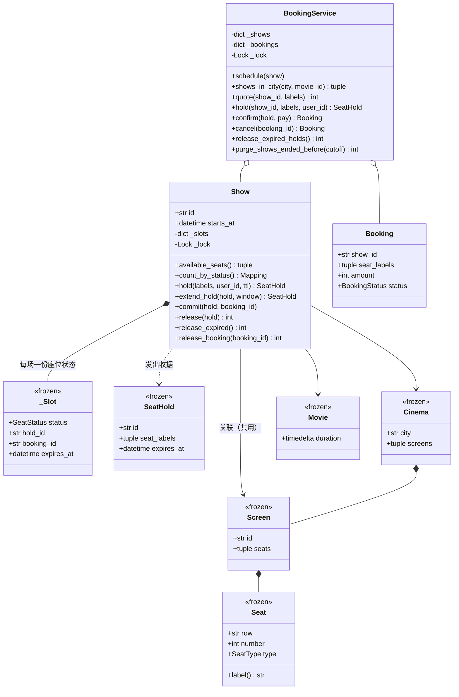

# 设计题解：电影订票（BookMyShow）

## 题目与澄清

面试官的开场通常很短："设计一个电影订票系统，像 BookMyShow 那样。用户按城市浏览影院、选一场、
选座、付款出票。"这句话里真正有难度的只有一件事：**两个人同时点中同一个座位**。其余的——电影
目录、影厅座位图、票价——都是记账。一个答案如果没有正面回答那次竞争，就等于没有回答这道题。

值得当场问出来的澄清，以及每个答案会改变什么：

- **座位是"选定"的还是"先到先坐"的？** 如果是演唱会草地票那种只卖数量不卖座号，整道题会退化成
  一个计数器的原子扣减（那更接近[[solution-hotel-booking]]那一侧的问题）。对电影院来说答案几乎
  一定是"选定座号"，于是库存的粒度是"座位 × 场次"，而不是一个数字。
- **选完座到付完款之间，座位是不是要先替用户留住？** 这是整道题的分水岭。如果不留，用户输完卡号
  回来发现座位没了，体验崩掉；如果留而不设上限，一个放弃付款的用户就能永久霸占两个座。所以答案
  是**带超时的锁座**（seat hold），超时长度（5 到 15 分钟）是一个要问清的业务参数。
- **一次下单能不能跨场次？** 答案是不能——一张订单属于一场放映。这条看似琐碎的约束，直接决定了
  后面可以一场一把锁而永远不会形成锁顺序死锁。如果面试官说"能跨场次买套票"，锁的设计必须重来。
- **票价怎么定？** 至少是"按座位档次"（普通/贵宾/沙发），很可能还要"按排加价""周末加价"。这意味着
  定价从第一版就该是可替换的规则，而不是写死在下单流程里的一段 `if`。
- **退票怎么算？** 要不要退、退多少、开演之后还能不能退——退票规则和定价规则一样是会变的政策。
- **并发规模多大？** 一场热门首映开票瞬间，同一场次会有上万请求；但不同场次之间没有任何共享。
  这个事实直接给出了锁的粒度。
- **单进程还是分布式？** 机器编码轮里答"单进程、用 `threading`"，同时说清楚"换成多进程/多机时，
  这把进程内的锁要换成数据库的行锁或 Redis 的分布式锁，接口不变"，是最稳的答法。

**范围之外**：不接真实支付网关（用一个注入的可调用对象代表它）、不做用户账号体系与登录、不做
座位图的渲染、不做真实持久化（本文在内存里建模，[[structure.storage|内存持久化（In-Memory
Persistence）]]讨论了换成数据库时哪些边界不变）、不做推荐与搜索排序。

## 需求与分级

机器编码轮不会一次把需求说完，而是分关加码，每一关都在检验上一关的设计有没有被自己将死。

- **第 1 关（核心流程，约 20 分钟）**：城市 → 影院 → 影厅 → 场次 → 座位的层级建模；列出某城某片的
  场次；查一场还剩哪些座；选定几个座，付款后得到一张订单。失败路径（座位号不存在、座位已被占）
  必须是明确的异常，而不是返回 `None` 让调用方自己猜。对应 `Seat`、`Screen`、`Cinema`、`Movie`、
  `Show`、`Booking` 和 `BookingService` 的骨架。
- **第 2 关（带超时的锁座，约 15 分钟）**：选座不等于成交。`hold → confirm → expire` 三个状态要
  显式；超时释放必须能在**不 sleep** 的前提下测出来，也就是时钟必须是注入的。对应 `SeatStatus`、
  `SeatHold`、`Show.hold/extend_hold/commit/release/release_expired`。
- **第 3 关（并发，约 15 分钟）**：多个用户同时抢同一场的同一批座位。要求：任何座位都不能被卖两次；
  任何座位都不能在清扫之后还卡在 HELD；锁的粒度要说得出理由。对应 `Show` 里那把私有的
  `threading.Lock` 和"支付调用必须在锁外"的两段式确认。
- **第 4 关（政策，选做）**：按座位档次/排次定价，周末加价；分档退票政策。验收标准是这两样加进来
  **一行都不碰第 2、3 关写好的锁座机器**。对应 `PricingStrategy`、`CancellationPolicy` 这两组
  注入的普通函数，以及 `BookingService.quote` / `cancel`。

## 核心对象与职责

这道题的建模分水岭是一句话：**座位有两层**。

`Seat` 是影厅里那把**物理**椅子——A 排 7 号，贵宾档。它属于 `Screen`，被这个厅当天所有场次共用，
而且一年到头不会变，所以它是一个 `frozen=True` 的 dataclass，身上**没有**任何"卖没卖掉"的字段。
"A7 在今晚 19:00 这一场里被谁占着"则是**每场独有**的库存，它的归属者只能是 `Show`。

把这两层混在一起，是这道题最高频的建模错误：一旦 `Seat` 上挂了 `status` 字段，19:00 那场的锁座
就会污染 21:30 那场，于是只能给每一场克隆一整套座位对象——座位图从"一个影厅一份"变成"一场一份"，
内存和一致性都开始变糟，而且"这把椅子坏了要报修"这种真正属于物理座位的信息反而没地方放。

| 类 | 单一职责 | 它守的不变量 |
|---|---|---|
| `Seat` | 描述一把物理椅子（排、号、档次） | 不可变；同一个 `label` 在一个影厅内唯一 |
| `Screen` | 一个影厅的固定座位表 | 座位集合在影厅生命周期内不变 |
| `Cinema` | 一家影院：城市 + 若干影厅 | 影院属于且只属于一个城市 |
| `Movie` | 片名与时长 | 时长决定散场时间 |
| `Show` | **一场放映的座位库存** | 每个座位任一时刻只有一个状态；从"可选"到"占用"的检查与写入原子 |
| `SeatHold` | 一张锁座收据（不可变副本） | 收据只是凭证，真相在 `Show` 的表里 |
| `Booking` | 一笔成交的业务档案 | 只有 `status` 和 `refunded` 可变 |
| `BookingService` | 门面：目录、报价、支付、订单、清扫 | 绝不持有任何座位状态 |

关系上：`Cinema` **组合**（composition）`Screen`，`Screen` 组合 `Seat`——影院没了，它的厅和椅子
也就没了。`Show` 对 `Movie`、`Screen`、`Cinema` 是**关联**（association）：它引用它们，但不拥有
它们的生命周期，一个影厅会被今天的十场放映共同引用。`BookingService` 聚合 `Show` 和 `Booking`，
但注意方向：`Booking` 只记 `show_id` 这个字符串，**不持有 `Show` 对象引用**——正因为如此，
`purge_shows_ended_before` 把散场的场次从目录摘掉之后，那些常驻内存的座位表才真的能被回收。



一个刻意**没有**出现的类：`City`。城市在这里只是 `Cinema` 上的一个字符串。给它建一个类，就要维护
"城市 → 影院"和"影院 → 城市"两个方向的引用，而 `City` 除了"有个名字"没有任何行为和不变量可守。
同样刻意没有的还有 `Ticket`——一张订单里的每个座位再各发一个 `Ticket` 对象，只是把
`Booking.seat_labels` 里的字符串换了个包装，它不携带任何 `Booking` 没有的信息，属于典型的
"只会转发一次调用"的空壳类。

## 关键设计决策

### 决策一："这个座位被谁占着"这份状态，归谁持有？

这是整道题的核心，三个候选各有真实拥趸：

**选项 A：挂在 `Seat` 上。** 最直觉，也是多数 Java 题解的写法——`Seat` 上加 `status` 和
`held_by`。代价前面说过：物理座位被一个厅的所有场次共用，状态挂上去就必须给每场克隆一整套座位。

**选项 B：挂在 `Booking` / `SeatHold` 上。** "谁占着"由订单和收据自己记，`Show` 不存。查"A7 还
空着吗"就变成遍历所有订单与收据求并集。读是 O(订单数)，更糟的是"座位没被占"这个事实没有任何
对象在守：它是一个需要扫描全局才能得出的结论，而不是一个可以在锁内一步验证的不变量。

**选项 C：一张独立的锁座表（reservation table）。** 一个全局的 `{(show_id, seat_label): SeatLock}`
字典配一把锁，`Show` 另外记"已售"。这是很多开源题解的写法，好处是"所有锁座"可以被统一清扫、
按用户查询也方便。代价是**两份真源**：已售在 `Show`、在锁在锁表，任何一条路径忘记同步就会出现
"锁表说空着，场次说卖了"。而且这张表是全局的，一把锁就把所有场次串行化了；更隐蔽的是，它是一个
**会增长的容器**——过期的条目如果没人删，内存就一直涨，这正是"锁座表"类实现最常见的泄漏。

**选择：C 的变体、但把表下放到场次里。** `Show` 自己持有一张 `座位号 → _Slot` 的表，`_Slot` 是一个
不可变的小记录，装着状态、占用者、过期时间：

```python
@dataclass(frozen=True, slots=True)
class _Slot:
    status: SeatStatus
    hold_id: str | None = None
    user_id: str | None = None
    booking_id: str | None = None
    expires_at: datetime | None = None
```

这样同时拿到三件事：（1）**每场一份真源**，"A7 在这场的状态"一次字典查找就有答案，没有第二份
需要对齐的状态；（2）这张表的**长度恒等于影厅座位数，永远不会增长**——锁座和退票只是把格子换成
另一个 `_Slot`，不会往表里加条目，于是"过期锁座泄漏"这个 bug 类别整个消失；（3）锁的粒度自然
落在场次上。`_Slot` 用 `frozen` 而不是原地改字段，是为了没有"改了一半"的中间态：锁内 `replace`
整格换掉，读到的要么是完整的旧值、要么是完整的新值。

这里用的模式是**状态模式（State）的轻量形式**：状态是 `Enum` + 一个不可变记录，而不是三个
`SeatState` 子类。理由见[[structure.state-machines|状态机（State Machines）]]——只有三个状态、
四条边、每条边的动作都只有一行时，多态带来的收益小于把转移逻辑拆散到三个类里造成的阅读成本；
转移规则集中在 `Show` 的四个方法里，一眼能看全。

### 决策二：过期释放靠后台清扫，还是靠惰性判断？

锁座有 TTL，那"到点了谁来释放"？

**选项 A：只靠后台清扫线程。** 起一个线程定期扫过期收据。问题是正确性开始依赖调度：清扫每 30 秒
跑一次，那么在两次清扫之间，一个已经过期的座位仍然显示为"已占"，用户看到的是一个空着却买不到
的座。更糟的是测试——要么 sleep，要么把线程的调度也做成可注入的，两条路都难看。

**选项 B：只靠惰性判断。** 每次读写时拿注入的时钟和 `expires_at` 比一下，过期的 HELD 一律当成
AVAILABLE。正确性完全不依赖任何后台任务：

```python
@staticmethod
def _effective(slot: _Slot, now: datetime) -> SeatStatus:
    if slot.status is SeatStatus.HELD and slot.expires_at is not None and slot.expires_at <= now:
        return SeatStatus.AVAILABLE
    return slot.status
```

代价是残留：格子里仍然写着旧的 `hold_id` 和过期时间，内存不会被释放（在本设计里这个代价几乎为零，
因为格子数固定）。

**选择：以惰性为准，清扫只做落实。** `release_expired()` 仍然存在，但它不是正确性的一部分，只是把
惰性结论写实、把残留的 `hold_id` 清掉。这条分工非常好验证：测试里**一次清扫都不调用**，把时钟往前
拨 11 分钟，可用座位数就必须已经变回来了。真实系统里这也是标准答法——Redis 的 key 过期就是惰性
删除加定期采样删除的组合。

**为什么不上一个按到期时间排序的最小堆？** 那是"扫描太慢"时才需要的优化。一个影厅几百个座，扫一遍
是微秒级；而堆是第二份必须和座位表保持一致的状态，每次 `release`、`commit`、`extend_hold` 都要去
堆里改或标记失效条目——这正是[[concurrency.primitives|同步原语（threading）]]里说的"为了省一次
扫描，换来一整类难以复现的一致性 bug"。这是本题里**刻意拒绝一个数据结构**的地方：等到一个进程要
管十万个场次、清扫成为热点时再加，而且加的时候只改 `release_expired` 一个方法。

### 决策三：锁的粒度——全局一把、一场一把，还是一座一把？

**全局一把锁**最简单，也最容易在面试里被判"没想过"。首映日开票，全国所有场次的下单在一条队列上
排队，而它们之间根本没有共享数据。

**一座一把锁**粒度最细，但一次下单要选三个座，就得同时持三把锁——立刻引入锁顺序问题（必须按
座位号排序后依次加锁，否则两个用户各持对方要的锁就死锁），而收益只在"同一场里选不同座的人"之间，
那本来就是微秒级的临界区。用四条死锁条件衡量，这是主动把"持有并等待"和"循环等待"请进门。

**选择：一场一把锁**，放在 `Show` 里，用 `threading.Lock`：

```python
with self._lock:
    taken = [l for l in labels if self._effective(self._slots[l], now) is not SeatStatus.AVAILABLE]
    if taken:
        raise SeatNotAvailableError(...)
    for l in labels:
        self._slots[l] = _Slot(SeatStatus.HELD, hold_id=receipt.id, ...)
```

理由是"竞争边界和数据边界重合"：抢座的人一定在抢同一场，不同场次之间零共享。而且因为一笔下单
只涉及一个场次（这是第一节澄清过的业务约束），**永远不需要同时持有两把场次锁**，锁顺序死锁从
问题定义上就不存在。这是粒度选择最舒服的一种情形——业务约束替你消掉了死锁。

`BookingService` 另有一把锁，只保护目录和订单表。纪律是：**绝不在持有服务锁时去拿场次锁**。
`release_expired_holds` 就是这条纪律的样板——先在服务锁内取一份场次快照，出锁，再逐场去拿各自的锁：

```python
with self._lock:
    shows = list(self._shows.values())
return sum(show.release_expired() for show in shows)
```

关于 GIL 要说清楚：GIL 保证的是单条字节码不被切走，而"读状态 → 判断 → 写状态"是好几十条字节码，
中间随时可能切线程。所以这把锁不是给 CPython 的性能加的，是给正确性加的；换成没有 GIL 的解释器，
代码一个字都不用改。

### 决策四：支付调用放在锁内还是锁外？——两段式确认

新手写法是把整个 `confirm` 包进 `with show._lock`：检查收据、调支付、翻成 BOOKED。一行锁解决所有
竞争，但**握着锁调用外部 IO** 是并发设计里最贵的错误之一：支付网关抖动到三秒，这一场所有人的
选座、查询、清扫全部堵在后面；网关卡死，整场永久不可用。

正确的形状是把临界区切成两段，中间把锁放掉：

1. **锁内**：验证收据还活着，并把它的过期时间重置为"从现在起一个支付窗口"（`extend_hold`）；
2. **锁外**：调用注入的支付网关；
3. **锁内**：把这些座位从 HELD 翻成 BOOKED（`commit`）。

第 1 步的延长是关键：它在锁内完成，所以延长和"别人抢座"之间没有缝隙；延长之后，即使清扫线程在
付款途中跑过，也扫不走这些座位。测试可以直接钉住这一点——把时钟拨到原 TTL 只剩一分钟，在假网关
里再拨三分钟并跑一次清扫，断言清扫返回 0、订单照样成交。

剩下的窗口是诚实存在的：如果支付比 `payment_window` 还慢，第 3 步会发现收据已经失效。此时钱已经
收了，座位可能已经被别人买走。本设计选择**宁可抛错也不覆盖别人的订单**，并在异常消息里带上需要
退款的金额：

```python
try:
    show.commit(hold, booking_id)
except HoldExpiredError as exc:
    raise HoldExpiredError(f"... succeeded but the seats were already released; refund {amount}") from exc
```

把它说出来比藏起来强得多：面试官想听的正是"你知道这个窗口存在，并且知道它会掉进对账/退款流程"。
生产系统里这一步会落一条待冲正记录交给对账任务，而不是只抛一个异常。

### 决策五：订单要不要一个 PENDING 状态？目录要不要二级索引？——两次"更简单的答案是对的"

很多题解给 `BookingStatus` 三个值：PENDING、CONFIRMED、CANCELLED，`hold` 时先建一张 PENDING 订单，
付款后改成 CONFIRMED。本设计只有 CONFIRMED 和 CANCELLED。理由是：**"已选座、未付款"这件事已经由
`SeatHold` 完整表达了**，再建一张 PENDING 订单就是同一件事的第二份表示——两者都有过期时间、都要被
清扫、而且必须始终一致。真按这条路走，第一个 bug 一定是"收据过期了但 PENDING 订单还在"。一个状态
只在一个地方表达，是这类设计题最省事的纪律。

同样地，`shows_in_city` 是一次全表扫描，没有建"城市 → 场次"的二级索引：

```python
picked = [s for s in shows if s.cinema.city == city and (movie_id is None or s.movie.id == movie_id)]
```

一家院线同时在映的场次是几千条量级，扫一遍是微秒级的事；而索引是第二份必须和目录保持一致的状态，
`schedule` 和 `purge_shows_ended_before` 都得维护它。把这句话说出来比默默加索引更能拿分：**我知道
索引怎么加，也知道现在不该加，等到量级真的到了，改的还是这一个方法。**

## 代码走读

下面是经过测试的完整实现。读的时候盯住四处：`Seat` 身上没有状态、`Show._slots` 是唯一真源、
`_effective` 把过期做成惰性、`BookingService.confirm` 的两段式确认。

%% code:begin solution.py %%
```python
"""电影订票（BookMyShow）——选座、锁座、超时释放与并发下单的参考实现。

核心思路：座位分两层——`Seat` 是影厅里那把**物理**椅子，不可变、被同一影厅的所有场次共用；
"这把椅子在这一场里被谁占着"是**每场独有**的库存状态，因此由 `Show` 自己持有一张
`座位号 → _Slot` 的表，一把 `Show` 私有的锁保护它，两个不同场次天然不互相阻塞。锁座
（`SeatHold`）是一张有过期时间的收据：过期判断永远按注入的时钟**惰性**算，所以哪怕清扫线程
没跑，可用座位数也不会错；`release_expired` 只是把惰性结论落成实状态。支付是慢 IO，绝不能在
持有座位锁时调用——`confirm` 先在锁内把持有期延长到支付窗口，出锁后付款，再入锁把 HELD 翻成
BOOKED。定价与退票规则是注入的普通函数，加一档新价格或新退票政策都碰不到上面的锁座机器。
"""

from __future__ import annotations

import itertools
import threading
from collections.abc import Callable, Iterable, Mapping, Sequence
from dataclasses import dataclass, replace
from datetime import datetime, timedelta
from enum import Enum, IntEnum


# --------------------------------------------------------------------------
# 失败路径：一个小的异常家族，调用方可以只 catch 基类，也可以分别处理。


class BookingError(Exception):
    """本设计里所有失败路径的公共基类。"""

class UnknownSeatError(BookingError):
    """请求的座位号在这个影厅里不存在。"""

class SeatNotAvailableError(BookingError):
    """请求的座位里至少有一个已经被别人锁住或卖掉了——整笔请求都不成立。"""

class HoldExpiredError(BookingError):
    """锁座收据已经过期（或已经被释放、被用掉），不能再拿它下单。"""

class PaymentFailedError(BookingError):
    """支付网关拒绝了这笔付款，座位已经退回。"""

class ShowNotFoundError(BookingError):
    """目录里没有这个场次（未上架，或已经被 `purge_shows_ended_before` 清掉）。"""

class BookingNotFoundError(BookingError):
    """订单号不存在。"""

class CancellationNotAllowedError(BookingError):
    """这张订单现在不允许取消：已经取消过，或者场次已经开演。"""


# --------------------------------------------------------------------------
# 物理层：座位、影厅、影院、电影。全部不可变——它们描述的是"这座楼里有什么"，
# 一天之内不会变，和"今晚这一场卖掉了几个座"是两件事。


class SeatType(IntEnum):
    """座位档次，数值越大越贵；按档定价靠这把标尺，不靠一串 `if`。"""

    NORMAL = 1
    PREMIUM = 2
    RECLINER = 3


@dataclass(frozen=True, slots=True)
class Seat:
    """影厅里的一把物理椅子：排号、座号、档次。不带任何"卖没卖掉"的状态——
    同一把椅子当天每一场都会出现，状态放这里会让 19:00 那场污染 21:30 那场。
    """

    row: str
    number: int
    type: SeatType = SeatType.NORMAL

    @property
    def label(self) -> str:
        """座位在影厅内的唯一标识，比如 `"C7"`。"""
        return f"{self.row}{self.number}"


@dataclass(frozen=True, slots=True)
class Screen:
    """一个影厅：一串固定的座位，被这个厅的所有场次共用。"""

    id: str
    seats: tuple[Seat, ...]

    @classmethod
    def grid(cls, screen_id: str, rows: Sequence[str], seats_per_row: int,
             types: Mapping[str, SeatType] | None = None) -> "Screen":
        """按"几排乘几座"快速造一个影厅；`types` 给个别排指定档次，其余是普通座。"""
        types = types or {}
        seats = tuple(Seat(row=row, number=n, type=types.get(row, SeatType.NORMAL))
                      for row in rows for n in range(1, seats_per_row + 1))
        return cls(id=screen_id, seats=seats)


@dataclass(frozen=True, slots=True)
class Cinema:
    """一家影院：属于某个城市，有若干影厅。城市只是一个字符串，没有单开 `City` 类——
    它除了"有个名字、下面挂着几家影院"没有行为，建成类只会多一层双向引用要维护。
    """

    id: str
    name: str
    city: str
    screens: tuple[Screen, ...] = ()


@dataclass(frozen=True, slots=True)
class Movie:
    """一部电影：时长决定散场时间，散场时间决定这场什么时候能从目录里清掉。"""

    id: str
    title: str
    duration: timedelta


# --------------------------------------------------------------------------
# 每场独有的座位状态。


class SeatStatus(Enum):
    """一个座位在**某一场**里的三种状态，状态机只有这三个点和四条边。"""

    AVAILABLE = "available"
    HELD = "held"
    BOOKED = "booked"


@dataclass(frozen=True, slots=True)
class _Slot:
    """`Show` 内部的一格座位状态。不可变，改状态靠 `replace` 整格换掉，因此没有"改了
    一半"的中间态。`hold_id` / `booking_id` 记的是"是谁占着"，过期时间只有 HELD 才有。
    """

    status: SeatStatus
    hold_id: str | None = None
    user_id: str | None = None
    booking_id: str | None = None
    expires_at: datetime | None = None


@dataclass(frozen=True, slots=True)
class SeatHold:
    """一张锁座收据：哪一场、哪几个座、谁锁的、什么时候作废。这是交给调用方的**副本**，
    真相永远在 `Show` 的那张表里；它不可变，跨线程传递是安全的。
    """

    id: str
    show_id: str
    seat_labels: tuple[str, ...]
    user_id: str
    expires_at: datetime


class BookingStatus(Enum):
    """订单只有两个状态：付过钱的和退掉的。这里**没有** PENDING——"已选座、未付款"
    已经由 `SeatHold` 表达，再建一个 PENDING 就是同一件事的第二份表示，迟早对不上。
    """

    CONFIRMED = "confirmed"
    CANCELLED = "cancelled"


@dataclass(slots=True)
class Booking:
    """一张成交的订单，金额是整数的"分"。它是业务档案，不随场次结束而删除；
    能变的只有 `status` 和 `refunded`。
    """

    id: str
    show_id: str
    user_id: str
    seat_labels: tuple[str, ...]
    amount: int
    created_at: datetime
    status: BookingStatus = BookingStatus.CONFIRMED
    refunded: int = 0


Clock = Callable[[], datetime]
PaymentGateway = Callable[[str, int], bool]
PricingStrategy = Callable[[Seat, "Show"], int]
CancellationPolicy = Callable[[Booking, "Show", datetime], int]


# --------------------------------------------------------------------------
# 定价与退票：两类"会变的规则"，都是普通函数。它们只读 `Seat` / `Show` / `Booking`，
# 没有跨调用要记的状态，所以不需要抽象基类，也不需要各配一个实现类。


def by_seat_type(prices: Mapping[SeatType, int]) -> PricingStrategy:
    """按座位档次定价，单位是分。最常见的一档。"""

    def price(seat: Seat, show: "Show") -> int:
        return prices[seat.type]

    return price


def row_surcharge(base: PricingStrategy, extra_by_row: Mapping[str, int]) -> PricingStrategy:
    """在任意一种定价之上，给指定的排加价——策略是函数，所以"叠一层"就是包一个函数。"""

    def price(seat: Seat, show: "Show") -> int:
        return base(seat, show) + extra_by_row.get(seat.row, 0)

    return price


def weekend_multiplier(base: PricingStrategy, numerator: int, denominator: int) -> PricingStrategy:
    """周末按整数分数加价（比如 12/10 就是上浮两成），整数运算避免浮点分币误差。"""

    def price(seat: Seat, show: "Show") -> int:
        if show.starts_at.weekday() < 5:
            return base(seat, show)
        return base(seat, show) * numerator // denominator

    return price


def no_refund(booking: Booking, show: "Show", now: datetime) -> int:
    """一律不退款——影院最省事的政策，也是退票规则的下界。"""
    return 0


def tiered_refund(tiers: Sequence[tuple[timedelta, int]]) -> CancellationPolicy:
    """按"离开演还有多久"分档退款：`tiers` 是 (提前量, 退款百分比)，按提前量从大到小给。"""

    ordered = tuple(sorted(tiers, key=lambda t: t[0], reverse=True))

    def refund(booking: Booking, show: "Show", now: datetime) -> int:
        ahead = show.starts_at - now
        for threshold, percent in ordered:
            if ahead >= threshold:
                return booking.amount * percent // 100
        return 0

    return refund


# --------------------------------------------------------------------------
# Show：一场放映。本设计的核心——"这一场的座位卖到哪一步了"这份状态只此一份。


class Show:
    """一场放映：绑定一部电影、一个影厅、一个开演时间，持有这一场的座位库存。

    不变量：每个座位号任一时刻只有一个状态，HELD 必定带 `hold_id` 和过期时间，
    而"检查可选"和"写入占用"永远在同一把锁里，所以同一个座位不可能被两个人同时选中。
    锁放在场次上而不是全局一把：同一场的观众才真正抢同一批座位，一场一锁就是刚好的
    粒度；又因为一笔下单只涉及一个场次，永远不用同时持两把锁，也就没有锁顺序死锁。
    """

    def __init__(self, show_id: str, movie: Movie, screen: Screen, cinema: Cinema,
                 starts_at: datetime, clock: Clock) -> None:
        self.id = show_id
        self.movie = movie
        self.screen = screen
        self.cinema = cinema
        self.starts_at = starts_at
        self._clock = clock
        self._seats: dict[str, Seat] = {seat.label: seat for seat in screen.seats}
        self._slots: dict[str, _Slot] = {label: _Slot(SeatStatus.AVAILABLE) for label in self._seats}
        self._lock = threading.Lock()
        self._hold_ids = (f"{show_id}-H{n}" for n in itertools.count(1))

    @property
    def ends_at(self) -> datetime:
        """散场时间，由电影时长算出；目录清理用它判断这场是不是已经结束。"""
        return self.starts_at + self.movie.duration

    @property
    def seat_count(self) -> int:
        """这一场总共有多少座——影厅固定，所以这个数不随售卖变化。"""
        return len(self._seats)

    def seat(self, label: str) -> Seat:
        """按座位号取那把物理椅子；不存在就抛 `UnknownSeatError`。"""
        try:
            return self._seats[label]
        except KeyError:
            raise UnknownSeatError(f"screen {self.screen.id} has no seat {label!r}") from None

    # ---- 读：一律返回快照或计数，从不把内部的表交出去 --------------------

    @staticmethod
    def _effective(slot: _Slot, now: datetime) -> SeatStatus:
        """惰性过期：一格 HELD 只要过了时间，对外就已经是 AVAILABLE。把过期算在每次
        读写的那一刻，正确性就不依赖清扫任务跑没跑；`release_expired` 只是把结论落实。
        """
        if slot.status is SeatStatus.HELD and slot.expires_at is not None and slot.expires_at <= now:
            return SeatStatus.AVAILABLE
        return slot.status

    def seat_status(self, label: str) -> SeatStatus:
        """某个座位此刻对外的状态（已经考虑过期）。"""
        self.seat(label)
        now = self._clock()
        with self._lock:
            return self._effective(self._slots[label], now)

    def available_seats(self) -> tuple[Seat, ...]:
        """当前可选座位的一份不可变快照，按影厅里的固定顺序给出。"""
        now = self._clock()
        with self._lock:
            labels = [label for label, slot in self._slots.items()
                      if self._effective(slot, now) is SeatStatus.AVAILABLE]
        return tuple(self._seats[label] for label in labels)

    def count_by_status(self) -> Mapping[SeatStatus, int]:
        """三种状态各有多少座的只读计数快照——展示层要的是数字，不是座位表本身。"""
        now = self._clock()
        counts = dict.fromkeys(SeatStatus, 0)
        with self._lock:
            for slot in self._slots.values():
                counts[self._effective(slot, now)] += 1
        return counts

    # ---- 写：锁座、延期、成交、释放 --------------------------------------

    def _live_labels(self, hold: SeatHold, now: datetime) -> tuple[str, ...]:
        """收据还活着时返回它占着的座位号；有一个对不上就说明失效。调用方须已持有锁。"""
        live = tuple(label for label in hold.seat_labels
                     if (slot := self._slots.get(label)) is not None
                     and slot.hold_id == hold.id
                     and self._effective(slot, now) is SeatStatus.HELD)
        if len(live) != len(hold.seat_labels):
            raise HoldExpiredError(f"hold {hold.id} no longer holds {hold.seat_labels}")
        return live

    def hold(self, seat_labels: Iterable[str], user_id: str, ttl: timedelta) -> SeatHold:
        """锁住一批座位 `ttl` 这么久，全成功或全失败，返回一张收据。

        "检查都可选"和"标成 HELD"必须在同一把锁里做完，拆成两段两个线程就会都写进去；
        部分成功同样不可接受——选三个座只锁住两个，用户拿到的是一笔没法用的订单。
        """
        labels = tuple(dict.fromkeys(seat_labels))  # 去重且保序
        if not labels:
            raise UnknownSeatError("a hold must name at least one seat")
        now = self._clock()
        with self._lock:
            unknown = [label for label in labels if label not in self._slots]
            if unknown:
                raise UnknownSeatError(f"screen {self.screen.id} has no seat(s) {unknown}")
            taken = [label for label in labels
                     if self._effective(self._slots[label], now) is not SeatStatus.AVAILABLE]
            if taken:
                raise SeatNotAvailableError(f"seat(s) {taken} are not available on show {self.id}")
            receipt = SeatHold(id=next(self._hold_ids), show_id=self.id, seat_labels=labels,
                               user_id=user_id, expires_at=now + ttl)
            for label in labels:
                self._slots[label] = _Slot(SeatStatus.HELD, hold_id=receipt.id,
                                           user_id=user_id, expires_at=receipt.expires_at)
        return receipt

    def extend_hold(self, hold: SeatHold, window: timedelta) -> SeatHold:
        """把有效期重置为"从现在起 `window`"，返回刷新后的收据。`confirm` 在调支付
        网关**之前**用它，延长发生在锁内，所以和"别人抢座"之间没有缝隙。
        """
        now = self._clock()
        expires_at = now + window
        with self._lock:
            for label in self._live_labels(hold, now):
                self._slots[label] = replace(self._slots[label], expires_at=expires_at)
        return replace(hold, expires_at=expires_at)

    def commit(self, hold: SeatHold, booking_id: str) -> None:
        """把收据上的座位从 HELD 翻成 BOOKED；收据已失效则抛 `HoldExpiredError`。"""
        now = self._clock()
        with self._lock:
            for label in self._live_labels(hold, now):
                self._slots[label] = _Slot(SeatStatus.BOOKED, booking_id=booking_id)

    def release(self, hold: SeatHold) -> int:
        """主动放弃一张收据（退出选座、支付失败），返回退回的座位数。故意做成幂等且
        不抛异常：它总跑在失败路径上，再抛异常只会盖掉真正的错误原因。
        """
        now = self._clock()
        freed = 0
        with self._lock:
            for label in hold.seat_labels:
                slot = self._slots.get(label)
                if slot is not None and slot.hold_id == hold.id and slot.status is SeatStatus.HELD:
                    self._slots[label] = _Slot(SeatStatus.AVAILABLE)
                    freed += 1
        return freed

    def release_expired(self) -> int:
        """把所有过期的 HELD 真正写回 AVAILABLE，返回清掉的座位数。座位表长度恒等于
        影厅座位数；这里清的是格子里残留的 `hold_id` 和过期时间。
        """
        now = self._clock()
        freed = 0
        with self._lock:
            for label, slot in self._slots.items():
                if slot.status is SeatStatus.HELD and self._effective(slot, now) is SeatStatus.AVAILABLE:
                    self._slots[label] = _Slot(SeatStatus.AVAILABLE)
                    freed += 1
        return freed

    def release_booking(self, booking_id: str) -> int:
        """退票：把这张订单占的 BOOKED 座位退回 AVAILABLE，返回退回的座位数。"""
        freed = 0
        with self._lock:
            for label, slot in self._slots.items():
                if slot.status is SeatStatus.BOOKED and slot.booking_id == booking_id:
                    self._slots[label] = _Slot(SeatStatus.AVAILABLE)
                    freed += 1
        return freed


# --------------------------------------------------------------------------
# BookingService：面向用户的门面。它管目录、算钱、调支付、记订单；
# 座位归谁这件事它一个字节都不存，全部委托给对应的 `Show`。


class BookingService:
    """订票服务：按城市/电影找场次，锁座、付款成交、退票，以及清扫过期收据。

    锁纪律：它自己的锁只保护目录和订单表，**绝不**在持有它时去拿某个 `Show` 的锁——
    两把锁永远"先放后拿"，不存在嵌套，也就不存在锁顺序死锁。
    """

    def __init__(self, clock: Clock, pricing: PricingStrategy,
                 cancellation: CancellationPolicy = no_refund,
                 hold_ttl: timedelta = timedelta(minutes=10),
                 payment_window: timedelta = timedelta(minutes=2)) -> None:
        self._clock = clock
        self._pricing = pricing
        self._cancellation = cancellation
        self._hold_ttl = hold_ttl
        self._payment_window = payment_window
        self._shows: dict[str, Show] = {}
        self._bookings: dict[str, Booking] = {}
        self._lock = threading.Lock()
        self._booking_ids = (f"B{n}" for n in itertools.count(1))

    # ---- 目录 ------------------------------------------------------------

    def schedule(self, show: Show) -> None:
        """把一场放映上架。"""
        with self._lock:
            self._shows[show.id] = show

    def show(self, show_id: str) -> Show:
        """按 id 取场次；不在目录里就抛 `ShowNotFoundError`。"""
        with self._lock:
            show = self._shows.get(show_id)
        if show is None:
            raise ShowNotFoundError(f"unknown show {show_id!r}")
        return show

    def shows_in_city(self, city: str, movie_id: str | None = None) -> tuple[Show, ...]:
        """某城市（可再限定某部电影）在映场次的快照，按开演时间排序。

        这里是全表扫描，没有另建"城市 → 场次"索引：索引是第二份要保持一致的状态，而
        一家院线同时在映也就几千场。真到了需要索引的量级，再加也只改这一个方法。
        """
        with self._lock:
            shows = list(self._shows.values())
        picked = [s for s in shows if s.cinema.city == city and (movie_id is None or s.movie.id == movie_id)]
        return tuple(sorted(picked, key=lambda s: (s.starts_at, s.id)))

    def purge_shows_ended_before(self, cutoff: datetime) -> int:
        """把已经散场的场次从目录里摘掉，返回摘掉的场次数。

        这是目录唯一会缩小的地方——没有它 `_shows` 会随排片无限增长。订单不跟着删，
        但它记的是 `show_id` 而不是 `Show` 引用，所以摘掉之后场次对象真的能被回收。
        """
        with self._lock:
            gone = [show_id for show_id, show in self._shows.items() if show.ends_at <= cutoff]
            for show_id in gone:
                del self._shows[show_id]
        return len(gone)

    # ---- 下单 ------------------------------------------------------------

    def quote(self, show_id: str, seat_labels: Iterable[str]) -> int:
        """报价：这批座位一共多少分。定价规则来自注入的策略。"""
        show = self.show(show_id)
        return sum(self._pricing(show.seat(label), show) for label in seat_labels)

    def hold(self, show_id: str, seat_labels: Iterable[str], user_id: str) -> SeatHold:
        """选座：按服务配置的 TTL 锁住这批座位。"""
        return self.show(show_id).hold(seat_labels, user_id, self._hold_ttl)

    def confirm(self, hold: SeatHold, pay: PaymentGateway) -> Booking:
        """付款成交：延长持有期 → 锁外调支付 → 锁内把座位翻成 BOOKED → 落订单。

        支付必须在座位锁之外调：握着锁调外部 IO，网关一慢就是全场卡死。代价是付完款
        到落单之间有个窗口，所以进窗口前先把持有期延到 `payment_window`；万一还是超了，
        这里宁可抛错也不会覆盖别人已经买到的座位，并在消息里点明这笔钱需要退。
        """
        show = self.show(hold.show_id)
        amount = self.quote(hold.show_id, hold.seat_labels)
        hold = show.extend_hold(hold, self._payment_window)
        try:
            approved = pay(hold.user_id, amount)
        except Exception:
            show.release(hold)
            raise
        if not approved:
            show.release(hold)
            raise PaymentFailedError(f"payment declined for hold {hold.id}")
        with self._lock:
            booking_id = next(self._booking_ids)
        try:
            show.commit(hold, booking_id)
        except HoldExpiredError as exc:
            raise HoldExpiredError(
                f"payment for hold {hold.id} succeeded but the seats were already released; refund {amount}"
            ) from exc
        booking = Booking(id=booking_id, show_id=show.id, user_id=hold.user_id,
                          seat_labels=hold.seat_labels, amount=amount, created_at=self._clock())
        with self._lock:
            self._bookings[booking.id] = booking
        return booking

    def release(self, hold: SeatHold) -> int:
        """用户主动放弃选座，立刻把座位还回去，不用等 TTL。"""
        return self.show(hold.show_id).release(hold)

    def release_expired_holds(self) -> int:
        """跨所有场次清扫一次过期收据，返回清掉的座位数。先在服务锁内拿一份场次快照，
        出锁后再逐场去拿各自的锁，不形成"服务锁 → 场次锁"的嵌套。
        """
        with self._lock:
            shows = list(self._shows.values())
        return sum(show.release_expired() for show in shows)

    # ---- 订单 ------------------------------------------------------------

    def booking(self, booking_id: str) -> Booking:
        """按订单号取订单。"""
        with self._lock:
            booking = self._bookings.get(booking_id)
        if booking is None:
            raise BookingNotFoundError(f"unknown booking {booking_id!r}")
        return booking

    def cancel(self, booking_id: str) -> Booking:
        """退票：算退款、把座位退回场次、把订单置为已取消，返回更新后的订单。

        状态位在锁内先翻，这一步就是"认领"订单：两个线程同时点退票，只有一个能把
        CONFIRMED 翻成 CANCELLED，不会退两次款。开演后不许退票，也让清理场次永远安全。
        """
        now = self._clock()
        with self._lock:
            booking = self._bookings.get(booking_id)
            if booking is None:
                raise BookingNotFoundError(f"unknown booking {booking_id!r}")
            show = self._shows.get(booking.show_id)
            if show is None:
                raise ShowNotFoundError(f"show {booking.show_id!r} is no longer scheduled")
            if booking.status is BookingStatus.CANCELLED:
                raise CancellationNotAllowedError(f"booking {booking_id} is already cancelled")
            if now >= show.starts_at:
                raise CancellationNotAllowedError(f"show {show.id} has already started")
            booking.status = BookingStatus.CANCELLED
        booking.refunded = self._cancellation(booking, show, now)
        show.release_booking(booking.id)
        return booking


if __name__ == "__main__":
    from datetime import UTC

    now = datetime(2026, 5, 15, 18, 0, tzinfo=UTC)
    screen = Screen.grid("S1", rows="ABC", seats_per_row=6, types={"C": SeatType.PREMIUM})
    cinema = Cinema(id="C1", name="Grand", city="Shanghai", screens=(screen,))
    movie = Movie(id="M1", title="Dune", duration=timedelta(minutes=155))
    show = Show("SH1", movie, screen, cinema, starts_at=now + timedelta(hours=2), clock=lambda: now)

    service = BookingService(
        clock=lambda: now,
        pricing=row_surcharge(by_seat_type({SeatType.NORMAL: 4500, SeatType.PREMIUM: 6800,
                                            SeatType.RECLINER: 9900}), {"A": 500}),
        cancellation=tiered_refund([(timedelta(hours=4), 100), (timedelta(hours=1), 50)]),
        hold_ttl=timedelta(minutes=10),
    )
    service.schedule(show)

    def free() -> int:
        """演示用：当前还剩几个空座。"""
        return show.count_by_status()[SeatStatus.AVAILABLE]

    receipt = service.hold("SH1", ["A1", "A2"], user_id="u1")
    print(f"held {receipt.seat_labels} until {receipt.expires_at:%H:%M}, free now: {free()}")
    booking = service.confirm(receipt, pay=lambda user, amount: True)
    print(f"booking {booking.id}: {booking.amount} fen, free {free()}")
    service.hold("SH1", ["B1"], user_id="u2")
    now = now + timedelta(minutes=11)  # 时钟往前拨：u2 的锁座超时了
    print(f"swept {service.release_expired_holds()} expired seat(s), free {free()}")
    print(f"refunded {service.cancel(booking.id).refunded} fen, free {free()}")
```
%% code:end %%

**第一处：物理层全是 `frozen=True`。** `Seat`、`Screen`、`Cinema`、`Movie` 都不可变，所以它们可以
被任意多个场次共享而不需要任何同步——不可变对象天然线程安全，这是省掉一大堆锁最廉价的办法。

**第二处：`Show` 的读方法一律交出快照或计数，从不交出内部的表。** `available_seats()` 返回
`tuple[Seat, ...]`，`count_by_status()` 返回一个在锁内算好的普通 dict。如果这里图省事 `return
self._slots`，调用方就拿到了一个可以绕过锁随意改写的内部字典——那不是"暴露了实现细节"这种美学
问题，而是把不变量的守门人直接拆了。

**第三处：`hold` 的全有或全无。** 先把所有要的座位检查一遍，有一个不可用就整笔抛
`SeatNotAvailableError`，一个字节都不写。部分成功（选了三个座只锁住两个）比整笔失败糟糕得多：
用户拿到一笔自己都不知道残缺的订单，而释放它的责任落到了谁身上没人说得清。

**第四处：失败路径上的 `release` 故意幂等、故意不抛异常。** 它总是跑在 `except` 分支里，此时再抛
一个新异常只会盖掉真正的错误原因；收据已过期或已成交时它什么都不做，返回 0。这和 `commit` 的
"失效就抛"形成对照：成交路径必须严格，回滚路径必须宽容。

## 测试与自检

套件（`test_movie_booking.py`，24 个用例）按四关组织，每一关钉住的东西不同：

- **第 1 关**钉层级与失败路径，其中最有信息量的一条是
  `test_two_shows_on_the_same_screen_keep_independent_seat_state`：同一个 `Screen` 上的两场，一场
  卖掉 A1，另一场的 A1 必须仍然可选。这条用例直接判定"座位状态放在哪一层"是否做对了。
- **第 2 关**全部用注入的假时钟，**没有一处 `sleep`**。
  `test_an_expired_hold_frees_the_seats_without_any_sweep` 一次清扫都不调用就断言座位回来了，钉的是
  "惰性过期是正确性来源"；`test_release_expired_holds_leaves_no_seat_stuck_in_held` 钉的是清扫之后
  HELD 计数必须为 0，并且再扫一次返回 0（幂等）。
- **第 3 关**用真线程加 `threading.Barrier` 让所有线程在同一刻起跑，断言的是**不变量而不是时序**：
  16 个线程抢同一个座位，成功的订单数恰好为 1；24 个线程各抢两个座，卖出的座位号集合无重复，且
  三种状态的计数之和恒等于影厅座位数（没有座位凭空消失）；8 个线程并发清扫，累计清掉的座位数恰好
  等于过期收据数（没有一个座位被清两次）。
- **第 4 关**钉政策的可组合性与退票的幂等：`row_surcharge` 叠在 `by_seat_type` 之上；分档退款按
  "离开演还有多久"给不同比例；连续两次 `cancel` 第二次必须抛异常（否则就是退两次款）。

**两分钟怎么给面试官演示**：直接跑 `python solution.py` 的 `__main__`——锁两个座（空位数立刻减 2）、
付款成交、再锁一个座然后把时钟往前拨 11 分钟、跑一次清扫看它被回收、最后退票看空位数回到满座。
一个假时钟把"超时"这件本来要等十分钟的事压缩成一行赋值，是这道题最抓人的演示点。

值得自己拷问的不变量，按重要性排：（1）任意时刻，三种状态的座位数之和恒等于影厅座位数；（2）没有
任何座位的 `booking_id` 同时属于两张有效订单；（3）不调用清扫，可用座位数也永远正确；（4）`_slots`
的长度恒定，没有任何路径往里加键。

## 扩展与追问

**新需求**

- *加一档"情侣座"或"IMAX 座"*：只在 `SeatType` 里加一个成员，定价表里加一行。`Show`、锁、清扫、
  订单一行不改——因为档次从头到尾只被定价函数读。
- *座位图渲染（哪些座连着、过道在哪）*：这是 `Screen` 的事，给 `Seat` 加 `is_aisle` 之类的字段，
  `Show` 不受影响，因为它只按 `label` 索引。
- *优惠券与会员价*：再包一层定价函数即可（`row_surcharge` 已经示范了"策略叠策略"就是包一个函数）。
  如果优惠券要记"这张券用过了"，那它有状态，才升级成类——判断标准是状态和额外方法，不是复杂度。
- *一个用户最多买 6 张*：这是 `BookingService.hold` 的前置校验，需要"这个用户在这场已经占了几个座"
  这个查询。最小改法是给 `Show` 加一个在锁内扫一遍 `_slots` 的计数方法；只有当限额要跨场次统计时，
  才真的需要一张按用户索引的表——而那张表就必须有明确的收缩路径。

**并发与线程安全**

- *为什么不是 `RLock`？* 本设计没有任何一条路径会在持锁时再次进入同一把锁（`_live_labels` 明确
  要求调用方已经持锁，自己不再加），所以普通 `Lock` 足够。用 `RLock` 会掩盖"我不确定谁持着锁"
  这种设计不清晰。
- *读多写少，要不要读写锁？* Python 标准库没有现成的读写锁，而这里的读（`count_by_status`）本身
  就是几百次字典查找。真要优化，更实际的是把计数维护成增量的，而不是引入第三方读写锁。
- *清扫线程怎么加？* 一个 `threading.Timer` 或后台线程定期调 `release_expired_holds()` 即可，
  **不需要改任何现有方法**——因为它调用的是已经存在的公开方法，而且正确性不依赖它跑不跑。
- *换成多进程/多机呢？* 这把进程内的锁要换成外部仲裁：数据库里 `UPDATE ... WHERE status='AVAILABLE'`
  的条件更新（影响行数为 0 就是被抢走了），或者 Redis 的 `SET key value NX PX ttl`——后者天然自带
  TTL，和本设计的锁座语义几乎一一对应。接口（`hold` / `commit` / `release`）完全不用变，这就是把
  锁关在 `Show` 一个类里的回报。

**持久化与规模**

- *座位状态落库*：`_slots` 对应一张 `(show_id, seat_label, status, hold_id, expires_at)` 的表，
  主键 `(show_id, seat_label)`。锁座就是带 `WHERE status='AVAILABLE' OR expires_at < now()` 条件的
  更新，一条语句完成"检查加写入"的原子性——正是本设计在内存里用锁表达的同一件事。
- *十万场次的清扫*：这时候全表扫描才真的成为热点，按到期时间排序的堆或一张按 `expires_at` 建索引的
  表才开始划算。注意改动范围仍然只有 `release_expired` 一个方法。
- *热门首映的排队*：真正的瓶颈不在锁，而在同一场的写入热点。工程上的答法是把一场的座位按区块分片
  （A–F 排一个分片），或者在入口用令牌桶放行——前者正好是把"一场一把锁"再细化一层，而本设计把锁
  放在 `Show` 内部，做这一步不影响任何调用方。
- *目录的内存增长*：`purge_shows_ended_before` 是目录唯一会缩小的地方。一个长期运行的订票服务，
  如果没人回答"什么时候把昨天的场次扔掉"，内存会随排片天数线性上涨——这是这类题里最常被忽略的问题。

## 常见错误

1. **把座位状态挂在 `Seat` 上**。最高频的建模错误，后果是必须给每场克隆座位对象，或者两场互相
   串座。判据很简单：一个字段如果对不同场次有不同取值，它就不属于 `Seat`。
2. **没有锁座这一步，直接"选座即下单"**。用户付款期间座位随时可能被抢走；或者反过来，选了就永久
   锁住，一个放弃付款的人能把整排座位锁到散场。
3. **锁座没有 TTL，或者 TTL 只靠后台线程兑现**。前者是内存和库存的双重泄漏，后者让正确性依赖调度，
   并且几乎必然写出要 `sleep` 的测试。
4. **测试里 `time.sleep(11 * 60)` 或者干脆不测过期**。时钟必须是注入的；用 `datetime.now()` 写进
   业务逻辑，这道题的第 2 关就没法验收。
5. **握着座位锁调用支付网关**。并发题里最贵的错误：把一个外部 IO 的延迟放大成整场不可用。
6. **锁的粒度说不出理由**。要么全局一把锁（等于没考虑并发），要么一座一把锁（自己请进死锁）。能说
   清"竞争边界和数据边界重合在场次上"就赢了一半。
7. **返回内部的可变容器**。`return self._slots` 或 `return self._bookings` 把守门人拆了；应该返回
   `tuple`、在锁内算好的计数，或者不可变的副本。
8. **给订单加 PENDING 状态**，于是"未付款"这件事同时存在于收据和订单里，两份状态迟早对不上。
9. **用浮点数表示票价**。`4500` 分比 `45.00` 元安全；要小数就用 `Decimal`，绝不用 `float`。
10. **Java 习惯搬家**：给 `MovieTicketBookingSystem` 套 Singleton（测试再也造不出两个互不干扰的
    实例）；给每种座位建 `NormalSeat`/`PremiumSeat` 子类而它们除了价格没有任何行为差异；给
    `Seat`、`Booking` 写满 `get_id()`/`set_status()`（Python 里就是属性和 `@property`）；为只有
    一个实现的"接口"建抽象基类。这些都会被面试官直接读成"没有真正用这门语言写过东西"。
11. **退票不幂等**。两次点"退票"退两次钱，是这道题里最容易被隐藏测试抓住的业务 bug；状态位必须在
    锁内先翻，翻不动的那一方直接失败。
12. **忘了"谁来删"**。任何一个会随时间增长的字典——锁座表、订单表、场次目录——都必须能回答"什么
    条件下条目被移除"。答不上来的那个容器就是内存泄漏点。

## 45 分钟怎么分配

- **0–5 分钟：澄清。** 问清楚四件事：座位是否选定座号、选座到付款之间是否要留座（TTL 多长）、
  一单能否跨场次、并发规模。边问边把"同一个座不能卖两次"写到白板最上面，作为全程的验收标准。
  嘴上要说："这道题的难点只有一个，就是并发下的不重复售卖，我会围绕它来组织设计。"
- **5–12 分钟：实体与关系。** 画出城市 → 影院 → 影厅 → 场次 → 座位，并**明确指出座位的两层**：
  物理座位属于影厅、场次状态属于场次。这句话是整场面试里性价比最高的一句，说出来面试官就知道你
  见过这道题的坑。顺手说明为什么没有 `City` 类。
- **12–18 分钟：API。** 先定方法签名再写实现：`hold(show_id, labels, user) -> SeatHold`、
  `confirm(hold, pay) -> Booking`、`cancel(booking_id)`、`release_expired_holds()`。说清每个方法的
  失败路径抛什么异常。时钟和支付网关在这一步作为参数注入，并说明理由（可测）。
- **18–30 分钟：写核心。** 只写 `Show._slots`、`hold`、`commit`、`release`、`_effective` 和
  `BookingService.confirm`。定价先用一个最简单的函数占位。写 `hold` 时把"全有或全无"和"检查与写入
  在同一把锁里"念出来。
- **30–36 分钟：测试。** 至少三条：正常下单；同一座位第二次锁座抛异常；把时钟往前拨让收据过期、
  座位自动回来。如果时间允许，再加一条多线程抢同一座的用例——它最能证明你真的想过并发。
- **36–45 分钟：扩展。** 现场加定价策略和退票政策，一边加一边强调"这两样没有碰任何一行锁座代码"。
  最后口头补上清扫线程、落库后的条件更新写法、以及支付窗口那个诚实存在的对账缺口。

**时间不够时砍什么**：砍多线程用例（改成口头说清锁住哪几行、GIL 为什么不够）、砍退票政策的分档
（留一个 `no_refund`）、砍城市/电影的查询（只留 `show_id` 直查）。**绝对不能砍**的是：锁座的 TTL
与惰性过期、`hold` 的全有或全无、支付在锁外。这三条是这道题的得分点，其余都是装饰。

## 来源与延伸

- <https://github.com/abhaypaswan/lld-python/tree/main/problems/movie-ticket-booking>（MIT）——少见的
  纯 Python 题解，而且和本文一样把"两个人点同一个座"当成唯一的核心问题。它用一个独立的
  `SeatLockManager` 持有全局锁表（上文的选项 C），并用浮点时间戳 `expires_at` 配 `time.monotonic()`。
  本文的分歧有两处：一是把锁座状态下放到 `Show`，让真源只有一份、锁的粒度自然落在场次上；二是时间
  一律用注入的 `datetime` 时钟，这样超时可以在不 sleep 的情况下测出来。它的分层（Repository /
  Facade）比本文重，值得作为"如果面试官明确要求分层"时的参照。
- <https://github.com/ashishps1/awesome-low-level-design/blob/main/problems/movie-ticket-booking-system.md>
  （GPL-3.0）——同一份设计的六语言并排版，是目前流传最广的参照系。它把 `Seat` 建成挂着 `status`
  和 `price` 的每场对象、把总控类做成 Singleton、用 `ConcurrentHashMap` 表达并发安全。本文在三点上
  明确反着做：座位分物理层与场次层、拒绝 Singleton（测试要能造多个互不干扰的实例）、并发靠显式的
  锁而不是"换一个并发容器"——并发容器只保证单次操作原子，救不了"检查再写入"这种组合操作。
- <https://github.com/prsnt558908/CodeZymSolutions/tree/main/1-100/q10_movie_booking_app>——针对
  codezym 评测平台的 Python 解法，把系统切成 `CinemaManager` / `ShowManager` / `TicketBookingManager`
  一串 Manager，并用观察者模式让列表缓存自动更新。它对"按城市列影院"这类查询的索引维护讲得比本文细，
  值得对照着读；本文则刻意不建二级索引，理由见决策五——在几千场的量级上，索引的一致性成本高于它省下
  的扫描时间。
- <https://docs.python.org/3/library/threading.html#lock-objects> 与
  <https://docs.python.org/3/library/dataclasses.html#dataclasses.replace>——本文两处关键写法的出处：
  `Lock` 作为上下文管理器把临界区限制在 `with` 块内，以及用 `replace` 整格替换一个 `frozen` 的状态
  记录而不是原地改字段。

相关题解：[[solution-hotel-booking]]——同一条"不要把有限资源卖两次"的主线，但那边的库存单位是
"房型 × 每一晚"，于是"一次预订"天然跨多个库存格子，原子性的难度和这里完全不同。
