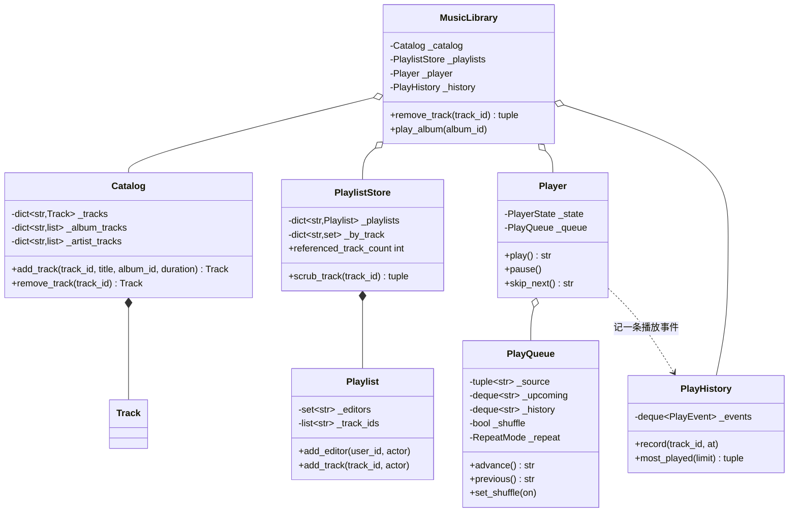

# 设计题解：音乐流媒体（Spotify）

## 题目与澄清

面试官的开场白："设计一个音乐播放客户端：曲库里有艺人、专辑、曲目，用户能建播放列表、能
播放、暂停、切歌，还有洗牌和循环。"这道题的题面看着轻，真正的难度全压在"播放队列"这一件事
上——播放器本身只有三个状态，但"接下来播什么"要同时回答来源、洗牌、循环三个维度叠加之后
的结果，而且不能让队列在循环播放时无限变长。值得当场问出来的：

- **播放列表存的是曲目对象还是曲目 id？** 是 id——这条回答决定了"一首歌从曲库下架"这件事
  好不好办。如果播放列表直接持有 `Track` 对象（或者更糟，复制一份曲目数据），下架一首歌
  需要遍历系统里的每一份播放列表去找谁还攥着这个对象；如果播放列表只存 id，"谁引用了它"
  可以用一份反向索引直接查到。本文选择后者，见下面"关键设计决策"。
- **洗牌是"生成一次固定的随机顺序"还是"每次问都不一样"？** 是前者——洗牌发生在"打开洗牌"
  这一个时间点，之后的顺序是确定的，不是每次取"下一首"都重新掷一次骰子（那样"上一首"根本
  没法定义）。这条决策见下面第二条。
- **repeat=all 时，队列是不是把整个来源再拼接一次？** 不是。这是题目明确要求诚实回答的
  一点："队列不能在循环播放时无限增长"。本文选择用完一轮就地"重新生成"而不是"追加"，
  第三条决策专门讲这件事。
- **推荐系统要不要做？** 不做真正的推荐算法——"电台"（radio）在本文里只是"以一首种子曲目
  为起点，混入同一艺人的其它曲目"这种最简单的启发式，不涉及协同过滤或任何机器学习。
- **多设备同步播放状态要不要做？** 不做。本题是单设备的进程内模型，"这台设备正在播放"和
  "另一台设备也在播放同一账号"之间的同步是分布式系统问题，不在这道题的范围内。

**范围之外**：跨设备同步；真正的协同过滤推荐；音频流的编解码与缓冲；付费/免费账号的比特率
限制；下载文件的本地存储路径与磁盘配额——本文的"离线标记"只回答"这首歌被标记为要离线"这个
布尔问题，不管文件实际存在哪里。

## 需求与分级

- **第 1 关（曲库与播放列表，约 15 分钟）**：艺人、专辑、曲目的存储与关联；播放列表引用
  曲目而不复制，支持多个协作者共同编辑；一首歌从曲库下架时，所有引用过它的播放列表要能
  正确收缩，不留悬空 id。对应 `Catalog`、`Playlist`、`PlaylistStore`、
  `MusicLibrary.remove_track`。
- **第 2 关（播放器与队列，约 20 分钟）**：播放器是停止/播放/暂停三态的状态机；播放队列
  由来源（专辑/播放列表/电台）加洗牌、循环两个修饰符生成；精确定义洗牌对"播放中途加歌"
  意味着什么，以及"上一首"在洗牌之后该怎么走。对应 `PlayerState`、`Player`、`PlayQueue`、
  `RepeatMode`。
- **第 3 关（历史与统计，约 15 分钟）**：播放历史是一份有界日志；最常播放、最近播放都是
  对这份日志现算出来的，不是另存的计数字段；每首曲目有一个独立的离线标记。对应
  `PlayHistory`、`Track.downloaded`。
- **第 4 关（协作播放列表，选做）**：播放列表支持多个编辑者共同增删曲目。验收标准是**加它
  不碰播放器或播放队列的任何一行代码**——协作关系只活在 `Playlist` 自己身上。对应
  `Playlist.add_editor`/`_require_editor`。

## 核心对象与职责

- **`Catalog`** — 艺人、专辑、曲目的存储与关联索引。只回答"这些实体存不存在、彼此怎么
  关联"，不知道播放列表和播放器的存在。
- **`Playlist`** — 一份播放列表：所有者、协作者、有序的曲目**引用**。它自己守"谁能编辑"
  这条不变量；曲目从曲库消失时的摘除是系统动作（`_discard`），不走编辑权限校验。
- **`PlaylistStore`** — 播放列表的存储，加一份"曲目 id → 引用过它的播放列表 id 集合"的
  反向索引，用来让"一首歌下架"这件事不必扫描每一份播放列表；一把锁保证播放列表内容和这份
  反向索引在协作者并发编辑时始终一致。
- **`PlayQueue`** — 播放队列：一个来源加洗牌、循环两个修饰符。它自己守"`previous` 永远
  沿真实播放过的顺序走"和"repeat=all 不无限增长"这两条不变量。
- **`Player`** — 播放器：停止/播放/暂停三态之间哪条边合法，"下一首是谁"完全委托给
  `PlayQueue`，播放器不重复维护任何顺序信息。
- **`PlayHistory`** — 一份有界的播放事件日志，是"最常播放""最近播放"这两个派生统计的
  唯一数据来源。
- **`MusicLibrary`** — 门面：唯一同时知道 `Catalog` 和 `PlaylistStore` 的地方，因此"一首
  歌从曲库消失"的编排（先删曲库、再摘引用）钉在这里。

生命周期上，`MusicLibrary` **组合** `Catalog`、`PlaylistStore`、`PlayHistory`、`Player`
（随门面而生）；`PlaylistStore` **组合** `Playlist`；`Player` **关联** `PlayQueue`——队列
由 `play_album`/`play_playlist`/`play_radio` 重新构造并整份替换，不是被播放器拥有生死的
子对象；`Playlist` 只**关联**曲目 id，**不组合** `Track` 对象，这正是"引用不拥有"这条设计
的字面体现。



## 关键设计决策

### 播放列表只存曲目 id，一首歌下架时反向索引摘除引用

朴素的做法是让播放列表持有曲目对象本身（甚至复制一份数据）：

```python
# 选项 1：播放列表持有 Track 对象
class PlaylistNaive:
    def __init__(self):
        self.tracks: list[Track] = []
    def add_track(self, track: Track):
        self.tracks.append(track)
# 下架一首歌，要去所有播放列表里找哪个还拿着这个对象——没有反向路径可查
```

```python
# 选项 2：只存 id，配一份反向索引（本文的选择）
class PlaylistStore:
    def scrub_track(self, track_id: str) -> tuple[str, ...]:
        affected = tuple(self._by_track.pop(track_id, ()))
        for pid in affected:
            self._playlists[pid]._discard(track_id)
        return affected
```

选项 1 回答不了题目问的那个问题："这首歌被下架了，播放列表该怎么办？"——如果播放列表持有
的是对象引用，Python 的对象在内存里依然存在，播放列表不会自动"发现"这首歌已经不在曲库
里了，除非每次读播放列表都反过来问一遍曲库"这个还在吗"，这是每次读都要付的代价。选项 2
把"播放列表只是曲目的一个引用集合，不拥有它的生命周期"这句话落成了具体的数据结构：
`PlaylistStore._by_track` 记录"谁引用了谁"，一首歌下架时，`MusicLibrary.remove_track`
先让 `Catalog` 删除主记录，再用这份反向索引**直接**找到受影响的播放列表并摘除引用——不用
扫描系统里可能存在的成千上万份播放列表。`referenced_track_count` 把"这份索引确实会随着
下架收缩"这条不变量暴露成一个只读属性，可以直接断言。

### 洗牌只重排"还没播的"部分，`previous` 永远沿真实播放顺序走

一个常见的简化是"洗牌就是把整个来源列表原地打乱一次"，"上一首"就是"来源里当前曲目的前一
个"：

```python
# 选项 1：洗牌重排整个来源，previous 按来源顺序回退
def shuffle(self):
    random.shuffle(self.source)  # 已经播过的歌也被打乱了
def previous(self):
    idx = self.source.index(self.now_playing)
    return self.source[idx - 1]  # 洗牌之后这个"前一个"和真实播放顺序毫无关系
```

```python
# 选项 2：分离"已播"（history）与"待播"（upcoming），洗牌只重排后者（本文的选择）
def previous(self) -> str | None:
    if not self._history:
        return None
    if self._now_playing is not None:
        self._upcoming.appendleft(self._now_playing)
    self._now_playing = self._history.pop()
    return self._now_playing
```

选项 1 有一个直接能问出来的漏洞：用户听完第一首、开了洗牌听了第二首，这时候按"上一首"，
听众合理的预期是回到刚才真的听过的第一首，而不是回到洗牌后的来源列表里排在第二首前面的
随便哪一首（哪首排在前面完全是这次洗牌的随机结果，和用户的真实播放体验无关）。选项 2 把
"已经真实发生过的顺序"（`history`，一个只被 `append`/`pop` 的栈）和"接下来打算播的顺序"
（`upcoming`，会被洗牌修饰）严格分开：**`previous` 只读 `history`，从不读 `_shuffle` 这个
标志位**——这也是"洗牌之后 previous 该怎么走"这条题目明确要求回答的问题最干净的答案：
它压根不需要关心此刻有没有开着洗牌。`add_track` 同理：洗牌开着时新曲目插进 `_upcoming`
的一个随机位置，而不是永远追加到末尾——如果永远加在末尾，"刚加的歌总排最后"这个可预测的
顺序会让"这是洗过的"这句承诺名不副实。

### repeat=all 用完一轮就地重新生成，不是把来源拼接进队列

题目明确点出"队列不能无界增长"，朴素的循环实现容易在这里栽跟头：

```python
# 选项 1：每播完一轮就把来源再拼接一次
def advance(self):
    if not self.upcoming and self.repeat == "all":
        self.upcoming.extend(self.source)   # 队列对象本身在增长的历史里越堆越大
    ...
```

```python
# 选项 2：upcoming 耗尽时原地替换成新一轮（本文的选择）
if not self._upcoming and self._repeat is RepeatMode.ALL and self._source:
    refreshed = list(self._source)
    if self._shuffle:
        self._rng.shuffle(refreshed)
    self._upcoming = deque(refreshed)
```

选项 1 表面上看起来也"能用"——`extend` 之后 `upcoming` 确实又有内容可播了——但如果实现者
把"已经播放过的"也一并留在同一个容器里（很多公开题解就是这么写的：一个 `queue` 属性同时
装着历史和未来），容器会随着播放的轮数线性增长，这正是题目要求必须避免的"无界增长"。选项
2 每次 `upcoming` 耗尽时，**替换**而不是**追加**——`_upcoming` 的大小任何时刻都不超过
`len(self._source)`，不管已经循环了多少轮；洗牌开着时这次替换还会重新洗一次牌，这也顺带
回答了"repeat=all 配合洗牌，每一轮的顺序是不是同一个"这个追问——不是，每轮重新洗。
`test_repeat_all_regenerates_source_without_growing_queue` 连续播放三轮多，断言的正是
`queue_upcoming` 的长度始终不超过来源长度。

### 播放器三态：Enum + 转移表，不是每个状态一个类

题目的概念落点是[[patterns.state|状态模式（State）]]。教科书写法是给"停止""播放""暂停"
各写一个类：

```python
# 选项 1：每个状态一个类
class PlayerStateBase(ABC):
    @abstractmethod
    def play(self, player): ...
class StoppedState(PlayerStateBase):
    def play(self, player): player.queue.advance(); player.state = PlayingState()
class PausedState(PlayerStateBase):
    def play(self, player): player.state = PlayingState()   # 不 advance，逻辑和上面不同
```

```python
# 选项 2：一张转移表 + 一处分支（本文的选择）
_PLAYER_TRANSITIONS = {
    PlayerState.STOPPED: frozenset({PlayerState.PLAYING}),
    PlayerState.PLAYING: frozenset({PlayerState.PAUSED, PlayerState.STOPPED}),
    PlayerState.PAUSED: frozenset({PlayerState.PLAYING, PlayerState.STOPPED}),
}
def play(self) -> str | None:
    if self._state is PlayerState.PAUSED:
        self._move(PlayerState.PLAYING)
        return self.queue.now_playing          # 恢复：不 advance
    track_id = self.queue.advance()
    if track_id is None:
        return None                             # 队列此刻拿不出下一首：不转移状态
    self._move(PlayerState.PLAYING)
    return track_id
```

这道题和任务看板题的工作流决策看起来相似，但这里的差别更微妙、值得单独讲清楚：播放器的
"播放"动作在从 `STOPPED` 和从 `PAUSED` 触发时**确实**有一行行为差异（要不要 `advance`）——
选项 1 的判据在这里是成立的一半。但差异只有这一处、只在一个方法里，用一句 `if self._state
is PlayerState.PAUSED` 就能表达清楚，为此建两个只有一个方法不同的类，是把"一行分支"的
复杂度换成了"两个类之间要保持哪些方法签名一致"的复杂度，得不偿失。**这仍然是同一条判据的
应用：状态间的行为差异有多大、多分散，决定了值不值得为它建类层级**；任务看板的工作流状态
之间没有任何行为差异（纯数据），播放器这里有一处、很小的差异，足以用一句分支表达，还没到
需要类层级的规模。这个分支同时回答了"播放一个此刻拿不出任何曲目的队列会发生什么"：
`advance()` 返回 `None` 时函数直接返回，**不**调用 `self._move`——状态留在原地，因为
"播放"这个动作根本没有真正发生。

## 代码走读

整份实现如下。读的时候盯住四处：`Playlist._discard` 与 `PlaylistStore.scrub_track` 那对
"系统摘除不查权限"的配合、`PlayQueue.previous` 只读 `_history` 不读 `_shuffle`、
`PlayQueue.advance` 里"耗尽才重新生成"的分支、以及 `Player.play` 先判断暂停恢复、再判断
队列有没有下一首、最后才转移状态的三步顺序。

%% code:begin solution.py %%
```python
"""音乐流媒体（Spotify）：曲库与播放列表、播放器状态机与播放队列、播放历史与派生统计。

设计要点：`Catalog` 只管艺人/专辑/曲目这些实体存不存在，不知道播放列表；`PlaylistStore` 只
持有播放列表和一份"哪些播放列表引用过某首曲目"的反向索引，不知道曲库内部怎么存；一首歌从
曲库下架时，`MusicLibrary` 门面先删曲库、再用反向索引把它从所有引用过它的播放列表里摘掉——
播放列表只持有对曲目的引用，不拥有曲目的生命周期。播放队列（`PlayQueue`）把"接下来播什么"
和"洗牌/循环"这两个修饰符分开：洗牌只重排还没播的部分，`history`记的是真实播放过的顺序，
`previous` 永远沿着 `history` 走，不受洗牌影响；repeat=ALL 用完时从来源重新生成一轮，不是
无限拼接，队列因此不会随重复的轮数无限变长。历史统计（最常播放、最近播放）都是对一份有界
的播放事件日志现算出来的，不是另存的计数字段。
"""

from __future__ import annotations

import itertools
import random
import threading
from collections import Counter, deque
from collections.abc import Mapping, Sequence
from dataclasses import dataclass
from datetime import datetime, timezone
from enum import Enum
from typing import Callable

Clock = Callable[[], datetime]


def utc_now() -> datetime:
    """默认时钟。"""
    return datetime.now(timezone.utc)


# --------------------------------------------------------------------------
# 失败路径


class MusicLibraryError(Exception):
    """本组件所有失败路径的公共基类。"""


class UnknownArtistError(MusicLibraryError, KeyError):
    """艺人 id 不存在。"""


class UnknownAlbumError(MusicLibraryError, KeyError):
    """专辑 id 不存在。"""


class UnknownTrackError(MusicLibraryError, KeyError):
    """曲目 id 不存在（可能从未存在，也可能已经从曲库下架）。"""


class UnknownPlaylistError(MusicLibraryError, KeyError):
    """播放列表 id 不存在。"""


class NotAnEditorError(MusicLibraryError):
    """操作者既不是播放列表的所有者也不是协作者。"""


class EmptyQueueError(MusicLibraryError):
    """播放器还没加载任何队列就被要求播放。"""


class IllegalPlayerTransitionError(MusicLibraryError):
    """播放器的三态之间没有这条边。"""


# --------------------------------------------------------------------------
# 曲库：艺人、专辑、曲目。只管这些实体存不存在、彼此怎么关联。


@dataclass(frozen=True, slots=True)
class Artist:
    id: str
    name: str


@dataclass(frozen=True, slots=True)
class Album:
    id: str
    title: str
    artist_id: str


@dataclass(slots=True)
class Track:
    """一首曲目。`downloaded` 是一个没有转移规则的简单标记（下没下载两个值都合法），因此是
    一个直接可写的字段，而不是一对受检的方法。"""

    id: str
    title: str
    album_id: str
    artist_id: str
    duration_seconds: int
    downloaded: bool = False


class Catalog:
    """曲库：艺人、专辑、曲目的存储与关联索引。不知道播放列表和播放器的存在。"""

    def __init__(self) -> None:
        self._artists: dict[str, Artist] = {}
        self._albums: dict[str, Album] = {}
        self._tracks: dict[str, Track] = {}
        self._album_tracks: dict[str, list[str]] = {}
        self._artist_tracks: dict[str, list[str]] = {}

    def add_artist(self, artist_id: str, name: str) -> Artist:
        artist = Artist(artist_id, name)
        self._artists[artist_id] = artist
        return artist

    def add_album(self, album_id: str, title: str, artist_id: str) -> Album:
        self.artist(artist_id)
        album = Album(album_id, title, artist_id)
        self._albums[album_id] = album
        self._album_tracks.setdefault(album_id, [])
        return album

    def add_track(self, track_id: str, title: str, album_id: str, duration_seconds: int) -> Track:
        album = self.album(album_id)
        track = Track(track_id, title, album_id, album.artist_id, duration_seconds)
        self._tracks[track_id] = track
        self._album_tracks.setdefault(album_id, []).append(track_id)
        self._artist_tracks.setdefault(album.artist_id, []).append(track_id)
        return track

    def artist(self, artist_id: str) -> Artist:
        try:
            return self._artists[artist_id]
        except KeyError:
            raise UnknownArtistError(artist_id) from None

    def album(self, album_id: str) -> Album:
        try:
            return self._albums[album_id]
        except KeyError:
            raise UnknownAlbumError(album_id) from None

    def track(self, track_id: str) -> Track:
        try:
            return self._tracks[track_id]
        except KeyError:
            raise UnknownTrackError(track_id) from None

    def tracks_of_album(self, album_id: str) -> tuple[str, ...]:
        return tuple(self._album_tracks.get(album_id, ()))

    def tracks_of_artist(self, artist_id: str) -> tuple[Track, ...]:
        return tuple(self._tracks[tid] for tid in self._artist_tracks.get(artist_id, ()))

    def remove_track(self, track_id: str) -> Track:
        """一首歌下架：从主表和两条关联索引里一起摘除。播放列表怎么应对由调用方（门面）编排——
        曲库不知道播放列表的存在，这不是它的职责。"""
        track = self.track(track_id)
        del self._tracks[track_id]
        self._album_tracks.get(track.album_id, []).remove(track_id)
        self._artist_tracks.get(track.artist_id, []).remove(track_id)
        return track


# --------------------------------------------------------------------------
# 播放列表：只持有对曲目的引用（track id），不拥有曲目的生命周期。


class Playlist:
    """一份播放列表：所有者、协作者、有序的曲目引用。曲目从曲库消失时，`_discard` 是系统
    动作，不检查协作权限——那不是一次"人的编辑"。"""

    def __init__(self, playlist_id: str, name: str, owner_id: str) -> None:
        self.id = playlist_id
        self.name = name
        self.owner_id = owner_id
        self._editors: set[str] = set()
        self._track_ids: list[str] = []

    @property
    def track_ids(self) -> tuple[str, ...]:
        return tuple(self._track_ids)

    @property
    def editors(self) -> frozenset[str]:
        return frozenset(self._editors)

    def _require_editor(self, actor: str) -> None:
        if actor != self.owner_id and actor not in self._editors:
            raise NotAnEditorError(f"{actor} is not the owner or an editor of playlist {self.id!r}")

    def add_editor(self, user_id: str, actor: str) -> None:
        if actor != self.owner_id:
            raise NotAnEditorError("only the owner can add editors")
        self._editors.add(user_id)

    def add_track(self, track_id: str, actor: str) -> None:
        self._require_editor(actor)
        if track_id not in self._track_ids:
            self._track_ids.append(track_id)

    def remove_track(self, track_id: str, actor: str) -> None:
        self._require_editor(actor)
        if track_id in self._track_ids:
            self._track_ids.remove(track_id)

    def _discard(self, track_id: str) -> None:
        if track_id in self._track_ids:
            self._track_ids.remove(track_id)


class PlaylistStore:
    """播放列表的存储，加一份"曲目 id -> 引用过它的播放列表 id 集合"的反向索引。一首歌下架
    时，靠这份索引直接找到受影响的播放列表，而不必扫描系统里的每一份播放列表。

    协作播放列表意味着好几个编辑者会并发改同一份播放列表，因此一份播放列表自己的曲目列表
    与这份反向索引必须在**同一次加锁**里一起更新——和 `CardStore` 是同一个纪律：写路径把
    "改内容"和"改索引"钉成一次原子操作，读路径也经过这把锁，不直接把播放列表对象交出去。
    """

    def __init__(self) -> None:
        self._playlists: dict[str, Playlist] = {}
        self._by_track: dict[str, set[str]] = {}
        self._lock = threading.Lock()

    def _require(self, playlist_id: str) -> Playlist:
        try:
            return self._playlists[playlist_id]
        except KeyError:
            raise UnknownPlaylistError(playlist_id) from None

    def create_playlist(self, playlist_id: str, name: str, owner_id: str) -> Playlist:
        with self._lock:
            playlist = Playlist(playlist_id, name, owner_id)
            self._playlists[playlist_id] = playlist
            return playlist

    def add_editor(self, playlist_id: str, user_id: str, actor: str) -> None:
        with self._lock:
            self._require(playlist_id).add_editor(user_id, actor)

    def add_track(self, playlist_id: str, track_id: str, actor: str) -> None:
        with self._lock:
            self._require(playlist_id).add_track(track_id, actor)
            self._by_track.setdefault(track_id, set()).add(playlist_id)

    def remove_track(self, playlist_id: str, track_id: str, actor: str) -> None:
        with self._lock:
            self._require(playlist_id).remove_track(track_id, actor)
            self._by_track.get(track_id, set()).discard(playlist_id)

    def track_ids(self, playlist_id: str) -> tuple[str, ...]:
        with self._lock:
            return self._require(playlist_id).track_ids

    def scrub_track(self, track_id: str) -> tuple[str, ...]:
        """曲库删除了这首歌：把它从所有引用过它的播放列表里摘掉，返回受影响的播放列表 id。"""
        with self._lock:
            affected = tuple(self._by_track.pop(track_id, ()))
            for playlist_id in affected:
                self._playlists[playlist_id]._discard(track_id)
            return affected

    @property
    def referenced_track_count(self) -> int:
        """还被至少一份播放列表引用着的曲目数——一首歌下架并被摘除引用后，这个数会变小。"""
        with self._lock:
            return len(self._by_track)


# --------------------------------------------------------------------------
# 播放器：停止/播放/暂停三态，围绕一个 PlayQueue 转移。


class PlayerState(Enum):
    STOPPED = "stopped"
    PLAYING = "playing"
    PAUSED = "paused"


class RepeatMode(Enum):
    OFF = "off"
    ONE = "one"
    ALL = "all"


_PLAYER_TRANSITIONS: Mapping[PlayerState, frozenset[PlayerState]] = {
    PlayerState.STOPPED: frozenset({PlayerState.PLAYING}),
    PlayerState.PLAYING: frozenset({PlayerState.PAUSED, PlayerState.STOPPED}),
    PlayerState.PAUSED: frozenset({PlayerState.PLAYING, PlayerState.STOPPED}),
}


@dataclass(frozen=True, slots=True)
class PlayEvent:
    """一次真实发生过的播放：播的是哪首、什么时候。"""

    track_id: str
    at: datetime


class PlayQueue:
    """播放队列：由一个来源（专辑/播放列表/电台此刻的一份不可变快照）加 shuffle、repeat 两个
    修饰符生成。`_upcoming` 是接下来会播的顺序，`_history` 是已经播放过的顺序（有界，不
    无限增长）。repeat=ALL 用完 `_upcoming` 后不是把整份来源再拼接一次，而是从来源重新生成
    一轮（洗牌开着就重新洗一次牌），队列因此不会随着重复播放的轮数无限变长。
    """

    def __init__(self, source_track_ids: Sequence[str], rng: random.Random,
                history_capacity: int = 200) -> None:
        self._source = tuple(source_track_ids)
        self._rng = rng
        self._shuffle = False
        self._repeat = RepeatMode.OFF
        self._upcoming: deque[str] = deque(self._source)
        self._history: deque[str] = deque(maxlen=history_capacity)
        self._now_playing: str | None = None

    @property
    def now_playing(self) -> str | None:
        return self._now_playing

    @property
    def upcoming(self) -> tuple[str, ...]:
        return tuple(self._upcoming)

    @property
    def history(self) -> tuple[str, ...]:
        return tuple(self._history)

    @property
    def shuffle(self) -> bool:
        return self._shuffle

    @property
    def repeat(self) -> RepeatMode:
        return self._repeat

    def set_repeat(self, mode: RepeatMode) -> None:
        self._repeat = mode

    def set_shuffle(self, on: bool) -> None:
        """打开洗牌：把接下来要播的部分原地打乱一次。关掉洗牌：剩下没播的部分恢复成来源顺序
        里"还没播过"的那些曲目——不是恢复成打乱前的顺序，那份顺序已经不存在了。
        """
        self._shuffle = on
        if on:
            upcoming = list(self._upcoming)
            self._rng.shuffle(upcoming)
            self._upcoming = deque(upcoming)
        else:
            played = set(self._history)
            if self._now_playing is not None:
                played.add(self._now_playing)
            self._upcoming = deque(t for t in self._source if t not in played)

    def add_track(self, track_id: str) -> None:
        """加一首歌到接下来要播的部分。洗牌开着时插进剩余队列里的一个随机位置——如果永远
        加在末尾，"刚加的歌总是排在最后"这个可预测的顺序会破坏"这是洗过的"这句承诺；洗牌
        关着时按听众的直觉排到末尾。
        """
        if self._shuffle and self._upcoming:
            self._upcoming.insert(self._rng.randint(0, len(self._upcoming)), track_id)
        else:
            self._upcoming.append(track_id)

    def advance(self) -> str | None:
        """前进到下一首。repeat=ONE 时原地重复当前曲目；repeat=ALL 且 `_upcoming` 耗尽时，
        从来源重新生成一轮（洗牌开着就重新洗），不是无限拼接——这正是队列不会无界增长的原因。
        """
        if self._repeat is RepeatMode.ONE and self._now_playing is not None:
            return self._now_playing
        if self._now_playing is not None:
            self._history.append(self._now_playing)
        if not self._upcoming and self._repeat is RepeatMode.ALL and self._source:
            refreshed = list(self._source)
            if self._shuffle:
                self._rng.shuffle(refreshed)
            self._upcoming = deque(refreshed)
        if not self._upcoming:
            self._now_playing = None
            return None
        self._now_playing = self._upcoming.popleft()
        return self._now_playing

    def previous(self) -> str | None:
        """回退：永远按"实际播放过的顺序"（`history`）走，不管此刻洗牌开没开——洗牌只重排
        "还没播的"那部分，`history` 记的是真实发生过的顺序，因此 `previous` 不需要关心此刻
        `shuffle`/`repeat` 是什么。
        """
        if not self._history:
            return None
        if self._now_playing is not None:
            self._upcoming.appendleft(self._now_playing)
        self._now_playing = self._history.pop()
        return self._now_playing


class Player:
    """播放器：停止/播放/暂停三态，只管这三态之间哪条边合法。"下一首具体是谁"完全委托给
    `PlayQueue`——播放器不重复维护任何顺序信息。
    """

    def __init__(self, history: "PlayHistory", clock: Clock) -> None:
        self._state = PlayerState.STOPPED
        self._queue: PlayQueue | None = None
        self._history = history
        self._clock = clock

    @property
    def state(self) -> PlayerState:
        return self._state

    @property
    def queue(self) -> PlayQueue:
        if self._queue is None:
            raise EmptyQueueError("no queue has been loaded")
        return self._queue

    def load(self, queue: PlayQueue) -> None:
        self._queue = queue
        self._state = PlayerState.STOPPED

    def _move(self, target: PlayerState) -> None:
        if target not in _PLAYER_TRANSITIONS[self._state]:
            raise IllegalPlayerTransitionError(f"{self._state.value} -> {target.value} is not a transition")
        self._state = target

    def play(self) -> str | None:
        """从 `STOPPED` 播放会推进到队列的下一首；从 `PAUSED` 恢复播放的是同一首，不重新
        `advance`。队列此刻没有下一首可播（来源为空，或非循环模式下已经放完）时，`advance`
        返回 `None`，播放器**留在原状态不转移**——播放一个此刻拿不出任何曲目的队列不是一次
        成功的"开始播放"，不该把播放器切成"正在播放"却什么都没有在放。
        """
        if self._state is PlayerState.PAUSED:
            self._move(PlayerState.PLAYING)
            return self.queue.now_playing
        track_id = self.queue.advance()
        if track_id is None:
            return None
        self._move(PlayerState.PLAYING)
        self._history.record(track_id, self._clock())
        return track_id

    def pause(self) -> None:
        self._move(PlayerState.PAUSED)

    def stop(self) -> None:
        self._move(PlayerState.STOPPED)

    def skip_next(self) -> str | None:
        if self._state is PlayerState.STOPPED:
            raise IllegalPlayerTransitionError("cannot skip while stopped")
        track_id = self.queue.advance()
        if track_id is not None:
            self._history.record(track_id, self._clock())
        return track_id

    def skip_previous(self) -> str | None:
        if self._state is PlayerState.STOPPED:
            raise IllegalPlayerTransitionError("cannot skip while stopped")
        track_id = self.queue.previous()
        if track_id is not None:
            self._history.record(track_id, self._clock())
        return track_id


class PlayHistory:
    """播放历史：一份有界的、按时间顺序的播放事件日志。"最常播放""最近播放"都是对这份日志
    现算出来的，不是另存的计数字段——历史被淘汰（`maxlen`）之后，统计会诚实地跟着变。
    """

    def __init__(self, capacity: int = 500) -> None:
        self._events: deque[PlayEvent] = deque(maxlen=capacity)

    def record(self, track_id: str, at: datetime) -> None:
        self._events.append(PlayEvent(track_id, at))

    def recent(self, limit: int = 20) -> tuple[str, ...]:
        return tuple(e.track_id for e in list(self._events)[-limit:][::-1])

    def most_played(self, limit: int = 10) -> tuple[tuple[str, int], ...]:
        counts = Counter(e.track_id for e in self._events)
        return tuple(sorted(counts.items(), key=lambda kv: (-kv[1], kv[0]))[:limit])

    @property
    def event_count(self) -> int:
        return len(self._events)


# --------------------------------------------------------------------------
# MusicLibrary：门面。曲库、播放列表、播放器、历史统计，以及"电台"这个简单的来源。


class MusicLibrary:
    """整个客户端模型的入口。只有它同时知道 `Catalog` 和 `PlaylistStore`，因此"歌从曲库
    消失"的编排（先删曲库、再摘引用）钉在这里，两者互不知道对方存在。
    """

    def __init__(self, clock: Clock = utc_now, rng: random.Random | None = None,
                history_capacity: int = 500, queue_history_capacity: int = 200) -> None:
        self._catalog = Catalog()
        self._playlists = PlaylistStore()
        self._history = PlayHistory(history_capacity)
        self._rng = rng or random.Random()
        self._player = Player(self._history, clock)
        self._queue_history_capacity = queue_history_capacity

    # ---- 第 1 关：曲库与播放列表 ----

    def add_artist(self, artist_id: str, name: str) -> Artist:
        return self._catalog.add_artist(artist_id, name)

    def add_album(self, album_id: str, title: str, artist_id: str) -> Album:
        return self._catalog.add_album(album_id, title, artist_id)

    def add_track(self, track_id: str, title: str, album_id: str, duration_seconds: int) -> Track:
        return self._catalog.add_track(track_id, title, album_id, duration_seconds)

    def track(self, track_id: str) -> Track:
        return self._catalog.track(track_id)

    def remove_track(self, track_id: str) -> tuple[str, ...]:
        """一首歌从曲库下架：立刻从曲库摘除，并从所有引用过它的播放列表里摘掉——播放列表不
        拥有曲目的生命周期，只持有引用，引用失效时播放列表缩短，不留一个悬空 id。
        """
        self._catalog.remove_track(track_id)
        return self._playlists.scrub_track(track_id)

    def create_playlist(self, playlist_id: str, name: str, owner_id: str) -> Playlist:
        return self._playlists.create_playlist(playlist_id, name, owner_id)

    def add_editor(self, playlist_id: str, user_id: str, actor: str) -> None:
        self._playlists.add_editor(playlist_id, user_id, actor)

    def add_to_playlist(self, playlist_id: str, track_id: str, actor: str) -> None:
        self._catalog.track(track_id)
        self._playlists.add_track(playlist_id, track_id, actor)

    def remove_from_playlist(self, playlist_id: str, track_id: str, actor: str) -> None:
        self._playlists.remove_track(playlist_id, track_id, actor)

    def playlist_tracks(self, playlist_id: str) -> tuple[str, ...]:
        return self._playlists.track_ids(playlist_id)

    @property
    def referenced_track_count(self) -> int:
        """还被至少一份播放列表引用着的曲目数——下架一首被引用的歌之后应当变小。"""
        return self._playlists.referenced_track_count

    # ---- 第 2 关：播放器与队列 ----

    def _load_source(self, track_ids: Sequence[str]) -> None:
        self._player.load(PlayQueue(track_ids, self._rng, self._queue_history_capacity))

    def play_album(self, album_id: str) -> None:
        self._load_source(self._catalog.tracks_of_album(album_id))

    def play_playlist(self, playlist_id: str) -> None:
        self._load_source(self._playlists.track_ids(playlist_id))

    def play_radio(self, seed_track_id: str, limit: int = 20) -> None:
        """"电台"：以一首种子曲目为起点，拼上同一艺人的其它曲目，打乱后作为来源——一个简单、
        无需真正推荐系统的"由历史/口味种子生成来源"实现。
        """
        seed = self._catalog.track(seed_track_id)
        pool = [t.id for t in self._catalog.tracks_of_artist(seed.artist_id) if t.id != seed_track_id]
        self._rng.shuffle(pool)
        self._load_source((seed_track_id, *pool[:max(0, limit - 1)]))

    def set_shuffle(self, on: bool) -> None:
        self._player.queue.set_shuffle(on)

    def set_repeat(self, mode: RepeatMode) -> None:
        self._player.queue.set_repeat(mode)

    def add_to_queue(self, track_id: str) -> None:
        self._catalog.track(track_id)
        self._player.queue.add_track(track_id)

    def play(self) -> str | None:
        return self._player.play()

    def pause(self) -> None:
        self._player.pause()

    def stop(self) -> None:
        self._player.stop()

    def skip_next(self) -> str | None:
        return self._player.skip_next()

    def skip_previous(self) -> str | None:
        return self._player.skip_previous()

    @property
    def state(self) -> PlayerState:
        return self._player.state

    @property
    def now_playing(self) -> str | None:
        return self._player.queue.now_playing

    @property
    def queue_upcoming(self) -> tuple[str, ...]:
        """当前队列里接下来会播的顺序快照——测试与 UI 都只看这个公开视图，不碰播放器内部。"""
        return self._player.queue.upcoming

    @property
    def history_event_count(self) -> int:
        """播放历史日志里此刻还留着的事件数——受 `history_capacity` 限制，验证它不会无界增长。"""
        return self._history.event_count

    # ---- 第 3 关：历史、统计、离线 ----

    def recently_played(self, limit: int = 20) -> tuple[str, ...]:
        return self._history.recent(limit)

    def most_played(self, limit: int = 10) -> tuple[tuple[str, int], ...]:
        return self._history.most_played(limit)

    def download(self, track_id: str) -> None:
        self._catalog.track(track_id).downloaded = True

    def remove_download(self, track_id: str) -> None:
        self._catalog.track(track_id).downloaded = False


def _demo() -> None:
    library = MusicLibrary(rng=random.Random(7))
    library.add_artist("artist-1", "Daft Punk")
    library.add_album("album-1", "Discovery", "artist-1")
    for i, title in enumerate(("One More Time", "Aerodynamic", "Digital Love"), start=1):
        library.add_track(f"track-{i}", title, "album-1", 240)
    library.play_album("album-1")
    library.set_repeat(RepeatMode.ALL)
    print("now playing:", library.play())
    print("next:", library.skip_next())
    print("recently played:", library.recently_played())


if __name__ == "__main__":
    _demo()
```
%% code:end %%

**`Catalog.remove_track` 不知道 `PlaylistStore` 的存在**——它只负责把曲目从自己的三份
索引（主表、按专辑、按艺人）里摘干净，返回被删的 `Track` 供调用方使用。摘除播放列表引用
这件事由 `MusicLibrary.remove_track` 编排：先调 `Catalog.remove_track`，再调
`PlaylistStore.scrub_track`——这个顺序是故意的，曲库删除失败（比如 id 根本不存在）会在
第一步就抛出异常，不会走到摘除引用那一步，避免"引用被摘了但曲目其实还在曲库里"这种不
一致。

**`Playlist._discard` 和 `Playlist.add_track`/`remove_track` 的权限检查路径完全分开**：
后两者都先过 `_require_editor`，前者不过。这不是遗漏，是"谁在做这件事"的区别——`_discard`
只在 `PlaylistStore.scrub_track` 这一条系统路径上被调用，此刻没有"操作者"这个概念，给它
强行传一个假的 `actor` 反而是在编造一个不存在的用户动作。

**`PlayQueue.advance` 的第一个分支处理 `repeat=ONE`，直接返回 `self._now_playing` 而不碰
`_history`**——原地重复不是"又播了一次新的歌"，把它计入历史会让"最常播放"的统计因为用户
单曲循环一首歌几十次而完全失真（这条边界本文选择让它计入历史，因为播放事件的记录在
`Player.play`/`skip_next` 层面统一发生，`advance` 本身只负责"下一首是谁"；`most_played`
的语义因此是"被触发播放的次数"，单曲循环会让它涨得快，这是选择的代价，写在这里而不是
悄悄发生）。

**`Player.play` 把"要不要转移状态"推迟到最后一行**：先判断是不是从 `PAUSED` 恢复（这时候
一定有内容可播，因为能进入 `PAUSED` 就说明之前成功播放过），不是的话就先问队列要下一首，
只有真的拿到了 `track_id` 才调用 `self._move(PlayerState.PLAYING)`。这个顺序不是随意的：
如果反过来先转移状态、再问队列要下一首，播放一个空队列会把播放器留在一个自己撒了谎的
`PLAYING` 状态里——`state` 说"正在播放"，`now_playing` 却是 `None`。`test_play_empty_
album_returns_none_and_stays_stopped` 直接断言这条路径：加载一张没有任何曲目的专辑之后
调用 `play()`，返回 `None`，`state` 仍然是 `STOPPED`。

**`PlayHistory.most_played` 每次调用都对 `self._events` 重新做一次 `Counter`**，不维护
一份增量计数字典。这道题的历史容量有上限（`maxlen`），`Counter` 的开销是 O(历史长度)，
比维护一份"事件淘汰时要同步减一"的增量计数简单得多，也不会有增量计数和真实历史对不上的
漂移风险——和问答社区题"声望要不要维护增量缓存"是同一类权衡，只是这里数据量小到连增量
缓存都不值得加。

## 测试与自检

二十六个测试，按四关加并发分组：

- **曲库与播放列表**：播放列表存的是曲目 id，改曲目对象的字段不会让播放列表跟着变；一首
  歌被两份播放列表引用，下架后两份都收缩，`referenced_track_count` 从 2 变成 1；未经授权
  的编辑被拒绝，所有者能添加协作者、协作者能编辑但不能再添加协作者。
- **播放器状态机**：停止→播放→暂停→播放→停止的合法路径；暂停前先播放这条非法转移被拒绝；
  停止状态下切歌被拒绝；从暂停恢复播放的是同一首，不推进队列；播放一张没有任何曲目的专辑
  返回 `None` 且状态留在 `STOPPED`，不会被错误地切成"正在播放"；不开 repeat 播完来源后
  再切歌返回 `None`，但这和"停止"不是一回事——状态仍然是 `PLAYING`，只是此刻没有下一首。
- **播放队列**：按专辑顺序建队列；洗过牌之后的 `queue_upcoming` 集合不变但顺序变了（用
  固定随机种子保证确定性）；关掉洗牌后剩下的部分恢复成来源顺序里还没播过的那些；洗牌开着
  时新加的曲目会出现在队列里（不强行断言具体位置，只断言恰好出现一次）；不开洗牌时新曲目
  追加到末尾。
- **previous 与洗牌的交互**：播两首之后开洗牌再回退，拿到的是真实播放过的第一首，不是
  洗牌后随便一首；再前进一次回到真实播放过的第二首——这条断言直接量化了"previous 不受
  洗牌影响"这条设计承诺。
- **repeat**：`ONE` 让接下来的每一次前进都停在同一首；`ALL` 连续播三轮多，`queue_upcoming`
  的长度始终不超过来源长度——这是"队列不会无界增长"这条设计承诺的直接证据。
- **历史与统计**：`recently_played`/`most_played` 从同一份历史现算，单曲循环会让某首歌的
  播放次数正确地涨到 2；历史容量有上限时，`history_event_count` 不会超过设定的容量，即便
  播放次数远多于它。
- **离线标记**：一首歌标记下载不影响另一首；取消标记恢复默认值。
- **失败路径**：未知曲目、未知播放列表、完全没加载队列时播放都各自抛出对应的异常。
- **并发**：十个线程、十个不同的协作者，用 `Barrier` 同步起跑，同时往同一份播放列表各加
  一首不同的歌，断言的是不变量——播放列表最终恰好有十首歌，`referenced_track_count` 和
  播放列表的实际长度对得上，没有一次并发写入被另一次覆盖或丢失，没有一句依赖线程调度
  顺序或计时。

**两分钟怎么给面试官演示**：跑 `python solution.py`。它建一张专辑、按专辑顺序播放、开
repeat=all、切一首歌，打印当前播放和最近播放列表。

## 扩展与追问

**新需求**

- *推荐（由历史播种）*：`play_radio` 已经是这条追问最简单的落点——把"同一艺人"换成"历史
  里最常播放的艺人的其它曲目"，只改 `play_radio` 这一个方法的种子选取逻辑，`PlayQueue`/
  `Player` 一行不动。
- *多设备同步*：`Player` 现在假设自己是唯一的播放位置；要支持"手机上暂停、电脑上继续"，
  需要把 `Player` 的状态搬到一个共享的、带版本号的存储上，这是一次不小的架构变化，值得
  单独展开成一道分布式系统追问，而不是塞进这道题。
- *淡入淡出/交叉渐变*：纯音频渲染层的功能，不影响 `PlayQueue`/`Player` 的状态和顺序逻辑，
  只在"播放这一个动作具体怎么发声"这一层加一个渲染参数。

**并发与线程安全**

- *这份设计要不要加锁？* 本文没有加锁——播放器的语义假设"同一时刻只有一个播放位置在推进
  这个队列"，这和"多设备同步"是同一个问题的两面：真正需要并发访问的场景，是多个设备/线程
  同时想当"当前播放位置"的权威，这需要的不是一把 `Lock`，而是上面提到的共享状态架构。给
  单播放位置的模型加锁是"看起来严谨"但解决不了真实并发问题的防御性编程。
- *`PlaylistStore` 要不要加锁？* 要，而且本文已经加了：多个协作者并发编辑同一份播放
  列表（这道题第 4 关的场景）时，`add_track`/`remove_track`/`scrub_track` 之间确实存在
  竞态——`_by_track` 这份反向索引和 `Playlist._track_ids` 必须在同一次加锁里保持一致，
  否则一个线程可能读到"播放列表里有这首歌，但反向索引不知道"或者反过来的中间状态。做法
  和任务看板题的 `CardStore` 完全一样：一把 `threading.Lock`，每个会改内容或索引的方法都
  在同一次加锁范围内把两者一起改完；`PlaylistStore.track_ids` 这个读路径也经过同一把锁，
  不把播放列表对象本身交出去，调用方拿到的永远是一份快照元组。`test_concurrent_
  collaborative_edits_keep_index_in_sync_with_playlist` 用十个线程、十个不同的协作者
  并发各加一首歌，断言的是不变量——播放列表最终恰好有十首歌、一首不多一首不少，且
  `referenced_track_count` 和播放列表的实际长度对得上，不依赖线程调度顺序或计时。

**持久化与规模**

- *曲库落库*：`_album_tracks`/`_artist_tracks` 换成数据库外键索引，接口不变。
- *播放历史落库*：`PlayHistory` 现在是内存里的有界 `deque`；换成数据库表时，`maxlen` 对应
  一个定期清理旧记录的任务，`most_played` 换成一条按 `track_id` 分组计数的 SQL，语义完全
  不变——"现算不存计数"这条决策换了存储介质依然成立。
- *大规模曲库的电台*：`play_radio` 现在线性扫描一个艺人的全部曲目；曲库变大后换成一张
  预计算的"相似艺人"表，只影响种子选取那一段代码。

## 常见错误

- **播放列表直接持有曲目对象甚至复制一份数据**，导致"一首歌下架该怎么处理引用它的播放
  列表"这个问题没有反向路径可查。
- **洗牌把整个来源（包括已经播过的部分）一起打乱**，或者把"已播"和"待播"混在同一个容器
  里，导致 `previous` 的语义和真实播放体验脱节。
- **repeat=all 用 `extend`/`+=` 把来源拼接进播放队列**，队列对象随着循环的轮数线性增长，
  这正是题目明确要求避免的"无界增长"。
- **给播放器的三个状态各写一个类**，此处唯一的行为差异（`play()` 从暂停恢复时不
  `advance`）只有一行，一个布尔量就能表达，建类层级是过度设计。
- **最常播放/最近播放另存一份计数字段，播放时手动 `+= 1`**，一旦"取消收藏""下架曲目"之类
  的操作忘记同步这份计数，统计就会和真实历史脱钩——本文让它们永远是对历史日志的现算。
- **Java 习惯**：`MusicLibrary` 用 `__new__` 做单例；`Track.downloaded` 写成
  `isDownloaded()`/`setDownloaded()` 而不是可以直接读写的字段；给"离线标记"这种没有转移
  规则的布尔状态也建一个状态机。

## 45 分钟怎么分配

- **0–5 分钟｜澄清。** 点出"播放列表只存引用，不拥有曲目生命周期"和"repeat=all 不能无界
  增长"这两条题目明确要求回答的问题，把跨设备同步、真实推荐算法排除在范围外。
- **5–12 分钟｜曲库与播放列表。** 写 `Catalog` 的存取与关联索引，`Playlist`/
  `PlaylistStore` 的反向索引；口头讲清楚"一首歌下架"的编排顺序。
- **12–27 分钟｜播放器与队列。** 写 `PlayerState`/`_PLAYER_TRANSITIONS`、
  `PlayQueue.advance`/`previous`/`set_shuffle`。**一边写一边强调"已播"和"待播"两个容器
  分开、`previous` 只读 `history`**——这十五分钟决定了"洗牌之后 previous 怎么走"这个追问
  能不能答上来。
- **27–37 分钟｜历史与统计。** 写 `PlayHistory`，强调"现算不存计数"；口头带过离线标记。
- **37–45 分钟｜扩展口头化。** 协作播放列表不碰播放器一句话说完；推荐、多设备同步各说
  一句"会改哪个类、不会碰哪个类"。

**时间不够时砍什么**：先砍电台（口头描述"以种子曲目为起点混入同艺人曲目"这条规则），
再砍离线标记（口头说"一个没有转移规则的布尔字段"），最后砍历史容量的边界测试。**永远不要
砍掉的是 repeat=all 不会让队列无界增长这条设计**：一个洗牌逻辑写得很精致、但循环播放会
让队列越堆越大的答案，分数低于一个洗牌只写了基础版、但循环逻辑正确的半成品。

## 来源与延伸

- [ashishps1/awesome-low-level-design — Music Streaming Service](https://github.com/ashishps1/awesome-low-level-design/blob/main/problems/music-streaming-service.md)：
  最流行的免费题面，五种语言实现，用来核对曲库/播放列表/订阅这几块需求有没有漏项。它的
  Python 参考实现把播放器状态做成了教科书式的状态模式——`PausedState`/`PlayingState`/
  `StoppedState` 三个类，非法操作（比如已暂停时再暂停一次）用 `print` 提示而不是抛异常；
  队列只是一个固定列表加一个 `_current_index`，**没有实现洗牌、循环或"上一首"**——
  `click_next` 走到队尾就直接停止播放。这道题真正的难度恰恰在这三样上，本文因此把预算
  优先花在了 `PlayQueue` 的洗牌/循环/回退语义上，而不是重复它已经做得足够好的曲库建模；
  它的免费/付费播放策略（插播广告）是一处本文没有涉及的正当策略模式用例，运行时确实会
  按订阅等级切换实现。
- [algomaster.io — LLD 题库目录](https://algomaster.io/learn/lld)：把音乐流媒体归进和
  停车场、电梯并列的常见题分组，目录页本身没有独立的题解文章，指向的实现思路与
  ashishps1 大体一致，可以当作"这道题在面试圈子里处于什么位置"的一个佐证。
- [Python 文档：`collections.deque`](https://docs.python.org/3/library/collections.html#collections.deque)：
  `PlayQueue._upcoming`/`_history` 与 `PlayHistory._events` 都用 `deque`——前两者需要两端
  都能 O(1) 操作（`popleft`/`appendleft`/`append`），后者用 `maxlen` 表达"有界日志，旧的
  自动淘汰"，这正是"历史不无限增长"这条设计的标准库落点。
