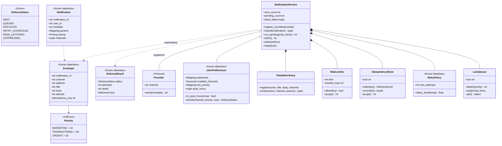

# 设计题解：通知服务（Notification Service）

## 题目与澄清

面试官通常这样开场："设计一个通知服务。业务系统调一次 `notify(user, event)`，系统按用户的偏好
把通知从邮件、短信、推送里选合适的渠道发出去。渠道会失败，要重试；用户不想半夜被吵醒；营销
邮件不能把验证码挤在后面。"

这道题看起来是"写四个 `send_xxx` 方法"，实际上四个渠道的差异是整道题里最不重要的部分。**真正
的内容是：重试、限流、去重、优先级这些逻辑写在哪。** 写在每个渠道里，四份代码会各自演化，第
五个渠道来的时候再抄一遍；写在派发器里一份，渠道就只剩"这封信怎么发出去"这一件事。这一个
决定决定了第 4 关"加一个新渠道要改多少代码"的答案。

动笔之前值得问清楚的几件事，每一件都会改变设计：

- **是调用方指定渠道，还是系统按偏好决定？** 答案通常是后者：调用方只说"通知这个人这件事"，
  系统扇出到该用户开着的每个渠道。这句澄清决定了要有一个 `UserPreferences` 对象，而不是在
  `notify()` 的参数里塞一个 `channel`。
- **同步返回还是排队异步？** 如果调用方是下单接口，它不能等短信网关的三秒超时——于是必须排队。
  而只要排队，就得当场回答"营销和验证码排在同一条队里怎么办"。
- **重试到什么程度算放弃？放弃之后消息去哪？** 引出退避（backoff）、最大次数与死信（dead letter）。
- **失败分几种？** 这是能立刻拉开差距的一问：**超时可以重试，地址非法重试一百次也是同一个结果**。
  不区分这两者，要么把永久失败重试到死，要么把瞬时失败一次就丢。
- **调用方会重复调用吗？** 会。超时重发、消息队列的至少一次投递、用户狂点"重新发送"。所以要
  幂等键，而且**键必须由调用方提供**——只有它知道"这两次调用是不是同一件事"。
- **静默时段里的验证码怎么办？** 必须穿透。这条规则写在偏好对象里，不是散在调用方的 `if` 里。

**范围之外**：真正的邮件/短信网关对接与鉴权、跨进程的持久化队列（本文是进程内版本，重启即丢）、
用户订阅关系的管理界面、多语言与富文本渲染、送达回执与点击追踪、成本优化（同一条通知在多个
渠道之间做降级投递）。

## 需求与分级

机器编码轮不会一次把需求摊开，它一关一关加，考的是"新需求来了旧代码动不动"。

**第 1 关（约 12 分钟，核心流程）**：三个渠道（email / SMS / push）躲在同一个协议后面；一次通知
寻址到一个**用户**而不是一个地址；按用户偏好扇出；**每个渠道都可能失败**，一个渠道失败不许影响
另一个；每一次投递都要有一个能说清楚"成功了还是为什么没成功"的结果对象。

**第 2 关（约 12 分钟，偏好与优先级）**：用户可以关掉某个渠道、给某个渠道设"至少多重要我才收"
的门槛、设置静默时段（基于**注入的时钟**和用户所在时区，可以跨午夜）；按用户按渠道的频次上限；
以及一条优先级车道，让营销群发永远不会把一次性验证码（OTP）挤在后面——**"优先级"在排队上的
具体含义必须说出来**，不能只说"我用了优先队列"。

**第 3 关（约 12 分钟，可靠性）**：瞬时失败按指数退避重试，永久失败不重试；重试用尽进死信；
调用方提供幂等键，重复提交是空操作，并且要有一个测试证明第二次**真的没有**调用渠道。

**第 4 关（选做，扩展）**：加一个新渠道（站内信、webhook），或者给短信加一个专属的短模板。
判分点只有一个：这两件事是不是都只需要"注册一条数据"，派发器、偏好、限流器一行都不用改。

## 核心对象与职责

| 类 | 单一职责 | 它拥有的不变量 |
|---|---|---|
| `Priority`（`IntEnum`） | 三档重要性，可比大小 | `URGENT > TRANSACTIONAL > MARKETING`，偏好里的"最低重要性"才有意义 |
| `DeliveryStatus`（`Enum`） | 一次投递的终局 | 每一种"没发出去"都有自己的名字，绝不合成一句"失败" |
| `Notification`（冻结） | 调用方的一次请求：给谁、什么模板、多重要、幂等键 | `notification_id` 由调用方给，服务不自己生成 |
| `Envelope`（冻结） | 请求在某个渠道上物化出的那封信 | 带齐渠道需要的一切，渠道不必回头问服务 |
| `DeliveryResult`（冻结） | 一次投递的结果 | 可以直接进历史、进死信、返回调用方 |
| `Provider`（`Protocol`） | 渠道的唯一抽象：一个名字 + 一个会失败的 `send` | 不知道重试、限流、幂等、优先级 |
| `UserPreferences`（冻结） | "这个人此刻愿不愿意从这个渠道收" | **URGENT 穿透静默时段** |
| `TemplateLibrary` | `(模板, 渠道) → (标题, 正文)`，有回退 | 模板是数据，注册它不碰任何逻辑 |
| `RateLimiter` | 按 key 的滑动窗口 | 窗口空掉的 key 必须被删掉（不泄漏） |
| `IdempotencyStore` | "这件事做过没有"，带 TTL | `claim` 是原子的检查加占坑，不是先查后写 |
| `RetryPolicy`（冻结） | 第 n 次失败之后等多久 | 指数增长且有上限 |
| `LaneQueue` | 分道 FIFO + 连续服务配额 | 高优先级先出，但不会把低优先级饿死 |
| `NotificationService` | 把上面这些串起来的派发器 | 可靠性只在这里写一份 |

关系上，`NotificationService` **拥有**模板库、限流器、幂等表和队列（组合：服务没了，它们也没人
引用）；它只**关联** `Provider`（渠道是外部资源，生命周期不归它管，所以是 `register_provider`
注册进来的）。`Notification` 与 `Envelope` 是一对多：一次请求在 N 个渠道上物化成 N 封信。

`Provider` 是[[patterns.strategy|策略模式与可替换算法（Strategy）]]的标准形态——同一个动作
（"把这封信发出去"）有多种可替换的算法，调用方按名字挑一个。它是本设计里唯一一个真正值得一个
协议的抽象，因为它确实有多个实现，而且第 4 关还会再加。反过来，"失败要不要重试"只有一种实现，
所以它不是策略，是派发器里的一段代码。

`UserPreferences` 与[[patterns.observer|观察者与事件（Observer）]]的关系值得说一句：很多参考
实现把用户订阅做成观察者注册——每个渠道是一个 observer，事件来了逐个 `update()`。本设计**没有**
这么做，原因在"关键设计决策"第一条：观察者的形状里没有地方放"跨渠道的优先级与限额"。



## 关键设计决策

### 决策一：可靠性写在派发器里一份，还是包成渠道装饰器栈

这是本题最大的分叉，而且两边都有像样的实现。

选项 A，**装饰器栈**：每个渠道被一层层包起来。

```python
email = RetryingChannel(RateLimitedChannel(DeduplicatingChannel(EmailChannel()), limit=5), attempts=3)
```

它很漂亮，符合开闭原则的教科书叙述，而且 Python 社区里流传的那份参考实现就是这么做的。代价在
两处：第一，**每个渠道都要各自包一遍**，四个渠道就是四条装饰链，忘了给新渠道包重试，它就悄悄
没有重试了；第二，也是致命的，**跨渠道的策略没有地方站**。"这个用户一小时最多收 5 条通知，
无论哪个渠道"、"验证码要排在营销前面"——这两条都不属于任何一个渠道，装饰器链里没有它们的位置。
优先级尤其尴尬：装饰器是同步调用链，而优先级只有在**排队**时才有意义。

选项 B，**派发器管道**：`submit` 把请求物化成信封、依次过幂等 → provider 存在性 → 偏好 → 静默
时段 → 限额 → 模板，通过的排进分道队列；派发循环取出来调 `provider.send`，按异常类型决定重试
还是死信。渠道只剩 `channel` 和 `send` 两样东西。

**选 B**，并且把理由说成一句可以背的话：**"渠道之间共享的东西归派发器，渠道之间不同的东西归
渠道。"** 重试次数、退避曲线、去重窗口、优先级、用户限额，全是前者。选 B 之后，第 4 关的答案
变得极其干脆：加一个 webhook 渠道 = 写一个有 `channel` 和 `send` 的类 + 注册 + 用户偏好里打开
它，派发器一行不动——本文的测试里就有这么一条。

装饰器并没有被全盘否定：如果某个**单一渠道**需要一层特有的包装（比如短信网关自带的配额需要
一个本地熔断器），在那个 provider 外面包一层仍然是对的。模式的适用范围是"这一层只对这一个
对象有意义"，而不是"所有可靠性逻辑"。

### 决策二：渠道名是一个开放的字符串，不是 `Enum`

本仓库其他题里反复说"有限状态用 `Enum`"，这里却要反过来，理由值得写清楚。

`Enum` 的价值是**穷尽**：钞票面额、订单状态、日志级别，取值集合是封闭的，写成 `Enum` 就能让
`match` 覆盖所有分支、让非法值在构造时报错。而渠道的取值集合**按定义是开放的**——第 4 关的要求
就是"加一个渠道不改已有代码"。写成 `class Channel(Enum): EMAIL; SMS; PUSH`，加 webhook 就必须
改这个枚举，也就必须改它所在的模块，第 4 关当场失分。

所以渠道是一个字符串，`Provider` 自带 `channel` 属性，服务持一张 `dict[str, Provider]`。代价老老实实
认下来：拼错 `"emial"` 不会在类型层面被抓住，只会在运行时变成一个 `SUPPRESSED_NO_PROVIDER`
的结果——所以这个状态必须存在且可观测，而不是静默跳过。这是一次**用类型安全换扩展性**的交易，
把它说出口，比装作没有代价要好。

同样的判断也适用于模板：模板是**数据**，注册一条 `(名字, 渠道) → (标题, 正文)` 就完事，用
`str.format` 渲染。为一个通知服务引入 Jinja2 是过度设计，而为每个模板写一个类是 Java 习惯。

### 决策三："优先级"在排队上到底是什么

"营销群发不能挤掉验证码"，落到代码上有三种实现，说不清区别就是没想清楚。

选项 A，**一条 FIFO 队列**。没有优先级，营销发两千条，验证码排在第两千零一位。直接出局。

选项 B，**一个 `heapq`**，元素是 `(优先级, 序号, 信封)`。一个容器解决问题，代码最短。代价有二：
堆顶永远是最紧急的，低优先级在高优先级持续涌入时**永远出不来**（饿死，starvation）；而且
"营销积压了多少条"这个运维最想看的数字，在一个混合堆里得遍历才能算出来。

选项 C，**分道 FIFO 加连续服务配额**：每个优先级一条 `deque`，取的时候从高到低扫，但每条道
连续被服务 `quota` 次之后必须让位一次。

```python
if self._served[priority] >= quota and lower_waiting:
    self._served[priority] = 0      # 让位一次，下一轮重新计数
    continue
```

**选 C**，并把"优先级"的定义说死：*同一优先级内严格先进先出；高优先级优先，但连续 `quota` 条
之后让低优先级过一条。* 配额默认为无穷大，即退化成严格优先级——于是"要不要防饿死"变成一个
可配置的取舍，而不是一个隐含的行为。额外的好处是 `depth(priority)` 变成一个 O(1) 的公开属性，
"营销积压两千条"可以直接打印出来。

代价是多了一个类和几行让位逻辑。值不值？值——因为面试官几乎一定会追问"那低优先级会不会永远
发不出去"，而这几行就是答案本身。

### 决策四：幂等键由调用方提供，粒度是"一次请求 × 一个渠道"

"重复发送"在真实系统里是常态：调用方超时重发、上游消息队列的至少一次（at-least-once）投递、
用户连点两下"重新发送验证码"。

**键必须由调用方提供。** 服务自己生成 UUID 的话，同一件事的两次调用永远是两条不同的消息，
幂等根本无从谈起——只有调用方知道"这两次调用是不是同一件事"（订单号、事件 id）。所以
`Notification.notification_id` 是必填参数，不是可选的。

**粒度是 `(notification_id, channel)`，不是 `notification_id`。** 一次请求扇出到邮件和短信：
邮件成了、短信超时要重试，如果用请求级的键，短信重试时会撞上邮件留下的那条记录。信封上的
`idempotency_key` 属性把这件事写死成一行。

**认领必须是原子的**：

```python
with self._lock:
    entry = self._entries.get(key)
    if entry is not None and now - entry[0] <= self._ttl:
        return entry[1] or _PENDING
    self._entries[key] = (now, None)
    return None
```

写成"先 `if key in store` 再 `store[key] = ...`"是典型的检查—然后—行动（check-then-act）竞态：
两个线程可以同时通过检查，同一封信就发了两遍。这个 bug 在单线程测试里**永远**测不出来，所以
测试里有一条八线程加栅栏的用例专门钉它。GIL 在这里帮不上忙：字典的单个操作是原子的，但"查了
再写"是两个操作。

去重表还必须有 TTL 和 `purge()`——一个只写不删的去重表是一个保证会 OOM 的组件。同样的纪律
适用于限流器：窗口空掉的 key 要从字典里删掉，`tracked_keys` 是它的回归测试。

### 决策五：重试的时间从注入的时钟来，不是 `time.sleep`

最省事的重试是在工作线程里 `time.sleep(delay)` 再试一次。它有两个问题：这条线程在睡觉的时候
**什么都干不了**，队列里的验证码只能等着；而且测试要验证"退避了 8 秒"就只能真的睡 8 秒。

正确的形状是一个**按到期时间排序的延迟堆**：瞬时失败时把信封 `replace(attempt=n+1)` 之后
压进 `heapq`，键是 `clock() + delay`；派发循环每轮先把到期的搬回分道队列，再取一条来发。

```python
heapq.heappush(self._delayed, (self._clock() + timedelta(seconds=delay), next(self._tick), nxt))
```

时钟注入之后，"到点了没有"是一次比较而不是一次 sleep，于是整条重试路径在测试里完全确定：
推时钟、再 `drain()`，退避多久、第几次进死信，都能断言。`next(self._tick)` 这个递增序号是
堆的平局裁决——没有它，两条同一毫秒到期的记录会去比较 `Envelope`，而冻结 dataclass 默认不可比较，
直接抛 `TypeError`。这是 `heapq` 存元组时最经典的一个坑。

这套"队列 + 工作线程 + 排空式关闭"的骨架，和[[solution-pub-sub]]里订阅的投递线程是同一个形状：
有界、可观测、关闭时先把已经排好的做完。本文不再重复推导，只强调一处不同：Pub-Sub 的日志满了
要丢消息，通知服务的队列里躺的是**用户可见的业务事实**，所以这里的策略是重试与死信，而不是丢弃。

### 决策六：静默时段是抑制还是延后

静默时段挡住一条营销通知之后，它应该被**丢掉**，还是**排到早上七点再发**？

本设计选抑制，返回 `SUPPRESSED_QUIET_HOURS`，理由是语义诚实：营销通知过了夜就没有价值了，
而调用方立刻拿到一个明确的状态，可以自己决定明天再发一次。延后则会让"我什么时候会被打扰"
变成一件用户预测不了的事——一觉醒来收到七条积压的推送，比一条没收到更糟。

但**延后的实现代价几乎为零**，这一点要主动说出来：延迟堆已经在那里了（重试在用），把
`_admit` 里那一句 `return SUPPRESSED_QUIET_HOURS` 换成"算出静默时段结束的时刻、压进延迟堆"
即可，派发循环、队列、渠道一行不改。能指出"这个需求变更落在哪一行、其余都不动"，比实现它
本身更能证明设计是可扩展的。

无论选哪个，有一条不能动：**URGENT 穿透静默时段**。一次性验证码不会因为用户设了免打扰而发不
出去，这条规则写在 `UserPreferences.decide` 里——写在调用方的 `if` 里，迟早有一个调用方会漏掉它。

## 代码走读

下面是经过测试的完整实现。读的时候盯住四个地方：`UserPreferences.decide`（所有"要不要发"的
判断收在一处，按刻意的顺序）、`NotificationService._admit`（策略在**入队前**判完，队列里躺着
的全是确定要发的信封）、`LaneQueue.get`（优先级与配额的十几行）、`_on_transient` 与 `_promote_due`
（退避、延迟堆与死信）。

`submit` 做的第一件事是用 `templates.knows()` 挡住写错的模板名。模板不存在是调用方的编程错误，
必须**在产生任何副作用之前**抛出——否则第一个渠道已经入队、它的幂等键已经被占掉，异常却从第二个
渠道抛出来，留下一个谁也收拾不了的半成品。这一行是写完之后自己复查补上的：凡是"在循环里逐项
产生副作用"的代码，都要问一句——中途抛异常会留下什么？

`_admit` 的顺序也是设计的一部分：**先认领幂等键，再看有没有 provider，再问偏好，再问限额，最后
才渲染模板**。理由是从便宜到贵、从确定到可变——幂等是一次字典操作，模板渲染要做字符串格式化，
把它放在最后，被抑制的通知就一次也不会白渲染。把策略全放在入队前还有一个直接的好处：重试路径
不必再走一遍偏好与限额，否则一条通知会被自己的重试重复计入用户的频次上限。

`_attempt` 里有一条纪律值得单独说：**调 `provider.send` 时不持有本服务的任何锁**。渠道是外部
代码，它可能很慢、可能抛任何异常、甚至可能回调回来。持锁调用外部代码是死锁的标准配方，这一点
和观察者模式里"不要在持锁状态下通知观察者"是同一条规则。锁只用来保护取 provider、改计数器、
压堆这几个瞬间。

`DeliveryStatus` 有十一个取值，其中七个是"没发出去"的不同原因。这不是啰嗦：调用方拿到
`SUPPRESSED_RATE_LIMIT` 会知道"稍后重试也许有用"，拿到 `SUPPRESSED_CHANNEL_OFF` 会知道"别再
试了，去让用户改设置"，拿到 `DEAD_LETTERED` 会知道"这事需要人来看"。合成一句"发送失败"，
上面三个动作一个也做不了。

%% code:begin solution.py %%
```python
"""通知服务（Notification Service）：一次请求扇出到多个渠道，中间隔着偏好、限额、优先级与重试。
设计：`Provider` 是渠道的唯一抽象（一个 `channel` 名加一个会失败的 `send`），`UserPreferences`
回答"这个人此刻愿不愿意从这个渠道收"，`RateLimiter` 和 `IdempotencyStore` 各守一条不变量，
`LaneQueue` 把"优先级"落实成分道 FIFO 加配额，`NotificationService` 只负责把这些串起来。
可靠性（重试、退避、死信、幂等）写在派发器里一份，不按渠道复制；渠道只管怎么发，不管发几次。
时钟一律注入，于是静默时段、限流窗口和退避全都可测而不必 sleep。
"""

from __future__ import annotations

import heapq
import itertools
import threading
import time
from collections import deque
from collections.abc import Callable, Mapping
from dataclasses import dataclass, field, replace
from datetime import datetime, timedelta, timezone
from enum import Enum, IntEnum
from types import MappingProxyType
from typing import Protocol

Clock = Callable[[], datetime]
EMPTY_PARAMS: Mapping[str, object] = MappingProxyType({})
UNLIMITED = 1 << 30


def utc_now() -> datetime:
    """默认时钟。带时区，静默时段才可能跨时区算对。"""
    return datetime.now(timezone.utc)


class NotificationError(Exception):
    """本服务所有失败的共同基类。"""


class TransientDeliveryError(NotificationError):
    """可重试的失败：超时、502、对端限流。渠道实现应当抛它来表示"再试一次也许就好"。"""


class PermanentDeliveryError(NotificationError):
    """不可重试的失败：地址非法、用户已注销、内容被拒。重试一百次也是同一个结果。"""


class UnknownTemplateError(NotificationError, KeyError):
    """请求里引用了一个没有注册过的模板。"""


class Priority(IntEnum):
    """优先级。用 `IntEnum` 是因为偏好里要写"这个渠道至少多重要我才收"，需要比大小。"""

    MARKETING = 10        # 营销、周报：可以被静默时段和限额挡掉
    TRANSACTIONAL = 20    # 订单已发货、密码已修改：业务事实，尽量送到
    URGENT = 30           # 一次性验证码（OTP）、安全告警：穿透静默时段，永不被营销拖慢


class DeliveryStatus(Enum):
    """一次投递尝试的终局。每一种"没发出去"都必须有自己的名字——合成一句
    "发送失败"，调用方既不知道要不要重试，也不知道要不要告诉用户。"""

    SENT = "sent"
    QUEUED = "queued"                              # 已通过全部策略、排进队列，等待派发
    DUPLICATE = "duplicate"                       # 幂等键重复，这次是空操作
    RETRY_SCHEDULED = "retry_scheduled"           # 瞬时失败，已排进重试
    DEAD_LETTERED = "dead_lettered"               # 永久失败或重试用尽
    SUPPRESSED_CHANNEL_OFF = "channel_off"        # 用户关掉了这个渠道
    SUPPRESSED_PRIORITY = "below_min_priority"    # 没到用户为该渠道设的重要性门槛
    SUPPRESSED_QUIET_HOURS = "quiet_hours"        # 处于静默时段，且不是 URGENT
    SUPPRESSED_RATE_LIMIT = "rate_limited"        # 触到该用户该渠道的频次上限
    SUPPRESSED_NO_ADDRESS = "no_address"          # 用户没留这个渠道的地址
    SUPPRESSED_NO_PROVIDER = "no_provider"        # 没有注册这个渠道的 provider


@dataclass(frozen=True, slots=True)
class Notification:
    """调用方交给服务的一次请求：给谁、用哪个模板、有多重要、幂等键是什么。

    `notification_id` **由调用方提供**：只有调用方知道"这两次调用是不是同一件事"。
    服务自己生成 UUID 的话，重发就永远是一条新消息，幂等无从谈起。
    """

    notification_id: str
    user_id: str
    template: str
    params: Mapping[str, object] = field(default_factory=lambda: EMPTY_PARAMS)
    priority: Priority = Priority.TRANSACTIONAL
    channels: tuple[str, ...] | None = None       # None = 听用户偏好的


@dataclass(frozen=True, slots=True)
class Envelope:
    """一次请求在某个渠道上物化出来的东西：真正要交给 provider 的那封信。

    冻结的事件对象：它带齐了渠道需要的一切（地址、标题、正文），于是 provider 永远不必
    回头去问服务任何事，也就不必和服务争锁。重试时用 `replace(envelope, attempt=n)` 造新的。
    """

    notification_id: str
    user_id: str
    channel: str
    address: str
    title: str
    body: str
    priority: Priority
    attempt: int = 1

    @property
    def idempotency_key(self) -> str:
        """幂等的粒度是"一次请求 × 一个渠道"：邮件发成功、短信失败重发，两者互不影响。"""
        return f"{self.notification_id}|{self.channel}"


@dataclass(frozen=True, slots=True)
class DeliveryResult:
    """一次投递的结果。冻结，可以直接进历史、进死信、返回给调用方。"""

    notification_id: str
    user_id: str
    channel: str
    status: DeliveryStatus
    attempts: int = 0
    detail: str = ""

    @property
    def delivered(self) -> bool:
        return self.status is DeliveryStatus.SENT


class Provider(Protocol):
    """渠道的唯一抽象：一个名字，一个会失败的 `send`。

    它**不**知道重试、限流、幂等、优先级——那些是派发器的事，写在一处。渠道只回答
    "这封信怎么发出去"，失败时用异常区分可重试与不可重试。
    """

    channel: str

    def send(self, envelope: Envelope) -> str: ...


@dataclass(frozen=True, slots=True)
class UserPreferences:
    """一个用户的收信意愿。冻结：改偏好是换一个对象，不是就地改字段，于是读它永远不用加锁。

    它拥有一条不变量：**URGENT 穿透静默时段**。一次性验证码不会因为用户设了"晚上十点后免打扰"
    而发不出去——这条规则写在这里，而不是散在调用方的 `if` 里。
    """

    user_id: str
    addresses: Mapping[str, str] = field(default_factory=lambda: MappingProxyType({}))
    enabled_channels: frozenset[str] = frozenset()
    min_priority: Mapping[str, Priority] = field(default_factory=lambda: MappingProxyType({}))
    quiet_hours: tuple[int, int] | None = None     # (起始小时, 结束小时)，本地时间，可跨午夜
    utc_offset_minutes: int = 0

    def local_hour(self, now: datetime) -> int:
        return (now + timedelta(minutes=self.utc_offset_minutes)).hour

    def in_quiet_hours(self, now: datetime) -> bool:
        """静默时段可以跨午夜（22 点到次日 7 点），所以不能只写一个 `start <= h < end`。"""
        if self.quiet_hours is None:
            return False
        start, end = self.quiet_hours
        hour = self.local_hour(now)
        return start <= hour < end if start < end else (hour >= start or hour < end)

    def decide(self, channel: str, priority: Priority, now: datetime) -> DeliveryStatus | None:
        """返回抑制原因，或者 `None` 表示放行。顺序是刻意的：先问"你要不要"，再问"你在不在"。"""
        if channel not in self.enabled_channels:
            return DeliveryStatus.SUPPRESSED_CHANNEL_OFF
        if priority < self.min_priority.get(channel, Priority.MARKETING):
            return DeliveryStatus.SUPPRESSED_PRIORITY
        if priority is not Priority.URGENT and self.in_quiet_hours(now):
            return DeliveryStatus.SUPPRESSED_QUIET_HOURS
        if channel not in self.addresses:
            return DeliveryStatus.SUPPRESSED_NO_ADDRESS
        return None

    @property
    def target_channels(self) -> tuple[str, ...]:
        """按名字排序，让扇出的顺序可预测——测试因此不必迁就 set 的迭代顺序。"""
        return tuple(sorted(self.enabled_channels))


class TemplateLibrary:
    """模板库：`(模板名, 渠道) -> (标题, 正文)`，渠道没有专属版本就退回到默认版本。

    模板是**数据**不是代码：加一个模板、给短信加一个短版本，都只是往字典里塞一条，
    派发器、渠道、偏好一行不用动。`str.format` 足够——为一个通知服务塞进 Jinja 是过度设计。
    """

    def __init__(self) -> None:
        self._templates: dict[tuple[str, str | None], tuple[str, str]] = {}
        self._lock = threading.Lock()

    @property
    def template_count(self) -> int:
        with self._lock:
            return len(self._templates)

    def register(self, name: str, title: str, body: str, channel: str | None = None) -> None:
        """`channel=None` 注册默认版本；给某个渠道单独注册就覆盖它（短信的 140 字版）。"""
        with self._lock:
            self._templates[(name, channel)] = (title, body)

    def knows(self, name: str) -> bool:
        """这个模板名存在吗（任意渠道版本都算）。派发器用它在产生任何副作用之前挡住笔误。"""
        with self._lock:
            return any(key[0] == name for key in self._templates)

    def render(self, name: str, channel: str, params: Mapping[str, object]) -> tuple[str, str]:
        with self._lock:
            entry = self._templates.get((name, channel)) or self._templates.get((name, None))
        if entry is None:
            raise UnknownTemplateError(f"no template {name!r} for channel {channel!r}")
        title, body = entry
        return title.format(**params), body.format(**params)


class RateLimiter:
    """按 key 的滑动窗口计数：注入时钟，所以测试推时钟而不是 sleep。

    它拥有的不变量是**不泄漏**：窗口内没有记录的 key 会被删掉。一个 `dict[user, deque]`
    只涨不落，是这类组件里最常见的内存事故——限流器本该是有界的。
    """

    def __init__(self, limit: int, window_seconds: float, clock: Clock = utc_now) -> None:
        if limit < 0:
            raise ValueError(f"limit must not be negative, got {limit}")
        self._limit = limit
        self._window = timedelta(seconds=window_seconds)
        self._clock = clock
        self._hits: dict[str, deque[datetime]] = {}
        self._lock = threading.Lock()

    @property
    def limit(self) -> int:
        return self._limit

    @property
    def tracked_keys(self) -> int:
        """还在被跟踪的 key 数。测试用它断言"窗口过去之后这里是空的"。"""
        with self._lock:
            return len(self._hits)

    def allow(self, key: str) -> bool:
        """放行就记一笔并返回 True；超限返回 False 且**不**记账（否则被限流的请求会自我延长窗口）。"""
        now = self._clock()
        with self._lock:
            hits = self._trim(key, now)
            if len(hits) >= self._limit:
                if not hits:
                    self._hits.pop(key, None)
                return False
            hits.append(now)
            self._hits[key] = hits
            return True

    def _trim(self, key: str, now: datetime) -> deque[datetime]:
        hits = self._hits.get(key)
        if hits is None:
            return deque()
        cutoff = now - self._window
        while hits and hits[0] <= cutoff:
            hits.popleft()
        if not hits:
            self._hits.pop(key, None)
        return hits

    def purge(self) -> int:
        """把所有已经空掉的窗口清出去，返回清掉的 key 数。派发器定期调用它。"""
        now = self._clock()
        with self._lock:
            stale = [k for k, hits in self._hits.items() if not hits or hits[-1] <= now - self._window]
            for key in stale:
                del self._hits[key]
            return len(stale)


class IdempotencyStore:
    """带过期时间的"这件事做过没有"。`claim` 是原子的检查加占坑，不是先查后写。

    有 TTL，并且有 `purge()`：一个只写不删的去重表，就是一个保证会 OOM 的组件。
    """

    def __init__(self, ttl_seconds: float = 3600.0, clock: Clock = utc_now, capacity: int = 100_000) -> None:
        self._ttl = timedelta(seconds=ttl_seconds)
        self._clock = clock
        self._capacity = capacity
        self._entries: dict[str, tuple[datetime, DeliveryResult | None]] = {}
        self._lock = threading.Lock()

    @property
    def size(self) -> int:
        with self._lock:
            return len(self._entries)

    def claim(self, key: str) -> DeliveryResult | None:
        """第一次见到这个 key 返回 `None`（占坑成功）；重复则返回上一次记下的结果。

        "先 `if key in store` 再 `store[key] = ...`"是典型的检查—然后—行动（check-then-act）
        竞态：两个线程可以同时通过检查，同一封信就发了两遍。所以整段在同一把锁里。
        """
        now = self._clock()
        with self._lock:
            entry = self._entries.get(key)
            if entry is not None and now - entry[0] <= self._ttl:
                return entry[1] if entry[1] is not None else _PENDING
            if len(self._entries) >= self._capacity:
                self._purge_locked(now)
            self._entries[key] = (now, None)
            return None

    def record(self, key: str, result: DeliveryResult) -> None:
        with self._lock:
            if key in self._entries:
                self._entries[key] = (self._entries[key][0], result)

    def purge(self) -> int:
        with self._lock:
            return self._purge_locked(self._clock())

    def _purge_locked(self, now: datetime) -> int:
        stale = [k for k, (stamp, _) in self._entries.items() if now - stamp > self._ttl]
        for key in stale:
            del self._entries[key]
        return len(stale)


_PENDING = DeliveryResult("", "", "", DeliveryStatus.DUPLICATE, 0, "in flight")


@dataclass(frozen=True, slots=True)
class RetryPolicy:
    """指数退避。`jitter` 留成参数而不是内部随机：测试要可重复，生产要防惊群。"""

    max_attempts: int = 3
    base_delay: float = 1.0
    multiplier: float = 2.0
    max_delay: float = 60.0

    def delay_for(self, attempt: int) -> float:
        """第 `attempt` 次失败之后等多久。attempt 从 1 起算。"""
        return min(self.base_delay * (self.multiplier ** (attempt - 1)), self.max_delay)


class LaneQueue:
    """分道队列：每个优先级一条 FIFO，取的时候从高到低，但**每条道有连续服务配额**。

    这就是"优先级"在排队上的具体含义。严格优先级（高的取空才轮到低的）会把低优先级饿死；
    配额让高优先级连续取 `quota` 条之后必须让位一次，于是营销不会拖慢验证码，验证码的洪峰
    也不会让营销永远发不出去。配额默认极大，即退化成严格优先级。
    """

    def __init__(self, quota: Mapping[Priority, int] | None = None) -> None:
        self._lanes: dict[Priority, deque] = {p: deque() for p in Priority}
        self._quota = dict(quota or {})
        self._served = {p: 0 for p in Priority}
        self._lock = threading.Lock()

    @property
    def size(self) -> int:
        with self._lock:
            return sum(len(lane) for lane in self._lanes.values())

    def depth(self, priority: Priority) -> int:
        """某一条道上堆了多少——把"营销积压了两千条"变成一个可以打印的数字。"""
        with self._lock:
            return len(self._lanes[priority])

    def put(self, priority: Priority, item: object) -> None:
        with self._lock:
            self._lanes[priority].append(item)

    def get(self) -> object | None:
        """取一条；空就返回 `None`（不阻塞——等待归派发器管，队列只管顺序）。"""
        with self._lock:
            lanes = sorted(Priority, reverse=True)
            for index, priority in enumerate(lanes):
                lane = self._lanes[priority]
                if not lane:
                    continue
                quota = self._quota.get(priority, UNLIMITED)
                lower_waiting = any(self._lanes[p] for p in lanes[index + 1:])
                if self._served[priority] >= quota and lower_waiting:
                    self._served[priority] = 0        # 让位一次，下一轮重新计数
                    continue
                self._served[priority] += 1
                return lane.popleft()
            return None


class NotificationService:
    """派发器：把请求物化成信封、过一遍策略、排进分道队列、按时重试、失败进死信。

    可靠性只在这里写一份。渠道不知道重试，偏好不知道队列，限流器不知道渠道——每个零件
    只认识自己那条不变量，加一个渠道或一个模板都不会碰到这个类。
    """

    def __init__(self, clock: Clock = utc_now, retry: RetryPolicy | None = None,
                 rate_limit: tuple[int, float] | None = None, idempotency_ttl: float = 3600.0,
                 lane_quota: Mapping[Priority, int] | None = None, history: int = 1024) -> None:
        self._clock = clock
        self._retry = retry or RetryPolicy()
        self._templates = TemplateLibrary()
        self._providers: dict[str, Provider] = {}
        self._preferences: dict[str, UserPreferences] = {}
        self._limiter = RateLimiter(*rate_limit, clock=clock) if rate_limit else None
        self._idempotency = IdempotencyStore(idempotency_ttl, clock)
        self._queue = LaneQueue(lane_quota)
        self._delayed: list[tuple[datetime, int, Envelope]] = []
        self._tick = itertools.count(1)
        self._history: deque[DeliveryResult] = deque(maxlen=history)
        self._dead_letters: deque[DeliveryResult] = deque(maxlen=history)
        self._sent = 0
        self._dispatched = 0
        self._stopped = threading.Event()
        self._workers: tuple[threading.Thread, ...] = ()
        self._lock = threading.RLock()

    # ---- 配置 ---------------------------------------------------------

    @property
    def templates(self) -> TemplateLibrary:
        return self._templates

    @property
    def channels(self) -> tuple[str, ...]:
        with self._lock:
            return tuple(sorted(self._providers))

    def register_provider(self, provider: Provider) -> None:
        """加一个渠道 = 注册一个 provider。**渠道名是开放的字符串，不是 `Enum`**——
        用 `Enum` 的话，加 in-app 或 webhook 就得改这个类，正好违背第 4 关的要求。"""
        with self._lock:
            self._providers[provider.channel] = provider

    def set_preferences(self, preferences: UserPreferences) -> None:
        with self._lock:
            self._preferences[preferences.user_id] = preferences

    def preferences_for(self, user_id: str) -> UserPreferences:
        with self._lock:
            return self._preferences.get(user_id) or UserPreferences(user_id)

    # ---- 可观测状态 ---------------------------------------------------

    @property
    def sent_count(self) -> int:
        with self._lock:
            return self._sent

    @property
    def pending_count(self) -> int:
        """排队中 + 等待重试的信封数。两者都要算，否则"已经清空了吗"会答错。"""
        with self._lock:
            return self._queue.size + len(self._delayed)

    @property
    def dead_letters(self) -> tuple[DeliveryResult, ...]:
        """快照，不是内部队列本身。它有上限（`maxlen`），死信不会把内存吃光。"""
        with self._lock:
            return tuple(self._dead_letters)

    @property
    def history(self) -> tuple[DeliveryResult, ...]:
        with self._lock:
            return tuple(self._history)

    def queue_depth(self, priority: Priority) -> int:
        return self._queue.depth(priority)

    # ---- 提交 ---------------------------------------------------------

    def submit(self, notification: Notification) -> tuple[DeliveryResult, ...]:
        """把一次请求扇出到各个渠道。抑制与重复**当场**返回结果，其余排队。

        策略全部在这里判完再入队，而不是在发送时判：调用方立刻知道"这条为什么没发"，
        队列里躺着的也就全是"确定要发"的信封，重试路径因此不必再走一遍偏好与限额。
        """
        now = self._clock()
        preferences = self.preferences_for(notification.user_id)
        targets = notification.channels if notification.channels is not None else preferences.target_channels
        if targets and not self._templates.knows(notification.template):
            raise UnknownTemplateError(f"no template {notification.template!r}")   # 先于一切副作用
        results: list[DeliveryResult] = []
        for channel in targets:
            results.append(self._admit(notification, preferences, channel, now))
        return tuple(results)

    def _admit(self, notification: Notification, preferences: UserPreferences,
               channel: str, now: datetime) -> DeliveryResult:
        key = f"{notification.notification_id}|{channel}"
        previous = self._idempotency.claim(key)
        if previous is not None:
            return self._record(DeliveryResult(notification.notification_id, notification.user_id,
                                               channel, DeliveryStatus.DUPLICATE, 0,
                                               f"already {previous.status.value}"), key=None)
        with self._lock:
            provider = self._providers.get(channel)
        if provider is None:
            return self._settle(key, notification, channel, DeliveryStatus.SUPPRESSED_NO_PROVIDER)
        suppressed = preferences.decide(channel, notification.priority, now)
        if suppressed is not None:
            return self._settle(key, notification, channel, suppressed)
        if self._limiter is not None and not self._limiter.allow(f"{notification.user_id}|{channel}"):
            return self._settle(key, notification, channel, DeliveryStatus.SUPPRESSED_RATE_LIMIT)
        title, body = self._templates.render(notification.template, channel, notification.params)
        envelope = Envelope(notification.notification_id, notification.user_id, channel,
                            preferences.addresses[channel], title, body, notification.priority)
        self._queue.put(notification.priority, envelope)
        return DeliveryResult(notification.notification_id, notification.user_id, channel,
                              DeliveryStatus.QUEUED, 0, f"queued in the {notification.priority.name} lane")

    # ---- 派发 ---------------------------------------------------------

    def run_pending(self, max_items: int = 1) -> int:
        """处理最多 `max_items` 件可运行的事，返回实际处理数。到点的重试先放回队列。

        注入时钟之后，"到点了没有"是一次比较而不是一次 sleep，所以整条重试路径在测试里
        完全确定：推时钟、再 `drain()`，退避多久、第几次进死信都能断言。
        """
        self._promote_due()
        done = 0
        while done < max_items:
            envelope = self._queue.get()
            if envelope is None:
                break
            self._attempt(envelope)          # type: ignore[arg-type]
            done += 1
        return done

    def drain(self, limit: int = 10_000) -> int:
        """把此刻所有可运行的事做完（不等未来到期的重试）。返回处理条数。"""
        total = 0
        while total < limit:
            done = self.run_pending(max_items=64)
            if done == 0:
                return total
            total += done
        return total

    def _promote_due(self) -> None:
        now = self._clock()
        with self._lock:
            while self._delayed and self._delayed[0][0] <= now:
                _, _, envelope = heapq.heappop(self._delayed)
                self._queue.put(envelope.priority, envelope)

    def _attempt(self, envelope: Envelope) -> None:
        """真正调 provider 的地方。**调用时不持有本服务的任何锁**——渠道是外部代码，
        它可能很慢、可能回调回来，持锁调外部代码是死锁的标准配方。"""
        with self._lock:
            provider = self._providers.get(envelope.channel)
            self._dispatched += 1
            housekeeping = self._dispatched % 128 == 0
        if housekeeping:
            self._idempotency.purge()
            if self._limiter is not None:
                self._limiter.purge()
        if provider is None:
            self._finish(envelope, DeliveryStatus.SUPPRESSED_NO_PROVIDER, "provider went away")
            return
        try:
            detail = provider.send(envelope)
        except TransientDeliveryError as exc:
            self._on_transient(envelope, exc)
        except Exception as exc:  # noqa: BLE001 — 渠道抛什么都不许打断派发线程
            self._finish(envelope, DeliveryStatus.DEAD_LETTERED, f"permanent: {exc!r}")
        else:
            with self._lock:
                self._sent += 1
            self._finish(envelope, DeliveryStatus.SENT, detail or "")

    def _on_transient(self, envelope: Envelope, exc: BaseException) -> None:
        if envelope.attempt >= self._retry.max_attempts:
            self._finish(envelope, DeliveryStatus.DEAD_LETTERED,
                         f"gave up after {envelope.attempt} attempt(s): {exc!r}")
            return
        delay = self._retry.delay_for(envelope.attempt)
        nxt = replace(envelope, attempt=envelope.attempt + 1)
        with self._lock:
            heapq.heappush(self._delayed, (self._clock() + timedelta(seconds=delay), next(self._tick), nxt))
            self._history.append(DeliveryResult(envelope.notification_id, envelope.user_id,
                                                envelope.channel, DeliveryStatus.RETRY_SCHEDULED,
                                                envelope.attempt, f"retry in {delay:g}s: {exc!r}"))

    def _finish(self, envelope: Envelope, status: DeliveryStatus, detail: str) -> None:
        result = DeliveryResult(envelope.notification_id, envelope.user_id, envelope.channel,
                                status, envelope.attempt, detail)
        self._record(result, key=envelope.idempotency_key)

    def _settle(self, key: str, notification: Notification, channel: str,
                status: DeliveryStatus) -> DeliveryResult:
        result = DeliveryResult(notification.notification_id, notification.user_id, channel, status, 0,
                                status.value)
        return self._record(result, key=key)

    def _record(self, result: DeliveryResult, key: str | None) -> DeliveryResult:
        if key is not None:
            self._idempotency.record(key, result)
        with self._lock:
            self._history.append(result)
            if result.status is DeliveryStatus.DEAD_LETTERED:
                self._dead_letters.append(result)
        return result

    # ---- 线程 ---------------------------------------------------------

    def start(self, workers: int = 1, idle_sleep: float = 0.005) -> None:
        """起若干条派发线程。它们只是反复调 `run_pending()`——测试里可以完全不起线程。"""
        with self._lock:
            if self._workers:
                return
            self._stopped.clear()
            self._workers = tuple(
                threading.Thread(target=self._loop, args=(idle_sleep,), name=f"notify-{i}", daemon=True)
                for i in range(workers))
        for worker in self._workers:
            worker.start()

    def _loop(self, idle_sleep: float) -> None:
        while not self._stopped.is_set():
            if self.run_pending(max_items=16) == 0:
                self._stopped.wait(idle_sleep)

    def stop(self, drain: bool = True, timeout: float = 5.0) -> None:
        """停线程。`drain=True` 时先把队列里已经排好的信封发完——重试是排到未来的，不等。"""
        if drain:
            deadline = time.monotonic() + timeout
            while self._queue.size and time.monotonic() < deadline:
                self.run_pending(max_items=64)
        self._stopped.set()
        with self._lock:
            workers, self._workers = self._workers, ()
        for worker in workers:
            worker.join(timeout)


class CollectingProvider:
    """一个把信封收进列表的 provider，给演示和冒烟用。真正的渠道在测试里由调用方注入。"""

    def __init__(self, channel: str) -> None:
        self.channel = channel
        self.sent: list[Envelope] = []
        self._lock = threading.Lock()

    def send(self, envelope: Envelope) -> str:
        with self._lock:
            self.sent.append(envelope)
            return f"{self.channel}:{len(self.sent)}"


def _demo() -> None:
    noon = datetime(2026, 1, 1, 12, tzinfo=timezone.utc)
    service = NotificationService(clock=lambda: noon, rate_limit=(5, 60.0),
                                  lane_quota={Priority.URGENT: 2})
    email, sms = CollectingProvider("email"), CollectingProvider("sms")
    service.register_provider(email)
    service.register_provider(sms)
    service.templates.register("otp", "验证码", "您的验证码是 {code}，五分钟内有效。")
    service.templates.register("sale", "促销", "{name} 正在打折。")
    service.set_preferences(UserPreferences(
        "u1", addresses={"email": "u1@example.com", "sms": "+8613800000000"},
        enabled_channels=frozenset({"email", "sms"}),
        min_priority={"sms": Priority.URGENT}, quiet_hours=(22, 7)))
    service.submit(Notification("n-1", "u1", "sale", {"name": "耳机"}, Priority.MARKETING))
    service.submit(Notification("n-2", "u1", "otp", {"code": "482913"}, Priority.URGENT))
    service.submit(Notification("n-2", "u1", "otp", {"code": "482913"}, Priority.URGENT))  # 重发
    service.drain()
    print("email:", [e.title for e in email.sent])
    print("sms:", [e.title for e in sms.sent], "sent =", service.sent_count)


if __name__ == "__main__":
    _demo()
```
%% code:end %%

## 测试与自检

二十六个用例分四组，全部用**注入的假渠道**，一次真网络请求都不发；时钟是注入的固定时钟，
退避与限流窗口靠推时钟验证，没有一个 `sleep` 参与断言。

第 1 关看扇出与失败隔离：一次请求进两个渠道、渠道专属模板覆盖默认模板、模板不存在在提交时就
报错、**一个渠道永久失败而另一个照常发出**、偏好里有但没注册 provider 的渠道得到自己的状态而
不是崩溃。

第 2 关看策略：关掉的渠道、没到门槛的优先级、静默时段挡住营销但挡不住验证码、静默时段跨午夜
且按用户时区计算、频次上限按"用户 × 渠道"而不是按用户、以及两条优先级用例——严格优先级下
后入队的 URGENT 先出，配额为 2 时投递顺序恰好是 `U0 U1 M0 U2 U3 M1 U4`。最后这条把"优先级
到底是什么"变成了一个可以断言的序列。

第 3 关看可靠性，是这套测试最有价值的部分：
- 退避曲线直接对 `RetryPolicy.delay_for` 断言 `[2, 6, 18, 20]`，指数与封顶一起验。
- 瞬时失败之后**时钟不推进就不会重试**（`drain()` 两次，渠道调用次数仍是 1），推进 10 秒再
  `drain()` 才发生第二次尝试。这一条同时证明了"延迟堆按时钟工作"和"重试不是忙等"。
- 重试用尽：渠道调用次数**正好**等于 `max_attempts`，死信里恰好一条且 `attempts == 3`，
  `pending_count` 归零（没有信封被遗忘在堆里）。
- 永久失败一次都不重试，直接进死信。
- 同一个调用方 id 重复提交，第二次状态是 `DUPLICATE` 且**渠道一次都没被调用**。
- 八条线程加栅栏同时提交同一个 id，断言只有一条得到 `QUEUED`、渠道只被调用一次——这条专门
  钉住"检查—然后—行动"的竞态，单线程测试永远测不出它。
- 三条工作线程并发派发一百条不同的通知，断言恰好一百次调用、一百个不同的 id、`pending_count`
  归零。

第 4 关看扩展：注册一个派发器从没听说过的 `webhook` provider，一行服务代码不改就能收到通知；
注册模板只是往库里加两条数据。另外两条守纪律的用例：`dead_letters` 和 `history` 返回的是
**快照元组**而不是内部容器（拿到手的东西不该能改写服务的状态），以及限流器在窗口空掉之后
`tracked_keys` 归零。

给面试官两分钟演示的话，按这个顺序说：先提交一条营销和一条验证码，打印投递顺序，说"这就是
优先级车道"；再把时钟拨到晚上十一点重来一次，说"营销被静默时段挡了，验证码穿透"；再让渠道
超时一次、推进时钟、显示第二次尝试成功，说"退避来自注入的时钟，不是 sleep"；最后把同一个
`notification_id` 再提交一次，显示 `DUPLICATE` 且渠道调用次数没变。

## 扩展与追问

**新需求**

- *站内信 / webhook 渠道*：写一个有 `channel` 和 `send` 的类，注册，用户偏好里打开它。派发器、
  偏好、限流器、队列一行不动——测试里已经有这一条。
- *模板引擎*：`TemplateLibrary.render` 换成 Jinja2 的一行调用即可，接口不变。真要做多语言，
  键从 `(模板, 渠道)` 扩成 `(模板, 渠道, 语言)`，仍然只动这一个类。
- *静默时段改成延后而不是抑制*：延迟堆已经在那儿了（重试在用），把 `_admit` 里的那次 `return`
  换成"算出静默时段结束时刻、压进延迟堆"，其余不动。
- *摘要与合并（digest）*：同一用户五分钟内的同类通知合成一条。落点是在 `_admit` 和入队之间加
  一个按 `(user, template)` 聚合的缓冲区，到点了物化成一封信。它是一个新对象，不是对现有对象
  的修改。
- *渠道降级*：邮件失败了改发短信。这是一条新的失败策略，落在 `_on_transient` 的分支里——但要
  先问清业务：一条通知在两个渠道各发一次，用户会觉得被骚扰。

**并发与线程安全**

- *GIL 给了什么*：`dict[key] = value` 不会撕裂，但本设计里关键的临界区都是读—改—写：幂等的
  "查了再占坑"、限流的"清窗口再判上限再记一笔"、分道队列的"选道再弹出再记配额"。三处都必须
  在锁里，GIL 一点忙都帮不上。
- *锁的作用域*：服务的锁只在取 provider、改计数、压堆这几个瞬间持有；`provider.send` 在锁外
  调用。渠道是外部代码，持锁调外部代码是死锁的标准配方。
- *各组件各有一把锁*：限流器、幂等表、模板库、分道队列各锁各的，服务再有一把。它们之间**没有
  嵌套**——服务从不在持有自己的锁时去调另一个组件的加锁方法，于是不存在锁序问题，也就不需要
  证明。这是"把锁按对象切开"最实在的好处。
- *工作线程怎么关*：`stop(drain=True)` 先把队列里已经排好的信封发完，再让线程退出；排到未来的
  重试不等（否则关闭时间没有上界）。这个契约要说清楚，含糊的 `shutdown()` 是扣分项。

**持久化与规模**

- *进程重启不丢*：分道队列与延迟堆换成数据库表（`status`、`priority`、`due_at` 三个索引），
  `run_pending` 变成一次 `SELECT ... FOR UPDATE SKIP LOCKED`。`Provider`、`UserPreferences`、
  `RetryPolicy` 一行不动——它们从一开始就不知道队列在哪。
- *多进程消费*：幂等表必须搬到共享存储（Redis 的 `SET NX PX` 就是本文 `claim` 的分布式版本），
  否则每个进程各认领各的，同一封信会被发多次。限流也同理。
- *百万用户的偏好*：`dict[user_id, UserPreferences]` 换成带缓存的仓储（repository），
  `preferences_for` 是唯一的读入口，所以换掉它只影响一个方法。
- *优先级的公平性*：当"用户"这个维度也需要公平（一个大客户的群发不能拖垮所有人）时，分道队列
  的每条道再按用户做轮转（weighted fair queueing），仍然只改 `LaneQueue.get`。

## 常见错误

1. **把重试写进每个渠道**。`EmailChannel.send` 里自己 `for attempt in range(3)`。四个渠道四份
   代码，退避曲线各不相同，第五个渠道忘了写重试就静默地没有重试。
2. **不区分瞬时失败与永久失败**。地址格式非法被重试五次、每次退避翻倍，除了浪费什么也没发生；
   或者反过来，一次网络抖动就把通知扔进死信。异常类型就是这个区分的载体。
3. **服务自己生成幂等键**。用 `uuid4()` 当 `notification_id`，于是调用方重发永远是新消息，
   幂等形同虚设。键必须由调用方给。
4. **幂等用"先查后写"**。`if key not in seen: seen.add(key); send()`。单线程永远测不出问题，
   上了线在超时重发的瞬间双发。必须是一次加锁内的检查加占坑。
5. **去重表和限流表只写不删**。没有 TTL、没有 `purge()`、窗口空了也不删 key。一个跑三个月的
   通知服务会因此 OOM，而这本该是有界组件。
6. **"优先级"只说不做**。嘴上说"我用优先队列"，实现却是一条 FIFO；或者用了堆但答不出低优先级
   会不会饿死。要么给出配额，要么明确说"接受饿死，因为高优先级流量有上限"。
7. **静默时段用 `datetime.now()`**。测试只能改系统时区或者真的等到半夜。时钟必须注入，时区
   必须是用户的，跨午夜的窗口不能写成一个 `start <= h < end`。
8. **在工作线程里 `time.sleep(backoff)`**。线程睡着的时候，队列里的验证码也在等。退避属于
   "什么时候可以再试"，那是一个到期时间，不是一次睡眠。
9. **`ChannelFactory` / `NotificationBuilder` 之类只转发一次调用的类**。Java 习惯。一个只把
   参数原样传给别人的类要么被赋予职责，要么被删掉。
10. **把渠道做成 `Enum`**。看起来更"类型安全"，代价是第 4 关的要求当场做不到。开放集合用
    字符串加注册表，并接受"拼错只能在运行时发现"这个代价、把它变成一个可见的状态。
11. **所有失败合成一句 `False`**。调用方拿到一个布尔值，既不知道要不要重试，也不知道要不要
    提示用户去改设置。结果对象要带状态、尝试次数和细节。

## 45 分钟怎么分配

- **0–4 分钟｜澄清与定范围**。开口第一句："我理解这是进程内版本，重启即丢，真正的网关对接
  不在范围内，对吗？"然后问三个问题：渠道由调用方指定还是按用户偏好扇出；同步还是排队；
  调用方会不会重复调用。把答案写在白板角上。
- **4–9 分钟｜实体与关系**。画出来：`Notification`（请求）→ `Envelope`（每渠道一封信）→
  `DeliveryResult`（结果），加上 `Provider`、`UserPreferences`、`NotificationService`。
  **这一步要把"可靠性归派发器、差异归渠道"说出来并给理由**，它是整道题的主干。
- **9–20 分钟｜第 1 关**。`Provider` 协议 + 两个假渠道 + `submit` 的扇出 + 结果对象。这一段
  要写得快，因为它不是考点；写完立刻说一句"注意渠道里没有任何重试代码"。
- **20–30 分钟｜第 2 关**。`UserPreferences.decide` 一个方法把四种抑制判完；分道队列十几行。
  **优先级一定要讲成一个有代价的选择**：堆会饿死低优先级，分道加配额不会，配额设成无穷就是
  严格优先级。这十分钟是本题性价比最高的部分。
- **30–39 分钟｜第 3 关**。异常分两类、退避曲线、延迟堆、死信、幂等表。写 `claim` 的时候把
  "检查—然后—行动"这句话说出来，面试官一定在等它。
- **39–43 分钟｜第 4 关与自检**。当场加一个 `webhook` 渠道，一边写一边数"我改了几个文件"，
  答案是零个已有文件。然后跑 demo。
- **43–45 分钟｜追问与收尾**。主动抛出三条："换成数据库队列落在哪一行"、"多进程时幂等表必须
  共享"、"静默时段改成延后只动一句"。

**时间不够时砍什么**：砍模板库（标题正文直接放在请求里），砍工作线程（只留 `run_pending()`，
说清楚线程是在它外面套一层循环），砍死信的持久化。**绝对不能砍**的是异常分两类、幂等的原子
认领、以及优先级的具体含义——这三样加起来不到三十行，却是这道题全部的分数所在。

## 来源与延伸

- [abhaypaswan/lld-python — notification-service](https://github.com/abhaypaswan/lld-python/tree/main/problems/notification-service)：
  少见的 Python 实现，需求清单（多渠道、按渠道的最低优先级、退避重试、按人限流、去重、每次
  尝试都要有结果）与本文第 1–3 关几乎一致，值得先读它对齐题意。它的做法是**装饰器栈**：
  `RetryingChannel(RateLimitedChannel(DeduplicatingChannel(EmailChannel())))`。本文在"关键设计
  决策"第一条里明确不采用，理由是每个渠道都要各自包一遍、而且跨渠道的优先级与用户级限额在
  装饰链里没有位置——它的实现也确实没有优先级这一关。
- [jkaus324/machine-coding-interview-questions — 003-notification-system](https://github.com/jkaus324/machine-coding-interview-questions/tree/main/problems/tier1-foundation/003-notification-system)：
  把这道题定位成"观察者模式的练习题"，README 里那句"下单系统不该 import 邮件服务"是值得记住的
  出发点，另有五种语言的骨架可对照。本文与它分歧在建模：它让每个渠道做 observer、事件来了逐个
  `update()`，于是偏好判断散在每个 observer 里、而且没有地方放队列与优先级；本文把偏好收进一个
  `decide()`，把投递收进一条分道队列。它标注的公司（Flipkart、Swiggy）和 45 分钟时限可作参考。
- [heapq — Heap queue algorithm（标准库文档）](https://docs.python.org/3/library/heapq.html)：
  延迟重试堆的权威出处。要特别读"元组比较"那一段：`heappush` 存元组时，第一个元素相等就会去
  比较第二个，所以必须有一个递增序号做平局裁决，否则会掉进比较 `Envelope` 的 `TypeError`。
- [dataclasses — Data Classes（标准库文档）](https://docs.python.org/3/library/dataclasses.html)：
  `frozen=True` / `slots=True` 的语义，以及 `dataclasses.replace()`——本文重试时造下一次尝试的
  信封用的就是它，比手写一个 `with_attempt()` 方法更直接，也保证了所有字段都被带过去。
- [zoneinfo — IANA time zone support（标准库文档）](https://docs.python.org/3/library/zoneinfo.html)：
  本文用"UTC 偏移分钟数"表示用户时区，够用但不处理夏令时。真做生产系统要换成 `ZoneInfo`，
  改动全在 `UserPreferences.local_hour` 一个方法里——这正是把"算本地小时"封进偏好对象的收益。
