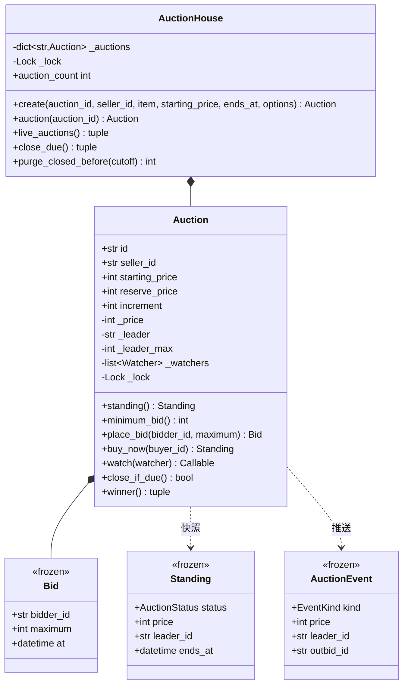

# 设计题解：在线拍卖（Online Auction）

## 题目与澄清

面试官的开场："设计一个在线拍卖系统，像 eBay 那样：卖家上架一件东西，买家出价，到点价高者得。"
这道题听上去比撮合题（见 [[solution-stock-brokerage]]）简单——只有一个卖家、一件商品、一条
时间线——但它有两个地方几乎所有答案都会栽：**代理出价**（proxy bidding）算错，以及**结算
恰好一次**说不清楚。先把这两件事问出来，你就已经领先一半人了。

值得当场问的几个问题：

- **出价者交的是"一个价"还是"一个上限"？** 这是本题最重要的一问。如果是价，那就是最原始的
  英式拍卖，每次只能比现价高一档，用户得一直盯着屏幕。真实系统（eBay、各类拍卖 App）用的是
  **代理出价**：你交一个**愿意付的最高额**（maximum），系统替你出"压过对手所需的最小金额"，
  所以你常常以远低于上限的价格赢下拍品。面试官八成会说"就按 eBay 那样"，而那意味着当前价
  是一个**算出来**的量，不是一个被直接写入的量。
- **起拍价（starting price）和底价（reserve price）是不是一回事？** 不是。起拍价是第一次出价
  的下限，公开；底价是"低于这个数卖家宁可不卖"，通常**不公开**。两者都要，而且它们在算法里
  落在不同的位置。
- **钱用什么类型？** 整数最小货币单位（分）。代理出价要做 `min` / `max` 和"加一档"的比较，
  用 `float` 会让"并列"这种边界变成掷骰子。
- **时间从哪来？** 必须是**注入的时钟**。拍卖题的一切难点都在时间上，测试里如果要 `sleep`
  才能验收，这题就没法测了。
- **到点的那一刻，谁来把它结束？** 这是第二个题眼。定时器？扫描线程？还是"第一个来看它的
  人"？如果面试官追问"服务器半夜重启了、没人访问这场拍卖，它算不算结束了"，你得答得出。
- **要不要反狙击？** 最后一秒出价（sniping）在真实拍卖里是常态。问一句"要不要软关闭
  （soft close）"，通常会得到"要"，这就是第 3 关。

**范围之外**：注册登录、支付与收款、商品搜索与分类、图片与描述、信用评价、纠纷与退款。
出价者的资金能力不做校验（拍卖不像证券交易那样预冻资金，落槌后才收款）。

## 需求与分级

- **第 1 关（约 20 分钟）**：一场拍卖有卖家、拍品、起拍价、底价、开始与结束时间（都走注入的
  时钟）。买家出价要过校验：拍卖必须已开始、未结束，卖家不能给自己出价，出价上限必须达到
  "现价加一个加价档（increment）"。对应 `Auction.__init__`、`minimum_bid`、`_accept_locked`。
- **第 2 关（约 15 分钟）**：**代理出价**。出价者交上限，系统替他出刚好够的那个数；并列要
  确定性地裁决。对应 `Auction._proxy_locked`——全题最该写对的十行。
- **第 3 关（约 15 分钟）**：收尾时刻的一切。并发出价、反狙击延时、**恰好结算一次**。对应
  `_tick`、`_extend_locked`、`close_if_due`，以及那把一场拍卖一把的锁。这一关还要回答两个
  容器怎么缩小：关注者表和已结束的拍卖。
- **第 4 关（选做）**：一口价（buy it now），或者给亚军的第二次机会（second-chance offer）。
  评分点是"加它有没有动到出价那段代码"。本文实现一口价：`Auction.buy_now` 只是把价与领先者
  直接写成一口价，再走同一条结束路径，`_proxy_locked` 和 `_accept_locked` 一行都没改。

## 核心对象与职责

- **`Auction`** — 一场拍卖，本题唯一有状态的实体。它拥有三条不变量：**当前价只涨不跌**；
  **领先者恒有一个不低于当前价的上限**；**状态从 ACTIVE 翻出去这件事全局只发生一次**。
  它自带一把锁——粒度就是"一场拍卖一把"，理由见决策。
- **`Bid`** — 一次出价，`frozen=True`。它记的是**上限**而不是价格。上限是私密信息：进入事件
  和快照的永远只有"当前价"和"谁领先"，把上限广播出去，代理出价就失去全部意义。
- **`Standing`** — 对外的只读快照（状态、现价、领先者、结束时间、出价次数）。所有读接口都
  返回它或它的字段，内部那些表一张都不外借。
- **`AuctionEvent` / `EventKind`** — 推给关注者的事件，**自带发生了什么**：现价、谁领先、
  谁被顶掉、结束时间、状态。订阅者读事件就够，不必回头去问 `Auction` 要数据——那等于绕过它
  的锁去读一份正在变的状态。
- **`AuctionStatus`** — SCHEDULED / ACTIVE / SOLD / UNSOLD。注意**流拍只有一个状态**：没人
  出价和没到底价，原因不同，但系统行为完全一样（没有赢家、不收款），所以不给它们两个状态，
  原因由"有没有领先者"自己说明。
- **`AuctionHouse`** — 拍品目录：按 id 找拍卖、批量把到点的结束掉、把过期的清出目录。它
  **不转发** `place_bid`，理由见决策。

生命周期上：`AuctionHouse` **组合**（composition）`Auction`；`Auction` 持有自己的 `Bid` 列表
（出价不能脱离拍卖存在）；买家和卖家只是字符串 id，**关联**（association）而已——本题不需要
一个只有名字的 `User` 类，它除了"有个 id"没有任何行为。



## 关键设计决策

### 代理出价：系统到底替你出多少

需求一句话：出价者交一个上限 `M`，系统替他出"压过在位领先者所需的最小金额"。听起来简单，
写错的人却占绝大多数，因为它其实是三条规则而不是一条。

设在位领先者的上限是 `L`，当前价是 `P`，加价档是 `k`。新来一个挑战者，上限 `M`：

- `M > L`：**换人**。新价 = `min(M, L + k)`——挑战者只需要压过在位者一档，除非他的上限还
  不到那一档，那就按他的上限成交（这时他其实是险胜）。
- `M <= L`：**不换人**，但在位者被顶上去：新价 = `min(L, M + k)`。挑战者出局，而且他**一秒钟
  都没有领先过**——这一点很重要，系统不该给他发"你正在领先"然后立刻再发"你被超越了"。
- 无论哪一支，最后都要 `P = max(P, 新价)`：**价格只涨不跌**。

第三条最容易漏，而漏了它就会出现"后来的小额出价把价格打下去"的荒唐结果。它同时是一个更深的
性质的来源：**加上这一条之后，最终结果与出价到达顺序无关**——领先者永远是上限最高的那位
（更高的上限一定顶得动在位者，更低的永远顶不动），最终价永远是
`min(最高上限, 次高上限 + 一档)`。本文的测试把四个上限的全部 24 种排列跑了一遍来钉死它。

底价还要再压一层：**领先者的上限一旦够到底价，价格直接抬到底价**——卖家反正会接受这个数，
没有理由让它停在下面。这一行也顺带解释了为什么底价和起拍价必须是两个字段。

把上面这段翻成代码，一共十行：

```python
if self._leader is None:
    self._leader, self._leader_max = bidder_id, maximum
elif maximum > self._leader_max:
    self._price = max(self._price, min(maximum, self._leader_max + self.increment))
    self._leader, self._leader_max = bidder_id, maximum
else:
    self._price = max(self._price, min(self._leader_max, maximum + self.increment))
if self._leader_max >= self.reserve_price:
    self._price = max(self._price, self.reserve_price)
```

**两个代理上限重叠时到底是什么价？** 走一遍例子（起拍价 ¥100，加价档 ¥1）：

| 动作 | 结果 | 为什么 |
|---|---|---|
| Alice 设上限 ¥150 | 现价 **¥100**，Alice 领先 | 首次出价按起拍价成交，她的 ¥150 没人知道 |
| Bob 设上限 ¥120 | 现价 **¥121**，**Alice 仍领先** | `120 <= 150`，Alice 被顶到 `min(150, 120+1)`；Bob 从未领先 |
| Carol 设上限 ¥200 | 现价 **¥151**，Carol 领先 | `200 > 150`，换人，`min(200, 150+1)` |
| Alice 把自己上限提到 ¥210 | 现价 **¥201**，Alice 领先 | `210 > 200`，换人，`min(210, 200+1)` |
| Dave 设上限 ¥210（并列） | 现价 **¥210**，**Alice 仍领先** | `210 <= 210` 走"不换人"分支，`min(210, 210+1) = 210` |

最后一行就是**并列规则**：上限相同，**先提交的那个赢**，价格被抬到那个共同上限。这不是随便
定的——它让结果可复现，而且符合直觉（你没能出得更高，就没有理由夺走别人的位置）。

### 领先者提高自己的上限时，价格该不该动

上面表格的第四行藏着一个陷阱。Alice 已经领先，她把上限从 ¥150 提到 ¥210，价格**涨了**
（¥121 → ¥201）——那是因为 Carol 在中间插了一手，Alice 提价时她已经不是领先者了。

但如果 Alice **正在领先**的时候提高上限呢？天真的实现会把她当成一个新挑战者，走
`M > L` 分支，算出 `min(210, 150 + 1) = 151`，于是**她自己把自己的价顶上去了**。这是本题
最经典的 bug：**没有人应该和自己竞价**。

正确处理是给领先者单开一条路：

```python
if bidder_id == self._leader:
    if maximum <= self._leader_max:
        raise BidTooLowError(f"raise your own maximum above {self._leader_max}")
    self._leader_max = maximum
```

只改上限，**价格一动不动**，也不发"价格变化"事件（什么都没发生，发事件只会让所有关注者以为
局势变了）。顺带注意校验也换了一条：领先者加价的门槛是"必须超过自己现有的上限"，而不是
"必须达到现价加一档"——后者对他毫无意义，因为现价本来就是他在付。

### "恰好结算一次"：定时器、扫描线程，还是惰性推进

这是本题的第二个题眼，也是面试官最爱追问的地方："结束时间到了，但没有人访问这场拍卖，
它算结束了吗？谁来通知赢家？"

**选项一：每场拍卖一个定时器。** 上架时算出延迟，丢给线程池。流行题解就是这么做的
（`scheduler.submit(...)` 里 `time.sleep(delay)`）。问题一大把：上架一百万场就是一百万个
待命任务；反狙击一延时，那个定时器就成了一颗错误时间的定时炸弹，得取消重排；进程一重启，
所有定时器全部丢失，而**状态里没有任何东西记得"这场该结束了"**。

**选项二：一个周期扫描线程。** 每隔几秒遍历活跃拍卖，把到点的结束掉。这个好得多——它是
**幂等**的、重启后自己会追上、不怕延时。但它单独还不够：扫描间隔内读到的状态仍然是"进行中"。

**选项三（本文）：惰性推进 + 扫描线程，而"恰好一次"由状态翻转本身保证。**

```python
def _tick(self, now: datetime) -> list[AuctionEvent]:
    events = []
    if self._status is AuctionStatus.SCHEDULED and now >= self.starts_at:
        ...
    if self._status is AuctionStatus.ACTIVE and now >= self._ends_at:
        sold = self._leader is not None and self._price >= self.reserve_price
        self._status = AuctionStatus.SOLD if sold else AuctionStatus.UNSOLD
        events.append(self._event(EventKind.CLOSED, now))
    return events
```

`_tick` 在**锁内**被每一次读写调用。于是：

- **"恰好一次"是什么意思？** 状态从 ACTIVE 翻出去这个动作，在这场拍卖的一生中最多发生一次，
  因而 CLOSED 事件最多被产生一次；而只要有任何一次读或写发生在截止之后，它**至少**发生一次。
  两边合起来就是恰好一次。它不依赖任何定时器活着。
- **没人调用任何东西时呢？** 诚实的答案是：那就什么都还没发生，**但也没有任何人能观察到
  "还没结束"**——谁来看，谁就在看到之前先把它结算了。对外可见的行为等价于"到点即结束"。
  通知要**及时**才需要那个扫描线程（`AuctionHouse.close_due`），但正确性不靠它。
- 由此还得到一个很好测的性质：十六个线程同时调 `close_if_due()`，**恰好一个**返回 `True`，
  关注者**恰好收到一次** CLOSED。

`close_due` 的写法里还有一个细节：先在拍卖行自己的锁内拿一份目录快照，**出锁之后**再去碰
每一场各自的锁。不形成"拍卖行锁 → 拍卖锁"的嵌套，也就不可能有锁顺序死锁。

### 锁放在哪一层：一场一把，还是拍卖行一把

撮合题（[[solution-stock-brokerage]]）里那把锁是**全局**的，因为一笔成交要同时动两个账户和
一本簿子，原子性跨越了多个对象。很多人会把那个结论直接搬过来，在 `AuctionHouse` 上挂一把大锁。

这里应该反过来：**一场拍卖一把锁**。理由是两场拍卖之间**没有任何共享状态**——没有跨拍卖的
资金、没有跨拍卖的库存，一次出价影响的永远只有一件拍品。拍卖行一把大锁的后果是：一件爆款
拍品在最后十秒的出价洪峰，会把同时进行的另外十万场冷门拍卖全部堵死。

这个判据值得记住：**锁的粒度应该等于"必须一起原子改变的那组状态"的边界**，不多也不少。
在拍卖题里那个边界就是一场拍卖；在撮合题里它是整个交易所。

顺带说清 GIL 在这里给了什么：**什么也没给**（见
[[concurrency.primitives|同步原语（threading）]]）。"读当前领先者的上限"和"写新的领先者"
是两段字节码，两个线程可以在中间交错，结果是两个人同时被记成领先者。GIL 只保证单条字节码
不被打断。

### 观察者要不要一个抽象基类

出价要通知关注者，这是观察者模式（Observer）的标准场景。Java 题解会写一个 `AuctionObserver`
接口、一个 `on_update(auction, message)` 方法、若干实现类。**在 Python 里这是多余的。**

观察者只有一个方法，那它就是一个**函数**。本文的关注者类型是
`Callable[[AuctionEvent], None]`——`print`、`list.append`、一个闭包、一个实现了 `__call__`
的类，全都直接可用，不需要任何人去继承什么。抽象基类的价值在"多个方法要一起实现"或"要用
`isinstance` 分派"，这里两个都没有。

真正值得花心思的是另外两处，而它们和用不用基类无关：

1. **事件自带内容**。`on_update(auction, "你被超越了")` 这种签名把订阅者推回去读 `auction`
   的状态——绕过锁、读到的还可能是下一次出价之后的样子。本文的 `AuctionEvent` 带齐了现价、
   领先者、被顶掉的人、结束时间和状态，订阅者只读事件。
2. **退订的手段要和订阅一起交出去**。`watch()` 返回一个 `unwatch` 闭包，于是关注者表会缩小；
   拍卖一结束，整张表当场清空，因为之后不会再有任何事件。没有这两条，关注者表就是一个只增
   不减的内存泄漏。

## 代码走读

完整实现在下面。先看四处：

1. **`Auction._proxy_locked`** —— 代理出价的全部十行。三个分支、一个 `max` 兜底、一个底价
   抬升，本题的分数大半在这里。
2. **`Auction._accept_locked`** —— 校验的顺序值得看：先状态、再身份（卖家不能出价）、再
   "是不是自己已经领先"（走不竞价的那条路）、最后才是金额。顺序错了就会出现"卖家被告知出价
   太低"这种荒唐提示。
3. **`Auction._tick` 与 `close_if_due`** —— "恰好一次"的实现。注意 `close_if_due` 返回的是
   "**这一次调用**是不是正好把它结束掉的那一次"，这正是并发测试要断言的东西。
4. **`Auction._notify`** —— 在锁内取关注者快照、顺带在收到 CLOSED 时清空整张表，然后
   **在锁外**逐个回调。三件事挤在一个方法里，但它们是同一件事的三个侧面：怎么安全地把消息
   送出去。

%% code:begin solution.py %%
```python
"""在线拍卖（Online Auction）——代理出价、反狙击延时与"恰好结算一次"的参考实现。

五行设计：出价者交给系统的是一个**上限**（maximum），不是一个价格——系统替他出"刚好压过对手
所需的最小金额"，于是当前价由 `min(最高上限, 次高上限 + 一档)` 决定，金额一律整数分；并列时
**先到的上限赢**，而且当前价永不回落，这两条让结果与到达顺序无关。时间只从注入的时钟来，
状态推进是**惰性**的：任何一次读写都先 `_tick` 一下，结束由锁内的一次状态翻转裁定，所以"恰好
一次"不依赖任何定时器。最后几秒落下的出价把结束时间推后（反狙击），推后次数有上限。
"""

from __future__ import annotations

import itertools
import threading
from collections.abc import Callable, Sequence
from dataclasses import dataclass
from datetime import datetime, timedelta
from enum import Enum


# --------------------------------------------------------------------------
# 失败路径。


class AuctionError(Exception):
    """本设计里所有失败路径的公共基类。"""

class AuctionNotFoundError(AuctionError):
    """这场拍卖不存在（或已经被 `purge_closed_before` 清掉）。"""

class InvalidAuctionError(AuctionError):
    """拍卖本身的参数就不合法：结束早于开始、价格非正、加价档非正。"""

class AuctionNotStartedError(AuctionError):
    """还没到开拍时间。"""

class AuctionClosedError(AuctionError):
    """拍卖已经结束，不再接受任何出价。"""

class BidTooLowError(AuctionError):
    """出价上限没有达到当前所需的最低出价（或者没有超过自己已有的上限）。"""

class SellerCannotBidError(AuctionError):
    """卖家不能给自己的拍品出价——这是托价（shill bidding）。"""

class BuyNowUnavailableError(AuctionError):
    """这场拍卖没有一口价，或者当前价已经追上一口价，一口价随之失效。"""


class AuctionStatus(Enum):
    """拍卖的四个状态。两个终态：成交与流拍。

    流拍有两种原因——没人出价，或者最终价没到底价（reserve）——但对系统行为而言它们完全
    一样（没有赢家、不收款），所以**不给它们两个状态**，原因由"有没有领先者"自己说明。
    """

    SCHEDULED = "scheduled"
    ACTIVE = "active"
    SOLD = "sold"
    UNSOLD = "unsold"

    @property
    def is_closed(self) -> bool:
        """终态不再变化。"""
        return self in (AuctionStatus.SOLD, AuctionStatus.UNSOLD)


class EventKind(Enum):
    """关注者会收到的四类事件。"""

    OPENED = "opened"
    BID = "bid"
    EXTENDED = "extended"
    CLOSED = "closed"


@dataclass(frozen=True, slots=True)
class Bid:
    """一次出价。`maximum` 是出价者愿意付的**上限**，不是他当前要付的价。

    上限是私密的：它进入事件与快照的从来只有"当前价"和"谁领先"。把上限广播出去，
    代理出价就失去全部意义——别人只要出到你的上限加一档就能精准地把你顶掉。
    """

    id: str
    auction_id: str
    bidder_id: str
    maximum: int
    at: datetime


@dataclass(frozen=True, slots=True)
class Standing:
    """拍卖的对外快照：任何时候问"现在什么情况"，拿到的都是这个不可变对象。"""

    auction_id: str
    status: AuctionStatus
    price: int
    leader_id: str | None
    ends_at: datetime
    bid_count: int


@dataclass(frozen=True, slots=True)
class AuctionEvent:
    """推给关注者的事件：**自带发生了什么**（现价、谁领先、谁被顶掉、结束时间、状态），
    订阅者读事件就够，不必回头去问 `Auction` 要数据——那等于绕过它的锁读一份正在变的状态。
    """

    kind: EventKind
    auction_id: str
    status: AuctionStatus
    price: int
    leader_id: str | None
    ends_at: datetime
    at: datetime
    outbid_id: str | None = None


Clock = Callable[[], datetime]
Watcher = Callable[[AuctionEvent], None]


class Auction:
    """一场拍卖：一个卖家、一件拍品、一个底价、一段时间，和一台代理出价机。

    不变量：当前价**只涨不跌**；领先者恒有一个 ≥ 当前价的上限；状态只沿
    SCHEDULED → ACTIVE → SOLD/UNSOLD 单向推进，而且从 ACTIVE 翻出去这件事
    **全局只会发生一次**——它在锁内完成，谁翻的谁负责发"已结束"事件。

    锁的粒度是**一场拍卖一把**：两场拍卖之间没有任何共享状态（不像撮合要跨账户搬钱），
    所以全局一把锁只会让热门拍品拖死所有冷门拍品。
    """

    def __init__(self, auction_id: str, seller_id: str, item: str, starting_price: int,
                 ends_at: datetime, clock: Clock, *, reserve_price: int = 0,
                 starts_at: datetime | None = None, increment: int = 100,
                 soft_close: timedelta = timedelta(seconds=30), max_extensions: int = 10,
                 buy_now_price: int | None = None) -> None:
        self.id = auction_id
        self.seller_id = seller_id
        self.item = item
        self.starting_price = starting_price
        self.reserve_price = reserve_price
        self.increment = increment
        self.soft_close = soft_close
        self.max_extensions = max_extensions
        self.buy_now_price = buy_now_price
        self.starts_at = starts_at if starts_at is not None else clock()
        if ends_at <= self.starts_at:
            raise InvalidAuctionError("an auction must end after it starts")
        if starting_price <= 0 or increment <= 0 or reserve_price < 0:
            raise InvalidAuctionError("prices and the increment must be positive")
        self._clock = clock
        self._ends_at = ends_at
        self._status = AuctionStatus.SCHEDULED
        self._price = starting_price
        self._leader: str | None = None
        self._leader_max = 0
        self._extensions = 0
        self._bids: list[Bid] = []
        self._watchers: list[Watcher] = []
        self._lock = threading.Lock()
        self._ids = (f"{auction_id}-B{n}" for n in itertools.count(1))

    # ---- 读：一律先推进时间，再给不可变快照 ------------------------------

    def standing(self) -> Standing:
        """当前状况的快照。读之前先推进一次时间，所以"过了点还显示进行中"不可能发生。"""
        events: list[AuctionEvent] = []
        with self._lock:
            events += self._tick(self._clock())
            snapshot = Standing(auction_id=self.id, status=self._status, price=self._price,
                                leader_id=self._leader, ends_at=self._ends_at,
                                bid_count=len(self._bids))
        self._notify(events)
        return snapshot

    @property
    def status(self) -> AuctionStatus:
        """当前状态。"""
        return self.standing().status

    @property
    def price(self) -> int:
        """当前价（分）：领先者此刻若成交要付的金额。"""
        return self.standing().price

    @property
    def leader(self) -> str | None:
        """当前领先者。"""
        return self.standing().leader_id

    @property
    def bid_count(self) -> int:
        """收到过多少次有效出价。"""
        with self._lock:
            return len(self._bids)

    @property
    def watcher_count(self) -> int:
        """还有多少关注者——结束之后必须归零。"""
        with self._lock:
            return len(self._watchers)

    @property
    def extension_count(self) -> int:
        """被反狙击规则延长过几次。"""
        with self._lock:
            return self._extensions

    def bids(self) -> tuple[Bid, ...]:
        """出价历史的快照。内部那张表不外借。"""
        with self._lock:
            return tuple(self._bids)

    def minimum_bid(self) -> int:
        """下一位出价者至少要报的上限：首次出价是起拍价，之后是现价加一档。"""
        with self._lock:
            self._tick(self._clock())
            return self._minimum_locked()

    def winner(self) -> tuple[str, int] | None:
        """成交则返回 `(买家, 成交价)`；流拍返回 `None`。"""
        snapshot = self.standing()
        if snapshot.status is not AuctionStatus.SOLD or snapshot.leader_id is None:
            return None
        return snapshot.leader_id, snapshot.price

    # ---- 写：出价、一口价、关注、到点结束 --------------------------------

    def place_bid(self, bidder_id: str, maximum: int) -> Bid:
        """出一次代理价：交上限，系统替你出到刚好够用的那个数。"""
        now = self._clock()
        events: list[AuctionEvent] = []
        try:
            with self._lock:
                events += self._tick(now)
                bid = self._accept_locked(bidder_id, maximum, now, events)
        finally:
            self._notify(events)
        return bid

    def buy_now(self, buyer_id: str) -> Standing:
        """一口价：立刻按 `buy_now_price` 成交并结束拍卖。

        第 4 关的新需求，它**没有改动出价那段代码的任何一行**：只是把价与领先者直接写成
        一口价，再让状态走同一条结束路径。规则是"现价追上一口价，一口价就失效"——市场已经
        把它估到这个数以上，再给人捡便宜就不对了。
        """
        now = self._clock()
        events: list[AuctionEvent] = []
        try:
            with self._lock:
                events += self._tick(now)
                if self._status is AuctionStatus.SCHEDULED:
                    raise AuctionNotStartedError(f"auction {self.id} has not started")
                if self._status.is_closed:
                    raise AuctionClosedError(f"auction {self.id} is {self._status.value}")
                if buyer_id == self.seller_id:
                    raise SellerCannotBidError("the seller cannot buy their own item")
                if self.buy_now_price is None or self._price >= self.buy_now_price:
                    raise BuyNowUnavailableError(f"buy-it-now is gone on auction {self.id}")
                self._price, self._leader = self.buy_now_price, buyer_id
                self._leader_max = self.buy_now_price
                self._bids.append(Bid(id=next(self._ids), auction_id=self.id, bidder_id=buyer_id,
                                      maximum=self.buy_now_price, at=now))
                self._ends_at, self._status = now, AuctionStatus.SOLD
                events.append(self._event(EventKind.CLOSED, now))
                snapshot = Standing(self.id, self._status, self._price, self._leader,
                                    self._ends_at, len(self._bids))
        finally:
            self._notify(events)
        return snapshot

    def watch(self, watcher: Watcher) -> Callable[[], None]:
        """关注这场拍卖，返回一个取消关注的函数——退订的手段和订阅一起交出去，
        关注者表才会缩小；拍卖一结束，整张表当场清空，因为之后不会再有任何事件。
        """
        with self._lock:
            self._watchers.append(watcher)

        def unwatch() -> None:
            """取消关注；重复调用无害。"""
            with self._lock:
                if watcher in self._watchers:
                    self._watchers.remove(watcher)

        return unwatch

    def close_if_due(self) -> bool:
        """到点就结束，返回"这一次调用是不是正好把它结束掉的那一次"。

        扫描线程和任何一次读写都会走到同一段代码，而翻状态发生在锁内，所以无论多少个线程
        同时到达，**只有一个**会拿到 `True`，也只有它会发出"已结束"事件。
        """
        events: list[AuctionEvent] = []
        with self._lock:
            events += self._tick(self._clock())
        self._notify(events)
        return any(e.kind is EventKind.CLOSED for e in events)

    # ---- 内部：时间推进、代理出价、反狙击、事件 --------------------------

    def _tick(self, now: datetime) -> list[AuctionEvent]:
        """把状态推进到 `now` 应有的样子，返回这一步产生的事件。调用方须已持有锁。

        这是"恰好一次"的全部机密：结束不是被定时器触发的，而是被**第一个看它的人**
        触发的，而看的动作在锁里，所以翻转只能发生一次。
        """
        events: list[AuctionEvent] = []
        if self._status is AuctionStatus.SCHEDULED and now >= self.starts_at:
            self._status = AuctionStatus.ACTIVE
            events.append(self._event(EventKind.OPENED, now))
        if self._status is AuctionStatus.ACTIVE and now >= self._ends_at:
            sold = self._leader is not None and self._price >= self.reserve_price
            self._status = AuctionStatus.SOLD if sold else AuctionStatus.UNSOLD
            events.append(self._event(EventKind.CLOSED, now))
        return events

    def _minimum_locked(self) -> int:
        """当前所需的最低出价上限。调用方须已持有锁。"""
        return self.starting_price if self._leader is None else self._price + self.increment

    def _accept_locked(self, bidder_id: str, maximum: int, now: datetime,
                       events: list[AuctionEvent]) -> Bid:
        """校验并接受一次出价。调用方须已持有锁。"""
        if self._status is AuctionStatus.SCHEDULED:
            raise AuctionNotStartedError(f"auction {self.id} opens at {self.starts_at}")
        if self._status.is_closed:
            raise AuctionClosedError(f"auction {self.id} is {self._status.value}")
        if bidder_id == self.seller_id:
            raise SellerCannotBidError("the seller cannot bid on their own item")
        before = (self._price, self._leader)
        if bidder_id == self._leader:
            # 自己已经领先：只抬自己的上限，**价格一动不动**——没人会和自己竞价。
            if maximum <= self._leader_max:
                raise BidTooLowError(f"raise your own maximum above {self._leader_max}")
            self._leader_max = maximum
            outbid = None
        else:
            minimum = self._minimum_locked()
            if maximum < minimum:
                raise BidTooLowError(f"auction {self.id} needs at least {minimum}, got {maximum}")
            outbid = self._proxy_locked(bidder_id, maximum)
        bid = Bid(id=next(self._ids), auction_id=self.id, bidder_id=bidder_id,
                  maximum=maximum, at=now)
        self._bids.append(bid)
        if (self._price, self._leader) != before:
            events.append(self._event(EventKind.BID, now, outbid_id=outbid))
        self._extend_locked(now, events)
        return bid

    def _proxy_locked(self, bidder_id: str, maximum: int) -> str | None:
        """代理出价的核心三行：谁领先、价格涨到多少、谁被顶掉。调用方须已持有锁。

        规则：新上限**严格高于**在位者才换人，换人后的价格是"刚好压过在位者一档"与
        "自己的上限"之中的较小值；新上限没超过在位者，则在位者被顶到"挑战者上限加一档"
        与"自己上限"之中的较小值。并列（两人上限相同）走后一条，于是**先到的上限赢**。
        `max(...)` 那一层保证价格只涨不跌，这也是结果与到达顺序无关的前提。
        """
        if self._leader is None:
            self._leader, self._leader_max = bidder_id, maximum
            outbid = None
        elif maximum > self._leader_max:
            outbid = self._leader
            self._price = max(self._price, min(maximum, self._leader_max + self.increment))
            self._leader, self._leader_max = bidder_id, maximum
        else:
            outbid = bidder_id
            self._price = max(self._price, min(self._leader_max, maximum + self.increment))
        if self._leader_max >= self.reserve_price:
            # 领先者的上限已经够到底价：价格直接抬到底价，卖家反正会接受。
            self._price = max(self._price, self.reserve_price)
        return outbid

    def _extend_locked(self, now: datetime, events: list[AuctionEvent]) -> None:
        """反狙击（anti-sniping）：落在最后 `soft_close` 内的出价把结束时间推后。

        延长次数有上限，否则两个人可以把一场拍卖无限地拖下去——"能延长"必须配一个"延到头"。
        """
        if self._ends_at - now > self.soft_close or self._extensions >= self.max_extensions:
            return
        self._ends_at = now + self.soft_close
        self._extensions += 1
        events.append(self._event(EventKind.EXTENDED, now))

    def _event(self, kind: EventKind, at: datetime, outbid_id: str | None = None) -> AuctionEvent:
        """按当前状态造一个事件。调用方须已持有锁。"""
        return AuctionEvent(kind=kind, auction_id=self.id, status=self._status, price=self._price,
                            leader_id=self._leader, ends_at=self._ends_at, at=at,
                            outbid_id=outbid_id)

    def _notify(self, events: Sequence[AuctionEvent]) -> None:
        """在**锁外**把事件发给关注者：关注者是外部代码，握着拍卖的锁调它，
        一个慢关注者就能卡住这场拍卖的所有出价。
        """
        if not events:
            return
        with self._lock:
            watchers = tuple(self._watchers)
            if any(e.kind is EventKind.CLOSED for e in events):
                self._watchers.clear()
        for event in events:
            for watcher in watchers:
                watcher(event)


class AuctionHouse:
    """拍卖行：拍品目录、批量到点扫描、清理已结束的拍卖。

    它**不转发** `place_bid`——那样只会多一层什么也不做的壳。它的责任是目录本身：
    按 id 找到那场拍卖、把该结束的一批结束掉、把过期的从目录里摘掉。
    """

    def __init__(self, clock: Clock) -> None:
        self._clock = clock
        self._auctions: dict[str, Auction] = {}
        self._lock = threading.Lock()

    def create(self, auction_id: str, seller_id: str, item: str, starting_price: int,
               ends_at: datetime, **options: object) -> Auction:
        """上架一场拍卖；`options` 直接透传给 `Auction`（底价、加价档、软关闭窗口、一口价）。"""
        auction = Auction(auction_id, seller_id, item, starting_price, ends_at,
                          self._clock, **options)  # type: ignore[arg-type]
        with self._lock:
            if auction_id in self._auctions:
                raise InvalidAuctionError(f"auction {auction_id!r} already exists")
            self._auctions[auction_id] = auction
        return auction

    def auction(self, auction_id: str) -> Auction:
        """按 id 取拍卖。"""
        with self._lock:
            auction = self._auctions.get(auction_id)
        if auction is None:
            raise AuctionNotFoundError(f"unknown auction {auction_id!r}")
        return auction

    @property
    def auction_count(self) -> int:
        """目录里还有多少场。"""
        with self._lock:
            return len(self._auctions)

    def live_auctions(self) -> tuple[Auction, ...]:
        """还没结束的拍卖的快照（读的过程中顺带推进每一场的时间）。"""
        with self._lock:
            auctions = tuple(self._auctions.values())
        return tuple(a for a in auctions if not a.status.is_closed)

    def close_due(self) -> tuple[str, ...]:
        """扫描一遍，把到点的拍卖结束掉，返回**这一次**真正被它结束掉的那些 id。

        先在自己的锁内拿一份目录快照，出锁后再去碰每一场各自的锁，不形成嵌套，也就没有
        锁顺序死锁。这个扫描只是让通知**及时**；正确性不靠它——没人扫描时，任何一次读写
        也会把状态推进到位。
        """
        with self._lock:
            auctions = tuple(self._auctions.values())
        return tuple(a.id for a in auctions if a.close_if_due())

    def purge_closed_before(self, cutoff: datetime) -> int:
        """把结束于 `cutoff` 之前的拍卖清出目录，返回清掉的场数。

        没有它，目录会随着上架量无限增长，而其中绝大多数早就尘埃落定。关注者表在结束那一刻
        已经清空，所以这些 `Auction` 对象真的能被回收。
        """
        with self._lock:
            auctions = tuple(self._auctions.items())
        gone = [aid for aid, a in auctions
                if (s := a.standing()).status.is_closed and s.ends_at < cutoff]
        with self._lock:
            for auction_id in gone:
                self._auctions.pop(auction_id, None)
        return len(gone)


if __name__ == "__main__":
    from datetime import UTC

    now = datetime(2026, 6, 1, 20, 0, tzinfo=UTC)
    house = AuctionHouse(clock=lambda: now)
    lot = house.create("A1", seller_id="seller", item="Leica M6", starting_price=100_00,
                       ends_at=now + timedelta(minutes=10), reserve_price=90_00,
                       increment=1_00, soft_close=timedelta(seconds=30))
    lot.watch(lambda e: print(f"  [{e.kind.value}] price={e.price / 100:.2f} leader={e.leader_id}"))

    for bidder, maximum in [("alice", 150_00), ("bob", 120_00), ("carol", 200_00),
                            ("alice", 210_00), ("dave", 210_00)]:
        try:
            lot.place_bid(bidder, maximum)
            print(f"{bidder} max {maximum / 100:.2f} -> price {lot.price / 100:.2f}, "
                  f"leader {lot.leader}")
        except AuctionError as exc:
            print(f"{bidder} rejected: {exc}")

    now = now + timedelta(minutes=9, seconds=50)  # 进入软关闭窗口
    lot.place_bid("bob", 220_00)
    print(f"extended {lot.extension_count} time(s), now ends at {lot.standing().ends_at:%H:%M:%S}")
    now = now + timedelta(minutes=1)
    print("closed by this call:", house.close_due(), "winner:", lot.winner())
    print("watchers left:", lot.watcher_count, "purged:", house.purge_closed_before(now))
```
%% code:end %%

## 测试与自检

- **校验组**：未开拍时出价、结束后出价、卖家给自己出价、首次出价低于起拍价、之后的出价低于
  "现价加一档"、拍卖参数本身非法（结束早于开始、价格非正）。
- **代理出价组**：上面那张表的每一行；"输家一秒钟都没领先过"（订阅到的事件里
  `leader_id` 从没出现过他）；并列归先到者；领先者提高自己上限时价格不动；小额晚到的出价
  打不下价格。还有一组 24 个用例的**排列测试**：四个上限的全部到达顺序都得到同一个领先者和
  同一个价格。
- **收尾组**：最后几秒的出价把结束时间推后、延长次数到上限就不再延长、到点后不调任何东西
  直接读状态也会看到已结束、结束后再出价抛 `AuctionClosedError`。
- **并发组**：两条。第一条是"恰好一次"——十六个线程用 `threading.Barrier` 同时调
  `close_if_due()`，断言恰好一个返回 `True`、关注者恰好收到一个 CLOSED 事件、关注者表随即
  归零。第二条是并发出价——八位出价者的上限彼此相距 ¥500 而加价档只有 ¥1，因此断言的那两个数
  是**推导**出来的而不是跑出来看到的：领先者必是上限最高的那位，成交价必是
  `min(最高上限, 次高上限 + 一档)`。间距远大于两个加价档，保证这两位的出价不会被"低于最低
  出价"挡掉；上限更低的那些即使被拒也影响不了结果，因为它们本来就压不动价格。
- **收缩组**：取消关注后不再收到事件、结束后关注者表归零、`purge_closed_before` 把已结束的
  拍卖清出目录并让 `auction_count` 真的变小。
- **第 4 关**：一口价立刻结束拍卖、结束后一口价和出价都不可用、现价追上一口价之后一口价失效、
  没有一口价的拍卖调它抛 `BuyNowUnavailableError`。

**两分钟怎么演示**：照着上面那张表敲五次出价，每次念一句"谁领先、现价多少、为什么"；然后
把时钟拨到离结束只剩十秒，再出一次价，让他看到结束时间被推后；最后把时钟拨过去，调一次
`close_due()`，打印赢家和成交价。`solution.py` 底部的 `__main__` 就是这段演示。

## 扩展与追问

**新需求**

- **第二次机会（second-chance offer）**：赢家不付款时，把拍品以亚军的最高上限报给他。要实现
  它，现在的设计缺**一样东西**：亚军是谁、他的上限是多少，在代理出价里被覆盖掉了。最小改动是
  在 `_proxy_locked` 里额外记一组 `runner_up` / `runner_up_max`，不动任何分支逻辑；出价历史
  里其实也有这些信息，但从历史里倒推要 O(出价数)。诚实地说出这个取舍比直接写代码更加分。
- **自动延长以外的关闭策略**：硬截止（hard close，eBay 用）、软关闭（本文）、"无人出价即
  结束"（荷兰式变体）。它们全部只影响 `_extend_locked` 和 `_tick` 里的那个时间比较，把这个
  比较抽成一个注入的函数，三种策略就都能插。这是"策略应该是一个普通函数"的又一个例子。
- **多件同款同时拍（multi-unit）**：这时"价高者得"变成"前 N 高者各得一件"，当前价变成
  "第 N 高的那个价"。它会真正改写 `_proxy_locked`——说清楚这一点，比假装它能无痛扩展诚实。
- **竞价历史与反托价（shill bidding）审计**：出价历史已经是完整的不可变流水，加一个审计器
  只需要读 `bids()`，不改任何写路径。

**并发与线程安全**

- 现在一场拍卖一把锁，临界区里只有内存运算，没有 IO，所以竞争很短。真要再快，下一步是把
  "出价"做成单生产者队列 + 单线程处理（和撮合引擎一样的思路），回调改成事件流。
- 关注者回调在锁外调用。如果订阅者很多且很慢，下一步是把事件投进一个有界队列，由推送线程
  消费；队列满时的策略（丢最旧的行情、还是阻塞出价）要当场说出来。
- 跨进程的话，"恰好一次"就不能再靠一把进程内的锁了：它变成数据库上的一次条件更新
  （`UPDATE ... WHERE status = 'active'`，看影响行数是不是 1），或者一次分布式锁。**判据
  没变**——结束仍然是一次状态翻转的胜负，只是裁判从 `threading.Lock` 换成了数据库。

**持久化与规模**

- 上数据库时不变的边界是：`Auction` 的那几个字段（现价、领先者、领先者上限、结束时间、状态）
  就是一行记录，出价历史是一张从表。代理出价那十行原样搬进一个事务里，`_tick` 变成
  "读出来时先补一次状态"。
- 三个容器都必须有出口：关注者表靠 `unwatch` 与结束时清空；目录靠
  `purge_closed_before`；出价历史是故意只增的账，真实系统随拍卖归档一起搬走。
- 规模上真正的热点是"某件爆款在最后十秒的出价洪峰"。分库分表按 `auction_id` 天然可行，因为
  拍卖之间零共享——这也是一开始把锁放在拍卖上、而不是放在拍卖行上的长期回报。

## 常见错误

- **把出价当成"一个价"而不是"一个上限"**，于是整个代理出价不存在。这是最大的失分点：题目
  说"像 eBay 那样"，而 eBay 的核心机制就是代理出价。
- **代理出价漏掉 `max(旧价, 新价)`**，让后来的小额出价把价格打下去。
- **领先者提高自己上限时把价格也顶上去**——自己和自己竞价。
- **给出局的挑战者发"你正在领先"再发"你被超越"**。`M <= L` 时他一瞬间都没有领先过，事件流
  不该撒谎。
- **把领先者的上限暴露给所有人**（放进事件或快照）。代理出价的全部价值就建立在上限保密上。
- **底价和起拍价合成一个字段**。底价不公开、只在结算时决定卖不卖，起拍价公开、只管第一次出价
  的门槛，它们在算法里的位置完全不同。
- **每场拍卖一个 `sleep(delay)` 的定时器线程**。上架量一大就撑不住，反狙击一延时就得重排，
  重启就全丢。
- **在 `AuctionHouse` 上挂一把全局锁**。把互不相干的几十万场拍卖串成一条队。
- **`float` 记钱**，导致"并列"这个分支的行为变成掷骰子。
- **返回内部的出价列表**（`get_bids()` 直接把 `self.bids` 交出去）。本设计所有读接口返回
  `tuple` 快照或不可变的 `Standing`。
- **关注者表只增不减**。没有退订、结束也不清空，等于一个随时间增长的内存泄漏。
- **用单例（`__new__`）实现拍卖行**。测试之间会互相污染，而且"一个进程能不能跑两个拍卖行"
  这种追问直接死掉。让它被构造、被注入。
- **给"没人出价"和"没到底价"各开一个状态**。系统行为完全一样，两个状态只会让每个 `if` 都要
  写两遍。

## 45 分钟怎么分配

- **0–5 分钟｜澄清**。问四个：出价是"价"还是"上限"（代理出价）、起拍价与底价是不是两回事、
  钱用什么类型（整数分）、要不要软关闭。说出口："我会把大部分时间花在代理出价和收尾时刻上，
  这两处是这道题真正的难点。"
- **5–12 分钟｜实体与不变量**。列 `Auction` / `Bid` / `Standing` / `AuctionEvent` /
  `AuctionHouse`，并当场说出三条不变量：价格只涨不跌、领先者恒有不低于现价的上限、从 ACTIVE
  翻出去全局只发生一次。**不要建 `User` 类**，并说明为什么（它没有行为）。
- **12–22 分钟｜代理出价**。先在白板上走一遍那张五行的例子表（Alice/Bob/Carol/Alice/Dave），
  让面试官点头，**再**写那十行代码。顺序反了，你会花双倍时间解释。
- **22–30 分钟｜生命周期与收尾**。写 `_tick`，说清"恰好一次"的含义和它为什么不需要定时器；
  再写反狙击延时，并主动提"延长必须有次数上限"。
- **30–38 分钟｜并发与测试**。说锁的粒度为什么在拍卖上而不是在拍卖行上；写两个测试：
  并列归先到者、十六个线程抢着结束只有一个成功。
- **38–45 分钟｜扩展**。口头加一口价（不动出价代码）和第二次机会（诚实地说出它需要多记一个
  亚军字段）。
- **时间不够时砍什么**：先砍一口价、再砍反狙击、再砍拍卖行的清理。**绝对不能砍**的是代理
  出价和"恰好一次"——它们就是这道题本身。

## 来源与延伸

- [awesome-low-level-design — Designing an Online Auction System](https://github.com/ashishps1/awesome-low-level-design/blob/main/problems/online-auction-system.md)
  —— 最流行的免费题面，八条需求适合核对分关。它的 Python 实现是很好的对照组，本文在四处
  给出不同答案：它的出价就是"一个价"，压根没有代理出价，因此整道题最难的部分不存在；
  它的 `AuctionService` 用单例，并且给每场拍卖 `submit` 一个 `time.sleep(delay)` 的任务来
  结束拍卖（上架量一大就撑不住，反狙击一延时还得重排）；它的 `end_auction` 靠
  `if self.state != ACTIVE: return` 提前返回来防重入，本文把同一件事说成一条可断言的性质
  （"这一次调用是不是正好把它结束掉的那一次"）；它的观察者接口收到的是一句字符串消息，
  订阅者只能回头读 `auction` 的状态，本文改成自带内容的不可变事件。
- [kumaransg/LLD — StockExchange（价格-时间优先的撮合题面）](https://github.com/kumaransg/LLD/tree/main/StockExchange)
  —— 拍卖和撮合是同一族问题的两端，值得对照着读：撮合有**两边**都在报价、一本簿子、连续成交；
  拍卖只有**一个**卖家、一件商品、一个截止时刻。看懂"为什么拍卖不需要订单簿"，也就看懂了
  订单簿存在的理由。本站的撮合题解见 [[solution-stock-brokerage]]。
- [Python 官方文档 — `threading`](https://docs.python.org/3/library/threading.html)
  —— 本文的 `Auction` 用 `Lock` 把"读领先者、算新价、写领先者"合成一次原子操作，测试用
  `Barrier` 让十六个线程同时起跑。文档里明确写了 `Lock` 是不可重入的（所以本文小心地不在
  持锁时再调自己的公开方法），以及 `Barrier` 的 `wait()` 会在所有参与者到齐后同时放行——
  这正是并发测试需要的"同时"，而不是靠 `sleep` 制造的假同时。
- [Python 官方文档 — `dataclasses`](https://docs.python.org/3/library/dataclasses.html)
  —— `Bid`、`Standing`、`AuctionEvent` 都是 `frozen=True, slots=True`。文档说明了 `frozen`
  会让赋值抛 `FrozenInstanceError`（所以事件跨线程传递是安全的），`slots` 省掉每个实例的
  `__dict__`（拍卖系统里事件是量最大的对象）。
- [Python 官方文档 — `datetime`](https://docs.python.org/3/library/datetime.html)
  —— 本文所有时间都带时区（`datetime.UTC`）。文档里关于 naive 与 aware 对象不能相减的那一节
  值得读一遍：拍卖题里"还剩多久结束"是核心运算，混用两种 `datetime` 会在跨时区的真实系统里
  直接炸。时钟被注入成一个 `Callable[[], datetime]`，所以测试里一次 `sleep` 都不需要。
