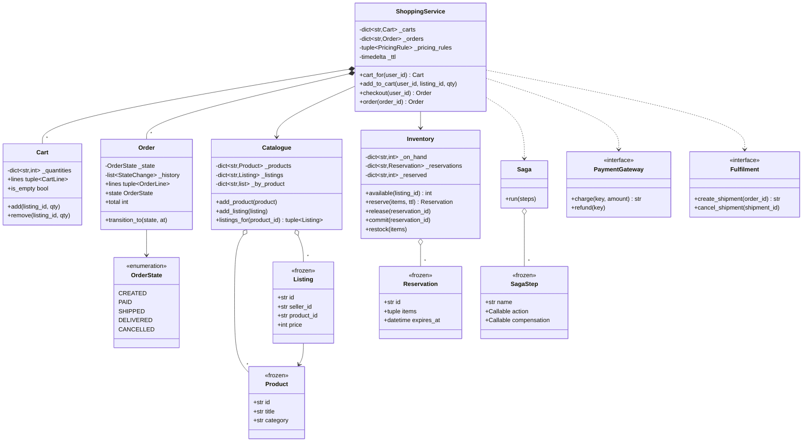

# 设计题解：在线购物（Online Shopping）

## 题目与澄清

面试官通常这样开场："设计一个像 Amazon 那样的在线购物系统：能浏览商品、加购物车、下单，
库存要正确扣减，订单要能跟踪状态。"这句话的范围大到可以做一整年，所以**第一件事是把它切小**，
而切在哪里本身就是评分点。值得当场问出来的：

- **一次下单会跨几个会失败的系统？** 库存、支付、履约——至少三个。它们不在一个数据库事务里，
  所以"下单"天然是一个分布式操作。问清楚这一点，就决定了第 3 关不是写一串 `try/except`，
  而是一个带补偿的 Saga。
- **库存什么时候扣？** 加购时、下单时、还是发货时？这是这道题真正的岔路口，背后是
  **超卖（oversell）和少卖（undersell）的取舍**：锁得早，一堆永不结账的购物车把货占死；
  锁得晚，两个人可能同时买走最后一件。没有"正确答案"，只有"说得出代价的选择"。
- **一个商品会不会有多个卖家？** 面试官不一定一开始就说，但这是第 4 关最常见的加码。
  答案是"会"的话，价格和库存就不该长在商品上。
- **钱怎么表示？** 整数最小货币单位（分），全程不出现浮点数。金额要参与比较、求和、算折扣，
  float 会让"小计 - 折扣 == 实付"这条等式在某些组合下失败。
- **要不要支持退货 / 部分发货 / 预售？** 先问一句，多半会被排除；但问过之后，你的订单状态机
  就知道自己将来要往哪长。
- **并发有多真？** "很多人同时抢同一件货"是这个系统的日常，不是彩蛋。

**范围之外**：**搜索不在本文范围内**——商品检索的倒排索引、排序与相关性是另一道完整的题，
见[[solution-search-engine]]；本文的目录只提供"按 id 查"和"按商品查它的全部卖家"两个访问路径。
另外不做用户鉴权、不做真实支付通道（用一个 `Protocol` 描述网关契约）、不做数据库持久化。

## 需求与分级

- **第 1 关（核心流程，约 20 分钟）**：商品目录、购物车、结账产出一张订单。订单行要**抄下
  下单那一刻的价格**，此后卖家改价不追溯已下的单。对应 `Product`、`Listing`、`Catalogue`、
  `Cart`、`OrderLine`、`Order`、`ShoppingService.checkout`。
- **第 2 关（库存预留，约 15 分钟）**：库存要有一个"预留"的中间态，带过期时间，过期由**注入
  的时钟**判定。说清楚"在加购时预留"和"在下单时预留"各自漏掉了什么。对应 `Inventory`、
  `Reservation`。
- **第 3 关（状态机 + Saga，约 15 分钟）**：订单生命周期是一张**显式的转移表**，非法转移抛
  异常；结账跨"预留—扣款—扣减—发货"四步，任何一步失败，已发生的部分都要被补偿掉。对应
  `OrderState`、`ALLOWED_TRANSITIONS`、`Order.transition_to`、`SagaStep`、`Saga`。
- **第 4 关（选做，新需求）**：同一件商品出现第二个卖家；加一条促销规则。评分点是**加它们
  要不要动下单流程**——本文的答案是目录里多一行 `Listing`、规则列表里多一个函数，
  `ShoppingService.checkout`、`Order`、`Inventory`、`Saga` 一行不改。

## 核心对象与职责

- **`Product`** — 一件商品的描述性信息（标题、类目）。它**没有价格，也没有库存**。
- **`Listing`** — "谁按什么价卖这件商品"。价格归它，库存也按它计。这一层是第 4 关"第二个
  卖家"的全部代价：第 1 关就多一个字段，之后什么都不用改。
- **`Catalogue`** — 目录：按 id 查商品／挂牌，按商品查它的全部挂牌。`_by_product` 是一张
  二级索引，把"这件商品有哪些卖家"从全表扫描降到一次字典查找；代价是新增挂牌要维护两份
  结构，所以只留 `add_listing` 一个写入口。
- **`Cart`** — 一个用户的购物车，一行一个挂牌。不变式：**数量归零就删行**；纪律：对外只给
  `tuple[CartLine, ...]` 快照。
- **`Reservation`** — 一次预留，覆盖一整张订单的若干行，**整体成立或整体失败**，带一个由
  注入时钟算出的 `expires_at`。
- **`Inventory`** — 库存账。不变式：`可用量 == 现货 - 所有未过期预留之和`，且永不为负。
  它是这道题里唯一会无限增长的容器，所以"谁来删预留"必须有三条明确答案：过期扫一次、
  释放删一次、提交删一次。
- **`Order`** — 一张订单。它只拥有一条不变式：状态只能沿着 `ALLOWED_TRANSITIONS` 走。
  `state` 是只读属性，唯一的改法是 `transition_to`；`lines` 和 `history` 只给快照。
- **`Saga` / `SagaStep`** — 一个**与购物无关**的通用执行器：按顺序跑若干"动作 + 补偿"，
  失败时反向补偿。它不知道什么是订单、什么是库存，因此可以被单独测试。
- **`PaymentGateway` / `Fulfilment`（Protocol）** — 外部参与方的契约。用
  `typing.Protocol` 而不是 `abc.ABC`：调用方和实现方在不同的模块里，测试替身不该为了
  "被认出来"而去继承一个基类。
- **`PricingRule`** — 一个普通函数 `(订单行) -> 折扣`。第 4 关的促销就是往列表里多塞一个。
- **`ShoppingService`** — 门面：持有目录、库存、两个外部参与方、时钟、预留时长和定价规则，
  负责把"结账"编排成一个 Saga。

生命周期上：`ShoppingService` **组合** `Cart` 和 `Order`（购物车结完账就从内存里消失），
**关联** `Catalogue`、`Inventory` 和两个外部 Protocol——它们由调用方构造并注入，可以被多个
服务实例共享。



## 关键设计决策

### 库存什么时候扣：加购时预留、下单时预留、还是根本不预留？

这是这道题唯一一个"怎么选都对、但必须说得出代价"的问题。三个真实选项：

```python
# 选项 1：加购即预留——购物车里的每一件都占住库存
def add_to_cart(self, user_id, listing_id, quantity=1) -> None:
    self.inventory.reserve({listing_id: quantity}, ttl=self._ttl)
    self.cart_for(user_id).add(listing_id, quantity)
```

```python
# 选项 2：下单时预留，预留带过期时间（本文的选择）
def checkout(self, user_id):
    reservation = self.inventory.reserve(items, self._ttl)   # 十五分钟内有效
    ...                                                      # 扣款、扣减、发货
```

```python
# 选项 3：不预留，扣款成功后直接扣现货
def checkout(self, user_id):
    charge_id = self._payments.charge(order.id, order.total)
    self.inventory.deduct(items)          # 这里才发现没货了 —— 钱已经扣了
```

**选项 1 少卖**（undersell）：加购的人比下单的人多一个数量级，大促时一件热门商品会被几千个
"看看再说"的购物车占死，真正想买的人看到的是"无货"，平台损失的是真实成交。它唯一的好处是
"加进车里就一定买得到"，这个体验并不值那个代价——真实的电商都不这么做。

**选项 3 超卖**（oversell）：先收钱再发现没货，只能退款道歉；而且扣款和扣减之间的窗口越长，
超卖越严重。它的问题不是"顺序不对"，而是把一个会失败的步骤放在了不可逆的步骤后面。

**本文选选项 2**：下单时才预留，预留有 TTL（本文默认十五分钟，正好覆盖"跳到支付页付款"这段
时间），过期自动失效。它承认了"加购不等于买到"这个事实——这正是购物网站上"手慢无"的来源，
是一个刻意的取舍，不是缺陷。代价有两处必须讲清楚：

1. **过期必须真的被执行**，否则 TTL 形同虚设。本文在每次读写库存前调用 `_expire()` 清扫，
   并且 `commit` 对已过期的预留**直接失败**——测试
   `test_expired_reservation_is_caught_at_commit` 模拟的就是"用户在支付页上磨蹭了二十分钟"，
   扣款成功但预留已经没了，于是整笔回滚、钱退回去。
2. **预留字典必须会缩小**。它是这个设计里唯一会无限增长的容器，三条删除路径（过期、释放、
   提交）缺一条就是内存泄漏。`open_reservations` 这个属性存在的意义就是让测试能直接断言
   "没有残留"。

预留还必须是**整笔成立或整笔失败**：一张订单三行货，第三行不够时不能把前两行留着占住——
那会让一个注定失败的订单顺手把别人的货锁走。

### 订单状态：一张转移表，而不是一堆布尔值，也不是 State 模式

订单生命周期有五个状态。三种写法：

```python
# 选项 1：布尔汤——真实代码里最常见，也最先烂掉
order.is_paid = True
order.is_shipped = False
order.is_cancelled = False     # is_paid and is_cancelled 同时为真是什么意思？
```

```python
# 选项 2：每个状态一个类（State 模式）
class PaidState(OrderState):
    def ship(self, order) -> None: order.state = ShippedState()
    def cancel(self, order) -> None: order.state = CancelledState()
    def pay(self, order) -> None: raise IllegalTransitionError
```

```python
# 选项 3：一个 Enum 加一张模块级的转移表（本文的选择）
ALLOWED_TRANSITIONS: Mapping[OrderState, frozenset[OrderState]] = {
    OrderState.CREATED: frozenset({OrderState.PAID, OrderState.CANCELLED}),
    OrderState.PAID: frozenset({OrderState.SHIPPED, OrderState.CANCELLED}),
    ...
}
```

**选项 1 的问题**不是丑，是**它能表达非法状态**：n 个布尔值有 2ⁿ 种组合，而合法状态只有 5 种，
剩下的组合全靠调用方自觉。Enum 让非法状态根本无法被表示出来。

**这里要拒绝的模式是 State。** 状态模式（State）的收益在于"每个状态下同一个方法有不同的
行为"——比如电梯在"上行"和"待机"时对同一个按钮的响应完全不同，各自还带着自己的数据和
计算。订单没有这种行为差异：它在每个状态下什么也不"做"，唯一的差别是**允许往哪走**。为一个
纯粹的许可关系建五个类、写十几个"这个动作在这个状态下非法"的空方法，是把一张五行的表摊成了
五个文件。表还有一个类做不到的好处：**它可以被一眼读完，也可以被程序读**——画状态图、生成
文档、做转移覆盖率统计，都只需要遍历这张表。

判据可以记成一句话：**状态之间只有"允许/不允许"的差别，用表；状态之间有行为和数据的差别，
才用类。** 这道题是前者，[[structure.state-machines|状态机（State Machines）]]里的电梯是后者。

另外两条纪律：非法转移**抛异常，绝不静默忽略**（被吞掉的非法转移意味着调用方以为自己发货了，
而订单其实还没付款）；每次转移都往 `history` 里追加一条 `StateChange`，因为"这张单什么时候
付的款"是客服每天都要回答的问题，而它只能来自事中记录，不能事后推算。

### 结账是一个 Saga，不是一串 `try/except`

结账要跨四个会失败的参与方：预留库存、扣款、扣减库存、创建运单。它们不在一个事务里，所以
"失败就回滚"必须自己写。朴素的写法是嵌套的 `try/except`：

```python
# 选项 1：嵌套 try/except —— 参与方每多一个，缩进就多一层
reservation = inventory.reserve(items, ttl)
try:
    charge = payments.charge(order.id, total)
    try:
        inventory.commit(reservation.id)
        try:
            fulfilment.create_shipment(order.id)
        except Exception:
            inventory.restock(items); payments.refund(charge); raise
    except Exception:
        payments.refund(charge); raise
except Exception:
    inventory.release(reservation.id); raise
```

```python
# 选项 2：把“做什么”和“怎么撤销”成对声明，交给一个通用执行器（本文的选择）
steps = [
    SagaStep("预留库存", do_reserve, lambda: inventory.release(...)),
    SagaStep("扣款",     do_pay,     undo_pay),
    SagaStep("扣减库存", do_commit,  undo_commit),
    SagaStep("发货",     do_ship,    undo_ship),
]
Saga().run(steps)
```

选项 1 的补偿逻辑被抄了好几遍（`payments.refund` 出现两次），加第五个参与方要改三处，而且
极容易补偿一个根本没执行成功的步骤。选项 2 把顺序和补偿收敛到一处；`Saga` 本身不知道什么是
订单，可以被单独测试（`test_saga_compensates_in_reverse_order_and_reports_failures` 就是纯粹
对它的测试，一件商品都没有）。

这里有三条容易被忽略、而面试官会追问的细节：

1. **失败的那一步自己也要被补偿，并且排在最前面。** 一个动作不是原子的："扣款"可能已经把钱
   扣走、却在拿回执时失败。只补偿"已完成"的步骤，这笔钱就永远留在半路上。代价是补偿可能在
   动作根本没生效时被调用，所以——
2. **每个补偿都必须幂等，而且要能容忍"什么都还没发生"。** `Inventory.release` 对不存在的
   预留是无操作；`undo_commit` 只在确实扣减过时才补货（否则会凭空造出库存——这是加上第 1 条
   之后立刻会踩的坑）。
3. **补偿按幂等键（idempotency key）寻址，不按回执号。** 本文的 `PaymentGateway.refund` 收的
   是调用方生成的订单号，不是 `charge` 返回的回执号。理由正是第 1 条的场景：钱扣了、响应在
   网络上丢了，回执号永远拿不到；只有调用方自己生成的键，才能在"不知道对方做成了没有"时
   把退款发出去。真实的支付 API（Stripe 等）正是这么设计的。
4. **补偿自己失败了不能被吞掉。** `SagaFailure.compensation_errors` 把它们带出来——它们意味着
   系统里留下了需要人工处理的残留。

### 促销规则：这一次拒绝抽象基类

第 4 关加一条"满 300 减 10%"。看起来像是又一个策略模式（Strategy）的场景，但这次的答案是
**一个普通函数的列表**：

```python
PricingRule = Callable[[Sequence[OrderLine]], int]

def percentage_off(percent: int, minimum_subtotal: int = 0) -> PricingRule:
    def rule(lines: Sequence[OrderLine]) -> int:
        subtotal = sum(line.subtotal for line in lines)
        return subtotal * percent // 100 if subtotal >= minimum_subtotal else 0
    return rule
```

判据和[[solution-splitwise]]里"拆分策略为什么要用类"的判据是同一套，只是这次两条都不成立：
促销规则**无状态**（只读订单行，不记住任何东西），彼此之间**没有可共享的代码**（满减、打折、
第二件半价各算各的），而且只有一个方法。一个 `DiscountStrategy(ABC)` 加 `calculate()` 抽象
方法，在 Python 里只是给一次性计算多包一层从不会被复用的壳——签名本身就是接口。
参数化（"几折""满多少"）用闭包表达，比给每个促销建一个带两个字段的类更短也更直观。

折扣向下取整（`// 100`）也是一条要说出口的规则：**绝不多送一分**。`41800 * 10 // 100 == 4180`，
而不是先算浮点再 round。多条规则的折扣相加，且每条都从原始小计算起（不叠加计算），这是
最容易解释给用户听的口径——"叠加还是不叠加"本身是个产品问题，设计要做的是把它变成一句
可以改的代码，而不是散落在各处的隐含假设。

### 目录：价格挂在挂牌上，而不是商品上

第 4 关"同一件商品出现第二个卖家"是这道题最常见的加码。如果第 1 关把 `price` 和
`stock` 写在 `Product` 上，这一关就要动购物车、订单行和库存三处——因为"买哪个"这个概念从
商品变成了卖家的挂牌。

```python
# 选项 1：价格和库存长在商品上——第 1 关最短，第 4 关要改三个类
@dataclass
class Product:
    id: str; title: str; price: int; stock: int
```

```python
# 选项 2：商品只管描述，价格和库存归挂牌（本文的选择）
@dataclass(frozen=True, slots=True)
class Listing:
    id: str; seller_id: str; product_id: str; price: int
```

本文选选项 2，但要诚实：这是**提前为一个还没提出的需求付了成本**——第 1 关多了一个类、
一层间接。它值得，是因为这一层同时买到了三样东西：第二个卖家零改动、"同款比价"
（`listings_for` 按价格排序）几乎免费、以及**库存天然按卖家计**（两个卖家的货本来就不是
同一批）。如果一层间接只能买到其中一样，那就不该提前付。

顺带一提，`Catalogue._by_product` 这张二级索引也是同一类判断：它把"这件商品有哪些卖家"从
O(全部挂牌) 降到一次字典查找，代价是新增挂牌要同时维护两份结构。这条在
[[structure.storage|内存持久化（In-Memory Persistence）]]里叫二级索引，规矩是**只留一个写
入口**——两份结构必须由同一段代码同时更新，否则迟早对不上。这条规矩很容易在"更新"这条路径上
破功：用同一个 id 再写一次挂牌（也就是改价）时，如果索引那一格无脑 `append`，这个卖家就会在
同款列表里出现两次；改挂到另一件商品下时，还要从原来那一格里摘掉，那一格空了要整格删除——
索引同样是一个必须会缩小的容器。`test_updating_a_listing_does_not_duplicate_the_secondary_index`
钉的就是这两条。

## 代码走读

整份参考实现如下（测试通过的那一份，逐字嵌入）。

%% code:begin solution.py %%
```python
"""在线购物（Online Shopping）——目录、购物车、库存预留、订单状态机与 Saga 补偿的参考实现。

核心思路：价格和库存挂在挂牌（Listing）上而不是商品（Product）上，所以"同一个商品第二个
卖家"只是多一行挂牌，下单流程一行不改。库存不在加购时扣，而在下单时预留一份带过期时间的
Reservation，过期由注入的时钟判定、并且真的从字典里被清掉——超卖与少卖的取舍写在这一处。
订单生命周期是一张显式的转移表，非法转移抛异常而不是被静默忽略。结账跨"预留—扣款—扣减—
发货"四步，用一个通用的 Saga：任何一步失败，已完成的步骤按相反顺序执行各自的补偿动作，
补偿必须幂等。定价规则是一串普通函数，加一条促销不需要新建任何类。
"""

from __future__ import annotations

from collections.abc import Callable, Iterable, Mapping, Sequence
from dataclasses import dataclass, field
from datetime import datetime, timedelta
from enum import Enum
from itertools import count
from threading import RLock
from typing import Protocol


class ShopError(Exception):
    """本设计里所有失败路径的公共基类，方便调用方一次性捕获。"""


class UnknownItemError(ShopError):
    """引用了一个目录里不存在的商品或挂牌。"""


class EmptyCartError(ShopError):
    """对空购物车结账。"""


class OutOfStockError(ShopError):
    """可用库存不足，预留失败。"""


class IllegalTransitionError(ShopError):
    """订单被要求做一次转移表不允许的状态变更。"""


class PaymentDeclinedError(ShopError):
    """支付被拒。"""


class FulfilmentError(ShopError):
    """发货环节失败。"""


# --------------------------------------------------------------------------
# 目录：商品是"卖什么"，挂牌是"谁按什么价卖它"。价格和库存都挂在挂牌上——
# 这是第 4 关"同一个商品出现第二个卖家"唯一需要的准备，代价只是第 1 关多一个字段。
# --------------------------------------------------------------------------

@dataclass(frozen=True, slots=True)
class Product:
    """一件商品：只有描述性信息，没有价格，也没有库存。"""

    id: str
    title: str
    category: str = "misc"


@dataclass(frozen=True, slots=True)
class Listing:
    """某个卖家对某件商品的挂牌：价格（整数最小货币单位）和库存都归它。"""

    id: str
    seller_id: str
    product_id: str
    price: int


class Catalogue:
    """商品目录：按 id 查商品和挂牌，按商品查它的全部挂牌。

    `_by_product` 是一张二级索引，把"这件商品有哪些卖家"从一次全表扫描降到一次字典查找；
    它的代价是每次新增挂牌要同时维护两份结构，因此新增只有 `add_listing` 一个入口。
    """

    def __init__(self) -> None:
        self._products: dict[str, Product] = {}
        self._listings: dict[str, Listing] = {}
        self._by_product: dict[str, list[str]] = {}

    def add_product(self, product: Product) -> None:
        self._products[product.id] = product

    def add_listing(self, listing: Listing) -> None:
        """新增或更新一条挂牌（改价就是用同一个 id 再写一次）。

        二级索引必须跟着一起维护：同一个 id 重复写入不能在索引里留下两份（否则
        `listings_for` 会把同一个卖家报两遍），改挂到另一件商品下时要从原来那一格里
        摘掉，那一格空了就整格删除——索引也是一个必须会缩小的容器。
        """
        if listing.product_id not in self._products:
            raise UnknownItemError(f"未知商品：{listing.product_id}")
        previous = self._listings.get(listing.id)
        if previous is not None and previous.product_id != listing.product_id:
            bucket = self._by_product.get(previous.product_id, [])
            if listing.id in bucket:
                bucket.remove(listing.id)
            if not bucket:
                self._by_product.pop(previous.product_id, None)
            previous = None
        self._listings[listing.id] = listing
        if previous is None:
            self._by_product.setdefault(listing.product_id, []).append(listing.id)

    def product(self, product_id: str) -> Product:
        try:
            return self._products[product_id]
        except KeyError:
            raise UnknownItemError(f"未知商品：{product_id}") from None

    def listing(self, listing_id: str) -> Listing:
        try:
            return self._listings[listing_id]
        except KeyError:
            raise UnknownItemError(f"未知挂牌：{listing_id}") from None

    def listings_for(self, product_id: str) -> tuple[Listing, ...]:
        """这件商品的全部挂牌，按价格从低到高；只给快照，不交出内部列表。"""
        ids = self._by_product.get(product_id, ())
        return tuple(sorted((self._listings[i] for i in ids), key=lambda l: (l.price, l.id)))


# --------------------------------------------------------------------------
# 购物车：一行一个挂牌，数量归零就把这一行删掉。
# --------------------------------------------------------------------------

@dataclass(frozen=True, slots=True)
class CartLine:
    """购物车里的一行：买哪个挂牌、买几件。"""

    listing_id: str
    quantity: int


class Cart:
    """一个用户的购物车。对外只给 `tuple[CartLine, ...]` 快照，内部计数表不外泄。

    数量减到 0 时整行从字典里删掉，而不是留一个 `quantity == 0` 的行——否则一个逛了几个月
    的用户会拖着一串"加了又删"的空行，每次结账都要跳过它们。
    """

    def __init__(self, user_id: str) -> None:
        self.user_id = user_id
        self._quantities: dict[str, int] = {}

    @property
    def lines(self) -> tuple[CartLine, ...]:
        return tuple(CartLine(listing_id=k, quantity=v) for k, v in self._quantities.items())

    @property
    def is_empty(self) -> bool:
        return not self._quantities

    def add(self, listing_id: str, quantity: int = 1) -> None:
        if quantity <= 0:
            raise ShopError("加购数量必须大于 0")
        self._quantities[listing_id] = self._quantities.get(listing_id, 0) + quantity

    def remove(self, listing_id: str, quantity: int = 1) -> None:
        """减少数量；减到 0 或以下时删掉整行。"""
        if listing_id not in self._quantities:
            raise UnknownItemError(f"购物车里没有这一行：{listing_id}")
        remaining = self._quantities[listing_id] - quantity
        if remaining <= 0:
            del self._quantities[listing_id]
        else:
            self._quantities[listing_id] = remaining

    def clear(self) -> None:
        self._quantities.clear()


# --------------------------------------------------------------------------
# 库存：现货数 + 一组会过期的预留。可用量 = 现货 - 未过期的预留。
# --------------------------------------------------------------------------

@dataclass(frozen=True, slots=True)
class Reservation:
    """一次预留：覆盖一整张订单的若干行，整体成立或整体失败。

    `items` 存成 `tuple` 的键值对而不是字典，因为这个对象要 frozen 且可安全共享；
    `expires_at` 由注入的时钟算出，不是 `time.time()`，测试才能不靠 `sleep` 验证过期。
    """

    id: str
    items: tuple[tuple[str, int], ...]
    expires_at: datetime


class Inventory:
    """库存账：每个挂牌的现货数，以及一组带过期时间的预留。

    不变式：`available(l) == on_hand(l) - 所有未过期预留里 l 的数量之和`，且这个值永不为负。
    过期的预留在每次读写库存时被清扫掉——预留字典是这个设计里唯一会无限增长的容器，
    "谁来删它"必须有答案：过期扫一次、释放删一次、提交删一次，三条路径都会让它缩小。
    """

    def __init__(self, clock: Callable[[], datetime]) -> None:
        self._clock = clock
        self._on_hand: dict[str, int] = {}
        self._reservations: dict[str, Reservation] = {}
        self._reserved: dict[str, int] = {}
        self._ids = (f"R{n}" for n in count(1))
        self._lock = RLock()

    def receive(self, listing_id: str, quantity: int) -> None:
        """入库。"""
        if quantity <= 0:
            raise ShopError("入库数量必须大于 0")
        with self._lock:
            self._on_hand[listing_id] = self._on_hand.get(listing_id, 0) + quantity

    def on_hand(self, listing_id: str) -> int:
        with self._lock:
            return self._on_hand.get(listing_id, 0)

    def available(self, listing_id: str) -> int:
        """当前可卖数量：现货减去尚未过期的预留。"""
        with self._lock:
            self._expire()
            return self._on_hand.get(listing_id, 0) - self._reserved.get(listing_id, 0)

    @property
    def open_reservations(self) -> int:
        """未过期、未结清的预留笔数；在锁内数好再交出去。"""
        with self._lock:
            self._expire()
            return len(self._reservations)

    def reserve(self, items: Mapping[str, int], ttl: timedelta) -> Reservation:
        """为一张订单整体预留；任何一行不够就整笔失败，不做部分预留。"""
        with self._lock:
            self._expire()
            for listing_id, quantity in items.items():
                shortfall = quantity - (self._on_hand.get(listing_id, 0) - self._reserved.get(listing_id, 0))
                if shortfall > 0:
                    raise OutOfStockError(f"库存不足：{listing_id} 还差 {shortfall} 件")
            reservation = Reservation(id=next(self._ids),
                                      items=tuple(sorted(items.items())),
                                      expires_at=self._clock() + ttl)
            self._reservations[reservation.id] = reservation
            for listing_id, quantity in reservation.items:
                self._reserved[listing_id] = self._reserved.get(listing_id, 0) + quantity
            return reservation

    def release(self, reservation_id: str) -> None:
        """放弃一次预留，把额度还回可用量。对已经释放、已经提交或已经过期的预留调用
        是**无操作**——补偿动作必须幂等：Saga 回滚时它可能被重复调用，或者被调用时
        那笔预留已经因为超时自己消失了。"""
        with self._lock:
            self._drop(reservation_id)

    def commit(self, reservation_id: str) -> None:
        """把预留变成真正的扣减：现货减掉，预留行删掉。预留已过期就直接失败——
        这正是"预留有时限"这件事必须被强制的地方，否则超时形同虚设。"""
        with self._lock:
            self._expire()
            reservation = self._reservations.get(reservation_id)
            if reservation is None:
                raise OutOfStockError(f"预留已失效：{reservation_id}")
            for listing_id, quantity in reservation.items:
                self._on_hand[listing_id] = self._on_hand.get(listing_id, 0) - quantity
            self._drop(reservation_id)

    def restock(self, items: Iterable[tuple[str, int]]) -> None:
        """把已经扣减掉的货补回现货——`commit` 的补偿动作。"""
        with self._lock:
            for listing_id, quantity in items:
                self._on_hand[listing_id] = self._on_hand.get(listing_id, 0) + quantity

    def _expire(self) -> None:
        """清掉所有已过期的预留。调用方必须已经持锁。"""
        now = self._clock()
        for reservation_id in [r.id for r in self._reservations.values() if r.expires_at <= now]:
            self._drop(reservation_id)

    def _drop(self, reservation_id: str) -> None:
        """删掉一笔预留并回收它占用的额度；额度归零的挂牌整行删掉。"""
        reservation = self._reservations.pop(reservation_id, None)
        if reservation is None:
            return
        for listing_id, quantity in reservation.items:
            remaining = self._reserved.get(listing_id, 0) - quantity
            if remaining > 0:
                self._reserved[listing_id] = remaining
            else:
                self._reserved.pop(listing_id, None)


# --------------------------------------------------------------------------
# 订单：一张显式的状态转移表，而不是一锅布尔值。
# --------------------------------------------------------------------------

class OrderState(Enum):
    CREATED = "created"
    PAID = "paid"
    SHIPPED = "shipped"
    DELIVERED = "delivered"
    CANCELLED = "cancelled"


#: 谁能变成谁。表在类外、是模块级常量：它是这台状态机的定义本身，读代码的人
#: 应该一眼看完全部合法转移，而不是去二十个方法里各找一个 `if`。
ALLOWED_TRANSITIONS: Mapping[OrderState, frozenset[OrderState]] = {
    OrderState.CREATED: frozenset({OrderState.PAID, OrderState.CANCELLED}),
    OrderState.PAID: frozenset({OrderState.SHIPPED, OrderState.CANCELLED}),
    OrderState.SHIPPED: frozenset({OrderState.DELIVERED}),
    OrderState.DELIVERED: frozenset(),
    OrderState.CANCELLED: frozenset(),
}


@dataclass(frozen=True, slots=True)
class OrderLine:
    """订单里的一行。价格在下单那一刻被抄下来（snapshot），此后卖家改价不影响这张订单。"""

    listing_id: str
    title: str
    unit_price: int
    quantity: int

    @property
    def subtotal(self) -> int:
        return self.unit_price * self.quantity


@dataclass(frozen=True, slots=True)
class StateChange:
    """一次状态变更：从哪来、到哪去、什么时候。"""

    from_state: OrderState
    to_state: OrderState
    at: datetime


class Order:
    """一张订单。它只拥有一条不变式：状态只能沿着 `ALLOWED_TRANSITIONS` 走。

    `lines` 和 `history` 都只给 `tuple` 快照。`state` 是只读属性，唯一的改法是
    `transition_to`——没有 setter，就没有"从别处偷偷把状态改成 SHIPPED"这条路径。
    """

    def __init__(self, id: str, user_id: str, lines: Sequence[OrderLine],
                 discount: int, created_at: datetime) -> None:
        self.id = id
        self.user_id = user_id
        self._lines = tuple(lines)
        self.discount = discount
        self.created_at = created_at
        self._state = OrderState.CREATED
        self._history: list[StateChange] = []

    @property
    def lines(self) -> tuple[OrderLine, ...]:
        return self._lines

    @property
    def state(self) -> OrderState:
        return self._state

    @property
    def history(self) -> tuple[StateChange, ...]:
        return tuple(self._history)

    @property
    def subtotal(self) -> int:
        return sum(line.subtotal for line in self._lines)

    @property
    def total(self) -> int:
        return self.subtotal - self.discount

    def transition_to(self, state: OrderState, at: datetime) -> None:
        """走一次状态转移；不合法就抛异常，绝不静默忽略——被吞掉的非法转移意味着
        调用方以为自己发货了，而订单其实还没付款。"""
        if state not in ALLOWED_TRANSITIONS[self._state]:
            raise IllegalTransitionError(f"订单 {self.id} 不能从 {self._state.value} 变成 {state.value}")
        self._history.append(StateChange(from_state=self._state, to_state=state, at=at))
        self._state = state


# --------------------------------------------------------------------------
# Saga：跨多个会失败的参与方的一次操作，失败时按相反顺序补偿。
# --------------------------------------------------------------------------

@dataclass(frozen=True, slots=True)
class SagaStep:
    """一步：一个会失败的动作，加一个把它撤销的补偿动作。补偿必须幂等。"""

    name: str
    action: Callable[[], None]
    compensation: Callable[[], None]


@dataclass(frozen=True, slots=True)
class SagaFailure(ShopError):
    """Saga 失败：`step` 是失败在哪一步，`cause` 是原始异常，
    `compensation_errors` 是回滚过程中自己也失败了的补偿——它们不能被吞掉，
    因为它们意味着系统里留下了需要人工处理的残留（比如钱扣了没退）。"""

    step: str
    cause: Exception
    compensation_errors: tuple[tuple[str, Exception], ...] = ()

    def __str__(self) -> str:
        return f"步骤「{self.step}」失败：{self.cause}"


class Saga:
    """按顺序执行若干步；任何一步抛异常，就把失败的那一步和它之前**已经成功**的步骤
    按相反顺序补偿掉。

    为什么不是一个大 `try/except`：补偿的对象是"已经完成了哪几步"，而这件事只有
    执行器知道。写成 `try/except` 时，每加一个参与方都要在 `except` 里多一层嵌套，
    而且极容易补偿一个根本没执行成功的步骤。这里把"做什么"和"怎么撤销"在同一个
    `SagaStep` 里成对声明，顺序和补偿逻辑就只剩下这一处。
    """

    def run(self, steps: Sequence[SagaStep]) -> None:
        done: list[SagaStep] = []
        for step in steps:
            try:
                step.action()
            except Exception as exc:
                # 失败的那一步**自己也要被补偿**，而且排在最前面。一个动作不是原子的：
                # "扣款"可能已经把钱扣走、却在记账那一句抛了异常。只补偿"已完成"的步骤，
                # 就会把这笔钱永远留在半路上。这条规则的代价是补偿可能在动作根本没生效时
                # 被调用，所以每个补偿都必须幂等、且能容忍"什么都还没发生"。
                errors: list[tuple[str, Exception]] = []
                for unwind in [step, *reversed(done)]:
                    try:
                        unwind.compensation()
                    except Exception as comp_exc:  # 补偿失败不能掩盖原始异常
                        errors.append((unwind.name, comp_exc))
                raise SagaFailure(step=step.name, cause=exc,
                                  compensation_errors=tuple(errors)) from exc
            done.append(step)


# --------------------------------------------------------------------------
# 外部参与方：用 Protocol 描述契约，因为确实有多种实现（真网关、测试替身）。
# --------------------------------------------------------------------------

class PaymentGateway(Protocol):
    """支付网关。

    扣款和退款都按**调用方生成的幂等键**（idempotency key，本设计里就是订单号）寻址，
    而不是按网关返回的回执号。理由是补偿动作必须能在"不知道对方到底做成了没有"时被
    正确调用：钱扣了、响应在网络上丢了，回执号就永远拿不到——如果退款只能凭回执号，
    这笔钱就卡在半路上了。契约要求：用同一个键重复扣款只扣一次；对没有扣过款的键
    退款是无操作。
    """

    def charge(self, idempotency_key: str, amount: int) -> str: ...

    def refund(self, idempotency_key: str) -> None: ...


class Fulfilment(Protocol):
    """履约：创建一次发货，或取消它。"""

    def create_shipment(self, order_id: str) -> str: ...

    def cancel_shipment(self, shipment_id: str) -> None: ...


#: 定价规则：给订单行算一笔折扣（整数最小货币单位，非负）。
#: 它是一个普通函数而不是一个 `DiscountStrategy` 抽象基类——规则无状态、只有一个方法、
#: 彼此之间没有可共享的代码，签名本身就是接口。
PricingRule = Callable[[Sequence[OrderLine]], int]


def percentage_off(percent: int, minimum_subtotal: int = 0) -> PricingRule:
    """满 `minimum_subtotal` 减 `percent`% 的一条促销规则；向下取整，绝不多送一分。"""

    def rule(lines: Sequence[OrderLine]) -> int:
        subtotal = sum(line.subtotal for line in lines)
        return subtotal * percent // 100 if subtotal >= minimum_subtotal else 0

    return rule


class ShoppingService:
    """浏览、加购、结账的唯一入口。

    它不做成 Singleton：测试要能开两个互不干扰的商城实例。真需要"整个进程一个商城"时，
    在应用启动处构造一次传下去，而不是让类拦截自己的构造。
    """

    def __init__(self, catalogue: Catalogue, inventory: Inventory,
                 payments: PaymentGateway, fulfilment: Fulfilment,
                 clock: Callable[[], datetime],
                 reservation_ttl: timedelta = timedelta(minutes=15),
                 pricing_rules: Sequence[PricingRule] = ()) -> None:
        self.catalogue = catalogue
        self.inventory = inventory
        self._payments = payments
        self._fulfilment = fulfilment
        self._clock = clock
        self._ttl = reservation_ttl
        self._pricing_rules = tuple(pricing_rules)
        self._carts: dict[str, Cart] = {}
        self._orders: dict[str, Order] = {}
        self._order_ids = (f"O{n}" for n in count(1))
        self._lock = RLock()

    def cart_for(self, user_id: str) -> Cart:
        """取（必要时新建）这个用户的购物车。"""
        with self._lock:
            return self._carts.setdefault(user_id, Cart(user_id))

    def add_to_cart(self, user_id: str, listing_id: str, quantity: int = 1) -> None:
        """加购**不预留库存**：加购的人远多于下单的人，在这里锁库存会让一堆永远不会
        结账的购物车把货占住（少卖）。代价是加购成功不等于买得到，结账时可能失败——
        这正是购物网站上"手慢无"的来源，是一个刻意选择的取舍。"""
        self.catalogue.listing(listing_id)          # 不存在的挂牌当场失败
        self.cart_for(user_id).add(listing_id, quantity)

    def order(self, order_id: str) -> Order:
        with self._lock:
            try:
                return self._orders[order_id]
            except KeyError:
                raise UnknownItemError(f"未知订单：{order_id}") from None

    def checkout(self, user_id: str) -> Order:
        """结账：把购物车变成一张订单，然后跑"预留—扣款—扣减—发货"的 Saga。

        任何一步失败，已完成的步骤都会被补偿掉，订单落到 `CANCELLED`，购物车**原样保留**
        （用户还想再试一次），并把 `SagaFailure` 抛给调用方。
        """
        with self._lock:
            cart = self.cart_for(user_id)
            if cart.is_empty:
                raise EmptyCartError("购物车是空的")
            now = self._clock()
            lines = tuple(self._to_order_line(line) for line in cart.lines)
            discount = sum(rule(lines) for rule in self._pricing_rules)
            order = Order(id=next(self._order_ids), user_id=user_id, lines=lines,
                          discount=discount, created_at=now)
            self._orders[order.id] = order
            items = {line.listing_id: line.quantity for line in lines}

        state: dict[str, str] = {}

        def do_reserve() -> None:
            state["reservation"] = self.inventory.reserve(items, self._ttl).id

        def do_pay() -> None:
            state["receipt"] = self._payments.charge(order.id, order.total)
            order.transition_to(OrderState.PAID, self._clock())

        def do_commit() -> None:
            self.inventory.commit(state["reservation"])
            state["committed"] = "yes"

        def do_ship() -> None:
            state["shipment"] = self._fulfilment.create_shipment(order.id)
            order.transition_to(OrderState.SHIPPED, self._clock())

        def undo_commit() -> None:
            # 只有真的扣减过才补货。补偿会在"这一步自己失败"时也被调用（预留过期导致
            # `commit` 抛异常就是这种情况），那时一件货都没扣，盲目补货会凭空造出库存。
            if state.pop("committed", None):
                self.inventory.restock((line.listing_id, line.quantity) for line in lines)

        def undo_ship() -> None:
            shipment = state.pop("shipment", None)
            if shipment:
                self._fulfilment.cancel_shipment(shipment)

        def undo_pay() -> None:
            # 无条件按订单号退款，不看有没有拿到回执：`charge` 可能已经扣款成功、
            # 却在返回途中失败，这时 `state` 里什么都没有，但钱确实少了一笔。
            # 网关那边"没扣过款的键退款是无操作"，所以这样调用是安全的。
            self._payments.refund(order.id)

        steps = [
            SagaStep("预留库存", do_reserve,
                     lambda: self.inventory.release(state.pop("reservation", ""))),
            SagaStep("扣款", do_pay, undo_pay),
            SagaStep("扣减库存", do_commit, undo_commit),
            SagaStep("发货", do_ship, undo_ship),
        ]
        try:
            Saga().run(steps)
        except SagaFailure:
            order.transition_to(OrderState.CANCELLED, self._clock())
            raise
        with self._lock:
            cart.clear()
            self._carts.pop(user_id, None)      # 结清的购物车不留在内存里
        return order

    def _to_order_line(self, line: CartLine) -> OrderLine:
        listing = self.catalogue.listing(line.listing_id)
        product = self.catalogue.product(listing.product_id)
        return OrderLine(listing_id=listing.id, title=product.title,
                         unit_price=listing.price, quantity=line.quantity)


if __name__ == "__main__":
    from datetime import UTC

    class _Gateway:
        """演示用的内存网关。"""

        def charge(self, idempotency_key: str, amount: int) -> str:
            return f"ch_{idempotency_key}"

        def refund(self, idempotency_key: str) -> None:
            return None

    class _Fulfilment:
        """演示用的内存履约。"""

        def create_shipment(self, order_id: str) -> str:
            return f"sh_{order_id}"

        def cancel_shipment(self, shipment_id: str) -> None:
            return None

    now = datetime(2026, 5, 1, 10, 0, tzinfo=UTC)
    catalogue = Catalogue()
    catalogue.add_product(Product("p1", "机械键盘", "peripherals"))
    catalogue.add_listing(Listing("l1", "seller-a", "p1", 39900))
    catalogue.add_listing(Listing("l2", "seller-b", "p1", 36900))   # 第二个卖家：目录多一行
    inventory = Inventory(clock=lambda: now)
    inventory.receive("l2", 3)
    shop = ShoppingService(catalogue, inventory, _Gateway(), _Fulfilment(),
                           clock=lambda: now, pricing_rules=[percentage_off(10, 30000)])

    print("同款的卖家：", [(l.seller_id, l.price) for l in catalogue.listings_for("p1")])
    shop.add_to_cart("u1", "l2", 2)
    placed = shop.checkout("u1")
    print("订单：", placed.id, placed.state, placed.subtotal, "-", placed.discount, "=", placed.total)
    print("剩余现货：", inventory.on_hand("l2"), "未结清预留：", inventory.open_reservations)
```
%% code:end %%

读的时候留意这五处：

1. **`Inventory._drop`**：一笔预留被删除时，它占用的额度要还回去，而且**额度归零的挂牌整行
   从 `_reserved` 里删掉**。这是"容器必须会缩小"的两层落实：预留表会缩小，预留计数表也会。
2. **`Inventory.commit`** 先 `_expire()` 再取预留：过期的预留在这一刻已经不在字典里，于是
   `commit` 自然地失败。TTL 不是一个被查的字段，而是一条被执行的规则。
3. **`ALLOWED_TRANSITIONS`** 是模块级常量而不是 `Order` 的类属性或者散落的 `if`：它是这台
   状态机的定义本身，读代码的人应该一眼看完全部合法转移。
4. **`Saga.run` 里的 `for unwind in [step, *reversed(done)]`**：失败的那一步排在补偿队列最
   前面。一行代码，一条被测试钉死的规则。
5. **`ShoppingService.checkout` 里的四个 `do_*` / `undo_*` 闭包**：它们通过一个 `state` 字典
   互相传递"上一步产出了什么"。用闭包而不是给 `ShoppingService` 加四个实例字段，是因为这些
   中间产物的生命周期只有这一次结账那么长——放进实例字段就成了跨请求泄漏的共享状态。

## 测试与自检

`test_online_shopping.py` 用 `IMPL` 环境变量切换实现，19 条用例按四关分组。它钉住的是：

- **快照语义**：下单后修改挂牌价格，订单行的 `unit_price` 不变；购物车减到 0 后 `lines` 是
  空元组而不是一行 `quantity=0`。
- **加购不锁货**：两个用户同时把最后两件加进购物车，`available` 仍然是 2；先结账的拿到货，
  后结账的收到 `SagaFailure`，`cause` 是 `OutOfStockError`。这条用例把那个取舍写成了可执行的
  断言。
- **预留的三条性质**：整笔成立或整笔失败；推进注入的时钟 16 分钟后额度自动回来且
  `open_reservations == 0`；`release` 对已释放、不存在、空字符串的 id 都是无操作。
- **状态机**：未付款直接发货抛 `IllegalTransitionError`；终态没有出边；`history` 记下了三次
  转移的完整 from/to。
- **四条补偿路径**：支付被拒（预留归还、没有多余退款）、发货失败（退款 + 补货 + 运单未建成
  所以不取消）、预留在支付途中过期（`commit` 失败 → 退款 + 库存不凭空增加）、以及
  **扣款成功但回执丢失**（失败那一步自己补偿，按订单号退款，`outstanding == {}`）。
- **Saga 本身**：一个不涉及任何商品的纯用例，断言补偿顺序是 `undo-c, undo-b, undo-a`，
  并且补偿自己的失败被收进 `compensation_errors` 而不是掩盖原始异常。
- **并发不超卖**：10 个线程用 `threading.Barrier` 同时结账抢 5 件货，断言成功的正好 5 单、
  现货归零、没有残留预留——断言的是不变式，不是时序。

**两分钟怎么演示给面试官**：跑 `python solution.py` 的 demo。三行输出分别是"同款的两个卖家
按价格排序"（第 4 关）、"订单走到 SHIPPED，小计减促销等于实付"（第 1 + 3 关）、"剩余现货和
未结清预留数"（第 2 关）。然后把网关换成一个会抛异常的替身再跑一次，让面试官看到订单变成
`CANCELLED`、库存原样退回——这比讲十分钟 Saga 有效。

自检清单：加购有没有偷偷锁货？预留过期是被执行了还是只被记录了？预留表有几条删除路径？
非法转移是抛异常还是被忽略？补偿幂等吗？补偿会不会在动作没生效时凭空造数据？

## 扩展与追问

**新需求**

- **退货与退款**：状态机加 `RETURN_REQUESTED`、`RETURNED` 两个状态和对应的出边，
  `ALLOWED_TRANSITIONS` 多两行；退款复用 `PaymentGateway.refund` 的幂等键；库存
  `restock` 已经存在。`Order` 的其它代码、`Saga`、`Inventory` 的预留机制都不动。
- **部分发货**：这是真正会牵动设计的一个追问，值得诚实回答——订单级的单一状态不够了，
  状态要下沉到"发货单（Shipment）"层，订单的状态变成对它下属发货单状态的聚合。这不是
  给转移表加一行能解决的，而是引入一个新实体。说得出"哪种追问会迫使我改模型"，比声称
  "我的设计什么都能扩展"更可信。
- **优惠券 / 会员价 / 第二件半价**：都是新增一个 `PricingRule` 函数。需要跨订单状态的
  （比如"每个用户限用一次"）则要给规则一个可注入的用量存储，那时它才升级成类。
- **购物车持久化到下次登录**：`Cart` 已经是纯数据 + 不变式，换成从仓储（repository）加载即可，
  `ShoppingService._carts` 换成一个 `CartRepository`。

**并发与线程安全**

- 现在 `Inventory` 和 `ShoppingService` 各有一把 `RLock`。真正的临界区是
  `Inventory.reserve` 里的"检查可用量—写入预留"这段复合操作：GIL 保证不了它，两个线程可以
  同时通过检查再各自写入，那就是超卖。测试用 10 个线程抢 5 件货来钉住这一点。
- 追问"锁粒度"时，下一步是按挂牌分片（一个挂牌一把锁），因为不同挂牌的库存互不相干；
  但要注意一笔订单跨多个挂牌时必须**按 id 排序后依次加锁**，否则两笔交叉的订单会死锁。
- 追问"多进程 / 多实例"时，内存锁失效，答案是把不变式下沉到存储层：库存行上的乐观并发控制
  （`UPDATE ... SET stock = stock - ? WHERE id = ? AND stock >= ?`，看影响行数），或者
  Redis 上的原子扣减。Saga 也要跟着持久化成"已完成到哪一步"的记录，进程重启后才能续跑补偿。

**持久化与规模**

- 目录和库存换成数据库后，`Catalogue` 和 `Inventory` 的公开方法就是仓储接口，调用方不受影响；
  `_by_product` 这张二级索引变成数据库索引。
- 预留在数据库里是一张带 `expires_at` 的表，清扫由后台任务定期做，而"读的时候顺手过滤掉
  过期行"这条依然要保留——后台任务会延迟，正确性不能依赖它准时。
- 订单量大到单表放不下时，按用户分片；`history` 是 append-only 的事件表，天然适合冷热分离。

## 常见错误

- **在加购时扣库存**。最常见的错误答案，而且答的人通常说不出它少卖在哪。
- **先扣款再扣库存，中间没有预留**。先收钱后发现没货，只能退款道歉；它的本质是把会失败的
  步骤排在了不可逆的步骤后面。
- **预留有 TTL 但没人执行它**。写了 `expires_at` 字段，却从不清扫、`commit` 也不检查——
  TTL 变成一个装饰性字段。
- **补偿不幂等**，或者补偿在动作没生效时盲目执行，把"退货"变成凭空造库存。
- **只凭回执号退款**。扣款成功但响应丢失时，这笔钱就找不回来了；幂等键必须由调用方生成。
- **用一堆布尔字段表示订单状态**，于是 `is_paid and is_cancelled` 同时为真这种状态可以被
  表达出来。
- **非法转移被静默忽略**（`if can_ship(): ...` 然后什么也不做），调用方以为自己发货了。
- **把价格和库存写在 `Product` 上**，第二个卖家一来就要改三个类。
- **Java-isms**：`ShoppingService` 做成 Singleton（`ashishps1/awesome-low-level-design` 的
  题解就是这么写的，用 `__new__` 或 `getInstance` 拦截构造）——两个测试用例会互相污染，真需要
  全局唯一就在应用启动处构造一次传下去；给促销建一棵 `DiscountStrategy` 继承树；给每个订单
  状态建一个类；给 `Order` 写一串 `get_state()` / `set_state()`——有了 setter，状态机的不变式
  就等于不存在。
- **`lines` / `history` 直接返回内部列表**。调用方拿到就能往订单里塞行；本文一律返回 `tuple`。
- **金额用 float**。折扣、小计、实付三者的等式会在某些组合下失败。

## 45 分钟怎么分配

- **0–5 分钟，澄清与切范围**。明确说出："搜索我先排除在外，它是独立的一道题；我会聚焦
  目录、购物车、库存和订单。"再问一句"一次下单跨几个会失败的系统"——这句话会让面试官知道
  你打算认真处理失败路径。
- **5–12 分钟，实体与关系**。白板上写 `Product` / `Listing` / `Cart` / `Inventory` / `Order`
  五个框。**重点讲为什么价格在 `Listing` 上**，一句话："这样第二个卖家来的时候我什么都不用改。"
  面试官多半会顺势把"多卖家"当成后面的加码，你已经准备好了。
- **12–18 分钟，API 与状态机**。写死 `add_to_cart` / `checkout` / `transition_to` 三个签名，
  再把 `ALLOWED_TRANSITIONS` 那张表写在白板角落——它是五行字，但是整道题最密集的信息。
- **18–32 分钟，写核心**。顺序：`Catalogue` + `Cart`（快）→ `Inventory.reserve/release/commit`
  （慢，这是重点）→ `Order.transition_to` → `checkout` 的四步。**先把无失败的主路径跑通**，
  再补 Saga。
- **32–38 分钟，加失败**。当场把支付网关换成一个抛异常的替身，演示订单变 `CANCELLED`、库存
  退回。这是这道题最出彩的两分钟。
- **38–45 分钟，扩展**。第二个卖家（目录多一行）、促销规则（列表多一个函数）、并发锁粒度、
  以及"部分发货会迫使我改模型"这句诚实话。

**时间不够时砍什么**：砍 `Catalogue._by_product`（线性扫描，口头说"这里该加二级索引"）、
砍促销规则（只写 `PricingRule` 的类型别名）、砍 `Fulfilment`（Saga 只留三步）。
**绝不砍**的是：预留 + TTL + 注入时钟、`ALLOWED_TRANSITIONS` 这张表、以及至少两步的补偿——
这三样是这道题的全部分数所在。

## 来源与延伸

- <https://github.com/ashishps1/awesome-low-level-design/blob/main/problems/online-shopping-service.md>
  — 需求清单写得最全（浏览、搜索、购物车、订单跟踪、库存、多支付方式、并发一致性），适合
  拿来核对自己有没有漏项，六种语言并排给同一份设计。**分歧**：它把价格和库存直接放在
  `Product` 上（`quantity` 字段加 `updateQuantity`），没有预留这个中间态，因此"加购—下单"
  之间的超卖窗口完全没有被处理；`OnlineShoppingService` 是 Singleton；订单状态只是一个
  `OrderStatus` 枚举字段，没有转移约束。本文在"关键设计决策"里逐条说明了为什么不这样做。
- <https://github.com/jkaus324/machine-coding-interview-questions/tree/main/problems/tier1-foundation/007-order-management>
  — 把同一道题收窄成"订单管理"，抓住的核心和本文一致："这道题只有一个会动的部件——订单的
  状态"，并明确指出"即使不用正式的状态对象，你也需要一张清晰的转移表"。**分歧**：它推荐
  State 模式作为默认答案，本文拒绝了（订单在各状态下没有行为差异，只有许可差异）；它的
  `totalAmount` 是 `double`，本文用整数最小货币单位；它不涉及跨参与方的补偿。
- <https://www.hellointerview.com/learn/low-level-design/problem-breakdowns/inventory-management>
  — 把库存单独拎出来当一道题，对"预留 / 可用量 / 现货"这三个量的区分讲得很清楚，本文的
  `available == on_hand - reserved` 这条不变式和它同一个口径。**分歧**：它更偏向服务端视角
  （分布式锁、数据库事务），本文是单进程内存模型，把对应的取舍放在"扩展与追问"里讲。
- <https://docs.python.org/3/library/typing.html#typing.Protocol> — 结构化子类型：
  `PaymentGateway` 和 `Fulfilment` 用 `Protocol` 而不是 `abc.ABC`，测试替身不必继承任何东西
  就能满足契约，这正是"契约属于调用方"的语言级支持。
- <https://docs.python.org/3/library/dataclasses.html> — `frozen=True` / `slots=True` 的语义
  和代价；本文所有值对象（`Product`、`Listing`、`Reservation`、`OrderLine`、`SagaStep`）都用它。
- [[structure.state-machines|状态机（State Machines）]]、
  [[structure.storage|内存持久化（In-Memory Persistence）]] — 这道题站在的两个概念叶子：
  显式转移表、二级索引与仓储边界。
