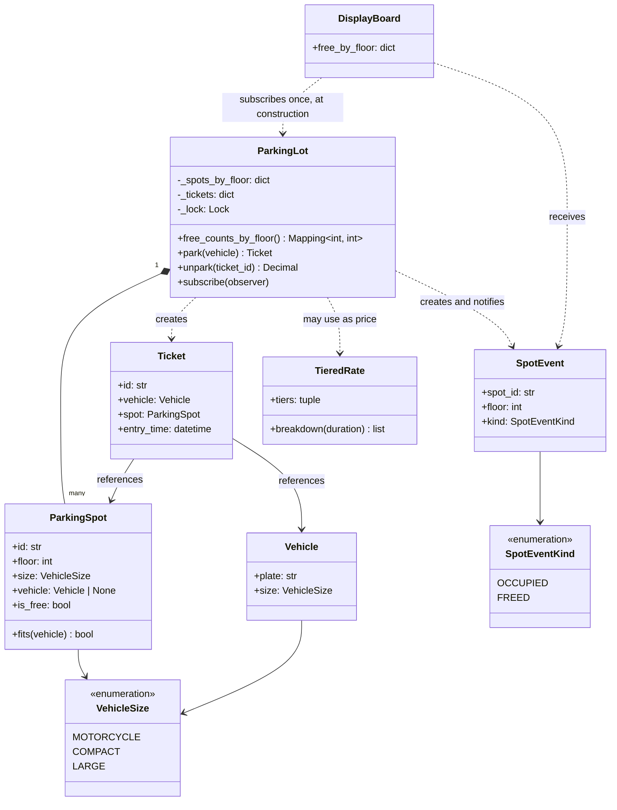

# 设计题解：停车场（Parking Lot）

## 题目与澄清

面试官通常这样开场："设计一个停车场系统。车有好几种，车位也有好几种，支持车辆入场、出场，
出场时按停留时长收费。"这句话背后藏着一串没说的假设，值得当场问出来，而不是默默替面试官
决定：

- **车型和车位有几种、怎么匹配？** 如果只回答"摩托车、小车、大车"，隐含的规则是"大车位能停
  小车，小车位停不下大车"——这条"能不能装得下"的偏序关系，决定了后面用什么数据结构表达
  尺寸（本文用可比较的等级，而不是一串 `isinstance` 判断）。
- **车位怎么分配？** "最近的空位"是默认假设，但如果停车场有好几层、入口在一楼，"最近"对二楼
  的车位没有意义——面试官通常会在后面追问"如果想把车流量均摊到各层呢"，这就是要求分配规则
  可换。
- **怎么收费？** "按小时"是最简单的答案，但面试官几乎一定会追问"如果大车和小车价格不同呢"
  "如果想推出阶梯价呢"——计费从一开始就该设计成可替换的，而不是等追问来了再重构。
- **会不会并发？** "同一时刻只有一个入口"是不成立的假设——现实里的停车场至少有一进一出两个
  闸机，机考题目里"多个入口/出口并发操作"几乎是必考的第 3 关。

**范围之外**：不做实际的支付收单（只算应付金额，不对接支付网关）、不做车牌识别硬件、不做
真实的持久化（本文在内存里建模，[[structure.storage|内存持久化（In-Memory Persistence）]]
讨论了换成数据库时哪些边界不变）。

## 需求与分级

一场机考通常不会一次性把需求说完，而是分阶段加码，每一阶段都在考察"上一阶段的设计有没有
被将死"：

- **第 1 关（核心流程）**：单层停车场，车辆入场按尺寸找一个能装下它的空位、发一张 Ticket；
  出场凭 Ticket 释放车位。车位满了、Ticket 无效或已经用过，都要有明确的失败路径而不是让
  调用方自己判断。对应 `ParkingSpot`、`Vehicle`、`Ticket`、`ParkingLot.park`/`unpark` 的
  基本骨架。
- **第 2 关（策略可换）**：车位分配规则和计费规则都要能换而不改 `ParkingLot`。分配从"离
  入口最近优先"扩展到"把车流分摊到各层"；计费从单一按小时扩展到按车型定价、阶梯定价。
  对应 `AllocationStrategy`、`PricingStrategy`、`TieredRate`。
- **第 3 关（并发）**：停车场有多个入口和出口，各自独立的线程/请求同时在跑，绝不能出现
  两辆车被分到同一个车位、也不能因为加锁太粗而让整个停车场排起长队。对应 `ParkingLot`
  内部的锁——"闸机"本身不需要一个专门的类，理由见"核心对象与职责"。
- **第 4 关（新需求，选做）**：加一种新车型/车位类型，以及一块按楼层显示空闲车位数的
  展示牌，两者都不应该要求改动第 1～3 关已经写好的类；展示牌也不应该拿到
  `ParkingLot` 的内部车位列表去自己数。对应 `VehicleSize` 的可扩展性、`SpotEvent`
  和 `DisplayBoard` 这个新增的观察者。

## 核心对象与职责

| 类 | 职责 | 它守住的不变式 |
|---|---|---|
| `VehicleSize` | 车辆和车位共用的尺寸标尺 | 数值越大占地越大，大能装小、小装不下大 |
| `Vehicle` | 一次入场的车辆身份 | 不可变：车牌和尺寸在停车期间不会变 |
| `ParkingSpot` | 一个车位，知道自己在哪层、能停多大、当前停了谁 | 自己就是"占用状态"的唯一真源，不需要另一份账本去对齐 |
| `Ticket` | 一次停车的凭证 | 不可变；`ParkingLot` 内部的字典决定它"是否还有效"，不是它自己 |
| `AllocationStrategy`（函数） | 给定车辆和按楼层分组的空闲车位，选一个 | 纯函数：不读、不改任何外部状态 |
| `PricingStrategy`（函数）/`TieredRate`（类） | 给定车型和时长，算钱 | 同样是纯计算；`TieredRate` 额外记得"这次钱是怎么分档算出来的" |
| `SpotEvent`/`SpotEventKind` | 描述"哪个车位、在哪一层、变成了占用还是空闲"这一件事本身 | 不可变；不引用 `ParkingSpot` 对象或任何内部结构，只是自我描述的一条记录 |
| `ParkingLot` | 持有全部车位，在锁的保护下把"选车位、发 Ticket"这一步做成原子操作 | 任意时刻，一个车位最多被一张有效 Ticket 引用；对外只暴露快照和事件，不暴露内部车位列表 |
| `DisplayBoard` | 订阅 `SpotEvent`，靠加减法维护按楼层的空闲数 | 构造后不持有 `ParkingLot` 的引用，也不重新扫描车位——只信任自己收到的事件 |

关系上，`ParkingLot` **组合**（composition）着它的全部 `ParkingSpot`——车位的生命周期完全
跟着停车场走，删掉停车场车位也不该单独存在。`Ticket` 与 `ParkingSpot`、`Vehicle` 是
**关联**（association）：一张 Ticket 引用某个车位和某辆车，但不拥有它们的生命周期，车位
在还车后还会被别的车再次使用。`DisplayBoard` 只在构造那一刻借用一次 `ParkingLot`（订阅
事件），之后不持有它的引用；这也是它能拿到的唯一一条"通路"——`ParkingLot` 没有任何公开
方法会把 `list[ParkingSpot]` 或内部字典交出去，外部能拿到的要么是 `free_counts_by_floor()`
给的一份不可变快照，要么是 `subscribe` 收到的 `SpotEvent`。

这份设计里没有 `EntryGate`/`ExitGate` 类。"闸机"在题面里是一个物理概念——多个入口、多个
出口同时在收车——但它不对应任何需要保存的状态或需要暴露的行为：一个只把调用原样转发给
`lot.park(vehicle)`/`lot.unpark(ticket_id)` 的类，除了多一层调用栈和多一份需要维护的代码，
不比直接调用 `ParkingLot` 的公开方法多提供任何东西。第 3 关"多个入口/出口并发"考察的是
`ParkingLot` 内部的锁能不能撑住并发调用，不是"闸机"本身要不要建模——测试里模拟多闸机，
就是开多个线程各自直接调用 `park`/`unpark`。如果后续需求要求闸机有自己的状态（比如记录
"这张 Ticket 是从哪个入口进来的"用于审计或者按闸机分别限流），那时候才值得让 `park`
接受一个 `gate_id` 参数、把它记到 `Ticket` 上——在没有这个需求之前先建两个只会转发的类，
是"为了有个类而建类"，本文选择不建。



## 关键设计决策

### 车位分配策略：普通函数，还是一个 `AllocationStrategy` 抽象基类？

**问题**：至少要支持"离入口最近优先"和"把车流分摊到各层"两种分配规则，而且第 4 关很可能
再加一种。三份自由来源的题解（见"来源与延伸"）无一例外都把它写成一个抽象类/接口，配
`NearestParkingStrategy`、`FarthestParkingStrategy` 之类的具体实现类。

**两个选项**：
1. **类形式**：定义 `class AllocationStrategy(ABC)`，`choose(vehicle, free_by_floor)` 是
   抽象方法，`NearestFirstAllocation`、`SpreadAcrossFloorsAllocation` 各是一个只有一个
   方法的类。
2. **函数形式**：`AllocationStrategy = Callable[[Vehicle, FreeByFloor], ParkingSpot | None]`，
   `nearest_first`、`spread_across_floors` 就是两个普通函数。

```python
# 选项 1：类形式——每加一种规则就要新建一个类，且这个类不持有任何字段
class AllocationStrategy(ABC):
    @abstractmethod
    def choose(self, vehicle, free_by_floor): ...

class NearestFirstAllocation(AllocationStrategy):
    def choose(self, vehicle, free_by_floor):
        ...

# 选项 2：函数形式——签名本身就是接口，调用方传函数就行
AllocationStrategy = Callable[[Vehicle, "FreeByFloor"], "ParkingSpot | None"]

def nearest_first(vehicle, free_by_floor):
    ...
```

**选择**：函数形式。两种分配规则调用之间都不需要记住任何东西——不缓存上一次分配到哪一层，
不需要在多次调用间保留计数器——纯粹是"给输入、算输出"。`typing.Protocol`/`abc.ABC` 该在
"真的有好几种实现、且实现之间共享状态或还需要额外方法"时才用；这里加一层抽象类，只是
把一次性计算包进一个从来不会被复用的壳，对代码只有坏处没有好处。这是
[[patterns.strategy|策略模式与可替换算法（Strategy）]]的 Python 写法：策略模式要的是
"算法可以被整体替换"，不是"必须用类表达算法"。

### 计费策略：什么时候值得写成类？

**问题**：按小时计费、一口价，都可以直接写成闭包函数；但阶梯计价（前几小时一个价、之后
换一个价）如果也用闭包，会遇到一个具体的麻烦——收银台想知道"这次的钱是怎么按档算出来的"
（用于小票和客诉核对），闭包只能返回一个最终数字，没有第二个入口能问它"细节"。

**两个选项**：
1. **全部用闭包**：`tiered_rate(tiers)` 返回一个 `price(size, duration) -> Decimal` 函数，
   和 `hourly_rate`/`flat_rate` 一样。
2. **阶梯计价单独写成类**：`TieredRate` 是一个 `frozen` dataclass，`__call__` 算总价，
   另外提供 `breakdown(duration)` 返回每一档算了多少小时、多少钱。

```python
# 选项 1：闭包只能对外暴露一个"算一次"的入口
def tiered_rate(tiers):
    def price(size, duration):
        ...
    return price

# 选项 2：类可以在"算总价"之外再挂一个查询方法
@dataclass(frozen=True, slots=True)
class TieredRate:
    tiers: tuple[tuple[int, Decimal], ...]
    def __call__(self, size, duration) -> Decimal: ...
    def breakdown(self, duration) -> list[tuple[int, int, Decimal]]: ...
```

**选择**：`TieredRate` 写成类，`hourly_rate`/`flat_rate` 仍然是闭包。判断标准不是"这个策略
是不是比较复杂"，而是[[patterns.strategy|策略模式与可替换算法（Strategy）]]里"策略要暴露
不止一个相关方法"这一条——`breakdown` 是和"算钱"强相关、但不是"算钱"本身的第二个动作，
闭包做不到，硬塞也只是把返回值改成一个元组、把"总价"和"明细"混在一次调用里返回，可读性
更差。按小时、一口价两种策略从头到尾只需要"给一个数字"这一件事，没有第二个动作，继续用
闭包。

### 停车场要不要做成 Singleton？

**问题**：现实里一栋楼确实只有一个停车场，"全局只应该有一个 `ParkingLot` 实例"这句话听起来
很有道理——来源里的 `awesome-low-level-design` 题解就是这么做的（`ParkingLot` 类内部用
`__new__` 拦截，保证多次实例化返回同一个对象）。

**两个选项**：
1. **Singleton**：`ParkingLot.__new__` 拦截实例化，`ParkingLot()` 永远返回同一个对象。
2. **普通对象，唯一性由调用方保证**：`ParkingLot` 就是一个正常可以 `__init__` 的类，谁需要
   "进程里只有一份"，在组合根（组装对象图的地方，比如 `main()`）里只 `ParkingLot(...)`
   一次，然后把这一个实例传给所有需要调用它的调用方（并发的入口/出口线程、`DisplayBoard`）。

**选择**：不做 Singleton。理由和这道题本身的测试需求直接冲突——测试要能同时造两座互不
干扰的停车场（比如一个测并发、一个测计费，互相不该看到对方的车位表），`__new__` 拦截会
让第二次构造要么报错、要么悄悄返回第一次的对象，这两种行为都会让测试之间共享状态、互相
污染。更根本的问题是 Singleton 把"这是唯一实例"这件事**藏进了构造过程**里：调用方写下
`ParkingLot(spots, allocate=..., ...)` 时，从这行代码的签名完全看不出"哦这个类全局唯一"，
等到真的需要两个停车场（比如同一个系统后来要支持多个院区）才会踩到这颗埋好的雷。
Python 模块本身在一个进程里只会被 `import` 求值一次，如果真的只需要"进程唯一的一份"，
在应用启动时创建一次、放进一个模块级变量或者传给依赖注入容器，比在类内部锁死构造过程更
诚实——这也是这道题**拒绝使用**的一个模式。

### 车位的占用状态放在哪：`ParkingSpot` 自己持有，还是 `ParkingLot` 另开一本账？

**问题**：`ParkingLot` 需要随时知道"哪些车位是空的"。一种直觉是维护一个独立的
`occupied: set[str]` 集合，和车位列表分开存放。

**两个选项**：
1. **`ParkingLot` 另开一本账**：`self._occupied_spot_ids: set[str]`，每次 `park`/`unpark`
   都要同步更新这个集合和 `ParkingSpot` 对象本身两份状态。
2. **状态只存在车位对象自己身上**：`ParkingSpot.vehicle`，`is_free` 是它的一个 `@property`；
   `ParkingLot` 需要空闲表时，现场遍历一次车位算出来。

**选择**：状态只放在 `ParkingSpot` 自己身上。第一种写法看着像是"给频繁查询加了缓存"，
实际是引入了两份必须手动保持一致的状态——`unpark` 里少更新一处，`occupied` 集合和车位的
真实占用就会对不上，而且这种 bug 只有在并发路径下才会被测出来，代价很高。车位数量通常
是几百到几千的量级，`park`/`unpark` 时现场过滤一次空闲车位（`O(车位数)`）完全够用，也是
[[structure.storage|内存持久化（In-Memory Persistence）]]里"单一数据源（single source of
truth）优先于缓存"的具体例子——真的出现性能问题、车位数上了十万，再按楼层建索引，也不需要
碰这条不变式本身。

### 展示牌怎么维护自己的计数：重新扫描车位，还是订阅一次性事件？

**问题**：`DisplayBoard` 需要在车位变化时更新"每层还剩几个空位"。最直接的做法是给它一个
`ParkingLot` 的引用，车位变化时告诉它"变了"，`DisplayBoard` 自己重新数一遍。这个做法有
两个问题：第一，`DisplayBoard` 要重新数，`ParkingLot` 就得把内部的车位列表（或者一个能
按楼层查到车位对象的字典）交给它——一旦为了满足这种"重新扫描"的需求，暴露一个
`spots_by_floor` 属性直接返回内部字典，任何拿到 `ParkingLot` 引用的调用方就都能在锁保护
之外增删或重排这份列表，是[[structure.api|进程内 API 设计]]里"把内部结构当作返回值交出去"
的典型反例。第二，`ParkingLot.park`/`unpark` 是在释放锁**之后**才调用 `_notify`（见上一条
决策的理由：不能让订阅者拖慢持锁的调用方），`DisplayBoard` 收到通知、回头重新查询车位数据
时，那一层的车位可能已经被另一个还没来得及发通知的并发调用再次改动过，读到的是一个和
"引发这次通知的那个变化"对不上的瞬时状态。

**两个选项**：
1. **重新扫描**：`DisplayBoard` 持有 `ParkingLot` 引用，收到"车位变了"的通知后，回头查
   `ParkingLot` 暴露的车位数据，重新数一遍空闲车位。
2. **事件自带信息**：`ParkingLot` 通知时不说"变了"，而是给一个自描述、不可变的
   `SpotEvent(spot_id, floor, kind)`，`DisplayBoard` 收到后只根据 `kind` 是
   `OCCUPIED` 还是 `FREED`，对相应楼层的计数做一次加一或减一。

**选择**：事件自带信息。`ParkingLot` 从此不需要为了满足订阅者的"重新扫描"而暴露任何内部
结构——唯一公开的读接口是 `free_counts_by_floor()`，返回一份用 `MappingProxyType`包的
不可变快照，写不进去，也拿不到背后的车位对象；`DisplayBoard` 只在构造那一刻调用它一次做
初始化（用 `dataclasses.InitVar` 声明 `lot` 参数，构造之后不再保留这个引用），之后完全靠
事件的加减法维护自己的计数，不再需要、也没有能力回头查询 `ParkingLot`。

这也回答了"通知在锁外面发，顺序会不会乱"的问题：两个并发的 `park`/`unpark` 各自释放锁之后
才调用 `_notify`，它们的事件抵达 `DisplayBoard` 的先后顺序**可能和它们实际拿到锁、修改
车位状态的顺序不一致**。但这不影响最终结果的正确性——每一次 `park`/`unpark` 只贡献一个
`+1` 或 `-1`，加法满足交换律，不管这些 `±1` 以什么顺序被应用，只要**每一个真实发生过的
状态变化都恰好被计入一次**，静止状态（quiescence，也就是所有已发起的 `park`/`unpark`
都执行完、事件也都投递完）下的计数就必然和真实车位状态一致。这和"车位状态只有一份真源"
（上一条决策）是同一个道理在异步通知场景下的延伸：真源永远是车位对象自己，`DisplayBoard`
的计数只是这份真源的一个最终一致（eventually consistent）的镜像，短暂的顺序错乱不会让
它长期偏离真相。

## 代码走读

完整的参考实现如下（`vault/domains/low-level-design/problems/parking-lot/solution.py`，
和被测代码逐字同步）：

%% code:begin solution.py %%
```python
"""停车场（Parking Lot）——多楼层、多车型车位分配与释放的参考实现。

核心思路：车辆和车位共用同一把可比较的"尺寸"标尺（`IntEnum`），谁能停谁只看数值大小，
不用一串 `if vehicle_type == ...` 的判断。车位分配和计费都是"会变的算法"，分配策略没有
状态、每次调用只需要当前的空闲表，因此就是普通函数（`AllocationStrategy`）；计费策略里
按时长收费的两种也是闭包函数，唯独阶梯计价要在"算一次"之外再暴露"这次落在哪一档"，才
值得写成一个类（`TieredRate`）。`ParkingLot` 本身不做分配和计费的决定，只负责在一把锁下
原子地"选一个空闲车位、开一张真实存在的 Ticket"——这一步就是多个入口并发时唯一需要互斥
的地方。`ParkingLot` 从不把内部的车位列表交给外面：外部只能拿到一份空闲数快照，或者收到
"哪个车位变空/变占用了"这一件事本身，`DisplayBoard` 就是靠订阅后者维护自己的计数，不用
持有停车场的引用、也不用回头重新扫描车位。
"""

from __future__ import annotations

import itertools
import threading
from collections.abc import Callable, Iterable, Mapping
from dataclasses import InitVar, dataclass, field
from datetime import datetime, timedelta
from decimal import Decimal
from enum import Enum, IntEnum
from types import MappingProxyType


# --------------------------------------------------------------------------
# 尺寸：车辆和车位共用同一把尺子，用整数等级比较"装得下"。


class VehicleSize(IntEnum):
    """车辆／车位的尺寸等级，数值越大占地越大：一个大车位可以停小车，反过来不行。

    新增一种车型（比如 XL_TRUCK）只需要在这里加一个成员——分配和计费用到的都是
    数值比较，不需要改 `ParkingSpot.fits`、任何一个分配策略或任何一个计价策略。
    """

    MOTORCYCLE = 1
    COMPACT = 2
    LARGE = 3


SpotSize = VehicleSize  # 车位用同一把尺子标注它能停的最大车型


class ParkingLotError(Exception):
    """本设计里所有失败路径的公共基类，方便调用方一次性捕获。"""


class NoAvailableSpotError(ParkingLotError):
    """给定尺寸的车辆当前没有能停的空位。"""


class InvalidTicketError(ParkingLotError):
    """取车时给出的 Ticket 不存在，或已经被用掉过一次。"""


@dataclass(frozen=True, slots=True)
class Vehicle:
    """一次入场的车辆：车牌是它的身份，尺寸决定能停进哪些车位。"""

    plate: str
    size: VehicleSize


@dataclass(slots=True)
class ParkingSpot:
    """一个车位：知道自己在哪一层、能停多大的车、当前停了谁。

    这是本设计里唯一持有"占用状态"的地方——`ParkingLot` 不额外维护一份"谁占了哪个位"
    的账本，靠遍历车位本身的 `vehicle` 字段就知道空闲表，天然不会和车位状态本身对不上。
    """

    id: str
    floor: int
    size: SpotSize
    vehicle: Vehicle | None = None

    @property
    def is_free(self) -> bool:
        return self.vehicle is None

    def fits(self, vehicle: Vehicle) -> bool:
        """车位能停下这辆车，当且仅当车位尺寸不小于车辆尺寸。"""
        return vehicle.size <= self.size


@dataclass(frozen=True, slots=True)
class Ticket:
    """一张停车凭证：入场时生成一次，出场时凭它结算并作废，不可重复使用。"""

    id: str
    vehicle: Vehicle
    spot: ParkingSpot
    entry_time: datetime


Clock = Callable[[], datetime]
FreeByFloor = dict[int, list[ParkingSpot]]


# --------------------------------------------------------------------------
# 车位分配策略：给定车辆和按楼层分组的空闲车位，选哪一个。
#
# 两种分配规则都是"输入什么就纯计算一次输出"，调用之间不需要记住任何东西，
# 因此没有写成一个 `AllocationStrategy` 抽象基类再各配一个实现类——那只是给一次性的
# 计算多包一层从不会被复用的壳。函数签名本身就是接口。


AllocationStrategy = Callable[[Vehicle, FreeByFloor], "ParkingSpot | None"]


def nearest_first(vehicle: Vehicle, free_by_floor: FreeByFloor) -> ParkingSpot | None:
    """离入口最近优先：楼层号从小到大找，同一层里按车位 id 的先后顺序找。"""
    for floor in sorted(free_by_floor):
        for spot in free_by_floor[floor]:
            if spot.fits(vehicle):
                return spot
    return None


def spread_across_floors(vehicle: Vehicle, free_by_floor: FreeByFloor) -> ParkingSpot | None:
    """把车分摊到空闲车位最多的楼层，避免某一层被挤爆、别的楼层却空着没人上去找。"""
    candidates = [(floor, spots) for floor, spots in free_by_floor.items()
                  if any(spot.fits(vehicle) for spot in spots)]
    if not candidates:
        return None
    _, spots = max(candidates, key=lambda item: len(item[1]))
    return next(spot for spot in spots if spot.fits(vehicle))


# --------------------------------------------------------------------------
# 计费策略：按车辆尺寸和停留时长算钱。金额用 Decimal，避免浮点误差。


PricingStrategy = Callable[[VehicleSize, timedelta], Decimal]


def _ceil_hours(duration: timedelta) -> int:
    """不足一小时按一小时收——向上取整，且至少收一小时。"""
    seconds = max(int(duration.total_seconds()), 0)
    return max(-(-seconds // 3600), 1)


def hourly_rate(rates: dict[VehicleSize, Decimal]) -> PricingStrategy:
    """按车型给一张每小时单价表，最常见的计费方式。"""

    def price(size: VehicleSize, duration: timedelta) -> Decimal:
        return rates[size] * _ceil_hours(duration)

    return price


def flat_rate(fee: Decimal) -> PricingStrategy:
    """不论停多久、什么车型，进来就是这个价——商场、景区常见的一口价。"""

    def price(size: VehicleSize, duration: timedelta) -> Decimal:
        return fee

    return price


@dataclass(frozen=True, slots=True)
class TieredRate:
    """阶梯计价：前几个小时一个单价，超过之后换更高（或更低）的单价。

    这里没有用闭包，是因为阶梯计价除了"算一次"，收银台还想知道"这次落在哪一档、
    每一档各算了多少钱"（用于小票、客诉核对）——多暴露一个 `breakdown` 方法，闭包
    做不到，普通函数也做不到，这才值得把 `tiers` 包成一个类。
    """

    tiers: tuple[tuple[int, Decimal], ...]  # (这一档封顶到第几小时, 该档每小时单价)，按小时升序

    def __call__(self, size: VehicleSize, duration: timedelta) -> Decimal:
        return sum((billed * rate for _, billed, rate in self.breakdown(duration)), Decimal("0"))

    def breakdown(self, duration: timedelta) -> list[tuple[int, int, Decimal]]:
        """返回每一档 (封顶小时数, 这次在该档计费的小时数, 单价) 的明细，最后一档之后按最后一档单价续费。"""
        hours = _ceil_hours(duration)
        out: list[tuple[int, int, Decimal]] = []
        prev = 0
        for upto, rate in self.tiers:
            billed = min(hours, upto) - prev
            if billed > 0:
                out.append((upto, billed, rate))
            prev = upto
            if hours <= upto:
                return out
        last_rate = self.tiers[-1][1]
        out.append((hours, hours - prev, last_rate))
        return out


# --------------------------------------------------------------------------
# 车位事件：车位状态变化时，`ParkingLot` 通知订阅者的不是"车位对象"或"内部字典"，
# 而是一份不可变的、自己说清楚发生了什么的小记录——订阅者不需要、也不能反过来
# 触达停车场的存储结构。


class SpotEventKind(Enum):
    OCCUPIED = "occupied"
    FREED = "freed"


@dataclass(frozen=True, slots=True)
class SpotEvent:
    """一次车位状态变化：哪个车位、在哪一层、变成了占用还是空闲。"""

    spot_id: str
    floor: int
    kind: SpotEventKind


SpotObserver = Callable[[SpotEvent], None]


@dataclass
class DisplayBoard:
    """按楼层展示当前空闲车位数，供入口处的电子屏读取。

    构造时向 `ParkingLot` 要一份"当前空闲数"的快照来初始化，之后只靠订阅的事件
    做加减法维护自己的计数——不保留对 `ParkingLot` 的引用，收到通知后也不会回头
    重新扫描车位；`lot` 只在构造这一刻用一次，因此写成 `InitVar` 而不是字段。
    """

    lot: InitVar["ParkingLot"]
    free_by_floor: dict[int, int] = field(default_factory=dict, init=False)

    def __post_init__(self, lot: "ParkingLot") -> None:
        self.free_by_floor.update(lot.free_counts_by_floor())
        lot.subscribe(self._on_event)

    def _on_event(self, event: SpotEvent) -> None:
        delta = -1 if event.kind is SpotEventKind.OCCUPIED else 1
        self.free_by_floor[event.floor] = self.free_by_floor.get(event.floor, 0) + delta


# --------------------------------------------------------------------------
# ParkingLot：整座停车场。不做成 Singleton——它就是一个普通对象，测试要能造互不
# 干扰的多个实例，多租户场景也可能真的要管理好几座车库。真需要"进程里只有一份"
# 时，由调用方在组合根（composition root）里只 new 一次、往下传，而不是把构造过程
# 锁死在类里：Singleton 把"这是唯一实例"这件事藏进 `__new__`，调用方从签名上完全
# 看不出来，测试之间还会共享一份没法换、没法重置的隐藏状态。


class ParkingLot:
    """一整座停车场：持有全部车位，按策略分配和计费，发牌、结算。

    并发由一把锁保护"挑一个空位并标记占用"这一步的原子性——这一步是"读空闲表、选
    一个、写回占用状态"好几条 Python 字节码，GIL 只保证单条字节码不被切走，不保证
    这一串操作不被打断，中间随时可能切到另一个线程；没有这把锁，两个并发的调用方
    可能同时把同一个空位判断为空闲，都把车停进去。对外只暴露 `free_counts_by_floor`
    这一份只读快照和基于事件的 `subscribe`，从不把内部的车位列表或字典交出去——拿到
    快照或事件的调用方，改不了停车场的真实状态。
    """

    def __init__(self, spots: Iterable[ParkingSpot], allocate: AllocationStrategy,
                 price: PricingStrategy, clock: Clock) -> None:
        self._spots_by_floor: FreeByFloor = {}
        for spot in spots:
            self._spots_by_floor.setdefault(spot.floor, []).append(spot)
        self._allocate = allocate
        self._price = price
        self._clock = clock
        self._lock = threading.Lock()
        self._tickets: dict[str, Ticket] = {}
        self._observers: list[SpotObserver] = []
        self._ticket_ids = (f"T{n}" for n in itertools.count(1))

    def free_counts_by_floor(self) -> Mapping[int, int]:
        """按楼层给出当前空闲车位数的一份只读快照；不暴露车位列表本身。"""
        with self._lock:
            counts = {floor: sum(1 for spot in spots if spot.is_free)
                      for floor, spots in self._spots_by_floor.items()}
        return MappingProxyType(counts)

    def subscribe(self, observer: SpotObserver) -> None:
        """挂一个"车位状态变化"的订阅者；`DisplayBoard` 就是这么接进来的。"""
        self._observers.append(observer)

    def _notify(self, event: SpotEvent) -> None:
        for observer in self._observers:
            observer(event)

    def park(self, vehicle: Vehicle) -> Ticket:
        """给车辆分配一个车位并开一张 Ticket；没有空位时抛 `NoAvailableSpotError`。"""
        with self._lock:
            free_by_floor = {floor: [spot for spot in spots if spot.is_free]
                              for floor, spots in self._spots_by_floor.items()}
            spot = self._allocate(vehicle, free_by_floor)
            if spot is None:
                raise NoAvailableSpotError(f"no free spot fits {vehicle.size.name}")
            spot.vehicle = vehicle
            ticket = Ticket(id=next(self._ticket_ids), vehicle=vehicle, spot=spot,
                             entry_time=self._clock())
            self._tickets[ticket.id] = ticket
        self._notify(SpotEvent(spot_id=spot.id, floor=spot.floor, kind=SpotEventKind.OCCUPIED))
        return ticket

    def unpark(self, ticket_id: str) -> Decimal:
        """凭 Ticket 取车，释放车位并返回应付金额；无效或用过的 Ticket 抛 `InvalidTicketError`。"""
        with self._lock:
            ticket = self._tickets.pop(ticket_id, None)
            if ticket is None:
                raise InvalidTicketError(f"unknown or already-used ticket {ticket_id!r}")
            ticket.spot.vehicle = None
            duration = self._clock() - ticket.entry_time
            fee = self._price(ticket.vehicle.size, duration)
        self._notify(SpotEvent(spot_id=ticket.spot.id, floor=ticket.spot.floor, kind=SpotEventKind.FREED))
        return fee


if __name__ == "__main__":
    from datetime import UTC

    now = datetime(2026, 1, 1, 9, 0, tzinfo=UTC)
    spots = [ParkingSpot(id=f"1-{i}", floor=1, size=VehicleSize.COMPACT) for i in range(3)]
    lot = ParkingLot(spots, allocate=nearest_first,
                      price=hourly_rate({VehicleSize.MOTORCYCLE: Decimal("2"),
                                          VehicleSize.COMPACT: Decimal("5"),
                                          VehicleSize.LARGE: Decimal("8")}),
                      clock=lambda: now)
    board = DisplayBoard(lot)
    # 没有 EntryGate/ExitGate 类：一个"闸机"在这里就是调用 park/unpark 的调用方本身，
    # 见题解「核心对象与职责」——多个闸机并发，就是多个线程各自直接调用这两个方法。
    ticket = lot.park(Vehicle(plate="京A12345", size=VehicleSize.COMPACT))
    print(f"parked at {ticket.spot.id}, free on floor 1: {board.free_by_floor[1]}")
    now = now + timedelta(hours=3)
    print(f"fee: {lot.unpark(ticket.id)}")
```
%% code:end %%

几处设计决策在代码里对应的位置：

- **尺寸用等级比较**：`VehicleSize` 是 `IntEnum`，`ParkingSpot.fits` 只有一行
  `vehicle.size <= self.size`。测试 `test_a_new_vehicle_size_works_with_the_existing_
  allocation_and_pricing_code` 直接传一个比 `LARGE` 还大的裸 `int` 当尺寸，`fits`、
  `nearest_first`、`flat_rate` 全部原样能用——这就是"关键设计决策"第一条里说的"函数形式的
  策略不关心尺寸具体是什么类型，只关心它能不能比较"。
- **`park`/`unpark` 是唯一加锁的地方**：`with self._lock:` 包住的只有"读空闲表、选车位、
  写占用、发 Ticket"这几行——`_notify` 特意放在锁外面调用，观察者（`DisplayBoard`）的回调
  不会持有停车场的锁去执行，避免一个跑得慢的订阅者拖慢所有并发调用方。
- **`ParkingLot` 没有任何方法返回内部的车位列表或字典**：唯一的读接口是
  `free_counts_by_floor()`，用 `MappingProxyType` 包了一层，调用方连"改一个数字"都做不到，
  更不用说增删车位。
- **`DisplayBoard.__post_init__` 只调用了一次 `free_counts_by_floor()` 和一次
  `lot.subscribe`**：`lot` 参数写成 `InitVar`，构造完成后 `DisplayBoard` 实例上根本没有
  这个字段——`ParkingLot` 的代码在 `DisplayBoard` 存在之前就已经写完，展示牌是纯新增的
  一个类，没有改 `ParkingLot` 一行；它也没有留一条能回头查询 `ParkingLot` 的路。
- **`_on_event` 只做加一减一，不重新扫描**：`SpotEvent` 自己说清楚了"哪一层、变成了什么
  状态"，`DisplayBoard` 不需要、也没有能力反过来问 `ParkingLot` "这个车位现在到底是什么
  状态"——这是"关键设计决策"第五条的落地。
- **`TieredRate.breakdown` 和 `__call__` 共享同一段分档逻辑**：`__call__` 直接对
  `breakdown` 的结果求和，避免"算总价"和"算明细"两处分别实现同一套分档规则、后期改一处
  忘了改另一处。
- **没有 `EntryGate`/`ExitGate` 类**：`__main__` 里的演示直接调用 `lot.park(...)` 和
  `lot.unpark(...)`，多闸机并发在测试里就是多个线程各自调用这两个方法——见"核心对象与
  职责"最后一段的论证。

## 测试与自检

`test_parking_lot.py` 的 19 个用例按第 1～4 关分组，钉住这几类不变式：

- **状态转移**：车位分配后 `is_free` 变 `False`，取车后变回 `True`；Ticket 用过一次之后
  第二次 `unpark` 必须失败（`test_unpark_twice_with_the_same_ticket_fails_the_second_time`），
  不能被同一张票取两次车。
- **策略确实换了行为**：同一组车位，换一个分配策略/计费策略，断言结果的楼层或金额跟着变
  （而不是只断言"调用没报错"）。
- **并发下的真实不变式，不是靠时序猜**：`test_concurrent_callers_never_double_assign_
  a_spot` 用 `threading.Barrier` 让 8 个线程同时抢 5 个车位，断言"成功的车恰好 5 辆、
  它们拿到的车位 id 互不相同"——不依赖 `sleep` 或执行顺序，车位数和线程数的差值就是在
  逼真实的锁去做决定；测试里没有 `EntryGate` 对象，8 个线程直接各自调用
  `lot.park(...)`，这就是多个闸机并发的样子。
- **展示牌在并发风暴之后仍然和真相一致**：`test_display_board_matches_a_full_recount_
  after_a_park_and_unpark_storm` 先用 8 个线程 + `Barrier` 把车位并发停满，再用 4 个线程
  + 另一个 `Barrier` 并发取走一半，`join()` 等所有线程真正跑完（也就是"关键设计决策"
  第五条说的静止状态）之后，断言 `DisplayBoard.free_by_floor` 和直接遍历车位现算出来的
  结果逐楼层相等——不关心中途通知抵达的顺序，只关心风暴停下之后计数是否准确。
- **公开接口改不了停车场的真实状态**：`test_callers_cannot_mutate_the_lot_through_its_
  public_api` 断言 `free_counts_by_floor()` 返回的快照赋值会抛 `TypeError`，而且
  `ParkingLot` 上已经没有任何能拿到内部车位列表的属性（`hasattr(lot, "spots_by_floor")`
  为假）。
- **扩展不改旧代码**：`test_display_board_updates_...` 和
  `test_a_new_vehicle_size_works_with_...` 直接对应第 4 关，验证的是"新加的代码工作"，
  而不是"没有破坏旧代码"（旧测试本身已经覆盖了后者）。

给面试官演示（两分钟）：跑 `python solution.py`，说明这是单一入口/单一出口的最小流程；
再跑 `IMPL=solution uv run --with pytest python -m pytest vault/domains/low-level-design/
problems/parking-lot -q`，指着并发那两个测试说"这两个是几个线程一起抢车位/一起还车"，
比现场手写一段 `sleep` 验证并发更有说服力。

## 扩展与追问

**新需求**
- **多种支付方式/会员折扣**：折扣就是给 `PricingStrategy` 再包一层——
  `member_discount(base: PricingStrategy, rate: Decimal) -> PricingStrategy`，返回一个新
  的可调用对象，`ParkingLot` 不用知道"折扣"这个概念存在。
- **预约车位**：需要给 `ParkingSpot` 加一个"预留但未占用"的第三态，`is_free` 从布尔变成
  一个小枚举；`AllocationStrategy` 的函数签名不用变，只是它看到的 `free_by_floor` 要把
  预留中的车位过滤掉。
- **VIP/无障碍车位**：加一个 `reserved_for: VehicleCategory | None` 字段到
  `ParkingSpot`，分配函数里多一个过滤条件——不涉及新增类。

**并发与线程安全**
- 当前用一把覆盖整座停车场的锁：简单、正确，但所有入口/出口互相排队。如果并发量真的
  高到这把锁成为瓶颈，下一步是把锁下放到"每一层一把锁"——`park` 只需要锁住它最终选中的
  那一层，`AllocationStrategy` 不变，`ParkingLot` 内部把 `dict[int, Lock]` 换掉
  `self._lock` 即可。
- Python 的 GIL 保证单条字节码指令不被线程切换打断，但"读空闲表→选车位→写占用"是好几条
  指令，GIL 完全不能替这里省掉锁——这也是为什么测试里必须用真线程 + `Barrier` 去验证，
  而不是相信"反正有 GIL 应该没事"。

**持久化与规模**
- 换成数据库：`ParkingSpot.vehicle` 这个字段对应一行"车位表"里的一个外键，`park`/`unpark`
  的锁需要换成数据库的行级锁或者 `SELECT ... FOR UPDATE`，但"车位状态只有一份真源"这条
  不变式原样保留（见"关键设计决策"第四条）。
- 车位数到几十万、`park` 里现场过滤空闲车位的 `O(车位数)` 扫描开始变慢：给每层维护一份
  `set[ParkingSpot]` 的空闲索引，`AllocationStrategy` 的函数签名不变，只是 `ParkingLot`
  传进去的 `free_by_floor` 从"现算"变成"读现成的索引"。

## 常见错误

- **把 Singleton 当成"业务上只有一个"的必然推论**：业务事实（一栋楼一个停车场）和代码
  结构（这个类要不要拦截构造）是两回事，见"关键设计决策"第三条。
- **用 `isinstance`/继承树区分车型**：`class Car(Vehicle)`、`class Motorcycle(Vehicle)`
  是 Java 题解里的常见写法，Python 里"能不能停进某个车位"只是一个数值比较，不需要为每种
  车型建一个子类——尤其当子类之间除了"尺寸不同"没有任何行为差异时，继承树只是徒增一层
  查找成本。
- **给只有一次性计算的策略也套一层抽象基类**：见"关键设计决策"第一条，这是最容易被
  Java 背景带偏的地方——"策略模式"在脑子里约等于"一个接口加几个实现类"，但 Python 的
  一等函数已经是接口了。
- **在持锁的代码块里调用观察者/外部回调**：`_notify` 如果写在 `with self._lock:` 内部，
  一个订阅者哪怕只是做一次日志 IO，也会让所有其他线程的 `park`/`unpark` 跟着等它。
- **给内部存储结构配一个"只读"属性，就当作已经安全了**：一个 `@property` 返回内部的
  `dict`/`list` 本身，Python 里不会因为你叫它"只读"就真的只读——调用方拿到的还是那个
  对象的引用，`.append`/`.pop`/直接赋值统统能绕开锁去改。真正的只读要么是不可变类型
  （`MappingProxyType`、`tuple`），要么根本不返回内部结构、只返回从它算出来的一份新值。
- **计费函数忘记向上取整、或者忘记设一个最低收费时长**：`0` 小时、`59` 分钟按 `0` 小时
  收费在现实里几乎肯定是错的，机考的隐藏测试通常会专门测这个边界。

## 45 分钟怎么分配

- **0–5 分钟，澄清**：问清楚车型/车位有几种、怎么匹配，分配和计费要不要可换，要不要多层，
  要不要考虑并发——说出"我先假设 XX，如果不对请打断我"，把假设显式化。
- **5–12 分钟，实体和关系**：口头/白板画出 `Vehicle`、`ParkingSpot`、`Ticket`、
  `ParkingLot` 的关系，说清楚"车位状态放在哪、谁拥有谁的生命周期"，这是后面代码不返工
  的关键。
- **12–18 分钟，定 API**：把 `park(vehicle) -> Ticket`、`unpark(ticket_id) -> Decimal`
  的签名和会抛的异常先定下来，说清楚"分配策略和计费策略是参数，不是写死在类里"。
- **18–33 分钟，写核心流程代码**：先写单层、单一策略、无并发的版本，能跑通"入场-出场"
  这条主线再说。
- **33–40 分钟，扩展**：按面试官的追问顺序加分配策略可换/并发/新车型，每加一处，明确
  说出"这一步改了哪个类、没改哪几个类"。
- **40–45 分钟，测试和收尾**：至少现场跑一两个断言（满了报错、Ticket 用过报错），
  时间不够时优先保证"核心流程 + 一个失败路径"能跑，把并发测试留到口头描述思路。
- **时间不够时先砍什么**：先砍阶梯计价（保留按小时/一口价两种就够展示"策略可换"），
  展示牌（`DisplayBoard`）留到最后，它不影响任何评分点的核心结论。

## 来源与延伸

- [ashishps1/awesome-low-level-design](https://github.com/ashishps1/awesome-low-level-design/blob/main/problems/parking-lot.md)——
  六种语言的并排题解，核心类是 Singleton 的 `ParkingLot` 加 `Vehicle` 继承树。本文不同意
  这两个选择，理由见"关键设计决策"第三条和"常见错误"第二条。
- [abhaypaswan/lld-python](https://github.com/abhaypaswan/lld-python/tree/main/problems/parking-lot)——
  三份来源里唯一原生 Python、带 pytest 的实现，`frozen` dataclass、`Enum`、依赖注入时钟
  和本文同路；它把分配和计费都写成了各自独立的策略类，本文只在"确实需要额外方法或状态"
  时才用类（见"关键设计决策"第一、二条），其余用普通函数。
- [Hello Interview — Parking Lot](https://www.hellointerview.com/learn/low-level-design/problem-breakdowns/parking-lot)——
  把机考的推进节奏（澄清→实体→API→实现→扩展）讲得很清楚，本文的"45 分钟怎么分配"参考了
  这个框架；它建议的"全场统一按小时收费"比本文实现的策略更简单，本文认为"计费策略可换"
  是这道题被专门考察的点，不适合简化掉。
