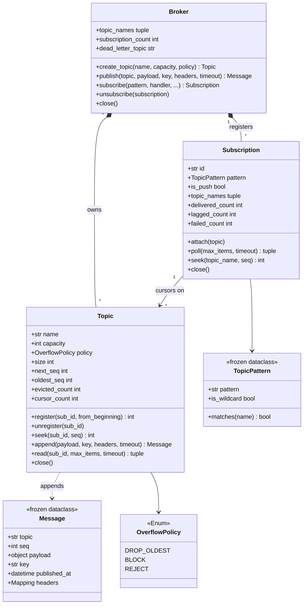

# 设计题解：发布订阅与事件总线（Pub-Sub）

## 题目与澄清

面试官通常这样开场："设计一个发布订阅系统。发布者把消息投到某个主题（topic），订阅者订阅自己
关心的主题，消息要送到每一个订阅者手里。支持多发布者、多订阅者，线程安全。"

这是一道看起来十分钟能写完、实际能把人问穿的题。写出"一个 `dict[str, list[callback]]`，发布的
时候 for 一遍"只需要八行，面试官接着会问一句："如果其中一个订阅者处理得特别慢呢？"——**这才是
这道题真正在问的东西**。整道题的分数几乎全在这一句上：慢订阅者会不会拖住发布者、会不会拖住别的
订阅者、它掉的队算谁的、以及你怎么让"掉了多少"变成一个可以打印出来的数字。

先把范围钉死：**这是一个进程内（in-process）的消息总线，不是分布式消息系统**。没有网络、没有
副本、没有磁盘持久化，进程一死消息就没了。Kafka 在本文里只作为对照出现一次——它和这个设计共享
"保留日志 + 消费者位点"这一个模型，其余（分区、副本、消费者组再平衡、ISR）全部不在范围内。
把这句话在开头讲出来，可以省掉后面二十分钟的误会。

动笔之前值得问清楚的几件事，每一件都会改变设计：

- **订阅者是被回调，还是自己来取？** 这是本题最大的分叉。"被回调"（push）意味着总线要替订阅者
  管线程；"自己来取"（pull）意味着总线只要管一条日志和一堆位点。选哪个决定了后面所有类的形状，
  详见"关键设计决策"第一条。
- **新订阅者能不能看到它订阅之前的消息？** 如果答案是"能"，那么消息在被所有人消费之后**仍然
  要留着**，总线的存储就不是队列而是日志。如果答案是"不能"，一条队列就够了。真实的答案通常是
  "能看到最近的一段"，于是就有了保留窗口（retention window）和它的大小。
- **一个订阅者处理失败了怎么办？** 重试几次？重试之间要不要退避？仍然失败的消息扔掉还是留证据？
  这一问直接引出死信（dead letter）。
- **顺序保证到什么粒度？** 正确的答案是"同一主题的消息，对同一个订阅者按发布顺序投递"。跨主题
  不保证、跨订阅者不保证。含糊地说"保证顺序"是扣分项，因为它在多发布者下根本做不到全局顺序。
- **容量有上限吗？满了之后丢谁？** 任何一个进程内组件，"内存会不会无界增长"都必须有明确答案。

**范围之外**：跨进程/跨机器投递、持久化与崩溃恢复、消费者组与分区、事务性发布、恰好一次
（exactly-once）语义、消息的 schema 与序列化。这些都可以在"扩展与追问"里用一句话交代落点。

## 需求与分级

机器编码轮不会一次把需求摊开，它一关一关加，考的是"新需求来了旧代码动不动"。

**第 1 关（约 15 分钟，核心流程）**：主题、发布者、订阅者。`publish(topic, payload)` 把消息交给
总线，`subscribe(topic, handler)` 登记一个订阅者，消息要送到该主题**所有**订阅者手上。订阅的
生命周期必须完整：订阅、退订，退订之后不再收到消息。还有一条常被跳过的要求：**某个订阅者的
处理函数抛异常，不许影响其他订阅者，也不许影响它自己后面的消息**。

**第 2 关（约 10 分钟，投递模型）**：把"投递"这件事的模型摆到台面上讨论并实现其中一种——推
（订阅者给一个回调）还是拉（订阅者持一个位点，自己来取）。选拉，就白送两件事：重放
（replay，把位点移回去重读）和慢订阅者隔离（每人一个位点，互不干涉）。选推，代码少一半。
本文选拉，并把推实现成拉之上的一层线程。

**第 3 关（约 12 分钟，并发与有界）**：多个发布者、多个订阅者同时干活。要回答三件事：
（a）保留日志有容量上限，满了的**溢出策略**是什么——丢最旧、阻塞发布者、还是拒绝发布；
（b）投递线程怎么分配；（c）顺序保证**精确到什么粒度**，并用真线程测出来。

**第 4 关（选做，新策略）**：通配主题订阅（`orders.*`、`orders.#`），以及死信主题。这一关唯一的
判分点是：加这两样东西，前三关的投递路径是不是一行都不用改。

## 核心对象与职责

| 类 | 单一职责 | 它拥有的不变量 |
|---|---|---|
| `Message`（冻结 dataclass） | 一条消息的完整快照，带主题内位点 `seq` | 造出来就不可改，因此可以同时交给任意多个订阅者、跨线程共享而不加锁 |
| `OverflowPolicy`（`Enum`） | 日志写满时的三种取舍 | 三个取值穷尽了所有选择，不存在"默认行为" |
| `TopicPattern`（冻结 dataclass） | 把 `orders.#` 这种字符串变成一个匹配判断 | 构造时就校验：`#` 只能在末尾、不许有空段；内部主题（`$` 前缀）永不被通配命中 |
| `Topic` | 一条有界保留日志 **加** 所有订阅在它上面的游标 | `oldest_seq + size == next_seq`；`size <= capacity` |
| `Subscription` | "我订了什么、读到哪了"，以及（推模式下）一条投递线程 | 同一主题的消息按发布顺序、由唯一一条线程交给同一个订阅者 |
| `Broker` | 主题注册表 + 路由 + 死信策略 | 同名主题只有一个对象；关闭时先排空订阅、再关主题 |

关系上，`Broker` **拥有**所有 `Topic`（组合：broker 消失，主题也就没人引用了）；`Topic` 拥有日志
和游标表；`Subscription` 只是**关联**若干 `Topic`（它持有主题的引用，但主题的生命周期不归它管，
所以退订时它只摘自己的游标、不动日志）。

这里有一个容易放错的东西：**游标归主题管，不归订阅管**。直觉上"我读到哪了"是订阅者的私事，
但只要溢出策略里有 BLOCK，日志在淘汰队头之前就必须知道"最慢的那个游标在哪"——这个问题只有
把游标放在日志旁边、用同一把锁保护，才能在一次加锁里答完。把游标散到各个 `Subscription` 里，
求最慢游标就得挨个去抢别人的锁，锁序立刻变成一个需要证明的东西。

`Broker` 与订阅者之间是 [[patterns.observer|观察者与事件（Observer）]]的放大版，但有一个实质
区别值得在面试里说出口：观察者模式里 subject **手里攥着一份观察者名单**，通知就是遍历这份名单
直接调用；这里发布者根本不认识任何订阅者，它只认识一个主题名，名单在总线手里。这个区别带来的
好处是发布者和订阅者可以在不同时间存在——先发布、后订阅、再重放，观察者模式做不到这件事。

`Message` 是那个**冻结的事件对象**：订阅者拿到它之后不需要回头问 `Topic` 任何事，于是它永远
不需要去抢 `Topic` 的锁，"持锁回调外部代码导致死锁"在这个设计里根本不可能发生。这条纪律和
[[solution-logger]]里 `LogRecord` 的作用完全一致，两道题在这一点上是同一个答案。



## 关键设计决策

### 决策一：推回调，还是拉 + 每订阅者游标

问题摆尖锐一点：**投递的主动权在谁手上？**

选项 A，推（push）。总线保存 `dict[str, list[Handler]]`，发布时遍历回调：

```python
def publish(self, topic: str, payload: object) -> None:
    for handler in self._subscribers.get(topic, ()):   # 同步版本
        handler(payload)
```

代价：同步版本里，最慢的订阅者直接拖住发布者；改成 `executor.submit(handler, payload)` 之后
发布者是快了，但**同一主题的顺序立刻没了**（线程池里两个任务谁先跑没人说得准），而且订阅者
处理不过来时，积压全在线程池那条不可见的队列里，你没有任何数字可以打印。更根本的问题是：
消息一旦投完就不存在了，"新订阅者要看到刚才那几条"这个需求无论如何加不进去。

选项 B，拉（pull）。主题是一条**保留日志**，每个订阅在它上面有一个**游标**（位点）：

```python
messages, lost = topic.read(sub_id, max_items=16)   # 读一批，游标随之前进
```

代价：多一份内存（日志要留着），多一个"保留多久"的参数，订阅者要么自己起线程轮询、要么由总线
替它起。换来的是三件推模型给不了的东西：**重放**（`seek` 把游标移回去重读）、**迟到的订阅者
能看到历史**、以及**慢订阅者只拖慢自己**（它的游标落后，别人的游标照常前进，谁也不碰谁）。

**选 B**，并把推实现成"拉之上的一层线程"：`Subscription` 如果拿到了 `handler`，就自带一条投递
线程，循环 `read` 再逐条回调。于是两种模型在同一套存储上共存，推只是拉的一个便利包装，而不是
另一条代码路径。这也正是消息中间件真实的演化路径——RabbitMQ 的 push 与 Kafka 的 pull 之争，
最后的结论是 pull 更好扩展，push 是在 pull 上加一层长轮询做出来的。

如果面试官坚持要推，你必须换的是这句话：**推模型下"慢订阅者"只有两个答案，要么阻塞发布者，
要么为每个订阅者单独开一条有界队列**——而后者其实已经走回了拉，只是把日志复制了 N 份。

### 决策二：日志满了丢谁——溢出策略是主题的属性，不是一句注释

进程内组件的内存必须有上限，所以日志必然有 `capacity`。真正的设计动作是**把"满了怎么办"做成
一个显式的、可观测的、可替换的东西**，而不是在 `append` 里写死一句 `popleft()`。

三个选项，代价完全不同：

- `DROP_OLDEST`：发布者永不阻塞，队头直接淘汰。掉队的订阅者读到的第一批消息之前少了一段——
  它必须能知道少了多少，所以 `Subscription.lagged_count` 是这个策略的**配套义务**。没有这个
  计数，DROP_OLDEST 就是静默丢数据，这在面试里是直接判死的答案。
- `BLOCK`：一条不丢，发布者等。代价必须说出口：**最慢的那一个订阅者会反压住所有发布者**，
  一个卡死的订阅者等于整条总线卡死。所以 `publish` 必须带 `timeout`，超时抛 `BackpressureError`。
- `REJECT`：发布者立刻拿到 `BackpressureError`，自己决定降级、采样还是重试。适合"宁可不发，
  不可拖慢主流程"的场景（埋点、审计日志）。

默认选 `DROP_OLDEST`，理由是这是一个**进程内的事件总线**，它服务的是解耦而不是账目：拖慢业务
线程的代价，比丢掉几条监控事件的代价大得多。谁需要不丢，谁在建主题时把策略换成 `BLOCK`。

实现上有一个不容易想到、但一说就对的点：**BLOCK 的等待条件不是"日志变短"**——没人会替它变短。
条件是"最慢的游标越过了队头"，因为只有队头被所有订阅者读过，淘汰它才不算丢消息：

```python
while self._min_cursor() <= self._start_seq:     # 队头还没被所有人读过
    self._not_full.wait(remaining)               # 等到有人读走它
```

`REJECT` 和 `BLOCK` 共用同一个判据，只是不等，立刻放弃。这一点在第一版里写错过：`REJECT` 直接
抛异常、从不淘汰，结果日志一旦写满就**永远**满着，因为没有任何一条路径会移除已经被读完的消息——
一个"有界组件"退化成了"写满即死"。修法就是让 `REJECT` 也走一遍"淘汰所有人都读过的队头"，
淘汰完还是满的才抛。对照的自检问题永远是同一句：**这个容器里的条目，是谁负责把它拿走的？**

### 决策三：一条共享日志加 N 个游标，还是每订阅者一条队列

这两种形状都能做到"慢订阅者不拖别人"，区别在内存和能力。

每订阅者一条有界队列（`dict[sub_id, queue.Queue]`）：发布时往每条队列里塞一份引用。内存是
**所有订阅者积压量之和**，溢出策略要**逐订阅者**决定（A 订阅者满了丢它的，不影响 B），听起来
更精细。但它有两个硬伤：消息被消费之后就没了，**重放和迟到订阅做不到**；而且 N 个订阅者意味着
N 个有界队列、N 套溢出计数、N 个需要被清理的容器——退订时忘了删队列，就是一个稳定的内存泄漏。

一条共享日志加 N 个游标：内存是 `O(capacity)`，**与订阅者数量无关**；每条消息只存一份；游标就是
一个整数，退订时 `dict.pop` 一下。慢订阅者的隔离性一点没丢——它的游标落后，被淘汰时只有它自己
的 `lagged_count` 往上涨，快订阅者的游标早就在前面了，日志淘汰队头对它毫无影响。

**选共享日志。** 顺带得到一条可以直接说给面试官的话："这就是 Kafka 的模型——日志按保留期留着，
消费者各持位点；它与本设计的区别只在日志落在磁盘、位点存在另一个主题里、以及多了分区和副本。"
把相同点和不同点各说一句，比泛泛地说"跟 Kafka 一样"有用得多。

代价也要认：读一批是 `itertools.islice(deque, offset, offset + n)`，deque 上按下标定位是 O(offset)。
保留窗口只有几千条时这完全付得起；真要做大，把 `deque` 换成环形数组（ring buffer）即可按下标
O(1) 定位，`Topic` 之外一行都不用改——这正是把日志封在一个类里的收益。

### 决策四：通配匹配不配拥有一棵 Trie

第 4 关要 `orders.*` 和 `orders.#`。很多人的第一反应是建一棵按段分层的前缀树，匹配时逐层下降。

先算一笔账：一次匹配的成本是 O(段数)，段数通常是 2 到 4；主题总数在一个进程里通常是几十到
几百。**一次发布遍历所有订阅、逐个调 `matches()`，总成本是几百次字符串比较**，远远不到需要
索引的量级。而 Trie 要维护插入、删除（退订时要把空节点摘掉，否则又是一个只涨不落的容器）、
以及 `#` 的回溯，代码量翻三倍，换来一个在这个规模上量不出来的收益。

所以这里**拒绝模式**：`TopicPattern` 是一个冻结 dataclass，只装一个字符串，加一个五行的递归
匹配函数。它唯一做的"聪明事"是在构造时校验（`#` 只能在末尾、不许有空段），把非法模式挡在
订阅那一刻，而不是等到某次发布时才莫名其妙不匹配。

一个真实踩过的坑值得写进代码："订了 `#` 的消费者"会把**自己投递失败产生的死信**再吃一遍，
失败一次就变成死循环。所以死信主题用 `$` 前缀标记为内部主题，通配一律不匹配它——和 Kafka 用
`__consumer_offsets` 这样的内部主题名是同一个做法。这条规则只有一行，但少了它，第 4 关的两个
特性（通配 + 死信）一旦同时打开就会烧 CPU。

### 决策五：失败策略是一个函数，不是一个 `RetryHandler` 抽象基类

订阅者的处理函数抛异常，是**数据**，不是控制流。投递线程必须把它吞掉——一个坏订阅者不许杀掉
自己的投递线程，否则它后面的消息会永远停在游标上，也不许影响别人。

重试用尽之后怎么办？两个选项。选项 A：一个 `FailureHandler` 抽象基类，派生 `CountOnlyHandler`、
`DeadLetterHandler`、`LogHandler`。选项 B：一个函数类型：

```python
FailurePolicy = Callable[["Subscription", "Message", BaseException], None]
```

选 B。这是一个只有一个方法、而且不带状态的角色，在 Python 里写成抽象基类纯属仪式。`Broker` 的
死信策略就是它自己的一个绑定方法，转投死信主题时把"从哪来、哪个订阅、什么异常"写进消息头：

```python
self.publish(self._dead_letter_topic, message.payload, key=message.key,
             headers={"origin_topic": message.topic, "origin_seq": message.seq,
                      "subscription": subscription.id, "error": repr(exc)})
```

这一步还顺带回答了"死信怎么被消费"：**死信主题就是一个普通主题**，要监控投递失败就
`subscribe("$dead-letter", ...)`，用的还是同一套 API，没有第二套机制。第 4 关加这两个特性，
`Topic.append`、`Topic.read`、`Subscription._run` 三个方法一行没动——这就是"可扩展"的证据，
比嘴上说"我用了策略模式"有力得多。

## 代码走读

下面是经过测试的完整实现。读的时候盯住四个地方：`Topic._make_room`（三种溢出策略在这里收口）、
`Topic.read`（游标前进与掉队计数在同一把锁里完成）、`Subscription._run` 与 `_deliver`（投递线程
的循环与"异常是数据"的纪律）、`Broker.create_topic`（通配订阅怎么对"以后才出现的主题"生效）。

`Topic.read` 返回的是一个二元组 `(messages, lost)`，而不是只返回消息。这个形状是刻意的：掉队
的事实**只有日志知道**（它清楚自己淘汰到哪了），而计数属于订阅者。把 `lost` 作为返回值传出去，
既没有让日志反过来去改订阅的状态，也没有让订阅去猜自己丢了多少。

`Subscription._run` 的循环是"读一批 → 逐条投递 → 没东西就在门铃（`threading.Event`）上等一会儿"。
用门铃而不是纯轮询，是因为一个订阅可能挂在很多主题上，逐个主题阻塞读会退化成串行等待；
`Broker.publish` 在追加完成后把匹配订阅的门铃按一下，投递线程马上醒。这个"门铃"只携带"有事了"
这一个比特，不携带数据——数据在日志里，线程醒了自己去读。

关闭契约与[[solution-logger]]的异步 handler 完全一致，值得背下来：`close()` 保证在它之前**已经
发布**的消息全部投完（排空 → 汇合线程 → 摘游标），之后的发布一律拒收；它不承诺和仍在运行的
发布者线程赛跑。"摘游标"是最容易漏的一步——漏了它，一个已经走掉的订阅者会以幽灵游标的身份
把 BLOCK 策略下的发布者永久卡住，而且日志永远不能淘汰队头。

%% code:begin solution.py %%
```python
"""进程内发布订阅（Pub-Sub）：主题是一条有界的保留日志，订阅者是这条日志上的一个游标。
设计：`Broker` 只管注册表与路由，`Topic` 拥有日志和所有游标、守着唯一一把锁，`Subscription`
拥有"我读到哪了"和（push 时）一条投递线程，`Message` 是冻结的事件对象。
投递模型选的是拉（pull）——订阅者各有游标，于是可以重放、可以从任意位点开始，慢订阅者只拖慢
自己；push 只是在拉之上包一条线程。日志满时的溢出策略（丢最旧／阻塞／拒绝）是主题的属性，
写在一个地方、可观测、可测试。通配订阅与死信建在这两件事之上，没有动投递路径一行。
"""

from __future__ import annotations

import itertools
import threading
import time
from collections import deque
from collections.abc import Callable, Mapping
from dataclasses import dataclass, field
from datetime import datetime, timezone
from enum import Enum
from types import MappingProxyType

# 时钟从外部注入（测试里换成固定时钟）；处理器就是"收下一条消息"的函数——只有一个方法的
# 角色不值得一个抽象基类。失败策略同理：默认只计数，死信投递也只是另一个函数。
Clock = Callable[[], datetime]
Handler = Callable[["Message"], None]
FailurePolicy = Callable[["Subscription", "Message", BaseException], None]
EMPTY_HEADERS: Mapping[str, object] = MappingProxyType({})
INTERNAL_PREFIX = "$"


def utc_now() -> datetime:
    """默认时钟。带时区，消息时间因此可以跨机器比较。"""
    return datetime.now(timezone.utc)


class PubSubError(Exception):
    """本组件所有失败的共同基类，调用方可以只捕获这一个。"""


class TopicNotFoundError(PubSubError, KeyError):
    """向一个不存在的主题发布或订阅具体名字时抛出。"""


class UnknownSubscriptionError(PubSubError, KeyError):
    """用一个没有在该主题上注册过（或已经退订）的订阅去读时抛出。"""


class BackpressureError(PubSubError):
    """日志已满且溢出策略不允许丢弃：REJECT 立即抛，BLOCK 等到超时抛。"""


class BrokerClosedError(PubSubError):
    """broker 关闭之后再发布。"""


class InvalidPatternError(PubSubError, ValueError):
    """通配模式不合法（空段、`#` 不在末尾）。"""


class OverflowPolicy(Enum):
    """保留日志写满时怎么办。三种选择的代价必须当场说清，不能留成"以后再说"。"""

    DROP_OLDEST = "drop_oldest"   # 发布者永不阻塞；落后的订阅者丢掉最旧的消息，丢多少可查
    BLOCK = "block"               # 一条不丢，代价是最慢的订阅者会反压住所有发布者
    REJECT = "reject"             # 发布者立刻收到 BackpressureError，自己决定降级或重试


@dataclass(frozen=True, slots=True)
class Message:
    """一条消息的完整快照：冻结，因此可以同时交给任意多个订阅者、跨线程传递而不加锁。

    `seq` 是主题内单调递增的位点（offset），既是排序依据，也是重放的坐标。
    """

    topic: str
    seq: int
    payload: object
    key: str | None = None
    published_at: datetime | None = None
    headers: Mapping[str, object] = field(default_factory=lambda: EMPTY_HEADERS)


@dataclass(frozen=True, slots=True)
class TopicPattern:
    """订阅的主题模式：`orders.created` 精确匹配，`orders.*` 匹配一段，`orders.#` 匹配零段或多段。

    以 `$` 开头的是内部主题（死信），通配一律不匹配它——否则订了 `#` 的消费者会把自己投递
    失败产生的死信再吃一遍，失败一次就变成死循环。
    """

    pattern: str

    def __post_init__(self) -> None:
        segments = self.pattern.split(".")
        if not self.pattern or any(s == "" for s in segments):
            raise InvalidPatternError(f"empty segment in pattern {self.pattern!r}")
        if any(s == "#" for s in segments[:-1]):
            raise InvalidPatternError(f"'#' must be the last segment: {self.pattern!r}")

    @property
    def is_wildcard(self) -> bool:
        return "*" in self.pattern.split(".") or "#" in self.pattern.split(".")

    def matches(self, name: str) -> bool:
        if name == self.pattern:
            return True
        if not self.is_wildcard or name.startswith(INTERNAL_PREFIX):
            return False
        return _match(tuple(self.pattern.split(".")), tuple(name.split(".")))


def _match(pattern: tuple[str, ...], name: tuple[str, ...]) -> bool:
    """逐段匹配。`#` 只能出现在最后一段，所以递归一定收敛，不需要回溯。"""
    if not pattern:
        return not name
    if pattern[0] == "#":
        return True
    if not name:
        return False
    if pattern[0] == "*" or pattern[0] == name[0]:
        return _match(pattern[1:], name[1:])
    return False


class Topic:
    """一个主题：一条有界的保留日志，外加每个订阅在这条日志上的游标。

    它拥有两条不变量：`oldest_seq + size == next_seq`（日志是 seq 空间上的一段连续区间），
    以及 `size <= capacity`（内存有上限，这是一个进程内组件，无界增长就是事故）。
    所有游标也归它管——谁在读我的日志、读到哪了，只有日志自己知道才可能实现 BLOCK 反压。
    """

    def __init__(self, name: str, capacity: int = 1024,
                 policy: OverflowPolicy = OverflowPolicy.DROP_OLDEST, clock: Clock = utc_now) -> None:
        if capacity <= 0:
            raise ValueError(f"capacity must be positive, got {capacity}")
        self._name = name
        self._capacity = capacity
        self._policy = policy
        self._clock = clock
        self._log: deque[Message] = deque()
        self._start_seq = 0
        self._next_seq = 0
        self._cursors: dict[str, int] = {}
        self._evicted = 0
        self._closed = False
        self._lock = threading.Lock()
        self._not_full = threading.Condition(self._lock)
        self._not_empty = threading.Condition(self._lock)

    @property
    def name(self) -> str:
        return self._name

    @property
    def capacity(self) -> int:
        return self._capacity

    @property
    def policy(self) -> OverflowPolicy:
        return self._policy

    @property
    def size(self) -> int:
        """当前保留着多少条消息。公开成属性，测试才能断言"日志没有无界增长"。"""
        with self._lock:
            return len(self._log)

    @property
    def next_seq(self) -> int:
        """下一条消息将拿到的位点，也等于"至今发布过多少条"。"""
        with self._lock:
            return self._next_seq

    @property
    def oldest_seq(self) -> int:
        """仍可被读到的最小位点。它一旦超过某个游标，那个订阅者就已经掉队了。"""
        with self._lock:
            return self._start_seq

    @property
    def evicted_count(self) -> int:
        with self._lock:
            return self._evicted

    @property
    def cursor_count(self) -> int:
        """还有几个游标挂在这条日志上。退订必须让它减一，否则 BLOCK 策略会被幽灵游标永久卡死。"""
        with self._lock:
            return len(self._cursors)

    def register(self, sub_id: str, from_beginning: bool = False) -> int:
        """挂一个游标上来。默认只收新消息；`from_beginning=True` 则从保留窗口的头开始重放。"""
        with self._lock:
            start = self._start_seq if from_beginning else self._next_seq
            self._cursors[sub_id] = start
            return start

    def unregister(self, sub_id: str) -> None:
        """摘掉游标，并叫醒被它挡住的发布者——这是 BLOCK 策略下最容易漏掉的一步。"""
        with self._not_full:
            self._cursors.pop(sub_id, None)
            self._not_full.notify_all()

    def cursor(self, sub_id: str) -> int:
        with self._lock:
            try:
                return self._cursors[sub_id]
            except KeyError:
                raise UnknownSubscriptionError(f"{sub_id} is not subscribed to {self._name}") from None

    def seek(self, sub_id: str, seq: int) -> int:
        """把游标移到某个位点（夹到保留窗口内）——重放靠的就是这一个方法。"""
        with self._lock:
            if sub_id not in self._cursors:
                raise UnknownSubscriptionError(f"{sub_id} is not subscribed to {self._name}")
            target = max(self._start_seq, min(seq, self._next_seq))
            self._cursors[sub_id] = target
            return target

    def append(self, payload: object, key: str | None = None,
               headers: Mapping[str, object] | None = None, timeout: float | None = None) -> Message:
        """追加一条消息并返回它。满了怎么办完全由本主题的溢出策略决定。"""
        with self._not_full:
            if self._closed:
                raise BrokerClosedError(f"topic {self._name} is closed")
            if len(self._log) >= self._capacity:
                self._make_room(timeout)
            message = Message(topic=self._name, seq=self._next_seq, payload=payload, key=key,
                              published_at=self._clock(),
                              headers=MappingProxyType(dict(headers)) if headers else EMPTY_HEADERS)
            self._log.append(message)
            self._next_seq += 1
            self._not_empty.notify_all()
            return message

    def _make_room(self, timeout: float | None) -> None:
        """腾一个位置出来。调用时已持锁，且日志确实已满。

        BLOCK 的等待条件不是"日志变短"（没人会替它变短），而是**最慢的游标越过了队头**——
        只有队头被所有订阅者读过，淘汰它才不算丢消息。这一条是整个反压语义的定义，
        BLOCK 与 REJECT 共用它：前者等，后者立刻放弃。DROP_OLDEST 则根本不问，直接淘汰。
        """
        if self._policy is OverflowPolicy.DROP_OLDEST:
            while len(self._log) >= self._capacity:
                self._evict_head()
            return
        if self._policy is OverflowPolicy.BLOCK:
            deadline = None if timeout is None else time.monotonic() + timeout
            while self._min_cursor() <= self._start_seq:
                remaining = None if deadline is None else deadline - time.monotonic()
                if remaining is not None and remaining <= 0:
                    raise BackpressureError(f"topic {self._name} is full ({self._capacity})")
                self._not_full.wait(remaining)
                if self._closed:
                    raise BrokerClosedError(f"topic {self._name} is closed")
        while len(self._log) >= self._capacity and self._min_cursor() > self._start_seq:
            self._evict_head()
        if len(self._log) >= self._capacity:
            raise BackpressureError(f"topic {self._name} is full ({self._capacity})")

    def _evict_head(self) -> None:
        """把队头移出保留窗口。调用时已持锁。"""
        self._log.popleft()
        self._start_seq += 1
        self._evicted += 1

    def _min_cursor(self) -> int:
        """最慢的游标。一个游标都没有时视为"全都读完了"，否则没人消费的主题会把发布者永久挂住。"""
        return min(self._cursors.values(), default=self._next_seq)

    def read(self, sub_id: str, max_items: int = 1, timeout: float = 0.0) -> tuple[tuple[Message, ...], int]:
        """读一批并推进游标，返回 `(消息, 掉队丢失条数)`。

        游标在读到的瞬间就前进（自动提交）。手动提交能做到"处理成功才前进"、从而给出至少一次
        语义，代价是要多一个 `commit(seq)` 接口和一份未提交区间——进程内组件用不到，见题解。
        """
        with self._not_empty:
            deadline = time.monotonic() + timeout if timeout > 0 else None
            while True:
                try:
                    cursor = self._cursors[sub_id]
                except KeyError:
                    raise UnknownSubscriptionError(f"{sub_id} is not subscribed to {self._name}") from None
                if cursor < self._next_seq or self._closed or deadline is None:
                    break
                remaining = deadline - time.monotonic()
                if remaining <= 0 or not self._not_empty.wait(remaining):
                    break
            lost = 0
            if cursor < self._start_seq:
                lost = self._start_seq - cursor
                cursor = self._start_seq
            offset = cursor - self._start_seq
            batch = tuple(itertools.islice(self._log, offset, offset + max_items))
            self._cursors[sub_id] = cursor + len(batch)
            if batch:
                self._not_full.notify_all()
            return batch, lost

    def close(self) -> None:
        """叫醒所有等待者并拒绝后续写入。日志本身留着——关闭不是清空。"""
        with self._lock:
            self._closed = True
            self._not_empty.notify_all()
            self._not_full.notify_all()


class Subscription:
    """一个订阅：一个主题模式、它在每个匹配主题上的游标，以及（push 时）一条投递线程。

    它拥有的不变量是顺序：**同一主题的消息，按发布顺序、由唯一一条线程交给同一个订阅者**。
    跨主题不保证顺序，跨订阅者也不保证——这两句必须主动说出口。
    """

    def __init__(self, sub_id: str, pattern: TopicPattern, handler: Handler | None = None,
                 from_beginning: bool = False, max_attempts: int = 1, retry_delay: float = 0.0,
                 failure_policy: FailurePolicy | None = None, batch_size: int = 16,
                 sleep: Callable[[float], None] = time.sleep) -> None:
        if max_attempts < 1:
            raise ValueError(f"max_attempts must be ≥ 1, got {max_attempts}")
        self._id = sub_id
        self._pattern = pattern
        self._handler = handler
        self._from_beginning = from_beginning
        self._max_attempts = max_attempts
        self._retry_delay = retry_delay
        self._failure_policy = failure_policy
        self._batch_size = batch_size
        self._sleep = sleep
        self._topics: tuple[Topic, ...] = ()
        self._delivered = 0
        self._lagged = 0
        self._failed = 0
        self._closed = False
        self._state_lock = threading.Lock()
        self._wakeup = threading.Event()
        self._worker: threading.Thread | None = None
        if handler is not None:
            self._worker = threading.Thread(target=self._run, name=f"sub-{sub_id}", daemon=True)
            self._worker.start()

    @property
    def id(self) -> str:
        return self._id

    @property
    def pattern(self) -> TopicPattern:
        return self._pattern

    @property
    def is_push(self) -> bool:
        return self._handler is not None

    @property
    def is_closed(self) -> bool:
        return self._closed

    @property
    def topic_names(self) -> tuple[str, ...]:
        """快照，不是内部元组本身——调用方拿到手的东西不该能改写订阅的状态。"""
        return tuple(t.name for t in self._topics)

    @property
    def delivered_count(self) -> int:
        with self._state_lock:
            return self._delivered

    @property
    def lagged_count(self) -> int:
        """因为日志淘汰而**没看到**的消息条数。丢弃必须可观测，否则 DROP_OLDEST 就是静默丢数据。"""
        with self._state_lock:
            return self._lagged

    @property
    def failed_count(self) -> int:
        """重试用尽后仍然失败、交给失败策略处理的消息条数。"""
        with self._state_lock:
            return self._failed

    def attach(self, topic: Topic) -> None:
        """broker 在订阅时、以及此后每次建出匹配的新主题时调用。整体替换元组，读路径不加锁。"""
        with self._state_lock:
            if self._closed or any(t is topic for t in self._topics):
                return
            topic.register(self._id, self._from_beginning)
            self._topics = (*self._topics, topic)
        self.wake()

    def wake(self) -> None:
        """门铃：告诉投递线程"有新东西了"，免得它靠轮询发现。"""
        self._wakeup.set()

    def poll(self, max_items: int = 1, timeout: float = 0.0) -> tuple[Message, ...]:
        """拉模式的入口。轮流看每个匹配主题，返回一批消息；`timeout` 内没有就返回空。"""
        if self._handler is not None:
            raise PubSubError(f"subscription {self._id} is push-based; it has no poll()")
        batch = self._drain_once(max_items)
        if batch or timeout <= 0:
            return batch
        self._wakeup.wait(timeout)
        self._wakeup.clear()
        return self._drain_once(max_items)

    def seek(self, topic_name: str, seq: int) -> int:
        """重放：把某个主题上的游标移回去。这是拉模型白送的能力，推模型做不到。"""
        for topic in self._topics:
            if topic.name == topic_name:
                position = topic.seek(self._id, seq)
                self.wake()
                return position
        raise TopicNotFoundError(f"{self._id} is not subscribed to {topic_name}")

    def _drain_once(self, max_items: int) -> tuple[Message, ...]:
        collected: list[Message] = []
        for topic in self._topics:
            if len(collected) >= max_items:
                break
            messages, lost = topic.read(self._id, max_items - len(collected))
            with self._state_lock:
                self._lagged += lost
                self._delivered += len(messages)
            collected.extend(messages)
        return tuple(collected)

    def _run(self) -> None:
        """投递线程：读一批、逐条回调、没东西就在门铃上等一会儿。

        关闭契约与日志框架的异步 handler 一致：`close()` 之后线程会把**已经发布**的消息
        全部投完才退出，它不承诺和仍在运行的发布者赛跑。
        """
        while True:
            progressed = False
            for topic in self._topics:
                messages, lost = topic.read(self._id, self._batch_size)
                if lost:
                    with self._state_lock:
                        self._lagged += lost
                for message in messages:
                    self._deliver(message)
                    progressed = True
            if progressed:
                continue
            if self._closed:
                return
            self._wakeup.wait(0.02)
            self._wakeup.clear()

    def _deliver(self, message: Message) -> None:
        """一条消息的投递：重试若干次，仍然失败就交给失败策略。

        订阅者抛出的异常**绝不能**冒泡到这里之外——一个坏订阅者不许拖垮别人，也不许
        杀掉自己的投递线程，否则它后面的消息会永远停在游标上。
        """
        assert self._handler is not None
        last: BaseException | None = None
        for attempt in range(1, self._max_attempts + 1):
            try:
                self._handler(message)
                with self._state_lock:
                    self._delivered += 1
                return
            except Exception as exc:  # noqa: BLE001 — 订阅者的异常是数据，不是控制流
                last = exc
                if attempt < self._max_attempts and self._retry_delay > 0:
                    self._sleep(self._retry_delay * attempt)
        with self._state_lock:
            self._failed += 1
        if self._failure_policy is not None and last is not None:
            try:
                self._failure_policy(self, message, last)
            except Exception:  # noqa: BLE001 — 死信也可能失败，同样不许炸掉投递线程
                pass

    def close(self) -> None:
        """排空已发布的消息、汇合投递线程、摘掉所有游标。摘游标这一步决定了内存不会泄漏。"""
        with self._state_lock:
            if self._closed:
                return
            self._closed = True
            topics = self._topics
        self._wakeup.set()
        if self._worker is not None:
            self._worker.join(timeout=5.0)
        for topic in topics:
            topic.unregister(self._id)
        with self._state_lock:
            self._topics = ()


class Broker:
    """进程内的消息中枢：主题注册表 + 路由 + 死信。它**不**拥有日志，也不拥有游标。

    这是一个进程内的事件总线，不是分布式消息系统——没有网络、没有副本、没有持久化，
    进程一死消息就没了。它与 Kafka 的相同之处只有"保留日志 + 消费者位点"这一个模型。
    """

    def __init__(self, capacity: int = 1024, policy: OverflowPolicy = OverflowPolicy.DROP_OLDEST,
                 clock: Clock = utc_now, auto_create: bool = True,
                 dead_letter_topic: str = "$dead-letter") -> None:
        self._capacity = capacity
        self._policy = policy
        self._clock = clock
        self._auto_create = auto_create
        self._dead_letter_topic = dead_letter_topic
        self._topics: dict[str, Topic] = {}
        self._subscriptions: dict[str, Subscription] = {}
        self._next_id = itertools.count(1)
        self._closed = False
        self._lock = threading.RLock()
        self.create_topic(dead_letter_topic)

    @property
    def topic_names(self) -> tuple[str, ...]:
        with self._lock:
            return tuple(sorted(self._topics))

    @property
    def subscription_count(self) -> int:
        with self._lock:
            return len(self._subscriptions)

    @property
    def dead_letter_topic(self) -> str:
        return self._dead_letter_topic

    def create_topic(self, name: str, capacity: int | None = None,
                     policy: OverflowPolicy | None = None) -> Topic:
        """幂等：同名主题只建一次。新主题建出来时，所有匹配它的通配订阅立刻挂上游标——
        通配订阅因此对"以后才出现的主题"也有效，而这一步没有碰投递路径一行。"""
        with self._lock:
            existing = self._topics.get(name)
            if existing is not None:
                return existing
            topic = Topic(name, capacity or self._capacity, policy or self._policy, self._clock)
            self._topics[name] = topic
            waiting = [s for s in self._subscriptions.values() if s.pattern.matches(name)]
        for subscription in waiting:
            subscription.attach(topic)
        return topic

    def topic(self, name: str) -> Topic:
        with self._lock:
            try:
                return self._topics[name]
            except KeyError:
                raise TopicNotFoundError(f"no such topic: {name}") from None

    def publish(self, topic_name: str, payload: object, key: str | None = None,
                headers: Mapping[str, object] | None = None, timeout: float | None = None) -> Message:
        """发布一条消息并返回它（带上位点）。发布者不认识任何订阅者，这是 Pub-Sub 与观察者
        最实质的区别：观察者里 subject 手里攥着一份观察者名单，这里没有这份名单。"""
        with self._lock:
            if self._closed:
                raise BrokerClosedError("broker is closed")
            topic = self._topics.get(topic_name)
            if topic is None:
                if not self._auto_create:
                    raise TopicNotFoundError(f"no such topic: {topic_name}")
        if topic is None:
            topic = self.create_topic(topic_name)
        message = topic.append(payload, key, headers, timeout)
        with self._lock:
            listeners = [s for s in self._subscriptions.values() if s.pattern.matches(topic_name)]
        for subscription in listeners:
            subscription.wake()
        return message

    def subscribe(self, pattern: str, handler: Handler | None = None, from_beginning: bool = False,
                  max_attempts: int = 1, retry_delay: float = 0.0, dead_letter: bool = False,
                  name: str | None = None, batch_size: int = 16) -> Subscription:
        """订阅一个主题或一族主题。`handler=None` 就是拉模式，自己调 `poll()`。

        `dead_letter=True` 时，重试用尽的消息会被转投死信主题——而死信主题也只是一个普通
        主题，于是"订阅所有投递失败"用的还是同一套 `subscribe`，没有第二套机制。
        """
        topic_pattern = TopicPattern(pattern)
        sub_id = name or f"sub-{next(self._next_id)}"
        policy = self._dead_letter_policy if dead_letter else None
        subscription = Subscription(sub_id, topic_pattern, handler, from_beginning, max_attempts,
                                    retry_delay, policy, batch_size)
        with self._lock:
            if self._closed:
                subscription.close()
                raise BrokerClosedError("broker is closed")
            if sub_id in self._subscriptions:
                subscription.close()
                raise PubSubError(f"duplicate subscription id: {sub_id}")
            self._subscriptions[sub_id] = subscription
            matched = [t for n, t in self._topics.items() if topic_pattern.matches(n)]
            if not matched and not topic_pattern.is_wildcard and not self._auto_create:
                del self._subscriptions[sub_id]
                subscription.close()
                raise TopicNotFoundError(f"no such topic: {pattern}")
        if not matched and not topic_pattern.is_wildcard:
            matched = [self.create_topic(pattern)]
        for topic in matched:
            subscription.attach(topic)
        return subscription

    def unsubscribe(self, subscription: Subscription) -> None:
        """退订：先从注册表摘掉（不再被唤醒），再关订阅（排空、汇合、摘游标）。"""
        with self._lock:
            self._subscriptions.pop(subscription.id, None)
        subscription.close()

    def _dead_letter_policy(self, subscription: Subscription, message: Message,
                            exc: BaseException) -> None:
        """失败策略之一：原样转投死信主题，并在消息头里留下"从哪来、为什么死"。"""
        self.publish(self._dead_letter_topic, message.payload, key=message.key,
                     headers={"origin_topic": message.topic, "origin_seq": message.seq,
                              "subscription": subscription.id, "error": repr(exc)})

    def close(self) -> None:
        """先关订阅（每条投递线程把已发布的消息投完），再关主题，最后拒绝新的发布。"""
        with self._lock:
            if self._closed:
                return
            self._closed = True
            subscriptions = tuple(self._subscriptions.values())
            self._subscriptions.clear()
            topics = tuple(self._topics.values())
        for subscription in subscriptions:
            subscription.close()
        for topic in topics:
            topic.close()


def _demo() -> None:
    broker = Broker(capacity=8)
    seen: list[str] = []
    broker.subscribe("orders.*", lambda m: seen.append(f"{m.topic}#{m.seq}"), name="audit")
    puller = broker.subscribe("orders.created", name="reporting")
    broker.publish("orders.created", {"id": 1})
    broker.publish("orders.shipped", {"id": 1})
    print("pull:", [m.seq for m in puller.poll(max_items=10, timeout=0.5)])
    broker.close()
    print("push:", seen)


if __name__ == "__main__":
    _demo()
```
%% code:end %%

## 测试与自检

测试钉死的是**不变量**，不是时序。二十八个用例分四组：

第 1 关看生命周期：订阅能收到、退订之后收不到**并且 `topic.cursor_count` 归零**、一个订阅者
抛异常不影响另一个、抛异常的订阅者自己后面的消息照样送到（游标照常前进）。最后这两条是这道题
最常见的失分点，必须各有一个用例。

第 2 关看游标：两个拉订阅者各读各的、迟到订阅者默认只看新消息、`from_beginning=True` 能重放
保留窗口、`seek` 把位点移回去能重读、`seek` 到越界位置被夹回窗口内。

第 3 关看有界与并发，是这套测试里最有价值的部分：
- `DROP_OLDEST` 下发布 6 条、容量 3，断言 `topic.size == 3`、`oldest_seq == 3`，慢订阅者
  `lagged_count == 3` 且读到的第一条是 seq 3。**"有界"和"丢了多少"两件事都要断言。**
- `BLOCK` 下容量 2，发满之后另起一条线程发第三条，断言它在 0.15 秒内**没有**完成（反压生效），
  然后让读者读走队头，断言发布线程完成、且 `lagged_count == 0`（BLOCK 的承诺）。
- 退订慢读者能立刻解开被它挡住的发布者——这条专门防"忘记摘游标"。
- 顺序与不丢：4 条发布线程各发 50 条到同一主题，栅栏同时起跑，全部 join 之后 `close()`，断言
  订阅者收到整整 200 条、位点列表**严格递增且无重复**、并且**每个发布者自己那 50 条的相对顺序
  也保住了**。断言的是不变量而不是时间，所以它在任何机器上都稳定。

第 4 关看扩展：`*` 只吃一段、`#` 吃余下所有段、非法模式在构造时就被拒、**订阅之后才建出来的
主题也会被通配命中**、通配不命中 `$` 开头的内部主题、死信消息带着 `origin_topic`/`origin_seq`/
`subscription`/`error` 四个头、瞬时失败重试成功只算一次投递。

给面试官两分钟演示的话，按这个顺序说：先 `publish` 三条、`poll` 三条，说"这是拉，位点在订阅
这边"；再 `seek(0)` 重放同样三条，说"这是拉白送的能力"；再把容量设成 3、发 6 条，打印
`lagged_count == 3`，说"这是我的溢出策略，丢弃是可观测的"；最后 `subscribe("orders.#")`，
发一条到一个**还不存在**的主题，说"通配对以后才出现的主题也生效，而这一步没有改投递路径"。

## 扩展与追问

**新需求**

- *消费者组（同组内只有一个人收到）*：在 `Subscription` 旁边加一个 `ConsumerGroup`，组内成员
  共享**一个**游标、由组来分配读到的批次。`Topic` 完全不用动——它只认识"游标的 id"，一个组
  用一个 id 就是了。这正是"游标归主题管"这个决定的回报。
- *按 key 保序而不是按主题保序*：`Message` 已经带了 `key`。要做到"同一 key 的消息串行处理、
  不同 key 可以并行"，把 `Subscription` 的单条投递线程换成一个按 `hash(key)` 取模的线程数组
  （KeyedExecutor），改动全在 `Subscription._run` 内部，`Topic` 和 `Broker` 不动。
- *消息过滤（订阅者只要满足条件的消息）*：一个 `Callable[[Message], bool]` 挂在 `Subscription`
  上，在 `_deliver` 之前判一下。不要为它写抽象基类，理由同决策五。
- *延迟投递 / 定时消息*：这是另一道题的形状（堆 + 条件变量），落点是在 `Broker` 前面加一层
  调度器，到点了再 `publish`。不要把时间轮塞进 `Topic`，日志的职责里没有"时间"。

**并发与线程安全**

- *GIL 给了什么*：`deque.append`、`dict.pop` 这些单步操作不会撕裂，但本设计里没有任何一个临界区
  是单步的——"读游标 → 算偏移 → 切片 → 写回游标"是典型的读—改—写，`_start_seq` 与 `_log` 的
  一致性是跨两个对象的不变量。所以 `Topic` 的每一个方法都在同一把 `Lock` 里，GIL 在这里一点忙
  都帮不上。这也是 Python 3.13 起的自由线程（free-threading）构建不会让这段代码出问题的原因：
  它本来就没依赖 GIL。
- *为什么是一把锁配两个条件变量*：`_not_full`（发布者等游标前进）和 `_not_empty`（读者等新消息）
  是两个不同的等待原因，共用 `Topic` 的那把 `Lock`。用一个条件变量配 `notify_all` 也能跑，但
  会把两类等待者互相惊醒，属于可以省掉的开销。这一块的标准形态见[[concurrency.patterns|并发模式]]。
- *锁的作用域*：投递线程调用订阅者的回调时**不持有任何锁**——`read` 在返回前就释放了 `Topic`
  的锁，回调期间只有订阅自己的计数器锁被短暂拿一下。"持锁回调外部代码"是观察者模式最经典的
  死锁来源，这个设计从结构上避开了它。
- *`close()` 的竞态*：`Broker.close()` 先在锁内把订阅表取走并置空，**再在锁外**逐个 `close()`
  （其中会 `join` 投递线程）。如果在持锁状态下 join，而那条线程恰好正在走死信路径、需要拿
  `Broker` 的锁去 `publish`，就是一个必现死锁。

**持久化与规模**

- *磁盘持久化*：`Topic` 的日志换成"内存索引 + 追加写文件"，`append` 变成先写文件再更新索引，
  `read` 按位点定位文件偏移。`Subscription` 和 `Broker` 一行不用改——因为它们只通过
  `append`/`read`/`seek` 三个方法认识日志。
- *分区*：一个主题拆成 N 条日志，按 `hash(key) % N` 选一条。顺序保证从"每主题"降级成
  "每分区"，这正是 Kafka 的取舍，也正是为什么 `Message` 从第一版起就带 `key`。
- *保留窗口按时间而不是按条数*：`published_at` 已经在消息里，淘汰条件从 `len(log) >= capacity`
  换成 `now - head.published_at > retention`，注入的时钟让这件事可测。两个条件可以同时存在。

## 常见错误

1. **把"慢订阅者"糊过去**。写完 `for handler in handlers: handler(msg)` 就说"线程安全我加锁了"，
   面试官问"一个订阅者卡住三秒会怎样"时答不上来。这道题问的就是这个，必须主动把它摆上台面。
2. **丢弃不计数**。日志满了 `popleft()` 一声不吭。丢数据本身不是错，**静默**丢数据才是。
   任何丢弃路径都要有一个公开的计数属性。
3. **退订只从名单里删，不摘游标**（或者反过来，只摘游标不从注册表删）。前者让 BLOCK 策略被
   幽灵游标永久卡死、日志永不淘汰；后者让已经关闭的订阅继续被 `wake()`。两个容器都要清。
4. **用线程池投递，然后声称保证顺序**。`executor.submit` 提交的两个任务谁先执行没有任何保证。
   要顺序，同一个 (主题，订阅) 上就必须只有一条线程。
5. **持锁回调**。在 `with self._lock:` 里面调 `handler(message)`：订阅者的回调里再 `publish`
   一条消息就是自锁（`Lock` 不可重入时直接死锁），回调里去抢另一把锁就是潜在的锁序反转。
6. **`__new__` 单例**。`PubSubService` 用 `__new__` 做全局唯一，是这道题流传最广的写法，也是
   Python 里最不必要的写法：它把"全局只要一个"和"这个类本身"焊死，测试再也拿不到干净的实例
   （两个用例之间主题表互相污染）。Python 的单例是模块级的一个对象，`Broker()` 就该是普通类。
7. **`get_name()` / `get_id()` 一套 getter**。Java 转写的痕迹。Python 用属性，只读的用
   `@property`，不要写 `set_x()`。
8. **`Topic` 只是一个转发壳**。有人写的 `Topic` 只有 `add_subscriber` / `broadcast` 两个方法，
   转身就把活全交给 `executor`。一个只转发一次调用的类应该被删掉或者被赋予职责——这里给它的
   职责是"拥有日志和游标"，于是它立刻变成整个设计里最重的类。
9. **异常冒泡到投递线程外面**。订阅者抛异常，投递线程死掉，之后这个订阅永远收不到消息，而且
   没有任何报错。`_deliver` 里的 `except Exception` 不是偷懒，是这道题的答案之一。
10. **把 Kafka 整个搬过来**。分区、副本、ISR、再平衡讲了十分钟，代码一行没写。开场就说清
    "这是进程内的"，然后把 Kafka 当作一句对照。

## 45 分钟怎么分配

- **0–4 分钟｜澄清与定范围**。开口第一句："我理解这是一个**进程内**的事件总线，不是分布式消息
  系统——没有网络和持久化，对吗？"然后问三个问题：订阅者是被回调还是自己取；新订阅者要不要
  看到历史消息；顺序保证到什么粒度。把答案写在白板角上。
- **4–9 分钟｜实体与关系**。画四个框：`Message`（冻结，带 `seq`）、`Topic`（日志 + 游标）、
  `Subscription`（模式 + 游标 + 可选线程）、`Broker`（注册表 + 路由）。**这一步要把"游标归主题
  管"说出来并给理由**，它是整个设计里最不直觉的一个决定，早说早得分。
- **9–13 分钟｜把投递模型的选择讲完**。推 vs 拉，各一句代价，选拉，理由是重放和慢订阅者隔离。
  这四分钟是本题性价比最高的四分钟，因为它把后面所有代码的形状都解释掉了。
- **13–28 分钟｜写第 1、2 关**。顺序：`Message` → `Topic.append`/`read`（含游标注册） →
  `Broker.publish`/`subscribe` → `Subscription.poll`。**先写拉，推留到最后**：拉的代码里没有
  线程，容易写对，也容易当场跑通。
- **28–36 分钟｜第 3 关**。先补 `capacity` 和 `OverflowPolicy`，把三种策略各说一句代价、实现
  默认那一种；再给 `Subscription` 加投递线程和 `close()` 的四步（拒收 → 排空 → join → 摘游标）。
  边写边把顺序保证的那句话说出来："同一主题对同一订阅者按发布顺序，跨主题和跨订阅者不保证。"
- **36–42 分钟｜第 4 关与自检**。通配匹配五行写完，顺带说"这里不值得一棵 Trie，规模不够"；
  死信用一个函数挂进投递失败路径，强调"死信主题就是普通主题"。然后跑一遍 demo。
- **42–45 分钟｜追问与收尾**。主动抛出三条："消费者组怎么加"、"按 key 保序怎么加"、"持久化
  落在哪一层"，每条一句话给出落点。

**时间不够时砍什么**：砍第 4 关的通配（留一句"匹配函数换成模式匹配即可，路由那一层不用动"），
砍推模式的投递线程（只留拉），**绝对不能砍**的是容量上限和溢出策略——一个内存会无界增长的
消息总线是不及格答案，而这部分只要十行。

## 来源与延伸

- [ashishps1/awesome-low-level-design — Designing a Pub-Sub System](https://github.com/ashishps1/awesome-low-level-design/blob/main/problems/pub-sub-system.md)：
  面试官脑子里的**标准题面**在这里（六条需求），配六种语言的实现，用来对齐题意最省事。本文与
  它分歧很大：它的 `PubSubService` 是 `__new__` 单例、`Topic` 只是一个把回调丢进
  `ThreadPoolExecutor` 的转发壳，于是顺序无法保证、积压不可见、消息投完即丢——第 2 关之后的
  问题它一个也答不了。本文用"共享日志 + 每订阅游标"取代它的即时广播，用模块级实例取代单例。
- [InterviewReady/Low-Level-Design — distributed-event-bus](https://github.com/InterviewReady/Low-Level-Design/tree/main/distributed-event-bus)：
  需求清单值得一看（可配置重试、死信队列、幂等、推拉双模、从某个时间戳或位点订阅），基本就是
  本文第 3、4 关的来源。它是 Java 实现，用 `KeyedExecutor` 做按 key 的串行化——那个思路本文放在
  "扩展与追问"里作为按 key 保序的答案。分歧在于它把"位点订阅"和"推模式"做成两条独立代码路径，
  本文只有一条（推是拉之上的一层线程）。
- [queue — A synchronized queue class（标准库文档）](https://docs.python.org/3/library/queue.html)：
  `Queue(maxsize=...)` 的满/空阻塞语义、`put_nowait` 抛 `Full`、`task_done`/`join` 的配对关系，
  是"有界队列该长什么样"的权威出处。本文**没有**直接用 `queue.Queue`，因为它是队列不是日志——
  取出即消失，给不了重放和多订阅者各自的位点；但三种溢出策略的命名和语义刻意与它保持一致。
- [threading — Thread-based parallelism（标准库文档）](https://docs.python.org/3/library/threading.html)：
  `Condition` 的"一把锁配多个条件变量"、`wait(timeout)` 的返回值含义、`Event` 作为一次性门铃
  的用法，都在这里。本文 `Topic` 的 `_not_full` / `_not_empty` 就是这份文档里的标准形态。
- [collections — deque（标准库文档）](https://docs.python.org/3/library/collections.html#collections.deque)：
  两端 O(1)、按下标定位 O(n) 的复杂度说明，正是"保留窗口不大时用 deque、要做大就换环形数组"
  这个判断的依据。
