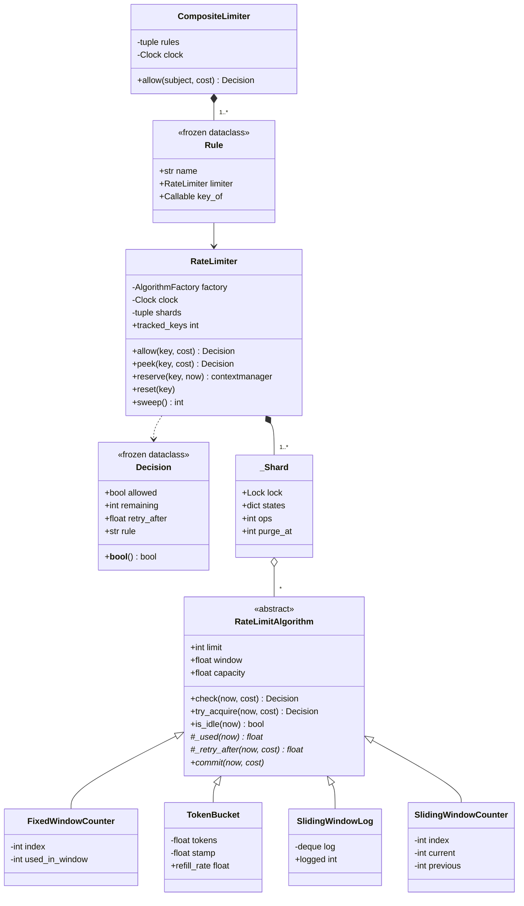

# 设计题解：限流器（Rate Limiter）

## 题目与澄清

面试官的开场白通常很短："设计一个限流器：每个用户每分钟最多 100 次请求，超了就拒掉。"

这句话里藏着一个岔路口，而且走错了整场面试就废了：**他要的是一个进程内的库组件，还是一套分布式限流架构？**
这道题的正确答案是前者——一个能 `import` 进来、`limiter.allow(user_id)` 一行就用的类。
分布式限流（Redis 计数器、Lua 脚本的原子读改写、本地配额预分配、时钟漂移）是系统设计轮的题目，
在机器编码轮里提它只会让你写不完代码。开口第一句就把这条线划清楚，然后一直待在线内：
本题解讨论的是类的划分、可注入的时钟、按 key 的状态隔离、线程安全和 API 形状。

划清之后，还有几个澄清值得问，每一个的答案都会改变代码：

- **限流的粒度是什么？** 按用户、按 API key、按 IP、按接口，还是"同时按好几个"？如果答案是"同时"，
  那么"一个限流器只认一个 key"这件事必须从第一行就成立，多条规则靠组合而不是靠在类里塞 `if` 实现。
- **被拒之后，调用方需要知道什么？** 如果只是"拒了"，返回 `bool` 就够；如果要回 HTTP 429 并带上
  `Retry-After` 头，那返回值就必须携带"多久之后再来"。这是本题最值得主动提出的一点，见下文的决策一。
- **算法定死吗？** 面试官十有八九会在第二关说"把它换成令牌桶"。所以"用哪个算法"必须是可替换的，
  否则第二关就要动第一关的代码。
- **一次请求算几次？** 上传一个大文件和读一条记录不该占同样的额度。有没有 `cost`，决定了接口是
  `allow(key)` 还是 `allow(key, cost=1)`——后者的默认值让两者在调用点上没有区别。
- **允许突发吗？** "每分钟 60 次"是否意味着"一秒钟连发 60 次也合法"？回答"允许，但一口气最多 5 次"
  就直接指向令牌桶的容量与速率分离。
- **要线程安全吗？规模多大？** 单进程多线程的 Web 服务是默认场景。key 的数量级决定了"状态怎么回收"
  是不是一个必须回答的问题——一百万个 IP 地址意味着一百万份状态。

**范围之外**：跨进程／跨机器的共享计数、配额的持久化、按租户下发不同限额的配置系统、
限流器自身故障时 fail open 还是 fail closed。这些都在第七节作为追问回答。

## 需求与分级

**第 1 关（约 20 分钟，核心流程）**：一个限流器、一个 key、一个固定窗口。
`allow(key) -> bool`，每个窗口最多 N 次。写完立刻自己拆台：固定窗口是错的。
限额"每 10 秒 5 次"，客户端在 t=9.9 秒发 5 次（全部落在第 0 格），再在 t=10.1 秒发 5 次
（全部落在第 1 格），两格各自都没超，**可是 0.2 秒之内真实放行了 10 次，是限额的 2 倍**。
这个算术要当着面试官的面算出来，它是整道题的转折点。

**第 2 关（约 15 分钟，算法成为接缝）**："换成令牌桶。" 此时要做的不是改写，而是把"怎么记住最近的流量"
整体抽成一个接口，让固定窗口、令牌桶、滑动窗口日志、滑动窗口计数四种实现共存。
这一关同时把返回值从 `bool` 升级成 `Decision`——因为不同算法算出的"多久后可以重试"完全不同，
只有算法自己知道答案，这个信息必须从算法里流出来。

**第 3 关（约 15 分钟，按 key 隔离与线程安全）**：每个 key 一份独立状态；一百万个 key 不能把内存吃光，
所以"闲置 key 的状态必须可回收"是一条硬需求，不是优化；多线程同时打同一个 key 不能超卖。

**第 4 关（选做）**：同时按用户和按接口限流，任一条拒绝即拒绝；一次请求可以消耗多份额度。
这一关只验一件事：**前三关的类一行都不用改**。

## 核心对象与职责

| 类 | 单一职责 | 它拥有的不变量 |
|---|---|---|
| `Decision` | 一次判定的结果（准不准、还剩多少、多久后再来、哪条规则决定的） | 不可变；`allowed` 为真时 `retry_after` 恒为 0 |
| `RateLimitAlgorithm` | 判定骨架：把"已占用多少"翻译成准／拒／等多久 | 被拒的请求一份额度都不扣 |
| `FixedWindowCounter` | 对齐格子里的计数 | 换格即清零，两个整数的内存 |
| `TokenBucket` | 按速率惰性补充的令牌 | 令牌数恒在 `[0, capacity]` 内；不起任何后台线程 |
| `SlidingWindowLog` | 窗口内每次放行的时刻 | 日志长度不超过 limit，窗口外的条目在写入时被丢弃 |
| `SlidingWindowCounter` | 当前格 + 上一格按重叠比例加权 | 估计值只会偏严，不会偏松 |
| `_Shard` | 一把锁 + 归它管的那部分 key→状态 | 这些 key 的状态只在持有这把锁时被读写 |
| `RateLimiter` | 按 key 隔离状态、分片加锁、回收闲置状态 | `tracked_keys` 不随"见过多少 key"单调增长 |
| `Rule` | 把"请求对象"映射成"某个限流器的 key" | 不可变的三元组 |
| `CompositeLimiter` | 多条规则的两阶段判定 | 任一条拒绝时，没有任何一条被扣额度 |

`RateLimiter` 和 `RateLimitAlgorithm` 是组合（composition）：限流器为每个 key 造一份状态、独占它的生命周期，
外部拿不到状态对象。`CompositeLimiter` 和它的子限流器是关联（association）：子限流器由调用方构造、可以
单独使用，组合器只是按顺序调度它们。`_Shard` 是 `RateLimiter` 的内部零件，下划线开头就是在说"别碰"。



## 关键设计决策

### 决策一：返回 `Decision` 而不是 `bool`

**问题**：`allow(key)` 该返回什么？

选项 A 是最省事的 `bool`：

```python
if not limiter.allow(user):
    return Response(429)
```

它的代价在调用方身上。HTTP 429 要带 `Retry-After`，仪表盘要显示 `X-RateLimit-Remaining`，
而这两个数字只有限流器内部算得出来——令牌桶要用 `(cost - 令牌数) / 速率`，滑动日志要看
第几条旧记录什么时候滑出窗口。返回 `bool` 等于把这些信息在边界上丢掉，调用方只能
瞎猜一个退避时间。更糟的是所有客户端会猜出同一个数（比如"等一秒"），于是被拒的客户端
在同一时刻集体重试，形成惊群（thundering herd）——限流器反而制造了尖峰。

选项 B 是抛异常 `RateLimitExceeded`。但**被限流是正常的业务结果，不是错误**：
一个健康的公开 API 每秒都在拒绝请求。用异常表达高频的正常分支，既让调用点写成 `try/except`
这种控制流，也让"拒绝"这件事不能被当成值传递、统计和记录。异常留给真正的配置错误
（非正的 limit、非正的 cost），代码里的 `InvalidConfiguration` 就是它们唯一的去处。

选择 C：一个不可变的小值对象，并且实现 `__bool__`：

```python
@dataclass(frozen=True, slots=True)
class Decision:
    allowed: bool
    remaining: int
    retry_after: float
    rule: str = ""

    def __bool__(self) -> bool:
        return self.allowed
```

`__bool__` 是关键的一笔：`if limiter.allow(key):` 仍然读得通，**从 `bool` 升级成结构化结果
不需要调用方改一行既有代码**，同时需要细节的人随时能取 `.retry_after`。这是
[[structure.api|进程内 API 设计]] 里"返回值要够丰富"的标准做法，在 Python 里靠数据模型协议
（data model protocol）实现得尤其自然。`frozen=True` 保证没人能改一份已经发出去的判定，
`slots=True` 让它在每秒几十万次的路径上足够轻。

### 决策二：四种算法共用一套判定骨架，而不是四份独立实现

**问题**：四种算法差别很大——一个存两个整数，一个存一串时间戳。怎么让它们可替换？

常见的做法（多数公开实现都是这样）是让每个算法各自实现完整的 `allow(now, cost)`，
于是"够不够额度"、"剩多少"、"cost 超过上限怎么办"、"被拒时不扣额度"这四条规则被抄了四遍。
抄四遍的下场是它们迟早会不一致：在参考实现里很容易出现某个算法在被拒时仍然写了状态的 bug。

本题解把接口切在更低的地方。四种算法的真正差别只有一件事：**此刻这个 key 已经占掉了多少额度**。
固定窗口说"格子里的计数"，令牌桶说"容量减去现有令牌"，滑动日志说"窗口内的条目数"，
滑动计数说"加权估计值"。把它抽成 `_used(now)`，判定骨架就能写一次：

```python
def check(self, now: float, cost: int = 1) -> Decision:
    if cost <= 0:
        raise InvalidConfiguration(f"cost must be positive, got {cost}")
    used = self._used(now)
    remaining = max(0, int(self.capacity - used))
    if used + cost <= self.capacity:
        return Decision(True, remaining - cost, 0.0)
    if cost > self.capacity:
        return Decision(False, remaining, math.inf)
    return Decision(False, remaining, self._retry_after(now, cost))
```

子类只剩三个方法：`_used`、`_retry_after`、`commit`，每个十行以内。
这是[[patterns.strategy|策略模式与可替换算法（Strategy）]]，但形状和教科书不同：
策略不是一个只有一个方法的函数对象，而是**一份带状态的对象**——每个 key 一份。
既然有状态，就不能退化成"传一个函数进去"，用 `ABC` 是对的；
这和 [[solution-lru-cache]] 里把"淘汰谁"抽成 `EvictionPolicy` 是同一条接缝的两次应用：
容器只管隔离与加锁，"怎么算"整个交出去。

意外的红利是回收判据。`is_idle(now)` 可以在基类里写完，一行：

```python
def is_idle(self, now: float) -> bool:
    return self._used(now) <= 0.0
```

因为"占用为 0 的状态"和"刚刚新建的状态"对任何后续判定给出完全相同的答案，
所以删掉它是**观察上等价**的。四种算法一个字都不用写，就都获得了正确的回收语义。
把接缝切在 `_used` 上，这条不变量才成立；切在 `allow` 上就得四个类各自实现 `is_idle`，
并且各自有写错的机会。

### 决策三：分片锁，而不是"每个 key 一把锁"

**问题**：多线程同时打同一个 key，`check` 和 `commit` 之间不能插入别人，否则超卖。
`concurrent` 场景下锁加在哪？

选项 A，全局一把锁。正确，但所有 key 互相排队：限流器本身成了瓶颈，而它恰恰坐在每个请求的必经之路上。

选项 B，每个 key 一把锁。粒度最细，但锁字典本身要用另一把锁来保护，而且——**这把"锁的字典"
也会无限增长**。你为了解决一个容器的回收问题，又造了第二个需要回收的容器，
而且这个容器的回收更难：删掉一把可能正被别人持有的锁是一个经典的竞态。

选项 C（本题解），固定数量的分片，每片一把锁、一个字典：

```python
class _Shard:
    __slots__ = ("lock", "states", "ops", "purge_at")

def _shard_of(self, key: Hashable) -> _Shard:
    return self._shards[hash(key) % len(self._shards)]
```

锁的数量是常数，不需要生命周期管理；竞争大约降到全局锁的 1/N；而且由于每个 key 只归一个分片，
**同一个 key 的所有读写天然在同一把锁下**，不存在跨分片的一致性问题。扫描回收时也只锁一个分片，
其余 15/16 的流量照常通过。这就是 Java 的旧版 `ConcurrentHashMap` 和各种 sharded map 的做法。

要说清楚 GIL（全局解释器锁）在这里给了什么、没给什么：它保证单条字节码不会被撕开，所以
`dict.get` 本身不会读到半个对象；它**不**保证 `check` 之后到 `commit` 之间不切换线程。
`used + cost <= capacity` 是一次"检查再动作"（check-then-act），两百个线程可以同时看到
"还剩 50 个令牌"然后各自扣一个。锁保护的不是数据结构，是这条复合操作的原子性——
和 [[solution-lru-cache]] 里 `get` 也必须拿写锁是同一个道理（那里 `get` 会改写链表，
这里 `check`+`commit` 跨越两次调用）。这条在 [[concurrency.primitives|同步原语（threading）]] 里
是最常被考的一点。

### 决策四：状态字典必须会缩——以及一个几乎必然写错的摊还条件

**问题**：一百万个 IP 各来过一次，限流器占多少内存？

这是本题真正的分水岭。懒惰创建（key 第一次出现时才造状态）是对的，但没有回收就是内存泄漏，
而"内存有界"恰恰是限流器的存在意义之一。

回收要在两件事之间取舍：回收得太晚，内存涨；回收得太早，**客户端只要停一下就能把自己的额度清零**——
删掉状态等于重置配额。本题解用 `is_idle` 解决这个两难：只删那些"和新建状态等价"的条目，
于是"删早了"这件事根本不可能发生，因为删掉它和留着它对后续判定没有任何区别。
参考实现里常见的 `forget_idle(older_than)` 要靠调用方传一个"至少一个窗口"的阈值来保证安全，
把正确性寄托在参数上；`is_idle` 把它变成类自己的不变量。

触发时机用摊还：每个分片累计的操作数超过门槛就扫一遍自己，一次扫描 O(条目数)，
摊到这么多次操作上就是 O(1)。**这里有一个坑，第一版就踩了**：门槛如果写成
"当前条目数"——

```python
if shard.ops >= max(64, len(shard.states)):   # 错的
    self._purge(shard, now)
```

——在"每次操作都带来一个新 key"的场景下永远追不上：`ops` 每加一，`len(states)` 也加一。
第一次扫描（ops=64，条目 64，还没有东西过期）之后 `ops` 归零，此后两者永远差 64，
扫描再也不会触发，内存一路涨到一百万。测试里 `test_a_million_keys_do_not_leak` 就是
拿这个 bug 换来的。正确的写法是把门槛**定死**在上一次整理完的规模上：

```python
shard.ops = 0
shard.purge_at = max(_PURGE_FLOOR, len(shard.states))
```

修好之后，同样的一百万个 key，常驻条目稳定在一万上下（正好是一个窗口内出现的 key 数），
并且不随总量增长。这和哈希表"按上次 rehash 后的大小决定下次扩容点"是同一种摊还论证。

### 决策五：拒绝再抽一层"限流器接口"——组合用两阶段解决

**问题**：第 4 关要"同时按用户和按接口限流"。很多人的第一反应是引入一个
`RateLimiterInterface`，让 `RateLimiter` 和 `CompositeLimiter` 都实现它，组合成一棵树。

这里该**拒绝这个模式**。组合模式（Composite）的价值在于"客户端不必区分叶子和组合"，
可本题的叶子和组合连 `allow` 的参数都不一样：叶子收一个 key，组合收一个请求对象再由
`Rule.key_of` 抽 key。硬造一个共同接口，只能靠"组合器要求所有规则都用同一个 key"这种
削足适履来实现，第一个"按用户 + 按接口"的真实需求就把它顶穿了。所以 `CompositeLimiter`
不继承任何东西，它只是一个协调者。

真正需要设计的是**扣额度的时机**。天真的写法是逐条 `allow`：

```python
for rule in rules:                      # 错的
    if not rule.limiter.allow(key_of(subject)):
        return denied
```

用户规则先通过并且**已经扣掉了**一份额度，接口规则随后拒绝——这次请求根本没被服务，
却吃掉了用户的配额。用户会发现自己被限流得莫名其妙地快。所以判定必须是两阶段的：
先把所有涉及的状态锁住并各自 `check`，全过了才逐个 `commit`。这就是
`RateLimitAlgorithm` 把 `check` 和 `commit` 分开、`RateLimiter.reserve` 公开成上下文管理器的原因：

```python
with ExitStack() as stack:
    for rule in self._rules:
        state = stack.enter_context(rule.limiter.reserve(rule.key_of(subject), now))
        decision = state.check(now, cost)
        if not decision.allowed:
            return replace(decision, rule=rule.name)
        reserved.append((rule, state, decision))
    for _, state, _decision in reserved:
        state.commit(now, cost)
```

同时持有多把锁就有死锁风险。这里靠**固定的加锁顺序**规避：规则元组的顺序不变，
所有线程都按同一顺序拿锁。这个前提有一个漏洞——如果两条规则共用同一个 `RateLimiter`，
加锁顺序就取决于两个 key 落在哪个分片，不再固定。构造函数因此直接拒绝这种配置，
把一条只存在于脑子里的约束变成一次会抛异常的检查。

## 代码走读

先看判定骨架怎么把四种算法压成三个方法。`check` 是纯查询（绝不修改状态），
所以每个 `_used(now)` 都必须能在不滚动窗口、不裁剪日志的情况下算出答案——
`FixedWindowCounter._used` 用"格号对不上就当作 0"表达这件事，滚动格号的动作留在 `commit` 里。
这条"查询不写状态"的纪律是两阶段判定能成立的前提。

再看 `SlidingWindowCounter._retry_after`。这是全篇最容易写错的十行：当前格自己就已经吃满时，
答案**不是**"等到下一格开头"——进了下一格，当前格会变成"上一格"，它的计数仍按重叠比例被记着。
必须把同一个不等式在下一格里再解一次。第一版在这里直接返回下一格开头，结果是
"等满 `retry_after` 再来，照样被拒"——一个会骗调用方的字段比没有这个字段更糟。
测试 `test_retry_after_is_honest` 对四种算法各跑一遍"等满就必须能过"，把这件事钉死。

第三处是 `RateLimiter.reserve`：它既是 `allow`／`peek` 的内部实现，也是组合器的公开入口。
`@contextmanager` 让"拿分片锁 → 懒创建状态 → 用完顺手做摊还回收"成为一个整体，
调用方不可能忘记解锁，`ExitStack` 也能把好几把这样的锁摞起来按相反顺序释放。
注意回收写在 `finally` 里且仍在锁内——它改的是这个分片的字典，必须被同一把锁罩住。

最后是 `_purge` 的门槛更新。它只有两行，却是第四个决策的全部落点。

%% code:begin solution.py %%
```python
"""限流器（Rate Limiter）：进程内的库级组件，不是分布式限流架构。
设计：一次判定的结果是 `Decision`（准不准、还剩多少、多久后再来），不是裸 bool；
"怎么记住最近的流量"整体做成可替换的 `RateLimitAlgorithm`（固定窗口／令牌桶／滑动日志／滑动计数），
四种算法共用基类里同一套"用掉多少 / 还能不能过 / 多久才行"的判定骨架；
`RateLimiter` 只负责"按 key 隔离状态 + 分片加锁 + 让闲置 key 的状态被回收"，
`CompositeLimiter` 把多条规则（按用户、按接口）组合成"先全查、全过才全扣"的两阶段判定。
"""

from __future__ import annotations

import math
import threading
import time
from abc import ABC, abstractmethod
from collections import deque
from collections.abc import Callable, Hashable, Iterator, Sequence
from contextlib import ExitStack, contextmanager
from dataclasses import dataclass, replace
from typing import Generic, TypeVar

T = TypeVar("T")

Clock = Callable[[], float]
"""时钟：一个返回单调秒数的无参函数。永远从外部注入，便于测试与回放。"""

AlgorithmFactory = Callable[[], "RateLimitAlgorithm"]
"""造一份"某个 key 的限流状态"的工厂——每个 key 第一次出现时调用一次。"""

_PURGE_FLOOR = 64
"""分片至少累计这么多次操作才值得扫一遍自己，避免小流量下反复空扫。"""


class RateLimiterError(Exception):
    """本模块所有异常的根。"""


class InvalidConfiguration(RateLimiterError, ValueError):
    """参数本身就不成立：非正的限额、非正的窗口、重复的限流器、非正的开销。

    注意"被限流"不在这里——被拒绝是正常的业务结果，用返回值表达，不是异常。
    """


@dataclass(frozen=True, slots=True)
class Decision:
    """一次判定的结果：准不准（allowed）、还剩多少额度（remaining）、多久后重试（retry_after）。

    `remaining` 的口径和 HTTP 响应头 `X-RateLimit-Remaining` 一致：**服务完这次请求之后**
    还剩多少。被拒时这次请求没被服务，所以它就是当前剩余量（通常是 0）。
    `rule` 是做出这个判定的规则名，只有组合限流器才用得上——被拒时调用方要能说出
    "是按用户拒的还是按接口拒的"。`__bool__` 让 `if limiter.allow(key):` 照样能写，
    于是从裸 bool 升级成结构化结果不需要调用方改一行既有代码。
    """

    allowed: bool
    remaining: int
    retry_after: float
    rule: str = ""

    def __bool__(self) -> bool:
        return self.allowed


class RateLimitAlgorithm(ABC):
    """一个 key 的限流状态。子类只回答三件事，判定骨架写在基类里不重复。

    - `_used(now)`：此刻这个 key 已经占掉多少额度（可以是小数）。
    - `_retry_after(now, cost)`：在额度不够时，还要等多久才够。
    - `commit(now, cost)`：真正扣掉额度——只有在 `check` 说准了之后才调用。

    `limit` 是一个窗口内的持续额度，`capacity` 是某一瞬间最多能占掉多少（默认等于 limit，
    只有令牌桶会把它抬高来表达"允许攒多大的突发"）。
    """

    def __init__(self, limit: int, window: float, capacity: float | None = None) -> None:
        if limit <= 0:
            raise InvalidConfiguration(f"limit must be positive, got {limit}")
        if window <= 0:
            raise InvalidConfiguration(f"window must be positive, got {window}")
        self.limit = limit
        self.window = float(window)
        self.capacity = float(limit if capacity is None else capacity)
        if self.capacity < 1:
            raise InvalidConfiguration(f"capacity must be at least 1, got {self.capacity}")

    @abstractmethod
    def _used(self, now: float) -> float:
        """此刻已占用的额度。它同时定义了"闲置"：占用为 0 的状态和新建的状态无法区分。"""

    @abstractmethod
    def _retry_after(self, now: float, cost: int) -> float:
        """额度不够时，距离够用还要等多少秒。只在 `check` 判定为拒绝时被调用。"""

    @abstractmethod
    def commit(self, now: float, cost: int) -> None:
        """扣掉 cost 份额度。调用方必须先 `check` 且拿到 allowed=True。"""

    def check(self, now: float, cost: int = 1) -> Decision:
        """只判定、不扣额度（纯查询）。两阶段判定的第一阶段，组合限流器依赖它。"""
        if cost <= 0:
            raise InvalidConfiguration(f"cost must be positive, got {cost}")
        used = self._used(now)
        remaining = max(0, int(self.capacity - used))
        if used + cost <= self.capacity:
            return Decision(True, remaining - cost, 0.0)
        if cost > self.capacity:
            # 单次开销就超过上限：等到天荒地老也不会通过，别给调用方一个会骗它的重试时间。
            return Decision(False, remaining, math.inf)
        return Decision(False, remaining, self._retry_after(now, cost))

    def try_acquire(self, now: float, cost: int = 1) -> Decision:
        """check + commit 的合体。被拒绝时**一份额度都不扣**，也不把重试时间往后推。"""
        decision = self.check(now, cost)
        if decision.allowed:
            self.commit(now, cost)
        return decision

    def is_idle(self, now: float) -> bool:
        """这份状态是否已经和"刚 new 出来的状态"完全等价——等价就可以安全地丢掉。

        这条判据对四种算法都成立，因为它就是 `_used(now) == 0` 的另一种说法：
        一个什么都没占的状态，留着和删掉对任何后续判定的结果都没有区别。
        """
        return self._used(now) <= 0.0


class FixedWindowCounter(RateLimitAlgorithm):
    """固定窗口计数：把时间切成对齐的格子，每格一个计数器。两个 int，最省内存。

    代价是边界突发——见 `SlidingWindowCounter` 的注释。它留在这里不是为了被用，
    而是为了让"边界突发"这件事在测试里能被断言出来。
    """

    def __init__(self, limit: int, window: float) -> None:
        super().__init__(limit, window)
        self._index = -1
        self._used_in_window = 0

    def _used(self, now: float) -> float:
        return float(self._used_in_window) if int(now // self.window) == self._index else 0.0

    def _retry_after(self, now: float, cost: int) -> float:
        return (int(now // self.window) + 1) * self.window - now

    def commit(self, now: float, cost: int) -> None:
        index = int(now // self.window)
        if index != self._index:
            self._index, self._used_in_window = index, 0
        self._used_in_window += cost


class TokenBucket(RateLimitAlgorithm):
    """令牌桶：桶里的令牌按固定速率补充，一次请求拿走 cost 个。两个浮点数。

    补令牌是**惰性**的：不起后台线程、不挂定时器，每次判定时用"距上次记账过了多久"
    现算。一百万个闲置 key 因此一分钱 CPU 都不花——这正是它能撑住海量 key 的原因。
    `burst` 把瞬时容量和持续速率解耦：每分钟 60 次，但一口气最多 5 次。
    """

    def __init__(self, limit: int, window: float, burst: float | None = None) -> None:
        super().__init__(limit, window, capacity=burst)
        self._rate = limit / self.window
        self._tokens = self.capacity
        self._stamp: float | None = None

    @property
    def refill_rate(self) -> float:
        """每秒补充的令牌数，只读——测试和读者都需要它，但没人该改它。"""
        return self._rate

    def _tokens_at(self, now: float) -> float:
        if self._stamp is None:
            return self.capacity
        # 时钟倒退时 elapsed 会是负数，凭空造出令牌；夹到 0 是唯一安全的处理。
        elapsed = max(0.0, now - self._stamp)
        return min(self.capacity, self._tokens + elapsed * self._rate)

    def _used(self, now: float) -> float:
        return self.capacity - self._tokens_at(now)

    def _retry_after(self, now: float, cost: int) -> float:
        return (cost - self._tokens_at(now)) / self._rate

    def commit(self, now: float, cost: int) -> None:
        self._tokens = self._tokens_at(now) - cost
        self._stamp = now


class SlidingWindowLog(RateLimitAlgorithm):
    """滑动窗口日志：记下每次放行的时刻，窗口外的丢掉。**精确**，没有任何边界效应。

    代价是内存与 limit 成正比：limit=10000 的 key 就要存一万个时间戳。只在限额小、
    精度要求高的地方用（比如"每分钟 5 条短信"）。
    """

    def __init__(self, limit: int, window: float) -> None:
        super().__init__(limit, window)
        self._log: deque[float] = deque()

    @property
    def logged(self) -> int:
        """日志里还留着多少条时间戳——用来断言"窗口滑过去之后内存确实降下来了"。"""
        return len(self._log)

    def _live(self, now: float) -> list[float]:
        """还落在窗口内的时间戳，从旧到新。不修改内部状态，`check` 必须保持纯粹。"""
        cutoff = now - self.window
        return [stamp for stamp in self._log if stamp > cutoff]

    def _used(self, now: float) -> float:
        return float(len(self._live(now)))

    def _retry_after(self, now: float, cost: int) -> float:
        live = self._live(now)
        # 要腾出 cost 份额度，就得等最早的 (len(live) + cost - capacity) 条记录滑出窗口。
        need = len(live) + cost - int(self.capacity)
        return live[need - 1] + self.window - now

    def commit(self, now: float, cost: int) -> None:
        cutoff = now - self.window
        while self._log and self._log[0] <= cutoff:
            self._log.popleft()
        self._log.extend([now] * cost)


class SlidingWindowCounter(RateLimitAlgorithm):
    """滑动窗口计数：当前格 + 上一格按重叠比例加权。三个数字，近似但够用。

    估算式是 `上一格计数 × 重叠比例 + 当前格计数`。它假设上一格的请求在格内**均匀**分布，
    所以真实流量集中在上一格开头时会高估、集中在结尾时会低估；高估意味着提前拒绝，
    对限流器而言这是安全的一侧。这是生产环境最常见的默认选择。
    """

    def __init__(self, limit: int, window: float) -> None:
        super().__init__(limit, window)
        self._index = -1
        self._current = 0
        self._previous = 0

    def _counts(self, now: float) -> tuple[float, float, float]:
        """返回 (上一格计数, 当前格计数, 当前格起点)，按 now 所在的格子重新对齐。"""
        index = int(now // self.window)
        start = index * self.window
        if index == self._index:
            return float(self._previous), float(self._current), start
        if index == self._index + 1:
            return float(self._current), 0.0, start
        return 0.0, 0.0, start

    def _used(self, now: float) -> float:
        previous, current, start = self._counts(now)
        overlap = 1.0 - (now - start) / self.window
        return previous * overlap + current

    def _retry_after(self, now: float, cost: int) -> float:
        previous, current, start = self._counts(now)
        budget = self.capacity - cost - current
        if budget >= 0:
            # 还能在本格内熬出来：等上一格的权重衰减到 budget 以下。
            return max(0.0, start + (1.0 - budget / previous) * self.window - now)
        # 光当前格就吃满了，只能等进入下一格——注意那时当前格会变成"上一格"，
        # 它的计数仍按重叠比例记着，所以答案不是"下一格开头"，而要继续解一次同样的不等式。
        # （早期版本在这里直接返回下一格开头，于是 retry_after 到点了还是被拒，是在骗调用方。）
        return start + self.window + (1.0 - (self.capacity - cost) / current) * self.window - now

    def commit(self, now: float, cost: int) -> None:
        index = int(now // self.window)
        if index == self._index + 1:
            self._previous, self._current = self._current, 0
        elif index != self._index:
            self._previous, self._current = 0, 0
        self._index = index
        self._current += cost


class _Shard:
    """一个分片：一把锁，外加归这把锁管的那部分 key→状态。

    分片是"每个 key 一把锁"和"全局一把锁"之间的中间答案：锁的数量是常数（不随 key 增长，
    也就不需要再为锁本身设计回收），而竞争只发生在同一分片内，大约是全局锁的 1/N。
    """

    __slots__ = ("lock", "states", "ops", "purge_at")

    def __init__(self) -> None:
        self.lock = threading.Lock()
        self.states: dict[Hashable, RateLimitAlgorithm] = {}
        self.ops = 0
        self.purge_at = _PURGE_FLOOR


class RateLimiter:
    """按 key 隔离的限流器：算法怎么算它不管，它管的是隔离、加锁和**状态回收**。

    每个 key 第一次出现时用 `factory` 造一份状态。这个字典是本设计里唯一会无限增长的
    容器，所以它必须会缩：每个分片累计的操作数超过它自己装的条目数时，顺手把
    `is_idle` 的状态删掉（摊还 O(1)）；也可以随时显式调用 `sweep()`。
    """

    def __init__(self, factory: AlgorithmFactory, *, clock: Clock = time.monotonic,
                 name: str = "", shards: int = 16) -> None:
        if shards <= 0:
            raise InvalidConfiguration(f"shards must be positive, got {shards}")
        self._factory = factory
        self._clock = clock
        self._name = name
        self._shards = tuple(_Shard() for _ in range(shards))

    @property
    def name(self) -> str:
        return self._name

    @property
    def tracked_keys(self) -> int:
        """当前占着内存的 key 数。回收做得对，它就不会随"见过多少 key"单调增长。"""
        return sum(self._sized(shard) for shard in self._shards)

    @staticmethod
    def _sized(shard: _Shard) -> int:
        with shard.lock:
            return len(shard.states)

    def _shard_of(self, key: Hashable) -> _Shard:
        return self._shards[hash(key) % len(self._shards)]

    @contextmanager
    def reserve(self, key: Hashable, now: float) -> Iterator[RateLimitAlgorithm]:
        """持锁取出某个 key 的状态，供两阶段判定使用；退出时顺手做摊还回收。

        它是公开的，因为 `CompositeLimiter` 需要"先把几条规则的状态都锁住，再统一决定
        扣不扣"。直接调用它的人必须在 with 块内完成 check 与 commit，不要把状态带出去。
        """
        shard = self._shard_of(key)
        with shard.lock:
            state = shard.states.get(key)
            if state is None:
                state = shard.states[key] = self._factory()
            shard.ops += 1
            try:
                yield state
            finally:
                if shard.ops >= shard.purge_at:
                    self._purge(shard, now)

    @staticmethod
    def _purge(shard: _Shard, now: float) -> None:
        """丢掉这个分片里所有"和新建状态等价"的条目。调用方必须已经持有分片锁。

        下一次扫描的门槛在这里**定死**为"扫完之后还剩多少条"，而不是每次去和当前条目数
        比较。差别是致命的：当每一次操作都带来一个新 key 时，条目数和操作数同速增长，
        "ops >= len(states)" 永远追不上，扫描只会在最开始触发一次，之后内存一路涨到天上。
        与"上次整理后的规模"比较，才真的是摊还 O(1)。
        """
        for key in [k for k, state in shard.states.items() if state.is_idle(now)]:
            del shard.states[key]
        shard.ops = 0
        shard.purge_at = max(_PURGE_FLOOR, len(shard.states))

    def allow(self, key: Hashable, cost: int = 1) -> Decision:
        """判定并（在通过时）扣额度。被拒时不消耗任何额度。"""
        now = self._clock()
        with self.reserve(key, now) as state:
            decision = state.try_acquire(now, cost)
        return replace(decision, rule=self._name) if self._name else decision

    def peek(self, key: Hashable, cost: int = 1) -> Decision:
        """只看不扣：仪表盘和响应头需要它，业务路径不该用它做"检查再动作"。"""
        now = self._clock()
        with self.reserve(key, now) as state:
            return state.check(now, cost)

    def reset(self, key: Hashable) -> None:
        """清掉一个 key 的全部状态（人工解封）。key 不存在也不报错。"""
        shard = self._shard_of(key)
        with shard.lock:
            shard.states.pop(key, None)

    def sweep(self) -> int:
        """显式扫一遍全部分片，返回回收掉的 key 数。一次只锁一个分片。"""
        now = self._clock()
        reclaimed = 0
        for shard in self._shards:
            with shard.lock:
                before = len(shard.states)
                self._purge(shard, now)
                reclaimed += before - len(shard.states)
        return reclaimed

    def __repr__(self) -> str:
        return f"{type(self).__name__}(name={self._name!r}, tracked_keys={self.tracked_keys})"


@dataclass(frozen=True, slots=True)
class Rule(Generic[T]):
    """一条限流规则：给这个限流器喂哪个 key。`key_of` 从请求对象里抽出 key。"""

    name: str
    limiter: RateLimiter
    key_of: Callable[[T], Hashable]


class CompositeLimiter(Generic[T]):
    """多条规则同时生效（按用户 + 按接口 + 按 IP），任一条拒绝即整体拒绝。

    关键在于**两阶段**：先把所有规则的状态锁住并各自 `check`，全过才逐个 `commit`。
    否则一次被接口规则拒掉的请求，仍然白白扣掉了用户的额度——用户会发现自己没发出去的
    请求也在耗配额。规则顺序固定，因此所有线程按同一顺序拿锁，不会互相死锁；
    构造时拒绝同一个 `RateLimiter` 出现两次，正是为了守住这个顺序前提。
    """

    def __init__(self, rules: Sequence[Rule[T]], *, clock: Clock = time.monotonic) -> None:
        if not rules:
            raise InvalidConfiguration("a composite limiter needs at least one rule")
        if len({id(rule.limiter) for rule in rules}) != len(rules):
            raise InvalidConfiguration("each rule needs its own RateLimiter: lock order would depend on the key")
        self._rules = tuple(rules)
        self._clock = clock

    @property
    def rule_names(self) -> tuple[str, ...]:
        return tuple(rule.name for rule in self._rules)

    def allow(self, subject: T, cost: int = 1) -> Decision:
        """所有规则都放行才放行，并返回"最紧"的那条规则的结果。"""
        now = self._clock()
        with ExitStack() as stack:
            reserved: list[tuple[Rule[T], RateLimitAlgorithm, Decision]] = []
            for rule in self._rules:
                state = stack.enter_context(rule.limiter.reserve(rule.key_of(subject), now))
                decision = state.check(now, cost)
                if not decision.allowed:
                    return replace(decision, rule=rule.name)
                reserved.append((rule, state, decision))
            for _, state, _decision in reserved:
                state.commit(now, cost)
        tightest_rule, _, tightest = min(reserved, key=lambda item: item[2].remaining)
        return replace(tightest, rule=tightest_rule.name)


def _demo() -> None:
    now = [0.0]
    clock: Clock = lambda: now[0]

    # 边界突发：固定窗口在 t=9.9 和 t=10.1 各放 5 次，10 秒内实际放行 10 次 = 2 倍限额。
    fixed = RateLimiter(lambda: FixedWindowCounter(5, 10.0), clock=clock, name="fixed")
    sliding = RateLimiter(lambda: SlidingWindowCounter(5, 10.0), clock=clock, name="sliding")
    for limiter in (fixed, sliding):
        passed = 0
        for now[0] in (9.9,) * 5 + (10.1,) * 5:
            passed += bool(limiter.allow("alice"))
        print(f"{limiter.name:>8}: 10 次请求放行 {passed} 次")

    now[0] = 100.0
    bucket = RateLimiter(lambda: TokenBucket(60, 60.0, burst=5), clock=clock, name="bucket")
    for _ in range(5):
        bucket.allow("bob")
    print("令牌桶被拒时的 retry_after:", round(bucket.allow("bob").retry_after, 3), "秒")
    print("闲置前:", bucket.tracked_keys, end=" ")
    now[0] = 400.0
    print("→ 扫描回收:", bucket.sweep(), "→ 闲置后:", bucket.tracked_keys)


if __name__ == "__main__":
    _demo()
```
%% code:end %%

## 测试与自检

测试文件钉住的是**契约**，不是实现：所有断言只用公开方法和只读属性（`tracked_keys`、
`refill_rate`、`logged`），所以换一种内部表示照样能过——这正是学习者填 `starter.py` 时需要的自由。

几条最值得写出来的断言：

- **边界突发**（`test_fixed_window_boundary_burst_is_twice_the_limit`）：限额 5，实际放行 10。
  把缺陷本身变成一条通过的测试，是"我知道它错在哪"的最强证据；换成滑动窗口计数后同一场景只放行 5。
- **被拒不扣额度**（四种算法各一遍）：连发 50 次被拒之后，`retry_after` 必须和第一次被拒时相同。
  如果算法在被拒路径上偷偷写了状态，重试会把恢复时间不断往后推，客户端将永远饿死。
- **retry_after 不说谎**：等满 `retry_after` 再试必须通过。
- **cost 超过上限**：返回 `math.inf` 而不是某个有限值——等到天荒地老也不会通过，别给一个假的希望。
- **一百万个 key 不泄漏**：常驻条目峰值小于两万五，扫一遍后归零。
- **不超卖**：200 个线程用 `threading.Barrier` 对齐起跑线同时打一个 key，限额 50，
  放行数必须**精确等于 50**。断言的是不变量而不是时序，所以它在任何机器上都稳定。

两分钟怎么演示：跑 `python solution.py`。第一行输出就是固定窗口放行 10 次、滑动窗口计数放行 5 次；
第二行是被拒时的 `retry_after`；第三行是一个 key 闲置后被扫描回收，`tracked_keys` 从 1 变 0。
三行输出对应三关，比念代码快得多。

## 扩展与追问

**新需求**

- *不同套餐不同限额（免费 100/小时，付费 10000/小时）*：`RateLimiter` 构造时接的是一个
  `AlgorithmFactory`，把它换成"按 key 查套餐再造状态"的工厂即可，限流器、算法、组合器都不动。
- *按 IP 再加一条规则*：往 `CompositeLimiter` 的规则列表里多塞一个 `Rule`。已有的两条规则、
  四种算法、分片逻辑全部不动——这是设计可扩展的直接证据。
- *白名单与"只观察不拦截"*：白名单是一条返回 `Decision(True, ...)` 的规则；
  灰度期只记录不拦截，则由调用方忽略 `allowed` 但照样记录 `Decision`，限流器本身无需感知。
- *让被拒的请求排队等待而不是直接失败*：这是另一个组件（一个带 `Condition` 的整形器），
  它调用 `peek` 拿到 `retry_after` 再决定等多久，仍然不需要改限流器。

**并发与线程安全**

- *分片数怎么选*：经验值是核数的几倍，16 是个体面的默认值。可以把 `shards` 暴露出来让压测去定。
- *能不能用读写锁*：不能。几乎每次 `allow` 都要写状态，"读者"少到不存在，读写锁只会多一层开销。
  这和 [[solution-lru-cache]] 里拒绝读写锁的理由完全一样。
- *`asyncio` 版本*：判定逻辑是纯计算、不阻塞，把 `threading.Lock` 换成 `asyncio.Lock` 即可，
  算法类一个字不改——因为它们从不自己读时钟，也从不自己加锁。
- *时钟*：一律用 `time.monotonic`，因为 `time.time` 会被 NTP 往回拨。令牌桶还额外把
  `elapsed` 夹到 0 以上，防止倒退的时钟凭空造出令牌。

**持久化与规模**

- *多进程／多机器*：状态搬到 Redis，`check`+`commit` 必须变成一次原子的读改写（Lua 脚本或
  `INCR` 配 `EXPIRE`）。令牌桶最难分布，因为它的状态最"活"；固定窗口最容易，代价是边界突发。
  常见折中是本地限流器预支一批配额、异步和中心对账——本题解的类结构正好是那个"本地限流器"。
- *回收交给存储*：在 Redis 里，`is_idle` 的等价物就是给 key 设一个 TTL。判据一样：
  一份"和新建等价"的状态可以随时消失。
- *可观测性*：`Decision` 里已经带着 `rule` 和 `remaining`，接一个计数器就能画出"每条规则拒了多少"。

## 常见错误

- **把它当分布式系统设计来答**：开口就是 Redis、集群、时钟同步，四十五分钟结束时一个类都没写完。
- **返回裸 `bool`**：调用方无法生成 `Retry-After`，所有客户端猜同一个退避时间，形成惊群。
- **在算法内部读 `time.time()`**：测试只能靠 `sleep`，一套用例跑几十秒还不稳定；
  更致命的是组合判定时每条规则读到的"现在"不一样，判定基准不一致。时钟必须注入。
- **用后台线程定时补充令牌**：一百万个 key 就是一百万个定时任务。令牌桶必须惰性计算。
- **被拒时仍然扣额度或推后恢复时间**：客户端重试越勤恢复越慢，直至永远饿死。
- **状态字典只增不减**：面试官问"一百万个 IP 呢"时答不上来。这是本题最常见的致命伤。
- **用异常表达"被限流"**：把一个每秒发生几千次的正常分支写成异常控制流。
- **Java 味的类**：给每个算法配一个 `RateLimiterFactory` 单例；写 `getRemaining()`／`setLimit()`
  而不是 `@property`；造一个只转发 `allow` 的 `RateLimiterService` 包装类——
  一个只转发一次调用的类没有职责，该删。
- **组合限流时逐条 `allow`**：被后面的规则拒掉，前面的额度已经白扣了。

## 45 分钟怎么分配

- **0–4 分钟｜澄清**。第一句话就说清楚："我理解这是一个进程内的库组件，不是分布式限流架构——
  如果你想聊后者我们可以在最后讨论。" 然后问粒度、问被拒后要回什么、问要不要支持多种算法。
- **4–8 分钟｜定 API**。在白板上写出 `allow(key, cost=1) -> Decision` 和 `Decision` 的四个字段，
  说明为什么不是 `bool`。此时主动提"时钟要注入"，并说出理由是可测性和判定基准一致。
- **8–20 分钟｜第 1 关**。写固定窗口，让它跑通。**然后自己算边界突发那笔账**：
  t=9.9 五次、t=10.1 五次，0.2 秒内 10 次。这是整场面试印象分最高的一分钟。
- **20–30 分钟｜第 2 关**。把"已占用多少"抽成 `_used`，判定骨架提到基类，补上令牌桶
  （强调惰性补充、容量与速率分离）和滑动窗口计数（写出那条加权公式，并说明它偏严）。
  滑动窗口日志可以只口述内存代价，不一定写完。
- **30–38 分钟｜第 3 关**。按 key 的字典、分片锁、`is_idle` 回收。
  明确说出"GIL 不保护 check-then-act"，并说明为什么不用每 key 一把锁。
- **38–45 分钟｜第 4 关与收尾**。`cost` 已经在签名里了，只需演示；组合规则讲两阶段，
  时间够就写出来，不够就把 `check`／`commit` 分离这一点讲清楚——面试官要的是这个分离本身。

时间不够时的取舍顺序：先砍滑动窗口日志的实现（口述），再砍组合限流器的代码（口述两阶段），
最后砍分片（退回全局一把锁，但要说明它是瓶颈以及怎么分片）。
**绝不能砍的是**：边界突发那笔算术、`Decision` 而不是 `bool`、注入时钟、状态回收。

## 来源与延伸

- [abhaypaswan/lld-python — Design a Rate Limiter](https://github.com/abhaypaswan/lld-python/tree/main/problems/rate-limiter)：
  同为 Python，四种算法齐全，用一张 ASCII 图把边界突发演示得很直观，值得先读。
  分歧在两处：它让每个算法各自实现完整的 `allow`，四份实现重复了"够不够、剩多少、被拒不扣"
  这些规则；它的回收 `forget_idle(older_than)` 把正确性寄托在调用方传对阈值上，
  本题解改用类自己的 `is_idle` 不变量。它没有锁，也没有组合多条规则的两阶段判定。
- [jkaus324/machine-coding-interview-questions — API Rate Limiter](https://github.com/jkaus324/machine-coding-interview-questions/tree/main/problems/tier1-foundation/011-rate-limiter)：
  同一道题的五语言对照，适合看"同一个设计在不同语言里长什么样"。
  它偏向把限额配置做成一等公民（按接口下发不同规则），这一点比本题解讲得细；
  但它的并发部分止步于"加一把全局锁"，也没有讨论状态回收。
- [InterviewReady/Low-Level-Design — rate-limiter](https://github.com/InterviewReady/Low-Level-Design/tree/main/rate-limiter)：
  Java 实现，工程味重，能看到接口怎么被拆到极细。本题解不采用它的分层：
  在 Python 里，只有一个实现的接口、只转发一次调用的服务类都是负担而不是扩展点。
- [Hello Interview — Rate Limiter（商业站点）](https://www.hellointerview.com/learn/low-level-design/problem-breakdowns/rate-limiter)：
  讲解偏面试话术与评分点，对"面试官在找什么"有参考价值。它的结论偏向分布式实现，
  和本题"进程内库组件"的定位不同，读时要自行切换语境。
- [docs.python.org — threading](https://docs.python.org/3/library/threading.html) 与
  [contextlib.ExitStack](https://docs.python.org/3/library/contextlib.html#contextlib.ExitStack)：
  `Barrier` 是写确定性并发测试的标准工具，`ExitStack` 是"按固定顺序拿若干把锁"的标准写法。
