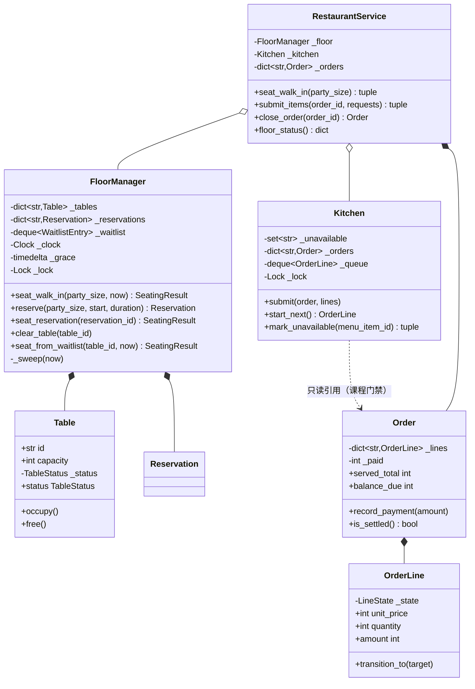

# 设计题解：餐厅管理（Restaurant Management）

## 题目与澄清

面试官的开场白："设计一个餐厅管理系统：客人来了要有位子坐，坐下点菜要送到后厨，做好了要端
上桌，吃完要能结账，还能拆着付。"这道题听上去像[[solution-food-delivery|外卖配送（Food
Delivery）]]的简化版——同样是"点菜 → 后厨 → 送达"，但**客人就坐在店里**这一件事，把整道题的
重心从"三方协调"搬到了"一张桌子的生命周期"和"一份账单怎么被切开"上。值得当场问出来的：

- **散客和预订是不是同一套入座逻辑？** 不是。散客要的是"现在有没有位子"，预订要的是"某个未来
  时段有没有位子"——后者必须在预订那一刻就把桌子锁定下来，否则"订到了却没桌子"这种投诉会天天
  发生。两者共用"挑最小的够坐的桌子"这条规则，但一个查的是"此刻谁空着"，一个查的是"那一段
  时间有没有人订"。
- **点单是按人头分，还是整桌一份？** 整桌一份——这是餐厅和外卖最大的结构差异。外卖一份订单
  对应一个收货地址、一个人；餐厅一张桌子上的所有人共享**同一份账单**，"分开付"是账单生成
  之后才发生的事，不是下单时就要决定的事。
- **一道菜没了怎么办：换一道，还是这一单失败？** 已经点进后厨的菜，缺货只影响**还没开始做**的
  那一份——不能因为后厨用完了一份食材，就把已经在锅里的菜也撤掉。本文选择"未开始的部分转为
  不可用，已开始的部分不受影响"，理由见下面的决策。
- **拆账要不要支持"先付一部分，后面又加了菜"？** 要，而且这是本题最容易被面试官单独追问的一
  条：一桌人先吃完开胃菜结了一半账，然后有人又点了甜点，账单必须能正确地继续往上加，而不是
  在"已经拆过一次"之后就锁死。
- **外带、外送算不算这道题的一部分？** 算，而且是第 4 关的验收点：它们要**复用**后厨那条流水
  线（同样要排队、同样要按课程顺序），但完全不涉及"桌子"这个概念。
- **预订了没来（no-show）怎么办？** 不能让这张桌子永远等下去。本文给每次预订配一个宽限期
  （grace period）：从预订的时段开始算，宽限期内桌子替这位客人留着，过了还没人认领就当
  不来了——桌子回到可分配的池子里，候位名单里的人立刻有机会顶上。

**范围之外**：真实支付网关与发票打印；拼桌（把两张小桌拼成一张大桌坐更多人）；预付费的
套餐菜单（prix fixe）；原材料级别的库存（本文只到"这道菜此刻能不能做"这一粒度，不拆到"还剩
几斤牛肉"）；外送的路径与骑手调度——那一整套在[[solution-food-delivery|外卖配送（Food
Delivery）]]里写全了，本文的外送只是"不占桌的一种点单"。

## 需求与分级

- **第 1 关（入座与候位，约 20 分钟）**：桌子按容量分级；散客来了挑坐得下的**最小**空桌；
  预订按时段提前锁定桌子；坐不下时进候位名单，先到先得，但空出桌子时要跳过坐不下的、服务
  队伍里第一个坐得下的。对应 `Table`、`TableStatus`、`FloorManager`、`Reservation`、
  `WaitlistEntry`、`SeatingResult`。
- **第 2 关（点单与拆账，约 20 分钟）**：菜送进后厨，每道菜有自己的状态（已下单、制作中、
  已备好、已上桌）；账单是**已上桌**的菜的总和；拆账支持平摊、按菜、按份额三种方式，取整的
  余数分配必须是确定的；一桌人先付一部分、之后又点了菜，账单要能继续正确增长。对应
  `LineState`、`OrderLine`、`Order`、`split_even`/`split_by_share`/`split_by_item`。
- **第 3 关（后厨队列，约 15 分钟）**：后厨是一条队列，课程有先后——开胃菜必须先于主菜就绪；
  一道菜中途没货了，还没开始做的那部分要能被撤下来，而不是让顾客干等一份永远做不出来的菜；
  前厅要能看到"哪张桌子还在等哪些菜"。对应 `Kitchen`、`RestaurantService.floor_status`。
- **第 4 关（外带与外送，选做）**：不占桌的点单走同一条后厨流水线。验收标准是**加它不碰
  `FloorManager` 一行代码**。对应 `OrderKind`、`open_takeaway_order`/`open_delivery_order`。

## 核心对象与职责

- **`Table`** — 一张桌子：容量不变，占用状态在 `FREE`/`OCCUPIED` 间转移。它自己守着"不能
  重复占用、不能重复清空"这条不变量——这是全题里最小的一台状态机，但道理和更复杂的状态机
  一样：非法转移必须报错，不能靠调用方自觉。
- **`FloorManager`** — 前厅：桌位分配、按时段预订、候位名单，以及没人认领的预订过了宽限期
  自动让位。它只回答"这一刻该给谁哪张桌子"，不知道点单和后厨的存在。
- **`Reservation`** — 一次预订：绑定在下单那一刻就选定的桌子和半开时间区间上。
- **`WaitlistEntry`** / **`SeatingResult`** — 候位记录，与一次入座尝试的结果（坐下了给桌号，
  没坐下给候位号）。都是不可变的小记录，没有行为。
- **`OrderLine`** — 点单里的一行：数量、下单那一刻的价格快照、以及它自己的状态机
  （`ORDERED → PREPARING → READY → SERVED`，外加 `UNAVAILABLE` 这条缺货分支）。它是[[structure.state-machines|状态机（State Machines）]]在这道题里唯一有实质内容的落点。
- **`Order`** — 一张点单：堂食挂在一张桌子上，外带/外送不挂桌。它唯一的不变量是**账单只算
  已上桌的菜**——`served_total` 是对 `OrderLine.state` 的一次查询，不是另存的一个数字。
- **`Kitchen`** — 后厨：一条队列，课程门禁（更早的课程必须先就绪），缺货处理。它不知道
  桌位，也不知道钱。
- **拆账三个函数** — `split_even`、`split_by_share`、`split_by_item`，纯函数，不持有状态。
- **`RestaurantService`** — 门面：把 `FloorManager`、`Kitchen`、点单管理编排到一起，是唯一
  一个同时知道"桌子"和"后厨"的类。

生命周期上，`RestaurantService` **组合** `Order`（随服务而生、随关单而"死"，虽然本文不做
真实删除）；**关联** `FloorManager` 与 `Kitchen`——两者由调用方构造并注入，各自持有自己的锁。
`Kitchen` 只**持有对 `Order` 的引用**（用来做课程门禁查询），不拥有它的生命周期。



## 关键设计决策

### 拆账为什么是三个函数，不是三个实现同一接口的类（这里拒绝一个模式）

拆账听上去很像策略模式（Strategy）的教科书场景——"平摊""按份额""按菜"是三种可以互换的算法，
很容易写成：

```python
# 选项 1：一个 SplitStrategy 协议，三个实现类
class SplitStrategy(Protocol):
    def split(self, order: Order, **kwargs) -> Mapping[str, int]: ...

class EvenSplit:
    def split(self, order, payer_count): ...
class ByShareSplit:
    def split(self, order, shares): ...
class ByItemSplit:
    def split(self, order, assignment): ...
```

```python
# 选项 2：三个独立的纯函数（本文的选择）
def split_even(amount: int, payer_count: int) -> tuple[int, ...]: ...
def split_by_share(amount: int, shares: Sequence[int]) -> tuple[int, ...]: ...
def split_by_item(lines, assignment) -> Mapping[str, int]: ...
```

**策略模式值得用，是因为调用方在运行时需要把"选哪种算法"当成一个可以传递、替换、注入的值**——
比如[[solution-car-rental|租车（Car Rental）]]里"按天/按里程"计价，是在构造 `Vehicle` 时被
注入的，调用方自己不知道具体用的是哪个实现。这里完全不是这个形状：服务员点开收银界面，**人**
直接决定要平摊还是按份额——调用的是哪个函数，是当场的一次选择，从来不会被存下来、传来传去、
在运行时被替换。三个函数的参数形状也天差地别（`payer_count` 是整数，`shares` 是序列，
`assignment` 是映射），硬凑成同一个接口反而要么塞一堆 `**kwargs`、要么把三种语义压缩成一个
不达意的公共签名。**判据是：有没有一个"上下文"不知道具体算法、只知道接口、并在运行时替换实现？
没有，就不需要接口，三个能直接调用的函数比三个只有一个方法的类更诚实。**

三个函数还有一条共同的纪律：金额单位是分（整数），取整的余数用**最大余数法**（largest
remainder）而不是四舍五入——`split_by_share` 先按比例整除，再把因为取整损失掉的那几分钱，
按"损失得最多的人优先补"的顺序一分一分地补回去，全程只有整数除法和取模，不出现浮点数，
也就不会出现"两次运行同样的输入，因为浮点误差给出不同结果"这种不确定性。

### 账单只认"已上桌"的菜，而不是"已点"的菜

朴素的做法是下单时就把总价定下来（"这一单一共 XX 元"），后续只是往下扣：

```python
# 选项 1：下单时锁定总额
def submit_items(self, order_id, requests):
    order.total += sum(price * qty for ...)   # 一次性加进"总账"
```

```python
# 选项 2：账单是对已上桌的行的实时查询（本文的选择）
@property
def served_total(self) -> int:
    return sum(l.amount for l in self._lines.values() if l.state is LineState.SERVED)
```

选项 1 在这道题里会直接崩掉三件事：一道菜后厨做不出来被标记缺货，总账要不要减？顾客先付了
一半，之后又点了甜点，"总额"到底是加订单开始时的数字，还是要重新算？拆账的时候，一道还在
锅里、根本没端上桌的菜，凭什么已经被算进了要平摊的钱里？选项 2 一次性回答了全部三个问题：
**总额从来不是一个被写入、被累加的字段，而是对 `OrderLine.state` 的一次现场查询。** 缺货的
菜状态是 `UNAVAILABLE`，天然不计入 `served_total`；先付一部分、后面加菜，`balance_due =
served_total - paid_total`，新菜一旦被端上桌，`served_total` 自动变大，`balance_due` 自动
跟着变大——**"先结一半账、再加菜"不需要任何专门为它设计的状态或分支**，它是"账单永远现算"
这条设计的自然推论。这也是本文选择让 `Order` 不做"关闭点单后不能再加菜"这类硬限制的原因：
只要还没真正 `close_order`，加菜永远合法。

### 候位重新入座：不是严格先到先得，是"跳过坐不下的，服务队伍里第一个坐得下的"

一张两人桌空出来了，候位名单队首是一桌四人、队伍第二位是一桌两人。严格 FIFO 会让两人那桌
继续等——而队首那四人无论如何也坐不进这张两人桌，让他们"挡在前面"没有任何意义：

```python
def seat_from_waitlist(self, table_id, now):
    for entry in self._waitlist:                 # 按到达顺序扫描
        if entry.party_size <= table.capacity:    # 跳过坐不下的，选第一个坐得下的
            self._waitlist.remove(entry)
            table.occupy()
            return SeatingResult(table.id, entry.id)
    return None
```

**这不是对公平性的妥协，是对"先到先得"这句承诺更准确的翻译。** 那桌四人的等待时间没有被
清零——他们仍然排在队伍最前面，一旦有一张四人以上的桌子空出来，第一个被服务的还是他们；
"跳过"只发生在这一次、这一张具体的桌子上。真实餐厅的host台就是这么运作的，而不是让一桌
四人无限期地占着候位队首、逼小桌的客人也跟着空等。这条策略和[[solution-food-delivery|外卖
配送]]里"批次合并只留一条不等式"是同一种判断力：**把业务上真正承诺的东西讲清楚，而不是
选一个实现起来最简单、但说不出该不该这样做的规则。**

### 预订没人认领怎么让桌子重新可用：懒惰重算，还是一个定时器

一次预订被"忘记"（客人没来，也没打电话取消）之后，这张桌子迟早要能重新分配出去，否则它会
一直挡在 `FloorManager._reservations` 里，不但没人能坐这张桌子的这个时段，连**以后**同一张
桌子的同一个时段也永远订不出去——`_overlaps` 会一直认为它被占着。两种做法：

```python
# 选项 1：一个后台线程或定时任务，隔一段时间扫一遍 _reservations
# → 需要一个新的并发实体（线程/任务队列），有自己的生命周期要管理
# → 系统没有任何请求进来的时候，它也在空转
```

```python
# 选项 2：懒惰重算——每一次读或写都先把世界推到当前时刻（本文的选择）
def _sweep(self, now: datetime) -> None:
    expired = [r for r in self._reservations.values() if now >= r.start + self._grace]
    for r in expired:
        del self._reservations[r.id]
        ...
```

选项 1 要多养一个并发实体：它需要自己的启动和停止时机、需要决定扫描间隔（太密浪费 CPU，
太疏则"过期"和"真的被清理"之间有一段说不清的窗口），而且它随时可能和一次正常的
`seat_walk_in` 同时改 `_reservations`，多一处需要证明没有数据竞争的地方。选项 2（和
[[structure.storage|内存持久化（In-Memory Persistence）]]这类问题里"惰性过期"的标准做法
一致，[[solution-hotel-booking|酒店预订]]的取消库存、图书馆借还的取书架超时都是同一个
模式）不需要定时器、不需要后台线程：**没有人查询的时候，这个预订过期与否根本不重要**；
任何一次会用到 `_reservations` 的读或写——`seat_walk_in`、`reserve`、`seat_reservation`、
`clear_table`、`table`、`waitlist_length`——都会先调用 `_sweep(now)`，把状态推到"此刻应该
是什么样子"。这也是为什么 `FloorManager` 这次要自己持有一个 `Clock`：懒惰重算需要在**每
一个**入口知道现在几点，而不只是在 `seat_walk_in` 这一个方法里，把 `now` 当参数传进来已经
不够用了。

**"桌子回到池子里"具体发生在哪一行？** 过期的预订被删掉之后，`_smallest_free_fit`（挑给
散客的桌子）和 `seat_from_waitlist`（挑给候位名单的桌子）都不再把这张桌子当成"被预订占着"
——它们靠 `_held` 判断一张桌子此刻是不是正被一个还在宽限期内的预订占用，预订一旦被清掉，
`_held` 自然返回 `False`。`_sweep` 顺手做的最后一件事，是在清掉预订的**同一次加锁里**试着
把这张刚刚空出来的桌子给候位名单里排在最前面、坐得下的那一位——这正是"候位名单有机会顶上"
这句承诺的完整实现，不需要调用方额外做任何事。

### 课程门禁：一条通用的"课程序号更小者优先"规则，而不是硬编码"starter 特判 main"

题目原话是"开胃菜必须先于主菜"，最直接的翻译是给 `Kitchen` 写一个 `if line.course ==
MAIN and not all_starters_ready: skip`。这个 `if` 只对两道课程成立，题目一旦扩展出甜点
（这道题确实需要——`Course` 有三个成员），就要再加一个 `if line.course == DESSERT and
not all_mains_ready`，课程越多，特判越多，而且没人能保证两条 `if` 之间互相不矛盾。本文把
课程建模成一个**有大小关系的序数**（`Course.STARTER = 1 < MAIN = 2 < DESSERT = 3`），门禁
规则只有一条：

```python
def _eligible(self, line: OrderLine) -> bool:
    order = self._orders[line.order_id]
    return all(sib.state in (READY, SERVED, UNAVAILABLE)
              for sib in order.lines if sib.course.value < line.course.value)
```

"课程序号更小的兄弟菜，都已经就绪或到了终态"——这一条规则同时管住了"开胃菜先于主菜"和
"主菜先于甜点"，加多少道课程都不用改一行 `Kitchen` 的代码，只需要在 `Course` 里多加一个
枚举成员。**这是把"两两特判"抽象成"偏序关系"的一个典型例子：当规则的本质是"谁必须排在谁
前面"，用一个可比较的数字表达它，比用条件分支枚举每一对关系更短，也更不容易漏掉一对。**

## 代码走读

整份实现如下。读的时候盯住四处：`FloorManager._smallest_free_fit` 与
`seat_from_waitlist` 里"挑最小/挑第一个坐得下的"那两行选择逻辑、`Order.served_total` 那一次
现场查询、`Kitchen._eligible` 那条课程序号比较、以及 `split_by_share` 里的最大余数法。

%% code:begin solution.py %%
```python
"""餐厅管理（Restaurant Management）——入座与候位、点单到后厨的状态机、结账拆单的参考实现。

核心思路：这道题有三条互相独立的流水线，但很多答案把它们绞在一起。**入座**（`FloorManager`）
只回答"这一刻哪张桌子是空的、该给谁"；**点单**（`OrderLine`/`Order`）只回答"这道菜现在在哪一步、
账单该算多少"；**后厨**（`Kitchen`）只回答"下一道该做哪道菜"。三者由 `RestaurantService` 这个
门面编排，谁都不知道另外两个的实现细节。账单只认**已经上桌**的菜——`Order.served_total` 是对
`OrderLine.state` 的一次查询，不是另存的一个数字，所以"先付一部分、再加菜"不需要任何特殊状态：
加的菜一旦上桌，余额自然重新变大。拆账（平摊/按菜/按份额）是三个纯函数，不是三个类的
策略模式——它们没有状态，也不会在运行时被换来换去。菜品缺货用整数最小货币单位（分）计价，
一律不用浮点数；拆账里的取整余数用最大余数法（largest remainder）逐分整数分配，不用浮点。
"""

from __future__ import annotations

import itertools
import threading
from collections import deque
from collections.abc import Iterable, Mapping, Sequence
from dataclasses import dataclass
from datetime import datetime, timedelta
from enum import Enum
from typing import Callable

Clock = Callable[[], datetime]


# --------------------------------------------------------------------------
# 失败路径：把"没有这个对象""状态机走不通""结不了账"分开，方便调用方分别处理。


class RestaurantError(Exception):
    """本设计里所有失败路径的公共基类。"""

class UnknownTableError(RestaurantError):
    """桌号不存在。"""

class UnknownOrderError(RestaurantError):
    """点单号，或点单里的某一行菜号，不存在。"""

class UnknownReservationError(RestaurantError):
    """预订号不存在，或已经被使用过。"""

class TableOccupiedError(RestaurantError):
    """这张桌子已经坐着人，不能重复入座。"""

class NoTableAvailableError(RestaurantError):
    """没有任何一张桌子能在这个时段坐下这么多人。"""

class ItemUnavailableError(RestaurantError):
    """点的菜里有一道（或多道）此刻做不了。"""

class IllegalLineTransitionError(RestaurantError):
    """这道菜的状态机里根本没有这条边。"""

class SplitMismatchError(RestaurantError):
    """拆账的参数和账单对不上：份额非法，或者按菜分账没有覆盖每一件已上桌的菜。"""

class SettlementError(RestaurantError):
    """这张单还没结清，或者还有菜在路上，不能关单清台。"""


# --------------------------------------------------------------------------
# 菜单与桌位：不可变的规则数据，和会变的运行状态分开。


class Course(Enum):
    """菜的课程序号；数字越小越先做——用大小关系表达"谁必须等谁"，不必逐一列出课程对。"""

    STARTER = 1
    MAIN = 2
    DESSERT = 3


@dataclass(frozen=True, slots=True)
class MenuItem:
    """菜单上的一道菜：单价（分）与课程。不带"还有没有货"——那是后厨此刻的库存状态。"""

    id: str
    name: str
    price: int
    course: Course


class TableStatus(Enum):
    """一张桌子只有两个状态：空着，或坐着人。"""

    FREE = "free"
    OCCUPIED = "occupied"


class Table:
    """一张桌子：容量固定不变，占用状态可以转移。重复占用或释放空桌都是设计错误，必须报错。"""

    def __init__(self, table_id: str, capacity: int) -> None:
        self.id = table_id
        self.capacity = capacity
        self._status = TableStatus.FREE

    @property
    def status(self) -> TableStatus:
        """当前状态；只读，改法只有 `occupy`/`free` 这两条受检的边。"""
        return self._status

    def occupy(self) -> None:
        if self._status is not TableStatus.FREE:
            raise TableOccupiedError(f"table {self.id} is already occupied")
        self._status = TableStatus.OCCUPIED

    def free(self) -> None:
        if self._status is not TableStatus.OCCUPIED:
            raise TableOccupiedError(f"table {self.id} is already free")
        self._status = TableStatus.FREE


@dataclass(frozen=True, slots=True)
class Reservation:
    """一次预订：绑定在下单那一刻就选好的桌子和时段上。"""

    id: str
    table_id: str
    party_size: int
    start: datetime
    duration: timedelta

    @property
    def end(self) -> datetime:
        return self.start + self.duration


@dataclass(frozen=True, slots=True)
class WaitlistEntry:
    """候位名单上的一条记录：谁、几个人、什么时候排的队。"""

    id: str
    party_size: int
    joined_at: datetime


@dataclass(frozen=True, slots=True)
class SeatingResult:
    """一次入座尝试的结果：坐下了给桌号，没坐下给候位号，两者恰好一个非空。"""

    table_id: str | None
    waitlist_id: str | None


# --------------------------------------------------------------------------
# FloorManager：桌位、预订与候位名单。只管"这一刻该给谁哪张桌子"，不知道点单和后厨。


class FloorManager:
    """前厅：桌位分配、按时段预订、候位名单。三样共用一把锁，因为它们会互相影响空桌判断。

    预订过了宽限期还没人来认领，就当是不来了：`_sweep` 在每一次读写之前把这类"鸽子"预订
    清掉，没有定时器、没有后台线程——没人查询的时候，过期与否无人关心；任何一次查询或操作
    都会先把世界推到当前时刻的正确状态（和图书馆那道题的 `_sweep` 是同一个模式）。
    """

    def __init__(self, clock: Clock, grace: timedelta = timedelta(minutes=30)) -> None:
        self._clock = clock
        self._grace = grace
        self._tables: dict[str, Table] = {}
        self._reservations: dict[str, Reservation] = {}
        self._waitlist: deque[WaitlistEntry] = deque()
        self._lock = threading.Lock()
        self._ids = itertools.count(1)

    def add_table(self, table: Table) -> None:
        with self._lock:
            self._tables[table.id] = table

    def table(self, table_id: str) -> Table:
        with self._lock:
            self._sweep(self._clock())
            found = self._tables.get(table_id)
        if found is None:
            raise UnknownTableError(f"unknown table {table_id!r}")
        return found

    @property
    def waitlist_length(self) -> int:
        """候位名单长度——只给计数，不把队列交出去。"""
        with self._lock:
            self._sweep(self._clock())
            return len(self._waitlist)

    @property
    def reservation_count(self) -> int:
        """还没被认领、也没过宽限期的预订数——验证过期的预订真的会让这张表缩小。"""
        with self._lock:
            self._sweep(self._clock())
            return len(self._reservations)

    def _smallest_free_fit(self, party_size: int, now: datetime) -> Table | None:
        free = [t for t in self._tables.values()
                if t.status is TableStatus.FREE and t.capacity >= party_size
                and not self._held(t.id, now)]
        return min(free, key=lambda t: (t.capacity, t.id), default=None)

    def _held(self, table_id: str, now: datetime) -> bool:
        """这张桌子此刻是不是正被一个还在宽限期内、没被认领的预订占着。"""
        return any(r.table_id == table_id and r.start <= now < r.start + self._grace
                   for r in self._reservations.values())

    def seat_walk_in(self, party_size: int, now: datetime) -> SeatingResult:
        """散客到店：挑坐得下这拨人的最小空桌；坐不下就按到达顺序进候位名单。"""
        with self._lock:
            self._sweep(now)
            table = self._smallest_free_fit(party_size, now)
            if table is not None:
                table.occupy()
                return SeatingResult(table.id, None)
            entry = WaitlistEntry(f"W{next(self._ids)}", party_size, now)
            self._waitlist.append(entry)
            return SeatingResult(None, entry.id)

    def reserve(self, party_size: int, start: datetime, duration: timedelta) -> Reservation:
        """按时段预订：在能坐下这拨人的桌子里，挑那一段时间还没被占用的最小一张。"""
        with self._lock:
            self._sweep(self._clock())
            candidates = sorted((t for t in self._tables.values() if t.capacity >= party_size),
                                key=lambda t: (t.capacity, t.id))
            for table in candidates:
                if not self._overlaps(table.id, start, duration):
                    reservation = Reservation(f"R{next(self._ids)}", table.id, party_size,
                                              start, duration)
                    self._reservations[reservation.id] = reservation
                    return reservation
            raise NoTableAvailableError(f"no table fits a party of {party_size} for that slot")

    def _overlaps(self, table_id: str, start: datetime, duration: timedelta) -> bool:
        end = start + duration
        return any(r.table_id == table_id and start < r.end and r.start < end
                   for r in self._reservations.values())

    def seat_reservation(self, reservation_id: str) -> SeatingResult:
        """预订到场：占用当初绑定的那张桌。桌子若仍被占用（前一批还没清台）直接报错，不代为等待。

        过了宽限期才来的客人，预订已经被 `_sweep` 清掉、桌子可能已经转给了别人——这里会像
        预订号真的不存在一样报 `UnknownReservationError`，这正是宽限期这条规则的字面意思。
        """
        with self._lock:
            self._sweep(self._clock())
            reservation = self._reservations.get(reservation_id)
            if reservation is None:
                raise UnknownReservationError(f"unknown reservation {reservation_id!r}")
            table = self._tables[reservation.table_id]
            table.occupy()
            del self._reservations[reservation_id]
            return SeatingResult(table.id, None)

    def clear_table(self, table_id: str) -> None:
        """清台：桌子回到空闲。谁来坐它是下一步 `seat_from_waitlist` 的事，这里不自动接手。"""
        with self._lock:
            self._sweep(self._clock())
            table = self._tables.get(table_id)
            if table is None:
                raise UnknownTableError(f"unknown table {table_id!r}")
            table.free()

    def seat_from_waitlist(self, table_id: str, now: datetime) -> SeatingResult | None:
        """刚清出来的桌子，看候位名单里最早一个坐得下的人——不是队首，是队首往后第一个坐得下的。"""
        with self._lock:
            self._sweep(now)
            table = self._tables.get(table_id)
            if table is None or table.status is not TableStatus.FREE or self._held(table_id, now):
                return None
            return self._seat_from_waitlist_locked(table, now)

    def _seat_from_waitlist_locked(self, table: Table, now: datetime) -> SeatingResult | None:
        """必须已经在锁内、且调用方已经确认桌子确实空闲可用。"""
        for entry in self._waitlist:
            if entry.party_size <= table.capacity:
                self._waitlist.remove(entry)
                table.occupy()
                return SeatingResult(table.id, entry.id)
        return None

    def _sweep(self, now: datetime) -> None:
        """懒惰过期：把过了宽限期还没被认领的预订清掉，桌子回到候位名单的候选池里。

        不清掉的话，这条预订会永远占着 `_overlaps` 的一个位置——这张桌子这个时段以后谁都
        订不到；清掉之后立刻看一眼候位名单里有没有人能顶上，这就是"桌子回到池子里、候位
        名单有机会顶上"这句承诺的全部实现。
        """
        expired = [r for r in self._reservations.values() if now >= r.start + self._grace]
        for r in expired:
            del self._reservations[r.id]
            table = self._tables.get(r.table_id)
            if table is not None and table.status is TableStatus.FREE:
                self._seat_from_waitlist_locked(table, now)


# --------------------------------------------------------------------------
# 点单：每一行菜自己的状态机，账单从状态里现算，不另存一份。


class OrderKind(Enum):
    """一张点单属于三种流水线之一；后厨和拆账逻辑对三者一视同仁。"""

    DINE_IN = "dine_in"
    TAKEAWAY = "takeaway"
    DELIVERY = "delivery"


class LineState(Enum):
    """一道菜从下单到上桌的四步，外加"做不了了"这一条终态。"""

    ORDERED = "ordered"
    PREPARING = "preparing"
    READY = "ready"
    SERVED = "served"
    UNAVAILABLE = "unavailable"


LINE_TRANSITIONS: Mapping[LineState, frozenset[LineState]] = {
    LineState.ORDERED: frozenset({LineState.PREPARING, LineState.UNAVAILABLE}),
    LineState.PREPARING: frozenset({LineState.READY}),
    LineState.READY: frozenset({LineState.SERVED}),
    LineState.SERVED: frozenset(),
    LineState.UNAVAILABLE: frozenset(),
}


class OrderLine:
    """点单里的一行：数量、下单那一刻的价格快照、以及它在后厨的状态机。"""

    def __init__(self, line_id: str, order_id: str, menu_item: MenuItem, quantity: int) -> None:
        self.id = line_id
        self.order_id = order_id
        self.menu_item_id = menu_item.id
        self.name = menu_item.name
        self.course = menu_item.course
        self.unit_price = menu_item.price
        self.quantity = quantity
        self._state = LineState.ORDERED

    @property
    def state(self) -> LineState:
        return self._state

    @property
    def amount(self) -> int:
        """这一行的小计，单位是分。"""
        return self.unit_price * self.quantity

    def transition_to(self, target: LineState) -> None:
        if target not in LINE_TRANSITIONS[self._state]:
            raise IllegalLineTransitionError(
                f"line {self.id}: {self._state.value} -> {target.value} is not a transition")
        self._state = target


class Order:
    """一张点单：堂食挂在一张桌上，外带/外送则不挂桌。账单只认已经上桌的菜。"""

    def __init__(self, order_id: str, kind: OrderKind, table_id: str | None) -> None:
        self.id = order_id
        self.kind = kind
        self.table_id = table_id
        self._lines: dict[str, OrderLine] = {}
        self._paid = 0

    @property
    def lines(self) -> tuple[OrderLine, ...]:
        """点单里所有行的不可变快照。"""
        return tuple(self._lines.values())

    def add_line(self, line: OrderLine) -> None:
        self._lines[line.id] = line

    def discard_line(self, line_id: str) -> None:
        """撤掉还没提交成功的一行——后厨拒收时用来整批回滚，不留半张单。"""
        self._lines.pop(line_id, None)

    def line(self, line_id: str) -> OrderLine:
        found = self._lines.get(line_id)
        if found is None:
            raise UnknownOrderError(f"unknown line {line_id!r} on order {self.id}")
        return found

    @property
    def served_total(self) -> int:
        """账单金额：只认已经上桌的菜——没上的菜顾客还没拿到，不该先收钱。"""
        return sum(l.amount for l in self._lines.values() if l.state is LineState.SERVED)

    @property
    def paid_total(self) -> int:
        return self._paid

    @property
    def balance_due(self) -> int:
        """还差多少钱。加菜、再上桌都会让它重新变大——不需要任何"追加账单"的特殊状态。"""
        return self.served_total - self._paid

    def record_payment(self, amount: int) -> None:
        if amount <= 0:
            raise SplitMismatchError("付款金额必须为正")
        self._paid += amount

    def pending_lines(self) -> tuple[OrderLine, ...]:
        """还没有走到终态（上桌或缺货）的行——前厅想知道"这一桌还在等什么"就问这个。"""
        return tuple(l for l in self._lines.values()
                     if l.state not in (LineState.SERVED, LineState.UNAVAILABLE))

    def is_settled(self) -> bool:
        return self.balance_due <= 0 and not self.pending_lines()


# --------------------------------------------------------------------------
# 后厨：一条队列，课程顺序与库存。不知道桌位，也不知道钱。


class Kitchen:
    """后厨：点单进来的菜排成一条队列，课程序号更小的必须先就绪，缺货整批拒收。"""

    def __init__(self) -> None:
        self._unavailable: set[str] = set()
        self._orders: dict[str, Order] = {}
        self._queue: deque[OrderLine] = deque()
        self._lock = threading.Lock()

    def submit(self, order: Order, lines: Sequence[OrderLine]) -> None:
        """把一批菜下厨：校验有没有货和真正入队在同一次加锁里完成，不留缝。"""
        with self._lock:
            missing = sorted({l.menu_item_id for l in lines} & self._unavailable)
            if missing:
                raise ItemUnavailableError(f"items no longer available: {missing}")
            self._orders[order.id] = order
            self._queue.extend(lines)

    def _eligible(self, line: OrderLine) -> bool:
        """某道菜能开始做的条件：同一单里课程序号更小的菜，都已经就绪或到了终态。"""
        order = self._orders[line.order_id]
        return all(sib.state in (LineState.READY, LineState.SERVED, LineState.UNAVAILABLE)
                  for sib in order.lines if sib.course.value < line.course.value)

    def start_next(self) -> OrderLine | None:
        """从队首找第一道"该做"的菜：还在排队、且前置课程已经就绪。跳过的菜留在原位置等下一轮。"""
        with self._lock:
            for line in self._queue:
                if line.state is LineState.ORDERED and self._eligible(line):
                    self._queue.remove(line)
                    line.transition_to(LineState.PREPARING)
                    return line
            return None

    def mark_ready(self, line: OrderLine) -> None:
        line.transition_to(LineState.READY)

    def mark_unavailable(self, menu_item_id: str) -> tuple[OrderLine, ...]:
        """后厨中途宣布这道菜没了：还没开始做的同款菜全部转缺货，已经在做/做好的不受影响。"""
        with self._lock:
            self._unavailable.add(menu_item_id)
            affected = [l for l in self._queue
                       if l.menu_item_id == menu_item_id and l.state is LineState.ORDERED]
            for line in affected:
                line.transition_to(LineState.UNAVAILABLE)
                self._queue.remove(line)
            return tuple(affected)

    def restock(self, menu_item_id: str) -> None:
        with self._lock:
            self._unavailable.discard(menu_item_id)

    def forget_order(self, order_id: str) -> None:
        """点单结清关闭后，后厨不再需要为它做课程门禁查询——删掉这条索引，防止无限增长。"""
        with self._lock:
            self._orders.pop(order_id, None)

    @property
    def queue_length(self) -> int:
        """还排着队的菜数——只给计数，验证它确实会随 `start_next` 缩小。"""
        with self._lock:
            return len(self._queue)

    @property
    def known_order_count(self) -> int:
        """后厨此刻还记着多少张点单——验证 `forget_order` 真的会让这张表缩小。"""
        with self._lock:
            return len(self._orders)


# --------------------------------------------------------------------------
# 拆账：三个纯函数，不是三个类。金额单位一律是分，取整用最大余数法。


def split_even(amount: int, payer_count: int) -> tuple[int, ...]:
    """平摊：整除的余数（分）按顺序发给前几位付款人，谁付多一分是确定的，不是谁抢到算谁的。"""
    if payer_count <= 0:
        raise SplitMismatchError("拆分人数必须大于 0")
    if amount < 0:
        raise SplitMismatchError("金额不能为负")
    base, remainder = divmod(amount, payer_count)
    return tuple(base + (1 if i < remainder else 0) for i in range(payer_count))


def split_by_share(amount: int, shares: Sequence[int]) -> tuple[int, ...]:
    """按份额拆：先按比例整数除，再把因取整丢掉的分，按"丢得最多的人优先"补回去（最大余数法）。"""
    if not shares or any(s <= 0 for s in shares):
        raise SplitMismatchError("份额必须是正整数")
    total_shares = sum(shares)
    scaled = [amount * s for s in shares]
    floors = [v // total_shares for v in scaled]
    remainders = [v % total_shares for v in scaled]
    leftover = amount - sum(floors)
    order = sorted(range(len(shares)), key=lambda i: (-remainders[i], i))
    for i in order[:leftover]:
        floors[i] += 1
    return tuple(floors)


def split_by_item(lines: Sequence[OrderLine], assignment: Mapping[str, tuple[str, ...]]
                   ) -> Mapping[str, int]:
    """按菜拆：每位付款人认领若干行菜号，必须恰好覆盖每一件已上桌的菜——不多不少。"""
    servable = {l.id: l for l in lines if l.state is LineState.SERVED}
    assigned_ids = [line_id for ids in assignment.values() for line_id in ids]
    if sorted(assigned_ids) != sorted(servable):
        raise SplitMismatchError("按菜分账必须覆盖且只覆盖每一件已上桌的菜，不能重复或遗漏")
    return {payer: sum(servable[line_id].amount for line_id in ids)
           for payer, ids in assignment.items()}


# --------------------------------------------------------------------------
# RestaurantService：门面。入座、点单、上菜、结账拆单、外带外送。


class RestaurantService:
    """餐厅：入座与候位、点单进后厨、上菜、结账；外带外送走同一条点单流水线，不碰桌位。"""

    def __init__(self, clock: Clock, floor: FloorManager, kitchen: Kitchen) -> None:
        self._clock, self._floor, self._kitchen = clock, floor, kitchen
        self._menu: dict[str, MenuItem] = {}
        self._orders: dict[str, Order] = {}
        self._lock = threading.RLock()
        self._ids = itertools.count(1)

    def add_menu_item(self, item: MenuItem) -> None:
        with self._lock:
            self._menu[item.id] = item

    def order(self, order_id: str) -> Order:
        with self._lock:
            found = self._orders.get(order_id)
        if found is None:
            raise UnknownOrderError(f"unknown order {order_id!r}")
        return found

    # ---- 第 1 关：入座与候位 ------------------------------------------------

    def seat_walk_in(self, party_size: int) -> tuple[Order | None, str | None]:
        """散客到店。坐下了返回新开的点单；坐不下返回候位号，此时点单是 `None`。"""
        result = self._floor.seat_walk_in(party_size, self._clock())
        if result.table_id is None:
            return None, result.waitlist_id
        return self._open_order(OrderKind.DINE_IN, result.table_id), None

    def reserve(self, party_size: int, start: datetime, duration: timedelta) -> Reservation:
        return self._floor.reserve(party_size, start, duration)

    def seat_reservation(self, reservation_id: str) -> Order:
        """预订到场：占桌，并立刻开一张挂在这张桌上的点单。"""
        result = self._floor.seat_reservation(reservation_id)
        assert result.table_id is not None
        return self._open_order(OrderKind.DINE_IN, result.table_id)

    def reseat_waitlist(self, table_id: str) -> Order | None:
        """桌子清出来之后，看候位名单里有没有坐得下的人；有就直接开新单。"""
        result = self._floor.seat_from_waitlist(table_id, self._clock())
        if result is None:
            return None
        assert result.table_id is not None
        return self._open_order(OrderKind.DINE_IN, result.table_id)

    def open_takeaway_order(self) -> Order:
        """外带单：不占任何桌。第 4 关——这个方法之外，桌位相关的代码一行没动。"""
        return self._open_order(OrderKind.TAKEAWAY, None)

    def open_delivery_order(self) -> Order:
        """外送单：同样不占桌，走的是和外带一模一样的后厨流水线。"""
        return self._open_order(OrderKind.DELIVERY, None)

    def _open_order(self, kind: OrderKind, table_id: str | None) -> Order:
        with self._lock:
            order = Order(f"O{next(self._ids)}", kind, table_id)
            self._orders[order.id] = order
            return order

    # ---- 第 2 关：点单、上菜、结账拆单 --------------------------------------

    def submit_items(self, order_id: str, requests: Sequence[tuple[str, int]]
                     ) -> tuple[OrderLine, ...]:
        """点单：一次性提交若干道菜，任何一道缺货就整批失败，不留下半提交的行。"""
        with self._lock:
            order = self.order(order_id)
            items = [self._menu_item(menu_item_id) for menu_item_id, _ in requests]
            lines = tuple(OrderLine(f"L{next(self._ids)}", order.id, item, qty)
                          for item, (_, qty) in zip(items, requests))
            for line in lines:
                order.add_line(line)
            try:
                self._kitchen.submit(order, lines)
            except ItemUnavailableError:
                for line in lines:
                    order.discard_line(line.id)
                raise
            return lines

    def _menu_item(self, menu_item_id: str) -> MenuItem:
        item = self._menu.get(menu_item_id)
        if item is None:
            raise ItemUnavailableError(f"unknown menu item {menu_item_id!r}")
        return item

    def start_next_in_kitchen(self) -> OrderLine | None:
        return self._kitchen.start_next()

    def mark_ready(self, order_id: str, line_id: str) -> OrderLine:
        line = self.order(order_id).line(line_id)
        self._kitchen.mark_ready(line)
        return line

    def serve(self, order_id: str, line_id: str) -> OrderLine:
        """服务员把做好的菜端上桌：READY -> SERVED。这一步之后这道菜才计入账单。"""
        line = self.order(order_id).line(line_id)
        line.transition_to(LineState.SERVED)
        return line

    def mark_unavailable(self, menu_item_id: str) -> tuple[OrderLine, ...]:
        return self._kitchen.mark_unavailable(menu_item_id)

    def record_payment(self, order_id: str, amount: int) -> None:
        self.order(order_id).record_payment(amount)

    def close_order(self, order_id: str) -> Order:
        """结账关闭点单：必须已经付清、且没有还在流转的菜。堂食单会顺带清出桌子。"""
        with self._lock:
            order = self.order(order_id)
            if not order.is_settled():
                raise SettlementError(f"order {order_id} is not settled or still has pending items")
            if order.kind is OrderKind.DINE_IN and order.table_id is not None:
                self._floor.clear_table(order.table_id)
            self._kitchen.forget_order(order.id)
            return order

    def floor_status(self) -> Mapping[str, tuple[OrderLine, ...]]:
        """哪些桌子还在等哪些菜——从各自的点单里现算，不另存一份会走样的副本。"""
        with self._lock:
            return {o.table_id: o.pending_lines() for o in self._orders.values()
                   if o.kind is OrderKind.DINE_IN and o.table_id is not None and o.pending_lines()}


if __name__ == "__main__":
    from datetime import UTC

    now = datetime(2026, 9, 20, 18, 0, tzinfo=UTC)
    floor, kitchen = FloorManager(clock=lambda: now), Kitchen()
    for table_id, capacity in (("T1", 2), ("T2", 4)):
        floor.add_table(Table(table_id, capacity))
    service = RestaurantService(clock=lambda: now, floor=floor, kitchen=kitchen)
    service.add_menu_item(MenuItem("m1", "沙拉", 1800, Course.STARTER))
    service.add_menu_item(MenuItem("m2", "牛排", 6800, Course.MAIN))

    order, waitlist_id = service.seat_walk_in(2)
    print(f"seated on {order.table_id if order else None}, waitlist {waitlist_id}")
    lines = service.submit_items(order.id, [("m1", 1), ("m2", 1)])
    started = service.start_next_in_kitchen()
    print(f"kitchen starts: {started.name} ({started.course.name})")
```
%% code:end %%

**`Table.occupy`/`free` 是全文最短的状态机，也最容易被忽略。** 它只有两个状态，但双向都做
了受检——重复占用、重复清空都会报 `TableOccupiedError`。真实系统里这条防线正是用来抓
"清台消息发了两次""入座请求并发到达同一张桌"这类真会发生的 bug，而不是可有可无的防御性编程。

**`FloorManager.seat_walk_in` 和 `reserve` 共享同一条"挑最小可用桌"的比较键**
`(t.capacity, t.id)`——容量优先，同容量按 id 兜底，保证结果在测试里是确定的，不依赖字典的
迭代顺序。`reserve` 多做的一件事是 `_overlaps`：只要同一张桌子在请求的时段内已经有别的预订，
这张桌子就不能再被选中，即便它此刻是空的——预订锁定的是"未来"，不是"现在"。

**`FloorManager` 的每一个公开方法开头都是同一行：`self._sweep(self._clock())` 或者
（`seat_walk_in`/`seat_from_waitlist` 已经收到 `now` 参数时）`self._sweep(now)`。** 这不是
重复代码，是"任何一次读写都先把世界推到当前时刻"这条承诺必须在**每一个**入口都兑现——漏掉
一个方法，那个方法就会读到一份可能包含了过期预订的、不自洽的状态。`_sweep` 清掉过期预订
之后，顺手在同一次加锁里调用 `_seat_from_waitlist_locked`，把刚刚因为预订过期而空出来的
桌子立刻给候位名单里排在最前面、坐得下的那一位——这一行是"候位名单有机会顶上"这句承诺的
全部实现，没有额外的分支或状态。

**`Kitchen.submit` 把"检查有没有货"和"真正入队"钉在同一次加锁里**，和[[solution-food-delivery|
外卖配送]]里 `Restaurant.quote` 的做法同源：校验和写入之间不留时间缝，否则会出现"检查通过、
下一毫秒后厨才把这道菜标成缺货"的竞态。`RestaurantService.submit_items` 在它外面又包了一层
"先把行加进 `Order`、后厨拒收就整批撤回"——`Order.discard_line` 是这道题里唯一一个"为了保证
原子性而存在"的方法，删除它，一次点单缺货就会在账本里留下永远不会被完成的幽灵行。

**`split_by_share` 不用浮点数。** `scaled = amount * shares[i]`、`floors[i] = scaled //
total_shares`、`remainders[i] = scaled % total_shares`——三步都是整数运算，`remainders`
直接就是最大余数法排序用的键，不需要先算浮点比例再减出小数部分，也就没有浮点误差会不会
累积成一分钱的问题。

**`close_order` 里那一行 `self._kitchen.forget_order(order.id)` 是补上的一个坑。** 早期
版本里 `Kitchen._orders` 只增不减——它存在的唯一理由是给 `_eligible` 查询兄弟菜的状态，
一旦一张点单结清关闭，后厨永远不会再为它做这个查询，继续留着就是一条会随点单数无限增长的
索引。修法很直接：`close_order` 只有在 `is_settled()`（不再有任何 `ORDERED`/`PREPARING`/
`READY` 的行）之后才会成功，这意味着此刻后厨队列里也一定没有这张单的任何一行，删掉
`_orders` 里的这一条是绝对安全的。`Kitchen.known_order_count` 把这条不变量暴露成一个只读
属性，测试断言它确实会随 `close_order` 变回零。对比之下，`Order._lines` 和
`RestaurantService._orders` **不**做同样的清理——它们是账本和点单的业务档案，客服第二天
还要能查到这张单吃了什么、什么时候结的账；`Kitchen._orders` 只是一份运行时的工作索引，
两者"要不要缩小"的判断依据完全不同，不能一概而论。

## 测试与自检

二十九个测试，按四关分组，每一组盯住一条设计承诺：

- **入座与候位**：散客挑到的是能坐下的最小桌；坐不下时进候位、`waitlist_length` 增加；
  预订绑定的是能坐下的最小桌，且会检查时段重叠——同一张桌子重叠时段订不到第二次，不重叠的
  时段可以；候位重新入座会跳过坐不下的一批，服务队伍里下一个坐得下的。
- **预订过期**：宽限期内没人认领的预订会挡住散客；过了宽限期，`reservation_count` 归零，
  散客能坐进去；单是查询 `waitlist_length` 就会先把世界推到当前时刻，让候位名单里坐得下的
  人自动顶上那张刚过期的桌子；对一个已经过期的预订号调用 `seat_reservation` 会像它根本
  不存在一样报 `UnknownReservationError`。
- **点单与账单**：提交的菜一开始都是 `ORDERED`；跳过中间状态直接标记 `SERVED` 会抛
  `IllegalLineTransitionError`；`served_total` 只统计已上桌的行；先付清一道菜的钱、
  之后又点并上桌了一道新菜，`balance_due` 会重新变成新菜的价钱——这个断言直接量化了"账单
  永远现算"这条设计。
- **拆账**：`split_even` 的余数按索引顺序分给前几位，两次调用同样的输入给出同样的结果；
  `split_by_share` 的结果总和等于原始金额，且是确定性的；`split_by_item` 必须恰好覆盖每
  一件已上桌的菜，漏一件就报错。
- **结账**：没结清或还有菜在路上时 `close_order` 会抛 `SettlementError`；结清之后关单会
  把桌子清空。
- **后厨队列**：有开胃菜排在前面时，主菜不会被 `start_next` 选中；开胃菜就绪后主菜才变得
  可选；某道菜被标记缺货后，队列里同款、还没开始做的行转为 `UNAVAILABLE`，之后再点这道菜
  会被拒绝；缺货导致的批量提交失败**不会留下部分行**——`order.lines` 恢复成提交前的空集合。
- **前厅视图**：`floor_status()` 按桌号汇总还没走到终态的菜品行。
- **外带外送**：开一张外带单不会改变任何一张桌子的状态；外送单和堂食单共用同一条后厨队列。
- **并发**：八个线程同时抢八张两人桌，断言的是不变量——每张桌子恰好坐进一拨人，没有两个
  线程抢到同一张；六个线程同时从后厨拉取任务，六道菜恰好被拉取六次、没有重复。没有一句
  依赖线程调度顺序或计时。

**两分钟怎么给面试官演示**：跑 `python solution.py`。它开两张桌子、坐下一桌两人、点了一道
开胃菜和一道主菜，打印后厨优先开始做的是哪一道——答案永远是开胃菜，这正是第 3 关的证据。

## 扩展与追问

**新需求**

- *拼桌*：两张小桌临时合并成一张大桌。这会碰 `FloorManager`，但不碰 `Order` 或
  `Kitchen`——`Table` 需要一个"合并组"的概念，容量取合并后的和；本文没有实现它，是因为它
  会让 `_smallest_free_fit` 的比较键从单张桌子变成"桌子或桌子组"，值得单独展开成一道追问题
  而不是塞进已经很满的第 1 关。
- *会员积分与优惠券*：在 `close_order` 之后挂一个独立的记录，不该长在 `Order` 上——账单
  结清之后 `Order` 就是终态，不再变化，这是"终态"这个词的全部意义，和[[solution-food-delivery|
  外卖配送]]里"餐厅评分不挂在 `Order` 上"是同一个判据。
- *服务费/小费*：一个注入的普通函数 `(Order) -> int`，在 `close_order` 前调用一次，
  和[[patterns.strategy|策略模式与可替换算法（Strategy）]]的其它落点一样，这里也不需要
  抽象基类——它就是本文里"策略该不该做成类"那条决策的又一个正面例子（结算规则确实会在运行
  时被替换：会员和非会员适用不同的服务费函数）。

**并发与线程安全**

- *两把锁会不会死锁？* 不会：`RestaurantService` 持有自己的锁时会去调 `FloorManager` 和
  `Kitchen`，反向调用不存在，锁序只有一个方向。这条纪律靠约定维持，写进了每个类的文档
  字符串。
- *GIL 给了我什么？* 几乎什么都没给。`Table.occupy` 里"查状态 + 写状态"是两条字节码，
  `Kitchen.start_next` 里"扫队列 + 移除 + 转移状态"是更多条，都必须靠显式的锁，不能假设
  GIL 会让它们原子发生。
- *后厨的 `_eligible` 查询要不要加锁？* 它已经在 `start_next` 持有的 `Kitchen._lock` 里，
  查的是 `Order.lines`——`Order` 本身没有锁，这是刻意的：它只在 `RestaurantService` 或
  `Kitchen` 已经持锁的调用路径里被修改，没有第三条路径能绕开这两把锁直接改它。这个假设
  必须写在文档里，否则下一个维护者很容易在别处再加一个不受这两把锁保护的写入点。

**持久化与规模**

- *候位与后厨队列落库*：两者都是 `deque`，换成数据库里一张按插入顺序排序的表，
  `remove` 换成一次 `UPDATE ... WHERE id = ?`，接口不变。
- *预订的时段重叠检查*：`_overlaps` 现在是对这张桌子所有预订的线性扫描，单店足够；
  规模上来后换成按桌子分桶的区间树，只影响这一个方法——和[[solution-hotel-booking|
  酒店预订（Hotel Booking）]]里"多晚区间可订量"换数据结构是同一类扩展。
- *跨店*：`RestaurantService` 目前是单店门面；连锁餐厅只需要给它加一个 `restaurant_id`
  维度，`FloorManager`/`Kitchen` 按店分片，`Table`/`Order` 的 id 本身已经是全局唯一字符串，
  不需要改。

## 常见错误

- **把散客入座和预订入座写成两套互不相干的挑桌逻辑**，导致"挑最小的够坐的桌子"这条规则
  被实现了两遍、还可能不一致。
- **下单时就把总价锁定**，缺货、追加点菜、部分结账里的任何一种都会让这个数字对不上——账单
  应该永远是对当前状态的查询，不是一个被写入的字段。
- **候位严格按 FIFO 处理**，让一桌坐不下的大团体挡住所有后面坐得下的小团体。
- **预订被认领之后才从表里删掉，没人认领的预订永远留着**——`_overlaps` 会把它当成一直
  有效，这张桌子的这个时段以后谁都订不到；也没有人会想起给刚空出来的桌子看一眼候位名单。
- **给拆账的三种方式建一个只有一个调用方、且从不在运行时替换实现的公共接口**——这是把
  "可能有用的抽象"当成"现在就需要的抽象"，[[patterns.strategy|策略模式]]要解决的是运行时
  可替换性，不是"看起来像同一类操作"。
- **缺货时把整个订单都标记失败**，而不是只处理还没开始做的那部分——已经在锅里的菜没有理由
  被撤掉。
- **给课程顺序写"开胃菜特判主菜"的硬编码 `if`**，加一道新课程就要再加一条分支，而且两条
  分支之间的一致性没人保证。
- **Java 习惯**：`RestaurantService` 用 `__new__` 做单例（ashishps1 的参考实现就是这样
  写的）；`OrderLine` 写成带 `getStatus()`/`setStatus()` 的可变类而不是受检的
  `transition_to`；`MenuItem` 可变、价格能被后台随时改掉，导致历史账单跟着变。
- **金额用 `float`**，拆账时几分钱的误差会在很多桌之后累积成看得见的对不上账。

## 45 分钟怎么分配

- **0–5 分钟｜澄清。** 点出"整桌一份账单"和"散客/预订两条入座路径"这两个和常见变体不同
  的地方，把拼桌、原材料库存、真实支付明确排除在范围外。
- **5–13 分钟｜入座与桌位。** 画 `Table` 的两态状态机，写 `FloorManager.seat_walk_in`
  （强调"挑最小的够坐的桌子"）和候位名单；口头带过 `reserve` 的时段重叠检查。
- **13–24 分钟｜点单与状态机。** 写 `LineState` 的四步转移表、`OrderLine.transition_to`、
  `Order.served_total`。**一边写一边强调"账单是查询，不是字段"**——这十分钟决定了后面拆账
  和追加点菜能不能讲圆。
- **24–33 分钟｜拆账。** 写 `split_even`，口头讲清楚 `split_by_share` 的最大余数法在解决
  什么问题（取整的钱去哪了）；如果时间够，写 `split_by_item` 的覆盖性校验。
- **33–40 分钟｜后厨队列。** 写 `Kitchen._eligible` 那条课程序号比较，强调它为什么比
  "starter 特判 main"更好扩展；口头带过缺货处理。
- **40–45 分钟｜扩展口头化。** 外带外送不碰 `FloorManager`一句话说完；拼桌、会员积分、
  跨店分片各说一句"会改哪个类、不会碰哪个类"。

**时间不够时砍什么**：先砍 `split_by_item`（口头描述覆盖性校验），再砍预订的时段重叠检查
（口头说"这里要检查同一张桌子的预订区间有没有交叠"），最后砍候位重新入座的"跳过坐不下的"
细节。**永远不要砍掉的是账单只认已上桌的菜这条规则**：一个拆账写得很复杂、但账单在追加
点菜后算错了的答案，分数低于一个拆账只写了平摊、但账单查询逻辑完全正确的半成品。

## 来源与延伸

- [ashishps1/awesome-low-level-design — Restaurant Management System](https://github.com/ashishps1/awesome-low-level-design/blob/main/problems/restaurant-management-system.md)：
  最流行的免费题面，需求列全了预订、点单、支付、员工排班、报表这几大块。本文与它有三处
  根本分歧：它的 `Restaurant` 用单例（Singleton）模式；`OrderStatus` 是订单整体的一个枚举
  字段，不是每道菜各自的状态机，所以"开胃菜先于主菜"这类课程顺序在它的模型里根本表达不
  出来；它完全没有拆账（split bill）——账单只有一个总金额和一种支付方式，本文认为这恰恰是
  这道题真正的难点所在，因此把预算优先花在了拆账和已上桌菜品的实时账单上，放弃了它列出的
  "员工排班"和"报表分析"这两块（本文认为它们更像是一道独立的排班/报表题，不是餐厅点单
  流程本身）。
- [AlgoMaster — LLD 题库目录](https://algomaster.io/learn/lld)：把餐厅管理系统列进"困难"
  难度分组，和停车场、电梯这类经典题并列；目录页本身没有独立的题解文章，只是指向和
  ashishps1 相同的开源实现，可以当作"这道题在面试圈子里被归到哪个难度"的一个佐证。
- [Python 文档：`dataclasses`](https://docs.python.org/3/library/dataclasses.html) 与
  [`enum`](https://docs.python.org/3/library/enum.html)：`MenuItem`、`Reservation`、
  `WaitlistEntry`、`SeatingResult` 用 `frozen=True, slots=True` 的 dataclass 表达不可变
  的记录；`Course`、`LineState`、`TableStatus`、`OrderKind` 用 `Enum` 表达有限状态——尤其是
  `Course` 用整数值表达"谁必须排在谁前面"这层大小关系，是本文课程门禁那条决策的直接依据。
