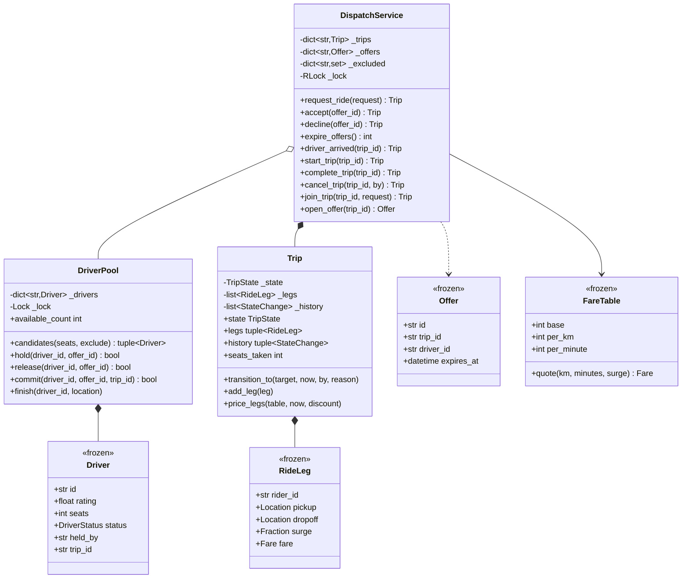

# 设计题解：网约车（Ride Sharing / Uber）

## 题目与澄清

面试官的开场白通常很短："设计一个网约车系统：乘客叫车，系统给他匹配一位司机，行程要能跟踪状态，
结束时算钱。"这句话里藏着三个完全不同难度的子问题——**找车**、**流转**、**算钱**——而真正决定
你这一轮成败的是第一个。值得当场问出来的：

- **司机是被"指派"的，还是被"问"的？** 这是这道题的分水岭。如果系统直接把行程写到某位司机身上，
  那他不接单怎么办？他手机没电怎么办？现实里的答案是：系统只是**发一张要约**（offer），司机可以
  接、可以拒、也可以不吭声。只要把这句话问出来并给出正确答案，这一轮你已经赢了一半。
- **一张要约同时发给几个人？** 广播给周围所有人抢单（早期滴滴、现在的货运平台），还是一次只发
  一个人、超时顺延（现在的 Uber）？两种都有真实系统在跑，但它们的并发难度、司机体验和实现复杂度
  完全不同，必须说得出取舍。
- **地图要做到什么程度？** 强烈建议主动把它排除掉："我假设有一个能给我附近司机列表的地理服务，
  距离用直线距离近似。"否则你会把四十五分钟花在四叉树和 geohash 上，而那是**另一道题**。面试官
  几乎总会同意——他想看的是撮合与状态流转。
- **一趟行程能不能拉第二位乘客（拼车）？** 一定要问。答案是"能"的话，"行程"这个对象就不能只挂
  一个乘客、一个起点、一个终点，否则第 4 关你要把模型推倒重来。
- **钱怎么表示？** 整数最小货币单位（分），全程不出现浮点数；动态加价的倍数也别用 `float`——
  `1.2` 在二进制里不是 `1.2`，乘进金额之后对不上的那几分钱没人说得清是谁的。
- **取消谁说了算、什么时候不许取消？** 这是一道许可题，不是状态题，值得单独问一句。

**范围之外**：不做地图路网与邻近搜索（`Location` 只是平面坐标加一次直线距离）；不做真实支付
通道（计价产出一张金额明细，收款是另一个参与方）；不做持久化与多进程。这些都在
**扩展与追问**里交代清楚它们会落在哪个类上。

## 需求与分级

机器编码轮是分关加码的，所以从一开始就按关来搭结构，而不是先写一个大而全的类。

- **第 1 关（核心流程，约 20 分钟）**：乘客、司机、一次叫车请求，以及一趟行程——它的生命周期是
  一张**显式的状态机**：REQUESTED → MATCHED → ARRIVED → IN_PROGRESS → COMPLETED，CANCELLED 只能
  从前三个状态到达。对应 `RideRequest`、`Driver`、`Trip`、`TripState`、`ALLOWED_TRANSITIONS`、
  `CANCELLABLE_BY`、`DispatchService` 上那几个推进方法。
- **第 2 关（匹配成为一条缝，约 15 分钟）**：最近优先只是**默认**的打分函数；真正要展示的是
  派单流程本身——一次只把要约发给**一位**司机，带超时，司机可以拒；被要约的司机在要约敞开期间
  被**独占持有**，所以两位乘客不可能同时匹配到同一位；拒单或超时立刻顺位发给下一位，候选耗尽
  就明确取消。对应 `Offer`、`DriverStatus.OFFERED`、`DriverPool.hold/release/commit`、
  `DispatchService._offer_next/_reoffer/expire_offers`。
- **第 3 关（并发，约 15 分钟）**：几十位乘客同时下单。用真线程加一个屏障（barrier）去测，断言
  的是不变量——没有司机同时跑两趟、没有乘客在超时之后被晾在"正在找车"里——而不是时序。对应
  `DriverPool` 里那把锁和三个比较并交换（compare-and-swap）方法。
- **第 4 关（选做，新需求）**：计价（起步价 + 里程 + 时长）加一个可插拔的动态加价策略；以及
  拼车——第二位乘客上同一辆车。评分点是**加它们要不要动状态机**：本文的答案是不用，计价只在
  COMPLETED 那一刻跑一次，拼车只是往行程上追加一条 `RideLeg`。

## 核心对象与职责

- **`Location`** — 一个平面坐标，只有一个方法 `distance_to`。它是整道题里唯一和地图有关的东西，
  刻意做到最薄：换成路网距离或球面距离只影响这一个方法。
- **`Driver`** — 一位司机此刻的全部状态，**不可变**。改状态靠 `dataclasses.replace` 整条替换，
  所以不存在"改了一半"的中间态，也不怕把它直接交给调用方——这是"绝不把内部可变对象递出去"这条
  纪律最省事的实现方式。
- **`DriverStatus`** — OFFLINE / AVAILABLE / OFFERED / ON_TRIP。**OFFERED 是本设计的枢纽**：
  它表示"被一张敞开的要约独占着"，既不是空闲也不是在跑车。少了它，派单只能"先查空闲再写占用"，
  两个线程会同时挑中同一位司机。
- **`RideRequest`** — 一次叫车请求（谁、从哪到哪、几个人），不可变，可以安全跨线程传。
- **`Offer`** — 一张要约：某趟行程派给某位司机，到某个时刻作废。它是"正在征求同意"的凭据，
  **不是分配结果**——司机只有 `accept` 之后才真正被写进行程，所以要约超时不需要任何回滚。
- **`RideLeg`** — 行程里**一位乘客**的那一段：上下车点、占几个座、什么时候上的车、锁死的加价
  倍数、结束时回填的车费。有了它，"独享"和"拼车"是同一种东西（一条腿 vs 两条腿）。
- **`Trip`** — 一趟行程。它只拥有一条不变量：状态只能沿 `ALLOWED_TRANSITIONS` 走，唯一的改法是
  `transition_to`；每次转移留一条 `StateChange`。它**不带锁**——行程永远在 `DispatchService`
  的锁里被改，给它单配一把锁只会多一个锁序问题。
- **`FareTable` / `Fare`** — 价目表是数据（起步价、每公里、每分钟），明细是结果。价目表是
  `frozen dataclass` 而不是抽象基类：换个城市就是换一张表，不是换一个实现类。
- **`DriverPool`** — 司机名册与"独占持有"。这道题的并发正确性**全部**落在这一个类里：
  `hold`、`release`、`commit` 都是锁内的比较并交换，先验证当前状态与占用者、再整条替换，
  中间没有缝隙。纪律：池子从不回调服务，所以锁序只有一个方向。
- **`DispatchService`** — 门面：管行程表与要约表，负责发要约、推状态、结算、拼车。
  **司机的状态它一个字节都不存**，全部委托给 `DriverPool`。

生命周期上，`DispatchService` **组合** `Trip`（行程随服务而生，随服务而灭），**关联**
`DriverPool`、`FareTable` 和两个策略函数——它们由调用方构造并注入，可以被多个服务实例共享。



## 关键设计决策

### 派单：广播抢单、直接指派，还是逐个要约？

这是这道题的第一个也是最重要的岔路口。三个选项都有真实系统在跑：

```python
# 选项 1：广播抢单——把请求推给附近所有司机，先点的人赢
def request_ride(self, request):
    for driver in self.nearby(request.pickup):
        driver.push(request)          # 谁先回来算谁的
```

```python
# 选项 2：直接指派——挑一个最近的，写进行程就完事
def request_ride(self, request):
    driver = min(self.available(), key=lambda d: d.distance_to(request.pickup))
    trip = Trip(request, driver)
    driver.status = DriverStatus.ON_TRIP      # 他还没同意呢
    return trip
```

```python
# 选项 3：逐个要约——一次问一个，带超时，可以拒（本文的选择）
def request_ride(self, request):
    trip = Trip(...)
    if self._offer_next(trip, now) is None:   # 独占住一位司机，发一张会过期的要约
        raise NoDriverAvailableError
    return trip
```

**选项 2 的问题不是性能，是它撒谎**。"状态 = ON_TRIP"这句话在司机点"接单"之前就是假的：他可能
正在吃饭、可能已经准备收车、可能就是不想去那个方向。系统一旦把一个未经同意的事实写进数据，
后面所有的补偿逻辑都是在给这个谎打补丁。面试里说出"司机是被问的，不是被指派的"这一句，分量
超过你后面写的两百行代码。

**选项 1 是可用的，但它把并发难度推到了最高**：N 个司机同时点"抢单"，只有一个能赢，剩下 N-1 个
要收到"手慢了"；推送量是 O(附近司机数)；而且它对司机体验很糟——抢单是零和的，抢不到就是白看
一眼。它的优点也真实：响应最快，且天然不会"派给一个不想去的人"。如果面试官说的是货运或众包
配送，选项 1 往往才是对的答案，**说得出它适用于谁比选哪个更重要**。

**本文选选项 3**，代价必须讲清楚：串行发要约意味着最坏情况下的撮合时延是"候选数 × 超时"，
所以超时必须短（十几秒），而且要有一个候选上限或一个总时限。本文用排除集把每位司机对同一趟
行程只问一次，避免最难受的那种失败——打分最高的那位被反复骚扰，而乘客永远等不到车。

### 司机为什么必须有一个 OFFERED 状态

上面选项 3 有一个致命的实现陷阱：要约敞开的这十五秒，这位司机算不算"空闲"？

```python
# 错的：布尔字段 + 先查后写
free = [d for d in drivers if d.is_available]        # 线程 A 和 B 都看到了 d7
best = min(free, key=score)
best.is_available = False                            # 两个线程都写了一遍
```

这就是最经典的**先检查后动作**（check-then-act）竞态。Python 的 GIL 在这里什么也不保证：
`if d.is_available` 和 `d.is_available = False` 是两段字节码，中间随时可能切线程。

正确的做法是把"被占着"变成一个**状态**，并且让占用成为一次原子操作：

```python
def hold(self, driver_id: str, offer_id: str) -> bool:
    with self._lock:                       # 判断与写入在同一把锁里
        driver = self._drivers.get(driver_id)
        if driver is None or driver.status is not DriverStatus.AVAILABLE:
            return False                   # 已经被别人占走了，换一个候选
        self._drivers[driver_id] = replace(driver, status=DriverStatus.OFFERED,
                                           held_by=offer_id)
        return True
```

三个细节值得在面试里主动说出来：

1. **它返回 `bool` 而不是抛异常。** 抢不到司机是派单的正常路径（换下一个候选就行），不是错误。
   把常态写成异常，调用点就会被 `try/except` 淹没。
2. **`held_by` 记的是"被哪张要约占着"**，而 `release` / `commit` 都只认当前持有者。这让迟到的
   超时清扫变得无害：一张旧要约的清扫不会把已经在跑下一单的司机打回空闲。这是**凭据绑定**
   （fencing）的最小形式。
3. **OFFERED 不是 ON_TRIP。** 两者都"不可派单"，但语义不同：OFFERED 可以被释放回池子，
   ON_TRIP 不行；司机在 OFFERED 时不能下线，是因为他手机上正弹着一张要约。

`Driver` 做成不可变、靠 `replace` 整条替换，是这条纪律的额外红利：外面拿到的永远是一份快照，
没人能绕过池子的锁去改司机的状态。

### 行程状态：一张转移表加一张许可表，而不是 State 模式

行程有六个状态，但**"状态"和"谁有权动它"是两件事**，所以本文用了两张表：

```python
ALLOWED_TRANSITIONS = {
    TripState.REQUESTED: frozenset({TripState.MATCHED, TripState.CANCELLED}),
    TripState.MATCHED: frozenset({TripState.ARRIVED, TripState.CANCELLED}),
    TripState.ARRIVED: frozenset({TripState.IN_PROGRESS, TripState.CANCELLED}),
    TripState.IN_PROGRESS: frozenset({TripState.COMPLETED}),   # 上车之后不能取消
    ...
}
CANCELLABLE_BY = {
    TripState.REQUESTED: frozenset({Party.RIDER, Party.SYSTEM}),   # 司机还没上车呢
    TripState.MATCHED: frozenset({Party.RIDER, Party.DRIVER, Party.SYSTEM}),
    TripState.ARRIVED: frozenset({Party.RIDER, Party.DRIVER, Party.SYSTEM}),
}
```

备选是**状态模式**（State）：给每个状态一个类，每个类实现 `cancel`、`start`、`complete`。
[[structure.state-machines|状态机（State Machines）]]里讲过判据，这里正好是它的反例：
**状态之间只有"允许/不允许"的差别，用表；状态之间有行为和数据的差别，才用类。** 行程在每个
状态下什么也不"做"——它不像电梯那样在"上行"和"待机"时对同一个按钮有截然不同的响应——唯一的
差别就是允许往哪走、谁能动它。为一层纯粹的许可关系造六个类、写一堆"这个动作在这个状态下非法"
的空方法，是把两张十行的表摊成了六个文件。表还有一个类做不到的好处：它能被程序读，画状态图、
统计转移覆盖率、生成对外文档都只是遍历一次。这一点和[[solution-online-shopping]]里的订单状态机
是同一个结论，那篇把取舍讲得更细，这里不重复。

真正值得在这道题上多说两句的是那条 `IN_PROGRESS` 只通向 `COMPLETED` 的边。候选人常常顺手给它
加上 CANCELLED，理由是"万一路上出事呢"。但"车已经开了一半、乘客中途下车"在业务上**不是取消**，
是"提前结束并按已走里程计费"——它有账要结、有钱要收，和取消的语义完全相反。把两件事挤进同一个
状态，报表上"取消率"这个指标立刻失去意义。**状态机的边是业务约定，不是防御性编程。**

### 匹配算法是一个函数，不是一族类

面试官在第 2 关几乎一定会说："如果不想按最近派，而想综合评分和空闲时长呢？"Java 味的答案是
一个 `MatchingStrategy` 接口加三个实现类。Python 里不必：

```python
MatchPolicy = Callable[[RideRequest, Driver, datetime], float]

def nearest_driver(request, driver, now) -> float:
    return driver.location.distance_to(request.pickup)

def weighted_score(per_km=1.0, per_rating_point=1.0, per_idle_minute=0.05) -> MatchPolicy:
    def score(request, driver, now) -> float:
        idle = (now - driver.idle_since).total_seconds() / 60
        return (driver.location.distance_to(request.pickup) * per_km
                - driver.rating * per_rating_point - idle * per_idle_minute)
    return score
```

这就是[[patterns.strategy|策略模式与可替换算法（Strategy）]]在 Python 里的自然形态：策略只有
一个方法、没有跨调用要记的状态，那它就该是一个函数；需要参数就用闭包，需要组合就套一层函数。
写成抽象基类唯一的收益是"能被 `isinstance` 认出来"，而这道题里没有任何地方需要这件事。

**这里有两个必须说出口的细节**，它们比模式本身更能区分候选人：

- **打分的量纲。** 距离是公里，评分是分，空闲是分钟，三者相加没有物理意义——所以权重本身就是
  换算率："一个评分点值多少公里"。面试时把这句话说出来，等于承认你知道这是一个**业务调参**
  问题，不是数学问题。
- **并列必须被打破。** 排序键是 `(score, driver.id)` 而不是 `score`。否则同分时派给谁取决于
  字典的迭代顺序，测试会飘，线上会出现"同样两位司机，这次派给了谁说不清楚"的投诉。
  确定性是可测试性的前提。

### 动态加价的倍数在什么时候锁死

一个容易被忽略、但面试官一问就露馅的问题：乘客下单时 App 显示 1.5 倍，行程结束时街上车多了，
该按几倍收钱？

```python
# 选项 1：结束时算——代码更短，但它意味着报价是不作数的
fare = table.quote(km, minutes, self._surge(request, waiting_now, available_now))
```

```python
# 选项 2：下单那一刻算出来，写进行程，结束时只是读出来用（本文的选择）
trip = Trip(trip_id, request, now, surge=self._surge(request, waiting + 1, available))
...
leg.surge          # 一路带到 price_legs
```

选项 1 不只是"用户体验差"，它让**报价无法被兑现**，等于系统对外说的每一句话都带着"以最终解释
为准"。选项 2 把倍数当成合同的一部分：倍数是**下单时刻的事实**，和里程、时长一样是行程数据。
代价是行程上多了一个字段，以及"倍数为什么是这个"需要另外留痕（本文没做，放在扩展里）。

倍数用 `fractions.Fraction` 而不是 `float`，理由和金额用整数分是同一条：`Fraction(3, 2)` 乘以
整数分仍是精确有理数，最后 `int()` 一次截断，全程只有这一处取整。用 `float` 的话，
`0.1 + 0.2 != 0.3` 那类误差会顺着"小计 × 倍数 - 优惠 == 实付"这条等式渗进对账单。

## 代码走读

整份实现如下。读的时候盯住四处：`DriverPool.hold` 的比较并交换、`DispatchService._reoffer`
的"放人—排除—顺延—兜底取消"、`Trip.transition_to` 的两张表、以及 `join_trip` 全程没碰状态机。

%% code:begin solution.py %%
```python
"""网约车（Uber）——匹配、行程状态机与计价的参考实现。

核心思路：派单的中心概念不是"分配"而是**要约**（`Offer`）——同一时刻只发给一位司机、带
超时、可被拒绝；司机在要约敞开期间被 `DriverPool` **独占持有**（AVAILABLE→OFFERED 是一次
锁内的比较并交换），所以两位乘客不可能同时匹配到同一位司机。要约被拒或超时，系统立刻把这
位司机拉进该行程的排除集并顺位发给下一位；候选耗尽就把行程明确置为 CANCELLED——宁可给乘
客一个确定的失败，也不让他停在"正在找车"里。行程生命周期是一张显式的转移表加一张"谁有权
取消"的许可表，取消只从 REQUESTED/MATCHED/ARRIVED 三个点出发，上车之后无人可取消。计价
（起步价 + 里程 + 时长）与动态加价（surge）是两个注入的普通策略，倍数在**下单那一刻**锁死
写进行程；第 4 关的拼车只是往行程上追加一条 `RideLeg`，状态机一行不改。

地理刻意做到最简：`Location` 是平面坐标，距离是直线距离。真实系统要的是路网与空间索引
（geohash / 四叉树），那是另一道题，本文不做，也不假装做了。
"""

from __future__ import annotations

import itertools
import math
import threading
from collections.abc import Callable, Iterable, Mapping, Sequence
from dataclasses import dataclass, replace
from datetime import datetime, timedelta
from enum import Enum
from fractions import Fraction


# --------------------------------------------------------------------------
# 失败路径：一个小的异常家族。调用方可以只 catch 基类，也可以分别处理。


class RideError(Exception):
    """本设计里所有失败路径的公共基类。"""

class UnknownDriverError(RideError):
    """司机没有注册过。"""

class UnknownTripError(RideError):
    """行程号不存在。"""

class DriverBusyError(RideError):
    """司机正被一张要约占着或正在跑车，此刻不能上下线。"""

class NoDriverAvailableError(RideError):
    """没有任何可派的司机——注册的都离线、都在跑车，或都已拒绝过这一单。"""

class OfferExpiredError(RideError):
    """要约已超时、已被拒绝，或已经被别人用掉了。"""

class IllegalTransitionError(RideError):
    """行程状态机不允许这次转移。"""

class CancellationNotAllowedError(RideError):
    """这一方此刻无权取消这趟行程。"""

class SeatUnavailableError(RideError):
    """车上剩余座位不够，或拼车绕路超过了上限。"""


# --------------------------------------------------------------------------
# 地理：全题只用到"两点之间有多远"。


@dataclass(frozen=True, slots=True)
class Location:
    """平面上的一个点，单位当作公里。真实系统这里是经纬度加路网距离；本题用直线距离，
    因为这道题考的是撮合与状态流转，不是邻近搜索。换成路网只影响这一个方法。
    """

    x: float
    y: float

    def distance_to(self, other: "Location") -> float:
        """到另一点的直线距离。"""
        return math.hypot(self.x - other.x, self.y - other.y)


# --------------------------------------------------------------------------
# 司机：不可变记录，改状态靠整条替换，所以交给调用方的永远是安全的快照。


class DriverStatus(Enum):
    """司机的四个状态。OFFERED 是本设计的关键：它表示"被一张敞开的要约独占着"，
    既不是空闲（不能再被派单）也不是在跑车（还没人接单）。少了它，派单就只能靠
    "先查后写"，两位乘客会同时匹配到同一位司机。
    """

    OFFLINE = "offline"
    AVAILABLE = "available"
    OFFERED = "offered"
    ON_TRIP = "on_trip"


@dataclass(frozen=True, slots=True)
class Driver:
    """一位司机此刻的全部状态。不可变：`DriverPool` 用 `dataclasses.replace` 整条换掉，
    因此不存在"改了一半"的中间态，也不怕把它直接交给调用方。
    """

    id: str
    rating: float = 5.0
    seats: int = 4
    location: Location | None = None
    status: DriverStatus = DriverStatus.OFFLINE
    held_by: str | None = None
    trip_id: str | None = None
    idle_since: datetime | None = None


# --------------------------------------------------------------------------
# 乘客的请求、要约、行程段。


@dataclass(frozen=True, slots=True)
class RideRequest:
    """一次叫车请求：谁、从哪到哪、几个人。不可变，可以安全地跨线程传。"""

    rider_id: str
    pickup: Location
    dropoff: Location
    seats: int = 1


@dataclass(frozen=True, slots=True)
class Offer:
    """一张要约：把某一趟行程派给某一位司机，`expires_at` 之前有效。

    它是"正在征求同意"的凭据，不是分配结果。司机只有 `accept` 之后才真正上车，
    所以要约超时不需要任何回滚——司机从没被写进行程。
    """

    id: str
    trip_id: str
    driver_id: str
    expires_at: datetime


@dataclass(frozen=True, slots=True)
class Fare:
    """一段行程的车费明细，单位是分。`surge` 是下单那一刻锁死的倍数。"""

    base: int
    distance: int
    time: int
    surge: Fraction

    @property
    def total(self) -> int:
        """实付金额：三项相加再乘倍数，向下取整到分。"""
        return int((self.base + self.distance + self.time) * self.surge)


@dataclass(frozen=True, slots=True)
class RideLeg:
    """行程里**一位乘客**的那一段：上下车点、占几个座、什么时候上的车、锁死的倍数。

    有了它，"一个人的行程"和"拼车"就是同一种东西（一条腿 vs 两条腿），第 4 关不必
    引入第二套模型。`fare` 在行程结束时回填。
    """

    rider_id: str
    pickup: Location
    dropoff: Location
    seats: int
    joined_at: datetime
    surge: Fraction
    fare: Fare | None = None


# --------------------------------------------------------------------------
# 行程状态机：一张转移表 + 一张取消许可表。


class TripState(Enum):
    """行程的六个状态。"""

    REQUESTED = "requested"
    MATCHED = "matched"
    ARRIVED = "arrived"
    IN_PROGRESS = "in_progress"
    COMPLETED = "completed"
    CANCELLED = "cancelled"


class Party(Enum):
    """谁在动这趟行程——取消权限按方区分，所以它必须是一个显式的参数。"""

    RIDER = "rider"
    DRIVER = "driver"
    SYSTEM = "system"


ALLOWED_TRANSITIONS: Mapping[TripState, frozenset[TripState]] = {
    TripState.REQUESTED: frozenset({TripState.MATCHED, TripState.CANCELLED}),
    TripState.MATCHED: frozenset({TripState.ARRIVED, TripState.CANCELLED}),
    TripState.ARRIVED: frozenset({TripState.IN_PROGRESS, TripState.CANCELLED}),
    TripState.IN_PROGRESS: frozenset({TripState.COMPLETED}),
    TripState.COMPLETED: frozenset(),
    TripState.CANCELLED: frozenset(),
}

CANCELLABLE_BY: Mapping[TripState, frozenset[Party]] = {
    TripState.REQUESTED: frozenset({Party.RIDER, Party.SYSTEM}),
    TripState.MATCHED: frozenset({Party.RIDER, Party.DRIVER, Party.SYSTEM}),
    TripState.ARRIVED: frozenset({Party.RIDER, Party.DRIVER, Party.SYSTEM}),
}


@dataclass(frozen=True, slots=True)
class StateChange:
    """一次转移的留痕：什么时候、从哪到哪、谁干的、为什么。客服每天都要回答"这单几点
    被谁取消的"，这个问题只能靠事中记录，不能事后推算。
    """

    at: datetime
    previous: TripState
    current: TripState
    by: Party
    reason: str | None = None


class Trip:
    """一趟行程：一位或多位乘客、一位司机、一条显式的状态轨迹。

    不变量：`state` 只能沿 `ALLOWED_TRANSITIONS` 移动，唯一的改法是 `transition_to`；
    每次转移都留一条 `StateChange`。它自己**不带锁**——行程永远在 `DispatchService`
    的锁里被改，多一把锁只会多一个锁序问题。
    """

    def __init__(self, trip_id: str, request: RideRequest, created_at: datetime,
                 surge: Fraction) -> None:
        self.id = trip_id
        self.request = request
        self.created_at = created_at
        self.driver_id: str | None = None
        self._state = TripState.REQUESTED
        self._legs = [RideLeg(request.rider_id, request.pickup, request.dropoff,
                              request.seats, created_at, surge)]
        self._history: list[StateChange] = []

    @property
    def state(self) -> TripState:
        """当前状态。只读——想改就得走一次受检的转移。"""
        return self._state

    @property
    def legs(self) -> tuple[RideLeg, ...]:
        """每位乘客那一段的不可变快照，按上车顺序。"""
        return tuple(self._legs)

    @property
    def history(self) -> tuple[StateChange, ...]:
        """状态轨迹的不可变快照。"""
        return tuple(self._history)

    @property
    def seats_taken(self) -> int:
        """车上已被占用的座位数。"""
        return sum(leg.seats for leg in self._legs)

    @property
    def started_at(self) -> datetime | None:
        """乘客上车的时刻，直接从状态轨迹里读——不另存一个字段，就不会有两份真相。"""
        return next((c.at for c in self._history if c.current is TripState.IN_PROGRESS), None)

    def transition_to(self, target: TripState, now: datetime, by: Party,
                      reason: str | None = None) -> None:
        """按转移表走一步；非法转移抛异常，**绝不静默忽略**——被吞掉的非法转移意味着
        调用方以为车已经开了，而行程其实还停在"正在找车"。
        """
        if target not in ALLOWED_TRANSITIONS[self._state]:
            raise IllegalTransitionError(
                f"trip {self.id}: {self._state.value} -> {target.value} is not allowed")
        self._history.append(StateChange(now, self._state, target, by, reason))
        self._state = target

    def add_leg(self, leg: RideLeg) -> None:
        """拼车：往行程上追加一位乘客。它**不碰状态机**——多一个人上车不是一次状态
        转移，这正是第 4 关"加需求不改老代码"的证据。
        """
        self._legs.append(leg)

    def price_legs(self, table: "FareTable", now: datetime, discount: Fraction) -> None:
        """结束时给每条腿回填车费：里程按这条腿自己的起终点，时长从**上车**那一刻算起——
        等车的那几分钟不收钱，所以计时起点是 `max(上车时刻, 发车时刻)` 而不是叫车时刻。
        """
        share = discount if len(self._legs) > 1 else Fraction(1)
        start = self.started_at or now
        self._legs = [replace(leg, fare=table.quote(
            leg.pickup.distance_to(leg.dropoff),
            (now - max(leg.joined_at, start)).total_seconds() / 60, leg.surge * share))
            for leg in self._legs]

    def fare_for(self, rider_id: str) -> Fare | None:
        """某位乘客这一趟要付多少；行程没结束就是 `None`。"""
        return next((leg.fare for leg in self._legs if leg.rider_id == rider_id), None)


# --------------------------------------------------------------------------
# 计价与动态加价：两类"会变的规则"，一张不可变的表加一个普通函数。


@dataclass(frozen=True, slots=True)
class FareTable:
    """一张价目表：起步价 + 每公里 + 每分钟，单位都是分。

    它是数据不是算法，所以是 `frozen dataclass` 而不是抽象基类——换城市就是换一张表。
    """

    base: int
    per_km: int
    per_minute: int

    def quote(self, km: float, minutes: float, surge: Fraction = Fraction(1)) -> Fare:
        """按里程与时长报一笔明细。四舍五入只发生在这里，总额靠 `Fare.total` 算。"""
        return Fare(self.base, round(self.per_km * km), round(self.per_minute * minutes), surge)


SurgePolicy = Callable[[RideRequest, int, int], Fraction]
MatchPolicy = Callable[[RideRequest, Driver, datetime], float]
Clock = Callable[[], datetime]


def no_surge(request: RideRequest, waiting: int, available: int) -> Fraction:
    """不加价——倍数策略的下界，也是测试里最省心的那一个。"""
    return Fraction(1)


def demand_surge(steps: Sequence[tuple[Fraction, Fraction]]) -> SurgePolicy:
    """按"在等的人 ÷ 可派的车"分档加价：`steps` 是 (比值门槛, 倍数)，从高到低取第一个命中的。

    用 `Fraction` 不用 `float`：倍数要乘进金额，1.2 在二进制里不是 1.2，几千万单之后
    对不上的那几分钱没人说得清是谁的。
    """
    ordered = tuple(sorted(steps, key=lambda s: s[0], reverse=True))

    def surge(request: RideRequest, waiting: int, available: int) -> Fraction:
        ratio = Fraction(waiting, max(1, available))
        return next((m for threshold, m in ordered if ratio >= threshold), Fraction(1))

    return surge


def nearest_driver(request: RideRequest, driver: Driver, now: datetime) -> float:
    """最近优先：得分就是司机到上车点的距离，越小越优先。"""
    assert driver.location is not None
    return driver.location.distance_to(request.pickup)


def weighted_score(per_km: float = 1.0, per_rating_point: float = 1.0,
                   per_idle_minute: float = 0.05) -> MatchPolicy:
    """距离、评分、空闲时长的加权打分，越小越优先。

    评分与空闲时长取**负**权重：分高的、等得久的应该被优先派单，后者是司机端公平性的
    最低限度——只按距离排，市中心那位永远抢不到单。三个权重量纲不同（公里、分、分钟），
    所以权重本身就是"一个评分点值多少公里"的换算率，面试时要把这句话说出来。
    """

    def score(request: RideRequest, driver: Driver, now: datetime) -> float:
        assert driver.location is not None
        idle = 0.0 if driver.idle_since is None else (now - driver.idle_since).total_seconds() / 60
        return (driver.location.distance_to(request.pickup) * per_km
                - driver.rating * per_rating_point - idle * per_idle_minute)

    return score


# --------------------------------------------------------------------------
# DriverPool：司机名册与"独占持有"。这道题的并发正确性全部落在这一个类里。


class DriverPool:
    """司机池：注册、上下线，以及 AVAILABLE ↔ OFFERED ↔ ON_TRIP 三态之间的受控迁移。

    不变量：一位司机任一时刻至多被一张要约或一趟行程占着。`hold` / `release` / `commit`
    都是锁内的**比较并交换**：先验证当前状态和占用者，再整条替换，中间没有缝隙，所以
    "先查空闲再写占用"那个经典竞态在这里不可能发生。

    纪律：池子从不回调 `DispatchService`。锁序因此只有一个方向（服务锁 → 池锁），
    不存在环，也就不存在锁序死锁。
    """

    def __init__(self, clock: Clock) -> None:
        self._clock = clock
        self._drivers: dict[str, Driver] = {}
        self._lock = threading.Lock()

    def register(self, driver_id: str, rating: float = 5.0, seats: int = 4) -> None:
        """登记一位司机，初始离线。"""
        with self._lock:
            self._drivers[driver_id] = Driver(id=driver_id, rating=rating, seats=seats)

    def driver(self, driver_id: str) -> Driver:
        """取一位司机的只读快照。"""
        with self._lock:
            found = self._drivers.get(driver_id)
        if found is None:
            raise UnknownDriverError(f"unknown driver {driver_id!r}")
        return found

    @property
    def available_count(self) -> int:
        """此刻可派的司机数——只给计数，不把名册交出去。"""
        with self._lock:
            return sum(1 for d in self._drivers.values() if d.status is DriverStatus.AVAILABLE)

    def go_online(self, driver_id: str, location: Location) -> None:
        """司机上线并报位置；已经在跑车或被要约占着的不允许重复上线。"""
        self._set_idle(driver_id, DriverStatus.AVAILABLE, location)

    def go_offline(self, driver_id: str) -> None:
        """司机收车。跑车中或被要约占着时拒绝——否则乘客会在路上被凭空丢下。"""
        self._set_idle(driver_id, DriverStatus.OFFLINE, None)

    def candidates(self, seats: int, exclude: Iterable[str] = ()) -> tuple[Driver, ...]:
        """此刻可派、且座位够的司机快照。排除集来自"已经拒绝过这一单"的那些人。"""
        banned = frozenset(exclude)
        with self._lock:
            return tuple(d for d in self._drivers.values()
                         if d.status is DriverStatus.AVAILABLE and d.seats >= seats
                         and d.id not in banned)

    def hold(self, driver_id: str, offer_id: str) -> bool:
        """把司机从 AVAILABLE 独占到 OFFERED，成功返回 `True`。

        这是全题最关键的一处：判断"还空闲吗"和写入"被我占了"在同一把锁里完成。
        两个线程同时为不同乘客抢同一位司机，只有一个能拿到 `True`。
        """
        with self._lock:
            driver = self._drivers.get(driver_id)
            if driver is None or driver.status is not DriverStatus.AVAILABLE:
                return False
            self._drivers[driver_id] = replace(driver, status=DriverStatus.OFFERED, held_by=offer_id)
            return True

    def release(self, driver_id: str, offer_id: str) -> bool:
        """要约被拒或超时，把司机还回 AVAILABLE。只有持有者能释放，所以迟到的超时清扫
        不会把已经在跑下一单的司机打回空闲。幂等，且永不抛异常——它总跑在失败路径上。
        """
        now = self._clock()
        with self._lock:
            driver = self._drivers.get(driver_id)
            if driver is None or driver.held_by != offer_id:
                return False
            self._drivers[driver_id] = replace(driver, status=DriverStatus.AVAILABLE,
                                               held_by=None, idle_since=now)
            return True

    def commit(self, driver_id: str, offer_id: str, trip_id: str) -> bool:
        """司机接单：OFFERED → ON_TRIP，同样只认当前持有者。"""
        with self._lock:
            driver = self._drivers.get(driver_id)
            if driver is None or driver.held_by != offer_id:
                return False
            self._drivers[driver_id] = replace(driver, status=DriverStatus.ON_TRIP,
                                               held_by=None, trip_id=trip_id)
            return True

    def finish(self, driver_id: str, location: Location) -> None:
        """行程结束或中途取消：司机回到 AVAILABLE，位置更新为当前所在。"""
        now = self._clock()
        with self._lock:
            driver = self._drivers.get(driver_id)
            if driver is not None:
                self._drivers[driver_id] = replace(driver, status=DriverStatus.AVAILABLE,
                                                   location=location, held_by=None,
                                                   trip_id=None, idle_since=now)

    def _set_idle(self, driver_id: str, status: DriverStatus, location: Location | None) -> None:
        """上线与下线共用的一步：占用中的司机一律拒绝，其余整条替换。"""
        now = self._clock()
        with self._lock:
            driver = self._drivers.get(driver_id)
            if driver is None:
                raise UnknownDriverError(f"unknown driver {driver_id!r}")
            if driver.status in (DriverStatus.OFFERED, DriverStatus.ON_TRIP):
                raise DriverBusyError(f"driver {driver_id} is {driver.status.value}")
            self._drivers[driver_id] = replace(driver, status=status, held_by=None,
                                               location=location or driver.location,
                                               idle_since=now if location else None)


# --------------------------------------------------------------------------
# DispatchService：门面。管行程、发要约、推状态、结算。司机的状态它一个字节都不存。


class DispatchService:
    """派单服务：叫车 → 逐个发要约 → 接单 → 到达 → 上车 → 完成，外加取消与拼车。

    不变量（并发测试直接断言它们）：
    1. 处在 REQUESTED 的行程**必定**恰好有一张敞开的要约——没有人会停在"正在找车"里；
    2. 一位司机不会同时出现在两趟未终结的行程上；
    3. `_offers` / `_excluded` 两张表只在行程活着时有条目，行程一终结就被删干净。

    锁纪律：服务锁保护行程表与要约表，可以在持有它时去调 `DriverPool`（服务锁 → 池锁，
    方向唯一）；反向调用不存在。GIL 在这里什么都不保证——`if driver.status is AVAILABLE`
    之后紧跟一次赋值，是两段字节码，中间随时可能切线程。
    """

    def __init__(self, clock: Clock, pool: DriverPool, fares: FareTable,
                 match: MatchPolicy = nearest_driver, surge: SurgePolicy = no_surge,
                 offer_ttl: timedelta = timedelta(seconds=15),
                 pool_discount: Fraction = Fraction(4, 5),
                 max_detour_km: float = 2.0) -> None:
        self._clock, self._pool, self._fares = clock, pool, fares
        self._match, self._surge, self._offer_ttl = match, surge, offer_ttl
        self._pool_discount, self._max_detour_km = pool_discount, max_detour_km
        self._trips: dict[str, Trip] = {}
        self._offers: dict[str, Offer] = {}
        self._offer_by_trip: dict[str, str] = {}
        self._excluded: dict[str, set[str]] = {}
        self._lock = threading.RLock()
        self._ids = itertools.count(1)

    # ---- 读 ---------------------------------------------------------------

    def trip(self, trip_id: str) -> Trip:
        """按行程号取行程。"""
        with self._lock:
            found = self._trips.get(trip_id)
        if found is None:
            raise UnknownTripError(f"unknown trip {trip_id!r}")
        return found

    def open_offer(self, trip_id: str) -> Offer | None:
        """这趟行程此刻敞开的要约；没有就是 `None`。"""
        with self._lock:
            offer_id = self._offer_by_trip.get(trip_id)
            return self._offers.get(offer_id) if offer_id else None

    @property
    def open_offer_count(self) -> int:
        """敞开的要约数——用计数暴露内部表的大小，测试据此断言它确实会缩小。"""
        with self._lock:
            return len(self._offers)

    # ---- 第 1、2 关：叫车与要约 -------------------------------------------

    def request_ride(self, request: RideRequest) -> Trip:
        """乘客叫车：建行程（REQUESTED），锁死加价倍数，并立刻把要约发给最优的一位司机。

        一位候选都没有时**不建行程**、直接抛 `NoDriverAvailableError`：留下一个永远没有
        要约的 REQUESTED 行程，就是把不变量 1 破坏在了起点上。
        """
        now = self._clock()
        with self._lock:
            waiting = sum(1 for t in self._trips.values() if t.state is TripState.REQUESTED)
            multiplier = self._surge(request, waiting + 1, self._pool.available_count)
            trip = Trip(f"T{next(self._ids)}", request, now, multiplier)
            self._trips[trip.id] = trip
            self._excluded[trip.id] = set()
            if self._offer_next(trip, now) is None:
                del self._trips[trip.id], self._excluded[trip.id]
                raise NoDriverAvailableError(f"no driver can take {request.rider_id}'s ride")
            return trip

    def accept(self, offer_id: str) -> Trip:
        """司机接单：要约必须还活着、司机必须还被它占着，然后 REQUESTED → MATCHED。

        过期是**惰性**判断的：哪怕清扫还没跑，一张过了点的要约在这里也已经无效，所以
        正确性不依赖定时任务跑没跑。
        """
        now = self._clock()
        with self._lock:
            offer = self._offers.get(offer_id)
            if offer is None:
                raise OfferExpiredError(f"offer {offer_id!r} is no longer open")
            if offer.expires_at <= now:
                self._reoffer(offer, now, "offer timed out")
                raise OfferExpiredError(f"offer {offer_id} expired at {offer.expires_at:%H:%M:%S}")
            trip = self._trips[offer.trip_id]
            if not self._pool.commit(offer.driver_id, offer.id, trip.id):
                raise OfferExpiredError(f"driver {offer.driver_id} no longer holds {offer_id}")
            self._close_offer(offer)
            self._excluded.pop(trip.id, None)
            trip.driver_id = offer.driver_id
            trip.transition_to(TripState.MATCHED, now, Party.DRIVER)
            return trip

    def decline(self, offer_id: str) -> Trip:
        """司机拒单：立刻把他放回可派池、拉进这趟行程的排除集，并顺位发给下一位。"""
        now = self._clock()
        with self._lock:
            offer = self._offers.get(offer_id)
            if offer is None:
                raise OfferExpiredError(f"offer {offer_id!r} is no longer open")
            self._reoffer(offer, now, "driver declined")
            return self._trips[offer.trip_id]

    def expire_offers(self) -> int:
        """清扫超时的要约，返回清掉的张数。沉默的司机和拒单的司机走同一条路径——
        对乘客来说两者没有区别，代码里也就不该有两套。
        """
        now = self._clock()
        with self._lock:
            stale = [o for o in self._offers.values() if o.expires_at <= now]
            for offer in stale:
                self._reoffer(offer, now, "offer timed out")
            return len(stale)

    # ---- 第 1 关：行程推进 -------------------------------------------------

    def driver_arrived(self, trip_id: str) -> Trip:
        """司机到达上车点：MATCHED → ARRIVED。"""
        now = self._clock()
        with self._lock:
            trip = self.trip(trip_id)
            trip.transition_to(TripState.ARRIVED, now, Party.DRIVER)
            return trip

    def start_trip(self, trip_id: str) -> Trip:
        """乘客上车、开始计时：ARRIVED → IN_PROGRESS。"""
        now = self._clock()
        with self._lock:
            trip = self.trip(trip_id)
            trip.transition_to(TripState.IN_PROGRESS, now, Party.DRIVER)
            return trip

    def complete_trip(self, trip_id: str) -> Trip:
        """送达：IN_PROGRESS → COMPLETED，给每条腿结算，司机回到最后一个下车点待命。"""
        now = self._clock()
        with self._lock:
            trip = self.trip(trip_id)
            trip.transition_to(TripState.COMPLETED, now, Party.DRIVER)
            trip.price_legs(self._fares, now, self._pool_discount)
            if trip.driver_id is not None:
                self._pool.finish(trip.driver_id, trip.legs[-1].dropoff)
            return trip

    def cancel_trip(self, trip_id: str, by: Party, reason: str | None = None) -> Trip:
        """取消。许可表说了算：上车之后（IN_PROGRESS）谁都不能取消——车已经在路上，
        这时候要的是"提前结束并按已走里程计费"，那是另一个动作，不是取消。
        """
        now = self._clock()
        with self._lock:
            trip = self.trip(trip_id)
            if by not in CANCELLABLE_BY.get(trip.state, frozenset()):
                raise CancellationNotAllowedError(
                    f"{by.value} cannot cancel trip {trip_id} in {trip.state.value}")
            offer = self.open_offer(trip_id)
            if offer is not None:
                self._pool.release(offer.driver_id, offer.id)
                self._close_offer(offer)
            if trip.driver_id is not None:
                self._pool.finish(trip.driver_id, trip.request.pickup)
            self._excluded.pop(trip.id, None)
            trip.transition_to(TripState.CANCELLED, now, by, reason)
            return trip

    # ---- 第 4 关：拼车 -----------------------------------------------------

    def join_trip(self, trip_id: str, request: RideRequest) -> Trip:
        """第二位乘客拼上一趟已经匹配的行程。

        两道闸：车上还得有座；绕路（A→P→Q→B 的总长减去 A→B）不超过上限。通过之后
        只是 `Trip.add_leg` 一条腿——状态机、要约机制、司机池都不知道发生过拼车。
        """
        now = self._clock()
        with self._lock:
            trip = self.trip(trip_id)
            if trip.state not in (TripState.MATCHED, TripState.ARRIVED, TripState.IN_PROGRESS):
                raise IllegalTransitionError(f"trip {trip_id} in {trip.state.value} takes no rider")
            assert trip.driver_id is not None
            if trip.seats_taken + request.seats > self._pool.driver(trip.driver_id).seats:
                raise SeatUnavailableError(f"trip {trip_id} has no room for {request.seats} seat(s)")
            a, b = trip.legs[0].pickup, trip.legs[0].dropoff
            detour = (a.distance_to(request.pickup) + request.pickup.distance_to(request.dropoff)
                      + request.dropoff.distance_to(b) - a.distance_to(b))
            if detour > self._max_detour_km:
                raise SeatUnavailableError(f"joining would add {detour:.1f} km, over the limit")
            trip.add_leg(RideLeg(request.rider_id, request.pickup, request.dropoff,
                                 request.seats, now,
                                 self._surge(request, 1, self._pool.available_count)))
            return trip

    # ---- 内部 -------------------------------------------------------------

    def _offer_next(self, trip: Trip, now: datetime) -> Offer | None:
        """给这趟行程找下一位候选并独占他，发出要约。调用方须已持有服务锁。

        排序键的第二项是司机 id：打分相同时若靠字典顺序，测试会飘，线上会出现"同样的
        两位司机，这次派给了谁取决于内存布局"这种没法复现的抱怨。
        """
        excluded = self._excluded.get(trip.id, set())
        ranked = sorted(self._pool.candidates(trip.request.seats, excluded),
                        key=lambda d: (self._match(trip.request, d, now), d.id))
        for driver in ranked:
            offer_id = f"O{next(self._ids)}"
            if self._pool.hold(driver.id, offer_id):
                offer = Offer(offer_id, trip.id, driver.id, now + self._offer_ttl)
                self._offers[offer_id] = offer
                self._offer_by_trip[trip.id] = offer_id
                return offer
        return None

    def _close_offer(self, offer: Offer) -> None:
        """把一张要约从两张表里彻底摘掉。这是它们唯一会缩小的地方，所以只此一个出口。"""
        self._offers.pop(offer.id, None)
        if self._offer_by_trip.get(offer.trip_id) == offer.id:
            del self._offer_by_trip[offer.trip_id]

    def _reoffer(self, offer: Offer, now: datetime, reason: str) -> None:
        """拒单／超时的统一处理：放人、排除、顺位再发；候选耗尽就把行程明确取消掉。"""
        self._pool.release(offer.driver_id, offer.id)
        self._close_offer(offer)
        trip = self._trips[offer.trip_id]
        self._excluded.setdefault(trip.id, set()).add(offer.driver_id)
        if self._offer_next(trip, now) is None:
            trip.transition_to(TripState.CANCELLED, now, Party.SYSTEM, "no driver available")
            self._excluded.pop(trip.id, None)


if __name__ == "__main__":
    from datetime import UTC

    now = datetime(2026, 9, 20, 8, 0, tzinfo=UTC)
    pool = DriverPool(clock=lambda: now)
    for name, x in [("d1", 1.0), ("d2", 3.0), ("d3", 0.5)]:
        pool.register(name, rating=4.8)
        pool.go_online(name, Location(x, 0.0))

    service = DispatchService(clock=lambda: now, pool=pool, match=weighted_score(),
                              fares=FareTable(base=900, per_km=220, per_minute=35),
                              surge=demand_surge([(Fraction(2), Fraction(3, 2))]))
    trip = service.request_ride(RideRequest("r1", Location(0, 0), Location(6, 8)))
    print(f"{trip.id} offered to {service.open_offer(trip.id).driver_id}")
    service.decline(service.open_offer(trip.id).id)          # 拒单后自动顺位
    service.accept(service.open_offer(trip.id).id)
    service.driver_arrived(trip.id)
    service.start_trip(trip.id)
    service.join_trip(trip.id, RideRequest("r2", Location(1.0, 1.0), Location(6.5, 8.0)))
    now = now + timedelta(minutes=22)
    for leg in service.complete_trip(trip.id).legs:
        print(f"{leg.rider_id} pays {leg.fare.total} fen to {trip.driver_id}")
```
%% code:end %%

**`DriverPool` 里那三个方法是一组。** `hold` 把 AVAILABLE 换成 OFFERED，`release` 把它换回去，
`commit` 把它换成 ON_TRIP；后两个都只认 `held_by == offer_id`。三个方法加起来定义了一条完整的
占用生命周期，**没有第四条路径能改这三个状态**，所以"一位司机同时跑两趟"这件事在类型层面就
不可能。`finish` 是唯一的例外（行程结束或取消时无条件放人），它不检查持有者，因为那时候
持有者就是调用它的那趟行程。

**`_reoffer` 是"不把乘客晾着"这句话的全部实现。** 拒单和超时走的是同一条路径——对乘客来说这两件
事没有任何区别，代码里也就不该有两套。它做四件事：把司机放回池子、把要约从两张表里摘掉、把这位
司机加进该行程的排除集、顺位再发一张。第五件事才是关键：**顺位失败（候选耗尽）就把行程明确置为
CANCELLED**，并把排除集删掉。没有这一步，行程会永远停在 REQUESTED 而没有任何敞开的要约——乘客
的 App 上转着圈，系统里没人管它。这也是并发测试直接断言的不变量：**处在 REQUESTED 的行程，
必定恰好有一张敞开的要约。**

**容器一定要会缩小。** 这个设计里有三张会增长的表：`_offers`、`_offer_by_trip`、`_excluded`。
前两张只在 `_close_offer` 一个地方被删（接单、拒单、超时、取消四条路径都走它）；`_excluded`
在行程离开 REQUESTED 的每一条路径上被 `pop`。`open_offer_count` 这个只读属性存在的唯一理由，
就是让测试能直接断言"事情做完之后表是空的"——这类断言比任何注释都可靠。

**`join_trip` 是第 4 关的答卷。** 它做两道闸（还有没有座、绕路超不超上限），然后调
`Trip.add_leg`。**它一次都没有碰 `transition_to`**：多一个人上车不是一次状态转移。测试
`test_pooling_adds_a_leg_without_touching_the_state_machine` 直接断言 `trip.history` 在拼车
前后完全相同——"加需求没动老代码"这件事，是能被断言出来的，不是嘴上说的。绕路判据用的是一条
朴素的椭圆式不等式：走 A→P→Q→B 比直接 A→B 多出来的公里数不超过上限。

## 测试与自检

二十六个测试按关分组，每一组盯住一条设计承诺：

- **要约不是分配**：叫车之后行程还在 REQUESTED、`trip.driver_id is None`、被问到的司机是
  OFFERED 而不是 ON_TRIP。这条断言会让"直接指派"的实现立刻失败。
- **独占持有**：只有一位司机在线时，第二位乘客叫车必须拿到 `NoDriverAvailableError`。
- **拒单与超时**：拒过的司机不会被同一趟行程再问第二次（排除集）；沉默的司机超时后自动顺延；
  过期的要约即使清扫还没跑也**必须**被 `accept` 拒绝（惰性过期，正确性不依赖定时任务）。
- **不把乘客晾着**：所有司机都拒绝之后，行程是 CANCELLED、`by` 是 `Party.SYSTEM`、带 reason，
  并且两张内部表都空了。
- **许可表**：IN_PROGRESS 时三方都不能取消；司机不能取消一趟还没接的单。
- **并发**：二十位乘客、八位司机、一个 `threading.Barrier` 同时起跑，断言成交数**恰好等于**
  司机数、没有司机跑两趟、其余十二位拿到明确的失败。第二个并发测试反复推进时钟并让四个线程
  同时清扫，每一轮都断言那条不变量：`state is REQUESTED` 当且仅当 `open_offer(...) is not None`。
  注意两个测试断言的都是**不变量**，没有一句依赖线程调度顺序。
- **计价**：等车的三分钟不计费（计时起点是上车那一刻）；加价倍数在下单时锁死，事后车多了也
  不追溯。
- **快照纪律**：`trip.legs` 是 tuple，元素是 frozen dataclass，外面改不动。

**两分钟怎么给面试官演示**：跑 `python solution.py`。它打印三行——第一行是"要约发给了 d3"，
第二行第三行是拼车之后两位乘客各付多少。中间那句 `service.decline(...)` 就是全场的重点：
一位司机拒单之后，系统**自动**把单顺延给了下一位，乘客毫无感知。演示时把这句话说出来。

## 扩展与追问

**新需求**

- *车型（经济/舒适/豪华）*：`RideRequest` 多一个字段，`DriverPool.candidates` 多一个过滤条件，
  `FareTable` 从一张变成"车型 → 表"的一个映射。`Trip`、状态机、要约机制不动。
- *预约单（明天早八点的车）*：这是**唯一一个真的会动状态机**的追问，值得老实承认。干净的做法
  是加一个 SCHEDULED 状态，它只通向 REQUESTED（到点由调度器触发）和 CANCELLED；现有的边一条
  不改。说"不用改"是不诚实的，说"只加不改"才是对的。
- *司机评价与乘客评分*：完全在行程之外——COMPLETED 之后的一条独立记录，`Trip` 不该长出
  `rating` 字段。否则终态对象会一直被改，"终态"就名不副实了。
- *取消费*：`cancel_trip` 里按 `(state, by)` 查一张费率表即可，那是第三张表，和现有两张同构。

**并发与线程安全**

- *两把锁会不会死锁？* 不会，因为锁序只有一个方向：`DispatchService` 可以在持有自己的锁时去调
  `DriverPool`，反向调用**不存在**（池子从不回调服务）。这条纪律必须写在类的文档字符串里，
  因为它靠的是约定，不是编译器。
- *GIL 给了我什么？* 几乎什么都没给。它保证的是单条字节码不被打断，而这里的每一个关键操作
  （查状态、写状态）都是多条。要约独占能成立，靠的是 `threading.Lock`，不是 GIL。
- *要约超时靠什么触发？* 本文用注入的时钟加**惰性判断**：`accept` 自己检查是否过期，
  `expire_offers` 只是把惰性结论落成实状态。这样测试不用 `sleep`，生产上也不怕清扫线程挂掉。
  真做成定时器，就要面对"定时器线程和业务线程同时改同一张要约"的问题，回到同一把锁。
- *派单要不要做成单线程事件循环？* 是一个真实的备选：把所有派单决策串行化进一个队列，锁就
  全没了。代价是吞吐上限变成单核，且长任务会阻塞整条流水线。规模上来之后通常按城市/区域分片，
  每片一个决策循环——那时 `DriverPool` 恰好就是分片的边界。

**持久化与规模**

- *行程落库*：`Trip` 的状态与 `history` 天然是事件流，一次转移写一行，读时重放。`transition_to`
  是唯一的写入点，这让"落库"只需要在一个方法里挂一个钩子。
- *要约放哪*：要约是有 TTL 的短命数据，天生适合放带过期的键值存储（Redis）；`hold` 对应
  `SET key value NX EX 15`，`held_by` 就是那个 fencing token，语义一对一。
- *附近司机怎么找*：本文的 `candidates` 是全表扫描，在单机几千位司机时完全够用。真实规模下换成
  geohash 或四叉树索引，**只影响 `DriverPool.candidates` 这一个方法**——这正是当初把地理压缩成
  一个方法的回报。
- *支付*：收款是一个会失败的外部参与方，和库存、履约一样，正确的形态是带补偿的 Saga，
  [[solution-online-shopping]]把这一段写全了，这里不重复；本文的边界停在产出一张 `Fare`。

## 常见错误

- **把司机直接指派给行程**。最常见、也最致命：它把一个未经同意的事实写成了数据。
- **用布尔字段 `is_available` 表示空闲**，然后"先查后写"。这是并发关上必挂的一题；正确答案是
  把占用做成一个状态，并让占用成为锁内的一次比较并交换。
- **广播之后忘了收口**。选广播抢单没问题，但要说清楚"第一个点击的人赢"这件事靠什么保证——
  仍然是同一把锁里的一次比较并交换，不是"谁的请求先到服务器"。
- **拒单之后没有排除集**，于是同一位司机被反复问、乘客永远等不到车；或者反过来，忘了在候选
  耗尽时给行程一个终态，乘客永远停在"正在找车"。
- **行程只挂一个乘客**（`rider_id`、`pickup`、`dropoff` 三个字段直接长在 `Trip` 上）。第 4 关
  一加拼车就得推倒重来。一开始就用一条"腿"的列表，独享行程只是一条腿。
- **状态用一堆布尔值**（`is_started`、`is_cancelled`、`is_paid`）。n 个布尔有 2ⁿ 种组合，而合法
  状态只有六种，剩下的全靠调用方自觉。
- **非法转移被静默忽略**（`if can(): ...` 而没有 `else: raise`）。被吞掉的非法转移意味着调用方
  以为车已经开了，而行程其实还停在"正在找车"。
- **Java 习惯**：`RideService` 用 `__new__` 做单例；`getDriver()` / `setStatus()` 一堆；
  给只有一个实现的 `PricingStrategy` 建抽象基类；`Location` 写成一个有 getter/setter 的可变类。
  Python 里分别对应：模块级对象或直接注入、`@property`、普通函数、`frozen=True` 的 dataclass。
- **金额和倍数用 `float`**。金额用整数分，倍数用 `Fraction`，取整只发生在最后一步。
- **把内部的司机字典或行程列表直接返回**。`available_count` 给计数，`legs` 给 tuple，
  `Driver` 本身不可变——三道保险，外面拿不到能改的东西。

## 45 分钟怎么分配

- **0–5 分钟｜澄清。** 抛出那三个问题：司机是被问还是被指派？一次问一个还是广播？地图做到什么
  程度？主动把邻近搜索排除掉。把"拼车要不要支持"也问掉——它决定了你接下来怎么画 `Trip`。
- **5–12 分钟｜实体与状态机。** 在白板上写下六个状态和那张转移表，边写边说"CANCELLED 只能从
  前三个状态到达，上车之后不叫取消、叫提前结束"。这一段是免费的加分项，因为它不需要写代码。
- **12–22 分钟｜核心流程的代码。** `RideRequest`、`Trip`、`TripState`、`transition_to`，
  再加 `DispatchService` 上 `request_ride` / `accept` 两个方法的骨架。先不管并发。
- **22–32 分钟｜要约与独占。** 引入 `Offer` 和 `DriverStatus.OFFERED`，写 `DriverPool.hold`，
  **一边写一边把"先查后写会怎样"讲出来**。然后写 `_reoffer`，讲"拒单和超时是同一件事"以及
  "候选耗尽要给终态"。这十分钟是这一轮的最高分段，别省。
- **32–38 分钟｜测两条不变量。** 手写两个测试：一个并发的（没有司机跑两趟），一个超时的
  （没有乘客停在 REQUESTED 而没有要约）。用注入的时钟，绝不 `sleep`。
- **38–45 分钟｜扩展口头化。** 计价和拼车通常来不及写完，**说**清楚它们落在哪：计价是注入的
  一张表加一个倍数策略、倍数在下单时锁死；拼车是往行程上加一条腿、状态机一行不改。

**时间不够时砍什么**：先砍计价（口头描述 `FareTable`），再砍拼车（口头描述 `RideLeg`），
最后砍匹配打分（留 `nearest_driver` 一个函数，说"这里是一条缝"）。**永远不要砍掉的是要约机制
和那把锁**——它们才是这道题的题眼；一个没有要约、直接指派的完整实现，分数低于一个只写完了
要约和状态机的半成品。

## 来源与延伸

- [ashishps1/awesome-low-level-design — Ride Sharing Service](https://github.com/ashishps1/awesome-low-level-design/blob/main/problems/ride-sharing-service.md)：
  最流行的那份免费题面与多语言实现，给出了完整的需求清单（可以拿来对照自己漏了哪条）。
  本文与它有两处根本分歧：它的 `RideService` 用单例，且 `requestRide` 把行程直接指派给
  最近的司机、再"通知"司机——没有要约、没有超时、没有拒单路径；它用并发容器
  （ConcurrentHashMap）代替显式的锁，而这道题真正的竞态是"先查空闲再写占用"这个复合操作，
  并发容器对它无能为力。
- [jkaus324/machine-coding-interview-questions — 021 Ride Sharing](https://github.com/jkaus324/machine-coding-interview-questions/tree/main/problems/tier2-intermediate/021-ride-sharing)：
  按"基础要求 / 扩展 1 / 扩展 2"分关给题，节奏和真实机器编码轮一致，适合检查自己的分关拆得
  全不全。它把这道题理解成"用户发布行程、乘客挑行程"（顺风车模型），因此它的重点是可插拔的
  **选择策略**（乘客怎么挑车），和本文的**派单**（系统怎么找人）是镜像的两半；它对 Strategy
  的处理值得看，对并发几乎没有涉及。
- [kumaransg/LLD — Ride Sharing](https://github.com/kumaransg/LLD/tree/main/Ride%20Sharing%20)：
  同一道题的八九个不同实现摆在一起，是观察"同一个题面能被理解成多少种模型"的好材料。
  多数实现把状态写成 `Ride` 上的一个枚举字段并用 `if` 校验，没有显式的转移表，也没有区分
  "谁有权做这次转移"——本文的两张表正是对这一点的回应。
- [Python 文档：`fractions`](https://docs.python.org/3/library/fractions.html) 与
  [`threading`](https://docs.python.org/3/library/threading.html)：前者是加价倍数不用 `float`
  的依据，后者的 `Lock` 与 `Barrier` 分别撑起了本文的独占持有和并发测试。
