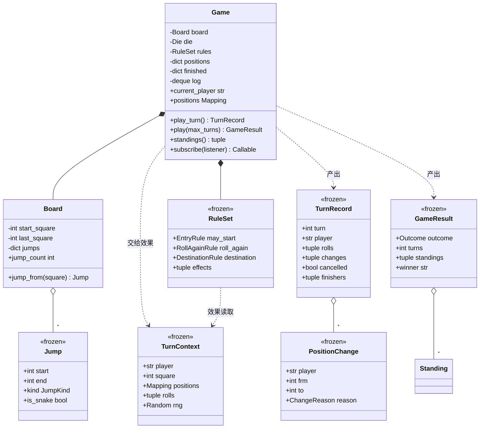

# 设计题解：蛇梯棋（Snake and Ladder）

## 题目与澄清

面试官的开场通常很短："写一个蛇梯棋。一块 100 格的棋盘，上面有蛇和梯子，几个玩家轮流掷骰子，
先到 100 的赢。"——听上去比井字棋还简单：一个字典、一个 `while` 循环、一个 `random.randint`，
十分钟就能跑起来。

正因为如此，这道题的评分点全都不在"能不能跑"上。它真正在考三件事：

- **你的循环停得下来吗，为什么停得下来？** 这是蛇梯棋独有的、别的热身题没有的考点。一个
  "蛇的尾巴正好是梯子的脚、而这架梯子的顶又正好是那条蛇的头"的棋盘，会让一次掷骰在原地
  无限跳；一个"必须精确踩到 100"的规则，会让一个停在 97 的玩家可能永远掷不出想要的点数。
  这两种不停止是**不同性质**的，需要两种不同的药。多数题解一种都没治。
- **换骰子、换玩法要改几行？** 蛇梯棋是各地玩法差异最大的棋之一：掷到六才能出发、掷到六
  多走一轮、连三个六整轮作废、超出终点要往回弹……面试官几乎一定会在你写完之后加一条。
  如果这些规则是 `play_turn` 里越长越多的 `if`，第三条就会把前两条撞坏。
- **随机的东西，你怎么写测试？** 一份"跑起来看着挺对"的蛇梯棋是无法验收的。掷骰子的题
  是考察"把随机源注入进来"最自然的场合，这一点和 [[solution-tic-tac-toe]] 里机器人必须
  接收注入的 `random.Random` 是同一件事。

值得当场问出来、而不是替面试官决定的澄清问题：

- **棋盘一定是 100 格、蛇和梯子一定是固定那几条吗？** 如果回答"可配置"，那棋盘就是一份
  构造参数，而且**必须校验**——下面第一条设计决策整条都是在回答这个。
- **蛇和梯子可以首尾相接吗？** 也就是"踩到梯子顶，如果那里正好是一条蛇的头，要不要继续滑
  下去"。大多数面试官会说"不允许这种棋盘"，这句回答比它看上去值钱得多：它把"一次移动最多
  触发一次跳跃"从运行时的循环变成了构造时的校验。如果面试官说"允许连跳"，那你必须问第二
  句——"那需要检测环吗"，因为允许连跳的棋盘一定要带环检测，否则就是死循环。
- **必须精确踩到终点吗？** 三种答案都常见：精确落子（超出原地不动）、超出即判到终点、
  超出从终点往回弹。它决定了"目标格怎么算"这一步是不是一个可替换的部件。
- **掷到六有什么特殊待遇？** 再掷一次？连续三个六作废？六点才能出发？这三条经常同时出现，
  而它们**互相纠缠**：要作废整轮，就意味着已经走出去的两步得退回来——回合必须是事务性的。
- **几个人？要名次还是只要赢家？** "只报第一名"和"报完整名次"是两个不同的终止条件：前者
  第一个到终点就结束，后者要一直下到只剩一个人还在路上。
- **一格能站几个人？** 经典规则里不限；有的玩法里后到者会把先到者踢回起点。问清楚，因为
  "一个格子上有谁"如果要被查询，位置就得反向索引，不能只存"玩家→格子"。
- **并发吗？** 一局棋天然串行。值得说一句："如果一个服务里同时跑很多局，锁的粒度是一局
  一把；这份模型本身不需要锁。"

**范围之外**：不做命令行或图形界面（`Game.log` 里的 `TurnRecord` 就是渲染层要的全部输入）、
不做联网对战与断点续玩（但第 4 关会说清楚"要存什么才能恢复"）、不做"最少几步能走完"这类
图论最短路——那是算法题 LeetCode 909，不是设计题。

## 需求与分级

机考轮不会一次把需求说完。蛇梯棋的四关几乎是固定的：

- **第 1 关（核心流程，约 15 分钟）**：可配置的棋盘、若干玩家、一颗骰子、一个会停下来的
  回合循环。关键不在循环，在**棋盘要在构造时校验自己**：没有两条跳跃首尾相接、没有跳跃
  **起始**于起点格或终点格、终点落在棋盘上且不回起点格、蛇一定向下梯子一定向上、同一格不能
  是两条跳跃的起点。（终点**可以**是终点格——经典棋盘上 80→100 那架梯子踩到就赢。）这一关对应
  `Board`、`Jump`、`Game.play_turn` 和那一族 `SnakeLadderError`。
- **第 2 关（骰子与玩法可插拔，约 15 分钟）**：骰子变成注入的，用带种子的 `random.Random`
  让测试可复现；然后一次加四个玩法变体——六点才能出发、掷到六加掷一次、连续三个六整轮
  作废、必须精确踩到终点。对应 `Die` 这个类型别名、`fair_die` / `SequenceDie`，以及
  `RuleSet` 和挂在它上面的四组纯函数。这一关是 [[patterns.strategy|策略模式与可替换算法（Strategy）]]
  在 Python 里的真实形状。
- **第 3 关（多人、名次与日志，约 10 分钟）**：人数任意；棋局结束时给出**完整名次**而不是
  只有一个赢家；保留一份可回放的走子日志。对应 `Standing`、`GameResult`、`TurnRecord`、
  `Game.standings()`，以及 `play_to_the_end` 这个"下到只剩一人"的开关。
- **第 4 关（新规则靠组合加，约 5 分钟）**：加一个传送门、一个"再走一次"的格子、一个
  "和领先者换位"的格子。验收标准很硬：**不许改 `Game` 的任何一行**。对应 `SquareEffect`
  这个类型、`TurnContext` 这份只读快照，以及"效果返回变化、由回合循环统一提交"这条纪律。

## 核心对象与职责

- **`Jump`**（不可变值）：一次跳跃，只有 `start` 和 `end` 两个字段。它拥有的不变量只有一条
  ——两端不能相同；方向（是蛇还是梯子）是**算出来的**，不是存进去的。
- **`Board`**（实体，构造后不可变）：一串格子加一张"起点格 → 跳跃"的表。它拥有棋盘层面的
  全部不变量，而且全部在 `__init__` 里立起来：起点唯一且不在起点格或终点格上、终点在棋盘上
  且不回起点格、**没有任何一次跳跃的终点是另一次跳跃的起点**。它不知道有谁在下棋。
- **`Die`**（类型别名 `Callable[[], int]`）：一个"叫一次给一个正整数"的东西。`fair_die()`
  返回闭包，`SequenceDie` 是给测试用的可调用对象。它不是一个类层次。
- **`RuleSet`**（不可变值）：这一局的玩法，四个字段各管一个决策点——谁能出发
  （`may_start`）、掷完要不要再掷（`roll_again`）、目标格怎么算（`destination`）、
  落地之后还发生什么（`effects`）。四个字段互相不知道对方存在。
- **`TurnContext`**（不可变值）：交给格子效果的只读快照——我是谁、我站在哪、别人都在哪、
  这一轮掷了什么、终点在哪、随机源是哪个。效果看得见全局，却改不动任何人。
- **`PositionChange`** / **`TurnRecord`**（不可变值）：一次位置变化，以及一轮的完整记录。
  `TurnRecord` 同时是推给订阅者的**事件**：订阅者从事件本身更新自己，不必回头去翻 `Game`
  的内部状态。
- **`Game`**（实体）：唯一拥有"谁在哪一格"的对象。它拥有两条跨对象的不变量——**一轮的位移
  要么全部生效要么全部作废**，以及**已经到达终点的人退出棋局、谁都碰不到他**。它还负责
  轮转、结算名次、写日志、通知订阅者。
- **`Standing` / `GameResult`**（不可变值）：名次表的一行，与一次 `play()` 的收场。

关系上：`Game` **组合**了 `Board`、`Die`、`RuleSet`（生命周期跟着一局棋，但它们本身都
不可变，同一块 `Board` 可以被几局棋共享）。玩家在这份设计里**就是字符串名字**——为什么
没有 `Player` 类，见下面第四条决策。



## 关键设计决策

### 一、什么让这个循环停得下来？——两种不停止，两种药

这是蛇梯棋唯一真正"有可能写错到挂掉"的地方，也是多数题解完全没提的地方。把它讲清楚，
这道热身题就值一个高分。

**第一种不停止发生在一次移动之内。** 假设棋盘上有一架梯子 12→25，和一条蛇 25→12。玩家
踩到 12，爬到 25，25 上有蛇头，滑回 12，12 上有梯脚……直觉上大家会写这样的移动代码：

```python
def apply_jumps(board, square):
    while (jump := board.jump_from(square)) is not None:  # 会转不出来
        square = jump.end
    return square
```

这段代码看着很"通用"——它支持连跳。代价是：它可以死循环，而且**没有任何输入校验能发现
这一点**，因为死循环不是某一次掷骰的问题，是棋盘配置的问题。两条药：

```python
# 选项 A：允许连跳，运行时检测环
def apply_jumps(board, square):
    seen = {square}
    while (jump := board.jump_from(square)) is not None:
        square = jump.end
        if square in seen:
            raise CycleError(...)      # 一局棋下到一半才炸
        seen.add(square)
    return square

# 选项 B：构造时禁止首尾相接，移动时只查一次表
chained = {j.end for j in table.values()} & set(table)
if chained:
    raise InvalidBoardError(...)       # 棋盘造不出来
jump = board.jump_from(target)         # 一次查表，没有循环
```

**选 B。** 两条理由。其一，失败发生的时间不同：A 在一局棋下到一半时抛异常，此时状态已经
改了一半，调用方几乎没有办法优雅地恢复；B 在 `Board(...)` 那一行就失败，坏的配置根本进不
了系统——这是"把运行时错误提前成构造时错误"的标准收益。其二，B 让"一次移动最多触发一次
跳跃"成为**结构上成立**的事实，于是移动代码里那个 `while` 直接消失，没有循环就没有环。
只有当面试官明确说"我要支持连跳"时，A 才是对的，而那时你要主动说出"那我需要环检测"。

另外三条校验规则是**非对称**的，这个非对称本身值得说出口：跳跃的**起点**不许落在起点格上
（那架梯子在谁掷骰之前就已经触发了）也不许落在终点格上（踩到终点就赢了，再跳去哪里都没有
意义）；跳跃的**终点**不许落在起点格上（蛇要是把人送回起点格，那个人就又变成"还没出发"，
在"六点才能出发"的玩法下会莫名其妙地被要求重新掷六），但**可以**落在终点格上——经典棋盘上
80→100 那架梯子就是这样，踩到第 80 格直接获胜，这是真实玩法的一部分，不该被校验挡掉。
一句话记法：**起点是"这一格会发生什么"，所以不能长在两个端点上；终点只是"你被送到哪"，
送到终点就是赢。**

**第二种不停止发生在整局棋上，而且它治不好，只能承认。** 在"必须精确踩到 100"的规则下，
一个停在 97 的玩家需要掷出 3；掷出别的就原地不动。再加上蛇，棋局是一条马尔可夫链，终点
是吸收态：**到达的概率是 1，但到达的轮数没有上界**。也就是说

```python
while self.winner is None:     # 概率 1 会停，但没有任何一轮是保证的
    self.play_turn()
```

在数学上"几乎必然"终止，在工程上是一个会挂住线程的循环——一个种子不好的随机数发生器、
一颗被灌铅的骰子（永远只出 5），都能让它真的转不完。所以 `Game.play()` 带一个显式的轮数
预算，收场方式是一个显式的枚举：

```python
budget = self._max_turns if max_turns is None else max_turns
while not self.is_over and budget > 0:
    self.play_turn()
    budget -= 1
return GameResult(outcome=Outcome.WON if self.is_over else Outcome.ABANDONED, ...)
```

`Outcome.ABANDONED` 不是失败，是一个诚实的返回值："这局没分出胜负"。面试里把这两种不停止
分开讲——**一种靠校验根除，一种靠预算兜底**——比写对任何一行代码都更能说明你在想什么。

还有第三种，藏在第 2 关里：**"掷到六再掷一次"本身是不收敛的**。理论上可以一直掷六。所以
一轮之内的掷骰次数也有上限，超了抛 `RuleLoopError`——不是悄悄停下（那会改变规则），是
大声说"你给的规则组合不收敛"。

### 二、骰子：一个策略类层次，还是一个 `Callable[[], int]`？

流行的 Java 风格题解在这里一律是三个类：一个抽象的 `DiceRollStrategy`、两三个具体子类，
外加一个 `Dice` 持有策略并把 `roll()` 转发过去。翻译成 Python：

```python
class DiceRollStrategy(ABC):
    @abstractmethod
    def roll(self) -> int: ...

class FairDiceRollStrategy(DiceRollStrategy):
    def __init__(self, rng): self._rng = rng
    def roll(self) -> int: return self._rng.randint(1, 6)

class Dice:                       # 只会转发的一层
    def __init__(self, strategy): self._strategy = strategy
    def roll(self) -> int: return self._strategy.roll()
```

对照 Python 的写法：

```python
Die = Callable[[], int]

def fair_die(sides: int = 6, rng: random.Random | None = None) -> Die:
    source = rng or random.Random()
    return lambda: source.randint(1, sides)
```

**选后者**，而且要说清楚两件事分别被拒绝了。

第一，`Dice` 这个壳被拒绝。它没有自己的职责：构造时收一个策略，`roll()` 原样转发。一个
只做转发的类在 Java 里有时还能靠"以后要加缓存/日志"辩护，在 Python 里连这个辩护都不成立
——真要加日志，包一个函数就行。**一个只转发一次调用的类，要么给它一个职责，要么删掉它。**

第二，抽象基类被拒绝，但**策略模式本身没有被拒绝**。这里仍然是彻头彻尾的策略：算法被
封装、可替换、调用方不知道自己拿的是哪一种。变的只是"策略"在 Python 里的载体——
一个只有一个方法、没有共享实现的接口，它的 Python 形状就是一个函数类型。好处是具体的：
`partial(rng.randint, 1, 6)` 是一颗骰子，`iter([3, 4, 5]).__next__` 是一颗测试用骰子，
`lambda: 2 * base()` 是一颗加倍的骰子——全都不需要新建类型。

那 `SequenceDie` 为什么还是一个类？因为它多承担了一件事：它要能被断言"还剩几个点数没
用"（`rolls_left`）。**有状态本身不是理由**（闭包也能有状态），需要把状态**暴露成可读
属性**才是理由。这一条同时也是测试纪律：测试断言的是公开的 `rolls_left`，而不是
`_index`——`starter.py` 的填空者完全可以用 `iter()` 来实现它，断言私有字段会把一个正确
答案判错。

最后，注意 `rng` 是**注入**的而不是模块级 `random`。这和 [[solution-tic-tac-toe]] 里
机器人必须接收 `random.Random` 是同一条纪律，但在蛇梯棋里它的分量更重：井字棋的随机只
影响机器人，蛇梯棋的随机**就是整局棋**。库代码里任何一处直接调 `random.randint`，整套
测试就只能改成"跑起来不报错"。

### 三、玩法变体往哪放？——固定的回合循环 + 挂在决策点上的纯函数

第 2 关一次加四条规则。先看最自然、也最常见的写法：

```python
def play_turn(self):
    pips = self._die()
    if self.six_to_start and self.positions[p] == 0 and pips != 6:
        return ...
    if self.extra_turn_on_six and pips == 6:
        ...
    if self.three_sixes_rule and self._sixes == 3:
        ...
    if self.exact_finish and target > self.last:
        target = current
```

四个布尔开关，四个 `if`，而且它们**互相纠缠**：第三条要作废整轮，就得知道前面两条已经
走了多少；第一条和第二条都在看同一个 6。每加一条规则，`play_turn` 的圈复杂度翻一倍，
而且没有任何一条规则可以被单独测试。

第二个选项是继承：`class ExtraTurnGame(Game)` 覆写 `play_turn`。它的问题是组合爆炸——
"六点出发 + 三个六作废 + 弹回"要么写一个三合一子类，要么指望多继承的 MRO 把三份
`play_turn` 拼起来，而它们改写的是同一个方法。

本设计选第三条路：**把回合循环钉死，在它上面开五个命名的决策点**，每个决策点收一个纯
函数。五个点分别是：能不能出发、掷完要不要再掷、目标格是哪一格、这一格上有跳跃吗、落地
之后还发生什么。四条规则于是变成四个互不相干的函数：

```python
def six_to_start(pips: int) -> bool:
    return pips == 6

def three_sixes_cancel(rolls: tuple[int, ...]) -> RollAgain:
    if rolls[-3:] == (6, 6, 6):
        return RollAgain.CANCEL
    return RollAgain.AGAIN if rolls[-1] == 6 else RollAgain.STOP

def exact_finish(square: int, pips: int, last_square: int) -> int:
    target = square + pips
    return target if target <= last_square else square
```

任意组合就是 `RuleSet(may_start=six_to_start, roll_again=three_sixes_cancel)`；每条规则
都能脱离棋局单独测试；`Game` 的代码一行都没有为哪条规则而长出来。

这条路上有两个容易被忽略的细节，都值得主动说出口。

**其一，"掷到六再掷一次"绝对不是"把点数加起来"。** 6 之后掷 2，必须先真的走到第 6 格
（那里可能有一架梯子）再走 2 格；把它写成 `pips = 6 + 2 = 8` 会直接跨过那架梯子。所以
决策点的语义是"**再走一段**（leg）"，不是"再加点数"。这是本题最隐蔽的功能性 bug，测试
里专门有一条 `test_an_extra_turn_on_six_moves_twice_instead_of_summing_the_pips` 钉住它。

**其二，"连续三个六整轮作废"逼着整个回合变成一个事务。** 前两个六已经把人往前挪了两段，
第三个六一出现，这两段必须退回去。有两种实现：走一步改一步、作废时反着撤销（需要一条
撤销路径，而且撤销蛇和梯子要小心），或者**一轮之内的所有位移先写进一份局部的
`pending`，到轮末再整体提交**。本设计选后者：

```python
pending: dict[str, int] = {}          # 本轮的暂存位移，还没生效
...
if verdict is RollAgain.CANCEL:
    cancelled, pending, changes = True, {}, []    # 作废 = 把暂存丢掉
    break
```

代价是每次读位置要写成 `pending.get(player, self._positions[player])`；回报是"作废"变成
**丢弃**而不是**撤销**，不需要任何逆操作，而且第 4 关那个"同时移动两个人"的换位效果也
天然地被包在同一个事务里。一句话：**只要有一条规则能让整轮白走，回合就必须是事务性的。**

### 四、两个被拒绝的类：`Snake`/`Ladder` 的继承树，和 `Player`

**被拒绝的第一个：`Snake` 和 `Ladder` 两个子类。** 几乎所有流行题解都这么写——一个抽象
的 `Jump`（或者两个毫不相干的类），蛇和梯子各一个子类。它们的差别是什么？一个 `end` 比
`start` 小，一个大；打印出来一个叫"蛇"一个叫"梯子"。就这些。

```python
@dataclass(frozen=True, slots=True, order=True)
class Jump:
    start: int
    end: int

    @property
    def kind(self) -> JumpKind:
        return JumpKind.SNAKE if self.end < self.start else JumpKind.LADDER
```

方向是**从数据算出来的**，不是存进去的。继承在这里不但没有收益，还引入了一类新 bug：
`Snake(start=5, end=20)` 这种"向上的蛇"必须靠子类的构造校验去挡，而算出来的 `kind` 根本
不给这个错误留位置。什么时候这个答案会翻转？当蛇和梯子**行为**不同的时候——比如"梯子
只能爬三次"或者"被蛇咬到要扣分"。那时子类承载的是行为而不是一个称呼，继承才开始划算。

**被拒绝的第二个：`Player` 类。** 流行写法里 `Player` 有 `name` 和 `position`，甚至还有
`move(dice_roll)`。判断一个类该不该存在，只问一句：**它拥有哪条不变量？** 名字是个值；
位置看似是它的，但只要存在"换位格"这种同时移动两个人的规则，"谁在哪一格"就必须被**一个**
对象整体地维护——否则一次换位就是两个对象各改各的，中间任何一次异常都会留下两个人站在
同一格或者互相错位的状态。位置归 `Game`，`Player` 就只剩一个名字，那它就是 `str`。

于是玩家是字符串，位置是 `Game` 里的一本字典，重名在构造时被拒（否则两个 "Alice" 会共用
一个位置）。这个答案同样会翻转：当玩家开始携带真正的行为时——一个会自己决定"这一步要不要
用道具"的机器人玩家——`Player` 就该出现，并且会长成"不可变身份 + 一个可选的决策函数"，
和 [[solution-tic-tac-toe]] 里 `Player` 的形状一模一样。

**顺带一条：交出去的集合永远是快照。** `Game.positions` 返回的是
`MappingProxyType(dict(self._positions))`——先拷贝再包只读，两层都要：不拷贝就是一个会
跟着变的活视图，不包只读调用方就能直接改棋局状态。`Board.jumps` 是唯一的例外，它只包了
只读没有拷贝，因为 `Board` 构造完就不再变；这个例外要说得出理由，说不出就一律拷贝。

## 代码走读

下面是完整的、被测试覆盖的参考实现。读的时候盯住四处：`Board.__init__` 里那三行校验
（第一条决策）、`fair_die` 只有三行（第二条决策）、`play_turn` 里 `pending` 的进出
（第三条决策）、以及 `_one_leg` 末尾那个效果循环（第 4 关的落点）。

%% code:begin solution.py %%
```python
"""蛇梯棋（Snake and Ladder）——可配置棋盘、可替换骰子、多人名次、可组合规则的参考实现。

核心思路：棋盘在构造时就把自己校验干净（跳跃不能首尾相接、起点不能落在起点格或终点格、终点
不能回起点格、蛇向下梯向上），所以"一次移动最多触发一次跳跃"是结构上成立的，走子代码里不
需要 `while` 去追跳跃链；终点允许落在终点格，所以 80→100 这种直通终点的梯子照常存在。
骰子只是 `Callable[[], int]`，`fair_die()` 返回闭包、测试注入定死的序列，不需要策略类层次。
玩法变体（六点才出发、掷六加掷一次、连续三个六作废整轮、必须精确踩到终点、格子特效）是若干互相
独立的纯函数，装在 `RuleSet` 里由回合循环在五个固定决策点调用；`Game` 只拥有"谁在哪一格"这一件
事实，并保证一轮要么整体生效要么整体作废；棋局以 `GameResult` 给出完整名次，回合循环带显式上限。
"""

from __future__ import annotations

import random
from collections import deque
from collections.abc import Callable, Iterable, Mapping, Sequence
from dataclasses import dataclass
from enum import Enum
from types import MappingProxyType

# --------------------------------------------------------------------------
# 失败路径：一族有名字的异常，调用方既能分别处理，也能一把兜住


class SnakeLadderError(Exception):
    """本设计里所有失败路径的公共基类。"""


class InvalidBoardError(SnakeLadderError):
    """棋盘配置不合法：跳跃首尾相接、方向不对、或者两端落在起点格／终点格上。"""


class InvalidPlayersError(SnakeLadderError):
    """玩家不合法：人数不足两人、有重名，或者问了一个不在本局里的人。"""


class InvalidRollError(SnakeLadderError):
    """骰子给出的不是正整数点数——注入进来的骰子坏了。"""


class RuleLoopError(SnakeLadderError):
    """一轮之内掷骰次数超过上限：规则组合出现了不收敛的"再掷一次"。"""


class GameOverError(SnakeLadderError):
    """棋局已经结束，不能再掷。"""


# --------------------------------------------------------------------------
# 值对象


class JumpKind(Enum):
    """跳跃的两种方向；它是算出来的，不是存进去的。"""

    SNAKE = "snake"
    LADDER = "ladder"


class ChangeReason(Enum):
    """一次位置变化因何而起——日志和测试都按这个断言。"""

    ROLL = "roll"
    LADDER = "ladder"
    SNAKE = "snake"
    EFFECT = "effect"
    BLOCKED = "blocked"
    NOT_STARTED = "not_started"


class RollAgain(Enum):
    """掷完一次之后，回合循环该怎么办。"""

    STOP = "stop"
    AGAIN = "again"
    CANCEL = "cancel"


class Outcome(Enum):
    """一次 `Game.play()` 的收场方式：有人赢了，还是轮数耗尽被放弃。"""

    WON = "won"
    ABANDONED = "abandoned"


@dataclass(frozen=True, slots=True, order=True)
class Jump:
    """棋盘上的一次跳跃：踩到 `start` 就被送到 `end`。

    蛇和梯子在这里**不是两个子类**——它们只差一个方向和一个称呼，`kind` 由两端大小算出来。
    """

    start: int
    end: int

    def __post_init__(self) -> None:
        if self.start == self.end:
            raise InvalidBoardError(f"跳跃 {self.start}→{self.end} 的两端相同")

    @property
    def kind(self) -> JumpKind:
        """向下是蛇，向上是梯子。"""
        return JumpKind.SNAKE if self.end < self.start else JumpKind.LADDER

    @property
    def is_snake(self) -> bool:
        """是不是一条蛇。"""
        return self.end < self.start

    def __str__(self) -> str:
        return f"{self.start}{'↓' if self.is_snake else '↑'}{self.end}"


@dataclass(frozen=True, slots=True)
class PositionChange:
    """一次位置变化：谁、从哪到哪、为什么。整局的走子日志由它拼成。"""

    player: str
    frm: int
    to: int
    reason: ChangeReason


@dataclass(frozen=True, slots=True)
class TurnRecord:
    """一轮的完整记录，同时也是推给订阅者的事件：订阅者从事件本身更新自己，不用回头翻棋局的状态。"""

    turn: int
    player: str
    rolls: tuple[int, ...]
    changes: tuple[PositionChange, ...]
    cancelled: bool
    finishers: tuple[str, ...]

    @property
    def landed_on(self) -> int | None:
        """本轮玩家停在哪一格；整轮作废时是 `None`。"""
        mine = [c for c in self.changes if c.player == self.player]
        return mine[-1].to if mine else None


@dataclass(frozen=True, slots=True)
class Standing:
    """名次表里的一行。`finished_on_turn` 为 `None` 表示还没到终点。"""

    rank: int
    player: str
    position: int
    finished_on_turn: int | None


@dataclass(frozen=True, slots=True)
class GameResult:
    """一次 `Game.play()` 的结果：怎么收的场、走了多少轮、完整名次。"""

    outcome: Outcome
    turns: int
    standings: tuple[Standing, ...]

    @property
    def winner(self) -> str | None:
        """第一名——只有真的有人到终点时才算赢家，轮数耗尽时是 `None`。"""
        first = self.standings[0] if self.standings else None
        return first.player if first is not None and first.finished_on_turn is not None else None


@dataclass(frozen=True, slots=True)
class TurnContext:
    """交给格子效果的只读快照：看得见全局，改不动任何人的位置。

    效果不写 `Game` 的状态，而是**返回**一串 `PositionChange` 让回合循环统一提交，
    "连续三个六作废整轮"才能把效果造成的位移一起退掉。`positions` 里没有已经退场的人。
    """

    player: str
    square: int
    positions: Mapping[str, int]
    rolls: tuple[int, ...]
    last_square: int
    rng: random.Random


# --------------------------------------------------------------------------
# 棋盘：构造即校验


class Board:
    """从 `start_square`（起点格，还没上路）到 `last_square` 的一串格子，外加一张跳跃表。

    它的不变量全部在构造函数里立起来，没有一个需要调用方记得去调的 `validate()`：跳跃的
    **起点**不能是起点格（那架梯子在开局前就触发了）也不能是终点格（踩到就已经赢了，跳去
    哪里都没意义）、起点唯一、终点必须在棋盘上且不能把人送回起点格、不同跳跃不首尾相接。
    最后一条最要命——允许"甲的终点是乙的起点"，一次掷骰就会连跳；而蛇梯首尾互指时，追链的
    循环会当场转不出来。注意终点**可以**是终点格：一架直通 100 的梯子踩到就赢，完全合法。
    """

    def __init__(self, last_square: int, jumps: Iterable[Jump] = (), *, start_square: int = 0) -> None:
        if last_square <= start_square + 1:
            raise InvalidBoardError(f"终点格 {last_square} 至少要比起点格 {start_square} 大 2")
        table: dict[int, Jump] = {}
        for jump in jumps:
            if not start_square < jump.start < last_square:
                raise InvalidBoardError(f"{jump} 的起点在 {jump.start}：起点格和终点格上不能有跳跃的起点")
            if not start_square < jump.end <= last_square:
                raise InvalidBoardError(f"{jump} 的终点在 {jump.end}：必须在棋盘上，且不能把人送回起点格")
            if jump.start in table:
                raise InvalidBoardError(f"{jump} 和 {table[jump.start]} 的起点都是 {jump.start}")
            table[jump.start] = jump
        chained = {j.end for j in table.values()} & set(table)
        if chained:
            raise InvalidBoardError(f"格子 {sorted(chained)} 既是某跳跃的终点又是另一跳跃的起点：一次掷骰会连跳")
        self._start_square = start_square
        self._last_square = last_square
        self._jumps = table

    @property
    def start_square(self) -> int:
        """起点格：开局所有人站在这里，它不算"已经上路"。"""
        return self._start_square

    @property
    def last_square(self) -> int:
        """终点格：踩到它就到达终点。"""
        return self._last_square

    @property
    def jumps(self) -> Mapping[int, Jump]:
        """按起点索引的跳跃表。棋盘构造完就不再变，所以交出只读视图而不是拷贝是安全的。"""
        return MappingProxyType(self._jumps)

    @property
    def jump_count(self) -> int:
        """跳跃总数——测试和自检用得上的只读计数。"""
        return len(self._jumps)

    def jump_from(self, square: int) -> Jump | None:
        """这一格上有没有跳跃。一次查表就够了：校验保证不会有链。"""
        return self._jumps.get(square)


def classic_board() -> Board:
    """经典 100 格棋盘（9 梯 9 蛇），包括 80→100 那架直通终点的梯子。

    踩到第 80 格就赢——这是合法的：跳跃不能**起始**于终点格，但完全可以**结束**在那里。
    第 1 格上的那架 1→38 也一样：起点格是 0，第 1 格是普通格子。
    """
    ladders = [(1, 38), (4, 14), (9, 31), (21, 42), (28, 84), (36, 44), (51, 67), (71, 91), (80, 100)]
    snakes = [(16, 6), (47, 26), (49, 11), (56, 53), (62, 19), (64, 60), (87, 24), (93, 73), (95, 75)]
    return Board(100, [Jump(a, b) for a, b in ladders + snakes])


# --------------------------------------------------------------------------
# 骰子：一个可调用对象就够了，不需要策略类层次

Die = Callable[[], int]


def fair_die(sides: int = 6, rng: random.Random | None = None) -> Die:
    """一枚公平的 `sides` 面骰子。随机源是注入的：同一个种子必然重放出同一局棋。"""
    if sides < 1:
        raise InvalidRollError(f"骰子至少要有一面，给的是 {sides}")
    source = rng or random.Random()
    return lambda: source.randint(1, sides)


class SequenceDie:
    """按给定序列依次出点的骰子：测试靠它把随机性彻底拿掉。

    写成类而不是闭包，只因为多要了一个可断言的只读属性 `rolls_left`；
    两种写法同样满足 `Die`，调用方一行都不用改。
    """

    def __init__(self, pips: Sequence[int]) -> None:
        if not pips:
            raise InvalidRollError("脚本骰子至少要给一个点数")
        self._pips = tuple(pips)
        self._index = 0

    def __call__(self) -> int:
        if self._index >= len(self._pips):
            raise InvalidRollError("脚本骰子的点数用完了：这一局比预期掷得多")
        pip = self._pips[self._index]
        self._index += 1
        return pip

    @property
    def rolls_left(self) -> int:
        """还剩几个预设点数。"""
        return len(self._pips) - self._index


# --------------------------------------------------------------------------
# 规则：互相独立的纯函数，装在一个不可变的 RuleSet 里

EntryRule = Callable[[int], bool]
RollAgainRule = Callable[[tuple[int, ...]], RollAgain]
DestinationRule = Callable[[int, int, int], int]
SquareEffect = Callable[[TurnContext], tuple[PositionChange, ...]]


def always_start(pips: int) -> bool:
    """默认：第一次掷骰就能出发。"""
    return True


def six_to_start(pips: int) -> bool:
    """变体：停在起点格的人必须掷到六才能上路。"""
    return pips == 6


def one_roll_per_turn(rolls: tuple[int, ...]) -> RollAgain:
    """默认：一轮掷一次。"""
    return RollAgain.STOP


def extra_turn_on_six(rolls: tuple[int, ...]) -> RollAgain:
    """变体：掷到六就再掷一次——是"再走一步"，不是"把点数加起来"。"""
    return RollAgain.AGAIN if rolls[-1] == 6 else RollAgain.STOP


def three_sixes_cancel(rolls: tuple[int, ...]) -> RollAgain:
    """变体：掷六加掷一次，但连续三个六整轮作废——前两步走出去的也要退回来。"""
    if rolls[-3:] == (6, 6, 6):
        return RollAgain.CANCEL
    return RollAgain.AGAIN if rolls[-1] == 6 else RollAgain.STOP


def exact_finish(square: int, pips: int, last_square: int) -> int:
    """默认：必须精确踩到终点格，超出就原地不动。"""
    target = square + pips
    return target if target <= last_square else square


def overshoot_bounces(square: int, pips: int, last_square: int) -> int:
    """变体：超出终点就从终点往回弹。"""
    target = square + pips
    return target if target <= last_square else last_square - (target - last_square)


def teleport(frm: int, to: int) -> SquareEffect:
    """第 4 关：踩到 `frm` 就被传送到 `to`。它是规则不是跳跃，所以允许直达终点格。"""

    def effect(ctx: TurnContext) -> tuple[PositionChange, ...]:
        if ctx.square != frm:
            return ()
        return (PositionChange(ctx.player, frm, to, ChangeReason.EFFECT),)

    return effect


def double_move(square: int) -> SquareEffect:
    """第 4 关：踩到这一格，再按刚才的点数往前走一次（走不动就算了）。"""

    def effect(ctx: TurnContext) -> tuple[PositionChange, ...]:
        if ctx.square != square:
            return ()
        target = ctx.square + ctx.rolls[-1]
        if target > ctx.last_square:
            return ()
        return (PositionChange(ctx.player, ctx.square, target, ChangeReason.EFFECT),)

    return effect


def swap_with_leader(square: int) -> SquareEffect:
    """第 4 关：踩到这一格，和当前领先者换位置——一个效果同时改两个人的位置。"""

    def effect(ctx: TurnContext) -> tuple[PositionChange, ...]:
        if ctx.square != square:
            return ()
        rivals = [(pos, name) for name, pos in ctx.positions.items() if name != ctx.player]
        if not rivals:
            return ()
        best, leader = max(rivals)
        if best <= ctx.square:
            return ()
        return (
            PositionChange(ctx.player, ctx.square, best, ChangeReason.EFFECT),
            PositionChange(leader, best, ctx.square, ChangeReason.EFFECT),
        )

    return effect


@dataclass(frozen=True, slots=True)
class RuleSet:
    """一局棋的玩法。每个字段管一个决策点，互不知道对方存在，可以任意组合。

    字段里存的是普通函数：`slots=True` 让它们成为**实例属性**，
    `self.may_start(pips)` 不会把 `self` 偷偷塞成第一个参数——写成类属性就会。
    """

    may_start: EntryRule = always_start
    roll_again: RollAgainRule = one_roll_per_turn
    destination: DestinationRule = exact_finish
    effects: tuple[SquareEffect, ...] = ()


# --------------------------------------------------------------------------
# 棋局：唯一拥有"谁在哪一格"的对象


class Game:
    """一局蛇梯棋。它只拥有一件事实——每个玩家在哪一格——并保证一轮的位移要么全生效要么全作废。

    回合循环固定不变：掷骰 → 问出发规则 → 问终点规则 → 查跳跃表 → 跑格子效果 → 结算到达。
    玩法变体全部通过 `RuleSet` 挂在这五个决策点上，加新规则不动这个类的任何一行。
    """

    def __init__(
        self,
        board: Board,
        players: Sequence[str],
        *,
        die: Die | None = None,
        rules: RuleSet | None = None,
        rng: random.Random | None = None,
        max_turns: int = 10_000,
        max_rolls_per_turn: int = 32,
        play_to_the_end: bool = False,
        log_limit: int | None = None,
    ) -> None:
        if len(players) < 2:
            raise InvalidPlayersError("至少要两个玩家")
        if len(set(players)) != len(players):
            raise InvalidPlayersError("玩家名字必须互不相同")
        self._board = board
        self._players = tuple(players)
        self._rng = rng or random.Random()
        self._die: Die = die or fair_die(6, self._rng)
        self._rules = rules or RuleSet()
        self._max_turns = max_turns
        self._max_rolls_per_turn = max_rolls_per_turn
        self._play_to_the_end = play_to_the_end
        self._positions: dict[str, int] = {p: board.start_square for p in self._players}
        self._finished: dict[str, int] = {}
        self._arrived: dict[str, int] = {p: 0 for p in self._players}
        self._log: deque[TurnRecord] = deque(maxlen=log_limit)
        self._listeners: list[Callable[[TurnRecord], None]] = []
        self._seat = 0
        self._turns = 0

    # ---- 只读状态：交出去的永远是快照或不可变值 --------------------------

    @property
    def players(self) -> tuple[str, ...]:
        """按出场顺序排列的玩家。"""
        return self._players

    @property
    def positions(self) -> Mapping[str, int]:
        """所有人位置的快照——调用方拿到的不是内部那本字典。"""
        return MappingProxyType(dict(self._positions))

    @property
    def current_player(self) -> str:
        """该谁掷了。已经到终点的人会被跳过。"""
        return self._players[self._seat]

    @property
    def turns_played(self) -> int:
        """已经走过的轮数。它是独立计数器，不是 `len(log)`——日志可以被截断，轮数不能。"""
        return self._turns

    @property
    def log(self) -> tuple[TurnRecord, ...]:
        """走子日志快照；`log_limit` 生效时只保留最近若干轮。"""
        return tuple(self._log)

    @property
    def is_over(self) -> bool:
        """棋局是否已经结束：默认第一个到终点就结束，`play_to_the_end` 时要排到只剩一人。"""
        if not self._finished:
            return False
        return len(self._finished) >= len(self._players) - 1 if self._play_to_the_end else True

    @property
    def winner(self) -> str | None:
        """第一个到达终点的人。"""
        if not self._finished:
            return None
        return min(self._finished, key=lambda p: (self._finished[p], self._players.index(p)))

    def position_of(self, player: str) -> int:
        """某个玩家现在在哪一格。"""
        if player not in self._positions:
            raise InvalidPlayersError(f"{player!r} 不在这局里")
        return self._positions[player]

    def subscribe(self, listener: Callable[[TurnRecord], None]) -> Callable[[], None]:
        """订阅每轮事件，返回一个取消订阅的函数——监听器表因此不会只进不出。"""
        self._listeners.append(listener)

        def unsubscribe() -> None:
            if listener in self._listeners:
                self._listeners.remove(listener)

        return unsubscribe

    # ---- 回合循环 --------------------------------------------------------

    def play_turn(self) -> TurnRecord:
        """走一轮：掷骰（可能多次）、移动、结算，整体提交或整体作废。"""
        if self.is_over:
            raise GameOverError("棋局已经结束")
        player = self.current_player
        pending: dict[str, int] = {}
        changes: list[PositionChange] = []
        rolls: list[int] = []
        cancelled = False
        while True:
            rolls.append(self._roll())
            verdict = self._rules.roll_again(tuple(rolls))
            if verdict is RollAgain.CANCEL:
                cancelled, pending, changes = True, {}, []
                break
            changes.extend(self._one_leg(player, rolls[-1], pending, tuple(rolls)))
            if pending.get(player, self._positions[player]) == self._board.last_square:
                break
            if verdict is not RollAgain.AGAIN:
                break
            if len(rolls) >= self._max_rolls_per_turn:
                raise RuleLoopError(f"一轮之内掷了 {len(rolls)} 次：加轮规则不收敛")
        return self._commit(player, tuple(rolls), tuple(changes), cancelled, pending)

    def play(self, max_turns: int | None = None) -> GameResult:
        """一直走到棋局结束或轮数耗尽，返回收场方式与完整名次。"""
        budget = self._max_turns if max_turns is None else max_turns
        while not self.is_over and budget > 0:
            self.play_turn()
            budget -= 1
        return GameResult(
            outcome=Outcome.WON if self.is_over else Outcome.ABANDONED,
            turns=self._turns,
            standings=self.standings(),
        )

    def standings(self) -> tuple[Standing, ...]:
        """当前名次：到过终点的按到达早晚排，其余按格子由远到近；同格看谁先到，再看座次。"""
        order = sorted(self._players, key=self._rank_key)
        return tuple(
            Standing(rank=i + 1, player=p, position=self._positions[p], finished_on_turn=self._finished.get(p))
            for i, p in enumerate(order)
        )

    # ---- 内部 ------------------------------------------------------------

    def _roll(self) -> int:
        """掷一次并校验：注入进来的骰子也是外部输入，坏了要当场说清楚。"""
        pips = self._die()
        if isinstance(pips, bool) or not isinstance(pips, int) or pips < 1:
            raise InvalidRollError(f"骰子给出了 {pips!r}，必须是正整数")
        return pips

    def _one_leg(
        self, player: str, pips: int, pending: dict[str, int], rolls: tuple[int, ...]
    ) -> tuple[PositionChange, ...]:
        """一次掷骰引起的全部位置变化，只写进 `pending`，不碰真正的状态。"""
        square = pending.get(player, self._positions[player])
        if square == self._board.start_square and not self._rules.may_start(pips):
            return (PositionChange(player, square, square, ChangeReason.NOT_STARTED),)
        target = self._rules.destination(square, pips, self._board.last_square)
        if target == square:
            return (PositionChange(player, square, square, ChangeReason.BLOCKED),)
        out = [PositionChange(player, square, target, ChangeReason.ROLL)]
        pending[player] = target
        jump = self._board.jump_from(target)
        if jump is not None:
            reason = ChangeReason.SNAKE if jump.is_snake else ChangeReason.LADDER
            out.append(PositionChange(player, target, jump.end, reason))
            pending[player] = jump.end
        for effect in self._rules.effects:
            merged = {**self._positions, **pending}
            ctx = TurnContext(
                player=player,
                square=pending[player],
                positions=MappingProxyType({p: s for p, s in merged.items() if p not in self._finished}),
                rolls=rolls,
                last_square=self._board.last_square,
                rng=self._rng,
            )
            for change in effect(ctx):
                self._check_effect(change)
                pending[change.player] = change.to
                out.append(change)
        return tuple(out)

    def _check_effect(self, change: PositionChange) -> None:
        """格子效果也是外部代码：它不许移动退场的人，也不许把人推到棋盘外面。"""
        if change.player not in self._positions or change.player in self._finished:
            raise SnakeLadderError(f"格子效果想移动 {change.player!r}，但他不在场上")
        if not self._board.start_square <= change.to <= self._board.last_square:
            raise SnakeLadderError(f"格子效果想把 {change.player!r} 挪到 {change.to}，不在棋盘上")

    def _commit(
        self,
        player: str,
        rolls: tuple[int, ...],
        changes: tuple[PositionChange, ...],
        cancelled: bool,
        pending: Mapping[str, int],
    ) -> TurnRecord:
        """把一轮的结果整体写入状态、记日志、换人、通知订阅者。"""
        self._turns += 1
        finishers: list[str] = []
        if not cancelled:
            for name, square in pending.items():
                if square != self._positions[name]:
                    self._positions[name] = square
                    self._arrived[name] = self._turns
                if square == self._board.last_square and name not in self._finished:
                    self._finished[name] = self._turns
                    finishers.append(name)
        record = TurnRecord(
            turn=self._turns,
            player=player,
            rolls=rolls,
            changes=changes,
            cancelled=cancelled,
            finishers=tuple(finishers),
        )
        self._log.append(record)
        self._advance_seat()
        for listener in tuple(self._listeners):
            listener(record)
        return record

    def _advance_seat(self) -> None:
        """轮到下一个还没到终点的人；都到了就原地不动（棋局已经结束）。"""
        for step in range(1, len(self._players) + 1):
            seat = (self._seat + step) % len(self._players)
            if self._players[seat] not in self._finished:
                self._seat = seat
                return

    def _rank_key(self, player: str) -> tuple[int, int, int, int]:
        """名次排序键：到过终点的优先，然后按格子由远到近，同格看谁先到，最后按座次。"""
        finished = self._finished.get(player)
        return (
            0 if finished is not None else 1,
            finished if finished is not None else 0,
            -self._positions[player],
            self._arrived[player],
        )


if __name__ == "__main__":  # pragma: no cover - 演示用
    game = Game(
        classic_board(),
        ["Alice", "Bob", "Carol"],
        rules=RuleSet(roll_again=three_sixes_cancel, effects=(swap_with_leader(42),)),
        rng=random.Random(7),
        play_to_the_end=True,
    )
    result = game.play()
    for row in game.log:
        moves = "".join(f" {c.frm}→{c.to}({c.reason.value})" for c in row.changes)
        print(f"#{row.turn:>3} {row.player:<6} {row.rolls}{moves}{' 整轮作废' if row.cancelled else ''}")
    print(f"收场：{result.outcome.value}，共 {result.turns} 轮")
    for standing in result.standings:
        print(f"  第 {standing.rank} 名 {standing.player}（第 {standing.position} 格）")
```
%% code:end %%

**`Board.__init__`：所有不变量在这里，而不是在一个 `validate()` 里。** 很多题解提供一个
公开的 `board.validate()` 让调用方自己去调。一个需要你记得去调的校验不是校验——它只是一个
更长的文档。构造函数抛异常，坏棋盘就根本造不出来。注意最后那三行：

```python
chained = {j.end for j in table.values()} & set(table)
if chained:
    raise InvalidBoardError(...)
```

两个集合求交，一行说完"没有任何跳跃的终点是另一跳跃的起点"。这一行就是后面整份代码里
没有 `while` 的原因。

**`play_turn`：五个决策点，一个事务。** 循环体只有六行实质逻辑——掷、问 `roll_again`、
要么作废要么走一段、到终点就收手、不加轮就收手、掷太多次就报错。四个玩法变体、三个格子
效果，没有一个在这六行里留下痕迹。`pending` 从头到尾只有两种命运：被 `_commit` 整体写入，
或者被 `CANCEL` 整体丢弃。

**`_one_leg`：一段路的完整故事。** 顺序是固定的且必须这样：出发规则 → 目标格 → 跳跃 →
效果。跳跃只查一次表（校验的回报），效果按顺序跑，每个效果拿到的 `TurnContext` 都是用
**当前的 pending 合并后的**位置重新建的——所以两个效果串起来时，后一个看得见前一个的结果。
效果返回的每一条变化都要过 `_check_effect`：不许移动已经退场的人，不许把人推到棋盘外。
**格子效果是外部代码，外部代码的输出是输入**，该校验就得校验。

**`_commit`：唯一写状态的地方。** 位置写入、到达登记、日志、换人、通知订阅者，全在这一个
方法里。它也是"已经到达终点的人退出棋局"这条不变量的守卫：`_advance_seat` 跳过
`_finished` 里的人，`TurnContext.positions` 里根本不含他们，于是换位效果不可能把一个
已经赢了的人拽回棋盘中间。这条不变量很容易漏掉，而漏掉的症状极其醒目：一个已经踩到 100
的玩家被换位格换回第 42 格，名次表上于是出现"第一名在第 42 格"这种荒唐结果。**一个玩家
退场之后，所有还能改他状态的路径都必须被堵死**，不是只堵住轮转那一条。

**订阅者拿到的是事件，不是回调你去翻状态。** `subscribe` 返回一个取消订阅的闭包，监听器
表因此不会只进不出；`TurnRecord` 里带着这一轮的全部变化，订阅者更新自己不需要回头读
`Game.positions`。日志用 `deque(maxlen=log_limit)`，而 `turns_played` 是独立计数器——
**一个会被截断的容器不能当作事实的来源**。

## 测试与自检

套件有 31 个用例，按四关分段。值得单独指出的几条：

- **校验占了整整一段**。首尾相接、同起点、起点落在起点格或终点格上、终点回到起点格、零长度
  跳跃——全部断言"构造时就抛 `InvalidBoardError`"；还有一条反向的，断言"终点落在终点格上是
  **合法**的"。这是这道题的主考点，测试里必须看得见。
- **直通终点的梯子和精确落子规则不打架**。
  `test_a_ladder_onto_the_last_square_wins_but_an_overshoot_still_wastes_the_turn` 一条里断言
  两件事：踩到梯脚被送上终点格就算赢（`finishers` 里有他），而从第 18 格掷 5 点想冲过终点
  仍然原地不动。梯子只负责移动，"怎么算赢"只有终点规则一个出处。
- **踩到跳跃的终点格什么都不该发生**。`test_landing_on_a_jumps_end_square_does_nothing`
  直接把"最多跳一次"这条结构性事实钉住：12 是梯子的终点而不是起点，踩上去只有一条
  `ROLL` 记录。
- **"加轮"与"求和"的区别有专门一条**。6 之后掷 2，断言的是变化序列恰好是
  `[ROLL, LADDER, ROLL]`、最终落在 32 格——如果实现把点数加起来变成一步走 8，梯子不会
  触发，位置会是 8，这条立刻红。
- **作废要连已经走的两步一起退**。断言 `record.cancelled is True`、`record.changes == ()`、
  `position_of("Alice") == 0`，同时 `turns_played == 1` 且轮到下一个人——作废的是位移，
  不是这一轮。
- **只读快照是被断言的**。`with pytest.raises(TypeError): snapshot["Alice"] = 99`，
  以及"`play_turn` 之后先前取出的快照不变"。这两条一起才说明"既拷贝了又包了只读"。
- **规则不收敛要炸**。一个永远返回 `AGAIN` 的规则，配 `max_rolls_per_turn=8`，断言抛
  `RuleLoopError`——而不是让测试挂住。

**怎么测一条概率性的规则而不让测试变飘？** 这是蛇梯棋最值得讲的测试问题，答案是两条，
而且只有这两条：

1. **把随机拿掉**。绝大多数用例用 `SequenceDie([6, 2])` 这样定死的点数序列，一次掷骰对应
   一个断言。注意 `SequenceDie` 在点数用完时**抛异常**而不是回绕——"这一局比预期掷得多"
   本身就是一个该被发现的错误。
2. **随机留着，但只断言与种子无关的不变量**。`test_invariants_hold_for_every_seed` 跑 30
   个固定种子的完整棋局，断言的全是"任何一局都必须成立"的性质：没有人跑出 `[0, 100]`、
   一轮之内每条位置变化的 `frm` 等于该玩家上一次的 `to`（首尾相接）、`cancelled` 与
   "变化为空"完全等价、名次表里的位置和日志重放出来的位置逐一吻合。种子是写死的，所以
   这条测试**要么永远绿要么永远红**，不会今天过明天挂。

**绝对不要写的**是第三种："跑一万次，断言六点出现的频率在 1/6 ± 0.01 之间。"这种断言的
通过与否取决于运气，迟早会在 CI 上随机红一次，然后被人加大容差、再被人注释掉。真想验证
分布，就固定种子断言**确定的**那一串输出，或者干脆去测 `random` 而不是测你的游戏。

**两分钟怎么给面试官演示**：`python solution.py` 直接跑 demo，打印每一轮的点数、位置变化
和最终名次；然后当场改一行——把 `rules=RuleSet(...)` 里多塞一个 `teleport(50, 80)`，
重跑，传送记录出现在日志里，而 `Game` 一个字符都没改。这一改一跑就是第 4 关的全部证据。

## 扩展与追问

**新需求**

- **一格只能站一个人，后到者把先到者踢回起点**："踢回"是一条典型的格子效果：它返回两条
  `PositionChange`（自己留下、对方回起点），和换位效果的形状完全一样。变的是
  `RuleSet.effects` 多一个函数，`Game` 不动。唯一要想清楚的是，如果要频繁查询"这一格上
  有谁"，就该在 `Game` 里加一本反向索引 `dict[int, set[str]]`，并在 `_commit` 里同步维护
  ——而且要答得出"人离开这一格时，空掉的集合由谁删除"。
- **随机生成棋盘**：写一个 `random_board(size, n_snakes, n_ladders, rng)`，它必须生成满足
  `Board` 校验的布局（最简单的办法是逐条生成、和已有的起点终点集合求交、冲突就重抽）。
  好消息是正确性由 `Board.__init__` 兜底，生成器写错了会当场炸，而不是留到某一局才发作。
- **两颗骰子 / 骰子池**：`lambda: d1() + d2()` 就是两颗骰子。注意"两颗骰子"会改变分布，
  也会改变"掷到六加一轮"这类规则的含义（是单颗六还是合计六？），该问清楚。
- **悔一轮**：日志里已经有每一轮的全部 `PositionChange`，反着应用一轮就是悔棋。因为位移
  是纯数据，这件事不需要命令模式，和 [[solution-tic-tac-toe]] 里"只有一种操作时拒绝
  Command"是同一个判断。
- **道具卡、加速格、回合跳过**："跳过下一轮"是唯一需要 `Game` 稍微伸手的一条——它要一本
  `dict[str, int]` 记"还要跳过几轮"，并在 `_advance_seat` 里消费它。诚实地说：**这条不是
  零改动**。能指出哪条新需求会真的碰到核心类，比声称"什么都不用改"更可信。

**并发与线程安全**

一局棋天然串行，`Game` 里没有一把锁，这是对的——不要为不存在的并发付代价。一个服务里同时
跑很多局时，正确的粒度是**一局一把锁**：`play_turn` 里"读当前位置 → 算目标 → 写位置"是
典型的 check-then-act，中间被切走会让两轮棋都以为自己看到的是最新位置。全局一把锁会让所有
对局排队，一局一把则天然按对局分片。要说清楚 GIL 帮不上忙：它保证单条字节码不被切开，而
这里要保护的是跨越十几次属性读写的复合操作。`Board` 不需要锁——它构造后只读；`RuleSet`
里的规则函数必须是纯函数，一旦某条规则带了可变的模块级状态，它就得自己负责线程安全。

**持久化与规模**

- **存一局到一半的棋**：需要落盘的只有 `(board 配置, players, positions, finished, seat,
  turns, rng.getstate())`。注意最后一项——不存随机数发生器的状态，恢复出来的就是另一局棋；
  这正是"随机源是一个被注入的对象而不是一个全局函数"的回报。
- **日志的增长**：`deque(maxlen=...)` 已经把它封了顶，`turns_played` 独立计数所以不受影响。
  要完整回放就把日志流到外面（订阅者往文件或消息队列里写），而不是让 `Game` 在内存里攒。
- **几万局同时在跑**：每局状态只有几百字节，瓶颈在调度和 I/O，不在这份模型。

## 常见错误

1. **不校验棋盘**。最大的一条。不校验就可能连跳，甚至死循环；而且这个 bug 只在特定棋盘
   配置下出现，测试很可能永远碰不到它。
2. **用 `while` 追跳跃链，却没有环检测**。比上一条更糟：它看起来考虑得更周到，实际上把
   一个可以在构造时发现的问题推迟成了一个挂住线程的运行时问题。
3. **`while winner is None:` 没有任何上限**。在"精确落子"的规则下这是一个理论上不终止的
   循环。加一个预算，并用一个显式的 `Outcome` 告诉调用方这局没下完。
4. **把"掷到六再掷一次"写成点数相加**。跨过中间格子上的蛇和梯子，结果整局棋都是错的，
   而且因为它仍然"跑得通"，肉眼极难发现。
5. **"三个六作废"只把最后一步退回去**。作废的是整轮，前两个六走出去的也算。这条 bug 的
   根因是回合不是事务性的——走一步改一步，就没有"整轮"这个概念可退。
6. **`random.randint` 直接写在游戏里**。整套测试立刻退化成"跑起来不报错"。骰子必须是注入
   的，随机源必须是一个可以带种子的对象。
7. **为骰子写一整套策略类层次，外加一个只会转发的 `Dice`**。Python 里策略的载体是函数
   类型；那个只转发的壳没有职责，删掉。
8. **`Snake` 和 `Ladder` 两个子类**。它们的差别只是方向，方向能算出来。继承在这里只买到了
   "向上的蛇"这种新错误。
9. **`Player` 类里放 `position` 并让它自己 `move()`**。只要出现"同时移动两个人"的规则，
   位置就必须由一个对象整体维护。这也是最典型的"贫血对象 + Java 味"的组合。
10. **把内部的 `dict` 直接返回给调用方**。`return self._positions` 让任何人都能改棋局状态；
    `MappingProxyType(self._positions)` 只挡住了写、挡不住"它会跟着变"。先拷贝，再包只读。
11. **在游戏里 `print`**。移动的结果应该是一个可断言的 `TurnRecord`；打印是渲染层的事。
    库代码里一旦有 `print`，验证它的唯一办法就是捕获 stdout。
12. **名次只有"第一名"**。多人局里第二名之后怎么排是一个真实的问题（按格子？按谁先到那
    一格？），面试官经常追问，而它只值五行代码。

## 45 分钟怎么分配

- **0–5 分钟，澄清**。把上面那七个问题问出来，重点是"蛇和梯子可以首尾相接吗""必须精确
  踩到终点吗""掷到六有没有特殊规则""要名次还是只要赢家"。边问边在白板上写下四关的标题。
  **说出口的一句**："我先按固定规则写通，但骰子和玩法我会做成可替换的，因为这道题的变体
  特别多。"
- **5–10 分钟，实体与职责**。写出 `Jump`、`Board`、`RuleSet`、`TurnRecord`、`Game` 的签名，
  不写实现。**说出口的一句**："蛇和梯子我不打算分两个类，方向能算出来；玩家我也不打算开
  类，位置必须由棋局统一持有，不然换位这种规则就没法原子地做。"
- **10–22 分钟，第 1 关写通**。`Board.__init__` 的校验先写，再写 `play_turn` 的最简版本。
  **说出口的一句**（这是这道题最值钱的一句）："我在构造时禁止跳跃首尾相接，所以走子里只
  查一次表、不需要循环，也就不可能死循环；另外整局的循环我给一个轮数上限，因为精确落子
  规则下理论上可以永远走不完。"
- **22–32 分钟，第 2 关**。骰子抽成 `Callable[[], int]`，四条规则各写成一个函数挂进
  `RuleSet`。**说出口的一句**："掷到六再掷一次是再走一段，不是把点数加起来——中间那一格上
  可能有梯子。另外三个六要作废整轮，所以我把一轮的位移先攒在 `pending` 里，轮末统一提交。"
- **32–38 分钟，第 3 关**。多人、`standings()`、日志。**说出口的一句**："名次的排序键是
  四元组：到没到终点、什么时候到的、在第几格、谁先到那一格。"
- **38–43 分钟，第 4 关**。`SquareEffect` 类型加两个效果函数，当场演示"`Game` 没改一行"。
- **43–45 分钟，测试与收尾**。当场补两条：一条首尾相接的棋盘要抛异常，一条用
  `SequenceDie` 钉住梯子。口头列出还想补的：三个六作废、只读快照、与种子无关的不变量。

**时间不够时砍什么**：砍 `play_to_the_end` 和完整名次（只留赢家），砍订阅者，砍
`overshoot_bounces` 这类第二实现（有一个就够证明可替换），砍日志上限。**绝对不能砍**的是：
棋盘校验、轮数上限、注入的骰子、以及把至少一条玩法变体真的做成可插拔的——前两个是这道题
的独有考点，后两个是"可扩展"这一栏的全部证据。

## 来源与延伸

- <https://github.com/abhaypaswan/lld-python/tree/main/problems/snake-and-ladder> —— 少见的
  纯 Python 题解，而且是唯一一份把"不许有跳跃首尾相接"写进需求、并提供 `Board.validate()`
  的。它的骰子是 `Dice` + `DiceRollStrategy` 抽象基类 + 两个子类，蛇和梯子是 `Jump` 的两个
  子类，位置存在 `Player` 上。本文在三处往前推了一格：校验挪进构造函数（要你记得调的校验
  不是校验）、策略的载体从类层次换成 `Callable[[], int]`（那个只会转发的 `Dice` 被删掉）、
  位置从 `Player` 收回 `Game`（否则"换位格"无法原子地移动两个人）；另外本文补上了它没有
  处理的"整局循环可能不终止"和"整轮作废需要事务性回合"。
- <https://github.com/ashishps1/awesome-low-level-design/blob/main/problems/snake-and-ladder.md>
  —— 六种语言并排的经典写法，用来对照"这道题通常被要求到什么程度"。它的需求列表里有一条
  很有意思："支持多局并发"，而它给出的答案是一个单例 `GameManager` 外加每局一个线程。
  本文不同意这个设计：一局棋是串行的，并发属于服务层而不是模型层，把线程塞进模型只会让
  它更难测试；`Game` 里没有任何锁是有意为之。它的 `Board` 也没有校验，`Snake`/`Ladder`
  是两个类。
- <https://github.com/prasadgujar/low-level-design-primer/blob/master/solutions.md> ——
  低层设计题目的索引与解法清单，价值在于题目分级：它把蛇梯棋列为热身档，和本文"四关
  45 分钟、前 15 分钟是全部核心"的判断一致。它对本题本身的处理很薄，主要指向外部实现。
- <https://workat.tech/machine-coding/practice/snake-and-ladder-problem-zgtac9lxwntg/index.html>
  —— 机考练习平台上的题面。值得看的是它对机考轮评分维度的描述（能跑、可扩展、边界情况、
  代码组织），以及它给出的输入格式——把棋盘、蛇、梯子、玩家都做成输入，正好逼出本文
  "棋盘必须可配置且必须校验"的那条结论。
- <https://docs.python.org/3/library/typing.html#typing.Protocol> —— 为什么 `Die` 是
  `Callable[[], int]` 而不是一个 `Protocol`：当契约只有"叫一次给一个数"时，函数类型就是
  最窄的那个接口；需要多个方法或需要可断言的属性（比如 `SequenceDie.rolls_left`）时，
  才升级成 `Protocol` 或一个类。
- <https://docs.python.org/3/library/dataclasses.html> —— `Jump`、`PositionChange`、
  `TurnRecord`、`RuleSet` 都是 `frozen=True, slots=True`。顺带一个 Python 细节：
  `RuleSet` 把普通函数存在字段里，因为 `slots=True` 让它们成为**实例属性**，
  `self.may_start(pips)` 不会把 `self` 偷偷塞成第一个参数——写成类属性就会。
