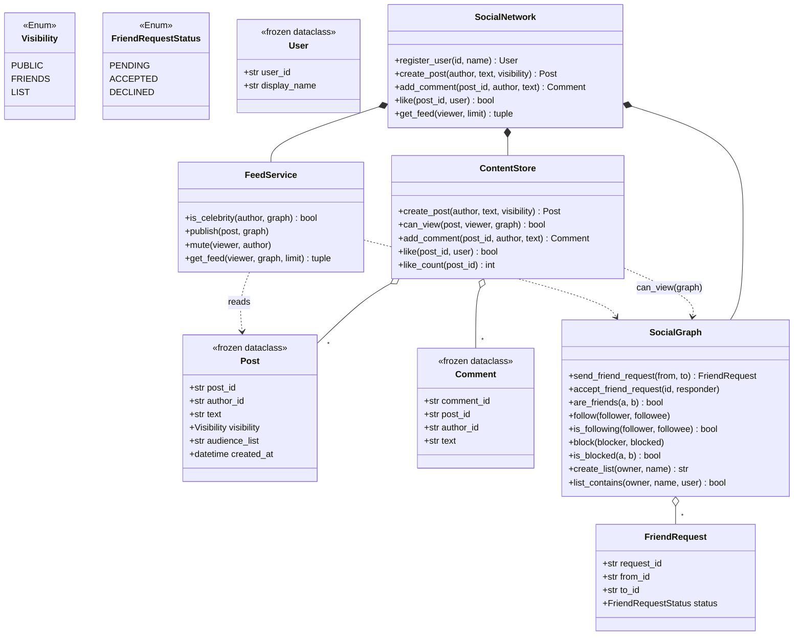

# 设计题解：社交网络（Social Network）

## 题目与澄清

面试官通常这样开场："设计一个简化版的社交网络。用户可以加好友、可以发帖子、可以刷到朋友们的
最新动态；帖子有隐私范围，不是所有人都能看。"

这道题看起来是"CRUD 加一张关注表"，实际上考的是两件事：**关系的形状**（好友和关注是不是同一
件事）和**信息流从哪来**（现算还是提前算好）。这两个决定不了，后面的隐私、拉黑、评论点赞都无处
安放。

动笔之前值得问清楚的几件事，每一件都会改变设计：

- **"好友"和"关注"是同一个概念，还是两个？** 这是本题最容易被含糊带过的一点。Facebook 的好友
  是双向的、需要双方同意；Twitter 的关注是单向的、任何人可以关注任何人。产品要不要同时支持
  "我关注一个我不认识的公众人物"和"我和现实中的朋友互相确认关系"？答案通常是**两者都要**，
  且服务不同的目的——这句澄清直接决定了要不要建两套存储。
- **规模有多大？** 这决定了信息流该怎么算。几百个用户、每人几十个好友，现算（读扩散）完全够用；
  上百万用户、粉丝数极度不均（有大V），就要考虑提前算好（写扩散）以及大V账号的特殊处理。
  这道题按"支持讨论两种方案、并实现能推演到大规模的那一种"来准备。
- **隐私粒度到什么程度？** 公开 / 仅好友 / 自定义分组，三档基本覆盖面试期望；再细（单条帖子对
  单个人可见）通常是加分项而不是必答项。
- **拉黑意味着什么？** 只是看不见对方的帖子，还是连好友、关注这些既有关系也要一并清除？答案
  通常是后者——拉黑是社交产品里语义最重的一个动作，面试官会专门追问这一点。
- **信息流要不要实时推送？** 不要——那是另一道题（[[patterns.observer|观察者与事件（Observer）]]
  描述的推送式设计，聊天室与通知服务两题都在用）。这里只要求"我打开 App 时看到什么"，是一个
  拉取（pull）接口，不是一条常驻的事件流。

**范围之外**：跨进程的持久化与分布式一致性（本文是进程内版本，重启即丢）、真正的关系型/图数据库
存储、推送通知、图片与富媒体、全文搜索、Feed 排序算法（本文按时间倒序，不做个性化推荐）、用户
认证与鉴权。

## 需求与分级

机器编码轮不会一次把需求摊开，它一关一关加，考的是"新需求来了旧代码动不动"。

**第 1 关（约 15 分钟，核心流程）**：用户注册；好友关系（发送请求、接受/拒绝，双方地位对等）
与关注关系（单向，不需要对方同意）——两套机制都要建出来，并且说清楚为什么两个都要；发帖子；
按关注关系产生一份按时间倒序的信息流。

**第 2 关（约 15 分钟，信息流怎么产生）**：把"信息流从哪来"的决定摆上台面——发帖时就把帖子推
到每个关注者的收件箱（写扩散），还是刷信息流时现场把关注的人的帖子拉出来合并（读扩散）。给出
一个具体的用户规模与粉丝分布，算出两种方案各自的代价，并回答"粉丝几百万的大V账号会把你的选择
逼到什么地步"。

**第 3 关（约 15 分钟，隐私与拉黑）**：帖子有三档可见范围——所有人、仅好友、指定的命名分组
（比如"亲密好友"）；可见性判定必须**只写在一个地方**，不能信息流一套、单条帖子查询再来一套。
拉黑：必须同时切断可见性（互相看不见帖子）和互动（不能评论、点赞、发好友请求、关注），而且是
双向的——无论谁拉黑了谁。

**第 4 关（选做，扩展）**：评论和点赞作为独立的实体（各自有作者、有时间、有计数），或者"静音"
（不想看某人的动态但不想取关/绝交）。判分点只有一个：这两件事要不要碰 `FeedService.publish`
——一个好答案是完全不用碰。

## 核心对象与职责

| 类 | 单一职责 | 它拥有的不变量 |
|---|---|---|
| `Visibility`（`Enum`） | 帖子的三档可见范围 | 取值封闭：公开 / 仅好友 / 指定分组 |
| `FriendRequestStatus`（`Enum`） | 一条好友请求的状态机 | 待处理 → 接受/拒绝，不可逆 |
| `User`（冻结） | 系统认识的最小用户信息 | 只读，不持有任何关系 |
| `FriendRequest`（可变） | 一次好友请求的生命周期 | 只被 `SocialGraph` 一处修改 |
| `Post`（冻结） | 一条帖子的完整快照 | 可见性字段决定谁能看，见 `can_view` |
| `Comment`（冻结） | 一条评论，独立实体 | 有自己的作者与时间，不是帖子的一个字段 |
| `SocialGraph` | 好友、关注、拉黑、命名分组四种关系 | 好友双向同存同灭；拉黑立刻切断双方已有的好友与关注边 |
| `ContentStore` | 帖子/评论/点赞的存储，**唯一**的可见性判定 `can_view` | 判定把关系图当参数传入，不持有引用 |
| `FeedService` | 信息流怎么产生：写扩散为主，大V读时合并 | 收件箱与"某人最近发过什么"两个容器都有界 |
| `SocialNetwork` | 编排入口：跨对象的校验与协调 | 不重复实现任何一个子对象已有的逻辑 |

关系上，`SocialNetwork` **组合**（composition）了 `SocialGraph`、`ContentStore`、`FeedService`
三者——它们的生命周期与 `SocialNetwork` 完全绑定，没人会在外部单独持有一个 `SocialGraph`。
`Post` 与 `Comment` 是一对多，`Comment` 引用 `post_id` 而不是持有 `Post` 对象本身（值语义，
帖子被删除评论也不会跟着悬空引用一个失效对象）。`FriendRequest` 与 `SocialGraph` 是组合：请求
的生命周期完全由图管理，外部只拿到一个 id。

`SocialGraph`、`ContentStore`、`FeedService` 三个类彼此**不持有对方的引用**——`can_view`
和 `publish`/`get_feed` 都是把需要的另一个对象当参数传入。这不是偷懒，是刻意的：三个类各自
可以脱离另外两个单独测试，也不存在"改了图的内部表示，内容存储要不要跟着改"这种耦合。



## 关键设计决策

### 决策一：好友与关注，是一套机制还是两套

这是本题的第一个分叉，很多参考实现直接跳过——只做关注，或者只做好友，把另一个的语义硬塞进去。

选项 A，**只做关注**（Twitter 模型）：单向、无需同意。简单，但表达不了"这是我认识的人，我们
互相同意做朋友"这种对称关系——一条仅好友可见的帖子，"好友"到底指什么就说不清楚。

选项 B，**只做好友**（早期 Facebook 模型）：双向、需要请求与接受。表达不了"我想看一个公众人物
的动态，但他不会反过来关注我"——大V账号的存在本身就要求一种不对称关系。

**选两者都要，各司其职**：好友是**信任圈**，靠请求—接受成对创建，决定"仅好友可见"这一档隐私；
关注是**内容订阅**，单向，决定信息流里能刷到谁。两者不是互相替代，而是回答不同的问题。为了
不让用户体验分裂（成为好友却看不到对方动态），`accept_friend_request` 顺带建立双向关注：

```python
def _accept(self, request: FriendRequest) -> None:
    request.status = FriendRequestStatus.ACCEPTED
    self._friends.setdefault(request.from_id, set()).add(request.to_id)
    self._friends.setdefault(request.to_id, set()).add(request.from_id)
    self.follow(request.from_id, request.to_id)
    self.follow(request.to_id, request.from_id)
```

代价被诚实地保留：`unfriend` **不**强制取关（也许还想看看对方发了什么），`unfollow` 也不影响
好友关系（不想看动态不代表绝交）。这两条不对称行为各写了一条回归测试，因为它们最容易被"顺手"
实现成互相牵连。

好友请求还处理了一个常被忽略的边界：如果 A 发给 B 一条请求，B 也正好发了一条给 A（两人互相
主动加好友），第二条请求**直接生效**而不是悬着变成两条互相矛盾的待处理请求——两个方向的意愿
已经一致，没有理由制造一次多余的"请再确认一下"。

### 决策二：信息流怎么产生——写扩散、读扩散，与大V的例外

这是本题分数最集中的一处，因为它要求算一笔账，而不是选一个"听起来对"的方案。

**写扩散（fan-out on write）**：发帖时把帖子 id 推进每个关注者的收件箱；刷信息流时只读自己的
收件箱，`O(1)`（相对于关注人数）。**读扩散（fan-out on read）**：发帖只是存一条记录；刷信息流
时现场把关注的所有人的近期帖子拉出来合并，`O(k)`（`k` 是关注人数），jkaus324 的 Simplified
Twitter 实现（见"来源与延伸"）用一个 `k` 路归并的最大堆把这一步做到 `O(结果数 × log k)`。

代价算一笔账：假设 100 万用户，中位关注数 150，读写比（刷信息流次数 : 发帖次数）通常是
100:1 甚至更高——这是社交产品的常态，读远比写频繁。

- 写扩散：发一条帖子平均写 150 份收件箱（`O(F)`，`F` 是粉丝数），但每次刷信息流只读一次，
  `O(1)`。把"贵"的计算挪到了**次数少**的写路径上。
- 读扩散：发帖 `O(1)`，但每次刷信息流要合并 150 个人的时间线，`O(k)`。把"贵"的计算留在了
  **次数多**的读路径上，乘以 100 倍的调用频率，总计算量远大于写扩散。

**选写扩散**，因为读写比悬殊时它总代价更低，而且用户体验也更好（打开 App 零延迟）。但写扩散
有一个必须承认的代价——**大V账号**：一个 500 万粉丝的账号发一条帖子，写扩散意味着一次写
500 万份收件箱，这在真实系统里是不可接受的尖峰负载（根本不是"稍微慢一点"，是能不能扛住的问题）。
本题解的处理是**分账号而非分帖子**：`FeedService.is_celebrity` 用粉丝数判断，达到阈值的账号
**完全跳过写扩散**：

```python
def publish(self, post: Post, graph: SocialGraph) -> None:
    self._authored.setdefault(post.author_id, deque(maxlen=self._authored_capacity)) \
        .appendleft(post.post_id)
    if self.is_celebrity(post.author_id, graph):
        return
    for follower_id in graph.followers_of(post.author_id):
        if self._store.can_view(post, follower_id, graph):
            self._inboxes.setdefault(follower_id, deque(maxlen=self._inbox_capacity)) \
                .appendleft(post.post_id)
```

读信息流时，对关注了大V的人，现场把大V最近发的几条帖子合并进来——这部分退化成读扩散，但
只发生在少数大V身上，代价可控。这正是[[solution-pub-sub|Pub-Sub]]里"推是拉之上包一层"的
同一个直觉反过来用：那道题默认拉、推只是可选的加速层；这道题默认推、对负载会打爆的少数账号
退回拉。两道题选了相反的默认值，是因为读写比不同——Pub-Sub 里订阅者数量通常远小于社交网络的
粉丝规模。

这份设计还有一处诚实的代价："写扩散是发布时刻的快照"：如果之后取关，已经推到收件箱里的帖子
不会被收回，这是推模型本身的性质，不是 bug。但拉黑不受这条限制——因为最终的判定永远要经过
下面第三条决策里的 `can_view`。

### 决策三：可见性判定只写在一个地方，拒绝一个"更规范"的责任链

一个常见的"更工程化"的冲动是把隐私规则做成一条责任链（Chain of Responsibility）或者一套
Specification 模式的组合规则对象，每一档可见性、每一条拉黑规则各是一个可插拔的节点，运行时
拼装成一条判定链。

这个冲动应该被拒绝。可见性规则一共四条、彼此有严格的先后关系（先问拉黑，再问是不是作者本人，
再按可见范围分三支），穷尽而且稳定，**没有"运行时按需要重新拼装判定顺序"这个需求**——责任链
解决的是"节点集合和顺序都可能变化"的问题，这里两者都不变。拆成责任链只会让一个四分支的
`if/elif` 变成四个类加一条注册代码，读的时候要在四个文件之间跳转才能拼出判定逻辑，是本题解
主动拒绝模式的一处。

**真正要紧的决定不是用不用模式，是这个判定函数只能存在一处**：

```python
def can_view(self, post: Post, viewer_id: str, graph: SocialGraph) -> bool:
    if graph.is_blocked(post.author_id, viewer_id):
        return False
    if viewer_id == post.author_id:
        return True
    if post.visibility is Visibility.PUBLIC:
        return True
    if post.visibility is Visibility.FRIENDS:
        return graph.are_friends(post.author_id, viewer_id)
    return graph.list_contains(post.author_id, post.audience_list, viewer_id)
```

`FeedService.get_feed` 用它做最终把关，`SocialNetwork.can_view` 直接暴露给调用方查单条帖子，
`FeedService.publish` 用它筛值得写进收件箱的候选者——**三处调用同一个函数**，而不是三处各写
一遍判定逻辑。这样"拉黑要不要切可见性"这种规则改一次就对所有路径生效；一旦把判定逻辑复制三份，
产品经理加一条新规则时，漏改一处就是一个安全漏洞，而不是一个明显的 bug。

### 决策四：拉黑必须双向切断，且在读时兜底而不只改一次关系图

拉黑如果只做成"往一个黑名单集合里加一条记录"，很容易漏掉两件事：切断已有关系、双向生效。

`SocialGraph.block` 把两件事都做完：往对称的拉黑集合里加记录（双方都能查到），**并且**立刻
移除双方已有的好友和关注边：

```python
def block(self, blocker_id: str, blocked_id: str) -> None:
    self._blocked.setdefault(blocker_id, set()).add(blocked_id)
    self._blocked.setdefault(blocked_id, set()).add(blocker_id)
    self._friends.get(blocker_id, set()).discard(blocked_id)
    self._friends.get(blocked_id, set()).discard(blocker_id)
    self._following.get(blocker_id, set()).discard(blocked_id)
    self._followers.get(blocked_id, set()).discard(blocker_id)
    self._following.get(blocked_id, set()).discard(blocker_id)
    self._followers.get(blocker_id, set()).discard(blocked_id)
```

但这还不够：决策二说过，写扩散把帖子**推到了**收件箱里，拉黑发生在推送之后，已经在收件箱里的
帖子该怎么办？答案不是去遍历所有收件箱删除对应条目（那是一次代价随收件箱总数增长的操作，而且
容易漏），而是让 `can_view` 在**每一次**读信息流时都被重新判一遍——拉黑因此不依赖"清理已经
扩散出去的数据"，收件箱里那条 id 还在，但 `get_feed` 的最后一步会把它过滤掉。这是决策三"判定
只有一处"直接带来的好处：只要保证一处判定始终被调用，新规则（拉黑）不需要用一次性清理去补救
历史数据。

### 决策五：点赞是幂等的集合成员关系，不是一个只增不减的计数器

点赞最省事的实现是一个 `dict[post_id, int]` 计数器，`like()` 就 `+1`。它有一个真实的 bug：
同一个用户点两次赞——重复点击、客户端重试、双击误触——计数器会变成 2，而产品语义应该是"仍然
是赞过的状态"。

**选集合**：`dict[post_id, set[user_id]]`。`like()` 检查用户是否已在集合里，不在才加入并返回
`True`（真正点了一次新赞），已经在则返回 `False`（幂等，无副作用）；`like_count` 是集合的大小，
天然去重，`unlike` 直接删除。多付出的代价是每个赞占用一个用户 id 的存储而不是一个整数，在这道
题的规模下完全不是问题；换回来的是"点两次"和"点一次"永远得到同一个结果，不需要在客户端或者
接口层面另外做去重。

评论则是**独立实体**而不是帖子上的一个列表字段：`Comment` 有自己的 `comment_id`、作者、时间，
`comment_count` 从 `_comments` 字典的长度派生，不单独维护一个计数字段——单一数据源，不存在
"计数和实际列表对不上"的可能。

## 代码走读

下面是经过测试的完整实现。读的时候盯住四个地方：`ContentStore.can_view`（唯一的可见性判定，
决策三）、`FeedService.publish` 与 `get_feed`（写扩散加大V例外，决策二）、`SocialGraph.block`
（双向切断三种既有关系，决策四）、`SocialGraph._accept`（好友与关注在这一处交汇，决策一）。

`SocialGraph`、`ContentStore`、`FeedService` 都不在构造函数里持有彼此的引用，需要另一个对象时
一律通过参数传入（`can_view(post, viewer, graph)`、`publish(post, graph)`）。这让三个类可以
分别用最简单的方式单独测试，也让 `SocialNetwork.create_post` 这样的编排方法一眼能看出数据从
哪来、到哪去：先在 `ContentStore` 落库，再交给 `FeedService.publish` 扩散，顺序本身就是文档。

`SocialNetwork` 看起来方法很多，但它不是一个"纯转发"的类：`create_post` 协调了落库与扩散两步，
`add_comment`/`like` 在转发前先做了拉黑校验，`follow`/`send_friend_request` 在转发前校验了用户
是否已注册——每一处转发前后都有一句自己的判断，这是编排点该有的样子，而不是"为了有一个入口类"
硬造出来的一层包装。

%% code:begin solution.py %%
```python
"""社交网络（Social Network）：好友关系、发帖与信息流、隐私可见性规则。
设计：`SocialGraph` 只管关系（好友、关注、拉黑、命名分组），`ContentStore` 只管内容（帖子、
评论、点赞）并拥有唯一一处可见性判定 `can_view`，`FeedService` 决定信息流怎么产生（写扩散 +
大V读时合并），`SocialNetwork` 把三者串起来、做跨对象的校验。这是进程内的对象设计，不是分布式
系统——没有分片、没有跨机复制，全部状态留在内存里，重启即丢。
"""

from __future__ import annotations

import itertools
from collections import deque
from collections.abc import Callable
from dataclasses import dataclass
from datetime import datetime, timezone
from enum import Enum

Clock = Callable[[], datetime]


def utc_now() -> datetime:
    """默认时钟。带时区，帖子之间的先后因此可以跨来源比较。"""
    return datetime.now(timezone.utc)


class SocialNetworkError(Exception):
    """本组件所有失败的共同基类，调用方可以只捕获这一个。"""


class UnknownUserError(SocialNetworkError, KeyError):
    """引用了一个没有注册过的用户 id。"""


class UnknownRequestError(SocialNetworkError, KeyError):
    """好友请求 id 不存在。"""


class DuplicateRequestError(SocialNetworkError):
    """两人之间已经有一条待处理的同向好友请求。"""


class InvalidRequestStateError(SocialNetworkError):
    """对一条已经不是"待处理"的请求再次接受/拒绝。"""


class BlockedError(SocialNetworkError):
    """双方存在拉黑关系，操作因此被拒绝。"""


class PostNotFoundError(SocialNetworkError, KeyError):
    """帖子 id 不存在。"""


class Visibility(Enum):
    """一条帖子的可见范围。取值集合是封闭的三档，因此用 `Enum`。"""

    PUBLIC = "public"     # 任何人（除被作者拉黑者）可见
    FRIENDS = "friends"    # 仅互为好友可见
    LIST = "list"          # 仅命名分组（如"亲密好友"）里的成员可见


class FriendRequestStatus(Enum):
    """一条好友请求的状态机：待处理 -> 接受 / 拒绝，不可逆。"""

    PENDING = "pending"
    ACCEPTED = "accepted"
    DECLINED = "declined"


@dataclass(frozen=True, slots=True)
class User:
    """一个用户：只有系统需要知道的最小信息。"""

    user_id: str
    display_name: str


@dataclass(slots=True)
class FriendRequest:
    """一条好友请求。`status` 会变，所以不是 `frozen`——但它只由 `SocialGraph` 一处修改。"""

    request_id: str
    from_id: str
    to_id: str
    status: FriendRequestStatus = FriendRequestStatus.PENDING


@dataclass(frozen=True, slots=True)
class Post:
    """一条帖子：冻结快照，谁都能安全地拿去比较、排序、放进多个人的信息流。"""

    post_id: str
    author_id: str
    text: str
    visibility: Visibility
    audience_list: str | None
    created_at: datetime


@dataclass(frozen=True, slots=True)
class Comment:
    """一条评论：独立实体，不是帖子上的一个字段——它有自己的作者和时间。"""

    comment_id: str
    post_id: str
    author_id: str
    text: str
    created_at: datetime


class SocialGraph:
    """用户之间的关系：好友（对称）、关注（不对称）、拉黑（对称）、命名分组。

    它拥有三条不变量：好友关系永远双向同时存在或同时不存在；拉黑立刻切断双方已有的好友与
    关注边，且此后任何一方都不能再对另一方发起关系或互动；接受好友请求会顺带建立双向关注
    （产品意义：好友本就该互相看到对方的信息流，除非之后显式取关）。
    """

    def __init__(self) -> None:
        self._friends: dict[str, set[str]] = {}
        self._requests: dict[str, FriendRequest] = {}
        self._pending_index: dict[tuple[str, str], str] = {}
        self._following: dict[str, set[str]] = {}
        self._followers: dict[str, set[str]] = {}
        self._blocked: dict[str, set[str]] = {}
        self._lists: dict[tuple[str, str], set[str]] = {}
        self._next_request_id = itertools.count(1)

    # ---- 好友：请求 + 接受，双向同时创建 --------------------------------

    def send_friend_request(self, from_id: str, to_id: str) -> FriendRequest:
        """发起一条好友请求。若对方已经先发了一条待处理请求给我，直接互相接受——两个方向的
        意愿本来就一致，没有理由让两条请求互相悬着。"""
        if from_id == to_id:
            raise ValueError("cannot friend yourself")
        if self.is_blocked(from_id, to_id):
            raise BlockedError(f"{from_id} and {to_id} have blocked each other")
        if self.are_friends(from_id, to_id):
            raise DuplicateRequestError(f"{from_id} and {to_id} are already friends")
        mirror = self._pending_request(to_id, from_id)
        if mirror is not None:
            self._accept(mirror)
            return mirror
        if self._pending_request(from_id, to_id) is not None:
            raise DuplicateRequestError(f"a pending request from {from_id} to {to_id} already exists")
        request = FriendRequest(f"freq-{next(self._next_request_id)}", from_id, to_id)
        self._requests[request.request_id] = request
        self._pending_index[(from_id, to_id)] = request.request_id
        return request

    def accept_friend_request(self, request_id: str, responder_id: str) -> None:
        request = self._require_pending(request_id)
        if responder_id != request.to_id:
            raise ValueError("only the recipient can accept a friend request")
        self._accept(request)

    def decline_friend_request(self, request_id: str, responder_id: str) -> None:
        request = self._require_pending(request_id)
        if responder_id != request.to_id:
            raise ValueError("only the recipient can decline a friend request")
        request.status = FriendRequestStatus.DECLINED
        self._pending_index.pop((request.from_id, request.to_id), None)

    def _require_pending(self, request_id: str) -> FriendRequest:
        try:
            request = self._requests[request_id]
        except KeyError:
            raise UnknownRequestError(request_id) from None
        if request.status is not FriendRequestStatus.PENDING:
            raise InvalidRequestStateError(f"request {request_id} is already {request.status.value}")
        return request

    def _accept(self, request: FriendRequest) -> None:
        request.status = FriendRequestStatus.ACCEPTED
        self._pending_index.pop((request.from_id, request.to_id), None)
        self._friends.setdefault(request.from_id, set()).add(request.to_id)
        self._friends.setdefault(request.to_id, set()).add(request.from_id)
        self.follow(request.from_id, request.to_id)
        self.follow(request.to_id, request.from_id)

    def _pending_request(self, from_id: str, to_id: str) -> FriendRequest | None:
        """O(1) 查某个方向有没有一条待处理请求——这条索引只装待处理的，接受/拒绝后立刻摘除，
        不会随着请求历史的增长而变慢（`_requests` 本身作为审计记录保留，故意不删）。"""
        request_id = self._pending_index.get((from_id, to_id))
        return self._requests.get(request_id) if request_id is not None else None

    def unfriend(self, a: str, b: str) -> None:
        """解除好友。**不**顺带取关——两人仍可能想继续看到彼此的公开信息流。"""
        self._friends.get(a, set()).discard(b)
        self._friends.get(b, set()).discard(a)

    def are_friends(self, a: str, b: str) -> bool:
        return b in self._friends.get(a, ())

    # ---- 关注：单向 --------------------------------------------------

    def follow(self, follower_id: str, followee_id: str) -> None:
        if follower_id == followee_id:
            raise ValueError("cannot follow yourself")
        if self.is_blocked(follower_id, followee_id):
            raise BlockedError(f"{follower_id} and {followee_id} have blocked each other")
        self._following.setdefault(follower_id, set()).add(followee_id)
        self._followers.setdefault(followee_id, set()).add(follower_id)

    def unfollow(self, follower_id: str, followee_id: str) -> None:
        self._following.get(follower_id, set()).discard(followee_id)
        self._followers.get(followee_id, set()).discard(follower_id)

    def is_following(self, follower_id: str, followee_id: str) -> bool:
        return followee_id in self._following.get(follower_id, ())

    def followers_of(self, user_id: str) -> frozenset[str]:
        """快照，不是内部集合本身——调用方不该能改写图的状态。"""
        return frozenset(self._followers.get(user_id, ()))

    def following_of(self, user_id: str) -> frozenset[str]:
        return frozenset(self._following.get(user_id, ()))

    def follower_count(self, user_id: str) -> int:
        return len(self._followers.get(user_id, ()))

    # ---- 拉黑：对称，且立刻切断已有关系 --------------------------------

    def block(self, blocker_id: str, blocked_id: str) -> None:
        """拉黑必须切两个方向——可见性和互动都不能再发生，无论谁拉黑了谁。"""
        self._blocked.setdefault(blocker_id, set()).add(blocked_id)
        self._blocked.setdefault(blocked_id, set()).add(blocker_id)
        self._friends.get(blocker_id, set()).discard(blocked_id)
        self._friends.get(blocked_id, set()).discard(blocker_id)
        self._following.get(blocker_id, set()).discard(blocked_id)
        self._followers.get(blocked_id, set()).discard(blocker_id)
        self._following.get(blocked_id, set()).discard(blocker_id)
        self._followers.get(blocker_id, set()).discard(blocked_id)

    def unblock(self, blocker_id: str, blocked_id: str) -> None:
        """解除拉黑不恢复好友或关注——想重新联系，重新发起。"""
        self._blocked.get(blocker_id, set()).discard(blocked_id)
        self._blocked.get(blocked_id, set()).discard(blocker_id)

    def is_blocked(self, a: str, b: str) -> bool:
        return b in self._blocked.get(a, ())

    # ---- 命名分组：帖子按分组可见 --------------------------------------

    def create_list(self, owner_id: str, name: str) -> str:
        self._lists.setdefault((owner_id, name), set())
        return name

    def add_to_list(self, owner_id: str, name: str, member_id: str) -> None:
        self._lists.setdefault((owner_id, name), set()).add(member_id)

    def list_contains(self, owner_id: str, name: str | None, user_id: str) -> bool:
        return name is not None and user_id in self._lists.get((owner_id, name), ())


class ContentStore:
    """帖子、评论、点赞的存储，以及**唯一一处**可见性判定。

    可见性检查不属于 `Post`（它不该认识 `SocialGraph`），也不重复写在 `FeedService` 和
    facade 里——`can_view` 把关系图当参数传入而不是持有引用，任何需要判断"谁能看这条帖子"
    的地方都调它一次，永不第二处实现。
    """

    def __init__(self, clock: Clock = utc_now) -> None:
        self._clock = clock
        self._posts: dict[str, Post] = {}
        self._comments: dict[str, list[Comment]] = {}
        self._likes: dict[str, set[str]] = {}
        self._next_post_id = itertools.count(1)
        self._next_comment_id = itertools.count(1)

    def create_post(self, author_id: str, text: str, visibility: Visibility = Visibility.PUBLIC,
                    audience_list: str | None = None) -> Post:
        if visibility is Visibility.LIST and audience_list is None:
            raise ValueError("LIST visibility requires an audience_list name")
        post = Post(f"post-{next(self._next_post_id)}", author_id, text, visibility,
                   audience_list, self._clock())
        self._posts[post.post_id] = post
        return post

    def get(self, post_id: str) -> Post:
        try:
            return self._posts[post_id]
        except KeyError:
            raise PostNotFoundError(post_id) from None

    def can_view(self, post: Post, viewer_id: str, graph: SocialGraph) -> bool:
        """**唯一**的可见性判定。发布时用它筛谁值得写扩散，读信息流时再用它兜底——两处调用
        同一个函数，因此拉黑之类的规则只需要写在这一个地方就对所有路径生效。"""
        if graph.is_blocked(post.author_id, viewer_id):
            return False
        if viewer_id == post.author_id:
            return True
        if post.visibility is Visibility.PUBLIC:
            return True
        if post.visibility is Visibility.FRIENDS:
            return graph.are_friends(post.author_id, viewer_id)
        return graph.list_contains(post.author_id, post.audience_list, viewer_id)

    def add_comment(self, post_id: str, author_id: str, text: str) -> Comment:
        self.get(post_id)
        comment = Comment(f"comment-{next(self._next_comment_id)}", post_id, author_id,
                         text, self._clock())
        self._comments.setdefault(post_id, []).append(comment)
        return comment

    def comments_for(self, post_id: str) -> tuple[Comment, ...]:
        return tuple(self._comments.get(post_id, ()))

    def comment_count(self, post_id: str) -> int:
        return len(self._comments.get(post_id, ()))

    def like(self, post_id: str, user_id: str) -> bool:
        """幂等：重复点赞不报错也不重复计数，返回这一次是不是真的新增了一个赞。"""
        self.get(post_id)
        likers = self._likes.setdefault(post_id, set())
        if user_id in likers:
            return False
        likers.add(user_id)
        return True

    def unlike(self, post_id: str, user_id: str) -> bool:
        likers = self._likes.get(post_id)
        if not likers or user_id not in likers:
            return False
        likers.discard(user_id)
        return True

    def like_count(self, post_id: str) -> int:
        return len(self._likes.get(post_id, ()))


class FeedService:
    """信息流：写扩散（fan-out on write）为主，大V例外读时合并。

    每次发帖把帖子 id 推进每个能看到它的关注者的收件箱（有界，防止无限增长）；这份扩散是
    **发布时刻的快照**——之后解除好友不会把已经推送的帖子收回，这是写扩散模型本身的代价，
    诚实地承认它。拉黑不受这条限制：`can_view` 在读信息流时仍会被再判一次，所以拉黑总是
    立即生效，即便帖子已经躺在收件箱里。粉丝数达到阈值的账号（大V）完全跳过扩散——扩散一条
    要写几百万份收件箱不现实——改成读者在读信息流时把大V的近期帖子直接拉过来合并。
    """

    def __init__(self, store: ContentStore, celebrity_threshold: int = 10_000,
                inbox_capacity: int = 200, authored_capacity: int = 50) -> None:
        self._store = store
        self._celebrity_threshold = celebrity_threshold
        self._inbox_capacity = inbox_capacity
        self._authored_capacity = authored_capacity
        self._inboxes: dict[str, deque[str]] = {}
        self._authored: dict[str, deque[str]] = {}
        self._muted: dict[str, set[str]] = {}

    def is_celebrity(self, author_id: str, graph: SocialGraph) -> bool:
        return graph.follower_count(author_id) >= self._celebrity_threshold

    def publish(self, post: Post, graph: SocialGraph) -> None:
        self._authored.setdefault(post.author_id, deque(maxlen=self._authored_capacity)) \
            .appendleft(post.post_id)
        if self.is_celebrity(post.author_id, graph):
            return
        for follower_id in graph.followers_of(post.author_id):
            if self._store.can_view(post, follower_id, graph):
                self._inboxes.setdefault(follower_id, deque(maxlen=self._inbox_capacity)) \
                    .appendleft(post.post_id)

    def mute(self, viewer_id: str, author_id: str) -> None:
        self._muted.setdefault(viewer_id, set()).add(author_id)

    def unmute(self, viewer_id: str, author_id: str) -> None:
        self._muted.get(viewer_id, set()).discard(author_id)

    def inbox_size(self, user_id: str) -> int:
        return len(self._inboxes.get(user_id, ()))

    def get_feed(self, viewer_id: str, graph: SocialGraph, limit: int = 20) -> tuple[Post, ...]:
        muted = self._muted.get(viewer_id, frozenset())
        candidates = list(self._inboxes.get(viewer_id, ()))
        for followee_id in graph.following_of(viewer_id):
            if self.is_celebrity(followee_id, graph):
                candidates.extend(self._authored.get(followee_id, ()))
        seen: set[str] = set()
        posts: list[Post] = []
        for post_id in candidates:
            if post_id in seen:
                continue
            seen.add(post_id)
            try:
                post = self._store.get(post_id)
            except PostNotFoundError:
                continue
            if post.author_id in muted or not self._store.can_view(post, viewer_id, graph):
                continue
            posts.append(post)
        posts.sort(key=lambda p: (p.created_at, p.post_id), reverse=True)
        return tuple(posts[:limit])


class SocialNetwork:
    """整个系统的入口：持有关系图、内容仓库、信息流服务，并做跨对象的编排与校验。

    `create_post` 要先落库再扩散，`add_comment`/`like` 要先查拉黑再落库——这些是需要看到
    两个子对象才能做的判断，facade 因此不是纯转发：它是编排点。
    """

    def __init__(self, clock: Clock = utc_now, celebrity_threshold: int = 10_000,
                inbox_capacity: int = 200) -> None:
        self._users: dict[str, User] = {}
        self._graph = SocialGraph()
        self._content = ContentStore(clock)
        self._feed = FeedService(self._content, celebrity_threshold, inbox_capacity)

    def register_user(self, user_id: str, display_name: str) -> User:
        user = User(user_id, display_name)
        self._users[user_id] = user
        return user

    def _require(self, user_id: str) -> None:
        if user_id not in self._users:
            raise UnknownUserError(user_id)

    def send_friend_request(self, from_id: str, to_id: str) -> FriendRequest:
        self._require(from_id)
        self._require(to_id)
        return self._graph.send_friend_request(from_id, to_id)

    def accept_friend_request(self, request_id: str, responder_id: str) -> None:
        self._graph.accept_friend_request(request_id, responder_id)

    def decline_friend_request(self, request_id: str, responder_id: str) -> None:
        self._graph.decline_friend_request(request_id, responder_id)

    def unfriend(self, a: str, b: str) -> None:
        self._graph.unfriend(a, b)

    def are_friends(self, a: str, b: str) -> bool:
        return self._graph.are_friends(a, b)

    def follow(self, follower_id: str, followee_id: str) -> None:
        self._require(follower_id)
        self._require(followee_id)
        self._graph.follow(follower_id, followee_id)

    def unfollow(self, follower_id: str, followee_id: str) -> None:
        self._graph.unfollow(follower_id, followee_id)

    def is_following(self, follower_id: str, followee_id: str) -> bool:
        return self._graph.is_following(follower_id, followee_id)

    def block(self, blocker_id: str, blocked_id: str) -> None:
        self._graph.block(blocker_id, blocked_id)

    def unblock(self, blocker_id: str, blocked_id: str) -> None:
        self._graph.unblock(blocker_id, blocked_id)

    def is_blocked(self, a: str, b: str) -> bool:
        return self._graph.is_blocked(a, b)

    def create_list(self, owner_id: str, name: str) -> str:
        return self._graph.create_list(owner_id, name)

    def add_to_list(self, owner_id: str, name: str, member_id: str) -> None:
        self._graph.add_to_list(owner_id, name, member_id)

    def create_post(self, author_id: str, text: str, visibility: Visibility = Visibility.PUBLIC,
                    audience_list: str | None = None) -> Post:
        self._require(author_id)
        post = self._content.create_post(author_id, text, visibility, audience_list)
        self._feed.publish(post, self._graph)
        return post

    def can_view(self, post_id: str, viewer_id: str) -> bool:
        return self._content.can_view(self._content.get(post_id), viewer_id, self._graph)

    def add_comment(self, post_id: str, author_id: str, text: str) -> Comment:
        post = self._content.get(post_id)
        if self._graph.is_blocked(post.author_id, author_id):
            raise BlockedError(f"{author_id} cannot interact with {post.author_id}")
        return self._content.add_comment(post_id, author_id, text)

    def comments_for(self, post_id: str) -> tuple[Comment, ...]:
        return self._content.comments_for(post_id)

    def comment_count(self, post_id: str) -> int:
        return self._content.comment_count(post_id)

    def like(self, post_id: str, user_id: str) -> bool:
        post = self._content.get(post_id)
        if self._graph.is_blocked(post.author_id, user_id):
            raise BlockedError(f"{user_id} cannot interact with {post.author_id}")
        return self._content.like(post_id, user_id)

    def unlike(self, post_id: str, user_id: str) -> bool:
        return self._content.unlike(post_id, user_id)

    def like_count(self, post_id: str) -> int:
        return self._content.like_count(post_id)

    def mute(self, viewer_id: str, author_id: str) -> None:
        self._feed.mute(viewer_id, author_id)

    def unmute(self, viewer_id: str, author_id: str) -> None:
        self._feed.unmute(viewer_id, author_id)

    def is_celebrity(self, user_id: str) -> bool:
        return self._feed.is_celebrity(user_id, self._graph)

    def get_feed(self, viewer_id: str, limit: int = 20) -> tuple[Post, ...]:
        return self._feed.get_feed(viewer_id, self._graph, limit)


def _demo() -> None:
    network = SocialNetwork(celebrity_threshold=2)
    for uid in ("ada", "grace", "linus"):
        network.register_user(uid, uid.title())
    request = network.send_friend_request("ada", "grace")
    network.accept_friend_request(request.request_id, "grace")
    network.follow("linus", "ada")
    post = network.create_post("ada", "hello, friends", Visibility.FRIENDS)
    network.like(post.post_id, "grace")
    print("grace's feed:", [p.text for p in network.get_feed("grace")])
    print("linus's feed (not a friend):", [p.text for p in network.get_feed("linus")])


if __name__ == "__main__":
    _demo()
```
%% code:end %%

## 测试与自检

测试固定了四类不变量：**关系**（关注单向、好友双向同生同灭、接受好友请求顺带互相关注、解除好友
不强制取关）；**信息流**（写扩散确实把帖子推进了关注者的信息流、大V账号跳过扩散但读信息流时
仍然出现、按时间倒序、静音过滤但不影响关注状态）；**隐私**（三档可见范围各自的边界、拉黑立刻
让已经扩散出去的帖子从信息流里消失、拉黑清除已有的好友与关注、拉黑之后新的好友请求与关注请求
被拒绝）；**评论点赞**（点赞幂等、评论有独立的作者与计数、拉黑之后不能互动、加评论点赞不改变
`get_feed` 在扩散路径上返回的结果——这条直接验证了第 4 关"不碰扩散逻辑"的要求）。

两分钟内给面试官演示：注册三个用户，A 和 B 互加好友（顺带验证互相关注），C 单向关注 A；A 发一条
仅好友可见的帖子，演示 B 能看见、C 看不见；A 拉黑 C，演示 C 原本能看见的公开帖子立刻不可见；
把 C 的关注对象设成一个"粉丝数超过阈值"的账号，展示这条帖子没有出现在 C 的收件箱里，但仍然
出现在 `get_feed` 的结果里——这一步是全场最容易让人追问"为什么"的地方，答案就是决策二那道
写扩散/读扩散的账。

## 扩展与追问

**新需求**：

- **转发/分享**——`Post` 加一个可选的 `shared_from: str | None` 字段指向原帖 id，`can_view`
  在展示转发时同时校验对原帖的可见性；`FeedService` 一行不改，转发本身仍然是一条走既有扩散
  路径的 `Post`。
- **@提及**——在 `create_post` 里解析文本、提取被提及的用户 id，对每个人做一次独立的"提及通知"
  （不经过 `FeedService`，因为提及不是"关注关系产生的内容"，是另一种触达）。
- **话题标签**——`Post` 加 `hashtags: tuple[str, ...]`，`ContentStore` 维护一个 `tag -> post_id`
  的倒排索引，是一个纯增量，不碰 `can_view` 和 `FeedService`。

**并发与线程安全**：本题解是单线程、无锁的——两道任务简报都没有要求并发访问，加锁只会掩盖设计
本身该讨论的问题。如果要支持多线程并发调用，`SocialGraph` 和 `FeedService` 各需要一把锁保护
自己的字典；细粒度的做法是给每个用户一把锁（好友、关注、收件箱都按用户分片），而不是一把全局
锁——这正是[[solution-pub-sub|Pub-Sub]]里"每个主题一把锁、位点归主题管"的同一条原则：锁的粒度
跟着"谁的不变量"走，而不是跟着"这是同一个类"走。跨两个用户的操作（比如好友请求的双向创建）
需要注意加锁顺序，避免用户 A 等 B、用户 B 又在等 A 的经典死锁——按用户 id 排序后固定加锁顺序
即可。

**持久化与规模**：真实系统里，`SocialGraph` 会是一张图数据库或者两张邻接表（好友、关注）；
`FeedService` 的收件箱在百万级用户规模下会拆成 Redis 里的有序集合，写扩散通过一个消息队列
异步完成而不是在 `create_post` 里同步执行；大V判断的阈值、以及一个账号从"普通"变成"大V"时
存量收件箱怎么处理，是一次单独的迁移问题，本文不展开。

## 常见错误

- **只做好友或只做关注，答不出另一半**。面试官几乎必问"如果我想关注一个不认识的名人怎么办"或
  "如果两个人互相确认关系怎么办"——只实现了一半的人会在这里卡住。
- **可见性判定散落在多处**：信息流里判一次、单条帖子查询接口里再判一次，两处逻辑不同步是这道
  题最常见的安全类 bug，而且很难在测试里被自然地发现（除非专门写一条"两处结果必须一致"的用例）。
  这也是 Java 参考实现的常见写法：把可见性逻辑塞进 `Post.isVisibleTo()`，帖子对象因此要认识
  拉黑与好友关系，职责越界。
- **拉黑只加黑名单，不清理既有关系**：面试官追问"那我们已经是好友的话呢"时答不上来。
- **点赞用整数计数器**：一遇到"重复点击算不算两次赞"就露馅，Python 里 `set` 天然就是这道题
  要的语义，没有理由多绕一层计数器再手写去重。
- **信息流现算现返回，从不讨论代价**：只给出一种实现、不说"如果用户规模到百万级会怎样"，等于
  没有触碰这道题真正的难点——这道题真正的分数在"权衡讲清楚"，不在"哪种写法更短"。
- **`__new__` 单例装下整个系统**：`SocialNetworkingService` 一个类塞进所有职责是 Java 参考实现
  的典型写法，Python 里用三个普通类加一个编排 facade 就够，见"核心对象与职责"。

## 45 分钟怎么分配

- **0–5 分钟，澄清**：好友和关注要不要分开？规模多大（决定信息流方案）？拉黑的语义？隐私档位？
- **5–10 分钟，画核心对象**：`User`/`Post`/`Comment`，`SocialGraph`/`ContentStore`/`FeedService`
  三个职责分开的类，口头过一遍谁拥有什么不变量。
- **10–25 分钟，写第 1、2 关**：好友请求—接受、关注、发帖、写扩散信息流。边写边说"发布时机是
  快照"这句话，提前埋下拉黑那条讨论的伏笔。
- **25–35 分钟，写第 3 关**：可见性判定、拉黑双向切断。主动提出"要不要用责任链"再自己否决它，
  展示这是权衡过的选择而不是没想到。
- **35–42 分钟，测试与第 4 关**：跑一遍关键测试，口头说明评论/点赞怎么加而不碰扩散路径。
- **42–45 分钟，追问**：抛出"如果这个账号有五百万粉丝呢"，主动讲大V例外——这通常是面试官准备
  好要问、但你先说出来会显著加分的一步。**时间不够时先砍**：命名分组（LIST 可见性）和静音，
  保留好友/关注的区分与写扩散的核心决策，那是这道题的骨架。

## 来源与延伸

- [awesome-low-level-design — Designing a Social Networking Service](https://github.com/ashishps1/awesome-low-level-design/blob/main/problems/social-networking-service.md)
  ——题面最全的免费参考，但用单例装下一切、信息流不分推拉；本题解拆成三个不互相持有引用的类，
  并且把"大V怎么办"作为一等公民讨论。
- [machine-coding-interview-questions — Simplified Twitter](https://github.com/jkaus324/machine-coding-interview-questions/tree/main/problems/tier2-intermediate/018-twitter)
  ——纯关注模型、读扩散加 k 路归并堆，是本题解"决策二"里读扩散一侧最扎实的参照；本题解选了
  相反的默认值（写扩散），原因见该决策。
- [Python `dataclasses`](https://docs.python.org/3/library/dataclasses.html) ——`Post`、
  `Comment`、`User` 为什么是 `frozen=True, slots=True` 而 `FriendRequest` 不是，权威语义在这里。
- [Python `enum`](https://docs.python.org/3/library/enum.html) ——`Visibility` 与
  `FriendRequestStatus` 取值封闭、用 `Enum`，而渠道一类开放集合不用（参见
  [[solution-notification-service|通知服务]]"决策二"里对同一取舍的完整讨论）。
