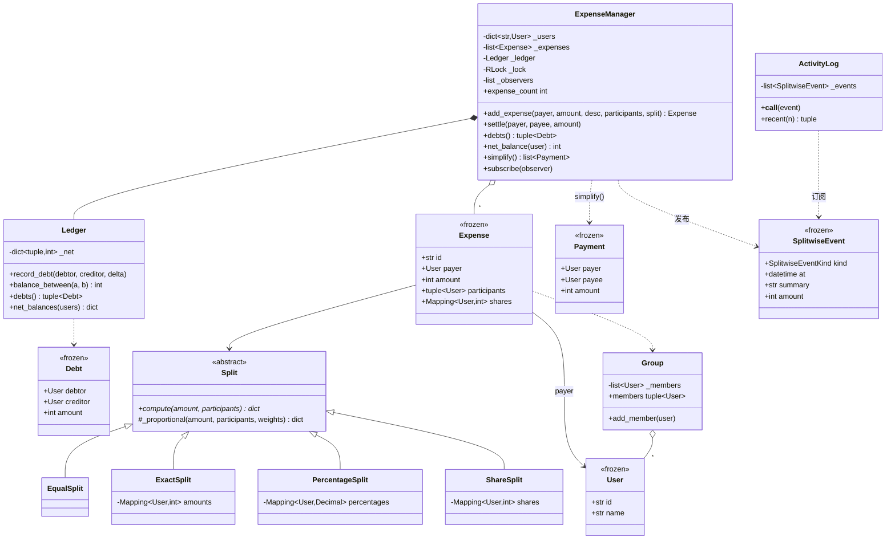

# 设计题解：分账（Splitwise）

## 题目与澄清

面试官通常这样开场："设计一个 Splitwise：一群人一起花钱，谁垫付了什么、怎么分摊，随时能查
'谁欠谁多少'，最后能用尽量少的转账把账结清。"这道题的表面结构比停车场还简单——用户、开销、
余额，三个名词就说完了——但它真正的难点不在类图，而在**算术**：一百块三个人分，那多出来的
一分钱归谁？以及**最少转账**这句话到底承诺了什么。下面这几个问题值得当场问出来：

- **钱用什么类型表示？** 这是必须第一个问、也是最容易被跳过的问题。如果面试官说"就用
  float 吧"，你应该温和地不同意：`0.1 + 0.2 != 0.3` 会让"份额之和等于总额"这条不变式在
  第三笔账上就崩掉。正确答案只有两种——**整数最小货币单位**（分、cent）或 `decimal.Decimal`。
  本文选整数分：比较和求和都是精确的，`sum(shares.values()) == amount` 是一个可以断言、
  也确实被测试断言的等式，而不是一句"误差在容忍范围内"。
- **有哪几种拆分方式？** "均分"是默认，但这道题几乎一定会加码到"按精确金额""按百分比"
  "按份额"。问清楚这一点，决定了第一版就要不要留出拆分算法可替换的缝。
- **余额存在哪一层？** 这是这道题真正的设计岔路口：是存"每一对用户之间的净额"，还是只存
  "每个人的净额"，还是干脆每次从开销流水现算？三种答案都能通过第 1 关，但在"谁欠谁多少"
  和"多币种"这两个追问上分数完全不同，见"关键设计决策"。
- **"最少转账"是硬要求还是尽力而为？** 如果你听到"最少"就直接写一个贪心并声称它是最优，
  面试官（尤其是算法背景的）会立刻追问。诚实的答案是：贪心保证 ≤ n-1 笔，但**不保证最优**，
  求真正的最小笔数是 NP-hard 的。把这句话说出来，比写对贪心更能拿分。
- **付款人一定是参与人之一吗？** 不一定。替一桌你没吃的饭买单是完全合法的，API 不该假设
  `payer in participants`。
- **会不会并发？** 多人同时在 App 里记账是这个产品的日常。本文从一开始就把并发当成第 3 关
  的正式需求，而不是事后补锁。

**范围之外**：不做用户注册与鉴权、不做真实的支付收单（`settle` 只是记一笔已经发生的还款，
不对接支付网关）、不做数据库持久化（在内存里建模，换存储时哪些边界不变见"扩展与追问"）。
多币种在本文里只给落点和方案，不实现汇率来源。

## 需求与分级

机考不会一次把需求说完，而是分关加码，每一关都在检验上一关的设计有没有把自己将死：

- **第 1 关（核心流程，约 20 分钟）**：用户、小组、记一笔均分的开销，以及一张回答
  "谁欠谁多少"的余额表。对应 `User`、`Group`、`Expense`、`Ledger`、`ExpenseManager.add_expense`
  和 `debts()`。
- **第 2 关（拆分策略，约 15 分钟）**：均分／按精确金额／按百分比／按份额四种拆分，**每种
  自己校验自己的输入**（精确金额之和必须等于总额，百分比之和必须等于 100，份额必须为正），
  并且产出的每人份额**精确加总等于总额**。对应 `Split` 抽象基类、`EqualSplit`、`ExactSplit`、
  `PercentageSplit`、`ShareSplit` 和共享的最大余数法 `_largest_remainder`。
- **第 3 关（债务化简 + 并发，约 15 分钟）**：从净额出发，用"最大债权人配最大债务人"的贪心
  加两个堆，给出一批转账建议；说清它的保证与不保证。同时多个线程可以并发记账，账本不能被
  改到一半被读走。对应 `simplify_debts` 和 `ExpenseManager` 里的那把 `RLock`。
- **第 4 关（选做，新需求）**：结算还款 `settle`、活动日志 `ActivityLog`、以及多币种或
  按小组隔离的余额——这一关的评分点不是"你有没有实现"，而是"加它要不要动前三关的代码"。
  本文的答案：`settle` 复用 `Ledger.record_debt` 的负数 `delta`；`ActivityLog` 通过第 1 关
  就留好的 `subscribe` 挂钩接入，**一行都不改** `Split`、`Ledger`、`Expense`。

## 核心对象与职责

- **`User`** — 一个 `frozen=True, slots=True` 的值对象。`id` 是身份，`name` 用
  `field(compare=False)` 排除在相等性之外：同一个 `id` 的两个 `User` 永远相等，哪怕其中一个
  的展示名拼错了。它因此可以安全地当字典键和集合元素，这是整个设计的地基。
- **`Group`** — 一个记账小组，持有一份会随时间增减的成员表。它的不变式是"成员不重复"，
  它的纪律是"对外只给 `tuple` 快照"，绝不把内部列表交出去。
- **`Split`（抽象基类）及四个子类** — 一种拆分算法，把总额分给参与人，返回**恰好加总等于
  总额**的整数份额。每个子类拥有自己那条校验不变式；`EqualSplit` 无状态，另外三个各自携带
  数据（金额表／百分比表／份额表）。
- **`Expense`** — 一笔已经记录的开销：谁付的、多少、哪些人分摊、用哪种拆分算出来的。它的
  不变式是**不可变**：`shares` 在 `__post_init__` 里算好一次就冻成 `MappingProxyType`，
  `participants` 存成 `tuple`。过去发生的事不该被现在的操作动摇。
- **`Ledger`** — "谁欠谁多少"的**唯一真源**。每一对用户只有一行净额，键按用户 `id` 排成
  规范形式（canonical），`(A, B)` 和 `(B, A)` 永远落在同一行；值的正负号表示欠款方向。
  它拥有两条不变式：**同一对人只有一行**，以及**净额归零的行立刻删除**。
- **`Payment` / `simplify_debts`** — 化简结果是一个值对象，化简算法是一个**不依赖账本内部
  结构的纯函数**：输入一张净额表，输出一串转账建议。纯函数意味着它可以被单独测试、被换成
  别的算法（比如真的去跑一个指数级最优解），而不牵动任何类。
- **`SplitwiseEvent` / `ActivityLog`** — 事件是一个自描述的 frozen dataclass，**携带发生了
  什么**（种类、时间、摘要、涉及的人、金额）；订阅者从事件本身就能更新自己，不需要回头访问
  `ExpenseManager` 的账本，更不需要绕过它的锁。`ActivityLog` 实现 `__call__`，因此它本身就是
  一个观察者，不需要额外包一层适配类。
- **`ExpenseManager`** — 门面（Facade）：记账、还款、查余额、要化简建议的唯一入口。它拥有
  用户表、小组表、开销流水、账本和那把锁，负责把"一笔开销"这件事原子地落到账本的好几行上。

生命周期上：`ExpenseManager` **组合**（composition）`Ledger`——账本不会脱离它单独存在，也不
对外暴露；`Expense` 只是**关联**（association）`User` 和 `Group`，用户和小组的生命周期比任何
一笔开销都长。



## 关键设计决策

### 余额存在哪：按对记的账本、每人一个净额、还是从流水现算？

问题：`debts()` 要回答"谁欠谁多少"，`simplify()` 要回答"每个人净欠／净收多少"。这两个问题
的答案存在哪里，是这道题最大的一个岔路。三种真实存在的选项：

```python
# 选项 1：每人一个净额（abhaypaswan/lld-python 的做法）
balances: dict[User, int]          # +5000 表示这个人净应收 5000
# add_expense: balances[payer] += amount; balances[p] -= share
```

```python
# 选项 2：每一对用户一行净额（本文的选择）
_net: dict[tuple[User, User], int]  # 键是规范化的 (lo, hi)，值的正负表示方向
```

```python
# 选项 3：什么都不存，每次从开销流水现算
def debts(self) -> tuple[Debt, ...]:
    ...  # 遍历 self._expenses，边走边累加
```

代价各不相同。**选项 1 最省**——一个人一个数，`simplify()` 直接就能用，加一笔账是 O(参与人数)。
但它**答不出"谁欠谁"**：净额表只知道 Alice 净应收 2000，不知道这 2000 是 Carol 欠的还是
Bob 欠的。而"我和这个人之间清不清"恰恰是 Splitwise 这个产品的主界面。选项 1 一旦被追问
"给我看 A 和 B 之间的明细"，就只能回头去翻流水，等于退化成选项 3。

**选项 3 最诚实**——流水是唯一真源，余额是它的投影，永远不会不一致，还天然支持"撤销一笔账"
（删掉流水重算即可）。代价是每次查询 O(流水长度)，一个用了三年的小组会越查越慢。它是数据库
世界里"事件溯源 + 物化视图"的雏形，做法正确但对一道 45 分钟的题来说，把物化视图省掉了。

**本文选选项 2**，理由是它是唯一一个**两个问题都能直接回答**的表示：`balance_between(a, b)`
是一次字典查找，`net_balances()` 是对账本行的一趟遍历（O(行数 + 人数)，而不是每人各扫一遍
账本的 O(人数 × 行数)）。代价是空间从 O(n) 变成 O(实际有过往来的人对数)，以及必须自己守住
"同一对人只有一行"这条不变式——这就是 `_canonical` 存在的原因：如果把 (A→B) 和 (B→A) 分开
存两行，一次结算只改其中一行，两行迟早对不上。workat.tech 的编辑部题解用的是
`Map<String, Map<String, Double>>` 这种"双向各存一份"的嵌套表，每次更新要同时改两处，这正是
本文用规范化单行要避开的那类 bug（何况它的金额是 `Double`）。

还有一条容易被忽略的代价：**账本必须会缩小**。两个人结清之后，那一行如果留着一个 0，几年
之后这本账里会塞满零余额的历史条目，`debts()` 和 `net_balances()` 都要为它们付遍历成本。
所以 `record_debt` 在算出新值为 0 时执行 `self._net.pop(key, None)`，而不是 `self._net[key] = 0`。
这条有一个专门的回归测试（`test_the_ledger_shrinks_when_a_pair_settles_up`）盯着。

### 符号约定：一个不会抛异常、只会把钱算反的坑

账本的一行存的是"`hi` 欠 `lo` 多少"，正值表示 `hi` 欠 `lo`。那么 `net_balance(user)` 的符号
必须和它**严格对偶**：对 `lo` 来说这一行是应收（加），对 `hi` 来说是应付（减）。

```python
# 写反的版本：debts() 依然完全正确，因为它读的是同一行的正负号
for (lo, hi), value in self._net.items():
    if lo == user:
        total -= value          # 错
    elif hi == user:
        total += value          # 错
```

写反之后不会抛任何异常，`debts()` 的输出一个字都不差，单元测试如果只断言金额也全绿——
只有 `simplify()` 会把每一笔建议转账的**付款方和收款方整个对调**，把"Carol 该付 Alice 2000"
变成"Alice 该付 Carol 2000"。这类错误在真实系统里是会赔钱的。

处理方式有两条：一是把符号约定写成 `Ledger` 的文档，并且只在 `record_debt` 一处决定方向，
别处一律通过它；二是**测试断言方向，不只断言金额**——`test_simplify_points_the_money_the_right_way`
断言的是 `{(carol, alice): 2000, (carol, bob): 1000}` 这样的 `(付款人, 收款人) -> 金额` 映射。
一个只写 `assert len(payments) == 2` 或只比较金额集合的测试，对这个 bug 是完全瞎的。

### 拆分算法：这一次，为什么是类而不是函数？

停车场那题里，车位分配策略被**拒绝**做成抽象基类，改成了普通函数——因为它无状态、单方法，
类只是一层从不复用的壳。同样是[[patterns.strategy|策略模式与可替换算法（Strategy）]]，这道题
的结论**相反**，值得把判据讲清楚，而不是凭"上次用了函数所以这次也用函数"。

```python
# 选项 1：普通函数——签名就是接口
def equal_split(amount: int, participants: Sequence[User]) -> dict[User, int]: ...
def exact_split(amounts: Mapping[User, int]) -> SplitFn:      # 得用闭包把数据兜住
    def split(amount, participants): ...
    return split
```

```python
# 选项 2：抽象基类 + 模板方法（本文的选择）
class Split(ABC):
    @abstractmethod
    def compute(self, amount: int, participants: Sequence[User]) -> dict[User, int]: ...
    @staticmethod
    def _proportional(amount, participants, weights) -> dict[User, int]:
        ...            # 取整 + 最大余数法，只写一次
```

判据有两条，这道题**两条都成立**，而停车场那题一条都不成立：

1. **策略要不要携带数据？** `ExactSplit` 要带一张金额表，`PercentageSplit` 要带一张百分比表，
   `ShareSplit` 要带一张份额表。用函数就只能靠闭包把这些数据兜住，而闭包里的数据**无法被
   检查、无法被 `repr`、无法在构造时校验**。`PercentageSplit` 的"百分比之和必须是 100"这条
   不变式和具体金额、具体参与人都无关，理应在 `__post_init__` 里**构造时就失败**，而不是等到
   `compute` 被调用才发现——`frozen=True` 的 dataclass 天然给了这个位置。
2. **几种实现之间有没有值得共享的代码？** 有，而且是这道题最微妙的一段：按权重算份额、向下
   取整、把取整损失掉的几个最小货币单位按最大余数法补回去。均分、百分比、份额三种拆分共享
   同一段 `_proportional`；如果写成三个独立函数，这段逻辑就要抄三遍，抄错一遍就有一分钱
   凭空消失。类（而不是一组平级函数）是能装下这段共享代码的地方。

注意 `ExactSplit` **完全不调用** `_proportional`：它没有比例，也没有需要抹平的取整余数。
金额之和对不上总额是调用方的输入错了，不是可以悄悄修正的取整噪声——这也是"每个策略校验
自己的输入"这句话的真正含义：校验规则是策略的一部分，不是门面的一段 `if` 链。

### 那一分钱归谁：最大余数法，以及为什么必须写下规则

100 分三个人均分，33 + 33 + 33 = 99，少了 1 分。这 1 分必须有主，而且规则必须**可复现、
可解释**。三种做法：

```python
# 做法 A：四舍五入然后把差额塞给第一个人（workat.tech 编辑部的做法）
share = amount // n
shares[0] = share + (amount - share * n)      # 第一个人多付全部余数
```

```python
# 做法 B：随便找个人吃掉；或者用 float 算完再 round——余数悄悄消失在浮点误差里
```

```python
# 做法 C：最大余数法（本文的选择，Hamilton/最大余数法）
exact = {u: Fraction(amount) * w[u] / total_w for u in participants}   # 精确有理数
floors = {u: exact[u].numerator // exact[u].denominator for u in participants}
# 余数按“小数部分从大到小”分配，小数部分相同时按参与人列表的先后顺序
```

做法 A 在均分时只差一分钱，无伤大雅；但在**按比例**拆分时会明显不公——比如 1000 按
33.33 / 33.33 / 33.34 拆，把所有余数堆给第一个人和按小数部分分配，结果可能差好几分。做法 B
是这道题最常见的失分点：面试官一定会问"份额加起来等于总额吗"，用 float 的答案只能说
"差不多"。

做法 C 用 `fractions.Fraction` 保存**精确**的有理数份额，先向下取整，再把 `amount - sum(floors)`
个最小单位按小数部分从大到小依次补给参与人。**并列时按 `participants` 里出现的先后顺序**——
这一句是关键：它让结果确定、可复现、可以对着账单向用户解释"你排在参与人列表第一位，这一分
的取整优先补给你"，而不是依赖 `dict` 的遍历顺序或者一次随机。测试里
`EqualSplit().compute(100, [alice, bob, carol]) == {alice: 34, bob: 33, carol: 33}` 断言的就是
这条规则本身。

### 债务化简：贪心、它的保证，和一个它不是最优的反例

问题：给每个人的净额（正为应收、负为应付，全体之和恒为 0），用尽量少的转账让所有人归零。

本文的做法是两个堆的贪心：债权人按余额取负压进小顶堆（模拟大顶堆），债务人本身是负数、
天然就是大顶堆；每一步弹出当前最大应收和最大应付，转账 `min(应收, 应付)`，至少有一方归零，
剩下的压回堆里。

**保证**：每一步至少让一个人归零，n 个人最多 **n-1 步**——最后剩下的那个人的净额必然也是 0，
因为全体净额之和恒为 0。这个上界是可以当场证明给面试官听的。

**不保证**：这**不是**转账笔数最少的方案。求真正的最优，等价于把净额集合划分成尽量多个
"组内加总为零"的子集，每个大小为 k 的零和子集只需要 k-1 笔；这是子集和（subset sum）问题的
一个变体，**NP-hard**。所以正确的说法是"贪心给一个不超过 n-1 笔的好解"，不是"贪心给最优解"。

反例（测试 `test_greedy_simplify_is_not_always_optimal` 钉住的就是它）：五个人的净额是
`[+3, +2, -3, +2, -4]`。

- **最优 3 笔**：`+3` 和 `-3` 恰好对冲，1 笔；剩下 `+2, +2, -4` 三个人加总为零，2 笔。
- **贪心 4 笔**：贪心第一步必然拿全场最大应付 `-4` 去配全场最大应收 `+3`，转 3 之后
  `+3` 归零、`-4` 剩 `-1`；此后 `+2` 配 `-3` 转 2、`+2` 配 `-1` 转 1、剩下的 `+1` 配 `-1` 转 1，
  一共 4 笔。

贪心之所以在这里吃亏，是因为它只看"最大配最大"，看不见 `+3` 和 `-3` 这对"恰好相等"的搭配。
面试时把这个反例写在白板上，比多写二十行代码更能说明你理解自己写的算法。

### 并发：锁放在 `Ledger` 还是 `ExpenseManager`？通知要不要在锁内？

一笔开销会连改账本的**好几行**（每个非付款人参与者一行）。如果把锁放进 `Ledger.record_debt`，
每一行的更新是原子的，但一笔账可以被别的线程从中间劈开——另一个线程的 `debts()` 会读到
"三个人里只记了两个"的半成品账，金额加总对不上。所以锁属于**事务的边界**，也就是
`ExpenseManager`，不属于数据结构本身。

用 `RLock` 而不是 `Lock`：`create_group` 在锁内调用 `_require_known`，将来任何"持锁方法调用
另一个持锁方法"的重构都不会变成死锁；代价是可重入计数的一点点开销，值。

**通知发在锁外。** 订阅者是外部代码：可能很慢，可能反过来调用 `manager.debts()`（有了 `RLock`
不会自死锁，但会把临界区延长到别人的代码决定的长度）。之所以敢在锁外通知，是因为
`SplitwiseEvent` **自带了全部信息**——种类、时间、摘要、涉及的人、金额——订阅者不需要回头
去翻账本，也就不存在"读到半成品"的问题。这正是"事件携带发生了什么"这条纪律的实际收益。

关于 GIL 要诚实：GIL 让单条字节码不被打断，但 `self._net[key] = self._net.get(key, 0) + signed`
是"读—改—写"三步，中间可以被切换；`next(self._expense_ids)` 在两个线程同时进入时会直接抛
`ValueError: generator already executing`。GIL 保护不了任何**复合**操作，锁不能省。

## 代码走读

整份参考实现如下（测试通过的那一份，逐字嵌入）。

%% code:begin solution.py %%
```python
"""分账（Splitwise）——多种拆分算法、净额账本与债务化简的参考实现。

核心思路：拆分（Split）携带自己的数据和校验规则，几种拆分之间又确实共享一段“取整＋
按最大余数法分配余数”的算法，因此写成一个带模板方法的抽象基类，而不是像停车场那题
里无状态的单方法策略那样用普通函数。账本（Ledger）只维护每一对用户之间的净额这一份
真源，一归零就把这一行删掉，永远不会无限增长。债务化简（simplify_debts）是一个不
依赖账本内部结构的纯函数：给净额、还最少的转账笔数，贪心保证不超过 n-1 笔，但不保证
理论最优——那等价于一个 NP-hard 的子集和问题。并发由 `ExpenseManager` 里的一把
`RLock` 兜住：一笔开销要连改好几行账本，这几行必须整体原子，读也要持锁；给订阅者
发通知则在锁外，事件自带全部信息，订阅者不需要回头翻账本。
"""

from __future__ import annotations

import heapq
from abc import ABC, abstractmethod
from collections.abc import Callable, Iterable, Mapping, Sequence
from dataclasses import dataclass, field
from datetime import datetime
from decimal import Decimal
from enum import Enum
from fractions import Fraction
from itertools import count
from threading import RLock
from types import MappingProxyType


class SplitwiseError(Exception):
    """本设计里所有失败路径的公共基类，方便调用方一次性捕获。"""


class SplitError(SplitwiseError):
    """拆分参数本身不合法：参与人对不上、金额或比例之和不对。"""


class UnknownUserError(SplitwiseError):
    """引用了一个系统里不存在的用户。"""


class SettlementError(SplitwiseError):
    """还款请求本身不合法。"""


@dataclass(frozen=True, slots=True)
class User:
    """一个用户。`id` 是身份，参与相等性判断和哈希；`name` 只是展示用的名字，不参与
    比较——同一个 `id` 的两个 `User` 对象永远相等，哪怕其中一个的 `name` 字段拼错了。
    """

    id: str
    name: str = field(compare=False)


class Group:
    """一个记账小组：有名字，成员会随时间增减。

    成员只在这里维护一份内部列表，`members` 永远只给外部一份不可变快照（元组）——
    调用方拿到的 tuple 改不了小组的真实成员表，也不会在遍历途中因为别处的增删而变化。
    """

    def __init__(self, id: str, name: str, members: Iterable[User] = ()) -> None:
        self.id = id
        self.name = name
        self._members: list[User] = list(dict.fromkeys(members))

    @property
    def members(self) -> tuple[User, ...]:
        return tuple(self._members)

    def add_member(self, user: User) -> None:
        if user not in self._members:
            self._members.append(user)


def _largest_remainder(exact: Mapping[User, Fraction], amount: int, order: Sequence[User]) -> dict[User, int]:
    """最大余数法：先把每个人的精确份额向下取整，取整损失掉的那几个最小货币单位，
    按“小数部分”从大到小依次补给参与人；小数部分相同时，按 `order` 里出现的先后
    顺序补——不是随机决定，是“你在参与人列表里排得靠前，这一分钱的取整优先补给你”，
    可复现、可对着账单解释，不会把余数悄悄丢给浮点误差。
    """
    floors = {u: exact[u].numerator // exact[u].denominator for u in order}
    remainder = amount - sum(floors.values())
    ranked = sorted(range(len(order)), key=lambda i: (-(exact[order[i]] - floors[order[i]]), i))
    shares = dict(floors)
    for i in ranked[:remainder]:
        shares[order[i]] += 1
    return shares


class Split(ABC):
    """一种拆分算法：把总额分给参与人，返回恰好加总等于 `amount` 的整数分账（单位与
    `Expense.amount` 相同，通常是“分”）。

    `compute` 是唯一公开入口，每个子类自己决定“怎么算比例、怎么校验自己的输入”；
    `_proportional` 是给“确实按比例分”的几种拆分（均分/百分比/份额）共享的一段算法——
    取整和分配余数的规则只写一次。`ExactSplit` 完全不调用它，因为它没有比例、没有
    需要“最大余数法”去抹平的余数：金额对不上总额是调用方的输入错了，不是可以悄悄
    修正的取整噪声。这段共享代码是这里选“类 + 模板方法”而不是像停车场分配策略那题
    选“普通函数”的原因：策略模式要求的是“算法可以整体替换”，不是“必须用类表达”，
    但当几种实现之间确实有值得共享而不是各自复制的代码时，类（而不是一组独立函数）
    就是那个能装下共享代码的地方。
    """

    @abstractmethod
    def compute(self, amount: int, participants: Sequence[User]) -> dict[User, int]:
        """算出每个参与人该付多少；参与人为空、金额为负或者子类自己的数据对不上时
        抛 `SplitError`。"""

    @staticmethod
    def _proportional(amount: int, participants: Sequence[User],
                       weights: Mapping[User, Fraction]) -> dict[User, int]:
        if amount < 0:
            raise SplitError(f"金额不能为负：{amount}")
        total_weight = sum(weights.values())
        if total_weight <= 0:
            raise SplitError("拆分权重之和必须大于 0")
        exact = {u: Fraction(amount) * weights[u] / total_weight for u in participants}
        return _largest_remainder(exact, amount, participants)


@dataclass(frozen=True, slots=True)
class EqualSplit(Split):
    """人均一份；不携带任何数据，是四种拆分里最简单的一种。"""

    def compute(self, amount: int, participants: Sequence[User]) -> dict[User, int]:
        if not participants:
            raise SplitError("参与人不能为空")
        return self._proportional(amount, participants, {u: Fraction(1) for u in participants})


@dataclass(frozen=True, slots=True)
class ExactSplit(Split):
    """每个人该付多少钱是调用方直接给定的，不按比例推算。"""

    amounts: Mapping[User, int]

    def compute(self, amount: int, participants: Sequence[User]) -> dict[User, int]:
        if not participants:
            raise SplitError("参与人不能为空")
        if set(self.amounts) != set(participants):
            raise SplitError("精确金额的参与人和费用的参与人不一致")
        if any(v < 0 for v in self.amounts.values()):
            raise SplitError("精确金额不能为负")
        total = sum(self.amounts.values())
        if total != amount:
            raise SplitError(f"精确金额之和 {total} 与费用总额 {amount} 不符")
        return dict(self.amounts)


@dataclass(frozen=True, slots=True)
class PercentageSplit(Split):
    """按百分比拆分；百分比之和必须恰好是 100，在构造时就检查，而不是等到 `compute`
    才发现——这条不变式和具体的费用总额、参与人无关，越早失败越好。
    """

    percentages: Mapping[User, Decimal]

    def __post_init__(self) -> None:
        total = sum(self.percentages.values(), Decimal(0))
        if total != Decimal(100):
            raise SplitError(f"百分比之和必须是 100，实际是 {total}")

    def compute(self, amount: int, participants: Sequence[User]) -> dict[User, int]:
        if set(self.percentages) != set(participants):
            raise SplitError("百分比的参与人和费用的参与人不一致")
        weights = {u: Fraction(self.percentages[u]) for u in participants}
        return self._proportional(amount, participants, weights)


@dataclass(frozen=True, slots=True)
class ShareSplit(Split):
    """按份额（权重）拆分，例如两份给一个人、一份给另外两个人。份额必须是正整数——
    这一条同样和具体金额无关，在构造时就检查。
    """

    shares: Mapping[User, int]

    def __post_init__(self) -> None:
        if any(s <= 0 for s in self.shares.values()):
            raise SplitError("份额必须是正整数")

    def compute(self, amount: int, participants: Sequence[User]) -> dict[User, int]:
        if set(self.shares) != set(participants):
            raise SplitError("份额的参与人和费用的参与人不一致")
        weights = {u: Fraction(self.shares[u]) for u in participants}
        return self._proportional(amount, participants, weights)


@dataclass(frozen=True, slots=True)
class Expense:
    """一笔已经记录的开销：谁付的、多少钱、哪些人分摊、用哪种拆分算法算出来的。

    `shares` 在构造时就用 `split.compute` 算好并冻结（`__post_init__` 只调用一次），
    不是每次访问时现算——哪怕调用方后来改了传进来的 `split` 对象引用的字典（比如
    `ExactSplit.amounts` 指向的那个 dict 被外部改了内容），这笔已经记好的账也不会
    跟着变：过去发生的事不应该被现在的操作动摇。`participants` 存成 tuple、`shares`
    存成 `MappingProxyType`，都是同一个理由的两处体现。
    """

    id: str
    payer: User
    amount: int
    description: str
    participants: tuple[User, ...]
    split: Split
    created_at: datetime
    group: Group | None = None
    shares: Mapping[User, int] = field(init=False)

    def __post_init__(self) -> None:
        shares = self.split.compute(self.amount, self.participants)
        object.__setattr__(self, "shares", MappingProxyType(shares))


@dataclass(frozen=True, slots=True)
class Debt:
    """一对用户之间当前的净欠款：`debtor` 欠 `creditor` `amount`（恒为正数）。"""

    debtor: User
    creditor: User
    amount: int


def _canonical(a: User, b: User) -> tuple[User, User]:
    return (a, b) if a.id < b.id else (b, a)


class Ledger:
    """维护“谁欠谁多少”的唯一真源：每一对用户只有一行记录，存的是净额，而不是
    “A 欠 B 多少”和“B 欠 A 多少”各存一行——两行各自更新迟早会对不上（一次结算只
    改了其中一行）。键按用户 `id` 排成规范形式（canonical），(A, B) 和 (B, A) 永远
    落在同一行；值的正负号表示欠款方向（哪一边欠哪一边，见 `record_debt`）。净额
    归零的那一行会被立刻从字典里删掉——这是“容器必须会缩小”这条要求在这个设计里的
    落点：几百人用了几年之后互相结清的历史欠款，不会在这本账里留下永远占着内存的
    零余额条目。
    """

    def __init__(self) -> None:
        self._net: dict[tuple[User, User], int] = {}

    @property
    def row_count(self) -> int:
        """账本里还剩多少行。结清的一对用户必须让这个数变小——把"容器会缩小"这条
        不变量暴露成可以断言的东西，而不是让测试去读内部字典。
        """
        return len(self._net)

    def record_debt(self, debtor: User, creditor: User, delta: int) -> None:
        """`debtor` 对 `creditor` 的欠款增加 `delta`。`delta` 可以是负数，用来表示
        还款——欠款减少，减多了就变成反过来 `creditor` 欠 `debtor`，和现实中“多还了
        一点”是一回事，不需要特殊处理。
        """
        if debtor.id == creditor.id or delta == 0:
            return
        lo, hi = _canonical(debtor, creditor)
        key = (lo, hi)
        # 约定：这一行存的是“hi 欠 lo”的量，正值表示 hi 欠 lo，负值表示反过来 lo 欠 hi。
        signed = delta if debtor == hi else -delta
        new_value = self._net.get(key, 0) + signed
        if new_value == 0:
            self._net.pop(key, None)
        else:
            self._net[key] = new_value

    def balance_between(self, a: User, b: User) -> int:
        """`a` 净欠 `b` 多少；负数表示反过来 `b` 欠 `a`。"""
        if a.id == b.id:
            return 0
        lo, hi = _canonical(a, b)
        value = self._net.get((lo, hi), 0)
        return value if a == hi else -value

    def debts(self) -> tuple[Debt, ...]:
        """所有非零欠款的一份快照；不会把内部字典本身交出去。"""
        out: list[Debt] = []
        for (lo, hi), value in self._net.items():
            if value > 0:
                out.append(Debt(debtor=hi, creditor=lo, amount=value))
            elif value < 0:
                out.append(Debt(debtor=lo, creditor=hi, amount=-value))
        return tuple(out)

    def net_balance(self, user: User) -> int:
        """这个人当前净应收（正）或净应付（负）多少——把所有和他相关的行加总。

        符号约定必须和 `record_debt` 那一行的约定严格对偶：行里存的是“hi 欠 lo”的量，
        所以对 `lo` 来说这是应收（加），对 `hi` 来说这是应付（减）。这两处符号一旦
        写反，`debts()` 看起来仍然完全正确（它读的是同一行的正负号），只有
        `simplify()` 会把付款方和收款方整个对调——是一种不会抛异常、只会算反的错。
        测试因此不只断言金额，还断言每一笔建议转账的方向。
        """
        total = 0
        for (lo, hi), value in self._net.items():
            if lo == user:
                total += value
            elif hi == user:
                total -= value
        return total

    def net_balances(self, users: Iterable[User]) -> dict[User, int]:
        """一次遍历算出所有人的净额：O(行数 + 人数)，而不是每人各扫一遍账本的
        O(人数 × 行数)——`simplify()` 每次都要用到它，值得写成一趟。
        """
        totals = {u: 0 for u in users}
        for (lo, hi), value in self._net.items():
            if lo in totals:
                totals[lo] += value
            if hi in totals:
                totals[hi] -= value
        return totals


@dataclass(frozen=True, slots=True)
class Payment:
    """债务化简之后的一笔结算建议：`payer` 应该付给 `payee` `amount`。"""

    payer: User
    payee: User
    amount: int


def simplify_debts(net_balances: Mapping[User, int]) -> list[Payment]:
    """贪心债务化简：每一步都让当前净应收最多的人和净应付最多的人互相结清尽量多的
    金额，直到有一方归零；两个堆（应收方按余额取负数模拟大顶堆，应付方本身是负数、
    天然就是大顶堆）分别维护当前的最大值，每一步 O(log n) 弹出/压回。

    保证：每一步至少让一个人的净额归零，n 个人最多 n-1 步就能让所有人都结清——最后
    剩下的那个人的净额必然也是 0，因为全体净额之和恒为 0。

    不保证：这不是理论上转账笔数最少的方案。找真正的最优解等价于把净额划分成尽量
    多个“组内加总为零”的子集，这是一个子集和（subset sum）问题的变体，NP-hard。
    一个贪心确实比最优多付一笔的例子（题解“关键设计决策”有完整推导）：五个人的净额
    是 `[+3, +2, -3, +2, -4]`。贪心第一步永远选全场最大应付（-4）去配全场最大应收
    （+3），配对之后最大应收方结清、最大应付方还剩 -1；而真正的最优解是让净额恰好
    相等的 +3 和 -3 各自结清、剩下的 +2、+2、-4 三个人也恰好能两两配平——一共 3 笔，
    比贪心少一笔。贪心不是错的，只是不保证全局最优，这一点必须诚实地说给面试官听，
    而不是声称“贪心=最优”。
    """
    tie = count()
    creditors: list[tuple[int, int, User]] = []
    debtors: list[tuple[int, int, User]] = []
    for user, balance in net_balances.items():
        if balance > 0:
            heapq.heappush(creditors, (-balance, next(tie), user))
        elif balance < 0:
            heapq.heappush(debtors, (balance, next(tie), user))

    payments: list[Payment] = []
    while creditors and debtors:
        neg_credit, _, creditor = heapq.heappop(creditors)
        debt, _, debtor = heapq.heappop(debtors)
        amount = min(-neg_credit, -debt)
        payments.append(Payment(payer=debtor, payee=creditor, amount=amount))
        remaining_credit = -neg_credit - amount
        remaining_debt = debt + amount
        if remaining_credit > 0:
            heapq.heappush(creditors, (-remaining_credit, next(tie), creditor))
        if remaining_debt < 0:
            heapq.heappush(debtors, (remaining_debt, next(tie), debtor))
    return payments


class SplitwiseEventKind(Enum):
    EXPENSE_ADDED = "expense_added"
    SETTLED = "settled"


@dataclass(frozen=True, slots=True)
class SplitwiseEvent:
    """一次发生的事——加了一笔账，还是结清了一笔欠款。订阅者从这一条记录本身就能
    知道发生了什么，不需要回头去问 `ExpenseManager` “现在状态是什么”，更不需要拿到
    它内部的账本或用户表。
    """

    kind: SplitwiseEventKind
    at: datetime
    summary: str
    users: tuple[User, ...]
    amount: int


SplitwiseObserver = Callable[[SplitwiseEvent], None]


class ActivityLog:
    """订阅 `ExpenseManager` 的事件流，按时间顺序保留一份活动记录——这是第 4 关新加
    的一个类，`ExpenseManager` 从第一版起就有的 `subscribe` 挂钩原样复用，不改
    `ExpenseManager`、`Ledger` 或任何 `Split` 一行代码。`ActivityLog` 本身实现
    `__call__`，所以可以直接当成一个观察者传给 `subscribe`，不需要额外包一层适配。
    """

    def __init__(self) -> None:
        self._events: list[SplitwiseEvent] = []

    def __call__(self, event: SplitwiseEvent) -> None:
        self._events.append(event)

    def recent(self, n: int = 10) -> tuple[SplitwiseEvent, ...]:
        """最近 n 条，最新的排最前；只给调用方一份快照，改不了日志本身。"""
        return tuple(reversed(self._events[-n:]))


class ExpenseManager:
    """记一笔账、结一次款、问一句“谁欠谁多少”的入口。

    不做成 Singleton：测试要能同时开两个互不干扰的账本（两组朋友的账不该混在一起，
    并发测试也需要独立的实例互不污染），真的需要“整个进程只有一个账本”时，由调用方
    在应用启动的地方只构造一次、把这一个实例到处传，而不是让类在构造过程里自己保证
    唯一性——`ashishps1/awesome-low-level-design` 的题解把对应的 `SplitwiseService`
    写成了 Singleton（`__new__` 拦截），本文不同意这个选择，理由和停车场那题拒绝
    Singleton 完全一样：业务事实（现实里一群朋友只有一本账）和代码结构（这个类要不要
    拦截构造）是两回事，见题解“关键设计决策”。
    """

    def __init__(self, clock: Callable[[], datetime]) -> None:
        self._users: dict[str, User] = {}
        self._groups: dict[str, Group] = {}
        self._expenses: list[Expense] = []
        self._ledger = Ledger()
        self._clock = clock
        self._observers: list[SplitwiseObserver] = []
        self._expense_ids = (f"E{n}" for n in count(1))
        # 一把锁守住“分配流水号 + 改账本 + 追加流水”这一段。锁在 Manager 而不在
        # Ledger：一笔开销要改好几行账本（每个参与人一行），这几行必须整体原子，
        # 锁在 Ledger 内部只能保证单行原子，不能保证一笔账不会被别的线程劈开。
        self._lock = RLock()

    @property
    def expense_count(self) -> int:
        """已记录的开销笔数；在锁内数好再交出去，不把内部列表暴露给调用方。"""
        with self._lock:
            return len(self._expenses)

    def add_user(self, user: User) -> None:
        with self._lock:
            self._users[user.id] = user

    def create_group(self, id: str, name: str, members: Iterable[User] = ()) -> Group:
        with self._lock:
            for member in members:
                self._require_known(member)
            group = Group(id, name, members)
            self._groups[id] = group
            return group

    def subscribe(self, observer: SplitwiseObserver) -> None:
        """挂一个“记了新账/结了一次款”的订阅者；`ActivityLog` 就是这么接进来的。"""
        self._observers.append(observer)

    def _notify(self, event: SplitwiseEvent) -> None:
        for observer in self._observers:
            observer(event)

    def _require_known(self, user: User) -> None:
        if user.id not in self._users:
            raise UnknownUserError(f"未知用户：{user.id}")

    def add_expense(self, payer: User, amount: int, description: str,
                     participants: Sequence[User], split: Split,
                     group: Group | None = None) -> Expense:
        """记一笔账：`payer` 垫付了 `amount`，按 `split` 分给 `participants`——`payer`
        不必是参与人之一（垫付一笔和自己完全无关的账是合法的）。分摊到的份额会计入
        账本，`payer` 自己那一份（如果他也是参与人）不会给自己记一笔债。
        """
        self._require_known(payer)
        for participant in participants:
            self._require_known(participant)
        created_at = self._clock()
        with self._lock:
            # 流水号来自一个生成器：`next()` 本身不是线程安全的（两个线程同时进入会
            # 抛 `ValueError: generator already executing`），必须和改账本一起在锁内。
            expense = Expense(id=next(self._expense_ids), payer=payer, amount=amount,
                               description=description, participants=tuple(participants),
                               split=split, created_at=created_at, group=group)
            for participant, share in expense.shares.items():
                if participant != payer and share:
                    self._ledger.record_debt(debtor=participant, creditor=payer, delta=share)
            self._expenses.append(expense)
        # 通知在锁外发出：订阅者是外部代码，可能很慢、可能反过来调用 `debts()`，
        # 在锁内回调等于把自己的临界区交给别人的代码决定长短。事件自带了全部信息，
        # 订阅者不需要回头访问账本，所以锁外通知不会读到半成品状态。
        self._notify(SplitwiseEvent(
            kind=SplitwiseEventKind.EXPENSE_ADDED, at=expense.created_at,
            summary=f"{payer.name} 支付了「{description}」共 {amount}，"
                    f"由 {len(expense.participants)} 人分摊",
            users=expense.participants, amount=amount))
        return expense

    def settle(self, payer: User, payee: User, amount: int) -> None:
        """`payer` 向 `payee` 还了 `amount`：减少 `payer` 欠 `payee` 的净额（还多了
        就变成 `payee` 反过来欠 `payer`，和现实里“多转了一点”一致，不当成错误）。
        """
        self._require_known(payer)
        self._require_known(payee)
        if amount <= 0:
            raise SettlementError("还款金额必须大于 0")
        with self._lock:
            self._ledger.record_debt(debtor=payer, creditor=payee, delta=-amount)
        self._notify(SplitwiseEvent(
            kind=SplitwiseEventKind.SETTLED, at=self._clock(),
            summary=f"{payer.name} 向 {payee.name} 支付了 {amount}",
            users=(payer, payee), amount=amount))

    def balance_between(self, a: User, b: User) -> int:
        with self._lock:
            return self._ledger.balance_between(a, b)

    def debts(self) -> tuple[Debt, ...]:
        """当前所有非零欠款的一份快照，回答“谁欠谁多少”。读也要持锁：一笔开销会
        连改好几行账本，锁外读到的可能是“改了一半”的账，金额加总对不上。"""
        with self._lock:
            return self._ledger.debts()

    def net_balance(self, user: User) -> int:
        with self._lock:
            return self._ledger.net_balance(user)

    def simplify(self) -> list[Payment]:
        """把当前所有欠款化简成尽量少的一批转账；不修改账本本身，调用方决定是否
        真的按这份建议去结算（结算请分别调用 `settle`）。只有“取一份净额快照”这一步
        需要持锁，贪心配对本身是对快照做的纯计算，放在锁外。
        """
        with self._lock:
            balances = self._ledger.net_balances(self._users.values())
        return simplify_debts(balances)


if __name__ == "__main__":
    from datetime import UTC

    now = datetime(2026, 1, 1, 9, 0, tzinfo=UTC)
    manager = ExpenseManager(clock=lambda: now)
    alice, bob, carol = User("u1", "Alice"), User("u2", "Bob"), User("u3", "Carol")
    for user in (alice, bob, carol):
        manager.add_user(user)
    log = ActivityLog()
    manager.subscribe(log)

    manager.add_expense(payer=alice, amount=9000, description="晚餐",
                         participants=[alice, bob, carol], split=EqualSplit())
    manager.add_expense(payer=bob, amount=6000, description="出租车",
                         participants=[alice, bob], split=ExactSplit({alice: 4000, bob: 2000}))

    print("谁欠谁：", manager.debts())
    print("化简后的转账：", manager.simplify())
    print("最近的活动：", log.recent(5))
```
%% code:end %%

读的时候留意这四处，它们是上面四个决策在代码里的落点：

1. **`_largest_remainder`**：整段函数里没有一个浮点数。`Fraction` 保存精确份额，
   `exact[u].numerator // exact[u].denominator` 是向下取整，`ranked` 的排序键
   `(-(exact[order[i]] - floors[order[i]]), i)` 就是"小数部分大的优先、并列按参与人顺序"这条
   规则的全部实现——两行代码，一条可以向用户解释的规则。
2. **`Ledger.record_debt`**：`_canonical` 把 `(A, B)` 和 `(B, A)` 折成同一个键，`signed` 把
   方向编码进正负号，`new_value == 0` 时 `pop` 而不是赋 0。三件事挤在八行里，但每一件都是
   一条不变式。
3. **`Expense.__post_init__`**：`shares` 在这里算一次、冻一次，之后 `MappingProxyType` 挡住
   一切写入。这就是"绝不返回内部可变集合"这条纪律在一个 frozen dataclass 上的样子。
4. **`ExpenseManager.add_expense`**：`with self._lock` 的范围恰好是"取流水号 + 改账本若干行 +
   追加流水"；`self._notify(...)` 落在 `with` 之外。这两行缩进的差别，就是上面那条并发决策。

## 测试与自检

`test_splitwise.py` 用 `IMPL` 环境变量在参考解和练习骨架之间切换，46 条用例（含参数化）分四组
对应四关。它钉住的不变式是：

- **份额之和恒等于总额**：`test_equal_split_always_sums_to_the_total` 对 7 个金额 × 4 种人数
  做参数化，另外断言 `max - min <= 1`——余数只能是一人一分，不能堆在一个人头上。
- **每种拆分自己的校验**：精确金额之和不符、百分比之和不是 100、份额非正、参与人对不上，
  四条失败路径各有一条用例，且百分比和份额是在**构造时**就抛。
- **转账方向**：`test_simplify_points_the_money_the_right_way` 断言的是
  `(付款人, 收款人) -> 金额` 的完整映射，不是金额集合——这是那个"只会算反、不会报错"的符号
  bug 的回归测试。
- **贪心的两面**：一条用例验证 ≤ n-1 笔且执行完所有人归零，另一条用 `[+3, +2, -3, +2, -4]`
  钉住"贪心是 4 笔而最优是 3 笔"——把诚实写进测试里。
- **账本会缩小**：结清之后 `_net` 必须是空字典，不是留一行 0。
- **已记录的账不可变**：事后修改传给 `ExactSplit` 的那个字典，`expense.shares` 纹丝不动；
  直接写 `expense.shares[bob] = 1` 抛 `TypeError`。
- **并发**：8 个线程 × 25 笔，用 `threading.Barrier` 让它们同时起跑，断言的是不变式
  （笔数正好 200、两人之间净额正好 10000、全体净额之和为 0），不是任何时序。

**两分钟怎么演示给面试官**：直接跑 `python solution.py` 的那段 demo——三个人、两笔账、一笔
是均分一笔是精确拆分，打印"谁欠谁"、化简后的转账、以及活动日志。三行输出正好覆盖第 1、3、4 关。
然后手动敲一句 `EqualSplit().compute(100, [a, b, c])`，让面试官看见 `{a: 34, b: 33, c: 33}`——
那一分钱有主，而且你说得出它为什么归 a。

自检清单：份额加总等于总额了吗？余额只有一份真源吗？结清的行删掉了吗？`simplify` 的方向对
吗？锁盖住的是一笔账还是一行账？通知在锁外吗？

## 扩展与追问

**新需求**

- **多币种**：`Ledger` 的键从 `(lo, hi)` 变成 `(lo, hi, currency)`，`Split` 和 `Expense`
  **完全不用动**（它们本来就只操作"最小货币单位的整数"，不关心是哪种货币）。`simplify` 要么
  按币种分组各跑一次（不引入汇率，最稳），要么先折算到一种记账货币再跑（需要一个
  `ExchangeRates` 协议，且必须记下折算时点的汇率，否则历史账会随汇率漂移）。面试时建议选前者
  并说明理由。
- **按小组隔离的余额**：同样是给账本的键加一维 `group_id`；`ExpenseManager.debts(group=...)`
  多一个可选过滤参数。真正要想清楚的是产品问题：小组内的欠款和小组外的欠款该不该互相抵消？
  Splitwise 的真实答案是"不抵消，小组是独立的账"——那就是账本多一维，而不是多一本账本。
- **撤销／编辑一笔开销**：`Expense` 是不可变的，所以撤销不是"改那笔账"，而是记一笔**反向的
  账**（把每个人的份额取负写回账本），流水因此保留完整历史。这是会计里的红冲，也是为什么
  `Expense` 一开始就设计成 frozen 的回报。
- **新的拆分方式**（比如"按人头 + 服务费单独摊"）：新增一个 `Split` 子类，`ExpenseManager`、
  `Ledger`、`Expense` 一行不改。这是第 2 关那个抽象基类唯一需要兑现的承诺。
- **更好的化简算法**：`simplify_debts` 是纯函数，换成"先找零和子集再对内部贪心"的启发式，
  或者小规模下直接搜最优，都只替换这一个函数，不牵动任何类。

**并发与线程安全**

- 现在是一把大锁护住整个 `ExpenseManager`。追问"锁粒度太粗怎么办"时，正确的下一步不是
  给每对用户一把锁（那会引入锁顺序和死锁问题），而是**按小组分片**：不同小组的账本互不相干，
  一组一把锁，天然无冲突；跨组的开销很罕见，可以退回全局锁或按 `group_id` 排序后依次加锁。
- 追问"多进程／多实例"时，内存锁就失效了，这时候的答案是把不变式下沉到存储层：账本行上的
  乐观并发控制（版本号 + CAS），或者数据库里的 `UPDATE ... WHERE version = ?`。
- 观察者如果要做成异步（比如推送通知），把 `_notify` 换成往 `queue.Queue` 里投递，事件本来
  就是不可变的 frozen dataclass，跨线程传递是安全的——又一次，这是"事件自带信息"的回报。

**持久化与规模**

- 换成数据库时，`Expense` 是 append-only 的流水表，`Ledger` 是一张
  `(user_lo, user_hi, currency) -> net` 的物化视图，两者在同一个事务里更新。
  [[structure.storage|内存持久化（In-Memory Persistence）]]讨论的"内存结构对应哪种表"在这里
  几乎是一一对应的。
- 规模上真正会痛的是"一个人和几千人有往来"时 `net_balances` 的遍历。届时给账本加一张
  `user -> 净额` 的增量维护表（每次 `record_debt` 顺手更新两个人的净额），用空间换查询——
  注意这就退回了选项 1 的表示，只不过是作为**缓存**而不是真源，两者必须由同一段代码同时更新。

## 常见错误

- **用 float 表示钱**。这是这道题的头号失分点，且会连锁地毁掉"份额之和等于总额"这条不变式。
  正确做法只有整数最小单位或 `Decimal`。顺带一提：`Decimal` 和 float 的混用同样危险，
  `Decimal("0.1") + 0.1` 直接抛 `TypeError`（这其实是好事）。
- **余数无主**。`amount // n` 之后就不管了，或者把余数全塞给第一个人却说不出理由。面试官几乎
  一定会用"100 三个人分"来探这一下。
- **把 `(A→B)` 和 `(B→A)` 分开存两行**。看起来直观，实际要求每次更新同时改两处，一次漏改就
  永久性地对不上；而且"A 欠 B 3 元、B 欠 A 5 元"这种状态本身就不该存在。
- **声称贪心是最优**。说"这样转账笔数最少"而拿不出证明，是算法背景面试官的必追问点。
- **零余额条目永不清理**。这题的容器是 `Ledger._net`，它必须会缩小。
- **Java 味的写法**：给 `User` 写 `get_name()`/`set_name()`（Python 用属性）；把
  `SplitwiseService` 做成 Singleton（`ashishps1/awesome-low-level-design` 的题解就是这么写的，
  用 `__new__` 拦截构造）——业务上"一群朋友只有一本账"不等于代码上"这个类要拦截自己的构造"，
  真需要全局唯一就在应用启动处构造一次传下去，否则两个测试用例会互相污染；给每种拆分建一棵
  `Expense` 继承树（`EqualExpense`/`PercentExpense`/`ExactExpense`，workat.tech 的编辑部题解
  就是这样）——开销和拆分方式是两个正交的维度，让开销去继承拆分方式，等于把组合关系错写成
  继承关系，加第五种拆分就要加第五个 `Expense` 子类。
- **把校验堆在门面里**。在 `add_expense` 里写一串 `if isinstance(split, PercentageSplit): ...`
  的校验，等于把策略的知识漏回了调用方。每种拆分校验自己的输入，门面只负责"谁存在、谁付钱"。
- **`debts()` 直接返回内部字典**。调用方拿到就能改账本；本文返回的是 `tuple[Debt, ...]` 快照。
- **测试只断言金额不断言方向**。前面那个符号 bug 就是被这种测试放过去的。

## 45 分钟怎么分配

- **0–5 分钟，澄清**。把三个问题问出来并说出你的默认假设：钱用整数分（"我不会用 float，
  因为份额之和必须精确等于总额"）；拆分方式先做均分、留好扩展点；"最少转账"我会给一个贪心，
  并说明它不是最优。这三句话本身就是分数。
- **5–12 分钟，实体与关系**。在白板上写 `User`、`Expense`、`Split`、`Ledger`、`ExpenseManager`
  五个框，画出组合与关联。**重点说 `Ledger` 为什么按对存净额**——这是唯一一个面试官会
  "哦"一声的设计点，别把时间花在 `User` 有几个字段上。
- **12–18 分钟，API**。先把 `add_expense` / `settle` / `debts` / `simplify` 四个签名写死，让
  面试官确认。签名定了，后面写代码就不会返工。
- **18–32 分钟，写核心**。顺序是：`User`/`Expense` → `EqualSplit` + `_largest_remainder` →
  `Ledger` → `ExpenseManager.add_expense`。**先把均分和账本跑通**，再补另外三种拆分——四种
  拆分里有三种共享 `_proportional`，写完第一个之后另外两个是几行的事。
- **32–38 分钟，测一测**。当场敲 `EqualSplit().compute(100, [a, b, c])` 给面试官看那一分钱
  的归属，再跑一遍两笔账的 `debts()`。有测试文件就跑测试，没有就用 REPL，**一定要真的跑**。
- **38–45 分钟，扩展**。讲 `simplify` 的贪心、n-1 的界、NP-hard 和那个反例；讲并发时锁放在
  哪、通知为什么在锁外；讲多币种是"给账本的键加一维"。

**时间不够时砍什么**：砍 `Group`（用户列表就够）、砍 `ActivityLog`（口头说"留了 `subscribe`
挂钩"）、砍 `PercentageSplit` 和 `ShareSplit` 的实现（只写类名和 `__post_init__` 的校验，说
"compute 复用 `_proportional`"）。**绝不砍**的是：整数金额、`_largest_remainder`、`Ledger` 的
规范化键和零行删除、以及 `simplify` 不是最优这句话——这四样是这道题的全部分数所在。

## 来源与延伸

- <https://github.com/abhaypaswan/lld-python/tree/main/problems/splitwise> — 三份自由来源里
  唯一原生 Python、带 pytest 的实现，同样用整数最小单位和 `frozen` dataclass，同样识别出
  "余数归谁"是这题的分水岭。**分歧**：它的余额是 `dict[User, int]` 的每人净额（本文的选项 1），
  因此 `simplify` 很顺，但答不出"A 和 B 之间"的明细；本文改成按对存净额并解释了取舍。
- <https://github.com/ashishps1/awesome-low-level-design/blob/main/problems/splitwise.md> —
  六种语言并排的同一份设计，`Split` 抽象基类加三个子类的骨架和本文一致。**分歧**：它把
  `SplitwiseService` 写成 Singleton，把余额存成 `User` 对象里的一张 `Map<User, Double>`——
  金额是 `Double`，而且余额散在每个 `User` 身上（两个人各存一份，必须同时更新）。本文拒绝
  Singleton、拒绝 float、把余额收成唯一一本账。
- <https://workat.tech/machine-coding/editorial/how-to-design-splitwise-machine-coding-ayvnfo1tfst6/>
  — Java 编辑部题解，把机考的推进节奏讲得很清楚，本文的"分关"划分参考了它。**分歧**：它的
  余额是 `Map<String, Map<String, Double>>` 的双向嵌套表（同一对关系存两处），余数直接塞给
  第一个人，且明确跳过了债务化简（"ignoring this optional requirement for now"）；它还让
  `Expense` 按拆分方式分出 `EqualExpense`/`ExactExpense`/`PercentExpense` 三个子类，本文认为
  这是把正交的两个维度错写成继承。
- <https://github.com/prsnt558908/CodeZymSolutions/tree/main/1-100/q12_expense_sharing_splitwise>
  — 机考评测平台的通过解，值得看的是它对**输入规模和边界**的处理（大量用户、频繁查询下
  哪些操作必须是 O(1)）。**分歧**：为了评测性能它把很多东西摊平成数组索引，可读性让位于速度，
  本文优先可读与可扩展。
- <https://docs.python.org/3/library/fractions.html> — `Fraction` 的精确有理数运算，是本文
  最大余数法不引入任何浮点误差的底座。
- <https://docs.python.org/3/library/heapq.html> — `heapq` 只有小顶堆，本文对债权人存负值来
  模拟大顶堆；文档里"如何做大顶堆"和"如何稳定地处理并列元素"（元组里加一个递增序号）两个
  惯用法在 `simplify_debts` 里都用上了。
- [[patterns.strategy|策略模式与可替换算法（Strategy）]] — 同一个模式在停车场那题落成普通
  函数、在这题落成抽象基类，两边的判据合起来才是完整的答案。
