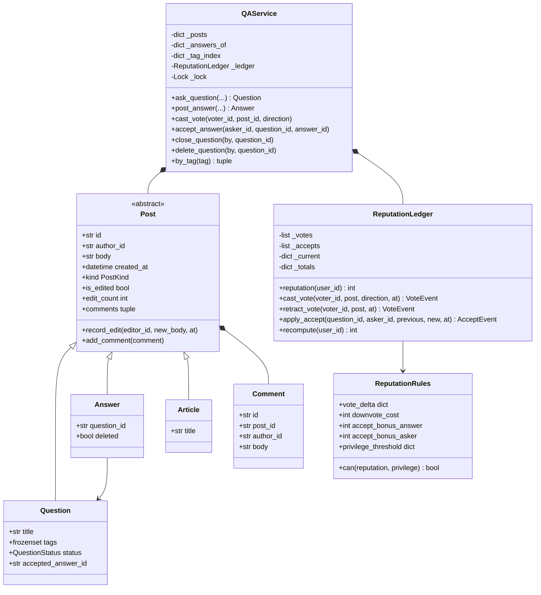

# 设计题解：问答社区（Stack Overflow）

## 题目与澄清

面试官的开场："设计 Stack Overflow。用户能提问、回答、评论；能给问题和回答投票；声望
按活跃度和内容质量涨跌；问题能打标签、能被搜索。"

这是一道内容与关系并重的题：实体不算复杂，真正考验设计能力的是几条容易被含糊带过的规则。
开口先澄清清楚，比直接开始画类图更能把自己和模板答案分开：

- **评论挂在问题上还是回答上，用什么字段区分？** 这是这道题的第一个陷阱。多数人会给
  `Comment` 一个 `parent_type: str`（`"question"` 或 `"answer"`）加一个 `parent_id`，
  然后在每一处要用评论的地方写 `if parent_type == "question": ... else: ...`。这道题真正
  想看的是：**你会不会为了区分两种父类型引入一个可能和实际对象脱节的字符串**。本题解的
  答案是不需要——往下第一条设计决策专门讲为什么。
- **一票能不能改、能不能撤？** 能，而且这是声望系统里最容易被做错的一角：改票和撤票必须
  只影响"净差值"，不能把旧票的效果留在账上又叠加新票的效果。第二条决策专门讲。
- **降票、评论、编辑要不要声望门槛？** 真实 Stack Overflow 会（分别是 125、50、2000 分
  起步），本题解照做——这也顺带回答了"新用户能不能上来就把别人的帖子踩到负分"这个问题：
  不能。
- **采纳的回答能不能换？** 能，只有提问者能采纳，同一时刻只有一个。换的时候旧回答的作者
  要被扣回奖励，新回答的作者要被加上奖励，提问者自己的固定奖励**不因为换人而翻倍**。
- **关闭和删除问题，各自对下面的回答做什么？** 这条不澄清就写代码，几乎必然写错。本题解
  的选择、以及为什么，在第四条决策里说清楚。
- **要不要做真实的全文搜索、真实的通知投递？** 不做。标签检索用一张倒排索引就够，回答里
  会说清它为什么足够、什么时候不够。

**范围之外**：真实的关键词全文搜索（本题解只做标签的精确匹配）、通知的投递机制、评论本身
的投票与编辑历史、真实持久化、用户账号与鉴权。

## 需求与分级

- **第 1 关（约 20 分钟）**：提问、在问题下回答、给问题或回答加评论——评论怎么挂、不引入
  `parent_type`；标签；按标签检索问题。对应 `Post`、`Question`、`Answer`、`Comment`、
  `QAService.ask_question` / `post_answer` / `add_comment` / `by_tag`。
- **第 2 关（约 20 分钟）**：投票与声望。一票只能投一次，能改能撤；声望按帖子类型和投票
  方向从一张表里查，不是散落的 `if`；评论、降票、编辑各自有声望门槛。对应
  `VoteDirection`、`ReputationRules`、`ReputationLedger`、`QAService.cast_vote` /
  `retract_vote`。**这一关是这道题的分水岭**——声望"从哪来、会不会漂移"是本题解着墨
  最多的地方。
- **第 3 关（约 15 分钟）**：采纳一个回答（只有提问者、只有一个、可以换）；关闭或删除
  问题，以及对它名下回答的影响；编辑历史，帖子要能显示"被编辑过"。对应
  `Question.accept_answer` 的调用方 `QAService.accept_answer`、
  `close_question` / `delete_question`、`Post.record_edit`。
- **第 4 关（选做）**：加一种独立的发帖类型——文章（`Article`），不隶属任何问题，但复用
  一模一样的评论与投票机制；验收标准是这条加法**不改动 `ReputationLedger`、`cast_vote`、
  `retract_vote` 里的任何一行**。（面试官常见的另一个第 4 关加法是悬赏 bounty，本题解在
  「扩展与追问」里说明它怎么加、以及为什么不占用这一关的代码预算。）

## 核心对象与职责

| 类 | 单一职责 | 它守的不变量 |
|---|---|---|
| `Post` | 问题、回答、文章共享的身份、正文、编辑历史、评论容器 | 编辑历史只增不改；评论只挂在自己身上 |
| `Question` | 一个问题：标题、标签、状态、被采纳的回答 | 状态单向 OPEN → CLOSED/DELETED；`accepted_answer_id` 要么为空要么指向自己的回答 |
| `Answer` | 一个问题下的一条回答 | `question_id` 恒定；`deleted` 只能被问题的删除级联置位 |
| `Article` | 第 4 关新增的独立发帖类型 | 与 `Question`/`Answer` 共享 `Post` 的全部不变量，不额外持有状态 |
| `Comment` | 一条评论（值对象） | 不可变；`post_id` 只用于显示，不用于存取分派 |
| `ReputationRules` | 投票增减、降票代价、采纳奖励、权限门槛——全部是数据 | 不可变；查表而非分支 |
| `ReputationLedger` | 声望账本：事件日志 + 增量缓存 + 独立重算 | 增量缓存必须恒等于对事件日志的重新折叠 |
| `QAService` | 总控：发帖、评论、投票、采纳、关闭/删除、标签检索 | 唯一持锁者；"谁能做什么"的权限判断只在这里发生 |

`Question`、`Answer`、`Article` 都**继承** `Post`（is-a：一个问题就是一个可以被评论和
投票的帖子）；`Post` 与 `Comment` 是**组合**（has-a 且生命周期绑定：评论离开它所属的帖子
没有意义，帖子销毁评论也一起消失）；`QAService` 与 `Post`/`ReputationLedger` 是
**组合**（服务创建它们、独占它们的生命周期），这正是
[[oop.relationships|类之间的关系（Class Relationships）]]里"谁拥有谁的生命周期"那条判据
的直接应用。



## 关键设计决策

### 一、评论挂在谁身上：多态基类 + 组合，不是 `parent_type` 字符串

问题原话就是陷阱："评论可以挂在问题下面，也可以挂在某个回答下面。"

**选项 A：一个字段区分两种父类型。**
```python
@dataclass
class Comment:
    parent_type: Literal["question", "answer"]
    parent_id: str
```
每一处要读写评论的代码都得先判断 `parent_type`，再去两张不同的表里找对应的对象。这是最
直觉的写法，代价也很具体：字符串和实际对象之间没有类型系统帮你对齐——传错一个
`parent_type` 编译期不会报错，运行时会在某个查找里悄悄返回 `None` 或者查错表。加第三种
可以被评论的东西（这道题第 4 关的 `Article`）意味着 `Literal` 要加一个值、每一处判断都要
再加一个分支。

**选项 B（本文的选择）：`Question`、`Answer`、`Article` 共享一个 `Post` 基类，评论**长在
帖子对象自己身上**。**
```python
class Post:
    def add_comment(self, comment: Comment) -> None:
        self._comments.append(comment)
```
调用方在调 `add_comment` 之前已经通过 `QAService._post_locked(post_id)` 拿到了一个具体
对象——不管它是 `Question` 还是 `Answer` 还是 `Article`，这里都不需要知道，因为
`add_comment` 是 `Post` 上的一个方法，多态自己把调用路由到了正确的存储上。`Comment`
仍然保留一个 `post_id` 字段，但它只用来给读者显示"这条评论说的是哪个帖子"，从不参与
任何存取或分派——把它删掉，`add_comment`/`comments` 的行为不会有任何变化。这就是"不用
`parent_type` 字符串"具体做到的样子：**用类型系统本身去区分谁是谁，而不是用一个可能和
真实对象脱节的字符串标签。**

代价要说清楚：这要求"评论只属于一个帖子"这条业务规则永远成立（这道题确实如此——评论
不会跨帖子迁移）。如果将来出现"一条评论可以被移到另一个帖子下"这种需求，组合模型要么在
移动时把 `Comment` 从旧列表摘下、插进新列表（仍然不需要 `parent_type`），要么才真的需要
一个独立的、按 id 索引的评论存储——但那是另一个需求出现之后才该做的事。

### 二、声望是事件日志的折叠，不是一个字段

这是全题分量最重的一条，也是这份任务书点名要求"证明"的一条。

**选项 A（几乎所有公开题解的写法）：`User.reputation` 是一个整数字段，投票发生时
`reputation += delta`。** 上一节引用的 GitHub 题解正是这么写的，而且它的
`ReputationManager` 只根据"这次是赞成还是反对"这一个事件类型算分，**不知道这个人是不是
在改票**——一个人从反对改成赞成，帖子自己的 `vote_count` 被正确地调整了两档，但通知出去
的事件仍然是单纯的"赞成"，于是反对造成的扣分从未被撤销，声望账目从这一步开始就和真实
发生过的投票历史对不上了。这正是"可变计数器会漂移"的字面意思：漂移不是危言耸听，是这套
写法下必然会发生的事。

**选项 B（本文的选择）：声望账本是一份不可变的事件日志，声望是对它的折叠。**
```python
def cast_vote(self, voter_id, post, direction, at):
    old = self._current.get((voter_id, post.id))
    old_a, old_v = self._effect(post.kind, old)
    new_a, new_v = self._effect(post.kind, direction)
    event = VoteEvent(..., delta_author=new_a - old_a, delta_voter=new_v - old_v, at=at)
    self._record(event)          # 增量缓存 += 这条事件自带的净差值
```
每一条 `VoteEvent` 记的不是"这次投了赞成"，而是"这次动作让声望净变化了多少"——**新效果
减旧效果**，所以改票天然只产生一次净差值，不会把旧效果落在账上不还。`_totals` 是这份日志
的增量缓存，用来把查询做成 O(1)；但它不是唯一的真相来源，`recompute(user_id)` 是完全独立
的第二条算路，只读 `_votes` 和 `_accepts` 两份日志、从零重新把这个人的份额加一遍。测试
`test_reputation_never_drifts_from_its_event_log` 在一串随机的投票/改票/撤票/采纳之后，
断言 `reputation(user) == recompute(user)` 对每个人都成立——这就是"证明它不会漂移"的
具体做法：不是口头保证增量更新写对了，而是留一条完全不依赖增量更新代码路径的验证通道，
让任何未来的改动一旦漏更新了 `_totals`，这条断言会立刻炸掉。

代价：比一个 `int` 字段多存一份历史，内存和账本长度成正比。这道题的规模下完全负担得起；
真上生产规模，`_votes`/`_accepts` 正好就是一张可以按用户或按帖子分区归档的事实表，见
「扩展与追问 · 持久化与规模」。

### 三、权限门槛：一张表，拒绝建 `PrivilegyPolicy` 类层级

评论、降票、编辑都需要声望门槛。图书馆题解里按 (读者类型, 介质) 查政策的做法已经证明
"表优于分支"；这里的诱惑是反过来走极端——给每一种权限建一个 `PrivilegyPolicy` 接口、
三个实现类各判断"够不够格"。

停下来看这三个实现体：`CommentPolicy.allows(rep) -> rep >= 50`、
`VoteDownPolicy.allows(rep) -> rep >= 125`、`EditPolicy.allows(rep) -> rep >= 2000`——
三个类的**行为完全相同**（一次数值比较），差的只是右边那个数字。这正是图书馆题解里已经
指出的判据：子类的正当理由是行为不同，不是参数不同。本文的选择是一张
`Mapping[Privilege, int]` 加一个 `.can(reputation, privilege)` 方法：
```python
def can(self, reputation: int, privilege: Privilege) -> bool:
    return reputation >= self.privilege_threshold[privilege]
```
加一项新权限（比如"创建标签需要 1500 分"）只是往字典里加一行、往 `Privilege` 枚举加一个
成员，`can` 的代码一行不动。为这种东西建接口，换回来的是把一次字典查找拆成三个只有一行
逻辑的类。

### 四、采纳的"移动"：一次账本操作，不是"取消再采纳"两次调用

问题里"可以移动"这四个字看着简单，一旦落到声望上就是这道题真正的难点：换一个已采纳的
回答，涉及**两个不同的人**同时变化——旧回答的作者要扣回 15 分，新回答的作者要拿到 15 分，
而提问者自己的 2 分奖励**不能因为换了一次就变成 4 分**（他这道题从始至终只有一个"回答
被采纳"这件事发生过，只是所指对象变了）。

如果把"移动"实现成"先调用一次 `unaccept()`、再调用一次 `accept()`"，两次调用之间问题
处于"没有被采纳的回答"这个中间态，且提问者的奖励会被先扣掉 2 分、再加上 2 分——如果
`unaccept` 和 `accept` 分别持锁，中间态对并发读者可见，而且两次独立的 `+2`/`-2` 各自
产生一条声望事件，`recompute` 的日志里会多出两条本不该存在的记录。

本文让 `ReputationLedger.apply_accept(question_id, asker_id, previous, new, at)` 一次
接收"旧的是谁、新的是谁"，在**一次**调用里把两个作者的加减和提问者的净变化（`new` 的
奖励减 `previous` 的奖励，`previous`/`new` 任一为 `None` 时对应项为零）都算清楚，只产生
一条 `AcceptEvent`。这不是什么模式，只是把"一次业务动作"如实地映射成"一次账本操作"——
把它拆成两次调用才是需要额外理由的那一边。

### 五、关闭 vs 删除：对回答做什么，为什么级联而不是孤立

**关闭**：问题不再接受新回答，但已有的回答、评论、投票原样保留、原样可见——关闭是"停止
生长"，不是"抹去"。真实场景里，一个关闭的问题往往已经有了足够好的答案，把它们藏起来
没有意义。

**删除**：这里必须回答"删问题的时候，它名下的回答怎么办"，本文的选择是**级联标记删除**——
问题和它的每一个回答同时被标成删除，但对象都还在内存里（`Answer.deleted = True`，不是
物理移除），编辑历史和已经发生的声望事件都不受影响。理由是：一个脱离了问题的回答没有
独立存在的意义（它甚至没有自己的标题），留着一堆孤儿回答只会让"这条回答在答什么"变成
死链接；而"已经发生的声望不因为后来的删除被追溯撤销"是刻意的简化并且在题解里说明——
真实 Stack Overflow 的规则更复杂（低质量删除会追溯扣分），本题解选择了更简单、更容易在
机考 45 分钟里讲清楚的一半，并且诚实地说出这是一个简化，而不是不假思索地实现"复杂"或
悄悄漏掉这条规则。

## 代码走读

四处值得停下来看。

**第一处，`Post.add_comment` 与三个子类。**全题的地基在这里：`Post` 定义评论怎么存，
`Question`/`Answer`/`Article` 只定义各自独有的字段和 `kind`。没有任何代码在存取评论时
写过 `isinstance` 判断——多态本身就是分派机制。

**第二处，`ReputationLedger.cast_vote` 与 `retract_vote`。**两者的核心都是"先算旧效果，
再算新效果，落的是净差值"。`_effect` 是唯一一处真正查 `vote_delta` 表的地方，`cast_vote`
和 `retract_vote` 都只调用它、不重复它的逻辑——这也是为什么"改票"和"撤票"（撤票就是
"新效果是 None"的特例）能共享同一套正确性。

**第三处，`ReputationLedger.apply_accept`。**三行算清三笔账（旧作者、新作者、提问者），
然后**一次性**落进 `_totals` 并只追加一条 `AcceptEvent`——对照上面第四条决策看，这里
就是"一次业务动作对应一次账本操作"的落地。

**第四处，`QAService` 的权限判断集中在服务层，不在实体上。**`Post`、`Question`、
`Answer` 本身完全不知道"声望"这回事——`can_edit`、`can_comment` 这类判断只出现在
`QAService.add_comment` / `edit_post` / `cast_vote` 里，因为"谁能做什么"依赖的是
声望账本，而账本是服务层持有的东西。把权限判断塞进 `Post` 会让一个值对象反过来依赖
它本不该知道的账本，职责就拧了。

%% code:begin solution.py %%
```python
"""问答社区（Stack Overflow）——问题、回答与文章共享同一套评论与投票机制的参考实现。

五行设计：`Question`、`Answer`、`Article` 都是 `Post` 的子类，评论**长在帖子对象自己身上**
（组合），所以没有任何代码需要一个 `parent_type` 字符串去分派——谁的评论就调用谁的
`add_comment`。声望从不是一个可以被直接改写的字段：每一次投票或采纳都在
`ReputationLedger` 里追加一条不可变事件，声望是这些事件的**折叠**（fold），增量缓存和
从事件日志重新折叠两条算路必须永远相等，测试钉住这一条。评论、投票降级、编辑三种权限
门槛收在一张表里查，不是散落的 `if 声望 > 数字`。加一种帖子类型（文章）只是加一个
`Post` 子类和政策表里一行数据，投票与声望的代码一行不动。
"""

from __future__ import annotations

import itertools
import threading
from dataclasses import dataclass, field
from datetime import datetime
from enum import Enum
from typing import Mapping


# --------------------------------------------------------------------------
# 失败路径。

class QAError(Exception):
    """本设计里所有失败路径的公共基类。"""


class UnknownPostError(QAError):
    """这个帖子 id 不存在。"""


class UnknownQuestionError(QAError):
    """这个 id 存在，但不是一个问题（比如传了一个回答 id 进来）。"""


class SelfVoteError(QAError):
    """不能给自己的帖子投票。"""


class DuplicateVoteError(QAError):
    """已经投过同一个方向的票——改票请传另一个方向，撤票请调用 retract。"""


class NoVoteToRetractError(QAError):
    """这个人在这个帖子上没有票可撤。"""


class InsufficientReputationError(QAError):
    """声望没到这项操作要求的门槛。"""


class NotAskerError(QAError):
    """只有提问者本人能采纳或改变采纳的回答。"""


class AnswerMismatchError(QAError):
    """这个回答不属于这个问题，不能被采纳。"""


class QuestionClosedError(QAError):
    """问题已关闭或已删除，不再接受新回答。"""


# --------------------------------------------------------------------------
# 枚举。

class PostKind(Enum):
    """三种独立的发帖类型；只影响声望表怎么查，不影响任何流程代码。"""

    QUESTION = "question"
    ANSWER = "answer"
    ARTICLE = "article"


class QuestionStatus(Enum):
    """问题的三态。关闭与删除是两件不同的事，见 `QAService.delete_question` 的文档。"""

    OPEN = "open"
    CLOSED = "closed"
    DELETED = "deleted"


class VoteDirection(Enum):
    """投票只有两个方向；"没投票"用 `None` 表达，不是第三个枚举成员。"""

    UP = 1
    DOWN = -1


class Privilege(Enum):
    """按声望解锁的三项权限。"""

    COMMENT = "comment"
    VOTE_DOWN = "vote_down"
    EDIT = "edit"


# --------------------------------------------------------------------------
# 值对象：编辑记录与评论。

@dataclass(frozen=True, slots=True)
class EditEntry:
    """一次编辑：谁改的、改之前是什么样、什么时候。"""

    edited_at: datetime
    editor_id: str
    previous_body: str


@dataclass(frozen=True, slots=True)
class Comment:
    """一条评论。`post_id` 只是给读者显示用的回指，存取从不靠它去分派——评论天生就长在
    它所属的那个 `Post` 对象上（见下面 `Post.add_comment`）。
    """

    id: str
    post_id: str
    author_id: str
    body: str
    at: datetime


# --------------------------------------------------------------------------
# Post 层级：Question / Answer / Article 共享身份、正文、编辑历史与评论。

class Post:
    """问题、回答、文章的公共基类：一个可以被评论、被投票、被编辑的帖子。

    评论**没有 `parent_type` 字段**：每个具体帖子对象自己持有一份评论列表（组合），
    调用方已经拿到了那个具体对象（一个 `Question` 或一个 `Answer`），直接调
    `post.add_comment(...)` 就够了，不需要任何代码去问"这是问题还是回答"。
    """

    def __init__(self, post_id: str, author_id: str, body: str, created_at: datetime) -> None:
        self.id = post_id
        self.author_id = author_id
        self.body = body
        self.created_at = created_at
        self._edits: list[EditEntry] = []
        self._comments: list[Comment] = []

    @property
    def kind(self) -> PostKind:
        """具体帖子类型，只用于查声望表——每个子类必须覆盖它。"""
        raise NotImplementedError

    @property
    def is_edited(self) -> bool:
        """这个帖子被编辑过，用于在界面上打一个"已编辑"标记。"""
        return bool(self._edits)

    @property
    def edit_count(self) -> int:
        """被编辑过几次。"""
        return len(self._edits)

    def record_edit(self, editor_id: str, new_body: str, at: datetime) -> None:
        """记一条编辑历史，再把正文换成新的。"""
        self._edits.append(EditEntry(at, editor_id, self.body))
        self.body = new_body

    def add_comment(self, comment: Comment) -> None:
        """挂一条评论到这个帖子上。"""
        self._comments.append(comment)

    @property
    def comments(self) -> tuple[Comment, ...]:
        """这个帖子下面全部评论的快照，内部列表不外借。"""
        return tuple(self._comments)


class Question(Post):
    """一个问题：标题、标签、状态，以及此刻被采纳的那个回答（至多一个）。"""

    def __init__(self, post_id: str, author_id: str, title: str, body: str,
                tags: tuple[str, ...], created_at: datetime) -> None:
        super().__init__(post_id, author_id, body, created_at)
        self.title = title
        self.tags = frozenset(tags)
        self.status = QuestionStatus.OPEN
        self.accepted_answer_id: str | None = None

    @property
    def kind(self) -> PostKind:
        return PostKind.QUESTION


class Answer(Post):
    """一个回答，挂在某个问题下面。`deleted` 由问题被删除时级联置位（见
    `QAService.delete_question`），回答本身没有独立的删除入口。
    """

    def __init__(self, post_id: str, author_id: str, question_id: str, body: str,
                created_at: datetime) -> None:
        super().__init__(post_id, author_id, body, created_at)
        self.question_id = question_id
        self.deleted = False

    @property
    def kind(self) -> PostKind:
        return PostKind.ANSWER


class Article(Post):
    """第 4 关新增的第二种独立发帖类型：不属于任何问题，标题与正文都是自己的。

    它不需要修改 `ReputationLedger`、`cast_vote` 或 `retract_vote` 里的任何一行——那些代码
    只认 `Post.kind` 和 `Post.author_id`，`Article` 继承了两者。真正的"新增"只有两处：这个
    子类本身，和 `ReputationRules.vote_delta` 表里一行 `(ARTICLE, ...)` 的数据。
    """

    def __init__(self, post_id: str, author_id: str, title: str, body: str,
                created_at: datetime) -> None:
        super().__init__(post_id, author_id, body, created_at)
        self.title = title

    @property
    def kind(self) -> PostKind:
        return PostKind.ARTICLE


# --------------------------------------------------------------------------
# 声望规则：一张表，不是散落的 if。

@dataclass(frozen=True, slots=True)
class ReputationRules:
    """投票的声望增减、降票的代价、采纳的奖励、权限门槛——全部是数据，不是分支。

    加一种帖子类型（`Article`）只往 `vote_delta` 里加两行；加一项权限只往
    `privilege_threshold` 里加一行；两处都不碰任何调用这张表的代码。
    """

    vote_delta: Mapping[tuple[PostKind, VoteDirection], int] = field(default_factory=lambda: {
        (PostKind.QUESTION, VoteDirection.UP): 5,
        (PostKind.QUESTION, VoteDirection.DOWN): -2,
        (PostKind.ANSWER, VoteDirection.UP): 10,
        (PostKind.ANSWER, VoteDirection.DOWN): -2,
        (PostKind.ARTICLE, VoteDirection.UP): 5,
        (PostKind.ARTICLE, VoteDirection.DOWN): -2,
    })
    downvote_cost: int = -1
    accept_bonus_answer: int = 15
    accept_bonus_asker: int = 2
    privilege_threshold: Mapping[Privilege, int] = field(default_factory=lambda: {
        Privilege.COMMENT: 50, Privilege.VOTE_DOWN: 125, Privilege.EDIT: 2000,
    })

    def can(self, reputation: int, privilege: Privilege) -> bool:
        """这份声望够不够解锁这项权限。"""
        return reputation >= self.privilege_threshold[privilege]


# --------------------------------------------------------------------------
# 声望账本：事件的折叠，不是一个可写字段。

@dataclass(frozen=True, slots=True)
class VoteEvent:
    """一次投票动作（首投 / 改票 / 撤票）造成的净声望变化。`delta_author` 记给帖子作者，
    `delta_voter` 记给投票人自己（降票要扣自己的分）。"""

    id: str
    post_id: str
    post_author_id: str
    voter_id: str
    direction: VoteDirection | None
    delta_author: int
    delta_voter: int
    at: datetime


@dataclass(frozen=True, slots=True)
class AcceptEvent:
    """一次采纳变更：可能同时影响两个人——被换下的回答作者（扣分）和新采纳的回答作者
    （加分），以及提问者自己（有没有回答被采纳过，只影响一次固定奖励）。"""

    id: str
    question_id: str
    asker_id: str
    delta_asker: int
    previous_author_id: str | None
    delta_previous_author: int
    new_author_id: str | None
    delta_new_author: int
    at: datetime


class ReputationLedger:
    """声望永远是事件日志的折叠（fold），从来不是一个被到处 `+=` 的计数器。

    `_totals` 是这份折叠结果的增量缓存：每追加一条事件，按事件自带的 delta 更新它，
    图的是 O(1) 查询。`recompute` 是完全独立的第二条算路——只读 `_votes` 与 `_accepts`
    两份事件日志，从零把它们重新加一遍。这两条路径算出来的数字必须永远相等：一旦
    `cast_vote` 未来被改出一个只更新其中一处的 bug，`recompute` 的结果会立刻和 `_totals`
    对不上，测试就会失败——这正是"声望不能是一个会漂移的计数器"的证明方式。
    """

    def __init__(self, rules: ReputationRules) -> None:
        self._rules = rules
        self._votes: list[VoteEvent] = []
        self._accepts: list[AcceptEvent] = []
        self._current: dict[tuple[str, str], VoteDirection] = {}
        self._totals: dict[str, int] = {}
        self._ids = (f"E{n}" for n in itertools.count(1))

    def reputation(self, user_id: str) -> int:
        """当前声望：增量缓存的读取。"""
        return self._totals.get(user_id, 0)

    def current_vote(self, voter_id: str, post_id: str) -> VoteDirection | None:
        """这个人在这个帖子上此刻投的是哪个方向，没投过是 `None`。"""
        return self._current.get((voter_id, post_id))

    def cast_vote(self, voter_id: str, post: Post, direction: VoteDirection,
                 at: datetime) -> VoteEvent:
        """投票，或者改票（同一个人对同一个帖子再投一次，换成不同方向）。"""
        key = (voter_id, post.id)
        old = self._current.get(key)
        if old is direction:
            raise DuplicateVoteError(f"{voter_id} already voted {direction.name} on {post.id}")
        old_a, old_v = self._effect(post.kind, old)
        new_a, new_v = self._effect(post.kind, direction)
        event = VoteEvent(next(self._ids), post.id, post.author_id, voter_id, direction,
                          new_a - old_a, new_v - old_v, at)
        self._record(event)
        self._current[key] = direction
        return event

    def retract_vote(self, voter_id: str, post: Post, at: datetime) -> VoteEvent:
        """撤票：把已投的那一票的效果原样减掉。"""
        key = (voter_id, post.id)
        old = self._current.get(key)
        if old is None:
            raise NoVoteToRetractError(f"{voter_id} has no vote on {post.id} to retract")
        old_a, old_v = self._effect(post.kind, old)
        event = VoteEvent(next(self._ids), post.id, post.author_id, voter_id, None,
                          -old_a, -old_v, at)
        self._record(event)
        del self._current[key]
        return event

    def apply_accept(self, question_id: str, asker_id: str, previous: Answer | None,
                     new: Answer | None, at: datetime) -> AcceptEvent:
        """把"这个问题的采纳从 previous 变成 new"记成一条事件；两者之一可以是 `None`。"""
        delta_prev = -self._rules.accept_bonus_answer if previous is not None else 0
        delta_new = self._rules.accept_bonus_answer if new is not None else 0
        asker_before = self._rules.accept_bonus_asker if previous is not None else 0
        asker_after = self._rules.accept_bonus_asker if new is not None else 0
        event = AcceptEvent(next(self._ids), question_id, asker_id, asker_after - asker_before,
                            previous.author_id if previous is not None else None, delta_prev,
                            new.author_id if new is not None else None, delta_new, at)
        if previous is not None:
            self._apply(previous.author_id, delta_prev)
        if new is not None:
            self._apply(new.author_id, delta_new)
        self._apply(asker_id, event.delta_asker)
        self._accepts.append(event)
        return event

    def recompute(self, user_id: str) -> int:
        """独立于 `_totals` 的第二条算路：把两份事件日志为这个人重新折叠一遍。"""
        total = sum(e.delta_author for e in self._votes if e.post_author_id == user_id)
        total += sum(e.delta_voter for e in self._votes if e.voter_id == user_id)
        for e in self._accepts:
            if e.asker_id == user_id:
                total += e.delta_asker
            if e.previous_author_id == user_id:
                total += e.delta_previous_author
            if e.new_author_id == user_id:
                total += e.delta_new_author
        return total

    def _effect(self, kind: PostKind, direction: VoteDirection | None) -> tuple[int, int]:
        """一个投票方向对(帖子作者, 投票人)各自造成多少声望变化；没投过是 (0, 0)。"""
        if direction is None:
            return 0, 0
        delta_author = self._rules.vote_delta[(kind, direction)]
        delta_voter = self._rules.downvote_cost if direction is VoteDirection.DOWN else 0
        return delta_author, delta_voter

    def _record(self, event: VoteEvent) -> None:
        self._apply(event.post_author_id, event.delta_author)
        self._apply(event.voter_id, event.delta_voter)
        self._votes.append(event)

    def _apply(self, user_id: str, delta: int) -> None:
        if delta:
            self._totals[user_id] = self._totals.get(user_id, 0) + delta


# --------------------------------------------------------------------------
# QAService：问答社区的总控。

class QAService:
    """问答社区：发帖、评论、投票、采纳、关闭与删除、按标签检索，以及声望查询。

    锁纪律：一把锁保护帖子索引、标签倒排表与声望账本。这道题的每个复合操作（比如投票
    要先查当前票、再算声望增量、再落账本）本身只有几十次字典操作，拆锁换不到并发度，
    反而会在"改声望"和"改票据"之间开一条竞态窗口。
    """

    def __init__(self, clock, rules: ReputationRules = ReputationRules()) -> None:
        self._clock = clock
        self._rules = rules
        self._posts: dict[str, Post] = {}
        self._answers_of: dict[str, list[str]] = {}
        self._tag_index: dict[str, set[str]] = {}
        self._ledger = ReputationLedger(rules)
        self._lock = threading.Lock()
        self._q_ids = (f"Q{n}" for n in itertools.count(1))
        self._a_ids = (f"A{n}" for n in itertools.count(1))
        self._c_ids = (f"C{n}" for n in itertools.count(1))
        self._t_ids = (f"T{n}" for n in itertools.count(1))

    # ---- 发帖与编辑 --------------------------------------------------------

    def ask_question(self, author_id: str, title: str, body: str,
                     tags: tuple[str, ...] = ()) -> Question:
        """开一个新问题。"""
        now = self._clock()
        with self._lock:
            question = Question(next(self._q_ids), author_id, title, body, tags, now)
            self._posts[question.id] = question
            self._answers_of[question.id] = []
            for tag in question.tags:
                self._tag_index.setdefault(tag, set()).add(question.id)
            return question

    def post_answer(self, author_id: str, question_id: str, body: str) -> Answer:
        """在一个未关闭的问题下面回答。"""
        now = self._clock()
        with self._lock:
            question = self._question_locked(question_id)
            if question.status is not QuestionStatus.OPEN:
                raise QuestionClosedError(f"{question_id} is {question.status.value}")
            answer = Answer(next(self._a_ids), author_id, question_id, body, now)
            self._posts[answer.id] = answer
            self._answers_of[question_id].append(answer.id)
            return answer

    def post_article(self, author_id: str, title: str, body: str) -> Article:
        """发一篇独立文章——不隶属任何问题。"""
        now = self._clock()
        with self._lock:
            article = Article(next(self._t_ids), author_id, title, body, now)
            self._posts[article.id] = article
            return article

    def add_comment(self, author_id: str, post_id: str, body: str) -> Comment:
        """给任意一种帖子（问题、回答或文章）加一条评论，需要够门槛的声望。"""
        now = self._clock()
        with self._lock:
            post = self._post_locked(post_id)
            if not self._rules.can(self._ledger.reputation(author_id), Privilege.COMMENT):
                raise InsufficientReputationError(f"{author_id} needs more reputation to comment")
            comment = Comment(next(self._c_ids), post_id, author_id, body, now)
            post.add_comment(comment)
            return comment

    def edit_post(self, editor_id: str, post_id: str, new_body: str) -> Post:
        """编辑正文：作者本人随时可以，别人需要够门槛的声望。"""
        now = self._clock()
        with self._lock:
            post = self._post_locked(post_id)
            if editor_id != post.author_id and not self._rules.can(
                    self._ledger.reputation(editor_id), Privilege.EDIT):
                raise InsufficientReputationError(f"{editor_id} cannot edit someone else's post")
            post.record_edit(editor_id, new_body, now)
            return post

    # ---- 投票 --------------------------------------------------------------

    def cast_vote(self, voter_id: str, post_id: str, direction: VoteDirection) -> None:
        """投票或改票；自己不能投自己，降票需要够门槛的声望。"""
        now = self._clock()
        with self._lock:
            post = self._post_locked(post_id)
            if voter_id == post.author_id:
                raise SelfVoteError(f"{voter_id} cannot vote on their own post")
            if direction is VoteDirection.DOWN and not self._rules.can(
                    self._ledger.reputation(voter_id), Privilege.VOTE_DOWN):
                raise InsufficientReputationError(f"{voter_id} needs more reputation to downvote")
            self._ledger.cast_vote(voter_id, post, direction, now)

    def retract_vote(self, voter_id: str, post_id: str) -> None:
        """撤票。"""
        now = self._clock()
        with self._lock:
            post = self._post_locked(post_id)
            self._ledger.retract_vote(voter_id, post, now)

    def reputation(self, user_id: str) -> int:
        """这个人此刻的声望。"""
        with self._lock:
            return self._ledger.reputation(user_id)

    def reputation_matches_log(self, user_id: str) -> bool:
        """增量缓存和从事件日志重新折叠的结果是否一致——声望"不会漂移"的可验证证据。"""
        with self._lock:
            return self._ledger.reputation(user_id) == self._ledger.recompute(user_id)

    # ---- 采纳、关闭、删除 ----------------------------------------------------

    def accept_answer(self, asker_id: str, question_id: str, answer_id: str) -> None:
        """采纳一个回答；只有提问者本人能做，同一时刻只有一个，可以改指到另一个回答。"""
        now = self._clock()
        with self._lock:
            question = self._question_locked(question_id)
            if asker_id != question.author_id:
                raise NotAskerError(f"only {question.author_id} can accept an answer")
            answer = self._post_locked(answer_id)
            if not isinstance(answer, Answer) or answer.question_id != question_id:
                raise AnswerMismatchError(f"{answer_id} does not answer {question_id}")
            previous = self._posts.get(question.accepted_answer_id) \
                if question.accepted_answer_id else None
            self._ledger.apply_accept(question_id, asker_id,
                                      previous if isinstance(previous, Answer) else None,
                                      answer, now)
            question.accepted_answer_id = answer_id

    def close_question(self, by: str, question_id: str) -> None:
        """关闭问题：不再接受新回答，但已有的回答、评论、投票都原样保留、原样可见。"""
        with self._lock:
            question = self._question_locked(question_id)
            self._require_owner_or_trusted(by, question)
            question.status = QuestionStatus.CLOSED

    def delete_question(self, by: str, question_id: str) -> None:
        """删除问题：问题本身和它名下每一个回答一起被标记删除（级联），但对象都还在——
        编辑历史与已经发生的声望变化都不会被这次删除抹掉或撤销。"""
        with self._lock:
            question = self._question_locked(question_id)
            self._require_owner_or_trusted(by, question)
            question.status = QuestionStatus.DELETED
            for answer_id in self._answers_of.get(question_id, ()):
                answer = self._posts[answer_id]
                if isinstance(answer, Answer):
                    answer.deleted = True

    # ---- 查询 --------------------------------------------------------------

    def post(self, post_id: str) -> Post:
        """按 id 取任意类型的帖子。"""
        with self._lock:
            return self._post_locked(post_id)

    def question(self, question_id: str) -> Question:
        """按 id 取问题。"""
        with self._lock:
            return self._question_locked(question_id)

    def answers_of(self, question_id: str) -> tuple[Answer, ...]:
        """一个问题下面还没被级联删除的回答，一份快照。"""
        with self._lock:
            self._question_locked(question_id)
            answers = (self._posts[a] for a in self._answers_of.get(question_id, ()))
            return tuple(a for a in answers if isinstance(a, Answer) and not a.deleted)

    def by_tag(self, tag: str) -> tuple[Question, ...]:
        """按标签查问题的倒排索引：直接查表，不扫描全库。"""
        with self._lock:
            ids = self._tag_index.get(tag, set())
            return tuple(sorted((self._posts[i] for i in ids if isinstance(self._posts[i], Question)),
                                key=lambda q: q.id))

    def _post_locked(self, post_id: str) -> Post:
        found = self._posts.get(post_id)
        if found is None:
            raise UnknownPostError(f"unknown post {post_id!r}")
        return found

    def _question_locked(self, question_id: str) -> Question:
        found = self._post_locked(question_id)
        if not isinstance(found, Question):
            raise UnknownQuestionError(f"{question_id!r} is not a question")
        return found

    def _require_owner_or_trusted(self, by: str, question: Question) -> None:
        if by != question.author_id and not self._rules.can(
                self._ledger.reputation(by), Privilege.EDIT):
            raise InsufficientReputationError(f"{by} cannot close or delete this question")


if __name__ == "__main__":
    from datetime import UTC

    now = datetime(2026, 9, 1, 10, 0, tzinfo=UTC)
    qa = QAService(clock=lambda: now)
    q = qa.ask_question("alice", "如何在 Python 里注入时钟？",
                        "我想让测试不依赖 sleep。", tags=("python", "testing"))
    a1 = qa.post_answer("bob", q.id, "把 now 作为一个 Callable 参数传进去。")
    a2 = qa.post_answer("carol", q.id, "用 freezegun 这类库。")

    for voter in ("carol", "dave", "erin"):
        qa.cast_vote(voter, a1.id, VoteDirection.UP)
    qa.cast_vote("bob", q.id, VoteDirection.UP)
    print(f"bob 声望 {qa.reputation('bob')}，日志重算一致：{qa.reputation_matches_log('bob')}")

    qa.accept_answer("alice", q.id, a1.id)
    print(f"采纳 a1 后，bob 声望 {qa.reputation('bob')}，alice 声望 {qa.reputation('alice')}")
    qa.accept_answer("alice", q.id, a2.id)
    print(f"改采纳 a2 后，bob 声望 {qa.reputation('bob')}，carol 声望 {qa.reputation('carol')}")

    qa.close_question("alice", q.id)
    print("标签 python 命中：", [x.title for x in qa.by_tag("python")])
```
%% code:end %%

## 测试与自检

测试钉住的是**行为**，不是内部形状。最值得写的几条：

1. **评论没有 `parent_type`**：给问题和给回答各加一条评论，各自能从对应的 `Post.comments`
   读到，且 `Comment` 对象上根本没有 `parent_type` 这个属性
   （`assert not hasattr(comment, "parent_type")`）。
2. **改票只落净差值**：先赞成后反对，声望从 +5 变成 -2（净变化 -7），不是 +5 再叠加 -2
   的某种中间态残留。
3. **声望永不漂移**：一串随机的投票/改票/撤票/采纳之后，对每个相关用户断言
   `reputation(user) == recompute(user)`——这是"事件折叠"这条设计的唯一可信证据。
4. **采纳可以移动，且提问者的固定奖励不翻倍**：采纳 A 再改采纳 B，A 的作者被扣回 15 分，
   B 的作者拿到 15 分，提问者全程只有 2 分。
5. **关闭保留内容、拒绝新回答；删除级联到回答**：两条分别断言。
6. **降票、评论、编辑都有声望门槛**，声望不够时抛出可以被调用方捕获的异常，而不是静默
   放行或者 `print`。
7. **并发**：二十个人同时给同一个回答投票（十赞十踩），断言最终声望等于赞成票与反对票
   净效果之和、且增量缓存与重算结果一致——这条同时验证了锁纪律和账本折叠在并发下都成立。
8. **加文章不碰投票代码**：给 `Article` 投票，声望变化走的是和 `Question` 一样的
   `cast_vote` 路径，断言声望正确即是证据。

**两分钟怎么演示给面试官**：跑 `python solution.py`。依次能看到——声望随投票和采纳变化、
改指采纳后两边声望的重新分配、以及按标签检索命中的问题。

## 扩展与追问

**新需求**

- **悬赏（bounty）**：第 4 关的另一种常见加法，本题解没有实现，留在这里说清楚它怎么加、
  为什么不占用主线的代码预算。悬赏是"提问者额外抵押一笔声望，到期后按票数最高的新回答
  自动发放，无人达标则退还"——这可以做成 `ReputationLedger` 上第三种事件
  （`BountyEvent`），有自己的 `award`/`refund` 两个方法，同样只产生净差值、同样能被
  `recompute` 折叠验证；`cast_vote`、`retract_vote`、`apply_accept` 不需要改一行，因为
  悬赏和投票、采纳是三件平行的事，只是共享同一本账。
- **编辑评论、删除评论**：`Comment` 目前是不可变值对象；要支持编辑，`Post` 需要把
  `_comments: list[Comment]` 换成允许原地替换某一条的结构，`Comment` 本身则需要和
  `Post` 一样获得一份 `EditEntry` 历史——复用而不是新建一套编辑历史的机制。
- **按关键词全文搜索**：现在的 `_tag_index` 只覆盖精确标签匹配。真要做标题/正文关键词
  搜索，正确答案是倒排索引或外挂搜索引擎（Elasticsearch 一类），不是在 `QAService` 里
  加一个扫全表的 `search(keyword)`——这道题考的是社区规则的建模，检索上规模是另一个系统。

**并发与线程安全**

- **为什么一把大锁**：`QAService` 的复合操作（先查声望判断权限、再落一条事件、再改
  索引）本身只有几十次字典操作，拆锁不会换来可观的并发度，反而会在"判断权限"和"落账"
  之间开一条竞态窗口——比如两个线程同时通过降票权限检查，然后都执行了降票，权限检查
  本身没有问题，但如果账本和权限判断分属两把锁，"检查完权限、锁还没抢到账本、声望已经
  被别的线程改到门槛以下"这种交错就有机可乘。单锁把"检查 + 执行"钉成一个原子操作。
- **GIL 给了什么**：只给"单条字节码不被切开"。`_totals[user] = _totals.get(user, 0) +
  delta` 是好几条字节码，不加锁两个线程各自读到同一个旧值、各自加自己的 delta、后写的
  覆盖先写的，声望就会丢掉一次更新——这和账本"折叠是否正确"是两个层面的问题，本题解
  用锁解决后者，用事件日志的重算解决前者。

**持久化与规模**

- **表怎么设计**：`posts(id, kind, author_id, body, ...)`（`Question`/`Answer`/`Article`
  共享一张表，`kind` 只是一列，不是三张结构不同的表）、`comments(id, post_id, author_id,
  body)`、`votes(id, post_id, voter_id, direction, delta_author, delta_voter, at)`、
  `accepts(id, question_id, ...)`。`votes` 和 `accepts` 表本身就是 `ReputationLedger`
  的事件日志，声望物化视图（`reputation_totals`）定期由它们重新聚合，天然带着"能重算、
  能对账"这条能力。
- **标签索引上规模**：`tag_index` 现在是内存里的 `dict[str, set[str]]`，数据库版就是
  `question_tags(question_id, tag)` 表上的一个联合索引，`by_tag` 变成一条 `WHERE tag = ?`
  的查询——数据结构不变，只是换了存储介质。

## 常见错误

1. **给评论一个 `parent_type` 字符串**。能工作，但每加一种可评论的类型就要多改一处
   分支；本题解证明了组合 + 多态可以完全避免这个字段。
2. **声望是一个 `int` 字段，投票时直接 `+=`**。改票时旧效果不会自动撤销，长期运行下声望
   必然和真实发生过的投票历史脱节——这不是"可能会有 bug"，是这个设计**注定**会漂移。
3. **降票不设声望门槛**。新注册的账号能把任何人的帖子踩到负分，这是真实社区里最先被
   滥用的漏洞之一。
4. **采纳一次之后永远锁死，不支持换人**。提问者后来找到了更好的答案，题目明确要求能改，
   模板答案往往图省事直接不让改。
5. **删除问题时不管它名下的回答**，留下一堆指向已删除问题的孤儿回答。
6. **把"关闭"和"删除"实现成同一件事**。关闭之后内容仍然有价值、仍然应该可见；删除是
   另一回事。
7. **Java 惯性**：给三种帖子类型建一堆 `getXxx()`/`setXxx()`；用
   `Optional<Answer>` 式的哨兵对象表达"没有被采纳的回答"，而不是 Python 更直接的
   `None`；为一次数值比较建一个策略接口（见决策三）。
8. **把内部的 `_comments`/`_votes` 列表直接 `return` 出去**。外面一改，`Post` 自己的
   不变量就被绕过了；本题解一律返回 `tuple` 快照。

## 45 分钟怎么分配

- **0–5 分钟：澄清。**开口先问"评论挂在问题还是回答上，用什么区分"——这一句就能表明
  你想过 `parent_type` 的替代方案。接着问改票/撤票要不要支持、降票要不要门槛、关闭和
  删除各自对回答做什么。
- **5–12 分钟：实体。**画 `Post`/`Question`/`Answer`/`Comment`，讲清楚评论为什么长在
  帖子对象自己身上。
- **12–20 分钟：投票与声望的 API。**先讲清楚"声望是事件的折叠，不是字段"这句话，再画
  `ReputationRules`（表）和 `ReputationLedger`（账本）。这一段是加分重点，宁可少写一点
  代码也要把这个决定讲透。
- **20–33 分钟：写核心。**`Post.add_comment`、`ReputationLedger.cast_vote` /
  `retract_vote`，再到 `QAService` 的发帖与投票方法。
- **33–40 分钟：采纳与关闭/删除。**`apply_accept` 一次账本操作解决"移动"；关闭与删除
  对回答的不同影响。
- **40–45 分钟：扩展与自检。**当场加 `Article`，证明投票代码一行不动；说出你会写的
  三条测试（声望不漂移、改票净差值、级联删除），以及你知道但没写的取舍（悬荒、全文
  搜索）。

**时间不够先砍什么**：按顺序砍标签检索（一句话说清用倒排索引即可）、评论的声望门槛
（先做投票的门槛）、`Article` 这个选做关。**绝不能砍**的是"声望是事件的折叠"这条主线
和"改票只落净差值"——这两条丢了，整道题就退化成了模板答案。

## 来源与延伸

- **ashishps1/awesome-low-level-design — Designing Stack Overflow**
  （<https://github.com/ashishps1/awesome-low-level-design/blob/main/problems/stack-overflow.md>，
  GPL-3.0）。它的 `Post` 基类和"评论挂在帖子自己身上"的做法与本题解方向一致；但它的
  `User.reputation` 是一个直接 `+=` 的整数字段，改票时旧票效果不会被撤销，长期运行会
  漂移；`ReputationManager` 里 `DOWNVOTE_REP_PENALTY` 和 `POST_DOWNVOTED_REP_PENALTY`
  两个常量被用反了角色；`accept_answer` 一旦设置就不能再换；也没有关闭或删除问题的实现。
  这四处正是本题解着墨最多的地方。
- **AlgoMaster — Design Stack Overflow**（<https://algomaster.io/learn/lld/design-stack-overflow>）。
  商业站点，只链接不摘录。Java 实现，同一作者、同一套结构，`Comment` 继承 `Content` 而非
  `Post`（用类型系统天生排除"评论能被投票"），声望同样是 `AtomicInteger` 直接加减——
  原子类型解决的是并发写整数的问题，不解决改票导致的漂移问题。文章明确说关闭/删除超出
  范围、未实现。
- **Grokking the Low Level Design Interview Using OOD Principles**
  （<https://www.educative.io/courses/grokking-the-low-level-design-interview-using-ood-principles>，
  付费）。Stack Overflow 单独占一章、9 节课，说明这道题在机考题库里的权重；具体讲义在
  付费墙后，本题解没有引用其内容。
- **`dataclasses` 文档**（<https://docs.python.org/3/library/dataclasses.html>）。
  `VoteEvent`、`AcceptEvent` 等事件类型选 `frozen=True` 不是风格偏好：账本的正确性建立
  在"事件一旦写入就不会被原地修改"之上，`frozen=True` 把这条不变量交给解释器在赋值时
  报错。
