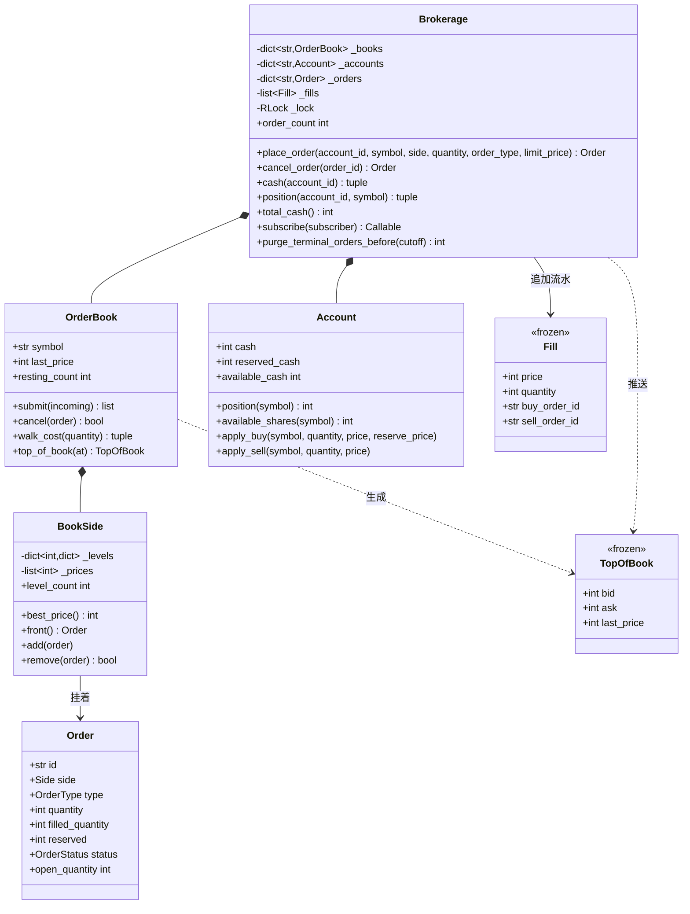

# 设计题解：股票交易系统（Stock Brokerage）

## 题目与澄清

面试官的开场通常很短："设计一个股票交易系统。用户有账户，能下买单和卖单，系统要把它们撮合
成交。"这句话底下藏着两道完全不同的题：一道是**经纪商**（broker）——开户、入金、风控、报单
转发；另一道是**撮合引擎**（matching engine）——一本订单簿，按价格-时间优先把买卖配对。绝大
多数免费题解只做了前者的壳子，把撮合写成"遍历一遍找最高买价和最低卖价"，于是既说不清部分
成交，也说不清撤单的代价。这篇题解把重心放在后者，因为那才是这道题唯一有技术含量的地方。

开口前值得问清楚的几件事：

- **钱用什么类型？** 和分账题一样，这是必须第一个问的问题。`float` 在第三笔成交上就会让
  "买方少的钱等于卖方多的钱"这条等式失效。本文一律用**整数最小货币单位**（分）：价格 `237_45`
  就是 237.45 元，乘法与加法都是精确的，"全场现金总额不变"因此是一个可以直接断言的等式。
  `decimal.Decimal` 也行，但整数更快、更难用错，而且天然排除了"半股"这种非法状态。
- **有哪几种订单类型？** 至少要有限价单（limit）和市价单（market）。问清楚还要不要止损单
  （stop）、冰山单（iceberg）、IOC/FOK，决定了第一版要不要给订单类型留缝。本文的答案是：
  先只做两种，但把"什么时候能成交"和"剩余量怎么办"分成两个独立的判断，后面加类型只改这两处。
- **允许卖空吗？** 这个问题的分量比听起来大。**不允许**（本文的选择）意味着卖单的校验就是
  "可用持仓 ≥ 下单股数"，账户的不变式是持仓恒非负，风控是一条整数比较。**允许**则持仓可以
  为负，校验就从"够不够股"变成"保证金够不够"——要有维持担保比例、要按最新价盯市、要有强平
  逻辑，账户里得多出"权益"和"保证金要求"两个派生量，而且它们随行情变化而变化，不再是下单
  那一刻算一次就完的静态检查。说得出这个区别，比实现它更重要。
- **撮合要不要连续？** 连续竞价（continuous）还是集合竞价（call auction）？本文做连续竞价：
  每来一张单立刻尝试撮合。集合竞价是另一套算法（求最大成交量的价格），值得提一句。
- **成交价取谁的？** 见"关键设计决策"——这是最容易答错、也最容易被追问的一处。
- **一个撮合引擎还是多个？** 本文明确：**单场所、进程内、不分片**。每只股票一本簿子，全部
  在一个进程里，用一把锁串起来。分片（每只股票一个线程或一个进程）、跨场所路由（SOR）、
  落盘与重放都放在"扩展与追问"里给落点，不在 45 分钟里写。

**范围之外**：登录鉴权、行情源、手续费与税、结算周期（T+1／T+2 的真实交收）、K 线与历史行情、
风控熔断与涨跌停。持久化只做到"[[structure.storage|内存持久化（In-Memory Persistence）]]"这一层，
换成数据库时哪些边界不变，见最后一节。

## 需求与分级

机器编码轮是分关加码的，每一关都在检验上一关有没有把自己将死：

- **第 1 关（约 20 分钟）**：账户有现金和持仓；能报限价单和市价单；报单要过校验——买单看
  **购买力**（可用现金），卖单看**可用持仓**（不允许卖空）。不合法的报单（数量非正、限价单
  不带价、市价单带价、股票没挂牌、账户不存在）当场拒绝。对应 `Account`、`Order`、
  `Brokerage.place_order` 的校验与预留部分。
- **第 2 关（约 15 分钟）**：真正的限价订单簿。价格优先、同价时间优先；支持部分成交；同一串
  报单序列跑多少次都得到同一串成交。这一关要当场讲清数据结构的取舍。对应 `BookSide`、
  `OrderBook.submit`。
- **第 3 关（约 15 分钟）**：订单生命周期 NEW → PARTIALLY_FILLED → FILLED / CANCELLED /
  REJECTED；撤单与成交的竞争；结算把钱和股**原子地**搬到两个账户上，一笔成交既不能凭空造钱
  也不能弄丢股票。对应 `Brokerage.cancel_order`、`_settle`、`Account.apply_buy/apply_sell`，
  以及随机会话里逐步断言的守恒测试。
- **第 4 关（选做）**：盘口行情（top of book）推送给订阅者，或者止损单。评分点不是"写出来了"，
  而是"加它有没有动到撮合的任何一行"。本文实现行情推送：`TopOfBook` 是一个自带状态的不可变
  事件，`Brokerage.subscribe` 返回一个退订函数，推送在**锁外**进行；`OrderBook` 一个字符都没改。
  止损单留在追问里，并说明它该落在哪一层。

## 核心对象与职责

- **`Account`** — 一个账户的钱与股。它的不变式是 `reserved_cash <= cash` 且每只股票
  `reserved <= position`，也就是"可用量恒非负"。它**自己不带锁**：一笔成交要同时动两个账户，
  原子性只能由更上层的一把锁给，账户各自挂锁只会换来锁顺序死锁。
- **`Order`** — 一张报单。它是少数几个**可变**对象之一，因为 `filled_quantity` 和 `status`
  本来就随成交推进。它额外持有 `reserved`（这张单还锁着多少钱或多少股）和 `reserve_price`
  （每股按多少钱冻结的）。它的不变式很锋利：**单一旦进入终态，`reserved` 必定为 0**。
- **`Fill`** — 一笔成交回报，`frozen=True`。它是交易流水（tape）里的一行，记的是单号而不是
  `Order` 引用，所以订单被清出索引之后，流水仍然完整，而 `Order` 对象真的能被回收。
- **`BookSide`** — 订单簿的一侧：`价位 → 该价位上的挂单表`，外加一张升序的活跃价位列表。
  它拥有"价位空了就立刻消失"这条不变式——`level_count` 就是这条不变式的探针。
- **`OrderBook`** — 一只股票的两侧加撮合循环。职责边界是这道题最重要的一刀：**它只认股数，
  一分钱都不碰**。于是撮合规则可以被单独测试，而资金规则怎么改都动不到它。
- **`TopOfBook`** — 盘口快照事件，`frozen=True`，**自带订阅者需要的全部内容**（买一价量、
  卖一价量、最新成交价、时刻）。订阅者读事件就够，不必回头去问 `Brokerage` 要数据——那等于
  绕过它的锁去读一份可能正在被改的状态。
- **`Brokerage`** — 门面（Facade）。它拥有账户表、订单索引、所有订单簿、成交流水、订阅者表
  和那把 `RLock`，负责把"校验 → 预留 → 撮合 → 逐笔结算 → 释放剩余预留"变成一个原子动作。

生命周期上：`Brokerage` **组合**（composition）`OrderBook` 和 `Account`——它们不会脱离它单独
存在；`OrderBook` 只**关联**（association）`Order`，同一张单同时被订单索引和簿子引用，谁也不
拥有谁的生命周期；`Fill` 谁也不引用，只记 id。



## 关键设计决策

### 订单簿用什么装：两个堆，还是"有序价位表 + 每价位一个 FIFO"

这是这道题的技术核心。需求是四个操作都要快：取最优价、按价格-时间顺序取下一张该成交的单、
挂新单、**撤单**。最后一个最容易被忽略，而真实市场里撤单的笔数远超成交的笔数。

**选项一：每一侧一个堆，元素是订单。** 买方用最大堆（价高者先），卖方用最小堆，同价用序号
打破并列：

```python
import heapq
bids: list[tuple[int, int, Order]] = []          # (-price, seq, order)
heapq.heappush(bids, (-order.limit_price, seq, order))
best = bids[0][2]
```

挂单 O(log n)、取最优 O(1)、弹出 O(log n)，看起来很漂亮。**问题在撤单**：堆不支持按 id 删除，
标准做法是"惰性删除"——给订单打个已撤标记，等它浮到堆顶时再丢掉。于是堆里会堆积永远不会被
弹出的垃圾（撤在深处的单），在一个撤单率 90% 的簿子上，堆的大小与**历史报单量**同阶，而不是
与当前挂单量同阶。这正是"一个本该有界的容器在无声地无限增长"。

**选项二：`价位 → FIFO` 的两级结构，价位本身保持有序。** 挂单落到它的价位后面，撮合永远从
最优价位的队头取，撤单是"从它所在价位的队列里摘掉"。这一层 Python 给了个礼物：**`dict` 从
3.7 起保证保持插入顺序**，所以一个价位的 FIFO 直接用 `dict[order_id, Order]` 就行——它既是
先进先出的队列，又白送了 O(1) 的按单号删除。`deque` 反而不行：从中间删是 O(n)。

价位集合怎么保持有序？外部库的 `SortedDict` 最方便，但这道题限定标准库，于是用一条普通列表
加 `bisect` 维护：

```python
def add(self, order: Order) -> None:
    price = order.limit_price
    level = self._levels.get(price)
    if level is None:
        level = self._levels[price] = {}
        bisect.insort(self._prices, price)   # 只有"新价位"才付这个代价
    level[order.id] = order
```

代价表摆出来：挂到一个**已存在**的价位是 O(1)；开一个**新**价位是 O(L)（L 是活跃价位数，
`insort` 要搬一次内存）；取最优价是 O(1)（取列表端点）；撤单是 O(1) 的删键，价位空了再花
O(L) 把价位摘掉。真实簿子的 L 是几十到几百，而订单数 n 是几万，所以 O(L) 的那两步远比
O(log n) 的堆操作便宜——而且**没有垃圾**：`_levels` 和 `_prices` 的键集合永远相等，空价位
当场消失。这也是可以被断言的：`BookSide.level_count` 就是给测试看的探针。

**选择选项二。** 顺带一个副作用值得说出口：因为同价位的先后由 `dict` 的插入序决定，这个设计
**不需要序号字段**——很多 Java 题解里的 `sequenceNumber` 在 Python 里是多余的。

### 成交价取谁报的价

两张单交叉了（买价 ≥ 卖价），成交打在哪个价上？这是最能区分"读过题"和"想过题"的一问。

三个候选：**挂单方的价**、**来单方的价**、**两者中间价**。流行的免费题解（包括
geektrust 那道广为流传的 Stock Exchange 题面）给的规则是"永远按卖单的价成交"。这个规则在
"卖单先挂、买单后到"时恰好等于挂单方的价，但在"买单先挂、卖单后到"时就错了：一位买家早就
公开承诺愿意出 237.80，一张 236.00 的卖单冲进来，凭什么让买家只付 236.00？

真实交易所的规则是**成交在挂单方（passive / maker）的价**：挂单方先到，它公布的价格是市场
已经承诺过的价；来单方（aggressive / taker）愿意出更好的条件是它自己的事，多出来的差额应当
退还给它。这条规则同时解释了本设计里那条看起来奇怪的记账方式：

```python
def apply_buy(self, symbol: str, quantity: int, price: int, reserve_price: int) -> None:
    self.reserved_cash -= quantity * reserve_price   # 按冻结时的价解冻
    self.cash -= quantity * price                    # 按真实成交价扣钱
    self._bump(self._positions, symbol, quantity)
```

限价 100 分冻住的钱，在 97 分成交，那 3 分的**价格改善**（price improvement）就这样自动回到
可用余额里。挂单方永远按自己的价成交，所以它的预留被精确花光，只有来单方才会有差额要退——
这个不对称性是整个结算逻辑里唯一需要解释的地方，也是面试里最值得主动讲的一句。

中间价（midpoint）不是没人用，暗池就这么定价，但它需要一个参考盘口，且对挂单方不公平：
挂单方承担了被"挑单"的风险，回报本来就该是拿到自己的报价。

### 资金校验放在哪一步：撮合完再扣，还是下单就冻

流行写法是"撮合成功之后去账户扣钱，钱不够就抛异常"。这条路上有一个必然的坑：**撮合已经发生
了**——对手单的 `filled_quantity` 已经加过，可能已经从簿子上摘掉了。现在要回滚，就得把对手
单原样放回它原来的位置、原来的时间优先级上。这件事在部分成交、多档穿透之后几乎做不对，而做
不对的结果是错账。

本文的选择是**预留**（reserve，也叫冻结）：报单那一刻就把钱或股锁住。

```python
if order.side is Side.BUY:
    needed = fillable * order.reserve_price
    if needed > account.available_cash:
        order.status = OrderStatus.REJECTED
        raise InsufficientFundsError(..., order)
    account.reserve_cash(needed)
```

于是撮合阶段**不可能再失败一次**：它花的是已经锁住的额度。账户多了一个派生量"可用 = 总量
− 已冻结"，风控从此只看可用量，而"同一笔钱不能背两张单"变成一条一行就能断言的性质。代价是
账户模型多了两个字段，以及每条终结路径都必须记得把剩余预留还回去——所以 `_release` 被写成
一个只有一处实现的小方法，并由"终态订单 `reserved` 必为 0"这条测试盯住。

顺带一提：被风控拒掉的单在本设计里**仍然被建出来并记成 REJECTED**，异常对象上挂着它。被拒
的报单是要留痕的事实（监管要、用户也要看到"为什么我的单没了"），不能只在调用栈里闪一下。

### 市价买单没有价，拿什么算购买力

限价买单好办：冻 `数量 × 限价`。市价买单没有价——很多题解就在这里放弃了，直接用"最新成交价"
估一下。最新成交价是**过去**的价，簿子可能早就跳空了，按它冻结会冻少，成交时就得回滚，又回到
上一节的坑里。

本设计的答案是：**先照着现在的簿子试算一次，按试算里最差的那一档价冻结**。

```python
def walk_cost(self, quantity: int) -> tuple[int, int]:
    asks = self._sides[Side.SELL]
    remaining, worst = quantity, 0
    for price in asks.prices_in_priority():
        ...
    return quantity - remaining, worst
```

关键不在这段代码，而在**它和随后的撮合跑在同一把锁里**：试算不会过期，所以"按最差价冻结"
一定够。冻多了的部分在逐笔成交时按真实价扣、当场退——和价格改善走的是同一条路径。簿子上能
吃到的量不够整张单时，只为能吃到的部分冻钱，剩余量随即作废：**市价单永远不挂单**。

这也回答了一个边界问题：空簿子上报市价单，结果是一张 0 成交的 CANCELLED 单，而不是异常。
它不是错误——用户报单时簿子是空的，这是市场状态，不是用户的过错。

### 订单状态：要不要状态模式（State）

五个状态、五条边，看起来像是状态模式的教科书场景，流行题解里也确实有 `OpenState` /
`FilledState` / `CancelledState` 三个类各带一个 `cancel()`。这里**明确拒绝**它。

判据是"每个状态下**行为**差异有多大"。本设计里唯一受状态影响的行为只有一个：能不能撤。那
就是一行 `if not order.is_terminal`。为它建三个类，等于把一行 `if` 摊成三个文件、把"撤单
规则"这件事从一处搬到三处；将来加一个 EXPIRED 状态，就要新增一个类并去改另外三个类的转移。
`Enum` 加一个 `is_terminal` 属性表达的信息一模一样，而且能被穷举、能被打印、能直接进数据库。

真正需要状态模式的信号是：**状态之间行为差异大、每个状态要处理多种事件、而且状态数还会增长**。
订单不满足其中任何一条。同样的判据也适用于"订单类型"：`BuyOrder` / `SellOrder` 两个子类在
Python 里是纯粹的 Java 习惯——买卖的差别是两三处 `if side is Side.BUY`，用一个 `Side` 枚举
（带一个 `opposite` 属性）表达得更清楚，而且撮合循环可以对两侧共用同一段代码。

## 代码走读

整份实现在下面。先看四个地方：

1. **`BookSide.add` / `remove`** —— 两级结构的全部代价都在这两个方法里。注意 `remove` 的
   最后三行：价位空了就同时从 `_levels` 和 `_prices` 删掉，两张表的键集合是一条不变式。
2. **`OrderBook.submit`** —— 撮合循环只有十几行，而且完全不碰钱。`while` 的退出条件是两个：
   来单没量了，或者最优对手价不再交叉。循环之后只剩一个二选一：限价单挂上去，市价单作废。
3. **`Brokerage.place_order`** —— 一把锁里的四步曲。留意最后两行：盘口事件在锁**内**生成
   （快照必须一致），在锁**外**推送（绝不握着撮合锁调外部代码）。
4. **`Brokerage._settle`** —— 一笔成交的全部记账，六行。买方少掉的和卖方多掉的都是
   `price * quantity`，钱因此既不产生也不消失；`buy.reserved` 和 `sell.reserved` 同步递减，
   于是"终态订单不锁额度"这条不变式自动成立。

%% code:begin solution.py %%
```python
"""股票交易系统（Stock Brokerage）——资金校验、限价订单簿与价格-时间优先撮合的参考实现。

五行设计：钱是**整数分**、股是整数股，任何一笔成交都只在两个账户之间搬运，绝不凭空产生或消失；
下单先**预留**（买单锁钱、卖单锁股），撮合与结算因此只是花掉已经锁住的额度，不会再失败一次；
订单簿一侧是「价位 → 该价位的挂单表」，价位表用 `bisect` 维持有序、`dict` 的插入序天然就是同
价位的 FIFO，于是撤单是 O(1) 的删键、取最优价是 O(1) 的取端点；`OrderBook` 只认股数不认钱，
钱由 `Brokerage` 在同一把锁里结算；行情快照在**锁外**推送给订阅者。单场所、进程内、不做撮合分片。
"""

from __future__ import annotations

import bisect
import itertools
import threading
from collections.abc import Callable, Mapping, Sequence
from dataclasses import dataclass
from datetime import datetime
from enum import Enum


# --------------------------------------------------------------------------
# 失败路径：一个小异常家族。调用方可以只 catch 基类，也可以分别处理"钱不够"和"股不够"。


class TradingError(Exception):
    """本设计里所有失败路径的公共基类。

    被风控拒掉时它**带着那张 REJECTED 订单**：调用方既拿到异常，也拿到留痕的那条记录，
    不必去猜单号，也不必为了看一眼状态就去翻订单索引。
    """

    def __init__(self, message: str, order: "Order | None" = None) -> None:
        super().__init__(message)
        self.order = order

class UnknownSymbolError(TradingError):
    """这个交易所没有挂牌这只股票。"""

class UnknownAccountError(TradingError):
    """账户不存在。"""

class InvalidOrderError(TradingError):
    """报单本身就不合法：数量非正、限价单没给价、市价单却带了价。"""

class InsufficientFundsError(TradingError):
    """可用资金不足以覆盖这张买单的预留额；订单已被记为 REJECTED。"""

class InsufficientSharesError(TradingError):
    """可用持仓不足以覆盖这张卖单；本设计不允许卖空，订单已被记为 REJECTED。"""

class OrderNotFoundError(TradingError):
    """订单号不存在（或已经被 `purge_terminal_orders_before` 清出索引）。"""

class OrderNotCancellableError(TradingError):
    """这张单已经处在终态（成交完、已撤、已拒），撤不了了。"""


# --------------------------------------------------------------------------
# 枚举：方向、订单类型、生命周期。


class Side(Enum):
    """买还是卖。撮合里到处要"对手方"，所以把它做成方向自己的属性。"""

    BUY = "buy"
    SELL = "sell"

    @property
    def opposite(self) -> "Side":
        """对手方向。"""
        return Side.SELL if self is Side.BUY else Side.BUY


class OrderType(Enum):
    """市价单立即用对手方的价成交、绝不挂单；限价单可以挂在簿子上等。"""

    MARKET = "market"
    LIMIT = "limit"


class OrderStatus(Enum):
    """订单生命周期：NEW → PARTIALLY_FILLED → FILLED / CANCELLED / REJECTED。

    这里**没有** "PARTIALLY_FILLED_AND_CANCELLED"：撤掉一张成交了一半的单，状态就是
    CANCELLED，成交了多少由 `filled_quantity` 说话——同一件事不要两份表示。
    """

    NEW = "new"
    PARTIALLY_FILLED = "partially_filled"
    FILLED = "filled"
    CANCELLED = "cancelled"
    REJECTED = "rejected"

    @property
    def is_terminal(self) -> bool:
        """终态不再变化，也就不可撤单。"""
        return self in (OrderStatus.FILLED, OrderStatus.CANCELLED, OrderStatus.REJECTED)


@dataclass(slots=True)
class Order:
    """一张报单。它是**可变**的：`filled_quantity` 和 `status` 随成交推进。

    `reserved` 是这张单**还锁着**的额度——买单记分、卖单记股。它的不变式是：单一旦进入终态，
    `reserved` 必定为 0（要么被成交花掉，要么被释放回账户），这条不变式被测试直接断言。
    """

    id: str
    account_id: str
    symbol: str
    side: Side
    type: OrderType
    quantity: int
    limit_price: int | None
    created_at: datetime
    status: OrderStatus = OrderStatus.NEW
    filled_quantity: int = 0
    reserved: int = 0
    reserve_price: int = 0

    @property
    def open_quantity(self) -> int:
        """还没成交的股数。"""
        return self.quantity - self.filled_quantity

    @property
    def is_open(self) -> bool:
        """还活着（可能继续成交、可以被撤）。"""
        return not self.status.is_terminal


@dataclass(frozen=True, slots=True)
class Fill:
    """一笔成交回报：不可变，是交易流水（tape）里的一行，任何人都不能事后改。"""

    symbol: str
    price: int
    quantity: int
    buy_order_id: str
    sell_order_id: str
    taker_order_id: str
    at: datetime
@dataclass(frozen=True, slots=True)
class TopOfBook:
    """盘口快照事件：**自带发生了什么**，订阅者只读它就够，不必回头去问 `Brokerage`
    要数据（那样就绕过了它的锁）。没有挂单的一侧价为 `None`、量为 0。
    """

    symbol: str
    bid: int | None
    bid_quantity: int
    ask: int | None
    ask_quantity: int
    last_price: int | None
    at: datetime

# --------------------------------------------------------------------------
# Account：一个账户的钱与股。它自己**不带锁**——每一次读写都发生在 `Brokerage` 的那把锁里，
# 账户再挂一把锁只会制造嵌套和锁顺序问题，却不会让"一笔成交两边一起动"变得更原子。


class Account:
    """现金与持仓。不变式：`reserved_cash <= cash`，且每只股票 `reserved <= position`。

    可用 = 总量 − 已预留。预留是这个设计的核心机制：下单那一刻就把钱/股冻住，于是撮合阶段
    不可能再出现"撮上了才发现买方没钱"——那种设计必须回滚，而回滚是一切错账的来源。
    """

    def __init__(self, account_id: str, cash: int = 0,
                 positions: Mapping[str, int] | None = None) -> None:
        self.id = account_id
        self.cash = cash
        self.reserved_cash = 0
        self._positions: dict[str, int] = {s: q for s, q in (positions or {}).items() if q}
        self._reserved_shares: dict[str, int] = {}

    @property
    def available_cash(self) -> int:
        """没有被挂单锁住、可以用来下新单的现金（分）。"""
        return self.cash - self.reserved_cash

    def position(self, symbol: str) -> int:
        """持有多少股。"""
        return self._positions.get(symbol, 0)

    def available_shares(self, symbol: str) -> int:
        """没有被挂着的卖单锁住的股数。"""
        return self.position(symbol) - self._reserved_shares.get(symbol, 0)

    def positions(self) -> Mapping[str, int]:
        """持仓的一份快照——内部那张表不外借。"""
        return dict(self._positions)

    def _bump(self, table: dict[str, int], symbol: str, delta: int) -> None:
        """加减一张"股票 → 数量"的表，**归零就删键**：没有这一步，一个账户清仓过的每只
        股票都会永远留下一条 0，表随着交易历史无限增长。
        """
        total = table.get(symbol, 0) + delta
        if total:
            table[symbol] = total
        else:
            table.pop(symbol, None)

    def reserve_cash(self, amount: int) -> None:
        """冻结现金；调用方须先确认 `available_cash` 够。"""
        self.reserved_cash += amount

    def release_cash(self, amount: int) -> None:
        """解冻现金（撤单或市价单剩余量作废）。"""
        self.reserved_cash -= amount

    def reserve_shares(self, symbol: str, quantity: int) -> None:
        """冻结持仓。"""
        self._bump(self._reserved_shares, symbol, quantity)

    def release_shares(self, symbol: str, quantity: int) -> None:
        """解冻持仓。"""
        self._bump(self._reserved_shares, symbol, -quantity)

    def apply_buy(self, symbol: str, quantity: int, price: int, reserve_price: int) -> None:
        """买方结算：按**预留价**解冻，按**成交价**扣钱，差额自动回到可用资金。

        限价买 100 分、对手挂 97 分成交，这 3 分的价格改善（price improvement）就是这样退
        回去的；先扣钱再解冻还是先解冻再扣钱都一样，因为两步在同一把锁里。
        """
        self.reserved_cash -= quantity * reserve_price
        self.cash -= quantity * price
        self._bump(self._positions, symbol, quantity)

    def apply_sell(self, symbol: str, quantity: int, price: int) -> None:
        """卖方结算：解冻并交出股票，收到现金。"""
        self._bump(self._reserved_shares, symbol, -quantity)
        self._bump(self._positions, symbol, -quantity)
        self.cash += quantity * price


# --------------------------------------------------------------------------
# 订单簿。BookSide 是一侧，OrderBook 是两侧加撮合。两个类都只认股数，不认钱。


class BookSide:
    """订单簿的一侧：`价位 → 该价位上的挂单表`，外加一张**升序**的活跃价位列表。

    同价位的时间优先由 `dict` 的插入序天然给出（Python 3.7 起是语言保证），所以不需要序号，
    也不需要 `deque`——`dict` 还额外白送 O(1) 的按单号删除，而 `deque` 删中间是 O(n)。
    不变式：`_levels` 和 `_prices` 的键集合永远相等，空价位立刻从两边一起删掉。
    """

    def __init__(self, side: Side) -> None:
        self.side = side
        self._levels: dict[int, dict[str, Order]] = {}
        self._prices: list[int] = []

    @property
    def level_count(self) -> int:
        """还有多少个活跃价位——价位空了必须立刻消失，这个数就是证据。"""
        return len(self._levels)

    @property
    def order_count(self) -> int:
        """这一侧挂着多少张单。"""
        return sum(len(level) for level in self._levels.values())

    def prices_in_priority(self) -> tuple[int, ...]:
        """按优先级排好的价位快照：买方价高者先，卖方价低者先。"""
        return tuple(reversed(self._prices)) if self.side is Side.BUY else tuple(self._prices)

    def best_price(self) -> int | None:
        """最优价；空簿返回 `None`。有序列表让它退化成取端点。"""
        if not self._prices:
            return None
        return self._prices[-1] if self.side is Side.BUY else self._prices[0]

    def quantity_at(self, price: int) -> int:
        """某价位上还挂着多少股。"""
        return sum(o.open_quantity for o in self._levels.get(price, {}).values())

    def front(self) -> Order | None:
        """最优价上排在最前面的那张单——价格-时间优先的"下一个该成交的人"。"""
        price = self.best_price()
        return None if price is None else next(iter(self._levels[price].values()))

    def add(self, order: Order) -> None:
        """把一张限价单挂到它的价位后面。"""
        price = order.limit_price
        assert price is not None
        level = self._levels.get(price)
        if level is None:
            level = self._levels[price] = {}
            bisect.insort(self._prices, price)
        level[order.id] = order

    def remove(self, order: Order) -> bool:
        """把一张单摘下来，返回它是不是真的在簿子上。价位空了就连价位一起删。"""
        price = order.limit_price
        level = self._levels.get(price) if price is not None else None
        if level is None or level.pop(order.id, None) is None:
            return False
        if not level:
            del self._levels[price]
            self._prices.pop(bisect.bisect_left(self._prices, price))
        return True

    def depth(self) -> tuple[tuple[int, int], ...]:
        """整侧的 `(价位, 股数)` 快照，按优先级排好。"""
        return tuple((p, self.quantity_at(p)) for p in self.prices_in_priority())


class OrderBook:
    """一只股票的订单簿：两侧 + 价格-时间优先的撮合。

    职责边界是这道题的关键一刀：**簿子只管谁排在谁前面、成交多少股、成交在什么价**，
    一分钱都不碰。于是撮合可以被单独测试，而资金规则换了（融资融券、手续费、分级费率）
    也不会动到这里的任何一行。
    """

    def __init__(self, symbol: str) -> None:
        self.symbol = symbol
        self._sides = {Side.BUY: BookSide(Side.BUY), Side.SELL: BookSide(Side.SELL)}
        self.last_price: int | None = None

    def side(self, side: Side) -> BookSide:
        """取某一侧。"""
        return self._sides[side]

    @property
    def resting_count(self) -> int:
        """簿子上还挂着多少张单——成交完和撤掉的都必须消失。"""
        return sum(s.order_count for s in self._sides.values())

    def _crosses(self, incoming: Order, resting_price: int) -> bool:
        """这张来单吃不吃得动挂在 `resting_price` 的对手单。市价单来者不拒。"""
        if incoming.type is OrderType.MARKET:
            return True
        assert incoming.limit_price is not None
        if incoming.side is Side.BUY:
            return incoming.limit_price >= resting_price
        return incoming.limit_price <= resting_price

    def walk_cost(self, quantity: int) -> tuple[int, int]:
        """市价买单专用的**试算**：照现在的卖方挂单能买到多少股、最差每股多少分。

        它和随后的撮合在同一把锁里跑，所以这份试算不会过期——这正是市价买单敢按"最差价"
        预留资金的前提。
        """
        asks = self._sides[Side.SELL]
        remaining, worst = quantity, 0
        for price in asks.prices_in_priority():
            if remaining <= 0:
                break
            take = min(remaining, asks.quantity_at(price))
            if take:
                remaining -= take
                worst = price
        return quantity - remaining, worst

    @staticmethod
    def _fill(order: Order, quantity: int) -> None:
        """推进一张单的成交量与状态。"""
        order.filled_quantity += quantity
        order.status = (OrderStatus.FILLED if order.open_quantity == 0
                        else OrderStatus.PARTIALLY_FILLED)

    def submit(self, incoming: Order) -> list[tuple[Order, int, int]]:
        """把一张新单撮进簿子，返回 `[(对手挂单, 成交价, 成交股数)]`。

        成交价永远取**挂单方**的限价：挂单方先到，它公布的价格就是市场承诺过的价；来单
        愿意出更好的价是它自己的事，多出来的部分退给它。剩余量：限价单挂上去，市价单作废。
        撮合是确定的——同一串报单序列，无论跑多少次都得到同一串成交。
        """
        matches: list[tuple[Order, int, int]] = []
        opposite = self._sides[incoming.side.opposite]
        while incoming.open_quantity > 0:
            resting = opposite.front()
            if resting is None or resting.limit_price is None or not self._crosses(incoming, resting.limit_price):
                break
            quantity = min(incoming.open_quantity, resting.open_quantity)
            price = resting.limit_price
            self._fill(incoming, quantity)
            self._fill(resting, quantity)
            if resting.open_quantity == 0:
                opposite.remove(resting)
            self.last_price = price
            matches.append((resting, price, quantity))
        if incoming.open_quantity > 0:
            if incoming.type is OrderType.LIMIT:
                self._sides[incoming.side].add(incoming)
            else:
                incoming.status = OrderStatus.CANCELLED
        return matches

    def cancel(self, order: Order) -> bool:
        """把一张挂单从簿子上摘掉。"""
        return self._sides[order.side].remove(order)

    def top_of_book(self, at: datetime) -> TopOfBook:
        """当前盘口快照。"""
        bid, ask = self._sides[Side.BUY].best_price(), self._sides[Side.SELL].best_price()
        return TopOfBook(
            symbol=self.symbol, bid=bid, ask=ask, last_price=self.last_price, at=at,
            bid_quantity=0 if bid is None else self._sides[Side.BUY].quantity_at(bid),
            ask_quantity=0 if ask is None else self._sides[Side.SELL].quantity_at(ask),
        )


# --------------------------------------------------------------------------
# Brokerage：门面。开户、报单、撤单、结算、行情。钱只在这里动。


Clock = Callable[[], datetime]
Subscriber = Callable[[TopOfBook], None]


class Brokerage:
    """单场所、进程内的经纪与撮合服务。

    锁纪律：一把 `RLock` 保护账户表、订单索引、所有订单簿。粒度粗，但"校验 → 预留 → 撮合
    → 结算"必须是一个原子动作，跨越两个账户和一个簿子，拆细只会换来锁顺序死锁。GIL 在这里
    一点忙都帮不上：它只保证单条字节码不被打断，而"查可用资金"和"冻结资金"是两条。
    外部回调（行情订阅者）一律在锁外调用。
    """

    def __init__(self, clock: Clock, symbols: Sequence[str]) -> None:
        self._clock = clock
        self._books: dict[str, OrderBook] = {s: OrderBook(s) for s in symbols}
        self._accounts: dict[str, Account] = {}
        self._orders: dict[str, Order] = {}
        self._fills: list[Fill] = []
        self._subscribers: list[Subscriber] = []
        self._lock = threading.RLock()
        self._ids = (f"O{n}" for n in itertools.count(1))

    # ---- 账户 ------------------------------------------------------------

    def open_account(self, account_id: str, cash: int = 0,
                     positions: Mapping[str, int] | None = None) -> None:
        """开户，可带初始现金（分）和初始持仓。"""
        with self._lock:
            self._accounts[account_id] = Account(account_id, cash, positions)

    def cash(self, account_id: str) -> tuple[int, int]:
        """`(总现金, 可用现金)`，单位分。读也要拿锁——否则会读到结算做到一半的账。"""
        with self._lock:
            account = self._account(account_id)
            return account.cash, account.available_cash

    def position(self, account_id: str, symbol: str) -> tuple[int, int]:
        """`(总持仓, 可用持仓)`。"""
        with self._lock:
            account = self._account(account_id)
            return account.position(symbol), account.available_shares(symbol)

    def portfolio(self, account_id: str) -> Mapping[str, int]:
        """整个持仓的快照。"""
        with self._lock:
            return self._account(account_id).positions()

    def total_cash(self) -> int:
        """全场现金总额。撮合是零和的搬运，这个数只会被入金改变——风控自检就看它。"""
        with self._lock:
            return sum(a.cash for a in self._accounts.values())

    def total_shares(self, symbol: str) -> int:
        """全场某只股票的总股数；同样只有建仓能改变它，成交不能。"""
        with self._lock:
            return sum(a.position(symbol) for a in self._accounts.values())

    def _account(self, account_id: str) -> Account:
        account = self._accounts.get(account_id)
        if account is None:
            raise UnknownAccountError(f"unknown account {account_id!r}")
        return account

    def _book(self, symbol: str) -> OrderBook:
        book = self._books.get(symbol)
        if book is None:
            raise UnknownSymbolError(f"{symbol!r} is not listed here")
        return book

    # ---- 报单 ------------------------------------------------------------

    def place_order(self, account_id: str, symbol: str, side: Side, quantity: int,
                    order_type: OrderType = OrderType.LIMIT,
                    limit_price: int | None = None) -> Order:
        """报一张单：校验 → 预留 → 撮合 → 逐笔结算 → 释放剩余预留，全程在一把锁里。

        资金/持仓不足时，订单仍然被建出来并记为 REJECTED 再抛异常——被拒的报单也是要留痕
        的事实，不能只在调用栈里闪一下。
        """
        now = self._clock()
        with self._lock:
            account, book = self._account(account_id), self._book(symbol)
            order = self._build(account_id, symbol, side, quantity, order_type, limit_price, now)
            self._orders[order.id] = order
            self._reserve(account, order, book)
            for resting, price, filled in book.submit(order):
                self._settle(order, resting, price, filled, now)
            if not order.is_open:
                self._release(order)
            event = book.top_of_book(now)
        self._publish(event)
        return order

    def _build(self, account_id: str, symbol: str, side: Side, quantity: int,
               order_type: OrderType, limit_price: int | None, now: datetime) -> Order:
        """建单前的纯校验：数量必须为正，限价单必须带正的价，市价单不许带价。"""
        if quantity <= 0:
            raise InvalidOrderError("quantity must be positive")
        if order_type is OrderType.LIMIT and (limit_price is None or limit_price <= 0):
            raise InvalidOrderError("a limit order needs a positive limit price")
        if order_type is OrderType.MARKET and limit_price is not None:
            raise InvalidOrderError("a market order must not carry a price")
        return Order(id=next(self._ids), account_id=account_id, symbol=symbol, side=side,
                     type=order_type, quantity=quantity, limit_price=limit_price, created_at=now)

    def _reserve(self, account: Account, order: Order, book: OrderBook) -> None:
        """冻结这张单需要的钱或股；不够就把单记成 REJECTED 并抛异常。

        限价买按限价冻结；市价买没有价，就先试算一次能吃到的最差价，按最差价冻结——宁可
        多冻一点，成交时按实际价扣、差额当场退。卖单冻股，因此本设计**不支持卖空**。
        """
        if order.side is Side.BUY:
            if order.type is OrderType.LIMIT:
                assert order.limit_price is not None
                order.reserve_price, fillable = order.limit_price, order.quantity
            else:
                fillable, order.reserve_price = book.walk_cost(order.quantity)
            needed = fillable * order.reserve_price
            if needed > account.available_cash:
                order.status = OrderStatus.REJECTED
                raise InsufficientFundsError(
                    f"order {order.id} needs {needed} but {account.id} has "
                    f"{account.available_cash}", order)
            account.reserve_cash(needed)
            order.reserved = needed
        else:
            if order.quantity > account.available_shares(order.symbol):
                order.status = OrderStatus.REJECTED
                raise InsufficientSharesError(
                    f"order {order.id} sells {order.quantity} {order.symbol} but "
                    f"{account.id} has {account.available_shares(order.symbol)} free", order)
            account.reserve_shares(order.symbol, order.quantity)
            order.reserved = order.quantity

    def _settle(self, taker: Order, resting: Order, price: int, quantity: int,
                at: datetime) -> None:
        """一笔成交的结算：买方的钱变成卖方的钱，卖方的股变成买方的股，一步不落。

        钱既不产生也不消失——买方 `cash` 减去的和卖方 `cash` 加上的都是 `price*quantity`。
        挂单方永远按自己的价成交，所以它的预留被精确花光，只有来单才会有差额要退。
        """
        buy, sell = (taker, resting) if taker.side is Side.BUY else (resting, taker)
        self._account(buy.account_id).apply_buy(buy.symbol, quantity, price, buy.reserve_price)
        buy.reserved -= quantity * buy.reserve_price
        self._account(sell.account_id).apply_sell(sell.symbol, quantity, price)
        sell.reserved -= quantity
        self._fills.append(Fill(symbol=taker.symbol, price=price, quantity=quantity,
                                buy_order_id=buy.id, sell_order_id=sell.id,
                                taker_order_id=taker.id, at=at))

    def _release(self, order: Order) -> None:
        """把一张终结的单**还没花掉**的预留退回账户，并把 `reserved` 清零。"""
        account = self._account(order.account_id)
        if order.side is Side.BUY:
            account.release_cash(order.reserved)
        else:
            account.release_shares(order.symbol, order.reserved)
        order.reserved = 0

    def cancel_order(self, order_id: str) -> Order:
        """撤单。撤单和成交的竞争由这把锁裁定：成交先到，这里看到的就是终态，直接拒绝；
        撤单先到，后来的对手单在簿子上已经找不到它。成交了一半的单撤掉剩下的一半，
        `filled_quantity` 保留，不会被退回去的预留抹掉。
        """
        now = self._clock()
        with self._lock:
            order = self._orders.get(order_id)
            if order is None:
                raise OrderNotFoundError(f"unknown order {order_id!r}")
            if not order.is_open:
                raise OrderNotCancellableError(f"order {order_id} is already {order.status.value}")
            book = self._book(order.symbol)
            book.cancel(order)
            order.status = OrderStatus.CANCELLED
            self._release(order)
            event = book.top_of_book(now)
        self._publish(event)
        return order

    # ---- 查询与清理 ------------------------------------------------------

    def order(self, order_id: str) -> Order:
        """按单号取订单。"""
        with self._lock:
            order = self._orders.get(order_id)
        if order is None:
            raise OrderNotFoundError(f"unknown order {order_id!r}")
        return order

    @property
    def order_count(self) -> int:
        """订单索引里还有多少条。"""
        with self._lock:
            return len(self._orders)

    def fills(self, symbol: str | None = None) -> tuple[Fill, ...]:
        """成交流水的快照。它是账，只增不删——真实系统把它流式落库，内存里只留当日。"""
        with self._lock:
            return tuple(f for f in self._fills if symbol is None or f.symbol == symbol)

    def depth(self, symbol: str, side: Side) -> tuple[tuple[int, int], ...]:
        """某一侧的档位快照 `((价, 量), …)`，按优先级排好。"""
        with self._lock:
            return self._book(symbol).side(side).depth()

    def top_of_book(self, symbol: str) -> TopOfBook:
        """当前盘口。"""
        with self._lock:
            return self._book(symbol).top_of_book(self._clock())

    def purge_terminal_orders_before(self, cutoff: datetime) -> int:
        """把终结于 `cutoff` 之前的订单清出索引，返回清掉的条数。

        没有它，`_orders` 会随着报单量无限增长，而其中绝大多数是当天就已经撤掉或成交完的。
        成交流水不跟着删——它记的是单号而不是 `Order` 引用，所以对象真的能被回收。
        """
        with self._lock:
            gone = [oid for oid, o in self._orders.items()
                    if not o.is_open and o.created_at < cutoff]
            for order_id in gone:
                del self._orders[order_id]
        return len(gone)

    # ---- 行情推送（第 4 关：加它没有动撮合的任何一行） --------------------

    def subscribe(self, subscriber: Subscriber) -> Callable[[], None]:
        """订阅盘口变化，返回一个退订函数——退订的手段和订阅一起交出去，订阅者表才会缩小。"""
        with self._lock:
            self._subscribers.append(subscriber)

        def unsubscribe() -> None:
            """退订；重复调用无害。"""
            with self._lock:
                if subscriber in self._subscribers:
                    self._subscribers.remove(subscriber)

        return unsubscribe

    @property
    def subscriber_count(self) -> int:
        """当前订阅者数量。"""
        with self._lock:
            return len(self._subscribers)

    def _publish(self, event: TopOfBook) -> None:
        """在**锁外**把盘口事件发出去：握着撮合锁调外部回调，一个慢订阅者就能让全场停摆。"""
        with self._lock:
            subscribers = tuple(self._subscribers)
        for subscriber in subscribers:
            subscriber(event)


if __name__ == "__main__":
    from datetime import UTC, timedelta

    now = datetime(2026, 3, 2, 9, 30, tzinfo=UTC)
    broker = Brokerage(clock=lambda: now, symbols=["BAC"])
    broker.open_account("alice", cash=30_000_00)
    broker.open_account("bob", positions={"BAC": 200})

    tape: list[TopOfBook] = []
    broker.subscribe(tape.append)

    broker.place_order("bob", "BAC", Side.SELL, 100, limit_price=240_12)
    broker.place_order("bob", "BAC", Side.SELL, 90, limit_price=237_45)
    taker = broker.place_order("alice", "BAC", Side.BUY, 110, limit_price=238_10)
    print(f"{taker.id}: {taker.status.value}, filled {taker.filled_quantity}")
    for fill in broker.fills("BAC"):
        print(f"  {fill.quantity} @ {fill.price / 100:.2f} ({fill.buy_order_id}/{fill.sell_order_id})")
    print("book:", broker.depth("BAC", Side.BUY), broker.depth("BAC", Side.SELL))
    print("alice cash:", broker.cash("alice"), "position:", broker.position("alice", "BAC"))
    print("conserved:", broker.total_cash(), broker.total_shares("BAC"))
    now = now + timedelta(days=1)
    print("purged:", broker.purge_terminal_orders_before(now), "top:", tape[-1])
```
%% code:end %%

## 测试与自检

测试分四组，对应四关：

- **校验组**：购买力不足、可用持仓不足（不允许卖空）、数量非正、限价单不带价、市价单带价、
  股票没挂牌、账户不存在。每一条都额外断言"什么都没被冻结"——失败路径不能留下副作用。
- **撮合组**：同价先到先得、价优先于时间、部分成交后剩余量挂回簿子、市价单穿两档、市价单
  在流动性耗尽时作废而不是挂单、空簿子上的市价单是 CANCELLED 而不是异常。还有一条
  **确定性**测试：同一串报单序列跑两遍，得到逐字段相等的两串成交。
- **生命周期组**：撤单退还预留并让簿子缩小、撤一张成交了一半的单保留 `filled_quantity`、
  撤一张已成交的单抛 `OrderNotCancellableError`（这就是"撤单与成交竞争"的确定性版本）。
- **守恒组**：这是最值得写、也最能唬住面试官的一组。用固定种子跑 12 个随机会话，每个会话
  300 次随机操作（随机方向、随机类型、随机价量，再随机穿插撤单），**每一步之后**都断言：
  全场现金总额不变、全场股数不变、每个账户的可用量非负且不超过总量。会话结束后再断言两条
  结构性质：所有终态订单 `reserved == 0`；每个账户被冻结的现金恰好等于它挂着的买单还锁着的
  总和。这组测试抓到的不是"某一次算错了"，而是"某条路径忘了还钱"。
- **并发组**：20 个买家用 `threading.Barrier` 同时抢一张 100 股的卖单，每人最多买 10 股。
  断言的那个数是**推导**出来的，不是跑出来看到的：供给 100 股、需求 200 股，所以无论线程
  怎么交错，成交总量只能是 `min(200, 100) = 100`，且每个买家要么全成要么颗粒无收（因为他们
  的单是限价单，价格正好等于挂单价，成交时会被一口吃完或者完全吃不到）。再断言卖方持仓恰好
  少了 100、卖方那一侧的簿子空了、成交流水总量也是 100。测试里没有任何 `sleep`，时钟是注入的。

**两分钟怎么给面试官演示**：照 geektrust 那个经典序列敲六张单（两张卖单、三张买单、一张
穿透的卖单），一边敲一边念出簿子的样子，最后打印成交流水和 `total_cash()` / `total_shares()`
—— 让他亲眼看到那两个数一个字节都没变。`solution.py` 底部的 `__main__` 就是这个演示。

## 扩展与追问

**新需求**

- **止损单（stop order）**：它不是一种新的撮合规则，而是一个**触发器**——市场价穿过止损价时，
  它才变成一张市价单或限价单进簿子。落点非常干净：在 `Brokerage` 里加一张 `symbol → 待触发
  单列表`，在 `_settle` 更新 `last_price` 之后检查一次，触发的单走已有的 `place_order` 路径。
  `OrderBook` 和 `BookSide` 一行不改。要说出来的坑有两个：止损单在触发前**不该**占用购买力
  （否则用户挂一堆止损单就动弹不得），以及触发检查必须在同一把锁里做，否则会漏掉穿越。
- **IOC / FOK**：只影响"剩余量怎么办"那一个分支——IOC 把剩余量作废（就是本文市价单的行为），
  FOK 要求撮合前先用 `walk_cost` 试算能否全额成交，不能就整单作废。两者都不动撮合循环本身。
- **手续费**：结算时从买方多扣、从卖方少给，进一个"交易所账户"。注意它会**破坏**当前那条
  "全场现金总额不变"的断言——正确的做法是把交易所也当成一个账户，守恒式就重新成立了。
- **冰山单**：显示量与真实量分离。`BookSide` 的 `quantity_at` 要区分"公开量"和"真实量"，
  这是本文设计里唯一会被冰山单真正改到的地方。

**并发与线程安全**

- 现在是一把 `RLock` 罩住全部。它粗，但"校验 → 预留 → 撮合 → 结算"跨越两个账户和一本簿子，
  必须原子；拆成账户锁 + 簿子锁只会换来锁顺序死锁。GIL 在这里一点忙都帮不上：它只保证单条
  字节码不被打断，而"查可用资金"和"冻结资金"是两条（见
  [[concurrency.primitives|同步原语（threading）]]）。
- 第一步优化是**按股票分锁**：不同股票的撮合本来就互不相干，只有账户还是共享的。真实撮合
  引擎走得更远——**每只股票一个单线程**，报单从队列里进来，撮合完全无锁，因为串行本身就是
  最强的一致性保证，而且它天然给出可重放的报单序列。那时账户更新变成撮合线程发出的事件，
  由一个结算组件消费，系统从"共享内存加锁"变成"消息传递"。
- 行情推送已经在锁外做了。订阅者是外部代码，握着撮合锁调它，一个慢订阅者就能让全场停摆。

**持久化与规模**

- 现在所有状态在内存里。上数据库时不变的边界是：`OrderBook` 仍然是内存结构（撮合必须快），
  变的是每一笔 `Fill` 和每一次订单状态变化要先写日志再生效。真实引擎的做法是**先把报单写进
  顺序日志，再撮合**，重启时重放日志重建簿子——因为撮合是确定性的，重放一定得到同一本簿子。
  本文那条"同一串报单得到同一串成交"的测试，正是这个能力的前置条件。
- 内存增长有三个来源，每一个都要有出口：订单索引由 `purge_terminal_orders_before` 定期收缩；
  价位表由"空价位立刻删除"自我收缩；订阅者表由 `subscribe` 返回的退订函数收缩。成交流水是
  故意只增的账，真实系统把它流式写出去，内存里只留当日。

## 常见错误

- **用 `float` 记价和钱**。`0.1 + 0.2 != 0.3` 会让守恒断言在第三笔成交上失效，而错账是这道
  题唯一不可原谅的错误。整数分或 `Decimal`，没有第三种答案。
- **撮合时扫一遍列表找最优价**（`max(open_orders, key=...)`）。它是 O(n)，而且完全丢失了
  时间优先——同价的两张单谁先成交取决于 `max` 遇到谁在前，这是"未定义行为"，面试官一问
  "同价怎么排"就崩。
- **只做全量成交，不做部分成交**。真实簿子上部分成交是常态；跳过它，`PARTIALLY_FILLED` 这
  个状态就是摆设，撤单逻辑也永远碰不到最难的那一支。
- **先撮合再扣钱**。撮合已经改了对手单的状态和簿子结构，此时才发现买方没钱，回滚几乎必然
  写错。预留把这个风险从根上消掉。
- **成交价永远取卖单的价**。见上文：买单先挂时这是错的，且对挂单方不公平。
- **`BuyOrder` / `SellOrder` 两个子类，各带一个 `execute()`**。Java 题解的标志性写法。在
  Python 里它换来的是两份几乎一样的撮合代码；一个 `Side` 枚举加 `opposite` 属性就够了。
- **`OpenState` / `FilledState` / `CancelledState` 三个状态类**。状态之间只有一处行为差异时，
  状态模式是纯开销。判据在上文的决策里。
- **`StockExchange` 用 `__new__` 做单例**。它让测试没法拿到干净的实例（上一个用例的簿子会
  漏进下一个），也让"一个进程能不能跑两个场所"这种追问直接死掉。让服务被构造、被注入。
- **用 `ConcurrentHashMap` / 加并发容器就声称线程安全**。竞态发生在"先查可用资金、再冻结"
  这个复合操作上，任何并发容器对它都无能为力（见 [[structure.storage|内存持久化（In-Memory Persistence）]]
  里关于复合操作的那一条）。
- **撤单靠给堆里的订单打标记，却从不清理**。垃圾随历史报单量增长，一个本该有界的结构变成
  无界的。要么换结构，要么说清楚什么时候清。
- **返回内部容器**。`get_bids()` 直接把那张表交出去，调用方一改就绕过了锁。本设计里所有
  读接口返回的都是 `tuple` 快照或计数。

## 45 分钟怎么分配

- **0–5 分钟｜澄清**。问四个问题：钱用什么类型（整数分）、有哪几种订单类型（限价 + 市价）、
  允不允许卖空（不允许，并说出允许会带来保证金模型）、单场所还是多场所（单场所、进程内）。
  一边问一边把范围写在白板上。说出口："这道题真正的核心是订单簿和撮合，我会把时间主要花在
  那里，账户和校验我会写得正确但简洁。"
- **5–12 分钟｜实体与不变式**。列 `Account` / `Order` / `Fill` / `BookSide` / `OrderBook` /
  `Brokerage`，每个说一句它拥有的不变式。**必须说出那条边界**："订单簿只认股数，不认钱。"
  这一句常常直接决定评分。
- **12–20 分钟｜API 与数据结构**。写出 `place_order` / `cancel_order` 的签名，然后当场比较
  堆和"有序价位 + FIFO"，把撤单代价摆出来，选后者，并指出 Python 的 `dict` 天然就是那个 FIFO。
- **20–33 分钟｜核心代码**。按这个顺序写：`BookSide.add/remove/front` → `OrderBook.submit`
  → `Brokerage.place_order` 的预留与结算。写 `submit` 时一边写一边念成交价规则。
- **33–40 分钟｜测试**。三个必写：同价先到先得、部分成交后剩余量挂回、一笔成交前后
  `total_cash()` 不变。第三个是这道题的签名动作。
- **40–45 分钟｜扩展**。口头加两关：止损单落在哪里（触发器，不动撮合）、行情推送落在哪里
  （锁外推不可变事件）。最后主动说一句现在的锁有多粗、真实引擎会怎么改成单线程撮合。
- **时间不够时砍什么**：先砍市价单（只留限价单，撮合逻辑完全一样）、再砍行情推送、再砍
  `purge`。**绝对不能砍**的是部分成交、预留、以及成交价取挂单方价这三件事——它们是这道题的
  全部分数所在。

## 来源与延伸

- [awesome-low-level-design — Designing an Online Stock Brokerage System](https://github.com/ashishps1/awesome-low-level-design/blob/main/problems/online-stock-brokerage-system.md)
  —— 最流行的免费题面，八条需求可以拿来核对分关。它的 Python 实现提供了对照组：`StockExchange`
  用 `__new__` 做单例、`_find_best_buy` 用 `max()` 线性扫描（丢掉时间优先）、`_update_order_status`
  的注释自己承认"简化了，没处理部分成交"、成交价一律取卖单价、扣款发生在撮合之后。本文在
  这五处全部给出不同答案，并说明了理由。它的 `ExecutionStrategy` / `OrderState` 两族类在
  Python 里也是可以并且应该被枚举与一行 `if` 取代的。
- [kumaransg/LLD — StockExchange（geektrust 题面）](https://github.com/kumaransg/LLD/tree/main/StockExchange)
  —— 这道题被真实面试（Navi）用过的版本，题面把价格-时间优先讲得非常清楚，还给了一组标准
  输入输出，很适合拿来当回归用例。分歧只有一处但很关键：它规定"成交一律记在卖单的价上"，
  本文改成"记在挂单方的价上"，并解释了买单先挂时为什么前者不成立；本文的确定性测试用的正是
  它那六张单的序列，前一笔成交与它一致，后三笔按挂单方价格给出不同的结果。
- [Python 官方文档 — `bisect`：维护有序列表](https://docs.python.org/3/library/bisect.html)
  —— 本文用它维护活跃价位。文档里明确说了 `insort` 的插入是 O(n)（查找才是 O(log n)），这
  正是本文承认"开新价位要付 O(L)"的依据，也是"价位数远小于订单数时这个代价划算"这个判断的前提。
- [Python 官方文档 — 内置类型：字典视图与顺序保证](https://docs.python.org/3/library/stdtypes.html#dict)
  —— "Dictionaries preserve insertion order" 是语言保证而不是实现细节，本文的价位内 FIFO
  完全建立在这句话上。顺便：`dict` 的按键删除是 O(1)，这是它胜过 `deque` 当队列用的唯一理由。
- [Python 官方文档 — `heapq`](https://docs.python.org/3/library/heapq.html)
  —— 本文最终没有用它，但"为什么不用"是一个必须说得出的比较：文档自己在
  "Priority Queue Implementation Notes" 里讨论了堆无法删除任意元素、只能靠标记为已删除来
  回避，以及由此带来的垃圾堆积问题——那正是订单簿撤单场景下否决它的理由。
