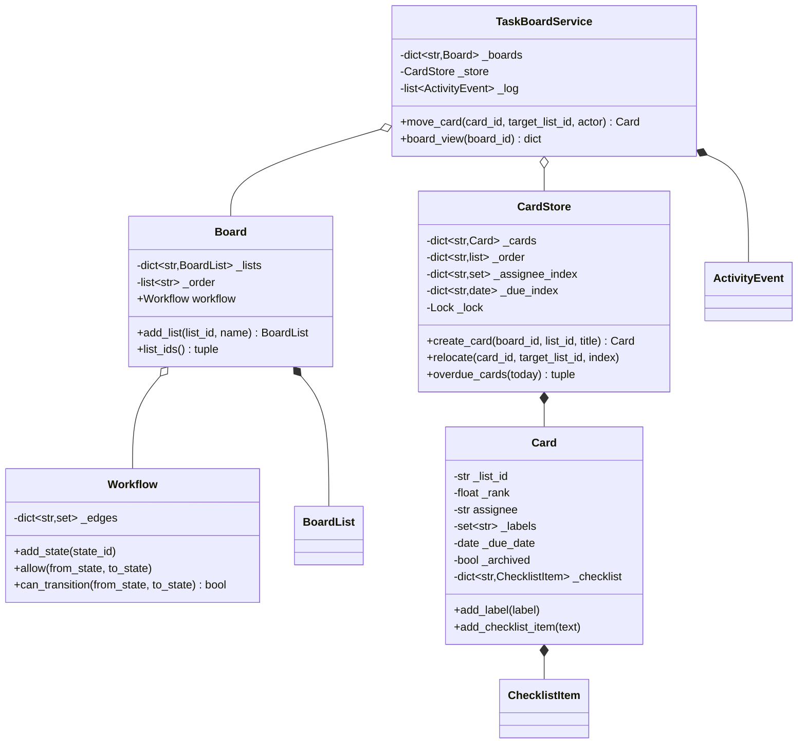

# 设计题解：任务看板（Trello / Jira）

## 题目与澄清

面试官的开场白："设计一个任务看板：几条列，卡片可以在列之间拖来拖去，每张卡能指派给人、
打标签、设截止日期。"这是社区题里少数不以"人和人的关系"为核心的一道——它的重心是**结构**：
一块看板长什么样、一张卡的"位置"到底是什么、以及"移动"这个动作该不该被随意允许。值得当场
问出来的：

- **列（list/column）到底是不是工作流里的状态？** 是，而且这条回答决定了整个设计的骨架。
  Trello 的"待办/进行中/完成"看上去只是三个展示分区，但一旦产品要求"不能直接把待办卡拖进
  完成列，必须先经过进行中"，列就不再是纯展示——它是[[structure.state-machines|状态机（State
  Machines）]]里的一个状态节点，移动卡片就是一次状态转移，必须受一张转移表约束。本文选择
  让列本身就是状态节点，而不是给卡片另开一个和列脱节的 `status` 字段——两者一旦分开，
  "卡片在完成列但状态还是进行中"这种不一致迟早出现。
- **工作流是不是每块看板都一样？** 不是。真实的 Jira 里，一个团队的看板可能是
  "待办→进行中→评审→完成"，另一个团队可能多一条"评审→打回进行中"的边——这正是题目要求的
  "Jira 风格的方案，不是硬编码的待办/进行中/完成"。本文把工作流做成每块看板各自持有的一张
  有向图，边由创建看板的人自己声明。
- **位置存整数下标还是别的？** 这是本题最容易被面试官单独追问的一条，也是"第 1 关"里唯一
  一个纯数据结构问题：两张卡片相邻插入一张新卡，要不要重排后面所有卡的下标？本文给出的答案
  和它的代价，见下面"关键设计决策"第一条。
- **谁能移动、指派、归档一张卡？** 本文不建模看板成员权限（谁是看板的成员、谁只能查看）——
  这是一道独立的权限系统问题，本题假设调用方已经完成了鉴权，只把"操作者是谁"（`actor`）
  记进活动日志，不做权限校验。这条简化写在这里，不是悄悄发生的。
- **卡片能不能被真正删除？** 不能，只能归档。删除会让"这张卡去年在哪个列、被谁移动过"这类
  审计问题无法回答；归档是本题唯一的"卡片离开看板"的方式，见"扩展与追问"里对这条规则的
  进一步讨论。
- **工作流有没有"终态"这个概念？一张卡进了终态列，还算不算逾期？** 本文的答案是没有。
  `Workflow` 是完全通用的有向图，不内建任何"这是 Done 列"的标记——上面已经确认了状态集合
  由使用者自己声明，不能一边说"不硬编码三段式"一边又假设列表里一定存在一个叫"完成"的
  特殊节点。这条设计的直接后果是：一张卡即使被挪进了看起来像"完成"的那一列，只要它的
  到期日还在过去、且没有被归档，`overdue_cards` 依然会把它算进去——本文认为这是"工作流
  完全通用"这条承诺应付的代价，而不是一个疏漏。如果产品坚持要终态列不算逾期，改法是给
  `Workflow` 加一个 `terminal_states: frozenset[str]` 集合，`overdue_cards` 在过滤时多查
  一次"这张卡此刻所在的列是不是终态"，只有这一个方法需要改，`Workflow.can_transition`、
  `CardStore` 的三类索引都不需要动。

**范围之外**：看板成员与权限系统；卡片描述的富文本与附件；跨看板的自动化规则（"卡片进了
Done 列自动关联的 GitHub PR 也关闭"）；swimlane（按史诗/优先级横向再分组的看板视图）——
这条本文选了另一个同样满足"不碰移动逻辑"这条验收标准的加法（清单），swimlane 作为等价的
备选方案在"扩展与追问"里讨论；终态列的概念，见上一条澄清。

## 需求与分级

- **第 1 关（看板、列、卡片，约 20 分钟）**：一块看板由若干列组成，列有先后顺序；建卡默认
  追加到列尾；同一列内卡片能重新排序，且这个操作只写被移动那张卡自己的一个数字。对应
  `Board`、`BoardList`、`Card`、`CardStore.create_card`、`TaskBoardService.reorder_card`。
- **第 2 关（工作流、指派、标签、截止日期，约 20 分钟）**：每块看板有自己的一张转移表，
  跨列移动前必须先查这张表；一张卡能指派给一个人（可改派、可取消指派）、能挂若干标签、能设
  截止日期；这一切连同建卡、移动，都各自留下一条活动记录，活动日志是"这张卡上发生过什么"
  的唯一真相来源。对应 `Workflow`、`TaskBoardService.move_card`/`assign_card`/`label_card`/
  `set_due_date`、`ActivityEvent`。
- **第 3 关（查询，约 15 分钟）**：产品要三条查询都必须是"查索引"而不是"扫全部卡片"——
  一个人跨所有看板的指派卡、全站逾期的卡、一块看板按列分组的视图。对应 `CardStore` 里的
  `_assignee_index`、`_due_index`、`_order`，与 `TaskBoardService.cards_for_assignee`/
  `overdue_cards`/`board_view`。
- **第 4 关（清单，选做）**：给卡片加一份可勾选清单。验收标准是**加它不改 `CardStore` 的
  任何一行代码**——清单不进任何索引，只活在卡片自己身上。对应 `ChecklistItem`、
  `Card.add_checklist_item`/`toggle_checklist_item`。

## 核心对象与职责

- **`Workflow`** — 一块看板自己的状态转移规则：哪些列之间允许直接互转。它只回答"这条边
  存在吗"，不知道卡片、不知道索引。
- **`Board`** — 列的集合与它们的展示顺序，以及这块看板自己的 `Workflow`。**不**持有卡片。
- **`BoardList`** — 一列：id 和名字，没有行为。
- **`Card`** — 一张卡片的数据：标题、所在列、秩、指派人、标签、截止日期、归档标记、清单。
  它自己只守"清单和标签不影响任何索引"这条边界；列成员、指派、到期日这几项字段的写入**只
  应经过** `CardStore`，否则三类索引会和卡片自身的字段脱节。
- **`CardStore`** — 卡片的存储与三类索引：按列（秩排序）、按指派人、按未归档的到期日。
  不知道工作流规则，只知道"把卡片放进哪一列"。
- **`ActivityEvent`** — 一条不可变的活动记录：谁在什么时候对哪张卡做了什么。
- **`TaskBoardService`** — 门面：唯一同时知道"这次移动合不合法"（问 `Workflow`）和"移动
  之后索引该怎么变"（叫 `CardStore`）的地方，两个被编排的对象互不知道对方存在。

生命周期上，`TaskBoardService` **组合** `Board` 与 `CardStore`（随服务而生）；`Board`
**组合** `BoardList` 与它自己的 `Workflow`；`CardStore` **组合** `Card`（卡片的生死由它的
`create_card`/`archive` 决定）；`Card` **组合** `ChecklistItem`。`ActivityEvent` 由
`TaskBoardService` 直接持有一份追加写的列表，不挂在任何一张卡上——这样"清空一张卡的历史"
永远不会是一个可以被误调用的操作。



## 关键设计决策

### 位置用可排序的浮点"秩"，不用整数下标

朴素的做法是给每列维护一个 `list[Card]`，位置就是下标：

```python
# 选项 1：整数下标
class BoardListNaive:
    def __init__(self):
        self.cards: list[Card] = []
    def insert(self, card, index):
        self.cards.insert(index, card)   # 后面所有卡的下标都要跟着变
```

```python
# 选项 2：可排序的浮点秩（本文的选择）
def rank_between(prev_rank: float | None, next_rank: float | None) -> float:
    if prev_rank is None and next_rank is None:
        return 0.0
    if prev_rank is None:
        return next_rank - 1.0
    if next_rank is None:
        return prev_rank + 1.0
    return prev_rank + (next_rank - prev_rank) / 2
```

选项 1 的下标不是卡片的属性，是它在列表里当前的位置——移动一张卡到列首，其余所有卡的下标
都要重新算一遍，一次插入是 O(n)；持久化到数据库时更糟，等价于要 `UPDATE` 一整列的排序字段。
选项 2 让"位置"变成卡片自己携带的一个数字：插入或移动只写**这一张卡**，其它卡一行都不碰，
是 O(1)。代价是浮点数精度有限——如果反复在同一条缝里插入（比如一个自动化脚本一直把新卡
插到列首），秩的间距会指数级缩小，早晚小到 `prev + (next-prev)/2` 算出来的中点因为浮点舍入
等于 `prev` 或 `next` 本身，这时 `rank_between` 抛出 `RankExhaustedError`，调用方
（`CardStore._rebalance`）把这一列的秩重新铺成 `0, 1, 2, …`——这个重排是 O(列长)，但只在
这条缝真的被挤爆时才发生一次，不是每次插入都付出的代价。`test_repeated_insertion_in_same_
gap_stays_correctly_ordered` 连续在同一条缝里插入 80 次，验证的正是重排会透明地发生、
调用方感觉不到，排序始终正确。**这条决策没有第三个选项是"字符串秩"（LexoRank 那一类按
字典序可插的编码）——它能把"重排"这个 O(n) 的尾部代价也摊掉，但代价是每次比较都要做字符串
运算，且实现复杂度远高于这道题的产出比；浮点秩配合"耗尽就整列重排"已经把常见情形的复杂度
降到了 O(1)，只在病态输入下退化到 O(n)，这个权衡对一道机器编码题是足够的。**

**`index` 参数按"移除之后"的列表算，不是按"移除之前"的原始列表算**——这条约定容易被读者
想反，值得一个具体例子钉住。设某一列此刻是 `[A, B, C]`（下标 0、1、2），调用
`move_card(A.id, 同一列, index=2)`：`relocate` 先把 `A` 从这一列摘掉，列变成 `[B, C]`，
`index=2` 这时候是对着这份**两个元素**的列表算的，`2` 已经是"列尾"（`len([B, C]) == 2`），
于是 `A` 被插到 `C` 后面，最终结果是 `[B, C, A]`。如果读者以为 `index` 是对着移动前的原始
三元素列表 `[A, B, C]` 算的，会以为 `index=2` 指的是"C 前面的那个位置"、预期结果是
`[B, A, C]`——这个预期是错的。选择"移除之后再算下标"是因为它和 `list.insert` 的自然语义
一致（先拿走要移动的那个元素，再决定它去哪儿插回来），也是 Trello 等真实产品拖拽交互的
心智模型：你把一张卡从原来的位置拎起来，此刻看到的是**少了这张卡**的一列，再决定放哪。

### 工作流是一张转移表，不是"每个状态一个类"

题目的概念落点是[[patterns.state|状态模式（State）]]，教科书式的写法是给"待办""进行中"
"完成"各自一个类，把"能不能转移"这件事写成虚方法：

```python
# 选项 1：每个状态一个类（GoF 教科书写法）
class ListState(ABC):
    @abstractmethod
    def can_transition_to(self, target: "ListState") -> bool: ...
class TodoState(ListState):
    def can_transition_to(self, target): return isinstance(target, DoingState)
class DoingState(ListState):
    def can_transition_to(self, target): return isinstance(target, (DoneState, TodoState))
```

```python
# 选项 2：Enum + 转移表（本文的选择，和餐厅题的 LINE_TRANSITIONS 同一个idiom）
class Workflow:
    def __init__(self, states=()):
        self._edges: dict[str, set[str]] = {s: set() for s in states}
    def allow(self, from_state, to_state):
        self._edges[from_state].add(to_state)
    def can_transition(self, from_state, to_state):
        return from_state == to_state or to_state in self._edges.get(from_state, ())
```

状态模式值得用的判据是：**不同状态下同一个操作要执行不同的代码**，比如电梯在"运行中"和
"维修中"收到"开门"指令会做完全不同的事。这道题里三个（或更多）列之间唯一有实质内容的差异
是"允许转到哪些列"，这是**纯数据**——没有任何一个方法在"待办"列和"进行中"列上会执行不同
的代码分支，转移表本身就是全部逻辑。而且这张表还必须**每块看板各自一份、且能在运行时由
使用者自己声明**（Jira 风格），选项 1 会让每加一块看板、每改一条边就要新增或修改一个类，
选项 2 只是往一个 `dict` 里加一条边。**这不是对状态模式的否定，而是它在 Python 里更朴素的
形态**：一张转移表本身就是状态机最诚实的表达，与餐厅题的 `LINE_TRANSITIONS`、问答社区题的
声望权限表是同一类判断——当"状态"只是一枚标签而没有随之而来的行为差异时，表比类层级更短、
更容易审查是否有遗漏的边。

### 逾期查询：一份"未归档且设了到期日"的过滤索引，不是一棵按日期排序的树

"全站逾期的卡"这条查询字面上像是要按日期排序，很容易联想到用堆或平衡树维护一个全局有序
结构：

```python
# 选项 1：一棵按到期日排序的结构（heapq 或第三方 sortedcontainers）
# → 支持 O(log n) 的"下一个最快到期的卡"，但要在到期日变化、卡被归档时都做一次 O(log n) 的
#   删除或重新定位，写路径的复杂度不低
```

```python
# 选项 2：过滤索引，只收未归档且设了到期日的卡（本文的选择）
def overdue_cards(self, today: date) -> tuple[Card, ...]:
    return tuple(self._cards[cid] for cid, due in self._due_index.items() if due < today)
```

产品要的查询是**批量**的"把所有逾期的卡都给我"，不是"给我下一个最快到期的那一张"——这两
种查询对数据结构的要求完全不同，前者只需要"别扫不相关的卡"，后者才需要维护顺序。`_due_
index` 只装未归档、且设了到期日的卡：一块正常看板里，多数卡要么没设到期日、要么已经归档，
`overdue_cards` 因此只扫这一小撮"真的可能逾期"的卡，而不是扫全站的卡——这已经是这条查询
真正需要的复杂度下界。**选项 1 的排序结构解决的是一个本题没有问过的问题**；如果后续需求
真的变成"提醒我最快到期的三张卡"，`_due_index` 换成一棵按 `(due, card_id)` 排序的树只影响
这一个方法，其它代码不用动，这也是决策不该提前做的一个例子。

### 归档收缩三类索引，而不是打一个软删除标记就完事

许多公开题解把"归档"实现成 `card.archived = True`，查询时再加一句 `if not card.archived`
过滤：

```python
# 选项 1：只打标记，查询时过滤
def cards_in_list(self, list_id):
    return [c for c in self._cards.values() if c.list_id == list_id and not c.archived]
```

```python
# 选项 2：归档立刻把卡从三类索引里摘除（本文的选择）
def archive(self, card_id: str) -> None:
    card = self._require(card_id)
    card._archive()
    self._order.get(card.list_id, []).remove(card_id)
    if card.assignee is not None:
        self._assignee_index.get(card.assignee, set()).discard(card_id)
    self._due_index.pop(card_id, None)
```

选项 1 的每一条查询都要多付一次全表过滤的代价，而且这份代价随着"曾经存在过的卡片总数"
单调增长，即便活跃看板始终只有几十张卡——一年下来归档的卡可能是活跃卡的几十倍，每次查询
都在扫一堆已经不该出现的历史记录。选项 2 让索引的大小始终只反映"此刻真的挂在看板上"的卡
数，`CardStore.indexed_card_count` 把这条不变量暴露成一个只读属性，测试直接断言归档之后
它会变小。卡片对象本身**不**被删除——`_cards` 这份主表永远保留，`TaskBoardService.card(id)`
仍然能查到一张已归档的卡，这是"归档不是删除"这条产品承诺的实现：索引负责"看板上显示什么"，
主表负责"这张卡曾经存在过"，两者各自回答不同的问题，不能用同一份数据结构兼顾。

## 代码走读

整份实现如下。读的时候盯住四处：`rank_between` 与 `CardStore._rebalance` 那对"耗尽就重排"
的组合、`Workflow.can_transition` 那一行判断、`CardStore.archive` 里三处索引摘除、以及
`TaskBoardService.move_card` 里"目标列等于当前列就不查工作流"的分支。

%% code:begin solution.py %%
```python
"""任务看板（Trello / Jira）：看板-列-卡片，工作流状态转移，指派/标签/截止日期，活动记录。

设计要点：一列（`BoardList`）本身就是工作流里的一个状态节点，`Workflow` 只管"这一步转移合不
合法"这一件事，不知道卡片、不知道索引；`CardStore` 只管卡片的存储与三类索引（按列排序、按
指派人、按未归档的到期日）的维护，不知道工作流规则；`TaskBoardService` 编排两者，是唯一同时
知道"这次移动合不合法"和"移动之后索引该怎么变"的地方。卡片在列内的顺序用可排序的浮点"秩"
（rank）维护——挪一张卡只改它自己的一个数字，不用移动其它卡；秩间距耗尽时只重排那一列，不碰
其它列。归档一张卡会把它从三类索引里同时摘除，索引因此不会随着历史卡片数量无限增长。
"""

from __future__ import annotations

import itertools
import threading
from collections.abc import Iterable, Mapping
from dataclasses import dataclass, field
from datetime import date, datetime, timezone
from enum import Enum
from typing import Callable

Clock = Callable[[], datetime]


def utc_now() -> datetime:
    """默认时钟。"""
    return datetime.now(timezone.utc)


# --------------------------------------------------------------------------
# 失败路径


class TaskBoardError(Exception):
    """本组件所有失败路径的公共基类。"""


class UnknownBoardError(TaskBoardError, KeyError):
    """看板 id 不存在。"""


class UnknownListError(TaskBoardError, KeyError):
    """列 id 在这块看板上不存在。"""


class UnknownCardError(TaskBoardError, KeyError):
    """卡片 id，或卡片上的某条清单项 id，不存在。"""


class DuplicateListError(TaskBoardError):
    """同一个列 id 在同一块看板上被重复创建。"""


class IllegalTransitionError(TaskBoardError):
    """工作流里没有这条边：从当前列不能直接转移到目标列。"""


class CardArchivedError(TaskBoardError):
    """卡片已归档，不能再移动、指派或改其它字段。"""


# --------------------------------------------------------------------------
# 秩：卡片在列内的顺序，位置用一个可排序的浮点数表达，不用整数下标。


class RankExhaustedError(Exception):
    """相邻两张卡的秩已经挨得太近，浮点精度分不出中点了——调用方应当重排整列。"""


def rank_between(prev_rank: float | None, next_rank: float | None) -> float:
    """算一个夹在 `prev_rank` 和 `next_rank` 之间的秩；两端各自可以是 `None`（列首/列尾）。

    这是"位置怎么存"这道题的核心：整数下标每插入一张卡都要把后面所有卡的下标加一，一次移动是
    O(n)；这里插入或移动只写一张卡自己的浮点数，其它卡一行都不碰，是 O(1)。代价是浮点数的
    精度有限——反复在同一条缝里插入，早晚会碰到两个相邻的秩已经无法再取中点，那时候
    `RankExhaustedError` 提醒调用方对这一列做一次性的整列重排（`CardStore._rebalance`），这个
    重排本身是 O(列长)，但只在这条缝真的被塞满时才发生，不是每次插入都付出的代价。
    """
    if prev_rank is None and next_rank is None:
        return 0.0
    if prev_rank is None:
        return next_rank - 1.0
    if next_rank is None:
        return prev_rank + 1.0
    mid = prev_rank + (next_rank - prev_rank) / 2
    if mid <= prev_rank or mid >= next_rank:
        raise RankExhaustedError("rank gap exhausted")
    return mid


# --------------------------------------------------------------------------
# 活动记录：一份不可变、追加写的事件日志，是"这张卡上发生过什么"的唯一真相来源。


class ActivityType(Enum):
    """一条活动事件的种类；每一种都对应卡片生命周期里的一次可观察动作。"""

    CREATED = "created"
    MOVED = "moved"
    ASSIGNED = "assigned"
    UNASSIGNED = "unassigned"
    LABELED = "labeled"
    UNLABELED = "unlabeled"
    DUE_DATE_SET = "due_date_set"
    DUE_DATE_CLEARED = "due_date_cleared"
    CHECKLIST_ITEM_ADDED = "checklist_item_added"
    CHECKLIST_ITEM_TOGGLED = "checklist_item_toggled"
    ARCHIVED = "archived"


@dataclass(frozen=True, slots=True)
class ActivityEvent:
    """一条活动事件：发生了什么、谁做的、什么时候——一个冻结快照，不是可以回头改写的一行。"""

    event_id: str
    card_id: str
    type: ActivityType
    actor: str
    at: datetime
    detail: str = ""


@dataclass(slots=True)
class ChecklistItem:
    """卡片上清单的一项：文字与完成状态。只在 `Card` 内部被修改，不参与任何索引。"""

    item_id: str
    text: str
    done: bool = False


# --------------------------------------------------------------------------
# 工作流：一块看板自己的状态转移规则。列本身就是状态节点。


class Workflow:
    """看板的工作流：哪些列之间允许直接互转。这是 Jira 风格的图，不是硬编码的三段
    to-do/doing/done——每块看板可以有自己的一套状态和边，甚至允许"打回去"这种反向边。

    这里没有为每个状态各写一个子类去表达"这个状态下能做什么"（教科书里状态模式的常见写法）：
    三个状态之间唯一有实质内容的差异是"允许转到哪些状态"，这是纯数据，不是行为——状态本身不
    会让"移动"这个操作的代码逻辑发生分支。行为差异才值得建类层级；这里只有一张表值得维护。
    """

    def __init__(self, states: Iterable[str] = ()) -> None:
        self._edges: dict[str, set[str]] = {s: set() for s in states}

    def add_state(self, state_id: str) -> None:
        self._edges.setdefault(state_id, set())

    def allow(self, from_state: str, to_state: str) -> None:
        if from_state not in self._edges or to_state not in self._edges:
            raise UnknownListError(f"unknown workflow state {from_state!r} or {to_state!r}")
        self._edges[from_state].add(to_state)

    def can_transition(self, from_state: str, to_state: str) -> bool:
        return from_state == to_state or to_state in self._edges.get(from_state, ())

    def states(self) -> frozenset[str]:
        return frozenset(self._edges)


@dataclass(slots=True)
class BoardList:
    """一块看板上的一列：id 与显示名字。列的先后顺序由 `Board` 维护，不是列自己的事。"""

    id: str
    name: str


class Board:
    """一块看板：列的集合与它们的先后顺序，以及这块看板自己的 `Workflow`。不持有卡片——卡片
    的存储和索引是 `CardStore` 的职责，两者由 `TaskBoardService` 编排到一起。
    """

    def __init__(self, board_id: str, name: str) -> None:
        self.id = board_id
        self.name = name
        self.workflow = Workflow()
        self._lists: dict[str, BoardList] = {}
        self._order: list[str] = []

    def add_list(self, list_id: str, name: str) -> BoardList:
        if list_id in self._lists:
            raise DuplicateListError(f"list {list_id!r} already exists on board {self.id!r}")
        lst = BoardList(list_id, name)
        self._lists[list_id] = lst
        self._order.append(list_id)
        self.workflow.add_state(list_id)
        return lst

    def has_list(self, list_id: str) -> bool:
        return list_id in self._lists

    def list_name(self, list_id: str) -> str:
        try:
            return self._lists[list_id].name
        except KeyError:
            raise UnknownListError(list_id) from None

    def list_ids(self) -> tuple[str, ...]:
        """列的显示顺序快照——调用方不能通过它改写看板的列序。"""
        return tuple(self._order)


# --------------------------------------------------------------------------
# 卡片：数据持有者。列成员、指派、到期日的写入只应经过 `CardStore`，否则三类索引会和卡片
# 自身的字段脱节——这条纪律和餐厅题里"两把锁只有一个方向"一样，靠约定维持、写进文档字符串。


class Card:
    """看板上的一张卡片。清单（checklist）的增删不影响列成员、指派、到期日何何一项索引，因此
    stage 4 加清单这个动作完全不碰 `CardStore` 的任何一行代码——这正是这道题"加一个子功能不动
    移动逻辑"这条验收标准的字面体现。
    """

    def __init__(self, card_id: str, board_id: str, list_id: str, title: str, rank: float) -> None:
        self.id = card_id
        self.board_id = board_id
        self.title = title
        self._list_id = list_id
        self._rank = rank
        self._assignee: str | None = None
        self._labels: set[str] = set()
        self._due_date: date | None = None
        self._archived = False
        self._checklist: dict[str, ChecklistItem] = {}
        self._next_item = itertools.count(1)

    @property
    def list_id(self) -> str:
        return self._list_id

    @property
    def rank(self) -> float:
        return self._rank

    @property
    def assignee(self) -> str | None:
        return self._assignee

    @property
    def labels(self) -> frozenset[str]:
        return frozenset(self._labels)

    @property
    def due_date(self) -> date | None:
        return self._due_date

    @property
    def archived(self) -> bool:
        return self._archived

    @property
    def checklist(self) -> tuple[ChecklistItem, ...]:
        return tuple(self._checklist.values())

    def is_overdue(self, today: date) -> bool:
        return not self._archived and self._due_date is not None and self._due_date < today

    # ---- 只应由 CardStore 调用：写入的同时它也在维护索引 ----

    def _place(self, list_id: str, rank: float) -> None:
        self._list_id, self._rank = list_id, rank

    def _assign(self, user_id: str | None) -> None:
        self._assignee = user_id

    def _set_due(self, due: date | None) -> None:
        self._due_date = due

    def _archive(self) -> None:
        self._archived = True

    # ---- 标签与清单：不进任何索引，谁都能直接调用 ----

    def add_label(self, label: str) -> None:
        self._labels.add(label)

    def remove_label(self, label: str) -> None:
        self._labels.discard(label)

    def add_checklist_item(self, text: str) -> ChecklistItem:
        item = ChecklistItem(f"chk-{next(self._next_item)}", text)
        self._checklist[item.item_id] = item
        return item

    def toggle_checklist_item(self, item_id: str) -> ChecklistItem:
        item = self._checklist.get(item_id)
        if item is None:
            raise UnknownCardError(f"unknown checklist item {item_id!r} on card {self.id!r}")
        item.done = not item.done
        return item


# --------------------------------------------------------------------------
# CardStore：卡片的存储与三类索引。不知道工作流规则，只知道"把卡片放进哪一列"。


class CardStore:
    """卡片仓库：按列的秩排序索引（分组查询）、按指派人的索引（跨看板查询）、按到期日的索引
    （只收未归档且设了到期日的卡，逾期查询因此只扫『真的可能逾期』的这一小撮卡，不扫全部卡）。
    """

    def __init__(self) -> None:
        self._cards: dict[str, Card] = {}
        self._order: dict[str, list[str]] = {}
        self._assignee_index: dict[str, set[str]] = {}
        self._due_index: dict[str, date] = {}
        self._lock = threading.Lock()
        self._next_id = itertools.count(1)

    def _require(self, card_id: str) -> Card:
        try:
            return self._cards[card_id]
        except KeyError:
            raise UnknownCardError(card_id) from None

    def card(self, card_id: str) -> Card:
        with self._lock:
            return self._require(card_id)

    def create_card(self, board_id: str, list_id: str, title: str) -> Card:
        with self._lock:
            order = self._order.setdefault(list_id, [])
            prev_rank = self._cards[order[-1]].rank if order else None
            rank = rank_between(prev_rank, None)
            card = Card(f"card-{next(self._next_id)}", board_id, list_id, title, rank)
            self._cards[card.id] = card
            order.append(card.id)
            return card

    def cards_in_list(self, list_id: str) -> tuple[Card, ...]:
        with self._lock:
            return tuple(self._cards[cid] for cid in self._order.get(list_id, ()))

    def relocate(self, card_id: str, target_list_id: str, index: int | None = None) -> None:
        """把卡片挪到 `target_list_id`，插入到位置 `index`（`None` 表示列尾）。跨列移动与同列
        内重排走的是同一条路径——对索引来说都只是"从旧列摘掉、在新列按秩插入"。
        """
        with self._lock:
            card = self._require(card_id)
            old_order = self._order.setdefault(card.list_id, [])
            if card_id in old_order:
                old_order.remove(card_id)
            new_order = self._order.setdefault(target_list_id, [])
            idx = len(new_order) if index is None else max(0, min(index, len(new_order)))
            try:
                new_rank = self._rank_at(new_order, idx)
            except RankExhaustedError:
                self._rebalance(target_list_id)
                new_order = self._order[target_list_id]
                new_rank = self._rank_at(new_order, idx)
            card._place(target_list_id, new_rank)
            new_order.insert(idx, card_id)

    def _rank_at(self, order: list[str], idx: int) -> float:
        prev_rank = self._cards[order[idx - 1]].rank if idx > 0 else None
        next_rank = self._cards[order[idx]].rank if idx < len(order) else None
        return rank_between(prev_rank, next_rank)

    def _rebalance(self, list_id: str) -> None:
        for i, cid in enumerate(self._order[list_id]):
            self._cards[cid]._place(list_id, float(i))

    def assign(self, card_id: str, user_id: str | None) -> None:
        with self._lock:
            card = self._require(card_id)
            if card.assignee is not None:
                self._assignee_index.get(card.assignee, set()).discard(card_id)
            card._assign(user_id)
            if user_id is not None:
                self._assignee_index.setdefault(user_id, set()).add(card_id)

    def set_due_date(self, card_id: str, due: date | None) -> None:
        with self._lock:
            card = self._require(card_id)
            card._set_due(due)
            if due is not None and not card.archived:
                self._due_index[card_id] = due
            else:
                self._due_index.pop(card_id, None)

    def archive(self, card_id: str) -> None:
        with self._lock:
            card = self._require(card_id)
            card._archive()
            self._order.get(card.list_id, []).remove(card_id)
            if card.assignee is not None:
                self._assignee_index.get(card.assignee, set()).discard(card_id)
            self._due_index.pop(card_id, None)

    def cards_for_assignee(self, user_id: str) -> tuple[Card, ...]:
        with self._lock:
            return tuple(self._cards[cid] for cid in self._assignee_index.get(user_id, ()))

    def overdue_cards(self, today: date) -> tuple[Card, ...]:
        with self._lock:
            return tuple(self._cards[cid] for cid, due in self._due_index.items() if due < today)

    @property
    def indexed_card_count(self) -> int:
        """还挂在某个列索引里的卡片数——归档会让它变小，这是"索引会缩小"这条承诺的可验证证据。"""
        with self._lock:
            return sum(len(v) for v in self._order.values())


# --------------------------------------------------------------------------
# TaskBoardService：门面。创建看板与列、发卡、按工作流移动、指派、标签、到期日、归档、查询。


class TaskBoardService:
    """任务看板系统的入口。只有它同时知道 `Workflow`（这一步移动合不合法）和 `CardStore`
    （移动之后索引该怎么变），两个被编排的对象互不知道对方的存在——和餐厅题里
    `RestaurantService` 编排 `FloorManager`/`Kitchen` 是同一个道理。
    """

    def __init__(self, clock: Clock = utc_now) -> None:
        self._clock = clock
        self._boards: dict[str, Board] = {}
        self._store = CardStore()
        self._log: list[ActivityEvent] = []
        self._lock = threading.Lock()
        self._event_ids = itertools.count(1)

    def create_board(self, board_id: str, name: str) -> Board:
        with self._lock:
            if board_id in self._boards:
                raise DuplicateListError(f"board {board_id!r} already exists")
            board = Board(board_id, name)
            self._boards[board_id] = board
            return board

    def board(self, board_id: str) -> Board:
        try:
            return self._boards[board_id]
        except KeyError:
            raise UnknownBoardError(board_id) from None

    def add_list(self, board_id: str, list_id: str, name: str) -> BoardList:
        return self.board(board_id).add_list(list_id, name)

    def allow_transition(self, board_id: str, from_list: str, to_list: str) -> None:
        self.board(board_id).workflow.allow(from_list, to_list)

    def _record(self, card_id: str, event_type: ActivityType, actor: str, detail: str = "") -> None:
        with self._lock:
            event = ActivityEvent(f"evt-{next(self._event_ids)}", card_id, event_type, actor,
                                  self._clock(), detail)
            self._log.append(event)

    # ---- 第 1 关：看板、列、卡片 ----

    def create_card(self, board_id: str, list_id: str, title: str, actor: str) -> Card:
        board = self.board(board_id)
        if not board.has_list(list_id):
            raise UnknownListError(list_id)
        card = self._store.create_card(board_id, list_id, title)
        self._record(card.id, ActivityType.CREATED, actor, f"list={list_id}")
        return card

    def card(self, card_id: str) -> Card:
        return self._store.card(card_id)

    def reorder_card(self, card_id: str, index: int, actor: str) -> Card:
        """在同一列内重排位置——不是跨状态的转移，因此不查工作流。"""
        card = self._require_active(card_id)
        self._store.relocate(card_id, card.list_id, index)
        self._record(card_id, ActivityType.MOVED, actor, f"reorder@{card.list_id}")
        return card

    # ---- 第 2 关：工作流转移、指派、标签、到期日 ----

    def move_card(self, card_id: str, target_list_id: str, actor: str, index: int | None = None) -> Card:
        card = self._require_active(card_id)
        board = self.board(card.board_id)
        if not board.has_list(target_list_id):
            raise UnknownListError(target_list_id)
        if target_list_id != card.list_id and not board.workflow.can_transition(card.list_id, target_list_id):
            raise IllegalTransitionError(f"{card.list_id} -> {target_list_id} is not an allowed transition")
        origin = card.list_id
        self._store.relocate(card_id, target_list_id, index)
        self._record(card_id, ActivityType.MOVED, actor, f"{origin}->{target_list_id}")
        return card

    def _require_active(self, card_id: str) -> Card:
        card = self._store.card(card_id)
        if card.archived:
            raise CardArchivedError(card_id)
        return card

    def assign_card(self, card_id: str, user_id: str, actor: str) -> Card:
        card = self._require_active(card_id)
        self._store.assign(card_id, user_id)
        self._record(card_id, ActivityType.ASSIGNED, actor, user_id)
        return card

    def unassign_card(self, card_id: str, actor: str) -> Card:
        card = self._require_active(card_id)
        self._store.assign(card_id, None)
        self._record(card_id, ActivityType.UNASSIGNED, actor)
        return card

    def label_card(self, card_id: str, label: str, actor: str) -> Card:
        card = self._require_active(card_id)
        card.add_label(label)
        self._record(card_id, ActivityType.LABELED, actor, label)
        return card

    def unlabel_card(self, card_id: str, label: str, actor: str) -> Card:
        card = self._require_active(card_id)
        card.remove_label(label)
        self._record(card_id, ActivityType.UNLABELED, actor, label)
        return card

    def set_due_date(self, card_id: str, due: date | None, actor: str) -> Card:
        card = self._require_active(card_id)
        self._store.set_due_date(card_id, due)
        event_type = ActivityType.DUE_DATE_SET if due is not None else ActivityType.DUE_DATE_CLEARED
        self._record(card_id, event_type, actor, str(due) if due else "")
        return card

    def archive_card(self, card_id: str, actor: str) -> Card:
        card = self._require_active(card_id)
        self._store.archive(card_id)
        self._record(card_id, ActivityType.ARCHIVED, actor)
        return card

    # ---- 第 4 关：清单——不碰移动逻辑 ----

    def add_checklist_item(self, card_id: str, text: str, actor: str) -> ChecklistItem:
        card = self._require_active(card_id)
        item = card.add_checklist_item(text)
        self._record(card_id, ActivityType.CHECKLIST_ITEM_ADDED, actor, item.item_id)
        return item

    def toggle_checklist_item(self, card_id: str, item_id: str, actor: str) -> ChecklistItem:
        card = self._require_active(card_id)
        item = card.toggle_checklist_item(item_id)
        self._record(card_id, ActivityType.CHECKLIST_ITEM_TOGGLED, actor, item_id)
        return item

    # ---- 第 3 关：查询 ----

    def board_view(self, board_id: str) -> Mapping[str, tuple[Card, ...]]:
        """按列分组的看板视图——每一列各自一次索引查询，不扫全站的卡。"""
        board = self.board(board_id)
        return {list_id: self._store.cards_in_list(list_id) for list_id in board.list_ids()}

    def cards_for_assignee(self, user_id: str) -> tuple[Card, ...]:
        return self._store.cards_for_assignee(user_id)

    def overdue_cards(self) -> tuple[Card, ...]:
        return self._store.overdue_cards(self._clock().date())

    def history_for(self, card_id: str) -> tuple[ActivityEvent, ...]:
        with self._lock:
            return tuple(e for e in self._log if e.card_id == card_id)

    @property
    def indexed_card_count(self) -> int:
        return self._store.indexed_card_count


def _demo() -> None:
    service = TaskBoardService()
    service.create_board("b1", "Sprint 42")
    for list_id, name in (("todo", "To Do"), ("doing", "In Progress"), ("done", "Done")):
        service.add_list("b1", list_id, name)
    for a, b in (("todo", "doing"), ("doing", "done"), ("doing", "todo")):
        service.allow_transition("b1", a, b)
    card = service.create_card("b1", "todo", "写设计文档", actor="ada")
    service.assign_card(card.id, "grace", actor="ada")
    service.move_card(card.id, "doing", actor="grace")
    print("board view:", {k: [c.title for c in v] for k, v in service.board_view("b1").items()})
    print("grace's cards:", [c.title for c in service.cards_for_assignee("grace")])


if __name__ == "__main__":
    _demo()
```
%% code:end %%

**`rank_between` 的三个提前返回（两端都是 `None`、只有一端是 `None`）不是防御性编程，是
"空列建第一张卡"和"插到列首/列尾"这两种真实会发生的情况**——它们不需要一个"前一个"或"后一
个"的秩去取中点，写成特判比硬凑一个哨兵值（比如假装列首的秩是负无穷）更直白，也不会在极端
输入下污染真实的秩空间。

**`CardStore.relocate` 把"从旧列摘掉"和"在新列插入"钉在同一次加锁里**，和餐厅题
`Kitchen.submit` 的理由相同：如果这两步之间能被别的线程插进来，会出现一张卡同时挂在两列、
或者哪列都不挂的窗口期。`_rank_at` 抛出 `RankExhaustedError` 时，`relocate` 捕获它、调用
`_rebalance`、然后**在同一次加锁范围内**重新算一次目标位置的秩——重排和插入是一次原子操作
的两个步骤，不是两次独立的加锁。

**`Workflow.can_transition` 里 `from_state == to_state` 这个短路是"重排等于同一列内移动"
这条决策的落点**：`TaskBoardService.move_card` 对着任何目标列都会先算好 `origin`，如果
`target_list_id == card.list_id`，`can_transition` 直接返回 `True`，工作流那张表完全不需要
声明"某列到它自己"这条边——这条边在每一块看板上都成立，把它塞进使用者自己维护的转移表里
反而是一种需要每次建看板都重复声明的噪音。

**`Card.add_label`/`add_checklist_item` 没有下划线前缀，`_place`/`_assign`/`_set_due`/
`_archive` 有**——这条命名差异就是"哪些字段需要 `CardStore` 同步维护索引、哪些不需要"这条
边界的字面标记，`test_checklist_independent_of_move_logic` 验证的正是这条边界：清单的增删
和勾选，与移动、归档互不影响。

## 测试与自检

十八个测试，按四关加并发分组：

- **位置与排序**：建卡默认追加到列尾，秩单调递增；同列内重排只改被移动的那张卡；连续在
  同一条缝里插入 80 次，`rank_between` 会耗尽、触发透明重排，最终顺序仍然正确且秩两两不同
  ——这个断言直接量化了"秩耗尽不会让排序坏掉"这条设计承诺；`rank_between` 本身在两千次
  连续取中点后必定抛出 `RankExhaustedError`，这是耗尽会真的发生的独立证据。
- **工作流转移**：允许的转移改变卡片所在列；不在转移表里的转移抛 `IllegalTransitionError`；
  移到当前列本身不查工作流，走的是重排的代码路径。
- **指派、标签、逾期**：一个人跨两块看板的指派卡能在 `cards_for_assignee` 里同时找到，
  取消指派后立刻从索引里消失；标签的增删互不影响；逾期查询只返回未归档且已过期的卡，未设
  到期日和还没到期的卡都不在结果里。
- **归档**：`indexed_card_count` 归档后恰好减一；归档的卡从列视图、指派索引、逾期索引里
  同时消失，但仍能按 id 直接查到；归档后的卡拒绝再被移动或指派。
- **清单**：加清单项、勾选清单项，与卡片被移动、归档互不影响——清单的状态在移动前后原样
  保留。
- **活动日志**：一张卡的操作序列在 `history_for` 里按发生顺序出现，且记录的是真实的
  `actor` 和转移的起止列。
- **失败路径**：未知卡片、未知列、未知看板、重复的列 id 都各自抛出对应的异常。
- **并发**：十二个线程用 `Barrier` 同步起跑，同时往同一列建卡，断言的是不变量——没有两个
  线程拿到同一个卡片 id，没有两张卡挤到同一个秩上，且卡片总数与线程数相等；没有一句依赖
  线程调度顺序或计时。

**两分钟怎么给面试官演示**：跑 `python solution.py`。它建一块三列的看板、声明工作流的边、
建一张卡、指派、移动到"进行中"，打印按列分组的视图和某个人的指派卡列表。

## 扩展与追问

**新需求**

- *Swimlane*：按史诗或优先级把同一块看板的卡再横向分一次组，是这道题第 4 关的另一个可选
  加法（本文选了清单）。它会碰 `Card`（多一个 `swimlane_id` 字段）和 `TaskBoardService.
  board_view`（分组维度从一维变两维），但**同样不碰** `Workflow` 或秩的维护逻辑——移动和
  排序只关心"列"和"秩"，横向再分组是纯展示层的再切片。
- *WIP 限制*：给某一列设一个"最多同时挂几张卡"的上限，移动超过上限时拒绝。这会落在
  `TaskBoardService.move_card` 里、在查 `Workflow` 通过之后再多查一次 `CardStore.cards_in_
  list(target).__len__()`，`Workflow` 和 `CardStore` 都不需要认识对方，编排点还是同一个
  门面。
- *看板模板*：把一整套列 + 工作流边打包成模板，新建看板时套用。只需要在 `Board`/`Workflow`
  外面加一个纯函数 `apply_template(board, template)`，不改动 `Board`/`Workflow` 内部任何
  一行。

**并发与线程安全**

- *`CardStore` 一把锁，`TaskBoardService` 另一把锁，会不会死锁？* 不会：`TaskBoardService`
  的方法要么只调用 `CardStore` 的方法（进而拿 `CardStore._lock`），要么只调用自己的
  `_record`（拿自己的 `_lock`），两次加锁总是先后发生、不嵌套，`CardStore` 也从不回调
  `TaskBoardService`。锁的方向只有一条，这条纪律写在两个类各自的文档字符串里。
- *`Card.add_label`/`add_checklist_item` 要不要加锁？* 不加——它们只改卡片自己的字段，不
  被任何索引依赖，`CardStore` 的锁保护的是"索引和卡片字段的一致性"，标签和清单从设计上就
  不在这条一致性范围内。如果未来清单要支持"谁在什么时候勾选的"这类需要跨卡片查询的功能，
  这条假设就要重新审视。
- *GIL 给了我什么？* `CardStore.relocate` 里"摘除旧位置 + 计算新秩 + 插入新位置"是好几条
  字节码，`archive` 里三处索引摘除也是——都必须靠显式的锁，GIL 只保证单条字节码不被切开，
  管不住这种跨语句的复合操作。

**持久化与规模**

- *卡片与活动日志落库*：`_order`、`_assignee_index`、`_due_index` 都是内存字典，换成数据库
  索引（列上的复合索引、指派人上的外键索引、到期日上的普通索引），接口不变；`秩` 直接就是
  一个可以建索引的浮点列。
- *到期日索引换成排序结构*：如果产品需求从"全站逾期"扩展成"提醒我接下来 24 小时内到期的
  卡"，`_due_index` 换成一棵按 `(due, card_id)` 排序的结构，只影响 `overdue_cards` 这一个
  方法。
- *多团队分片*：`TaskBoardService` 目前是单实例门面；多团队场景下 `Board`/`CardStore` 按
  `workspace_id` 分片，`Card`/`ActivityEvent` 的 id 本身已经是全局唯一字符串，不需要改。

## 常见错误

- **给卡片一个和它所在列脱节的 `status` 字段**，导致"卡片在完成列但状态还是进行中"这类
  不一致——列本身就该是工作流的状态节点。
- **位置用整数下标**，每次插入或移动都要重排后面所有卡的下标，落到数据库上是一整列
  `UPDATE`。
- **把工作流硬编码成"待办→进行中→完成"三段式**，题目明确要求 Jira 风格的可声明转移表。
- **归档只打一个布尔标记，不摘除索引**，查询要在每一条路径上都记得过滤 `archived`，忘记
  一处就会在"已归档卡片列表"里看到不该出现的卡。
- **给三个（或更多）工作流状态各写一个类**，加一块看板、改一条边就要新增或修改类——这是
  把"看起来像状态机"当成"必须用状态模式"，[[patterns.state|状态模式]]要解决的是行为随状态
  分支，这道题的状态之间没有行为差异，只有数据差异。
- **Java 习惯**：`TaskBoardService` 用 `__new__` 做单例；`Card` 写成带
  `getAssignee()`/`setAssignee()` 的可变类而不是受 `CardStore` 统一管理写入路径的属性；
  给"移动卡片"这一个操作建一个只有一个实现的 `MoveCardCommand` 接口。

## 45 分钟怎么分配

- **0–5 分钟｜澄清。** 点出"列即工作流状态"和"工作流按看板各自声明"这两条和常见简化版本
  不同的地方，把看板权限系统明确排除在范围外。
- **5–15 分钟｜看板与位置。** 画 `Board`/`BoardList` 的结构，写 `rank_between` 和
  `CardStore.create_card`/`relocate`，**一边写一边讲清楚"为什么不用整数下标"**——这十分钟
  决定了后面"重排耗尽"这个追问能不能答上来。
- **15–27 分钟｜工作流与卡片属性。** 写 `Workflow.can_transition`、
  `TaskBoardService.move_card`，然后是指派、标签、到期日；强调"移到当前列不查工作流"这个
  分支。
- **27–37 分钟｜查询与索引。** 写 `_assignee_index`、`_due_index`，口头讲清楚"逾期查询为
  什么不需要一棵排序树"；写 `archive` 并强调它同时摘除三类索引。
- **37–45 分钟｜扩展口头化。** 清单不碰移动逻辑一句话说完；swimlane、WIP 限制、看板模板
  各说一句"会改哪个类、不会碰哪个类"。

**时间不够时砍什么**：先砍清单（口头说"加一份不进索引的清单字段"），再砍到期日索引
（口头描述"只收未归档且设了到期日的卡"这条过滤规则），最后砍并发测试细节。**永远不要砍掉
的是秩耗尽会触发重排这条设计**：一个查询写得很全、但位置维护是整数下标要整列重排的答案，
分数低于一个查询写得简单、但位置维护正确的半成品。

## 来源与延伸

- [ashishps1/awesome-low-level-design — Trello/Task Management](https://github.com/ashishps1/awesome-low-level-design/blob/main/problems)：
  最流行的免费题面合集，多数版本把"列"实现成一个装 `Card` 的普通列表、位置就是下标，完全
  没有讨论秩耗尽或重排的代价；本文认为这正是这道题被低估的难点，把预算优先花在了位置维护
  和逾期索引上。
- [codezym.com — Microsoft LLD 题目大纲（含任务看板类题目）](https://codezym.com/lld/microsoft)：
  列出了这道题在真实面试里出现的报告和大致轮廓，工作流的自定义程度因面试而异；本文按"最
  通用"的版本建模——工作流由使用者声明，而不是假设一定是三段式。
- [Python 文档：`dataclasses`](https://docs.python.org/3/library/dataclasses.html) 与
  [`enum`](https://docs.python.org/3/library/enum.html)：`ActivityEvent`、`BoardList`
  用 `dataclass` 表达记录；`ChecklistItem` 用 `slots=True` 的可变 `dataclass`，因为
  `done` 字段需要原地翻转；`ActivityType` 用 `Enum` 表达一枚封闭的事件种类集合。
