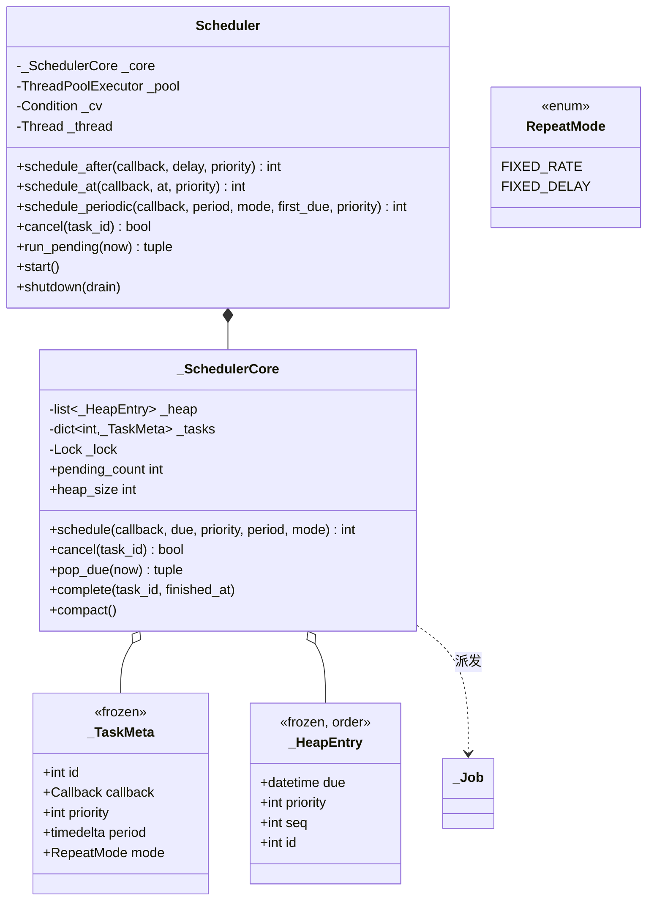

# 设计题解：任务调度器（Task Scheduler）

## 题目与澄清

面试官的开场："设计一个任务调度器：调用方交给你一个函数和一个时间（或者一个周期），你负责
在合适的时候把它跑起来，支持取消。"

先把范围钉死一句话：**这是一个进程内的调度器，不是分布式任务队列**——它不持久化到磁盘、
不跨进程协调、不解决"多个副本谁来执行这一次"，调度状态整个活在一个 `Scheduler` 对象的内存
里，进程一退出就没有了。真实系统里的 Celery、Airflow、Kubernetes CronJob 解决的是另一层
问题（跨节点分发、失败重试、精确一次投递），本题解只处理最里面那一层：**在一个进程内，把
时间和回调对上号**。这层做对了，才谈得上往外面叠分布式协调。

值得当场问的几个问题：

- **进程忙的时候，调度器能保证什么？** 这是本题最容易被问倒的一句。诚实的答案只有一个方向：
  **一个任务不会在它的到期时间之前运行**，但**从不保证"恰好在"那一刻运行**——调度线程要先
  被操作系统调度到、要先拿到锁、工作线程池要先有空位。面试官追问"那周期任务落后了怎么办"，
  答案取决于你选的是固定速率还是固定延迟，这正是第 2 关的题眼。
- **取消之后，那个任务占的内存什么时候真的释放？** 大部分候选人会说"从数据结构里删掉"，
  但如果底层是一个堆（`heapq`），删除任意元素根本不是堆原生支持的操作——这个问题会在
  「关键设计决策」里被认真回答。
- **一个任务的代码跑挂了，会不会拖累别的任务？** 会不会让调度器本身也死掉？
- **周期任务需不需要在同一时刻和别的任务比谁先谁后？** 用什么排？
- **关掉调度器的时候，正在执行的任务怎么办？还没轮到的呢？** 这决定了 `shutdown` 该是"等
  它们跑完"还是"不管了，直接扔掉"，两种都合法，但必须挑一种说清楚并且能被测出来。

**范围之外**：跨进程/跨节点的分布式调度与领导者选举、任务失败后的自动重试与死信队列、
调度状态的持久化（进程重启后恢复未执行的任务）、cron 表达式的完整语法解析。这些留在
「扩展与追问」里讨论怎么在本设计的基础上加，而不是现在就做。

## 需求与分级

- **第 1 关（约 20 分钟）**：调度一个回调在某个延时之后或某个时刻运行一次，支持取消，一切
  时间只从**注入的时钟**来。对应 `_SchedulerCore.schedule` / `cancel`、`Scheduler.schedule_after`
  / `schedule_at`。调度逻辑要能在完全不涉及真实线程、不涉及真实 `sleep` 的情况下被测试——
  这就是为什么核心引擎单独拆出一个 `run_pending(now)` 方法：给它一个时间点，它同步执行所有
  到期的任务并返回。第 1 关末尾会加一条真正跑线程的"瘦壳"（`Scheduler.start` / `_loop`），
  但它内部调用的还是同一套 `pop_due` / `complete`。
- **第 2 关（约 20 分钟）**：周期任务，**固定速率**（fixed rate）与**固定延迟**（fixed
  delay）两种语义，以及支撑它们的数据结构——一个按到期时间排序的堆。取消要能处理"这个任务
  还没到但已经被取消了"，而且**容器必须会缩小**：连续取消大量还没轮到的任务，底层的堆不能
  跟着无限增长。对应 `RepeatMode`、`_HeapEntry`、`_SchedulerCore.pop_due` / `complete` /
  `_compact_locked`。
- **第 3 关（约 15 分钟）**：一个工作线程池并发执行到期的任务，调度线程只管掐点、不参与
  执行；一个任务抛出的异常不能杀死调度循环，也不能取消它自己未来的调度；`shutdown` 要明确
  回答"已经派发但还没跑完的任务怎么办"。对应 `Scheduler._loop`、`_run_job`、`shutdown`。
- **第 4 关（选做）**：同一时刻到期的多个任务之间谁先跑——本文实现**优先级**：数字越小越
  先跑，同优先级按到达顺序。评分点是"加它有没有改动堆本身的取出/压缩逻辑"，对应
  `_HeapEntry` 的字段顺序和 `priority` 参数——见关键设计决策第一条。

## 核心对象与职责

- **`_SchedulerCore`** — 全部调度逻辑：一个堆、一张"任务表"、一把锁。它不知道线程池、不知道
  调度线程，只认时间点和回调，这也是它能被同步测试的原因。它的核心不变量是**任务表的存在性
  就是"这个任务是否还活着"的唯一判据**：不管是被取消、还是一次性任务派发完毕，动作永远是
  "从任务表里删掉"，堆里对应的位置留成一个待清理的墓碑（tombstone）。
- **`_TaskMeta`** — 一个任务的静态信息（回调、优先级、周期、模式），`frozen=True`。
- **`_HeapEntry`** — 堆里的一个位置：到期时间、优先级、到达序号、任务 id，`order=True` 让
  `heapq` 直接按字段声明顺序比较。它不携带回调——回调永远从任务表按 id 查，这样堆本身可以
  被安全地压缩重建而不用管里面存的是不是还有效。
- **`_Job`** — 一次可执行的派发（id + 回调），`pop_due` 的返回类型；`Scheduler` 和调用方
  之间唯一的交接物。
- **`RepeatMode`** — `FIXED_RATE` / `FIXED_DELAY` 两个值，区别只在"下一次到期从哪一刻算"，
  见决策一。
- **`Scheduler`** — 面向调用方的门面：拥有一个调度线程（只管掐点）、一个 `ThreadPoolExecutor`
  （并发执行）、一个 `threading.Condition`（把两者连起来，并支持"有新任务比现在等的还早，
  提前醒过来重新算"）。它不重新实现任何调度逻辑，全部转发给 `_SchedulerCore`。

生命周期上：`Scheduler` **组合**（composition）一个 `_SchedulerCore`，核心的生死跟着门面走；
`_TaskMeta` 只存在于任务表里，被删除的那一刻就不再被任何人持有（Python 的引用计数会立刻回收
它闭包住的回调）。



## 关键设计决策

### 固定速率与固定延迟：下一次到期从哪一刻算起

需求一句话："周期任务落后了要不要追赶。" 这不是一句空话，而是两种截然不同、都合理、必须
选一种并说清楚的语义：

- **固定速率（fixed rate）**：下一次到期 = **这一次的到期时间** + 周期，与这一次实际跑了
  多久无关。好处是长期平均频率精确（一小时跑够 60 次），代价是一旦某次执行（或者调度器本身）
  卡住超过一个周期，它会在恢复正常之后**连续追赶**——同一次 `pop_due` 调用里补跑好几次。
- **固定延迟（fixed delay）**：下一次到期 = **这一次真正跑完的时刻** + 周期。好处是任意
  两次执行之间**永远隔着至少一个完整周期**，不会追赶、不会扎堆；代价是长期平均频率会随着
  每次执行耗时的抖动而漂移。

两者的分水岭精确地落在代码的两个不同位置：

```python
if meta.mode is RepeatMode.FIXED_RATE:
    self._push_locked(entry.id, entry.due + meta.period)   # 在 pop_due 里，取出时立刻算
elif meta.mode is None:
    del self._tasks[entry.id]

# ...在 complete() 里，只有固定延迟才走到这一行：
if meta is not None and meta.mode is RepeatMode.FIXED_DELAY:
    self._push_locked(task_id, finished_at + meta.period)  # 用真正完成的时刻算
```

固定速率的重新入堆发生在 `pop_due`——取出的那一刻，不等任务真的跑完；固定延迟的重新入堆
只能发生在 `complete`——必须等真正执行完（无论成功还是抛异常）才能算出下一次。这也是为什么
`pop_due` 和 `complete` 必须是两个方法而不是揉在一起的一个：固定速率用不上 `complete`，
固定延迟用不上 `pop_due` 里的重排——把它们分开，两种语义各自只碰自己需要的那一半。

### 取消是一枚墓碑，不是立刻从堆里摘除

`heapq` 只是一个排过序的 `list`，它原生只支持"弹出堆顶"和"压入新元素"，**不支持按值删除
任意位置的元素**——这不是本题解的实现细节，是这个数据结构本身的能力边界（Python 标准库
`heapq` 文档的 Priority Queue Implementation Notes 一节专门讨论了这一点）。取消一个还没
轮到的任务时，有三种做法：

1. **每次取消都线性扫描整个列表删除对应元素，再 `heapify`**：正确，但每次取消都是 O(n)，
   面试官一句"如果有一百万个还没轮到的任务被取消了呢"就能把它问穿。
2. **换一个支持按键删除的索引堆**（自己维护一张 id → 堆内下标的映射，删除时和堆尾元素交换
   再下沉/上浮）：能做到 O(log n) 删除，但要多维护一份下标映射，且这份映射必须在每次
   `heapq` 内部交换元素时同步更新——`heapq` 模块不会替你做这件事，得自己重新实现一半的堆。
3. **墓碑 + 批量压缩（本文）**：取消只做一件事——把任务从"任务表"里删掉，堆里那个位置留成
   一个指向已经不存在的任务的墓碑。真正清理发生在两个时机：`pop_due` 取出墓碑时顺手丢弃
   （反正它已经在堆顶了）；`cancel` 每累积 `_COMPACT_FLOOR`（64）次取消，主动整理一遍堆，
   把所有还没轮到、但已死的墓碑一次性筛掉。

```python
def cancel(self, task_id: int) -> bool:
    with self._lock:
        if task_id not in self._tasks:
            return False
        del self._tasks[task_id]                 # 任务表立刻变小——pending_count 是精确的
        self._dead_since_compact += 1
        if self._dead_since_compact >= _COMPACT_FLOOR:
            self._compact_locked()                # 每 64 次取消，堆才整理一次
        return True
```

选它的理由：取消是 O(1)（均摊后加上偶尔一次 O(heap 大小) 的压缩，摊还仍是 O(1)），不需要
额外维护任何下标映射，`pop_due` 的核心逻辑完全不用感知"墓碑"这个概念之外的任何东西。代价是
`pending_count`（任务表大小）和 `heap_size`（堆的物理大小）在压缩之间可能不相等——这是设计
公开承认的：`pending_count` 永远精确，`heap_size` 只是"不会失控地增长"，本题解把这两个数字
都做成只读属性，让这条不变量可以被直接断言，而不是靠读代码猜。标准库 `sched.scheduler.cancel`
走的是第 1 条路——按值从队列里删除——这在它的场景下没问题（一般不会同时攒着几十万个待办
事件），但换到"可能有大量提前排好又被取消的一次性任务"这个假设下，就该换成墓碑。

### 一把核心锁，还是调度线程再叠一把？

`_SchedulerCore` 自己有一把 `Lock` 保护堆和任务表；`Scheduler` 又单独有一个 `Condition`
（内部也是一把锁）用来做"调度线程该睡多久、什么时候被提前叫醒、什么时候该退出"。两把锁而
不是共用一把，理由和「一场拍卖一把锁」（见 [[solution-online-auction|设计题解：在线拍卖]]）
同一个判据：**锁的粒度应该等于"必须一起原子改变的那组状态"的边界**。堆和任务表必须一起变——
这是核心自己的边界；"调度线程要不要现在醒来"是另一件事，它和堆的内容有关，但不需要和堆的
修改共享同一把锁来保证正确性（叫醒动作本身只是把一个等待中的线程唤醒去重新看一眼堆，多余的
唤醒无害，漏掉的唤醒最多晚一个 `max_wait` 周期被发现，而 `max_wait` 本身就是这个上限的
显式声明）。

两把锁只能单向嵌套——`_loop` 会在持有 `Condition` 的锁时调用 `_core.time_until_next`（从而
拿到核心锁），但 `Scheduler.schedule_*` 调用 `_core.schedule` 之后才去拿 `Condition` 的锁
`notify_all`，从不在持有核心锁时反过来去等 `Condition`。整个代码库只有这一个方向，所以不
可能出现锁顺序死锁——这条规则本身比"用一把大锁图省事"更值得记住：**多把锁没问题，只要
所有代码路径按同一个顺序拿它们**。

### 周期任务不需要一个策略类族

`RepeatMode` 只有两个值，区别只是"下一次到期用 `entry.due` 算还是用 `finished_at` 算"这
一行。Java 风格的题解容易在这里造一个 `SchedulingPolicy` 接口、`FixedRatePolicy` /
`FixedDelayPolicy` 两个实现类、再让 `_SchedulerCore` 持有一个策略对象——**这是不必要的
抽象**。判据和「在线拍卖」里拒绝给观察者建抽象基类是同一条：策略之间的差异只有一行 `if`,
不涉及多个方法要一起变、也不需要 `isinstance` 分派，一个 `Enum` 加两个分支表达的信息量
和三个类完全一样，却不需要打开三个文件才能看懂"到底有几种周期语义"。真正值得做成"注入一个
函数"的扩展点是「扩展与追问」里的 cron 日历规则——那时候规则的数量会变、每条规则的计算方式
也会变，是的，那才是"多个实现、可能继续增长"的信号，才对得上策略模式的适用条件。

## 代码走读

完整实现在下面。先看四处：

1. **`_SchedulerCore.pop_due` 与 `complete` 的分工** —— 固定速率与固定延迟的全部区别都在
   这两个方法各自算"下一次到期"用的是哪个时间戳。
2. **`_SchedulerCore.cancel` 与 `_compact_locked`** —— 墓碑怎么记、什么时候被批量清掉；
   `pending_count` 和 `heap_size` 两个只读属性对应任务表和堆物理大小两个不同的数字。
3. **`Scheduler._loop`** —— 调度线程的全部内容：算出该等多久、`Condition.wait` 那段该不该
   醒、醒了之后只做"取出到期任务、扔给线程池"，不亲自执行任何回调。
4. **`Scheduler._run_job`** —— `try` / `except BaseException` / `finally` 三段共同保证一个
   任务的异常既不逃出这个方法，也不会让 `complete` 被跳过。

%% code:begin solution.py %%
```python
"""任务调度器（Task Scheduler）——进程内的延时/周期任务调度，不是分布式任务队列。

五行设计：`_SchedulerCore` 是一个纯粹的堆（按到期时间排序），一把锁保护它，时间只从**注入的
时钟**来，所以调度逻辑可以在没有任何真实线程、任何真实 sleep 的情况下用 `run_pending(now)`
驱动，被单元测试逐步推进；`Scheduler` 在它之上叠一条只管掐点的调度线程和一个并发执行到期
任务的工作线程池，二者用 `threading.Condition` 联系。固定速率与固定延迟的区别只在"下一次
到期时间什么时候被算出来"：前者在取出时立刻算（`due + period`，与实际跑多久无关，落后了会
连续追赶），后者在任务跑完之后才算（`完成时刻 + period`，永远不会追赶）。取消是一枚**墓碑**
——任务表里的条目被立刻删掉，堆里的过期指针留到被取出或被压缩时才真正消失，因此"还没轮到"
的取消不会让堆无限增长。
"""

from __future__ import annotations

import heapq
import itertools
import threading
from collections.abc import Callable
from concurrent.futures import ThreadPoolExecutor
from dataclasses import dataclass
from datetime import datetime, timedelta
from enum import Enum

Callback = Callable[[], None]
Clock = Callable[[], datetime]
ErrorHook = Callable[[int, BaseException], None]

_COMPACT_FLOOR = 64
"""堆至少攒到这么多条目才值得整理一次，避免任务很少时反复空扫。"""


# --------------------------------------------------------------------------
# 失败路径。


class SchedulerError(Exception):
    """本设计所有失败路径的公共基类。"""


class InvalidScheduleError(SchedulerError, ValueError):
    """调度参数本身不合法：负的延时、非正的周期、既没给 delay 也没给 at（或者两个都给了）。"""


class SchedulerClosedError(SchedulerError):
    """调度器已经 `shutdown`，不再接受新的调度请求。"""


class RepeatMode(Enum):
    """周期任务的两种语义，差别只在"下一次到期时间从哪算起"。"""

    FIXED_RATE = "fixed_rate"
    FIXED_DELAY = "fixed_delay"


@dataclass(frozen=True, slots=True)
class _TaskMeta:
    """一个任务的静态信息。它在任务表里"存在"这件事本身就是"这个任务还活着"的唯一判据。"""

    id: int
    callback: Callback
    priority: int
    period: timedelta | None
    mode: RepeatMode | None


@dataclass(order=True, frozen=True, slots=True)
class _HeapEntry:
    """堆里的一个位置。字段声明的顺序就是比较顺序：到期时间 → 优先级 → 到达序号 → id。

    优先级从第 1 关的签名起就存在，但语义直到"同一时刻的优先级"这个扩展点才第一次被用到——
    这正是"扩展不改堆"的证据：多出来的能力只是元组多了一栏，`heapq` 的比较自动生效。
    """

    due: datetime
    priority: int
    seq: int
    id: int


@dataclass(frozen=True, slots=True)
class _Job:
    """一次可执行的派发：任务 id 加它的回调。到期之后，堆条目就被换成了这个。"""

    id: int
    callback: Callback


class _SchedulerCore:
    """纯粹的调度逻辑：一个堆、一张任务表、一把锁。不碰线程，只认注入的时间。

    这是"可以不靠真实睡眠测试"的全部机密：`pop_due(now)` 和 `complete(id, now)` 都是普通
    方法调用，测试想推进多快就推进多快。`Scheduler` 的调度线程只是循环调用这两个方法。
    """

    def __init__(self) -> None:
        self._heap: list[_HeapEntry] = []
        self._tasks: dict[int, _TaskMeta] = {}
        self._lock = threading.Lock()
        self._ids = itertools.count(1)
        self._seq = itertools.count(1)
        self._dead_since_compact = 0

    @property
    def pending_count(self) -> int:
        """还活着的任务数——取消或一次性任务跑完之后立刻变小。"""
        with self._lock:
            return len(self._tasks)

    @property
    def heap_size(self) -> int:
        """堆的物理大小，可能比 `pending_count` 大——多出来的是还没被清理的墓碑。"""
        with self._lock:
            return len(self._heap)

    def time_until_next(self, now: datetime) -> timedelta | None:
        """离下一次可能有事情发生还有多久；堆是空的就返回 `None`（无限久）。"""
        with self._lock:
            if not self._heap:
                return None
            return self._heap[0].due - now

    def schedule(self, callback: Callback, due: datetime, priority: int,
                 period: timedelta | None, mode: RepeatMode | None) -> int:
        """登记一个任务（一次性或周期性）并把它第一次的到期时间压进堆。返回任务 id。"""
        with self._lock:
            task_id = next(self._ids)
            self._tasks[task_id] = _TaskMeta(task_id, callback, priority, period, mode)
            self._push_locked(task_id, due)
            return task_id

    def cancel(self, task_id: int) -> bool:
        """取消一个任务。返回它取消前是否还活着——已经跑完或已经取消过都返回 `False`。

        堆里那个位置留成了一枚墓碑：任务表里的条目立刻消失（`pending_count` 立刻变小），
        堆本身按"取消次数"计数，攒够 `_COMPACT_FLOOR` 次就整理一遍——这个门槛只认取消的
        **次数**，不看堆此刻有多大，所以连续取消一百万个还没轮到的任务，堆不会陪着攒到
        一百万：每 `_COMPACT_FLOOR` 次就被压回只剩活着的那些。
        """
        with self._lock:
            if task_id not in self._tasks:
                return False
            del self._tasks[task_id]
            self._dead_since_compact += 1
            if self._dead_since_compact >= _COMPACT_FLOOR:
                self._compact_locked()
            return True

    def pop_due(self, now: datetime) -> tuple[_Job, ...]:
        """取出所有到期（`due <= now`）且仍然存活的任务，返回可执行的派发。

        固定速率在这里立刻算下一次到期——与这次到底跑了多久无关，所以如果一次批量取出
        涵盖了不止一个周期，它会在同一次调用里再次被取出、再次派发：这就是"追赶"。
        固定延迟不在这里重新入堆，要等 `complete` 用实际完成时刻来算。
        """
        with self._lock:
            jobs: list[_Job] = []
            while self._heap and self._heap[0].due <= now:
                entry = heapq.heappop(self._heap)
                meta = self._tasks.get(entry.id)
                if meta is None:
                    continue  # 墓碑：被取消了，或者是一次性任务留下的空指针
                if meta.mode is RepeatMode.FIXED_RATE:
                    self._push_locked(entry.id, entry.due + meta.period)  # type: ignore[arg-type]
                elif meta.mode is None:
                    del self._tasks[entry.id]  # 一次性任务：派发即终结
                jobs.append(_Job(entry.id, meta.callback))
            return tuple(jobs)

    def complete(self, task_id: int, finished_at: datetime) -> None:
        """一次执行**真正结束**之后调用。固定延迟的下一次到期在这里、以这一刻为起点算出。

        任务在执行期间被取消，或者根本不是固定延迟，这里什么都不做——调用方总是可以无条件
        调用它（`finally` 里），不需要先判断任务是什么类型。
        """
        with self._lock:
            meta = self._tasks.get(task_id)
            if meta is not None and meta.mode is RepeatMode.FIXED_DELAY:
                self._push_locked(task_id, finished_at + meta.period)  # type: ignore[arg-type]

    def compact(self) -> None:
        """立刻把堆压缩到只剩活着的条目。测试和运维都可以随时调用；正常运行不必手动调。"""
        with self._lock:
            self._compact_locked()

    def _push_locked(self, task_id: int, due: datetime) -> None:
        meta = self._tasks[task_id]
        heapq.heappush(self._heap, _HeapEntry(due, meta.priority, next(self._seq), task_id))

    def _compact_locked(self) -> None:
        self._heap = [entry for entry in self._heap if entry.id in self._tasks]
        heapq.heapify(self._heap)
        self._dead_since_compact = 0


class Scheduler:
    """调度器门面：一条调度线程只管掐点，一个工作线程池并发执行到期任务。

    不变量：一个任务不会在它的到期时间**之前**运行（`pop_due` 只认 `due <= now`）；一个任务
    抛出的异常不会杀死调度线程或线程池，也不会取消它自己未来的调度（`_run_job` 兜底并且总是
    调用 `complete`）。busy 的进程只保证"不早于"，从不保证"恰好在"——固定速率任务如果连续
    落后，会在下一次真正被看到时**连续追赶**，而不是被悄悄跳过或无限期推迟。
    """

    def __init__(self, *, clock: Clock = datetime.now, workers: int = 4,
                 max_wait: timedelta = timedelta(seconds=1),
                 on_error: ErrorHook | None = None) -> None:
        if workers <= 0:
            raise InvalidScheduleError(f"workers must be positive, got {workers}")
        self._core = _SchedulerCore()
        self._clock = clock
        self._max_wait = max_wait
        self._on_error = on_error or (lambda task_id, exc: None)
        self._workers = workers
        self._cv = threading.Condition()
        self._closed = False
        self._thread: threading.Thread | None = None
        self._pool: ThreadPoolExecutor | None = None

    @property
    def pending_count(self) -> int:
        """还活着（会在未来某一刻被执行）的任务数。"""
        return self._core.pending_count

    @property
    def heap_size(self) -> int:
        """堆的物理大小——包含还没被清理的取消墓碑。"""
        return self._core.heap_size

    def compact(self) -> None:
        """立刻清掉堆里的取消墓碑。"""
        self._core.compact()

    def schedule_after(self, callback: Callback, delay: timedelta, *, priority: int = 0) -> int:
        """`delay` 之后运行一次。"""
        if delay < timedelta(0):
            raise InvalidScheduleError(f"delay must not be negative, got {delay}")
        return self._schedule_once(callback, self._clock() + delay, priority)

    def schedule_at(self, callback: Callback, at: datetime, *, priority: int = 0) -> int:
        """在给定的时刻运行一次；`at` 早于现在也接受——意味着"尽快运行一次"。"""
        return self._schedule_once(callback, at, priority)

    def schedule_periodic(self, callback: Callback, period: timedelta, *,
                           mode: RepeatMode = RepeatMode.FIXED_DELAY,
                           first_due: datetime | None = None, priority: int = 0) -> int:
        """按周期重复运行；`first_due` 缺省时第一次在一个周期之后运行。"""
        self._check_open()
        if period <= timedelta(0):
            raise InvalidScheduleError(f"period must be positive, got {period}")
        due = first_due if first_due is not None else self._clock() + period
        task_id = self._core.schedule(callback, due, priority, period, mode)
        self._wake()
        return task_id

    def cancel(self, task_id: int) -> bool:
        """取消一个任务，返回它取消前是否还活着。对已经跑完/取消过的 id 调用是安全的。"""
        return self._core.cancel(task_id)

    def run_pending(self, now: datetime) -> tuple[int, ...]:
        """同步地、在调用者的线程里执行所有到期任务，返回被执行的任务 id。

        不涉及调度线程也不涉及工作线程池——这是让调度逻辑不需要真实 sleep 就能被测试的
        入口，`Scheduler` 自己的调度线程只是在真实时间上反复调用这同一条路径（经工作线程池）。
        """
        ran: list[int] = []
        for job in self._core.pop_due(now):
            self._run_job(job, now)
            ran.append(job.id)
        return tuple(ran)

    def start(self) -> None:
        """启动调度线程和工作线程池。只能调用一次。"""
        if self._thread is not None:
            raise SchedulerError("scheduler already started")
        self._pool = ThreadPoolExecutor(max_workers=self._workers, thread_name_prefix="task-scheduler")
        self._thread = threading.Thread(target=self._loop, name="task-scheduler-loop", daemon=True)
        self._thread.start()

    def shutdown(self, *, drain: bool = True) -> None:
        """停止接受新的到期派发。`drain=True`（默认）等已经派给线程池的任务跑完；
        `drain=False` 不等待，还没开始跑的任务被直接丢弃，正在跑的不会被打断。
        """
        with self._cv:
            self._closed = True
            self._cv.notify_all()
        if self._thread is not None:
            self._thread.join()
        if self._pool is not None:
            self._pool.shutdown(wait=drain, cancel_futures=not drain)

    def _schedule_once(self, callback: Callback, due: datetime, priority: int) -> int:
        self._check_open()
        task_id = self._core.schedule(callback, due, priority, None, None)
        self._wake()
        return task_id

    def _check_open(self) -> None:
        if self._closed:
            raise SchedulerClosedError("scheduler is shut down")

    def _wake(self) -> None:
        """新任务可能比堆里现有的都早到期，叫醒调度线程重新算一次该睡多久。"""
        with self._cv:
            self._cv.notify_all()

    def _run_job(self, job: _Job, finished_hint: datetime | None = None) -> None:
        """执行一个到期任务；异常在这里被拦下，绝不传到调度线程或线程池之外。"""
        try:
            job.callback()
        except BaseException as exc:  # noqa: BLE001 - 一个任务的 bug 不能拖垮别的任务
            self._on_error(job.id, exc)
        finally:
            self._core.complete(job.id, finished_hint if finished_hint is not None else self._clock())

    def _loop(self) -> None:
        """调度线程：只负责"现在该看一眼堆了吗"，真正执行的活全部丢给线程池。"""
        while True:
            with self._cv:
                if self._closed:
                    return
                wait = self._core.time_until_next(self._clock())
                timeout = self._max_wait.total_seconds() if wait is None else \
                    max(0.0, min(wait.total_seconds(), self._max_wait.total_seconds()))
                if timeout > 0:
                    self._cv.wait(timeout=timeout)
                    continue
            now = self._clock()
            for job in self._core.pop_due(now):
                assert self._pool is not None
                self._pool.submit(self._run_job, job)


if __name__ == "__main__":
    from datetime import UTC

    clock_box = [datetime(2026, 1, 1, tzinfo=UTC)]
    scheduler = Scheduler(clock=lambda: clock_box[0])

    log: list[str] = []
    scheduler.schedule_after(lambda: log.append("once"), timedelta(seconds=5))
    tick_id = scheduler.schedule_periodic(
        lambda: log.append("tick"), timedelta(seconds=10), mode=RepeatMode.FIXED_RATE)

    clock_box[0] += timedelta(seconds=5)
    print("t+5s ran:", scheduler.run_pending(clock_box[0]), log)
    clock_box[0] += timedelta(seconds=25)  # 落后两个多周期
    print("t+30s ran:", scheduler.run_pending(clock_box[0]), log, "(固定速率追赶)")

    scheduler.cancel(tick_id)
    print("pending after cancel:", scheduler.pending_count, "heap:", scheduler.heap_size)
```
%% code:end %%

## 测试与自检

- **第 1 关组**：延时调度只在到期或之后才跑，到期之前 `run_pending` 什么都不做（直接断言
  "不早于"这条不变量，而不是靠计时器猜）；定点调度；负延时与非正周期抛
  `InvalidScheduleError`；取消一个还没到期的任务让它再也不会跑；取消一个不存在或已经取消过
  的 id 安全地返回 `False`；关闭之后再调度抛 `SchedulerClosedError`。
- **第 2 关组**：固定速率在一次调用里落后一个多周期之后连续追赶两次；固定延迟在同样落后的
  情况下只跑一次，且下一次到期严格地从真正完成的那一刻起算；同一时刻到期的任务按优先级数字
  从小到大跑，优先级相同按到达顺序；显式 `compact()` 之后堆的物理大小精确地等于还活着的任务数
  （这是 `compact()` 自己公开承诺的契约，可以断言相等）；只靠取消操作自带的自动整理、从不
  手动调用 `compact`，在三千个一次性任务里取消两千九百九十个之后，堆的物理大小仍然远小于
  三千——证明自动压缩确实生效过，不是侥幸没触发阈值。
- **第 3 关组**：一个周期任务的回调第一次抛异常、`run_pending` 本身不受影响地正常返回、
  `on_error` 钩子记录下这次异常、而它未来的调度完全没有受影响（固定延迟下一次仍然按时到期，
  第二次正常跑完）；真实线程池并发执行到期任务，用 `threading.Barrier(n+1)` 断言 n 个工作
  线程确实**同时**到达过（只有真的并发才不会在 5 秒内超时）；`shutdown(drain=True)`（默认）
  在返回之前一定等到已经派发的任务跑完；`shutdown(drain=False)` 在还有任务排在线程池队列
  里、且线程池只有一个线程被另一个任务占住的情况下依然很快返回，证明排队中的任务被直接丢弃
  而不是被等待。

**两分钟怎么演示**：用一个 `[datetime]` 装的假时钟构造 `Scheduler`；`schedule_after` 一个
一次性任务和 `schedule_periodic` 一个固定速率任务；把假时钟一次性拨快超过一个周期，调一次
`run_pending`，让面试官看到固定速率任务在这一次调用里跑了不止一次；`cancel` 掉那个周期任务，
打印 `pending_count` 和 `heap_size` 两个数字的对比。`solution.py` 底部的 `__main__` 就是
这段演示。

## 扩展与追问

**新需求**

- **cron 式的日历规则**（比如"每个工作日早上九点"）：这是第 4 关"优先级"之外的另一个可选
  扩展点，本文选了优先级来实现，这里说清 cron 规则怎么加而不需要碰堆——把 `schedule_periodic`
  的 `period: timedelta` 换成一个注入的纯函数 `next_due: Callable[[datetime], datetime]`
  （给定"上一次到期时刻"，返回"下一次到期时刻"），`FIXED_RATE` 用 `lambda due: due + period`
  实现，cron 规则用一个单独的 `next_cron_due(rule, after)` 实现。堆本身、`pop_due`、
  `complete` 一行都不用改——它们从来不关心"下一次到期"是怎么算出来的，只关心算出来是哪个
  `datetime`。这正是"优先级只在 `_HeapEntry` 的比较键里多一栏就够"背后同一个道理的另一个
  应用：**把会变的规则做成一个被注入的纯函数，而不是写死在取出/压缩的逻辑里**。
- **任务的返回值与依赖**（B 任务必须等 A 跑完才能跑）：现在的设计缺一样东西——任务之间的
  依赖图。最小改动是在 `_TaskMeta` 上加一个 `after: tuple[int, ...]`，`pop_due` 判断
  "到期"时额外判断"它依赖的任务是否都已完成"，不满足就先跳过、留在堆里等下一轮。诚实地说，
  这会让 `pop_due` 从"纯粹按时间取"变成"按时间取、再按依赖过滤"，是一次真实的改动，不是
  免费的。

**并发与线程安全**

- 现在只有一把核心锁，临界区里只是堆和字典操作，没有 IO，竞争很短。如果到期任务量大到单把
  锁成为瓶颈，下一步是按任务 id 哈希分片（和 [[solution-rate-limiter|设计题解：限流器]]
  里限流器状态按 key 分片同一个思路），代价是"下一个该到期的任务是谁"不再能从一把锁里
  直接问出来，要跨分片比较。
- 回调如果是 CPU 密集型（不是等 IO、真的占着 GIL 算东西），`ThreadPoolExecutor` 帮不上忙——
  见 [[concurrency.primitives|同步原语（threading）]]：GIL 只允许一个线程真正执行 Python
  字节码，线程池此时退化成排队执行。要真正并行得换成 `ProcessPoolExecutor`，但那要求回调
  和它的参数都能被 `pickle`——闭包做不到，得把回调换成模块级函数。
- 一个任务如果自己会再调度别的任务（在回调里调用 `scheduler.schedule_after(...)`），这个
  调用会重新走 `_wake()`，从而在持锁的调度线程 `_loop` 之外发生，不会自死锁；但要留意如果
  回调在工作线程里同步 `.result()` 等待另一个任务的完成，而线程池只有一个工作线程，会自己
  把自己饿死——这是线程池大小和任务依赖关系耦合时的通用陷阱，不是本设计独有的。

**持久化与规模**

- 上数据库的话，`_TaskMeta` 的字段就是一行记录（回调换成"要调用的模块路径 + 参数"，因为
  函数对象不能被持久化），堆变成一条 `WHERE due <= now ORDER BY due, priority LIMIT n`
  的索引查询——`due` 上建一个索引，这条查询的开销和内存里的堆是同一个复杂度量级。
- 跨进程/跨副本执行时，"这个任务这一轮该由哪个副本执行"变成一次数据库上的条件更新
  （`UPDATE tasks SET locked_by = ? WHERE id = ? AND due <= ? AND locked_by IS NULL`，
  看影响行数是不是 1）——这和 [[solution-online-auction|在线拍卖]]里"恰好结算一次"从进程内
  一把锁换成数据库条件更新是同一个判据，只是这里保护的是"谁来执行"而不是"谁来结算"。
- 墓碑压缩这件事在持久化版本里对应一条定期的清理任务：把 `locked_by`/`completed` 已经
  确定、且早于某个截止时间的行归档搬走，原理和内存版的 `_compact_locked` 完全一样，只是
  触发方式从"取消次数"换成了"一条定时的清理作业"。

## 常见错误

- **给每个一次性任务起一个 `threading.Timer` 或 `time.sleep(delay)` 的线程**。几十个任务
  还行，几万个待办任务就是几万个待命线程；进程重启，全部排定的任务凭空消失，因为状态从没
  在别处记着。
- **把固定速率和固定延迟混为一谈**，用同一行代码（`now + period`）处理两种语义，然后在被
  问到"落后了会怎样"时说不出道理——这两者的区别就是本题的核心考点，混掉了等于没做这一关。
- **调度线程亲自执行回调**，而不是转手交给线程池。一个慢任务会直接卡住"看时间、派发下一个
  任务"这条主循环，后面所有已经到期的任务全部跟着迟到，哪怕它们彼此毫无关系。
- **忘记在 `finally` 里调用 `complete`**。如果只在回调成功返回后才重排固定延迟任务的下一次
  到期，一次异常就会让这个周期任务从此销声匿迹——它不会抛出任何可见的错误，只是安静地再也
  不会被调度，这是最难在事后排查出来的那类 bug。
- **取消时立刻对堆做一次线性删除**。能正确工作，但在"频繁排定又频繁取消"的场景下是隐藏的
  性能坑，而且这类坑往往在数据量小的开发环境里完全测不出来。
- **用 `assert` 表达"到期时间必须早于当前时间才能执行"这类不变量**。`python -O` 会把
  `assert` 整个删掉，`pop_due` 用的是普通的 `if ... <= now` 比较，不是断言——这条本来就不是
  用来"崩溃"的，是用来决定"这一批该不该被派发"的正常控制流。
- **把优先级放在到期时间前面比较**（`(priority, due, ...)` 而不是 `(due, priority, ...)`）。
  这样写出来的不是"到期任务里谁先跑"，而是"不管到期没到期，优先级高的先跑"——一个十分钟后
  才到期但优先级高的任务会插到一个现在就该跑的任务前面，这不是这道题要的语义。

## 45 分钟怎么分配

- **0–5 分钟｜澄清**。问三个：这是进程内还是分布式（进程内）、进程忙的时候能保证什么（不早
  于，不保证恰好）、周期任务落后了要不要追赶（这决定固定速率还是固定延迟）。说出口："我会把
  时间花在两件事上：固定速率和固定延迟的区别，以及取消为什么不能直接从堆里删。"
- **5–12 分钟｜实体与数据结构**。画 `_SchedulerCore` / `_TaskMeta` / `_HeapEntry` /
  `Scheduler`，当场说出为什么堆的比较键是 `(due, priority, seq)` 这个顺序，以及"任务表存在
  即存活"这条判据。
- **12–24 分钟｜核心调度逻辑**。写 `schedule` / `cancel` / `pop_due`，边写边解释墓碑；再写
  `complete`，对照着说清固定速率和固定延迟在哪一行分道扬镳。用 `run_pending` 当场演示，不用
  起任何线程。
- **24–34 分钟｜线程化**。加 `Scheduler._loop`、`_run_job`、`shutdown`；说清调度线程和工作
  线程池的分工，以及异常为什么不会杀死循环。
- **34–41 分钟｜测试**。写两个：固定速率追赶 vs 固定延迟不追赶（同一段代码改一个参数、
  断言的次数不同）；取消一万个任务之后堆的大小没有跟着涨到一万。
- **41–45 分钟｜扩展**。口头说优先级已经"免费"实现了（比较键多一栏），再说 cron 规则怎么
  作为一个注入函数加进去，不碰堆。
- **时间不够时砍什么**：先砍工作线程池，退化成调度线程自己同步执行（`run_pending` 本身就是
  这个退化版本）；再砍优先级。**绝对不能砍**的是固定速率与固定延迟的区别，以及取消为什么
  是墓碑——这两处是这道题真正的分数所在。

## 来源与延伸

- [ashishps1/awesome-low-level-design — Designing a Task Management System](https://github.com/ashishps1/awesome-low-level-design/blob/main/problems/task-management-system.md)
  —— 这是"任务调度"这个题名下最常搜到的免费题解，但读进去会发现它其实是一个 Jira/Trello
  式的任务跟踪应用（标题、指派人、状态、按条件搜索），完全不涉及"在某个时刻自动执行一段
  代码"，本题解要解决的到期、取消、并发执行在它里面都没有对应物——这是找这道题材料时最容易
  踩的坑：题名相似，问题完全不同。它唯一值得对照的地方是 `TaskPriority`：那里的优先级只是
  给人看的展示字段，本题解里的优先级是真正参与堆排序的比较键。
- [prsnt558908/CodeZymSolutions（镜像 codezym.com）— Job Scheduler（q22）](https://github.com/prsnt558908/CodeZymSolutions/tree/main/q22_job_scheduler)
  —— 同样要先纠正名字：这道"job scheduler"解决的是按能力把作业指派给机器（负载均衡），
  不涉及时间、没有堆、没有延时或周期执行。唯一可比的一点是它的 `register_criterion` 允许
  调用方注入一个新的机器选择策略而不改 `assignMachineToJob` 的任何一行，和本题解"优先级
  只是比较键多一栏、cron 规则只是注入一个函数"是同一种"扩展点长在数据结构里"的思路。
- [Python 官方文档 — `heapq`：Priority Queue Implementation Notes](https://docs.python.org/3/library/heapq.html#priority-queue-implementation-notes)
  —— 本题解"取消是墓碑而不是删除"的理由直接来自这一节：文档明确说明 `heapq` 原生不支持
  给已有元素重新定优先级或删除任意元素，并给出两条标准应对——存一个"已作废"标记（本题解的
  墓碑）或者维护一个指向堆项的映射来支持真正的删除（选项二，本题解权衡之后没有选它）。
- [Python 官方文档 — `sched`：a generic event scheduler](https://docs.python.org/3/library/sched.html)
  —— 标准库自带的单进程事件调度器，`enter(delay, priority, action)` 的签名和本题解的
  `schedule_after(callback, delay, priority=...)` 几乎一一对应，"同一时刻按优先级数字从小
  到大执行、数字越小优先级越高"这条规则也完全一致（本题解据此确认了排序方向）。两处不同
  值得记住：`sched.scheduler.cancel` 是直接按值从队列里删除，不是墓碑，这在它的使用场景
  （不会同时攒着几十万个待办事件）下没问题；它也没有内建的周期任务概念，需要调用方在
  `action` 里自己重新 `enter` 一次——这恰好等价于本题解里固定延迟的语义（下一次由这一次
  的执行结果决定），但没有区分固定速率。
- [Python 官方文档 — `concurrent.futures`：`Executor.shutdown`](https://docs.python.org/3/library/concurrent.futures.html#concurrent.futures.Executor.shutdown)
  —— 本题解 `Scheduler.shutdown(drain=...)` 直接映射到 `ThreadPoolExecutor.shutdown(wait=...,
  cancel_futures=...)`：文档说明 `cancel_futures=True` 只会取消**还没开始执行**的排队任务，
  正在执行的不会被中断——这也是为什么本题解的说明文字特意写"正在跑的不会被打断"，而不是
  承诺一个 Python 线程做不到的"强制中止"。
