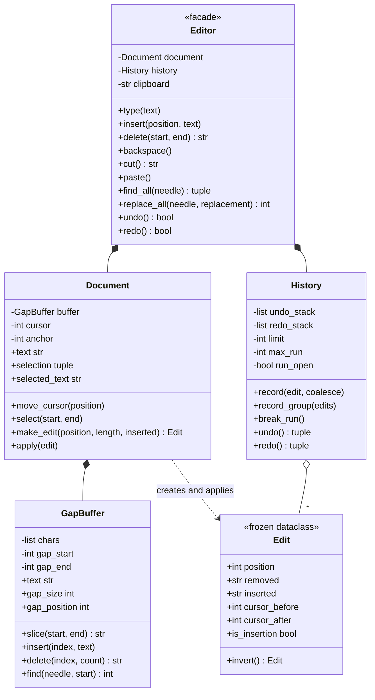

# 设计题解：文本编辑器与撤销重做（Text Editor）

## 题目与澄清

面试官通常这样开场："设计一个文本编辑器。要能插入、删除、移动光标，还要支持撤销和重做。"
这道题的迷惑性在于它看起来只是"两个栈"——写完才发现真正的分数在两个地方：**文本用什么数据结构
存**（决定它是玩具还是能打开一个大文件），以及**一次撤销到底撤掉什么**（决定它像不像一个真编辑器）。

动笔之前值得问清楚的几件事：

- **文档有多大？** 这是第一个、也是最重要的问题。如果答案是"几百字的输入框"，一个 Python 字符串
  就够了，后面的一切讨论都是过度设计；如果答案是"一个几 MB 的源文件"，那么"每敲一个字符就复制
  整篇文本"当场出局，必须换数据结构。**先问规模，再选结构**，这个顺序本身就是分数。
- **撤销的粒度是什么？** 用户敲了 `hello` 五个字符，按一次撤销应该删掉五个字符还是一个？答案当然
  是五个——但这意味着"一次编辑"和"一个撤销单元"不是一回事，这是第 3 关的全部内容。
- **有没有选区（selection）？** 有选区就意味着输入会**替换**而不是插入，剪切／粘贴也才有意义；
  也意味着"移动光标要不要清掉选区"这种细节会变成 bug 的来源。
- **单光标还是多光标？单人还是协同？** 多光标和协同编辑会把数据结构的选择整个推翻（协同需要
  CRDT 或 OT，编辑要能按位置合并），必须当场排除或者当场承认它是另一道题。
- **撤销历史能无限长吗？** 不能——一个长时间编辑的会话，无界的撤销栈就是一个无界的内存泄漏。

**范围之外**：语法高亮、渲染与折行、文件读写与编码探测、协同编辑（OT/CRDT）、正则查找、
多光标（第七节会说它怎么加进来）。

## 需求与分级

**第 1 关（约 15 分钟，缓冲区与光标）**：插入、删除、光标移动、取任意区间的文本。这一关的判分点
不是 API 好不好看，而是**你选了什么数据结构、为什么**——下一节的表格就是要在白板上现场画的东西。

**第 2 关（约 15 分钟，撤销／重做）**：用命令模式（Command）做撤销和重做。每一次修改都要携带
足够把自己倒回去的信息；新的编辑必须清空重做栈；撤销栈要有上限。这一关的验收方式很特别：跑一
串**随机**的编辑与撤销，和一个"每步存一份完整文本"的朴素模型逐步对照——这类问题的 bug 几乎都
藏在手写不出来的组合里。

**第 3 关（约 10 分钟，连打合并与选区）**：连续击键要并成一个撤销单元（换行、光标移动、长度
上限都是自然的边界）；有选区时输入即替换；剪切、复制、粘贴。

**第 4 关（选做，查找替换）**：`find` / `find_all` / `replace_all`，其中"替换全部"必须是**一个**
撤销单元。这一关唯一的判分点：`Edit` 和 `Document` 该是一行都不用改的，`History` 也只该多出一个
「把一批编辑记成一个单元」的入口，而不是为查找替换新发明一种命令。

## 核心对象与职责

| 类 | 单一职责 | 它拥有的不变量 |
|---|---|---|
| `GapBuffer` | 存字符序列，让"在同一处连续编辑"变便宜 | 空洞（gap）始终是一段连续区间；删掉一大片之后空洞会被收回，不会常驻 |
| `Edit`（冻结 dataclass） | 描述一次修改：在某处把一段文本换成另一段 | 造出来就不可变；`invert()` 是纯粹的字段对调 |
| `Document` | 文本 + 光标 + 选区；只认 `apply(edit)` 一种修改动作 | 光标永远在 `0..len`；`apply` 前会核对被删文本与现状一致 |
| `History` | 撤销／重做的栈机，只认 `Edit`，不认识 `Document` | 新编辑一律清空重做栈；撤销栈超限时丢**最旧**的单元 |
| `Editor` | 门面：把用户动作翻译成"在哪、删几个、插什么"，并决定该不该合并 | 每个用户动作最多产生一个撤销单元 |

`Document` **组合**了一个 `GapBuffer`（缓冲区的生命周期完全跟随文档）；`Editor` **组合**了一个
`Document` 和一个 `History`；`History` 和 `Document` 之间**没有任何关系**——这是这个设计最值得
指出的一条边：`History` 收进去的是 `Edit`，吐出来的也是 `Edit`，它可以被单独实例化、单独测试，
甚至被用在别的可撤销系统上（绘图、表格）。撤销逻辑一旦和文档纠缠，就再也测不动了。



## 关键设计决策

### 决策一：文本用什么存？——一个 10 MB 的文档会把四个候选方案里的三个淘汰掉

这是第 1 关的全部分数。四个真实候选，按"在一篇长度 n 的文档中间敲一个字符"的代价排：

| 方案 | 光标处插入／删除 | 移动光标 | 取子串 | 说明 |
|---|---|---|---|---|
| 一个 `str` | **O(n)**，整篇复制 | O(1) | O(k)，C 实现极快 | 10 MB 的文档每敲一个字符复制 10 MB |
| `list[str]`（一字符一元素） | **O(n)**，搬指针 | O(1) | O(k) | 比 `str` 更慢（指针数组），还多一份对象开销 |
| 按行的 `list[str]` | 行内 O(行长)，增删行 O(行数) | O(1) | O(k) | 行是编辑器的天然单位；一行特别长时退化 |
| gap buffer（空洞缓冲） | **摊销 O(1)** | O(移动距离) | O(k) | 押注"编辑是局部的" |
| piece table（片段表） | O(片段数)，配平衡树 O(log n) | O(log n) | 跨片段拼接 | 原文永不复制，可 mmap；快照近乎免费 |

本文选 **gap buffer**，理由是它和真实的编辑行为对得最准：人不会随机地在文档各处敲字，而是**在同一
个地方连续敲一阵子**。空洞就停在光标处，于是连续插入是摊销 O(1)、连续退格是 O(1)，只有把光标挪
到别处时才付一次"搬运距离"的代价——而那正是用户自己造成的、频率低得多的操作。实现只要八十行，
在四十五分钟里是能当场写出来并写对的。

被拒绝的是 **piece table**，虽然它是 VS Code 的选择、也是理论上最漂亮的一个。它的最大优势是
"快照几乎免费"（撤销只要记住当时的片段列表），但**这个优势在本文的设计里用不上**——撤销这边已经
决定用增量（`Edit`）而不是快照，所以不需要便宜的快照。剩下的就只有"实现复杂度高一个量级"和
"取任意区间要跨片段拼接"两个代价。面试里能把这个权衡讲出来，比硬写一个半对的 piece table 强得多。

gap buffer 的弱点也要诚实说出来：**它只有一个空洞**。多光标编辑、或者需要在文档各处来回跳着改的
场景（比如"替换全部匹配项"），每跳一次就要搬一次。本文的 `replace_all` 从右往左替换，光标单调
向左移动，整趟下来空洞总共只把文档扫过一遍，是 O(n) 而不是 O(n × 匹配数)——这不是巧合，是选了
这个数据结构之后必须配套想清楚的事。

还有一个"容器会不会无界增长"的问题必须当场回答：**删掉一大段之后空洞会变得和被删的那段一样大**。
如果不收回来，一个"打开 10 MB、删到只剩 100 字"的文档会永远占着 10 MB。所以 `_shrink_if_wasteful`
在空洞超过文本长度时把多余的还给内存，`gap_size` 被暴露成公开属性，好让测试能直接断言这条不变量。

### 决策二：一个 `Edit` 还是四个 Command 类？——这里拒绝一次类爆炸

教科书式的命令模式会写出 `Command` 抽象基类，再派生 `InsertCommand`、`DeleteCommand`、
`ReplaceCommand`，还要一个 `CompositeCommand` 来把多条打包。四个类、四套 `execute`/`undo`，
每个都要自己想清楚怎么求逆——而"想清楚怎么求逆"恰好是最容易漏掉某个副作用的地方。

停下来看一眼：这三种操作真的不同吗？

- 插入 = 在 `position` 处，把 `""` 换成 `text`
- 删除 = 在 `position` 处，把 `text` 换成 `""`
- 替换 = 在 `position` 处，把 `old` 换成 `new`

**它们是同一种操作的三个特例**：一次 splice。于是整个命令层坍缩成一个冻结的数据类：

```python
@dataclass(frozen=True, slots=True)
class Edit:
    position: int
    removed: str
    inserted: str
    cursor_before: int
    cursor_after: int

    def invert(self) -> Edit:
        return Edit(self.position, self.inserted, self.removed,
                    self.cursor_after, self.cursor_before)
```

`invert()` 是一次纯粹的字段对调——没有分支、没有多态、没有"这个子类的撤销写对了吗"的疑问。
`Edit.invert().invert() == edit` 是一个可以直接写进测试的等式（冻结 dataclass 免费给了
`__eq__`），而四个子类的版本你根本写不出这样一条总的断言。

`CompositeCommand` 也被拒绝了：一个"撤销单元"就是一个 `tuple[Edit, ...]`。元组本来就是不可变的
序列，为它再包一个类只会多一层转发。撤销一个单元 = 把里面的编辑**逆序**逐条求逆——逆序是硬要求，
因为后执行的编辑改变了先执行的编辑所依赖的下标。

这就是[[patterns.command|命令与撤销重做（Command）]]在 Python 里的真实形态：模式要的是"把一次
操作具体化成一个可以存起来、可以求逆的值"，它从来没要求这个值必须是一个带虚函数的类。什么时候
才真的需要类？当每条命令要执行的是**不同的业务逻辑**（转账、发邮件、启动电机）而不是同一种数据
变换时——那时候多态才有内容可承载。

### 决策三：Command 还是 Memento？——主机制用增量，但光标是唯一值得整体快照的东西

撤销有两条路，差别在内存：

| | 撤销怎么做 | 每次编辑的代价 |
|---|---|---|
| 备忘录（Memento） | 存一份完整文档快照，撤销就换回去 | **文档**的大小 |
| 命令（Command） | 只存"把这次改动倒回去"所需的信息 | **改动**的大小 |

备忘录更简单、而且永远正确，但它不可用：10 MB 的文件敲一个字符就存 10 MB。所以主机制必须是命令。

但备忘录并没有被全盘否定——**光标和选区**恰好是它擅长的那一小块：它们很小（两个整数），而且很难
从逆操作里反推（"撤销这次删除"之后光标该回到哪？答案取决于删之前它在哪，而这件事逆操作本身并不
知道）。所以 `Edit` 里塞了 `cursor_before` / `cursor_after` 两个字段——这就是一份微型备忘录。
"命令为主，对那些又小又难反推的状态用备忘录"，比二选一的答案完整得多，也正是
[[patterns.behavioral|其余行为型模式（Behavioral）]]里两个模式分工的标准答案。

顺带一提，`Edit` 里的 `removed` 必须在**执行的那一刻**读出来，不能在构造时提前读：

```python
def make_edit(self, position, delete_length, inserted) -> Edit:
    removed = self._buffer.slice(position, position + delete_length)   # 此刻的文本
    return Edit(position, removed, inserted, self._cursor, position + len(inserted))
```

重做一串编辑时，每一条看到的都是上一条留下的文本；提前读只会读到错的那一段，而且不会报错，
只会把错的字悄悄写进文档。

### 决策四：新的编辑必须清空重做栈——这是最简单的一行，也是最容易毁掉文档的一行

```python
def record(self, edit, coalesce=False):
    self._redo.clear()        # ← 就是这一行
    ...
```

撤销三次，然后敲一个字。那三次重做**必须消失**：历史在这里分叉了，你即将重做进去的那个未来已经
不存在了。留着它的后果不是抛异常，而是更坏的东西——一次重做会把"在下标 40 处插入"重放到一篇
只剩 12 个字符的文档上，静悄悄地把内容写到错的位置，用户要过很久才会发现。

本文在这条规则之外还加了一道保险：`Document.apply` 会先核对 `edit.removed` 和当前文本是否一致，
对不上就抛 `InconsistentEditError`。这条检查在正确的实现里永远不会触发——它的价值恰恰在于，
**当历史栈和文档失去同步时，它让程序当场失败，而不是默默写坏文档**。给一个"永远不该发生"的
不变量配一个会喊出来的检查，比在注释里写一句"注意这里要保持同步"有用得多。

### 决策五：连打要不要合并，由调用方的**意图**说了算，不能靠"相邻"猜

用户敲 `hello`，按一次撤销应该五个字符一起消失。做法是让 `History` 把首尾相接的插入并进同一个
撤销单元，并在三个地方断开这一串：**换行**（一行是天然的撤销边界）、**长度上限**（一次撤销不该
抹掉一整段）、**光标移动或改选区**（下一段文字在别处，显然是另一件事）。

真正的坑在于合并的判据。最自然的写法是"只要这次插入紧接着上一次插入的末尾，就合并"——但这会把
两次**刻意的**程序化插入偷偷折成一步：

```python
editor.insert(0, "abc")
editor.insert(3, "def")   # 相邻！但这是两个独立的操作，绝不该一起撤销
```

**相邻不等于同一个意图**。所以合并的开关是调用方传进来的：`Editor.type()`（键盘输入）传
`coalesce=True`，`Editor.insert()`（程序化插入）不传。意图是调用方才知道的事，让 `History` 去
猜只会猜错——测试 `test_programmatic_inserts_never_coalesce_even_when_adjacent` 把这条钉死。

## 代码走读

完整的参考实现（Python 3.12，仅标准库）如下，`test_text_editor.py` 的 32 个测试逐条对应。读的
时候重点看四处：`GapBuffer._move_gap`（空洞怎么挪，以及为什么"挪"就是全部代价）、`Edit.invert`
（撤销的全部逻辑就是这一行对调）、`History.record` / `undo`（分组、合并、逆序求逆、限深），
以及 `Editor.replace_all`（从右往左、整批一个撤销单元，`Edit` 和 `Document` 一行没碰，
`History` 那边也只用到了已经为「一个单元 = 一个元组」准备好的 `record_group`）。

%% code:begin solution.py %%
```python
"""文本编辑器：插入、删除、光标与选区，以及撤销／重做。
设计：`GapBuffer` 用"光标处留一个空洞"的数组，让连续在同一处的插入删除摊销 O(1)；
`Document` 在它之上管光标与选区，并且只认一种修改——`Edit`（一次 splice：删掉一段、插入一段）。
`Edit` 是冻结的数据，`invert()` 就是把 removed/inserted 两个字段对调，所以撤销不需要任何子类。
`History` 是一台只认 `Edit` 元组的纯栈机（一个元组 = 一个撤销单元），`Editor` 是对外的门面。
"""

from __future__ import annotations

from collections.abc import Sequence
from dataclasses import dataclass


class EditorError(Exception):
    """本设计全部失败路径的公共基类。"""


class InvalidRangeError(EditorError, ValueError):
    """位置或区间越界、或者 start > end。"""


class InconsistentEditError(EditorError):
    """要重放的编辑与当前文本对不上——说明历史栈和文档已经不同步了。"""


class GapBuffer:
    """字符数组，中间留一个"空洞"（gap）。空洞就在最近一次编辑的位置。

    插入：把空洞挪到目标位置（代价 O(移动距离)），然后填字符，摊销 O(1)。
    删除：把空洞挪到目标位置，然后把空洞向右扩大，O(1)。
    真实编辑高度局部（人一直在同一处敲字），所以"移动距离"通常是 0。
    """

    def __init__(self, text: str = "", min_gap: int = 64) -> None:
        if min_gap <= 0:
            raise ValueError(f"min_gap must be positive, got {min_gap}")
        self._min_gap = min_gap
        self._chars: list[str] = list(text) + [""] * min_gap
        self._gap_start = len(text)
        self._gap_end = len(self._chars)

    def __len__(self) -> int:
        return len(self._chars) - self.gap_size

    @property
    def gap_size(self) -> int:
        """空洞当前有多大。暴露成公开属性，是为了让"空洞不会无限膨胀"这条不变量可以被断言。"""
        return self._gap_end - self._gap_start

    @property
    def gap_position(self) -> int:
        """空洞左边界在文本中的下标，也就是"上一次编辑发生在哪"。"""
        return self._gap_start

    @property
    def text(self) -> str:
        return "".join(self._chars[:self._gap_start]) + "".join(self._chars[self._gap_end:])

    def _check(self, index: int) -> None:
        if not 0 <= index <= len(self):
            raise InvalidRangeError(f"index {index} out of range 0..{len(self)}")

    def slice(self, start: int, end: int) -> str:
        """取 [start, end) 的文本。下标是**文本下标**，空洞对调用方完全不可见。"""
        self._check(start)
        self._check(end)
        if start > end:
            raise InvalidRangeError(f"start {start} is after end {end}")
        gap_start, gap_end = self._gap_start, self._gap_end
        left = "".join(self._chars[start:min(end, gap_start)]) if start < gap_start else ""
        right = ""
        if end > gap_start:
            begin = max(start, gap_start) - gap_start + gap_end
            right = "".join(self._chars[begin:end - gap_start + gap_end])
        return left + right

    def _move_gap(self, index: int) -> None:
        """把空洞挪到 index。挪动就是把中间那段字符整体搬到空洞另一侧，代价是搬运的字符数。"""
        if index < self._gap_start:
            count = self._gap_start - index
            self._chars[self._gap_end - count:self._gap_end] = self._chars[index:self._gap_start]
            self._gap_start -= count
            self._gap_end -= count
        elif index > self._gap_start:
            count = index - self._gap_start
            self._chars[self._gap_start:self._gap_start + count] = self._chars[self._gap_end:self._gap_end + count]
            self._gap_start += count
            self._gap_end += count

    def _grow(self, needed: int) -> None:
        """空洞不够用了就扩：按当前长度的一半扩，让"连续打字"整体是摊销 O(1) 而不是每次都扩。"""
        extra = max(needed, len(self) // 2, self._min_gap)
        self._chars[self._gap_end:self._gap_end] = [""] * extra
        self._gap_end += extra

    def _shrink_if_wasteful(self) -> None:
        """删掉一大段之后，空洞会变得和被删的那段一样大。不收回来，一个"删掉 10 MB"的文档
        就会永远占着 10 MB——所以空洞超过"文本长度"且超过下限的四倍时，把多余的还给内存。"""
        if self.gap_size > max(self._min_gap * 4, len(self)):
            keep = max(self._min_gap, len(self) // 2)
            del self._chars[self._gap_start + keep:self._gap_end]
            self._gap_end = self._gap_start + keep

    def insert(self, index: int, text: str) -> None:
        self._check(index)
        if not text:
            return
        self._move_gap(index)
        if self.gap_size < len(text):
            self._grow(len(text))
        for char in text:
            self._chars[self._gap_start] = char
            self._gap_start += 1

    def delete(self, index: int, count: int) -> str:
        """删掉 [index, index+count) 并返回被删的文本——逆操作需要它。"""
        self._check(index)
        if count <= 0:
            return ""
        if index + count > len(self):
            raise InvalidRangeError(f"cannot delete {count} chars at {index}: only {len(self) - index} left")
        self._move_gap(index)
        removed = "".join(self._chars[self._gap_end:self._gap_end + count])
        self._gap_end += count
        self._shrink_if_wasteful()
        return removed

    def find(self, needle: str, start: int = 0) -> int:
        """朴素查找，找不到返回 -1。大文档上该换成在片段上流式匹配，这里保持简单。"""
        return self.text.find(needle, start)


@dataclass(frozen=True, slots=True)
class Edit:
    """一次修改的完整描述：在 `position` 处把 `removed` 换成 `inserted`。

    **所有**修改都是这一种形状：插入是 `removed == ""`，删除是 `inserted == ""`，
    替换两者都非空。因此不需要 `InsertCommand`／`DeleteCommand`／`ReplaceCommand` 三个类，
    也不需要抽象基类——撤销所需的全部信息就是这五个字段，而逆操作就是把两个字段对调。
    光标位置是唯一值得整体快照的状态（它太小、又很难从逆操作反推），所以一并带上。
    """

    position: int
    removed: str
    inserted: str
    cursor_before: int
    cursor_after: int

    @property
    def is_insertion(self) -> bool:
        """纯插入（没删任何东西）——只有这种编辑才有资格并进同一个"连打"撤销单元。"""
        return not self.removed and bool(self.inserted)

    def invert(self) -> Edit:
        """逆操作。注意它是一次纯粹的字段对调，没有任何计算，也没有任何子类分支。"""
        return Edit(self.position, self.inserted, self.removed, self.cursor_after, self.cursor_before)


class Document:
    """文本 + 光标 + 选区。它只认识一种修改动作：`apply(edit)`。

    不变量：光标永远落在 `0..len(text)`；任何一次 `apply` 都会清掉选区（改了字之后旧选区
    指向的区间已经没有意义了）；`apply` 会先核对 `edit.removed` 和当前文本是否一致，
    对不上就抛错——这把"重放到已经变了的文本上"从静默写坏变成了当场失败。
    """

    def __init__(self, text: str = "") -> None:
        self._buffer = GapBuffer(text)
        self._cursor = 0
        self._anchor: int | None = None

    @property
    def text(self) -> str:
        return self._buffer.text

    @property
    def gap_size(self) -> int:
        """转发底层空洞的大小，供测试断言"空洞不会无限膨胀"。"""
        return self._buffer.gap_size

    def __len__(self) -> int:
        return len(self._buffer)

    @property
    def cursor(self) -> int:
        return self._cursor

    @property
    def selection(self) -> tuple[int, int] | None:
        """选区，规范化成 (start, end)；没有选区时是 `None`，而不是一个空区间。"""
        if self._anchor is None or self._anchor == self._cursor:
            return None
        return (min(self._anchor, self._cursor), max(self._anchor, self._cursor))

    @property
    def selected_text(self) -> str:
        span = self.selection
        return "" if span is None else self._buffer.slice(*span)

    def _check(self, index: int) -> None:
        if not 0 <= index <= len(self):
            raise InvalidRangeError(f"position {index} out of range 0..{len(self)}")

    def move_cursor(self, position: int) -> None:
        """移动光标**一定**会清掉选区：在任何一个编辑器里，点到别处就等于取消选中。
        少了这一句，下一次输入会去替换一段离光标十万八千里的文字。"""
        self._check(position)
        self._cursor = position
        self._anchor = None

    def select(self, start: int, end: int) -> None:
        self._check(start)
        self._check(end)
        if start > end:
            raise InvalidRangeError(f"start {start} is after end {end}")
        self._anchor = start
        self._cursor = end

    def clear_selection(self) -> None:
        self._anchor = None

    def find(self, needle: str, start: int = 0) -> int:
        return self._buffer.find(needle, start)

    def make_edit(self, position: int, delete_length: int, inserted: str) -> Edit:
        """按"此刻的文本"造一个 `Edit`。

        被删掉的文本是在**这一刻**读出来的，不是在某个构造函数里提前读的：重做一串编辑时，
        每一条看到的都是上一条留下的文本，提前读只会读到错的那一段。
        """
        self._check(position)
        if delete_length < 0 or position + delete_length > len(self):
            raise InvalidRangeError(f"cannot delete {delete_length} chars at {position}")
        removed = self._buffer.slice(position, position + delete_length)
        return Edit(position, removed, inserted, self._cursor, position + len(inserted))

    def apply(self, edit: Edit) -> None:
        actual = self._buffer.slice(edit.position, min(edit.position + len(edit.removed), len(self)))
        if actual != edit.removed:
            raise InconsistentEditError(
                f"edit at {edit.position} expects {edit.removed!r} but the document has {actual!r}"
            )
        if edit.removed:
            self._buffer.delete(edit.position, len(edit.removed))
        if edit.inserted:
            self._buffer.insert(edit.position, edit.inserted)
        self._cursor = edit.cursor_after
        self._anchor = None


class History:
    """撤销／重做的栈机。它只认 `Edit`，完全不知道 `Document` 的存在，因此可以单独测试。

    一个**撤销单元**是一个 `Edit` 元组：连打出来的一串字符是一个单元，替换全部匹配项产生的
    十二处修改也是一个单元。撤销就是把单元里的编辑逆序逐条求逆再交还给调用方。
    两条容易被忽视的规则：新编辑一律清空重做栈（否则重做会把一条编辑重放到已经变了的文本上）；
    撤销栈有上限，超出时丢**最旧**的（丢最新的等于偷偷吃掉用户刚做的事）。
    """

    def __init__(self, limit: int = 200, max_run: int = 40) -> None:
        if limit <= 0:
            raise ValueError(f"limit must be positive, got {limit}")
        if max_run <= 0:
            raise ValueError(f"max_run must be positive, got {max_run}")
        self._limit = limit
        self._max_run = max_run
        self._undo: list[tuple[Edit, ...]] = []
        self._redo: list[tuple[Edit, ...]] = []
        self._run_open = False

    @property
    def limit(self) -> int:
        return self._limit

    @property
    def undo_depth(self) -> int:
        return len(self._undo)

    @property
    def redo_depth(self) -> int:
        return len(self._redo)

    @property
    def can_undo(self) -> bool:
        return bool(self._undo)

    @property
    def can_redo(self) -> bool:
        return bool(self._redo)

    def break_run(self) -> None:
        """显式结束当前连打：移动光标、改选区、撤销之后都要调用。"""
        self._run_open = False

    def _can_merge(self, unit: tuple[Edit, ...], edit: Edit) -> bool:
        """能并进同一个撤销单元的条件：都是纯插入、首尾相接、不含换行、整段不超过 `max_run`。

        换行是天然的撤销边界；长度上限保证一次撤销不会抹掉一整段——两者都是"用户心里的一步"
        的近似，而不是代码结构的产物。
        """
        last = unit[-1]
        if not (last.is_insertion and edit.is_insertion):
            return False
        if last.position + len(last.inserted) != edit.position:
            return False
        if "\n" in last.inserted or "\n" in edit.inserted:
            return False
        return sum(len(e.inserted) for e in unit) + len(edit.inserted) <= self._max_run

    def _push(self, unit: tuple[Edit, ...]) -> None:
        self._undo.append(unit)
        if len(self._undo) > self._limit:
            del self._undo[0]

    def record(self, edit: Edit, coalesce: bool = False) -> None:
        """记一次编辑。`coalesce=True` 表示"这是一次键盘输入"，允许并进上一个单元。

        合并与否是**调用方的意图**，不是两条编辑相邻与否能推出来的：两次程序化的 `insert`
        恰好首尾相接，也绝不该被偷偷折成一步。
        """
        self._redo.clear()
        if coalesce and self._run_open and self._undo and self._can_merge(self._undo[-1], edit):
            self._undo[-1] = (*self._undo[-1], edit)
            return
        self._push((edit,))
        self._run_open = coalesce

    def record_group(self, edits: Sequence[Edit]) -> None:
        """把一批编辑记成**一个**撤销单元（替换全部匹配项、缩进一段等）。顺序必须是实际执行顺序。"""
        if not edits:
            return
        self._redo.clear()
        self._push(tuple(edits))
        self._run_open = False

    def undo(self) -> tuple[Edit, ...]:
        """弹出一个撤销单元，返回**应当按序执行**的逆编辑；没有可撤销的就返回空元组。

        逆序是硬要求：单元里后执行的编辑改变了先执行的编辑所依赖的下标，必须先撤销后来的那条。
        """
        if not self._undo:
            return ()
        unit = self._undo.pop()
        self._redo.append(unit)
        self._run_open = False
        return tuple(edit.invert() for edit in reversed(unit))

    def redo(self) -> tuple[Edit, ...]:
        if not self._redo:
            return ()
        unit = self._redo.pop()
        self._undo.append(unit)
        self._run_open = False
        return unit


class Editor:
    """对外的门面：把"文档 + 历史 + 剪贴板"三样东西合成一套编辑器动作。

    它承担的责任是**翻译**：把"按了退格"这种用户动作翻译成"在哪一处、删几个字、插什么"，
    并决定这一次该不该并进上一个撤销单元。真正的活分别由 `Document` 和 `History` 干。
    """

    def __init__(self, text: str = "", history_limit: int = 200, max_run: int = 40) -> None:
        self._document = Document(text)
        self._history = History(history_limit, max_run)
        self._clipboard = ""

    @property
    def text(self) -> str:
        return self._document.text

    @property
    def cursor(self) -> int:
        return self._document.cursor

    @property
    def selection(self) -> tuple[int, int] | None:
        return self._document.selection

    @property
    def selected_text(self) -> str:
        return self._document.selected_text

    @property
    def clipboard(self) -> str:
        return self._clipboard

    @property
    def can_undo(self) -> bool:
        return self._history.can_undo

    @property
    def can_redo(self) -> bool:
        return self._history.can_redo

    @property
    def undo_depth(self) -> int:
        return self._history.undo_depth

    @property
    def gap_size(self) -> int:
        return self._document.gap_size

    def _edit(self, position: int, delete_length: int, inserted: str) -> Edit:
        edit = self._document.make_edit(position, delete_length, inserted)
        self._document.apply(edit)
        return edit

    def _perform(self, position: int, delete_length: int, inserted: str, coalesce: bool = False) -> Edit:
        edit = self._edit(position, delete_length, inserted)
        self._history.record(edit, coalesce=coalesce)
        return edit

    def move_cursor(self, position: int) -> None:
        self._history.break_run()
        self._document.move_cursor(position)

    def select(self, start: int, end: int) -> None:
        self._history.break_run()
        self._document.select(start, end)

    def clear_selection(self) -> None:
        self._document.clear_selection()

    def type(self, text: str) -> None:
        """键盘输入。有选区时先整段替换（这是一步独立的撤销），否则在光标处插入并尝试合并。"""
        span = self._document.selection
        if span is not None:
            start, end = span
            self._perform(start, end - start, text, coalesce=False)
            return
        self._perform(self._document.cursor, 0, text, coalesce=True)

    def insert(self, position: int, text: str) -> None:
        """程序化插入。**不**合并：两次刻意的调用不该被折成一次撤销。"""
        self._history.break_run()
        self._perform(position, 0, text, coalesce=False)

    def delete(self, start: int, end: int) -> str:
        """程序化删除 [start, end)，返回被删掉的文本。"""
        if start > end:
            raise InvalidRangeError(f"start {start} is after end {end}")
        self._history.break_run()
        return self._perform(start, end - start, "").removed

    def backspace(self) -> None:
        """退格：有选区就删选区，否则删光标左边一个字符。文档开头处什么也不做。"""
        span = self._document.selection
        if span is not None:
            start, end = span
            self._perform(start, end - start, "")
            return
        cursor = self._document.cursor
        if cursor == 0:
            return
        self._perform(cursor - 1, 1, "")

    def delete_forward(self) -> None:
        span = self._document.selection
        if span is not None:
            start, end = span
            self._perform(start, end - start, "")
            return
        cursor = self._document.cursor
        if cursor >= len(self._document):
            return
        self._perform(cursor, 1, "")

    def copy(self) -> str:
        self._clipboard = self._document.selected_text
        return self._clipboard

    def cut(self) -> str:
        """剪切：先复制再删除。剪贴板不属于文档，所以撤销**不会**把剪贴板还原——
        这不是疏漏，是真实编辑器的行为：撤销撤的是文档，不是系统剪贴板。"""
        span = self._document.selection
        if span is None:
            return ""
        self._clipboard = self._document.selected_text
        start, end = span
        self._perform(start, end - start, "")
        return self._clipboard

    def paste(self) -> None:
        if not self._clipboard:
            return
        span = self._document.selection
        if span is not None:
            start, end = span
            self._perform(start, end - start, self._clipboard)
            return
        self._perform(self._document.cursor, 0, self._clipboard)

    def find(self, needle: str, start: int = 0) -> int:
        return self._document.find(needle, start)

    def find_all(self, needle: str) -> tuple[int, ...]:
        """所有不重叠匹配的起点，从左到右。"""
        if not needle:
            return ()
        found: list[int] = []
        at = self._document.find(needle)
        while at != -1:
            found.append(at)
            at = self._document.find(needle, at + len(needle))
        return tuple(found)

    def replace_all(self, needle: str, replacement: str) -> int:
        """替换全部匹配项，整批算**一个**撤销单元，返回替换了几处。

        从右往左替换：这样每一处的起点都还是按原文算出来的，不需要为长度差逐个修正下标。
        注意这个方法一行都没有改动 `History` 和 `Edit`——它只是把已有的积木换个用法。
        """
        positions = self.find_all(needle)
        if not positions:
            return 0
        edits = [self._edit(at, len(needle), replacement) for at in reversed(positions)]
        self._history.record_group(edits)
        return len(positions)

    def undo(self) -> bool:
        edits = self._history.undo()
        for edit in edits:
            self._document.apply(edit)
        return bool(edits)

    def redo(self) -> bool:
        edits = self._history.redo()
        for edit in edits:
            self._document.apply(edit)
        return bool(edits)

    def __repr__(self) -> str:
        return f"Editor(len={len(self._document)}, cursor={self.cursor}, undo={self.undo_depth})"


def _demo() -> None:
    editor = Editor()
    for char in "hello":
        editor.type(char)
    print(repr(editor.text), "撤销栈深度:", editor.undo_depth)   # 五次击键 = 一个撤销单元
    editor.undo()
    print("一次撤销之后:", repr(editor.text))
    editor.redo()

    editor.type("\nthe cat sat on the mat")
    editor.replace_all("at", "og")
    print("替换之后:", repr(editor.text), "撤销栈深度:", editor.undo_depth)
    editor.undo()
    print("一次撤销全部还原:", repr(editor.text))

    editor.select(0, 5)
    print("剪切:", repr(editor.cut()), "->", repr(editor.text))


if __name__ == "__main__":
    _demo()
```
%% code:end %%

几个读代码时容易滑过去的点：

- `History` 的 `undo()` 返回的是**逆编辑的元组**，而不是直接去改文档。这让 `History` 完全不知道
  `Document` 的存在，可以被单独构造、单独断言（测试
  `test_history_is_a_pure_stack_machine_over_edits` 就是这么做的），也让同一套撤销机制可以被
  别的可撤销系统复用。
- `Document.move_cursor` 里那句 `self._anchor = None`。缺了它，"点到别处再输入"会去替换一段
  离光标很远的文字——这个 bug 只有在演示时才会暴露，而且看起来像是玄学。
- `Editor.cut` 之后撤销，文本回来了，**剪贴板不会回来**。这不是疏漏：撤销撤的是文档，不是系统
  剪贴板，真实编辑器都是这个行为。把它写进测试，是为了防止后来的人"顺手修好"它。
- `History._push` 超限时 `del self._undo[0]`，丢的是**最旧**的单元。丢最新的等于偷偷吃掉用户刚
  做的事，是一个比内存泄漏更糟的 bug。

## 测试与自检

32 个测试按四关分组，最值得说的是第 2 关那个随机测试：

```python
rng = random.Random(20260920)
editor = impl.Editor("start", history_limit=10_000)
model = [editor.text]          # 朴素模型：每步之后的完整文本
for _ in range(600):
    ...  # 随机插入 / 删除 / 撤销
    assert editor.text == model[-1]
```

它用一个"每步存一份全文"的模型当参照——这个模型慢得不能用在生产里，但它**显然正确**，于是可以
用来检查那个聪明的实现。六百步随机操作能覆盖的组合（在刚撤销过的位置删除、撤销到底再插入、跨
换行合并……）远超手写用例。固定种子保证失败可以复现。这是这类"有一个朴素参照实现"的问题最该用
的测试方法。

其余各关钉死的不变量：空洞在大量删除后被收回（`gap_size` 有上界）；撤销恢复文本**也恢复光标**；
新编辑之后 `can_redo` 变成 `False`；连打五个字符 `undo_depth == 1`，而换行、超长、光标移动各自
把它断成两段；`replace_all` 三处替换之后 `undo_depth` 仍然是 1；撤销栈超限时丢最旧的。

**怎么在两分钟内给面试官演示**：`python solution.py`。指出三件事：敲五个字符只留下一个撤销单元；
`replace_all` 替换三处、一次撤销全部还原；剪切之后文本变了而剪贴板留着。

**自检清单**：撤销之后光标在哪？重做栈什么时候被清空？两次刻意的 `insert` 会不会被折成一步？
删掉九成文本之后内存回来了吗？撤销栈有上限吗，丢的是最旧的还是最新的？

## 扩展与追问

**新需求**

- *"加多光标。"* `Document` 的 `cursor` / `anchor` 换成一个游标列表，`Editor.type` 对每个游标各
  产生一个 `Edit`，整批交给 `History.record_group` —— 一次输入、一个撤销单元。`Edit`、`History`
  一行不改。真正要重新想的是 `GapBuffer`：一个空洞服务不了多个分散的编辑点，这时候 piece table
  的优势才真正显现出来（见决策一）。
- *"加格式（粗体、颜色）。"* 两条路。把样式做成 `Edit` 之外的一层"区间标注"（一个按位置排序的
  区间表），文本编辑时同步平移区间——好处是文本层完全不变；或者把样式并进字符本身，这就要引入
  享元（Flyweight）来避免每个字符一个样式对象。前者是主流编辑器的做法。
- *"加宏／脚本录制。"* 已经有了：一串 `Edit` 就是一份可重放的脚本。把 `History` 的单元序列化成
  JSON 存下来，重放即可——这正是"把操作具体化成值"换来的第三种能力。

**并发与线程安全**

- *"后台自动保存线程会不会读到半个文档？"* 会。`Document.text` 的实现是把空洞两侧拼起来，编辑
  线程正在搬空洞时读到的结果是不一致的。最简单的修法是给 `Document` 一把 `threading.Lock`，
  所有公开方法进出都持锁；`text` 在锁内构造好整个字符串再返回（字符串不可变，交出去之后随便用）。
- *"用读写锁行不行？"* 这里是真的有用的：自动保存、查找、渲染都是纯读操作，而编辑才是写。这一点
  和缓存类的题目相反（那里连 `get` 都要改内部结构，所以读写锁毫无意义）——值得在面试里对比着说。
- *"撤销栈要不要加锁？"* 要，但更重要的是**撤销必须和编辑串行**：一次"读历史 → 求逆 → 应用到
  文档"是一个复合操作，中间被另一次编辑插进来，文档就和历史失去同步了（这时 `apply` 里那条一致性
  检查会喊出来，而不是默默写坏）。

**持久化与规模**

- *"打开一个 1 GB 的文件。"* gap buffer 要把整篇读进内存，撑不住。piece table + `mmap` 才是答案：
  原始文件只读映射，所有新输入追加到一个"增量缓冲"，片段表描述最终文本由哪些片段按什么顺序拼成。
- *"撤销历史要跨会话保留。"* `Edit` 是冻结 dataclass，序列化成 JSON 是平凡的；难点是它只有下标
  没有内容标识，重开文件之后如果文件被别人改过，重放就会撞上 `InconsistentEditError`——这时候
  当场失败正是我们想要的行为。
- *"协同编辑呢？"* 那是另一道题。`Edit` 的下标在别人的并发修改面前会失效，必须换成 OT 的变换
  函数或者 CRDT 的位置标识符（一个不随插入删除漂移的稳定 id）。诚实地说"这需要换一套模型"，
  比硬套一个"加锁就行"的答案得分高。

## 常见错误

- **用一个 `str` 存正文，然后声称能打开大文件**。每次插入 `text[:i] + s + text[i:]` 都是整篇复制。
  小输入框里这是对的选择，说清"因为文档小所以这样够了"同样得分；错的是不做这个判断。
- **写四个 Command 子类**，然后在其中一个的 `undo` 里漏掉一个副作用。合成一个 splice 数据类之后
  这类 bug 在结构上就不存在了。
- **新编辑之后不清空重做栈**。文档会在用户毫无察觉的情况下被写坏，这是这道题最严重的一个错误。
- **在构造命令时就读走"被删掉的文本"**。重做一串编辑时每条看到的文本都不同，提前读必然读错。
- **撤销只恢复文本、不恢复光标**。反复撤销／重做之后光标会一点点漂移，越走越离谱。
- **撤销栈无界**。长时间编辑的会话里它就是一个内存泄漏；而丢弃时丢最新的更糟——那等于偷偷吃掉
  用户刚做的操作。
- **移动光标不清选区**，于是下一次输入替换掉了一段离光标很远的文字。
- **靠"位置相邻"来决定合并**，把两次刻意的程序化插入折成一个撤销单元。合并与否是调用方的意图。
- **`replace_all` 从左往右替换**，然后忘了后面每一处的下标都被前面的长度差推着走。从右往左做，
  下标天然不用修正。
- **把撤销逻辑写进 `Document`**。历史和文档纠缠在一起之后，撤销就再也没法单独测试了。
- **Java 味的 `getText()` / `setCursor()`**。Python 里这些是属性；需要校验时用 `@property`
  加 setter，调用方代码一行不用动。

## 45 分钟怎么分配

- **0–4 分钟｜澄清**。先问规模（几百字还是几 MB），再问撤销粒度、有没有选区、单光标还是多光标。
  把"文档有多大"的答案写在白板最上面——后面每一个数据结构决策都要引用它。
- **4–9 分钟｜数据结构对比**。在白板上画那张四行的代价表，说出结论和理由："编辑是局部的，所以
  gap buffer；piece table 的快照优势我用不上，因为撤销我打算存增量。"这五分钟是这道题最值钱的
  五分钟，很多人会跳过它直接开写，那就把最大的一块分丢了。
- **9–14 分钟｜实体与 API**。`GapBuffer` / `Edit` / `Document` / `History` / `Editor` 五个框。
  在这里把 `Edit` 的五个字段和 `invert()` 写出来，并说一句："插入、删除、替换是同一种操作的三个
  特例，所以我不写三个命令类。"
- **14–26 分钟｜写第 1、2 关**。先 `GapBuffer`（`_move_gap` 是核心，其余都围着它转），再
  `Edit` + `Document.apply`，最后 `History` 的两个栈。写 `record` 的时候把 `self._redo.clear()`
  那一行单独指出来，说明不清空会发生什么。
- **26–33 分钟｜测试**。当场写三个：撤销恢复文本和光标；新编辑清空重做栈；随机序列对照朴素模型
  （这个只写骨架，说清思路即可）。第三个最能体现工程习惯。
- **33–42 分钟｜第 3、4 关**。连打合并的三个边界（换行、长度、光标移动）和"意图 vs 相邻"，
  然后 `replace_all` 从右往左 + 一个撤销单元。强调这一关没有改动任何已有的类。
- **42–45 分钟｜收尾**。主动说两个追问的答案：1 GB 文件要换 piece table + mmap；多光标要把
  `Edit` 批量化、而命令层不用动。

**时间不够时砍什么**：先砍查找替换（说思路）；再砍剪切粘贴；再砍 gap buffer 的收缩逻辑（但一定
要说出"不收缩会怎样"）。**绝不能砍**的是数据结构的对比论证和"新编辑清空重做栈"——前者是这道题
的上限，后者是它的下限。

## 来源与延伸

- [[src-abhaypaswan-text-editor|abhaypaswan/lld-python — text-editor]]（
  https://github.com/abhaypaswan/lld-python/tree/main/problems/text-editor ）——原生 Python、
  带 pytest 套件，"新编辑清空重做栈"和"连打合并"两节讲得很到位，也点出了"相邻不等于意图"。
  它的正文是一个 Python `str`（自己在追问里承认了这一点），命令层是 `InsertCommand` /
  `DeleteCommand` / `ReplaceCommand` / `CompositeCommand` 四个类加一个抽象基类；本文换成一个
  `Edit` splice 数据类加元组分组，并把数据结构的选择正面做成了第 1 关。
- [[src-codezym-text-editor|CodeZymSolutions — q09 text editor]]（
  https://github.com/prsnt558908/CodeZymSolutions/tree/main/1-100/q09_text_editor_lld ）——同题的
  另一种切法：不做撤销，改做"字符 + 样式"的享元（Flyweight）与按行存储。适合拿来想"如果需求是
  带格式的文档，设计会往哪个方向长"；本文把样式列在"扩展与追问"里，正文保持纯文本。
- [[src-pydocs-text-editor|dataclasses — Python 标准库文档]]（
  https://docs.python.org/3/library/dataclasses.html ）——`frozen=True` / `slots=True` /
  自动生成的 `__eq__` 正是 `Edit` 能写成"一个值"的前提：不可变让它可以安全地躺在历史栈里，
  `__eq__` 让 `edit.invert().invert() == edit` 成为一条可以直接断言的等式。
- [[src-vscode-text-editor|VS Code 的文本缓冲区重新实现（piece table）]]（
  https://code.visualstudio.com/blogs/2018/03/23/text-buffer-reimplementation ）——工程上把
  "选什么数据结构"讲得最透的一篇：他们从 `string[]`（按行数组）换到 piece tree，给出了真实的内存
  与延迟数据。本文选 gap buffer 而不是 piece table，理由（撤销已经用增量、不需要便宜的快照）
  和他们的取舍正好互补，值得对照着读。
