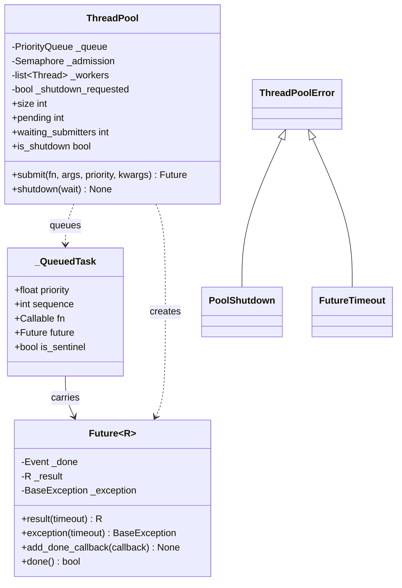

# 设计题解：线程池（Thread Pool）

## 题目与澄清

面试官通常这样开场："实现一个线程池：固定数量的工作线程，提交任务能拿到一个 `Future`，
池子能优雅关闭。"这道题在结构上直接站在
[[problems.components.bounded-blocking-queue|有界阻塞队列（Bounded Blocking Queue）]]
的肩膀上——工作线程从队列里取任务这件事，本质就是那道题里"消费者从队列取元素"的翻版；
真正的新意在于三处：任务失败不能拖垮工作线程、关闭要处理"已经排队但还没跑"的任务、以及
背压该挡住谁。Python 标准库已经有 `concurrent.futures.ThreadPoolExecutor`，所以和
上一题一样，这道题真正考的不是"能不能写出一个能跑的版本"，而是你对每一个设计决策背后
代价的理解有多准。

值得当场问清楚的是：

- **提交速度长期超过处理速度会发生什么？** 这决定了要不要做背压。标准库的
  `ThreadPoolExecutor` 对此的回答是"不做"——它的内部队列无界，`submit()` 永远立刻成功，
  代价是内存无限堆积。多数机考期望你在这道题里做得比标准库更谨慎。
- **`shutdown` 需要区分"等剩下的干完"和"现在就撒手不管"吗？** 答"是"，就是第 2 关；
  还要追问清楚"撒手不管"具体指什么——是已经在跑的任务也被打断，还是只放弃还没开始的？
  真实世界里几乎总是后者：一个 Python 线程一旦开始执行，没有安全的办法从外部强行打断它。
- **任务之间有优先级吗？** 没有的话默认先进先出；有的话就是第 4 关，且要说清楚"不碰
  worker 循环"具体指什么代码不能动。
- **任务是 CPU 密集还是 I/O 密集？** 这个问题决定了"线程池"这个方案本身对不对。GIL
  （全局解释器锁）在任意时刻只允许一个线程执行 Python 字节码；线程做 I/O 等待时会释放
  GIL，所以 I/O 密集的任务（网络调用、磁盘读写、数据库查询）用线程池能拿到真正的并发；
  纯 CPU 密集的 Python 计算，几个线程会一直在抢同一把 GIL，几乎不提速，应该用
  `multiprocessing` 绕开 GIL。这道题默认讨论 I/O 密集场景。

**不在范围内**：跨进程的进程池、动态扩缩容（追问里讨论，不实现）、任务之间的依赖关系
（DAG 调度是任务调度器的地盘）、结果的持久化。

## 需求与分级

**第 1 关——固定数量的 worker，`submit(fn, *args) -> Future`，任务异常不杀死 worker。**
产物是 `ThreadPool.__init__/submit`、`Future` 及其 `result`/`exception`/`add_done_callback`、
以及 `_worker_loop` 里那一句 `except BaseException`——它是这一关唯一真正的難点。

**第 2 关——`shutdown(wait=True/False)`，以及 shutdown 之后 `submit` 的行为。**
`wait=True` 阻塞到所有已提交任务（排队的和正在跑的）都完成；`wait=False` 立即返回，
放弃队列里还没被取走的任务（它们的 `Future` 收到 `PoolShutdown`），但正在执行的任务
不受影响、会跑完。产物是 `shutdown`、`_drain_pending`、哨兵任务，以及 `submit` 里对
"已关闭"这个标志的检查。

**第 3 关——设计问题：队满时怎么办？** 三个选项：挡住调用方、直接拒绝并抛异常、或者
在调用方所在的线程上直接跑掉这个任务。本题实现"挡住调用方"，另外两个在
`关键设计决策` 里讨论清楚代价。产物是 `submit` 前面那个 `threading.Semaphore`。

**第 4 关（选做）——per-task 优先级。** 产物是 `submit(..., priority=)` 这个参数，以及
让 `_QueuedTask` 参与排序的 `@dataclass(order=True)`；`_worker_loop` 一行都不改，因为
它从第 1 天起就只是"从队列里 `get()` 一个任务、跑掉"，从不关心队列内部按什么顺序排列。

## 核心对象与职责

| 类 | 单一职责 | 它拥有的不变式 |
|---|---|---|
| `ThreadPool` | 固定数量的 worker 线程、任务分发、优雅关闭 | 同时运行的任务数 ≤ worker 数；任务异常不终结 worker；`shutdown()` 后拒绝新提交 |
| `Future` | 一次异步调用的结果句柄 | 只经历一次"未完成 → 完成"的迁移；每个回调只跑一次 |
| `_QueuedTask` | 队列里的一条记录：任务体 + 优先级 + 序号 + 它的 `Future` | 排序只看优先级和序号，任务体和 `Future` 不参与比较 |
| `ThreadPoolError` 及其子类 | 描述"没有发生"的原因 | 不携带可变状态 |

**归属关系**：`ThreadPool` 拥有 worker 线程和内部队列的完整生命周期；`Future` 是
`submit()` 交给调用方的句柄，调用方不拥有、也不该反过来操纵它的内部状态（`_set_result`
等方法带下划线前缀，只有 `ThreadPool` 自己调用）。没有单独把"worker"做成一个类——一个
worker 除了"一个跑着 `_worker_loop` 的 `threading.Thread`"之外没有自己的状态，包一层只是
在转发，是 Java 里"每个概念都要有个类"的习惯。



## 关键设计决策

### 决策一：背压该由队列本身的容量上限实现，还是由 `submit()` 前面的一个信号量实现？

**问题**：需要给队满设一个上限、超了就挡住 `submit()` 的调用方。最直接的做法是给内部
队列传 `maxsize`（`queue.PriorityQueue(maxsize=N)`），`put()` 天生在满时阻塞——这正是
[[problems.components.bounded-blocking-queue|有界阻塞队列]]那道题论证过的机制。

这个直接做法在线程池这里有一个致命的副作用：`shutdown()` 需要往队列里投递哨兵任务来
唤醒每一个还卡在 `queue.get()` 上的 worker，而如果队列本身设了容量上限，`shutdown()`
那次投递可能因为队列已满而被同一个机制挡住——关闭操作反而被"队满"这个和关闭无关的
条件卡住了。`wait=True` 时这最终能解开（worker 会继续消费腾出空间），但 `wait=False`
本来期望"立即返回"，如果 worker 数量小于同时想要投递的哨兵数、又恰好赶上队列被占满，
关闭就不再是"立即"的了。

本题的选择：内部队列 `queue.PriorityQueue()` 永远不设容量上限，背压改由 `submit()`
前面包一个 `threading.Semaphore(queue_capacity)` 实现——`submit()` 先 `acquire()`
（满了就在这里挡住调用方），拿到许可之后才真正 `put()` 进队列；worker 从队列里
`get()` 到一个真实任务后立刻 `release()`，把许可还给下一个等待的提交者。这样"背压"
（提交速率）和"投递哨兵关闭池子"两件事被彻底解耦：队列自己永远不会因为满而阻塞任何
操作，信号量的许可数才是"排队中"的容量上限。这正是
[[concurrency.patterns|并发模式]]里"给无界队列包一层信号量做背压"的标准写法，`submit`
前面那道信号量抓的正是这道题真正要控制的量——"排着队还没被取走的任务数"，而不是"队列
数据结构底层是否设了上限"。

### 决策二：`shutdown(wait=False)` 要不要连正在执行的任务也一起打断？

**问题**：立即关闭时，队列里还没被取走的任务显然要放弃；那些已经被 worker 取走、正在
执行的任务呢？

Python 没有安全终止一个正在运行的线程的官方 API——`ctypes` 层面确实存在一些私有技巧
（异步抛异常进目标线程），但它们可能在任意一条字节码之间打断任务，把共享数据结构留在
一半修改的状态，是比"等它跑完"危险得多的选择，几乎不该出现在生产代码里。真正安全的
"取消"需要任务体自己定期检查一个取消标志、在检查点主动退出——但 `submit()` 接受的是
一个不透明的 `Callable`，线程池管不到它的内部实现。

本题的选择：`shutdown(wait=False)` 只放弃**还没被取走**的任务（它们的 `Future` 收到
`PoolShutdown`），正在执行的任务保持不受影响、跑到自然结束——这也是
`concurrent.futures.Executor.shutdown(cancel_futures=True)` 的真实语义（Python 3.9+），
"cancel" 从来只覆盖 pending 状态的任务，never 覆盖正在跑的。需要真正的协作式取消，属于
任务体自己的责任，不是线程池这一层能兜底的，值得在追问里说清楚而不是假装线程池能做到。

### 决策三：优先级要不要一个全新的调度类，还是把它做成 `_QueuedTask` 的两个可比较字段？

**问题**：第 4 关要求"加优先级不碰 `_worker_loop`"。一种做法是保留 FIFO 队列、另外
维护一个按优先级排序的辅助结构（比如一个堆），worker 循环需要改成"先查辅助结构、
决定拿哪一个、再去主队列取"——这会让 worker 循环变复杂，正是被禁止的那种改动。

本题的选择：`_QueuedTask` 从第一天起就是一个 `@dataclass(order=True)`，排序键是
`(priority, sequence)`；内部队列从第一天起就是 `queue.PriorityQueue`——第 1～3 关里
`priority` 只是每次都填 `0.0` 的一个内部默认值，没有对外暴露；第 4 关把它开放成
`submit()` 的可选参数，`_worker_loop` 的代码一个字都不用改，因为它从来就只是
"`get()` 一个任务、跑掉"，从不关心队列内部按什么顺序排列。**关键陷阱**：`fn`、`args`、
`future` 这些字段必须显式标 `field(compare=False)`，否则两个优先级和序号都相同（理论上
不会发生，因为 `sequence` 单调递增保证唯一）或者 `dataclass` 生成的比较逻辑在极端情况下
退化到比较后面的字段时，会尝试比较两个函数对象或两个 `Future`，直接抛
`TypeError: '<' not supported`——这是 `heapq`／`PriorityQueue` 里包着非纯数据对象时
最常见的坑，务必让排序只看那些真正可比较、真正决定顺序的字段。

### 决策四：`Future` 要不要一个显式的状态机（`PENDING`/`RUNNING`/`DONE`/`CANCELLED`）？

**问题**：`concurrent.futures.Future` 内部确实维护一个四态状态机，`ThreadPoolExecutor`
自己实现一遍看起来也该这样做才"完整"。

**更简单的答案是正确答案**：这道题的 `Future` 只需要回答一个问题——"完成了没有，如果
完成了，是成功还是失败"。`RUNNING` 这个中间状态在本题里没有任何代码依赖它（没有取消
正在运行的任务这回事，见决策二），加上它只是多一个从来不会被读取的字段；
`CANCELLED` 同理——本题用 `PoolShutdown` 异常表达"这个任务被放弃了"，复用已有的
"完成、但完成的方式是异常"这条路径，而不是再造一个第三种终态。最终 `Future` 只需要
一个 `threading.Event`（"完成了没有"）加两个可选字段（`_result`、`_exception`，二选一
非空）——两态足够表达全部需求，四态状态机在这里是"看起来更完整"但没有任何行为依赖它的
过度设计，正确答案是拒绝它。

## 代码走读

%% code:begin solution.py %%
```python
"""线程池（Thread Pool）——固定数量的工作线程、按优先级出队的任务队列、Future 结果。

核心思路：任务队列内部永远不设容量上限（`queue.PriorityQueue()` 默认无界），背压不是
让队列本身在满时挡住调用方，而是在 `submit()` 前面包一个信号量——这样关闭线程池时往
队列里投递"停止"哨兵永远不会被队列已满卡住，背压和关闭这两件事天然不会互相干扰。每个
任务带一个优先级和一个只增的序号，数值小的优先级先出队，同优先级之间按提交顺序——这
正是第 4 关"加优先级不碰 worker 循环"的答案：优先级从第一天就是队列条目的一部分，第 4
关只是把它从内部默认值开放成 `submit()` 的一个可选参数。工作线程捕获任务体抛出的一切
异常并封进对应的 `Future`，绝不因为一个任务出错就退出。
"""

from __future__ import annotations

import itertools
import math
import queue
import threading
from dataclasses import dataclass, field
from typing import Any, Callable, Generic, TypeVar

R = TypeVar("R")


class ThreadPoolError(Exception):
    """本设计全部失败路径的公共基类。"""


class PoolShutdown(ThreadPoolError):
    """线程池已经（或正在）关闭：拒绝新提交，或者一个还没被取走的任务被放弃执行。"""


class FutureTimeout(ThreadPoolError):
    """`Future.result()`／`Future.exception()` 在给定的超时内仍未完成。"""


class Future(Generic[R]):
    """一次异步调用的句柄：携带最终的结果或者异常，可以查询、等待、注册完成回调。

    不变式：只经历"未完成 → 完成"一次性的状态迁移，之后永远保持完成；每个回调只被
    调用一次；"判断是否已完成"和"取出回调列表并清空它"必须是同一次加锁下的原子操作，
    否则一次 `add_done_callback` 可能插在两步中间，被静静地漏掉。
    """

    def __init__(self) -> None:
        self._done = threading.Event()
        self._lock = threading.Lock()
        self._result: R | None = None
        self._exception: BaseException | None = None
        self._callbacks: list[Callable[[Future[R]], None]] = []

    def done(self) -> bool:
        return self._done.is_set()

    def result(self, timeout: float | None = None) -> R:
        """阻塞到任务完成并返回结果；任务里抛出的异常会在这里原样重新抛出。"""
        if not self._done.wait(timeout):
            raise FutureTimeout("result not available within timeout")
        if self._exception is not None:
            raise self._exception
        return self._result  # type: ignore[return-value]

    def exception(self, timeout: float | None = None) -> BaseException | None:
        """阻塞到任务完成，返回任务抛出的异常，没有异常则返回 `None`。"""
        if not self._done.wait(timeout):
            raise FutureTimeout("result not available within timeout")
        return self._exception

    def add_done_callback(self, callback: Callable[[Future[R]], None]) -> None:
        """注册完成后要执行的回调；如果调用这个方法时已经完成，立刻在调用者的线程里执行。"""
        with self._lock:
            if not self._done.is_set():
                self._callbacks.append(callback)
                return
        callback(self)

    def _set_result(self, value: R) -> None:
        self._result = value
        self._finish()

    def _set_exception(self, exc: BaseException) -> None:
        self._exception = exc
        self._finish()

    def _finish(self) -> None:
        with self._lock:
            self._done.set()
            callbacks, self._callbacks = self._callbacks, []
        for callback in callbacks:
            callback(self)


@dataclass(order=True)
class _QueuedTask:
    """队列里的一条记录：排序只看优先级和提交序号，任务本体和 `Future` 不参与比较——
    两个任务的 `fn` 之间没有大小关系，让它们参与比较只会在同优先级时抛 `TypeError`。"""

    priority: float
    sequence: int
    fn: Callable[..., Any] = field(compare=False)
    args: tuple[Any, ...] = field(compare=False)
    kwargs: dict[str, Any] = field(compare=False)
    future: Future[Any] = field(compare=False)
    is_sentinel: bool = field(default=False, compare=False)


class ThreadPool:
    """固定数量的工作线程从一个共享队列里取任务执行。

    不变式：
    1. 同时运行的任务数不超过工作线程数——线程数量在构造时固定。
    2. 一个任务抛出的异常只终结这一个任务（封进它的 `Future`），绝不终结工作线程。
    3. `shutdown(wait=True)` 返回时，此前提交的每一个任务都已经跑完；
       `shutdown(wait=False)` 立即返回，之后一切还没被工作线程取走的任务被放弃执行，
       它们的 `Future` 收到 `PoolShutdown`；正在执行的任务不受影响，会跑完。
    4. `shutdown()` 之后的 `submit()` 一律拒绝。
    """

    def __init__(self, num_workers: int, queue_capacity: int | None = None) -> None:
        if num_workers <= 0:
            raise ValueError(f"num_workers must be positive, got {num_workers}")
        if queue_capacity is not None and queue_capacity <= 0:
            raise ValueError(f"queue_capacity must be positive, got {queue_capacity}")
        self._queue: queue.PriorityQueue[_QueuedTask] = queue.PriorityQueue()
        self._admission = threading.Semaphore(queue_capacity) if queue_capacity else None
        self._sequence = itertools.count()
        self._lock = threading.Lock()
        self._shutdown_requested = False
        self._waiting_submitters = 0
        self._workers = [threading.Thread(target=self._worker_loop, daemon=True)
                          for _ in range(num_workers)]
        for worker in self._workers:
            worker.start()

    @property
    def size(self) -> int:
        return len(self._workers)

    @property
    def is_shutdown(self) -> bool:
        with self._lock:
            return self._shutdown_requested

    @property
    def pending(self) -> int:
        """队列里还没被取走的任务数，近似值——标准库 `qsize()` 本身就不承诺精确。"""
        return self._queue.qsize()

    @property
    def waiting_submitters(self) -> int:
        """当前卡在背压信号量上的调用者数——测试用它确认一次 `submit()` 真的被队满挡住
        了，而不是靠猜一个 `sleep` 的时长。"""
        with self._lock:
            return self._waiting_submitters

    def submit(self, fn: Callable[..., R], *args: Any,
               priority: float = 0.0, **kwargs: Any) -> Future[R]:
        """提交一个任务，返回它的 `Future`。`priority` 越小越先执行，同优先级先进先出。

        队列本身永远不设容量上限；`queue_capacity` 的背压由 `submit()` 前面的一个
        信号量实现——满了就挡住调用方，绝不是悄悄丢弃或者让队列本身涨到失控。
        """
        if self._admission is not None:
            with self._lock:
                self._waiting_submitters += 1
            try:
                self._admission.acquire()
            finally:
                with self._lock:
                    self._waiting_submitters -= 1
        with self._lock:
            if self._shutdown_requested:
                if self._admission is not None:
                    self._admission.release()
                raise PoolShutdown("cannot submit after shutdown")
            future: Future[R] = Future()
            task = _QueuedTask(priority, next(self._sequence), fn, args, kwargs, future)
            self._queue.put(task)
        return future

    def shutdown(self, wait: bool = True) -> None:
        """关闭线程池。`wait=True` 等所有已提交任务跑完；`wait=False` 立即返回，放弃
        队列里还没被取走的任务。两种情况下之后的 `submit()` 都会被拒绝。"""
        with self._lock:
            if self._shutdown_requested:
                return
            self._shutdown_requested = True
            abandoned = [] if wait else self._drain_pending()
        for task in abandoned:
            task.future._set_exception(PoolShutdown("task abandoned: pool is shutting down"))
        for _ in self._workers:
            sentinel = _QueuedTask(math.inf, next(self._sequence), _noop, (), {}, Future(), True)
            self._queue.put(sentinel)
        if wait:
            for worker in self._workers:
                worker.join()

    def __enter__(self) -> ThreadPool:
        return self

    def __exit__(self, *exc_info: object) -> None:
        self.shutdown(wait=True)

    def _drain_pending(self) -> list[_QueuedTask]:
        """必须在持有 `_lock` 时调用：清空当前队列，返回被放弃的任务。"""
        drained: list[_QueuedTask] = []
        while True:
            try:
                task = self._queue.get_nowait()
            except queue.Empty:
                break
            if self._admission is not None:
                self._admission.release()
            drained.append(task)
        return drained

    def _worker_loop(self) -> None:
        while True:
            task = self._queue.get()
            if task.is_sentinel:
                return
            if self._admission is not None:
                self._admission.release()
            self._run(task)

    def _run(self, task: _QueuedTask) -> None:
        try:
            result = task.fn(*task.args, **task.kwargs)
        except BaseException as exc:          # 任务体抛什么都不许杀死工作线程
            task.future._set_exception(exc)
        else:
            task.future._set_result(result)


def _noop() -> None:
    """哨兵任务占位用的空函数；`_worker_loop` 在调用它之前就已经按 `is_sentinel` 返回。"""
    return None


if __name__ == "__main__":
    with ThreadPool(num_workers=4) as pool:
        futures = [pool.submit(lambda x: x * x, i) for i in range(8)]
        print([f.result() for f in futures])

        def boom() -> None:
            raise RuntimeError("任务自己的问题，不该拖累整个池子")

        failing = pool.submit(boom)
        try:
            failing.result()
        except RuntimeError as exc:
            print("任务失败，工作线程活得好好的:", exc)
```
%% code:end %%

`submit()` 是整个设计里逻辑最密的一段：先在锁外 `acquire()` 信号量（可能阻塞，绝不能
持锁等它，否则会和 `shutdown()` 需要的那把锁互相卡住）；拿到许可之后才进临界区检查
`_shutdown_requested`、构造 `_QueuedTask`、`put()` 进队列——这三步在同一次加锁里做完，
保证"检查关闭标志"和"真正入队"之间不会被 `shutdown()` 插队，否则会出现"任务在 shutdown
判定为空之后才悄悄溜进队列，从此没人会执行它也没人会放弃它"的悬空任务。`_worker_loop`
反过来极简：`get()` 一个任务，是哨兵就返回，不是就释放一个许可再执行——许可在**取走**
的那一刻释放，而不是任务**跑完**的时候，因为信号量控制的是"排队中"的容量，不是"正在
运行"的并发度（并发度已经被 worker 数量本身限制住了，见决策一和它对应的并发测试）。
`Future._finish` 里"设置完成标志"和"取出回调列表并清空"写在同一次加锁里，避免
`add_done_callback` 插在两步中间被漏掉——这是一个纯粹的 check-then-act 竞态，和
`self._served += 1` 不是原子操作是同一类问题的另一个变体。

## 测试与自检

测试断言的全部是不变式和终态，没有一处靠猜测时长：`test_exactly_as_many_tasks_run_at_once`
用 `threading.Barrier` 逼所有 worker 同时到齐再放行，断言峰值并发度恰好等于 worker 数；
`test_a_raising_task_does_not_kill_its_worker` 用**唯一一个** worker 连续提交一个失败
任务和一个成功任务——如果 worker 真的被杀死，第二个任务永远不会完成，`result(timeout=2)`
会超时失败，这是比"检查线程是否 `is_alive()`"更直接的证明方式。背压相关的测试靠
`waiting_submitters` 这个可断言的计数确认调用方真的被队满挡住，而不是赌一个 `sleep`；
`test_queue_capacity_limits_pending_tasks_not_running_ones` 专门证明容量限制的是"排队"
而不是"在跑"，三个 worker 配容量为一的队列，三个同时占住 worker 的任务应该都能立刻
提交成功。优先级测试先用一个"门"任务占住唯一的 worker，确保后续三个不同优先级的任务
在被消费之前已经全部排好队，再放行验证出队顺序。

两分钟演示给面试官看：起一个 4-worker 的池子，提交 8 个任务收集结果；再提交一个抛异常
的任务，展示 `future.result()` 会把异常原样抛出、同时池子照常工作；最后 `shutdown()`。

## 扩展与追问

**新需求**
- **动态调整 worker 数量**：`ThreadPool` 可以加一个 `resize(new_size)`——增加时创建新
  线程加入 `_workers` 并启动；缩小时往队列里多投几个哨兵，让多余的 worker 在下一次
  `get()` 时自然退出。`submit`／`_worker_loop` 都不用改，因为 worker 数量从来不是硬编码
  在别处的一个常量，而是 `self._workers` 这个列表的长度。
- **任务超时（跑太久自动放弃）**：需要一个独立的"看门狗"——启动任务时记下开始时间，
  一个后台线程定期扫描超时的 `Future` 并标记异常；线程池本身管不到"强行打断正在运行的
  Python 代码"（见决策二），能做的只是"不再等它、把结果标成超时"，任务本体依然会跑完，
  只是没人再关心它的返回值。

**并发与线程安全**
- **worker 数量该怎么定？** 这是本题解开头就该问清楚的问题：I/O 密集任务（网络、磁盘、
  数据库）中，线程大部分时间在等待、GIL 早就被释放，worker 数可以远超 CPU 核心数（几十
  到上百都常见，上限取决于下游能承受多少并发连接）；CPU 密集任务里几个线程会一直抢同一
  把 GIL，worker 数超过 CPU 核心数几乎不会更快，这种场景该换 `multiprocessing.Pool`。
- **`itertools.count()` 的 `__next__` 为什么不需要额外加锁？** 因为它是一次单独的 C 层
  调用，GIL 保证这一次调用不会被另一个线程从中间插入——这和 `self._served += 1`
  （多条字节码组成、GIL 不保证整体原子）是两回事，容易被混为一谈。

**持久化与规模**
- **跨进程、跨机器的任务队列**：本题的队列只存在于一个进程的内存里，进程崩溃则所有
  排队中的任务全部丢失。需要持久化就要换成外部消息队列（Redis、RabbitMQ、SQS），worker
  从那里拉任务、执行、确认（ack），这是分布式任务队列（Celery 一类）解决的问题，规模
  远超这道机考题。
- **结果需要在多个消费者之间共享吗？** 本题的 `Future` 只服务于提交者自己；如果结果要
  被多个下游读取，通常改成把结果写进一个外部存储（缓存、数据库），`Future` 只是"完成
  信号"，不是结果的唯一副本。

## 常见错误

- **worker 循环里用 `except Exception` 而不是 `except BaseException`。** 二者的差别只
  在极少数场景显现，但"任务异常绝不杀死 worker"这个承诺如果只用 `Exception` 兜底，
  `SystemExit`／`KeyboardInterrupt` 这类继承自 `BaseException` 的信号依然会让 worker
  线程退出，承诺出现了一个没写在合同里的例外。标准库 `concurrent.futures` 自己在 worker
  里就是用 `BaseException`，本题延续这个先例。
- **把背压做在队列自身的 `maxsize` 上。** 见决策一：这会让 `shutdown()` 在极端情况下被
  自己的关闭机制卡住，正确做法是把背压和队列的"是否有上限"彻底解耦。
- **`_QueuedTask` 忘记把 `fn`／`future` 标成 `field(compare=False)`。** 平时测试可能
  一直不出问题（因为 `sequence` 唯一，比较总是在到达这些字段之前就能分出胜负），但只要
  排序逻辑发生任何变化、或者两个任务的 `(priority, sequence)` 恰好相等，就会在运行时
  抛出一个和业务逻辑毫无关系的 `TypeError`。
- **以为 `shutdown(wait=False)` 能打断正在执行的任务。** 见决策二：它只放弃排队中的
  任务，正在跑的那一个会跑到自然结束，这是 Python 线程模型本身的限制，不是这个设计的
  疏忽。
- **把 CPU 密集型计算塞进这个线程池。** 线程池只对 I/O 密集型任务有意义；CPU 密集型
  任务用多少个 worker 都跑不过一个线程，因为 GIL 从头到尾只允许一个线程执行 Python
  字节码，这是这道题最容易被面试官追问、也最容易被忽视的一点。

## 45 分钟怎么分配

- **0–5 分钟，澄清**：提交速度会不会长期超过处理速度？关闭要不要区分"等完"和"不等"？
  有没有优先级？任务是 I/O 密集还是 CPU 密集——顺嘴说一句"CPU 密集这个方案本身就不
  对"，这是加分项。
- **5–10 分钟，定 API**：`submit(fn, *args) -> Future`；`Future` 要有 `result`／
  `exception`／`add_done_callback`；先不带 `priority`、不带 `queue_capacity`。
- **10–25 分钟，写第 1 关**：固定数量 worker、`_worker_loop`、`Future`；反复强调
  `except BaseException`；写完立刻口头过一遍"为什么任务异常不会杀死 worker"。
- **25–33 分钟，写第 2 关**：`shutdown(wait=True/False)`；讲清楚"已排队"和"正在跑"的
  任务分别怎么处理，以及为什么线程池没法强行打断一个正在执行的 Python 线程。
- **33–40 分钟，讲第 3 关**：口头（或代码）给出背压方案；哪怕时间不够写代码，也要说出
  "信号量包在 `submit` 外面，不是队列自己设上限"这句话，以及 `ThreadPoolExecutor` 本身
  的队列是无界的这一事实。
- **40–45 分钟，如果还有时间**：口头给出优先级的设计（`_QueuedTask` 参与排序、
  `_worker_loop` 不碰），时间不够就只讲思路。

## 来源与延伸

- [`concurrent.futures` — Launching parallel tasks](https://docs.python.org/3/library/concurrent.futures.html) ——
  标准库现成的线程池和 `Future`，`ThreadPoolExecutor.shutdown(wait=True, cancel_futures=False)`
  正是本题决策二的原型；和本题解不同的是标准库的内部任务队列 `SimpleQueue` 无容量上限，
  `submit()` 永远不会因为排队太多而阻塞或拒绝，这正是本题要在它之上补一层背压的原因。
- [`queue` — A synchronized queue class](https://docs.python.org/3/library/queue.html) ——
  `PriorityQueue` 的官方文档；本题决策三里"排序键必须只覆盖可比较字段"这条教训，是这份
  文档没有明说、但用过 `heapq`／`PriorityQueue` 包非纯数据对象的人迟早会踩到的坑。
- [`threading` — Thread-based parallelism](https://docs.python.org/3/library/threading.html) ——
  `Semaphore`、`Event` 的官方文档；本题背压用的信号量和
  [[problems.components.bounded-blocking-queue|有界阻塞队列]]里的两个 `Condition` 是
  同一层原语的不同用法——都是"满则挡住调用方"，区别只在于这里挡的是"提交"而不是"数据
  结构本身"。
