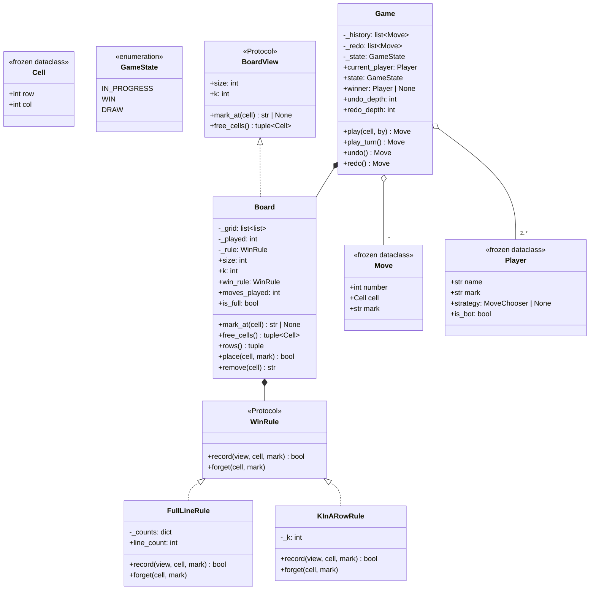

# 设计题解：井字棋（Tic-Tac-Toe）

## 题目与澄清

面试官通常这样开场："写一个井字棋，两个人轮流下，三子连线获胜。"——然后看一眼表，说
"大概十五分钟"。

这是低层设计里最常见的热身题，也是最容易被浪费掉的十五分钟。它不考你能不能写出
`if board[0][0] == board[0][1] == board[0][2]`；三行嵌套判断谁都会写。真正在被考察的是
另外几件事：**你会不会在一道"显然会"的题上仍然先问清楚需求**；**你写的东西能不能接住
下一个要求**——因为面试官几乎一定会在你说"写完了"的那一刻补一句"如果棋盘是 N×N 呢"
"如果要能悔棋呢""如果一方换成电脑呢"；以及**你默认的复杂度意识**——每落一子就把整个棋盘
扫一遍，在 3×3 上没人看得出来，在 19×19 的五子棋上就是每一手 O(N²)。热身题的评分点不是
"做对"，是"做对之后还剩下什么"。

值得当场问出来、而不是替面试官决定的澄清问题：

- **棋盘一定是 3×3 吗？** 如果回答"先按 3×3"，那也要追一句"以后会不会要 N×N"。这一句
  决定了棋盘的边长是写死的常量还是构造参数，也决定了胜负判定能不能写成"枚举那八条线"。
- **一定是"连满一行"才算赢，还是"连成 K 子"就算赢？** 这两个需求听上去只差一个参数，
  算法却完全不同：前者有 O(1) 的增量做法，后者没有。下面"关键设计决策"第一条专门讲这件事，
  它也是这道题唯一真正有技术含量的地方。
- **一定是两个人吗？** 三个人轮流在 5×5 上下 3 子连珠是一个真实存在的玩法。如果回合制被
  写成 `X` 和 `O` 两个常量来回翻，加第三个人就得改；如果写成"按已走手数对玩家数取模"，
  加第三个人是改调用方的一行。
- **要不要悔棋（undo）？要不要重做（redo）？** 悔棋会反过来约束胜负判定：如果判定带增量
  状态，那它必须也能**退回去**；很多候选人写完计数器才发现悔棋没法做。
- **谁来驱动一手棋？** 是外面（人类在命令行里敲坐标）调进来，还是棋局主动去问玩家？这决定了
  `Player` 是一个会阻塞去读输入的对象，还是一份轻薄的身份 + 一个可选的决策函数。第 4 关要
  插进一个电脑玩家，答案在这里就已经定了。
- **并发吗？** 井字棋几乎不会考并发（一局棋天然串行），但值得说一句"如果一个服务里跑很多局，
  锁的粒度是一局一把，不是全局一把"，证明你知道该问。

**范围之外**：不做命令行或图形界面（`Board.rows()` 给出的快照就是渲染层要的全部输入）、
不做联网对战与持久化、不做带搜索的强 AI——第 4 关要的是"能插进来的电脑玩家"，不是
minimax 或 alpha-beta；井字棋的博弈树小到可以穷举，但穷举不在这道题的考点上，真要追问，
说清楚"启发式是一层剪枝后的 minimax 的特例"就够了。

## 需求与分级

机考轮不会一次把需求说完，而是一关一关加码。井字棋的四关几乎是固定的：

- **第 1 关（核心流程，约 5 分钟）**：3×3，两个人轮流落子，三子连线获胜，满盘无线是和棋。
  非法着法——落在盘外、落在已有子的格子、棋局已经结束还要落子、不是你的回合——都要抛出
  **有名字的异常**，而不是返回 `False` 让调用方猜是哪一种失败。对应 `Board`、`Game`、
  `Cell`、`GameState` 和那一族 `TicTacToeError`。
- **第 2 关（N×N 与 O(1) 判定，约 5 分钟）**：棋盘边长变成参数；每落一子的胜负判定不能
  扫全盘。再追加"K 子连珠"这个泛化。对应 `WinRule` 这个 seam 以及它的两个实现
  `FullLineRule`（K == N，O(1)）和 `KInARowRule`（K < N，O(K)）。
- **第 3 关（悔棋与重做，约 3 分钟）**：能撤回任意多手，也能把撤回的重做回去；走出新的
  一手之后，原来的重做分支必须作废。对应 `Move` 这条不可变记录、`Game.undo`/`redo`，
  以及 `WinRule.forget`——增量状态必须能退回去，这是第 2 关的设计欠下的账，第 3 关来还。
- **第 4 关（电脑玩家，约 2 分钟）**：先接一个随机机器人，再接一个"能赢就赢、不能赢就堵"
  的启发式机器人。验收标准很硬：这两样加进来**不能改 `Board` 和 `Game` 的任何一行**。
  对应 `MoveChooser` 这个函数类型、`Player.strategy` 字段，以及 `random_bot`、
  `heuristic_bot` 两个返回闭包的工厂函数。

把"这个类是为第几关存在的"说出来，本身就是加分项：面试官想知道你是不是在没有需求的时候
提前造了抽象。本设计里唯一一个"在第 1 关看不出必要性"的东西是 `WinRule`，它在第 2 关才
真正还本——所以它的引入时机也应该是第 2 关，而不是一上来就摆在那里。

## 核心对象与职责

| 类 | 职责 | 它守住的不变式 |
|---|---|---|
| `Cell` | 棋盘坐标 | 不可变；可以直接做字典键和集合元素 |
| `GameState` | 棋局的三种状态 | 有限状态显式枚举，不用 `winner is None` 这种隐含判断 |
| `BoardView`（Protocol） | 盘面的**只读**契约 | 契约里只有读方法：机器人和判定规则只能看，不能改 |
| `WinRule`（Protocol） | "刚落的这一手成线了吗" | 内部状态（如果有）永远和盘面同步 |
| `FullLineRule` | K == N 时的 O(1) 增量判定 | 2N+2 个计数器；计数降到 0 时删键，空盘时字典必须重新变空 |
| `KInARowRule` | K < N 时的 O(K) 局部判定 | 无状态，因此 `forget` 是空操作，天然不会和盘面走偏 |
| `completes_line`（函数） | "**如果**这里落一子，会不会成线" | 纯函数，不改任何状态；落子前后都能问 |
| `Board` | 持有格子，落子/撤子时通知规则 | 格子内容与规则内部状态永远同步；不知道轮到谁、不保存历史 |
| `Move` | 一手棋的完整记录 | 不可变；这三个字段足以把这一手反着做一遍 |
| `Player` | 一位玩家的身份 + 可选的决策函数 | 不可变；同一局里棋子符号两两不同 |
| `Game` | 回合、终局、悔棋与重做 | `state`、`winner`、`moves` 三者永远自洽，只有 `_apply` 能改 |

关系上，`Game` **组合**（composition）`Board`：一局棋结束，棋盘就没有意义了。`Board` 也
**组合** 它的 `WinRule`——规则的内部计数器是棋盘的派生状态，离开这块棋盘毫无意义，所以它
只能通过 `place`/`remove` 被更新，没有第二个入口。`Game` 与 `Player` 是**关联**
（association）：玩家可以在很多局棋里出现，棋局不拥有玩家的生命周期。`Move` 只引用坐标和
符号这些值，不引用 `Player` 对象——这样一段历史可以被序列化、存盘、在另一个进程里重放，
而不用把玩家对象也拖过去。

这里也说一下**没有**建的类。没有 `TicTacToe` 这种"只有一个 `main` 的入口类"——那是 Java
把可执行入口塞进类里的历史包袱，Python 用 `if __name__ == "__main__":` 就够。没有
`HumanPlayer` / `BotPlayer` 这条继承链：两者的差别只有"决策函数是不是 `None`"这一个字段，
为一个布尔差别开一棵继承树是典型的过度建模。也没有 `ReadOnlyBoard` 这样一个只往 `Board`
转发四个方法的包装类，理由见"关键设计决策"最后一条——一个只转发的类必须自己挣到位置。



## 关键设计决策

### 一、胜负判定：扫全盘、增量计数器，还是从落子点局部行走？

**问题**：每落一子都要回答"这一手赢了吗"。3×3 怎么写都对；题目一旦变成 N×N，或者变成
"K 子连珠"，写法的差别就是 O(N²)、O(N) 和 O(1) 的差别。而且第 3 关要悔棋，判定用到的任何
状态都必须能退回去。

**选项 A：每次扫全盘**。

```python
def winner(grid: list[list[str | None]]) -> str | None:
    lines = [*grid, *zip(*grid),
             [grid[i][i] for i in range(len(grid))],
             [grid[i][-1 - i] for i in range(len(grid))]]
    for line in lines:
        head = line[0]
        if head is not None and all(x == head for x in line):
            return head
    return None
```

代价：每一手 O(N²)。它唯一的优点是**无状态**，所以悔棋不用做任何事。在 3×3 上这就是正确
答案；在 19×19 上，一局 361 手就是十几万次格子访问。更重要的是，面试官问"复杂度是多少"
的时候，回答"每手 O(N²)"说明你没想过还能更好。

**选项 B：增量计数器**。每行一个、每列一个、主副对角线各一个，按棋子符号分开计数；落子时
把命中的那最多 4 条线各加一，谁先加到 N 谁赢。

```python
count = self._counts.get(key, 0) + 1
self._counts[key] = count
won = won or count == self._size
```

每一手最多动 4 个计数器，**O(1)，与棋盘大小无关**。代价是引入了必须和盘面同步的派生状态：
悔棋时要一条条减回去，还要在计数降到 0 时把键删掉，否则一个本该只有 2N+2 条线的字典会随着
对局无限增长——这正是"每一个容器都要答得出什么时候条目被移除"这条通用检查在这道小题上的
落点。`line_count` 这个只读属性就是为了让这条不变式能在测试里被断言：悔到空盘，它必须是 0。

**选项 C：从刚落的那一格向四个方向各走两侧**。

```python
for dr, dc in ((0, 1), (1, 0), (1, 1), (1, -1)):
    run = 1
    for sign in (1, -1):
        r, c = cell.row + dr * sign, cell.col + dc * sign
        while in_board(r, c) and view.mark_at(Cell(r, c)) == mark:
            run += 1
            r, c = r + dr * sign, c + dc * sign
    if run >= k:
        return True
```

每一手 O(K)（最坏 O(N)），**无状态**，悔棋不用做任何事。

**选择**：两个都要，因为它们回答的**不是同一个问题**。

这是这道题最值得讲清楚的一点，也是大多数题解含糊过去的地方：**选项 B 的 O(1) 只在
K == N 时成立**。一旦 K < N（五子棋就是 K=5、N=15），"一条可能获胜的线"不再是那 2N+2 条
固定的整行整列，而是盘上任意位置长度为 K 的线段，数量是 O(N²) 级别，一手棋会命中其中
O(K) 条——增量计数器一点便宜都占不到，反而要维护一个大得多的字典。所以正确的做法是把
"怎么判赢"做成一个 seam：

```python
self._rule = rule if rule is not None else (
    FullLineRule(size) if self._k == size else KInARowRule(self._k))
```

`WinRule` 这个 `Protocol` 只有两个方法：`record`（棋子写进盘面之后调用，返回是否成线）和
`forget`（撤子时把状态退回去）。`FullLineRule` 是选项 B，`KInARowRule` 是选项 C 且
`forget` 是空操作。**这是一个真有两个实现、而且两个实现算法根本不同的接口**，不是"为了
可扩展性"硬造的。`Board` 里因此一个 `if k == size` 的分支都没有。

还有第三个问题需要被回答，它属于第 4 关：机器人要问的是**"我要是走这里会不会赢"**——一个
**假设句**。增量计数器答不了假设句，一问就得先改计数器再改回来。所以 `completes_line`
被写成一个独立的纯函数，`cell` 本身**无条件算作 1 子**，因此落子前后都能问；
`KInARowRule.record` 只是它的一行封装。这不是重复实现：一个是"记账"，一个是"试算"，
两者的调用时机、是否改状态都不同。它们必须**互相一致**，所以测试里有一条随机对局，
逐手断言 `board.place(...)` 的返回值和落子前 `completes_line(...)` 的预测完全相同。

### 二、悔棋：命令模式，还是一条不可变的记录？

**问题**：第 3 关要 undo/redo。教科书答案是[[patterns.command|命令与撤销重做（Command）]]。

**选项 A：命令模式**。定义一个 `MoveCommand`，`execute()` 落子，`undo()` 撤子，`Game`
持有一个命令栈。

```python
class MoveCommand:
    def __init__(self, board: Board, cell: Cell, mark: str) -> None: ...
    def execute(self) -> None: self._board.place(self._cell, self._mark)
    def undo(self) -> None: self._board.remove(self._cell)
```

**选项 B：一条不可变的 `Move` 记录 + `Game` 自己反着做**。

```python
@dataclass(frozen=True, slots=True)
class Move:
    number: int
    cell: Cell
    mark: str
```

**选择 B，并且要能把"为什么不用 Command"说清楚**。命令模式解决的是"**有很多种**互不相同
的操作，都需要被统一地执行、撤销、排队、记录"——文本编辑器里的插入、删除、缩进、替换各有
各的逆操作，把它们塞进一个统一接口才有价值。井字棋里只有**一种**操作：落一个子。一个只有
单一实现的命令接口，得到的是"一个类 + 一个栈"换"一个不可变的三字段记录 + 一个列表"，
多出来的只有一层间接。更要命的是，`MoveCommand` 必须持有 `Board` 的引用才能 `undo`，于是
一段历史就不再是纯数据了：存不进 JSON、传不过进程、也没法在另一块棋盘上重放。`Move` 是
纯数据，`Game._apply` 是唯一的"执行"，`Game.undo` 是唯一的"撤销"——这两处加起来不到十行。

反过来，什么时候这个答案会变？如果后面加了"认输""提和""换手"这些同样需要进历史、同样
需要能撤销的操作，那就有了多种操作，Command 才开始挣钱。在面试里把这句话说出来比直接用
模式更值钱：**知道什么时候不用模式，才说明你知道模式在解决什么**。

顺带一个细节容易被漏掉：`play()` 里那行 `self._redo.clear()`。悔了两手又走出一手新的，
原来的重做分支就不存在了；不清空的话 `redo()` 会把一段根本没发生过的历史接回来，而且那个
栈永远不会缩。`redo_depth` 这个只读属性就是为了让"新走一手之后必须归零"可以被断言。

### 三、玩家抽象：会阻塞读输入的对象，还是一份身份 + 一个可选的决策函数？

**问题**：第 4 关要在不改 `Board` 和 `Game` 的前提下插进一个电脑玩家。

**选项 A：抽象基类 + 两个子类**。

```python
class Player(ABC):
    @abstractmethod
    def choose_move(self, view: BoardView, mark: str) -> Cell: ...

class HumanPlayer(Player):
    def choose_move(self, view, mark):        # 库代码里去读 stdin
        return Cell(*map(int, input("row col: ").split()))
```

这是绝大多数开源题解的写法，它有两个真实的毛病。一是把 I/O 拖进了库代码：`Game` 一旦调用
`choose_move`，整个棋局就不可能在没有 stdin 的地方被驱动——测试要么造假 stdin，要么绕开
`Game`。二是为一个只有一个字段之差的区别开了一棵继承树。

**选项 B：`Player` 是不可变的身份，决策是一个可选的普通函数**。

```python
MoveChooser = Callable[[BoardView, str], Cell]

@dataclass(frozen=True, slots=True)
class Player:
    name: str
    mark: str
    strategy: MoveChooser | None = None
```

人类玩家的 `strategy` 就是 `None`——**他的决策本来就不在这个进程里**，由外部调用
`game.play(cell)` 给出；这不是"缺了一个实现"，而是对事实的准确建模。机器人只是把一个闭包
塞进同一个字段。`Game` 因此有两个入口：`play(cell)`（外部给出这一手，人类走这条）和
`play_turn()`（问当前玩家要这一手，机器人走这条，人类会得到 `NoStrategyError`）。这两个
入口从第 1 关就存在，所以第 4 关加机器人时，`Board` 和 `Game` 一行都不用动——
`random_bot` 和 `heuristic_bot` 是两个返回闭包的工厂函数，注入 `random.Random` 是为了让
测试可复现（而不是在函数里直接调 `random.choice`）。

这也是[[method.modeling|从需求到对象（Requirements to Objects）]]里反复出现的一条判据：
**先问这个区别值几个字段**。两个"子类"如果只差一个字段的取值，它们就该是同一个类的两个
实例。

### 四、给机器人的是可变的棋盘，还是一个只读包装？——一个被拒绝的类

**问题**：`play_turn()` 把 `self._board` 传给策略函数。策略函数拿到的是真正的 `Board`，
上面有 `place` 和 `remove`，一个写坏的机器人可以直接改棋盘。要不要挡住？

**选项 A：写一个 `ReadOnlyBoard` 包装**。

```python
class ReadOnlyBoard:
    def __init__(self, board: Board) -> None: self._board = board
    @property
    def size(self) -> int: return self._board.size
    @property
    def k(self) -> int: return self._board.k
    def mark_at(self, cell: Cell) -> str | None: return self._board.mark_at(cell)
    def free_cells(self) -> tuple[Cell, ...]: return self._board.free_cells()
```

**选项 B：用 `BoardView` 这个 `Protocol` 把契约写进类型里，不建类**。

**选择 B**。四个方法全是原样转发，这个类自己没有任何责任、没有任何不变式——它是"一个只
转发调用的类"的教科书样本，而这种类在 Python 里几乎总是 Java 习惯的残留。它挡住的也只是
**手滑**，挡不住恶意：`bot._board` 或者 `view._board` 一取就绕过去了，Python 没有真正的
私有。真正起作用的是两件事：`BoardView` 这个 `Protocol` 把"策略只该看"写成了类型签名，
类型检查器会在 `view.place(...)` 上报错；以及 `free_cells()`、`rows()` 返回的是**元组
快照**而不是内部列表——这一点是硬的，外部拿到手的东西根本改不动棋盘，这才是"不返回内部
可变集合"这条纪律真正兑现的地方。

什么时候选项 A 会翻身？如果策略变成用户上传的第三方代码、要跨信任边界执行，那就不是
"包装一层"能解决的了，那时候要的是进程隔离而不是一个转发类。面试里把这条界线说出来，
比无脑加一层包装有说服力得多。

## 代码走读

完整的参考实现如下（`vault/domains/low-level-design/problems/tic-tac-toe/solution.py`，
和被测代码逐字同步）：

%% code:begin solution.py %%
```python
"""井字棋（Tic-Tac-Toe）——N×N 棋盘、K 子连珠、可悔棋、可插机器人的参考实现。

核心思路：胜负判定是这道题唯一有技术含量的地方，本设计把它抽成 `WinRule` 这个seam——
`FullLineRule` 用"每行、每列、两条对角线各一个计数器"做 O(1) 的增量判定（只在 K == N 时
成立），`KInARowRule` 从刚落的那一格向四个方向各走两侧，O(K) 地判 K 子连珠；两者都不需要
扫全盘。`Board` 只管"格子里有什么"和"落子/撤子时通知规则"，它不知道谁该走、也不知道谁赢了；
`Game` 管回合、终局（IN_PROGRESS / WIN / DRAW，平局靠已落子数而不是扫盘得出）和悔棋重做——
一手棋由 `Move` 这条不可变记录完整描述，撤销就是把它反着做一遍，不需要命令对象。机器人是
注入 `Player` 的一个普通函数 `(BoardView, mark) -> Cell`，因此第 4 关加机器人不碰 `Board`
和 `Game` 的任何一行。
"""

from __future__ import annotations

import random
from collections.abc import Callable, Sequence
from dataclasses import dataclass
from enum import Enum
from typing import Protocol


# --------------------------------------------------------------------------
# 基本类型与失败路径


class TicTacToeError(Exception):
    """本设计里所有失败路径的公共基类，调用方可以一次性捕获。"""


class OutOfBoardError(TicTacToeError):
    """落子位置不在棋盘范围内。"""


class CellTakenError(TicTacToeError):
    """落子位置已经有子了。"""


class EmptyCellError(TicTacToeError):
    """要撤掉的格子本来就是空的。"""


class NotYourTurnError(TicTacToeError):
    """不是这位玩家的回合。"""


class GameOverError(TicTacToeError):
    """棋局已经结束（有人获胜或和棋），不能再落子。"""


class NothingToUndoError(TicTacToeError):
    """没有可悔的棋。"""


class NothingToRedoError(TicTacToeError):
    """没有可重做的棋。"""


class NoStrategyError(TicTacToeError):
    """当前玩家没有落子策略（是人类），这一手必须由外部用 `play(cell)` 给出。"""


@dataclass(frozen=True, slots=True, order=True)
class Cell:
    """棋盘上的一个格子，行列都从 0 开始；不可变，可以直接做字典键和集合元素。"""

    row: int
    col: int


class GameState(Enum):
    """棋局的三种状态；显式建模，而不是用 `winner is None` 之类的隐含判断。"""

    IN_PROGRESS = "in_progress"
    WIN = "win"
    DRAW = "draw"


# --------------------------------------------------------------------------
# 盘面的只读视图：机器人和判定规则只需要"看"，不需要"改"


class BoardView(Protocol):
    """盘面的只读契约。`Board` 天然满足它，机器人只按这份契约编写。"""

    @property
    def size(self) -> int:
        """棋盘边长 N。"""

    @property
    def k(self) -> int:
        """连成多少子算赢。"""

    def mark_at(self, cell: Cell) -> str | None:
        """格子里的棋子符号；空格返回 `None`。"""

    def free_cells(self) -> tuple[Cell, ...]:
        """当前所有空格的一份快照，按行优先顺序。"""


DIRECTIONS: tuple[tuple[int, int], ...] = ((0, 1), (1, 0), (1, 1), (1, -1))


def completes_line(view: BoardView, cell: Cell, mark: str, k: int | None = None) -> bool:
    """假设 `cell` 上落的是 `mark`，判断它是否连成了 k 子。

    关键在"假设"两个字：`cell` 本身无条件算作 1 子，因此这个函数**落子前后都能问**——
    落子后问的是"刚才这一手赢了吗"，落子前问的是"我要是走这里会不会赢"。机器人需要的
    正是后者，而增量计数器答不了这种假设句（一问就得改计数器）。复杂度 O(k)。
    """
    k = view.k if k is None else k
    for dr, dc in DIRECTIONS:
        run = 1
        for sign in (1, -1):
            r, c = cell.row + dr * sign, cell.col + dc * sign
            while 0 <= r < view.size and 0 <= c < view.size and view.mark_at(Cell(r, c)) == mark:
                run += 1
                r += dr * sign
                c += dc * sign
        if run >= k:
            return True
    return False


# --------------------------------------------------------------------------
# 胜负判定：两种算法，同一个接口


class WinRule(Protocol):
    """胜负判定规则。`record` 在棋子写进棋盘**之后**被调用，返回这一手是否成线。

    `view` 参数对增量实现是多余的（它靠自己的计数器就够了），但需要看盘面的实现离不开它，
    所以放进协议；这是"接口迁就最需要信息的那个实现"的一个例子。
    """

    def record(self, view: BoardView, cell: Cell, mark: str) -> bool:
        """记下这一手，返回它是否连成一条线。"""

    def forget(self, cell: Cell, mark: str) -> None:
        """撤掉这一手，把规则内部的状态退回去。"""


class FullLineRule:
    """整行、整列或整条对角线连满才算赢（K == N）时的 O(1) 增量判定。

    只维护 2N+2 个计数器：每行一个、每列一个、主副对角线各一个，按棋子符号分开计数。
    一手棋最多命中 4 条线，所以每一手是常数时间，跟棋盘多大无关。
    计数器降到 0 时**删掉这个键**——悔棋到空盘时字典必须重新变空，否则一个本该有界的
    结构会随对局数无限增长。`line_count` 就是为了让这条不变式在外部可验证。
    """

    def __init__(self, size: int) -> None:
        self._size = size
        self._counts: dict[tuple[str, str, int], int] = {}

    def _lines_through(self, cell: Cell) -> tuple[tuple[str, int], ...]:
        """一个格子最多落在 4 条线上：它那一行、那一列，以及（如果在上面）两条对角线。"""
        lines: list[tuple[str, int]] = [("row", cell.row), ("col", cell.col)]
        if cell.row == cell.col:
            lines.append(("diag", 0))
        if cell.row + cell.col == self._size - 1:
            lines.append(("anti", 0))
        return tuple(lines)

    def record(self, view: BoardView, cell: Cell, mark: str) -> bool:
        won = False
        for kind, index in self._lines_through(cell):
            key = (mark, kind, index)
            count = self._counts.get(key, 0) + 1
            self._counts[key] = count
            won = won or count == self._size
        return won

    def forget(self, cell: Cell, mark: str) -> None:
        for kind, index in self._lines_through(cell):
            key = (mark, kind, index)
            remaining = self._counts[key] - 1
            if remaining:
                self._counts[key] = remaining
            else:
                del self._counts[key]

    @property
    def line_count(self) -> int:
        """当前还有多少条线上有子——空盘时必须是 0。"""
        return len(self._counts)


class KInARowRule:
    """K 子连珠（K < N，如五子棋）的判定：从刚落的那一格向四个方向各走两侧，O(K)。

    这种规则**没有**常数时间的增量做法：一条长度为 K 的线可以落在盘上任何位置，
    要预先给每条可能的线配计数器，数量是 O(N²) 而不是 O(N)，而且一手棋会命中其中的
    O(K) 条——省不下来。所以这里索性不留状态，`forget` 什么也不用做。
    """

    def __init__(self, k: int) -> None:
        self._k = k

    def record(self, view: BoardView, cell: Cell, mark: str) -> bool:
        return completes_line(view, cell, mark, self._k)

    def forget(self, cell: Cell, mark: str) -> None:
        return None


# --------------------------------------------------------------------------
# 棋盘：只管格子里有什么


class Board:
    """N×N 棋盘：持有格子，落子与撤子时通知 `WinRule`。

    它守的不变式是"格子内容和胜负规则的内部状态永远同步"——所以规则只能通过
    `place`/`remove` 被更新，没有别的入口。它不知道轮到谁、也不保存历史，那是 `Game` 的事。
    """

    def __init__(self, size: int = 3, k: int | None = None, rule: WinRule | None = None) -> None:
        if size < 1:
            raise ValueError("棋盘边长至少是 1")
        self._size = size
        self._k = size if k is None else k
        if not 1 <= self._k <= size:
            raise ValueError(f"连子数 k 必须落在 1..{size} 之间，收到 {self._k}")
        self._grid: list[list[str | None]] = [[None] * size for _ in range(size)]
        self._played = 0
        self._rule: WinRule = rule if rule is not None else (
            FullLineRule(size) if self._k == size else KInARowRule(self._k))

    @property
    def size(self) -> int:
        return self._size

    @property
    def k(self) -> int:
        return self._k

    @property
    def win_rule(self) -> WinRule:
        """当前使用的胜负规则；公开只读，便于外部检查它的不变式。"""
        return self._rule

    @property
    def moves_played(self) -> int:
        """盘上已有的棋子数——和棋就是靠它判定的，不用扫盘。"""
        return self._played

    @property
    def is_full(self) -> bool:
        return self._played == self._size * self._size

    def contains(self, cell: Cell) -> bool:
        return 0 <= cell.row < self._size and 0 <= cell.col < self._size

    def mark_at(self, cell: Cell) -> str | None:
        if not self.contains(cell):
            raise OutOfBoardError(f"{cell} 不在 {self._size}×{self._size} 的棋盘上")
        return self._grid[cell.row][cell.col]

    def free_cells(self) -> tuple[Cell, ...]:
        """空格的一份快照。返回元组而不是内部列表：外部拿到手的东西改不动棋盘。"""
        return tuple(Cell(r, c) for r in range(self._size) for c in range(self._size)
                     if self._grid[r][c] is None)

    def rows(self) -> tuple[tuple[str | None, ...], ...]:
        """整个盘面的不可变快照，用于展示或存档。"""
        return tuple(tuple(row) for row in self._grid)

    def place(self, cell: Cell, mark: str) -> bool:
        """落子，返回这一手是否连成一条线。位置非法或已被占用时抛异常。"""
        if not self.contains(cell):
            raise OutOfBoardError(f"{cell} 不在 {self._size}×{self._size} 的棋盘上")
        if self._grid[cell.row][cell.col] is not None:
            raise CellTakenError(f"{cell} 已经是 {self._grid[cell.row][cell.col]} 了")
        self._grid[cell.row][cell.col] = mark
        self._played += 1
        return self._rule.record(self, cell, mark)

    def remove(self, cell: Cell) -> str:
        """撤掉一个格子上的子并返回它；规则的内部状态同步回退。"""
        if not self.contains(cell):
            raise OutOfBoardError(f"{cell} 不在 {self._size}×{self._size} 的棋盘上")
        mark = self._grid[cell.row][cell.col]
        if mark is None:
            raise EmptyCellError(f"{cell} 本来就是空的")
        self._grid[cell.row][cell.col] = None
        self._played -= 1
        self._rule.forget(cell, mark)
        return mark


# --------------------------------------------------------------------------
# 玩家与机器人：一手棋的决策就是一个普通函数


MoveChooser = Callable[[BoardView, str], Cell]


@dataclass(frozen=True, slots=True)
class Player:
    """一位玩家：名字、棋子符号，以及（可选的）落子策略。

    人类玩家的 `strategy` 是 `None`——他的决策不在进程里，由外部调用 `play(cell)` 给出。
    机器人只是把一个函数塞进同一个字段，所以第 4 关加机器人不需要动 `Player` 以外的任何类。
    """

    name: str
    mark: str
    strategy: MoveChooser | None = None

    @property
    def is_bot(self) -> bool:
        return self.strategy is not None


@dataclass(frozen=True, slots=True)
class Move:
    """一手棋的完整记录：第几手、落在哪、落的是什么子。撤销它只需要这三样信息。"""

    number: int
    cell: Cell
    mark: str


def random_bot(rng: random.Random) -> MoveChooser:
    """最笨的机器人：在空格里随机挑一个。注入 `Random` 才能让测试可复现。"""

    def choose(view: BoardView, mark: str) -> Cell:
        return rng.choice(view.free_cells())

    return choose


def _rival_marks(view: BoardView, mark: str) -> frozenset[str]:
    """盘上除自己之外还出现过的棋子符号——不写死"对手是 O"，三人局照样能用。"""
    return frozenset(
        other for r in range(view.size) for c in range(view.size)
        if (other := view.mark_at(Cell(r, c))) is not None and other != mark)


def heuristic_bot(rng: random.Random) -> MoveChooser:
    """一步启发式：能赢就赢，不能赢就堵，都不是就往中心靠，同分随机。

    它只用 `BoardView` 上的只读方法和 `completes_line` 这个假设判定，一行棋盘或棋局的
    代码都没碰——这正是第 4 关想看到的证据。
    """

    def choose(view: BoardView, mark: str) -> Cell:
        free = view.free_cells()
        for cell in free:                       # 一、自己能连线就直接连
            if completes_line(view, cell, mark, view.k):
                return cell
        for rival in sorted(_rival_marks(view, mark)):
            for cell in free:                   # 二、对手下一手能连线就堵住
                if completes_line(view, cell, rival, view.k):
                    return cell
        center = (view.size - 1) / 2            # 三、越靠中心的格子在越多条线上
        best = min(abs(c.row - center) + abs(c.col - center) for c in free)
        tied = [c for c in free if abs(c.row - center) + abs(c.col - center) == best]
        return rng.choice(tied)

    return choose


# --------------------------------------------------------------------------
# 棋局：回合、终局与悔棋


class Game:
    """一局棋：谁该走、棋局是什么状态、走过哪些手，以及悔棋与重做。

    它守的不变式是"`state`、`winner` 和 `moves` 永远互相自洽"：只有 `_apply` 能改这三样。
    棋盘规则（怎么算赢）和玩家决策（走哪）都不在这里，`Game` 只做编排。
    """

    def __init__(self, board: Board, players: Sequence[Player]) -> None:
        if len(players) < 2:
            raise ValueError("至少要两位玩家")
        marks = [p.mark for p in players]
        if len(set(marks)) != len(marks):
            raise ValueError(f"玩家的棋子符号必须两两不同，收到 {marks}")
        self._board = board
        self._players = tuple(players)
        self._history: list[Move] = []
        self._redo: list[Move] = []
        self._state = GameState.IN_PROGRESS
        self._winner: Player | None = None

    @property
    def board(self) -> Board:
        return self._board

    @property
    def players(self) -> tuple[Player, ...]:
        return self._players

    @property
    def state(self) -> GameState:
        return self._state

    @property
    def winner(self) -> Player | None:
        return self._winner

    @property
    def current_player(self) -> Player:
        """轮到谁，由已走手数推出来，因此悔棋之后自动回到正确的一方。"""
        return self._players[len(self._history) % len(self._players)]

    @property
    def moves(self) -> tuple[Move, ...]:
        """走子历史的快照。"""
        return tuple(self._history)

    @property
    def undo_depth(self) -> int:
        return len(self._history)

    @property
    def redo_depth(self) -> int:
        """重做栈的深度——新走一手之后必须归零，否则就会重做出一段不存在的历史。"""
        return len(self._redo)

    def _apply(self, cell: Cell, player: Player) -> Move:
        """把一手棋落到盘上并更新终局状态；`play` 和 `redo` 共用，避免两份判负逻辑。"""
        won = self._board.place(cell, player.mark)
        move = Move(number=len(self._history) + 1, cell=cell, mark=player.mark)
        self._history.append(move)
        if won:
            self._state, self._winner = GameState.WIN, player
        elif self._board.is_full:
            self._state = GameState.DRAW
        return move

    def play(self, cell: Cell, by: Player | None = None) -> Move:
        """走一手。`by` 给出时会校验确实轮到他；棋局已结束、位置非法都会抛异常。"""
        if self._state is not GameState.IN_PROGRESS:
            raise GameOverError(f"棋局已经结束（{self._state.value}），不能再落子")
        player = self.current_player
        if by is not None and by.mark != player.mark:
            raise NotYourTurnError(f"现在轮到 {player.name}（{player.mark}），不是 {by.name}")
        move = self._apply(cell, player)
        self._redo.clear()      # 走出新的一手，原来的重做分支就作废了
        return move

    def play_turn(self) -> Move:
        """让当前玩家自己决定这一手；人类玩家没有策略，会抛 `NoStrategyError`。"""
        if self._state is not GameState.IN_PROGRESS:
            raise GameOverError(f"棋局已经结束（{self._state.value}），不能再落子")
        player = self.current_player
        if player.strategy is None:
            raise NoStrategyError(f"{player.name} 没有落子策略，请用 play(cell) 给出这一手")
        return self.play(player.strategy(self._board, player.mark))

    def undo(self) -> Move:
        """悔一手：从盘上撤掉它，压进重做栈，棋局回到进行中。"""
        if not self._history:
            raise NothingToUndoError("还没有走过任何一手")
        move = self._history.pop()
        self._board.remove(move.cell)
        self._redo.append(move)
        self._state, self._winner = GameState.IN_PROGRESS, None
        return move

    def redo(self) -> Move:
        """重做一手：重放的正是刚才悔掉的那一手，轮到的人必然对得上。"""
        if not self._redo:
            raise NothingToRedoError("没有可重做的棋")
        move = self._redo.pop()
        return self._apply(move.cell, self.current_player)


def play_out(game: Game) -> Game:
    """让全是机器人的一局自己下完；人类在场时会抛 `NoStrategyError`。"""
    while game.state is GameState.IN_PROGRESS:
        game.play_turn()
    return game


if __name__ == "__main__":
    rng = random.Random(7)
    demo = play_out(Game(Board(size=3), [
        Player("启发式", "X", heuristic_bot(rng)),
        Player("随机", "O", random_bot(rng)),
    ]))
    for row in demo.board.rows():
        print(" ".join(m or "." for m in row))
    print(demo.state.value, demo.winner.name if demo.winner else "")
```
%% code:end %%

三处值得对着代码再看一眼：

**一、`Board.place` 只有一句话是"判赢"。** 它做校验、写格子、`self._played += 1`，然后把
判赢整句交给 `self._rule.record(self, cell, mark)`。`Board` 里没有任何一行知道"赢"是三子
连线还是五子连珠。这是第 2 关那个 seam 真正的价值：换规则不碰棋盘。注意 `record` 拿到的
第一个参数是 `self`——`Board` 把自己当作 `BoardView` 递过去，因为它结构上就满足那个
`Protocol`，不需要继承、不需要注册。

**二、`completes_line` 里的 `run = 1` 是整个函数的关键。** 起点格子无条件算一子，不去读
它现在是什么，所以这个函数问的永远是"**假设**这里是 `mark`"。落子后调用它，答的是"刚才
这一手赢了吗"；落子前调用它，答的是"我要是走这里会不会赢"。两层 `for` 的第二层 `sign in
(1, -1)` 也不能省：K 子连珠里，补在**中间**的一子会把左右两段接起来，只往一个方向数的
实现会在这种局面上漏判——测试里 `test_k_in_a_row_counts_both_sides_of_the_last_stone`
盯的就是这个。

**三、`Game.current_player` 是算出来的，不是存出来的。**

```python
return self._players[len(self._history) % len(self._players)]
```

轮到谁是走子历史的**派生量**，不是一份需要维护的状态。这一行带来三个好处，而且是白送的：
悔棋之后不用"把回合也退一格"（历史短了一手，取模自然回到上一位）；玩家数从 2 变成 3
不用改任何一行；也永远不可能出现"历史说走了 5 手、回合却指向第一个人"这种两份真源对不上
的 bug。`_apply` 被 `play` 和 `redo` 共用，也是同一个思路——终局判定只有一份实现，
重做不可能和正常落子走出不同的结论。

## 测试与自检

套件有 28 个用例，按四关分段。值得单独指出的几条：

- **不变式而不是流水账**。`test_undoing_every_move_empties_the_rule_counters` 断言的是
  `board.win_rule.line_count == 0`——一个本该有界的容器，悔到空盘必须重新变空。注意它
  读的是 `win_rule` 这个**公开只读属性**，不是 `_counts`：`starter.py` 的填空者完全可以
  用别的内部表示（比如 `Counter`、比如四个独立的 dict），断言私有字段会把一个正确答案判错。
  同理 `redo_depth`、`moves_played` 都是为了让内部不变式可被外部断言而存在的小属性。
- **两套判定必须一致**。`test_the_incremental_rule_and_the_predicate_agree_on_random_games`
  跑 30 局随机对局，每一手都断言 `board.place(...)` 的返回值等于落子**前**
  `completes_line(...)` 的预测。这是"记账"和"试算"两条路互为对照的交叉验证，比各自单测更
  有力。
- **失败路径占了三分之一**。落在盘外、落在已占格、不是你的回合、棋局已结束、无棋可悔、
  无棋可重做、人类玩家被要求自己走——七条失败路径各有自己的异常类型，而且
  `test_playing_on_a_taken_cell_raises_and_does_not_consume_the_turn` 额外断言"失败之后
  回合没有被消耗掉"，这是最容易写错的一条：先切换回合再校验，非法着法就会把回合吃掉。
- **随机必须可复现**。两个机器人都接收注入的 `random.Random`；
  `test_random_bot_only_ever_picks_a_free_cell_and_is_reproducible` 用同一个种子跑两遍，
  断言走子序列逐手相同。库代码里任何一处直接调 `random.choice` 都会让这条测试失效。
- **机器人的质量也是可断言的**。`test_a_heuristic_bot_never_loses_to_a_random_bot_on_three_by_three`
  用 12 个种子让启发式先手对随机后手，断言从不输棋。这比"跑起来没报错"强得多。

**两分钟怎么给面试官演示**：`python solution.py` 直接跑那个 demo，打印出最终盘面和结果；
然后当场改一行——把 `Board(size=3)` 换成 `Board(size=5, k=4)`，机器人、悔棋、终局判定
全都照常工作。这一改一跑，就是"第 2 关和第 4 关互不干扰"最直观的证据。

## 扩展与追问

**新需求**

- **K 子连珠 / 五子棋**：已经支持，`Board(size=15, k=5)`。变的是 `Board.__init__` 里选
  规则的那一行会挑中 `KInARowRule`；`Game`、`Move`、`Player`、机器人全部不动。
- **三个人或更多**：`Game(board, [p1, p2, p3])` 就行，轮转靠取模。`heuristic_bot` 的
  "堵"用的是 `_rival_marks`（盘上除自己以外出现过的所有符号），所以它在三人局里也会堵，
  不用改。
- **重力棋（Connect Four）**：落子只能落在某一列最下面的空格。变的是**校验**在哪：加一个
  `GravityBoard(Board)` 覆写 `place` 的合法性检查，或者更干净地，把"这一手合法吗"也做成
  一个注入的规则。`WinRule`、`Game`、机器人不动——Connect Four 的胜负正好就是 K=4 的
  `KInARowRule`。
- **更强的 AI**：新的 `MoveChooser` 函数而已。井字棋的博弈树只有几十万个结点，一个带
  记忆化的 minimax 可以在毫秒级穷举；它需要"试走一手再撤回"的能力，而 `Board.place` /
  `Board.remove` 这一对已经提供了——这也是把 `remove` 做成公开方法（而不是只让 `Game`
  悄悄用）的回报。
- **棋谱存档与回放**：`moves` 已经是一串纯数据 `Move`，序列化成 JSON 直接可用；回放就是
  在一块新棋盘上依次 `play`。因为 `Move` 不引用 `Player` 对象，这件事不需要任何额外设计。

**并发与线程安全**

井字棋本身是串行的，但一个对战服务里会同时跑很多局。正确的锁粒度是**一局一把**：
`Game` 持有一个 `threading.Lock`，`play`/`play_turn`/`undo`/`redo` 各自在锁里完成——因为
"读当前回合 → 校验 → 落子 → 判终局"是一个典型的 check-then-act 序列，中间被打断就会出现
两手棋都认为轮到自己。全局一把锁会让所有对局互相排队，一局一把锁则天然按对局分片。要强调
的是 GIL 帮不上忙：GIL 保证的是单条字节码不被打断，而这里要保护的是跨越好几个属性读写的
**复合操作**。`Board` 和 `WinRule` 不需要自己的锁——它们永远在 `Game` 的锁内被调用，
多一层锁只会带来死锁的风险而不增加任何保证。

**持久化与规模**

- **存盘**：需要落盘的只有 `(size, k, players, moves)` 四样，`moves` 是纯数据，重放即可
  恢复全部状态，不需要序列化 `Board` 或计数器——派生状态不该进存储。
- **大棋盘**：`Board` 用 `list[list[str | None]]` 是 O(N²) 内存。19×19 无所谓；如果真要
  做成稀疏的（比如无限大棋盘的五子棋），换成 `dict[Cell, str]` 只影响 `Board` 内部，
  `mark_at` / `free_cells` 的签名不变——不过 `free_cells()` 在无限棋盘上就不再有意义，
  得换成"已落子附近的候选点"，那是 `BoardView` 契约真正需要改的一次。
- **同时几万局**：每局的状态只有几百字节，瓶颈在连接和调度，不在这份模型。

## 常见错误

1. **每落一子扫一遍全盘**。3×3 上没人看得出来，但面试官问复杂度时这是第一个露馅的地方。
   更糟的变体是"扫全盘并且枚举那八条线的坐标"——写死的八条线意味着 N×N 直接推倒重写。
2. **声称 K 子连珠也能 O(1)**。这是本题最典型的"半懂"错误。整行整列的计数器只在 K == N
   时成立；K < N 时可能获胜的线有 O(N²) 条，增量记账占不到便宜。老老实实说"这一档是
   O(K)，从落子点局部走"反而是加分项。
3. **和棋靠扫盘判定**。`all(cell is not None for row in grid for cell in row)` 是 O(N²)，
   而一个 `moves_played == size * size` 的计数器是 O(1)，而且它本来就要维护。
4. **非法着法返回 `False` 或 `None`**。调用方拿到 `False` 不知道是"格子被占"还是"盘外"
   还是"不是你的回合"，只能再问一遍，于是校验逻辑被复制到调用方。用一族有名字的异常，
   `except TicTacToeError` 还能一把兜住。
5. **先切回合再校验**。非法着法把回合吃掉，是这道题最常见的功能性 bug。正确的顺序是：
   所有校验通过、盘面真的改了，才算这一手。本设计里根本不存在"切回合"这个动作——回合是
   历史长度算出来的，所以这个 bug 在结构上就不可能发生。
6. **写一个只有 `main` 的 `TicTacToe` 类**、**给 `Board` 写一堆 `get_cell`/`set_cell`**、
   **给 `Player` 开 `HumanPlayer`/`BotPlayer` 继承树**、**用 `__new__` 把 `Game` 做成
   单例**——四种最典型的 Java 味。Python 里分别对应：模块级 `if __name__ == "__main__":`、
   `@property` 和方法、一个可选的函数字段、以及"不要单例，把实例传进去"。
7. **把 I/O 写进库代码**。`HumanPlayer.choose_move` 里调 `input()`，整个棋局就没法在没有
   stdin 的地方被驱动，测试也只能造假标准输入。
8. **增量状态没法回退**。写完计数器才发现悔棋要减回去，于是在 `undo` 里重新扫全盘重建
   计数器——等于把第 2 关辛苦省下的复杂度在第 3 关还了回去。判定规则的接口里必须从一开始
   就有 `forget`。
9. **计数器的键降到 0 不删**。这在井字棋里泄漏得很慢，但它是同一类错误在所有题里的样子：
   任何一个会增长的容器，都要答得出"什么条件下条目被移除"。
10. **悔棋后不清空重做栈**。走出新分支之后 `redo()` 会把一段不存在的历史接回来。

## 45 分钟怎么分配

井字棋很少单独占满 45 分钟，它通常是长题前的热身，或者是"十五分钟写完再加需求"的那种。
下面按"如果它真的是一道 45 分钟的题"来排，前 15 分钟就是热身版的全部。

- **0–4 分钟，澄清**。把上面那六个问题问出来，尤其是"N×N 吗""K 子连珠吗""要悔棋吗"
  "第二个玩家可能是电脑吗"。边问边在白板上记下四关的标题。**说出口的一句**："我先按
  3×3 两个人写通，但我会把棋盘边长和连子数做成参数，这样第二关不用重写。"
- **4–8 分钟，实体与职责**。写出 `Cell`、`GameState`、异常族、`Board`、`Game`、`Player`
  的签名，不写实现。**说出口的一句**："`Board` 只知道格子里有什么，不知道轮到谁；轮到谁
  我打算从历史长度算出来，这样悔棋是白送的。"
- **8–20 分钟，写通第 1 关**。`Board.place` / `mark_at` / `free_cells`，`Game.play` 和
  终局判定，先用最笨的扫盘判赢，但**把它放在一个独立的函数里**。跑一个三子连线的例子。
- **20–28 分钟，第 2 关**。把判赢换成 `WinRule` 的两个实现。**说出口的一句**：
  "整行整列的计数器是 O(1)，但它只在 K 等于 N 时成立；K 子连珠我用从落子点局部走的
  O(K) 版本，这两个是不同的算法，所以我让它们共用一个接口而不是加一个 `if`。"
- **28–34 分钟，第 3 关**。`Move`、`undo`、`redo`、`forget`、清空重做栈。**说出口的一句**：
  "这里不用命令模式，因为只有一种操作；如果以后有认输、提和这些也要进历史的操作，
  Command 才开始划算。"
- **34–40 分钟，第 4 关**。`MoveChooser` 类型、两个机器人工厂。**说出口的一句**：
  "注意我没有改 `Board` 和 `Game` 的任何一行。"
- **40–45 分钟，测试与收尾**。当场补三条测试：一条赢、一条和、一条非法着法；再口头列出
  还想补的几条（悔到空盘计数器归零、两套判定一致）。

**时间不够时砍什么**：砍第 4 关的启发式机器人（留随机的那一个，一行闭包），砍 `rows()`
和 demo，砍多人轮转的演示。**绝对不能砍**的是：有名字的异常、`Board`/`Game` 的职责分界、
以及"把判赢单独拎出来"这一步——前两者是评分表上的主项，最后一个是第 2 关能不能接住的前提。

## 来源与延伸

- <https://github.com/abhaypaswan/lld-python/tree/main/problems/tic-tac-toe> —— 少见的
  纯 Python 题解，而且明确点出了两个关键：判赢不要扫盘、机器人难度应该是策略而不是一个
  标志位。它把胜负计数器直接放在 `Board` 内部，用 `rows`/`columns`/`diagonal` 四个字段
  维护。本文把这一步再推一格：计数器只在 K == N 时成立，所以判定被抽成 `WinRule`，
  K 子连珠换成 O(K) 的局部行走；另外本文的机器人是一个普通函数而不是一个策略类，
  并且额外提供了"假设判定"`completes_line`，这样机器人和棋盘的记账逻辑不会打架。
- <https://github.com/ashishps1/awesome-low-level-design/blob/main/problems/tic-tac-toe.md>
  —— 六种语言并排的经典写法，类划分是 `Board` + `Game` + `Player` + 一个只有 `main` 的
  `TicTacToe`。它的 `Board.check_winner` 每次扫全盘，`Player` 只有名字和符号、没有决策
  能力，也没有悔棋。本文不设入口类，判赢做成增量/局部两种规则，并把"决策"作为可选字段
  放进 `Player`，这样电脑玩家不需要新的继承层次。
- <https://github.com/prasadgujar/low-level-design-primer/blob/master/solutions.md> ——
  低层设计题目的索引与解法清单，用来对照"这道题通常被要求到什么程度"。它对井字棋的处理
  很薄（主要是指向外部实现），所以它的价值在于题目分级而不是这一题本身；本文的四关划分
  比它给出的需求列表更贴近真实机考的加码节奏。
- <https://workat.tech/machine-coding/practice/design-tic-tac-toe-smyfi9x064ry/index.html>
  —— 机考练习平台上的题面，值得看的是它对"机考轮怎么评分"的描述（可运行、可扩展、
  边界情况）。题面本身只要求 3×3，本文的 N×N 与 K 子连珠是在它之上的加码。
- <https://docs.python.org/3/library/typing.html#typing.Protocol> —— `BoardView` 和
  `WinRule` 都是结构化子类型：`Board` 不继承任何东西就满足 `BoardView`。这正是 Python
  里"接口"该有的样子，比 `abc.ABC` 更适合"我只需要你有这几个读方法"这种契约。
- <https://docs.python.org/3/library/dataclasses.html> —— `Cell`、`Move`、`Player` 都是
  `frozen=True, slots=True` 的 dataclass：不可变让它们能安全地做字典键和历史记录，
  `slots` 省掉每个实例的 `__dict__`。
