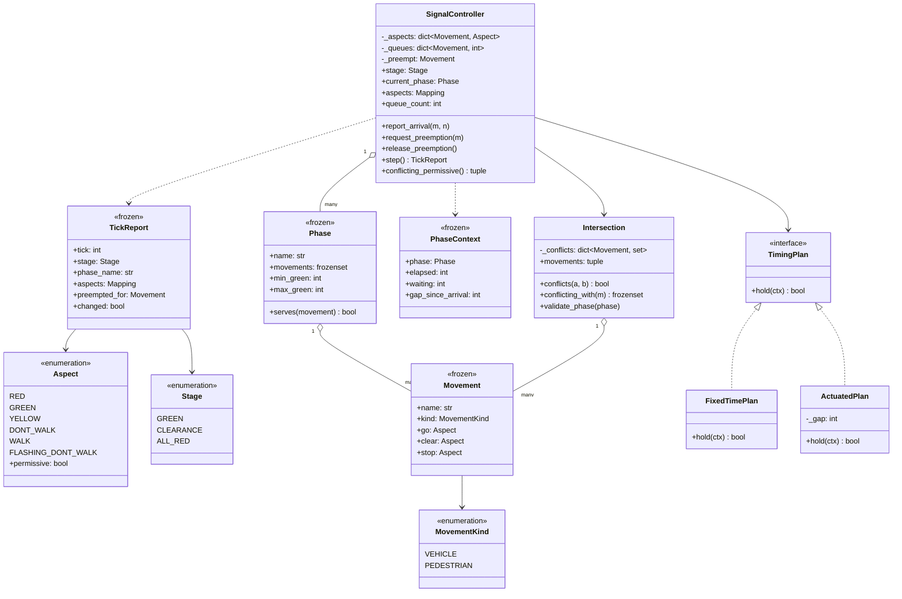

# 设计题解：交通信号灯（Traffic Signal）

## 题目与澄清

面试官的开场是："设计一个路口的交通信号灯控制器。四个方向，红绿黄轮流，还要能让救护车优先
通过。"这道题看着最简单，却是整个机器编码题库里**最容易写出一份没法测试的答案**的一道：大量
参考实现把 `time.sleep(green_duration)` 写进状态处理函数，再开一个后台线程 `while True` 跑
它。那份代码跑起来能看见灯在变，但你没法断言任何东西——而这道题真正要断言的，是一条会撞死
人的不变式。值得当场问清楚的是：

- **时间怎么推进？** 这是题眼，也是第一个要抢答的问题。我的答案是：控制器提供一个
  `step()`，推进一个 tick（一格仿真时间）；真实时间只通过注入的时钟进入事件的时间戳，逻辑
  里没有任何 `sleep`。谁来每秒调一次 `step()` 是部署问题——可以是实时循环，可以是仿真器，
  可以是测试里的一个 `for`。把这句话说出口，面试官会立刻知道你打算怎么证明它是对的。
- **"安全"到底怎么定义？** 大多数人会说"南北绿的时候东西必须红"。这句话是**结论**不是定义。
  真正的定义是：**任意两个互相冲突的流向（movement），不能同时放行**。北进口和南进口不冲突
  （所以同相位），北进口的左转和南进口的直行冲突（所以不能同相位）。把冲突写成一张图而不是
  东西南北的 `if`，第 4 关加行人相位和左转箭头时，引擎才可能一行不改还依然安全。
- **黄灯之后要不要全红？** 必须问，而且这是本题最"内行"的一问。黄灯（清空段）让已经进入
  路口的车驶离，**全红段**（all-red）则是给它们真正离开留的余量。没有这一段，A 方向最后一辆
  车还在路口中央，B 方向的绿灯就已经亮了——不变式在稳态下成立，恰恰在切换的那一瞬间破掉。
  黄灯加全红合称**相位间隔**（intergreen），它就是这道题的安全余量。
- **配时是固定的还是感应的？** 要问，因为它决定"绿灯什么时候结束"这个判断该放在哪。
  定周期（fixed-time）与感应式（vehicle-actuated）是两套真实存在的方案，所以它值一个可替换
  的抽象；如果只有一种，就不该先写接口。
- **紧急车辆抢占能不能直接把红灯改成绿？** 不能，而且这是面试官最想听到的一句话：抢占改变
  的是"下一个相位是谁"，**不是"能不能跳过相位间隔"**。救护车要的是早几秒，不是把横向来车
  送进事故现场。同时要问：抢占有没有上限？没有上限的抢占就是一个饿死 bug。
- **要不要行人和左转？** 一般会留到第 4 关。提前说清楚你打算怎么接（多一个流向、多一个
  相位，引擎不动），可以在那一刻直接兑现。

**范围之外**：不做多路口绿波协调（那是把周期、绿信比、相位差三个量做全网优化，是一道系统
设计题）、不做自适应算法（SCOOT／SCATS 一类）、不做检测器硬件与故障降级（闪黄模式在追问里
说）、不做信号机的柜内互锁电路（真实世界里安全还有一层硬件保障，软件不是唯一防线）。

## 需求与分级

- **第 1 关（一个路口，约 15 分钟）**：四个进口道，相位序列是 南北绿 → 清空 → 全红 →
  东西绿 → 清空 → 全红 → ……；`step()` 推进一个 tick，注入时钟，任何地方都不许 `sleep`；
  安全不变式写成一次显式复核：**两个冲突流向永不同时放行**。对应 `Movement`、`Phase`、
  `Intersection`、`SignalController.step` 与 `conflicting_permissive()`。
- **第 2 关（配时方案可换，约 10 分钟）**：定周期与感应式两种方案可以整体替换。感应式在最短
  绿之后"只要车还在陆续到达就延长"，直到最长绿。同时把话说清楚：**全红清空段才是不变式在
  相位切换时仍然成立的原因**。对应 `TimingPlan`、`FixedTimePlan`、`ActuatedPlan`、`PhaseContext`。
- **第 3 关（紧急车辆抢占，约 10 分钟）**：某个流向请求放行，控制器**仍然要走完最短绿、
  清空段和全红**才切过去；救护车通过后恢复到原来的方案。抢占必须有上限。对应
  `request_preemption` / `release_preemption`、`_should_hold`、`_next_index`。
- **第 4 关（新相位，选做）**：行人相位（走 / 闪烁禁止通行 / 禁止通行 三段）或者保护左转
  箭头。判分点只有一个：**不许动相位引擎**。对应 `MovementKind`、`Movement.go/clear/stop`，
  以及测试里那两个只改数据的用例。

## 核心对象与职责

| 类 | 职责 | 它守住的不变式 |
|---|---|---|
| `Aspect` | 一个灯组此刻显示什么 | `permissive` 只有绿和"走"两种；黄与闪烁**不是**放行 |
| `Movement` | 一个流向：一股车流或一条人行横道 | 不可变可哈希；引擎只问它 `go`／`clear`／`stop` 三个问题 |
| `Phase` | 一组同时放行的流向 + 最短绿 / 最长绿 | 最短绿是安全参数不是调优参数；最长绿是防饿死上限 |
| `Intersection` | 路口的几何：流向集合与冲突图 | 拥有"安全"的定义；冲突对称；相位在启动时就被校验 |
| `PhaseContext` | 交给配时方案的只读快照 | 方案看得见数字，碰不到控制器的字典 |
| `TimingPlan` / `FixedTimePlan` / `ActuatedPlan` | 绿灯还要不要再保持一个 tick | 两个真实实现，所以抽象是挣来的 |
| `TickReport` | 一个 tick 之后的完整状态 | 不可变；`aspects` 是快照不是活视图 |
| `SignalController` | 相位轮转、抢占、每 tick 复核安全 | 冲突流向永不同时放行；切换必经清空 + 全红；排队表会缩；抢占有上限 |

关系上，`SignalController` **关联**（association）一个 `Intersection`：路口的几何比控制器
活得久（换一台信号机，路口还是那个路口），所以不是组合。`Phase` 引用 `Movement`，
`Movement` 是值对象，被路口和相位共享——同一个 `Movement("north")` 在两处是同一个值，这正是
它必须 frozen 且可哈希的原因。`TimingPlan` 是构造时注入的策略，控制器不创建也不拥有它。

这份设计里**没有** `Road` 类和 `TrafficLight` 类。很多参考实现有：`Road` 持有一个
`TrafficLight`，`TrafficLight` 持有一个颜色和三个时长。它们是壳——`Road` 只把调用转发给灯，
灯只存一个枚举值；两个类加起来守不住任何一条不变式，反而把"安全"这件事拆散在三个对象里，
谁也说不清完整的判据在哪。这里改成：显示状态是控制器身上的一张 `dict[Movement, Aspect]`，
安全判据是 `Intersection` 身上的一张冲突图，两者在每一 tick 末尾对账一次。

也**没有**单例（singleton）控制器。"一个路口只有一台信号机"是业务事实，不是拦截构造函数
的理由；做成单例之后，一个进程里跑两个路口的仿真就成了不可能，而这恰恰是这道题最有用的
测试场景（上面两个第 4 关的用例各造了一个路口）。

反过来，`Intersection` **是**一个挣来的类：它有一条只有它能守住的不变式（冲突对称、相位
内部无冲突），有一个只有它能回答的问题（这两个流向能不能同时放行）。`Movement` 也是：
`go`／`clear`／`stop` 三个属性把"行人和机动车的显示序列不同"这件事收在一处，引擎因此对
两者一视同仁。



## 关键设计决策

### 一、安全定义做成冲突图，而不是"南北 / 东西"的分支

问题：`step()` 之后要能回答"现在安全吗"。这个判据写在哪、写成什么形状？

**选项 A：按方向硬编码。** 这是绝大多数参考实现的隐含做法——根本没有显式判据，安全靠
"NorthSouthGreen 状态里我记得把东西设成红"这种人工纪律保证：

```python
def handle_north_south_green(self) -> None:
    self.lights[Direction.NORTH].set(GREEN)
    self.lights[Direction.SOUTH].set(GREEN)
    self.lights[Direction.EAST].set(RED)   # 忘了这一行，编译器不会说话
    self.lights[Direction.WEST].set(RED)
```

它的致命处不是丑，而是**没有任何东西在检查它**。第 4 关加一个左转箭头，你要在每一个状态
处理函数里补一行；漏掉一处，代码照跑，路口出事。

**选项 B：把"哪两个流向冲突"做成数据。**

```python
conflicts = [(ns, ew) for ns in (NORTH, SOUTH) for ew in (EAST, WEST)]
intersection = Intersection("main-st-x-1st-ave", movements, conflicts)
```

于是安全判据变成一个和方向无关的函数：

```python
def conflicting_permissive(self) -> tuple[tuple[Movement, Movement], ...]:
    live = sorted((m for m, a in self._aspects.items() if a.permissive), key=lambda m: m.name)
    return tuple((a, b) for a, b in itertools.combinations(live, 2)
                 if self._intersection.conflicts(a, b))
```

**选择 B。** 它买到三样东西：(1) 判据只有一处，加流向不会漏；(2) 它可以在**启动时**就查
一遍每个相位（`validate_phase`），把"相位里放了两个冲突流向"这种配置错误变成启动失败，而不
是运行到半夜才撞车；(3) 它让性质测试成为可能——在几十个种子上各跑几百个 tick，每一 tick 问一次
"`conflicting_permissive()` 是不是空的"，这是本题最强的证据。

关于这条复核该写成 `assert` 还是抛异常：题目常说"把安全不变式写成一个断言"，但生产代码里
裸 `assert` 是错的——`python -O` 会把它整条删掉，而这是一条会撞死人的不变式，恰恰不能在
优化模式下消失。所以实现是一个显式检查加 `SafetyViolationError`；"断言"这个词描述的是
**精神**（每一步都复核），不是那个关键字。

### 二、tick 驱动 + 注入时钟，而不是 `sleep` + 后台线程

这是本题解和主流参考实现最大的分歧，也是最值得当面讲清楚的一处。

**选项 A：状态处理函数里 `sleep`。** 流传最广的写法长这样：亮绿 → `time.sleep(green/1000)`
→ 转黄 → `time.sleep(yellow/1000)` → 转红 → 切换到下一个状态对象；外面套一个
`while self._running` 的后台线程。

它能演示，但代价是整份设计**不可测**：要验证"抢占之后确实走了全红"，你必须真的等几秒；要
跑一万个 tick 的随机演练，你要等三个小时。更深的问题是职责错位——控制器不该知道"一秒有
多长"，那是驱动它的那层的事。

**选项 B：`step()` 一格一格走。** 控制器只知道"又过去一格"，一格是一秒还是一百毫秒由外面
决定；真实时间只出现在 `TickReport.at` 这个时间戳里，而它由注入的 `clock()` 提供。

```python
def step(self) -> TickReport:
    self._tick += 1
    if self._stage is Stage.GREEN:
        self._elapsed += 1
        self._drain()
        if not self._should_hold():
            self._begin_clearance()
    else:
        self._stage_left -= 1
        ...
    self._verify()
    return TickReport(...)
```

**选择 B。** 判据很硬：整套测试跑完是 0.11 秒，其中包括二十四个种子、共一万四千多个 tick 的
随机演练。而且"一个
tick 只做一件事"让每一步都能被单独断言——测试可以写出
`stages == [GREEN, GREEN, GREEN, CLEARANCE, CLEARANCE, ALL_RED, GREEN]` 这样精确到格的期望。
代价是调用方要自己驱动循环，这正是它该做的事。

顺带一提：因为控制器完全被外部驱动、内部没有线程，这道题**根本不需要锁**。这是一件要主动
说出来的事——不是"我忘了并发"，而是"我把并发挡在边界之外了"。真要多线程喂到达数据，加锁
的地方只有 `report_arrival` 和 `step`，而且两者都短。

### 三、全红清空：不变式在切换的那一瞬间才最危险

稳态很好证：一个相位绿的时候，别的流向都是红。难的是**切换的那几格**。

假设没有清空段，直接从"南北绿"跳到"东西绿"。在灯变的那一刻，南北向最后一辆车正以 50 公里
时速进入路口中央——它既没有停下的距离，也来不及驶出。此时东西向的绿灯亮了。不变式在**代码
里**是成立的（南北已经是红），在**物理上**是破的。

所以相位切换必须是三段：

1. **清空段（clearance）**：本相位的流向显示黄（行人显示闪烁的"禁止通行"）。语义是"不要
   再进来了，已经进来的赶紧走"。注意黄灯的 `permissive` 必须是 `False`——把黄当成"还能走"
   是最常见的语义错误。
2. **全红段（all-red）**：所有流向一起红。这一段的长度在真实工程里由路口宽度和进口道限速
   算出来（车驶过路口的时间），本设计做成一个构造参数，并在文章里说明它本该按相位计算。
3. 下一个相位的绿。

代码上，这三段就是 `Stage` 枚举的三个成员加一个倒计时：

```python
def _begin_clearance(self) -> None:
    for movement in self.current_phase.movements:
        self._aspects[movement] = movement.clear
    self._stage = Stage.CLEARANCE
    self._stage_left = self._clearance
```

这里**没有用状态模式**（State），这是本题"更简单的答案才是对的"那一处。很多实现给每个颜色
写一个 `GreenState` / `YellowState` / `RedState` 类，再给路口写一个 `NorthSouthGreenState` /
`EastWestGreenState`。判据是这样的：状态模式值得上，当每个状态都有**成套的、彼此不同的进入
与退出副作用**时。这道题里三个阶段的行为差异只有"给哪些流向设哪个显示"和"倒计时多少"，
用一个枚举加三个分支写完只要十几行；换成六个类，加一个相位就要再加两个类，而且"相位轮转"
这条主线被拆到六个文件里，再没有一个地方能一眼看完。

### 四、配时方案用策略，而且它是挣来的

第 2 关要求定周期和感应式可以整体替换。这一次抽象是**真的**该有：两个实现都存在、都带配置
状态（定周期的每相位时长表、感应式的断流间隔），而且它们的差别不是一个参数能表达的。

```python
class TimingPlan(Protocol):
    def hold(self, ctx: PhaseContext) -> bool: ...
```

接口只有一个问题：**绿灯还要不要再保持一个 tick**。把决策收敛成这一个布尔量，是这个设计
最舒服的地方——相位轮转、清空、全红、抢占全都不归方案管，方案只管"绿灯够了没有"。

感应式的实现就是教科书上的**断流**（gap-out）：

```python
def hold(self, ctx: PhaseContext) -> bool:
    if ctx.elapsed < ctx.phase.min_green:
        return True                       # 最短绿是安全底线，谁也不能越过
    if ctx.elapsed >= ctx.phase.max_green:
        return False                      # 最长绿是公平上限，车再多也得让路
    return ctx.waiting > 0 or ctx.gap_since_arrival <= self._gap
```

三行里藏着两条不变式。**最短绿**保证已经起步的车有路可走；**最长绿**保证一条车流不断的主路
不能让支路永远等下去——没有它，"有车就延长"在早高峰就是一个饿死 bug。

方案拿到的是 `PhaseContext` 这个**只读快照**（相位、已走时长、排队总数、距上一次到达几格），
不是控制器本身。这样方案既改不了控制器的状态，也不需要知道队列是用字典还是堆存的；把控制器
的 `self` 传给策略，是这道题里最容易埋下的耦合。

### 五、抢占：不许跳过间隔，必须有上限，恢复就是继续环

紧急车辆抢占有三个容易写错的地方，每一个都值一句话。

**第一，不能把红灯直接改绿。** 抢占改变的是"下一个相位是谁"：

```python
def _next_index(self) -> int:
    if self._preempt is not None:
        for offset in range(len(self._phases)):
            index = (self._index + offset) % len(self._phases)
            if self._phases[index].serves(self._preempt):
                return index
    return (self._index + 1) % len(self._phases)
```

切换路径照旧：当前绿 → 清空 → 全红 → 目标相位绿。唯一被抢占缩短的是**当前绿灯的剩余时间**，
而且连这个也要受最短绿保护：

```python
if self._preempt is not None:
    if phase.serves(self._preempt):
        return True                           # 正在为它放行，保持
    return self._elapsed < phase.min_green    # 最短绿一走完就让路
```

**第二，抢占必须有上限。** 如果"救护车没走就一直绿"，一个忘了发释放信号的设备（或者一串
连续到达的紧急车辆）就能让横向永远红。`max_preempt_ticks` 是这条的兜底，测试里专门有一个
用例断言：上限一到，控制器立刻回到它的方案。

**第三，"恢复"是什么意思要说清楚。** 本设计的恢复是：从被抢占到的那个相位**继续环**，而不是
跳回被打断的相位再补完它。理由是公平——被打断的那个相位刚刚已经拿到了至少最短绿，而环上
其它相位一格都没拿到。真实的信号机还会做一段**过渡恢复**（transition），用几个周期慢慢把
相位差拉回和相邻路口协调的位置；那是绿波协调的一部分，本设计不做，但要能说出它叫什么。

## 代码走读

先看三处决策在代码里的落点，再看全文。

**第一处，`Movement.go` / `clear` / `stop` 是第 4 关零改动的全部秘密。** 引擎在
`_show_go`、`_begin_clearance`、`_enter_all_red` 三处分别问流向要这三个显示，从不关心它是
车还是人。于是行人的"走 / 闪烁禁止通行 / 禁止通行"和机动车的"绿 / 黄 / 红"走的是同一段
代码；测试 `test_a_pedestrian_phase_is_just_another_movement` 只造了一个
`Movement("ped-ns", PEDESTRIAN)` 和一张新的冲突表，`SignalController` 一个字没改。

**第二处，`step()` 里的分支顺序是有讲究的。** 绿灯阶段先 `self._elapsed += 1` 再 `_drain()`
再问方案要不要保持——先放车再决定，因为"这一格有没有车走"会影响 `waiting`，而方案要看的是
本格结束时的状况。清空与全红阶段共用一个倒计时分支，因为它们的行为只差"进入时把谁设成什么"。
最后统一 `_verify()`：无论这一 tick 走了哪条路径，出口只有一个，复核就只需要写一次。

**第三处，`_drain()` 里的删键。** 队列清空的流向必须从 `_queues` 里消失：

```python
left = waiting - self._discharge
if left > 0:
    self._queues[movement] = left
else:
    del self._queues[movement]
```

一个信号机会连续跑几个月，`_queues` 如果只增不减，每个流向会留下一条计数为 0 的僵尸记录，
而且 `PhaseContext.waiting` 的求和会越来越慢。`queue_count` 这个只读属性就是为了让测试能
断言"它真的缩回去了"而存在的。

%% code:begin solution.py %%
```python
"""交通信号灯（Traffic Signal）——按 tick 推进的相位引擎、可换配时方案、紧急车辆抢占。

核心思路：路口的安全定义不是"南北和东西不能同时绿"，而是一张**冲突图**——哪两个流向
（movement）不能同时放行。相位（phase）只是"一组互不冲突、同时放行的流向"，引擎因此完全
不认识东南西北，第 4 关加行人相位或左转箭头只是多造一个 `Movement` 和一个 `Phase`。
时间靠 `step()` 一格一格走，全程没有 `time.sleep`，真实时间只通过注入的 `clock` 进入时间戳，
所以几千个 tick 的随机压力测试可以确定性复现。相位切换必须经过黄灯 + 全红清空，**全红间隔
正是不变式在切换瞬间仍然成立的原因**；每一 tick 结束都按冲突图复核一次，违反就抛异常。
"""

from __future__ import annotations

import itertools
from collections.abc import Callable, Iterable, Mapping, Sequence
from dataclasses import dataclass
from datetime import datetime
from enum import Enum
from types import MappingProxyType
from typing import Protocol

Clock = Callable[[], datetime]


class SignalError(Exception):
    """本设计全部失败路径的公共基类。"""


class UnknownMovementError(SignalError):
    """这个流向不属于本路口。"""


class ConflictingPhaseError(SignalError):
    """相位里放进了两个互相冲突的流向——这是配置错误，必须在启动时就炸掉。"""


class SafetyViolationError(SignalError):
    """运行中两个冲突流向同时放行了。任何一次都算严重故障，不允许被吞掉。"""


class Aspect(Enum):
    """一个灯组此刻显示什么。机动车和行人用的是**同一套三段语义**，只是名字不同。"""

    RED = "red"
    GREEN = "green"
    YELLOW = "yellow"
    DONT_WALK = "dont_walk"
    WALK = "walk"
    FLASHING_DONT_WALK = "flashing_dont_walk"

    @property
    def permissive(self) -> bool:
        """此刻是否允许进入路口。黄灯和闪烁的"禁止通行"都**不是**放行——它们是清空。"""
        return self is Aspect.GREEN or self is Aspect.WALK


class MovementKind(Enum):
    VEHICLE = "vehicle"
    PEDESTRIAN = "pedestrian"


class Stage(Enum):
    """一个相位内部的三段。清空段与全红段合起来构成"相位间隔"（intergreen）。"""

    GREEN = "green"
    CLEARANCE = "clearance"
    ALL_RED = "all_red"


@dataclass(frozen=True, slots=True)
class Movement:
    """一个**流向**：从某个进口道往某个方向走的一股交通流，或者一条人行横道。

    不可变、可哈希，因为它要当字典键和集合成员。`go` / `clear` / `stop` 这三个属性是整个
    设计的枢纽：相位引擎只会问流向这三个问题，于是行人的 走-闪-禁 和机动车的 绿-黄-红
    在引擎眼里是同一件事，加行人相位不需要动引擎一行。
    """

    name: str
    kind: MovementKind = MovementKind.VEHICLE

    @property
    def go(self) -> Aspect:
        return Aspect.WALK if self.kind is MovementKind.PEDESTRIAN else Aspect.GREEN

    @property
    def clear(self) -> Aspect:
        return (Aspect.FLASHING_DONT_WALK if self.kind is MovementKind.PEDESTRIAN
                else Aspect.YELLOW)

    @property
    def stop(self) -> Aspect:
        return Aspect.DONT_WALK if self.kind is MovementKind.PEDESTRIAN else Aspect.RED


@dataclass(frozen=True, slots=True)
class Phase:
    """一组同时放行的流向，加上它的最短绿与最长绿。

    最短绿不是调优参数而是安全参数：绿灯刚亮一格就跳黄，已经起步的司机没有停车距离。
    最长绿是防饿死的上限——感应式方案再怎么"有车就延长"也不能越过它。
    """

    name: str
    movements: frozenset[Movement]
    min_green: int = 4
    max_green: int = 12

    def serves(self, movement: Movement) -> bool:
        return movement in self.movements


class Intersection:
    """路口的几何：有哪些流向、哪两个流向互相冲突。它**拥有"安全"的定义**。

    不变式：冲突关系是对称的，且没有流向和自己冲突；任何相位在被引擎接受之前，都必须通过
    `validate_phase`——配置期就能发现的错误绝不留到运行期。
    """

    def __init__(self, name: str, movements: Iterable[Movement],
                 conflicts: Iterable[tuple[Movement, Movement]]) -> None:
        self._name = name
        self._movements = tuple(movements)
        self._conflicts: dict[Movement, set[Movement]] = {m: set() for m in self._movements}
        for left, right in conflicts:
            self._require(left)
            self._require(right)
            if left == right:
                raise ConflictingPhaseError(f"movement {left.name!r} cannot conflict with itself")
            self._conflicts[left].add(right)
            self._conflicts[right].add(left)  # 冲突天然对称，只让配置写一遍

    @property
    def name(self) -> str:
        return self._name

    @property
    def movements(self) -> tuple[Movement, ...]:
        """全部流向的只读元组；内部的集合从不交出去。"""
        return self._movements

    def conflicting_with(self, movement: Movement) -> frozenset[Movement]:
        return frozenset(self._conflicts[self._require(movement)])

    def conflicts(self, left: Movement, right: Movement) -> bool:
        return right in self._conflicts[self._require(left)]

    def validate_phase(self, phase: Phase) -> None:
        """相位内部不能有互相冲突的流向。启动时查一次，比运行时抛一百次有用。"""
        for left, right in itertools.combinations(sorted(phase.movements, key=lambda m: m.name), 2):
            if self.conflicts(left, right):
                raise ConflictingPhaseError(
                    f"phase {phase.name!r} puts conflicting {left.name!r} and {right.name!r} together")

    def _require(self, movement: Movement) -> Movement:
        if movement not in self._conflicts:
            raise UnknownMovementError(f"{movement.name!r} is not a movement of {self._name!r}")
        return movement


@dataclass(frozen=True, slots=True)
class PhaseContext:
    """交给配时方案的**只读快照**：它要做决定所需要的全部信息，一个字段不多。

    方案拿到的是数字，不是控制器的字典——它既改不了控制器的状态，也不需要控制器的锁。
    """

    phase: Phase
    elapsed: int              # 本相位绿灯已经持续了几个 tick
    tick: int
    waiting: int              # 本相位各流向上还排着多少辆（人）
    gap_since_arrival: int    # 距本相位上一次有车到达过了几个 tick


class TimingPlan(Protocol):
    """配时方案：绿灯还要不要再保持一个 tick。

    这里用协议（Protocol）而不是普通函数，是因为**真的有两个实现**，而且它们都带配置状态
    （定周期的每相位时长表、感应式的断流间隔）。只有一个实现时不该先写接口。
    """

    def hold(self, ctx: PhaseContext) -> bool:
        ...


class FixedTimePlan:
    """定周期（fixed-time）：每个相位绿多久写死在方案里，和路上有没有车无关。

    优点是可预测、可以和相邻路口做绿波协调；缺点是深夜空无一人时仍然让主路等满一个周期。
    """

    def __init__(self, green: Mapping[str, int] | None = None, default: int = 10) -> None:
        self._green = dict(green or {})
        self._default = default

    def hold(self, ctx: PhaseContext) -> bool:
        target = max(ctx.phase.min_green, self._green.get(ctx.phase.name, self._default))
        return ctx.elapsed < target


class ActuatedPlan:
    """感应式（vehicle-actuated）：最短绿之后，只要车还在陆续到达就延长，直到最长绿。

    `gap` 是**断流间隔**（gap-out）：连续 `gap` 个 tick 没有新车到达，就认为这股车流断了，
    立刻切相位。最长绿是硬上限——没有它，一条车流不断的主路可以让支路永远等下去。
    """

    def __init__(self, gap: int = 3) -> None:
        self._gap = gap

    def hold(self, ctx: PhaseContext) -> bool:
        if ctx.elapsed < ctx.phase.min_green:
            return True
        if ctx.elapsed >= ctx.phase.max_green:
            return False
        return ctx.waiting > 0 or ctx.gap_since_arrival <= self._gap


@dataclass(frozen=True, slots=True)
class TickReport:
    """一个 tick 之后路口的完整状态，自带全部上下文。

    这里**没有观察者模式**：`step()` 本来就被驱动循环每一 tick 调用一次，把这一刻发生的事
    直接当返回值交出去，比再挂一套订阅回调更直接。`aspects` 是快照，不是控制器的活字典。
    """

    tick: int
    at: datetime
    stage: Stage
    phase_name: str
    aspects: Mapping[Movement, Aspect]
    preempted_for: Movement | None
    changed: bool  # 这一 tick 是否发生了阶段切换（绿→清空、清空→全红、全红→下一个绿）


class SignalController:
    """一个路口的相位引擎：按环（ring）轮转相位，处理抢占，每一 tick 复核一次安全。

    不变式：
    1. **任意时刻，冲突图上相邻的两个流向不会同时 `permissive`。** 每一 tick 末尾按冲突图
       复核，违反就抛 `SafetyViolationError`——不用裸 `assert`，因为 `python -O` 会把它删掉，
       而这是一条会撞死人的不变式。
    2. 相位切换必须走 绿 → 清空（黄／闪） → 全红 → 下一个绿。**全红段是不变式在切换瞬间
       仍然成立的原因**：上一相位的车驶离路口需要时间，没有这段间隔，两个方向的绿之间就是
       一个物理上重叠的窗口。
    3. `_queues` 只记还在排队的流向，排空的流向立刻删键——排队字典必须会缩，否则一个跑了
       一整天的路口会攒下每个流向一条计数为 0 的僵尸记录。
    4. 抢占有上限 `max_preempt_ticks`：没有上限的抢占就是一个饿死 bug。
    """

    def __init__(self, intersection: Intersection, phases: Sequence[Phase],
                 plan: TimingPlan, clock: Clock, *,
                 clearance_ticks: int = 3, all_red_ticks: int = 2,
                 discharge_per_tick: int = 2, max_preempt_ticks: int = 20) -> None:
        if not phases:
            raise SignalError("a controller needs at least one phase")
        for phase in phases:
            intersection.validate_phase(phase)
            for movement in phase.movements:
                intersection.conflicting_with(movement)  # 顺手校验流向属于本路口
        self._intersection = intersection
        self._phases = tuple(phases)
        self._plan = plan
        self._clock = clock
        self._clearance = clearance_ticks
        self._all_red = all_red_ticks
        self._discharge = discharge_per_tick
        self._max_preempt = max_preempt_ticks
        self._index = 0
        self._stage = Stage.GREEN
        self._stage_left = 0
        self._elapsed = 0
        self._tick = 0
        self._preempt: Movement | None = None
        self._preempt_left = 0
        self._queues: dict[Movement, int] = {}
        self._last_arrival: dict[Movement, int] = {}
        self._aspects: dict[Movement, Aspect] = {m: m.stop for m in intersection.movements}
        self._show_go(self._phases[0])
        self._verify()

    # ---- 只读视图 ---------------------------------------------------------------

    @property
    def tick_count(self) -> int:
        return self._tick

    @property
    def stage(self) -> Stage:
        return self._stage

    @property
    def current_phase(self) -> Phase:
        return self._phases[self._index]

    @property
    def preempted_for(self) -> Movement | None:
        return self._preempt

    @property
    def aspects(self) -> Mapping[Movement, Aspect]:
        """当前各流向的显示，只读快照；控制器从不把自己的字典交出去。"""
        return MappingProxyType(dict(self._aspects))

    @property
    def queue_count(self) -> int:
        """还有多少个流向在排队。排空的流向必须从排队表里消失，这个数字就是证据。"""
        return len(self._queues)

    def aspect_of(self, movement: Movement) -> Aspect:
        return self._aspects[self._intersection_movement(movement)]

    def waiting(self, movement: Movement) -> int:
        return self._queues.get(self._intersection_movement(movement), 0)

    def conflicting_permissive(self) -> tuple[tuple[Movement, Movement], ...]:
        """当前同时放行却互相冲突的流向对。安全时返回空元组——这就是那条不变式。"""
        live = sorted((m for m, a in self._aspects.items() if a.permissive), key=lambda m: m.name)
        return tuple((a, b) for a, b in itertools.combinations(live, 2)
                     if self._intersection.conflicts(a, b))

    # ---- 外部输入 ---------------------------------------------------------------

    def report_arrival(self, movement: Movement, count: int = 1) -> None:
        """检测器报告有车（或按钮报告有行人）到达某个流向。"""
        movement = self._intersection_movement(movement)
        if count <= 0:
            return
        self._queues[movement] = self._queues.get(movement, 0) + count
        self._last_arrival[movement] = self._tick

    def request_preemption(self, movement: Movement) -> None:
        """紧急车辆抢占：某个流向要求放行。

        它**不会**让当前绿灯立刻跳黄：最短绿必须走完（已经起步的车没有停车距离），然后照常
        经过清空 + 全红才切过去。抢占改变的是"下一个相位是谁"，不是"能不能跳过间隔"。
        """
        movement = self._intersection_movement(movement)
        if not any(p.serves(movement) for p in self._phases):
            raise UnknownMovementError(f"no phase serves {movement.name!r}")
        self._preempt = movement
        self._preempt_left = self._max_preempt

    def release_preemption(self) -> None:
        """紧急车辆通过了。控制器从当前相位继续它的环，不跳回被打断的那个相位。"""
        self._preempt = None
        self._preempt_left = 0

    # ---- 推进 -------------------------------------------------------------------

    def step(self) -> TickReport:
        """推进一个 tick。一个 tick 只做一件事，所以每一步都能被单独断言，也不需要等待。"""
        self._tick += 1
        changed = False
        if self._stage is Stage.GREEN:
            self._elapsed += 1
            self._drain()
            if not self._should_hold():
                self._begin_clearance()
                changed = True
        else:
            self._stage_left -= 1
            if self._stage_left <= 0:
                if self._stage is Stage.CLEARANCE:
                    self._enter_all_red()
                else:
                    self._begin_green(self._next_index())
                changed = True
        if self._preempt is not None:
            self._preempt_left -= 1
            if self._preempt_left <= 0:
                self.release_preemption()
        self._verify()
        return TickReport(tick=self._tick, at=self._clock(), stage=self._stage,
                          phase_name=self.current_phase.name, aspects=self.aspects,
                          preempted_for=self._preempt, changed=changed)

    def run(self, ticks: int) -> tuple[TickReport, ...]:
        """连推若干 tick，返回每一 tick 的报告。演示和测试都用它。"""
        return tuple(self.step() for _ in range(ticks))

    # ---- 内部 -------------------------------------------------------------------

    def _intersection_movement(self, movement: Movement) -> Movement:
        if movement not in self._aspects:
            raise UnknownMovementError(f"{movement.name!r} is not a movement of this intersection")
        return movement

    def _should_hold(self) -> bool:
        phase = self.current_phase
        if self._preempt is not None:
            if phase.serves(self._preempt):
                return True  # 正在为紧急车辆放行，保持到释放或到上限
            return self._elapsed < phase.min_green  # 最短绿一走完就让路
        return self._plan.hold(self._context(phase))

    def _context(self, phase: Phase) -> PhaseContext:
        waiting = sum(self._queues.get(m, 0) for m in phase.movements)
        last = [self._last_arrival[m] for m in phase.movements if m in self._last_arrival]
        gap = self._tick - max(last) if last else self._tick
        return PhaseContext(phase=phase, elapsed=self._elapsed, tick=self._tick,
                            waiting=waiting, gap_since_arrival=gap)

    def _next_index(self) -> int:
        """下一个相位：正常按环轮转；有抢占请求时，直接转到第一个服务它的相位。"""
        if self._preempt is not None:
            for offset in range(len(self._phases)):
                index = (self._index + offset) % len(self._phases)
                if self._phases[index].serves(self._preempt):
                    return index
        return (self._index + 1) % len(self._phases)

    def _drain(self) -> None:
        """绿灯期间每 tick 放走若干辆；队列清空的流向立刻从排队表里删掉。"""
        for movement in self.current_phase.movements:
            waiting = self._queues.get(movement)
            if waiting is None:
                continue
            left = waiting - self._discharge
            if left > 0:
                self._queues[movement] = left
            else:
                del self._queues[movement]

    def _begin_clearance(self) -> None:
        for movement in self.current_phase.movements:
            self._aspects[movement] = movement.clear
        self._stage = Stage.CLEARANCE
        self._stage_left = self._clearance

    def _enter_all_red(self) -> None:
        """全红：所有流向一起停。这一段是相位间隔的后半截，不变式全靠它。"""
        for movement in self._aspects:
            self._aspects[movement] = movement.stop
        self._stage = Stage.ALL_RED
        self._stage_left = self._all_red

    def _begin_green(self, index: int) -> None:
        self._index = index
        self._elapsed = 0
        self._stage = Stage.GREEN
        self._show_go(self._phases[index])

    def _show_go(self, phase: Phase) -> None:
        for movement in self._aspects:
            self._aspects[movement] = movement.go if phase.serves(movement) else movement.stop

    def _verify(self) -> None:
        clashes = self.conflicting_permissive()
        if clashes:
            names = ", ".join(f"{a.name}|{b.name}" for a, b in clashes)
            raise SafetyViolationError(f"conflicting movements are permissive at tick {self._tick}: {names}")


NORTH = Movement("north")
SOUTH = Movement("south")
EAST = Movement("east")
WEST = Movement("west")


def four_way_intersection() -> tuple[Intersection, tuple[Phase, ...]]:
    """标准十字路口：四个进口道，南北一相位、东西一相位。

    同向的两个进口道（北与南）互不冲突，所以它们在同一个相位里；跨向的每一对都冲突。
    冲突写成数据而不是 `if direction in ("north", "south")`，引擎才可能对第 4 关的新流向
    一无所知却依然安全。
    """
    movements = (NORTH, SOUTH, EAST, WEST)
    conflicts = [(ns, ew) for ns in (NORTH, SOUTH) for ew in (EAST, WEST)]
    intersection = Intersection("main-st-x-1st-ave", movements, conflicts)
    phases = (Phase("north-south", frozenset({NORTH, SOUTH})),
              Phase("east-west", frozenset({EAST, WEST})))
    return intersection, phases


if __name__ == "__main__":
    from datetime import timedelta

    now = datetime(2026, 4, 1, 8, 0)

    def clock() -> datetime:
        return now

    junction, ring = four_way_intersection()
    controller = SignalController(junction, ring, ActuatedPlan(gap=2), clock,
                                  clearance_ticks=2, all_red_ticks=1)
    controller.report_arrival(EAST, 6)
    for _ in range(18):
        now = now + timedelta(seconds=2)
        report = controller.step()
        if report.changed:
            shown = {m.name: a.value for m, a in report.aspects.items() if a.permissive}
            print(f"t={report.tick:>3} {report.stage.value:<9} {report.phase_name:<12} go={shown}")
    print("queues left:", controller.queue_count, "conflicts:", controller.conflicting_permissive())
```
%% code:end %%

## 测试与自检

这套测试没有一次 `sleep`，没有一次真实时间参与判断，随机种子逐个固定——二十四轮随机演练
共一万四千多个 tick，跑完只要一百毫秒，而且每一次失败都能连种子一起原样复现。

断言全部落在公开视图上：`stage`、`current_phase`、`aspects`、`aspect_of`、`queue_count`、
`waiting`、`conflicting_permissive()`。一个私有属性都不碰，因为 `starter.py` 是给学习者填的，
他可能用别的内部表示（比如用一个倒计时字典代替 `Stage` 枚举）；断言 `_stage` 的测试会判一份
正确的答案不及格。

值得钉死的不变式有五条：

1. **相位序列精确到格**：`[GREEN, GREEN, GREEN, CLEARANCE, CLEARANCE, ALL_RED, GREEN]`。
   tick 驱动的设计才写得出这种测试。
2. **清空段和全红段没有任何流向放行**——这条比"南北红"强，因为它是按 `permissive` 判的，
   把黄灯误标成放行会立刻被抓住。
3. **两种方案在同一份需求下给出不同的绿灯长度**：定周期不管有没有车都放满，感应式最短绿
   一到、断流就走。这是"策略真的被替换了"的证据，而不是"接口写了但只有一个实现"。
4. **抢占必经间隔**：请求抢占之后的阶段序列里必须出现 `ALL_RED`，而且目标相位的绿在它之后。
   另有一条断言抢占上限：上限一到，控制器回到方案。
5. **排队表会缩**：放空之后 `queue_count == 0`。

最有说服力的是最后那个**性质测试**（property test）：**二十四个种子**，每个种子 600 个 tick，
每个流向每格 25% 概率到达一到三辆车，另有随机的抢占请求与释放；每一 tick 断言两件事——
`conflicting_permissive() == ()`（安全），以及每个流向距上一次放行的间隔不超过一个上界
（公平，没有饿死）。定点测试只能覆盖你想到的时序，随机演练覆盖你没想到的——这道题里"抢占
恰好发生在全红的最后一格"这类组合，手写用例几乎不可能穷举。

**那个上界必须是推出来的，不是跑出来的。** 写一个自己观察到的数字（"跑了一遍最长等了 40 格，
那就断言 40 吧"）是一个换个种子就会翻车的定时炸弹，而且它回答不了面试官真正在问的那句话：
你凭什么说它永远不会饿死？上界要从控制器自己的参数算出来：

```python
intergreen   = clearance_ticks + all_red_ticks            # 每段绿灯之后必付的相位间隔
normal_slot  = max_green + intergreen                     # 计划驱动下一个相位最多占多久
preempt_slot = max_green + max_preempt_ticks + intergreen # 被抢占按住的相位最多占多久
bound = intergreen + (len(phases) - 1) * normal_slot + preempt_slot + 1
```

逐项读：等待从上一次放行结束算起，先付一次 `intergreen`；然后因为 `_next_index` 在没有抢占
时**只沿环向前走**，其余每个相位最多各插进来一次，各占一个 `normal_slot`；再加一个
`preempt_slot`，因为抢占会**改写**下一个相位的选择——它既可能跳过几个相位，也可能把当前相位
再点一次（请求落在清空段里时就会这样），所以必须为它单独留一个相位区间，而且那个区间的绿
可以先按计划走满最长绿、再被抢占多按住 `max_preempt_ticks` 格；末尾 `+ 1` 是因为等待从上
一次放行的那一 tick 数起。前提只有一条：**一个等待窗口里最多发生一次抢占**——演练把请求的
冷却期设成 `bound + 1` 来保证它，两次抢占之间至少隔着一整个上界，不可能双双落进同一个窗口。

代入本题的默认参数（两个相位、最长绿 12、清空 2、全红 1、抢占上限 10）得到 `bound = 44`；
二十四个种子跑下来实际最坏等待是 30 格。两个数字都要在面试里说出口：44 是你**证明**的，
30 是你**量到**的，前者不依赖运气，后者说明上界没有宽松到毫无意义（测试里另有一条
`worst * 2 >= bound` 盯着这件事，防止有人把上界改大来敷衍一次失败）。

两分钟怎么演示给面试官看：跑 `python solution.py` 的 `__main__`，它只打印**发生切换的那些
tick**，于是七八行输出就把 绿 → 清空 → 全红 → 另一相位绿 这条主线讲完了，最后一行打印
`conflicting_permissive()` 是空元组、排队已清空。然后说一句："同样的循环我在二十四个种子上
各跑了 600 tick，随机到达加随机抢占，安全断言一次都没破，等待也没越过我从参数推出来的那个
上界。"

## 扩展与追问

### 新需求

- **行人按钮与最短行人相位。** 按钮就是 `report_arrival(ped_movement)`；行人相位有一条额外
  约束——"走"的时间必须够横穿马路，所以它的 `min_green` 由路宽和步速算出来，比车道大得多。
  改的只有构造相位时的一个数字，引擎不动。
- **保护左转与"迟启／早断"。** 保护左转是一个新流向加一个新相位（测试里已经做了）。
  "迟启"（lagging left，左转箭头放在直行之后）不过是改相位在环里的顺序；"早断"是让直行
  提前进入清空——这一条需要引擎支持"相位内部分段"，是本设计目前没有的能力，要加就是在
  `Phase` 里放一个子序列，而 `Stage` 的三段结构刚好能复用。
- **故障降级。** 检测器坏了要退回定周期，信号机自身故障要进闪黄（所有方向黄闪）或全红
  闪烁。闪黄是一个特殊"相位"——所有流向都不 `permissive`，所以它天然满足安全不变式，加进来
  不会破坏任何东西。
- **多个路口的绿波协调。** 需要在控制器之上加一层：给每个路口分配同一个周期长度、各自的
  绿信比和相位差。控制器需要暴露的新能力只有一个——"把当前周期对齐到某个基准时刻"。
  这已经是另一道题了，见 [[structure.state-machines|状态机（State Machines）]] 里关于
  状态机与外部同步的讨论。

### 并发与线程安全

- **本设计不需要锁**，因为它没有内部线程：时间由外部驱动，`step()` 是同步的。这是一个主动
  的设计选择，要说出口。
- 如果真的有多个线程喂检测器数据，临界区只有两处：`report_arrival` 里的"读队列再写队列"
  （复合操作，GIL 不保护），以及 `step()` 整体（它读写同一批状态）。一把 `threading.Lock`
  即可，争用可以忽略——检测器每秒几十条消息，`step()` 每秒一次。
- 更好的做法是不加锁：让检测器线程把到达事件写进一个 `queue.Queue`，驱动循环在每次
  `step()` 之前一次性排空它。这样所有状态变更都发生在同一个线程里，连锁都不需要。
- **真实信号机的安全不靠软件。** 柜内有一块硬件监视单元（conflict monitor），它独立地检测
  冲突绿并在毫秒级把路口切到闪黄。这一句值得说——它说明你知道软件不变式只是第一道防线。

### 持久化与规模

- **该落盘的是什么。** 配置（流向、冲突图、相位环、方案参数）落配置文件或数据库；运行数据
  （每个 tick 的相位、排队、抢占）落时序库，是事后做配时优化的原料。控制器自身的状态**不必**
  持久化：信号机重启后从全红开始重新起环是标准做法，而且比"恢复到断电前的相位"安全。
- **规模。** 一个城市几千个路口，每个路口的控制器是独立的进程／设备，彼此之间只通过协调层
  交换周期和相位差。这道题的对象模型天然可以横向铺开，因为它没有任何全局状态——这也是拒绝
  单例的实际收益之一。
- **仿真。** 同一份代码可以在仿真器里以每秒一万 tick 的速度跑一年的流量，用来评估一套配时
  方案。这是 tick 驱动设计最实在的回报：生产代码和仿真代码是同一份。

## 常见错误

- **`time.sleep` 写进状态处理函数，再用后台线程驱动。** 最常见、也最致命：整份设计从此
  不可测，面试官要你证明"抢占之后确实走了全红"时你只能说"你看它闪得对"。
- **把安全写成方向分支而不是冲突图。** 加一个左转箭头就要改每一处，漏一处不会有任何提示。
- **没有全红清空段。** 黄灯结束就直接给另一个方向绿，不变式在代码里成立、在物理上破掉。
- **把黄灯当成"还能走"。** `permissive` 里混进 `YELLOW`，安全复核立刻失去意义。
- **抢占直接把红改绿。** 面试官问的就是这个，答"立刻切绿"基本等于这一问零分。
- **抢占没有上限。** 一个没发释放信号的设备就能让横向永远红。
- **感应式没有最长绿。** "有车就延长"在早高峰把支路饿死。
- **最短绿被当成可调参数随便调到 1。** 它是安全参数：已经起步的车没有停车距离。
- **给每个颜色写一个状态类。** 三个阶段的行为差异只有两行，六个类换不回任何东西，还把主线
  拆散；状态模式要留给"每个状态都有成套进入／退出副作用"的场合。
- **单例控制器。** "一个路口一台信号机"是业务事实，不是拦截构造的理由，而且它直接废掉了
  "一个进程里跑两个路口"的测试。
- **`Road` / `TrafficLight` 这类只转发的壳类。** Java 味最重的一处；在 Python 里它们是
  一个字典加一个枚举。
- **从属性里返回内部的 `dict`。** `aspects` 必须是快照——否则调用方可以在两次 `step()` 之间
  把某个流向改成绿。
- **排队表只增不减。** 一台跑几个月的信号机会攒出一堆计数为 0 的僵尸记录。
- **用裸 `assert` 写安全不变式。** `python -O` 会把它删掉，而这是一条会撞死人的不变式。

## 45 分钟怎么分配

- **0–5 分钟，澄清。** 先抢答时间怎么推进："我用 `step()` 推 tick，时钟注入，代码里不会有
  `sleep`。"再抢答安全定义："安全不是南北东西，是冲突流向不能同时放行，我会把冲突做成
  一张图。"这两句话说完，这道题的基调就定了。然后问全红、问配时方案、问抢占能不能跳绿。
- **5–12 分钟，实体与不变式。** 白板上写 `Movement` / `Phase` / `Intersection` /
  `TimingPlan` / `SignalController` 五个框。重点讲两句：`Movement` 的 `go`／`clear`／`stop`
  三个属性（第 4 关的伏笔就埋在这里）；`Intersection` 拥有"安全"的定义，相位在启动时被校验。
- **12–20 分钟，写第 1 关。** `Stage` 三段 + `step()` 的分支 + `_verify()`。写完立刻演示
  一个七格的相位序列，并把 `conflicting_permissive()` 指给面试官看。
- **20–28 分钟，配时方案。** `PhaseContext` 和 `hold()` 的签名先写，再写两个实现。写
  `ActuatedPlan` 时一边写一边说最短绿和最长绿各自守什么。
- **28–36 分钟，抢占。** 三句话：不跳间隔、有上限、恢复是继续环。代码只有 `_should_hold`
  和 `_next_index` 两处改动，正好证明前面的结构立住了。
- **36–42 分钟，第 4 关与测试。** 行人相位当场加给他看（只造一个流向和一张冲突表），然后
  讲性质测试：多种子随机演练，断言冲突为空，且等待不超过**从参数推导出来的**饿死上界。
- **42–45 分钟，收尾。** 说你知道但没写的：相位间隔本该按路口宽度逐相位计算、真实信号机有
  硬件冲突监视器、绿波协调是另一层。

**时间不够时砍什么**：砍感应式（只写定周期，但把 `hold()` 的接口留出来并说清第二个实现长
什么样）、砍行人相位（用一句"多一个流向、多一个相位，引擎不动"带过）、砍排队与到达建模
（抢占和配时可以只靠 tick 数演示）。**绝不砍**的是：tick 驱动、冲突图、全红清空段、
每 tick 一次安全复核。这四样是这道题的骨架，少一样答案就立不住。

## 来源与延伸

- [ashishps1/awesome-low-level-design — Traffic Signal](https://github.com/ashishps1/awesome-low-level-design/blob/main/problems/traffic-signal.md)：
  开源题库，六种语言各一份实现，需求清单写得很全（可配置时长、平滑过渡、紧急情况）。它的
  Python 版把 `time.sleep(green/1000)` 直接写在状态处理函数里、用后台线程驱动、控制器是
  单例。本题解在三处不同意：时间必须靠 tick 推进否则整份设计不可测；它的相位切换在黄灯之后
  没有全红间隔，而那正是不变式在切换瞬间成立的原因；安全在它那里靠"我记得把另一方向设成红"
  的人工纪律，本题解做成显式的冲突图加每 tick 复核。见 [[src-ashishps1-traffic-signal]]。
- [AlgoMaster — LLD Interview Questions](https://algomaster.io/learn/lld)：把"Design Traffic
  Signal Control System"列在中等难度，配一套模式与原则的目录。适合用来确认这道题在面试里的
  标准问法和它被归到哪一类（状态机 + 策略），不适合当范本。见 [[src-algomaster-traffic-signal]]。
- [`typing.Protocol` — 结构化子类型](https://docs.python.org/3/library/typing.html#typing.Protocol)：
  配时方案用协议而不是抽象基类的依据——实现类不需要继承任何东西，测试里临时写一个只有
  `hold` 方法的假方案就能注入。见 [[src-pydocs-traffic-signal]]。
- [`enum` — 枚举类型支持](https://docs.python.org/3/library/enum.html)：`Aspect` 的
  `permissive` 属性演示了枚举成员可以带行为，这比在调用处散布 `if aspect in (GREEN, WALK)`
  安全得多——判据只有一处，加一种显示不会漏。
