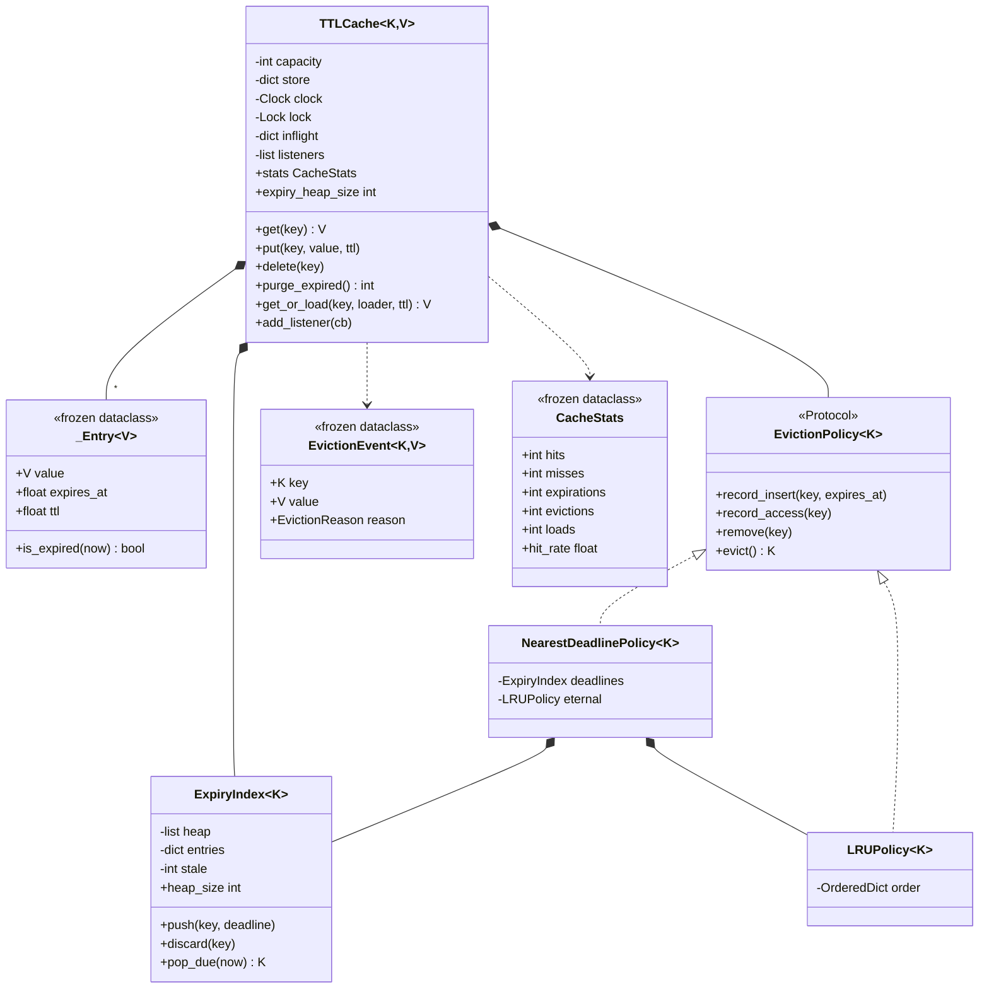

# 设计题解：带过期时间的缓存（TTL Cache）

## 题目与澄清

面试官："设计一个缓存，每条数据可以单独设置存活时间（Time To Live，TTL），到点自动失效。"

这道题看上去只是 [[solution-lru-cache]] 加一个时间字段，实际上加进来的是**一个全新的问题类别**：
LRU 缓存里，每一次状态变化都由调用方触发（`get` 或 `put`）；有了 TTL，数据会在**没有任何人
调用的情况下**变得不合法。"没人触发的状态变化"这件事，决定了本题几乎所有的设计分歧。

值得问清楚的澄清：

- **过期的精度要求是什么？** "到点立刻不可见"和"到点之后的某一刻不可见"是两种设计。
  前者要求任何一次读都判一次到期；后者允许定期清理。绝大多数缓存要前者的**语义**，
  但不要求前者的**时机**——也就是说：过期的数据绝不能被读到，但它占着的内存可以晚一点还。
- **过期的数据算不算在 `len()` 里？** 这个问题看起来像抠细节，其实在问"你打算怎么实现过期"。
  如果答"算"，那 `len()` 就成了一个会骗人的数字。
- **容量满时按什么淘汰？** 这一问把 [[solution-lru-cache]] 的淘汰策略接缝整个接了进来，
  同时引出本题最有意思的一个岔路：满的时候该按策略淘汰，还是先赶走马上就要过期的那条？
- **读一次要不要续命？** 会话缓存（session cache）要续（滑动过期），价格缓存不能续
  （必须按绝对时效作废）。这是一个构造参数，不是两个类。
- **要线程安全吗？有没有"缓存未命中就回源"的场景？** 后一问指向缓存踩踏（cache stampede）：
  一个热点 key 刚过期，几百个线程同时未命中、同时去打数据库。
- **规模多大？** 一百万条数据全部过期之后，内存必须真的降下来——这是本题的硬指标。

**范围之外**：分布式缓存与一致性、写穿透／写回后端存储、按字节数（而不是条目数）计容量、
持久化。第七节会讨论它们落在哪里。

## 需求与分级

**第 1 关（约 20 分钟）**：`get`／`put`，每条数据各自的 TTL，时钟注入。
核心的设计题是**过期怎么被发现**，三个选项必须当场比：读时惰性判断、后台线程定期扫全表、
按截止时刻排序的索引。说得出"一条写进来之后再也没人读的数据"在每个方案下的下场。

**第 2 关（约 15 分钟）**：容量上限与淘汰策略，并回答"满了先淘汰谁"——按策略（LRU），
还是按最近的截止时刻？顺带把 `__len__` 和遍历的语义定死：过期但还没被物理删除的条目，
对外必须不存在。

**第 3 关（约 15 分钟）**：线程安全；`refresh_on_access`（读一次续一次命）作为构造参数；
单飞（single-flight）防踩踏——一百个线程同时未命中同一个 key，回源只许发生一次。

**第 4 关（选做）**：命中／未命中／过期／淘汰的统计，以及数据离开缓存时的回调。
验收标准是：存储、策略、到期索引三个类一行都不用改。

## 核心对象与职责

| 类 | 单一职责 | 它拥有的不变量 |
|---|---|---|
| `_Entry` | 一条数据：值、绝对截止时刻、原始 TTL | 不可变；`expires_at` 是绝对时刻而不是剩余时间 |
| `ExpiryIndex` | 按截止时刻排序、支持改期与撤销的小顶堆 | 墓碑数不超过堆长度的一半 |
| `EvictionPolicy`（`Protocol`） | 容量满时"淘汰谁" | 不持有值，只持有顺序 |
| `LRUPolicy` | 按最近使用顺序选受害者 | `OrderedDict` 的头部是最久未用 |
| `NearestDeadlinePolicy` | 先赶走最快过期的那条 | 无 TTL 的 key 之间退回 LRU |
| `EvictionEvent` | "一条数据离开了缓存"这件事 | 不可变，且**带着值** |
| `CacheStats` | 某一瞬间的统计 | 不可变快照 |
| `TTLCache` | 把存储、策略、到期索引缝起来；一把锁；单飞 | 存活条数 ≤ capacity；对外永远看不到过期条目 |

`TTLCache` 与 `EvictionPolicy`、`ExpiryIndex` 都是组合（composition）：它们的生命周期完全跟随缓存，
外部拿不到。`NearestDeadlinePolicy` 内部复用了一个 `ExpiryIndex`——同一个数据结构，两种用途
（一个回答"谁到期了"，一个回答"谁最该被牺牲"），这正是把它单独成类而不是写在缓存里的回报。



## 关键设计决策

### 决策一：过期怎么被发现——惰性、定时扫描，还是到期索引

**问题**：数据会在没有任何人调用的情况下失效。谁去发现它？

**选项 A：读时惰性判断。** `get` 的时候比一下 `now >= expires_at`，过了就当作不存在并顺手删掉。
`get` 是 O(1)，实现只要三行，[[solution-lru-cache]] 里的 `ExpiringCache` 就是这么做的。
它的死穴是一条**再也没人读的数据**：它永远等不到那次 `get`，于是永远占着内存和容量。
一个缓存里冷数据本来就是多数，这个漏洞不是理论上的。

**选项 B：后台线程定期全表扫描。** 能收掉没人读的数据，代价是三重的：每次扫描 O(n)——
缓存一百万条、真正过期一百条，你也要摸一百万下；扫描期间要持锁，于是产生周期性的延迟毛刺；
而且它给这个库引入了一个**线程的生命周期**（怎么启动、怎么优雅关闭、进程 fork 之后怎么办），
一个缓存类不该逼着调用方管这些。

**选项 C（本题解）：一个按截止时刻排序的小顶堆。** 任何一次操作（`get`／`put`／`len`）先做一件事：
把堆顶所有已经到期的条目弹出来删掉。代价只和"这段时间里真的到期了几条"成正比，
和缓存规模无关；没人读的数据同样会被别人的操作顺手收掉；不需要任何后台线程。

```python
def _purge_locked(self, now: float) -> list[EvictionEvent[K, V]]:
    events = []
    while (key := self._expiry.pop_due(now)) is not None:
        events.append(self._drop_locked(key, EvictionReason.EXPIRED))
        self._expirations += 1
    return events
```

堆的代价是 `push` 和 `pop` 各 O(log n)，以及——这才是真正要设计的部分——**堆不支持删除中间元素**。
一个 key 被覆写就要改期，被删除就要撤销登记，而堆做不到。

### 决策二：墓碑必须被压实，否则内部结构会毁掉外部承诺

**问题**：`ExpiryIndex` 怎么支持"改期"和"撤销"？

`heapq` 文档给的标准配方是**惰性删除**：旧条目不从堆里拿走，而是标成墓碑（tombstone），
弹出时跳过。

```python
def discard(self, key: K) -> None:
    entry = self._entries.pop(key, None)
    if entry is None:
        return
    entry[2] = _REMOVED
    self._stale += 1
    if self._stale > _COMPACT_FLOOR and self._stale * 2 > len(self._heap):
        self._compact()
```

只写前四行就交卷，是这道题最隐蔽的失败：**一个容量 1000 的缓存，被反复覆写的热 key
能在堆里留下几十万个死条目**。对外你承诺了内存有界，内部一个私有结构把这个承诺毁掉了，
而且没有任何一个公开 API 会暴露它——除非你自己把它暴露出来。所以 `heap_size` 是一个
公开的只读属性：不变量只有能被断言，才算数（`test_overwriting_one_key_does_not_pile_up_tombstones`
写了二十万次同一个 key，断言堆长度小于 100）。

压实的条件是墓碑超过堆长度的一半，重建一次 O(n)，摊到制造这些墓碑的 n/2 次操作上是 O(1)。

还有一个容易漏的细节：堆里的元组是 `[deadline, seq, key]`，中间那个自增序号不是装饰。
没有它，两条截止时刻相同的记录会去比较第三项 `key`，而 key 只要求可哈希、不要求可比较——
放两个自定义对象进去就会抛 `TypeError`。有了唯一的序号，比较永远停在第二项。

### 决策三：满的时候按策略淘汰，还是先赶走最快过期的那条

**问题**：容量满了要淘汰一条。LRU 说"淘汰最久没用的"，可如果那条数据还能活一小时，
而另一条两秒后就要死呢？

这两个答案都合理，所以它不该被写死在缓存里，而该是**同一条接缝的两种实现**——
接缝就是 [[solution-lru-cache]] 里那个 `EvictionPolicy`，本题只给它多传了一个参数：

```python
class EvictionPolicy(Protocol[K]):
    def record_insert(self, key: K, expires_at: float | None) -> None: ...
    def record_access(self, key: K) -> None: ...
    def remove(self, key: K) -> None: ...
    def evict(self) -> K: ...
```

`record_insert` 收下 `expires_at`，看起来像是把 TTL 的概念泄漏进了策略，其实不是：
**"什么时候会死"本就是"该让谁先走"的合法输入**，`LRUPolicy` 选择无视它，那是 LRU 的决定。
`NearestDeadlinePolicy` 则复用一个 `ExpiryIndex`，用 `pop_due(math.inf)` 取出最早到期的那个；
没有设置 TTL 的 key 不在堆里，它们之间退回 LRU——给一条永不过期的数据硬编一个截止时刻，
只会让策略变得无法解释。

顺带定死两个语义问题。**"过期但还没被物理删除"对外必须不存在**：`__len__`、`keys()`、
`__contains__` 都先做一次到期清理再回答，否则 `len(cache)` 就是一个会骗人的数字，
而且"容量满了"会因为一堆尸体而提前触发，白白淘汰活着的数据
（`test_an_expired_entry_does_not_hold_capacity` 盯的就是这条）。
另一个是 `keys()` 返回 `tuple` 而不是内部视图——交出去的集合如果还活着，调用方遍历它的时候
缓存正在被别的线程改，一个 `RuntimeError: dictionary changed size during iteration` 就在等着。
这两条都是 [[structure.api|进程内 API 设计]] 的同一句话：**永远不要把内部可变结构交出去**，
交快照；也不要让一个查询方法返回一个自己会变的答案。

### 决策四：单飞——一百个线程未命中，只许回源一次

**问题**：热点 key 一过期，所有正在读它的线程同时未命中，同时去打数据库。这叫缓存踩踏
（cache stampede），它的特征是"缓存越有效，雪崩时越惨"——平时挡住了 99% 的流量，
失效那一瞬间 100% 的流量一起落到后端。

加锁把 `get_or_load` 整个锁住可以解决，但代价荒唐：**回源是慢操作**（一次网络往返几十毫秒），
持着缓存的全局锁做慢操作，等于让所有其他 key 的读写一起停住。
[[concurrency.primitives|同步原语（threading）]] 里最重要的一条纪律就是：不要持着锁去调用
外部代码，更不要持着锁做 I/O。

正确做法是每个 key 一个"在途"标记，用 `threading.Event` 让后来者等，而**领跑者先写缓存再唤醒**：

```python
with self._lock:
    waiter = self._inflight.get(key)
    leader = waiter is None
    if leader:
        waiter = self._inflight[key] = threading.Event()
if not leader:
    waiter.wait()
    continue            # 醒来重新走一遍 get，这时应当命中
try:
    value = loader()    # 不持锁
    self.put(key, value, ttl)
    ...
finally:
    with self._lock:
        done = self._inflight.pop(key)
    done.set()
```

三个细节值得说出口：顺序必须是"先 `put` 再 `set`"，否则后来者醒来还是未命中，
又会选出一个新的领跑者，踩踏只是推迟了；`pop` 写在 `finally` 里，因为回源失败时
也必须把标记摘掉，否则后来者永远等下去（`test_a_failing_loader_releases_the_key` 盯着这条）；
而 `_inflight` 本身也是一个**会增长的容器**，`finally` 里的 `pop` 就是它的回收，
`inflight_count` 是它对外的证据。

### 决策五：统计与回调不需要任何模式

**问题**：第 4 关要加命中率统计和"数据被淘汰时通知我"。要不要上装饰器（Decorator）包一层
`StatsCache`，或者搞一套观察者（Observer）的订阅体系？

**统计不需要任何东西**：五个整数计数器加一个 `CacheStats` 快照就够了。包一层装饰器反而做不到——
"过期"和"容量淘汰"发生在缓存内部，外层根本看不见，它只能统计到自己转发过的那些调用。
这是一个该**拒绝模式**的地方：装饰器擅长在边界上加行为，不擅长观察内部事件。

注意返回的是不可变的 `CacheStats` 而不是内部的计数器字典——交出内部可变对象，调用方就能改它，
而且它会在调用方眼皮底下自己变。

**回调需要的只是一个列表**，但有两条纪律：

1. 事件带着**值**。`EvictionEvent(key, value, reason)` 是一个冻结的小对象，监听者拿到它就能
   释放那条数据持有的资源（关连接、删临时文件）。如果事件只带 key，监听者只能回头查缓存——
   那时数据已经没了，而且回查会绕过缓存的锁。
2. 回调在**锁外**执行。监听者是外部代码，持锁调用它等于把自己的锁交给一个不认识的人：
   它可能很慢，也可能回头调用缓存本身而造成死锁。所以所有公开方法的形状都是
   "持锁改状态、收集事件 → 放锁 → 广播"。`test_listener_runs_outside_the_lock` 让监听者在回调里
   调用 `len(cache)`，持锁广播的实现会在那里挂死。

## 代码走读

先看三个类怎么分工。`TTLCache.put` 是全篇最能说明问题的一段：它先清到期（于是过期数据不占容量）、
再分"覆写"和"新增"两条路，覆写路径发 `REPLACED` 事件而**不**计入淘汰数——覆写不是淘汰，
把两者混在一个计数器里，命中率报表就废了。

然后看 `get` 的形状：所有状态变更都在 `with self._lock:` 里完成，`raise KeyError` 和广播都挪到锁外。
`refresh_on_access` 在这里只是两行——因为 `_Entry` 保留了原始的 `ttl`，续命就是用同一个 `ttl`
重新算一次截止时刻并 `push` 一次（`push` 内部会先 `discard` 旧登记，墓碑逻辑对调用方不可见）。

`ExpiryIndex.pop_due` 值得逐行读：跳过墓碑时 `_stale` 要同步减一，否则压实的判据会越来越离谱；
堆顶还没到期时**原样返回 None**，不能把它弹出来再放回去。

最后是 `NearestDeadlinePolicy`：它整个类只有二十行，因为它把 `ExpiryIndex` 当积木用。
这就是"把数据结构单独成类"的回报——同一个结构在一个类里回答"谁到期了"，在另一个类里
回答"谁最该被牺牲"。

%% code:begin solution.py %%
```python
"""带过期时间的缓存（TTL Cache）：每条数据各自的存活时间 + 容量满时的淘汰策略。
设计：`_Entry` 存值和它的绝对截止时刻；`ExpiryIndex` 是一个带惰性删除与压实的到期小顶堆，
让"清掉所有到期条目"的代价与到期条目数成正比，而不是与缓存大小成正比；
"容量满了淘汰谁"是可替换的 `EvictionPolicy`（LRU 或"最近就要过期的先走"）；
`TTLCache` 只负责把这三者缝起来：一把锁、一份统计、一组淘汰事件监听者，
外加一个单飞（single-flight）加载入口，让一百个线程同时缓存未命中时只回源一次。
"""

from __future__ import annotations

import heapq
import itertools
import math
import threading
import time
from collections import OrderedDict
from collections.abc import Callable, Hashable, Iterator
from dataclasses import dataclass
from enum import Enum
from typing import Generic, Protocol, TypeVar

K = TypeVar("K", bound=Hashable)
V = TypeVar("V")

Clock = Callable[[], float]
"""时钟：返回单调秒数的无参函数，永远从外部注入。"""

_REMOVED = object()
"""堆里的墓碑（tombstone）标记：条目还在堆里，但已经不作数了。"""

_COMPACT_FLOOR = 32
"""墓碑少于这个数时不值得为压实重建整个堆。"""


class CacheError(Exception):
    """本模块所有异常的根。"""


class InvalidConfiguration(CacheError, ValueError):
    """参数本身就不成立：非正的容量、非正的存活时间。"""


class EvictionReason(Enum):
    """一条数据离开缓存的原因——监听者几乎总是要按原因分别处理。"""

    EXPIRED = "expired"      # 活到期了
    CAPACITY = "capacity"    # 容量满，被淘汰策略选中
    REPLACED = "replaced"    # 同一个 key 被写了新值
    REMOVED = "removed"      # 调用方主动删除


@dataclass(frozen=True, slots=True)
class EvictionEvent(Generic[K, V]):
    """一条数据离开缓存这件事本身。

    事件带着值，监听者因此能直接释放它持有的资源（关连接、删临时文件），
    而不必回头去缓存里查——那时它已经查不到了，并且回查会绕过缓存的锁。
    """

    key: K
    value: V
    reason: EvictionReason


@dataclass(frozen=True, slots=True)
class CacheStats:
    """某一瞬间的统计快照。不可变，所以拿到它之后读到的数字不会自己变。"""

    hits: int
    misses: int
    expirations: int
    evictions: int
    loads: int

    @property
    def hit_rate(self) -> float:
        total = self.hits + self.misses
        return self.hits / total if total else 0.0


@dataclass(frozen=True, slots=True)
class _Entry(Generic[V]):
    """一条数据：值、绝对截止时刻（None 表示永不过期）、以及原始的存活时间。

    存**绝对时刻**而不是"还剩多久"，是因为后者需要有人定期去减，那又要一个后台线程。
    保留 `ttl` 只为了支持"读一次就续一次命"。
    """

    value: V
    expires_at: float | None
    ttl: float | None

    def is_expired(self, now: float) -> bool:
        return self.expires_at is not None and now >= self.expires_at


class ExpiryIndex(Generic[K]):
    """按截止时刻排序的小顶堆，支持"改期"和"撤销"——用惰性删除加压实实现。

    堆没有"删掉中间某个元素"的操作，标准做法（`heapq` 文档里的配方）是把旧条目标成墓碑，
    弹出时跳过。代价是墓碑会堆积：一个被反复覆写的 key 能在堆里留下几十万个死条目，
    于是"缓存只有 1000 条"的承诺被一个内部结构悄悄毁掉。所以墓碑超过一半时必须**压实**。

    元组的第二项是一个自增序号：它保证比较永远不会落到第三项的 key 上（key 可能不可比较），
    同时给同一时刻到期的条目一个稳定的先后顺序。
    """

    def __init__(self) -> None:
        self._heap: list[list[object]] = []
        self._entries: dict[K, list[object]] = {}
        self._counter = itertools.count()
        self._stale = 0

    def __len__(self) -> int:
        """还有效的条目数。"""
        return len(self._entries)

    @property
    def heap_size(self) -> int:
        """堆里实际占着内存的元素数（含墓碑）——压实做得对，它不会无限增长。"""
        return len(self._heap)

    def push(self, key: K, deadline: float) -> None:
        """登记（或改期）一个 key 的截止时刻。"""
        self.discard(key)
        entry: list[object] = [deadline, next(self._counter), key]
        self._entries[key] = entry
        heapq.heappush(self._heap, entry)

    def discard(self, key: K) -> None:
        """撤销一个 key 的登记。key 不在索引里时什么都不做。"""
        entry = self._entries.pop(key, None)
        if entry is None:
            return
        entry[2] = _REMOVED
        self._stale += 1
        if self._stale > _COMPACT_FLOOR and self._stale * 2 > len(self._heap):
            self._compact()

    def pop_due(self, now: float) -> K | None:
        """弹出一个在 `now` 之前（含）到期的 key；没有就返回 None，堆顶原样留着。"""
        while self._heap:
            deadline, _, key = self._heap[0]
            if key is _REMOVED:
                heapq.heappop(self._heap)
                self._stale -= 1
                continue
            if deadline > now:  # type: ignore[operator]
                return None
            heapq.heappop(self._heap)
            del self._entries[key]  # type: ignore[arg-type]
            return key  # type: ignore[return-value]
        return None

    def _compact(self) -> None:
        """把墓碑一次性清出去并重建堆。O(n)，但摊到制造这些墓碑的 n/2 次操作上是 O(1)。"""
        self._heap = [entry for entry in self._heap if entry[2] is not _REMOVED]
        heapq.heapify(self._heap)
        self._stale = 0


class EvictionPolicy(Protocol[K]):
    """容量满时"淘汰谁"的规则。缓存只依赖这四个方法，不关心它内部怎么记账。

    `record_insert` 收下截止时刻，是因为"什么时候会死"本就是"该让谁先走"的合法输入；
    LRU 选择无视它，那是 LRU 的决定，不是接口的泄漏。
    """

    def record_insert(self, key: K, expires_at: float | None) -> None: ...

    def record_access(self, key: K) -> None: ...

    def remove(self, key: K) -> None: ...

    def evict(self) -> K:
        """选出并移除一个受害者。调用前必须保证非空。"""
        ...


class LRUPolicy(Generic[K]):
    """最近最少使用。顺序用 `OrderedDict` 维护——本题要考的是 TTL，不是手写双向链表。"""

    def __init__(self) -> None:
        self._order: OrderedDict[K, None] = OrderedDict()

    def record_insert(self, key: K, expires_at: float | None) -> None:
        self._order[key] = None

    def record_access(self, key: K) -> None:
        self._order.move_to_end(key)

    def remove(self, key: K) -> None:
        self._order.pop(key, None)

    def evict(self) -> K:
        key, _ = self._order.popitem(last=False)
        return key


class NearestDeadlinePolicy(Generic[K]):
    """先赶走"本来就快过期"的那条：反正它马上要死，淘汰它损失的未来命中最少。

    没有设置存活时间的 key 不在堆里，它们之间退回 LRU——一条永不过期的数据没有
    "快死了"这个属性，硬给它编一个截止时刻只会把策略变得难以解释。
    """

    def __init__(self) -> None:
        self._deadlines: ExpiryIndex[K] = ExpiryIndex()
        self._eternal: LRUPolicy[K] = LRUPolicy()

    def record_insert(self, key: K, expires_at: float | None) -> None:
        if expires_at is None:
            self._eternal.record_insert(key, None)
        else:
            self._deadlines.push(key, expires_at)

    def record_access(self, key: K) -> None:
        """读一次不改变"谁先死"——这正是它和 LRU 的根本区别。"""

    def remove(self, key: K) -> None:
        self._deadlines.discard(key)
        self._eternal.remove(key)

    def evict(self) -> K:
        key = self._deadlines.pop_due(math.inf)
        return key if key is not None else self._eternal.evict()


class TTLCache(Generic[K, V]):
    """固定容量 + 每条数据各自存活时间的缓存。

    过期是**惰性 + 索引驱动**的：任何一次操作都先把到期堆顶所有该死的条目清掉，
    代价只和"这段时间里到期了几条"成正比。于是一条写进来就再没人读过的数据，
    同样会在到期后被回收——这是纯惰性方案做不到、而定时全表扫描要 O(n) 才能做到的事。
    `__len__` 和 `keys()` 因此永远看不到"过期但还没被删"的条目。
    """

    def __init__(self, capacity: int, *, default_ttl: float | None = None,
                 clock: Clock = time.monotonic, policy: EvictionPolicy[K] | None = None,
                 refresh_on_access: bool = False) -> None:
        if capacity <= 0:
            raise InvalidConfiguration(f"capacity must be positive, got {capacity}")
        if default_ttl is not None and default_ttl <= 0:
            raise InvalidConfiguration(f"default_ttl must be positive, got {default_ttl}")
        self._capacity = capacity
        self._default_ttl = default_ttl
        self._clock = clock
        self._refresh_on_access = refresh_on_access
        self._policy: EvictionPolicy[K] = policy if policy is not None else LRUPolicy()
        self._store: dict[K, _Entry[V]] = {}
        self._expiry: ExpiryIndex[K] = ExpiryIndex()
        self._lock = threading.Lock()
        self._inflight: dict[K, threading.Event] = {}
        self._listeners: list[Callable[[EvictionEvent[K, V]], None]] = []
        self._hits = self._misses = self._expirations = self._evictions = self._loads = 0

    # ---------- 只读视图 ----------

    @property
    def capacity(self) -> int:
        return self._capacity

    @property
    def stats(self) -> CacheStats:
        """统计快照。返回不可变对象，而不是内部计数器字典。"""
        with self._lock:
            return CacheStats(self._hits, self._misses, self._expirations,
                              self._evictions, self._loads)

    @property
    def expiry_heap_size(self) -> int:
        """到期索引实际占着的元素数——用来断言墓碑没有无限堆积。"""
        with self._lock:
            return self._expiry.heap_size

    @property
    def inflight_count(self) -> int:
        """正在回源的 key 数。加载结束后必须归零，否则这也是一处泄漏。"""
        with self._lock:
            return len(self._inflight)

    def __len__(self) -> int:
        events = self._sweep()
        self._publish(events)
        with self._lock:
            return len(self._store)

    def keys(self) -> tuple[K, ...]:
        """当前存活 key 的**快照**（不是内部视图），顺序不保证。"""
        self._publish(self._sweep())
        with self._lock:
            return tuple(self._store)

    def __contains__(self, key: K) -> bool:
        self._publish(self._sweep())
        with self._lock:
            return key in self._store

    def add_listener(self, listener: Callable[[EvictionEvent[K, V]], None]) -> None:
        """注册淘汰监听者。它在锁**之外**被调用，所以慢回调不会堵住整个缓存。"""
        with self._lock:
            self._listeners.append(listener)

    # ---------- 核心操作 ----------

    def get(self, key: K) -> V:
        """取值。key 不存在或已过期一律抛 `KeyError`——语义对齐 `dict`。"""
        now = self._clock()
        with self._lock:
            events = self._purge_locked(now)
            entry = self._store.get(key)
            if entry is None:
                self._misses += 1
            else:
                self._hits += 1
                self._policy.record_access(key)
                if self._refresh_on_access and entry.ttl is not None:
                    self._store[key] = _Entry(entry.value, now + entry.ttl, entry.ttl)
                    self._expiry.push(key, now + entry.ttl)
        self._publish(events)
        if entry is None:
            raise KeyError(key)
        return entry.value

    def put(self, key: K, value: V, ttl: float | None = None) -> None:
        """写入。`ttl` 省略时用构造时的默认值；默认值也是 None 就永不过期。"""
        now = self._clock()
        ttl = self._default_ttl if ttl is None else ttl
        if ttl is not None and ttl <= 0:
            raise InvalidConfiguration(f"ttl must be positive, got {ttl}")
        expires_at = None if ttl is None else now + ttl
        with self._lock:
            events = self._purge_locked(now)
            if key in self._store:
                events.append(self._drop_locked(key, EvictionReason.REPLACED))
            elif len(self._store) >= self._capacity:
                events.append(self._drop_locked(self._policy.evict(), EvictionReason.CAPACITY))
                self._evictions += 1
            self._store[key] = _Entry(value, expires_at, ttl)
            self._policy.record_insert(key, expires_at)
            if expires_at is not None:
                self._expiry.push(key, expires_at)
        self._publish(events)

    def delete(self, key: K) -> None:
        """主动删除。key 不存在（或已过期）时抛 `KeyError`。"""
        now = self._clock()
        with self._lock:
            events = self._purge_locked(now)
            missing = key not in self._store
            if not missing:
                events.append(self._drop_locked(key, EvictionReason.REMOVED))
        self._publish(events)
        if missing:
            raise KeyError(key)

    def purge_expired(self) -> int:
        """显式清一遍到期条目，返回清掉的条数。给"定时主动清理"那条路径用。"""
        events = self._sweep()
        self._publish(events)
        return len(events)

    def get_or_load(self, key: K, loader: Callable[[], V], ttl: float | None = None) -> V:
        """取值；没有就调用 `loader` 回源。同一个 key 同时只有一个线程在回源（单飞）。

        没有这道闸，热点 key 一过期，所有在读它的线程会同时打到后端——这就是缓存踩踏
        （cache stampede）。后到的线程在 `Event` 上等，领跑者**先写进缓存再唤醒**他们，
        于是他们醒来就是命中，不会第二次回源。
        """
        while True:
            try:
                return self.get(key)
            except KeyError:
                pass
            with self._lock:
                waiter = self._inflight.get(key)
                leader = waiter is None
                if leader:
                    waiter = self._inflight[key] = threading.Event()
            if not leader:
                waiter.wait()
                continue
            try:
                value = loader()
                self.put(key, value, ttl)
                with self._lock:
                    self._loads += 1
                return value
            finally:
                with self._lock:
                    done = self._inflight.pop(key)  # 无论成败都要移交，否则后来者永远等下去
                done.set()

    # ---------- 内部：过期与移除 ----------

    def _sweep(self) -> list[EvictionEvent[K, V]]:
        now = self._clock()
        with self._lock:
            return self._purge_locked(now)

    def _purge_locked(self, now: float) -> list[EvictionEvent[K, V]]:
        """（持锁）把所有到期条目摘掉，返回待广播的事件。"""
        events: list[EvictionEvent[K, V]] = []
        while (key := self._expiry.pop_due(now)) is not None:
            events.append(self._drop_locked(key, EvictionReason.EXPIRED))
            self._expirations += 1
        return events

    def _drop_locked(self, key: K, reason: EvictionReason) -> EvictionEvent[K, V]:
        """（持锁）把一个 key 从存储、策略、到期索引里一并摘掉，并造出事件。"""
        entry = self._store.pop(key)
        self._policy.remove(key)
        self._expiry.discard(key)
        return EvictionEvent(key, entry.value, reason)

    def _publish(self, events: list[EvictionEvent[K, V]]) -> None:
        """在锁外广播。监听者是外部代码，持锁回调它等于把锁交给不认识的人。"""
        if not events:
            return
        with self._lock:
            listeners = tuple(self._listeners)
        for event in events:
            for listener in listeners:
                listener(event)

    # ---------- 语法糖 ----------

    def __getitem__(self, key: K) -> V:
        return self.get(key)

    def __setitem__(self, key: K, value: V) -> None:
        self.put(key, value)

    def __delitem__(self, key: K) -> None:
        self.delete(key)

    def __iter__(self) -> Iterator[K]:
        return iter(self.keys())

    def __repr__(self) -> str:
        return f"{type(self).__name__}(capacity={self._capacity}, size={len(self._store)})"


def _demo() -> None:
    now = [0.0]
    clock: Clock = lambda: now[0]
    cache: TTLCache[str, int] = TTLCache(capacity=3, default_ttl=10.0, clock=clock)
    cache.add_listener(lambda event: print(f"  ← {event.key} 离开，原因 {event.reason.value}"))

    cache.put("a", 1)
    cache.put("b", 2, ttl=2.0)
    cache.put("c", 3)
    now[0] = 3.0
    print("b 还在吗:", "b" in cache, "／存活条数:", len(cache))

    cache.put("d", 4)
    cache.put("e", 5)          # 容量 3，最久未用的被淘汰
    print("剩下:", sorted(cache.keys()))

    hits = TTLCache[str, int](capacity=2, clock=clock)
    hits.put("x", 1)
    hits.get("x")
    try:
        hits.get("y")
    except KeyError:
        pass
    print("命中率:", hits.stats.hit_rate)


if __name__ == "__main__":
    _demo()
```
%% code:end %%

## 测试与自检

测试钉的是契约：只用公开方法和只读属性（`stats`、`expiry_heap_size`、`inflight_count`、`keys()`），
所以学习者在 `starter.py` 里换一种内部表示照样能过。

最值得写出来的几条：

- **没人读的过期数据也会被回收**：写 `cold`（TTL 1 秒）和 `hot`（TTL 100 秒），时间推到 2 秒，
  只 `get("hot")`，然后断言 `len(cache) == 1`。这一条把"纯惰性过期"的实现直接判死。
- **过期数据不占容量**：容量 2，两条都过期后写第三条，断言 `evictions == 0`。
- **覆写不是淘汰**：`evictions` 保持 0，事件的 reason 是 `replaced`。
- **一百万条过期数据不留在内存里**：边写边推进时钟，存活条数和堆长度的峰值都稳定在一万上下
  （一个存活窗口内写进来的量），而不是一百万。
- **二十万次覆写同一个 key，堆长度 < 100**：墓碑压实的证据。
- **单飞只回源一次**：一百个线程用 `threading.Barrier` 对齐，`loader` 被调用的次数必须精确等于 1，
  且一百个线程都拿到同一个值，事后 `inflight_count == 0`。
- **回调在锁外**：监听者回调里调用 `len(cache)`，用带超时的 `join` 把"死锁"变成"测试失败"
  而不是"测试挂住"。

两分钟怎么演示：跑 `python solution.py`。输出依次是一条数据到期被回收（监听者打印了原因）、
容量满时 LRU 淘汰了谁、以及命中率——三行对应三关。

## 扩展与追问

**新需求**

- *按字节数计容量*：`put` 时算一次 `size`，`_Entry` 多一个字段，容量判据从"条数"换成"总字节"，
  淘汰改成"一直淘汰到装得下"。策略、到期索引、统计都不动。
- *批量接口 `get_many` / `put_many`*：在缓存上加方法，一次锁做完 N 个 key，
  比循环调用 `get` 少 N-1 次加解锁。语义要说清楚：部分命中怎么返回。
- *不同 key 族不同默认 TTL*：默认值已经是构造参数，按族开多个缓存实例，或把
  `default_ttl` 换成 `Callable[[K], float]`——后者只改一行。
- *过期前主动刷新（refresh-ahead）*：截止时刻前 10% 的时间里，读到的线程异步触发一次回源。
  它复用的正是单飞那套在途标记，`get_or_load` 之外再加一个入口即可。

**并发与线程安全**

- *一把锁够不够*：本题的所有操作都要写内部结构（`get` 也要改策略顺序、可能还要续命），
  所以读写锁没有意义——和 [[solution-lru-cache]] 里拒绝读写锁的理由完全相同。
  规模再上去就按 key 分片：每片一把锁一份存储，容量和统计按片摊。
- *GIL 给了什么*：它保证单条字节码不被撕开，**不**保证"查到没有 → 决定回源"这条
  检查再动作（check-then-act）不被插入。单飞那段代码之所以要锁，就是为了这条复合操作。
- *`asyncio` 版本*：把 `threading.Lock` 换成 `asyncio.Lock`、`Event` 换成 `asyncio.Event`，
  结构完全一致；`loader` 变成协程，`await` 的位置正好是原来"不持锁"的那一段。

**持久化与规模**

- *换成 Redis*：TTL 交给 `EXPIRE`，本题的 `ExpiryIndex` 在那边是服务端的职责；
  单飞变成分布式锁或 `SETNX` 占位；淘汰策略变成 `maxmemory-policy` 配置项。
  值得说的是语义差别：Redis 的过期也是惰性 + 抽样，同样不保证"到点那一刻就消失"。
- *多进程共享*：进程内缓存无法共享，常见做法是两级缓存——本题的类当 L1，Redis 当 L2，
  L1 的 TTL 必须短于 L2，否则失效顺序会造成读到旧值。
- *可观测性*：`CacheStats` 已经够画命中率曲线；把 `EvictionEvent` 按 reason 分别计数，
  就能区分"容量不够"和"TTL 太短"这两种完全不同的调优方向。

## 常见错误

- **只做读时惰性过期**：没人再读的数据永远不死，缓存在"冷数据"上无限膨胀。
- **起一个后台线程定期全表扫描**：O(n) 的周期性毛刺，还逼调用方管一个线程的生死。
- **`__len__` 把过期条目算进去**：一个会骗人的数字，而且会让"容量满"提前触发，
  用尸体挤掉活着的数据。
- **堆里只标墓碑、从不压实**：对外承诺内存有界，内部一个私有结构把承诺毁掉。
- **堆元组不放序号**：两条截止时刻相同时去比较 key，key 不可比较就抛 `TypeError`。
- **存"还剩多久"而不是绝对截止时刻**：剩余时间需要有人定期去减，于是又绕回后台线程。
- **`time.time()` 硬编在类里**：测试只能 `sleep`，且 NTP 回拨会让数据集体"复活"。用注入的 `time.monotonic`。
- **持锁回源**：一次几十毫秒的网络往返把整个缓存冻住。
- **未命中时不做单飞**：热点 key 一过期，全部流量直落后端。
- **淘汰回调在锁内调用**，或者事件只带 key 不带值：前者随时死锁，后者让监听者无事可做。
- **把统计做成装饰器**：过期和淘汰发生在内部，外层看不见，统计必然漏。
- **Java 味的写法**：`CacheFactory` 单例、`getSize()`／`setTtl()`、一个只转发 `get`／`put` 的
  `CacheService`——在 Python 里工厂是一个函数，getter 是 `@property`，只转发的类该删。

## 45 分钟怎么分配

- **0–4 分钟｜澄清**。先问过期的精度要求（"绝不能读到过期数据"和"内存必须立刻还"是两件事），
  再问 `len()` 的语义、要不要续命、有没有回源场景。
- **4–8 分钟｜定 API 与数据结构**。写出 `get`／`put(key, value, ttl)`／`delete`，
  说明 `_Entry` 存**绝对截止时刻**而不是剩余时间，以及时钟为什么必须注入。
- **8–20 分钟｜第 1 关**。三种过期方案当场比，重点说"一条再也没人读的数据"在每种方案下的下场，
  然后写到期堆。**主动提出墓碑要压实**，并把 `heap_size` 暴露成属性——这是本题最容易被
  面试官记住的一分钟。
- **20–28 分钟｜第 2 关**。接入淘汰策略接缝，写 LRU（用 `OrderedDict`，并说明手写双向链表的版本
  你会，但这道题的重点不在那里），口述 `NearestDeadlinePolicy`。定死 `__len__` 的语义。
- **28–38 分钟｜第 3 关**。一把锁；讲清楚为什么读写锁没用。然后是单飞：
  先画一百个线程同时未命中的图，再写 `Event` 那十行，强调"先写缓存再唤醒"和 `finally` 里的摘牌。
- **38–45 分钟｜第 4 关与收尾**。五个计数器 + `CacheStats` 快照；监听者列表 + 锁外广播 + 事件带值。
  说出"这两样都不需要任何设计模式"，并解释为什么装饰器在这里反而做不到。

时间不够时的取舍顺序：先砍 `NearestDeadlinePolicy`（口述），再砍统计与回调（口述），
再砍单飞的代码（但一定要讲踩踏和"先写再唤醒"）。**绝不能砍的是**：三种过期方案的比较、
墓碑压实、`__len__` 的语义、注入时钟。

## 来源与延伸

- [anomaly2104/cache-low-level-system-design](https://github.com/anomaly2104/cache-low-level-system-design)：
  `prasadgujar/low-level-design-primer` 为这道题指向的参考实现，Java。
  它把 `Storage`（存储）和 `EvictionPolicy`（淘汰）分开，这条接缝和本题解一致，值得看它怎么组织包结构。
  分歧很大：它**完全没有 TTL**，因而没有时钟、没有到期索引，也就碰不到本题真正的难点；
  它用 `CacheFactory` 来组装对象，在 Python 里这是一个函数的事；
  它的 `Storage` 接口有 `getSize()` 这类 getter，Python 里应当是 `@property` 或 `__len__`。
- [InterviewReady/Low-Level-Design — distributed-cache](https://github.com/InterviewReady/Low-Level-Design/tree/main/distributed-cache)：
  Java，把缓存放到分布式语境里讲（一致性哈希、数据源接入、超时）。
  它对"缓存背后接一个数据源"的抽象比本题解完整，可以拿来想清楚 `get_or_load` 再往前一步长什么样；
  但它的重心在网络与拓扑，不在"进程内一个类怎么管住自己的内存"。
- [docs.python.org — heapq: Priority Queue Implementation Notes](https://docs.python.org/3/library/heapq.html)：
  惰性删除的墓碑配方、唯一序号打破并列的技巧，官方文档写得比任何面试教程都清楚。
  本题解在它的基础上补了标准库没有管的那一半：**墓碑什么时候该被压实掉**。
- [docs.python.org — collections.OrderedDict](https://docs.python.org/3/library/collections.html#collections.OrderedDict)：
  `move_to_end` 和 `popitem(last=False)` 让 LRU 顺序只要两行。
  手写双向链表的版本见 [[solution-lru-cache]]——那里的重点是链表本身，本题的重点不是。
- [CodeZym — Design LRU Cache with time constraint（商业站点）](https://codezym.com/question/165-design-lru-cache-time-constraint)：
  一道"LRU 加时间约束"的机考原题描述（报告于 Amazon），可以拿来练手。
  它的形式是在线判题，给的是接口签名而不是设计讨论，所以对"为什么这样分类"帮助有限。
