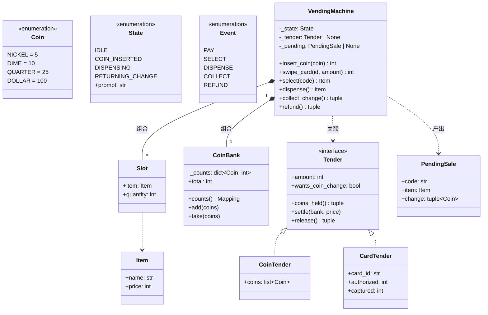

# 设计题解：自动售货机（Vending Machine）

## 题目与澄清

面试官通常这样开场："设计一台自动售货机。它接受硬币，买家选一件商品，机器出货并找零。"
这道题几乎人人都能跑通顺路径，拉开差距的全在机器**必须拒绝**的那些时刻——以及拒绝之后，
买家的钱还在不在他名下。值得当场问清楚的是：

- **钱怎么表示？** 唯一正确的答案是整数的最小货币单位（分）。说"用 `float`"会在找零里立刻
  出现 0.1 + 0.2 的经典误差；说"用 `Decimal`"不算错，但硬币本来就是离散的，面额就是整数，
  没有小数需要表达。把这一句说出口，面试官会知道你在真实系统里处理过金额。
- **投进去的硬币在成交前算谁的？** 这是"退款要退什么"的前提。现实的机器把投入的硬币**托管**
  （escrow）在一个临时槽里，成交才拨进币箱，所以任何时刻按退币，退回的是**原封不动的那几枚
  硬币**。如果一投币就并入币箱，退币只能"凑一个等额的组合"还给买家，逻辑复杂而且可能凑不出。
- **"找不开"算什么错？** 这是本题的题眼。库存不足和找零不足是**两种不同的失败**，而后者更
  凶险：它必须在**货还没出来之前**被发现。如果先出货再发现找不开，机器只能吞掉买家的零钱，
  这是真实世界里最招投诉的故障。问一句"找不开的时候机器该怎么办"，把"整笔拒绝、让买家补
  零钱或退币"这个答案确认下来，后面的设计就有了主心骨。
- **一次买几件？同时有几个买家？** 默认一次一件、一台机器同一时刻只有一笔交易——状态机本身
  就是这条约束的实现。如果机器还挂在网络上被远程下单，那就要说清楚锁加在哪（见"关键设计
  决策"最后一节）。
- **要不要支持刷卡？** 问出来是因为答案会改变分层：如果只支持硬币，付款可以直接是一个
  `balance: int`；如果以后要加刷卡，"这笔付款"就该是一个有两种实现的抽象，而这个抽象能不能
  加进去而不动状态机，正是第 4 关在考的东西。

**范围之外**：不做真实的硬币识别硬件和退币电机、不做支付网关对接（刷卡只到"预授权／扣款／
撤销"这一层抽象）、不做跨进程持久化（掉电恢复放在"扩展与追问"里说）。

## 需求与分级

- **第 1 关（核心流程，约 15 分钟）**：购买流程的状态机 IDLE → COIN_INSERTED → DISPENSING →
  RETURNING_CHANGE → IDLE，而且**每一个非法动作都被显式拒绝**：没投币就按"选择"、出货过程中
  再投币、货已经在路上了还要退币。错误信息要说清楚机器此刻在等什么。对应 `State`、`Event`、
  `TRANSITIONS`、`VendingMachine` 的五个动作方法。
- **第 2 关（库存与币箱，约 15 分钟）**：机器有两种不同的失败理由——货道空了（`OutOfStockError`）
  和币箱凑不出零钱（`CannotMakeChangeError`）——并且都必须"整笔拒绝"而不是半成交：库存不减、
  币箱不动、钱还在买家名下，他可以补零钱或者按退币。对应 `Slot`、`CoinBank`、`CoinTender`
  的托管语义。
- **第 3 关（找零算法，约 10 分钟）**：用真实面额（5/10/25/100 分）做找零，说清楚贪心在什么
  条件下是最优的、在什么条件下会明明有解却报"找不开"，并给出一个一定找得到解的实现。算法
  要能整体替换。对应 `ChangeMaker`、`greedy_change`、`exact_change`。
- **第 4 关（新需求，选做）**：补货与装币（管理动作）、读卡器作为第二种支付方式。判分点只有
  一个：加这些东西**不许动状态机**。对应 `restock`、`load_coins`、`Tender` 协议与
  `CardTender`。

## 核心对象与职责

| 类 | 职责 | 它守住的不变式 |
|---|---|---|
| `Coin` | 支持的面额，枚举值就是面值（分） | 金额永远是整数，没有浮点 |
| `State` / `Event` / `TRANSITIONS` | 流程的阶段、动作，和"哪个动作在哪个阶段合法" | 表里没有的组合一律非法，没有第二个地方能偷偷放行 |
| `Item` / `Slot` | 一件商品；一个货道装着什么、还剩几件 | 库存只有这一份真源，不另开一本账 |
| `CoinBank` | 币箱里每种面额各有多少枚 | 计数归零的面额立刻从字典里删掉 |
| `ChangeMaker`（函数） | 给应找金额和可用硬币，给出一种凑法或 `None` | 纯函数；凑不出就诚实地返回 `None`，不抛异常 |
| `Tender`（协议）/ `CoinTender` / `CardTender` | 一笔尚未结清的付款：金额、托管物、成交与退款 | 现金退回的就是投进来的那几枚；刷卡只扣实际货价 |
| `PendingSale` | `select` 成功后、出货前已经定下来的这笔交易 | 不可变；出货或退币后立刻清空 |
| `Transitioned` | 一次成功转移的自描述记录 | 订阅者据此刷新，不回头读机器内部 |
| `VendingMachine` | 把上面这些组织成一次购买；守住"要么完整成交、要么原样退款" | 任何失败路径都不改库存、不改币箱 |

关系上，`VendingMachine` **组合**（composition）着它的货道和币箱——它们的生命周期跟着机器走。
`Tender` 是**关联**（association）：一笔付款只在一次交易期间存在，交易结束它就被丢掉。
`ChangeMaker` 既不属于机器也不被机器拥有，它是构造时注入的一个算法。

这份设计里没有 `Inventory` 类。它会是一个只把 `get`／`decrement` 原样转发给一个字典的壳：
它守不住任何一条 `VendingMachine` 没守住的不变式（库存的增减必须和状态机的转移绑在一起，
放在别的对象里反而让"失败时一动不动"更难保证）。也没有 `Display` 类——屏幕要显示的内容就是
`State.prompt` 这一张表加上余额，真要接一块屏，订阅 `Transitioned` 事件即可，机器一行都不用改。
反过来，`CoinBank` **是**一个真正挣来的类：它有一条自己的不变式（计数归零的面额必须消失），
有一组只有它能保证原子性的操作（检查余量再扣减），这和"只有一个转发方法的壳"是两回事。



## 关键设计决策

### 决策一：`Enum` 加转移表，还是一状态一类？

这是这道题的经典分岔，也是[[patterns.state|状态模式（State）]]最常被拿来举例的地方。两条路
都要摊开看。

**选项 A：一状态一类。** 一个 `VendingMachineState` 抽象基类声明 `insert_coin` / `select` /
`dispense` / `refund`，`IdleState`、`CoinInsertedState`、`DispensingState`、
`ReturningChangeState` 各自实现，机器把每次调用委托给当前状态对象：

```python
class IdleState(VendingMachineState):
    def insert_coin(self, machine, coin):
        machine.add_to_escrow(coin)
        machine.set_state(CoinInsertedState())

    def select(self, machine, code):
        raise IllegalTransitionError("请先投币")
```

优点是新增一个状态（比如"检修中"）只要加一个类，不改已有的类；缺点在这道题里很扎眼：**一共
四个状态、五个动作，二十个格子里只有六个是合法的**，也就是说四个类里绝大多数方法体都是
"抛异常"。你把同一句"这个动作现在不行"抄了十四遍，而且**抄漏一个没有任何地方看得出来**——
忘记在 `DispensingState` 里重写 `insert_coin`，基类的默认实现就会把硬币悄悄收下。

**选项 B：`Enum` 状态 + 一张 `dict[(State, Event), State]` 转移表。** 合法转移是数据，只有
六行；表里没有的组合一律非法，由一个 `_next(event)` 统一拒绝：

```python
TRANSITIONS: dict[tuple[State, Event], State] = {
    (State.IDLE, Event.PAY): State.COIN_INSERTED,
    (State.COIN_INSERTED, Event.PAY): State.COIN_INSERTED,
    (State.COIN_INSERTED, Event.SELECT): State.DISPENSING,
    (State.COIN_INSERTED, Event.REFUND): State.IDLE,
    (State.DISPENSING, Event.DISPENSE): State.RETURNING_CHANGE,
    (State.RETURNING_CHANGE, Event.COLLECT): State.IDLE,
}
```

**选择 B。这是一次对模式的拒绝**：题目名字里带着 State 模式，但把它套上去在这个规模下只会
把六条规则摊成四个类、二十个方法。更重要的是，转移表让"合法性"变成一个**可以被穷举测试
盖满**的数据结构：测试遍历 4 × 5 个组合，凡是不在表里的都断言抛 `IllegalTransitionError`
（`test_every_state_event_pair_outside_the_table_is_illegal`）。一状态一类写不出这个测试，
因为"我有没有漏覆盖一个方法"根本没有一处可以查。

**什么时候该翻到 A？** 判据不是"状态多不多"，而是**每个状态有没有自己成套的进入／退出副作用**。
如果进入 DISPENSING 要启动电机、点亮指示灯、起一个超时定时器，离开时要逐个收尾，那么把这些
副作用放进各自的状态类确实比堆在一个 `if` 链里清楚。本文的四个状态里，"动作"只有出货扣库存、
退币、收找零三件事，各自不过几行，塞进机器的方法里一眼能看全。顺带说一句，"状态要带数据"
不是选 A 的理由：本文的 `State.prompt`（屏幕该显示什么）就是一张字典，`Enum` 完全带得动。

### 决策二：非法动作和数据不足，是两种不同的"不行"

**问题**：买家只投了 25 分就按了一件 75 分的商品。这算不算非法转移？

**选项 A：算。** 把"钱够不够"写进转移条件，表变成 `dict[(State, Event, 条件), State]`，或者
干脆在状态类里判断。后果是转移表不再是纯数据（它得会算钱），而且买家收到的错误是"这个动作
现在不合法"——可他明明做了一件完全合理的事，只是钱差一点。

**选项 B（本文）：分开。** 转移表只回答**"这个动作在这个阶段合不合法"**；余额够不够、货道
有没有货、零钱找不找得开，是**守卫**（guard），在转移**之前**检查，失败就抛各自的异常并让
状态原地不动：

```python
nxt = self._next(Event.SELECT)        # 一、动作在这个状态下合不合法
slot = self._slots.get(code)          # 二、往下是四道守卫，任何一道没过都不转移
if slot is None: raise InvalidSelectionError(...)
if slot.quantity <= 0: raise OutOfStockError(...)
if self._tender.amount < slot.item.price: raise InsufficientFundsError(...)
change = self._plan_change(slot.item.price)   # 可能抛 CannotMakeChangeError
self._pending = PendingSale(code, slot.item, change)
event = self._enter(nxt, Event.SELECT, code=code)   # 三、全过了才真的转移
```

**选择 B**，因为这两种"不行"对买家的含义完全不同：非法动作是"你现在不该按这个键"，守卫失败
是"你按得对，但还差点什么"，后者通常还附带一个可行的下一步（再投 50 分、换一个货道、按退币）。
这也让错误类型能被调用方分别处理——`InsufficientFundsError` 该让屏幕显示还差多少钱，
`IllegalTransitionError` 该显示机器正在等什么（本文的 `State.prompt` 直接写进了错误信息）。
代价是失败路径的类型多了几个，但一个小而分明的异常层次本来就是这类设计的标配。

### 决策三：找零方案必须在货出来之前算好

**问题**：什么时候检查"零钱找不找得开"？

**选项 A：出货之后再算。** 最直觉：先把货给人家，再去凑零钱。凑不出来怎么办？货已经掉下去
了，只能吞掉零头或者吐出一个不对的金额——这是真实世界里投诉最多的故障，在面试里也是一个
硬伤：它违反了"要么完整成交、要么什么都没发生"。

**选项 B（本文）：在 `select` 里算，作为第四道守卫。** 算得出来就把方案存进 `PendingSale`
带到出货那一步；算不出来就抛 `CannotMakeChangeError`，状态停在 COIN_INSERTED，买家可以补
零钱凑成整价、或者按退币拿回原来那几枚硬币。测试
`test_the_machine_refuses_the_sale_rather_than_half_completing_it` 逐条断言了这件事：库存
没减、币箱没动、退币退回的正是投进去的那一枚。

这里还有两个容易漏的细节。第一，**可用硬币是"币箱现有的 + 买家刚投进来的"**——真实的机器就
是用你刚投的硬币给你找零的，所以 `_plan_change` 把托管中的硬币并进可用表，出货时也严格按
"先把托管硬币存进币箱，再从币箱取走找零"的顺序执行。测试
`test_change_may_be_paid_out_of_the_coins_just_inserted` 里币箱是空的，五枚 25 分照样找回
两枚，靠的就是这一点。第二，**托管（escrow）让退币是"原样退回"而不是"凑一个等额组合"**：
投进来的硬币一直躺在 `CoinTender.coins` 里，`release()` 把它们整个交还，既不需要算法也不会
失败。

顺带一条**容器必须缩**的纪律：`CoinBank` 在某个面额被取空时会把这个键从字典里删掉。这不是
洁癖——找零算法遍历的就是这张表，留着一条 `NICKEL: 0` 会让它反复尝试一种其实没有的硬币，
而"明明没有却以为有"是找零逻辑里最难查的一类 bug（`test_the_bank_drops_a_denomination_when_its_count_reaches_zero`
就钉这一条）。同理，`_pending` 和 `_tender` 在出货或退币之后立刻置空，否则一笔已经完成的
交易会被再出一次货。

### 决策四：贪心找零什么时候是错的？

**问题**：给定应找金额和币箱，怎么凑？

**选项 A：贪心，从大面额往小拿。** 五行就写完，而且在 5/10/25/100 这种规范币制（canonical
system）下，**只要硬币管够**，它给出的就是枚数最少的解。教科书通常用"币制奇怪"来说明它的
失效（比如面额是 1/3/4 时找 6），但那在真实机器里不会发生。

**它真正的失效场景是币箱缺货**：要找 30 分，币箱里只有 25 分和 10 分。贪心先拿走那枚 25 分，
剩下 5 分再也凑不出，于是报告"找不开"——可三枚 10 分明明就是一个完美的解。对机器来说这不是
"少找了几分钱"，而是一次**本可以成交的拒单**。`test_greedy_fails_on_a_bank_where_an_exact_solution_exists`
就是这个例子。

**选项 B（本文的默认值）：有界背包 DP。** 对每种面额按它实际拥有的枚数做一轮"最多再用一枚"
的松弛，只要存在一种凑法就一定找得到，代价是 O(金额 × 硬币总枚数)。机器里的金额是几百分、
硬币是几十枚，这点代价完全付得起。

**两个都留下，做成可替换点**：`ChangeMaker = Callable[[int, Mapping[Coin, int]], tuple[Coin, ...] | None]`。
函数签名就是接口——两种算法都是无状态的纯计算，为它们建一个抽象基类只会多一层永远不会被复用
的壳。`test_the_change_maker_is_pluggable_and_changes_the_outcome` 用同一台机器、同一个币箱
跑两种算法，一个拒单一个成交，这就是"可替换点确实存在"的可执行证据。注意算法在凑不出时返回
`None` 而不是抛异常：凑不出对算法来说是一个正常的计算结果，"这笔交易要不要因此失败"是机器的
业务判断，两者不该混在一层。

### 决策五：加一个读卡器，不动状态机

**问题**：第 4 关要求支持刷卡。怎么加？

**选项 A：给机器加一个 `payment_type: PaymentType` 字段，各处 `if` 分流。** 每加一种支付方式，
`insert_coin`、`select`、`dispense`、`refund` 四个方法都要再长一个分支，而状态机的转移表也会
被诱惑着加出 `CARD_INSERTED` 之类的新状态——那就是状态数乘以支付方式数的爆炸。

**选项 B（本文）：把"一笔尚未结清的付款"抽象成 `Tender` 协议。** 关键是给事件起一个**不带
支付方式的名字**：`Event.PAY` 而不是 `Event.INSERT_COIN`。于是 `insert_coin` 和 `swipe_card`
触发的是同一条转移，转移表一个字都不用改：

```python
class Tender(Protocol):
    @property
    def amount(self) -> int: ...
    @property
    def wants_coin_change(self) -> bool: ...
    def coins_held(self) -> tuple[Coin, ...]: ...
    def settle(self, bank: CoinBank, price: int) -> None: ...
    def release(self) -> tuple[Coin, ...]: ...
```

差异全部封在两个实现里：`CoinTender` 托管硬币、成交时并入币箱、退款原样退回；`CardTender`
持一个预授权额度、成交时只扣实际货价、退款是撤销授权因而没有硬币可退。还冒出一条本来没预料
到的好性质：`wants_coin_change` 为 `False` 的支付方式**天然不可能"找不开"**——多授权的部分
原路释放就行，所以刷卡这条路径连空币箱都能成交
（`test_a_card_payment_uses_the_very_same_state_machine`）。

**这个 `Protocol` 是挣来的，不是摆设**：它有两个行为真正不同的实现。如果只有硬币一种支付，
本文会直接用一个 `escrow: list[Coin]` 字段，绝不会先建一个只有一个实现的接口"为了将来的扩展"。
判据始终是"现在有没有第二个实现"，不是"将来会不会有"。

**并发**：本文给整台机器加了一把 `threading.Lock`，每个动作方法在锁内完成"查状态 → 检查守卫 →
改状态"这一段读-改-写。粒度粗是对的——一台机器只有一个出货口，这里本来就没有并行度可言，
把锁细化只会换来死锁风险。GIL 帮不上忙：这一段是好几条字节码，两个线程可以同时通过库存检查
然后都去出货，这正是 `test_concurrent_buyers_never_oversell_a_single_item` 盯的超卖。订阅者
在锁外通知，理由和别处一样：一个慢订阅者不该把下一个买家挡在机器前面。

## 代码走读

整份参考实现如下，随后走读四处设计决策在代码里的落点。

%% code:begin solution.py %%
```python
"""自动售货机（Vending Machine）——购买流程的状态机、库存与币箱、找零与失败路径。

核心思路：状态用 `Enum`，"哪个动作在哪个状态下合法"整个写进一张转移表 `TRANSITIONS`，
于是非法转移（没投币就选货、出货中再投币）由数据统一拒绝，而且可以被一个穷举测试盖满；
"数据够不够"（余额、库存、找不找得开）是另一回事，由守卫在转移之前检查，失败时状态原地
不动、钱一分不少。钱一律用整数分，绝不出现浮点。最关键的一条业务不变式是"要么完整成交、
要么原样退款"：找零方案在**货还没出来之前**就必须算出来，算不出来就拒绝这笔交易。支付方式
做成 `Tender` 协议（硬币托管／刷卡授权），因此加一个读卡器不需要动状态机的任何一行。
"""

from __future__ import annotations

import threading
from collections.abc import Callable, Iterable, Mapping
from dataclasses import dataclass, field
from enum import Enum, IntEnum
from types import MappingProxyType
from typing import Protocol


class Coin(IntEnum):
    """支持的硬币面额，单位是分。枚举值就是面值，可以直接参与算术。"""

    NICKEL = 5
    DIME = 10
    QUARTER = 25
    DOLLAR = 100


class State(Enum):
    """一次购买流程所处的阶段。"""

    IDLE = "idle"
    COIN_INSERTED = "coin_inserted"
    DISPENSING = "dispensing"
    RETURNING_CHANGE = "returning_change"

    @property
    def prompt(self) -> str:
        """屏幕上该显示什么——状态要携带的"数据"用一张表就够，不必为此一状态一个类。"""
        return _PROMPTS[self]


class Event(Enum):
    """买家或机器可以发起的动作。名字不带"硬币"，因为刷卡走的是同一个 `PAY`。"""

    PAY = "pay"
    SELECT = "select"
    DISPENSE = "dispense"
    COLLECT = "collect"
    REFUND = "refund"


_PROMPTS: dict[State, str] = {
    State.IDLE: "请投币或刷卡",
    State.COIN_INSERTED: "请选择商品，或按退币",
    State.DISPENSING: "正在出货",
    State.RETURNING_CHANGE: "请取走找零",
}

# 状态机的全部合法转移。表里没有的组合一律非法——"没投币就按选择""出货中再投币"都在
# 这里被一次性拒绝，不需要在每个方法里重写一遍 if。
TRANSITIONS: dict[tuple[State, Event], State] = {
    (State.IDLE, Event.PAY): State.COIN_INSERTED,
    (State.COIN_INSERTED, Event.PAY): State.COIN_INSERTED,
    (State.COIN_INSERTED, Event.SELECT): State.DISPENSING,
    (State.COIN_INSERTED, Event.REFUND): State.IDLE,
    (State.DISPENSING, Event.DISPENSE): State.RETURNING_CHANGE,
    (State.RETURNING_CHANGE, Event.COLLECT): State.IDLE,
}


class VendingMachineError(Exception):
    """本设计全部失败路径的公共基类。"""


class IllegalTransitionError(VendingMachineError):
    """这个动作在当前状态下不合法（转移表里没有这一项）。"""


class InvalidSelectionError(VendingMachineError):
    """没有这个货道编号。"""


class OutOfStockError(VendingMachineError):
    """这个货道空了。"""


class InsufficientFundsError(VendingMachineError):
    """已投金额不够买这件商品。"""


class CannotMakeChangeError(VendingMachineError):
    """币箱凑不出该找的零钱——货还没出，这笔交易整笔拒绝。"""


@dataclass(frozen=True, slots=True)
class Item:
    """一件商品：名字和价格（单位是分）。不可变，货道换货就是换一个 `Item`。"""

    name: str
    price: int


@dataclass(slots=True)
class Slot:
    """一个货道：装着哪种商品、还剩几件。库存只在这里有一份，不另开一本账。"""

    item: Item
    quantity: int


class CoinBank:
    """币箱：每种面额各存了多少枚。

    不变式：计数降到 0 的面额会被从字典里删掉。这不是洁癖——找零算法遍历的就是这个字典，
    留着一条 `NICKEL: 0` 会让它反复尝试一种其实没有的硬币，而"明明没有却以为有"正是
    找零算法最难查的一类 bug。
    """

    def __init__(self, counts: Mapping[Coin, int] | None = None) -> None:
        self._counts: dict[Coin, int] = {c: n for c, n in (counts or {}).items() if n > 0}

    def counts(self) -> Mapping[Coin, int]:
        """一份只读快照；币箱从不把自己的字典交出去。"""
        return MappingProxyType(dict(self._counts))

    @property
    def total(self) -> int:
        return sum(int(coin) * n for coin, n in self._counts.items())

    def add(self, coins: Iterable[Coin]) -> None:
        for coin in coins:
            self._counts[coin] = self._counts.get(coin, 0) + 1

    def take(self, coins: Iterable[Coin]) -> None:
        """取走一组硬币；数量不足直接报错，取空的面额立刻从字典里消失。"""
        wanted: dict[Coin, int] = {}
        for coin in coins:
            wanted[coin] = wanted.get(coin, 0) + 1
        for coin, n in wanted.items():
            if self._counts.get(coin, 0) < n:
                raise CannotMakeChangeError(f"bank holds fewer than {n} × {coin.name}")
        for coin, n in wanted.items():
            self._counts[coin] -= n
            if self._counts[coin] == 0:
                del self._counts[coin]


# --------------------------------------------------------------------------
# 找零算法：给应找金额和一份"可用硬币"的计数，给出一种凑法或者 `None`。
# 两种实现都是纯函数，机器不知道它们的内容，构造时传进来即可。

ChangeMaker = Callable[[int, Mapping[Coin, int]], "tuple[Coin, ...] | None"]


def greedy_change(amount: int, available: Mapping[Coin, int]) -> tuple[Coin, ...] | None:
    """贪心：从大面额往小拿，能拿几枚拿几枚。

    在 5/10/25/100 这种规范币制（canonical system）下，只要硬币管够，贪心给出的就是
    最少枚数的解。它的失效不在"币制奇怪"这种教科书情形，而在**币箱缺货**：比如要找 30 分，
    币箱里只有 25 分和 10 分，贪心先拿走 25 分，剩下 5 分再也凑不出，于是报告"找不开"——
    可实际上三枚 10 分就是一个完美的解。
    """
    plan: list[Coin] = []
    remaining = amount
    for coin in sorted(available, reverse=True):
        take = min(remaining // int(coin), available[coin])
        plan.extend([coin] * take)
        remaining -= int(coin) * take
    return tuple(plan) if remaining == 0 else None


def exact_change(amount: int, available: Mapping[Coin, int]) -> tuple[Coin, ...] | None:
    """有界背包 DP：只要存在一种凑法就一定找得到，代价是 O(金额 × 硬币总枚数)。

    机器里的金额是几百分、硬币是几十枚这个量级，这点代价完全付得起；而"明明能找却说
    找不开"会直接变成一次拒单，所以默认值得用它。
    """
    if amount <= 0:
        return ()
    best: list[tuple[Coin, ...] | None] = [None] * (amount + 1)
    best[0] = ()
    for coin in sorted(available, reverse=True):
        for _ in range(available[coin]):  # 每轮最多再用掉一枚这种面额
            for total in range(amount, int(coin) - 1, -1):
                head = best[total - int(coin)]
                if best[total] is None and head is not None:
                    best[total] = head + (coin,)
    return best[amount]


# --------------------------------------------------------------------------
# 支付方式：现金和刷卡在状态机眼里是同一件事（都触发 `PAY`），差别全部封在这里。


class Tender(Protocol):
    """一笔尚未结清的付款。真有两种行为不同的实现，所以这里的协议是挣来的，不是摆设。"""

    @property
    def amount(self) -> int:
        """当前可用于购买的金额，单位分。"""

    @property
    def wants_coin_change(self) -> bool:
        """找零是否必须以硬币形式给出（刷卡不用，多授权的部分不扣即可）。"""

    def coins_held(self) -> tuple[Coin, ...]:
        """正被托管、成交后会进入币箱的硬币。"""

    def settle(self, bank: CoinBank, price: int) -> None:
        """成交：现金存进币箱，刷卡只扣实际货价。"""

    def release(self) -> tuple[Coin, ...]:
        """退款：现金原样退回，刷卡撤销授权后没有硬币可退。"""


@dataclass(slots=True)
class CoinTender:
    """现金付款：投进来的硬币原样托管，退币时退回的就是这几枚。"""

    coins: list[Coin] = field(default_factory=list)

    @property
    def amount(self) -> int:
        return sum(int(c) for c in self.coins)

    @property
    def wants_coin_change(self) -> bool:
        return True

    def coins_held(self) -> tuple[Coin, ...]:
        return tuple(self.coins)

    def settle(self, bank: CoinBank, price: int) -> None:
        bank.add(self.coins)  # 先入箱，找零才可能用上买家刚投进来的硬币
        self.coins.clear()

    def release(self) -> tuple[Coin, ...]:
        refund = tuple(self.coins)
        self.coins.clear()
        return refund


@dataclass(slots=True)
class CardTender:
    """刷卡付款：预授权一个额度，成交时只扣实际货价，其余自动释放。"""

    card_id: str
    authorized: int
    captured: int = 0
    voided: bool = False

    @property
    def amount(self) -> int:
        return self.authorized

    @property
    def wants_coin_change(self) -> bool:
        return False  # 多授权的部分原路释放，所以刷卡这条路径永远不会"找不开"

    def coins_held(self) -> tuple[Coin, ...]:
        return ()

    def settle(self, bank: CoinBank, price: int) -> None:
        self.captured = price

    def release(self) -> tuple[Coin, ...]:
        self.voided = True
        return ()


@dataclass(frozen=True, slots=True)
class PendingSale:
    """`select` 成功之后、货还没出来之前，这笔交易已经确定下来的全部信息。"""

    code: str
    item: Item
    change: tuple[Coin, ...]


@dataclass(frozen=True, slots=True)
class Transitioned:
    """一次成功的状态转移：自带前后状态、触发动作和当前余额。

    显示屏订阅这个事件就能刷新自己，不需要反过来去读机器的库存字典或托管硬币。
    """

    event: Event
    before: State
    after: State
    balance: int
    code: str | None = None


Observer = Callable[[Transitioned], None]


class VendingMachine:
    """一台自动售货机：货道、币箱、一次购买流程的状态机。

    不变式：
    1. 任意时刻最多有一笔交易在流程里（状态机本身就是这条约束的实现）。
    2. 任何失败路径都不改变库存和币箱——找零方案在货出来之前就算好，算不出来整笔拒绝，
       绝不出现"货出了、零钱没了"的半成品。
    3. `_pending` 在出货或退币之后立刻清空，`_tender` 同理；币箱里计数归零的面额会被删掉。
    4. 一把粗锁保护"查状态→改状态"这段读-改-写。粒度粗是对的：一台机器只有一个出货口，
       这里本来就没有并行度可言，细化锁只会换来死锁风险。
    """

    def __init__(self, slots: Mapping[str, Slot], bank: CoinBank,
                 change_maker: ChangeMaker = exact_change) -> None:
        self._slots = dict(slots)
        self._bank = bank
        self._change_maker = change_maker
        self._state = State.IDLE
        self._tender: Tender | None = None
        self._pending: PendingSale | None = None
        self._change_ready: tuple[Coin, ...] = ()
        self._lock = threading.Lock()
        self._observers: list[Observer] = []

    @property
    def state(self) -> State:
        return self._state

    @property
    def prompt(self) -> str:
        return self._state.prompt

    @property
    def balance(self) -> int:
        """当前这笔交易可用的金额（分）。没有交易在进行时是 0。"""
        return self._tender.amount if self._tender is not None else 0

    def stock(self) -> Mapping[str, int]:
        """各货道剩余件数的只读快照；货道字典本身不交出去。"""
        with self._lock:
            return MappingProxyType({code: slot.quantity for code, slot in self._slots.items()})

    def catalog(self) -> Mapping[str, Item]:
        with self._lock:
            return MappingProxyType({code: slot.item for code, slot in self._slots.items()})

    def bank_counts(self) -> Mapping[Coin, int]:
        return self._bank.counts()

    def subscribe(self, observer: Observer) -> None:
        self._observers.append(observer)

    def insert_coin(self, coin: Coin) -> int:
        """投币。返回投币后的可用余额。"""
        with self._lock:
            nxt = self._next(Event.PAY)
            if self._tender is None:
                self._tender = CoinTender()
            if not isinstance(self._tender, CoinTender):
                raise IllegalTransitionError("card payment in progress; cannot mix coins")
            self._tender.coins.append(coin)
            event = self._enter(nxt, Event.PAY)
        self._notify(event)
        return event.balance

    def swipe_card(self, card_id: str, authorized: int) -> int:
        """刷卡：预授权一个额度。走的是和投币完全相同的 `PAY` 转移。"""
        with self._lock:
            nxt = self._next(Event.PAY)
            if self._tender is not None:
                raise IllegalTransitionError("a payment is already in progress")
            self._tender = CardTender(card_id=card_id, authorized=authorized)
            event = self._enter(nxt, Event.PAY)
        self._notify(event)
        return event.balance

    def select(self, code: str) -> Item:
        """选货。四道守卫全部通过才进入出货状态；任何一道没过，状态和钱都原地不动。"""
        with self._lock:
            nxt = self._next(Event.SELECT)
            assert self._tender is not None  # COIN_INSERTED 状态下必然有一笔付款
            slot = self._slots.get(code)
            if slot is None:
                raise InvalidSelectionError(f"no such slot {code!r}")
            if slot.quantity <= 0:
                raise OutOfStockError(f"slot {code!r} ({slot.item.name}) is sold out")
            if self._tender.amount < slot.item.price:
                raise InsufficientFundsError(
                    f"{slot.item.name} costs {slot.item.price}, balance is {self._tender.amount}")
            change = self._plan_change(slot.item.price)
            self._pending = PendingSale(code=code, item=slot.item, change=change)
            event = self._enter(nxt, Event.SELECT, code=code)
        self._notify(event)
        return slot.item

    def dispense(self) -> Item:
        """出货：扣库存、把托管的钱收进币箱、把找零从币箱里取出来放到出币口。"""
        with self._lock:
            nxt = self._next(Event.DISPENSE)
            assert self._pending is not None and self._tender is not None
            sale, tender = self._pending, self._tender
            self._slots[sale.code].quantity -= 1
            tender.settle(self._bank, sale.item.price)
            self._bank.take(sale.change)
            self._change_ready = sale.change
            self._pending = None
            self._tender = None
            event = self._enter(nxt, Event.DISPENSE, code=sale.code)
        self._notify(event)
        return sale.item

    def collect_change(self) -> tuple[Coin, ...]:
        """取走出币口的找零，机器回到待机。没有找零时返回空元组，流程一样走完。"""
        with self._lock:
            nxt = self._next(Event.COLLECT)
            change, self._change_ready = self._change_ready, ()
            event = self._enter(nxt, Event.COLLECT)
        self._notify(event)
        return change

    def refund(self) -> tuple[Coin, ...]:
        """退币：把托管的硬币原样退回（刷卡则撤销授权）。出货开始之后就不再允许。"""
        with self._lock:
            nxt = self._next(Event.REFUND)
            assert self._tender is not None
            refund = self._tender.release()
            self._tender = None
            self._pending = None
            event = self._enter(nxt, Event.REFUND)
        self._notify(event)
        return refund

    def restock(self, code: str, quantity: int) -> None:
        """补货。只在待机且没有钱被托管时允许——这是一道守卫，不是一个新状态。"""
        with self._lock:
            self._require_idle("restock")
            slot = self._slots.get(code)
            if slot is None:
                raise InvalidSelectionError(f"no such slot {code!r}")
            slot.quantity += quantity

    def load_coins(self, counts: Mapping[Coin, int]) -> None:
        """给币箱补硬币，通常是为了让机器重新找得开零钱。"""
        with self._lock:
            self._require_idle("load coins")
            for coin, n in counts.items():
                self._bank.add([coin] * n)

    def _require_idle(self, action: str) -> None:
        if self._state is not State.IDLE or self._tender is not None:
            raise IllegalTransitionError(f"cannot {action} mid-transaction: {self._state.prompt}")

    def _next(self, event: Event) -> State:
        """查转移表。表里没有就是非法动作，报错里顺带告诉买家机器正在等什么。"""
        nxt = TRANSITIONS.get((self._state, event))
        if nxt is None:
            raise IllegalTransitionError(
                f"cannot {event.value} while {self._state.value}: {self._state.prompt}")
        return nxt

    def _plan_change(self, price: int) -> tuple[Coin, ...]:
        """在货出来之前算好找零；算不出来就整笔拒绝，绝不半成交。

        可用硬币是"币箱现有的 + 买家刚投进来的"——真实的机器就是用你刚投的硬币找零的。
        """
        assert self._tender is not None
        due = self._tender.amount - price
        if due <= 0 or not self._tender.wants_coin_change:
            return ()
        available = dict(self._bank.counts())
        for coin in self._tender.coins_held():
            available[coin] = available.get(coin, 0) + 1
        plan = self._change_maker(due, available)
        if plan is None:
            raise CannotMakeChangeError(f"cannot make {due} in change; insert exact money or refund")
        return plan

    def _enter(self, state: State, event: Event, code: str | None = None) -> Transitioned:
        before, self._state = self._state, state
        return Transitioned(event=event, before=before, after=state, balance=self.balance, code=code)

    def _notify(self, event: Transitioned) -> None:
        """在锁外通知：一个慢订阅者不该把下一个买家挡在机器前面。"""
        for observer in self._observers:
            observer(event)


if __name__ == "__main__":
    machine = VendingMachine(
        slots={"A1": Slot(Item("可乐", 75), 2), "A2": Slot(Item("薯片", 120), 1)},
        bank=CoinBank({Coin.QUARTER: 1, Coin.DIME: 3}))
    machine.subscribe(lambda e: print(f"  {e.before.value} --{e.event.value}--> {e.after.value}"))
    machine.insert_coin(Coin.DOLLAR)
    print("选货:", machine.select("A1").name)
    print("出货:", machine.dispense().name)
    print("找零:", [c.name for c in machine.collect_change()])
    print("币箱:", {c.name: n for c, n in machine.bank_counts().items()})
```
%% code:end %%

**一、`_next(event)` 是整个状态机的唯一入口。** 五个动作方法的第一行都是它：查表，查不到就
抛 `IllegalTransitionError`，错误信息里带上 `State.prompt`——"请先投币""正在出货"，买家一眼
知道机器在等什么。合法性检查只有这一处，所以不可能有某个方法忘了拦。

**二、`select` 的"一次查表 + 四道守卫 + 一次转移"结构。** 顺序是刻意的：先问合法性，再问数据，
最后才改状态。四道守卫全部只读，任何一道抛出来时 `self._state`、`self._slots`、`self._bank`
都还没被碰过——"要么完整成交、要么什么都没发生"在代码里就是"所有校验都排在第一次赋值之前"。
第四道守卫 `_plan_change` 把找零方案算出来存进 `PendingSale`，出货那一步只是照方案执行。

**三、`dispense` 里三步的顺序。** 扣库存、`tender.settle(bank, price)` 把托管硬币并入币箱、
`bank.take(change)` 取出找零。中间那一步必须在最后一步之前，否则"用买家刚投的硬币找零"就
做不到；而 `CoinBank.take` 会在任何一种面额余量不足时先抛异常再动手，加上取空即删键，币箱
永远不会出现负数或者幽灵面额。

**四、`insert_coin` 与 `swipe_card` 通向同一条转移。** 两个方法都以 `self._next(Event.PAY)`
开头，区别只是构造哪一种 `Tender`。转移表里没有任何一行提到硬币或卡——这就是"加一种支付方式
不动状态机"的字面证据。混用（投了币又刷卡）被显式拒绝，因为一笔交易只该有一个付款来源。

## 测试与自检

26 个测试按关分组，每一组盯住一类不变式：

- **状态机**：顺路径依次经过四个状态（用订阅到的 `Transitioned` 事件断言，而不是去读私有
  字段）；没投币按"选择"被拒；出货开始后再投币被拒；货在路上时退币被拒。压轴的是那个**穷举
  测试**：4 × 5 个组合里，凡是不在 `TRANSITIONS` 里的都必须抛 `IllegalTransitionError`，并且
  断言检查过的格子数恰好等于 20 减去表的行数——漏一条都会被发现。
- **原子性**：货道不存在／已售罄／钱不够／找不开这四条失败路径，每一条都断言状态不变、库存
  不变、币箱不变、余额不变。这是"绝不半成交"的可执行定义。
- **托管与退币**：退币退回的是投进去的那几枚硬币本身，而且这些钱从未进过币箱。
- **币箱**：取空的面额从快照里消失；快照是 `MappingProxyType`，对它赋值抛 `TypeError`——
  "永远不要把内部可变容器交出去"的可执行版本。
- **找零**：贪心在"只有 25 分和 10 分、要找 30 分"时失败而 DP 成功；两者在普通情形下一致；
  都凑不出时都诚实返回 `None` 而不是多找钱。还有一个端到端的对照：同一台机器换算法，结果从
  拒单变成成交。
- **第 4 关**：交易进行中补货被拒；装币之后原本拒单的交易成功；刷卡走的是同一条状态转移，
  且空币箱也能成交；`CardTender` 只扣货价、退款时置为已撤销；硬币和卡不能混用。
- **并发**：八个线程用屏障（`threading.Barrier`）同时抢最后一件，断言最多一个人买到、库存
  和"谁买到了"完全一致。断言的是不变式，不是时序。

**两分钟怎么演示**：`python solution.py` 跑底部的 demo，它订阅事件后打印每一次状态转移，
最后打印币箱。口播三句："第一，四个状态依次走完，每一步都是转移表放行的；第二，币箱原本
只有 55 分，找零里那枚 25 分是从买家刚投的一美元里周转出来的；第三，把币箱清空重跑，
`select` 会直接拒单而不是出货——货和钱要么一起动，要么都不动。"

## 扩展与追问

**新需求**

- **多件购买 / 购物车**：`PendingSale` 从一件变成一组（`items: tuple[Item, ...]`），总价求和，
  守卫逻辑一字不改。状态机不动。
- **促销与会员价**：把"这件商品此刻多少钱"抽成一个 `Pricing = Callable[[Item, Context], int]`
  注入进来，和 `ChangeMaker` 一样是构造参数。守卫里那行 `tender.amount < price` 不变。
- **检修模式**：注意**不要**给 `State` 加第五个成员——"机器可不可用"和"这笔交易走到哪了"是
  正交的两维，合进一个枚举就要为每个阶段再造一个"检修版"。做成一个 `in_service` 标志，由
  `restock`／`load_coins` 一类管理动作读它。
- **硬币退还超时**：买家投了币就走开，机器该在若干秒后自动退币。这需要引入时间——做法是注入
  一个时钟（`Callable[[], datetime]`）记录 `COIN_INSERTED` 的进入时刻，再由外部的定时器调用
  一个 `tick()` 触发 `REFUND`。逻辑里绝不直接调 `datetime.now()`，否则这条规则没法测。

**并发与线程安全**

现在的一把粗锁足以支撑"机器同时被面板和远程 API 操作"。如果追问"如何支持一排机器由一个服务
统一管理"，边界会移动：每台机器仍然是一个独立的状态机实例（互不共享状态，因此天然可以并行），
服务层只负责把请求路由到对应实例；真正需要跨机器协调的只有"总库存"和"总现金"这类报表，它们
是读多写少的聚合，靠订阅 `Transitioned` 事件异步更新即可，不必争抢机器的锁。

**持久化与规模**

掉电恢复是这道题最现实的追问。可以整笔状态落盘：状态、托管硬币、货道计数、币箱计数。关键是
**托管的硬币必须在落盘的范围内**，否则重启后买家的钱不知去向；而 `DISPENSING` 这个状态在恢复
时要特别处理——机器不知道电机到底转没转，所以工程上通常把它当作"未出货"处理并退币，宁可少收
一笔也不吞买家的钱。这条判断属于业务策略，值得在面试里主动说出来。

## 常见错误

- **用浮点表示金额**。`0.1 + 0.2 != 0.3` 会在找零里变成永远凑不齐的一分钱。整数分，或者最
  不济 `Decimal`，但硬币本来就是离散的。
- **先出货再算找零**，凑不出就吞掉零头。这是这道题最严重的一个错误，它把一个"整笔拒绝"的
  简单规则换成了一个会上新闻的故障。
- **投币立刻并入币箱**，退币时现凑一个等额组合还给买家——既复杂又可能凑不出。托管才是对的。
- **把"钱不够"当成非法转移**。买家做了一件合理的事，机器该告诉他还差多少，而不是说"这个动作
  现在不合法"。
- **库存开两份账**（货道里一份、机器里再来一个 `sold_out: set`），任何一处漏更新就对不上。
- **币箱里留下计数为 0 的面额**，找零算法于是反复尝试一种并不存在的硬币。取空即删键。
- **一状态一类却漏重写某个方法**，基类的默认实现把本该拒绝的动作悄悄放行了——而且没有任何
  地方能查出这个遗漏。这正是本文选转移表的主要理由。
- **为"将来可能加刷卡"先建一个只有一个实现的支付接口**。判据是"现在有没有第二个实现"。
- **Java 味的类**：`VendingMachine` 做成 Singleton（测试就没法同时造两台互不干扰的机器）、
  只转发一个方法的 `Inventory`、只为打印而存在的 `Display`。

## 45 分钟怎么分配

- **0–4 分钟｜澄清**。钱用整数分、投币先托管、找不开要整笔拒绝、一次一件一笔交易——四句话
  问完并写在白板上。第三句尤其要说出口，它是这道题的分水岭。
- **4–9 分钟｜状态与动作**。把四个状态、五个动作画成一张 4 × 5 的表，当场划掉十四个格子，
  剩下六个就是 `TRANSITIONS`。**这一步同时完成了设计和测试计划**，比先写类划算得多。
- **9–14 分钟｜实体**。`Coin`、`Item`、`Slot`、`CoinBank`、异常层次。顺带说明为什么不建
  `Inventory` 和 `Display`。
- **14–28 分钟｜写第 1、2 关**。五个动作方法加守卫，重点把 `select` 的"查表 + 四道守卫 +
  转移"结构写清楚，边写边说"所有校验都排在第一次赋值之前"。
- **28–35 分钟｜第 3 关**。两个找零函数。贪心先写，然后当场举出"只有 25 分和 10 分、要找
  30 分"这个反例，再写 DP。这个反例本身就是一个很强的加分点。
- **35–41 分钟｜测试**。写那个穷举非法转移的测试（最能体现转移表的价值），再写一个"找不开
  时库存和币箱一动不动"的测试。
- **41–45 分钟｜扩展**。口头讲刷卡怎么接进来：事件叫 `PAY` 不叫 `INSERT_COIN`，`Tender` 两个
  实现，转移表一个字不改。

**时间不够时砍什么**：砍刷卡（口头说清楚即可）、砍 DP 找零（先用贪心，但**必须说出**它什么
时候会错）、砍并发。**绝不能砍**的是：转移表与非法动作的显式拒绝、"要么完整成交要么原样
退款"、整数金额。这三件是这道题的全部考点。

## 来源与延伸

- [abhaypaswan/lld-python — vending-machine](https://github.com/abhaypaswan/lld-python/tree/main/problems/vending-machine)：
  Python 实现，同样强调"托管到成交才入币箱"和"机器必须拒绝时把钱放在合理的地方"，还把
  "机器在等什么"做成了每个状态的 `prompt`。分歧在状态机的形态：它走一状态一类，本文走转移表，
  理由见"关键设计决策"第一节；另外它把找零留在贪心，本文默认用 DP 并给出了贪心失效的实例。
- [ashishps1/awesome-low-level-design — vending-machine](https://github.com/ashishps1/awesome-low-level-design/blob/main/problems/vending-machine.md)：
  六种语言并排，`IdleState` / `ReadyState` / `DispenseState` 三个状态类加一个 Singleton 的
  `VendingMachine`。它是本文的主要参照系：本文要说明为什么在 Python 里 Singleton 不必要
  （测试要能同时造两台机器），以及三四个状态、五个动作的规模下转移表为什么比状态类更容易
  被测试盖满。
- [jkaus324/machine-coding-interview-questions — 004 vending-machine](https://github.com/jkaus324/machine-coding-interview-questions/tree/main/problems/tier1-foundation/004-vending-machine)：
  把"转移逻辑放在哪"这个问题提得很直白，并按基础／进阶分关列出要求，适合用来核对自己的
  分关有没有漏项。它的结论倾向 State 类，本文给出的是一条带条件的答案：看每个状态有没有
  成套的进入／退出副作用。
- [docs.python.org — `enum`](https://docs.python.org/3/library/enum.html) 与
  [`typing.Protocol`](https://docs.python.org/3/library/typing.html#typing.Protocol)：
  `IntEnum` 让 `Coin` 的枚举值直接参与算术（面值就是它自己）；`Protocol` 提供的是结构化子类型，
  `CoinTender` 和 `CardTender` 都不需要继承任何基类就满足 `Tender`，这正是"两个实现时协议才
  挣得到位置"的语言支撑。
