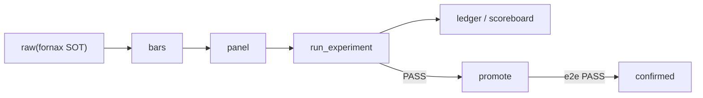

# 架构与数据流(概念版)

数据从哪来、怎么变干净、流到哪去,以及系统靠哪几个"插座"拼起来。工程细节见 [给工程师 · 总览](../engineer/index.md);这里是零基础版。

## 数据的旅程

数据从 vendor 归档进 **raw**(唯一物化段)→ 派生 **bars/panel**(schema-on-read)→ `audit_*` → `run_experiment` 给诚实判决并落 ledger。工程细节:[0 · 工程师入职](../engineer/index.md) · [2 · 数据面与流](../architecture/data-flow.md)。

## 四个"插座"(可扩展点)

| 插座 | 文件 | 干什么 |
|---|---|---|
| `DataSource` | `data/base.py` | 拉 K 线 → bars |
| `Factor` | `alpha/base.py` | bars → 一列(浅;新研究多用 features) |
| `Strategy` | `strategy/base.py` | 信号 → 决策 |
| `BaseBroker` | `broker/base.py` | 下单/查仓 |

`BarStore` 是存储 Protocol(旁路真缝)。逐缝:[3 · 扩展缝](../architecture/seams.md)。

## Symbol:全系统身份证

`Symbol(market, kind, code)` 从 `<market>.<kind>.<code>` 解析;每层靠 `market` 前缀分流。加市场 = `config/markets/<m>.yaml` + 前缀。

## 数据面三件事

1. **SOT = fornax**;本地 `load_bars` cache-first,只补缺口。离主机默认 `RawSource` 抛 `RawUnavailableError`(禁静默回落)。
2. **CI/离线基线**:`ensure_remote_baseline()` → `.baseline_cache/`(勿提交 bars/parquet)。
3. **横截面必须 PIT**:禁止今日名单回填历史——`sp500_close_panel` / `ohlcv_panels`。

## 验证层与双引擎

`run_experiment`(研究闸) ∧ `NautilusEngine`/`book_e2e`(执行闸) → `confirmed`。动手:[跑一个实验](../guides/run-an-experiment.md);为什么:[为什么回测会撒谎](why-backtests-lie.md)。

## 相关页面

| 方向 | 页面 |
|---|---|
| 上游 | [首页](../index.md) · [交易 101](trading-101.md) |
| 下游 | [0 · 入职(工程版)](../engineer/index.md) · [2 · 数据面](../architecture/data-flow.md) |
| 同域 | [领域模型](domain-model.md) · [为什么回测会撒谎](why-backtests-lie.md) |
| ADR / concepts / deep | [ADR-0002](../adr/0002-data-stages-raw-bars-panel-not-lake-layers.md) · [数据管线](../deep/data-pipeline.md) |

## 深入阅读 / 学习 / 拓展

- **站内:** [能力速查](../reference/capabilities.md)
- **源码:** [`data/panel.py` / `ohlcv_panels`](https://github.com/ChiChasesCheese/Quant-Stroller/tree/main/src/quant/data) · [`experiment/promotion.py`](https://github.com/ChiChasesCheese/Quant-Stroller/blob/main/src/quant/experiment/promotion.py)
- **外部:** PIT 幸存者偏差经典讨论(Elton/Gruber 等)—概念页,工程以本仓 PIT universe 为准
