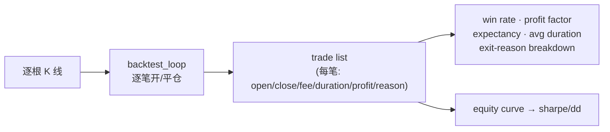
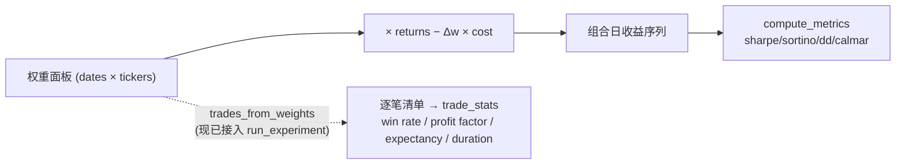
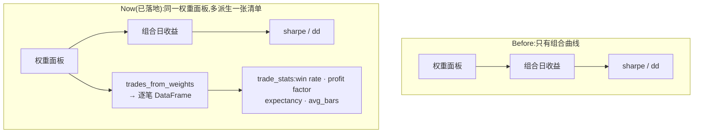

# 10 · 借鉴 freqtrade 的回测设计

> 这页用 [seam 词汇](seams.md)(深度 / 适配器 / 删除测试 / locality)把 freqtrade 的回测和我们的回测放在一起对照,挑出**值得复刻的**和**不该照搬的**。承接 [两个世界](data-flow.md) 和 [BacktestEngine 加深提案](advanced.md),不与它们冲突。
>
> ✅ **本页主推的提案 ①(`trades_from_weights`)现已落地**:`backtest/trades.py`(`trades_from_weights` / `trade_stats`),并已接进 `run_experiment`(`experiment/harness.py` 每次实验自动派生逐笔 + 交易质量统计),测试 `tests/backtest/test_trades.py`。
>
> ✅ **提案 ③(ledger 多记交易质量列)现已落地**:`experiment/harness.py` 的 `ledger.record(...)` 现把 `trade_summary` 的每一列以 `trade_` 前缀写进 ledger row(`trade_n_trades` / `trade_win_rate` / `trade_profit_factor` / `trade_expectancy` / `trade_avg_bars` / `trade_best` / `trade_worst`),schema-tolerant(`ledger.load_ledger` 的 `union_by_name`)所以历史行不受影响。测试 `tests/experiment/test_experiment_harness.py::test_harness_writes_trade_stats_into_ledger`。**同一批**顺带把这套指标接到了 `NautilusEngine`(`backtest/nautilus_engine.py`):`run()` 现在从真实成交(fills)配对出同一 schema 的逐笔 DataFrame(`_trades_from_fills`)挂在 `BacktestResult.trades` 上——比向量化引擎的权重段近似更真实(真实成交价 + 真实手续费),同一个 `trade_stats()` 不改代码就能读,测试 `tests/backtest/test_nautilus_engine.py::test_round_trip_produces_one_trade_matching_trade_stats_schema` 等。提案 ②(显式成交假设)仍为设计草图。第 1、2、4 节里贴的我们这边的代码是**已验证的现有代码**(签名抄自源文件)。
>
> 📎 这页只深挖**回测范式**这一个点。想看 freqtrade **全部子系统**(实盘环 / 策略回调 / 动态加载 / 交易所 / pairlist / protections / hyperopt / FreqAI / Edge / 持久化 / 钱包 / RPC)的逐一对照与功能优化建议,见 → **[freqtrade 全架构对照(逐子系统)](freqtrade-full-comparison.md)**。

---

## 0. 一句话结论

freqtrade 是 **事件驱动、逐笔交易清单(trade list)** 的回测;我们是 **横截面、向量化权重(weights × returns − turnover×cost)** 的回测。两者算的东西本质不同:**逐笔清单解锁 win rate / profit factor / expectancy / trade duration**,而它们恰恰是从权重矩阵里低成本派生出来的 —— 这正是本页原来的主推提案,**现已落地**为 `backtest/trades.py`(`trades_from_weights` 从权重面板纯函数派生逐笔,`trade_stats` group-by 出这批指标),并接进 `run_experiment`。反过来,freqtrade 的单标的/单策略、无横截面、无反过拟合闸门,是我们**刻意不照搬**的部分。

---

## 1. 两种回测范式

### 1.1 freqtrade:事件驱动 + 逐笔交易清单

source(`freqtrade/optimize/backtesting.py`,verified)的形状是:

- 入口 `backtest()` → `time_pair_generator(...)` 按 `(current_time, pair, row, is_last_row, trade_dir)` **逐根 K 线**推进,每根调用一次 `backtest_loop(row, pair, ...)`。
- 进场:`check_for_trade_entry(row)` 命中且 `trade_slot_available()` → `_enter_trade()` **new 一个 `LocalTrade`**,记 `open_rate / open_date / stake_amount / amount / is_short / leverage`,挂一个 entry `Order`。
- 出场:`_check_trade_exit()` → `should_exit()` 产出 `ExitCheckTuple`,`trade.close()` 写 `close_rate / close_date`,`recalc_trade_from_orders()` 结算盈亏。
- **产物是一张交易清单**:每一笔有进场价、出场价、手续费、持仓时长、盈亏、出场原因(`roi / stop_loss / trailing_stop_loss / exit_signal / custom_exit / liquidation / force_exit`)。

**关键洞察**:win rate / profit factor / expectancy / 平均持仓时长 / 出场原因分布,**全都是这张清单的派生统计** —— 有了逐笔记录,这些是 group-by;没有逐笔记录,这些根本算不出来。



### 1.2 我们:横截面 + 向量化权重

我们的研究主路径是 `run_experiment` → `VectorEngine.oos_returns`(`backtest/engine.py`,verified;即原先内联在 harness 的 `_oos_returns`)。它不走逐笔,而是一步矩阵运算:

```python
# backtest/engine.py VectorEngine.oos_returns — 现有代码
w = signal_fn(win).shift(1)...fillna(0.0)        # 权重面板 (dates × tickers)
dw = w_test.diff().abs().fillna(0.0)             # 换手 = 权重变化
cost = dw.sum(axis=1) * fee                       # 或 (dw * fee_panel).sum(axis=1)
port = (w_test * rets.loc[test]).sum(axis=1) - cost   # 组合日收益
```

整个回测就是 `weights × returns − turnover × cost` 求和成一条组合收益序列,再 `compute_metrics` 出 sharpe/sortino/dd/calmar。**没有"一笔交易"这个对象** —— 只有每天的权重和每天的换手。



### 1.3 各自能算什么 / 不能算什么

| 指标 | freqtrade(逐笔) | 我们(向量化权重) |
|---|---|---|
| equity curve / sharpe / sortino / max_dd / calmar | ✅ | ✅(`compute_metrics`) |
| **win rate(胜率)** | ✅ | ✅ `trade_stats`(权重段派生) |
| **profit factor(盈亏比)** | ✅ | ✅ `trade_stats` |
| **expectancy(每笔期望盈亏)** | ✅ | ✅ `trade_stats` |
| **平均持仓时长 / 交易笔数** | ✅ | ✅ `avg_bars` / `n_trades`(换手另有 `dw`) |
| **出场原因分布**(止损 vs 信号 vs ROI) | ✅ | ❌ 权重段无 intrabar 出场原因(见 §2) |
| 横截面 N 标的同时持仓、long/short 权重 | ⚠️ 靠多 pair 槽位拼 | ✅ 原生(权重面板) |
| 反前瞻 / Deflated Sharpe / purged-embargo / crowding 闸门 | ❌ | ✅(4 道闸门) |

两边曾各有一块对方没有的:freqtrade 强在**逐笔交易质量画像**,我们强在**横截面 + 研究纪律**。原来的提案(把前者以最低成本搬过来而不丢后者)**已落地**——`trades_from_weights` 补上了会计意义的逐笔与胜率/盈亏比/期望值;只有 intrabar 出场原因分布仍缺(那是范式差异,见 §2)。

---

## 2. freqtrade 的成交假设 vs 我们的成本模型

freqtrade 在 "Assumptions made by backtesting" 里把成交规则写得很显式(verified 引文):

1. **无滑点,但受 K 线高低约束**:"All orders are filled at the requested price (no slippage) as long as the price is within the candle's high/low range"。
2. **信号出场在下一根开盘**:"Exit-signal exits happen at open-price of the consecutive candle" —— 即 **fill-on-next-candle**,天然防"用当根收盘信号当根成交"的前瞻。
3. **手续费进所有盈亏**:"All profit calculations include fees";order 成本 `Order.cost = amount * price * (1 + fee)`,进出各算一次。
4. **止损/ROI 的优先级**:同一根 K 线内 "Stoploss is evaluated before ROI";"Exit-signal is favored over Stoploss"。止损成交假设有个诚实的坑:"Stoploss exits happen exactly at stoploss price, even if low was lower, but the loss will be 2 \* fees higher" —— 即止损按止损价成交,**乐观**(真实会有缺口穿透)。
5. **历史限额未知**:动态 pairlist、交易所最小下单量等历史信息缺失,会高估可交易性。

对照我们这边:

- 我们的成本是 `turnover × cost`,其中 `cost` 可以是 flat float 也可以是 **realistic 面板**(`backtest/costs.py`,verified):Corwin-Schultz 高低价差(`corwin_schultz_spread_bps`)+ 平方根冲击(`sqrt_impact_bps`,随 AUM/参与率变化)。**这一块我们其实比 freqtrade 更细**:freqtrade 默认零滑点 + 固定 fee,我们已经有 per-(date,asset) 的价差 + 冲击估计。
- 我们**已经有 fill-on-next-candle 的等价物**:`signal_fn(...).shift(1)`(verified)—— 权重滞后一天再吃收益,等价于"今天的信号明天才生效"。
- 我们**缺的是 freqtrade 那种"K 线内路径"假设**:止损/ROI 在当根高低区间内触发、出场原因区分。因为我们是日频权重、没有"一笔"的生命周期,所以止损这种**路径依赖(intrabar)**的事件我们现在表达不了。这是范式差异,不是 bug —— 但如果要支持单标的择时的真实止损,得靠事件式引擎 `NautilusEngine`(`engine_for("e2e")`,见 [advanced.md 候选 1](advanced.md));声明式出场规则的纯模拟器已在 `strategy.exits`。

**小结**:成本真实度上我们不输甚至更强;我们缺的是**逐笔出场逻辑(止损/ROI/trailing)和它带来的路径依赖**,以及 freqtrade 把假设写成一张显式清单的那种**文档纪律**。

---

## 3. 能借鉴 / 复刻的(具体提案)

> 提案 ① **已实现**(代码 = 现有代码);提案 ②③ 仍是设计草图。

### 提案 ①(主推,✅ 已落地):从权重矩阵派生一张"交易清单",解锁交易质量指标

**这是本页最高杠杆的一件,已经做了。** 我们没有重写成事件驱动引擎,就拿到了 freqtrade 那批指标 —— 因为**一张交易清单可以从权重面板纯函数地派生出来**:某标的权重的**连续、同号、非零段 = 一笔隐含持仓**,变号或回零 = 平上一笔、可能开下一笔。落地为 `backtest/trades.py`:

```python
# backtest/trades.py —— 现有代码(签名抄自源文件)
def trades_from_weights(weights: pd.DataFrame, returns: pd.DataFrame) -> pd.DataFrame:
    """把权重面板拆成逐笔:每 ticker 的连续同号非零段 = 一笔。
    对齐约定(测试固定):weights = 第 t 日*持有*的权重(已 shift 为因果),
    returns = 同日该持仓的收益,pnl = Σ_t weight_t·return_t(段内求和,无前瞻)。
    列:ticker, entry_date, exit_date, direction(+1/-1), pnl, bars。"""

def trade_stats(trades: pd.DataFrame) -> dict[str, float]:
    """freqtrade 那批派生统计 —— 纯 group-by。
    返回 n_trades, win_rate, profit_factor, expectancy, avg_bars, best, worst。
    边界:无交易 => 全 0.0;有交易但无亏损笔 => profit_factor = +inf(哨兵)。"""
```

**接在哪里(已接)**:`experiment/harness.py` 在 OOS 权重/收益算出后调 `trades = trades_from_weights(oos_weights, oos_asset_rets); trade_summary = trade_stats(trades)`,每次 `run_experiment` 自动附带这批交易质量统计;`BacktestResult.trades` 字段承接(见 `metrics.py:15`)。**没改任何回测逻辑、没碰闸门** —— 纯增量派生。测试 `tests/backtest/test_trades.py` 把"权重段 = 一笔"钉成 spec。

**为什么这是好缝(删除测试)**:删掉 `trades_from_weights`,胜率/盈亏比/期望就只能在每个研究脚本里手搓 group-by → 它把"权重→逐笔→质量指标"这段复杂度集中到一个窄接口背后。**locality 高、杠杆高。**

**诚实标注边界**:权重派生的 trade 是**会计意义上的逐笔**(权重段:符号不变的连续非零段 = 一笔,段内加减仓不切笔),不是 freqtrade 那种带 intrabar 止损路径的逐笔;**pnl 是段内 `Σ weight·return`,不是单笔进出价差**,故没有 freqtrade 的出场原因分布。这条边界写进了 `test_trades.py`(对齐 seams.md 的"测试即契约")。



### 提案 ②:借鉴 freqtrade 的成交假设,把成本/成交规则写成显式清单

我们的成本模型(Corwin-Schultz + 平方根冲击)其实比 freqtrade 强,但**假设是隐式的**(散在 `shift(1)`、`dw`、`fee` 里)。借鉴 freqtrade 把假设列成一张清单的纪律:

- **显式化 fill-on-next-candle**:把 `signal_fn(...).shift(1)` 这条"今天信号明天成交"写进文档和测试,说明它就是我们的 next-candle 假设。
- **把 [advanced.md 候选 3](advanced.md) 的 `CostModel` Protocol 提拔为显式缝**(✅ qs-1yp.19):`CostModel.cost(weight_change, bars) -> Series`,flat / realistic 是适配器。freqtrade 把 fee/slippage 写在 assumptions 页,我们把成本假设写在 `CostModel` 接口旁。
- **可选**:对单标的择时(世界 A),若要 freqtrade 式的真实止损,必须走事件式引擎 `NautilusEngine`(`engine_for("e2e")`),因为止损是 intrabar 路径依赖,向量化权重表达不了;声明式出场(ROI/止损/移动止损)的纯模拟器是 `strategy.exits.simulate_exits`。**不要**在横截面路径里硬塞止损 —— 那会污染 chokepoint。

### 提案 ③(✅ 已落地):把交易质量指标喂进 ledger

freqtrade 的回测报表把 equity 指标和交易质量指标并列展示。① 落地后,`trade_stats` 已在每次 `run_experiment` 计算并挂在 `ExperimentResult.detail["trades"]`(`harness.py`)。**现已把它也写进 ledger row**:`{f"trade_{k}": v for k, v in trade_summary.items()}` 拼进 `ledger.record(...)` 的 dict,和 `gate_*`/`risk_ledger` 同一个模式——`load_ledger` 的 `union_by_name` 是 schema-tolerant 的,所以历史行照常读成 NULL,不需要迁移。跨运行记忆(scoreboard/`family_history`)现在可以按胜率/盈亏比/期望值这些维度回看历史实验了。

**捎带的加厚**:`NautilusEngine.run()` 现在也从真实成交(fills)配对出同一 schema 的逐笔清单(`_trades_from_fills`),挂在返回的 `BacktestResult.trades` 上——freqtrade 那批指标不再只属于向量化研究引擎,e2e 执行真实性闸门上也能读到(而且比权重段近似更真实:真实成交价、真实手续费,不是"权重×收益"的会计近似)。同一个 `trade_stats()` 函数不用改代码就能吃两种引擎的输出。

**工作量评估**:① 已完成(`backtest/trades.py` + `test_trades.py`,接进 harness);②(显式成交假设清单 + CostModel Protocol)已完成(qs-1yp.19);③ 已完成(ledger 列 + NautilusEngine 加厚)。

---

## 4. 不该照搬的(守住差异化)

freqtrade 是为**单标的 / 单策略 / 实盘 bot** 优化的,有几处我们**刻意不学**:

1. **单标的、无横截面**:freqtrade 的世界是"一个 pair 一条信号线",横截面靠多 pair 槽位拼凑,**没有 long/short 权重、没有横截面中性化**。我们的研究主战场是 N 标的权重面板(BAB / 残差动量 / 价值),这是我们的**核心差异化**,不能为了逐笔清单退回单标的。提案 ① 正是"在保留横截面范式的前提下"补上逐笔视角,而不是反过来。
2. **无反过拟合闸门**:freqtrade 有 hyperopt 但**没有 Deflated Sharpe / purged-embargo / truncation 反前瞻 / crowding** 这套研究纪律(verified:它的文档主推 dry-run 验证,而非多重检验 haircut)。这套闸门(`experiment/gates.py`)是我们最该守住的东西 —— 它把"看起来 alpha 其实是数据/过拟合假象"挡在门外。**绝不能**为了对齐 freqtrade 的报表而绕过闸门。
3. **intrabar 止损/ROI 的乐观假设**:freqtrade 自己承认止损"按止损价成交,即使 low 更低"——这是**乐观偏差**。我们若引入止损,要走事件式引擎并诚实建模缺口穿透,而不是照抄它的乐观近似。
4. **per-trade 回调全家桶(custom_stoploss / adjust_trade_position / DCA / 部分平仓)**:这些是为**单标的实盘精细化**设计的,对横截面因子研究是过度工程。我们的"组合构造"该走 [PortfolioConstructor 缝](advanced.md)(vol-target / 换手带),而不是 per-trade 回调。**别犯 `Factor` 那种"占了生态位却没干活"的错** —— 不要为了像 freqtrade 而引入一堆用不上的回调钩子。

---

## 5. 一句话给程序员

**那件大事已经做了:`trades_from_weights`(`backtest/trades.py`)—— 一个纯函数把权重面板拆成逐笔交易,白捡 win rate / profit factor / expectancy / 持仓时长,已接进 `run_experiment`,不动回测逻辑、不动闸门;这批指标现已写进 ledger row(提案 ③),并且捎带接到了 `NautilusEngine` 的真实成交上——两个引擎读同一个 `trade_stats()`。** 成交假设上我们本就更强(Corwin-Schultz + 平方根冲击 vs freqtrade 的零滑点固定 fee),只欠把假设写成显式清单(提案 ②,唯一剩余草图)。**绝不照搬的是它的单标的范式和"无反过拟合闸门"** —— 那正是我们相对它的护城河。

## 相关页面

| 方向 | 页面 |
|---|---|
| 上游 | [9 · vs 主流](vs-mainstream.md) · [1 · 设计哲学](index.md) |
| 下游 | [11 · 全对照](freqtrade-full-comparison.md) |
| 同域 | [回测指标](../reference/backtest-metrics.md) · [成本与价格](../deep/costs-and-prices.md) |
| ADR / concepts / deep | [慢+快分层](../deep/slow-fast-layering.md)(日内票 `qs-w3l`) |

## 深入阅读 / 学习 / 拓展

- **站内:** [3 · 扩展缝](seams.md)(`ExitPolicy` / `LiveEngine` 现状)
- **源码:** [`strategy/exits.py`](https://github.com/ChiChasesCheese/Quant-Stroller/blob/main/src/quant/strategy/exits.py) · [`backtest/trades.py`](https://github.com/ChiChasesCheese/Quant-Stroller/blob/main/src/quant/backtest/trades.py) · [`execution/protections.py`](https://github.com/ChiChasesCheese/Quant-Stroller/blob/main/src/quant/execution/protections.py)
- **外部:** freqtrade 官方 docs(IStrategy / protections)—只借结构,成本与闸门以本仓为准
