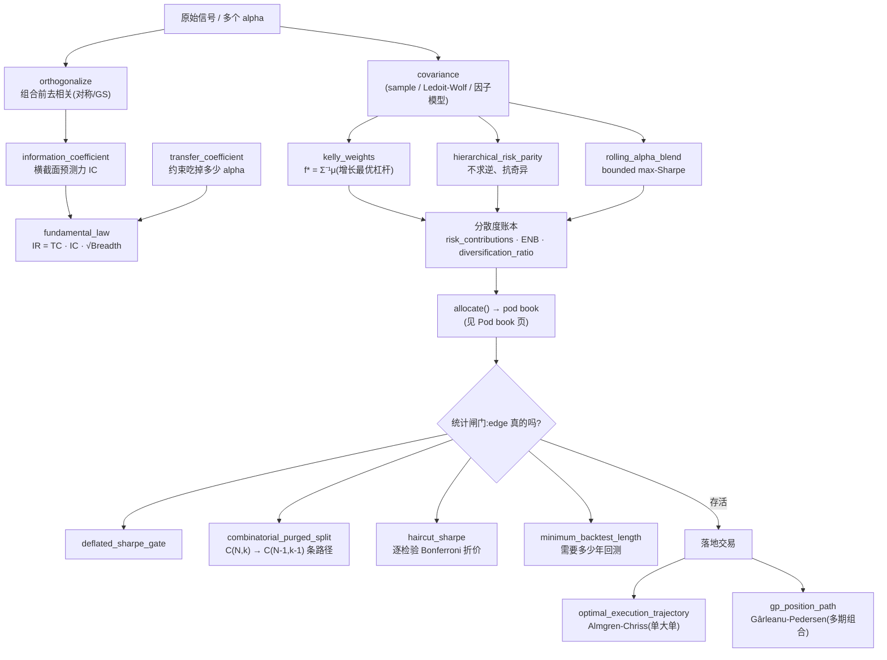
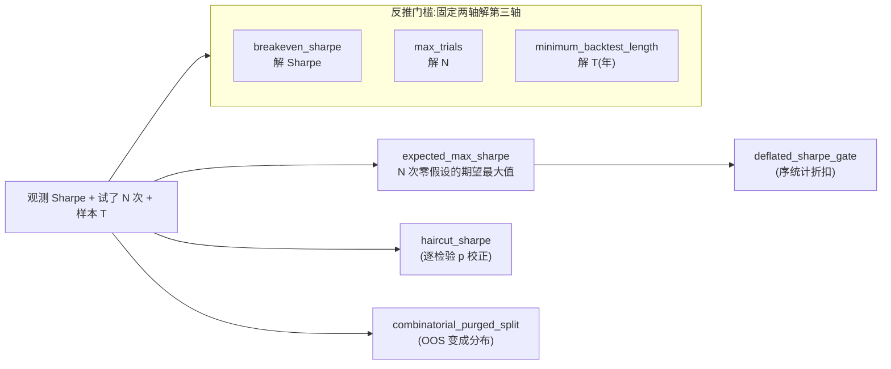

# 7 · 研究纪律 + 资金分配

!!! note "落地状态(与当前分支代码核对)"
    **本页所有函数/类均已落地**(纯函数、因果、`mypy --strict`/`ruff`/TDD 绿)。但下方 API 表按"研究纪律链"分段,**段标题里的模块名是概念归类、不是真实 import 路径** —— 已按代码逐一订正到真实模块(见每段标题的括注)。没有路线图/未落地项。

> 本页把本仓库「信号 → 检验真伪 → 增长最优定杠杆 → 成本感知交易」这条 Citadel 式研究纪律链
> 的**设计图 + API 签名 + 类定义**集中到一处。它和 [Pod book(中央风控+资金分配)](citadel-pod-book.md)
> 是一对:那页讲*一本书怎么拼起来*,这页讲*一个 edge 怎么被证明为真、怎么定杠杆、怎么以最小成本交易*。
> 全部纯函数、因果(`t` 的决策只用 `t-1` 及以前)、`mypy --strict` / `ruff` / TDD 绿。

## 为什么这层存在

Citadel/Millennium 这类多 pod 平台的护城河不是某个 alpha,而是**一套不让你骗自己的研究流程**:
先用多重检验把"看着像 alpha 的数据假象"筛掉,再用主动管理基本定律量化"拼很多弱信号"的收益,
再用增长最优(Kelly)把信号翻译成杠杆,最后用 Almgren-Chriss / Gârleanu-Pedersen 把目标仓位以
最小冲击成本兑现。这层就是把这条链的每一环做成可单测的纯函数。

## 设计图 —— 从信号到落地的漏斗

三段一以贯之:**信号工程**(IC / 基本定律)→ **构造与定杠杆**(Kelly / HRP / blend / 分散度)→
**检验真伪**(DSR / CPCV / 折价 / minBTL)→ **成本感知落地**(AC / GP)。每一环都吃上一环的输出,
且都对"未来 bar 不能动今天的决策"有显式单测。

## 多重检验:同一件事的三个角度 + 三条反推腿

## API 参考

### 信号工程(真实模块:`information_coefficient`/`transfer_coefficient`/`fundamental_law` 在 `quant.alpha.breadth`;`grinold_forecast` 在 `quant.alpha.forecast`;`symmetric_orthogonalize`/`gram_schmidt_orthogonalize` 在 `quant.alpha.orthogonalize`;`implied_equilibrium_returns`/`black_litterman` 在 `quant.portfolio.black_litterman`)

| 签名 | 返回 | 契约 |
|---|---|---|
| `information_coefficient(forecasts, realized, *, method="pearson")` | `float` | 逐日横截面相关(`method="spearman"` 用秩 IC)的均值;退化/常数行跳过;无可用日 → `NaN` |
| `grinold_forecast(scores, *, ic, vol)` | `pd.DataFrame` | Grinold 精化:`alpha = vol · IC · zscore(scores)` —— 原始信号 → 可喂优化器的预期收益;`ic=0` → 平;`vol` 支持 Series 或时变面板 |
| `implied_equilibrium_returns(cov, weights, *, risk_aversion=2.5)` | `pd.Series` | 反向优化先验 `Π=δ·Σ·w`(市场隐含观点);喂回 `mean_variance` 还原市场权重 |
| `black_litterman(prior, cov, views, view_values, *, tau=0.05, omega=None)` | `BlackLittermanResult` | 先验 Π + 观点 `P/Q/Ω` 贝叶斯融合 → 后验预期收益(喂优化器);无观点→先验,确定观点→`P·μ=Q` |
| `transfer_coefficient(actual, ideal, cov)` | `float` | 实际持仓与理想无约束持仓在 `Σ` 内积下的余弦 ∈ `[-1,1]`;只缩放方向 → 1,风险正交 → 0;按列名对齐 |
| `fundamental_law(ic, breadth, *, transfer_coefficient=1.0)` | `float` | `TC · IC · √Breadth`(Grinold-Kahn);`breadth<0` 抛错 |
| `symmetric_orthogonalize(signals)` | `pd.DataFrame` | Löwdin/ZCA 对称正交化:`Σ⁻¹/²` 白化,输出协方差=I,顺序无关、最贴近原信号;退化方向归零不放大 |
| `gram_schmidt_orthogonalize(signals)` | `pd.DataFrame` | Gram-Schmidt 逐列残差化:留第一个信号、把它从后续投影掉,列间正交;顺序相关 |

### 增长最优定杠杆(`quant.portfolio.kelly`)

| 签名 | 返回 | 契约 |
|---|---|---|
| `kelly_fraction(mean, variance)` | `float` | 标量 `μ/σ²`;无 edge / 退化方差 → 0 |
| `kelly_weights(mean, cov, *, fraction=1.0)` | `pd.Series` | `fraction · Σ⁻¹μ`;奇异协方差走伪逆;按列名对齐 |
| `kelly_growth_rate(mean, cov, *, fraction=1.0)` | `float` | `(c − c²/2)·μᵀΣ⁻¹μ`;满 Kelly 为峰,半 Kelly 保 75% 增长 |

### 构造与分散度(多在 `quant.portfolio.construction`;`factor_model_covariance` 在 `quant.portfolio.covariance`;`fit_factor_risk_model`/`factor_risk_decomposition`/`factor_neutralize` 在 `quant.portfolio.factor_risk`)

| 签名 | 返回 | 契约 |
|---|---|---|
| `minimum_variance(cov)` | `pd.Series` | 全局最小方差组合 `w∝Σ⁻¹1`(前沿最左点);不需收益预测,最稳健;无关→逆方差权重 |
| `maximum_diversification(cov)` | `pd.Series` | 最大分散组合 `w∝Σ⁻¹σ`(Choueifaty);最大化(带符号)分散比率;无关→逆波动权重 |
| `risk_budget(cov, budget, *, max_iter=1000, tol=1e-12)` | `pd.Series` | 风险预算(Roncalli):RC_i ∝ `budget_i`(risk parity 的一般化);等预算=risk_parity;Spinu 循环下降 |
| `factor_model_covariance(asset_returns, factor_returns)` | `pd.DataFrame` | Barra 式结构化协方差 `Σ=B·Σ_F·B'+D`(低秩因子+对角特异风险);PSD,name≈obs 时远比样本协方差良态,喂任意优化器 |
| `fit_factor_risk_model(asset_returns, factor_returns)` | `FactorRiskModel` | 拟合因子风险模型(loadings `B` / `factor_cov` / `specific_var`);`.covariance()` 等于上面的结构化 Σ |
| `factor_risk_decomposition(weights, model)` | `FactorRiskDecomposition` | 整本书风险归因:总方差 = 各因子贡献(`B'w` 经 `Σ_F`)+ 特异性;`factor_fraction`=系统性占比(中央风控"风险来自哪"视角) |
| `factor_neutralize(weights, loadings)` | `pd.Series` | 把权重正交到全部因子 loadings(`w - B(B'B)⁻¹B'w`),`B'w=0` 同时对所有因子;分解的构造对偶,奇异走伪逆 |
| `hierarchical_risk_parity(cov)` | `pd.Series` | HRP(López de Prado):树聚类→拟对角→递归二分,不求逆;退化(零/非有限方差)名降权为 0 |
| `risk_contributions(weights, cov)` | `pd.Series` | 每仓位占组合方差的份额,加总 = 1(凸划分仅对同号/纯多头成立) |
| `effective_number_of_bets(weights, cov)` | `float` | 风险贡献的逆赫芬达尔(同号书 ∈ `1..N`) |
| `diversification_ratio(weights, cov)` | `float` | 加权平均波动 / 组合波动(≥1,越高越分散) |
| `rolling_alpha_blend(returns, *, window, max_weight=1.0, long_only=True, shrinkage=True, rebalance=21)` | `pd.Series` | 因果 bounded max-Sharpe alpha 融合 |

### 成本感知交易(`gp_*` 在 `quant.portfolio.dynamic_trading`,`optimal_execution_trajectory` 在 `quant.execution.optimal_execution`;`mean_reversion_speed`/`half_life`/`ic_decay_profile` 在 `quant.alpha.decay`;`cost_drag` 在 `quant.backtest.turnover`;`portfolio_turnover` 已于 qs-6yyk.10 退役)

| 签名 | 返回 | 契约 |
|---|---|---|
| `gp_trade_rate(gamma, lam, rho)` | `float` | G-P Prop.2 eq.9 的成交速率 `a/λ ∈ (0,1)`;成本↑变慢、风险厌恶↑变快、无摩擦→1 |
| `mean_reversion_speed(signal)` | `float` | 信号的 OU/AR(1) 衰减率 `phi = -ln(rho)`;直接喂给 `gp_aim_scale(phi=…)`(估计 → 应用闭环) |
| `half_life(signal)` | `float` | 衰减半衰期(周期数)`ln2/phi`;非均值回复/常数 → `inf` |
| `ic_decay_profile(forecasts, returns, horizons, *, method="pearson")` | `pd.Series` | IC 随持有期 h 的衰减曲线(forecast vs h 步后收益的横截面 IC)→ 信号的自然持有期;按 horizon 索引 |
| `cost_drag(weights, *, cost_bps, periods_per_year=252)` | `float` | 按实际成交名义额年化的成本拖累 = `2·turnover·cost_bps/1e4·ppy` |
| `gp_aim_scale(phi, gamma, lam, rho)` | `float` | G-P Prop.4 eq.15 的 alpha 衰减权重 `1/(1+φ·a/γ)`;持久信号权重更大 |
| `gp_position_path(markowitz, *, gamma, lam, rho, decay=None)` | `pd.DataFrame` | 因果递归 `x_t=(1-rate)x_{t-1}+rate·aim_t` 向(可选衰减缩放的)目标部分成交 |
| `optimal_execution_trajectory(total_shares, *, n_periods, volatility, temporary_impact, risk_aversion=0.0, horizon=1.0)` | `ExecutionSchedule` | Almgren-Chriss 单大单最优拆分;风险中性→TWAP、风险厌恶→前置;各 slice 之和 = `total_shares` |

### 反自欺统计(`quant.experiment.stats` / `quant.experiment.splits`)

| 签名 | 返回 | 契约 |
|---|---|---|
| `probabilistic_sharpe_ratio(sr, n_obs, sr_benchmark=0, skew=0, kurt=3)` | `float` | `P(真 Sharpe > 基准)` |
| `expected_max_sharpe(n_trials, trials_sr_std)` | `float` | N 次零假设试验的期望最大 Sharpe |
| `breakeven_sharpe(n_trials, n_obs, *, min_prob=0.95, periods_per_year=252)` | `float` | 过 DSR 闸门需要的原始 Sharpe;小样本不可达 → `inf` |
| `max_trials(sr, n_obs, *, min_prob=0.95, periods_per_year=252, cap=100000)` | `int` | 一个 Sharpe 能扛几次试错 |
| `minimum_backtest_length(n_trials, sr, *, periods_per_year=1.0)` | `float` | 试 N 次后,这个 Sharpe 需多少年回测才非偶然;`sr≤0 → inf` |
| `haircut_sharpe(observed_sr, n_obs, n_tests, *, periods_per_year=252)` | `HaircutResult` | Harvey-Liu Bonferroni 折价(非线性) |
| `n_backtest_paths(n_groups, n_test_groups)` | `int` | CPCV 重建的 OOS 路径数 `C(N-1,k-1)` |
| `combinatorial_purged_split(index, *, n_groups=6, n_test_groups=2, embargo)` | `list[CombinatorialSplit]` | 组合式 purged/embargo 切分,把 OOS 变成路径分布 |
| `reconstruct_cpcv_paths(index, splits, oos_by_split)` | `list[pd.Series]` | 把每切分的 OOS 片段拼回 `C(N-1,k-1)` 条全样本路径(每条覆盖全样本一次)→ 指标分布 |

## 类 / 数据类定义

### `HaircutResult`(frozen dataclass,`quant.experiment.stats`)

| 字段 | 类型 | 含义 |
|---|---|---|
| `haircut_sharpe` | `float` | 经多重检验校正后"幸存"的 Sharpe |
| `haircut_ratio` | `float` | 被折掉的比例 ∈ `[0,1]`(0=没动,1=完全不存活) |
| `adjusted_pvalue` | `float` | Bonferroni 校正后的 p 值 |
| `adjusted_tstat` | `float` | 校正后的 t 值(`p_adj=1` 时为 `-inf`) |

### `CombinatorialSplit`(frozen dataclass,`quant.experiment.splits`)

| 字段 | 类型 | 含义 |
|---|---|---|
| `train` | `pd.DatetimeIndex` | purged + embargo 后的训练集 |
| `test` | `pd.DatetimeIndex` | 本切分的测试集(选中各组之并) |
| `test_groups` | `tuple[int, ...]` | 测试集所含的连续组下标(用于把各切分的 OOS 拼回路径) |

### `FactorExposure`(dataclass,`quant.portfolio.factor_risk`)

| 字段 | 类型 | 含义 |
|---|---|---|
| `betas` | `pd.Series` | 各因子载荷(OLS 斜率) |
| `alpha` | `float` | 截距(因子无法解释的超额) |
| `r_squared` | `float` | 系统性因子解释的方差占比 ∈ `[0,1]` |
| `idio_vol` | `float` | 特异性(残差)波动 —— 真正的选股 edge |
| `total_vol` | `float` | 总波动 |

### `FactorRiskModel` / `FactorRiskDecomposition`(frozen dataclass,`quant.portfolio.factor_risk`)

`FactorRiskModel`:`loadings`(B,资产×因子)/ `factor_cov`(Σ_F)/ `specific_var`(对角 D);`.covariance()` 拼出结构化 Σ。
`FactorRiskDecomposition`:`total_variance`=`factor_variance`+`specific_variance`;`factor_fraction`=系统性占比;`factor_contributions`(每因子贡献,和=`factor_variance`)。

### `ExecutionSchedule`(dataclass,`quant.execution.optimal_execution`)

| 字段 | 类型 | 含义 |
|---|---|---|
| `holdings` | `np.ndarray` | `n_periods+1` 个网格点上的剩余持仓(`holdings[0]`=满仓,`holdings[-1]`=0) |
| `trades` | `np.ndarray` | 每个区间要成交的股数(`trades[j]=holdings[j]-holdings[j+1]`,之和=总量) |

> `PodRiskLimits` / `AllocationResult` / `BookResult` 的类定义见 [Pod book 页](citadel-pod-book.md)。

## 真实数据实证(research 脚本)

`research/grinold_pipeline_e2e.py`(`uv run python -m research.grinold_pipeline_e2e`)在 committed
`market_data/` 上跑完整 alpha 流水线:横截面动量 score → `information_coefficient` →
`grinold_forecast` → 因果多空书 → `fit_factor_risk_model`/`factor_risk_decomposition` →
诚实闸门(`lo_annualized_sharpe` / PSR / `minimum_track_record_length` / `haircut_sharpe` /
ulcer·martin)→ `amihud_illiquidity`。**结论:一个看着合理的真实动量策略被诚实地判为"证据不足"**
(IC +0.014、PSR 0.74、MinTRL 需 95 年仅有 15 年、20 次试错折价 100%)——这正是框架该有的样子。

## 一条线跑通(组合证明)

`tests/integration/test_alpha_to_book_integration.py` 把上面这些拼成一条因果链单测:
`information_coefficient → fundamental_law(× transfer_coefficient) → kelly_weights →
risk_contributions / ENB / diversification_ratio / HRP → combinatorial_purged_split →
minimum_backtest_length / haircut_sharpe`。该测还钉住一个实测发现:对市场中性的 Kelly 理想组合,
**只做多约束能把 transfer_coefficient 压到负值**(留下的多头书与理想反相关),而保号限仓只把它从 1 略降。

## 相关页面

| 方向 | 页面 |
|---|---|
| 上游 | [6 · Pod book](citadel-pod-book.md) · [8 · 蓝图 PRD](citadel-framework-prd.md) |
| 下游 | [跑一个实验](../guides/run-an-experiment.md) · [验证方法论](../reference/validation-methodology.md) |
| 同域 | [5 · 风险层](risk-layer.md) · [信号集成](../reference/signal-ensembling.md) |
| ADR / concepts / deep | [多重检验](../concepts/multiple-testing.md) · [为什么回测会撒谎](../concepts/why-backtests-lie.md) · [参数与过拟合](../deep/parameters-and-hyperopt.md) |

## 深入阅读 / 学习 / 拓展

- **站内:** [能力速查](../reference/capabilities.md) · [实验框架 API](../reference/experiment-framework.md)
- **源码:** [`alpha/breadth.py`](https://github.com/ChiChasesCheese/Quant-Stroller/blob/main/src/quant/alpha/breadth.py) · [`portfolio/kelly.py`](https://github.com/ChiChasesCheese/Quant-Stroller/blob/main/src/quant/portfolio/kelly.py) · [`experiment/stats.py`](https://github.com/ChiChasesCheese/Quant-Stroller/blob/main/src/quant/experiment/stats.py) · 集成测 `tests/integration/test_alpha_to_book_integration.py`
- **外部:** Grinold-Kahn Fundamental Law; Kelly 原式与分数 Kelly 实务
