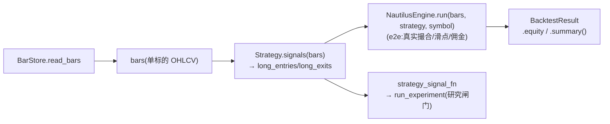
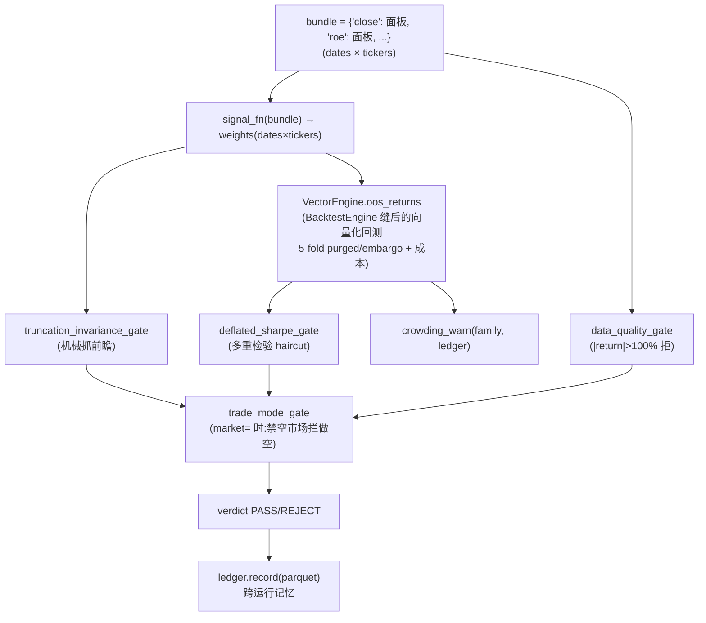
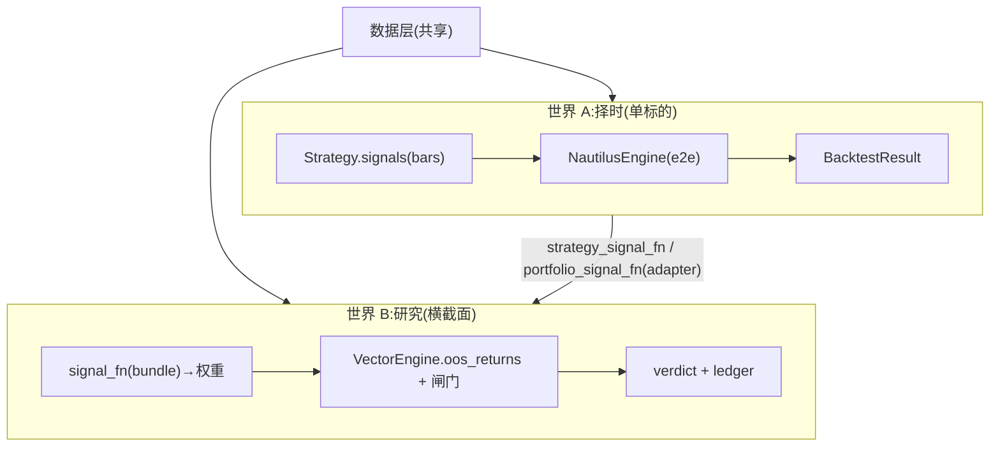

# 2 · 数据面与流

> 精确版。每个箭头都对应真实代码;签名直接抄自源文件。重点:**这个仓库曾有两套并行的数据流;它们现在已被 adapter 桥接成同一条研究主干。** 看清这一点是理解后面所有优化的前提。


## 通用键:Symbol

一切以 `Symbol(market, kind, code)` 为键(`core/symbols.py`),从 `<market>.<kind>.<code>` 字符串解析:`us.stock.AAPL`、`crypto.spot.BTC/USDT`。每一层都按 `symbol.market` 前缀分派 —— `BrokerRouter.for_symbol()` 选 broker,`ingest.default_source_for()` 选 DataSource。**这是整个系统的"主键",是少数贯穿所有层的好抽象。**

## 四个 ABC(verified 签名)

```python
# data/base.py
class DataSource(ABC):
    @abstractmethod
    def fetch_bars(self, symbol, start, end, timeframe) -> pd.DataFrame  # [ts,open,high,low,close,volume]

# alpha/base.py
class Factor(ABC):
    @abstractmethod
    def compute(self, bars: pd.DataFrame) -> pd.Series        # 一列因子

# strategy/base.py
class Strategy(ABC):
    @abstractmethod
    def signals(self, bars: pd.DataFrame) -> Signal           # long_entries / long_exits(单标的!)

# broker/base.py
class BaseBroker(ABC):
    @abstractmethod
    def submit(self, order) -> Order; def positions() -> list[Position]; def account() -> Account
```

注意 `Strategy.signals` 的形状:**输入一个标的的 bars,输出 entries/exits**。这是**单标的、事件式**的契约 —— 跟横截面研究(一篮子标的 → 权重矩阵)是**两种完全不同的形状**。这就是"两个世界"的根源(下文说明它们如何被桥接)。

## 世界 A:Strategy → 引擎(单标的择时)



- `NautilusEngine.run(self, bars, strategy: Strategy, symbol=...)` —— 事件驱动(NautilusTrader),真实撮合/滑点/佣金,是**执行保真 e2e 闸**(可选 `[nautilus]` extra)。
- `strategy_signal_fn(strategy, bars, code=...)`(`strategy/adapter.py`)把单标的 `Strategy` 编译成横截面 `SignalFn`(截断时因果重算),于是择时策略也能穿过世界 B 的研究闸门。`SignalFn` 契约本身住在 `quant.core.research`(qs-8sq),adapter/engine 只是消费方。
- 适用:单标的择时策略(如 `bb_reversion`、`dual_momentum`)—— 既能走 NautilusEngine e2e,又能经 adapter 走 run_experiment 研究闸。
- 历史:`VBTEngine` / `BTEngine` / `GridEngine` / `PortfolioEngine` / `IntradaySessionEngine` 已在引擎收敛中退役并物理删除(`vectorbt`/`backtrader` 也从依赖移除),见 `engine-consolidation-design.md`。

## 世界 B:run_experiment 闸门(横截面,研究路径)



- 入口:`run_experiment(signal_fn, bundle, *, family, lookback, holding, n_trials, ledger_root, fee_bps=None, cost_scenario=None, n_folds=5, market=None, construct=None, engine=VectorEngine(), ...)`。`fee_bps=None` 时由 `resolve_fee_bps` 按 `market`/`cost_scenario` 解析成本,不显式给则市场默认。
- `signal_fn: Callable[[dict[str,DataFrame]], DataFrame]` —— **横截面、权重**(多正空负)。
- **关键事实**:`harness.py` **不 import** `Strategy`、`Factor` 或 `NautilusEngine`(执行 e2e 引擎);它只依赖 `compute_metrics` + `BacktestEngine` 缝后的 `VectorEngine`(默认引擎,`engine=` 可注入)。回测力学走 `VectorEngine.oos_returns`(原内嵌的 `_oos_returns` 已抽出为可换引擎)。
- **成本计量**:每折的换手对**跨折结转的账本**算 `|Δw|` —— 第 1 折从现金建仓、后续折按上一折收盘仓位换手。折的首个 bar 与其他 bar 同等计费,**没有免费入场**(qs-pbbj;此前 `diff().fillna(0)` 让 5 次建仓/换仓全免,系统性高估低换手账本)。
- 闸门:`truncation_invariance` / `data_quality` / `deflated_sharpe` / `crowding_warn`,以及命名 `market=` 时的 `trade_mode`(禁空市场提前 FAIL 做空信号)。`market=` 还是市场结构的**单一真相**:它驱动年化、`trade_mode` 闸,并在无自定义 `construct` 时自动施加无做空 / 涨跌停 enforcement。

## 数据层:cache-first(两个世界共享的唯一地基)


- `load_bars`(`data/ingest.py`)只补缺口,重复回测复用持久化数据。
- `BarStore` 是 **Protocol(结构化类型)**:`coverage / read_bars / write_bars`,3 个后端(DuckDB/CSV/Parquet)都满足,无需继承。
- 返回前用 `audit_bars(df)` 做数据质量闸(schema / OHLC 合理性 / PIT / staleness),FAIL 即数据不可用。
- 基本面是并行的 typed family:`FundamentalSource`(EDGAR)→ `FundamentalStore` → `pit.as_of_panel`(filed_date 对齐)→ 进 bundle。
- **Tick/LOB**(`data/tick.TickLobSource`)是另一条并行可选缝(分笔/盘口);`is_sot=False`,**永不**替换默认 `raw→bars` / `default_source_for`。纸面适配器:`RecordedTickLobSource`。
- **DuckDB 在三处各干一件事**(统一的本地列式查询/缓存引擎,不是建模依赖):local 是 `DuckDBStore`(`load_bars` 默认缓存,gitignored);离线/CI 基线走 `ensure_remote_baseline()` → `.baseline_cache/`(+ 契约测试里的 `CsvBarStore`);`experiment/ledger.py` 用 `read_parquet(union_by_name)` 对 parquet ledger 做 schema 容忍的只读查询;fornax 的 `zc` 环境装 duckdb 属数据栈,对 jqdata parquet / sweep ledger 做 ad-hoc SQL。
- **时区约定**:`DataSource` 契约是 ts 一律 UTC,日线时间戳统一 floor 到 **UTC midnight**(`CNStockSource` 与 US 源一致),跨市场 join 天然对齐;各市场本地交易时段/时区在 `config/markets/*.yaml` 的 `session` 块(cn: `Asia/Shanghai` 9:30–15:00 含午休,us: `America/New_York`),日内隔夜缺口由 `session_mask` 处理。注意 "UTC midnight" 是**存储键的约定,不是真实成交时刻**——同一"日期"的 bar,A 股 07:00 UTC 已收盘,美股 21:00 UTC 才收。跨市场同日信号的因果纪律:A 股今天可以用美股**昨天**的收盘,不能用同日。

## 执行层(存在但未接成实盘环)

`BrokerRouter.for_symbol(symbol) → BaseBroker`(按 market 分派 Paper/Alpaca/CCXT),`RiskManager.check(order, account, mark_price) → RiskCheck`(黑名单 + 按敞口方向双边生效的单笔仓位上限与总敞口封顶——SELL 开空/加空同样受限,reduce-only 出场豁免,qs-243k)。零件已被 `execution/engine.py` 的 **`LiveEngine.tick(target_weights, marks)`** 装成一次 reconcile:对账实际持仓 → 按 live 权益 sizing 每个 delta → 过同一个 `RiskManager` → 经 `BrokerRouter` 提单(dry-run 换 `PaperBroker`,live 换真 broker,逻辑一致)。外环 while/cron 与成交持久化见 `LiveHeartbeat` + `TradeDB`(仍可挂 Prefect `daily` flow)。daily flow 另挂 data-health + Yahoo↔EODHD reconcile 巡检,失败/零产出经 `quant.notify` 统一出口(默认落 research/ops 下运行时 JSONL 审计)。详见 [和主流框架的差异](vs-mainstream.md)。

## 两个世界为什么曾不相交,以及如何被桥接



- **契约形状不同**:A 是 `bars→entries/exits`(单标的);B 是 `面板→权重`(横截面)。
- **回测分工不同(不冗余)**:A 用 `NautilusEngine`(e2e 执行保真,真实成交);B 用 `VectorEngine.oos_returns`(向量化研究闸,purged-CV / DSR)。一个策略"两闸都过"才算 confirmed(`quant.experiment.promote`)。
- **桥接**:`strategy/adapter.py` 的 `strategy_signal_fn`(单标的 `Strategy`)把策略编译成世界 B 的 `SignalFn`,截断时因果重算,于是 legacy 策略也能穿过 chokepoint 的闸门。`portfolio_signal_fn`(多资产 `PortfolioStrategy`)迁到 `research/strategies/adapter.py` 随整条 `PortfolioStrategy` 线一起(qs-6yyk.14,0 生产子类)。

> `backtest/engine.py`(`BacktestEngine` 缝)与 `strategy/adapter.py` 把两个世界桥接;引擎已收敛到 `VectorEngine`(研究闸,`session_aware=True` 日内)+ `NautilusEngine`(e2e 闸),旧 VBT/BT/Grid/Portfolio/IntradaySession 退役。

先看 [扩展点逐个剖析](seams.md) 把每条缝的深浅讲透,或 [优化/高级架构](advanced.md)。

## 相关页面

| 方向 | 页面 |
|---|---|
| 上游 | [1 · 设计哲学](index.md) · [0 · 入职](../engineer/index.md) |
| 下游 | [3 · 扩展缝](seams.md) · [实验框架](../reference/experiment-framework.md) |
| 同域 | [4 · 模块图](module-graph.md) · [9 · vs 主流](vs-mainstream.md) · [14 · vectorbt/Nautilus 搭配](vectorbt-nautilus-and-our-engines.md) |
| ADR / concepts / deep | [ADR-0002](../adr/0002-data-stages-raw-bars-panel-not-lake-layers.md) · [架构概念版](../concepts/architecture-and-data-flow.md) · [数据管线](../deep/data-pipeline.md) · [数据治理](../deep/data-governance.md) |

## 深入阅读 / 学习 / 拓展

- **站内:** [仓库状态(自动生成)](../deep/data-warehouse.md) · [为什么回测会撒谎](../concepts/why-backtests-lie.md)
- **源码:** [`data/ingest.py`](https://github.com/ChiChasesCheese/Quant-Stroller/blob/main/src/quant/data/ingest.py) · [`experiment/harness.py`](https://github.com/ChiChasesCheese/Quant-Stroller/blob/main/src/quant/experiment/harness.py) · [`execution/engine.py`](https://github.com/ChiChasesCheese/Quant-Stroller/blob/main/src/quant/execution/engine.py) · [`strategy/adapter.py`](https://github.com/ChiChasesCheese/Quant-Stroller/blob/main/src/quant/strategy/adapter.py)
- **外部:** López de Prado — *Advances in Financial Machine Learning* (purged/embargo CV)
