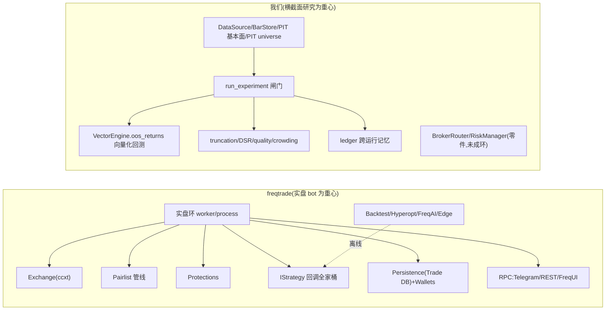
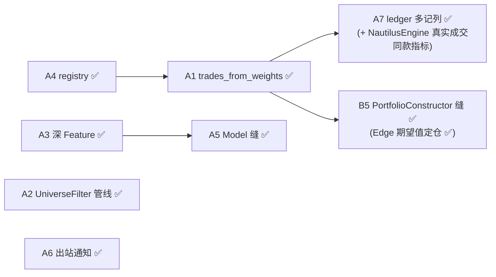

# 11 · freqtrade 全架构对照

> 这页把 **freqtrade 的整个架构**(不只回测)一个子系统一个子系统地摊开,和我们逐一对照,每条都给**功能优化建议**。它是 [借鉴 freqtrade 的回测设计](borrowing-from-freqtrade.md) 的"广度补全":那页深挖**一个**点(逐笔交易清单),这页覆盖 freqtrade 的**全部主子系统**(实盘环 / 策略接口 / 动态加载 / 交易所 / pairlist / protections / hyperopt / FreqAI / Edge / 持久化 / 钱包 / RPC / DataProvider / 绘图)。
>
> 沿用 [seam 词汇](seams.md)(深度 / 适配器 / 删除测试 / locality)。
>
> ⚠️ **可信度标注**:
> - **freqtrade 侧**的描述基于其**公开文档与源码目录结构**(跨近几个版本稳定),用于架构对照,**非本会话逐文件复核**;文件路径是定位用的路标,不是逐行引文。
> - **我们侧**贴的签名/行为均**抄自本仓库源文件(verified)**。
> - 第 3 节往后的"建议/草图"都是**提案**,不是现有代码。

---

## ⏱ 对账更新(本页写于约 80 个提交前 —— 当时的"该补"清单现在大半已落地)

> 本页最初是一份**差距诊断**。此后的自主迭代 + 并行 session 已经把"档 A 真该补"的多数缝实现了。**读下面的章节时,把"我们缺 X"理解为"当时缺,现状见此表"** —— 各章保留作推理记录,现状以本表为准。

| 本页当时点的差距 | 现状 | 落地于 |
|---|---|---|
| §3 实盘环 / LiveEngine("搭好零件没接环") | ✅ **已实现** | `execution/engine.py`(`LiveEngine` —— 一次 reconcile tick,dry-run=换 PaperBroker) |
| §5 `registry` 孤儿(0 调用者) | ✅ 已接上 | `data/registry.py` 接进 `ingest.register_default_sources` |
| §7 Pairlist 可组合管线 | ✅ **已实现** | `data/universe_pipeline.py`(`UniverseFilter` Protocol + Membership/Price/Age/Liquidity/TopN/Volatility filters + `build_universe`;底层 ADV 在 `data/liquidity.py`) |
| §8 Protections("触发后锁定"状态机) | ✅ **已实现** | `execution/protections.py`(CooldownPeriod / MaxDrawdown / StoplossGuard) |
| §11 FreqAI / `Model` 缝(ML 沉淀) | ✅ 部分 | `model/combine.py`(IC 加权 / rolling ridge,OOS 因果) |
| §12 Edge / PortfolioConstructor(按期望值定仓) | ✅ | `portfolio/construction.py`(含 `expectancy_weight`)+ `sizing.py` + `sleeves.py` |
| §13 持久化 & Wallets(实盘记账) | ✅ Wallets 已实现 | `execution/wallets.py`(资金/按比例定仓);交易库仍按"实盘才需要"留 B 档 |
| §14 RPC / 通知 | ✅ 通知已实现 | `notify.py`(NotificationManager + sinks,freqtrade rpc/webhook 类比) |

**本页写完后还新增了几块研究侧能力(freqtrade 没有、属我们差异化加厚)**:反自欺工具链 `experiment.scoreboard` + `stats.breakeven_sharpe`/`max_trials`(把 DSR 闸门正反向都做成工具),组合层 `portfolio.risk_overlay`(回撤断路器)、`sleeves.stress_correlation`(危机相关性 breakdown 度量)、`sleeves.combine_sleeves(window=)`(因果组合权重)。

**仍真开口的**:§6 交易所精度/最小下单量/限频(实盘细节,B)、§10 Hyperopt 的"loss 可换"缝(我们靠 DSR 闸门设防而非自动扫参,C)。

---

## 0. 一句话结论

**freqtrade 是一个"实盘交易机器人"(live bot for retail crypto),架构的重心是"7×24 跑着、对单标的逐笔下单、被 Telegram 指挥";我们是一个"横截面研究框架",重心是"一次性跑实验、用闸门挡过拟合、把结论落 ledger"。** 两者几乎是镜像:freqtrade 在**实盘环、策略回调、交易所适配、动态 pairlist、RPC 远程控制、持久化交易库**上厚得多;我们在**横截面权重、反过拟合闸门、PIT 基本面、去幸存者偏差 universe、跨运行记忆**上厚得多。本页的价值是把 freqtrade 那侧"厚"的每一块说清楚,挑出**哪些值得我们补、以什么形态补(新缝而不是新壳)、哪些是它实盘专属不该照搬**。



---

## 1. 主子系统总对照表

> 这是全页的"地图"。每一行下面第 3 节起有展开。"缝健康"沿用 [seam 地图](index.md) 的判据。

| freqtrade 子系统 | 大致位置(路标) | 它干什么 | 我们的对应物 | 差距 | 建议(详见对应小节) |
|---|---|---|---|---|---|
| **实盘环 / Worker** | `worker.py` · `freqtradebot.py:process()` | throttle 循环,dry-run/live 切换,每轮拉价→选币→进出场→下单 | `scheduler/flows/daily.py`(Prefect,跑一次)+ `BrokerRouter`/`RiskManager`(零件) | **大**:没有 `while True` 实时引擎、没有 dry-run 钱包 | §3 —— 把零件接成 `LiveEngine` 缝 |
| **IStrategy 接口** | `strategy/interface.py` | `populate_indicators/entry/exit` + 一堆回调 | `Strategy.signals(bars)→Signal`(单标的)/ `signal_fn(bundle)→权重`(横截面) | 我们**信号契约更窄更干净**;缺回调(刻意) | §4 —— 不照搬回调全家桶 |
| **动态加载 / Resolver** | `resolvers/iresolver.py` | 按名字从目录动态加载策略/pairlist/protection 类 | `data/registry.py` + `ingest.register_default_sources`(**已接线**) | 无热加载 Resolver;加源= yaml + `_SOURCE_BUILDERS` | §5 —— 单轨已闭;勿再平行自注册 |
| **Exchange 抽象** | `exchange/exchange.py` | ccxt 包一层:精度/限频/市场/dry 钱包/下单 | `DataSource`(取价)+ `BaseBroker`/`CCXTBroker`(下单),**拆成两条缝** | 我们没有"精度/最小下单量/限频"这层实盘细节 | §6 —— 实盘前需补 precision/limits |
| **Pairlist 管线** | `plugins/pairlist/*` | 可链式的选币过滤器(成交量/年龄/价差/波动…) | `data/universe.SP500Universe`(PIT 成员)+ `quality.audit_*` | 我们有**更强的 PIT/去幸存者**,但**不是可组合管线** | §7 —— 抽 `UniverseFilter` 管线缝 ⭐ |
| **Protections** | `plugins/protections/*` | 触发后**锁仓**:止损守卫/最大回撤/低利对/冷却 | `RiskManager`(黑名单+敞口上限,**仅 pre-trade**) | 我们没有"触发后锁定一段时间"的状态机 | §8 —— `Protection` 缝(实盘相关)|
| **Backtesting** | `optimize/backtesting.py` | 事件驱动逐笔清单 | `VectorEngine.oos_returns` 向量化权重(+ `trades_from_weights` 逐笔派生) | 逐笔清单已补(见专页) | →[借鉴 freqtrade 的回测设计](borrowing-from-freqtrade.md) |
| **Hyperopt** | `optimize/hyperopt.py` + `hyperopt_loss/*` | skopt 贝叶斯搜参,可换 loss 函数 | 我们**故意不内建自动扫参**;靠 `deflated_sharpe` 闸门折扣搜索运气 | 哲学相反:它优化、我们设防 | §10 —— 借鉴"loss 可换"缝,不借鉴无约束扫参 |
| **FreqAI(ML)** | `freqai/*` | 特征工程→训练→预测→自适应重训,异常/漂移检测 | `research/ohlcv_fitted_composite.py` 等**脚本里临时拟合**(IC 加权/ridge) | **大**:ML 没沉淀成模块 | §11 —— `Model` 缝 + 深 `Feature` 模块([候选 2](advanced.md)) |
| **Edge** | `edge/*` | 用历史胜率/期望值给每对**定仓位、筛对子** | 无直接对应(权重靠信号直接给) | 缺"按期望值定仓位" | §12 —— `PortfolioConstructor` 缝([候选 5](advanced.md)) |
| **Persistence** | `persistence/models.py` | SQLAlchemy:`Trade`/`Order`/`PairLock`(sqlite) | `experiment/ledger`(parquet,记**实验**不记**成交**) | 两者记的东西不同;实盘需要交易库 | §13 |
| **Wallets** | `wallets.py` | 跟踪可用资金、按比例定仓、dry 余额 | 无(回测里资金是隐式 1.0 归一) | 实盘前必补 | §13 |
| **RPC 层** | `rpc/*`(telegram/api_server/webhook) | Telegram 指挥、REST API、FreqUI、webhook 通知 | Web 控制台(React+FastAPI,唯一界面)——只读看板 | 我们只读不可控、无推送 | §14 —— 给 scheduler 加通知;只读差异化保留 |
| **DataProvider** | `data/dataprovider.py` | 策略内取"别的对子/别的周期"数据(informative pairs) | `load_bars` cache-first + bundle 多面板 | 我们 bundle 天生多面板;缺"策略内随取" | §15 |
| **绘图** | `plot/*`(`plot-dataframe`) | 出 K 线+信号+指标的 HTML 图 | Web 控制台 K 线页(klinecharts) | 形态不同,不缺 | §16 |

---

## 2. 两种"灵魂"的根本差异(为什么对照表是镜像)

freqtrade 的每个设计选择都从**"它要 7×24 实盘"**推出来:
- 要实盘 → 必须有 throttle 循环、dry-run 沙盒、交易所限频/精度、断电恢复(持久化交易库)。
- 要无人值守 → 必须有 protections(自动锁仓止血)、RPC(远程急停/查仓)。
- 要散户易用 → 必须有动态加载(扔个策略文件就能跑)、Telegram。

我们的每个设计选择都从**"我们要诚实地做横截面研究"**推出来:
- 要横截面 → 权重面板、PIT universe、PIT 基本面。
- 要不自欺 → truncation/DSR/purged-embargo 四道闸门、跨运行 ledger。
- 要可复算 → cache-first 数据层、实验落 parquet。

**所以"差距"不全是"我们落后",很多是"我们没往那个方向走"。** 下面每节会区分:**(A) 真该补**(补了让框架更完整,且符合我们的方向)、**(B) 实盘才需要**(走向实盘时再补)、**(C) 刻意不学**(照搬会污染差异化)。

---

## 3. 实盘环 / Worker —— 我们最大的"搭好零件没接环" (B)

**freqtrade**:`Worker` 包一个 throttle 循环,固定节奏调 `FreqtradeBot.process()`:每轮 ① 刷新 pairlist ② 拉 OHLCV/ticker ③ 对每个候选跑 `should_exit`/`should_enter` ④ 经 wallets 算仓位、经 protections 检查 ⑤ 下单到 exchange ⑥ 落库。`dry_run` 时同一套逻辑走一个**模拟钱包**而不打真交易所——这是它"先纸面跑通再上真钱"的关键。

**我们(现状):** [`LiveEngine`](https://github.com/ChiChasesCheese/Quant-Stroller/blob/main/src/quant/execution/engine.py) **已落地**——`tick()` 一拍:信号→风控→(dry/live)下单;`papertrack` 用同一路径重放。Prefect `scheduler/flows/daily.py` 仍是「跑一次」编排壳,不是 freqtrade 式常驻 `Worker while True`。`BrokerRouter` / `RiskManager` / `PaperBroker.set_mark` 齐。

**仍薄(勿当已齐):** 与实盘共享进出场逻辑的「模拟钱包」深度、常驻 throttle 环、券商心跳——对照 [9 · vs 主流](vs-mainstream.md)。运维闭环(对账入 ledger 告警)见 beads `qs-av1`。

---

## 4. IStrategy 接口 —— 我们更窄更干净,回调全家桶刻意不学 (C)

**freqtrade**:`IStrategy` 要你实现 `populate_indicators / populate_entry_trend / populate_exit_trend`(在 DataFrame 上加列),外加一长串**可选回调**:`custom_stoploss`、`custom_entry_price`/`custom_exit_price`、`custom_exit`、`adjust_trade_position`(加仓/DCA/部分平仓)、`confirm_trade_entry`/`confirm_trade_exit`、`leverage`、`custom_stake_amount`……外加声明式的 `minimal_roi` 表、`stoploss`、`trailing_stop`。这是为**单标的实盘精细化**长出来的。

**我们**:两个契约都比它窄——`Strategy.signals(bars)→Signal`(单标的 entries/exits,verified)和 `signal_fn(bundle)→权重`(横截面,verified)。**没有回调钩子**。

**建议(C,守住):不要照搬回调全家桶。** [borrowing 第 4 节](borrowing-from-freqtrade.md) 已论证:`custom_stoploss`/`adjust_trade_position`/DCA/部分平仓是单标的实盘专属,对横截面因子研究是过度工程,照抄会重蹈 `Factor` "占了生态位却没干活"的覆辙。**组合构造该走 [PortfolioConstructor 缝](advanced.md)**(vol-target/换手带),而不是 per-trade 回调。

**唯一值得借的一点(A)**:freqtrade 把 `minimal_roi`/`stoploss`/`trailing` 做成**声明式配置**而非命令式代码——这个"出场规则数据化"的思路已落地为 `strategy.exits`(`ExitPolicy`/`simulate_exits`,纯因果模拟器);世界 A 的 intrabar 真实止损则走事件式 `NautilusEngine`(`engine_for("e2e")`),而不是散在策略代码里。

---

## 5. 动态加载 / Resolver —— 我们的孤儿 `registry` 正是它的影子 (A)

**freqtrade**:`IResolver` 家族(`StrategyResolver`/`PairListResolver`/`ProtectionResolver`/`HyperOptLossResolver`)按**名字字符串**从用户目录动态加载类——"把策略文件扔进 `user_data/strategies/`,配置里写个名字就能跑"。这是它**插件化、散户友好**的核心机制。

**我们(现状):** [`data/registry.py`](https://github.com/ChiChasesCheese/Quant-Stroller/blob/main/src/quant/data/registry.py) + [`ingest.register_default_sources`](https://github.com/ChiChasesCheese/Quant-Stroller/blob/main/src/quant/data/ingest.py) **已接线**——按 `config/markets/*.yaml` 的 `data.source` 注册,`default_source_for` 查表。历史「孤儿 registry」已关(见 [3 · 扩展缝](seams.md))。

**仍薄:** 无 freqtrade 级「扔文件按名加载」插件 Resolver;加源仍偏 yaml + `_SOURCE_BUILDERS`,不是用户目录热加载。

---

## 6. Exchange 抽象 —— 我们拆成两条缝,但缺实盘细节 (B)

**freqtrade**:`Exchange` 把 ccxt 包成一层,统一处理 **精度(price/amount precision)、最小下单量/最小名义额、限频(rate limit)、市场元数据、手续费查询、dry-run 钱包、各交易所差异**(币安/OKX/Kraken 的怪癖)。这是实盘真正的脏活。

**我们**:把它**拆成两条更干净的缝**——取价走 `DataSource`(`CCXTSource`,verified),下单走 `BaseBroker`/`CCXTBroker`(verified)。研究只需要取价,所以这个拆分对我们更合理。但 [borrowing 第 2 节](borrowing-from-freqtrade.md) 已提到 freqtrade 自己承认"历史限额/最小下单量未知会高估可交易性"——**我们连这层都还没有**:`CCXTBroker` 没有精度对齐/最小下单量/限频。

**建议(B,实盘前)**:实盘走 ccxt 时,在 `CCXTBroker` 里补 `market_info()` 驱动的精度/最小下单量对齐与限频退避。**研究阶段不必做**——这是 §3 `LiveEngine` 的配套,同属"走向实盘"那一批。研究侧真正该补的"成交可行性"是**成本面板里的流动性约束**(我们已有 Corwin-Schultz + 平方根冲击,见 [costs](../deep/costs-and-prices.md)),那比 freqtrade 的零滑点假设更强。

---

## 7. Pairlist 管线 —— 我们 PIT 更强,但该抽成可组合管线 (A ⭐)

**freqtrade**:Pairlist 是**可链式的过滤器管线**:第一个是 generator(`StaticPairList` 或 `VolumePairList` 按成交量排序选 top-N),后面接一串 filter——`AgeFilter`(上市够久)、`PriceFilter`(剔过低价)、`SpreadFilter`(剔买卖价差过大)、`VolatilityFilter`、`ShuffleFilter`、`PerformanceFilter`(按近期表现排序)、`RangeStabilityFilter`……配置里按顺序声明,数据**流过**这条链。这是一个**漂亮的管线抽象**:每个 filter 同一接口、可任意组合、可换序。

**我们**:选 universe 走 `data/universe.SP500Universe`(PIT 成员,含退市死票,verified)+ `quality.audit_bars/audit_universe`(schema/OHLC/样本量/staleness/异常值,verified)。**我们的 PIT + 去幸存者比 freqtrade 强得多**(它没有 PIT 成员概念)。原来这些选择/过滤逻辑**不是一条可组合管线**(成员/质量各自分立),**现已抽成** `data/universe_pipeline.py` 的可链式 `UniverseFilter`(见下)。

**已落地(A,Strong ⭐):`data/universe_pipeline.py` 的 `UniverseFilter` 管线缝。** 这是 freqtrade 最值得学的结构,我们装上了更好的料:

```python
# data/universe_pipeline.py —— 现有代码(签名抄自源文件)
@runtime_checkable
class UniverseFilter(Protocol):
    name: str
    # 收到运行中的 eligibility mask + bundle,返回一个更紧的子集 mask(单调收窄)
    def apply(self, mask: pd.DataFrame, bundle: dict[str, pd.DataFrame]) -> pd.DataFrame: ...

def eligible_mask(bundle, *, key="close")   # 基底:有价格的格 = eligible
# 已实现的 filter(都是 dates×tickers mask 上的 AND):
class MembershipFilter   # PIT 成员矩阵(含退市/破产票)—— 我们独有,freqtrade 没有
class LiquidityFilter    # ADV 门槛剔不可交易(底层 data/liquidity.py)
class TopNLiquidity      # 按 ADV 取 top-N(freqtrade VolumePairList 的对应物)
class AgeFilter          # 上市够久(防 IPO 噪音)
class PriceFilter        # 剔 penny stock
class VolatilityFilter   # 波动率带

def build_universe(filters: list[UniverseFilter], ...) -> pd.DataFrame   # 依次收窄
def summarize_universe(mask) -> dict                                     # 覆盖度统计
```

**为什么是好缝**:把"谁能进这次研究的票池"这件**曾散在每个脚本里手搓**的事,集中到一条窄管线后面(数据流过 mask,单调收窄);新增过滤规则=加一个 filter,不改调用点(开闭)。**删除测试**(`test_universe_pipeline.py`):删掉它,选池逻辑散回每个 `research/*.py` → 它集中复杂度。**locality 高、和我们的 PIT/去幸存者差异化完美契合**——"用 freqtrade 的好结构,装我们更好的料"。(注:质量闸不做成 filter,`audit_bars` 仍单独调用。)

---

## 8. Protections —— 我们只有 pre-trade,缺"触发后锁定"状态机 (B)

**freqtrade**:`IProtection` 家族在**触发条件满足后锁定交易一段时间**(写进 `PairLock` 表):`StoplossGuard`(短时间内止损 N 次→全局/单对停手)、`MaxDrawdown`(回撤超阈值→停)、`LowProfitPairs`(某对近期利润太低→锁该对)、`CooldownPeriod`(一笔平仓后该对冷却若干根)。可全局可单对,**有状态、有时间窗**。

**我们(现状):** [`execution/protections.py`](https://github.com/ChiChasesCheese/Quant-Stroller/blob/main/src/quant/execution/protections.py) **已落地**——`Protection` / `PairLock` / `ProtectionManager`;`LiveEngine.tick` 咨询锁,禁止加仓、允许减仓/出场。另有无状态 `RiskManager.check`(黑名单 / 仓位% / 毛敞口)。

**仍薄:** 锁的持久化深度、与券商侧对账、常驻环上的运维告警——非「函数不存在」。研究止血仍靠闸门(DSR/PBO),与 live protections **勿混**。横截面回撤控制走 vol-target/换手带([12 · 高级](advanced.md)),不塞事件式锁仓进研究路径。

---

## 9. Backtesting —— 见专页

freqtrade 的事件驱动逐笔清单 vs 我们的向量化权重,以及"从权重派生交易清单解锁胜率/盈亏比/期望值"的主力提案,在专页详述,这里不重复:

➡️ **[借鉴 freqtrade 的回测设计](borrowing-from-freqtrade.md)**(本系列最该落地的一刀:`trades_from_weights`)。

---

## 10. Hyperopt —— 哲学相反:它优化,我们设防 (C,但借"loss 可换"缝)

**freqtrade**:`hyperopt` 用 scikit-optimize 贝叶斯搜索,在声明的 `buy/sell/roi/stoploss/trailing` 空间里找最优参数;**loss 函数可换**(`HyperOptLoss` 家族:Sharpe/Sortino/Calmar/利润/自定义),靠 `HyperOptLossResolver` 动态加载。

**我们**:**故意不内建自动扫参**。[parameters-and-hyperopt 深读](../deep/parameters-and-hyperopt.md) 和 [vs-mainstream](vs-mainstream.md) 的立场是:无约束扫参是过拟合温床;我们用 `deflated_sharpe_gate`(Bailey–López de Prado 多重检验 haircut)**替你折扣搜索的运气**,而不是帮你搜。

**建议**:
- **(C)不照搬**无约束 hyperopt——那与我们的差异化(反过拟合)直接对立。`vectorbt`/`hyperopt` 给你无限扫的自由,我们 [刻意不给](vs-mainstream.md)。
- **(A)可借**它"**loss 函数做成可换缝**"这一点。我们 `compute_metrics` 出一篮子指标,但"用哪个当目标"是隐式的。若将来要做**受闸门约束的**小范围搜参,可以学 `HyperOptLossResolver` 把目标函数抽成缝——**但每次搜索必须过 DSR 闸门按试验次数 haircut**,这样"搜"和"设防"才不矛盾。这是把 freqtrade 的机制套进我们的纪律,不是反过来。

---

## 11. FreqAI(ML)—— 我们 ML 还停在脚本,该沉淀成 `Model` 缝 (A)

**freqtrade**:`freqai` 是一整套**自适应 ML 管线**:从策略声明的特征自动构建训练集(`data_kitchen`)、训练模型(回归/分类/RL,可插不同库)、滚动**重训**跟上市场漂移、做**异常值/数据漂移检测**、把预测喂回策略当信号。一个完整的"特征→训练→推理→再训练"闭环。

**我们**:ML 只停在**研究脚本临时拟合**——`research/ohlcv_fitted_composite.py` 的 IC 加权、ridge(verified 存在),每个脚本自己写一遍,没沉淀成模块。这正是 [vs-mainstream ML 缺口 #6](vs-mainstream.md) 和 [Factor 浅模块](seams.md) 的病根。

**建议(A,两步)**:
1. **先做深 `Feature` 模块**([advanced 候选 2](advanced.md) ⭐):把散在脚本里手搓的 cs_zscore/rank/neutralize/winsorize/lag 集中,**因果性内建**(只用过去数据,天生防前瞻)。这是 FreqAI `data_kitchen` 那层的对应物,且和我们的 truncation 闸门双保险。
2. **再抽 `Model` 缝**:`fit(features, target) / predict(features) -> signal`,把 IC 加权/ridge/GBDT 作为适配器。**关键纪律**:预测当信号后**仍走 4 道闸门**——FreqAI 的滚动重训对应我们的 purged-embargo OOS;它的漂移检测对应我们的 crowding/staleness。**绝不能**因为"上了 ML"就绕过闸门(ML 过拟合更隐蔽,更需要闸门)。

**不照搬(C)**:FreqAI 的 RL、在线重训基础设施是为实盘自适应设计的,研究阶段不需要那么重——先把"特征+模型"两条缝立住,自适应留到有实盘环再说。

---

## 12. Edge —— "按期望值定仓位"我们没有,归到 PortfolioConstructor (A)

**freqtrade**:`edge` 模块用历史交易的**胜率/期望值/盈亏比**做两件事:① 筛掉期望值为负的对子 ② 按 Edge 公式(类 Kelly)给每对**定仓位**。即"信号说买谁,Edge 说买多少"。

**我们**:**没有直接对应**——`signal_fn` 直接吐权重,把"买谁"和"买多少"揉在一起([候选 5 已点名](advanced.md))。我们也还没有逐笔胜率/期望值(那要先做 [borrowing 提案 ①](borrowing-from-freqtrade.md) 的 `trades_from_weights`)。

**✅ 已落地(A,依赖链已闭合)**:Edge 的思想 = **信号→仓位**之间该有一层,这正是 [advanced 候选 5 `PortfolioConstructor` 缝](advanced.md):`signal(强度) → PortfolioConstructor(强度→权重) → 引擎`。依赖链是 [borrowing ①](borrowing-from-freqtrade.md)(`trades_from_weights`,已落地)→ Edge 式适配器(已落地)。

`portfolio/construction.expectancy_weight(weights, returns, *, window, min_trades, floor, cap)`:对每只标的,只用**它自己**、且**严格早于当前日期**收盘的逐笔交易(在 `trades_from_weights` 派生的清单里按 `exit_date < t` 因果截断)算一个 freqtrade Edge 公式的分数(`risk_reward_ratio * win_rate - (1 - win_rate)`),裁到 `[0, 1]` 后线性映射进 `[floor, cap]` 当缩放系数——**只改幅度、不改方向**(符号已经由原始信号决定)。收盘交易数不够 `min_trades` 的标的缩到 `floor`(freqtrade 的 Edge 模块同样会拒绝给交易不够的对子定仓)。测试 `tests/portfolio/test_construction.py`(因果截断不变性 + 正/负 edge 两端行为)。**候选 5 从 Speculative 转正**:Edge 给了它期望值加权这个"权重"以外的第二种真实形态。

---

## 13. 持久化 & 钱包 —— 实盘记账,我们记的是实验不是成交 (B)

**freqtrade**:`persistence/models.py` 用 SQLAlchemy 落 `Trade`/`Order`/`PairLock` 到 sqlite——**断电能恢复、能查历史每笔成交**。`wallets.py` 跟踪可用资金、按 `tradable_balance_ratio`/`stake_amount` 定仓、dry-run 维护模拟余额。这是实盘**记账与资金管理**的地基。

**我们**:`experiment/ledger`(parquet)记的是**实验 verdict**(供 crowding 闸门读),**不是逐笔成交**;回测里资金是隐式归一(权重 sum 到 1.0),**没有 Wallets**。

**建议(B,实盘前)**:
- 实盘环([§3 LiveEngine](#))需要一个**成交持久化**(`Trade`/`Order` 表)做断电恢复——这是 freqtrade 的 `persistence` 对应物,属于"走向实盘"批次。**别用现在的实验 ledger 兼这个职**:实验记忆和成交账本是两种东西(一个防过拟合,一个对账),混用会污染 crowding 闸门。
- `Wallets`(可用资金/定仓/dry 余额)是 §3 `LiveEngine` 的必要配套。研究阶段不需要(归一权重够用)。

**值得反向欣赏的一点(我们更强)**:freqtrade **没有** ledger 这种"跨运行机构记忆"——它的 Trade DB 记的是成交,不是"这个因子家族我们试过、死了"。我们的 ledger + crowding 是它没有的研究资产([vs-mainstream 差异化 #3](vs-mainstream.md))。

---

## 14. RPC 层 —— Telegram/REST/FreqUI,我们只读看板 (A 部分 / C 部分)

**freqtrade**:`rpc/` 是一层**远程控制**:`RPCManager` 扇出到 `Telegram`(发命令 `/status` `/forceexit` `/stopentry`、收推送)、`api_server`(FastAPI REST + FreqUI 网页)、`webhook`(成交/异常推到外部)。这是无人值守 bot 的"遥控器+报警器"。

**我们**:Web 控制台(React+FastAPI,唯一研究界面,verified)是**只读看板**,没有命令通道、没有主动推送(迁移前的 Streamlit legacy 备用界面已在 qs-6yyk.6 删除)。

**建议**:
- **(A)给 scheduler/flow 加通知**:`daily.py` 跑完、或 `run_experiment` 出 PASS/REJECT、或数据 audit FAIL 时,推一条到 webhook/Telegram。**低成本、立刻有用**(实验跑完自动告诉你结论)。这是 freqtrade `webhook` 的轻量借鉴,不需要整个 RPCManager。
- **(C)不照搬**完整的"远程下命令"控制面——那是无人值守实盘的需求;我们研究为主,只读看板 + 一条出站通知就够。真要远程控制,等 [§3 LiveEngine](#) 落地后再说。

---

## 15. DataProvider / informative pairs —— 我们 bundle 天生多面板 (基本不缺)

**freqtrade**:`DataProvider` 让策略在 `populate_*` 里**随取**别的对子/别的周期数据(`informative_pairs()` 声明依赖,框架预取),实现"用 BTC 的 1h 给 ETH 的 5m 当背景"这类多周期/多标的特征。

**我们**:`load_bars` cache-first(verified)+ **bundle 本身就是多面板**(`{'close': 面板, 'roe': 面板, ...}`,dates×tickers,verified)——横截面研究天然就是"一篮子标的同时在手",多周期可以多放几个面板进 bundle。所以"取别的对子数据"对我们**不是问题**,我们的形态本来就比单标的 bot 更适合横截面背景特征。

**建议(小)**:若要多周期(日线+周线),在 `Feature` 模块([候选 2](advanced.md))里加 `resample`/对齐工具即可,不需要 DataProvider 那种"策略内随取"的机制——那是单标的 bot 的形态补丁,我们不需要。

---

## 16. 绘图 —— 形态不同,不缺 (基本不缺)

**freqtrade**:`plot-dataframe`/`plot-profit` 出**单标的 K 线 + 信号点 + 指标**的 plotly HTML;实盘画累计利润。

**我们**:研究侧更关心横截面 IC/分层收益/换手,而非单标的 K 线打点——但 Web 控制台的数据工作台
现在确有一个单标的 **K 线页**(klinecharts v10,K 线+成交量+技术指标,PR #137),Streamlit 看板(legacy)
交互看权益/指标。

**建议(小,A)**:若要快速看"某次实验的权益曲线 + 逐笔标记",在 K 线页基础上叠一层
[borrowing ① `trades_from_weights`](borrowing-from-freqtrade.md) 的逐笔标记即可。不需要
freqtrade 那套单标的绘图 CLI。

---

## 17. 综合优化建议(按"该不该补 × 杠杆 × 成本"排序)

把上面散落的建议收敛成一张**可执行清单**。分三档:

### 档 A —— 真该补(符合我们方向)—— **A1–A6 已全部落地,仅 A7 剩一半**

> 状态以此列为准(和顶部对账表一致)。

| # | 状态 | 建议 | 落地于 / 对应缝 |
|---|---|---|---|
| A1 | ✅ | **`trades_from_weights`**:从权重派生逐笔→胜率/盈亏比/期望值/持仓时长 | `backtest/trades.py`,接进 `run_experiment`([borrowing ①](borrowing-from-freqtrade.md)) |
| A2 | ✅ | **`UniverseFilter` 管线**:PIT 成员/流动性/年龄/波动做成可组合过滤链 | `data/universe_pipeline.py`(§7) |
| A3 | ✅ | **深 `Feature` 模块**:集中 zscore/rank/neutralize/lag,因果内建 | `alpha/features.py`([候选 2](advanced.md)) |
| A4 | ✅ | **接上 `registry`**:加新源=注册一行 | `default_source_for` 走注册表([候选 4](advanced.md)) |
| A5 | ✅ | **`Model` 缝**:IC 加权/ridge 做成适配器,预测仍过闸门 | `model/combine.py`(§11) |
| A6 | ✅ | **出站通知**:实验/flow/audit 结果推 webhook | `notify.py`(NotificationManager + WebhookSink,§14) |
| A7 | ✅ | **ledger 多记交易质量列**(`trade_stats` 已写进 ledger row,`trade_` 前缀,schema-tolerant)—— 捎带把同一套指标接到 `NautilusEngine` 真实成交上(`BacktestResult.trades`),两个引擎读同一个 `trade_stats()` | [borrowing ③](borrowing-from-freqtrade.md) |

### 档 B —— 走向实盘才需要(现在不是研究痛点)

| # | 建议 | 来源 | 缝 |
|---|---|---|---|
| B1 | **`LiveEngine`**:把 `daily flow`+router+risk 接成可重复 tick,dry/live 共用 | 实盘环 | §3 |
| B2 | **`Protection` 状态机**:冷却/止损守卫/最大回撤锁仓 | Protections | §8 |
| B3 | **`Wallets` + 成交持久化**:可用资金、定仓、Trade/Order 表(断电恢复) | Wallets/Persistence | §13 |
| B4 | **`CCXTBroker` 精度/最小下单量/限频** | Exchange | §6 |
| B5 | **`PortfolioConstructor` 缝已落地**(`run_experiment(construct=)` + `portfolio/construction.py`),**Edge 式期望值定仓**适配器已补(`construction.expectancy_weight`:按每只标的自己的历史 win_rate/risk_reward 因果地缩放原始信号权重的幅度,不碰方向;`tests/portfolio/test_construction.py`) | Edge | [候选 5](advanced.md) ✅ |

### 档 C —— 刻意不学(照搬会污染差异化)

1. **IStrategy 回调全家桶**(custom_stoploss/adjust_trade_position/DCA/部分平仓)—— 单标的实盘专属,横截面研究过度工程。
2. **无约束 hyperopt 扫参** —— 与我们的反过拟合闸门直接对立;要搜也必须过 DSR haircut。
3. **把 protections/止损塞进横截面回测** —— 回撤控制走 vol-target/换手带,不走事件式锁仓。
4. **完整 RPC 远程控制面** —— 无人值守实盘的需求,我们只需一条出站通知。
5. **DataProvider"策略内随取"机制** —— 单标的 bot 的形态补丁,我们 bundle 多面板更优。

### 落地顺序(现状)

档 A 的结构性缝**已全部接上**,A7 也已闭合(下图全实线):



**一句话**:freqtrade 那批"好结构"该借的都借了——逐笔清单(A1)、可组合过滤管线(A2)、特征/模型分层(A3/A5)、Resolver(A4)、出站通知(A6)、PortfolioConstructor(B5 缝,含 Edge 式期望值定仓)、ledger 交易质量列(A7,VectorEngine 权重段 + NautilusEngine 真实成交同款 `trade_stats`)全已落地,且装上了我们独有的料(PIT/去幸存者/因果内建/闸门把关)。**档 A 清单至此全部收口。** 剩下的是档 B 的实盘细节(§6 交易所精度、B2/B3 实盘 protections/wallets 的更实盘化打磨)——这些是"走向实盘"才痛的缺口,不是研究主战场的缺口,等真要实盘再开(见 §0/§2 的"两种灵魂"论证)。

---

## 18. 一句话给程序员

**freqtrade 在'实盘机器人'那半张地图上厚得多(实盘环 / 回调 / pairlist 管线 / protections / RPC / 交易库);我们在'横截面研究'那半张地图上厚得多(权重面板 / 反过拟合闸门 / PIT 基本面 / 去幸存者 universe / 跨运行 ledger)。** 该从它那借的,是**好结构**——逐笔清单(A1)、可组合过滤管线(A2)、特征/模型分层(A3/A5)、Resolver(A4)——然后**装上我们独有的料**(PIT、去幸存者、因果内建、闸门把关)。**绝不照搬的是它为单标的无人值守实盘长出来的那批东西**(回调全家桶、无约束 hyperopt、事件式 protections)——那不是我们的战场,照搬只会重蹈 `Factor` 占位不干活的覆辙。

## 相关页面

| 方向 | 页面 |
|---|---|
| 上游 | [10 · 借鉴 freqtrade](borrowing-from-freqtrade.md) · [9 · vs 主流](vs-mainstream.md) |
| 下游 | [2 · 数据面](data-flow.md) · [3 · 扩展缝](seams.md) |
| 同域 | [12 · 高级](advanced.md) · [0 · 入职](../engineer/index.md) |
| ADR / concepts / deep | [数据管线](../deep/data-pipeline.md) · [成本](../deep/costs-and-prices.md) |

## 深入阅读 / 学习 / 拓展

- **站内:** 本页已按 2026-07-19 对账:`LiveEngine` / `protections` / `registry` 为**现状**,非常驻 Worker 仍薄
- **源码:** [`execution/engine.py`](https://github.com/ChiChasesCheese/Quant-Stroller/blob/main/src/quant/execution/engine.py) · [`execution/protections.py`](https://github.com/ChiChasesCheese/Quant-Stroller/blob/main/src/quant/execution/protections.py) · [`data/universe_pipeline.py`](https://github.com/ChiChasesCheese/Quant-Stroller/blob/main/src/quant/data/universe_pipeline.py)
- **外部:** freqtrade GitHub `freqtrade/plugins/protections`
